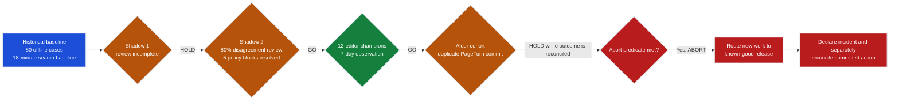

# Rollout and Change Management

This chapter teaches you to turn release evidence into bounded customer exposure.
You establish the historical human baseline, replay a candidate in shadow mode,
review disagreements by slice, select a canary cohort, hold an observation window,
and record a go, hold, abort, or rollback decision with named owners.

The running case is the frozen synthetic [Riverside FDE engagement](../shared/README.md).
The notebook does not call a model, cloud service, customer system, or paid API.
Its calculations read committed JSON fixtures and are deterministic.

## Learning outcomes

By the end, you can:

1. Preserve the historical workflow as a baseline without treating every old human decision as correct.
2. Separate aggregate shadow performance from disagreement categories and critical slices.
3. Define cohort entry, exit, observation, ramp, pause, and abort gates before exposure.
4. Assign business, technical, support, security, communications, and go/no-go ownership.
5. Write customer communications that distinguish known facts, unknowns, impact, containment, and the next decision time.
6. Roll deployment traffic back without claiming that committed external actions were undone.
7. Reconcile ambiguous tool outcomes before retrying or compensating.
8. Connect adoption, training, feedback, support load, quality, safety, latency, and cost to customer change management.

## At a glance: Riverside decision flow

Each arrow is a new evidence decision, not permission for every later cohort.



The final rollback changes where new work is routed. It does not erase the
duplicate commit or prove its external outcome; that state remains an incident
reconciliation task with its own evidence and authority.

## Package

| Path | Purpose |
|---|---|
| `rollout-and-change-management.ipynb` | Failure-first chapter; deterministic synthetic execution verified, then cleared |
| `fixtures/rollout-observations-v1.json` | Synthetic shadow, canary, abort, committed-action, and communication-clock observations |
| `templates/rollout-plan-template.md` | Cohorts, gates, windows, ownership, exposure, and health signals |
| `templates/go-no-go-record-template.md` | Auditable `GO`, `HOLD`, `ABORT`, or `ROLLBACK` decision |
| `templates/rollback-compensation-drill-template.md` | Separate deployment restoration from committed-action correction |
| `templates/change-record-template.md` | Versioned customer and technical change record |
| `templates/cohort-communication-template.md` | Invitation, training, support, feedback, and expectation setting |
| `templates/status-and-abort-communication-template.md` | Routine status, pause, abort, rollback, and incident updates |
| `requirements.txt`, `setup.ps1`, `setup.sh` | Local notebook environment; route setup verified |

## Evidence boundary

The shared case labels supplied historical values as `measured_baseline`, modeled
planning inputs as `modeled_assumption`, and safety rules as `policy_constraint`.
This chapter preserves those labels. Calculations over the local observation fixture
are only **synthetic fixture measurements**. They demonstrate gate logic; they do not
show that Riverside, Azure, a model, or a production release achieved the result.

`GO` means the named candidate may advance only to the named next cohort. It is not
permanent approval. `HOLD` means the evidence is incomplete or awaiting disposition.
`ABORT` stops advancement immediately. `ROLLBACK` routes new work to a named known-good
state. None of those decisions erases evidence or reverses a side effect already
committed in PageTurn.

## Common gate failure patterns

| Pattern | [Avoid] Failure mode | [Use] Riverside control |
|---|---|---|
| Aggregate overrides slices | A passing overall score hides a forbidden-access or high-risk workflow failure. | Require every critical slice and global abort predicate to pass; any forbidden access remains an `ABORT`. |
| Observation windows are merged | Evidence from different releases, cohorts, or control states is treated as one continuous window. | Start a new window when release, cohort, policy, index, or material control state changes. |
| Promotion happens early | A good partial window is treated as sufficient evidence. | If `observed_days < canonical_days`, return `HOLD`; elapsed time is a gate, not a projection. |
| Historical decisions are treated as golden labels | Old human choices are assumed correct even when policy or workflow context changed. | Use the baseline for comparison, then review disagreements and policy blocks by slice. |
| An alert is treated as permission | Silence or alert recovery is interpreted as approval to advance. | Require the named gate evidence and authorized decision record; monitoring informs a decision but cannot approve one. |
| Support and user readiness are skipped | Technical metrics pass while users lack fallback, feedback, or escalation routes. | Verify training, manual fallback, feedback, support coverage, and named owners before exposure. |
| Gates are redefined after results arrive | Thresholds or abort precedence are relaxed to fit observed results. | Version gates before exposure. Duplicates, forbidden access, quality, and cost retain their declared precedence; a met abort predicate stops advancement. |

Missing evidence produces `HOLD`, not an inferred pass. A safety or committed-action
abort remains `ABORT` even when aggregate quality, adoption, latency, or cost passes.

## Optional setup

From this directory:

```powershell
.\setup.ps1
```

```bash
./setup.sh
```

Both scripts create `.venv`, install the local notebook dependencies, and register a
kernel unless the skip option is supplied. Route validation verified the environment
and executed the notebook successfully against the synthetic fixtures, producing the
documented `HOLD` and `ABORT` decisions. The outputs were then cleared, leaving
`execution_count: null` and no committed outputs.

## Source contracts

Use these references rather than copying their release or recovery logic:

- [FDE role baseline and engagement lifecycle](../00-role-baseline-and-engagement-lifecycle.md)
- [Agent lifecycle and runtime](../../../agentic-ai-system-design/02-agent-lifecycle-and-runtime.md)
- [Recoverability, rollbacks, and saga](../../../agentic-ai-system-design/10-recoverability-rollbacks-and-saga.md)
- [Riverside evaluation strategy](../../../../projects/riverside-ai-platform/docs/evaluation-strategy.md)
- [Riverside rollback contract](../../../../projects/riverside-ai-platform/docs/rollback.md)
- [Riverside incident response](../../../../projects/riverside-ai-platform/docs/incident-response.md)

## Downstream integration path

Translate `ROL-01` through `ROL-04` into the Riverside [deployment procedure](../../../../projects/riverside-ai-platform/docs/deployment.md), [release-gate datasets and policy](../../../../projects/riverside-ai-platform/evaluations/README.md), [blue/green traffic assets](../../../../projects/riverside-ai-platform/azureml/README.md), and [rollback procedure](../../../../projects/riverside-ai-platform/docs/rollback.md). Map each cohort gate to an exact release, dataset, signal, approver, traffic or feature-control mechanism, known-good target, and observation window. Keep workflow-write compensation separate from model or deployment traffic rollback.

These files are implementation candidates, not retained rollout evidence. A supervised practicum must review the target environment, execute only authorized stages, preserve results, and stop when a gate or authority is missing.

## Completion artifacts

Complete `ROL-01` through `ROL-04` and at least one `CHG-*` record:

- `ROL-01`: rollout plan with cohorts, observation windows, health signals, and owners;
- `ROL-02`: historical baseline, shadow disagreement, and canary cohort report;
- `ROL-03`: go/no-go record with decision authority and retained evidence;
- `ROL-04`: timed rollback and compensation drill;
- `CHG-*`: customer-facing change record and communications.

The chapter is complete only when the package explains who decides, what evidence
changes exposure, how customers are prepared, how new work is stopped, and how
committed actions are reconciled or corrected.
