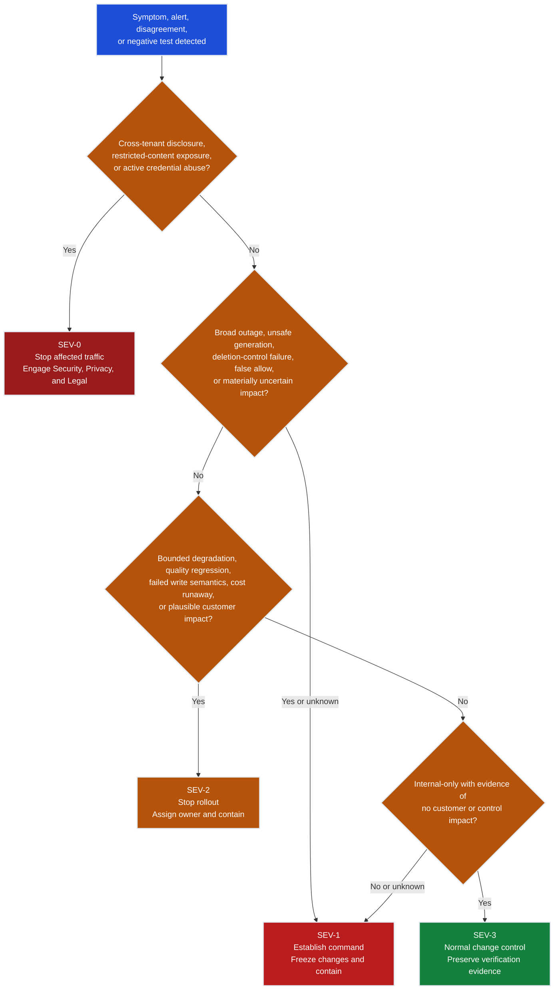

# Incident Response and Recovery

This chapter teaches the customer-facing recovery work that begins when a
Riverside alert, disagreement, or negative test suggests the system may be
unsafe. The order is deliberate: contain the narrow unsafe path, preserve
evidence, classify plausible impact, communicate verified facts, test competing
causes, remediate, rerun gates, obtain re-enablement approval, and then learn.

The chapter is a synthetic exercise package. It does not activate paging,
authorize a production change, satisfy a notification duty, create legal
privilege, or prove that any organization can recover a real service.

## Learning contract

By the end, you should be able to:

1. Choose reversible containment without bypassing identity, policy, residency,
   redaction, or audit controls.
2. Preserve content-free evidence references, provenance, access history, and a
   UTC decision timeline before changing suspect state.
3. Assign severity from known and plausible impact, start high when uncertainty
   is material, and downgrade only with evidence.
4. Write redacted internal and customer updates that separate facts,
   hypotheses, unknowns, impact, containment, and the next update time.
5. Triage policy, data, retrieval, model, tool, identity, and infrastructure
   boundaries with discriminating tests rather than component blame.
6. Define incident-specific regression gates, adjacent-workflow checks,
   negative authorization tests, telemetry checks, and an observation window.
7. Route re-enablement to the incident commander and the owners with actual
   authority over the affected workflow, control, service, and customer scope.
8. Produce a blameless postmortem whose actions are verified by tests, alerts,
   controls, drills, or owned process changes rather than prose alone.

## Prerequisites and links

Start with the [FDE route contract](../README.md), the
[role boundary and lifecycle gates](../00-role-baseline-and-engagement-lifecycle.md),
and the frozen [Shared Riverside FDE Case](../shared/README.md). This chapter
uses, rather than repeats:

- [Reliability, Recovery, and Production Decisions](../../../agentic-ai/09-reliability-recovery-and-production-decisions/09-reliability-recovery-and-production-decisions.ipynb)
- [Observability, Tracing, and Agent Health](../../../agentic-ai-system-design/08-observability-tracing-and-health.md)
- [Recoverability, Rollbacks, and Saga](../../../agentic-ai-system-design/10-recoverability-rollbacks-and-saga.md)
- [Governance, Guardrails, and Security](../../../agentic-ai-system-design/11-governance-guardrails-and-security.md)
- [Riverside project incident framework](../../../../projects/riverside-ai-platform/docs/incident-response.md)

Those sources explain tracing, rollback, compensation, policy, and generic
operations. This chapter practices the FDE-specific customer boundary: scoped
containment, partial and redacted evidence, truthful updates, cross-owner
approval, and handoff-ready learning.

## Incident domain map

| Exercise ID | Boundary | Riverside example | First containment | Verification gate |
|---|---|---|---|---|
| `IRX-RIV-001` | Policy | Guidance overrides consent or workflow limits | Disable guidance; retain the approved manual or bounded continuation path | Workflow and policy audit |
| `IRX-RIV-002` | Data | A document version exposes a confidential snippet | Quarantine the version; restore prior index records | Bounded content and provenance scan |
| `IRX-RIV-003` | Identity | A disabled contractor can still access the EU route | Disable the route for that identity class and revoke access | Negative permission recheck |
| `IRX-RIV-004` | Model | A generated answer violates a rights-policy constraint | Require evidence-backed approval or abstention | Policy negative test |
| `IRX-RIV-005` | Tool | PageTurn produces duplicate committed transitions | Pause writes; query and reconcile committed state | Query by idempotency or workflow key |
| `IRX-RIV-006` | Infrastructure | A confidential path uses an unapproved processing node | Fail closed; retain only an approved degraded mode | Trace confirms approved nodes and region |
| `IRX-RIV-007` | Retrieval | Teaching-only index promotion includes a disallowed version | Stop promotion; pin the last-known-good index | Retrieval negative test and provenance scan |

Exercises 1 through 6 are frozen Riverside scenario facts. `IRX-RIV-007` is
`exercise_only_derived`: use it to practice retrieval triage, but never cite it
as a Riverside customer incident or measured production evidence.

## Package map

| File | Use |
|---|---|
| `incident-response-and-recovery.ipynb` | Lesson and visual decision paths; synthetic execution verified, then cleared |
| `incidents/incident-scenarios-v1.json` | Seven synthetic policy/data/retrieval/model/tool/identity/infrastructure scenarios |
| `templates/incident-record.md` | Command, scope, timeline, evidence, hypothesis, decision, and recovery record |
| `templates/customer-update.md` | Redacted internal-review and customer-update structure |
| `templates/reenablement-decision.md` | Regression, observation, residual-risk, authority, and rollback-ready decision |
| `templates/postmortem.md` | Blameless causal review and verified corrective-action plan |
| `requirements.txt` | Minimal local notebook dependencies |
| `setup.ps1`, `setup.sh` | Environment and kernel setup; route setup verified |

## Scenario provenance

The frozen Riverside engagement contains six canonical incidents:

| Exercise | Domain | Frozen anchor | First containment posture |
|---|---|---|---|
| `IRX-RIV-001` | Policy | `INC-RIV-001` | Disable workflow guidance, retain bounded continuation |
| `IRX-RIV-002` | Data | `INC-RIV-002` | Quarantine the document version and restore prior index records |
| `IRX-RIV-003` | Identity | `INC-RIV-003` | Disable the EU route, revoke identity, engage Security and Legal |
| `IRX-RIV-004` | Model | `INC-RIV-004` | Require evidence-backed rights answers or abstention |
| `IRX-RIV-005` | Tool | `INC-RIV-005` | Pause writes, reconcile state, retain read-only assistance |
| `IRX-RIV-006` | Infrastructure | `INC-RIV-006` | Fail closed for confidential requests; use only approved degraded mode |
| `IRX-RIV-007` | Retrieval | Exercise-only variation | Stop promotion, pin the last-known-good index, require abstention |

`IRX-RIV-007` is deliberately labeled `exercise_only_derived`. It is useful for
separating ingestion/index/filter failures from model behavior, but it is not a
new Riverside customer fact. Never cite it as measured production evidence.

## Response loop

```mermaid
flowchart LR
    D["Declare and assign command"] --> C["Contain unsafe exposure"]
    C --> E["Preserve evidence"]
    E --> S["Classify severity"]
    S --> M["Communicate known and unknown"]
    M --> T["Test competing causes"]
    T --> R["Remediate narrowly"]
    R --> G["Run regression gates"]
    G --> A{"Authorized approval?"}
    A -->|No| C
    A -->|Yes| O["Observe bounded re-enablement"]
    O --> P["Postmortem and verify actions"]

    style D fill:#1e3a8a,stroke:#e2e8f0,stroke-width:2px,color:#ffffff
    style C fill:#b91c1c,stroke:#e2e8f0,stroke-width:2px,color:#ffffff
    style E fill:#1d4ed8,stroke:#e2e8f0,stroke-width:2px,color:#ffffff
    style S fill:#b45309,stroke:#e2e8f0,stroke-width:2px,color:#ffffff
    style M fill:#1d4ed8,stroke:#e2e8f0,stroke-width:2px,color:#ffffff
    style T fill:#1d4ed8,stroke:#e2e8f0,stroke-width:2px,color:#ffffff
    style R fill:#b45309,stroke:#e2e8f0,stroke-width:2px,color:#ffffff
    style G fill:#b45309,stroke:#e2e8f0,stroke-width:2px,color:#ffffff
    style A fill:#b45309,stroke:#e2e8f0,stroke-width:2px,color:#ffffff
    style O fill:#15803d,stroke:#e2e8f0,stroke-width:2px,color:#ffffff
    style P fill:#15803d,stroke:#e2e8f0,stroke-width:2px,color:#ffffff
```



Recovery is a new exposure decision, not the inverse of containment. A repaired
component stays disabled until the relevant gates pass and authorized owners
accept residual risk. A deployment rollback does not undo a committed PageTurn
transition; that needs reconciliation, compensation, correction, or escalation.

## Severity posture

The lesson uses the draft Riverside model below. Actual response windows and
notification obligations need approval before go-live.

| Severity | Plausible impact | Initial posture |
|---|---|---|
| `SEV-0` | Confirmed cross-tenant disclosure, restricted-content exposure, or actively abused credential compromise | Stop affected traffic, engage security/privacy/legal, preserve evidence |
| `SEV-1` | Broad outage, sustained deadline failure, unsafe customer-visible generation, deletion-control failure, or false allow with material uncertainty | Establish command, freeze changes, contain or roll back |
| `SEV-2` | Bounded degradation, quality regression, cost runaway, failed write semantics, or a pre-production control failure with plausible customer impact | Stop rollout, assign owner, contain within approved controls |
| `SEV-3` | Internal-only defect or non-urgent operational gap with no evidence of customer/control impact | Track through normal change control while preserving enough evidence to verify scope |

When impact is uncertain, start at the higher plausible severity. Record what
new evidence would justify a downgrade. Severity is an incident-command
decision, not a confidence score produced by the notebook.

## Severity decision tree



> **Severity rule:** When impact is uncertain, start at the higher plausible
> severity and record the evidence required to downgrade. Only verified facts
> justify a downgrade; confidence, silence, or elapsed time does not.

## Communication rules

Every update answers five questions: what is known, what is unknown, what scope
is affected, what is contained, and when the next update arrives. Use UTC and
evidence-backed scope.

Do not include manuscript text, prompts, outputs, tokens, raw user/customer IDs,
credentials, access tokens, unapproved personal data, legal conclusions,
speculative root cause, unsupported recovery times, or blame. Use stable incident
and evidence references. Put restricted technical detail in the approved
evidence system, not in a broad status channel.

## Organizational and legal boundary

The FDE can establish technical facts, recommend containment, preserve approved
evidence, draft communications, design regression gates, and identify affected
systems. The FDE does not unilaterally:

- decide whether law, contract, regulation, cyber insurance, or a regulator
  requires notification;
- determine privilege, breach status, data-subject impact, sanctions, or legal
  wording;
- approve risky evidence export, credential scope, residency exception, or
  production re-enablement;
- promise customer recovery time, compensation, root cause, or a complete blast
  radius before evidence supports it.

Route those decisions to authorized legal, privacy, security, communications,
service, business, and customer owners. If the owner or process is missing,
record that as an operational readiness gap and keep exposure bounded.

## Local setup

The route environment and synthetic notebook execution have been verified. To
perform and retain your own exercise run, use one platform-specific setup script
from this directory:

```powershell
.\setup.ps1
```

```bash
./setup.sh
```

Both scripts create a chapter-local `.venv`, install `requirements.txt`,
register `fde-07-incident-response`, and assign it to this chapter's notebook.
Use `-SkipKernel` or `--skip-kernel` to install without kernel registration.

## Downstream integration path

Map the exercise records into the Riverside [incident framework](../../../../projects/riverside-ai-platform/docs/incident-response.md), [operations runbook](../../../../projects/riverside-ai-platform/docs/operations-runbook.md), [rollback contract](../../../../projects/riverside-ai-platform/docs/rollback.md), and [evaluation/release gates](../../../../projects/riverside-ai-platform/evaluations/README.md). For each scenario, identify the real paging route, evidence store, containment control, communications approval path, regression dataset, release identity, and re-enablement authority before a drill begins.

The authored scenario package is teaching-only. Incident command, notification decisions, production containment, customer messaging, and re-enablement must be supervised and authorized; source procedures do not prove that paging, evidence access, recovery, or communications work.

## Completion evidence

A completed exercise package contains:

1. An incident record with command roles, severity basis, bounded scope, a UTC
   timeline, evidence references, and separate facts/hypotheses.
2. A customer update that passes redaction and approval review.
3. A remediation decision with positive, negative, adjacent, telemetry, and
   rollback checks.
4. A re-enablement record naming observation windows, residual risks, approvers,
   and automatic stop conditions.
5. A postmortem whose corrective actions have owners, dates, expiry where
   relevant, and completion evidence.

Synthetic local work can establish constructed or demonstrated skill. It cannot
create customer validation, legal approval, or production recovery evidence.
