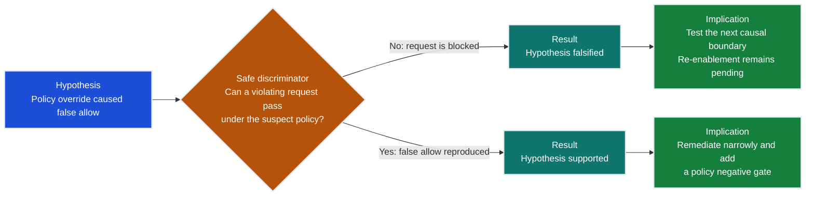

# Incident Record: `<INCIDENT-ID>`

> Classification: `<approved handling label>`
> Status: `DECLARED | CONTAINED | INVESTIGATING | REMEDIATING | OBSERVING | CLOSED`
> All timestamps use UTC. Store sensitive evidence in the approved evidence system; put references here.

## Command and authority

| Role | Named person or rota | Authority in this incident | Handoff time (UTC) |
|---|---|---|---|
| Incident commander | `<name/role>` | Severity, priorities, decisions, handoffs | `<timestamp>` |
| Operations lead | `<name/role>` | Approved mitigations and service checks | `<timestamp>` |
| Security/privacy lead | `<name/role or N/A with reason>` | Disclosure, access, evidence handling | `<timestamp>` |
| Data/model/retrieval/tool lead | `<name/role>` | Boundary-specific investigation | `<timestamp>` |
| Communications lead | `<name/role>` | Approved internal/external updates | `<timestamp>` |
| Scribe | `<name/role>` | UTC timeline and evidence references | `<timestamp>` |
| Customer decision owner | `<name/role>` | Customer-scope re-enablement decision | `<timestamp>` |

One person may hold multiple roles in a small incident. Record that explicitly.
High-risk production changes require the approved second reviewer.

## Declaration

| Field | Record |
|---|---|
| Declared at (UTC) | `<timestamp>` |
| Detected at (UTC) | `<timestamp>` |
| Reporter/detector | `<monitor, test, role, or stable reference>` |
| Initial severity | `<SEV-0 through SEV-3>` |
| Severity decision owner | `<incident commander>` |
| Next update due (UTC) | `<timestamp>` |
| Environment/region | `<bounded value>` |
| Release/index/policy/config | `<stable IDs only>` |
| Affected tenant/workflow slice | `<bounded scope or UNKNOWN>` |
| Last known-good state | `<stable IDs and time>` |
| Change freeze scope | `<deploy/index/policy/data/config/jobs>` |

## Facts, hypotheses, and unknowns

### Verified facts

| Fact ID | Observed statement | Evidence reference | Observed at (UTC) | Limitation |
|---|---|---|---|---|
| `FACT-01` | `<one bounded statement>` | `<approved reference>` | `<timestamp>` | `<what it does not establish>` |

### Competing hypotheses

> A hypothesis is useful only when a cheap, safe check can falsify it. A statement
> that is never tested remains a guess and cannot support remediation or recovery.

| Hypothesis ID | Causal boundary | Falsifiable statement | Discriminating check | Result/evidence | Status | Decision pending? |
|---|---|---|---|---|---|---|
| `HYP-01` | `<policy/data/retrieval/model/tool/identity/infrastructure>` | `<claim>` | `<cheapest safe check>` | `<pending or approved reference>` | `OPEN | SUPPORTED | FALSIFIED | UNKNOWN` | `YES: <gate/decision> | NO: <reason>` |

A `SUPPORTED` result narrows the remediation target but is not proof of a sole root
cause. A `FALSIFIED` result closes only the tested statement. `UNKNOWN` and unresolved
decision-relevant hypotheses keep the affected exposure contained.

### Unknowns

| Unknown | Why it matters | Owner | Needed by | Exposure blocked until known? |
|---|---|---|---|---|
| `<unknown>` | `<decision affected>` | `<role>` | `<timestamp/milestone>` | `YES | NO with reason` |

## Impact and severity basis

| Dimension | Known impact | Plausible impact under uncertainty | Evidence needed to narrow scope |
|---|---|---|---|
| Confidentiality/isolation | `<fact or NONE KNOWN>` | `<bounded plausible impact>` | `<query/test>` |
| Integrity/policy | `<fact or NONE KNOWN>` | `<bounded plausible impact>` | `<query/test>` |
| Availability/deadline | `<fact or NONE KNOWN>` | `<bounded plausible impact>` | `<query/test>` |
| Side effects/workflow | `<fact or NONE KNOWN>` | `<bounded plausible impact>` | `<reconciliation>` |
| Residency/compliance | `<fact or UNKNOWN>` | `<bounded plausible impact>` | `<authorized review>` |
| Customer/business | `<fact or UNKNOWN>` | `<bounded plausible impact>` | `<workflow-owner review>` |

Severity rationale: `<why this is the highest plausible current severity>`

Downgrade gate: `<specific evidence required; never “we feel confident”>`

## Containment record

| Decision ID | Time (UTC) | Unsafe path stopped | Action | Reversible? | Preserved safe path | Owner/approver | Evidence |
|---|---|---|---|---|---|---|---|
| `DEC-01` | `<timestamp>` | `<path>` | `<disable/pin/revoke/pause/rollback>` | `YES | NO` | `<bounded function or NONE>` | `<roles>` | `<reference>` |

Containment invariants:

- Authentication, authorization, policy, residency, redaction, and audit remain fail-closed.
- Suspect deployments, indexes, artifacts, and logs are not deleted before preservation and rollback needs are decided.
- Production teardown is not used as mitigation.
- A deployment rollback is not recorded as compensation for an already committed action.

## Evidence manifest and custody

| Evidence ID | Type | Stable source reference | Time range (UTC) | Collected by | Method/tool version | Integrity reference | Approved storage | Access list | Retention/legal hold owner |
|---|---|---|---|---|---|---|---|---|---|
| `EVD-01` | `<trace/config/index/audit/communication>` | `<reference, not content>` | `<range>` | `<role>` | `<method/version>` | `<hash/signature/reference>` | `<location>` | `<roles>` | `<authorized owner>` |

Redaction note: `<what was excluded or tokenized>`

Evidence handling exceptions: `<NONE or approved decision reference>`

## UTC timeline

| Event time | Observed/recorded time | Actor/source | Type | Fact or decision | Evidence/decision reference |
|---|---|---|---|---|---|
| `<timestamp>` | `<timestamp>` | `<role/system>` | `DETECTION | CONTAINMENT | EVIDENCE | TEST | COMMUNICATION | APPROVAL` | `<bounded text>` | `<reference>` |

Record event time separately from when the team learned about it. Never rewrite
earlier entries; append corrections and link the superseded statement.

## Communication log

| Time (UTC) | Audience | Approved by | Template/version | Scope stated | Next update | Reference |
|---|---|---|---|---|---|---|
| `<timestamp>` | `<internal/customer/vendor/regulator>` | `<role>` | `<version>` | `<bounded scope>` | `<timestamp>` | `<reference>` |

## Remediation and regression gates

Remediation: `<smallest change that addresses the supported cause>`

| Gate ID | Category | Test population and release/config | Pass criterion | Evidence | Owner | Result |
|---|---|---|---|---|---|---|
| `GATE-01` | Positive behavior | `<scope>` | `<criterion>` | `<reference>` | `<role>` | `PENDING | PASS | FAIL` |
| `GATE-02` | Negative authorization/policy | `<forbidden slice>` | `<zero false allows or approved criterion>` | `<reference>` | `<role>` | `PENDING | PASS | FAIL` |
| `GATE-03` | Adjacent workflow | `<unaffected slice>` | `<no unacceptable regression>` | `<reference>` | `<role>` | `PENDING | PASS | FAIL` |
| `GATE-04` | Telemetry/redaction | `<signal set>` | `<detection works; prohibited content absent>` | `<reference>` | `<role>` | `PENDING | PASS | FAIL` |
| `GATE-05` | Rollback/compensation readiness | `<bounded drill>` | `<target and owner verified>` | `<reference>` | `<role>` | `PENDING | PASS | FAIL` |

## Re-enablement and closure

Re-enablement decision record: `<link to templates/reenablement-decision.md instance>`

Observation window: `<duration, traffic/cohort, signals, automatic stop conditions>`

Temporary controls with owner and expiry: `<list or NONE>`

Customer impact ended at (UTC): `<timestamp or UNKNOWN>`

Closure approved by: `<incident commander and required owners>`

Postmortem due: `<date/time>`

## Health check

- [ ] Command, severity owner, and next update time are named.
- [ ] Unsafe exposure is contained without weakening a control.
- [ ] Facts, hypotheses, and unknowns are separate.
- [ ] Evidence uses approved references, custody, access, and retention fields.
- [ ] Timeline distinguishes event time from observation time.
- [ ] Communications are approved, bounded, and redacted.
- [ ] Regression gates include negative and adjacent cases.
- [ ] Re-enablement has authority, residual risk, observation, and rollback readiness.
- [ ] Temporary controls have owners and expiry.
- [ ] Postmortem actions will require completion evidence.
