# Re-enablement Decision: `<INCIDENT-ID>`

> Decision: `HOLD | APPROVE BOUNDED RE-ENABLEMENT | REVERT TO CONTAINMENT`
> A repaired component is not automatically authorized for production exposure.

## Scope and authority

| Field | Record |
|---|---|
| Decision time (UTC) | `<timestamp>` |
| Release/index/policy/config | `<stable IDs>` |
| Tenant/workflow/cohort | `<bounded scope>` |
| Requested exposure | `<percentage/users/functions/regions>` |
| Incident commander | `<name/role>` |
| Affected service/control owners | `<names/roles>` |
| Customer decision owner | `<name/role>` |
| Security/privacy/legal approval | `<reference or N/A with authorized rationale>` |

## Preconditions

| Precondition | Evidence reference | Owner | Result |
|---|---|---|---|
| Containment remains available and tested | `<reference>` | `<role>` | `PASS | FAIL` |
| Supported cause is addressed or bounded | `<reference>` | `<role>` | `PASS | FAIL` |
| Positive behavior gate passes | `<reference>` | `<role>` | `PASS | FAIL` |
| Negative authorization/policy gate passes | `<reference>` | `<role>` | `PASS | FAIL` |
| Adjacent workflows show no unacceptable regression | `<reference>` | `<role>` | `PASS | FAIL` |
| Telemetry detects recurrence without prohibited content | `<reference>` | `<role>` | `PASS | FAIL` |
| Rollback, pause, revoke, or compensation path is ready | `<reference>` | `<role>` | `PASS | FAIL` |
| Customer communication is approved | `<reference>` | `<role>` | `PASS | FAIL` |

Any failed mandatory precondition yields `HOLD`. Record an explicit exception
authority and exposure limit if organizational policy permits an exception;
silence is not approval.

## Residual risk

| Risk | Evidence/uncertainty | Accepted scope | Owner with authority | Expiry/revalidation trigger |
|---|---|---|---|---|
| `<risk>` | `<reference>` | `<bounded exposure>` | `<role>` | `<time/change/event>` |

## Observation plan

| Field | Record |
|---|---|
| Observation window | `<duration and UTC bounds>` |
| Cohort/traffic limit | `<bounded value>` |
| Signals and slices | `<availability, quality, policy, retrieval, side effect, cost>` |
| Signal owners | `<roles>` |
| Automatic stop conditions | `<specific thresholds/events>` |
| Next decision time | `<UTC timestamp>` |
| Customer update cadence | `<times or trigger>` |

## Decision

Decision rationale: `<evidence-backed statement>`

Approved temporary controls: `<control, owner, expiry, removal gate>`

Rollback/containment target: `<stable target and execution owner>`

Approvals:

| Role | Decision | Conditions | Reference/time |
|---|---|---|---|
| Incident commander | `APPROVE | HOLD` | `<conditions>` | `<reference>` |
| Service/control owner | `APPROVE | HOLD` | `<conditions>` | `<reference>` |
| Security/privacy/legal, when applicable | `APPROVE | HOLD | N/A` | `<conditions/rationale>` | `<reference>` |
| Customer decision owner | `APPROVE | HOLD` | `<conditions>` | `<reference>` |

## Re-enablement ladder

Advance one bounded phase at a time. Each phase needs its own retained gate evidence,
authority, observation window, and automatic stop conditions.

```mermaid
flowchart LR
	R["Remediation verified<br/>Containment remains ready"] --> P1["Phase 1<br/>Lab/internal only"]
	P1 --> O1["Observe declared<br/>signals and slices"]
	O1 --> G1{"All gates pass?"}
	G1 -->|No or unknown| C["Return to containment<br/>Preserve evidence"]
	G1 -->|Yes, approved| P2["Phase 2<br/>Named pilot"]
	P2 --> O2["Observe declared<br/>signals and slices"]
	O2 --> G2{"All gates pass?"}
	G2 -->|No or unknown| C
	G2 -->|Yes, approved| P3["Phase 3<br/>Regional or role expansion"]
	P3 --> O3["Observe declared<br/>signals and slices"]
	O3 --> G3{"All gates pass?"}
	G3 -->|No or unknown| C
	G3 -->|Yes, approved| P4["Phase 4<br/>Full approved scope"]

	style R fill:#1d4ed8,stroke:#e2e8f0,stroke-width:2px,color:#ffffff
	style P1 fill:#15803d,stroke:#e2e8f0,stroke-width:2px,color:#ffffff
	style P2 fill:#15803d,stroke:#e2e8f0,stroke-width:2px,color:#ffffff
	style P3 fill:#15803d,stroke:#e2e8f0,stroke-width:2px,color:#ffffff
	style P4 fill:#15803d,stroke:#e2e8f0,stroke-width:2px,color:#ffffff
	style O1 fill:#0f766e,stroke:#e2e8f0,stroke-width:2px,color:#ffffff
	style O2 fill:#0f766e,stroke:#e2e8f0,stroke-width:2px,color:#ffffff
	style O3 fill:#0f766e,stroke:#e2e8f0,stroke-width:2px,color:#ffffff
	style G1 fill:#b45309,stroke:#e2e8f0,stroke-width:2px,color:#ffffff
	style G2 fill:#b45309,stroke:#e2e8f0,stroke-width:2px,color:#ffffff
	style G3 fill:#b45309,stroke:#e2e8f0,stroke-width:2px,color:#ffffff
	style C fill:#b91c1c,stroke:#e2e8f0,stroke-width:2px,color:#ffffff
```

### Re-enablement checklist

- [ ] Remediation: the defect is fixed or bounded, and the regression test is retained in CI/CD or the approved gate system.
- [ ] Regression gates: the negative test prevents recurrence and adjacent workflows have been checked.
- [ ] Residual risk: uncertainty is documented, monitored, bounded, and assigned to an authorized owner.
- [ ] Authority: the incident commander, workflow owner, and required control/customer owners sign off for this phase.
- [ ] Observation window: duration, population, signals, slices, and next decision time are declared per phase.
- [ ] Automatic stop: signal `<X>` crossing threshold `<Y>` invokes `<containment/revert action>` without waiting for promotion approval.
- [ ] Temporary controls: each control has an owner, expiry, and removal or revalidation gate.

No checklist item converts an `UNKNOWN` or failed mandatory precondition into a pass.
Rollback of deployment traffic, containment of the unsafe path, and correction of an
already committed external action remain separate records and operations.

## Health check

- [ ] Every mandatory precondition has retained evidence.
- [ ] Negative authorization/policy checks are included, not only happy paths.
- [ ] Residual risks have authorized owners and expiry.
- [ ] Exposure is bounded and automatically stoppable.
- [ ] Observation signals have owners and a next decision time.
- [ ] Rollback, containment, and committed-action correction are not conflated.
- [ ] Required service, control, incident, and customer approvals are recorded.
