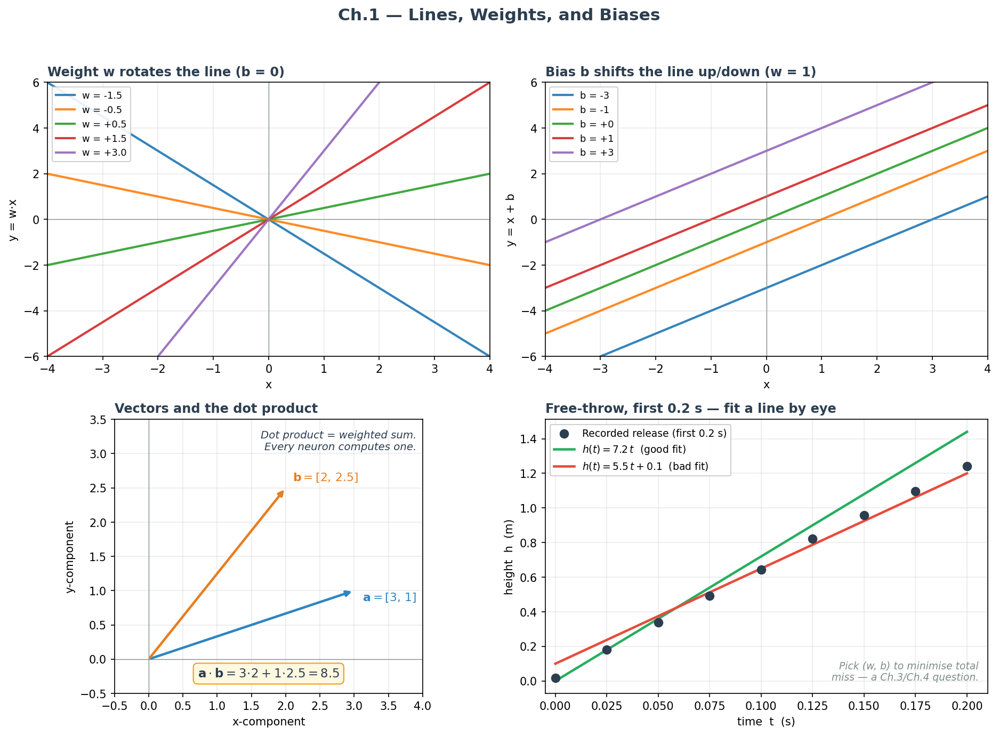
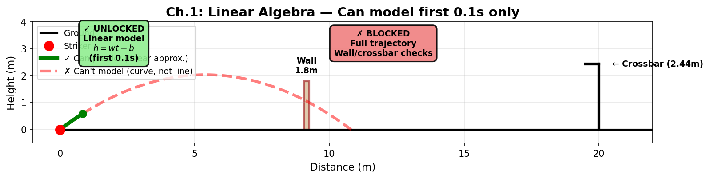

# Ch.1 — Linear Algebra: Lines, Weights, and Biases

> **The story.** Around 300 BCE, Euclid wrote *Elements* and gave geometry its first axioms — the word *linear* descends from the Latin *linea*, "a line," and Euclid's straight line is still the object we are about to fit. The algebra came later: in 820 CE the Persian mathematician al-Khwārizmī wrote *al-Kitāb al-mukhtaṣar fī ḥisāb al-jabr* — the book that gave us the word "algebra" and the first systematic recipe for solving equations like $y = wx + b$. Eight centuries on, Descartes and Fermat in the 1630s glued geometry and algebra together with coordinates: every line was now an equation, every equation a line. That coordinate-and-equation pair is the entire mathematical machinery of this chapter — and, scaled up, the entire machinery of linear regression.
>
> **Where you are in the curriculum.** This is chapter one. You bring high-school algebra; you leave with the geometric intuition for $y = wx + b$ that every later chapter (gradients, matrices, neural networks) is going to lean on. The running example is a football striker lining up a direct **knuckleball free kick** — struck with almost no spin, so the ball's path is governed by gravity alone. The goal is 20 m away, the crossbar 2.44 m off the ground. In the first **0.1 seconds** after the boot leaves the ball, the ball rises *almost* in a straight line — fast enough that gravity's curve is still invisible. That is the regime where a single equation $y = wx + b$ tells us everything, and where every idea in machine learning is simplest to see.
>
> **Notation in this chapter.** $w$ — slope (the *weight* in ML); $b$ — intercept (the *bias*); $\hat{y}$ — the model's predicted output; $\mathbf{x}=[x_1,\dots,x_d]$ — input feature vector; $\mathbf{w}$ — weight vector; $\mathbf{a}\cdot\mathbf{b}=\sum_i a_i b_i$ — dot product; $\|\mathbf{a}\|$ — Euclidean norm (length of a vector); $\theta$ — angle between two vectors; $h(t)$ — ball height at time $t$ in the running example.

---

## 0 · The Challenge — Where We Are

## Animation

> *Animation placeholder — see `img/ch01_linear_algebra-animation.gif` — generated by needle-builder agent.*

> **The goal**: Score a free kick that clears a 1.8m wall at 9.15m distance and dips under a 2.44m crossbar at 20m, while beating the keeper's reaction time.

> **Practitioner angle** — When your embedding layer outputs near-identical vectors for different inputs, you are looking at a rank collapse — a linear algebra failure. Spotting it requires reading a covariance matrix as confidently as you read a loss curve. Every time a neural network learns garbage features, the culprit is usually a linear transformation that collapsed the input space.

**What we know so far:**
- We can kick a ball
- We have no way to predict where it will go
- We don't know if our kick will clear the wall
- We don't know if it will go under the crossbar

**What's blocking us:**
We need a **mathematical model** that connects "what we control" (kick parameters) to "what we want to predict" (ball height at different times/distances). Without this, we're guessing blind.

**What this chapter unlocks:**
The simplest possible model — a **straight line** $h(t) = wt + b$. This only works for the first 0.1 seconds (before gravity bends the path), but it teaches us the vocabulary:
- How to write an equation that **predicts** an output from an input
- How **parameters** (w, b) control the prediction
- How **features** (time, distance, angle, speed) feed into the model

**Reality check:** A straight line can't solve the full challenge (the ball actually follows a parabola). But every complex model — neural networks included — is built from these linear pieces. Master this chapter and you've mastered the foundation.

---

## 1 · Core Idea

A **line** is a two-parameter object. Pick any two numbers $w$ and $b$ and you have a line:

$$y = w x + b$$

The first number, $w$, tilts the line. The second, $b$, shifts it up or down. Every linear model in machine learning — from single-variable regression to the 175-billion-parameter matrix in GPT's first linear layer — is a direct generalisation of this one equation.

---

## 2 · Running Example

A striker wants to score a direct knuckleball free kick from 20 m, clearing a defensive wall at 9.15 m (10 yd) and dipping the ball under the 2.44 m crossbar. The full trajectory is a parabola (that's Ch.2). But in the *first 0.1 seconds* after the boot strikes the ball, gravity has not yet bent the path noticeably, and the ball's height $h$ as a function of time $t$ is well-approximated by:

$$h(t) \approx v_{0y} t + h_0$$

where $v_{0y}$ is the vertical component of the release velocity and $h_0$ is the release height (for a ball on the turf, $h_0 = 0$). Written in ML notation: $w = v_{0y}$ and $b = h_0$. **That is why machine learning calls them weights and biases** — the weight scales the input, the bias is the starting offset. Same equation, different name tags.

---

## 3 · Math

### 3.1 · The equation of a line — three equivalent framings

| Framing | Equation | Where you see it |
|---|---|---|
| Slope–intercept | $y = m x + c$ | High-school algebra |
| Physics | $h(t) = v t + h_0$ | Projectile motion |
| Machine learning | $\hat{y} = w x + b$ | Every neural network |

Same object, same two parameters, different traditions. Once you see that, most ML papers become one translation away from a physics textbook.

### 3.2 · Vectors — a list of numbers with a job

A **vector** is an ordered list of numbers. For us there are two jobs:

1. **A point or direction in space.** The vector $[3, 1]$ points 3 right and 1 up.
2. **A bag of features.** The vector $[v_0, \theta, h_0, m, \ldots]$ describes one free-kick attempt — release speed, launch angle, foot height, ball mass, and so on.

Both jobs are just lists of numbers — what you do with them depends on the problem.

### 3.3 · The dot product — one operation, everywhere

Given two vectors $\mathbf{a} = [a_1, a_2, \ldots, a_d]$ and $\mathbf{b} = [b_1, b_2, \ldots, b_d]$:

$$\mathbf{a}\cdot\mathbf{b} = \sum_{i=1}^{d} a_i b_i = \|\mathbf{a}\| \|\mathbf{b}\| \cos\theta$$

Two readings of the *same* number:

- **Algebraic.** A weighted sum: multiply matching entries, add them up.
- **Geometric.** Scalar measuring how much $\mathbf{a}$ and $\mathbf{b}$ agree. Positive = same direction. Zero = perpendicular. Negative = opposite.

The dot product is the single most-used operation in ML. A neuron is a dot product plus a bias plus a non-linearity. Attention (ML Ch.17–18) is dot products. Cosine similarity in embedding search is a dot product. `np.dot(a, b)` in Python.

### 3.4 · From one feature to many — the general linear equation

When you have $d$ features $\mathbf{x} = [x_1, x_2, \ldots, x_d]$ and a weight per feature $\mathbf{w} = [w_1, w_2, \ldots, w_d]$:

$$\hat{y} = \mathbf{w}\cdot\mathbf{x} + b = w_1 x_1 + w_2 x_2 + \cdots + w_d x_d + b$$

This is just Section 3.1's equation with more terms. Every "linear" model — linear regression, logistic regression, the first layer of any MLP — is this equation. Chapter 5 will rewrite it in matrix form so we can apply it to thousands of samples at once; right now, it's a scaled and shifted sum.

### 3.5 · Worked Example — The First 0.1 Seconds by the Numbers

Let's trace the **§3.1 equation** $h(t) = wt + b$ with actual measurements from the free-kick launch. Given $w = v_{0y} = 6.5$ m/s (vertical release speed) and $b = h_0 = 0$ m (ball on turf):

| Time $t$ (s) | Predicted height: $h(t) = 6.5 \cdot t + 0$ | Calculation |
|---|---|---|
| 0.00 | 0.00 m | $6.5 \times 0.00 = 0.00$ |
| 0.03 | 0.195 m | $6.5 \times 0.03 = 0.195$ |
| 0.06 | 0.39 m | $6.5 \times 0.06 = 0.39$ |
| 0.09 | 0.585 m | $6.5 \times 0.09 = 0.585$ |

> **What you're seeing:** At launch ($t = 0$), the ball is on the ground ($h = 0$). After 0.03 seconds, it's climbed 19.5 cm. After 0.06s, 39 cm. The **slope is constant** — every 0.01s adds 6.5 cm of height. That's what "linear" means: fixed rate of change. The weight $w = 6.5$ **is** the rate.

**Now connect to dot product (§3.3).** We can rewrite this prediction as a dot product between a weight vector and a feature vector:

$$h = \mathbf{w} \cdot \mathbf{x} + b = \begin{bmatrix} 6.5 \end{bmatrix} \cdot \begin{bmatrix} t \end{bmatrix} + 0$$

For $t = 0.06$:
$$h = [6.5] \cdot [0.06] + 0 = (6.5 \times 0.06) = 0.39 \text{ m}$$

This is **exactly §3.3's "algebraic" view** of the dot product: multiply matching entries ($6.5 \times 0.06$), add them up (one term here), add the bias (0). When you see `model(x)` in PyTorch or TensorFlow, this multiplication is what's happening under the hood — scaled to millions of parameters, but the same operation.

**Reality check:** This is only valid for the first 0.1 seconds! By $t = 0.5$s, gravity has bent the trajectory into a parabola (Ch.2) and this linear approximation underestimates the height by ~1.2 m. The line $h = 6.5t$ is the tangent to the curve at $t = 0$ — perfect locally, wrong globally.

---

## 4 · Step by Step — fitting a line by eye

1. **Plot the data.** Scatter the $(x_i, y_i)$ points.
2. **Pick a $w$.** Guess the slope that follows the cloud's tilt.
3. **Pick a $b$.** Guess the $y$-intercept: where would the line cross $x=0$?
4. **Draw it. Look.** Which points sit above the line, which below?
5. **Adjust.** If most points are above the line, raise $b$ (or increase $w$). If the line is too steep, lower $w$. Iterate.
6. **Stop when the line "bisects" the cloud.** You have an approximate least-squares fit — without having written a single formula.

Steps 2–5 are literally what gradient descent (Pre-Req Ch.4 and ML Ch.5) automates. Doing it by eye first makes the automated version feel inevitable.

---

## 5 · Key Diagram

Top row: the weight $w$ and the bias $b$ do geometrically *different* jobs — one tilts, one shifts — and every line in two dimensions can be expressed by picking them. Bottom-left: two vectors and their dot product, the operation underneath every weighted sum in ML. Bottom-right: the free-kick running example with two candidate fits — the *criterion* for picking the green one over the red one is the subject of Ch.3 and Ch.4.

---

## 6 · What Can Go Wrong

- **Conflating units.** If release speed is in m/s and launch angle is in degrees, the fitted $w$ carries a unit (e.g. "score per m/s" vs "score per degree"). Plot with labels or you will misread the scale.
- **No bias term.** Dropping $b$ forces the line through the origin — usually wrong. A free kick struck at zero speed does not have a zero outcome score; $b$ carries the baseline.
- **Treating "linear" as "works in a line."** A linear model is *linear in the parameters*, not necessarily in the inputs. That subtlety is the entire subject of Ch.2.
- **Not normalising features.** If feature 1 ranges 0–1 and feature 2 ranges 0–10 000, their weights are on wildly different scales and the model is hard to interpret. Standardise ($x_i \leftarrow (x_i - \mu_i)/\sigma_i$) before eyeballing.

---

## 7 · Exercises

*Three short ones — picking up a tool, not grinding through algebra.*

1. **Translate.** Write $2x - 3y = 6$ in the form $y = wx + b$. What are $w$ and $b$?
2. **Use the widget.** In the notebook, drag $w$ and $b$ to fit the recorded (time, height) samples by eye. How close is your $w$ to the true $v_{0y} = 6.5$?
3. **One-coordinate sensitivity.** If only $x_1$ doubles and the rest of $\mathbf{x}$ stays the same, what happens to $\hat{y} = \mathbf{w}\cdot\mathbf{x} + b$? (One sentence, no algebra needed.)

---

## 8 · Where This Reappears

- **Pre-Req Ch.2** — you keep the same equation but engineer new features $x_1 = x, x_2 = x^2, x_3 = x^3, \ldots$ to fit curves with a linear formula.
- **Pre-Req Ch.5** — matrix form $\mathbf{\hat{y}} = \mathbf{X}\mathbf{w} + b$ handles thousands of samples at once.
- **ML Ch.1 Linear Regression** — adds a *loss function* and an *optimiser* so a computer can pick $w, b$ for you.
- **ML Ch.4 Neural Networks** — a neuron is one line of this chapter plus a non-linearity.
- **ML Ch.17 Attention** — every attention weight is a dot product.

---

## 9 · Progress Check — What We Can Solve Now

**Unlocked capabilities:**
- **Predict the first 0.1 seconds**: We can model $h(t) = 6.5t + 0$ and compute height at $t = 0.03s$ (0.195m), $t = 0.06s$ (0.39m), etc.
- **Understand parameter roles**: We know $w$ (weight) sets the rate of climb, $b$ (bias) sets the starting height
- **Use vectors and dot products**: We can represent multi-feature inputs like $[v_0, \theta, h_0]$ and compute weighted sums
**Still can't solve:**
- **Full trajectory**: The ball follows a parabola, not a line — by $t = 0.5s$, our linear model is off by >1m
- **Wall/crossbar clearance**: We don't have the curve equation needed to check if $h(t=0.6s) > 1.8m$ or $h(t=1.2s) < 2.44m$
- **Apex height**: We can't find "when does the ball reach its peak?" — that requires calculus (Ch.3)
- **Optimal angle**: We have no way to adjust $\theta$ to maximize range or satisfy constraints — that's optimization (Ch.4-6)

**What's next:** Ch.2 gives us **polynomials** (parabolas!) so we can model the full curve $h(t) = at^2 + bt + c$. Then Ch.3 gives us **derivatives** to find the peak and crossing points.

---

## 10 · References

- **[Jon Krohn — Linear Algebra for Machine Learning (YouTube course).](https://www.jonkrohn.com/posts/2021/5/9/linear-algebra-for-machine-learning-complete-math-course-on-youtube)** Segments 1–3 cover everything in this chapter at video pace. Pair with the chapter if a concept still feels slippery.
- **3Blue1Brown — *Essence of Linear Algebra*, episodes 1–2.** Vectors and linear combinations with the best visual grammar available.
- **Strang — *Introduction to Linear Algebra*, §1.1–§1.2.** The formal version of Sections 3.2–3.4 above.
