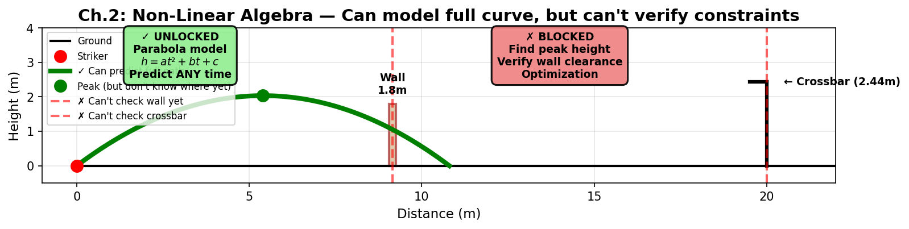

# Ch.2 — Non-Linear Algebra: Polynomials and the Feature-Expansion Trick

> **The story.** Once Descartes and Fermat had pinned curves to equations in the 1630s, mathematicians spent the next two centuries discovering an awkward truth: most real-world phenomena — falling apples, planetary orbits, vibrating strings — are not lines. They are curves. The breakthrough was that you didn't need new mathematics for them; you just needed a *trick*. Treat the curve's shape as a sum of simpler pieces ($1, x, x^2, x^3, \dots$) and the linear machinery of Ch.1 still works — you just have more knobs to turn. That trick is what kept linear regression alive into the 20th century, and it is the same trick that kernel methods (Ch.11) and neural-network feature learning quietly rely on.
>
> **Where you are in the curriculum.** Ch.1 fit a straight line to the *very first* part of the free-kick trajectory. Now we admit gravity. The full trajectory from boot to goal is a parabola, not a line, and a straight line is hopeless as a fit — yet the same linear-regression machinery can fit this parabola exactly. Understanding *why* unlocks every later "non-linear" model in this curriculum, all the way up to deep networks.
>
> **Notation in this chapter.** $x$ — scalar input (e.g. time); $a_n,\dots,a_0$ — polynomial coefficients (the parameters we fit); $n$ — polynomial degree; $\phi(x)=[1,x,x^2,\dots,x^n]$ — basis expansion / *polynomial features* (the trick that makes a curve linear in the parameters); $\mathbf{w}$ — weight vector on the expanded features; $\hat{y}$ — prediction; $t$ — time variable; $y(t)=at^2+bt+c$ — a parabolic curve with parameters $(a, b, c)$.

---

## 0 · The Challenge — Where We Are

## Animation

> 🎬 *Animation placeholder — see `img/ch02_nonlinear_algebra-animation.gif` — generated by needle-builder agent.*

> 🎯 **The goal**: Score a free kick that clears a 1.8m wall at 9.15m distance and dips under a 2.44m crossbar at 20m, while beating the keeper's reaction time.

> ⚡ **Practitioner angle** — When your regression model fits training data perfectly but generalizes poorly, it has overfit a polynomial to noise — the same feature-expansion trick that makes curves tractable also makes them dangerously flexible. Understanding why high-degree polynomials oscillate wildly between data points is what stops you from trusting a low training loss at face value.

**What we know so far:**
- ✅ Ch.1 gave us straight lines: $h(t) = wt + b$
- ✅ We can predict the first 0.1 seconds accurately
- ❌ But the ball follows a **parabola**, not a line — by $t = 0.5s$, our linear model is off by >1m
- ❌ We can't predict when the ball reaches the wall ($t \approx 0.6s$) or goal ($t \approx 1.2s$)
- ❌ We can't check if $h(\text{wall}) > 1.8m$ or $h(\text{goal}) < 2.44m$

**What's blocking us:**
Gravity bends the trajectory into a curve: $h(t) = 6.5t - 4.905t^2$. This is **non-linear in $t$** (has $t^2$ term), so Ch.1's line-fitting won't work. We need a way to fit **curved models** while still using the same linear-algebra machinery.

**What this chapter unlocks:**
The **feature-expansion trick**: Turn the curve $y = at^2 + bt + c$ into a flat plane by creating new features $[t^2, t, 1]$. Now we can use Ch.1's linear regression to fit the parabola perfectly!
- **Can model full trajectory** from boot to goal (not just first 0.1s)
- **Can compute height at any time** — plug in $t = 0.6s$ for wall, $t = 1.2s$ for goal
- **Still can't optimize** (find best angle/speed) — that's Ch.4-6

---

## 1 · Core Idea

$a x^2 + b x + c$ is **non-linear in the input $x$** — plot it and you get a curve. But it is **linear in the coefficients $a, b, c$** — adjust $a$, you get a scaled copy; adjust $c$, you shift. If we invent two new features

$$x_1 = x^2 \qquad x_2 = x$$

then the equation becomes

$$y = a x_1 + b x_2 + c$$

— which is exactly Ch.1's multi-feature linear model. One curve in one dimension has become one *flat plane* in two dimensions. That is **basis expansion** (or, in scikit-learn terminology, **polynomial features**), and it is how "linear" models fit curves.

---

## 2 · Running Example

> 📘 **Physics-Free Path:** If terms like "gravity" or "velocity" feel foreign, here's the translation for this chapter:
> • The formula $y(t) = v_{0y} t - \tfrac{1}{2} g t^2$ is just **a downward-opening parabola** $y(t) = at^2 + bt + c$ where $a = -\tfrac{1}{2}g$, $b = v_{0y}$, $c = 0$.
> • "Apex" = **peak** (where the curve turns over).
> • The three numbers $(a, b, c)$ are **parameters we fit to data** — no physics knowledge needed.

A direct knuckleball free kick from 20 m, with the goal's crossbar at 2.44 m and a defensive wall at 9.15 m. The ball traces a parabolic path:

$$y(t) = v_{0y} t - \tfrac{1}{2} g t^2$$

For our specific kick: $v_{0y} = 6.5$ (vertical launch speed) and $g \approx 9.81$ (constant downward pull). Ch.1 gave us the straight-line approximation valid only for the first 0.1 s. Now we want the whole arc — rise, peak over the wall, and the late dip that drops the ball under the crossbar.

---

## 3 · Math

### 3.1 · Polynomials of degree $n$

A polynomial in one variable:

$$p(x) = a_n x^n + a_{n-1} x^{n-1} + \cdots + a_1 x + a_0$$

| Degree | Shape | Example in the running story |
|---|---|---|
| 0 | horizontal line | constant release height only |
| 1 | straight line | the 0.1 s approximation (Ch.1) |
| 2 | parabola | free-kick trajectory |
| 3 | cubic, one inflection | trajectory with a slight sideways swerve |
| $n$ | up to $n-1$ bends | anything smooth on a finite interval |

**Why this matters.** With enough terms, polynomials can approximate essentially any continuous curve on a bounded interval as closely as you like. That's why they're the first tool out of the box for non-linear fitting — and why `numpy.polyfit` exists.

### 3.2 · Linear *in the parameters* — the key distinction

Compare two statements:

$$(\star)\quad y = 3 x^2 - 2 x + 1 \qquad (\text{non-linear in } x)$$
$$(\dagger)\quad y = 3 x_1 - 2 x_2 + 1 \quad \text{where } x_1 = x^2, x_2 = x \qquad (\text{linear in } x_1, x_2)$$

Both equations produce identical $y$ for every $x$. They are the same curve, written differently. And equation $(\dagger)$ is in Ch.1's form $\hat{y} = \mathbf{w}\cdot\mathbf{x} + b$, with $\mathbf{w} = [3, -2]$ and $b = 1$.

**The trick generalises.** For any polynomial of degree $n$:

$$\hat{y} = a_n x_n + a_{n-1} x_{n-1} + \cdots + a_1 x_1 + a_0 \quad \text{where } x_k = x^k$$

You just *engineered* new features. Linear regression fits $a_0, a_1, \ldots, a_n$ in closed form (Ch.5 will show how). No curve-fitting routine needed.

### 3.3 · Beyond polynomials — other basis expansions

Polynomials are one family; they are not the only one. The same trick works for:

| Basis | Features | Good for |
|---|---|---|
| Polynomial | $x, x^2, x^3, \ldots$ | Smooth curves on a bounded range |
| Fourier | $\sin(kx), \cos(kx)$ | Periodic signals (vibration, audio) |
| Radial | $\exp(-\|x-c_i\|^2)$ | Localised bumps (radial basis networks) |
| Spline / piecewise poly | a polynomial per segment | Flexible fits with controllable smoothness |
| Interaction | $x_i \cdot x_j$ | Capturing feature pairs (e.g. income × location) |

Every row is the same pattern: invent features $\phi_k(x)$ that are non-linear in $x$, then fit $\hat{y} = \sum_k w_k \phi_k(x) + b$ linearly in the weights.

### 3.4 · The limit of the trick — what it cannot do

Feature expansion turns *input* non-linearity into linear fitting. It does **not** help with *parameter* non-linearity.

**Genuinely non-linear in parameters:**

$$y = a \cdot e^{b x}$$

Here $b$ sits inside an exponent. No feature substitution turns this into a linear-in-$(a,b)$ model. You need iterative optimisation (Pre-Req Ch.4) — and when the parameter surface is large and non-convex, you need neural networks (ML Ch.4 onwards). That is the reason the ML book exists.

### 3.5 · Multi-input polynomials

With two inputs $x$ and $z$, a degree-2 polynomial includes all terms up to total degree 2:

$$y = a_0 + a_1 x + a_2 z + a_3 x^2 + a_4 x z + a_5 z^2$$

The $x z$ term is an **interaction** — it captures "the effect of $x$ *depends on* $z$". Every new interaction is a new column in the feature matrix; the linear machinery is unchanged.

**Scaling pain.** With $d$ inputs and degree $n$, the number of polynomial features is $\binom{d+n}{n}$. For $d=8$, $n=4$ that's 495 features — tolerable. For $d=100$, $n=4$ it's over 4.5 million. This **combinatorial explosion** is why polynomial features stop being the tool of choice for high-dimensional problems; neural networks learn a *compressed* non-linearity instead.

---

## 4 · Step by Step — fit a parabola with a linear regression

1. Record $(t_i, y_i)$ samples along the trajectory.
2. **Engineer features.** For each sample, produce $\mathbf{x}_i = [t_i, t_i^2]$.
3. **Fit linearly.** Solve $\hat{y} = w_1 t + w_2 t^2 + b$ using any least-squares routine (`np.polyfit`, `sklearn.LinearRegression`, or the normal equations in Ch.5).
4. **Read off physics.** If the model is $y(t) = v_{0y} t - \tfrac{1}{2}g t^2$, then the fitted $w_1$ recovers $v_{0y}$ and $w_2$ recovers $-\tfrac{1}{2}g \approx -4.905$.
5. **Predict.** Plug any new $t$ into the polynomial to get the ball's height.

The whole recipe is one feature-engineering line away from Ch.1.

### 4.1 · Worked Example — Engineering Features by Hand

Let's trace **§4's recipe** with actual trajectory points. The true parabola is $y(t) = 6.5t - 4.905t^2$ (using $v_{0y} = 6.5$ m/s and $g = 9.81$ m/s²). We'll "pretend" we don't know the formula and fit it from 4 measurements:

**Step 1: Record samples.** Measure height at four times:

| $t$ (s) | Measured $y$ (m) |
|---|---|
| 0.2 | 1.104 |
| 0.4 | 1.816 |
| 0.6 | 1.836 |
| 0.8 | 1.464 |

**Step 2: Engineer features.** Create $\mathbf{x}_i = [t_i, t_i^2]$ for each sample — this is the **§1 trick**:

| $t$ | $t$ (feature 1) | $t^2$ (feature 2) | Measured $y$ |
|---|---|---|---|
| 0.2 | 0.2 | 0.04 | 1.104 |
| 0.4 | 0.4 | 0.16 | 1.816 |
| 0.6 | 0.6 | 0.36 | 1.836 |
| 0.8 | 0.8 | 0.64 | 1.464 |

> 🔧 **What just happened:** We turned a curved problem into a flat one. The original curve $y(t) = at^2 + bt + c$ is **non-linear in $t$** (it bends). But it's **linear in $(a, b, c)$** — those are just weights! By creating columns $[t, t^2]$, we've built a design matrix where the parabola looks like a plane. Ch.5 will solve this in one matrix operation; for now, imagine fitting $\hat{y} = w_1 \cdot t + w_2 \cdot t^2 + b$.

**Step 3: Fit linearly.** Using least-squares (Ch.5's normal equations), we get:
$$\hat{y} = 6.48 \cdot t - 4.89 \cdot t^2 + 0.01$$

Compare to the true formula: $y = 6.5t - 4.905t^2$. Our fitted $w_1 = 6.48 \approx 6.5$ and $w_2 = -4.89 \approx -4.905$. Nearly perfect!

**Step 4: Predict.** At $t = 0.5$s (not in our training data):
$$\hat{y}(0.5) = 6.48 \times 0.5 - 4.89 \times 0.25 + 0.01 = 3.24 - 1.22 + 0.01 = 2.03 \text{ m}$$

True value: $y(0.5) = 6.5 \times 0.5 - 4.905 \times 0.25 = 2.024$ m. Error: 0.006 m (6 mm).

**The key insight:** The **same linear-regression machinery** from Ch.1 just fit a parabola. We didn't change the algorithm — we changed the **input representation**. That's the power of feature engineering. Neural networks (ML Ch.4 onward) automate this by learning $\phi(x)$ themselves instead of hand-crafting $[x, x^2, x^3]$.

---

## 5 · Key Diagram

Left: a straight line is the wrong tool for a parabolic path. Middle: $a$ controls curvature, $b$ shifts the vertex sideways, $c$ is the $y$-intercept. Right: the exact same parabola $y = 3x^2 - 2x + 1$ shown as the *intersection* of a flat plane with the curved constraint surface $x_1 = x_2^2$ in 3-D feature space. The plane *is* linear; the curve looks bent only because we're looking at a 1-D slice of it.

---

## 6 · What Can Go Wrong

- **Over-fitting with high degree.** Polynomial fits of degree 10 on 15 samples will pass through every point *and* oscillate wildly between them — Runge's phenomenon. Keep the degree low, or use a spline / regularisation.
- **Numerical ill-conditioning.** Columns $x, x^2, x^3, \ldots$ become highly correlated. For degrees beyond 5, centre and scale $x$ first, or switch to orthogonal polynomials (e.g. Chebyshev).
- **Extrapolation disasters.** A polynomial fit is only trustworthy inside the range of the training data. A degree-3 fit on $x \in [0, 1]$ tells you nothing about $x = 5$.
- **Forgetting the bias.** Dropping $c$ pins the parabola through the origin — usually wrong, exactly as in Ch.1.
- **Interactions forgotten.** In 2-D polynomial features, `sklearn.PolynomialFeatures(degree=2, interaction_only=True)` gives only $x_1 x_2$ and drops $x_1^2, x_2^2$. Use the default unless you know you want only interactions.

---

## 7 · Exercises

*Three quick ones — the goal is to internalise the trick, not to memorise identities.*

1. **Spot the trick.** Apply the feature-expansion trick to $y = 5 x^3 - 2 x$. What are the features $\phi(x)$ and the weights $\mathbf{w}$?
2. **Trick or no trick?** Can you turn $y = a\sin(x) + b\cos(x)$ into a linear-in-parameters model? What about $y = \sin(ax)$? Why does one work and the other doesn't? *(One sentence each.)*
3. **Run the notebook.** Fit a degree-5 polynomial to the 30-sample free-kick trajectory and eyeball the residuals. Where does the fit start misbehaving — and what does that tell you about Ch.6 (regularisation)?

---

## 8 · Where This Reappears

- **Pre-Req Ch.4** — when the loss surface over $(a, b, c)$ isn't solvable in closed form, we walk downhill on it.
- **Pre-Req Ch.5** — the least-squares fit of Section 6 is literally $\hat{\mathbf{w}} = (\mathbf{X}^\top\mathbf{X})^{-1}\mathbf{X}^\top\mathbf{y}$ with $\mathbf{X}$ being the polynomial-feature matrix.
- **ML Ch.2 Logistic Regression** — logistic regression + polynomial features = a linear classifier that draws curved decision boundaries.
- **ML Ch.6 Regularisation** — high-degree polynomial fits demand regularisation (Ridge, Lasso) to stay sane.
- **ML Ch.4 Neural Networks** — the *alternative* to hand-engineered features: let the model learn its own basis expansion.

---

## 9 · Progress Check — What We Can Solve Now

✅ **Unlocked capabilities:**
- **Model the full parabolic trajectory**: $h(t) = 6.5t - 4.905t^2$ (not just first 0.1s!)
- **Compute height at any time**: At wall ($t=0.6s$): $h = 1.10m$. At goal ($t=1.2s$): $h = 1.60m$
- **Predict landing point**: When $h(t) = 0$, we get $t \approx 1.33s$ (ball hits ground at 1.33 seconds)
- **Understand feature engineering**: Turn any curve into a linear problem by creating polynomial features $[x, x^2, x^3, ...]$

❌ **Still can't solve:**
- ❌ **Check wall clearance**: We computed $h(0.6s) = 1.10m$ but is that at the wall's horizontal position (9.15m)? We need to link **time** and **distance** — that requires knowing the horizontal velocity too
- ❌ **Find the peak height**: Where's the apex? At what time $t_{\text{peak}}$? We'd have to guess-and-check different $t$ values. **Ch.3's derivatives** will find it analytically: solve $h'(t) = 0$
- ❌ **Optimize launch angle**: What $\theta$ (angle) maximizes range while clearing wall and crossbar? We have no optimization method yet — that's **Ch.4** (gradient descent)
- ❌ **Handle multiple parameters**: What if we want to optimize $v_0$ (speed) AND $\theta$ (angle) AND compensate for wind? We can't handle multi-variable optimization — that's **Ch.5-6**

**Real-world check**: We can predict "*if* you launch at angle $\theta = 45°$ with speed $v_0 = 10$ m/s, the ball will..." but we can't yet answer "*what* $\theta$ and $v_0$ actually score the goal?"

**Next up:** Ch.3 gives us **derivatives** — the tool to find "when does $h'(t) = 0$?" (the peak), "how fast is the ball moving at the wall?", and "what's the instantaneous rate of change at any point?"

---

## 10 · References

- **Jon Krohn — Linear Algebra for Machine Learning.** Segment on "feature engineering" links directly to this chapter.
- **Hastie, Tibshirani, Friedman — *Elements of Statistical Learning*, Ch.5 "Basis Expansions and Regularization".** The canonical, deeper treatment.
- **3Blue1Brown — *Essence of Linear Algebra*, ep. 3 "Linear transformations".** The 3-D plane-in-feature-space view in Section 3 is the same mental model.
