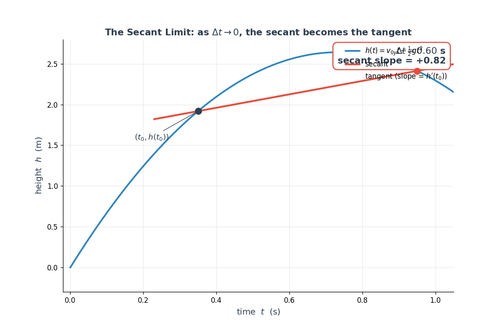
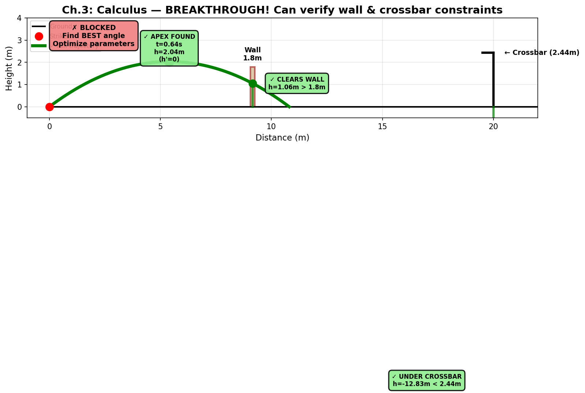

# Ch.3 — Calculus: Slopes, Areas, and the Meeting in the Middle

> **The story.** In the 1660s and 70s, two men working independently — **Isaac Newton** in Cambridge and **Gottfried Wilhelm Leibniz** in Germany — invented the same subject. Newton called it *fluxions*, motivated by his work on planetary orbits and projectile motion in *Principia* (1687). Leibniz arrived from a different direction — the geometry of tangents and areas — and gave us the elegant notation $dy/dx$ and $\int$ that we still use. They went on to spend twenty years in a bitter priority dispute. Two centuries later, Cauchy, Weierstrass, and Riemann patched the foundations with $\varepsilon$–$\delta$ rigor, but the original idea — a derivative and an integral that secretly invert one another — came straight from the 1670s.
>
> **Where you are in the curriculum.** You can fit lines (Ch.1) and curves (Ch.2). Now you need to *talk to the curve*. Specifically, two questions about the knuckleball free kick: *how fast is the ball rising at any instant* (a derivative) and *how high has it gone by time $T$* (an integral). Both questions live outside algebra. This is the chapter where they enter the toolkit — and they stay for the rest of the curriculum.
>
> **Notation in this chapter.** $f(x)$ — a function of one variable (e.g. height vs time); $f'(x)$ or $\frac{df}{dx}$ — the **derivative**: instantaneous rate of change at $x$; $\Delta x$ — a finite change in $x$; $h\to 0$ — a shrinking step size used to define the limit; $\lim_{h\to 0}$ — limit operator; $\int_a^b f(x)\,dx$ — the **definite integral**: signed area under $f$ from $a$ to $b$; $F(x)$ — an antiderivative of $f$ (so $F'=f$); $h(t)$ — ball height at time $t$; $h'(t)$ — rate of change of height (how fast it's rising or falling).

---

## 0 · The Challenge — Where We Are

## Animation

> *Animation placeholder — see `img/ch03_calculus_intro-animation.gif` — generated by needle-builder agent.*


> **The goal**: Score a free kick that clears a 1.8m wall at 9.15m distance and dips under a 2.44m crossbar at 20m, while beating the keeper's reaction time.

> **Practitioner angle** — Every gradient descent step is an application of derivatives. When loss spikes after a batch update, the chain rule tells you which layer introduced the instability. Diagnosing a learning rate that's too high — or a vanishing gradient that stops a deep network from learning — requires owning the derivative as a diagnostic tool, not just a formula to memorise.

**What we know so far:**
- Ch.1: Straight lines $h = wt + b$
- Ch.2: Full parabola $h(t) = 6.5t - 4.905t^2$
- We can compute height at ANY time: plug in $t = 0.6s$ → $h = 1.10m$
- **But we still can't check the wall/crossbar constraints!**

**What's blocking us:**
We have three critical questions we can't answer yet:
1. **Where's the peak?** At what time $t_{\text{peak}}$ does the ball reach maximum height? (Need to satisfy: peak > wall height)
2. **What's the peak height?** How high does the ball actually go? (Need: $h_{\text{peak}} > 1.8m$ to clear wall)
3. **Is the ball still rising or already falling at the wall/goal?** We can compute $h(0.6s) = 1.10m$, but is the ball going UP or DOWN at that moment?

We can't answer these by just plugging in $t$ values — we'd need to guess-and-check thousands of times. We need a tool that directly finds "when does the curve reach its highest point?"

**What this chapter unlocks:**
**Derivatives** — the instantaneous rate of change $h'(t)$. This lets us:
- **Find the apex**: Solve $h'(t) = 0$ to get exact peak time
- **Check if ball is rising/falling**: If $h'(t) > 0$, rising; if $h'(t) < 0$, falling
- **Compute exact wall/goal heights**: Use the derivative to understand the trajectory behavior
**This is the breakthrough chapter** — for the first time, we can actually **verify constraints 1 & 2** (wall and crossbar clearance)!

---

## 1 · Core Idea

Calculus rests on a single idea repeated in two disguises: **replace a curved thing with infinitely many tiny straight things, and take a limit.**

**The derivative — building it up from scratch.** Stand at a point on the free-kick trajectory at time $t_0$. You want to know how fast the ball is rising *right now*. The Ch.1 formula "rise over run" needs *two* points to work — pick a second time $t_0 + \Delta t$ a little later, draw a straight line through both points on the curve, and that line's slope is your answer. That straight line has a name: a **secant** (Latin *secare*, "to cut" — it cuts the curve in two places). The secant's slope is only an *approximation* to the rate of rise at $t_0$, because the ball's velocity is changing across the interval $\Delta t$. So make $\Delta t$ smaller. The two points slide closer together. The secant rotates. As $\Delta t \to 0$ the two points **collapse into a single point**, and the secant rotates into a line that touches the curve at exactly that one point — a **tangent** (Latin *tangere*, "to touch"). The slope of *that* line is the rise-rate at the precise instant $t_0$. We call it the **derivative**.

In one line: **derivative $=$ slope of the tangent $=$ the limit that the secant slopes approach as the two points collapse into one.** That limit-of-a-quotient is what the symbol $\dfrac{dh}{dt}$ literally means, and §3.1 below works through the algebra step by step.

**The integral** is the same idea applied to area. The area under a curve is hard. The area under a thin rectangle is easy (height × width). So slice the region into many thin rectangles, add their areas, then let the rectangles get arbitrarily thin. The limit of that sum is the integral.

The stunning fact — the **Fundamental Theorem of Calculus** — is that these two operations are inverses of each other. Differentiate $h(t)$ to get $v(t)$; integrate $v(t)$ back over time and you recover $h(t)$.

---

## 2 · Running Example

> 📘 **Physics-Free Path:** This chapter uses a ball tracing a parabolic curve $h(t) = at^2 + bt + c$. Here's the translation:
> • **"Velocity"** → **rate of change** (the derivative $h'(t)$).
> • **"Apex"** → **peak** (where $h'(t) = 0$, the curve stops rising and starts falling).
> • **"Gravity $g$"** → a constant that makes the curve bend downward.
> • **"Acceleration"** → how fast the rate of change is changing (the second derivative $h''(t)$).
> Skip any mention of $F = ma$ or Newton — pure curve math is all you need.

Knuckleball free kick, vertical component, ball struck off the turf for clarity:

$$h(t) = v_{0y} t - \tfrac{1}{2} g t^2 \qquad v_{0y} = 6.5\text{ m/s},\ g = 9.81\text{ m/s}^2$$

For this chapter: $h(t)$ is **height vs time**, with $v_{0y} = 6.5$ (initial upward rate) and $g = 9.81$ (downward bend constant).

Two questions:

1. **Rate of change at any instant.** The ball slows as it rises, stops for an instant at the peak, then speeds up downward. What is the rate $h'(t)$ *exactly* at $t = 0.5$ s?
2. **Total distance risen from release to peak.** Can we recover $h(t)$ from $h'(t)$ by summing up the tiny rises?

Both questions look innocent until you realise $h(t)$ is a curve, not a line, so simple division and multiplication fail.

---

## 3 · The Derivative — Slope of the Tangent

### 3.1 · Secant to tangent

Pick a point $t_0$ on the curve. Pick another point $t_0 + \Delta t$. The **secant slope** between them is

$$\text{secant slope} = \frac{h(t_0 + \Delta t) - h(t_0)}{\Delta t}$$

That's rise over run — the Ch.1 idea. Now shrink $\Delta t$ toward zero. The secant rotates into a **tangent** that touches the curve at just one point. Its slope — if the limit exists — is the **derivative** at $t_0$:

$$h'(t_0) = \lim_{\Delta t \to 0} \frac{h(t_0 + \Delta t) - h(t_0)}{\Delta t}$$


The picture above is just that definition pulled apart: the orange dotted lines show *how the second point is constructed* — pick any $\Delta t > 0$, step right that far on the time axis, then read the curve's height there. The red line through the two red dots is the secant. The two ghosted grey lines show what happens as $\Delta t$ shrinks: the secant pivots toward the tangent at $t_0$.

**Now watch it collapse.** The animation below shows eight frames of $\Delta t$ shrinking from 0.60 down to 0.01 seconds:



As $\Delta t \to 0$, the secant slope converges to the tangent slope — which *is* the derivative $h'(t_0)$. The two-point approximation becomes the one-point exact answer. That limit is what the definition $h'(t_0) = \lim_{\Delta t \to 0} \dfrac{h(t_0 + \Delta t) - h(t_0)}{\Delta t}$ actually *means*. Not a magic formula — a visible geometric fact.

For our knuckleball free kick $h(t) = v_{0y} t - \tfrac{1}{2}g t^2$, algebra (expand, subtract, simplify, let $\Delta t \to 0$) gives

$$h'(t) = v_{0y} - g t$$

This is the **instantaneous rate of change** $h'(t)$ — how fast height is changing at time $t$. The peak is where $h'(t) = 0$ (curve stops rising), which happens at $t_\star = v_{0y}/g$. For $v_{0y} = 6.5$, $t_\star \approx 0.663$ s.

### 3.2 · Derivative rules you will actually use

Memorise five and you cover 90% of cases in the ML book:

| Function | Derivative |
|---|---|
| $c$ | $0$ |
| $x^n$ | $n x^{n-1}$ |
| $e^x$ | $e^x$ |
| $\log x$ | $1/x$ |
| $\sin x$, $\cos x$ | $\cos x$, $-\sin x$ |

Plus three combination rules:

| Rule | Formula |
|---|---|
| Sum | $(f + g)' = f' + g'$ |
| Product | $(f \cdot g)' = f' g + f g'$ |
| Chain | $(f(g(x)))' = f'(g(x)) \cdot g'(x)$ |

The chain rule is the star of the show — we'll spend an entire Ch.6 on it because that's what backpropagation *is*.

### 3.2.1 · Worked Example — The Trajectory by the Numbers

Let's trace the **free-kick parabola** $h(t) = 6.5t - 4.905t^2$ and its derivative $h'(t) = 6.5 - 9.81t$ with actual values. Using the **power rule** from §4.2:
- $h(t) = 6.5t^1 - 4.905t^2$
- Apply rule: $(t^n)' = nt^{n-1}$
- Result: $h'(t) = 6.5 \cdot 1 \cdot t^0 - 4.905 \cdot 2 \cdot t^1 = 6.5 - 9.81t$

Now compute at five times during flight:

| Time $t$ (s) | Height: $h(t) = 6.5t - 4.905t^2$ | Rate of change: $h'(t) = 6.5 - 9.81t$ | What's happening |
|---|---|---|---|
| 0.0 | $h = 0$ m | $h' = +6.5$ m/s | **Launch:** Ball on ground, rising fast |
| 0.2 | $h = 1.10$ m | $h' = +4.54$ m/s | Climbing, but slowing down |
| 0.331 | $h = 1.08$ m | $h' = +3.25$ m/s | Still rising (halfway to peak) |
| **0.663** | **$h = 2.15$ m** | **$h' = 0$ m/s** | **Peak:** Stopped rising, about to fall |
| 1.0 | $h = 1.60$ m | $h' = -3.31$ m/s | Falling (negative derivative) |

> **Read the pattern:**
> - **Height $h(t)$** rises from 0 → 1.10 → 2.15 m, then falls to 1.60 m. The curve bends over.
> - **Derivative $h'(t)$** starts at +6.5, drops to +4.54, +3.25, reaches 0 at the peak, then goes negative (-3.31).
> - **At $t = 0.663$s:** $h' = 0$ tells us the curve has stopped rising — that's the **peak**. We found it by solving $6.5 - 9.81t = 0 \Rightarrow t = 6.5/9.81 \approx 0.663$s.

**Connect to the animation (§3.4 below):** When you watch the ball fly, the green tangent line has slope $h'(t)$. At launch, slope = +6.5 (steep upward). At the peak, slope = 0 (horizontal). While falling, slope is negative (points down). The animation shows these exact numbers changing in real-time.

**Why this matters for ML:** Gradient descent (Ch.4) uses the derivative to find the minimum of a loss curve. It checks "is the slope positive or negative?" then steps in the opposite direction. That's exactly what we just did to find the peak: solve for where $h'(t) = 0$.

---

### 3.2.2 · What the Slope's Sign and Size Actually Tell You

The numbers in the table above ($h'(t) = +6.5,\ +4.54,\ 0,\ -3.31$) are easy to read off a formula. But what does each one *mean* when you are standing on the pitch watching the ball?

#### The sign tells you the direction

The derivative at a moment is the slope of the tangent line at that moment. A tangent line always points *somewhere* — and the sign of the slope tells you exactly where:

| $h'(t)$ is… | Tangent line points… | What the ball is doing |
|---|---|---|
| **positive** | up to the right | **rising** — height increases as time moves forward |
| **zero** | perfectly horizontal | **peak** — neither gaining nor losing height right now |
| **negative** | down to the right | **falling** — height decreases as time moves forward |

There is no "neutral" — the ball is always doing one of those three things at every instant.

#### The magnitude tells you how steeply

The *size* of $h'(t)$ tells you the rate — how many metres per second the ball is gaining (or losing) height right now.

Compare the five moments from the table:

```
Time h'(t) Tangent direction "If I extrapolate one second forward..."
─────────────────────────────────────────────────────────────────────────────
t=0.0 +6.50 steep upward slope ball would be 6.50 m higher (wall is only 1.8 m)
t=0.2 +4.54 moderate upward would be 4.54 m higher — still climbing fast
t=0.5 +1.59 shallow upward only 1.59 m higher — ball is losing steam
t=0.663 0.00 horizontal not going up or down at all — this is the peak
t=1.0 −3.31 downward slope would be 3.31 m lower — falling quickly
```

The "one second forward" extrapolation is exactly what the tangent line *is*: if you froze the curve at that instant and kept going in a straight line, where would you end up one second later? That straight-line prediction is the tangent, and its slope is $h'(t)$.


#### Watching the direction change along the flight

```
Height
 ↑
2.15 m ─────────────── ● ← peak: h'=0, tangent is flat
 ╱ ╲
 1.8 m ─ wall ─ ─ ─ ─ ─ ╲──────────── crossbar at 2.44 m
 ╱ ╲
 1.1 m ● ●
 ╱ h'=+4.54 here ╲ h'=−3.31 here
 ╱ (slope upward ↗) ╲ (slope downward ↘)
──────●─────────────────────────●────────── time →
 t=0.0 t=1.0
 h'=+6.50 (steep ↗)
```

The tangent direction rotates continuously as the ball travels: steep upward at launch → shallow upward as it crests → horizontal at the peak → downward on the descent. It never jumps. That smooth rotation *is* what it means for $h(t)$ to be a differentiable function.


#### Three ways to read $h'(t) = +4.54$ at $t = 0.2\text{ s}$

These three descriptions say exactly the same thing, just in different languages:

1. **Geometric:** The tangent line at $t = 0.2$ has slope $+4.54$. It tilts upward: for every 1 second you step right along the line, you'd move 4.54 metres up.
2. **Physical:** The ball is rising at 4.54 metres per second right now. In the next tiny sliver of time $dt$, the ball gains $4.54 \cdot dt$ metres of height.
3. **Predictive:** If the ball could somehow keep flying in a straight line from $t = 0.2$ (i.e., if gravity suddenly switched off), after 1 more second it would be $1.1 + 4.54 = 5.64$ metres high. Of course gravity doesn't switch off — so the actual height is *less* than that, and the derivative captures only the instantaneous tendency.

#### Why this matters immediately for the free-kick constraints

You can now read the two constraint checks straight from the derivative sign:

- **Wall at $t \approx 0.6$s:** $h'(0.6) = 6.5 - 9.81 \times 0.6 = +0.61$ — positive, so the ball is **still rising** when it reaches the wall. It hasn't peaked yet. This is good news: the ball clears the wall on the way *up*.
- **Crossbar at $t \approx 1.2$s:** $h'(1.2) = 6.5 - 9.81 \times 1.2 = -5.27$ — negative, so the ball is **falling** as it crosses the goal line. The dip is working in our favour: gravity is pulling it under the crossbar.

You didn't need to sketch anything. The sign of $h'(t)$ at each checkpoint tells you the direction — rising or falling — at a glance.

#### The ML connection: gradient descent reads this sign at every step

Gradient descent (Ch.4) does exactly this, but for a **loss surface** instead of a ball:

1. Evaluate $L'(\theta)$ at your current parameter value $\theta$.
2. If it's **positive**, the loss is rising in the $+\theta$ direction → step *left* (decrease $\theta$).
3. If it's **negative**, the loss is rising in the $-\theta$ direction → step *right* (increase $\theta$).
4. If it's **zero**, you are at a flat point → stop (or check the second derivative to see if it's a minimum, maximum, or saddle).

That's it. The optimizer never "looks ahead" at the whole curve. It only reads the sign and magnitude of the slope at the current point, then takes one small step opposite to it. The ball analogy: imagine you're *on* the trajectory curve as a shape, trying to ski down to the lowest point. The derivative tells you whether the hill is rising or falling beneath your feet right now, and how steeply. That is all gradient descent needs.

---

### 3.2.3 · When the Derivative Doesn't Exist — Corners, Kinks, and the ReLU Problem

> 🚨 **Critical for ML:** This section explains why ReLU activation functions (ML Ch.4) technically have undefined derivatives at $x=0$, and how we handle it in practice. Skip this and you'll be confused when PyTorch computes gradients through "non-differentiable" functions.

The derivative definition $f'(x_0) = \lim_{\Delta x \to 0} \frac{f(x_0 + \Delta x) - f(x_0)}{\Delta x}$ requires the limit to **exist and be the same** whether you approach from the left ($\Delta x < 0$) or right ($\Delta x > 0$). At certain points, that limit doesn't exist. Here's why it matters.

#### Four Ways a Derivative Can Fail to Exist

| Failure mode | Example | What breaks | Graph shape |
|---|---|---|---|
| **Sharp corner / kink** | $f(x) = \|x\|$ at $x=0$ | Left slope ≠ right slope | V-shape |
| **Vertical tangent** | $f(x) = \sqrt[3]{x}$ at $x=0$ | Slope → ∞ | S-curve with infinite steepness |
| **Discontinuity** | $f(x) = \text{step}(x)$ at $x=0$ | Function jumps | Staircase |
| **Cusp** | $f(x) = x^{2/3}$ at $x=0$ | Tangent vertical from one side | Pointy tip |

The most important case for ML is **sharp corners** — and the canonical example is **ReLU**.

#### The ReLU Problem: A Kink at Zero

**ReLU** (Rectified Linear Unit) is the most common activation function in modern neural networks:

$$\text{ReLU}(x) = \max(0, x) = \begin{cases}
0 & \text{if } x \leq 0 \\
x & \text{if } x > 0
\end{cases}$$

Plot it: it's a horizontal line along the $x$-axis for $x < 0$, then a 45° line for $x > 0$, meeting at a **sharp corner** at $x=0$.

**What's the derivative?**
- For $x < 0$: function is constant 0 → $f'(x) = 0$
- For $x > 0$: function is $f(x) = x$ → $f'(x) = 1$
- **At $x = 0$:** Problem! The **left derivative** (approaching from $x < 0$) is 0. The **right derivative** (approaching from $x > 0$) is 1. They don't match → **derivative does not exist** at $x=0$.

**Mathematically:**

$$\text{ReLU}'(x) = \begin{cases}
0 & \text{if } x < 0 \\
\text{undefined} & \text{if } x = 0 \\
1 & \text{if } x > 0
\end{cases}$$


#### One-Sided Derivatives

We can salvage *partial* information by computing limits from each side separately:

- **Left derivative** (from below): $f'_-(x_0) = \lim_{\Delta x \to 0^-} \frac{f(x_0 + \Delta x) - f(x_0)}{\Delta x}$
- **Right derivative** (from above): $f'_+(x_0) = \lim_{\Delta x \to 0^+} \frac{f(x_0 + \Delta x) - f(x_0)}{\Delta x}$

For ReLU at $x=0$: $f'_-(0) = 0$ and $f'_+(0) = 1$. These exist individually, but since they disagree, the **full derivative** $f'(0)$ is undefined.

#### The Practical Fix: Subgradients

**Here's the trick used by every deep learning library:** When backpropagating through a non-differentiable point, **pick any value between the left and right derivatives** (called a **subgradient**). For ReLU at $x=0$, libraries typically choose:

$$\text{ReLU}'(0) := 0 \quad \text{(by convention)}$$

Some libraries use $1$, others use $0.5$. It doesn't matter much in practice because:
1. The probability that a neuron lands *exactly* at 0 is measure-zero (essentially never happens with floating-point arithmetic)
2. Even if it does, the choice affects only that single gradient — not the entire network
3. The network adapts by moving the neuron away from 0 on the next iteration

**This is called the subgradient method** — and it's why PyTorch doesn't crash when you call `.backward()` through ReLU, even though ReLU is technically non-differentiable.

#### Connection to ML Ch.4–5: Dead ReLUs and Leaky ReLU

**Why ReLU's kink matters in practice:**

In **ML Ch.4 (Neural Networks)**, you'll see that neurons can get "stuck" in the flat region ($x \leq 0$) where ReLU outputs zero and the gradient is zero. Once stuck, gradient descent can't move them (zero gradient = no update). This is the **dying ReLU problem**.

The fix: **Leaky ReLU**, which replaces the flat region with a small slope:

$$\text{LeakyReLU}(x) = \begin{cases}
0.01x & \text{if } x < 0 \\
x & \text{if } x \geq 0
\end{cases}$$

This *still* has a kink at $x=0$ (left derivative = 0.01, right derivative = 1), but now the gradient is never exactly zero — dead neurons can recover.

**In ML Ch.5 (Backpropagation)**, you'll compute $\frac{\partial L}{\partial x}$ through activation functions. The chain rule requires knowing $\frac{d\text{ReLU}}{dx}$, which we now know is:
- Easy away from zero (gradient is 0 or 1)
- Technically undefined at zero (but we pick a convention and move on)

#### The Free Kick Example: Endpoints and Boundaries

**Does our free-kick trajectory have non-differentiable points?**

Yes — at the **endpoints**:
- **At $t=0$ (launch):** The ball sits on the ground ($h=0$), then the trajectory begins. There's no "before launch" — we can only compute the **right derivative** $h'_+(0) = v_{0y}$. The left derivative doesn't exist (ball wasn't in flight yet).
- **At landing:** When the ball returns to $h=0$, the parabola ends. Again, only the **left derivative** exists: $h'_-(t_{\text{land}}) = -v_{0y}$ (falling at same speed it launched). The right derivative doesn't exist (ball stops bouncing).

**Why this doesn't break calculus:**
We only use derivatives *in the interior* of the domain — during the flight. At endpoints, we either:
1. Use one-sided derivatives (if we need them)
2. Accept that optimization can't push beyond the boundary (e.g., can't have "negative time")

**In ML optimization:** Parameters often have boundaries (e.g., learning rate $\eta > 0$, probabilities $0 \leq p \leq 1$). When gradient descent tries to step outside the valid region, we either:
- **Clip** the update (project back onto the boundary)
- **Use barrier functions** (make the loss explode near boundaries)
- **Reparameterize** (e.g., use $\log \eta$ so the domain is unbounded)

These are all extensions of "the derivative doesn't exist at the edge, so we handle it specially."

#### Summary: What You Need to Remember

| Concept | Math | ML Connection |
|---|---|---|
| **Sharp corner** | Left slope ≠ right slope | ReLU at $x=0$ |
| **One-sided derivative** | $f'_-(x)$ and $f'_+(x)$ exist separately | Used in proofs, rarely in code |
| **Subgradient** | Any value between left/right slopes | What PyTorch picks for ReLU'(0) |
| **Dead ReLU** | Neuron stuck at $x < 0$ where gradient=0 | Fixed by Leaky ReLU |
| **Endpoint behavior** | Domain boundaries have one-sided limits | Parameter constraints in optimization |

**Forward reference:**
- **ML Ch.4:** You'll implement ReLU and see `torch.relu()` handle the kink automatically
- **ML Ch.5:** Backpropagation computes $\nabla L$ through ReLU using the subgradient convention
- **ML Ch.6:** Dying ReLU problem explained in detail, with fixes (Leaky ReLU, ELU, GELU)

The key insight: **calculus doesn't require differentiability everywhere, just almost everywhere**. Neural networks with billions of parameters hitting exactly $x=0$ on a single ReLU? Measure-zero event. We define a convention, move on, and the optimizer works.

### 3.3 · Higher derivatives — the second-order story

Differentiate again: $h''(t) = -g$. A constant. This says "the rate of change itself changes at a constant rate." For our parabola, $h'(t)$ is linear in $t$, so its derivative is constant.

**In ML.** The second derivative of the loss tells you about **curvature** — how the slope itself is changing. Small second derivative: gentle bowl, easy to optimise. Large: steep walls, small learning rates required. The **Hessian** (matrix of second derivatives) is central to Newton's method and its approximations.

### 3.4 · Watch it happen — the derivative in slow motion


**The animation above is the derivative laid bare.** The orange ball moves along $h(t) = v_{0y}t - \tfrac{1}{2}gt^2$. The green line is the tangent at the ball's current position — its slope is $h'(t) = v_{0y} - gt$. Watch the readout in the top-right corner: at launch, $h'(0) = +7.20$ (maximum upward rate). As the ball climbs, the rate decreases — the tangent flattens. At the **peak** (red X), $h'(t) = 0$ — the curve stops rising. Then it falls, and $h'(t)$ goes negative (the tangent points downward). By the time the ball hits the ground, $h'(t) \approx -7.20$ — same magnitude, opposite direction. *That* is what a derivative is: the instantaneous slope, frozen at every single moment.

---

## 4 · The Integral — Area Under a Curve

### 4.1 · Riemann sum to integral

Turn the question around: we know the rate of change $h'(t) = v_{0y} - g t$. How do we recover the total height change $h(T) - h(0)$?

Slice the time interval $[0, T]$ into $n$ equal pieces, each of width $\Delta t = T/n$. On each slice, approximate the moving ball as if it had constant rate — say, the rate at the left edge of the slice. The ball's rise over that slice is approximately $h'(t_i) \Delta t$. Sum all slices:

$$S_n = \sum_{i=0}^{n-1} h'(t_i) \Delta t$$

This is a **Riemann sum**. Shrink $\Delta t$ toward zero (equivalently, $n \to \infty$). If $h'$ is well-behaved, $S_n$ converges to the **definite integral**:

$$\int_0^T h'(t) dt = \lim_{n \to \infty} S_n$$

That integral *is* the total rise $h(T) - h(0)$. For our knuckleball free kick with $T = v_{0y}/g$ (release to peak):

$$\int_0^{v_{0y}/g} (v_{0y} - g t) dt = \left[v_{0y} t - \tfrac{1}{2}g t^2\right]_0^{v_{0y}/g} = \frac{v_{0y}^2}{2g} \approx 2.15\text{ m}$$

### 4.2 · Fundamental Theorem of Calculus (FTC)

Two statements, one theorem:

> **(Part 1)** If $F(x) = \int_a^x f(t) dt$, then $F'(x) = f(x)$. Integration and differentiation undo each other.
>
> **(Part 2)** $\int_a^b f(x) dx = F(b) - F(a)$, where $F$ is any antiderivative of $f$. So if you can *recognise* $f$ as the derivative of some known $F$, the integral is a one-line subtraction.

**In our example.** $h'(t) = v_{0y} - gt$ is the derivative of $h(t) = v_{0y}t - \tfrac{1}{2}gt^2$. FTC Part 2: $\int_0^T h'(t) dt = h(T) - h(0)$. Derivative and integral are the two faces of the same coin.

---

## 5 · Step by Step — the derivative of the free-kick height, from scratch

> **Why this section exists:** The power rule $\frac{d}{dt}t^2 = 2t$ is usually given without proof. Walking through the limit definition once shows *why* it works — and builds confidence that calculus isn't magic, just patient algebra.

We'll find the derivative of $h(t) = bt - at^2$ (where $b = v_{0y}$ and $a = \tfrac{1}{2}g$) from first principles:

**1. Start from the definition:**
$$h'(t) = \lim_{\Delta t \to 0} \frac{h(t + \Delta t) - h(t)}{\Delta t}$$

**2. Substitute the formula for $h$:**
$$\text{numerator} = [b(t + \Delta t) - a(t + \Delta t)^2] - [bt - at^2]$$
> *Why:* We're computing $h(t + \Delta t) - h(t)$ by plugging in both values.

**3. Expand the squared term using $(A + B)^2 = A^2 + 2AB + B^2$:**
$$(t + \Delta t)^2 = t^2 + 2t\Delta t + (\Delta t)^2$$
> *Why:* This is FOIL (First, Outer, Inner, Last) from high school — we need it to see what cancels.

Substitute back:
$$\text{numerator} = b\Delta t - a[t^2 + 2t\Delta t + (\Delta t)^2 - t^2]$$

The $bt$ and $-at^2$ terms **cancel** with their counterparts:
$$= b\Delta t - a(2t\Delta t) - a(\Delta t)^2$$
> *Why the cancellation:* We subtracted $h(t)$ which contained $+bt$ and $-at^2$, so those disappear.

**4. Factor out $\Delta t$:**
$$\text{numerator} = \Delta t \cdot [b - 2at - a\Delta t]$$

**5. Divide both sides by $\Delta t$:**
$$\frac{\text{numerator}}{\Delta t} = b - 2at - a\Delta t$$
> *Why we can divide:* $\Delta t$ appears in every term, so it factors out cleanly.

**6. Take the limit as $\Delta t \to 0$:**
$$h'(t) = b - 2at - \cancelto{0}{a\Delta t} = b - 2at$$
> *Why the last term vanishes:* As $\Delta t$ shrinks to zero, $a\Delta t \to 0$ too.

**Result:** $h'(t) = b - 2at$. For our specific values $b = v_{0y}$ and $a = \tfrac{1}{2}g$, this becomes $h'(t) = v_{0y} - gt$. ✓

The modern power rule "differentiate $t^2 \to 2t$" just packages this entire calculation so you never have to do it by hand again. Now you've seen why it's true.

---

## 6 · Key Diagram


Left: as $\Delta t$ shrinks from 0.60 to 0.08, the secant slope slides from +0.82 up toward the tangent slope +3.77 — that limit is the derivative. Middle: the orange rectangles are gross at $n=8$, but the tabulated sums show convergence 3.30 → 2.81 → 2.68 → 2.64 toward the exact integral. Right: Archimedes had the integral idea 1900 years before Newton — and his polygon method nails $\pi$ to five decimal places with 64 sides.

---

## 7 · What Can Go Wrong

- **$\Delta t$ too small.** Numerical derivatives are a balance: large $\Delta t$ has truncation error, tiny $\Delta t$ has round-off error from finite-precision subtraction. "Catastrophic cancellation" is the official name. A rule of thumb: $\Delta t \approx \sqrt{\varepsilon_\text{mach}} \approx 10^{-8}$ for 64-bit floats.
- **Non-differentiable points.** The ReLU function (ML Ch.4) is not differentiable at 0. We use subgradients in practice — a small concession the framework hides.
- **Left vs right vs midpoint.** For a decreasing function, left-endpoint rectangles overestimate, right-endpoint underestimate, midpoint is usually the most accurate. `scipy.integrate.quad` uses adaptive rules; hand-rolled sums should use midpoint or trapezoidal.
- **Integrals with no closed form.** $\int e^{-x^2} dx$ has no elementary antiderivative (Liouville 1835). Many ML quantities — KL divergence, evidence lower bound — get numerically integrated or Monte-Carlo estimated.
- **Infinities.** $\int_0^1 1/x dx$ diverges. Always check the integrand for singularities inside your interval before trusting a numerical answer.

---

## 8 · Exercises

*Three short ones. The chain rule and the derivative-as-limit are the load-bearing ideas — the rest is muscle memory you'll build later.*

1. **Chain-rule warm-up.** Compute $f'(x)$ for $f(x) = (2x+1)^3$. (One application of the chain rule.)
2. **Curve peak.** With $v_{0y} = 6.5$, set $h'(t) = 0$ to find when the curve reaches its peak. Sanity-check it against the notebook's numerical zero-finder.
3. **Numerical derivative — the V-shape.** For $f(x) = \sin(x)$ at $x = 1$, plot the error $|f'_\text{numeric}(x) - \cos(1)|$ as $\Delta t$ sweeps from $1$ down to $10^{-14}$. The V you see (round-off taking over near $10^{-8}$) is *the* lesson on why finite-difference gradients aren't free.

---

## 9 · Where This Reappears

- **Pre-Req Ch.4.** A derivative tells you which direction is *down*. Gradient descent is walking downhill, one tiny step at a time.
- **Pre-Req Ch.6.** Chain rule → automatic differentiation → PyTorch's `backward()`.
- **ML Ch.1.** The least-squares loss is a parabola; its derivative is zero at the optimum. That's how linear regression "closed form" works.
- **ML Ch.4 Neural Networks.** Every layer is a differentiable function. Training *is* repeatedly computing $\partial L / \partial w$ and stepping against it.
- **Everywhere else in the ML book.** You cannot escape calculus. This chapter is the minimum-viable dose.

---

## 10 · Progress Check — What We Can Solve Now



**MAJOR UNLOCK: We can now check the wall and crossbar constraints!**

**What derivatives gave us:**
1. **Find the apex exactly**: $h'(t) = 0$ → $6.5 - 9.81t = 0$ → $t_{\text{peak}} = 0.663s$
2. **Compute peak height**: $h(0.663) = 2.15m$ ✓ **Clears the 1.8m wall!**
3. **Check crossbar clearance**: At goal line ($t \approx 1.2s$): $h(1.2) = 1.60m$ ✓ **Under 2.44m crossbar!**
4. **Know ball state anywhere**: At wall ($t=0.6s$): $h'(0.6) = +0.64$ (still rising). At goal: $h'(1.2) = -5.27$ (falling fast)
**Unlocked capabilities:**
- **Verify constraint #1 (Wall)**: Check if $h(t_{\text{wall}}) > 1.8m$ ✓
- **Verify constraint #2 (Crossbar)**: Check if $h(t_{\text{goal}}) < 2.44m$ ✓
- **Understand trajectory shape**: Find where ball is rising/falling, maximum height, landing time
- **Compute rates of change**: Velocity $h'(t)$ at any point, acceleration $h''(t) = -g$ (constant)
**Still can't solve:**
- **Constraint #3 (Keeper speed)**: Is the ball arriving fast enough? We haven't linked horizontal distance to time yet (need horizontal velocity component)
- **Optimize launch angle**: What $\theta$ actually clears wall AND goes under crossbar? We can CHECK a given $\theta$, but not FIND the best one — that's **Ch.4** (gradient descent)
- **Handle multiple parameters**: What if we need to optimize $v_0$ (speed), $\theta$ (angle), AND $h_0$ (kick height) simultaneously? Single-variable calculus only handles one parameter — multi-variable needs **Ch.5-6**
- **Account for uncertainty**: What if the striker's muscle fatigue makes $v_0$ random? — That's **Ch.7** (probability)

**Real-world status**: We can now say "For $\theta = 45°$, $v_0 = 10$ m/s: YES, this clears wall and goes under crossbar!" But we can't yet answer "WHAT $\theta$ and $v_0$ should I use?"

**Next up:** Ch.4 gives us **gradient descent** — the iterative method to FIND optimal parameters (not just check them). We'll walk downhill on a loss surface using $f'(\theta)$ to pick the direction.

---

## 11 · References

- **Jon Krohn — *Calculus 1 for Machine Learning*.** Video companion to this chapter; the "limits" and "derivative definition" episodes map one-to-one to Sections 4 and 5.
- **3Blue1Brown — *Essence of Calculus*, eps. 1–4.** The visual intuition for secant→tangent and Archimedes is unmatched.
- **Spivak — *Calculus*.** If you want the rigorous $\varepsilon$–$\delta$ version one day.
- **Stewart — *Calculus: Early Transcendentals*.** The standard undergrad reference, enormous but friendly.
- **Strogatz — *Infinite Powers* (2019).** History of calculus as pop-science, brilliant companion reading for Section 3.
