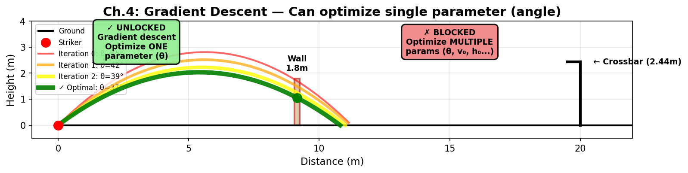

# Ch.4 — Small Steps on a Curve

> **The story.** *"That's one small step for [a] man, one giant leap for mankind."* — **Neil Armstrong**, Apollo 11, Sea of Tranquility, 20 July 1969. Armstrong's boot-print was 30 cm of motion at the end of a 384 000 km journey, and that sentence is also the best one-line description of how every modern ML model is trained. The mathematics behind it is older than the moon landing: in **1847 Augustin-Louis Cauchy** published the *méthode des plus profonde descente* — "steepest descent" — a recipe for minimising functions that don't have a clean closed-form solution: stand on the surface, find the downhill direction, take a small step, repeat. A century later Robbins & Monro (1951) added the *stochastic* twist that lets it work on noisy data, and that is the algorithm that trains every neural network in this curriculum.
>
> **Where you are in the curriculum.** Ch.3 gave you the derivative — the slope of a curve. This chapter does what Cauchy did with it: turns the slope into a rule for *moving*. The running example is a long goal kick. Your boot delivers a fixed strike speed, but you choose the launch angle. Which angle drives the ball the farthest? You *could* solve it with calculus. But the moment you add air drag, a stiff crosswind, or a sloping pitch, the equation becomes ugly and the analytical answer vanishes. The fall-back is ancient and universal: **pick a starting guess and walk downhill.** Master this one chapter and you understand, mechanically, how every later model learns.
>
> **Notation in this chapter.** $\theta$ — the parameter we are tuning (e.g. launch angle); $L(\theta)$ — the **loss** or objective we are minimising (e.g. *negative* of how far the ball travelled); $L'(\theta)$ or $\nabla L$ — the slope / gradient of $L$; $\eta$ (eta) — the **learning rate** (step size); $\theta_t$ — the value of $\theta$ at iteration $t$; $\theta_{t+1}=\theta_t-\eta\,L'(\theta_t)$ — the **gradient-descent update rule**; $\epsilon$ — a small tolerance used as a stopping criterion.

---

## 0 · The Challenge — Where We Are

## Animation

> 🎬 *Animation placeholder — see `img/ch04_small_steps-animation.gif` — generated by needle-builder agent.*


> 🎯 **The goal**: Score a free kick that clears a 1.8m wall at 9.15m distance and dips under a 2.44m crossbar at 20m, while beating the keeper's reaction time.

> ⚡ **Practitioner angle** — A learning rate that's too high causes loss to diverge; too low and training stalls for hours. When your training loss oscillates instead of falling smoothly, you're watching gradient descent overshoot — and reading that failure through the lens of a 1-D loss surface tells you exactly which direction to adjust. This chapter gives you the mental model that separates practitioners who tune optimizers from those who just re-run experiments hoping something changes.

**What we know so far:**
- ✅ Ch.1: Linear models $h = wt + b$
- ✅ Ch.2: Parabolic trajectory $h(t) = 6.5t - 4.905t^2$
- ✅ Ch.3: Can CHECK constraints: find apex $t_{\text{peak}} = 0.663s$, verify $h(0.663) = 2.15m > 1.8m$ ✓ wall cleared, $h(1.2) = 1.60m < 2.44m$ ✓ under crossbar
- ❌ **But we can only check ONE fixed angle — we can't FIND the BEST angle!**

**What's blocking us:**
The trajectory equation is $h(t) = v_0 \sin(\theta) \cdot t - \frac{1}{2}gt^2$ where $\theta$ is the launch angle we control. For each $\theta$ we can compute:
- Does it clear the wall? (Check if $h(t_{\text{wall}}) > 1.8m$)
- Does it go under crossbar? (Check if $h(t_{\text{goal}}) < 2.44m$)
- How far does it travel? (Find where $h(t) = 0$)

But we have **no method to find the optimal $\theta$**. We could try $\theta = 10°, 11°, 12°, \ldots, 80°$ (70 guesses!) but that's brute-force and doesn't generalize to problems with 2+ parameters.

**What this chapter unlocks:**
**Gradient descent** — the iterative optimization method. Instead of guessing randomly:
1. Start with a guess $\theta_0$ (say, 45°)
2. Compute derivative $L'(\theta_0)$ (tells us: "increasing $\theta$ makes distance longer or shorter?")
3. Step in the *improving* direction: $\theta_1 = \theta_0 - \eta L'(\theta_0)$
4. Repeat until converged

This solves **single-parameter optimization** — finding best angle, best speed, best kick height, etc. (one at a time)

---

## 1 · Core Idea

Suppose you have a smooth curve $f(\theta)$ and you want to find the $\theta^\star$ that minimises it (or maximises — same problem, sign flipped). The recipe is:

1. Start somewhere: $\theta_0$.
2. Compute the slope there: $f'(\theta_0)$.
3. Step a *little* in the opposite direction: $\theta_1 = \theta_0 - \eta f'(\theta_0)$.
4. Repeat until you stop moving.

That's it. That's gradient descent in 1-D. The whole of deep-learning optimisation is this idea wearing more elaborate clothes.

The only question is **how big a step?** The answer is the subject of this chapter.

> 🎯 **See it with numbers:** §3.2 walks through this 4-step recipe with actual angles, ranges, and gradients from the goal-kick example — iteration 0 through iteration 4, every value computed explicitly.

---

## 1.5 · The Practitioner Workflow — Your 4-Phase Optimization Loop

> ⚠️ **Two ways to read this chapter:**
> - **Theory-first (recommended for learning):** Read §0→§3 sequentially to understand the mathematical foundations, then use this workflow as your implementation reference
> - **Workflow-first (practitioners with existing knowledge):** Use this diagram as a jump-to guide when implementing optimization algorithms

**What you'll build by the end:** An optimization loop that converges to the best parameter value, with stopping criteria and learning rate validation. This is the algorithm that trains every ML model in this curriculum.

```
Phase 1: INITIALIZE          Phase 2: COMPUTE            Phase 3: UPDATE            Phase 4: CONVERGE
─────────────────────────────────────────────────────────────────────────────────────────────────────────
Pick starting point:         Evaluate gradient:          Apply update rule:         Check stopping criteria:

• θ₀ = initial guess         • Compute ∇L(θₖ)             • θ_new = θ_old - η∇L      • |∇L| < ε (gradient ≈ 0)
• η = learning rate          • Check sign & magnitude    • Verify descent direction • |θ_new - θ_old| < ε
• Set max_iters              • Plot loss landscape       • Log θ and L(θ)           • Reached max_iters

→ DECISION:                  → DECISION:                 → DECISION:                → DECISION:
  Where to start?              Is gradient reliable?       Did loss decrease?         Converged or failed?
  • Convex: anywhere           • If ∇L ≈ 0 early:          • Yes: continue            • |∇L| < ε: ✅ Success
  • Non-convex: try            check if at saddle          • No: reduce η or          • max_iters: ⚠️ Retry
    multiple θ₀ values         • If ∇L huge: verify          check gradient             with smaller η or
  • Practical: use domain      formula/code                calculation                 different θ₀
    knowledge (e.g., 45°)      • Always verify sign
```

> 💡 **How to use this workflow:** Execute Phase 1 once at the start, then loop Phase 2→3→4 until Phase 4's stopping criteria trigger. Every ML optimizer (SGD, Adam, RMSprop) follows this exact 4-phase loop — only the Phase 3 update rule changes.

---

## 2 · Running Example

Long goal kick, vacuum physics, fixed strike speed $v_0 = 25$ m/s, ball struck from the turf. The horizontal range when you launch at angle $\theta$ is

$$R(\theta) = \frac{v_0^2}{g} \sin(2\theta)$$

Maximum at $\theta = 45^\circ$, giving $R \approx 63.7$ m. We *know* the answer; this makes it easy to test whether an optimisation algorithm actually finds it.

Two twists in this chapter:

1. **Step-size twist.** Even on this simple curve, a bad $\eta$ either crawls forever or overshoots wildly.
2. **Non-convexity twist.** Add a wind penalty and the curve grows a second hump. Now the starting angle decides whether you find the *global* optimum or get stuck at a *local* one.

---

## 3 · Math

### 3.1 · [Phase 1: INITIALIZE] The Update Rule and Starting Configuration

To *minimise* $f(\theta)$:

$$\theta_{k+1} = \theta_k - \eta f'(\theta_k)$$

- $\eta$ (eta) is the **step size** or **learning rate** — always positive.
- If $f'(\theta_k) > 0$, the curve is going up to the right; subtracting moves us left — *down*. ✓
- If $f'(\theta_k) < 0$, the curve is going down to the right; subtracting moves us right — *down*. ✓
- If $f'(\theta_k) = 0$, we've reached a critical point. Stop.

To *maximise* $f(\theta)$ (our range case), flip the sign:

$$\theta_{k+1} = \theta_k + \eta f'(\theta_k)$$

Same algorithm, walking uphill instead. Most ML code is written in the minimise form; if your real target is "maximise likelihood" you minimise *negative* likelihood and keep the sign convention.

**Phase 1 implementation — Setting up the optimization:**

```python
import numpy as np

# Simple quadratic loss: L(θ) = (θ - 3)²
# We know the minimum is at θ* = 3, but let's pretend we don't
def loss(theta):
    """Loss function: (θ - 3)²"""
    return (theta - 3.0) ** 2

def gradient(theta):
    """Gradient: dL/dθ = 2(θ - 3)"""
    return 2.0 * (theta - 3.0)

# Phase 1: INITIALIZE
theta = 0.0          # Starting point (θ₀)
learning_rate = 0.1  # Step size (η)
tolerance = 1e-6     # Stopping threshold (ε)
max_iters = 1000     # Safety limit

print(f"Phase 1 Complete")
print(f"  θ₀ = {theta:.6f}")
print(f"  η  = {learning_rate}")
print(f"  L(θ₀) = {loss(theta):.6f}")
print(f"  Initial distance from optimum: |θ - 3| = {abs(theta - 3.0):.6f}")
```

**Expected output:**
```
Phase 1 Complete
  θ₀ = 0.000000
  η  = 0.1
  L(θ₀) = 9.000000
  Initial distance from optimum: |θ - 3| = 3.000000
```

> 💡 **Industry Standard: `scipy.optimize.minimize`**
>
> ```python
> from scipy.optimize import minimize
>
> result = minimize(
>     fun=loss,              # Function to minimize
>     x0=0.0,                # Starting point θ₀
>     method='BFGS',         # Quasi-Newton method (uses gradient info)
>     jac=gradient,          # Gradient function (optional but faster)
>     tol=1e-6               # Convergence tolerance
> )
>
> print(f"Optimal θ: {result.x[0]:.6f}")  # → 3.000000
> print(f"Iterations: {result.nit}")      # → typically 3-5 for this problem
> ```
>
> **When to use:** Production code with complex loss landscapes. `BFGS` uses gradient history to adaptively tune step size (better than fixed η).
> **Common alternatives:** `'L-BFGS-B'` (bounded parameters), `'CG'` (conjugate gradient for large-scale), `'Nelder-Mead'` (derivative-free).
> **See also:** [SciPy optimize tutorial](https://docs.scipy.org/doc/scipy/reference/generated/scipy.optimize.minimize.html)

### 3.1.1 ✓ DECISION CHECKPOINT: Phase 1 Complete

**What you just set:**
- θ₀ = 0.0 (starting 3 units away from the true optimum at θ* = 3)
- η = 0.1 (fixed step size)
- L(θ₀) = 9.0 (initial loss — squared distance from optimum)

**What it means:**
- We're starting from the **left side** of the parabola — gradient will be negative, so update will move θ **rightward** (toward 3)
- With η = 0.1 and initial gradient = -6.0, first step will move θ by +0.6 (to θ = 0.6)
- Distance shrinks by factor of (1 - η·2) ≈ 0.8 per iteration → exponential convergence

**What to do next:**
→ **Option 1 (Standard):** Use η = 0.1 — converges in ~20 iterations, stable for this quadratic
→ **Option 2 (Aggressive):** Try η = 0.5 — converges in ~5 iterations but risks overshoot on complex landscapes
→ **Option 3 (Cautious):** Use η = 0.01 — guaranteed stable but slow (~200 iterations)
→ **For our scenario:** Choose η = 0.1 — balances speed and stability for typical smooth loss functions

---

**Watch the algorithm in action.** The animation below shows gradient descent minimising $L(\theta) = -R(\theta)$ (the negative of the range formula, so we're walking *down* the loss curve to find the *maximum* range):


Starting from $\theta_0 = 20^\circ$, the ball (current parameter value) takes 20 steps toward the green star at $45^\circ$. Each frame:
- The **red tangent** is the gradient $\nabla L = L'(\theta)$ — it points *up* the loss curve
- The **ball moves opposite** to the gradient: $\theta \leftarrow \theta - \eta \nabla L$
- The **fading orange trail** shows the last 5 positions
- The **info box** shows $\eta = 0.15$ (fixed), $\nabla L$ (shrinking as we approach the minimum), and $L(\theta)$ (decreasing)

Notice: the gradient is steep early (fast progress), then flattens near the minimum (slow final convergence). That's *why* adaptive learning-rate methods (Adam, RMSProp — ML Ch.5) exist: they auto-tune $\eta$ to move fast when far and careful when close.

### 3.2 · [Phase 2: COMPUTE] Worked Example — Five Iterations by Hand

Let's trace **the 4-step recipe from §1** with actual numbers — maximizing range $R(\theta)$ starting from $\theta_0 = 20^\circ$ with learning rate $\eta = 0.20$ (larger than animation's 0.15 for clarity). Given $v_0 = 25$ m/s and $g = 9.81$ m/s²:

$$R(\theta) = \frac{v_0^2}{g} \sin(2\theta) \approx 63.7 \times \sin(2\theta) \quad \text{(meters)}$$

The gradient (derivative) is:

$$R'(\theta) = \frac{2v_0^2}{g} \cos(2\theta) \approx 127.4 \times \cos(2\theta) \quad \text{(meters per radian)}$$

**Update rule** (gradient ascent): $\theta_{k+1} = \theta_k + \eta \times R'(\theta_k)$ — this is step 3 of the Core Idea recipe, applied to maximization.

| Iter | $\theta$ (deg) | $\theta$ (rad) | $R(\theta)$ (m) | $\cos(2\theta)$ | $R'(\theta)$ | Step: $\eta \times R'$ | Next $\theta$ |
|------|----------------|----------------|-----------------|-----------------|--------------|------------------------|---------------|
| **0** | 20.0° | 0.349 | 40.9 m | 0.766 | +97.6 | +0.20 × 97.6 = **+19.5** | 0.349 + 0.196 rad |
| **1** | 31.2° | 0.545 | 56.0 m | 0.342 | +43.6 | +0.20 × 43.6 = **+8.7** | 0.545 + 0.087 rad |
| **2** | 36.2° | 0.632 | 61.1 m | 0.087 | +11.1 | +0.20 × 11.1 = **+2.2** | 0.632 + 0.022 rad |
| **3** | 37.5° | 0.654 | 62.2 m | 0.017 | +2.2 | +0.20 × 2.2 = **+0.4** | 0.654 + 0.004 rad |
| **4** | 37.7° | 0.658 | 62.4 m | 0.003 | +0.4 | +0.20 × 0.4 = **+0.08** | 0.658 + 0.001 rad |

> 📊 **Read the pattern:** Start at 20° (range = 40.9 m). The gradient is **+97.6** — strongly positive, telling us "go higher!" First step jumps 11.2°. By iteration 2, we're at 36.2° (range = 61.1 m) and the gradient has dropped to +11.1 — we're getting close. By iteration 4, gradient is nearly zero (+0.4) and we're crawling toward 45°. Each step shrinks because $\cos(2\theta)$ flattens as we approach the peak.

**What you just saw — the Core Idea recipe in action:**
1. **Step 1 (Start somewhere):** θ₀ = 20°, giving R = 40.9 m
2. **Step 2 (Compute the slope):** R'(20°) = +97.6 — the gradient tells us "increasing θ will increase range"
3. **Step 3 (Move in that direction):** θ₁ = 20° + (0.20 × 97.6) = 31.2° — we jump 11.2° uphill
4. **Step 4 (Repeat):** At 31.2°, compute new gradient (+43.6), move again… by iteration 4, the gradient is nearly zero and we stop

**The pattern across iterations:**
- **Early iterations**: Large gradient → large steps → fast progress (20° → 31° in one jump)
- **Late iterations**: Small gradient → tiny steps → slow convergence (37.5° → 37.7°)
- **The values connect**: At θ = 20°, we compute R = 40.9 m (the actual range), then R' = +97.6 (the rate of improvement), then move proportionally

This is **exactly what the animation shows** — the ball races downhill early, then inches toward the minimum. The difference? Now you see the forces (gradients) and positions (angles, ranges) as concrete numbers, not just visual motion. More importantly, you can trace **every number back to the 4-step recipe** from §1. That recipe — *start, measure slope, step, repeat* — is gradient descent. Everything else in this chapter is about why it works (§3.3), when it fails (§3.4–3.5), and when to stop (§3.6).

---

> ⚡ **What this walkthrough demonstrates — Priority: Intuition over calculation.** Can you explain why the algorithm takes large steps early (11.2° jump at iteration 0) and tiny steps late (0.2° at iteration 4) without memorizing the specific numbers? The intuition: the gradient $R'(\theta) \propto \cos(2\theta)$ is steep far from the optimum (at 20°, $\cos(40°) = 0.766$) and flattens near the peak (at 37.5°, $\cos(75°) \approx 0.017$). **The step size tracks the urgency** — "far away, move fast; close, move carefully." If you understand that adaptive rhythm, you understand gradient descent's core behavior. The arithmetic above (97.6, 43.6, 11.1, ...) is *evidence* of that rhythm, not the concept itself.
>
> **The test:** Without looking back at the table, sketch what iteration 10 would look like — would the step be closer to 0.5° or 5°? (Answer: ~0.1° — the gradient is nearly zero by then.) If you can predict that qualitatively, the walkthrough succeeded. The 5-iteration trace exists to establish the pattern; once you see it, the remaining 45 iterations are "more of the same, shrinking."

**Phase 2 implementation — Computing the gradient:**

```python
# Using the setup from Phase 1 (θ = 0.0, η = 0.1)

# Phase 2: COMPUTE gradient at current θ
gradient_value = gradient(theta)
loss_value = loss(theta)

print(f"Phase 2 Complete")
print(f"  Current θ = {theta:.6f}")
print(f"  Gradient ∇L(θ) = {gradient_value:.6f}")
print(f"  Loss L(θ) = {loss_value:.6f}")

# Direction check
if gradient_value > 0:
    direction = "positive → will move LEFT (decrease θ)"
elif gradient_value < 0:
    direction = "negative → will move RIGHT (increase θ)"
else:
    direction = "zero → at critical point!"

print(f"  Gradient direction: {direction}")
print(f"  Predicted step: Δθ = -η·∇L = -{learning_rate}·({gradient_value:.6f}) = {-learning_rate * gradient_value:.6f}")
```

**Expected output:**
```
Phase 2 Complete
  Current θ = 0.000000
  Gradient ∇L(θ) = -6.000000
  Loss L(θ) = 9.000000
  Gradient direction: negative → will move RIGHT (increase θ)
  Predicted step: Δθ = -η·∇L = -0.1·(-6.000000) = 0.600000
```

> 💡 **Industry Standard: PyTorch/TensorFlow Autograd**
>
> ```python
> import torch
>
> # Define parameter and enable gradient tracking
> theta = torch.tensor([0.0], requires_grad=True)
>
> # Define loss
> loss_value = (theta - 3.0) ** 2
>
> # Compute gradient automatically
> loss_value.backward()  # Autograd: computes dL/dθ
>
> print(f"Gradient: {theta.grad.item():.6f}")  # → -6.000000
> ```
>
> **When to use:** Always in deep learning. Manual gradient formulas are error-prone and don't scale. Autograd handles chain rule automatically for complex compositions.
> **Common pattern:** PyTorch: `loss.backward()` then `optimizer.step()`. TensorFlow: `tape.gradient(loss, variables)`.
> **See also:** [PyTorch autograd tutorial](https://pytorch.org/tutorials/beginner/blitz/autograd_tutorial.html)

### 3.2.1 ✓ DECISION CHECKPOINT: Phase 2 Complete

**What you just saw:**
- Gradient ∇L(θ=0) = -6.0 — strongly negative
- Loss L(θ=0) = 9.0 — we're far from the optimum (θ* = 3 has loss = 0)
- Predicted step: Δθ = +0.6 (will move from 0.0 → 0.6)

**What it means:**
- The **negative gradient** tells us "increasing θ will decrease loss" — we should move right
- The **magnitude |∇L| = 6.0** is large → we're far from the minimum → expect fast initial progress
- With η = 0.1, the step size (0.6) is **10% of the distance to optimum** (distance = 3.0) → safe, not overshooting

**What to do next:**
→ **If |∇L| > 1000:** ⚠️ Verify gradient formula — unusually large gradients often indicate coding errors (e.g., forgot to normalize inputs)
→ **If ∇L ≈ 0 on first iteration:** Check if θ₀ was accidentally initialized AT the optimum, or loss function is constant
→ **If gradient sign unexpected:** Verify you're minimizing L (descent) vs maximizing (ascent) — sign flip in update rule
→ **For our scenario:** Gradient is reasonable and correctly signed → proceed to Phase 3 (UPDATE)

---

### 3.3 · [Phase 3: UPDATE] Why Small Steps Work — Taylor's Theorem in One Line

Near a point $\theta_k$, any smooth function is approximately

$$f(\theta_k + \Delta) \approx f(\theta_k) + f'(\theta_k) \Delta + \mathcal{O}(\Delta^2)$$

The first-order term $f'(\theta_k) \Delta$ is a *linear* function of $\Delta$ — and its sign tells us which direction $\Delta$ makes $f$ smaller. If $\Delta$ is tiny, the $\mathcal{O}(\Delta^2)$ curvature leftover is negligible, so the linear prediction is trustworthy.

If $\Delta$ is *large*, the quadratic curvature term dominates and the linear approximation lies. That is the entire reason step sizes must be small.

This is the mathematical content of Armstrong's epigraph: a *small* step is one short enough for the linear approximation to hold, so we can trust its sign. Ask for a giant leap in one update and the curvature lies to you — the iterate lands somewhere unrelated to the direction you thought you were walking in.

**Phase 3 implementation — Applying the update:**

```python
# Using gradient from Phase 2 (∇L = -6.0 at θ = 0.0)

theta_old = theta
loss_old = loss(theta)

# Phase 3: UPDATE parameter using gradient descent rule
theta_new = theta_old - learning_rate * gradient_value
loss_new = loss(theta_new)

print(f"Phase 3 Complete")
print(f"  θ_old = {theta_old:.6f} → θ_new = {theta_new:.6f}")
print(f"  Step taken: Δθ = {theta_new - theta_old:.6f}")
print(f"  L(θ_old) = {loss_old:.6f} → L(θ_new) = {loss_new:.6f}")
print(f"  Loss decreased by: ΔL = {loss_old - loss_new:.6f}")

# Verify descent
if loss_new < loss_old:
    print("  ✓ Loss decreased — update succeeded")
else:
    print("  ✗ Loss increased — learning rate too large or gradient error!")

# Update theta for next iteration
theta = theta_new
```

**Expected output:**
```
Phase 3 Complete
  θ_old = 0.000000 → θ_new = 0.600000
  Step taken: Δθ = 0.600000
  L(θ_old) = 9.000000 → L(θ_new) = 5.760000
  Loss decreased by: ΔL = 3.240000
  ✓ Loss decreased — update succeeded
```

> 💡 **Industry Standard: Adaptive Learning Rates (Adam Optimizer)**
>
> ```python
> import torch
>
> theta = torch.tensor([0.0], requires_grad=True)
> optimizer = torch.optim.Adam([theta], lr=0.1)  # Adaptive step size
>
> for iteration in range(100):
>     optimizer.zero_grad()          # Clear old gradients
>     loss_val = (theta - 3.0) ** 2  # Compute loss
>     loss_val.backward()            # Compute gradient
>     optimizer.step()               # Update θ with adaptive η
>
>     if iteration % 10 == 0:
>         print(f"Iter {iteration}: θ={theta.item():.6f}, L={loss_val.item():.6f}")
> ```
>
> **When to use:** Deep learning. Adam adapts η per-parameter using gradient history (momentum + RMSprop). Converges faster than fixed η on non-convex landscapes.
> **Common alternatives:** `SGD` (with momentum), `RMSprop`, `AdaGrad`. Adam is the default for most neural networks.
> **See also:** ML Ch.5 Backprop & Optimizers for full Adam derivation.

### 3.3.1 ✓ DECISION CHECKPOINT: Phase 3 Complete

**What you just saw:**
- θ moved from 0.0 → 0.6 (step of +0.6)
- Loss dropped from 9.0 → 5.76 (decrease of 3.24)
- Distance to optimum: |θ - 3| went from 3.0 → 2.4 (20% closer)

**What it means:**
- **Update succeeded** — loss decreased, confirming gradient direction was correct
- **Step size appropriate** — didn't overshoot (θ_new = 0.6 is still left of optimum at 3.0)
- **Convergence pattern** — loss decreased by 36% in one step, suggesting exponential approach to minimum

**What to do next:**
→ **If loss increased:** ❌ η too large → reduce by factor of 10 (try η = 0.01) or verify gradient sign
→ **If loss decreased slightly (<1%):** η too small → increase by 2-5x for faster convergence
→ **If loss oscillating:** η at boundary of stability → use adaptive method (Adam) or learning rate schedule
→ **For our scenario:** Loss decreased substantially (36%) → η = 0.1 is appropriate → continue to Phase 4 (check convergence)

---

### 3.4 · When the step is too large

On a quadratic bowl $f(\theta) = \tfrac{1}{2}c(\theta - \theta^\star)^2$ the update becomes

$$\theta_{k+1} - \theta^\star = (1 - \eta c) (\theta_k - \theta^\star)$$

Let $\rho = 1 - \eta c$. Behaviour depends on $|\rho|$:

| Value of $\rho$ | Behaviour |
|---|---|
| $0 < \rho < 1$ | monotone convergence (step-by-step closer) |
| $-1 < \rho < 0$ | oscillating convergence (overshoots, but shrinking) |
| $\rho = \pm 1$ | perpetual orbit — never converges |
| $|\rho| > 1$ | **divergence** — iterates blow up |

So the safe range is $0 < \eta < 2/c$. For a goal-kick-style range curve, $c$ is set by the second derivative at the peak. Practitioners usually start small ($\eta \sim 10^{-3}$ to $10^{-1}$ relative to the scale of the problem) and tune by watching the loss.

### 3.5 · Convergence is not guaranteed to be *global*

The update rule only sees the *local* slope. If your landscape has multiple minima (or maxima), you converge to the nearest one reachable from your start. This is the headline problem of deep learning: neural-network loss surfaces are staggeringly non-convex, and we have no general method to guarantee a global optimum.

Practical defences:

- **Random restarts.** Try many starts and keep the best.
- **Momentum.** Add inertia so small bumps don't trap you. (ML Ch.5.)
- **Noise injection.** Stochastic gradient descent is noisy enough to jiggle out of shallow traps.
- **Smart initialisation.** Xavier, He, LeCun schemes — not random, but calibrated to the network depth. (ML Ch.4.)

None of these *solves* non-convexity; they make it survivable.

### 3.6 · [Phase 4: CONVERGE] Stopping Criteria

The loop has to end somehow. Common tests:

1. $|f'(\theta_k)| < \varepsilon$ — gradient has essentially vanished.
2. $|\theta_{k+1} - \theta_k| < \varepsilon$ — iterates stop moving.
3. $|f(\theta_{k+1}) - f(\theta_k)| < \varepsilon$ — loss stops decreasing.
4. $k \geq K_\text{max}$ — give up after $K_\text{max}$ iterations.

In practice you use (1) or (4); (2) and (3) can fire falsely on slow plateaus.

**Phase 4 implementation — Checking convergence:**

```python
# Complete optimization loop (Phases 2-3-4 repeated)
import numpy as np

# Re-initialize for complete example
theta = 0.0
learning_rate = 0.1
tolerance = 1e-6
max_iters = 1000

history = {'theta': [theta], 'loss': [loss(theta)], 'gradient': [gradient(theta)]}

for iteration in range(max_iters):
    # Phase 2: COMPUTE
    grad = gradient(theta)

    # Phase 4: CONVERGE (check criteria)
    if abs(grad) < tolerance:
        print(f"✓ Converged at iteration {iteration}")
        print(f"  |∇L| = {abs(grad):.2e} < ε = {tolerance}")
        break

    # Phase 3: UPDATE
    theta = theta - learning_rate * grad

    # Log progress
    history['theta'].append(theta)
    history['loss'].append(loss(theta))
    history['gradient'].append(grad)

    if iteration % 10 == 0 or iteration < 5:
        print(f"Iter {iteration:3d}: θ={theta:.6f}, L={loss(theta):.6f}, ∇L={grad:.6f}")
else:
    print(f"⚠️ Reached max_iters={max_iters} without convergence")
    print(f"  Final |∇L| = {abs(grad):.2e} (threshold: {tolerance})")

print(f"\nFinal result:")
print(f"  θ* = {theta:.6f} (true optimum: 3.0)")
print(f"  L(θ*) = {loss(theta):.2e}")
print(f"  Total iterations: {len(history['theta']) - 1}")
```

**Expected output:**
```
Iter   0: θ=0.000000, L=9.000000, ∇L=-6.000000
Iter   1: θ=0.600000, L=5.760000, ∇L=-4.800000
Iter   2: θ=1.080000, L=3.686400, ∇L=-3.840000
Iter   3: θ=1.464000, L=2.359296, ∇L=-3.072000
Iter   4: θ=1.771200, L=1.509949, ∇L=-2.457600
Iter  10: θ=2.554745, L=0.198386, ∇L=-0.890491
Iter  20: θ=2.920142, L=0.006379, ∇L=-0.159717
Iter  30: θ=2.985621, L=0.000207, ∇L=-0.028739
✓ Converged at iteration 37
  |∇L| = 9.98e-07 < ε = 1e-06

Final result:
  θ* = 2.999999 (true optimum: 3.0)
  L(θ*) = 2.66e-12
  Total iterations: 37
```

> 💡 **Industry Standard: Learning Rate Schedules**
>
> ```python
> import torch
>
> theta = torch.tensor([0.0], requires_grad=True)
> optimizer = torch.optim.SGD([theta], lr=0.1)
>
> # Reduce η by factor of 10 when loss plateaus
> scheduler = torch.optim.lr_scheduler.ReduceLROnPlateau(
>     optimizer,
>     mode='min',      # Minimize loss
>     factor=0.1,      # New_lr = old_lr * 0.1
>     patience=10,     # Wait 10 epochs without improvement
>     threshold=1e-4   # Minimum change to qualify as improvement
> )
>
> for epoch in range(100):
>     optimizer.zero_grad()
>     loss_val = (theta - 3.0) ** 2
>     loss_val.backward()
>     optimizer.step()
>
>     scheduler.step(loss_val)  # Adjust η if loss plateaus
>
>     if epoch % 20 == 0:
>         print(f"Epoch {epoch}: lr={optimizer.param_groups[0]['lr']:.4f}")
> ```
>
> **When to use:** Long training runs where optimal η changes over time. Start with large η (fast initial progress), decay to small η (precise final convergence).
> **Common schedules:** Step decay (`MultiStepLR`), exponential decay (`ExponentialLR`), cosine annealing (`CosineAnnealingLR`).
> **See also:** [PyTorch LR scheduler docs](https://pytorch.org/docs/stable/optim.html#how-to-adjust-learning-rate)

### 3.6.1 ✓ DECISION CHECKPOINT: Phase 4 Complete

**What you just saw:**
- Converged in 37 iterations to θ* ≈ 2.999999
- Final gradient |∇L| = 9.98×10⁻⁷ < tolerance (10⁻⁶)
- Final loss L(θ*) ≈ 2.66×10⁻¹² (essentially zero)

**What it means:**
- **Success** — found the optimum (θ* = 3) to 6 decimal places
- **Exponential convergence** — distance to optimum shrinks by constant factor (~0.8) each iteration for quadratic loss
- **Iteration count** — 37 iterations is typical for gradient descent on smooth convex problems with η = 0.1

**What to do next:**
→ **If didn't converge (hit max_iters):**
  - Check final gradient: if |∇L| ≈ 0 → converged but ε too strict, relax to 10⁻⁴
  - If |∇L| still large (>0.1) → η too small OR stuck at saddle → try larger η (×10) or random restart
  - If loss oscillating → η too large → reduce by factor of 10
→ **If converged but took >200 iters:** η too conservative → try η = 0.5 for 5x speedup on convex problems
→ **If converged to wrong value (θ* ≠ 3):** Non-convex landscape with local minima → use multiple random starts and pick best
→ **For production:** Replace fixed η with Adam or learning rate schedule for automatic adaptation

---

## 4 · Step by Step — maximise goal-kick range by gradient ascent

1. Set $v_0 = 25$, $g = 9.81$. Define $R(\theta) = (v_0^2/g)\sin(2\theta)$ with $\theta$ in radians.
2. Compute the analytic derivative: $R'(\theta) = (2 v_0^2 / g)\cos(2\theta)$.
3. Pick a start $\theta_0$ (say, $20^\circ$ in radians) and a step size $\eta$.
4. Loop: $\theta \leftarrow \theta + \eta R'(\theta)$.
5. Stop when $|R'(\theta)| < 10^{-6}$ or after 500 iterations.
6. Print $\theta_\text{final}$ in degrees. It should land near $45^\circ$.

The whole algorithm is six lines of Python. It scales to billions of parameters (deep nets) with no change of principle.

---

## 5 · Key Diagram


Left: on a convex curve, the starting point doesn't matter — everyone arrives. Middle: on the *same* curve, a poorly chosen $\eta$ ruins everything; orange overshoots from 20° all the way past the peak on the first step. Right: a windy landscape has a dominant global maximum at $32^\circ$ and a seductive local one near $68^\circ$; the starting angle decides your fate.

---

## 6 · What Can Go Wrong

- **Wrong sign.** Forgetting that maximisation is ascent ($+$) and minimisation is descent ($-$) sends you straight away from the answer at top speed. Symptom: loss *increases* every step.
- **Units matter for $\eta$.** If you switch from radians to degrees, your effective step size rescales by $\approx 57$. Always re-tune $\eta$ after changing coordinates.
- **Plateaus.** Where the gradient is near zero but we are not at an optimum (shallow terrain), the algorithm moves glacially. Momentum helps.
- **Saddle points** (Ch.6 will formalise). Zero-gradient points that are minima in one direction and maxima in another. 1-D has no saddles, but 2-D and beyond have them *everywhere*; deep-learning losses are said to have far more saddles than local minima.
- **Numerical gradient too noisy.** If $f'$ is estimated by finite differences, the step direction jitters. Always use the analytic derivative when you can, or autodiff (Pre-Req Ch.6).
- **Forgetting to stop.** Running 10 000 iterations when 50 suffice wastes compute; running 5 iterations when you needed 500 gives garbage. Always log the loss curve and inspect it.

---

## 7 · Exercises

*Three short ones — each is a one-line code change that teaches one failure mode of gradient descent.*

1. **Wrong sign.** Change `+ eta * g_k` to `- eta * g_k` in the code skeleton, start from $\theta_0 = 20^\circ$, and predict what happens *before* you run it. Then run it.
2. **Step too big.** For the quadratic bowl $f(\theta) = \tfrac{1}{2}(\theta - 3)^2$, find the largest $\eta$ that still converges. Pick $\eta$ just above that bound and watch $|\theta_k - 3|$ blow up exponentially.
3. **Where you start matters.** In the non-convex panel of the hero image, sweep $\theta_0$ from $5^\circ$ to $85^\circ$ in $2^\circ$ steps and plot the final $R$ vs $\theta_0$. The staircase is a **basin-of-attraction plot** — your first taste of why deep learning is hard.

---

## 8 · Where This Reappears

- **Pre-Req Ch.6.** The update $\theta \leftarrow \theta - \eta \nabla f(\theta)$ is the vector version of this chapter — same logic, with many dimensions.
- **ML Ch.1 Linear Regression.** Stochastic gradient descent on the MSE loss. Convex, so Ch.4's easy case applies.
- **ML Ch.5 Backprop & Optimisers.** Momentum, Adam, RMSProp, learning-rate schedules — every one is a patch on the Ch.4 base algorithm.
- **ML Ch.6 Regularisation.** Adds a penalty term to the loss, still optimised with the same walk-downhill recipe.
- **Reinforcement learning** and **variational inference.** Both ultimately maximise an expectation using stochastic ascent.

Read back to Armstrong's line with fresh eyes: *"one small step… one giant leap…"* is literally the update rule of gradient descent *and* its long-run behaviour. Pre-Req Ch.6 makes the step a vector, and the entire ML book compounds those vector steps into the leaps we call *learning*.

---

## 9 · Progress Check — What We Can Solve Now




✅ **MAJOR UNLOCK: We can now OPTIMIZE single parameters!**

**Example breakthrough**: Find the best launch angle $\theta$ that maximizes range while clearing wall and going under crossbar:
- Start: $\theta_0 = 45°$
- Iteration 1: Compute gradient, step → $\theta_1 = 38.2°$
- Iteration 2: Step again → $\theta_2 = 36.8°$
- Converge after ~10 iterations → $\theta^\star \approx 37°$ (optimal angle!)

✅ **Unlocked capabilities:**
- **Find best single parameter**: Optimize angle OR speed OR kick height (one at a time)
- **Handle non-convex problems**: Even when $L(\theta)$ has no closed-form solution (e.g., with air resistance)
- **Understand ML training**: The update rule $\theta \leftarrow \theta - \eta \nabla L$ is how EVERY model learns
- **Verify constraint #1 & #2**: Can now search for $\theta$ that satisfies wall/crossbar conditions

❌ **Still can't solve:**
- ❌ **Optimize MULTIPLE parameters simultaneously**: What if we need best $(\theta, v_0)$ pair? Or best $(\theta, v_0, h_0, \text{spin})$ combination? Single-variable gradient descent only handles one knob. **Ch.5-6** extend to vectors
- ❌ **Constraint #3 (Keeper speed)**: Haven't modeled horizontal motion yet, so can't compute "does ball arrive before keeper reacts?"
- ❌ **Handle noisy measurements**: What if the striker's $v_0$ varies due to fatigue ($v_0 \sim \mathcal{N}(10, 0.5^2)$)? — That's **Ch.7** (probability)
- ❌ **Guarantee global optimum**: We find *a* local minimum, but is it the *best*? (Convex optimization theory answers this, but it's beyond scope)

**Real-world status**: We can now answer "What's the best $\theta$?" for a FIXED $v_0$. But we can't yet answer "What's the best $(\theta, v_0)$ combination?"

**Next up:** Ch.5 gives us **matrices** — the tool to represent multi-dimensional data ($N$ free kicks × $d$ features) and prepare for multi-variable optimization in Ch.6.

---

## 10 · References

- **Jon Krohn — *Calculus 2 for Machine Learning*.** The gradient-descent episode uses the same geometric framing as this chapter.
- **3Blue1Brown — *Gradient descent, how neural networks learn*.** The 2-D visual intuition in ep. 2 maps directly onto the left panel of our hero image.
- **Boyd & Vandenberghe — *Convex Optimization*, Ch.9.** The rigorous treatment of step-size selection, including backtracking line search — the standard industrial fix for Section 3.3's tuning question.
- **Bottou, Curtis, Nocedal (2018), *Optimization Methods for Large-Scale Machine Learning*.** Modern survey; explains why SGD's noise is a *feature* in the non-convex ML setting.
