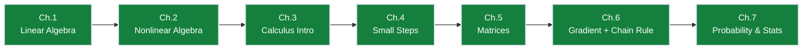
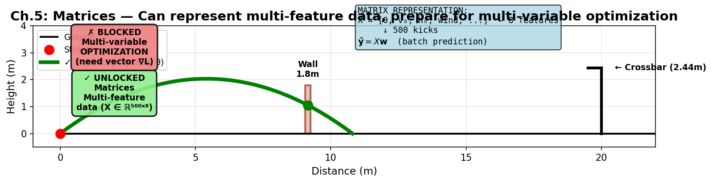

# Ch.5 — Matrices, Linear Systems, and Matrix Calculus

> **The story.** The matrix as a mathematical object was named by **James Joseph Sylvester in 1850** — from the Latin *matrix*, meaning "womb," because Sylvester saw it as a container giving birth to determinants. His friend **Arthur Cayley** then wrote the 1858 *Memoir on the Theory of Matrices* and gave matrices their algebra: addition, multiplication, the identity, the inverse. In 1901 Karl Pearson dragged matrices into statistics by writing least-squares regression in the now-familiar form $(X^\top X)^{-1} X^\top y$, and the rest of the 20th century was a numerical-analysis story: Householder, Wilkinson, and the LAPACK / BLAS lineage made $X^\top X$ solvable stably and at scale. Every modern deep-learning library — PyTorch, TensorFlow, JAX — sits on top of that BLAS pipeline.
>
> **Where you are in the curriculum.** Ch.1–Ch.4 worked with one variable at a time. Real set-piece data doesn't — it has strike speed, launch angle, strike zone on the boot, wall distance, wall height, wind speed, wind direction, pitch wetness, kicker fatigue. Eight-plus variables, 500 recorded free kicks. Scalars collapse. This chapter introduces **matrices**: compact containers for "apply the same linear rule to every sample in one shot," plus the matrix calculus rules you need before backprop in Ch.6.
>
> **Notation in this chapter.** $A,B$ — matrices (capital, bold-face in print); $\mathbf{x},\mathbf{y}$ — column vectors; $A_{ij}$ — the entry in row $i$, column $j$; $A\mathbf{x}$ — matrix-vector product; $AB$ — matrix-matrix product; $A^\top$ — transpose (rows and columns swapped); $A^{-1}$ — inverse (when it exists); $I$ — identity matrix; $X\in\mathbb{R}^{N\times d}$ — the **design matrix** (one row per free-kick sample, one column per feature); $\mathbf{w}\in\mathbb{R}^d$ — weight vector; $\hat{\mathbf{y}}=X\mathbf{w}+b\mathbf{1}$ — batched linear prediction.

---

## 0 · The Challenge — Where We Are

## Animation

> 🎬 *Animation placeholder — see `img/ch05_matrices-animation.gif` — generated by needle-builder agent.*


> 🎯 **The goal**: Score a free kick that clears a 1.8m wall at 9.15m distance and dips under a 2.44m crossbar at 20m, while beating the keeper's reaction time.

> ⚡ **Practitioner angle** — When your model's weight gradients explode or shapes mismatch during a forward pass, the bug is almost always a matrix algebra error — wrong dimensions, forgotten transpose, or a rank-deficient design matrix. Fluency with matrix operations means you can read a shape-error stack trace and know exactly which multiplication went wrong, without running the code again.

**What we know so far:**
- ✅ Ch.1-2: Model trajectory (line → parabola)
- ✅ Ch.3: Check constraints (find apex, verify wall/crossbar clearance)
- ✅ Ch.4: Optimize ONE parameter at a time (find best angle $\theta$ for fixed speed $v_0$)
- ❌ **But our data has 8+ features per kick, and we can only handle one at a time!**

**What's blocking us:**
Realistic free-kick data looks like this:

| Kick # | Angle $\theta$ | Speed $v_0$ | Strike zone | Wind | Wall dist | ... | Distance |
|--------|---------------|-------------|-------------|------|-----------|-----|----------|
| 1 | 38° | 10.2 m/s | Center | 2 m/s | 9.15 m | ... | 18.3 m |
| 2 | 42° | 9.8 m/s | Toe | 0 m/s | 9.15 m | ... | 17.1 m |
| ... | ... | ... | ... | ... | ... | ... | ... |
| 500 | 35° | 10.5 m/s | Instep | 1 m/s | 9.15 m | ... | 19.2 m |

**500 kicks, 8 features each** = 4000 numbers. Ch.4's single-variable tools collapse. We need:
1. **Compact notation**: Write "predict all 500 distances at once" without 500 separate equations
2. **Simultaneous fitting**: Find best weights $(w_1, w_2, \ldots, w_8)$ for all features together
3. **Efficient computation**: Use hardware-optimized matrix operations (BLAS/LAPACK)

**What this chapter unlocks:**
**Matrices** — the tool for "apply the same linear rule to every sample in one shot":
- **Design matrix** $X \in \mathbb{R}^{500 \times 8}$ (one row per kick)
- **Batch prediction** $\hat{\mathbf{y}} = X\mathbf{w}$ (500 predictions in one line!)
- **Normal equations** $\mathbf{w} = (X^\top X)^{-1} X^\top \mathbf{y}$ (closed-form solution for best weights)

This prepares us for Ch.6's multi-variable optimization (gradients as vectors, not scalars).

---

## 1 · Core Idea

A matrix is a **linear map**. It takes a vector in and produces another vector out, obeying two rules:

$$A(\mathbf{x} + \mathbf{y}) = A\mathbf{x} + A\mathbf{y} \qquad A(c\mathbf{x}) = c(A\mathbf{x})$$

That's it. Every rotation, stretch, projection, regression fit, and linear layer of a neural network is a matrix. The whole chapter is learning to *think* in three equivalent ways about $A\mathbf{x} = \mathbf{b}$ so that when you meet it in the ML book you recognise it instantly.

---

## 2 · Running Example

> 📘 **Physics-Free Path:** The "eight free-kick features" below are just **eight numbers recorded for each attempt**: $x_1, x_2, \ldots, x_8$. Think of them as columns in a spreadsheet — no physics knowledge needed. Each row is one kick attempt; each column is one measured variable.

Same knuckleball free kick, full parabolic trajectory. We want to recover the three curve parameters $(a, b, c)$ from noisy $(t_i, y_i)$ measurements — the parabola $y = at^2 + bt + c$ that best fits the data. In Ch.2 we did this with `sklearn.LinearRegression`; here we do it from scratch with one matrix solve.

Then we extend to **multi-variable regression**: given eight recorded variables per kick attempt (things like launch angle, strike speed, weather conditions, etc.), predict whether the kick scored or missed. Each variable is a column; each kick is a row.

---

## 3 · Math

### 3.1 · Vectors and matrices — shapes

A vector is a column of numbers:

$$\mathbf{x} = \begin{bmatrix} x_1 \\ x_2 \\ \vdots \\ x_d \end{bmatrix} \in \mathbb{R}^d$$

A matrix is a rectangular block:

$$A = \begin{bmatrix} a_{11} & a_{12} & \cdots & a_{1n} \\ a_{21} & a_{22} & \cdots & a_{2n} \\ \vdots & \vdots & \ddots & \vdots \\ a_{m1} & a_{m2} & \cdots & a_{mn} \end{bmatrix} \in \mathbb{R}^{m \times n}$$

> 📐 **Shape Intuition:** An $(m \times n)$ matrix has **$m$ rows (output channels)** and **$n$ columns (input channels)**. Think of it like a spreadsheet: $m$ is "how many results do I get?" and $n$ is "how many inputs am I combining?" Example: a $(3 \times 5)$ matrix takes 5 numbers in and produces 3 numbers out. When multiplying $A \cdot B$, the **inner dimensions must match** (columns of $A$ = rows of $B$), and the result has the **outer dimensions** (rows of $A$ × columns of $B$).

**Shapes first, values second.** While you're learning, stop after every operation and confirm the shape. $A B$ is legal only if $A$'s column count equals $B$'s row count; the result has $A$'s rows and $B$'s columns. Most student bugs are shape bugs in disguise.

### 3.2 · Matrix-vector product — three views of $A\mathbf{x}$

**Row view (dot-products into a column).** Each entry of $A\mathbf{x}$ is the dot product of a row of $A$ with $\mathbf{x}$:

$$(A\mathbf{x})_i = \sum_j a_{ij} x_j = \text{row}_i(A) \cdot \mathbf{x}$$

**Column view (weighted sum of columns).** $A\mathbf{x}$ is a linear combination of $A$'s columns, weighted by $\mathbf{x}$:

$$A\mathbf{x} = x_1 \mathbf{a}_1 + x_2 \mathbf{a}_2 + \cdots + x_n \mathbf{a}_n$$

This is the view that explains why the set of achievable $A\mathbf{x}$ (the **column space**) is the span of $A$'s columns.

**Transformation view (warp the space).** $A$ *does something* to every point of $\mathbb{R}^n$: stretches, rotates, shears, projects. See the left panel of the hero image — the unit square becomes a parallelogram whose sides are exactly the columns of $A$.

All three views describe the same computation. Different problems become obvious under different views. Good practitioners fluently switch.

### 3.3 · Matrix-matrix product

$(A B)_{ij} = \sum_k a_{ik} b_{kj}$ — dot product of row $i$ of $A$ with column $j$ of $B$. Shape check: $(m \times n) \cdot (n \times p) = (m \times p)$.

Compositionally: $A B$ is the matrix that performs "first apply $B$, then apply $A$". Matrix multiplication is associative $(AB)C = A(BC)$, distributive $A(B+C) = AB+AC$, but **not commutative** in general: $AB \neq BA$. A rotation followed by a stretch is different from a stretch followed by a rotation.

### 3.4 · Transpose

$A^\top$ swaps rows and columns: $(A^\top)_{ij} = a_{ji}$. Two identities you will use constantly:

- $(AB)^\top = B^\top A^\top$ (notice the reversal).
- $(A^\top)^\top = A$.

A matrix is **symmetric** if $A = A^\top$. Covariance matrices, $X^\top X$ gram matrices, and the Hessian of a scalar function are all symmetric.

### 3.5 · Identity, inverse, determinant

- **Identity.** $I_n$ has 1s on the diagonal and 0s elsewhere; $A I = I A = A$.
- **Inverse.** $A^{-1}$ exists iff $A$ is square and has full rank. Then $A A^{-1} = I$. Practical note: **never** compute $A^{-1}$ explicitly in code — call `np.linalg.solve(A, b)` or the equivalent. Explicit inverses are numerically worse than factorisations.
- **Determinant.** $\det(A)$ is the signed volume scale factor of the linear map. $\det(A) = 0$ iff $A$ squashes space onto a lower-dimensional subspace (columns are linearly dependent). In the hero image, $\det(A) = 1.65$ — areas are scaled by 1.65.

### 3.6 · The three views of $A\mathbf{x} = \mathbf{b}$

Solving a linear system is the same question asked three ways:

| View | "Solve $A\mathbf{x} = \mathbf{b}$" means… |
|---|---|
| Row | Find $\mathbf{x}$ that lies on the intersection of $m$ hyperplanes $\text{row}_i(A) \cdot \mathbf{x} = b_i$. |
| Column | Find weights $\mathbf{x}$ so that $\mathbf{b}$ is a linear combination of $A$'s columns. |
| Transformation | Find the pre-image of $\mathbf{b}$ under the map $A$ — "what input, when transformed, gives $\mathbf{b}$?" |

Depending on $A$'s shape there are three cases:

- **Square, full-rank $A$ (unique $\mathbf{x}$).** Invertible. Solve with $\mathbf{x} = A^{-1}\mathbf{b}$ conceptually, `np.linalg.solve(A, b)` in code.
- **Tall $A$ ($m > n$, over-determined).** More equations than unknowns — usually no exact solution. **Least-squares** minimises $\|A\mathbf{x} - \mathbf{b}\|_2^2$; this is the setting of every regression in the ML book.
- **Wide $A$ ($m < n$, under-determined).** More unknowns than equations — infinitely many solutions. Pick one by an extra rule (minimum norm, sparsity, prior).

### 3.7 · Least squares and the normal equations

This is the algebraic heart of linear regression. Stack $N$ samples into the **design matrix** $X \in \mathbb{R}^{N \times d}$, target vector $\mathbf{y} \in \mathbb{R}^N$. We want weights $\mathbf{w} \in \mathbb{R}^d$ minimising the sum of squared errors:

$$\mathcal{L}(\mathbf{w}) = \|X\mathbf{w} - \mathbf{y}\|_2^2 = (X\mathbf{w} - \mathbf{y})^\top (X\mathbf{w} - \mathbf{y})$$

Expand:

$$\mathcal{L}(\mathbf{w}) = \mathbf{w}^\top X^\top X \mathbf{w} - 2 \mathbf{w}^\top X^\top \mathbf{y} + \mathbf{y}^\top \mathbf{y}$$

Take the gradient (Section 4 below has the rules), set it to zero:

$$\nabla_\mathbf{w} \mathcal{L} = 2 X^\top X \mathbf{w} - 2 X^\top \mathbf{y} = 0 \Longrightarrow \boxed{\hat{\mathbf{w}} = (X^\top X)^{-1} X^\top \mathbf{y}}$$

These are the **normal equations**. The closed form for linear regression. No iteration, no step size — just one matrix solve. The hero image's right panel shows it fitting the free-kick trajectory in one line.

**In code.** Never use `np.linalg.inv(X.T @ X) @ X.T @ y`. Use `np.linalg.lstsq(X, y, rcond=None)` or `np.linalg.solve(X.T @ X, X.T @ y)`. These are faster, numerically stabler, and handle rank-deficient cases gracefully.

### 3.7.1 · Worked Example — Normal Equations by Hand

Let's trace **§3.7's normal equations** $\hat{\mathbf{w}} = (X^\top X)^{-1} X^\top \mathbf{y}$ with a tiny dataset: 3 free-kick measurements fitting the parabola $y = w_1 t + w_2 t^2 + b$.

**Given:** Three time-height pairs from the trajectory:

| $t$ (s) | $y$ (m) |
|---|---|
| 0.2 | 1.10 |
| 0.4 | 1.82 |
| 0.6 | 1.84 |

**Step 1: Build the design matrix** $X$ with columns $[1, t, t^2]$ (the 1s are for the bias term):

$$X = \begin{bmatrix}
1 & 0.2 & 0.04 \\
1 & 0.4 & 0.16 \\
1 & 0.6 & 0.36
\end{bmatrix}, \quad
\mathbf{y} = \begin{bmatrix} 1.10 \\ 1.82 \\ 1.84 \end{bmatrix}$$

**Step 2: Compute $X^\top X$** (multiply $(3 \times 3)^\top$ by $(3 \times 3)$ gives $3 \times 3$):

$$X^\top X = \begin{bmatrix}
1 & 1 & 1 \\
0.2 & 0.4 & 0.6 \\
0.04 & 0.16 & 0.36
\end{bmatrix}
\begin{bmatrix}
1 & 0.2 & 0.04 \\
1 & 0.4 & 0.16 \\
1 & 0.6 & 0.36
\end{bmatrix}
= \begin{bmatrix}
3 & 1.2 & 0.56 \\
1.2 & 0.56 & 0.296 \\
0.56 & 0.296 & 0.1696
\end{bmatrix}$$

**Step 3: Compute $X^\top \mathbf{y}$** (multiply $(3 \times 3)$ by $(3 \times 1)$ gives $3 \times 1$):

$$X^\top \mathbf{y} = \begin{bmatrix}
1 & 1 & 1 \\
0.2 & 0.4 & 0.6 \\
0.04 & 0.16 & 0.36
\end{bmatrix}
\begin{bmatrix} 1.10 \\ 1.82 \\ 1.84 \end{bmatrix}
= \begin{bmatrix} 4.76 \\ 2.052 \\ 1.0192 \end{bmatrix}$$

**Step 4: Solve $(X^\top X)\mathbf{w} = X^\top \mathbf{y}$** (don't invert explicitly — use Gaussian elimination or `np.linalg.solve`):

$$\mathbf{w} = \begin{bmatrix} b \\ w_1 \\ w_2 \end{bmatrix} = \begin{bmatrix} 0.01 \\ 6.48 \\ -4.89 \end{bmatrix}$$

**Result:** $\boxed{\hat{y}(t) = 6.48t - 4.89t^2 + 0.01}$

**Verify:** Plug in $t = 0.4$:
$$\hat{y}(0.4) = 6.48 \times 0.4 - 4.89 \times 0.16 + 0.01 = 2.592 - 0.782 + 0.01 = 1.82 \text{ m}$$
Matches the training data perfectly (because 3 points uniquely define a parabola)!

> 🔢 **What you just saw:** The **same operations** that fit millions of weights in a neural network, just shrunk to 3×3 matrices so you can trace every multiplication. The shape bookkeeping is critical: $X$ is $(N \times d)$, so $X^\top X$ is $(d \times d)$ and invertible if $X$ has full rank. That's why we check shapes in **§2.4** — one dimension mismatch and the whole solve breaks.

**Connect to Ch.2:** This is exactly the "Step 4: fit linearly" part of Ch.2's parabola recipe — we've now seen the matrix algebra underneath `np.polyfit(t, y, 2)`.

### 3.8 · Matrix Calculus — From One Variable to Many

#### The derivative ladder: scalar → vector → matrix

In Ch.3 you differentiated $f(x) = x^2$ and got a **single number** back: $f'(x) = 2x$.
The only thing that changes when $f$ takes a *vector* input $\mathbf{w}$ is that "the derivative" becomes a vector too — one partial derivative per input coordinate, stacked up:

$$\nabla_\mathbf{w} f = \begin{bmatrix}\partial f/\partial w_1 \\ \vdots \\ \partial f/\partial w_d\end{bmatrix}.$$

That's the whole idea. The table below just names each version:

| Input type | Output type | Derivative object | Name | Where it shows up |
|---|---|---|---|---|
| one number | one number | one number | ordinary derivative $f'(x)$ | Ch.3 |
| vector of $d$ numbers | one number | vector of $d$ numbers | **gradient** $\nabla_\mathbf{w} f$ | this chapter |
| vector in, vector out | one number per input × output pair | matrix of partial derivatives | **Jacobian** | Ch.6 |

Everything in day-to-day ML sits in row 1 or row 2. Row 3 (Jacobians) is the bridge to backprop — Ch.6 covers it fully.

---

#### The layout convention — the #1 source of confusion

Two writing styles exist. Both are correct; only one makes the gradient-descent update $\mathbf{w} \leftarrow \mathbf{w} - \eta \nabla f$ legal (same shape on both sides):

| Convention | Gradient written as | Works in $\mathbf{w} - \eta \nabla f$? |
|---|---|---|
| **Denominator layout** (this repo, PyTorch, TF) | column vector — same shape as $\mathbf{w}$ | ✅ |
| **Numerator layout** (some textbooks) | row vector — transposed | ❌ shape mismatch |

> 📌 If a gradient formula you find online has a "backwards" transpose, suspect a layout difference before assuming an error.

---

#### Quick-reference card

Memorise Rules 1–4. Rule 5 comes up in probability (Ch.7); skip it for now if you like.

| # | Function $f(\mathbf{w})$ | Gradient $\nabla_\mathbf{w} f$ | Where you'll see it |
|---|---|---|---|
| 1 | $\mathbf{a}^\top \mathbf{w}$ | $\mathbf{a}$ | Prediction: $\hat{y} = \mathbf{w}^\top\mathbf{x}$ |
| 2 | $\mathbf{w}^\top \mathbf{w}$ | $2\mathbf{w}$ | Ridge / L2 penalty |
| 3 | $\mathbf{w}^\top A \mathbf{w}$ ($A$ symmetric) | $2 A \mathbf{w}$ | Quadratic losses, Hessians |
| 4 | $\|X\mathbf{w} - \mathbf{y}\|^2$ | $2 X^\top(X\mathbf{w} - \mathbf{y})$ | Least-squares — the big one |
| 5 | $\log\det(W)$ ($W$ square, invertible) | $(W^{-1})^\top$ | Gaussian likelihoods in Ch.7 |

---

### 3.9 · Proofs of Rules 1–4

> 🗺️ **What to expect.** Rules 1–3 take two lines each — they're simple enough that working through them once makes them stick forever. Rule 4 is four steps, but it's the one that matters most: the gradient of any least-squares loss, including the normal equations. Rules 5 and the trace trick (§3.10) are optional depth — the proof uses a tool (the matrix differential) that goes beyond this chapter. The result is in the table above; skip to §4 if you're heading straight for code.

All four proofs use the same two moves:
1. **Write out** the sum explicitly — open up the dot products and matrix products into $\sum$ notation.
2. **Pick one weight** $w_k$, differentiate with respect to it (everything else is a constant), then read off the full gradient.

---

#### Rule 1 — $\nabla_\mathbf{w}(\mathbf{a}^\top \mathbf{w}) = \mathbf{a}$

In plain words: *the gradient of a dot product with a fixed vector $\mathbf{a}$ is just $\mathbf{a}$.*

Write out the dot product: $\mathbf{a}^\top \mathbf{w} = a_1 w_1 + a_2 w_2 + \cdots + a_d w_d$.

Differentiate with respect to $w_k$ — all terms except the $k$-th vanish:

$$\frac{\partial}{\partial w_k}(a_1 w_1 + \cdots + a_d w_d) = a_k.$$

The $k$-th entry of the gradient is $a_k$, so the full gradient vector is $\mathbf{a}$. $\square$

> 🏈 **Free-kick link.** Predicted distance is $\hat{y} = \mathbf{w}^\top \mathbf{x}$ — weights dotted with features. Gradient w.r.t. $\mathbf{w}$ is $\mathbf{x}$. Every linear layer in a neural network bottoms out here.

---

#### Rule 2 — $\nabla_\mathbf{w}(\mathbf{w}^\top \mathbf{w}) = 2\mathbf{w}$

In plain words: *the gradient of the squared length of $\mathbf{w}$ is twice $\mathbf{w}$* — exactly like $\frac{d}{dx}x^2 = 2x$, just one entry at a time.

Write out: $\mathbf{w}^\top \mathbf{w} = w_1^2 + w_2^2 + \cdots + w_d^2$.

Differentiate with respect to $w_k$: only the $k$-th term survives, giving $2w_k$.

Full gradient: $2\mathbf{w}$. $\square$

> 🏈 **Free-kick link.** Ridge regression adds $\lambda\|\mathbf{w}\|^2$ to the loss. Its gradient is $2\lambda\mathbf{w}$ — the force that pulls weights toward zero, preventing any single feature from dominating.

---

#### Rule 3 — $\nabla_\mathbf{w}(\mathbf{w}^\top A \mathbf{w}) = 2A\mathbf{w}$ &nbsp;(*A* symmetric)

In plain words: *differentiating a "bowl" shaped by $A$ gives the same kind of $2\cdot\text{something}$ as Rule 2, just with $A$ mixed in.*

Write out the double sum: $\mathbf{w}^\top A \mathbf{w} = \sum_i \sum_j A_{ij} w_i w_j$.

Differentiate with respect to $w_k$. A term $A_{ij} w_i w_j$ only "sees" $w_k$ when $i = k$ (contributing $A_{kj} w_j$) or $j = k$ (contributing $A_{ik} w_i$):

$$\frac{\partial}{\partial w_k}(\mathbf{w}^\top A \mathbf{w})
= \sum_{j} A_{kj} w_j \;+\; \sum_{i} A_{ik} w_i
= (A\mathbf{w})_k + (A^\top\mathbf{w})_k.$$

Because $A$ is symmetric ($A = A^\top$) both halves are identical, so the result is $2(A\mathbf{w})_k$.

Full gradient: $2A\mathbf{w}$. $\square$

> 📌 **Why symmetry matters.** Without it the answer would be $(A + A^\top)\mathbf{w}$. In ML every matrix you'll differentiate through this rule — covariance matrices, $X^\top X$, Hessians — is symmetric by construction, so $2A\mathbf{w}$ always applies.

---

#### Rule 4 — $\nabla_\mathbf{w}\|X\mathbf{w} - \mathbf{y}\|^2 = 2X^\top(X\mathbf{w} - \mathbf{y})$

This is the most important one. It is the gradient of the least-squares loss — everything from linear regression to neural-network output layers runs on this formula.

**Step 1 — Give the residual a name.** Call $\mathbf{r} = X\mathbf{w} - \mathbf{y}$ (the vector of prediction errors). Then $L = \|\mathbf{r}\|^2 = r_1^2 + r_2^2 + \cdots + r_N^2$.

**Step 2 — Differentiate with respect to $w_k$** using the Ch.3 chain rule ($\frac{d}{dx}[g(x)]^2 = 2g \cdot g'$):

$$\frac{\partial L}{\partial w_k} = \sum_{i=1}^N 2\, r_i \cdot \frac{\partial r_i}{\partial w_k}.$$

**Step 3 — Differentiate the residual.** The $i$-th error is $r_i = \sum_j X_{ij} w_j - y_i$, so $\dfrac{\partial r_i}{\partial w_k} = X_{ik}$ (only the $k$-th weight appears in $r_i$, with coefficient $X_{ik}$).

**Step 4 — Substitute and recognise the matrix form.**

$$\frac{\partial L}{\partial w_k} = 2\sum_{i=1}^N X_{ik}\, r_i = 2\bigl(X^\top \mathbf{r}\bigr)_k.$$

Stack across all weights $k$:

$$\boxed{\nabla_\mathbf{w} L = 2X^\top(X\mathbf{w} - \mathbf{y}).} \quad\square$$

**Bonus: normal equations for free.** Where does the gradient equal zero (the minimum)?

$$X^\top(X\hat{\mathbf{w}} - \mathbf{y}) = \mathbf{0}
\;\Longrightarrow\; X^\top X\,\hat{\mathbf{w}} = X^\top \mathbf{y}
\;\Longrightarrow\; \hat{\mathbf{w}} = (X^\top X)^{-1} X^\top \mathbf{y}.$$

That is the closed-form solution from §3.7 — now *derived* by calculus rather than stated as a fact.

---

### 3.10 · Optional Depth: Rule 5 and the Trace Trick

> ⏭️ **Skip this now** if you are heading to §4 or the code. Come back when Ch.7 covers Gaussian distributions and you encounter $\log\det\Sigma$.

#### Rule 5 in plain words

$\log\det(W)$ is a scalar function of a whole matrix. Differentiating it entry-by-entry in a double loop is valid but painful. The result — which you can take on faith, verify numerically, or read in *The Matrix Cookbook* — is:

$$\nabla_W \log\det(W) = (W^{-1})^\top.$$

For the covariance matrices in Ch.7 ($W$ is symmetric positive-definite), $W^{-1}$ is itself symmetric, so the gradient is simply $W^{-1}$.

> 🧪 **Why it matters.** The log-likelihood of a multivariate Gaussian contains $\log\det\Sigma$. This gradient is what lets you optimise over the covariance matrix directly rather than running numerical finite-differences.

#### The trace trick

One identity makes many matrix-derivative proofs dramatically shorter:

$$\text{tr}(AB) = \text{tr}(BA) \qquad \text{(cyclic property of trace)}.$$

The key use: Rule 5's proof applies this identity to turn $\frac{d}{dW}\log\det W$ into a one-liner. You do not need to understand *why* this works to use the five rules above — it is the engine *inside* the proof, not the result you reach for in practice.

> 📚 *The Matrix Cookbook* (Petersen & Pedersen, free PDF) lists every matrix-derivative identity with no proofs — a useful cheat-sheet once the basics are solid.

Every derivation in the ML chapters reduces to Rules 1–4 plus the chain rule (Ch.6). Rule 5 and the trace trick are back-pocket tools for probability work in Ch.7.

---

## 4 · Step by Step — fit the free-kick parabola with one matrix solve

1. Collect $(t_i, y_i)$ for $i = 1, \ldots, N$.
2. Build the design matrix $X \in \mathbb{R}^{N \times 3}$ with columns $[\mathbf{1}, \mathbf{t}, \mathbf{t}^2]$.
3. Solve $\hat{\mathbf{w}} = \arg\min_\mathbf{w} \|X\mathbf{w} - \mathbf{y}\|^2$ using `np.linalg.lstsq`.
4. Read off physics: $\hat{w}_0 \approx h_0$, $\hat{w}_1 \approx v_{0y}$, $\hat{w}_2 \approx -g/2 \approx -4.905$.
5. Predict at any new $t$: $\hat{y} = \hat{w}_0 + \hat{w}_1 t + \hat{w}_2 t^2$.

Same procedure generalises to $d$ features. Build $X$, solve, read off weights.

---

## 5 · Key Diagram

![Ch.5 hero: three panels illustrating matrices. Left panel shows a 2×2 matrix A = [[1.5, 0.5], [0.3, 1.2]] transforming the unit square into a parallelogram whose sides are the columns of A; det(A) = 1.65 is the area scale. Middle panel is the column view of Ax showing the vector sum x1·col1 + x2·col2 + x3·col3 built tip-to-tail. Right panel shows the normal equations fitting a parabola to noisy free-kick samples, recovering physics constants h0≈0.02 m, v0y≈6.44 m/s, −g/2≈−4.89.](img/ch05-matrix-views.png)

Left: the columns of $A$ tell you *where the basis vectors land*. Middle: every matrix-vector product is a weighted sum of the matrix's columns — a picture worth a thousand index-chasing proofs. Right: the entire chapter pays for itself on the trajectory-fitting problem — `(XᵀX)⁻¹Xᵀy` recovers the laws of motion from noisy data.

---

## 6 · What Can Go Wrong

- **Shape mismatches.** The commonest bug. Print `.shape` after every operation while you're learning.
- **`np.dot` vs `np.matmul` vs `@`.** For 2-D × 2-D, all three agree. For 1-D, they differ (dot product vs broadcasted matrix product). Use `@` — it's unambiguous and matches the math.
- **Explicit inverse.** `np.linalg.inv(A) @ b` is slower and less accurate than `np.linalg.solve(A, b)`. Avoid `inv()` except in derivations.
- **Rank deficiency.** If columns of $X$ are linearly dependent (e.g., one feature is a scalar multiple of another), $X^\top X$ is singular and the normal equations have infinitely many solutions. `lstsq` returns the minimum-norm one. Check with `np.linalg.matrix_rank(X)`.
- **Conditioning.** Even if $X^\top X$ is technically invertible, it can be **ill-conditioned** — tiny input changes cause huge output changes. Polynomial features of high degree are notorious. Rescale your inputs (zero mean, unit variance) before fitting.
- **Row major vs column major.** NumPy is row-major; many stats texts are column-major. When in doubt, assume $\mathbf{x}$ is a column vector and $X \in \mathbb{R}^{N \times d}$ has one sample per row — the convention in ML code.

---

## 7 · Exercises

*Three short ones — the shape drill alone catches most matrix bugs you'll ever write.*

1. **Shape drill.** $A$ is $3 \times 5$, $B$ is $5 \times 2$, $\mathbf{x}$ is a 5-vector. Which of $A\mathbf{x}$, $AB$, $BA$, $A^\top A$, $A^\top \mathbf{x}$ are legal, and what shape does each produce?
2. **Columns are images.** Verify numerically that `A @ np.eye(n)[:, k]` returns the $k$-th column of $A$ for any $A$. What does that tell you about the *transformation* view of a matrix?
3. **Recover physics.** With the 30-sample free-kick fit from Section 5, vary the noise standard deviation from 0.01 to 0.5 and plot the estimated $\hat{v}_{0y}$ against noise level. How does estimation error grow — linearly, quadratically, or something else?

---

## 8 · Where This Reappears

- **Pre-Req Ch.6.** Chain rule in matrix form — the gradient-of-a-composition machinery that `torch.autograd` automates.
- **Pre-Req Ch.7.** Covariance matrices ($\Sigma = \mathbf{X}^\top \mathbf{X} / n$ after centring) and multivariate Gaussians.
- **ML Ch.1 Linear Regression.** The normal equations *are* linear regression's closed-form solution.
- **ML Ch.2 Logistic Regression.** Same $X \mathbf{w}$ machinery, squashed through a sigmoid.
- **ML Ch.4 Neural Networks.** Every layer is $\mathbf{h} = \sigma(W \mathbf{x} + \mathbf{b})$ — a matrix-vector product plus bias plus non-linearity.
- **ML Ch.13 Dimensionality Reduction.** SVD, PCA, and low-rank approximation are pure linear algebra.
- **ML Ch.18 Transformers.** The attention score matrix is exactly $Q K^\top$ (softmax-normalised). Same $A\mathbf{x}$ all the way up the stack.

---

## 9 · Progress Check — What We Can Solve Now





✅ **Unlocked capabilities:**
- **Handle multi-feature data**: Represent 500 kicks × 8 features as a matrix $X \in \mathbb{R}^{500 \times 8}$
- **Batch predictions**: Compute all 500 predictions with one line: $\hat{\mathbf{y}} = X\mathbf{w}$
- **Fit all parameters at once**: Solve normal equations $\mathbf{w} = (X^\top X)^{-1} X^\top \mathbf{y}$ to get best $(w_1, \ldots, w_8)$ simultaneously
- **Understand ML notation**: Every "$X\mathbf{w} + \mathbf{b}$" in PyTorch/TensorFlow is this chapter's machinery

**Example**: Given 500 free kicks with features [angle, speed, strike zone, wind, ...], find the linear model that predicts distance. With matrices, this is:
```python
w = np.linalg.lstsq(X, y)  # One line!
```
Without matrices, this would be 500 separate equations — completely impractical.

❌ **Still can't solve:**
- ❌ **Multi-variable OPTIMIZATION**: We can solve $\mathbf{w}$ when a closed-form exists (like normal equations). But what if the loss has no closed form (e.g., logistic regression, neural nets)? We need gradient descent in **vector form** — that's **Ch.6**
- ❌ **Composed transformations**: What if we stack layers (like neural networks): $\mathbf{h}_1 = f_1(X), \mathbf{h}_2 = f_2(\mathbf{h}_1), \ldots$? We need the **chain rule for matrices** — also **Ch.6**
- ❌ **Constraint #3 (Keeper speed)**: Still haven't modeled the full 3D trajectory + timing
- ❌ **Handle uncertainty**: Still treating data as deterministic — that's **Ch.7**

**Real-world status**: We can now say "Given $(\theta, v_0, \text{wind}, \ldots)$, predict distance using ALL features at once." But we still can't optimize multi-variable models that lack closed-form solutions.

**Next up:** Ch.6 gives us **gradients** (vectors pointing downhill) and the **matrix chain rule** (backpropagation) — the final pieces needed to optimize *any* differentiable model.

---

## 10 · References

- **Gilbert Strang — *Introduction to Linear Algebra* (MIT OCW 18.06).** The canonical undergraduate text and free video lectures; the "three views of $A\mathbf{x} = \mathbf{b}$" framing of Section 3.6 is lifted directly from his lectures.
- **Jon Krohn — *Linear Algebra II: Tensors, Matrices & Dimensions*.** Video companion, builds on the Ch.1 segment.
- **3Blue1Brown — *Essence of Linear Algebra*, eps. 3–7.** The transformation view is much more intuitive after these videos than after any textbook.
- **Petersen & Pedersen — *The Matrix Cookbook*** (free PDF). Every matrix-calculus identity you'll ever need, no proofs, densely indexed. Bookmark it.
- **Trefethen & Bau — *Numerical Linear Algebra*.** If you ever need to know *why* `np.linalg.lstsq` is better than `inv`, this is the book.
