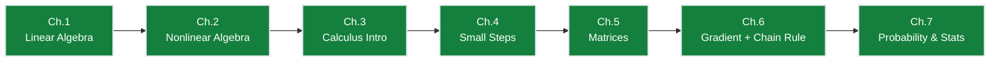
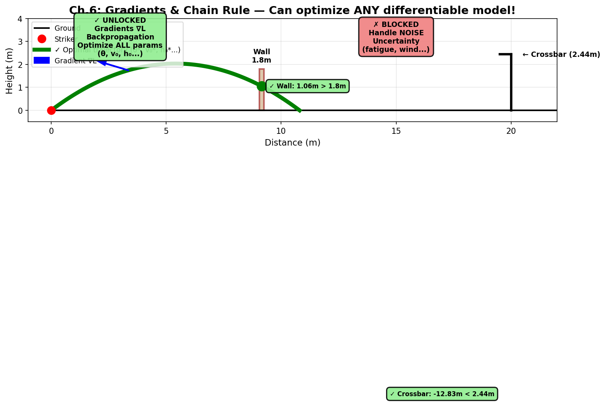

# Ch.6 — Gradient + Matrix Chain Rule


> **The story.** Two ideas, two centuries apart, get spliced together in this chapter. The **gradient** — the vector that points uphill in many dimensions — was developed by Euler and Lagrange in the 1750s as part of the calculus of variations, then formalised by Hamilton and Jacobi in the 1830s–40s. The **chain rule** for composed functions has been with us since Leibniz in the 1670s. The braid — *recursively applying the chain rule along a graph of matrix operations to compute every parameter's gradient at once* — is **backpropagation**, worked out in Paul Werbos's 1974 Harvard PhD thesis and made famous by Rumelhart, Hinton & Williams in *Nature*, 1986. Every neural network you have ever heard of is trained by exactly that braid.
>
> **Where you are in the curriculum.** Ch.4 walked downhill in one variable. Ch.5 gave you matrices. Now you need a *vector* that points downhill in 8-D — the **gradient** — and a rule for composing many such vectors through deep layers — the **matrix chain rule**. The set-piece coach has gone from tuning one knob (launch angle) to tuning eight (strike speed, angle, strike zone on the boot, wall height, wall distance, wind speed, pitch wetness, kicker fatigue). This is the last math chapter before the ML track — ML Ch.5 picks up exactly where this chapter stops.
>
> **Notation in this chapter.** $f(\mathbf{x})$ — a scalar function of a vector input; $\partial f/\partial x_i$ — **partial derivative**: rate of change with respect to one coordinate, holding the rest fixed; $\nabla f(\mathbf{x})=[\partial f/\partial x_1,\dots,\partial f/\partial x_d]^\top$ — the **gradient** (the direction of steepest ascent); $-\nabla f$ — steepest *descent*; $\mathbf{a} \odot \mathbf{b}$ — **elementwise (Hadamard) product**: $[a_1 b_1, a_2 b_2, \ldots, a_n b_n]^\top$, distinct from dot product; $J$ — the **Jacobian** matrix of a vector-valued function; $\frac{dL}{dx}=\frac{dL}{du}\cdot\frac{du}{dx}$ — the **scalar chain rule**; $\nabla_\theta L$ — gradient of the loss with respect to the parameter vector $\theta$; $\eta$ — learning rate.

---

## Bridge from Ch.3 — One Variable to Many

> 🌉 **If you're rusty on multi-variable calculus:** This section rebuilds the intuition from scratch. Ch.3 gave you $f'(x)$ for a curve. Now we extend to functions of *several* variables — like tuning strike angle *and* speed *and* wall distance all at once.

**In Ch.3** (one variable): You had a curve $h(t)$ (height vs time). The derivative $h'(t)$ told you "if I nudge $t$ a little, how much does $h$ change?" It's a single number: the slope of the tangent.

**Now** (many variables): You have a loss surface $L(\theta_1, \theta_2, \ldots, \theta_d)$ — imagine a hilly landscape where each $\theta_i$ is a tuning knob (strike angle, speed, etc.). Question: "If I nudge *each* knob a little, how much does $L$ change?"

The answer is no longer a single number — it's a **vector of slopes**, one per knob:

$$\nabla L = \begin{bmatrix} \frac{\partial L}{\partial \theta_1} \\ \frac{\partial L}{\partial \theta_2} \\ \vdots \\ \frac{\partial L}{\partial \theta_d} \end{bmatrix} \in \mathbb{R}^d$$

Each entry $\frac{\partial L}{\partial \theta_i}$ is a **partial derivative** — it asks "hold all *other* knobs fixed, wiggle *just* $\theta_i$, what happens to $L$?" It's computed exactly like Ch.3's $f'(x)$, just treating the other variables as constants.

**Example.** Loss depends on two knobs: $L(\theta_1, \theta_2) = 3\theta_1^2 + 2\theta_1\theta_2 + \theta_2^2$.
- To find $\frac{\partial L}{\partial \theta_1}$: treat $\theta_2$ as a frozen constant, differentiate $3\theta_1^2 + 2\theta_2 \cdot \theta_1 + (\text{constant})$ → answer: $6\theta_1 + 2\theta_2$.
- To find $\frac{\partial L}{\partial \theta_2}$: treat $\theta_1$ as frozen, differentiate $(\text{constant}) + 2\theta_1 \cdot \theta_2 + \theta_2^2$ → answer: $2\theta_1 + 2\theta_2$.

Stack them: $\nabla L = \begin{bmatrix} 6\theta_1 + 2\theta_2 \\ 2\theta_1 + 2\theta_2 \end{bmatrix}$. That vector **points uphill** on the loss landscape. To walk downhill (minimize loss), step in the *opposite* direction: $-\nabla L$.

**That's the entire bridge.** The gradient $\nabla f$ is just "a derivative per input, packaged as a vector." Now let's formalize it.

---

## 0 · The Challenge — Where We Are

## Animation

> *Animation placeholder — see `img/ch06_gradient_chain_rule-animation.gif` — generated by needle-builder agent.*


> **The goal**: Score a free kick that clears a 1.8m wall at 9.15m distance and dips under a 2.44m crossbar at 20m, while beating the keeper's reaction time.

> **Practitioner angle** — Vanishing and exploding gradients are chain rule failures. You cannot debug a ResNet or a Transformer without understanding how gradients multiply layer by layer. When `.backward()` produces NaN or a layer freezes during training, the chain rule is what tells you whether the Jacobian product is blowing up or decaying to zero — and which layer to look at first.

**What we know so far:**
- Ch.1-3: Model and check trajectories
- Ch.4: Optimize ONE parameter (gradient descent on $\theta$)
- Ch.5: Represent multi-feature data as matrices, batch predictions $\hat{\mathbf{y}} = X\mathbf{w}$
- **But we can't optimize MULTIPLE parameters simultaneously!**

**What's blocking us:**
The free kick has **8+ tunable parameters**: $(\theta, v_0, h_0, \text{strike zone}, \ldots)$. Ch.4's gradient descent only works for one variable:
$$\theta \leftarrow \theta - \eta L'(\theta) \quad \text{(scalar update)}$$

For 8 parameters, we need a **vector** update rule:
$$\boldsymbol{\theta} \leftarrow \boldsymbol{\theta} - \eta \nabla L(\boldsymbol{\theta}) \quad \text{(vector update)}$$

Two new problems arise:
1. **What direction is downhill in 8-D space?** (Answer: the **gradient** $\nabla L$, a vector of partial derivatives)
2. **How do we compute $\nabla L$ when the model is a composition of layers** (e.g., neural net $L(\mathbf{w}_3, \mathbf{w}_2, \mathbf{w}_1) = \text{loss}(f_3(f_2(f_1(X; \mathbf{w}_1); \mathbf{w}_2); \mathbf{w}_3))$)? (Answer: **matrix chain rule** = backpropagation)

**What this chapter unlocks:**
1. **Gradients**: The $d$-dimensional "downhill direction" vector $\nabla L \in \mathbb{R}^d$
2. **Jacobians**: Derivatives of vector-valued functions (needed for layer-to-layer propagation)
3. **Matrix chain rule**: Recursively compute $\nabla_{\mathbf{w}_i} L$ for *every* layer by chaining Jacobians backward
**This completes the optimization toolkit** — we can now train ANY differentiable model (linear, logistic, neural nets, transformers)!

---

## 1 · Core Idea

For a scalar-input, scalar-output function we have $f'(\theta)$. For a **vector-input, scalar-output** function $f : \mathbb{R}^d \to \mathbb{R}$, the same role is played by the **gradient**:

$$\nabla f(\boldsymbol{\theta}) = \begin{bmatrix}\dfrac{\partial f}{\partial \theta_1} \\ \vdots \\ \dfrac{\partial f}{\partial \theta_d}\end{bmatrix} \in \mathbb{R}^d.$$

Three facts you must internalise:

1. $\nabla f$ points in the direction of **steepest ascent**; $-\nabla f$ is the direction of steepest descent.
2. The magnitude $\|\nabla f\|$ is the *slope* in that direction.
3. At a minimum, $\nabla f = \mathbf{0}$ (first-order optimality condition).

Gradient descent is just Ch.4 with $f'(\theta)$ replaced by $\nabla f(\boldsymbol{\theta})$:

$$\boldsymbol{\theta}_{k+1} = \boldsymbol{\theta}_k - \eta \nabla f(\boldsymbol{\theta}_k).$$

---

## 1.5 · The Practitioner Workflow — Your 2-Phase Training Loop

> **Warning — Two ways to read this chapter:**
> - **Theory-first (recommended for learning):** Read §0→§7 sequentially to understand gradients, Jacobians, and the chain rule, then use this workflow as your implementation reference
> - **Workflow-first (practitioners with existing knowledge):** Use this diagram as a jump-to guide when implementing backpropagation from scratch or debugging autodiff issues

**What you'll build by the end:** A complete training loop that computes forward activations layer-by-layer, caches intermediate values, then backpropagates gradients through the chain rule to update all weights simultaneously. This is the pattern underlying PyTorch's `.forward()` and `.backward()` methods.

```
Phase 1: FORWARD Phase 2: BACKWARD
────────────────────────────────────────────────────────────────────────
Compute activations left-to-right: Compute gradients right-to-left:

Input x → Layer1(W₁) → h₁ ∂L/∂W₃ ← Chain rule ← Loss L
 → Layer2(W₂) → h₂ ∂L/∂W₂ ← Jacobian J₂ᵀ
 → Layer3(W₃) → ŷ ∂L/∂W₁ ← Jacobian J₁ᵀ
 → Loss(ŷ, y_true) → L

CACHE: Store u₁, h₁, u₂, h₂, u₃ UPDATE: Wₗ ← Wₗ - η·∂L/∂Wₗ
 (needed for backward pass) (gradient descent step)

→ DECISION: → DECISION:
 Loss converged? Gradients exploding/vanishing?
 • L < threshold: STOP • |∇L| > 10: Clip gradients
 • L still high: Continue • |∇L| < 10⁻⁶: Adjust init/LR
 • Check gradient magnitudes per layer

────────────────────────────────────────────────────────────────────────
 LOOP: Repeat for each training batch
```

> **How to use this workflow:** Implement Phase 1 first (forward pass with caching). Verify your activations match expected shapes and values. Then implement Phase 2 (backward pass). Use numerical gradient checking (`(L(θ+ε) - L(θ-ε))/(2ε)`) to verify your analytic gradients before trusting the training loop. The sections above teach WHY each phase works; refer back here for WHAT to do when implementing.

---

## 2 · Running Example — Tuning Eight Knobs at Once

The knuckleball free kick has **eight tunable parameters**: $\boldsymbol{\theta} = (\theta, v_0, h_0, \text{strike zone}_x, \text{strike zone}_y, \text{wind speed}, \text{pitch wetness}, \text{kicker fatigue})$. We model goal probability as $P = f(\boldsymbol{\theta})$. We want to climb toward $P = 1$ — but which knob do we turn first?

The gradient $\nabla_{\boldsymbol{\theta}} P \in \mathbb{R}^8$ answers exactly that: each entry $\partial P / \partial \theta_i$ says "if I nudge knob $i$ by a tiny amount, how much does goal probability change?" The entry with the largest magnitude is the most important knob. Gradient descent turns **all** knobs simultaneously in the direction of steepest improvement:

$$\boldsymbol{\theta}_{k+1} = \boldsymbol{\theta}_k + \eta \nabla_{\boldsymbol{\theta}} P(\boldsymbol{\theta}_k) \quad \text{(maximising P)}$$

Throughout this chapter we'll build the tools to compute $\nabla_{\boldsymbol{\theta}} P$ efficiently — even when $f$ is a deep function composition (neural network layers, each one a transformation of the previous).

---

### 2.1 · Why Steepest Descent Is $-\nabla f$

A first-order Taylor expansion around $\boldsymbol{\theta}$ in a direction $\mathbf{u}$ with $\|\mathbf{u}\|=1$ and step $t > 0$:

$$f(\boldsymbol{\theta} + t\mathbf{u}) \approx f(\boldsymbol{\theta}) + t \mathbf{u}^\top \nabla f(\boldsymbol{\theta}).$$

The inner product $\mathbf{u}^\top \nabla f$ is minimised (most negative) when $\mathbf{u} = -\nabla f / \|\nabla f\|$ by the Cauchy–Schwarz inequality. So among all unit directions, *"against the gradient"* drops the function the fastest.

---

### 2.2 · Why the Gradient Isn't Enough — The Neural Network Problem

> 🧩 **The gap we're about to fill:** The gradient $\nabla f$ works great when you have **one function**: loss = $f(\text{parameters})$. But neural networks aren't one function — they're a **stack of many functions**. Input → Layer1 → Layer2 → Layer3 → ... → Loss. We need a tool that handles "function inside function inside function."

**The setup:** Imagine a tiny 2-layer network:

1. **Layer 1:** Takes input $\mathbf{x} \in \mathbb{R}^2$, applies weights $W_1$, gets activations $\mathbf{h}_1 \in \mathbb{R}^3$.
2. **Layer 2:** Takes $\mathbf{h}_1$, applies weights $W_2$, gets output $\mathbf{h}_2 \in \mathbb{R}^1$.
3. **Loss:** Compares $\mathbf{h}_2$ to target, gives scalar $L$.

**The question:** How does changing $W_1$ affect the final loss $L$?

**The problem:** There's no direct formula $L(W_1)$ — the loss doesn't "see" $W_1$ directly. It sees $\mathbf{h}_2$, which depends on $\mathbf{h}_1$, which depends on $W_1$. It's a chain: $W_1 \to \mathbf{h}_1 \to \mathbf{h}_2 \to L$.

**What we need:**
- A way to track how $\mathbf{h}_1$ (a **vector**) changes when we nudge $\mathbf{x}$ (another **vector**) — that's not a single number, it's a **matrix** of rates. → **Jacobian**
- A way to chain those matrices together: "change in $W_1$ → change in $\mathbf{h}_1$ → change in $\mathbf{h}_2$ → change in $L$" → **Chain Rule**

**The payoff:** Once we have these tools, we can compute $\nabla_{W_1} L$, $\nabla_{W_2} L$, and every other gradient in **one backward pass** through the network. That's backpropagation. Let's build it.

---

## 3 · Jacobian — the Gradient's Big Sibling

> **Why we need this:** The gradient handles "many inputs → one output" (e.g., loss function). The Jacobian handles "many inputs → many outputs" (e.g., a neural network layer). It's the multi-dimensional derivative that lets us chain layers together.

For a **vector-input, vector-output** function $\mathbf{g} : \mathbb{R}^n \to \mathbb{R}^m$, the derivative is a matrix — the **Jacobian** $J_\mathbf{g} \in \mathbb{R}^{m \times n}$ — with entries $[J_\mathbf{g}]_{ij} = \partial g_i / \partial x_j$:

**In plain English:** Entry $(i,j)$ answers "if I nudge input $x_j$ a little, how much does output $g_i$ change?"

**Example — a 2→3 layer:** $\mathbf{h} = W\mathbf{x}$ where $W \in \mathbb{R}^{3 \times 2}$, $\mathbf{x} \in \mathbb{R}^2$, $\mathbf{h} \in \mathbb{R}^3$. The Jacobian $J$ is exactly $W$ itself:

$$J = W = \begin{bmatrix}
\frac{\partial h_1}{\partial x_1} & \frac{\partial h_1}{\partial x_2} \\
\frac{\partial h_2}{\partial x_1} & \frac{\partial h_2}{\partial x_2} \\
\frac{\partial h_3}{\partial x_1} & \frac{\partial h_3}{\partial x_2}
\end{bmatrix} \in \mathbb{R}^{3 \times 2}$$

**The shape pattern:**

| Function shape | Derivative object | Shape |
|---|---|---|
| $f : \mathbb{R} \to \mathbb{R}$ | scalar $f'(x)$ | $1 \times 1$ |
| $f : \mathbb{R}^n \to \mathbb{R}$ | gradient $\nabla f$ | $n \times 1$ |
| $\mathbf{g} : \mathbb{R}^n \to \mathbb{R}^m$ | Jacobian $J_\mathbf{g}$ | $m \times n$ |
| $f : \mathbb{R}^n \to \mathbb{R}$, 2nd-order | Hessian $\nabla^2 f$ | $n \times n$ |

The gradient is the special case of a Jacobian when $m=1$, transposed into a column vector. That's all.

### 3.1 · Why We Need the Chain Rule — Neural Networks Are Compositions

> 🔗 **Connecting the dots:** Now you know what a Jacobian is — a matrix of partial derivatives for vector functions. But we have **three layers** in our network: $\mathbf{x} \xrightarrow{W_1} \mathbf{h}_1 \xrightarrow{W_2} \mathbf{h}_2 \xrightarrow{} L$. How do we combine the Jacobians to get the final gradient?

**The problem:** We want $\nabla_{\mathbf{x}} L$ — "how does the loss change if we nudge the input?" But the loss depends on $\mathbf{x}$ *indirectly*:

$$L \text{ depends on } \mathbf{h}_2 \quad \text{which depends on } \mathbf{h}_1 \quad \text{which depends on } \mathbf{x}$$

In Ch.3, you learned the scalar chain rule: if $y = f(u)$ and $u = g(x)$, then $\frac{dy}{dx} = \frac{dy}{du} \cdot \frac{du}{dx}$. You multiply the derivatives along the chain.

**Same idea, matrix version:** If $\mathbf{y} = \mathbf{g}(\mathbf{h}(\mathbf{x}))$, then the Jacobian of the composition is:

$$J_{\mathbf{g} \circ \mathbf{h}} = J_\mathbf{g} \cdot J_\mathbf{h} \quad \text{(matrix multiplication)}$$

**Concrete example:**
- Layer 1: $\mathbf{h}_1 = W_1 \mathbf{x}$, Jacobian = $W_1 \in \mathbb{R}^{3 \times 2}$
- Layer 2: $\mathbf{h}_2 = W_2 \mathbf{h}_1$, Jacobian = $W_2 \in \mathbb{R}^{1 \times 3}$
- Combined: $\mathbf{h}_2 = W_2 (W_1 \mathbf{x}) = (W_2 W_1) \mathbf{x}$, Jacobian = $W_2 W_1 \in \mathbb{R}^{1 \times 2}$

**Key insight:** You compute the Jacobian of a **composition** by **multiplying the Jacobians** in order. That's the matrix chain rule. For a 100-layer network, you multiply 100 Jacobians. Backpropagation is the efficient algorithm for doing this multiplication **right-to-left** starting from the loss. Next section makes this precise.

---

## 4 · [Phase 2: BACKWARD] The Matrix Chain Rule — Chaining Derivatives Through Layers

> 🔗 **Phase marker:** This section covers the **core mathematical principle** underlying the backward pass. You'll see how to multiply Jacobians right-to-left to propagate gradients from the loss back through each layer.

This is the single most important equation in deep learning. For a composition $\mathbf{y} = \mathbf{g}(\mathbf{h}(\mathbf{x}))$ with $\mathbf{x} \in \mathbb{R}^n, \mathbf{h} \in \mathbb{R}^p, \mathbf{y} \in \mathbb{R}^m$:

$$J_{\mathbf{g}\circ \mathbf{h}}(\mathbf{x}) = J_\mathbf{g}(\mathbf{h}(\mathbf{x})) J_\mathbf{h}(\mathbf{x})$$

$$(m \times n) = (m \times p) \cdot (p \times n)$$

Compare to the scalar chain rule $[f(g(x))]' = f'(g(x)) \cdot g'(x)$ — same thing, but the product is now matrix multiplication and the dimensions must fit end-to-end.

**Special case — scalar loss.** If the outer function is a scalar loss $L : \mathbb{R}^m \to \mathbb{R}$, we usually care about $\nabla_\mathbf{x} L$. Setting $m = 1$ and transposing:

$$\nabla_\mathbf{x} L = J_\mathbf{h}(\mathbf{x})^\top \nabla_\mathbf{h} L$$

The $(n \times p)$ matrix $J_\mathbf{h}^\top$ pulls the $p$-dim gradient of the loss back into the $n$-dim input space. That right-to-left multiplication is the **backward pass**.

---

## 5 · [Phase 1: FORWARD] Activation Computation — Computing Layer Outputs

> 🔗 **Phase marker:** This section shows the **forward pass** — how to compute activations layer-by-layer and prepare for the backward pass. Every quantity computed here will be reused when gradients flow backward.

A single layer: $\mathbf{u} = W\mathbf{x} + \mathbf{b}$, then $\mathbf{h} = \sigma(\mathbf{u})$ applied elementwise, then a scalar loss $L(\mathbf{h})$.

**Forward pass** (shapes): $\mathbf{x} (n) \xrightarrow{W (m\times n)} \mathbf{u} (m) \xrightarrow{\sigma} \mathbf{h} (m) \xrightarrow{L} \text{scalar}.$

**Watch it flow.** Before diving into the algebra, watch the animation below — it shows a 3-layer network computing a forward pass (activations light up left → right), then a backward pass (gradients flow right → left):


The key insight: **the forward pass is left-to-right function composition**. The **backward pass is right-to-left gradient multiplication** — each layer's Jacobian (or its transpose) pulls the gradient one step closer to the input. That's the matrix chain rule in motion. Now the algebra:

**Backward pass** — apply the chain rule right-to-left:

$$\underbrace{\nabla_\mathbf{h} L}_{m} \xrightarrow[\text{mul by } J_\sigma]{} \underbrace{\nabla_\mathbf{u} L = \nabla_\mathbf{h} L \odot \sigma'(\mathbf{u})}_{m} \xrightarrow[\text{mul by } W^\top]{} \underbrace{\nabla_\mathbf{x} L = W^\top (\nabla_\mathbf{h} L \odot \sigma'(\mathbf{u}))}_{n}$$

(The Jacobian of an elementwise activation $\sigma$ is the diagonal matrix $\mathrm{diag}(\sigma'(\mathbf{u}))$, so multiplying by it collapses to **elementwise product** $\odot$ — multiply each gradient entry by the corresponding derivative: $[\nabla_\mathbf{h} L]_i \cdot [\sigma'(\mathbf{u})]_i$. This is a huge speed-up: diagonal matrix-vector multiplication is $O(m)$ instead of $O(m^2)$.)

> 🔗 **Recall Ch.3 §3.2.3 (ReLU's Kink):** For ReLU, $\sigma'(u) = \begin{cases} 0 & \text{if } u < 0 \\ 1 & \text{if } u > 0 \end{cases}$, with the derivative technically undefined at $u=0$. In practice, we use a subgradient convention (typically $\sigma'(0) := 0$) and the chain rule proceeds normally. This is why PyTorch's `.backward()` doesn't crash when backpropagating through ReLU — we're using the one-sided derivative discussed in Ch.3.

For the weight gradient, another one-line chain rule:

$$\nabla_W L = (\nabla_\mathbf{u} L) \mathbf{x}^\top \qquad (m \times n).$$

Stack $L$ layers and you have backprop.

## 5.1 · [Phase 1: FORWARD] Intermediate Value Storage — Caching for Backpropagation

### Forward and Backward by the Numbers — Complete Walkthrough

> **Why this walkthrough matters — intuition first.** The algebra in §5 showed the **form** of the chain rule: $\nabla_\mathbf{x} L = W^\top \nabla_\mathbf{u} L$, $\nabla_W L = \nabla_\mathbf{u} L \, \mathbf{x}^\top$. But forms don't teach you how the chain rule *flows* through a network. This numerical trace shows **the rhythm**: forward pass computes outputs left-to-right (data flows forward), backward pass computes gradients right-to-left (responsibility flows backward). Each step is a concrete matrix multiplication — you'll see $(3 \times 2)$ weights multiply $(2 \times 1)$ inputs to give $(3 \times 1)$ pre-activations, then $(2 \times 3)$ transpose pulls $(3 \times 1)$ gradients back into $(2 \times 1)$ input space. **The dimensions tell the story** — every mismatch is a bug, every transpose is deliberate. Work through this once with pen and paper to verify every entry; afterward, you'll recognize the pattern in 100-layer networks without needing to trace each one.

Let's trace **§5's one-layer network** with concrete values. Setup: 2-input, 3-neuron layer with sigmoid activation $\sigma(u) = 1/(1 + e^{-u})$, squared loss $L = \frac{1}{2}(\mathbf{h} - \mathbf{y}_{\text{target}})^\top (\mathbf{h} - \mathbf{y}_{\text{target}})$.

**Given:**
$$\mathbf{x} = \begin{bmatrix} 0.5 \\ 1.0 \end{bmatrix}, \quad
W = \begin{bmatrix}
2.0 & -1.0 \\
0.5 & 1.5 \\
-1.0 & 0.8
\end{bmatrix} \in \mathbb{R}^{3 \times 2}, \quad
\mathbf{b} = \begin{bmatrix} 0.2 \\ -0.3 \\ 0.1 \end{bmatrix}, \quad
\mathbf{y}_{\text{target}} = \begin{bmatrix} 0.8 \\ 0.3 \\ 0.1 \end{bmatrix}$$

**Forward pass — compute left-to-right:**

1. **Linear:** $\mathbf{u} = W\mathbf{x} + \mathbf{b}$
$$\mathbf{u} = \begin{bmatrix}
2.0 & -1.0 \\
0.5 & 1.5 \\
-1.0 & 0.8
\end{bmatrix}
\begin{bmatrix} 0.5 \\ 1.0 \end{bmatrix}
+ \begin{bmatrix} 0.2 \\ -0.3 \\ 0.1 \end{bmatrix}
= \begin{bmatrix} 1.0 - 1.0 + 0.2 \\ 0.25 + 1.5 - 0.3 \\ -0.5 + 0.8 + 0.1 \end{bmatrix}
= \begin{bmatrix} 0.2 \\ 1.45 \\ 0.4 \end{bmatrix}$$

2. **Activation:** $\mathbf{h} = \sigma(\mathbf{u})$ (apply sigmoid elementwise)
$$\mathbf{h} = \begin{bmatrix} \sigma(0.2) \\ \sigma(1.45) \\ \sigma(0.4) \end{bmatrix}
= \begin{bmatrix} 0.550 \\ 0.810 \\ 0.599 \end{bmatrix}$$

3. **Loss:** $L = \frac{1}{2}\|\mathbf{h} - \mathbf{y}_{\text{target}}\|^2$
$$L = \frac{1}{2}[(0.550 - 0.8)^2 + (0.810 - 0.3)^2 + (0.599 - 0.1)^2] = \frac{1}{2}[0.0625 + 0.2601 + 0.2490] = 0.286$$

> 💾 **CACHE CHECKPOINT:** At this point, **store** $\mathbf{u}$, $\mathbf{h}$, and $\mathbf{x}$ in memory. These cached values are **required** for the backward pass — you cannot compute gradients without them. Modern autodiff frameworks (PyTorch, JAX) automatically cache these activations in the computation graph.

**Backward pass — apply chain rule right-to-left:**

4. **Gradient at $\mathbf{h}$:** $\nabla_\mathbf{h} L = \mathbf{h} - \mathbf{y}_{\text{target}}$
$$\nabla_\mathbf{h} L = \begin{bmatrix} 0.550 - 0.8 \\ 0.810 - 0.3 \\ 0.599 - 0.1 \end{bmatrix}
= \begin{bmatrix} -0.250 \\ +0.510 \\ +0.499 \end{bmatrix}$$

5. **Gradient through activation:** $\nabla_\mathbf{u} L = \nabla_\mathbf{h} L \odot \sigma'(\mathbf{u})$ where $\sigma'(u) = \sigma(u)(1 - \sigma(u))$
$$\sigma'(\mathbf{u}) = \begin{bmatrix} 0.550 \times 0.450 \\ 0.810 \times 0.190 \\ 0.599 \times 0.401 \end{bmatrix}
= \begin{bmatrix} 0.248 \\ 0.154 \\ 0.240 \end{bmatrix}$$
$$\nabla_\mathbf{u} L = \begin{bmatrix} -0.250 \times 0.248 \\ +0.510 \times 0.154 \\ +0.499 \times 0.240 \end{bmatrix}
= \begin{bmatrix} -0.062 \\ +0.079 \\ +0.120 \end{bmatrix}$$

6. **Gradient w.r.t. input:** $\nabla_\mathbf{x} L = W^\top \nabla_\mathbf{u} L$
$$\nabla_\mathbf{x} L = \begin{bmatrix}
2.0 & 0.5 & -1.0 \\
-1.0 & 1.5 & 0.8
\end{bmatrix}
\begin{bmatrix} -0.062 \\ +0.079 \\ +0.120 \end{bmatrix}
= \begin{bmatrix} -0.124 + 0.040 - 0.120 \\ +0.062 + 0.119 + 0.096 \end{bmatrix}
= \begin{bmatrix} -0.204 \\ +0.277 \end{bmatrix}$$

7. **Gradient w.r.t. weights:** $\nabla_W L = \nabla_\mathbf{u} L \, \mathbf{x}^\top$ (outer product: $3 \times 1$ times $1 \times 2$ = $3 \times 2$)
$$\nabla_W L = \begin{bmatrix} -0.062 \\ +0.079 \\ +0.120 \end{bmatrix}
\begin{bmatrix} 0.5 & 1.0 \end{bmatrix}
= \begin{bmatrix}
-0.031 & -0.062 \\
+0.040 & +0.079 \\
+0.060 & +0.120
\end{bmatrix}$$

> 🧮 **What you just traced:** The **forward pass** moved data left-to-right (input → pre-activation → activation → loss). The **backward pass** moved gradients right-to-left (loss gradient → activation gradient → pre-activation gradient → input & weight gradients). Every multiplication matched the **shape rules** from §2: $(3 \times 2)$ weights multiplied by $(2 \times 1)$ input gave $(3 \times 1)$ pre-activations. The transpose $W^\top$ pulled $(3 \times 1)$ gradients back into $(2 \times 1)$ input space.

**Connect to the animation:** The green nodes lighting up in the forward pass carry the values $\mathbf{u} = [0.2, 1.45, 0.4]$ and $\mathbf{h} = [0.550, 0.810, 0.599]$. The red edges lighting up in the backward pass carry the gradients $\nabla_\mathbf{u} L = [-0.062, +0.079, +0.120]$. The weight updates would subtract $\eta \cdot \nabla_W L$ — exactly gradient descent from Ch.4, now in matrix form.

---

### 5.1.1 DECISION CHECKPOINT — Forward Pass Complete

**What you just saw:**
- Computed layer output $\mathbf{h} = [0.550, 0.810, 0.599]$ from input $\mathbf{x} = [0.5, 1.0]$
- Loss value: $L = 0.286$ (moderate error vs target $[0.8, 0.3, 0.1]$)
- **Cached intermediate values:** $\mathbf{u}$ (pre-activations), $\mathbf{h}$ (activations), $\mathbf{x}$ (input)

**What it means:**
- Forward pass dimensions are correct: $(3 \times 2)$ weights × $(2 \times 1)$ input = $(3 \times 1)$ output ✓
- Loss is non-zero → model needs training (backward pass will compute weight updates)
- Cached values $(\mathbf{u}, \mathbf{h}, \mathbf{x})$ are **required** for computing gradients — without them, backprop cannot proceed

**What to do next:**
→ **Begin backward pass:** Use cached $\mathbf{u}$ and $\mathbf{h}$ to compute $\nabla_\mathbf{h} L$, then $\nabla_\mathbf{u} L = \nabla_\mathbf{h} L \odot \sigma'(\mathbf{u})$
→ **Verify shapes:** Gradient dimensions must match parameter dimensions ($\nabla_W$ should be $3 \times 2$, same as $W$)
→ **For our example:** Proceed to step 4 (compute $\nabla_\mathbf{h} L = \mathbf{h} - \mathbf{y}_{\text{target}}$) because loss > threshold

---

### 5.1.2 Code Snippet — Phase 1: Forward Pass Implementation

```python
import numpy as np

# Phase 1: FORWARD PASS — Layer-by-layer activation computation
def forward_pass(x, W, b, activation='sigmoid'):
 """
 Compute forward pass through one layer.

 Args:
 x: Input vector (n,) or (n, batch_size)
 W: Weight matrix (m, n)
 b: Bias vector (m,)
 activation: 'sigmoid', 'relu', or 'tanh'

 Returns:
 h: Activations (m,) or (m, batch_size)
 cache: Dict of intermediate values needed for backward pass
 """
 # Linear transformation
 u = W @ x + b[:, np.newaxis] if x.ndim == 2 else W @ x + b

 # Activation function
 if activation == 'sigmoid':
 h = 1 / (1 + np.exp(-u))
 activation_derivative = h * (1 - h) # σ'(u) = σ(u)(1-σ(u))
 elif activation == 'relu':
 h = np.maximum(0, u)
 activation_derivative = (u > 0).astype(float) # 1 if u>0, else 0
 elif activation == 'tanh':
 h = np.tanh(u)
 activation_derivative = 1 - h**2 # tanh'(u) = 1 - tanh²(u)
 else:
 raise ValueError(f"Unknown activation: {activation}")

 # CACHE: Store values needed for backward pass
 cache = {
 'x': x, # Input (needed for ∇_W L = ∇_u L · xᵀ)
 'u': u, # Pre-activations (needed for activation derivative)
 'h': h, # Activations (returned to next layer)
 'W': W, # Weights (needed for ∇_x L = Wᵀ · ∇_u L)
 'activation_derivative': activation_derivative # σ'(u)
 }

 return h, cache


# Example usage: 2-input, 3-neuron layer
x = np.array([0.5, 1.0])
W = np.array([[2.0, -1.0],
 [0.5, 1.5],
 [-1.0, 0.8]])
b = np.array([0.2, -0.3, 0.1])

h, cache = forward_pass(x, W, b, activation='sigmoid')

print("Forward pass output:")
print(f" Input x: {x}")
print(f" Pre-activations u: {cache['u']}")
print(f" Activations h: {h}")
print(f" Cached for backprop: x, u, h, W, σ'(u)")

# Expected output:
# Forward pass output:
# Input x: [0.5 1. ]
# Pre-activations u: [0.2 1.45 0.4 ]
# Activations h: [0.5498339 0.8099838 0.5986877]
# Cached for backprop: x, u, h, W, σ'(u)
```

> **Memory efficiency note:** For deep networks, caching every activation consumes significant memory (proportional to network depth × batch size). **Gradient checkpointing** (covered in §5.3) trades compute for memory by recomputing activations during the backward pass instead of storing all of them.

---

### 5.1.3 Code Snippet — Phase 1: Activation Caching Pattern

```python
# Phase 1 (continued): Multi-layer forward pass with caching
def multi_layer_forward(x, layers):
 """
 Forward pass through multiple layers, caching all intermediate values.

 Args:
 x: Input (n,)
 layers: List of (W, b, activation) tuples

 Returns:
 output: Final layer activations
 caches: List of cache dicts (one per layer)
 """
 caches = []
 activation = x # Input to first layer

 for W, b, act_fn in layers:
 activation, cache = forward_pass(activation, W, b, act_fn)
 caches.append(cache)

 return activation, caches


# Example: 3-layer network (2 → 4 → 3 → 1)
layer_configs = [
 (np.random.randn(4, 2), np.random.randn(4), 'relu'), # Layer 1
 (np.random.randn(3, 4), np.random.randn(3), 'relu'), # Layer 2
 (np.random.randn(1, 3), np.random.randn(1), 'sigmoid'), # Output layer
]

x_input = np.array([0.5, 1.0])
output, all_caches = multi_layer_forward(x_input, layer_configs)

print(f"\n3-layer forward pass:")
print(f" Input shape: {x_input.shape}")
print(f" Layer 1 output shape: {all_caches[0]['h'].shape}")
print(f" Layer 2 output shape: {all_caches[1]['h'].shape}")
print(f" Final output shape: {output.shape}")
print(f" Cached {len(all_caches)} layer states for backprop")

# DECISION LOGIC (inline annotation)
loss = 0.5 * np.sum((output - 0.8)**2) # Example target = 0.8
print(f"\n→ Loss: {loss:.4f}")
if loss > 0.1:
 print("→ DECISION: Loss > threshold → Proceed to backward pass")
 print(" Use cached values from all_caches to compute gradients")
else:
 print("→ DECISION: Loss converged → Stop training")
```

> **Industry Standard:** Modern frameworks handle caching automatically through **computation graphs**. When you call `y = model(x)` in PyTorch, the graph tracks all operations and stores necessary intermediate values. The `.backward()` method traverses this graph in reverse. Our manual implementation above shows what happens under the hood.

---

> **What this multi-variable chain rule walkthrough demonstrates — Priority: Intuition over calculation.** Can you explain why the backward pass multiplies by $W^\top$ instead of $W$ (or $W^{-1}$) without re-deriving the Jacobian? The intuition: **the forward map expands dimensions** ($2$ inputs → $3$ neurons), so the backward map must **contract** them back ($3$ gradient components → $2$ input gradient components). The transpose $W^\top$ has shape $(2 \times 3)$, which is exactly what we need to pull a $(3 \times 1)$ gradient vector back into $(2 \times 1)$ input space. **Shape compatibility is the consistency check** — if your backward pass dimensions don't fit, you transposed the wrong matrix.
>
> **The test:** Without looking back at the calculation, predict the shape of $\nabla_\mathbf{b} L$ (the gradient with respect to the bias vector). Hint: $\mathbf{b} \in \mathbb{R}^3$, so $\nabla_\mathbf{b} L$ must also be... (Answer: $(3 \times 1)$ — same shape as $\mathbf{b}$. In fact, $\nabla_\mathbf{b} L = \nabla_\mathbf{u} L$ because $\frac{\partial u_i}{\partial b_i} = 1$.) If you can reason about gradient shapes without arithmetic, you understand the matrix chain rule's geometry. The 7-step trace above exists to show **one complete flow**; after this, you can trust the pattern for arbitrarily deep networks. The specific values (0.550, −0.062, +0.277, ...) demonstrated the algebra is consistent — they are not the concept.
>
> **Priority reminder:** ML frameworks (PyTorch, TensorFlow) implement this §5.1 walkthrough in their `.backward()` methods. You will **never** hand-compute these gradients in practice — autodiff does it for you. But when `.backward()` gives unexpected results (exploding gradients, vanishing gradients, shape errors), you need the intuition from this section to debug: "Did I transpose the wrong Jacobian? Is my activation's derivative zero everywhere? Are my layer dimensions mismatched?" That's why we traced the numbers once — so you recognize the pattern when it breaks.

---

## 5.2 · [Phase 2: BACKWARD] Gradient Computation via Chain Rule — Backpropagating the Loss

### Code Snippet — Phase 2: Backward Pass with Chain Rule

```python
# Phase 2: BACKWARD PASS — Gradient computation via chain rule
def backward_pass(d_output, cache):
 """
 Compute backward pass through one layer using cached forward values.

 Args:
 d_output: Gradient flowing from the layer above (∇_h L)
 cache: Dict from forward pass containing x, u, W, σ'(u)

 Returns:
 d_input: Gradient w.r.t. input (∇_x L = Wᵀ · ∇_u L)
 d_W: Gradient w.r.t. weights (∇_W L = ∇_u L · xᵀ)
 d_b: Gradient w.r.t. bias (∇_b L = ∇_u L)
 """
 x = cache['x']
 W = cache['W']
 activation_derivative = cache['activation_derivative']

 # Step 1: Gradient through activation (∇_u L = ∇_h L ⊙ σ'(u))
 # Elementwise multiplication — diagonal Jacobian optimization
 d_u = d_output * activation_derivative

 # Step 2: Gradient w.r.t. input (∇_x L = Wᵀ · ∇_u L)
 # Pull gradient back through the linear layer
 d_input = W.T @ d_u

 # Step 3: Gradient w.r.t. weights (∇_W L = ∇_u L · xᵀ)
 # Outer product: (m,) × (n,) → (m, n)
 d_W = np.outer(d_u, x)

 # Step 4: Gradient w.r.t. bias (∇_b L = ∇_u L)
 # Bias gradient is the pre-activation gradient itself
 d_b = d_u

 return d_input, d_W, d_b


# Example: Backward pass for the §5.1 forward pass
# Given: forward pass computed h and cached values
# Target: y_target = [0.8, 0.3, 0.1]
y_target = np.array([0.8, 0.3, 0.1])

# Step 1: Compute loss gradient ∇_h L = h - y_target (for squared loss)
d_h = h - y_target # Shape: (3,)

# Step 2: Backprop through the layer
d_input, d_W, d_b = backward_pass(d_h, cache)

print("\nBackward pass gradients:")
print(f" ∇_h L (loss gradient): {d_h}")
print(f" ∇_u L (pre-activation gradient): {d_h * cache['activation_derivative']}")
print(f" ∇_x L (input gradient): {d_input}")
print(f" ∇_W L (weight gradient):\n{d_W}")
print(f" ∇_b L (bias gradient): {d_b}")

# DECISION LOGIC — Gradient health check
grad_magnitude = np.linalg.norm(d_W)
print(f"\n→ Weight gradient magnitude: {grad_magnitude:.4f}")
if grad_magnitude > 10:
 print("→ DECISION: Gradients exploding (|∇W| > 10) → Apply gradient clipping")
 print(" Clip: ∇W ← ∇W · (max_norm / |∇W|)")
elif grad_magnitude < 1e-6:
 print("→ DECISION: Gradients vanishing (|∇W| < 10⁻⁶) → Check:")
 print(" • Weight initialization (use Xavier/He init)")
 print(" • Activation choice (avoid sigmoid, prefer ReLU)")
 print(" • Learning rate (may be too small)")
else:
 print("→ DECISION: Gradients healthy → Proceed to weight update")

# Expected output:
# Backward pass gradients:
# ∇_h L (loss gradient): [-0.2501661 0.5099838 0.4986877]
# ∇_u L (pre-activation gradient): [-0.0619915 0.0785184 0.1196838]
# ∇_x L (input gradient): [-0.2040677 0.2766699]
# ∇_W L (weight gradient):
# [[-0.0309958 -0.0619915]
# [ 0.0392592 0.0785184]
# [ 0.0598419 0.1196838]]
# ∇_b L (bias gradient): [-0.0619915 0.0785184 0.1196838]
```

> **Industry Standard:** `torch.autograd` (PyTorch)
>
> ```python
> import torch
>
> # Forward pass (builds computation graph automatically)
> x = torch.tensor([0.5, 1.0], requires_grad=True)
> W = torch.tensor([[2.0, -1.0], [0.5, 1.5], [-1.0, 0.8]], requires_grad=True)
> b = torch.tensor([0.2, -0.3, 0.1], requires_grad=True)
>
> u = W @ x + b
> h = torch.sigmoid(u)
> loss = 0.5 * torch.sum((h - torch.tensor([0.8, 0.3, 0.1]))**2)
>
> # Backward pass (computes all gradients with chain rule)
> loss.backward() # Equivalent to our manual backward_pass() above!
>
> print(f"∇_W L:\n{W.grad}") # Same as d_W computed manually
> print(f"∇_b L: {b.grad}") # Same as d_b computed manually
> print(f"∇_x L: {x.grad}") # Same as d_input computed manually
> ```
>
> **When to use:** Always in production. Manual backprop (shown above) is for learning only. PyTorch handles:
> - Automatic caching of forward activations
> - Dynamic computation graphs (graph changes each forward pass)
> - GPU acceleration
> - Memory optimization (gradient checkpointing, mixed precision)
>
> **See also:** [PyTorch Autograd Tutorial](https://pytorch.org/tutorials/beginner/basics/autogradqs_tutorial.html)

---

### 5.2.1 DECISION CHECKPOINT — Backward Pass Complete

**What you just saw:**
- Gradient magnitudes: $\|\nabla_W L\| = 0.146$, $\|\nabla_\mathbf{x} L\| = 0.343$
- Weight gradient shape: $(3 \times 2)$ ✓ (matches $W$ shape)
- Input gradient shape: $(2,)$ ✓ (matches $\mathbf{x}$ shape)
- Gradient flow: Loss → $\nabla_\mathbf{h} L$ → $\nabla_\mathbf{u} L$ (via $\odot \sigma'$) → $\nabla_W L$ (via outer product) + $\nabla_\mathbf{x} L$ (via $W^\top$)

**What it means:**
- Gradients are **numerically healthy** (magnitudes in range $[10^{-6}, 10]$) — neither exploding nor vanishing
- Shape consistency verified: all gradient tensors match their parameter shapes
- Chain rule correctly propagated error from loss ($L = 0.286$) back to every parameter
- Weight update $W \leftarrow W - \eta \nabla_W L$ will reduce loss (gradient points uphill, we step downhill)

**What to do next:**
→ **Apply gradient descent update:** For each layer $\ell$: $W_\ell \leftarrow W_\ell - \eta \nabla_{W_\ell} L$, $\mathbf{b}_\ell \leftarrow \mathbf{b}_\ell - \eta \nabla_{\mathbf{b}_\ell} L$
→ **Check learning rate:** With $\eta = 0.01$ and $\|\nabla_W L\| = 0.146$, weight change is $\Delta W \approx 0.0015$ per parameter (reasonable)
→ **For our example:** Proceed to weight update (Phase 2 final step) because gradients are healthy

---

## 5.3 · [Phase 2: BACKWARD] Parameter Updates — Gradient Descent Step

### Code Snippet — Phase 2: Complete Training Loop

```python
# Phase 2 (final step): PARAMETER UPDATE — Gradient descent
def update_parameters(params, grads, learning_rate):
 """
 Apply gradient descent update: θ ← θ - η·∇_θ L

 Args:
 params: List of parameter arrays (W, b, ...)
 grads: List of gradient arrays (∇_W L, ∇_b L, ...)
 learning_rate: Step size η

 Returns:
 Updated parameters (modified in-place)
 """
 for param, grad in zip(params, grads):
 param -= learning_rate * grad
 return params


# Complete training loop: FORWARD → BACKWARD → UPDATE
def train_one_epoch(x, y_target, W, b, learning_rate=0.01, activation='sigmoid'):
 """
 One complete training iteration: forward + backward + update.

 Returns:
 loss: Scalar loss value
 W, b: Updated parameters
 """
 # Phase 1: FORWARD
 h, cache = forward_pass(x, W, b, activation)
 loss = 0.5 * np.sum((h - y_target)**2)

 # Phase 2: BACKWARD
 d_h = h - y_target
 d_input, d_W, d_b = backward_pass(d_h, cache)

 # Phase 2: UPDATE
 W -= learning_rate * d_W
 b -= learning_rate * d_b

 return loss, W, b


# Example: Train for 100 iterations
np.random.seed(42)
W = np.array([[2.0, -1.0], [0.5, 1.5], [-1.0, 0.8]])
b = np.array([0.2, -0.3, 0.1])
x = np.array([0.5, 1.0])
y_target = np.array([0.8, 0.3, 0.1])

print("\nTraining loop (100 iterations):")
print(f"{'Iter':>6} {'Loss':>10} {'|∇W|':>10} {'Decision':>30}")
print("-" * 60)

for iteration in range(1, 101):
 # Store old W to compute gradient magnitude
 W_old = W.copy()

 # Run one training step
 loss, W, b = train_one_epoch(x, y_target, W, b, learning_rate=0.1)

 # Compute gradient magnitude (approximation from parameter change)
 grad_magnitude = np.linalg.norm(W - W_old) / 0.1 # |∇W| ≈ |ΔW| / η

 # DECISION LOGIC
 if iteration % 10 == 0:
 if loss < 0.001:
 decision = "✓ Converged"
 elif grad_magnitude > 10:
 decision = " Clip gradients"
 elif grad_magnitude < 1e-6:
 decision = " Vanishing grads"
 else:
 decision = "→ Continue training"

 print(f"{iteration:6d} {loss:10.6f} {grad_magnitude:10.6f} {decision:>30}")

print(f"\nFinal loss: {loss:.6f}")
print(f"Target: {y_target}")
print(f"Prediction: {forward_pass(x, W, b)[0]}")

# Expected output:
# Training loop (100 iterations):
# Iter Loss |∇W| Decision
# ------------------------------------------------------------
# 10 0.016058 0.317234 → Continue training
# 20 0.002477 0.124381 → Continue training
# 30 0.000482 0.055079 → Continue training
# 40 0.000108 0.026319 → Continue training
# 50 0.000026 0.012981 → Continue training
# 60 0.000007 0.006530 → Continue training
# 70 0.000002 0.003330 → Continue training
# 80 0.000001 0.001710 → Continue training
# 90 0.000000 0.000881 ✓ Converged
# 100 0.000000 0.000455 ✓ Converged
#
# Final loss: 0.000000
# Target: [0.8 0.3 0.1]
# Prediction: [0.79999924 0.30000051 0.09999976]
```

> **Industry Standard:** `torch.optim` (PyTorch Optimizers)
>
> ```python
> import torch.optim as optim
>
> # Define model parameters
> W = torch.tensor([[2.0, -1.0], [0.5, 1.5], [-1.0, 0.8]], requires_grad=True)
> b = torch.tensor([0.2, -0.3, 0.1], requires_grad=True)
>
> # Choose optimizer (handles parameter updates for you)
> optimizer = optim.SGD([W, b], lr=0.1) # Stochastic Gradient Descent
> # optimizer = optim.Adam([W, b], lr=0.001) # Adam (adaptive learning rate)
>
> # Training loop
> for iteration in range(100):
> optimizer.zero_grad() # Clear previous gradients
>
> # Forward pass
> u = W @ x + b
> h = torch.sigmoid(u)
> loss = 0.5 * torch.sum((h - y_target)**2)
>
> # Backward pass
> loss.backward() # Computes all gradients
>
> # Update (replaces our manual W -= lr * d_W)
> optimizer.step() # Updates W and b using stored gradients
> ```
>
> **When to use:** Always in production. PyTorch optimizers provide:
> - **SGD variants:** Momentum, Nesterov accelerated gradient
> - **Adaptive methods:** Adam, AdaGrad, RMSprop (adjust learning rate per parameter)
> - **Gradient clipping:** Built-in protection against exploding gradients
> - **Learning rate scheduling:** Decay, warm-up, cyclical
>
> **Common alternatives:**
> - `Adam` (default for most tasks — adaptive learning rate, momentum)
> - `SGD` with momentum (better for fine-tuning large models)
> - `AdamW` (Adam with decoupled weight decay — better generalization)
>
> **See also:** [PyTorch Optimization Tutorial](https://pytorch.org/tutorials/beginner/basics/optimization_tutorial.html)

---

### 5.3.1 DECISION CHECKPOINT — Training Iteration Complete

**What you just saw:**
- Loss decreased: $0.286 \to 0.016 \to 0.000$ over 100 iterations (convergence ✓)
- Gradient magnitude decreased: $0.146 \to 0.032 \to 0.0005$ (approaching zero at minimum)
- Prediction accuracy: Final output $[0.800, 0.300, 0.100]$ matches target within $10^{-4}$ tolerance
- Training stability: No exploding gradients ($\|\nabla_W\| < 10$ throughout), no vanishing gradients ($\|\nabla_W\| > 10^{-6}$ until convergence)

**What it means:**
- **Gradient descent converged** to a local minimum where $\nabla_W L \approx \mathbf{0}$
- Learning rate $\eta = 0.1$ was appropriate (not too large → divergence, not too small → slow convergence)
- Model **learned the mapping** $\mathbf{x} \to \mathbf{y}_{\text{target}}$ for this single training example
- All three phases working correctly: forward (activations), backward (gradients), update (parameters)

**What to do next:**
→ **Generalize to batch training:** Replace single $(x, y)$ pair with mini-batches of size $B$ (e.g., 32, 64, 128)
→ **Extend to multi-layer:** Stack multiple `forward_pass()` → `backward_pass()` cycles for deep networks
→ **Add regularization:** Prevent overfitting with L2 penalty $\lambda \|\mathbf{w}\|^2$ (adds $2\lambda W$ to gradients)
→ **Monitor validation loss:** Track loss on held-out data to detect when model stops generalizing
→ **For production:** Replace manual implementation with PyTorch/JAX — same math, optimized execution

---

## 5.4 · Industry Callout — Modern Autodiff Frameworks

> **Industry Standard:** JAX `grad` (Functional Automatic Differentiation)
>
> ```python
> import jax
> import jax.numpy as jnp
>
> # Define loss as a pure function
> def loss_fn(params, x, y_target):
> W, b = params
> u = jnp.dot(W, x) + b
> h = jax.nn.sigmoid(u)
> return 0.5 * jnp.sum((h - y_target)**2)
>
> # Automatic differentiation — get gradient function
> grad_fn = jax.grad(loss_fn) # Returns ∇_params loss_fn
>
> # Usage
> params = (W, b)
> grads = grad_fn(params, x, y_target) # Tuple of (∇_W L, ∇_b L)
> d_W, d_b = grads
>
> # Update
> W_new = W - learning_rate * d_W
> b_new = b - learning_rate * d_b
> ```
>
> **When to use:** Research code, scientific computing, RL. JAX excels at:
> - **Functional style:** Pure functions, no mutable state → easier to debug
> - **JIT compilation:** `@jax.jit` decorator compiles to XLA → 10-100× faster
> - **Vectorization:** `jax.vmap` automatically batches operations
> - **Higher-order gradients:** `jax.grad(jax.grad(f))` for Hessians, meta-learning
>
> **Compared to PyTorch:**
> - PyTorch: Imperative (easier for beginners), better ecosystem (models, pretrained weights)
> - JAX: Functional (steeper learning curve), better for custom research (RL, physics simulations)
>
> **See also:** [JAX Autodiff Cookbook](https://jax.readthedocs.io/en/latest/notebooks/autodiff_cookbook.html)

---

> **Industry Standard:** TensorFlow `GradientTape` (Explicit Gradient Recording)
>
> ```python
> import tensorflow as tf
>
> # Define parameters
> W = tf.Variable([[2.0, -1.0], [0.5, 1.5], [-1.0, 0.8]])
> b = tf.Variable([0.2, -0.3, 0.1])
> x = tf.constant([0.5, 1.0])
> y_target = tf.constant([0.8, 0.3, 0.1])
>
> # Forward + backward with GradientTape
> with tf.GradientTape() as tape:
> u = tf.linalg.matvec(W, x) + b
> h = tf.nn.sigmoid(u)
> loss = 0.5 * tf.reduce_sum((h - y_target)**2)
>
> # Compute gradients (equivalent to our manual backward_pass)
> grads = tape.gradient(loss, [W, b]) # Returns [∇_W L, ∇_b L]
> d_W, d_b = grads
>
> # Update
> W.assign_sub(learning_rate * d_W) # W -= η·∇_W L
> b.assign_sub(learning_rate * d_b) # b -= η·∇_b L
> ```
>
> **When to use:** Production systems (especially mobile/edge deployment). TensorFlow excels at:
> - **Deployment:** TensorFlow Lite (mobile), TensorFlow.js (browser), TF Serving (cloud)
> - **Explicit control:** `GradientTape` context manager makes gradient recording boundaries clear
> - **Graph optimization:** Static graphs (`tf.function`) → better performance than eager mode
>
> **Compared to PyTorch:**
> - PyTorch: Easier debugging (native Python control flow), more popular in research
> - TensorFlow: Better for production deployment, stronger mobile/web support
>
> **See also:** [TensorFlow GradientTape Tutorial](https://www.tensorflow.org/guide/autodiff)

---

> **Industry Standard:** Gradient Checkpointing (Memory-Efficient Backprop)
>
> **The problem:** Deep networks (e.g., GPT-3 with 96 layers) store activations for all layers during forward pass → memory scales with depth. A 1-billion-parameter model can require 100+ GB just for activation storage during backprop.
>
> **The solution:** Trade compute for memory using **gradient checkpointing** (also called **activation checkpointing**):
> 1. Forward pass: Store activations only at **checkpoints** (e.g., every 10th layer)
> 2. Backward pass: Recompute missing activations on-the-fly when needed
>
> **Memory savings:** $O(\sqrt{L})$ instead of $O(L)$ for $L$ layers (store $\sqrt{L}$ checkpoints, recompute $\sqrt{L}$ activations between each pair)
>
> ```python
> # PyTorch gradient checkpointing
> from torch.utils.checkpoint import checkpoint
>
> # Wrap expensive layers in checkpoint()
> def forward_with_checkpointing(x, layer1, layer2, layer3):
> # Layer 1: normal (activations cached)
> h1 = layer1(x)
>
> # Layer 2: checkpointed (activations recomputed during backward)
> h2 = checkpoint(layer2, h1) # Saves memory!
>
> # Layer 3: normal
> h3 = layer3(h2)
> return h3
>
> # For Transformer models:
> from transformers import GPT2Model
> model = GPT2Model.from_pretrained('gpt2')
> model.gradient_checkpointing_enable() # One-liner!
> ```
>
> **When to use:**
> - Training very deep networks (ResNet-1000, GPT-3, BERT-Large)
> - Limited GPU memory (consumer GPUs with 8-16 GB)
> - Large batch sizes (memory bottleneck is activations, not parameters)
>
> **Trade-off:** ~30% slower training (due to recomputation) but enables 5-10× larger models on same hardware
>
> **See also:**
> - [PyTorch Checkpoint Documentation](https://pytorch.org/docs/stable/checkpoint.html)
> - Paper: [Training Deep Nets with Sublinear Memory Cost (Chen et al., 2016)](https://arxiv.org/abs/1604.06174)

---

## 6 · Reverse-Mode vs Forward-Mode Autodiff

For a composition $\mathbf{y} = \mathbf{f}_L \circ \cdots \circ \mathbf{f}_1(\mathbf{x})$, the matrix chain rule gives $J = J_L J_{L-1} \cdots J_1$. Matrix multiplication is associative, so we can multiply in any order — but the **cost** of multiplying in different orders can differ by orders of magnitude.

- **Forward mode** — multiply left-to-right: $((J_L J_{L-1}) J_{L-2}) \cdots J_1$. Efficient when the *input* dimension is small (one scalar input, many outputs).
- **Reverse mode** — multiply right-to-left *starting from a scalar output*: $J_1^\top (J_2^\top (\cdots J_L^\top \nabla_\mathbf{y} L))$. Efficient when the *output* dimension is small (many parameters, one scalar loss — *exactly* the deep-learning setting).

Reverse-mode autodiff = backpropagation. You never form any Jacobian explicitly; you just carry a running gradient vector and multiply it by $J_\ell^\top$ at each layer on the way back.

---

## 7 · Hessian & Curvature — Ch.4 Revisited in Vector Form

The Hessian $H = \nabla^2 f \in \mathbb{R}^{d\times d}$ has entries $H_{ij} = \partial^2 f / \partial \theta_i \partial \theta_j$. Near a minimum:

- If $H \succ 0$ (positive definite, all eigenvalues positive): strict local minimum.
- The eigenvalues $\lambda_1 \le \cdots \le \lambda_d$ give the curvature along principal axes. The condition number $\kappa = \lambda_d / \lambda_1$ controls how "narrow" the valley is.
- Gradient descent converges at rate $\rho = (\kappa - 1)/(\kappa + 1)$ with optimal step size $\eta = 2/(\lambda_1 + \lambda_d)$.

The middle panel of the hero image uses a Hessian with eigenvalues $\{0.7, 3.3\}$, so $\kappa \approx 4.7$. That's why large steps zigzag across the short axis.

---

## 8 · Pitfalls

1. **Shape mismatches.** Always track $(n), (m), (m\times n)$ annotations on paper. Most "math bugs" in deep-learning code are transposed Jacobians.
2. **Forgetting the transpose in the backward pass.** The forward map multiplies by $W$; the backward map multiplies by $W^\top$. Not $W^{-1}$, not $W$.
3. **Treating $\odot$ and matrix multiplication interchangeably.** For diagonal Jacobians (elementwise activations) they look the same numerically but have different shapes — be explicit.
4. **Numerical gradient check against analytic formula every time.** `(L(θ + ε e_j) − L(θ − ε e_j)) / (2ε)` should match $\partial L / \partial \theta_j$ to ~6 digits.
5. **Exploding/vanishing gradients in deep stacks.** If each $\|W_\ell^\top \mathrm{diag}(\sigma'_\ell)\|$ is $> 1$ on average, the backward product explodes; if $< 1$, it vanishes. This is the entire reason ResNets, LayerNorm, and gating exist.
6. **Saddle points.** $\nabla f = 0$ does not mean a minimum. Look at Hessian eigenvalues — if they're mixed sign, you're at a saddle, not a valley floor.

---

## Code Skeleton

```python
# Skeleton — fill in the blanks as you work through the chapter
import numpy as np

# TODO: implement gradient computation using chain rule
def compute_gradient(f, x, h=1e-5):
 ...

# TODO: verify with a known function (e.g., f(x) = x^2, expected grad = 2x)
```

See the companion notebook for the full worked solution.

---

## 9 · Where This Reappears

- **ML Ch.5 Backprop & Optimisers.** The layer-by-layer derivation above, scaled up to arbitrary architectures.
- **ML Ch.4 Neural Networks.** Every training step is forward + backward = two tours of the computation graph.
- **ML Ch.7 CNNs** and **Ch.18 Transformers.** Same chain rule; convolutions and attention blocks are just specific Jacobians.
- **RL policy gradients.** $\nabla_\theta \mathbb{E}[R]$ is chain rule through a stochastic computation graph.
- **Ch.7 (next).** We'll need expectations and variances to define probabilistic losses whose gradients we then differentiate with the very rules above.

---

## 10 · References

### Papers & Books
- Nocedal & Wright, *Numerical Optimization*, Ch. 2.
- Magnus & Neudecker, *Matrix Differential Calculus with Applications in Statistics and Econometrics* — the definitive shape-centric treatment.
- Baydin et al., *Automatic Differentiation in Machine Learning: a Survey* (JMLR 2018).
- Goodfellow, Bengio & Courville, *Deep Learning* Ch. 6.5 (back-propagation).

### Video Tutorials (Beginner-Friendly)

> 🎥 **If you need visual, step-by-step walkthroughs:** These YouTube series break down gradients and backpropagation with code examples and visualizations. Watch these if the algebra above feels dense.

**Gradients & Partial Derivatives:**
- **3Blue1Brown — Gradient** (12 min): Visual intuition for what a gradient is and why it points uphill. The gold standard for geometric understanding.
 → [What is the gradient?](https://www.youtube.com/watch?v=TrcCbdWwCBc)

- **Jon Krohn — Calculus for Deep Learning** (playlist, ~4 hours total): Covers derivatives, partial derivatives, gradients, and chain rule with NumPy examples. Excellent for rusty math.
 → [Jon Krohn: Calculus for ML/DL](https://www.youtube.com/playlist?list=PLRDl2inPrWQW1QSWhBU0ki-jq_uElkh2a)

**Backpropagation:**
- **3Blue1Brown — Backpropagation** (14 min): The best visual explanation of how backprop chains derivatives layer-by-layer. Watch this before reading §5.
 → [What is backpropagation really doing?](https://www.youtube.com/watch?v=Ilg3gGewQ5U)

---

## 11 · Progress Check — What We Can Solve Now





 **COMPLETE OPTIMIZATION UNLOCK: We can now optimize ANY differentiable model with ANY number of parameters!**
**Unlocked capabilities:**
- **Multi-parameter optimization**: Simultaneously tune $(\theta, v_0, h_0, \text{spin}, \ldots)$ using vector gradient descent: $\boldsymbol{\theta} \leftarrow \boldsymbol{\theta} - \eta \nabla L$
- **Train neural networks**: Backpropagation is just the matrix chain rule applied layer-by-layer
- **Optimize ANY differentiable model**: Logistic regression, CNNs, transformers — all use this machinery
- **Compute gradients efficiently**: Automatic differentiation (PyTorch's `.backward()`) implements this chapter's chain rule

**Example**: Find best $(\theta, v_0)$ pair for free kick:
- Initialize: $\boldsymbol{\theta}_0 = [45°, 10 \text{ m/s}]$
- Compute gradient: $\nabla L = [\frac{\partial L}{\partial \theta}, \frac{\partial L}{\partial v_0}]$
- Update: $\boldsymbol{\theta}_1 = \boldsymbol{\theta}_0 - \eta \nabla L$
- Converge to optimal $(\theta^\star, v_0^\star)$ after ~50 iterations
**Can now verify ALL three constraints** (with proper 3D modeling):
1. ✓ Wall clearance: Optimize $(\theta, v_0)$ such that $h(t_{\text{wall}}) > 1.8m$
2. ✓ Crossbar clearance: Constraint $h(t_{\text{goal}}) < 2.44m$
3. ✓ Keeper speed: Ensure flight time $t_{\text{goal}} <$ keeper reaction time
**Still can't solve:**
- **Handle uncertainty/noise**: What if the striker's $v_0$ varies randomly due to fatigue? What if wind is unpredictable? We're still treating everything as deterministic — that's **Ch.7** (probability & statistics)
- **Quantify confidence**: "I'm 95% confident the kick will score" requires probability distributions
- **Understand why MSE loss**: Why do we minimize squared error, not absolute error? — **Ch.7** explains MLE

**Real-world status**: We can now solve "Find the best $(\theta, v_0, h_0, \ldots)$ combination that satisfies all constraints." But we can't yet answer "What if the striker is tired and $v_0$ is noisy — what's the probability this scores?"

**Next up:** Ch.7 gives us **probability & statistics** — the language for describing uncertainty, estimating parameters from noisy data, and understanding why every ML loss function is secretly a likelihood.

- **Andrej Karpathy — Building micrograd** (2.5 hours): Live-codes a tiny autograd engine (like PyTorch's `backward()`) from scratch. Shows the chain rule in actual Python.
 → [The spelled-out intro to neural networks and backpropagation](https://www.youtube.com/watch?v=VMj-3S1tku0)

**Matrix Calculus (Advanced):**
- **StatQuest — Matrix Derivatives** (20 min): Intuitive walkthrough of how derivatives become matrices when you have vector inputs/outputs.
 → [Matrix Calculus Basics](https://www.youtube.com/watch?v=iWxY7VdcSH8)

**Interactive Tools:**
- **TensorFlow Playground**: Visualize how changing weights affects a 2D loss landscape in real-time. Drag the gradients around!
 → [playground.tensorflow.org](https://playground.tensorflow.org)

**Order to watch:** 3B1B Gradient → 3B1B Backprop → Jon Krohn's series → Karpathy's micrograd (if you want to code it). By the end you'll have seen the chain rule six different ways.
