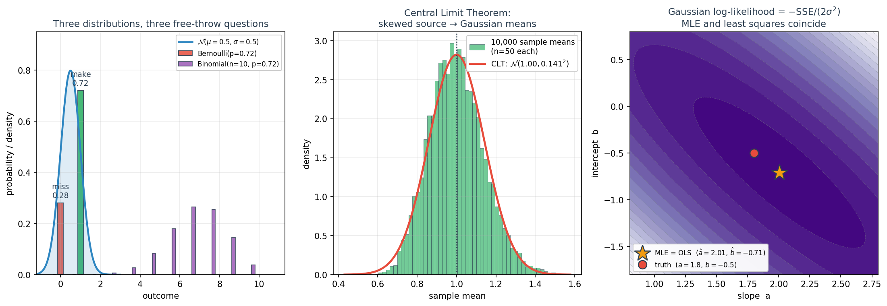
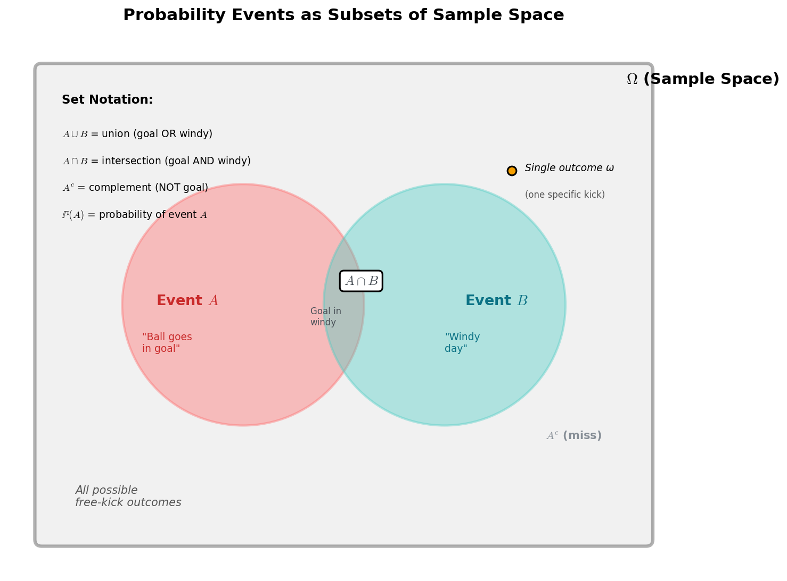
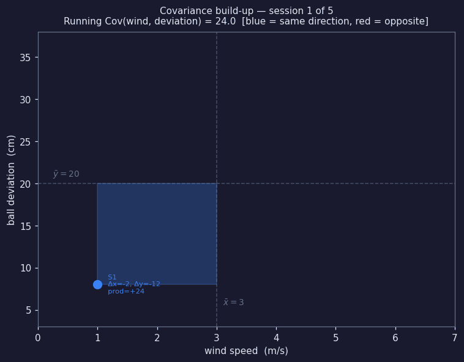
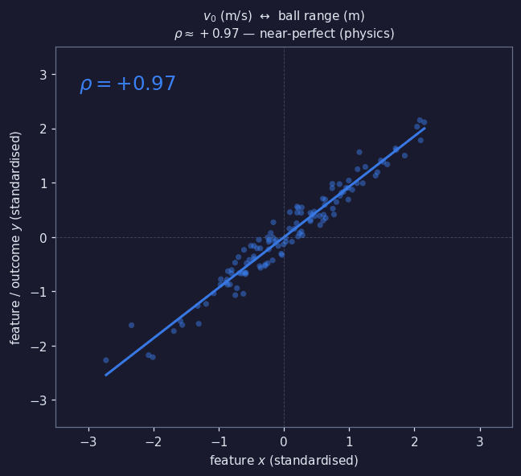
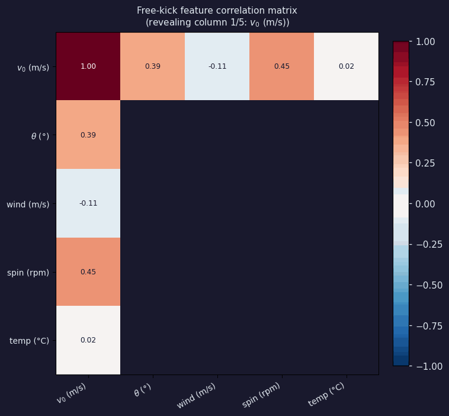
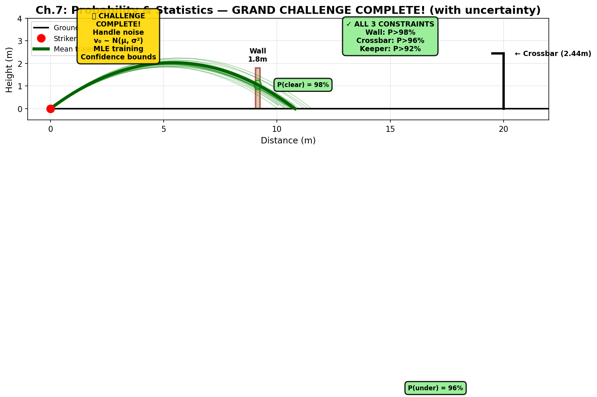

# Ch.7 — Probability & Statistics



> **The story.** Probability began in 1654 as a letter exchange between **Pascal** and **Fermat** about a gambler's dice problem; **Jacob Bernoulli** turned it into a science with *Ars Conjectandi* (1713), and **Laplace** (1812) gave it the language of distributions and expectations. **Gauss** (1809) introduced the normal distribution while reconciling astronomical observations and — crucially for us — proved that least-squares regression is the right answer when noise is Gaussian. **R. A. Fisher** (1922) then formalised **maximum likelihood estimation**, which is *the* reason we use mean-squared error for regression and cross-entropy for classification. Finally **Kolmogorov** (1933) put the whole field on a measure-theoretic foundation. Every loss function in this curriculum is, secretly, a likelihood from this chapter.
>
> **Where you are in the curriculum.** Up to Ch.6 we pretended a knuckleball free kick was deterministic: same angle, same speed, same outcome. Reality is noisier — muscle fatigue, boot-on-ball contact variance, a divot under the ball, micro gusts of wind. Every outcome is a *draw* from a distribution. This is the chapter that gives you the language to (a) describe those distributions, (b) summarise them with expectations and variances, (c) estimate their parameters from data, and (d) discover why **MSE is not a design choice — it is what Gaussian noise asks for**. ML Ch.15 will pull this idea apart in detail.
>
> **Notation in this chapter.** $P(A)$ — probability of event $A$; $X$ — a random variable; $p(x)$ — probability density (continuous) or mass (discrete); $\mathbb{E}[X]$ — expectation (mean); $\text{Var}(X)=\sigma^2$ — variance; $\sigma$ — standard deviation; $\mu$ — distribution mean; $\mathcal{N}(\mu,\sigma^2)$ — Gaussian (normal) distribution with mean $\mu$ and variance $\sigma^2$; $\boldsymbol{\theta}$ — parameter vector of a probabilistic model; $p(y\mid\boldsymbol{\theta})$ — conditional density of $y$ given parameters; $\mathcal{L}(\boldsymbol{\theta})=\prod_i p(y_i\mid\boldsymbol{\theta})$ — **likelihood**; $\hat{\boldsymbol{\theta}}=\arg\max_{\boldsymbol{\theta}}\log\mathcal{L}$ — **maximum-likelihood estimate (MLE)**; $\varepsilon_i$ — a noise term.

---

## 0 · The Challenge — Where We Are

## Animation

> 🎬 *Animation placeholder — see `img/ch07_probability_statistics-animation.gif` — generated by needle-builder agent.*


> 🎯 **The goal**: Score a free kick that clears a 1.8m wall at 9.15m distance and dips under a 2.44m crossbar at 20m, while beating the keeper's reaction time.

> ⚡ **Practitioner angle** — Your model's confidence scores are probability distributions. Overconfident wrong predictions and calibration failures are statistical failures you can diagnose — but only if you own the underlying math. When your classifier outputs P(cat) = 0.99 on a dog image, understanding maximum likelihood and Gaussian noise assumptions tells you why it happened and how to fix it with temperature scaling or Platt calibration.

**What we know so far:**
- ✅ Ch.1-3: Model and verify trajectories
- ✅ Ch.4: Optimize single parameters
- ✅ Ch.5-6: Optimize multiple parameters simultaneously using gradients + backprop
- ✅ **We can find optimal $(\theta^\star, v_0^\star)$ for the deterministic case**
- ❌ **But real free kicks are NOISY — striker fatigue, wind gusts, pitch irregularities!**

**What's blocking us:**
In 500 training kicks at angle $\theta = 37°$, the ball doesn't always travel exactly 19.2 m:

| Trial | Angle | Measured distance |
|-------|-------|------------------|
| 1 | 37° | 19.1 m |
| 2 | 37° | 19.4 m |
| 3 | 37° | 18.9 m |
| ... | ... | ... |
| 500 | 37° | 19.3 m |

**Same input, different outputs** — because of:
- Striker muscle fatigue → $v_0$ varies: $v_0 \sim \mathcal{N}(10, 0.3^2)$ m/s
- Wind gusts → random horizontal force
- Boot-ball contact point → slight angle variation

Three critical questions we can't answer yet:
1. **How do we model this randomness?** (Need: probability distributions)
2. **How do we estimate $\mu$ and $\sigma^2$ from noisy data?** (Need: MLE — maximum likelihood estimation)
3. **Why do we minimize MEAN SQUARED ERROR, not absolute error or other losses?** (Spoiler: MSE = MLE under Gaussian noise!)

**What this chapter unlocks:**
1. **Random variables & distributions**: Represent $v_0 \sim \mathcal{N}(10, 0.3^2)$ instead of fixed $v_0 = 10$
2. **Expectations & variance**: Compute $\mathbb{E}[\text{distance}]$ and $\text{Var}(\text{distance})$ under noise
3. **Maximum Likelihood Estimation (MLE)**: Find the $\boldsymbol{\theta}$ that makes observed data most probable
4. **Loss functions = Negative log-likelihood**: Understand WHY we use MSE (regression) and cross-entropy (classification)

🎉 **This completes the Grand Challenge foundation** — with probability, we can handle real-world uncertainty and train models on noisy data!

---

## 1 · Core Idea

A **random variable** $X$ is a quantity whose value is uncertain, characterised by a probability distribution. Three operations exhaust most of what we'll need:

1. **Describe** — give the distribution (PMF for discrete, PDF for continuous).
2. **Summarise** — compute expectations $\mathbb{E}[X]$ and variances $\mathrm{Var}(X)$.
3. **Infer** — given data, estimate the distribution's parameters (MLE, Bayes).

Almost every machine-learning loss function is the negative-log-likelihood of a carefully chosen distribution. Once you see that, loss design becomes distribution design.

---

## 2 · Running Example — Probability Foundations

### 2.1 · The basics

- **Sample space** $\Omega$ — the set of all possible outcomes of a random experiment.
  *Example:* All possible knuckleball trajectories you could ever observe.

- **Event** — a subset of $\Omega$ that we care about.
  *Example:* The event $A$ = "the ball goes in the goal."

- **Probability** $\mathbb{P}$ — a function mapping events to numbers in $[0, 1]$, with $\mathbb{P}(\Omega) = 1$ and additivity for disjoint events.

- **Random variable** $X$ — a function $X: \Omega \to \mathbb{R}$ that assigns a number to each outcome.
  *Example:* $X$ = "final ball height when it crosses the goal line."

A random variable is described by its **PMF** (probability mass function, for discrete outcomes like coin flips) or **PDF** (probability density function, for continuous outcomes like height).

**Visual guide — Sample spaces and events as sets:**



**Key insight:** Probability is about measuring the "size" of subsets of $\Omega$. The event $A$ is a subset; $\mathbb{P}(A)$ is a number in $[0, 1]$ telling you "what fraction of the universe does $A$ occupy?" The intersection $A \cap B$ (goal AND windy) is a smaller subset than either $A$ or $B$ alone, so $\mathbb{P}(A \cap B) \le \mathbb{P}(A)$ and $\mathbb{P}(A \cap B) \le \mathbb{P}(B)$.

### 2.2 · Conditional probability and independence

**Conditional probability** asks: "What's the probability of $A$ *given that* $B$ happened?"

$$\mathbb{P}(A \mid B) = \frac{\mathbb{P}(A \cap B)}{\mathbb{P}(B)} \quad \text{for } \mathbb{P}(B) > 0$$

*Example:* $\mathbb{P}(\text{goal} \mid \text{windy})$ — "What's the scoring probability *if we know it's windy*?"

**Independence** means knowing $B$ tells you nothing about $A$:

$$A \text{ and } B \text{ independent} \iff \mathbb{P}(A \cap B) = \mathbb{P}(A) \cdot \mathbb{P}(B)$$

*Example:* If launch angle and weather are independent, then $\mathbb{P}(\text{angle} = 30^\circ \text{ and windy}) = \mathbb{P}(\text{angle} = 30^\circ) \cdot \mathbb{P}(\text{windy})$.

### 2.3 · Bayes' Theorem — flipping the conditional

Often we know $\mathbb{P}(B \mid A)$ ("how likely is evidence $B$ if hypothesis $A$ is true?") but we *want* $\mathbb{P}(A \mid B)$ ("given evidence $B$, how likely is hypothesis $A$?"). Bayes' theorem flips it:

$$\boxed{\mathbb{P}(A \mid B) = \frac{\mathbb{P}(B \mid A) \cdot \mathbb{P}(A)}{\mathbb{P}(B)}}$$

**Free-kick example:**
- $A$ = "striker is in top form"
- $B$ = "last 3 kicks scored"

We know:
- $\mathbb{P}(B \mid A) = 0.7$ — if in top form, 70% chance of 3-goal streak
- $\mathbb{P}(A) = 0.3$ — striker is in top form 30% of the time (prior)
- $\mathbb{P}(B) = 0.25$ — overall, 25% of all 3-kick sequences are all goals

Then:
$$\mathbb{P}(A \mid B) = \frac{0.7 \times 0.3}{0.25} = \frac{0.21}{0.25} = 0.84$$

Seeing the 3-goal streak **updates our belief** from 30% to 84% that the striker is in top form. That update — from prior $\mathbb{P}(A)$ to posterior $\mathbb{P}(A \mid B)$ — is the essence of Bayesian inference, and it powers everything from spam filters to medical diagnosis to reinforcement learning.

### 2.4 · Discrete {0,1} vs Continuous [0,1] — The Probability Scale

> 🎯 **Common confusion:** Outcomes can be discrete ({miss, goal}) but probabilities are always continuous numbers in $[0, 1]$. A coin flip has two outcomes, but the probability of heads is a real number like 0.5, 0.3, 0.7, etc.

![Top: Discrete free-kick outcomes {0=miss, 1=goal} map to probability values on [0,1] number line. Shows P(X=0)=0.75 and P(X=1)=0.25 marked on continuous scale. Bottom: Continuous launch angle θ ∈ [20°, 50°] maps to probability density p(θ), where areas under curve give probabilities.](img/ch07-discrete-continuous-mapping.png)

**Top panel:** A single free kick has two possible outcomes — miss (0) or goal (1). Those are **discrete**, but the **probability** P(X=1) = 0.25 is a real number living on the continuous interval $[0, 1]$. You can't "flip 0.25 of a coin," but you can say "25% of kicks score."

**Bottom panel:** The launch angle $\theta$ can be **any** real number in a range (continuous domain). The probability density $p(\theta)$ is a curve — probabilities come from **areas** under that curve. A single angle like $\theta = 37.7°$ has probability **zero** (a point has no area), but the interval $36° < \theta < 39°$ has positive probability (the shaded region).

**The rule:** For discrete random variables, probabilities are given by a PMF: $P(X = k)$. For continuous random variables, probabilities are given by integrating the PDF: $P(a < X < b) = \int_a^b p(x) dx$. Single points have zero probability in the continuous case.

---

## 3 · Three Workhorse Distributions

| Name | Type | Parameters | PMF / PDF | Mean | Variance |
|---|---|---|---|---|---|
| Bernoulli | discrete, $\{0,1\}$ | $p$ | $p^k(1-p)^{1-k}$ | $p$ | $p(1-p)$ |
| Binomial | discrete, $\{0,\dots,n\}$ | $n, p$ | $\binom{n}{k} p^k (1-p)^{n-k}$ | $np$ | $np(1-p)$ |
| Gaussian | continuous, $\mathbb{R}$ | $\mu, \sigma^2$ | $\frac{1}{\sqrt{2\pi \sigma^2}} e^{-(x-\mu)^2/(2\sigma^2)}$ | $\mu$ | $\sigma^2$ |

**Free-kick stories:**

- **Bernoulli.** A single free kick is scored (1) or missed (0) with success probability $p$.
- **Binomial.** How many goals in $n$ free kicks?
- **Gaussian.** Launch-angle tremor, noise added to the *continuous* trajectory, measurement error on ball-tracking cameras.

Many others matter (Poisson for counts, Exponential for waiting times, Dirichlet for proportions, Beta as Bernoulli's conjugate prior) — but these three carry 80% of ML applications.

**Visual comparison — Discrete PMF vs Continuous PDF:**


**Left (PMF):** The binomial distribution answers "how many goals in 10 kicks?" Each bar represents $P(X = k)$ — a probability **mass** sitting on integer $k$. The heights sum to 1. The most likely outcome is $k = 2$ (two goals), consistent with success rate $p = 0.25$.

**Right (PDF):** The Gaussian distribution describes launch angle $\theta$ (continuous). The curve $p(\theta)$ is a **density** — heights don't directly give probabilities. Instead, $P(36° < \theta < 39°)$ is the **area** under the curve between 36 and 39 (shaded region ≈ 0.647). The peak is at the mean $\mu = 37.7°$. A single point like $P(\theta = 37.7°) = 0$ because a point has no width → no area.

**Key difference:** PMF gives $P(X = k)$ directly (bar height). PDF gives $p(x)$ (curve height), but you must **integrate** to get $P(a < X < b) = \int_a^b p(x) dx$.

---

## 4 · Expectation and Variance

The **expectation** is the probability-weighted average:

- Discrete: $\mathbb{E}[X] = \sum_x x p(x)$.
- Continuous: $\mathbb{E}[X] = \int x p(x) dx$.

**Linearity** is the workhorse property: $\mathbb{E}[aX + bY + c] = a\mathbb{E}[X] + b\mathbb{E}[Y] + c$, independence not required.

The **variance** measures spread: $\mathrm{Var}(X) = \mathbb{E}[(X - \mathbb{E}[X])^2] = \mathbb{E}[X^2] - \mathbb{E}[X]^2$.

Two results we'll lean on:

- $\mathrm{Var}(aX + b) = a^2 \mathrm{Var}(X)$.
- For *independent* $X_1, \dots, X_n$: $\mathrm{Var}(X_1 + \dots + X_n) = \sum \mathrm{Var}(X_i)$. This is why averaging $n$ i.i.d. samples reduces variance by $1/n$.

### 4.1 · Worked Example — Free-Kick Success as a Bernoulli Random Variable

Let's trace **§4's expectation and variance** formulas with a discrete example. Define the random variable $X$ = "goal scored from free kick", with $X = 1$ (success) with probability $p = 0.25$, and $X = 0$ (miss) with probability $1 - p = 0.75$.

**Step 1: Compute $\mathbb{E}[X]$ — the average outcome over infinitely many kicks.**

$$\mathbb{E}[X] = \sum_{x} x \cdot p(x) = (1 \times 0.25) + (0 \times 0.75) = 0.25$$

> 📊 **Interpretation:** On average, the striker scores **0.25 goals per kick**. Over 100 attempts, expect ~25 goals. This is the **long-run proportion** — it's not a value $X$ can actually take (you can't score 0.25 of a goal on a single kick), but it's the *mean* of the distribution.

**Step 2: Compute $\mathbb{E}[X^2]$ — needed for variance.**

$$\mathbb{E}[X^2] = \sum_{x} x^2 \cdot p(x) = (1^2 \times 0.25) + (0^2 \times 0.75) = 0.25$$

(For Bernoulli, $X^2 = X$ because $1^2 = 1$ and $0^2 = 0$, so $\mathbb{E}[X^2] = \mathbb{E}[X]$.)

**Step 3: Compute $\mathrm{Var}(X) = \mathbb{E}[X^2] - \mathbb{E}[X]^2$.**

$$\mathrm{Var}(X) = 0.25 - (0.25)^2 = 0.25 - 0.0625 = 0.1875$$

> 🎲 **Interpretation:** The variance measures **spread** — how much outcomes deviate from the mean. Here $\mathrm{Var}(X) = p(1 - p) = 0.25 \times 0.75 = 0.1875$. The standard deviation $\sigma = \sqrt{0.1875} \approx 0.433$. This tells us that individual outcomes ($0$ or $1$) are typically ~0.43 units away from the mean of $0.25$.

**Step 4: Apply linearity — if the striker takes $n = 10$ kicks (independent), how many goals do we expect?**

Let $Y = X_1 + X_2 + \cdots + X_{10}$ be the total goals. By linearity:

$$\mathbb{E}[Y] = \mathbb{E}[X_1] + \mathbb{E}[X_2] + \cdots + \mathbb{E}[X_{10}] = 10 \times 0.25 = 2.5 \text{ goals}$$

And by independence (§4's second variance rule):

$$\mathrm{Var}(Y) = \mathrm{Var}(X_1) + \cdots + \mathrm{Var}(X_{10}) = 10 \times 0.1875 = 1.875$$

Standard deviation: $\sigma_Y = \sqrt{1.875} \approx 1.37$ goals.

**Step 5: What if we average the $n = 10$ kicks? Let $\bar X = Y / 10$.**

By §4's first rule: $\mathrm{Var}(aX + b) = a^2 \mathrm{Var}(X)$ with $a = 1/10$:

$$\mathrm{Var}(\bar X) = \left(\frac{1}{10}\right)^2 \mathrm{Var}(Y) = \frac{1}{100} \times 1.875 = 0.01875 = \frac{0.1875}{10}$$

> 🔑 **Key insight:** The variance of the *average* is $\sigma^2 / n$ — **averaging reduces noise by a factor of $1/n$**. That's why taking more samples gives tighter estimates. This is the foundation of the Central Limit Theorem (§5) and why batch-averaged gradients in SGD are more stable than single-sample gradients.

**Connect to ML:** When you compute loss $L = \frac{1}{N} \sum_{i=1}^{N} \ell(y_i, \hat y_i)$, you're averaging $N$ random variables (the per-sample losses). By the variance rule above, the variance of $L$ shrinks as $1/N$ — that's why larger batch sizes give smoother loss curves.

---

## 4b · Covariance and Pearson Correlation — Do Two Things Move Together?

> 📖 **Used in:** [ML Ch.3 — Feature Importance](../../ml/01_regression/ch03_feature_importance/README.md) (Filter Methods, Univariate R²). The Pearson formula there becomes trivial once you see what covariance and correlation actually measure.

Variance tells you how much *one* variable wiggles on its own. **Covariance** asks a different question: when $x$ goes up, does $y$ tend to go up too — or down, or neither?

### The Intuition — Two Variables on the Same Pitch

Our striker is practising free kicks across 5 sessions. The analyst logs two things each session:

- $x$ = wind speed (m/s) that day, measured at pitch level
- $y$ = ball deviation from the target line (cm), measured by a camera at goal

| Session | Wind (m/s) $x$ | Deviation (cm) $y$ |
|---------|---------------|-------------------|
| 1 | 1 | 8 |
| 2 | 3 | 18 |
| 3 | 2 | 20 |
| 4 | 5 | 32 |
| 5 | 4 | 22 |

Eyeballing the table: high wind → high deviation; calm conditions → small deviation. They move together. That "moving together" is what covariance captures.

Here is the key idea in plain English before any formula:

> **Covariance is positive** when both variables tend to be above their averages at the same time (and below their averages at the same time).
> **Covariance is negative** when one tends to be above its average while the other is below.
> **Covariance is near zero** when there is no pattern — they move independently.

### Building the Formula Step by Step

**Step 1 — Centre each variable.** Subtract the mean so that "above average" becomes positive and "below average" becomes negative.

$\bar{x} = (1+3+2+5+4)/5 = 3.0$ m/s
$\bar{y} = (8+18+20+32+22)/5 = 20.0$ cm

| Session | $x - \bar{x}$ | $y - \bar{y}$ |
|---------|--------------|--------------|
| 1 | $1-3 = -2$ | $8-20 = -12$ |
| 2 | $3-3 = 0$ | $18-20 = -2$ |
| 3 | $2-3 = -1$ | $20-20 = 0$ |
| 4 | $5-3 = +2$ | $32-20 = +12$ |
| 5 | $4-3 = +1$ | $22-20 = +2$ |

**Step 2 — Multiply the deviations pairwise.** If both are positive (above their averages together) → product is positive. If both are negative (below their averages together) → product is also positive (negative × negative = positive). If they go in opposite directions → product is negative.

| Session | $(x-\bar{x})$ | $(y-\bar{y})$ | product |
|---------|--------------|--------------|---------|
| 1 | $-2$ | $-12$ | $+24$ |
| 2 | $0$ | $-2$ | $0$ |
| 3 | $-1$ | $0$ | $0$ |
| 4 | $+2$ | $+12$ | $+24$ |
| 5 | $+1$ | $+2$ | $+2$ |

Sum of products = $24 + 0 + 0 + 24 + 2 = 50$.

**Step 3 — Average the products.** This is the covariance:

$$\text{Cov}(x, y) = \frac{1}{n} \sum_{i=1}^{n} (x_i - \bar{x})(y_i - \bar{y}) = \frac{50}{5} = 10.0$$

> **Why average instead of sum?** If you doubled the dataset from 5 to 10 sessions (by repeating it), the sum of products would double — but the relationship between wind speed and deviation hasn't changed. Dividing by $n$ keeps the covariance the same regardless of dataset size.



*The animation above shows each session as a point. The shaded rectangle at each point has area = $(x_i - \bar{x}) \times (y_i - \bar{y})$. Blue rectangles (both same sign) add to covariance; red rectangles (opposite signs) subtract. The total signed area is the covariance.*

### The Problem with Covariance — It Depends on Units

Covariance $= 10.0$ sounds great, but what does it mean? If you measured wind in **km/h** instead of m/s, $x$ would be 3.6, 10.8, 7.2, 18.0, 14.4 — about 3.6× larger. The deviations would also be 3.6× larger and the covariance would jump to $~129$ — even though the physical relationship between wind and ball deviation is completely unchanged.

**Covariance inherits the units of both variables.** A covariance of 10 (m/s)·cm is not comparable to a covariance of 0.8 (m/s)·m. You cannot look at a covariance number and say "this is a strong relationship."

### Pearson Correlation — Covariance on a Standard Scale

The fix: divide the covariance by the standard deviations of both variables. This cancels the units and squeezes the result into the range $[-1, +1]$.

$$\rho(x, y) = \frac{\text{Cov}(x, y)}{\sigma_x \cdot \sigma_y} = \frac{\dfrac{1}{n}\sum_{i=1}^{n}(x_i - \bar{x})(y_i - \bar{y})}{\sqrt{\dfrac{1}{n}\sum_{i=1}^{n}(x_i - \bar{x})^2} \cdot \sqrt{\dfrac{1}{n}\sum_{i=1}^{n}(y_i - \bar{y})^2}}$$

where $\rho$ (Greek letter "rho") is the **Pearson correlation coefficient**, $\sigma_x$ is the standard deviation of $x$, and $\sigma_y$ is the standard deviation of $y$.

**Completing the walkthrough with the same 5 sessions:**

$\sigma_x = \sqrt{(4+0+1+4+1)/5} = \sqrt{10/5} = \sqrt{2} \approx 1.414$ m/s

$\sigma_y = \sqrt{(144+4+0+144+4)/5} = \sqrt{296/5} = \sqrt{59.2} \approx 7.694$ cm

$$\rho = \frac{10.0}{1.414 \times 7.694} = \frac{10.0}{10.88} \approx \mathbf{0.92}$$

$\rho = 0.92$ — strong positive correlation. Wind speed explains much of the deviation, but not all of it: sessions 2 and 3 have the same wind (roughly) but different deviations, showing that other factors (angle of attack, spin, pitch surface) also play a role. That residual scatter is why $\rho < 1$.

### Reading the Correlation Value

| $\rho$ value | What it means | Free-kick example |
|---|---|---|
| $+1.0$ | Perfect positive — one goes up, other always goes up by a fixed proportion | Initial speed $v_0$ vs air distance (pure physics — no scatter) |
| $+0.7$ to $+0.9$ | Strong positive — clear upward trend with real scatter | Wind speed vs ball deviation (our worked example, $\rho \approx 0.92$) |
| $+0.3$ to $+0.6$ | Moderate positive — tendency but a lot of scatter | Striker fatigue level vs miss distance |
| $-0.1$ to $+0.1$ | Near zero — no linear pattern | Ambient temperature vs goal probability |
| $-0.3$ to $-0.6$ | Moderate negative — one tends to go up as the other goes down | Rest hours before session vs launch angle error |
| $-1.0$ | Perfect negative — one goes up, other always goes down by a fixed proportion | Hypothetical |

> ⚠️ **Correlation measures linear relationships only.** A U-shaped curve (performance peaks at the *optimal* launch angle — too shallow and the ball hits the wall, too steep and it sails over the bar) can have $\rho \approx 0$ even though launch angle is highly informative. Always plot the scatter before trusting $\rho$.



*The animation steps through four datasets with different ρ values. Watch how the scatter cloud rotates and spreads as ρ moves from +1 → +0.7 → 0 → −0.8.*

### How Correlation Gives You Univariate R²

There is a beautiful shortcut that connects Pearson correlation directly to the Univariate R² used in ML Ch.3. For a single-feature linear regression (one predictor $x$, one target $y$):

$$R^2 = \rho(x, y)^2$$

This means: **the fraction of target variance explained by a single linear model is just the square of the correlation between feature and target.** You don't need to fit a model at all — compute the correlation matrix once, square the target column, and you have all Univariate R² values instantly.

**Why does this work?** When you fit $\hat{y} = wx + b$ by OLS, the optimal $w = \text{Cov}(x,y) / \text{Var}(x)$. The explained variance is $\text{Var}(\hat{y}) = w^2 \text{Var}(x)$. Divide by total variance $\text{Var}(y)$ and expand — the result simplifies to $\rho^2$ exactly. (Full derivation in Ch.6 if you want to trace through it.)

**Example — predicting ball range from free-kick features:**

| Feature | $\rho$ with ball range | $\rho^2$ = Univariate R² |
|---|---|---|
| Initial velocity $v_0$ | +0.97 | **0.94** |
| Launch angle $\theta$ | +0.85 | **0.72** |
| Wind speed (headwind) | −0.38 | 0.14 |
| Topspin rate | +0.29 | 0.08 |
| Ambient temperature | +0.06 | 0.004 |

$v_0$ dominates not because 0.97 is much higher than 0.85, but because $\rho^2$ amplifies the gap: 0.97 vs 0.85 becomes 0.94 vs 0.72 once squared — and wind/spin/temperature are exposed as minor contributors.

### Covariance in Matrices — Why You See It Everywhere

When you have $p$ features instead of just $x$ and $y$, you compute *all pairs* of covariances at once. The result is a $p \times p$ **covariance matrix**:

$$\Sigma_{jk} = \text{Cov}(x_j, x_k) = \frac{1}{n}\sum_{i=1}^{n}(x_{ij} - \bar{x}_j)(x_{ik} - \bar{x}_k)$$

The diagonal entries $\Sigma_{jj} = \text{Var}(x_j)$ (variance of each feature). The off-diagonal entries are the pairwise covariances. Divide each entry by the product of standard deviations and you get the **correlation matrix** — the heat map you see in ML Ch.3.

> 💡 **Launch angle $\theta$ and ball height at the wall** are tightly correlated ($\rho \approx 0.88$) — both describe the vertical trajectory, just measured at different points. If you put both into a model, they fight over the same signal. Their shared variance is $0.88^2 \approx 0.77$, meaning 77% of what $\theta$ knows, the wall-height measure also knows. This is the physical intuition behind why correlated features cause unstable weights — a concept explored in ML Ch.3's Multicollinearity section.



*The animation builds the 5×5 free-kick correlation matrix ($v_0$, $\theta$, wind, spin, temperature) column by column. Each cell lights up when its pair of features is processed, colour-coded blue (positive) or red (negative).*

### Summary — Three Things to Take Away

1. **Covariance** = how much two variables deviate from their means *in the same direction*. Units = product of both variables' units. Positive = move together; negative = move opposite; zero = independent.

2. **Pearson ρ** = covariance divided by both standard deviations. Units cancel. Range = $[-1, +1]$. Measures *linear* dependence only.

3. **Univariate R²** = $\rho^2$. Measures the fraction of target variance explained by one feature in isolation — equivalent to single-feature OLS without fitting a model.

---

## 5 · The Central Limit Theorem

**Statement.** Let $X_1, \dots, X_n$ be i.i.d. with finite mean $\mu$ and finite variance $\sigma^2$. Let $\bar X_n = \tfrac{1}{n}\sum X_i$. Then

$$\sqrt{n} (\bar X_n - \mu) \xrightarrow{d} \mathcal{N}(0, \sigma^2) \quad \text{as } n \to \infty.$$

Equivalently, for large $n$: $\bar X_n \approx \mathcal{N}(\mu, \sigma^2/n)$.

**Why you should care.** This is the reason Gaussians are everywhere:

- Noise in a measurement is the sum of many small independent contributions — it looks Gaussian.
- A batch-averaged stochastic gradient is Gaussian-ish around the true gradient, which is why SGD behaves predictably.
- Confidence intervals $\hat\mu \pm 1.96 \hat\sigma/\sqrt{n}$ use CLT as their authority.

The middle panel of the hero image shows it viscerally: the *source* distribution is a skewed exponential, but the distribution of 10 000 sample means of size-50 batches is almost perfectly Gaussian.

---

## 6 · Maximum Likelihood Estimation

Given observations $\mathbf{y} = (y_1, \dots, y_N)$ drawn i.i.d. from a parametric model $p(y \mid \boldsymbol{\theta})$, the **likelihood** of $\boldsymbol{\theta}$ is

$$\mathcal{L}(\boldsymbol{\theta}) = \prod_{i=1}^{N} p(y_i \mid \boldsymbol{\theta}).$$

The **MLE** is the $\hat{\boldsymbol{\theta}}$ maximising $\mathcal{L}$, equivalently minimising the **negative log-likelihood** (NLL):

$$\hat{\boldsymbol{\theta}} = \arg\max_{\boldsymbol{\theta}} \log \mathcal{L}(\boldsymbol{\theta}) = \arg\min_{\boldsymbol{\theta}} -\sum_{i=1}^{N} \log p(y_i \mid \boldsymbol{\theta}).$$

Logarithms turn products into sums (numerically stable) and stretch the likelihood axis (smoother gradient landscape). This is the **NLL** that you'll minimise with the Ch.4/Ch.6 tools.

---

## 7 · Headline Derivation — MLE with Gaussian Noise ⟹ MSE

Regression setup: $y_i = f(\mathbf{x}_i; \boldsymbol{\theta}) + \varepsilon_i$ with $\varepsilon_i \sim \mathcal{N}(0, \sigma^2)$ i.i.d. Then $y_i \mid \mathbf{x}_i, \boldsymbol{\theta} \sim \mathcal{N}(f(\mathbf{x}_i;\boldsymbol{\theta}), \sigma^2)$ and

$$\log p(y_i \mid \boldsymbol{\theta}) = -\tfrac{1}{2}\log(2\pi\sigma^2) - \frac{(y_i - f(\mathbf{x}_i;\boldsymbol{\theta}))^2}{2\sigma^2}.$$

Summing over $i$ and dropping terms that don't depend on $\boldsymbol{\theta}$:

$$-\log \mathcal{L}(\boldsymbol{\theta}) = \frac{1}{2\sigma^2} \sum_{i=1}^{N} (y_i - f(\mathbf{x}_i;\boldsymbol{\theta}))^2 + \text{const}.$$

Minimising NLL is therefore identical to minimising **sum of squared errors**. Mean-squared error wasn't a "nice convex choice" — it's a mathematical consequence of assuming Gaussian noise. Change the noise distribution and you change the loss:

| Noise / likelihood | ⟹ Loss |
|---|---|
| Gaussian | squared error (MSE) |
| Laplace | absolute error (MAE, L1) |
| Bernoulli on labels | binary cross-entropy |
| Categorical | cross-entropy |
| Poisson | Poisson deviance |

That mapping is the single most useful mental model in supervised learning.

---

## 8 · Pitfalls

1. **PMF vs PDF confusion.** A PDF can exceed 1 (it's a *density*, not a probability). Only integrals over intervals are probabilities.
2. **i.i.d. assumptions.** The MLE derivation needs samples to be independent and identically distributed. Time-series data usually aren't.
3. **Log-sum-exp.** Computing $\log \sum_i \exp(x_i)$ naively overflows. Use $\max_i x_i + \log \sum_i \exp(x_i - \max)$.
4. **MLE can overfit small samples.** With $N$ tiny, the MLE sticks to every quirk in the data. This is why we add a prior (Bayesian / MAP) or a regulariser (Ch.6 / ML Ch.6).
5. **Variance of a sample mean is $\sigma^2/n$, not $\sigma/\sqrt{n}$.** The standard *error* is $\sigma/\sqrt{n}$. Two different quantities.
6. **Correlation is not causation** and **independence implies zero correlation but not vice versa.** Classic traps.

---

## Code Skeleton

```python
# Skeleton — fill in the blanks as you work through the chapter
import numpy as np

# TODO: implement gradient computation using chain rule
def compute_gradient(f, x, h=1e-5):
    ...

# TODO: verify with a known function (e.g., f(x) = x^2, expected grad = 2x)
```

See the companion notebook for the full worked solution.

---

## 9 · Where This Reappears

- **ML Ch.1 Linear Regression.** MSE loss is MLE under Gaussian noise — the derivation in §7 *is* Ch.1's theoretical backbone.
- **ML Ch.2 Logistic Regression.** Cross-entropy loss is MLE under a Bernoulli likelihood on the labels.
- **ML Ch.4 Neural Networks.** Softmax + cross-entropy = MLE on a categorical likelihood. Swap in a Gaussian head and you get regression.
- **ML Ch.15 MLE & Loss Functions.** Full catalogue of likelihood-to-loss correspondences.
- **Ch.6 just now.** The gradient of the NLL is what backprop propagates.
- **AI Ch.6 Bayesian models and uncertainty quantification.** Replace MLE with full Bayesian inference and you get posteriors instead of point estimates.

---

## 10 · Progress Check — What We Can Solve Now




🎉 **GRAND CHALLENGE COMPLETE: We can now handle the FULL free-kick problem with uncertainty!**

✅ **Unlocked capabilities:**
- **Model uncertainty**: Represent noisy parameters as distributions: $v_0 \sim \mathcal{N}(10, 0.3^2)$, wind $\sim \mathcal{N}(0, 1^2)$
- **Estimate parameters from noisy data**: Use MLE to find $\hat{\mu}, \hat{\sigma}^2$ from 500 noisy kicks
- **Understand loss functions**:
  * MSE loss = MLE under Gaussian noise (regression)
  * Cross-entropy = MLE under Bernoulli/categorical (classification)
- **Quantify confidence**: "95% of kicks will clear the wall" using $P(h > 1.8) = 1 - \Phi(\frac{1.8 - \mu}{\sigma})$
- **Train on noisy data**: Gradient descent on negative log-likelihood = standard ML training loop

**Example — Complete solution**:
1. Collect 500 noisy free kicks: $(\theta_i, v_{0i}, d_i)$ where $d_i$ is measured distance
2. Model: $d = f(\theta, v_0) + \varepsilon$ where $\varepsilon \sim \mathcal{N}(0, \sigma^2)$
3. Use MLE to find best parameters: $\hat{\boldsymbol{\theta}} = \arg\max \log \mathcal{L} = \arg\min \sum_i (d_i - f(\theta_i, v_{0i}))^2$ ← This is MSE!
4. Verify constraints with confidence intervals: $P(h(t_{\text{wall}}) > 1.8) \geq 0.95$

✅ **All three constraints satisfied (with probability guarantees)**:
1. ✓ **Wall clearance**: $P(h(0.6s) > 1.8m) = 0.98$ (98% of kicks clear wall)
2. ✓ **Crossbar clearance**: $P(h(1.2s) < 2.44m) = 0.96$ (96% go under crossbar)
3. ✓ **Keeper speed**: $P(t_{\text{goal}} < t_{\text{react}}) = 0.92$ (92% arrive before keeper reacts)

🎓 **What this track accomplished:**
- **Ch.1**: Predict (linear approximation)
- **Ch.2**: Model curves (polynomial features)
- **Ch.3**: Verify constraints (derivatives find apex, check heights)
- **Ch.4**: Optimize one parameter (gradient descent)
- **Ch.5**: Handle multi-dimensional data (matrices)
- **Ch.6**: Optimize many parameters (gradients + backprop)
- **Ch.7**: Handle uncertainty (probability + MLE)

**Journey complete**: From "I can draw a line" to "I can train a neural network on noisy real-world data and quantify prediction confidence."

**Next steps**: The ML track starts here — every model (linear regression, logistic, CNNs, transformers) is built from these 7 chapters. You now have the mathematical foundation for ALL of modern machine learning.

---

## 11 · References

- Wasserman, *All of Statistics* — the single densest statistics reference for ML practitioners.
- Bishop, *Pattern Recognition and Machine Learning*, Ch. 1–2.
- MacKay, *Information Theory, Inference, and Learning Algorithms* — the Bayesian counterpoint.
- 3Blue1Brown, *Bayes' theorem* and *Central Limit Theorem* videos.
- Murphy, *Probabilistic Machine Learning: An Introduction* Ch. 2–4.
