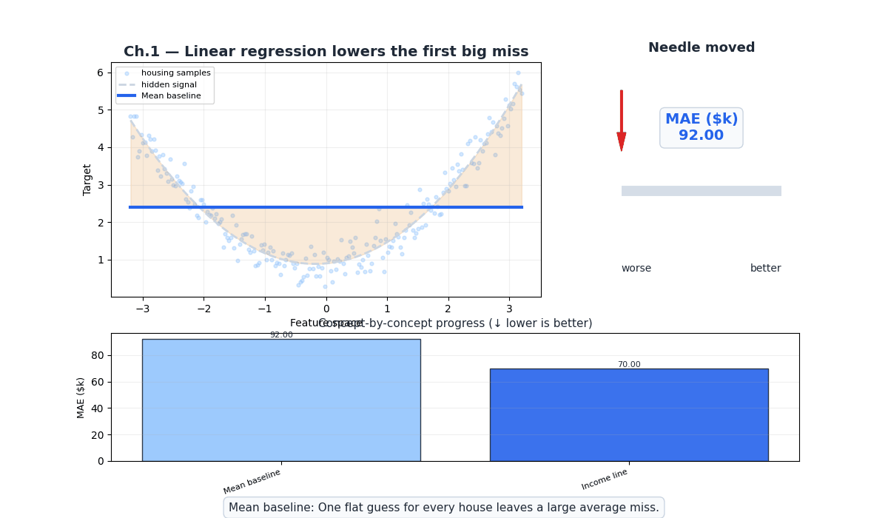
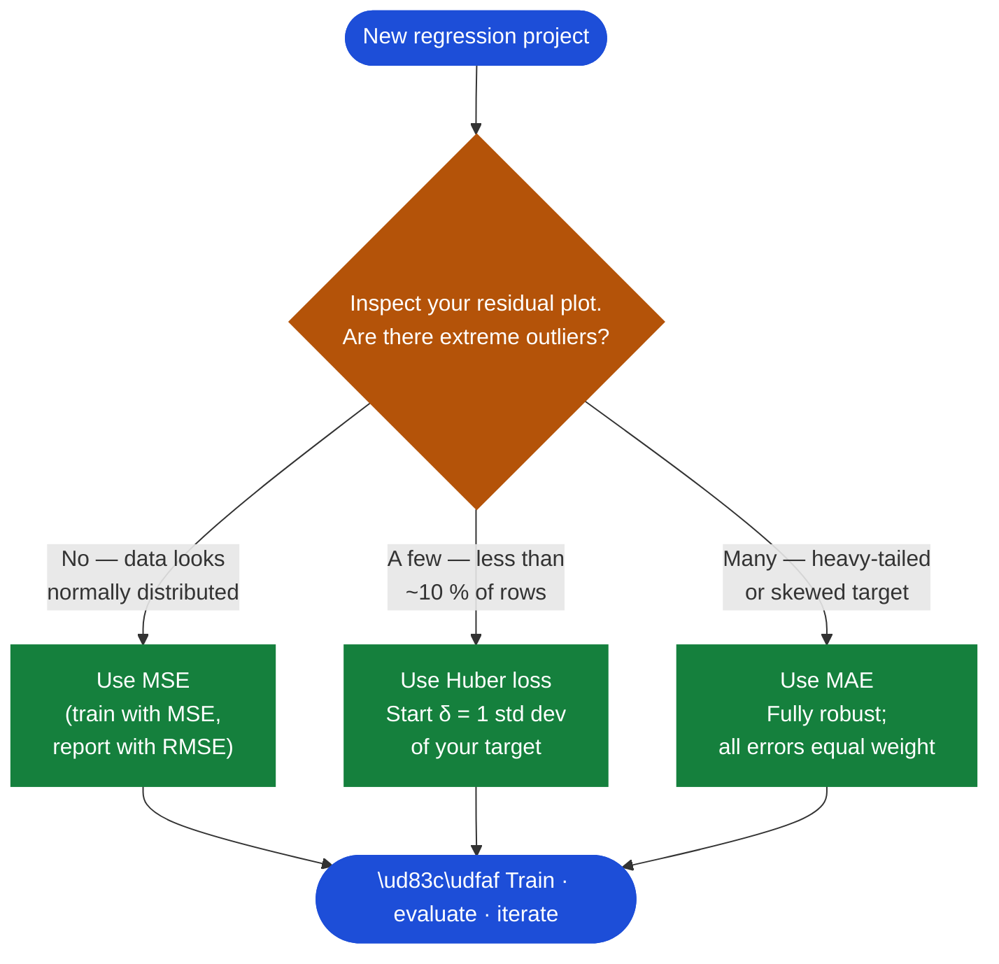
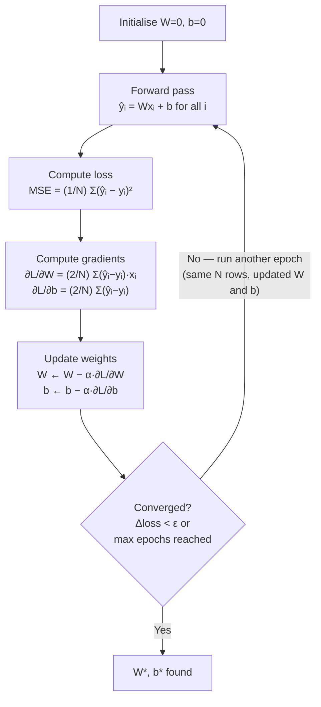
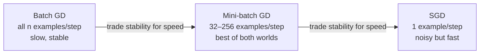
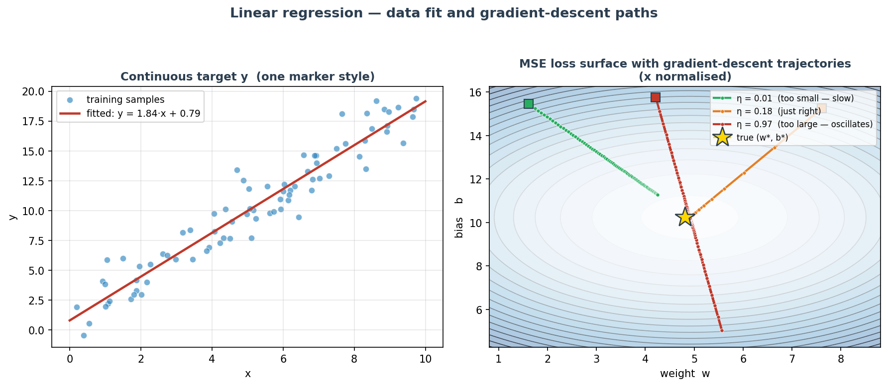
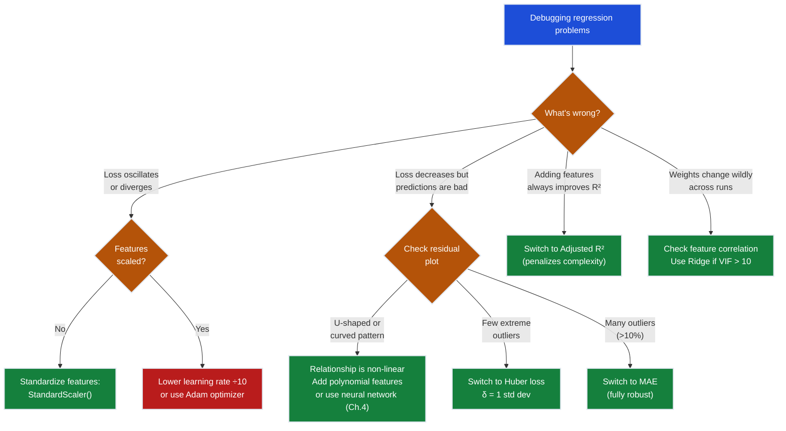

# Ch.1 — Linear Regression

> **The story.** In **1805** the French mathematician **Adrien-Marie Legendre** published a short appendix called *Nouvelles méthodes pour la détermination des orbites des comètes* and casually introduced the **method of least squares** — the recipe that says "the best line is the one minimising the sum of squared errors." Four years later **Carl Friedrich Gauss** claimed he had been using it since 1795 to predict the orbit of the asteroid Ceres; a polite priority dispute followed, but both men were right that the technique would outlive them. In 1809 Gauss further showed that least squares is *the* optimal estimator when noise is Gaussian — a result that wouldn't be properly appreciated until R. A. Fisher rederived it as maximum likelihood in 1922 (revisited in the MLE & Loss Functions chapter of the Neural Networks track). Every linear regression you will ever fit is doing exactly what Legendre wrote down two centuries ago.
>
> **Where you are in the curriculum.** This is chapter one. You're a data scientist at a real estate platform, and your first task is the simplest possible model: estimate California house prices from census features. One input, one output, one line. Every concept here — the loss surface, the gradient, the learning rate, the metric — scales directly to 100-layer networks in the [Neural Networks track](../../03_neural_networks) and beyond. Get this chapter right and the next eighteen feel like additions, not replacements.
>
> **Notation in this chapter.** $x$ — input feature (`MedInc`); $y$ — true target (`MedHouseVal`); $\hat{y}=wx+b$ — model prediction; $w$ — weight (slope); $b$ — bias (intercept); $N$ — number of training samples; $L=\frac{1}{N}\sum_{i=1}^{N}(y_i-\hat{y}_i)^2$ — **mean squared error (MSE)** loss; $\eta$ — learning rate.

---

## 0 · The Challenge — Where We Are

> **The mission**: Launch **SmartVal AI** — a production home valuation system satisfying 5 constraints:
> 1. **ACCURACY**: <$40k MAE — 2. **GENERALIZATION**: Unseen districts — 3. **MULTI-TASK**: Value + Segment — 4. **INTERPRETABILITY**: Explainable — 5. **PRODUCTION**: Scale + Monitor

**What we know so far:**
- We have the California Housing dataset (20,640 districts, 8 features)
- We understand the business problem (estimate median house values)
- **But we have NO model yet!**

**What's blocking us:**
We need the **simplest possible baseline**. Before building complex multi-layer networks or ensemble models, we must establish:
- Can we predict house value from a single feature?
- What accuracy can we achieve with just a straight line?
- What's the mathematical framework that scales to deeper models?

Without a baseline, we can't measure progress. Without understanding linear regression, we can't understand neural networks (which are just stacked linear regressions + non-linearities).

**What this chapter unlocks:**
The **linear regression baseline** — fit $\hat{y} = wx + b$ to predict median house value from median income alone.
- **Establishes the core training loop**: parameterized function → loss → gradient → update
- **Provides first accuracy measurement**: ~$70k MAE (baseline to beat)
- **Teaches fundamental concepts**: MSE loss, gradient descent, learning rate, R²
**This is the foundation** — every later chapter builds on these mechanics.

---

## Animation



## 1 · Linear Regression Fits a Line by Minimizing Squared Errors

Linear regression fits a straight line (or hyperplane) through data by finding the weights that minimise the average squared error between predictions and true values. It is the foundational building block — every neural network you will see in later chapters is just many linear regressions stacked with non-linearities between them.

---

## 2 · Predicting California House Values from Median Income Alone

You're a data scientist at a real estate platform. Your first task: build a model that estimates the median house value for a California district given its median income. One input, one output, one line. It sounds simple — and it is — but it contains every idea that scales to 100-layer networks: a parameterised function, a loss that measures error, and an optimiser that corrects the weights.

Dataset: **California Housing** (`sklearn.datasets.fetch_california_housing`)
Input feature: `MedInc` (median income in $10k units)
Target: `MedHouseVal` (median house value in $100k units)


---

## 3 · The Training Loop at a Glance

Before diving into the math, here is the full training loop you'll be running. Each numbered step below has a corresponding deep-dive in the sections that follow — treat this as your map.

```
1. Initialise W and b to small random values (or zeros)

2. Forward pass
 └─ compute ŷ = Wᵀx + b for all training examples

3. Compute loss
 └─ MSE = mean((ŷ - y)²)

4. Backward pass (gradient computation)
 └─ ∂MSE/∂W = (2/n) · Xᵀ(ŷ - y)
 └─ ∂MSE/∂b = (2/n) · sum(ŷ - y)

5. Update weights
 └─ W ← W - α · ∂MSE/∂W
 └─ b ← b - α · ∂MSE/∂b

6. Repeat steps 2–5 for many epochs until loss converges
```

**Notation:**
- $W$ (or $\mathbf{W}$) — weight vector/matrix for multiple features; $w$ for single feature
- $b$ — bias term (scalar)
- $X$ — feature matrix ($n \times d$) where each row is one training example
- $n$ — number of training samples
- $\alpha$ (alpha) — **learning rate** (step size down the loss slope)
- $\hat{y}$ — predicted values (vector)
- $y$ — true target values (vector)

$\alpha$ is the **learning rate** — the size of each step down the loss slope. Too large: the loss oscillates or diverges. Too small: training takes forever.

> **Gradient Descent goes deeper in the Neural Networks track.** This chapter uses gradient descent as the recipe for finding `w` and `b`. For the full treatment — momentum, SGD variants, Adam, learning rate schedules — see the Neural Networks track ([Ch.3 →](../../03_neural_networks)). For now: follow the slope downhill, one small step at a time.

Sections 4–6 explain the math behind each step. Come back to this map when the detail feels overwhelming.

---

## 4 · The Math Defines a Parameterized Linear Function and a Quadratic Loss

### 4.1 · The Model is a Weighted Sum Plus Bias

For a single feature:

$$\hat{y} = wx + b$$

For multiple features (the general case):

$$\hat{y} = \mathbf{W}^\top \mathbf{x} + b$$

| Symbol | Meaning |
|---|---|
| $\hat{y}$ | Predicted value |
| $\mathbf{x}$ | Input feature vector |
| $\mathbf{W}$ | Weight vector — one weight per feature |
| $b$ | Bias term — shifts the line up or down |

**What does a weight actually mean?** If the fitted weight on `MedInc` is 0.6, it means: one unit of median income (≈$10k) predicts a $60k increase in house value. Weights are the model's learned beliefs about how much each feature matters — and their sign tells you the direction.

**What does the bias actually mean?** In $\hat{y} = wx + b$, the bias $b$ is the model's prediction when $x = 0$ — i.e., when median income is zero. For this dataset the fitted value is roughly **\$45k–\$50k**.

You can think of it as the **baseline the model assumes before it sees any income signal**. It absorbs all the systematic offset between the origin and the real data: even the poorest California district has some base property value driven by land, climate, and infrastructure — things `MedInc` doesn't capture.

**Why it is not simply "the California base house price."** The bias is the y-intercept of the fitted line, which is anchored to the specific encoding of `MedInc`. Change the unit (e.g., report income in raw dollars instead of ×\$10k) and both $w$ and $b$ change numerically to compensate — the prediction $\hat{y}$ stays the same but neither number has a standalone physical meaning. The right interpretation is: *the amount the line starts at, given how the feature is encoded.*

In short: $w$ says *how fast* prices rise with income; $b$ says *where the line starts*.

The model has **no non-linearity** — it can only produce straight-line predictions. This is both the power (interpretable, fast) and the limitation (can't fit curves).

### 4.2 · The Normal Equation Solves for Weights in One Matrix Operation

> 📖 **Closed-form solution:** When data is small and noise is Gaussian, you can solve for weights algebraically rather than iterating. The full derivation — setting $\nabla L = 0$ and solving the resulting linear system — lives in [MathUnderTheHood ch05 — Matrices](../../../00-math-under-the-hood/ch05_matrices). For this chapter, gradient descent is the focus because it scales to every model we build later.

The MSE loss has a closed-form minimum. Set $\nabla_{\mathbf{W}} L = 0$ and solve:

$$\mathbf{W}^* = (X^\top X)^{-1} X^\top \mathbf{y}$$

This is the **Normal Equation** — a single matrix operation that lands at the exact global optimum in one shot. No learning rate, no epochs, no convergence check.

#### Numeric Verification — OLS on 3 rows

Toy data: $\mathbf{X} = [[1],[2],[3]]$, $\mathbf{y} = [2,4,5]$. Augment with a bias column: $\tilde{X} = [[1,1],[1,2],[1,3]]$.

$$X^\top X = \begin{bmatrix}3 & 6\\6 & 14\end{bmatrix}, \quad X^\top y = \begin{bmatrix}11\\24\end{bmatrix}$$

$$\det(X^\top X) = 3 \times 14 - 6 \times 6 = 6 \qquad (X^\top X)^{-1} = \tfrac{1}{6}\begin{bmatrix}14 & -6\\-6 & 3\end{bmatrix}$$

$$\hat{\beta} = \tfrac{1}{6}\begin{bmatrix}14 & -6\\-6 & 3\end{bmatrix}\begin{bmatrix}11\\24\end{bmatrix} = \tfrac{1}{6}\begin{bmatrix}10\\6\end{bmatrix} = \begin{bmatrix}1.67\\1.00\end{bmatrix}$$

| $x$ | $y$ | $\hat{y} = 1.00x + 1.67$ | residual $e = y - \hat{y}$ |
|-----|-----|--------------------------|----------|
| 1 | 2 | 2.67 | −0.67 |
| 2 | 4 | 3.67 | +0.33 |
| 3 | 5 | 4.67 | +0.33 |

MSE $= (0.45 + 0.11 + 0.11)/3 = 0.22$. Verify: gradient $\nabla_\beta \text{MSE} = 0$ at these weights (by construction).

#### What Are Residuals?

A **residual** is the difference between what actually happened and what your model predicted:

$$e_i = y_i - \hat{y}_i$$

**In plain English:** residuals are the errors — the parts of reality your model couldn't explain.

- **Negative residual** ($e < 0$): Model predicted too high
- **Positive residual** ($e > 0$): Model predicted too low
- **Residual = 0**: Model nailed it perfectly

**From the toy data above:**
- Row 1: $e = 2 - 2.67 = -0.67$ → model over-predicted by $0.67$
- Row 2: $e = 4 - 3.67 = +0.33$ → model under-predicted by $0.33$
- Row 3: $e = 5 - 4.67 = +0.33$ → model under-predicted by $0.33$

**Why residuals matter more than raw error metrics.** MSE gives you one number ($0.22$). Residuals give you $n$ numbers — one per sample. Looking at the *pattern* of these errors tells you **what's broken** in ways a single loss value cannot.

#### Residual Plots — The Model's X-Ray

The most powerful diagnostic tool in regression is the **residual plot**: scatter the residuals $e_i$ on the y-axis against the predictions $\hat{y}_i$ on the x-axis.

**Three patterns you'll see:**

```
Pattern 1: Random Cloud ( Good) Pattern 2: U-Shape Curve ( Non-linear)
 e e
 | · · · | ·
 | · · · · | · ·
 0 +────────── ŷ 0 +────────── ŷ
 | · · · | · ·
 | · · · | ·

No pattern = linear model is correct Curve = model is systematically wrong
Residuals are just random noise Add x², x³ features (Ch.4)


Pattern 3: Funnel ( Heteroscedasticity) Pattern 4: Bands ( Discrete Target)
 e e
 | · | ----·----
 | · · | ----·----
 0 +────────── ŷ 0 +────────── ŷ
 | · · · | ----·----
 |· · · · | ----·----

Variance grows with ŷ Target has jumps (price tiers, ratings)
Log-transform y before fitting Classification problem, not regression
```

**What each pattern means:**

| Pattern | What it means | What to do |
|---------|---------------|------------|
| **Random cloud around zero** | Model is well-specified | Keep going — you're done |
| **U-shape or ∩-shape** | Relationship is non-linear | Add polynomial features ($x^2, x^3$) — see Ch.4 |
| **Funnel (spreads out)** | Variance grows with predictions | Try `y_log = np.log(y)` as target |
| **Stripes or bands** | Target is discrete/categorical | Wrong problem type — use classification |
| **One cluster of huge errors** | Outliers dominating loss | Use Huber or MAE loss (see §5) |

**RealtyML example — California Housing.** After training on 3 districts:

```
Residuals at epoch 0 (all weights = 0, every ŷ = 0):

District y_actual ŷ e = y - ŷ Interpretation
 1 4.526 0.00 +4.526 Model way too low
 2 3.585 0.00 +3.585 Model way too low
 3 3.521 0.00 +3.521 Model way too low
```

All residuals positive → systematic underprediction. The gradient $\mathbf{X}^\top \mathbf{e}$ will push all weights upward.

```
After 10 epochs (model partially trained):

District y_actual ŷ e = y - ŷ Interpretation
 1 4.526 4.20 +0.326 Close — slight under
 2 3.585 3.70 -0.115 Close — slight over
 3 3.521 3.90 -0.379 Largest error — luxury district
```

Residuals now mix positive and negative (good!), but district 3 still has the largest error. **This tells you:** a simple linear combination of `MedInc` and `HouseAge` may not fully capture luxury coastal districts. You might need interaction terms (`MedInc × Latitude`) or non-linear features — patterns the residual plot reveals but the MSE number hides.

**How to make residual plots in code:**

```python
import matplotlib.pyplot as plt

# After training
y_pred = model.predict(X_test)
residuals = y_test - y_pred # e_i = y_i - ŷ_i

# Residual plot
plt.figure(figsize=(10, 5))

plt.subplot(1, 2, 1)
plt.scatter(y_pred, residuals, alpha=0.5, s=10)
plt.axhline(0, color='red', linestyle='--', linewidth=2)
plt.xlabel('Predicted values ŷ')
plt.ylabel('Residuals e = y − ŷ')
plt.title('Residual Plot — Look for Patterns')

plt.subplot(1, 2, 2)
plt.hist(residuals, bins=50, edgecolor='black')
plt.xlabel('Residual value')
plt.title('Residual Distribution (should be normal)')

plt.tight_layout()
plt.show()
```

**Left plot:** If you see random scatter → model is good. If you see a curve, funnel, or stripes → model assumptions violated.
**Right plot:** If histogram is bell-shaped (normal) → OLS assumptions hold. If heavily skewed or multi-modal → consider robust losses (MAE, Huber).

> **Why we care about residuals and not just MSE.** MSE = 0.22 tells you the model has error. The residual plot tells you *why*: maybe you're missing $x^2$, maybe outliers are pulling the line, maybe you need a log transform. One number measures performance; $n$ residuals diagnose the fix.

> **When to prefer the Normal Equation over gradient descent**

| Criterion | Normal Equation | Gradient Descent |
|---|---|---|
| **Dataset size** | Small–medium ($n \lesssim 10{,}000$, $d \lesssim 1{,}000$) | Large datasets — $O(nd)$ per epoch vs $O(nd^2 + d^3)$ one-shot |
| **Exact answer** | One shot, mathematically exact | Approximate — stops when loss stops changing |
| **Hyperparameter tuning** | Zero — no learning rate or epoch count to tune | Requires tuning $\alpha$, batch size, stopping criterion |
| **Feature scaling** | Not required — matrix algebra is scale-invariant | Essential — unscaled features produce mismatched gradients |
| **Singular / ill-conditioned $X^\top X$** | Breaks — $X^\top X$ is not invertible when columns are linearly dependent (multicollinearity) or $d > n$ | Gradient descent still runs — just may be slow or noisy |
| **Non-linear models** | No closed form exists for neural networks, decision trees, etc. | Works for any differentiable loss |
| **Online / streaming data** | Must recompute the full inverse when data arrives | One mini-batch update per new batch |
| **Memory footprint** | Must hold $X^\top X \in \mathbb{R}^{d \times d}$ in RAM; at $d = 10{,}000$ that is 800 MB | Only the current batch lives in memory |

**Practical rule of thumb:**
- $n < 10{,}000$ rows and $d < 500$ features → try the Normal Equation first; it gives the exact answer instantly.
- Otherwise → gradient descent (or a numerical solver like `scipy.linalg.lstsq` that avoids explicit inversion).

**Where the Normal Equation silently breaks:**
1. **Multicollinearity** — if two features are highly correlated, $X^\top X$ is nearly singular. The "solution" still runs (numpy will invert an ill-conditioned matrix) but the weights are numerically garbage. Regularization (Ridge/Lasso in Ch.5) is the fix — Ridge replaces $(X^\top X)^{-1}$ with $(X^\top X + \lambda I)^{-1}$, which is always invertible.
2. **$d > n$** — more features than rows means $X^\top X$ is rank-deficient and has infinitely many solutions. Gradient descent with early stopping or explicit regularization implicitly picks one; the raw Normal Equation does not.
3. **Non-Gaussian noise** — the Normal Equation is the MLE solution *only* when residuals are i.i.d. Gaussian. If your residuals are heavy-tailed or skewed, the closed-form minimiser of MSE is no longer the statistically optimal estimator (MAE's closed form, the sample median, is better under Laplacian noise).

> **Why this chapter uses gradient descent anyway.** The Normal Equation is a dead end the moment you move to neural networks, logistic regression, or any non-linear model. The training loop from §3 — forward pass → loss → gradient → update — is the one universal recipe that works for every model in this track. Gradient descent here is intentional practice for what comes next.

---

## 5 · Loss Functions — A Discovery Story

> You're not going to memorise these formulas. You're going to *need* them — one at a time, when each previous attempt breaks. Follow the story from first instinct to final tool.

**The stage.** SmartVal AI's first night of results is in. Your model output three predictions:

| District | Actual price | Predicted | Error |
|---|---|---|---|
| A — typical suburb | \$180k | \$180k | \$0 |
| B — medium district | \$200k | \$220k | +\$20k |
| C — luxury coastal | \$500k | \$300k | −\$200k |

How do you tell your model how badly it did?

---

### Act 1 — First instinct: MAE *(treat every miss equally)*

The most natural thing in the world: take the absolute difference for each prediction and average them.

$$\text{MAE} = \frac{1}{n} \sum_{i=1}^{n} |\hat{y}_i - y_i|$$

On our three districts:

$$\text{MAE} = \frac{|0| + |20{,}000| + |200{,}000|}{3} = \$73{,}333$$

**Why this feels right.** It speaks in dollars. District A costs \$0 in error, B costs \$20k, C costs \$200k — straightforward to explain to anyone. Equally important: because errors enter *linearly*, one extreme district cannot *completely* override all the normal ones. The training signal stays distributed.

**Where it breaks.** Three weeks later your manager calls: the luxury coastal segment is haemorrhaging client trust. A \$200k miss on a \$500k property is a catastrophe for the business — but MAE saw it as only ten times worse than a \$20k miss. The *actual* business cost is non-linear: losing the luxury segment hurts the brand exponentially more than ten ordinary misses.

MAE is a fair judge, but fairness isn't always what you need.

Gradient descent compatibility: **MAE** has a kink at $e=0$ — the derivative is undefined there, which complicates gradient-based training. The full story is in §6.7; for now: prefer MSE when training with gradient descent.

---

### Act 2 — Make big errors hurt more: MSE *(square the error)*

If you want the model to panic about large errors, punish them *more than proportionally*. Squaring does exactly that.

$$\text{MSE} = \frac{1}{n} \sum_{i=1}^{n} (\hat{y}_i - y_i)^2$$

Same three districts:

$$\text{MSE} = \frac{(0)^2 + (20{,}000)^2 + (200{,}000)^2}{3} = \frac{0 + 400{,}000{,}000 + 40{,}000{,}000{,}000}{3} \approx 13.5 \text{ billion}$$

Look at the ratio: District C contributes $40 \times 10^9$ while District B contributes only $4 \times 10^8$ — a **100:1 dominance** from one outlier. The model now trains obsessively to shrink that one large miss.

**Why this is powerful.** It's smooth everywhere and has a clean gradient — gradient descent loves it. And when large errors are genuinely expensive (a wrong loan approval, a missed safety-critical prediction), you *want* that obsession.

**Where it breaks.** Two problems. First, the loss is now in *dollars squared* — meaningless as a business number. You can't tell your manager "our loss is 13.5 billion." Second, if District C is a data anomaly (bad measurement, one-off sale) rather than a real pattern, MSE will contort the entire model around one noisy data point.

MSE gives urgency — but it can panic over the wrong things.

Gradient descent compatibility: **MSE** is smooth and differentiable everywhere, making it the natural choice for gradient-based optimisation.

---

### Act 3 — Fix the units: RMSE *(not a new idea, just a human translator)*

RMSE isn't a new loss philosophy. It's the square root of MSE:

$$\text{RMSE} = \sqrt{\text{MSE}} = \sqrt{13{,}500{,}000{,}000} \approx \$116{,}000$$

That's it. You still *train* with MSE gradients; you just *report* RMSE because it speaks in dollars again.

**Crucially: RMSE inherits MSE's outlier sensitivity.** Taking the square root doesn't undo the 100:1 dominance — it just makes the final number interpretable. If District C is a noise outlier, RMSE is still distorted; only your choice of *whether* to square in the first place matters.

Rule of thumb: **optimise with MSE, report to humans with RMSE.**

Gradient descent compatibility: **RMSE** has the same kink at $e=0$ as MAE — don't use it as a training loss. The full analysis is in §6.7; rule: optimise with MSE, report with RMSE.

---

### Act 4 — The best of both worlds: Huber *(a $\delta$-controlled blend)*

By now the tension is clear:

- **MAE**: robust, but too forgiving on catastrophic errors
- **MSE**: urgent, but hijacked by outliers

What if we used MSE while the error is small (where outlier damage is contained) and switched to MAE once the error is large (where we don't want one point to dominate)? That is Huber loss, controlled by a single threshold $\delta$:

$$\text{Huber}_{\delta}(e) = \begin{cases} \tfrac{1}{2}e^2 & \text{if } |e| \leq \delta \\ \delta\,|e| - \tfrac{1}{2}\delta^2 & \text{if } |e| > \delta \end{cases}$$

Set $\delta = \$30{,}000$ (roughly one standard deviation of house prices in your dataset):

```
District A (error $0): → MSE mode: ½(0)² = $0
District B (error $20k): → MSE mode: ½(20,000)² = $200 million (quadratic urgency)
District C (error $200k): → MAE mode: 30k × 200k − ½(30k)²
 = $6B − $450M = $5.55 billion (linear, won't dominate)

Pure MSE comparison: District C alone = $40 billion
```

District C still contributes, but it no longer outweighs everything else 100:1. Normal districts now get a voice back in the gradient.

**$\delta$ is the dial:** push it low and Huber behaves like MAE everywhere; push it high and it behaves like MSE everywhere. A practical starting point is the standard deviation of your target variable.

> ➡ **One more question these losses cannot answer:** *What fraction of the total price variation in the data did the model capture?* MAE and RMSE measure error size; they don't say how much of the signal we explained versus missed. That question only becomes meaningful when you have two models to compare — the 1-feature baseline from this chapter versus the 8-feature model in the next. **R² and Adjusted R²** answer it, and they earn their introduction in [Ch.2 §1.5](../ch02_multiple_regression).

---

### The Full Arc

Start with the simplest fair measure. Discover when it breaks. Fix the failure mode. Repeat.

```
MAE → fair, interpretable, robust
 ↳ BREAKS when big errors are disproportionately costly

MSE → urgent, differentiable, optimizer-friendly
 ↳ BREAKS when outliers hijack the gradient; also: units²

RMSE → MSE in human units (not a new loss, just a reporter)
 ↳ BREAKS at the same place MSE does

Huber → MSE for small errors + MAE for large errors, tunable via δ
 ↳ Resolves the MAE/MSE tension; becomes the mature default

(R² and Adjusted R² — what fraction of price variance did we explain? — are introduced in Ch.2 §1.5,
 where comparing a 1-feature and an 8-feature model makes the comparison meaningful.)
```

---

### Which Loss Should I Use?

**Quick-reference table** — scan down to your situation, then confirm with the flowchart:

| Situation | Training loss | Evaluation metric | Why |
|---|---|---|---|
| Clean data, Gaussian noise | **MSE** | RMSE | Standard default; smooth gradients |
| Need interpretable error in target units | **MSE** (train) | **RMSE** (report) | Same units as target |
| A few extreme outliers (<10 % of data) | **Huber** (δ ≈ 1 std dev) | RMSE | Robust to outliers, still penalises normal errors |
| Many outliers (>10 % of data) or skewed targets | **MAE** | MAE | Fully robust; treats all errors equally |
| Classification (not regression) | Cross-entropy | Accuracy / AUC | See Ch.2 |

**Flowchart — follow the arrows:**



**Common traps:**
**"Always use MSE — it's the default"** → Check for outliers first; MSE will chase them relentlessly.
**"MAE is always safer because it's robust"** → Too forgiving when large errors are genuinely catastrophic (loan defaults, safety-critical systems).
**"Huber is complex overkill"** → It's two lines of code and often beats both MAE and MSE in practice.

> **Deeper connection**: each loss function *assumes* a different noise distribution. MSE assumes Gaussian noise, MAE assumes Laplacian noise, Huber assumes a mixture. When you choose a loss you are implicitly stating a belief about how errors are generated — a fact that the MLE & Loss Functions chapter (in the Neural Networks track) formalises through maximum likelihood estimation.

---

## 6 · Gradient Descent

### 6.1 · Try It First — Can You Eyeball the Best Fit?

Before any algorithm: ignore error formulas for a moment. You have the scatter plot in front of you. Where would you draw the line? Somewhere through the middle, presumably — tilted upward because income and price are positively correlated. You'd probably move it until it *looked* right.

> You just did gradient descent. Very slowly. And by feel.

The animation below shows a line at several "guessed" positions with the MSE updating per frame — ending at the optimal fit. The [interactive widget in the notebook (solution)](notebook.ipynb_solution.ipynb) | [interactive widget in the notebook (exercise)](notebook.ipynb_exercise.ipynb) lets you actually move slope and intercept sliders.


Bridge question:
> "This works for one feature on a 2D screen. What happens with 8 features? The loss surface lives in 9 dimensions. You can't eyeball a slope in 9D — you need an algorithm. That's gradient descent."

---

### 6.2 · Gradient Intuition — What Does the Slope Number Mean?

Three questions every gradient answers:

1. **Which direction?** — The sign of $\partial L / \partial W$ tells you: positive means *W is too high* (increasing W raises loss); negative means *W is too low*.
2. **How steep?** — The magnitude tells you how much the loss changes per unit change in W at the current position.
3. **How far to step?** — Learning rate $\alpha$ decides what fraction of the gradient to act on. The gradient points the direction; $\alpha$ controls the size of each step.

#### Why can't we just follow the gradient directly?

The gradient is a **local linear approximation** — it tells you the slope *at your current position*, not the slope everywhere. The loss surface is a curved bowl, not a flat ramp. If you took the full step implied by the raw gradient value, you would almost certainly overshoot the minimum because the gradient was computed at a point that no longer describes where you land.

Think of it this way: standing on a steep hillside, the gradient says "it's sloping at 45° downward." If you step *exactly* 45 metres in that direction, you'll walk off the hill. You need to scale that step down — take a small, cautious step, then re-measure the slope and adjust. That scaling factor is the learning rate $\alpha$.

The weight update is:

$$w \leftarrow w - \alpha \cdot \frac{\partial L}{\partial w}$$

Without $\alpha$, this would be $w \leftarrow w - \frac{\partial L}{\partial w}$, which would take a step the size of the raw gradient. On the California Housing loss surface, the gradient at epoch 1 is −8.0 (from §6.3). A step of 8 units would launch $w$ far past the optimum and the loss would explode.

#### The two failure modes

| $\alpha$ too **large** | $\alpha$ too **small** |
|---|---|
| Step overshoots the minimum | Step is valid but tiny |
| Next gradient points the opposite direction | Correct direction every epoch |
| Loss oscillates or diverges | Loss converges — but may take thousands of epochs |
| Training breaks | Training works, just slowly |

#### How to pick a starting value

There is no single correct $\alpha$ — it depends on the loss scale, the feature scales, and the optimizer. Practical starting points:

- **Vanilla gradient descent on scaled data**: try `0.1`, then halve it if loss oscillates
- **`SGDRegressor` (sklearn)**: default `eta0=0.01`, `learning_rate='invscaling'` (decays over time)
- **Adam optimizer** (Ch.3 Neural Networks): `1e-3` is the near-universal default; it is largely insensitive to the exact value because Adam adapts the effective step per parameter

> � **Visual:** The "Learning Rate Effect" sub-section below shows two animations — a well-chosen $\alpha$ walking smoothly into the minimum vs. a too-large $\alpha$ spiralling outward. If you want the intuition before the math, skip ahead and come back.

**Hiking analogy.** You are standing on a hillside. The gradient is the slope underfoot. Take a step *opposite* the direction you'd slide (i.e., downhill). Repeat. If the slope is gentle you're near the bottom; if steep, you have far to go. MSE's quadratic shape guarantees this slope gets gentler as you approach the minimum — the steps self-shorten automatically.

---

### 6.3 · Two Epochs, Worked Out in Full

A complete numerical walkthrough of two full epochs. Weights start at a realistic non-zero position, and every epoch shows all three stages: forward pass (recompute predictions from the *current* weights), gradient computation, and weight update. This is what the flowchart in §6.4 executes on every loop iteration.

**Dataset** (3 points, easy to verify by hand):

| $i$ | $x_i$ | $y_i$ |
|-----|--------|--------|
| 1 | 1 | 2 |
| 2 | 2 | 4 |
| 3 | 3 | 5 |

**Initial weights** (non-zero random init): $w_0 = 0.5$, $b_0 = 1.0$, $\alpha = 0.1$

**True optimum** (normal equation, for reference): $w^* = 1.5$, $b^* = 0.667$

**Gradient formulas** (chain rule of MSE, derived in §7.1):

$$\frac{\partial L}{\partial w} = \frac{2}{N}\sum_{i=1}^{N}(\hat{y}_i - y_i)\cdot x_i \qquad \frac{\partial L}{\partial b} = \frac{2}{N}\sum_{i=1}^{N}(\hat{y}_i - y_i)$$

---

#### Epoch 1 · Using $w = 0.5$, $b = 1.0$

**Stage 1 — Forward pass** (predict with current weights):

$$\hat{y}_i = 0.5 \cdot x_i + 1.0$$

| $i$ | $x_i$ | $y_i$ | $\hat{y}_i$ | $e_i = \hat{y}_i - y_i$ | $e_i^2$ |
|-----|--------|--------|-------------|--------------------------|---------|
| 1 | 1 | 2 | $0.5(1)+1.0 = 1.500$ | **−0.500** | 0.250 |
| 2 | 2 | 4 | $0.5(2)+1.0 = 2.000$ | **−2.000** | 4.000 |
| 3 | 3 | 5 | $0.5(3)+1.0 = 2.500$ | **−2.500** | 6.250 |

$$\text{MSE} = \frac{0.250 + 4.000 + 6.250}{3} = \mathbf{3.500}$$

All errors are negative — the model is underpredicting every point. The line is too flat and too low.

**Stage 2 — Compute gradients:**

$$\frac{\partial L}{\partial w} = \frac{2}{3}\bigl[(-0.5)(1) + (-2.0)(2) + (-2.5)(3)\bigr] = \frac{2}{3}(-12.0) = \mathbf{-8.000}$$

$$\frac{\partial L}{\partial b} = \frac{2}{3}\bigl[(-0.5) + (-2.0) + (-2.5)\bigr] = \frac{2}{3}(-5.0) = \mathbf{-3.333}$$

Large negative gradients — the loss surface is steep here. The negative sign means "increase $w$ and $b$" (step opposite the gradient).

**Stage 3 — Update weights:**

$$w_1 = 0.5 - 0.1 \times (-8.000) = \mathbf{1.300}$$

$$b_1 = 1.0 - 0.1 \times (-3.333) = \mathbf{1.333}$$

---

#### Epoch 2 · Using $w = 1.300$, $b = 1.333$

**Stage 1 — Forward pass** (recompute predictions with *updated* weights):

$$\hat{y}_i = 1.300 \cdot x_i + 1.333$$

| $i$ | $x_i$ | $y_i$ | $\hat{y}_i$ | $e_i = \hat{y}_i - y_i$ | $e_i^2$ |
|-----|--------|--------|-------------|--------------------------|---------|
| 1 | 1 | 2 | $1.300(1)+1.333 = 2.633$ | **+0.633** | 0.401 |
| 2 | 2 | 4 | $1.300(2)+1.333 = 3.933$ | **−0.067** | 0.004 |
| 3 | 3 | 5 | $1.300(3)+1.333 = 5.233$ | **+0.233** | 0.054 |

$$\text{MSE} = \frac{0.401 + 0.004 + 0.054}{3} = \mathbf{0.153}$$

Errors are now mixed in sign and tiny — the line has swung through the data. MSE dropped 96% in one epoch.

**Stage 2 — Compute gradients:**

$$\frac{\partial L}{\partial w} = \frac{2}{3}\bigl[(+0.633)(1) + (-0.067)(2) + (+0.233)(3)\bigr] = \frac{2}{3}(1.198) = \mathbf{+0.799}$$

$$\frac{\partial L}{\partial b} = \frac{2}{3}\bigl[(+0.633) + (-0.067) + (+0.233)\bigr] = \frac{2}{3}(0.799) = \mathbf{+0.533}$$

Small positive gradients — the model slightly overshot. The loss surface is nearly flat here. The positive sign means "nudge $w$ and $b$ back down a little."

**Stage 3 — Update weights:**

$$w_2 = 1.300 - 0.1 \times 0.799 = \mathbf{1.220}$$

$$b_2 = 1.333 - 0.1 \times 0.533 = \mathbf{1.280}$$

---

#### What the numbers reveal across epochs

| | Epoch 1 | Epoch 2 | True optimum |
|---|---|---|---|
| $w$ | 0.500 → **1.300** | 1.300 → **1.220** | $w^* = 1.500$ |
| $b$ | 1.000 → **1.333** | 1.333 → **1.280** | $b^* = 0.667$ |
| MSE | **3.500** | **0.153** | 0 |
| $\partial L / \partial w$ | **−8.000** (large, negative) | **+0.799** (small, positive) | 0 |
| Error signs | all negative (underfit) | mixed (minor overfit) | — |

*The gradient magnitude numbers here — 8.000 at epoch 1 dropping to 0.799 at epoch 2 — are the self-braking property in action. §6.6 shows what happens when the loss function lacks this property.*

**Epoch loop in pseudocode:**

```
for each epoch:
 ŷ = w·X + b # forward pass — uses current w, b
 e = ŷ - y # errors
 ∂L/∂w = (2/N) · Xᵀ · e # gradient w.r.t. weight
 ∂L/∂b = (2/N) · sum(e) # gradient w.r.t. bias
 w ← w − α · ∂L/∂w # update
 b ← b − α · ∂L/∂b
 if |ΔMSE| < ε: break # converged
```

The rows never change between epochs — only $w$ and $b$ change, which changes the errors, which changes the gradients.

> **Constraint #1 check:** The training loop is now defined. Our first RMSE baseline (~\$84k on California Housing) quantifies how far we are from the <\$40k MAE target.

---

### 6.4 · Gradient Descent as a Flowchart



The loop-back edge label **"same N rows, updated W and b"** is the epoch story in one phrase.

---

### 6.5 · Stopping Criteria — When Have We Reached the Minimum?

The flowchart above has two exit conditions: `Δloss < ε` and `max epochs reached`. Both deserve a concrete explanation.

#### The three standard stopping rules

**1. Loss-change threshold ($\Delta L < \varepsilon$)**
Stop when the loss improvement between consecutive epochs falls below a chosen threshold:

$$|\,L_{\text{epoch } t} - L_{\text{epoch } t-1}\,| < \varepsilon$$

This is the most principled criterion: you're asking "did anything meaningful happen last epoch?" When the answer is no, you're at or near the bottom of the parabola.

**2. Gradient-norm threshold ($\|\nabla L\| < \varepsilon_g$)**
Stop when the gradient vector is nearly zero:

$$\left\|\frac{\partial L}{\partial \mathbf{W}}\right\| < \varepsilon_g$$

This is the direct mathematical criterion — the minimum is defined as the point where the gradient is zero. In practice it's less common than loss-change because computing the full gradient norm requires an extra pass, and on real data the gradient rarely reaches true zero due to noise.

**3. Max-epoch budget**
Always set a hard ceiling (e.g., 1000 epochs). This is not a convergence criterion — it's a safety net. If the loss is still changing significantly at epoch 1000, something else is wrong (learning rate too small, features not scaled), and infinite training would not fix it.

#### How is $\varepsilon$ chosen?

There is no universal rule, but three anchors help:

| Anchor | Practical guidance |
|---|---|
| **Fraction of initial loss** | Set $\varepsilon = 10^{-4} \times L_0$ where $L_0$ is the loss at epoch 0. Stopping when the improvement is less than 0.01% of where you started is a reasonable signal of diminishing returns. |
| **Business tolerance** | For the SmartVal problem, MSE is in (×\$100k)². An improvement of $10^{-4}$ in MSE corresponds to ~\$1 improvement in RMSE. Set $\varepsilon$ to the MSE equivalent of your smallest meaningful RMSE gain — e.g., if \$500 RMSE gain is noise, set $\varepsilon \approx (0.005)^2 = 0.000025$. |
| **sklearn default** | `LinearRegression` (which uses the Normal Equation) has no $\varepsilon$ — it solves exactly. `SGDRegressor` defaults to `tol=1e-3` on loss change and `max_iter=1000`. These are reasonable starting points when you have no other information. |

#### What "near the minimum" actually looks like in practice

Looking back at the epoch table from §6.4:

| Epoch | MSE | $\Delta$MSE per epoch |
|------:|----:|----------------------:|
| 100 | 0.785864 | — |
| 200 | 0.700670 | **−0.085194** over 100 epochs → **~0.00085/epoch** |

At epoch 200 the loss is improving by roughly 0.00085 per epoch. With initial MSE of 5.63, that is $0.00085 / 5.63 \approx 0.015\%$ — well within a `tol=1e-3` stopping rule. Training past epoch 200 on this single-feature problem returns almost nothing.

> **A common trap: stopping too early vs. too late.** Set $\varepsilon$ too large and you stop before the loss has genuinely flattened — the model is still improvable but you declared victory. Set it too small (or rely only on max-epochs) and you run thousands of unnecessary epochs, burning compute on gains smaller than measurement noise. The epoch table is your diagnostic: if adjacent epochs differ in the 5th decimal place, you're done.

> **Patience and early stopping.** In neural networks (Ch.3), you'll add a third dimension: *validation loss*. You can stop not just when the training loss stops improving, but when the *held-out* loss starts rising — which is the first sign of overfitting. That concept (early stopping as regularization) is introduced there; the same $\varepsilon$ logic applies.

With the gradient descent loop in hand, it is now clear why MSE's geometry makes convergence so well-behaved. When the model is linear in its parameters and the loss is MSE, the empirical risk is *exactly* a quadratic function of the parameters. For the single-feature model (holding $b$ fixed for clarity) we can expand the empirical MSE as a quadratic in $w$:

$$L(w) = \tfrac{1}{N}\sum_{i=1}^N (w x_i + b - y_i)^2 = a w^2 + b_w w + c$$

where the coefficients are simple data-dependent sums:

$$a = \tfrac{1}{N} \sum_i x_i^2, \qquad b_w = \tfrac{2}{N}\sum_i x_i(b - y_i), \qquad c = \tfrac{1}{N}\sum_i (b - y_i)^2$$

The derivative of this quadratic is linear in $w$:

$$\frac{dL}{dw} = 2a w + b_w$$

The residual link makes this concrete: for one example, let $e = \hat{y} - y$; then $L(e) = e^2$ and $\frac{dL}{de} = 2e$. A miss twice as large produces a slope twice as large. In the actual weight update,

$$\Delta w = -\eta \frac{dL}{dw} = -\eta \frac{dL}{de}\frac{de}{dw} = -2\eta e x,$$

so, with a fixed feature scale, update size tracks error size directly — the loop self-brakes as errors shrink. A quadratic loss surface → a linear derivative → a single global minimum. That deterministic geometry is why gradient descent converges reliably for linear regression with an appropriate learning rate.

Practical note: the same reasoning generalises to the full parameter vector $(\mathbf{W}, b)$ where MSE yields a convex quadratic form; a unique optimum exists when $X^{\top}X$ is full rank.

#### Watching the Numbers Move — epoch-by-epoch

The table below shows actual weight `w`, bias `b`, and MSE recorded at key epochs from running the manual loop above on the California Housing data.

Notice two things the quadratic loss surface makes inevitable: changes to `w` are large at early epochs (the parabola sides are steep; the gradient $\frac{dL}{dw} = 2aw + b_w$ is large) and shrink dramatically as training approaches the minimum (the parabola floor flattens; the gradient approaches zero). By epoch 200, `w` has stabilised to `0.412` and RMSE has fallen from `2.37` to `0.84` (in ×$100k units — approximately **\$84k RMSE**, our Day 1 single-feature baseline).


| Epoch | w | b | MSE | RMSE |
|------:|---:|---:|----:|----:|
| 0 | 0.0000 | 0.0000 | 5.629742 | 2.3727 |
| 1 | 0.0084 | 0.0089 | 5.434491 | 2.3312 |
| 2 | 0.0166 | 0.0176 | 5.246971 | 2.2906 |
| 3 | 0.0247 | 0.0261 | 5.066877 | 2.2510 |
| 5 | 0.0403 | 0.0427 | 4.727802 | 2.1744 |
| 10 | 0.0767 | 0.0813 | 3.990851 | 1.9977 |
| 15 | 0.1096 | 0.1162 | 3.388708 | 1.8408 |
| 25 | 0.1663 | 0.1763 | 2.494719 | 1.5795 |
| 50 | 0.2666 | 0.2827 | 1.353038 | 1.1632 |
| 100 | 0.3637 | 0.3856 | 0.785864 | 0.8865 |
| 200 | 0.4120 | 0.4368 | 0.700670 | 0.8371 |

The figure below shows the full MSE parabola as a two-panel view: left panel plots MSE(w) with gradient arrows converging on the minimum; right panel plots the derivative $dL/dw$ — showing it is the linear function it must be, crossing zero exactly at the optimum `w`. Read it as the visual version of $\frac{dL}{de} = 2e$: bigger residuals make bigger steps.


---

### 6.6 · MAE vs MSE — Why Gradient Shape Determines Convergence

**The core difference is in what the gradient actually measures.**

For MSE, the gradient is proportional to the *size* of the errors:

$$\frac{\partial L_{\text{MSE}}}{\partial w} = \frac{2}{N}\sum_{i=1}^{N}(\hat{y}_i - y_i)\cdot x_i$$

For MAE, the gradient is proportional only to the *sign* of each error — magnitude is discarded entirely:

$$\frac{\partial L_{\text{MAE}}}{\partial w} = \frac{1}{N}\sum_{i=1}^{N}\text{sign}(\hat{y}_i - y_i)\cdot x_i$$

This single difference produces two completely different convergence behaviours: MSE's gradient shrinks proportionally as you approach the optimum (built-in brake), while MAE's gradient is blind to distance — a $0.03 error and a $2.00 error cast exactly the same vote.

---

#### Numerical walkthrough — 8 epochs of MAE gradient descent

**Same dataset and starting weights as §6.3** (to make the comparison direct):

| $i$ | $x_i$ | $y_i$ |
|-----|--------|--------|
| 1 | 1 | 2 |
| 2 | 2 | 4 |
| 3 | 3 | 5 |

$w_0 = 0.500$, $b_0 = 1.000$, $\alpha = 0.1$, $w^* = 1.500$ (true optimum)

---

**Epoch 1 · $w = 0.500$, $b = 1.000$** — all errors negative

| $i$ | $x_i$ | $y_i$ | $\hat{y}_i = 0.5x_i + 1.0$ | $e_i$ | $\text{sign}(e_i)$ | $\text{sign}(e_i)\cdot x_i$ |
|-----|--------|--------|------------------------------|--------|---------------------|------------------------------|
| 1 | 1 | 2 | 1.500 | −0.500 | **−1** | −1 |
| 2 | 2 | 4 | 2.000 | −2.000 | **−1** | −2 |
| 3 | 3 | 5 | 2.500 | −2.500 | **−1** | −3 |

$$\text{MAE} = 1.667 \qquad \frac{\partial L}{\partial w} = \frac{1}{3}(-1-2-3) = \mathbf{-2.000} \qquad \frac{\partial L}{\partial b} = \frac{1}{3}(-1-1-1) = \mathbf{-1.000}$$

$$w_1 = 0.500 - 0.1 \times (-2.000) = \mathbf{0.700} \qquad b_1 = 1.000 - 0.1 \times (-1.000) = \mathbf{1.100}$$

The critical observation: $e_1 = -0.500$ and $e_2 = -2.000$ (4× larger error) both contribute **−1** to the gradient. Error magnitude is invisible.

Epochs 6–8 confirm the pattern: $w$ continues to overshoot in alternating directions, hovering between 1.167 and 1.367 with no tendency to land. The loss even rises at Epoch 8 — gradient descent on MAE is not guaranteed to be monotonically decreasing.

---

#### All 8 epochs — the oscillation locked in

| Epoch | $w$ | $b$ | MAE | $\partial L/\partial w$ | Sign pattern | Step direction |
|------:|------|------|------|-------------------------|--------------|----------------|
| start | 0.500 | 1.000 | — | — | — | — |
| 1 | 0.700 | 1.100 | 1.667 | **−2.000** | [−,−,−] | ↑ |
| 2 | 0.900 | 1.200 | 1.167 | **−2.000** | [−,−,−] | ↑ ← same step! |
| 3 | 1.033 | 1.233 | 0.733 | −1.333 | [+,−,−] | ↑ |
| 4 | 1.167 | 1.267 | 0.544 | −1.333 | [+,−,−] | ↑ ← same step! |
| 5 | 1.300 | 1.300 | 0.356 | −1.333 | [+,−,−] | ↑ ← same step! |
| Epochs 6–8 | → oscillates 1.167–1.367, loss non-monotone | | | | | |

$w^* = 1.500$ — the optimizer never reaches it.

After Epoch 5 the oscillation locks in: $w$ cycles 1.300 → 1.233 → 1.367 → 1.167 → ... hopping either side of the optimum with no tendency to land. The loss even *rises* at Epochs 7 and 8 (0.267 → 0.366) — gradient descent on MAE is not guaranteed to be monotonically decreasing.

**Compare with §6.3 (same data, same start, MSE):**
- MSE after Epoch 1: $w = 1.300$, gradient = −8.000 (huge, far from optimum)
- MSE after Epoch 2: $w = 1.220$, gradient = **+0.799** (10× smaller — self-braked)
- MSE thereafter: smooth, ever-shrinking steps toward $w^* = 1.500$
- MAE after 8 epochs: still bouncing between 1.167 and 1.367

The gradient magnitudes tell the story:

| Epoch | MSE $\lvert\partial L/\partial w\rvert$ | MAE $\lvert\partial L/\partial w\rvert$ |
|------:|----------------------------------------|----------------------------------------|
| 1 | **8.000** (errors huge) | **2.000** |
| 2 | **0.799** (10× smaller!) | **2.000** (unchanged) |
| 8 | ~0.03 (nearly zero) | **2.000** (still the same) |

MSE's gradient encodes distance from the optimum. MAE's gradient encodes only a directional vote — it is the same whether you are miles away or millimetres away.

This is why MAE cannot be used with standard gradient descent: not just because of the kink at $e=0$ (§6.6 "The Gradient Descent Lens"), but because even far from that kink the gradient stays flat, guaranteeing oscillation rather than convergence.


The animation shows four panels: (1) scatter + both regression lines updating live, (2) $w$ vs epoch — MSE smooth curve, MAE jagged, (3) loss vs epoch — MSE monotonically decreasing, MAE non-monotone, (4) $|\partial L/\partial w|$ vs epoch — MSE → 0, MAE stays elevated.

---

### 6.7 · The Gradient Descent Lens

Gradient descent moves weights in the direction of the negative gradient:

$$w \leftarrow w - \alpha \cdot \frac{\partial L}{\partial w}$$

For this to work, $\frac{\partial L}{\partial w}$ must exist and be well-behaved at every point the optimizer passes through. That requirement eliminates some loss functions and demotes others.

#### Why MSE is gradient-descent's best friend

The individual error term is $e = \hat{y} - y$. For MSE, the loss over one sample is $L = e^2$. Its derivative with respect to $e$:

$$\frac{d}{de}(e^2) = 2e$$

This is a straight line through the origin. Four properties matter:

1. **Defined everywhere, including at $e = 0$.** At a perfect prediction, the gradient is $2 \times 0 = 0$ — exactly right. The optimizer stops exactly at the minimum.
2. **Gradient magnitude scales with error.** A $\$200k$ miss gives a gradient $10\times$ larger than a $\$20k$ miss. The optimizer takes proportionally larger steps toward the bigger mistake.
3. **Smooth (C∞).** MSE is a polynomial — infinitely differentiable. No kinks, no corners, no discontinuities.
4. **Gradient self-brakes to zero at the minimum — the convergence guarantee.** Because MSE over a linear model gives $L(w) = aw^2 + b_w w + c$, the gradient $\frac{dL}{dw} = 2aw + b_w$ is *linear in $w$*. As $w$ approaches $w^*$, the gradient shrinks proportionally to the remaining distance and reaches exactly zero at the minimum. The optimizer has a built-in brake — no learning-rate decay or special scheduler needed. **For MAE**, the gradient is $\frac{1}{N}\sum_i \text{sign}(e_i) \cdot x_i$ — a sum whose magnitude depends on the *signs* of the errors, not their sizes. Even as errors shrink toward zero, each term still contributes $\pm|x_i|$: the gradient stays elevated and the weight bounces around the minimum rather than landing smoothly on it.

The animation below shows all three quantities evolving side-by-side across 50 epochs — watch how the MSE gradient (blue) decays toward zero while the MAE gradient (amber) stays elevated:


#### Why MAE cannot be used with standard gradient descent

The individual loss term is $L = |e|$. Writing it out piecewise:

$$L = |e| = \begin{cases} +e & \text{if } e > 0 \\ -e & \text{if } e < 0 \end{cases}$$

The derivative from the right as $e \to 0^+$:

$$\lim_{e \to 0^+} \frac{d}{de}|e| = \lim_{e \to 0^+} \frac{d}{de}(+e) = +1$$

The derivative from the left as $e \to 0^-$:

$$\lim_{e \to 0^-} \frac{d}{de}|e| = \lim_{e \to 0^-} \frac{d}{de}(-e) = -1$$

These two limits disagree: $+1 \neq -1$. The ordinary derivative $\frac{d}{de}|e|$ at $e = 0$ **does not exist**. The function has a sharp corner (a kink) at the origin:

```
dL/de
 ↑
+1│ ─────────────
 │ (right side: slope = +1)
 │
 ─┼──────────── e
 │
 │───────────
-1│ (left side: slope = -1)
 │
 └────────────→

 The two sides don't meet → no derivative at e = 0
```


**What this means in practice.** Every time a training sample is predicted *exactly*, the gradient is undefined. The optimizer doesn't know which direction to step. With floating point arithmetic, exact zeros are rare — but districts predicted very close to their true value (say, error = \$500 on a \$300k home) produce near-zero gradients that jump between +1 and −1 based on rounding, causing the optimizer to oscillate near the minimum rather than settling.

**The workaround: subgradients.** A *subgradient* of a convex function at a non-differentiable point is any value $g$ such that $L(e') \geq L(e) + g(e' - e)$ for all $e'$. At $e = 0$ for MAE, any value $g \in [-1, +1]$ is a valid subgradient. Optimizers like coordinate descent (used by sklearn's `Lasso`) exploit this: they define the gradient at zero as exactly $0$, which correctly holds weights at zero once they arrive there — this is precisely why Lasso produces exact zeros while Ridge does not.

However, standard backpropagation and SGD/Adam do not implement subgradients. **You cannot use raw MAE as a training loss in a neural network with PyTorch/TensorFlow's autograd systems** — these compute ordinary gradients, and the NaN at zero propagates backward and corrupts training.

#### Why RMSE is not used as a training loss

RMSE = $\sqrt{\text{MSE}}$. Its gradient with respect to $e$:

$$\frac{d}{de}\sqrt{e^2} = \frac{e}{\sqrt{e^2}} = \text{sign}(e)$$

Away from zero this is just $+1$ or $-1$ — which is the same as MAE's gradient! RMSE has the same non-differentiability problem at $e = 0$, and it loses MSE's proportional-scaling property (all errors receive the same gradient magnitude $\pm 1$ regardless of size). There is no reason to train with RMSE.

Rule: **train with MSE, report with RMSE.** The gradients are identical up to the constant $\frac{1}{2\sqrt{\text{MSE}}}$ (chain rule of the square root), which the learning rate absorbs.

#### How Huber fixes MAE's kink — while keeping its robustness

Recall the Huber loss:

$$\text{Huber}_{\delta}(e) = \begin{cases} \tfrac{1}{2}e^2 & \text{if } |e| \leq \delta \\ \delta\,|e| - \tfrac{1}{2}\delta^2 & \text{if } |e| > \delta \end{cases}$$

Its derivative:

$$\frac{d}{de}\text{Huber}_{\delta}(e) = \begin{cases} e & \text{if } |e| \leq \delta \\ \delta \cdot \text{sign}(e) & \text{if } |e| > \delta \end{cases}$$

Two things to verify:

**1. Smooth at zero.** In the inner region ($|e| \leq \delta$), the derivative is $e$. At $e = 0$: derivative = $0$. Defined, unambiguous, zero.

**2. Smooth at the junction $e = \pm\delta$.** The two formulas must agree exactly at $|e| = \delta$ (otherwise there would be a jump in the gradient — called a $C^0$ but not $C^1$ function):

- From the inner formula at $e = \delta$: gradient = $\delta$
- From the outer formula at $e = \delta$: gradient = $\delta \cdot \text{sign}(\delta) = \delta \cdot (+1) = \delta$

They match. The gradient function is **continuous everywhere**, including at the transition thresholds. This is why Huber is called *C1* (continuously differentiable once) — no kinks anywhere.

**The gradient magnitude story:**

| Error size | MSE gradient | MAE gradient | Huber gradient (δ=$30k) |
|-----------|-------------|-------------|------------------------|
| $0 (perfect) | **0** | undefined | **0** |
| $1k (tiny) | $2k (small, proportional) | ±1 (same as $200k!) | $1k (proportional) |
| $20k (medium) | $40k (large) | ±1 | $20k (proportional) |
| $200k (outlier) | $400k (huge, hijacked!) | ±1 | **$30k (capped!)** |

This table reveals the full picture: MSE is proportional but hijackable; MAE is bounded but non-differentiable; Huber is proportional for normal errors and bounded for outliers — the best of both.

#### Summary: gradient descent compatibility


| Loss | Differentiable at $e=0$? | Gradient at $e=0$ | Gradient for large errors | Use as training loss? |
|------|--------------------------|-------------------|--------------------------|----------------------|
| **MSE** | Yes ($e^2$) | 0 (correct) | Grows as $2e$ (hijackable) | Default |
| **MAE** | No ($|e|$ has kink) | Undefined | Constant ±1 (robust) | Subgradient only (not autodiff) |
| **RMSE** | No (same kink) | Undefined | Constant ±1 | Never train with this |
| **Huber** | Yes ($C^1$ everywhere) | 0 (correct) | Capped at ±δ (robust) | Best default |
| **R²** | — (not a loss, evaluation metric) | — | — | Not a training loss |

---

### 6.8 · Feature Engineering — Scaling and Importance

#### Why feature scale breaks gradient descent

The §6.3 walkthrough used a California Housing dataset where $x \in \{1, 2, 3\}$ — everything neatly scaled. California Housing is not so tidy. Its 8 features span wildly different ranges:

| Feature | Typical range | Unit |
|---|---|---|
| `MedInc` | 0.5 – 15 | ×$10k |
| `HouseAge` | 1 – 52 | years |
| `AveRooms` | 1 – 141 | rooms/household |
| `Latitude` | 32 – 42 | degrees |

The weight-gradient formula is:

$$\frac{\partial L}{\partial w_j} = \frac{2}{N}\sum_{i=1}^{N}(\hat{y}_i - y_i)\cdot x_{ij}$$

The feature value $x_{ij}$ multiplies the residual directly. A Latitude value of 37 produces a gradient 37× larger than a MedInc value of 1 for exactly the same residual. With a single learning rate $\alpha$ this is a problem: one $\alpha$ cannot step correctly for both features simultaneously.

**Numerical example.** Suppose at some epoch both features carry equal residual signal, $e = 0.5$:

| Feature | $x_{ij}$ | $\partial L/\partial w_j \propto e \cdot x$ | Step $\Delta w = -\alpha \cdot \nabla$ at $\alpha = 0.01$ |
|---|---|---|---|
| `MedInc` | 3.0 | $0.5 \times 3 = \mathbf{1.5}$ | $-0.015$ |
| `Latitude` | 37.0 | $0.5 \times 37 = \mathbf{18.5}$ | $-0.185$ — **12× larger** |

Set $\alpha$ small enough to prevent `Latitude` from overshooting and `MedInc` barely moves — thousands of epochs to converge. Set $\alpha$ large enough for `MedInc` and `Latitude` oscillates or diverges.

On the loss surface this manifests as a highly elongated ellipse: contours are stretched along the `MedInc` axis and compressed along `Latitude`. Gradient steps point nearly perpendicular to the minimum rather than toward it — the classic zigzag path.


#### Standardisation — the fix

Map every feature to mean 0, standard deviation 1:

$$x_j^{\text{scaled}} = \frac{x_j - \mu_j}{\sigma_j}$$

where $\mu_j$ and $\sigma_j$ are computed on the **training set only**, then applied to validation and test data without re-fitting.

After standardisation, every feature lives in roughly $[-3, +3]$. The gradient formula becomes:

$$\frac{\partial L}{\partial w_j} = \frac{2}{N}\sum_{i=1}^{N}(\hat{y}_i - y_i)\cdot x_{ij}^{\text{scaled}}$$

Now $x_{ij}^{\text{scaled}} \approx [-3, +3]$ regardless of the original unit — a single learning rate works for all weights and the loss contours become circular, letting gradient steps point directly toward the minimum.

> **Data leakage.** Always fit the scaler on **training data only**:
> ```python
> scaler = StandardScaler()
> X_train = scaler.fit_transform(X_train) # fit μ, σ on training set; transform
> X_test = scaler.transform(X_test) # apply same μ, σ — no re-fit!
> ```
> Fitting on the full dataset (including test) leaks test-set statistics into training. Validation numbers become optimistic and the model will perform worse in production.

#### Feature importance — reading scaled weights

Once features are standardised, weight magnitudes are directly comparable. The weight $w_j$ on a standardised feature answers exactly one question:

> *"If feature $j$ increases by 1 standard deviation, how much does the predicted house value change?"*

This is the correct definition of feature importance for a linear model — and it is only meaningful after standardisation. On the full 8-feature California Housing model (a preview of Ch.2):

| Feature | Scaled weight | Interpretation |
|---|---|---|
| `MedInc` | **+0.82** | Dominant driver: +1σ income → +0.82 units ≈ **+$82k** |
| `AveOccup` | **−0.19** | Crowding signal: more occupants per household → lower value |
| `Latitude` | **−0.13** | Further north → modestly lower (Southern California premium) |
| `HouseAge` | **+0.07** | Slight vintage premium; nearly flat |

The ordering is the model's belief about what matters. Remove `MedInc` and predictive power collapses. Remove `HouseAge` and almost nothing changes.

> **Never compare raw weights.** Before scaling: `w_MedInc ≈ 0.60`, `w_Latitude ≈ −0.42`. The 0.60 vs 0.42 comparison is meaningless — the features carry different units and the weights absorbed those units. Standardise first; compare second.

#### Two rules for any linear model trained on standardised features

1. **Sign → direction.** Positive weight: more of this feature → higher prediction. Negative: more → lower prediction.
2. **Magnitude → importance.** Larger $|w_j|$ means the model leans more heavily on that feature. Halve the weight of `MedInc` and accuracy collapses; halve `HouseAge` and it barely notices.

For Ch.1's single-feature model: `w ≈ 0.60` after standardisation. With only one feature there is nothing to compare against — but the sign (+) confirms income and price move together, and the magnitude 0.60 means one standard deviation of median income corresponds to a predicted $60k rise in house value.

> 📖 **Scaling carries forward.** Every chapter from here standardises features as a matter of course. In the Neural Networks track, unnormalised inputs are one of the most common causes of exploding or vanishing gradients. The one-line `StandardScaler` fix here is the same fix applied in production transformer fine-tuning, diffusion models, and everything in between.

---

## 7 · Diagrams Reveal the Loss Bowl, Gradient Paths, and Convergence Dynamics

### 7.1 · Loss Landscape

The MSE loss surface for a single-weight model is a **convex bowl** — there is exactly one minimum, which gradient descent will always find given a small enough learning rate.

```
Loss
 │
 │ *
 │ * *
 │ * *
 │ * *
 │* *
 └──────────── W
 ↑
 minimum
```

### 7.2 · Gradient Descent Variants



### 7.3 · Learning Rate Effect

```
Good α: loss ──┐
 └──┐
 └─── (converged)

Too high: loss ────/\/\/\/\── (oscillates / diverges)

Too low: loss ──────────────────────────── (barely moving)
```



### 7.4 · Animation — derivative slices compound into the curve

Calculus-intuition check before we touch the loss surface: **every smooth curve is a quilt of tiny straight lines.** Zoom into any point on a circle and the arc looks straight — that locally-straight segment *is* the derivative at that point. Pull the camera back and those millions of tiny straight segments, laid edge-to-edge, are what we see as "the circle". The same is true of any smooth $f(x)$ — it looks blank from far away, but zoom in and it's made of microscopic tangents, each with its own slope $f'(x)$. This is why the first-order approximation $f(x + dx) \approx f(x) + f'(x) dx$ exists at all, and it's the reason gradient descent works one small step at a time: step sizes have to be small enough that this *locally straight* picture is still trustworthy.


### 7.5 · Animation — gradient descent: small step vs too-large step

Same loss bowl, same start point, same gradient formula — the **only** difference is the learning rate $\eta$. On the left ($\eta = 0.15$) each step is small enough that the slope estimate stays accurate, and the ball walks down into the minimum. On the right ($\eta = 1.02$) each step overshoots the basin; the next gradient points the other way and is evaluated even farther out, so the iterates spiral outward and never settle. This is why "small steps" isn't a stylistic preference — it's the condition that keeps the linear approximation valid.


### 7.6 · Feature → Prediction Flow (single input)


---

### 7.7 · Calculus Derivation — Where ∂MSE/∂W Comes From

> §4 used the formula `∂MSE/∂W = (2/N)·Xᵀ(ŷ − y)` without proof. Here is the chain rule that produces it — one step at a time.

**Single-feature case.** The MSE loss over $N$ samples:

$$L = \frac{1}{N} \sum_{i=1}^N (w x_i + b - y_i)^2$$

Differentiate with respect to $w$ using the chain rule — outer function $u^2$, inner function $u = w x_i + b - y_i$:

$$\frac{\partial L}{\partial w} = \frac{1}{N} \sum_{i=1}^N 2(w x_i + b - y_i) \cdot x_i = \frac{2}{N} \sum_{i=1}^N (\hat{y}_i - y_i) \cdot x_i$$

Identically for $b$, the inner function's derivative with respect to $b$ is 1:

$$\frac{\partial L}{\partial b} = \frac{2}{N} \sum_{i=1}^N (\hat{y}_i - y_i)$$

**Vector generalisation** (multiple features, $\mathbf{W} \in \mathbb{R}^d$, $X \in \mathbb{R}^{N \times d}$):

$$L = \frac{1}{N} \|X\mathbf{W} + b - \mathbf{y}\|^2 \implies \frac{\partial L}{\partial \mathbf{W}} = \frac{2}{N} X^\top (X\mathbf{W} + b - \mathbf{y}) = \frac{2}{N} X^\top (\hat{\mathbf{y}} - \mathbf{y})$$

This is the matrix form you see in production code: `(2/n) * X.T @ error` — each column of $X$ dots against the entire error vector to produce one component of $\nabla_\mathbf{W} L$.

> For a deeper walk through the multivariate chain rule and Jacobians that make this generalisation rigorous, see [MathUnderTheHood ch06 — Gradient & Chain Rule](../../../00-math-under-the-hood/ch06_gradient_chain_rule).

---

## 8 · Fifteen Lines Fit, Predict, and Evaluate the Baseline Model

```python
import numpy as np
from sklearn.datasets import fetch_california_housing
from sklearn.model_selection import train_test_split
from sklearn.preprocessing import StandardScaler
from sklearn.linear_model import LinearRegression
from sklearn.metrics import mean_squared_error, r2_score

# 1. Load data — use MedInc only for the single-feature baseline
data = fetch_california_housing()
X = data.data[:, [0]] # MedInc column
y = data.target # MedHouseVal

# 2. Split
X_train, X_test, y_train, y_test = train_test_split(X, y, test_size=0.2, random_state=42)

# 3. Scale (important for gradient descent — not needed for closed-form sklearn)
scaler = StandardScaler()
X_train = scaler.fit_transform(X_train)
X_test = scaler.transform(X_test)

# 4. Fit
model = LinearRegression()
model.fit(X_train, y_train)

# 5. Evaluate
y_pred = model.predict(X_test)
rmse = np.sqrt(mean_squared_error(y_test, y_pred))
r2 = r2_score(y_test, y_pred)
print(f"RMSE: {rmse:.3f} R²: {r2:.3f}")
print(f"Weight: {model.coef_[0]:.3f} Bias: {model.intercept_:.3f}")
# Weight ≈ 0.600 → each +$10k income predicts +$60k house value
# Bias ≈ 0.452 → ~$45k baseline (model's prediction when MedInc = 0)
```

### Manual Gradient Descent (to see the mechanics)

```python
# Gradient descent from scratch — educational, not production
W, b = 0.0, 0.0
alpha = 0.01
n = len(X_train)

for epoch in range(200):
 y_hat = X_train[:, 0] * W + b
 error = y_hat - y_train

 dW = (2 / n) * np.dot(X_train[:, 0], error)
 db = (2 / n) * np.sum(error)

 W -= alpha * dW
 b -= alpha * db

 if epoch % 20 == 0:
 mse = np.mean(error ** 2)
 print(f"Epoch {epoch:3d} | MSE: {mse:.4f} | W: {W:.4f} | b: {b:.4f}")
```

---

## 9 · What Can Go Wrong

### Loss Function Selection Issues

- **Outliers dominate MSE** — a single district with an extreme house value ($500k mansion) pulls the fitted line toward it because MSE penalizes errors quadratically. The $200k error from the mansion contributes $(200k)^2 = \$40B$ to the loss, while a typical $20k error contributes only $(20k)^2 = \$400M$ (100:1 ratio!). **Fix:** Inspect residual plots; if you see >5 extreme values, use **Huber loss** ($\delta \approx$ 1 std dev); if >10% of data are outliers, use **MAE**. See the decision tree in §5 "Loss Functions" for guidance.

- **R² inflates as you add features** — even useless noise features improve R² on the training set. Example: 8-feature model gets R²=0.65, adding 5 random features → R²=0.68. This is because more parameters = better fit to training noise, even if those parameters are garbage. **Fix:** Always report **Adjusted R²** when comparing models with different feature counts. Adjusted R² penalises complexity: adding noise features makes it go *down*, not up.

- **Using RMSE as optimization loss then wondering why it's slow** — RMSE = √MSE is not wrong, but taking the square root adds computational cost with no gradient benefit (the √ doesn't change the argmin). **Fix:** Optimize with **MSE** (faster, smoother gradients), report **RMSE** to stakeholders (interpretable units). The minimum of MSE is the same as the minimum of RMSE.

### Data Issues

- **Unscaled features break gradient descent** — see §6.7 "Feature Engineering" for the full numerical example and fix. Short version: features with large ranges (e.g., `Latitude` ≈ 37) produce gradients orders of magnitude larger than small-range features (e.g., `MedInc` ≈ 3), making a single learning rate impossible to tune. **Fix:** `StandardScaler` before training.

- **Linear regression assumes the relationship is linear** — if the true relationship is $y = x^2$ (curved), a linear model $y = wx + b$ will systematically under-predict at extremes and over-predict in the middle. **Fix:** Check the **residual vs. fitted plot**. If you see a curved pattern (e.g., U-shape or ∩-shape), the relationship is non-linear. Add polynomial features ($x^2, x^3$) or use a non-linear model (Ch.4 neural networks, Ch.11 tree ensembles).

- **Multicollinearity inflates coefficient variance** — when two features are highly correlated (e.g., `AveRooms` and `AveBedrms` both measure house size), small changes in data produce wild swings in their individual weights. Example: `AveRooms` weight = +0.8 in one random sample, -0.3 in another (unstable!). This doesn't hurt predictions but makes interpretation impossible. **Fix:** Check **VIF scores** (Variance Inflation Factor); if VIF > 10, drop one of the correlated features or use **Ridge regression** (Ch.5) which shrinks correlated coefficients.

### Quick Diagnostic Flowchart



> **Constraint #5 (PRODUCTION):** The issues in §9 — unscaled features, outlier sensitivity, no missing-value handling — are what separate this research baseline from a production system. Ch.5 (Ridge/Lasso) and Ch.9 (Pipelines) address them.

> 📖 **Deep dive on loss functions:** See §5 "Loss Functions" above for concrete California Housing examples showing when MSE fails ($40B contribution from one outlier) and how MAE/Huber solve it. See §6.6 "The Gradient Descent Lens" for the calculus of which losses can be used with autodiff and why the kink in |e| at zero prevents using MAE directly in backprop. The decision tree in §5 helps you choose the right loss based on your data characteristics.

---

## 10 · Learning Rate is the Critical Dial — It Controls Convergence Speed and Stability

| Dial | Too low | Sweet spot | Too high |
|---|---|---|---|
| **Learning rate α** | Training is painfully slow | `0.1` (SGD), `1e-3` (Adam) | Loss oscillates or diverges |
| **Epochs** | Underfits | Use early stopping | Overfits training data |
| **Batch size** | Noisier gradients, more updates/epoch | `32`–`256` | Smoother gradients but fewer updates/epoch |

The single most important dial in any gradient-based model is **learning rate**. Always tune this first.

---

## 11 · Progress Check — What We Can Solve Now
**Unlocked capabilities:**
- **First working model!** Can predict median house value from median income
- **Baseline accuracy**: ~$70k MAE (Mean Absolute Error) on California Housing
- **Core training loop**: Understand loss → gradient → update cycle
- **Evaluation framework**: Know difference between MSE (loss), RMSE (metric), R² (variance explained)
- **Optimization fundamentals**: Gradient descent, learning rate tuning, convergence monitoring
**Still can't solve:**
- **Constraint #1 (ACCURACY)**: $70k MAE >> $50k target. Single-feature model is too simple!
- **Constraint #2 (GENERALIZATION)**: Haven't tested on truly unseen data yet (validation/test split exists but no cross-validation)
- **Constraint #3 (MULTI-TASK)**: Only regression (continuous output). Can't classify districts into market segments
- **Constraint #4 (INTERPRETABILITY)**: Partially satisfied (linear model = interpretable weights) but limited to one feature
- **Constraint #5 (PRODUCTION)**: No handling of missing data, outliers, or edge cases. Not scalable architecture

**Real-world status**: We can answer "*Given median income of $50k, estimate the house value*" → ~$180k. But:
- **Too inaccurate**: Off by ±$70k on average (lenders won't accept this)
- **Too simple**: Ignores 7 other features (house age, rooms, location, population...)
- **Only regression**: Can't answer "*Is this a high-value coastal district?*" (classification)

**Progress toward constraints:**
| Constraint | Status | Current State |
|------------|--------|---------------|
| #1 ACCURACY | Partial | $70k MAE (need <$50k) |
| #2 GENERALIZATION | Not tested | No regularization, limited validation |
| #3 MULTI-TASK | Blocked | Regression only (no classification) |
| #4 INTERPRETABILITY | Partial | Linear = interpretable, but single-feature; R² ≈ 0.47 (R² defined in Ch.2 §1.5) |
| #5 PRODUCTION | Blocked | Research code (not production-ready) |

**Next up:** [Ch.2 — Multiple Regression](../ch02_multiple_regression) extends the model to all 8 California Housing features, cutting MAE from $70k to $55k. We’ll see how feature matrices work, how correlated inputs interact, and why adding more features isn’t always better.

---

## 12 · Bridge to Chapter 2

Ch.1 established the core loop — parameterised function → loss → gradient → update — on a single feature (MedInc). Ch.2 (Multiple Regression) expands the input from 1 feature to all 8 California Housing features. The training loop is identical; what changes is the dimensionality: scalar weight becomes a weight *vector*, and we must now reason about correlated inputs, feature scaling, and the coefficient stability that comes with having more predictors than signal.


