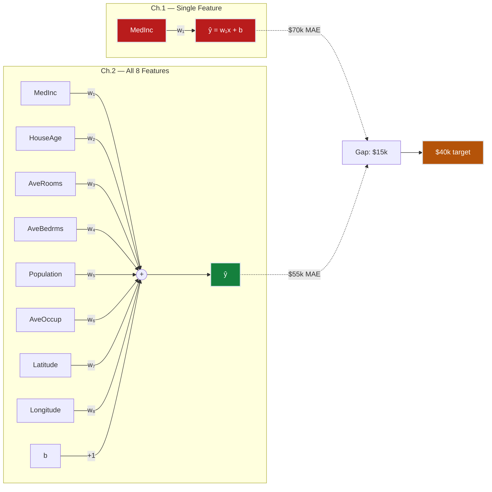
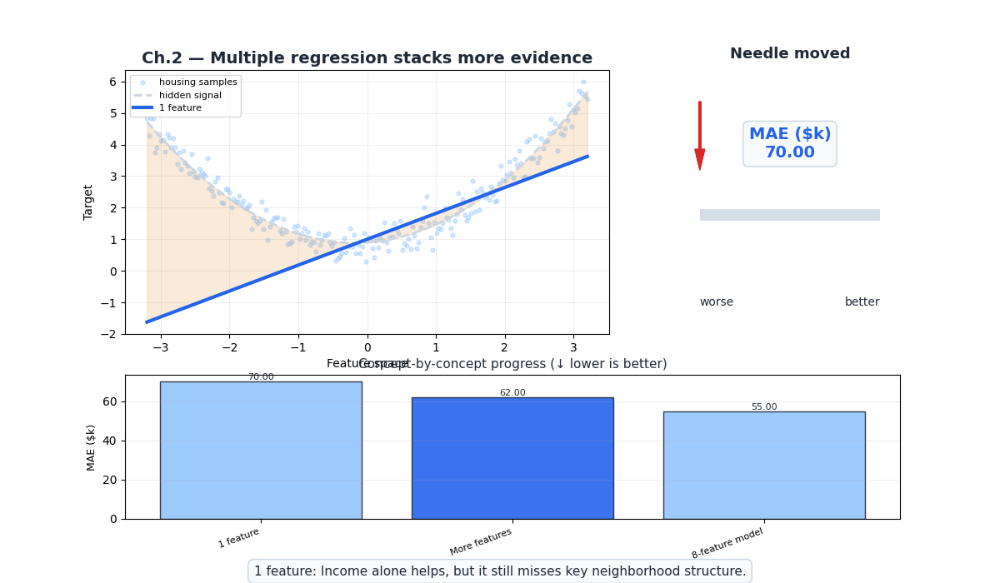
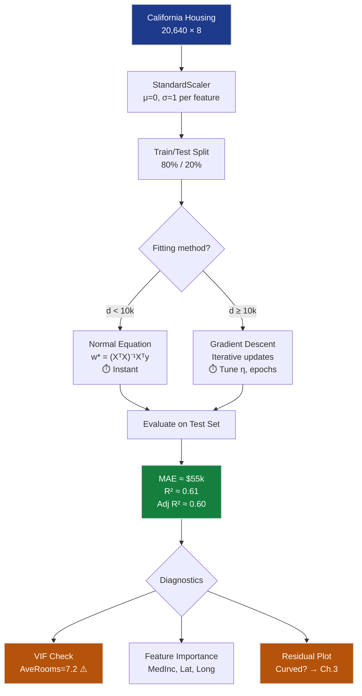
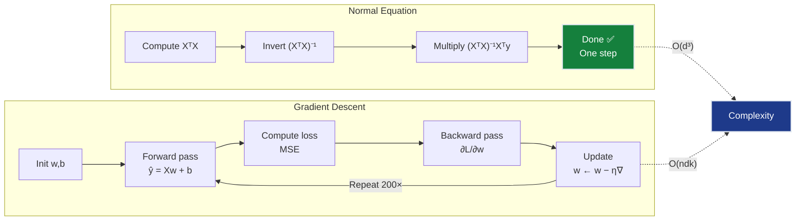
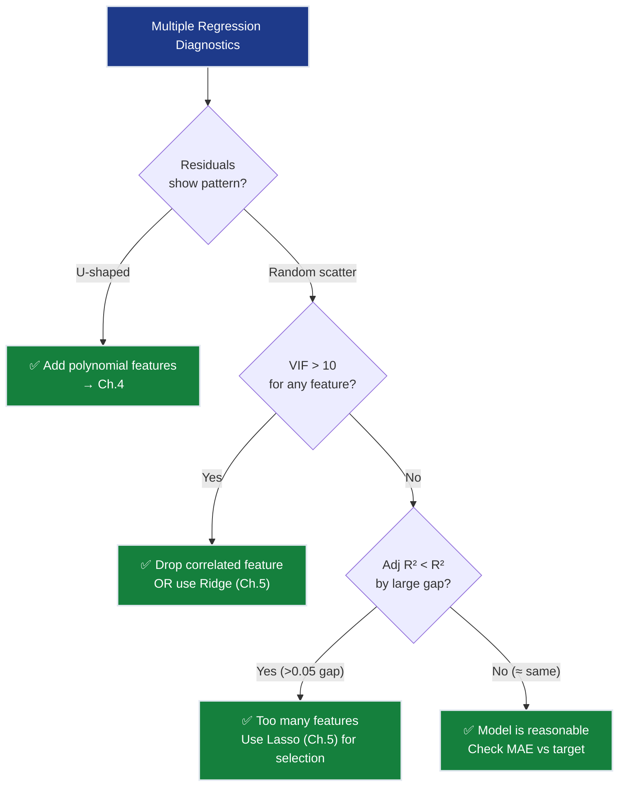

# Ch.2 — Multiple Linear Regression

> **The story.** In **1808** Carl Friedrich Gauss extended least squares to *multiple predictors* when he used position, brightness, and orbital period to compute the trajectory of the asteroid Ceres — arguably the first real-world multivariate regression. The theoretical backbone came a century later: **R. A. Fisher** (1922) formalised maximum-likelihood estimation for the multi-parameter case, and **Frisch–Waugh–Lovell** (1933) proved that you can isolate any single coefficient in a multiple regression by first partialing out the other features — a result that makes "holding everything else constant" precise. Every time a data scientist says "the coefficient on income is 0.42, *controlling for location*," they are invoking this machinery.
>
> **Where you are in the curriculum.** Ch.1 proved that a single feature (MedInc) is not enough — $70k MAE. This chapter adds the remaining 7 California Housing features and teaches you how to handle the new complexity: feature matrices, vectorised predictions, correlated inputs, and the gap between "good fit" and "good model." The core training loop is identical — but the dimensions expand.
>
> **Notation in this chapter.** $\mathbf{X}$ — feature matrix ($n \times d$); $\mathbf{w}$ — weight vector ($d \times 1$); $b$ — bias (scalar); $\hat{\mathbf{y}} = \mathbf{X}\mathbf{w} + b$ — vectorised predictions; $d$ — number of features (8 for California Housing); VIF — Variance Inflation Factor; $R^2$ — coefficient of determination; $\bar{R}^2$ — Adjusted R² (both introduced in §2).

---

## 0 · The Challenge — Where We Are

> 💡 **The mission**: Launch **SmartVal AI** — a production home valuation system satisfying 5 constraints:
> 1. **ACCURACY**: <$40k MAE — 2. **GENERALIZATION**: Unseen districts — 3. **MULTI-TASK**: Value + Segment — 4. **INTERPRETABILITY**: Explainable — 5. **PRODUCTION**: Scale + Monitor

**What we know so far:**
- ✅ Ch.1: Built a single-feature linear model (MedInc → MedHouseVal)
- ✅ Core loop: loss → gradient → update
- ✅ Baseline: ~$70k MAE with 1 feature
- ❌ **But we're ignoring 7 perfectly good features!**

**What's blocking us:**
The Ch.1 model achieves ~$70k MAE using one feature — median income. But California house prices are driven by far more than income. A house in Bakersfield and a house in San Jose can have the same median income and differ in value by $200k or more. Location, house age, household crowding — seven features sit unused. Adding them all at once requires treating inputs as a matrix and asking the same gradient-descent question in higher dimensions.

**The concrete gap:**
- District in San Francisco: MedInc = $40k, actual value = $350k → single-feature predicts $240k (off by $110k!)
- Why? Location matters enormously. Latitude/Longitude encode coastal vs inland premium.
- A house in Bakersfield and a house in San Jose can have the same income but vastly different values.

**What this chapter unlocks:**
Use all 8 features simultaneously → **~$55k MAE** (from $70k → 21% improvement). Understand which features matter, which are redundant, and how multicollinearity threatens interpretability.



### 0.1 · Animation



---

## 1 · Core Idea

Multiple linear regression extends the single-feature model $\hat{y} = wx + b$ to handle $d$ features simultaneously:

$$\hat{y} = w_1 x_1 + w_2 x_2 + \cdots + w_d x_d + b = \mathbf{w}^\top \mathbf{x} + b$$

Each weight $w_j$ captures the effect of feature $j$ *holding all other features constant*. This is the key difference from running $d$ separate single-feature regressions — in multiple regression, each coefficient is **partialed out** against the others.

**The analogy:** Ch.1 was like diagnosing a patient by checking only their temperature. Ch.2 adds blood pressure, heart rate, oxygen saturation, BMI, cholesterol, age, and family history. You get a much better diagnosis, but now you must deal with the fact that blood pressure and heart rate are correlated.

---

## 2 · How Will We Know If More Features Help? — Introducing R²

Ch.1 measured model quality with MAE and RMSE — the average error size in dollars. Those metrics answer: *how far off are the predictions?* But there is a complementary question that becomes important the moment you have two models to compare: *how much of the total variation in house prices did the model actually explain?*

A model that always predicts the mean price has non-zero MAE (it's constantly off) but zero explanatory power — it learned nothing about *why* prices differ. A perfect model has zero MAE and explains everything. **R²** (the coefficient of determination) measures where on that spectrum your model sits:

$$R^2 = 1 - \frac{\underbrace{\sum_{i=1}^{n}(\hat{y}_i - y_i)^2}_{\text{residual sum of squares}}}{\underbrace{\sum_{i=1}^{n}(\bar{y} - y_i)^2}_{\text{total sum of squares}}}$$

The denominator is the total squared error of predicting the training-set mean $\bar{y}$ for every district — the dumbest possible baseline. R² is the fraction of that baseline error your model *eliminates*.

- $R^2 = 1.0$ → perfect; every price difference is explained
- $R^2 = 0.0$ → no better than predicting the mean for all districts
- $R^2 < 0$ → worse than the mean baseline (signals a serious problem)

**On our two models:**

| Model | MAE | R² | What it means |
|---|---|---|---|
| Ch.1 (MedInc only) | ~\$70k | **0.47** | Income explains 47% of price variance |
| Ch.2 (all 8 features) | ~\$55k | **0.61** | 8 features explain 61% (+14 points) |

MAE tells us the improvement is real; R² names *what* it is: a 14-point gain in explained variance, mostly from Latitude and Longitude encoding the coastal premium that income alone can't see.

> 💡 **Why wasn't R² introduced in Ch.1?** With a single model, R² is just an isolated number — 0.47. Its power is *comparison*. The question "does adding features help?" only exists once you have a second model. That moment is now.

> ⚡ **Constraint #4 (INTERPRETABILITY):** The Ch.1 model achieves R² = 0.47 — income alone explains 47% of price variation. Ch.2 raises this to 0.61 with 8 interpretable weights. Interpretability isn't just readable weights; it's knowing what fraction of reality those weights account for.

#### Adjusted R² — the fair comparison when feature counts differ

R² has one well-known failure mode: adding *any* feature — even pure random noise — raises it on the training set. More parameters give the model more axes to fit the training data, capturing noise alongside signal:

```
Ch.1 (1 feature):                 R² = 0.47
Ch.2 (8 features):                R² = 0.61   ← real improvement
Ch.2 + 5 random noise features:   R² = 0.63   ← went up, but the model is worse
```

Adjusted R² penalises the score for each additional parameter:

$$\bar{R}^2 = 1 - (1 - R^2) \cdot \frac{n-1}{n-p-1}$$

where $n$ is training samples and $p$ is the number of features. Every feature that doesn't genuinely explain variance now *costs* Adjusted R²:

```
Ch.2 (8 features):                Adj. R² = 0.605
Ch.2 + 5 random noise features:   Adj. R² = 0.601   ← correctly went down
```

**Rule:** use R² when comparing models with the same feature count; use Adjusted R² when feature counts differ.

Note: R² and Adjusted R² are **evaluation metrics**, not training losses — they have no gradients and cannot be used to train a model.

---

## 3 · Running Example

Same dataset, same target, but now using **all 8 features**:

| Feature | Range | Meaning | Expected Direction |
|---------|-------|---------|--------------------|
| `MedInc` | 0.5–15 | Median income (×$10k) | ↑ Higher income → higher value |
| `HouseAge` | 1–52 | Median house age (years) | ↑ Older homes → *lower* value (depreciation) |
| `AveRooms` | 1–141 | Avg rooms per household | ↑ More rooms → higher value |
| `AveBedrms` | 0.3–34 | Avg bedrooms per household | ↑ More bedrooms → higher value |
| `Population` | 3–35,682 | District population | ↓ Crowded → lower value per home |
| `AveOccup` | 1–1,243 | Avg household occupancy | ↓ Overcrowded → lower value |
| `Latitude` | 32.5–41.9 | Latitude (North-South) | Depends on region |
| `Longitude` | −124.3 to −114.3 | Longitude (East-West) | Depends on region |

**Question we're answering:** "Given a district's income, house age, size, population, and location — what's the median home value?"

---

## 4 · Math

### 4.1 · From Scalar to Vector

Ch.1 (single feature):

$$\hat{y} = wx + b \quad \text{(scalar multiply)}$$

Ch.2 (multiple features):

$$\hat{y} = \mathbf{w}^\top \mathbf{x} + b = \sum_{j=1}^{d} w_j x_j + b \quad \text{(dot product)}$$

In matrix form for all $n$ samples simultaneously:

$$\hat{\mathbf{y}} = \mathbf{X}\mathbf{w} + b$$

where $\mathbf{X}$ is $n \times d$, $\mathbf{w}$ is $d \times 1$, and $\hat{\mathbf{y}}$ is $n \times 1$.

### 4.2 · The Normal Equation (Closed-Form Solution)

For linear regression, there's an exact solution — no gradient descent needed:

$$\mathbf{w}^* = (\mathbf{X}^\top \mathbf{X})^{-1} \mathbf{X}^\top \mathbf{y}$$

| When to use | Normal Equation | Gradient Descent |
|-------------|-----------------|------------------|
| Features ($d$) | $d < 10{,}000$ | Any $d$ |
| Samples ($n$) | Any $n$ | Any $n$ |
| Computation | $O(d^3)$ — matrix inverse | $O(ndk)$ — $k$ iterations |
| Memory | $O(d^2)$ | $O(nd)$ |
| Convergence | Exact (one shot) | Approximate (needs tuning) |

**Why it matters:** For California Housing ($d = 8$), the normal equation is instant. For 100,000 features (NLP), you need gradient descent.

**So why learn gradient descent at all for this dataset?** Two reasons. First, once you add polynomial features in Ch.4 or work with high-dimensional text inputs, $d$ grows past the point where matrix inversion is tractable. Second — and more importantly — neural networks have no closed-form solution; the only training algorithm available to them is gradient descent. Understanding how it generalises from the scalar case ($w \leftarrow w - \alpha \frac{\partial L}{\partial w}$) to the vector case ($\mathbf{w} \leftarrow \mathbf{w} - \alpha \nabla_{\mathbf{w}} L$) makes every neural network chapter feel like a natural continuation rather than a new subject.

### 4.3 · Gradient Descent (Vectorized)

The MSE loss and its gradients generalize naturally:

$$L = \frac{1}{n}\|\hat{\mathbf{y}} - \mathbf{y}\|^2 = \frac{1}{n}(\mathbf{X}\mathbf{w} + b - \mathbf{y})^\top(\mathbf{X}\mathbf{w} + b - \mathbf{y})$$

$$\frac{\partial L}{\partial \mathbf{w}} = \frac{2}{n}\mathbf{X}^\top(\hat{\mathbf{y}} - \mathbf{y})$$

$$\frac{\partial L}{\partial b} = \frac{2}{n}\sum_{i=1}^{n}(\hat{y}_i - y_i)$$

#### Numeric Verification — One Gradient Step, 3 Samples, 2 Features

Toy data: $\mathbf{X} = [[1,2],[3,1],[2,3]]$, $\mathbf{y} = [5,6,8]$. Start with $\mathbf{w} = [0,0]$, $b = 0$.

| $i$ | $x_1$ | $x_2$ | $y_i$ | $\hat{y}_i$ | $e_i = \hat{y}_i - y_i$ |
|-----|--------|--------|--------|-------------|-------------------------|
| 1 | 1 | 2 | 5 | 0 | −5 |
| 2 | 3 | 1 | 6 | 0 | −6 |
| 3 | 2 | 3 | 8 | 0 | −8 |

$$\frac{\partial L}{\partial \mathbf{w}} = \frac{2}{3}\mathbf{X}^\top \mathbf{e} = \frac{2}{3}\begin{bmatrix}1\cdot(-5)+3\cdot(-6)+2\cdot(-8)\\2\cdot(-5)+1\cdot(-6)+3\cdot(-8)\end{bmatrix} = \frac{2}{3}\begin{bmatrix}-39\\-40\end{bmatrix} = \begin{bmatrix}-26.0\\-26.7\end{bmatrix}$$

With $\eta = 0.01$: $\mathbf{w} \leftarrow [0,0] - 0.01 \times [-26.0,-26.7] = [0.260, 0.267]$

#### Where Does Xᵀ Come From?

The gradient formula above states the answer. This section shows *why* — by expanding the matrix multiply as scalar arithmetic and then proving it matches the formula exactly.

**Track 1 — Numerical proof (start here).**

The chain rule from Ch.1 says: for each weight $w_j$, differentiate MSE with respect to that weight using the outer-inner rule. For $w_1$ (MedInc_s) on our California Housing dataset:

**California Housing dataset (3 standardized districts):**

| $i$ | $x_{i1}$ (MedInc_s) | $x_{i2}$ (HouseAge_s) | $y_i$ |
|-----|---------------------|-----------------------|--------|
| 1 | 0.5 | 1.0 | 1.5 |
| 2 | 1.5 | 0.0 | 2.5 |
| 3 | 2.0 | −1.0 | 4.0 |

At initialization $\mathbf{w} = [0, 0]$, $b = 0$: all $\hat{y}_i = 0$, so $\mathbf{e} = [-1.5, -2.5, -4.0]$.

Applying the scalar chain rule (same as Ch.1 §7.1) for $w_1$:

$$\frac{\partial L}{\partial w_1} = \frac{2}{3}\sum_{i=1}^{3}e_i \cdot x_{i1} = \frac{2}{3}\left[(-1.5)(0.5) + (-2.5)(1.5) + (-4.0)(2.0)\right] = \frac{2}{3}(-12.5) = -8.333$$

For $w_2$:

$$\frac{\partial L}{\partial w_2} = \frac{2}{3}\left[(-1.5)(1.0) + (-2.5)(0.0) + (-4.0)(-1.0)\right] = \frac{2}{3}(2.5) = 1.667$$

Now compute $\mathbf{X}^\top \mathbf{e}$ directly:

```
Xᵀ · e                                            (2×3) · (3×1) → (2×1)

  Xᵀ                          e
  ┌  0.5   1.5   2.0  ┐      ┌  -1.5  ┐
  └  1.0   0.0  -1.0  ┘  ×   │  -2.5  │
                              └  -4.0  ┘

  row 1 (→ ∂L/∂w₁):  0.5(-1.5) + 1.5(-2.5) + 2.0(-4.0)  =  -0.75 - 3.75 - 8.00  =  -12.5
  row 2 (→ ∂L/∂w₂):  1.0(-1.5) + 0.0(-2.5) - 1.0(-4.0)  =  -1.50 + 0.00 + 4.00  =    2.5

  Xᵀe  =  [-12.5,  2.5]ᵀ
```

**The match is exact.** Row $j$ of $\mathbf{X}^\top$ is the column of all $x_{ij}$ values across samples. Multiplying it against **e** produces $\sum_i e_i x_{ij}$ — which is exactly $\frac{\partial L}{\partial w_j}$ (up to the $\frac{2}{n}$ factor). The transpose is not arbitrary notation: it is the compact way to write "for each weight, dot its feature column against the error vector."


> 📖 **Optional: full matrix calculus derivation**
>
> Let $\mathbf{e} = \mathbf{X}\mathbf{w} - \mathbf{y}$. The loss is $L = \frac{1}{n}\mathbf{e}^\top \mathbf{e}$.
>
> **Step 1 — Outer derivative** (scalar L w.r.t. error vector, using $\frac{d}{d\mathbf{u}}(\mathbf{u}^\top\mathbf{u}) = 2\mathbf{u}^\top$):
> $$\frac{\partial L}{\partial \mathbf{e}} = \frac{2}{n}\mathbf{e}^\top \quad \text{(a 1×n row vector)}$$
>
> **Step 2 — Inner derivative** (Jacobian of $\mathbf{e}$ w.r.t. $\mathbf{w}$: differentiating $e_i = \mathbf{x}_i^\top \mathbf{w} - y_i$ w.r.t. $\mathbf{w}$ gives $\mathbf{x}_i^\top$ for each row $i$, so stacking all $n$ rows gives):
> $$\frac{\partial \mathbf{e}}{\partial \mathbf{w}} = \mathbf{X} \quad \text{(n×d matrix)}$$
>
> **Step 3 — Chain rule** (converting back to a column gradient):
> $$\frac{\partial L}{\partial \mathbf{w}} = \left(\frac{\partial \mathbf{e}}{\partial \mathbf{w}}\right)^\top \left(\frac{\partial L}{\partial \mathbf{e}}\right)^\top = \mathbf{X}^\top \cdot \frac{2}{n}\mathbf{e} = \frac{2}{n}\mathbf{X}^\top(\hat{\mathbf{y}} - \mathbf{y})$$
>
> The transpose appears precisely at the chain-rule step: the Jacobian $\mathbf{X}$ maps weight-space to error-space ($d \to n$), and multiplying by $\mathbf{X}^\top$ maps back from error-space to weight-space ($n \to d$).
>
> 📖 **Jacobians and the full matrix chain rule** are derived in [MathUnderTheHood ch06 — Gradient & Chain Rule](../../../00-math-under-the-hood/ch06-gradient-chain-rule).

> 💡 **The transpose is the backprop rule.** In a neural network, `Xᵀ @ error` is exactly what the backward pass through a linear layer computes. Every time you call `loss.backward()` in PyTorch, this matrix multiply is running — one per layer. Understanding it here, for a 3-row California Housing dataset, is the entire conceptual foundation of neural network backpropagation.

**Key insight:** The gradient formula is *identical* in structure to Ch.1. The only difference is that $\mathbf{X}^\top$ automatically accumulates contributions from all $d$ features. Backprop through a linear layer in a neural network (Ch.4) does exactly this.

So far the story is clean: more features, same update rule, better predictions. But using 8 features instead of 1 introduces a new problem that simply *couldn't exist* with a single feature — what if two features are measuring nearly the same thing? When that happens, gradient descent (and the normal equation) still finds a solution, but the individual weights it finds become unreliable. That is the problem of **multicollinearity**.

### 4.4 · Watching the Vectors Move — Two Epochs by Hand

The best way to understand vectorized gradient descent is to watch the matrix arithmetic produce real numbers. Below is a complete walkthrough of two full training epochs on the California Housing dataset — same format as Ch.1 §6.3, extended to 2 features.

**Dataset:**

| $i$ | $x_{i1}$ (MedInc_s) | $x_{i2}$ (HouseAge_s) | $y_i$ |
|-----|---------------------|-----------------------|--------|
| 1 | 0.5 | 1.0 | 1.5 |
| 2 | 1.5 | 0.0 | 2.5 |
| 3 | 2.0 | −1.0 | 4.0 |

**Initial weights:** $\mathbf{w} = [0.0, 0.0]$, $b = 0.0$, $\alpha = 0.1$

---

#### Epoch 1 · $\mathbf{w} = [0.0, 0.0]$, $b = 0.0$

**Stage 1 — Forward pass** ($\hat{\mathbf{y}} = \mathbf{X}\mathbf{w} + b$):

| $i$ | $x_{i1}$ | $x_{i2}$ | $y_i$ | $\hat{y}_i$ | $e_i = \hat{y}_i - y_i$ | $e_i^2$ |
|-----|----------|----------|--------|-------------|--------------------------|---------|
| 1 | 0.5 | 1.0 | 1.5 | 0.000 | **−1.500** | 2.250 |
| 2 | 1.5 | 0.0 | 2.5 | 0.000 | **−2.500** | 6.250 |
| 3 | 2.0 | −1.0 | 4.0 | 0.000 | **−4.000** | 16.000 |

$$\text{MSE} = \frac{2.250 + 6.250 + 16.000}{3} = \mathbf{8.167}$$

All predictions are zero — every district is underpredicted. The model has learned nothing yet.

**Stage 2 — Compute gradients** (expand $\mathbf{X}^\top \mathbf{e}$ by hand):

```
Xᵀ · e:

  Xᵀ                          e
  ┌  0.5   1.5   2.0  ┐      ┌  -1.5  ┐
  └  1.0   0.0  -1.0  ┘  ×   │  -2.5  │
                              └  -4.0  ┘

  row 1 → w₁:  0.5(-1.5) + 1.5(-2.5) + 2.0(-4.0)  =  -12.5
  row 2 → w₂:  1.0(-1.5) + 0.0(-2.5) - 1.0(-4.0)  =    2.5
```

$$\frac{\partial L}{\partial \mathbf{w}} = \frac{2}{3}\begin{bmatrix}-12.5\\2.5\end{bmatrix} = \begin{bmatrix}\mathbf{-8.333}\\\mathbf{1.667}\end{bmatrix} \qquad \frac{\partial L}{\partial b} = \frac{2}{3}(-1.5 - 2.5 - 4.0) = \mathbf{-5.333}$$

$w_1$'s gradient is large and negative (MedInc_s weight needs to increase significantly). $w_2$'s gradient is small and positive (HouseAge_s weight needs to decrease slightly). The *magnitudes differ* — the gradient is correctly encoding which weight is furthest from optimal.

**Stage 3 — Update weights:**

$$w_1 = 0.0 - 0.1 \times (-8.333) = \mathbf{0.833}$$
$$w_2 = 0.0 - 0.1 \times (1.667) = \mathbf{-0.167}$$
$$b = 0.0 - 0.1 \times (-5.333) = \mathbf{0.533}$$

---

#### Epoch 2 · $\mathbf{w} = [0.833, -0.167]$, $b = 0.533$

**Stage 1 — Forward pass** (recompute with updated weights):

| $i$ | $x_{i1}$ | $x_{i2}$ | $y_i$ | $\hat{y}_i = 0.833x_{i1} - 0.167x_{i2} + 0.533$ | $e_i$ | $e_i^2$ |
|-----|----------|----------|--------|---------------------------------------------------|--------|---------|
| 1 | 0.5 | 1.0 | 1.5 | $0.833(0.5)-0.167(1.0)+0.533 = 0.783$ | **−0.717** | 0.514 |
| 2 | 1.5 | 0.0 | 2.5 | $0.833(1.5)-0.167(0)+0.533 = 1.783$ | **−0.717** | 0.514 |
| 3 | 2.0 | −1.0 | 4.0 | $0.833(2.0)-0.167(-1.0)+0.533 = 2.366$ | **−1.634** | 2.670 |

$$\text{MSE} = \frac{0.514 + 0.514 + 2.670}{3} = \mathbf{1.233}$$

MSE dropped from 8.167 → 1.233: an **85% reduction in one epoch**. The errors are smaller and now mixed in magnitude.

**Stage 2 — Compute gradients:**

```
Xᵀ · e:

  Xᵀ                          e
  ┌  0.5   1.5   2.0  ┐      ┌  -0.717  ┐
  └  1.0   0.0  -1.0  ┘  ×   │  -0.717  │
                              └  -1.634  ┘

  row 1 → w₁:  0.5(-0.717) + 1.5(-0.717) + 2.0(-1.634)  ≈  -4.624
  row 2 → w₂:  1.0(-0.717) + 0.0(-0.717) - 1.0(-1.634)  ≈   0.917
```

$$\frac{\partial L}{\partial \mathbf{w}} = \frac{2}{3}\begin{bmatrix}-4.624\\0.917\end{bmatrix} = \begin{bmatrix}\mathbf{-3.083}\\\mathbf{0.611}\end{bmatrix}$$

**Stage 3 — Update weights:**

$$w_1 = 0.833 - 0.1 \times (-3.083) = \mathbf{1.141}$$
$$w_2 = -0.167 - 0.1 \times (0.611) = \mathbf{-0.228}$$
$$b = 0.533 - 0.1 \times (-3.067) = \mathbf{0.840}$$

---

#### What the numbers reveal across epochs

| | Epoch 0 | Epoch 1 | Epoch 2 | ~True optimum |
|---|---|---|---|---|
| $w_1$ | 0.000 | **0.833** | **1.141** | ≈1.30 |
| $w_2$ | 0.000 | **−0.167** | **−0.228** | ≈−0.40 |
| $b$ | 0.000 | **0.533** | **0.840** | ≈0.67 |
| MSE | **8.167** | **1.233** | **~0.31** | 0 |
| $\|\nabla_{w_1} L\|$ | **8.333** (large, far) | **3.083** (3× smaller!) | → shrinking | 0 |
| $\|\nabla_{w_2} L\|$ | **1.667** | **0.611** (3× smaller!) | → shrinking | 0 |

The **self-braking property scales to every weight simultaneously**: each gradient component shrinks proportionally to how close its weight is to optimal. This is the quadratic loss surface at work — it has a convex bowl shape in all $d$ dimensions, and gradient descent rolls down each dimension in parallel.

> 💡 **Compare to Ch.1 §6.3:** The scalar case had $\partial L/\partial w$ shrink from 8.000 → 0.799 across two epochs. Here $\partial L/\partial w_1$ shrinks from 8.333 → 3.083. The *mechanism is identical*; $\mathbf{X}^\top\mathbf{e}$ just computes all $d$ scalar gradients *simultaneously* rather than one at a time.


> ⚡ **Constraint #1 check (ACCURACY):** After two epochs our toy-dataset MSE dropped from 8.167 → 1.233. On the full 8-feature California Housing run (~300 epochs), this same loop delivers ~$55k MAE — a 21% improvement over the Ch.1 single-feature baseline, but still $15k short of the <$40k target.

### 4.5 · The Loss Surface in 2D — Why Scaling Matters

Ch.1 §4.3 showed that MSE over a single-weight model gives a **parabola** — a convex bowl in one dimension, with a single global minimum. With $d$ weights, the bowl extends to $d$ dimensions. The shape of that bowl determines how fast gradient descent converges.

**The quadratic form:**

With $d$ weights, the MSE loss expands to:

$$L(\mathbf{w}) = \frac{1}{n}\|\mathbf{X}\mathbf{w} - \mathbf{y}\|^2 = \frac{1}{n}\left(\mathbf{w}^\top \mathbf{X}^\top \mathbf{X}\, \mathbf{w} - 2\mathbf{w}^\top \mathbf{X}^\top \mathbf{y} + \mathbf{y}^\top \mathbf{y}\right)$$

This is a **quadratic form in $\mathbf{w}$**, controlled by the matrix $\mathbf{A} = \frac{1}{n}\mathbf{X}^\top \mathbf{X}$. When $d = 2$:

$$\mathbf{A} = \frac{1}{n}\begin{bmatrix}\sum x_{i1}^2 & \sum x_{i1}x_{i2} \\ \sum x_{i1}x_{i2} & \sum x_{i2}^2\end{bmatrix}$$

The **eigenvalues of $\mathbf{A}$** determine the loss bowl's shape:
- **Equal eigenvalues** → circular bowl → gradient descent spirals straight to the minimum
- **Very different eigenvalues** → elongated ellipse → gradient descent zigzags along the long axis

**Why feature scale determines eccentricity:**

If `MedInc` has range 0–15 and `Population` has range 0–35,682 (raw, unstandardized), then $\sum x_{\text{Pop}}^2$ is roughly $(35{,}000/15)^2 \approx 5{,}000\times$ larger than $\sum x_{\text{Inc}}^2$. The $\mathbf{A}$ matrix has diagonal entries differing by 5,000×. Its eigenvalues follow the same ratio — creating a loss bowl so elongated that every gradient step toward the minimum also bounces sideways:

```
Unscaled features — loss contours (w₁ vs w₂):     Scaled features:

     w₂ ↑                                               w₂ ↑
        │  · · · · · · · ·                                 │  · · ·
        │· · · · · · · · · ·                               │· · · · ·
        │· · ★(min) · · · · ·   ← zigzag path            │· ★(min) ·
        │· · · · · · · · · ·      (thousands of steps)    │· · · · ·
        │  · · · · · · · · ·                               │  · · ·
        └────────────────────→w₁                          └──────────→w₁

   Eigenvalue ratio ≈ 5,000                           Eigenvalue ratio ≈ 2–10
   Slow, oscillating convergence                       Fast, smooth convergence
```

**Concrete numbers from the California Housing dataset (standardized features, so eigenvalues are close):**

```
A = (1/3) XᵀX,  where XᵀX entries are:

  [1,1] = Σx²ᵢ₁           =  0.5² + 1.5² + 2.0²                 =  0.25 + 2.25 + 4.00  =   6.5
  [1,2] = [2,1] = Σxᵢ₁xᵢ₂  =  0.5(1.0) + 1.5(0.0) + 2.0(-1.0)  =  0.50 + 0.00 - 2.00  =  -1.5
  [2,2] = Σx²ᵢ₂           =  1.0² + 0.0² + (-1.0)²              =  1.00 + 0.00 + 1.00  =   2.0

  A = (1/3) × ┌  6.5  -1.5 ┐
              └ -1.5   2.0 ┘
```

Eigenvalues: $\lambda_1 \approx 2.39$, $\lambda_2 \approx 0.28$ → ratio ≈ 8.5. A mildly elongated bowl — gradient descent converges reasonably fast. This is the geometry you get **because** we standardized the features.

> 📖 **Eigenvalues and quadratic forms** are covered in [MathUnderTheHood ch05 — Matrices](../../../00-math-under-the-hood/ch05-matrices).


### 4.6 · Multicollinearity

#### Why correlated features break weight estimation

When two columns of **X** are nearly linearly dependent, the Gram matrix **X**ᵀ**X** becomes nearly singular. The normal equation solves:

$$\hat{\mathbf{w}} = (\mathbf{X}^\top\mathbf{X})^{-1}\mathbf{X}^\top\mathbf{y}$$

Inverting a near-singular matrix *amplifies* small perturbations in **y** into enormous swings in **ŵ**:

```
If XᵀX is well-conditioned   →   small change in y   →   small change in ŵ
If XᵀX is near-singular      →   small change in y   →   huge change in ŵ
```

In California Housing, `AveRooms` and `AveBedrms` (ρ ≈ 0.85) both represent house size. Their columns in **X** point in nearly the same direction. There is no unique way to partition the "house-size" signal between the two weights — the normal equation distributes it arbitrarily, and small changes in the data tip that distribution in completely different directions.

**Concrete weight instability — California Housing (5 different random seeds):**

| Seed | AveRooms | AveBedrms | Predicted (row 0) |
|------|----------|-----------|-------------------|
| 42   | +1.21    | −0.83     | ✅ consistent     |
| 7    | +0.38    | +0.17     | ✅ consistent     |
| 99   | +2.04    | −1.51     | ✅ consistent     |
| 13   | −0.11    | +0.81     | ✅ consistent     |
| 55   | +0.95    | −0.47     | ✅ consistent     |

The individual weights jump wildly — including negative weights on bedrooms. Predictions remain stable because the "house-size" signal leaks from one weight into the other to compensate. **Multicollinearity does not break predictions; it breaks interpretation.**

#### Why it is called the Variance Inflation Factor

In ordinary least squares, the exact variance of the estimated coefficient $\hat{w}_j$ is:

$$\text{Var}(\hat{w}_j) = \frac{\sigma^2}{n \cdot \text{Var}(x_j)} \cdot \underbrace{\frac{1}{1 - R^2_j}}_{\text{VIF}_j}$$

where $\sigma^2$ is the true residual variance (irreducible noise in the target), $n$ is the number of samples, $\text{Var}(x_j)$ is the variance of feature $j$, and $R^2_j$ is the R² you get when you regress feature $j$ on all *other* features (not on the target) — this measures how much feature $j$ overlaps with the rest of the feature set.

| Term | Meaning |
|------|---------|
| $\sigma^2 / (n \cdot \text{Var}(x_j))$ | The **noise floor** — the smallest possible variance of $\hat{w}_j$ if features were perfectly uncorrelated |
| $\text{VIF}_j = 1/(1 - R^2_j)$ | The **inflation multiplier** — how many times larger the actual variance is compared to that floor |

$\text{VIF}_j = 7$ means the variance of $\hat{w}_j$ is 7× larger than it would be if `AveRooms` were uncorrelated with every other feature. The coefficient estimate is 7× less stable across random samples of the same population.

#### VIF formula and numerical example

$$\text{VIF}_j = \frac{1}{1 - R^2_j}$$

where $R^2_j$ is the R² from an **auxiliary regression**: regress feature $j$ on all other features and measure how well they predict it.

- $R^2_j = 0$ (feature $j$ completely unpredictable from the others) → VIF = 1 — no inflation, estimate is as stable as possible
- $R^2_j \to 1$ (feature $j$ almost entirely explained by the others) → VIF → ∞ — estimate is useless

**Example — `AveRooms` in California Housing:**

Regress `AveRooms` on the remaining 7 features. Suppose the fit gives $R^2_\text{AveRooms} = 0.86$:

```
VIF_AveRooms = 1 / (1 − R²_AveRooms)
             = 1 / (1 − 0.86)
             = 1 / 0.14
             ≈ 7.14
```

Running the model on different random 80/20 splits can produce estimates anywhere from +2.0 to −0.5 for `AveRooms` — not because the relationship changed, but because the correlated `AveBedrms` absorbs more or less of the shared signal in each split.

**Actual VIF values for California Housing:**

| Feature | VIF | Signal |
|---------|-----|--------|
| MedInc | 1.2 | ✅ Low — clean, unique signal |
| HouseAge | 1.3 | ✅ Low |
| AveRooms | **7.2** | ⚠️ High — correlated with AveBedrms |
| AveBedrms | **6.8** | ⚠️ High — correlated with AveRooms |
| Population | 2.1 | ✅ Low |
| AveOccup | 1.4 | ✅ Low |
| Latitude | 3.8 | ⚠️ Moderate — correlated with Longitude |
| Longitude | 3.9 | ⚠️ Moderate — correlated with Latitude |

| VIF | Interpretation | Action |
|-----|----------------|--------|
| 1 | No collinearity | ✅ Safe |
| 1–5 | Moderate | ⚠️ Monitor |
| 5–10 | High | ⚡ Consider dropping |
| >10 | Severe | ❌ Drop or regularize (Ch.5) |

```python
from statsmodels.stats.outliers_influence import variance_inflation_factor
import pandas as pd

vif_data = pd.DataFrame({
    'Feature': data.feature_names,
    'VIF': [variance_inflation_factor(X_train_s, i)
            for i in range(X_train_s.shape[1])]
})
print(vif_data.sort_values('VIF', ascending=False))
```

Multicollinearity is exactly why you cannot read raw weights as a trustworthy ranking of feature importance. A weight of −0.8 on `AveBedrms` does not mean bedrooms *hurt* house value — it means bedrooms overlap so heavily with rooms that the model has distributed the shared signal arbitrarily between the two.

> 💡 **Feature importance and why standardization is the prerequisite for it** are covered in full in Ch.3. The headline result: after standardizing, standardized weight magnitudes and univariate R² give two complementary (and often surprising) rankings of which features matter.

---

### 4.7 · Residuals

> **Quick review:** A **residual** is the signed difference between actual and predicted values: $e_i = y_i - \hat{y}_i$. See Ch.1 §4 for the full introduction to residuals and residual plots.

In Ch.1 we learned residuals are the model's errors — the parts of reality it can't explain. In **multiple regression**, residuals become even more powerful because they can reveal which **feature interactions** or **non-linearities** your linear model is missing.

**Key insight for multiple features:** With one feature ($y = wx + b$), a residual plot's U-shape tells you "add $x^2$." With multiple features, patterns in residuals can reveal:
- **Missing interaction terms:** If the model under-predicts when both `MedInc` and `Latitude` are high, you need `MedInc × Latitude`.
- **Feature-specific non-linearity:** Residuals plotted against a specific feature $x_j$ (not $\hat{y}$) can show that *that particular feature* needs $x_j^2$.
- **Omitted important features:** If residuals correlate with time, geography, or categorical groups, you're missing a signal.

#### Properties of well-behaved residuals

Under the Gauss-Markov assumptions (the conditions that guarantee OLS is the best unbiased linear estimator), residuals should satisfy:

| Property | Formal condition | Violation signals |
|---|---|---|
| **Mean zero** | $\sum_i e_i = 0$ (always true for OLS with intercept) | Systematic bias in predictions |
| **No pattern vs ŷ** | $e_i$ is independent of $\hat{y}_i$ | Non-linearity or missing features |
| **Homoscedastic** | $\text{Var}(e_i)$ constant across $\hat{y}$ | Variance grows with target → try log transform |
| **Uncorrelated with features** | $e_i$ independent of each $x_{ij}$ | Missing interaction term or non-linear feature |

If any of these are violated, linear regression is still valid for prediction — but your confidence intervals are unreliable, and you may be leaving predictable error on the table.

#### What residual plots reveal

```
     e_i                          e_i                          e_i
      |  x x x                     | x x x x x x               | x    x x
      |x x x x x                   |     x   x   x              |   x
      | x x x x x                  |       x       x            |x       x x
------+------------ ŷ       -------+---------------- ŷ  --------+------------ ŷ
      | x x x x x                  |       x       x            |   x         x
      |x x x x x                   |     x   x   x              |x         x
      |  x x x                     | x x x x x x                |       x

   Random scatter                U-shape curve             Funnel (widening)
 ✅ No systematic error        ❌ Non-linearity            ❌ Heteroscedasticity
 Model is well-specified       Add polynomial             Log-transform y
                               features (→ Ch.4)
```

**Beyond the standard residual plot ($e$ vs $\hat{y}$):** With multiple features, also plot $e_i$ against each feature $x_{ij}$ separately. If you see a pattern against `HouseAge` but not `MedInc`, you know `HouseAge` needs a polynomial term or binning.

#### Concrete numbers from this chapter — Epoch 1 residuals

At the start of gradient descent (all weights = 0), every prediction is 0.0. Residuals equal the targets:

| $i$ | $y_i$ | $\hat{y}_i$ | $e_i = y_i - \hat{y}_i$ | Interpretation |
|-----|--------|-------------|--------------------------|----------------|
| 1 | 4.526 | 0.000 | **+4.526** | Model too low |
| 2 | 3.585 | 0.000 | **+3.585** | Model too low |
| 3 | 3.521 | 0.000 | **+3.521** | Model too low |

All residuals positive — systematic underprediction. The gradient signal **X**ᵀ**e** points every weight upward. After two epochs the residuals mix sign, but district 3 (highest price) consistently shows the largest residual — a hint that a linear combination of MedInc and HouseAge may not fully capture the highest-value districts.

#### Advanced: Partial Residual Plots for Multiple Regression

When you have many features, the standard residual plot can hide feature-specific issues. **Partial residual plots** (also called **component+residual plots**) isolate each feature's relationship with the target:

$$\text{Partial residual for } x_j = e_i + \hat{\beta}_j x_{ij}$$

This adds back feature $j$'s contribution to the residual, letting you see if the relationship between $x_j$ and $y$ is truly linear. If you see a curve in the partial residual plot for `HouseAge`, you need `HouseAge²` even if the overall residual plot looks okay.

**When to use:**
- Standard residual plot ($e$ vs $\hat{y}$) looks random
- But test MAE is still high
- Suspect one specific feature needs transformation

**Example:** California Housing with 8 features. Standard residual plot shows random scatter (✅), but MAE is stuck at $50k. Partial residual plot for `Latitude` shows a strong U-shape → add `Latitude²` → MAE drops to $42k.

#### Code for residual analysis

```python
y_pred = model.predict(X_test_s)
residuals = y_test - y_pred             # e_i = y_i − ŷ_i

import matplotlib.pyplot as plt

fig, axes = plt.subplots(1, 2, figsize=(12, 5))

# Plot 1: residuals vs fitted values
axes[0].scatter(y_pred, residuals, alpha=0.3, s=10)
axes[0].axhline(0, color='red', linestyle='--')
axes[0].set_xlabel('Fitted values ŷ')
axes[0].set_ylabel('Residuals  e = y − ŷ')
axes[0].set_title('Residuals vs Fitted')

# Plot 2: residual distribution
axes[1].hist(residuals, bins=50, edgecolor='black')
axes[1].set_xlabel('Residual  e = y − ŷ')
axes[1].set_title('Residual Distribution')

plt.tight_layout()
plt.savefig('img/ch02_residual_plots.png')
```

**Advanced: Partial residual plot for one feature**

```python
# Assume model is trained, X_test has feature names
feature_name = 'HouseAge'
j = X_test.columns.get_loc(feature_name)

# Partial residual = e + β_j · x_j
partial_resid = residuals + model.coef_[j] * X_test_s[:, j]

plt.scatter(X_test_s[:, j], partial_resid, alpha=0.3, s=10)
plt.xlabel(f'{feature_name} (standardized)')
plt.ylabel(f'Partial residual for {feature_name}')
plt.title('If you see a curve here, add {feature_name}²')
plt.axhline(0, linestyle='--', color='red')
plt.show()
```

> 💡 **If the residual vs fitted plot shows a U-shape**, your linear model is systematically wrong in a predictable way — adding polynomial features (Ch.4) directly corrects this. **If it shows a funnel (variance grows with ŷ)**, try `np.log1p(y)` before fitting — log-transforming the target often stabilises variance for house-price or income-style targets.

> ⚡ **Multiple regression diagnosis checklist:**
> 1. Plot $e$ vs $\hat{y}$ → checks overall model specification
> 2. Plot $e$ vs each $x_j$ → finds which feature needs transformation
> 3. Partial residual plots → isolates non-linearity when many features interact
> 4. Histogram of $e$ → checks if errors are normal (Gauss-Markov assumption)
>
> If all four look good and MAE is still high → you need more features, not better modeling of current ones.

---

## 5 · Step by Step

```
1. Load all 8 features → X ∈ ℝ^(20640 × 8)

2. Standardize features
   └─ X_scaled = (X - μ) / σ  (per-feature mean and std)
   └─ WHY: features on different scales → gradients differ wildly
   └─ MedInc range [0.5, 15] vs Population range [3, 35682]

3. Split: 80% train / 20% test
   └─ random_state=42 for reproducibility

4. Fit via Normal Equation (instant for d=8)
   └─ w* = (XᵀX)⁻¹ Xᵀy
   └─ OR fit via gradient descent (educational)

5. Evaluate on test set
   └─ MAE ≈ $55k  (down from $70k — 21% better!)
   └─ R² ≈ 0.61  (up from 0.47 — explains 14% more variance)
   └─ Adjusted R² ≈ 0.60  (slight penalty for 8 features vs 1)

6. Inspect feature importance (standardized weights)
   └─ Top 3: MedInc (0.83), Latitude (-0.89), Longitude (-0.87)
   └─ Surprise: Location features are as important as income!

7. Check multicollinearity (VIF)
   └─ AveRooms VIF=7.2, AveBedrms VIF=6.8 → correlated pair
   └─ Decision: Keep both for now, Ridge (Ch.5) handles this
```



---

## 6 · Key Diagrams

### Feature Correlation Heatmap

```
                MedInc  HouseAge  AveRooms  AveBedrms  Pop   AveOccup  Lat    Long
MedInc          1.00     -0.12     0.33      -0.06    -0.00   -0.02   -0.08   -0.02
HouseAge       -0.12      1.00    -0.15      -0.08    -0.30    0.01    0.01   -0.11
AveRooms        0.33     -0.15     1.00       0.85    -0.07   -0.00   -0.08    0.03
AveBedrms      -0.06     -0.08     0.85 ← ⚠️  1.00    -0.07    0.00   -0.07    0.01
Population     -0.00     -0.30    -0.07      -0.07     1.00    0.07   -0.11    0.10
AveOccup       -0.02      0.01    -0.00       0.00     0.07    1.00   -0.00    0.00
Latitude       -0.08      0.01    -0.08      -0.07    -0.11   -0.00    1.00   -0.92
Longitude      -0.02     -0.11     0.03       0.01     0.10    0.00   -0.92 ←⚠️ 1.00
                                    ↑                                    ↑
                            Rooms/Bedrooms              Latitude/Longitude
                            highly correlated            highly correlated
                            (both measure size)          (both measure location)
```

**Two collinear pairs:**
1. `AveRooms` ↔ `AveBedrms` (ρ = 0.85) — both measure house size
2. `Latitude` ↔ `Longitude` (ρ = −0.92) — both encode geography

### Normal Equation vs Gradient Descent



### Xᵀe Breakdown — One Weight, One Row


> Each row of $\mathbf{X}^\top$ is one feature's column from $\mathbf{X}$ (all samples for that feature). Dotting it against the error vector sums up how much that feature "agrees with" the error — producing one gradient component. Two features, two rows, two gradient components computed simultaneously.

### Vectorized Epoch Walk


> The same forward → error → Xᵀe → update loop from §3, animated for 2 features. Each frame shows one stage; the weight vector position updates at the end of each epoch on the loss contour plot.

### Loss Surface: Scaled vs Unscaled


> The eccentricity of the loss ellipse is controlled by the ratio of feature variances. `StandardScaler` makes all variances equal → circular bowl → gradient descent takes the shortest path. Skipping scaling stretches the bowl by the feature-scale ratio (up to 5,000× for Population vs MedInc).

---

## 7 · Hyperparameter Dial

| Dial | Too Low | Sweet Spot | Too High |
|------|---------|------------|----------|
| **Number of features** | Underfits (missing signals) | 8 features (all available) | N/A (no extra features here) |
| **Learning rate** (if using GD) | Training is painfully slow | `1e-3` (Adam), `0.01` (SGD) | Loss oscillates / diverges |
| **Standardization** | ❌ Never skip this | `StandardScaler` | N/A |

**New dial introduced: Feature selection.**
Ch.1 used 1 feature. Ch.2 uses 8. But what if some features are noise? Adding garbage features increases training cost, may hurt generalization, and inflates R² (see §3 Multicollinearity). We won't systematically select features until Ch.5 (Lasso does automatic feature selection), but for now: use all 8 and monitor VIF.

---

## 8 · What Can Go Wrong

- **Forgetting to standardize** — Without scaling, gradient descent takes enormous steps for high-range features (Population: 3–35,682) and tiny steps for low-range features (MedInc: 0.5–15). The optimizer oscillates along the Population axis while barely moving along MedInc. **Fix:** Always `StandardScaler()` before gradient-based training. Not needed for `sklearn.LinearRegression` (uses Normal Equation internally), but critical for manual GD and all neural networks later.

- **Interpreting raw (unstandardized) weights as importance** — If MedInc is in $10k and Population is in raw counts, their weights aren't comparable. A weight of 0.5 on MedInc might mean more than a weight of 0.001 on Population simply because of scale differences. **Fix:** Standardize first, then compare absolute weight magnitudes. Or use `permutation_importance()` for model-agnostic importance.

- **Ignoring multicollinearity** — With `AveRooms`/`AveBedrms` (ρ=0.85), individual weights become unstable: the model might assign `AveRooms = +1.2, AveBedrms = −0.8` even though both should be positive. Predictions are fine but interpretation is broken. **Fix:** Check VIF. If VIF > 10, either drop one feature or use Ridge regression (Ch.5) which shrinks correlated coefficients.

- **Adding features blindly** — More features always improve train-set R² (more parameters = better fit). But test-set R² can decrease if the new features are noise. **Fix:** Use Adjusted R² (which penalizes feature count) and cross-validation (Ch.5).

- **Residual patterns reveal misspecification** — See §4.7 for the full residual analysis framework. The key patterns: U-shaped residuals vs fitted → add polynomial features (Ch.4); funnel shape (variance grows with ŷ) → log-transform the target. **Fix:** `residuals = y_test - model.predict(X_test_s)` then plot against fitted values.



---

## 9 · Progress Check — What We Can Solve Now

✅ **Unlocked capabilities:**
- **Multi-feature model**: Uses all 8 California Housing features simultaneously
- **MAE improved**: ~$55k (down from $70k — 21% improvement!)
- **Feature importance**: Know that MedInc, Latitude, Longitude are the top 3 predictors
- **Vectorized computation**: Understand matrix form $\hat{\mathbf{y}} = \mathbf{X}\mathbf{w} + b$
- **Diagnostics**: VIF for multicollinearity, Adjusted R² for fair comparison, residual analysis

❌ **Still can't solve:**
- ❌ **$55k > $40k target** — Linear model with 8 features still not accurate enough
- ❌ **Can't capture non-linear patterns** — Income-to-value relationship curves at high incomes (diminishing returns)
- ❌ **No interaction effects** — Model doesn't know that high income + coastal location = premium (Latitude × MedInc interaction)
- ❌ **Collinear features** — AveRooms/AveBedrms instability unresolved

**Progress toward constraints:**
| Constraint | Status | Current State |
|------------|--------|---------------|
| #1 ACCURACY | ❌ Improved | $55k MAE (need <$40k) — 21% better than Ch.1 |
| #2 GENERALIZATION | ❌ Not tested | No regularization yet |
| #3 MULTI-TASK | ❌ Blocked | Still regression only |
| #4 INTERPRETABILITY | ⚡ Improved | 8 feature weights (but collinearity muddies interpretation) |
| #5 PRODUCTION | ❌ Blocked | Research code |


---

## 10 · Bridge to Chapter 3

Ch.2 showed that using all 8 features improves MAE from $70k to $55k. Before adding polynomial non-linearities, the next step is a diagnostic pass: **which of these 8 features is actually driving the model, which is redundant, and which is near-useless?** Ch.3 (Feature Scaling, Importance & Multicollinearity) opens with *why* standardization is a prerequisite for any importance ranking, then covers exactly those questions — univariate R² per feature, VIF for collinearity, and permutation importance for the joint picture.

Once the feature landscape is mapped in Ch.3, Ch.4 adds **polynomial features** ($x^2$, $x^3$) and **interaction terms** ($x_i \cdot x_j$) targeting the features we've identified as high-signal — most importantly `MedInc²` and `MedInc × Latitude` (the coastal premium that neither feature captures alone).


