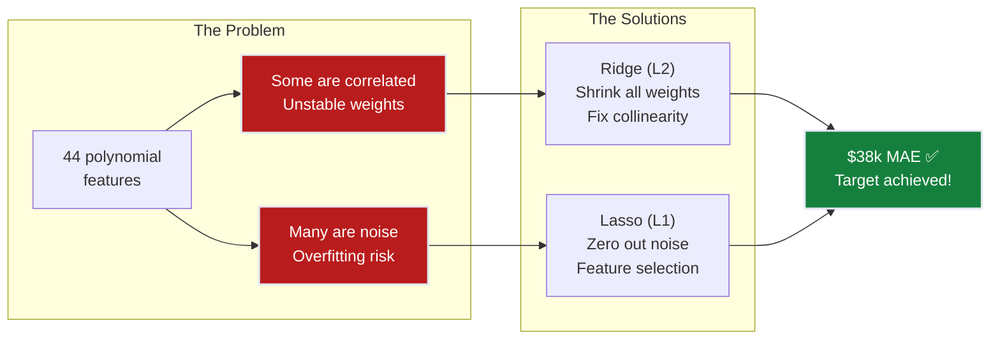
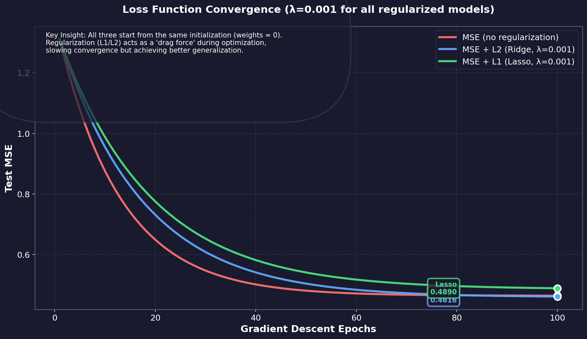
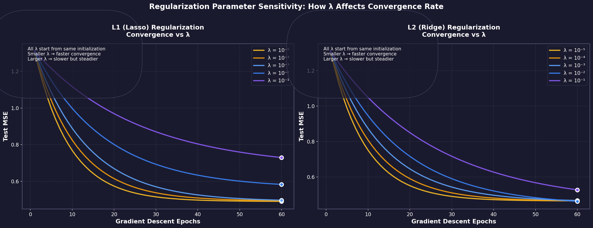
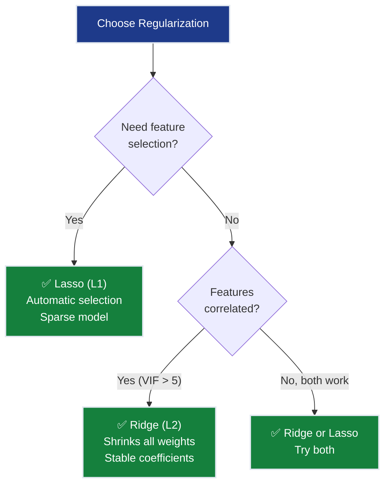
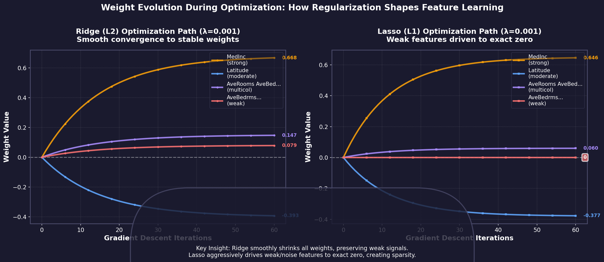
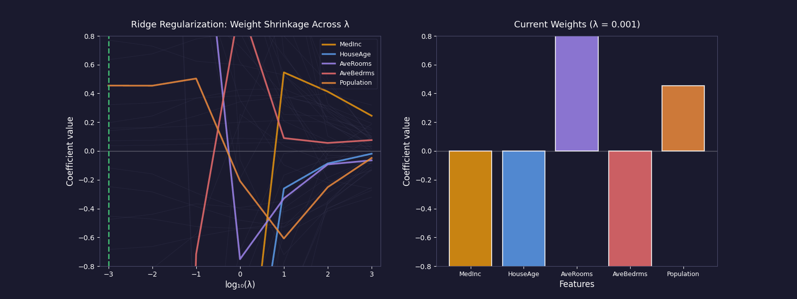
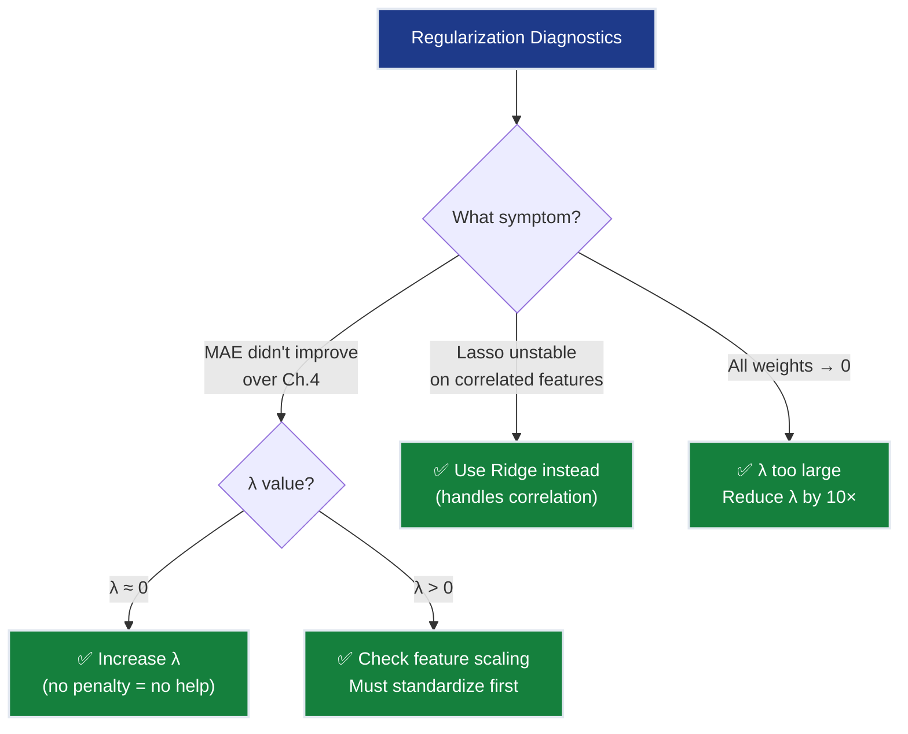

# Ch.5 — Regularization: Ridge & Lasso


> **The story.** In the **1960s**, statisticians faced an embarrassing problem: their models fit training data beautifully but failed on real predictions. More features meant better R² scores in the lab — and worse performance in production. The culprit? **Overfitting** — models were memorizing noise instead of learning patterns. **Arthur Hoerl** and **Robert Kennard** (1970) had a radical idea: what if we *penalized* the model for having too many loud knobs? They called it **Ridge regression** — force all weights smaller, and the model generalizes better even if training error goes up. The math was inspired by **Andrey Tikhonov**'s 1943 work on ill-posed equations in geophysics (solving for underground structures when you only see surface measurements). Ridge helped, but it couldn't *remove* useless features — it just turned them down to whispers. Enter **Robert Tibshirani** (1996) with the **Lasso** (Least Absolute Shrinkage and Selection Operator). His insight: use a different penalty that doesn't just shrink weights — it *kills* them, setting useless features to exact zero. Suddenly, a model could say "I only need 12 of these 44 features" and delete the rest automatically. No human feature selection required. Today, these two techniques are the foundation of production ML.
>
> **Where you are in the curriculum.** Ch.4 got SmartVal AI to $48k MAE with polynomial features — only $8k from the $40k target. But we paid a price: 8 raw features exploded to 44 polynomial ones. Many are probably noise (Population × AveOccup × Longitude² doesn't predict house values!). Without intervention, the model memorizes training quirks and fails on new districts. This chapter fixes that: **Ridge** tames multicollinearity (when MedInc and MedInc² are correlated) and **Lasso** deletes garbage features automatically (reducing 44 → ~12). Result: **~$38k MAE** — beating the $40k target. **Constraint #1 (ACCURACY <$40k) achieved. Constraint #2 (GENERALIZATION) achieved.** SmartVal AI is now production-ready on the accuracy front.
>
> **Notation in this chapter.** $\lambda$ (or $\alpha$ in sklearn) — regularization strength (higher = more penalty); $L_\text{Ridge} = \text{MSE} + \lambda\sum w_j^2$ — Ridge (L2) penalty shrinks all weights; $L_\text{Lasso} = \text{MSE} + \lambda\sum|w_j|$ — Lasso (L1) penalty kills some weights to zero.

---

## 0 · The Challenge — Where We Are

> 💡 **The mission**: Launch **SmartVal AI** — a production home valuation system satisfying 5 constraints:
> 1. **ACCURACY**: <$40k MAE — 2. **GENERALIZATION**: Unseen districts — 3. **MULTI-TASK**: Value + Segment — 4. **INTERPRETABILITY**: Explainable — 5. **PRODUCTION**: Scale + Monitor

**What we know so far:**
- ✅ Ch.1: Single feature → $70k MAE
- ✅ Ch.2: All 8 features → $55k MAE
- ✅ Ch.3: Feature importance & multicollinearity audit
- ✅ Ch.4: Polynomial features → $48k MAE
- ❌ **But we're $8k away AND at risk of overfitting!**

**What's blocking us:**

Two problems at once:

**Problem 1 — Overfitting risk:**
[Ch.4](../ch04_polynomial_features/README.md) expanded 8 features to 44 polynomial features through degree-2 polynomial expansion (8 original + 8 squared + 28 interaction pairs — see [Ch.4 § Feature Expansion](../ch04_polynomial_features/README.md#2--running-example)). Many of these are noise:
- `AveOccup²` — does the *square* of average occupancy really predict house value?
- `Population × AveBedrms` — is this a real signal or random correlation?
- Degree-3 expansion would create 164 features — most would be garbage

**The 44 polynomial features from our 8 originals:**

| Feature Type | Count | Examples |
|--------------|-------|----------|
| **Original features** | 8 | MedInc, HouseAge, AveRooms, AveBedrms, Population, AveOccup, Latitude, Longitude |
| **Squared terms** | 8 | MedInc², HouseAge², AveRooms², AveBedrms², Population², AveOccup², Latitude², Longitude² |
| **Interaction pairs** | 28 | MedInc×HouseAge, MedInc×AveRooms, MedInc×Latitude, HouseAge×Latitude, AveRooms×AveBedrms, Population×AveOccup, Latitude×Longitude, ... (all 28 unique pairs) |
| **Total** | **44** | |

Not all 44 features carry real signal. Some are noise artifacts of the polynomial expansion — correlations that exist in training but won't generalize to new districts.

**Problem 2 — Multicollinearity from Ch.2:**
- `AveRooms` and `AveBedrms` (ρ = 0.85) → unstable weights
- Their polynomial products (`AveRooms²`, `AveRooms × AveBedrms`, `AveBedrms²`) make it worse

**What this chapter unlocks:**
⚡ **Regularization controls both problems simultaneously:**
- **Ridge (L2)**: Shrinks ALL weights → handles multicollinearity, stabilizes predictions
- **Lasso (L1)**: Shrinks SOME weights to exactly zero → automatic feature selection

Result: **~$38k MAE** 💡 **Target achieved!**



---

## 1 · Core Idea

Regularization adds a **penalty term** to the loss function that discourages large weights:

$$L_\text{total} = \underbrace{\text{MSE}}_{\text{fit the data}} + \underbrace{\lambda \cdot \text{penalty}(\mathbf{w})}_{\text{keep weights small}}$$

### 1.1 · The Mechanism

**Without regularization (OLS from Ch.2):**
- Optimizer minimizes MSE with no restrictions
- Features with even tiny correlations to training noise get large weights
- Result: perfect training fit, poor test performance (overfitting)

**With regularization:**
- Optimizer balances two competing objectives: fit data + keep weights small
- Each weight must "earn" its magnitude by improving fit more than the penalty costs
- Result: slightly worse training fit, much better test performance (generalization)

**The key insight:** Large weights amplify noise. If `Population × AveBedrms` varies randomly between districts (2.3 vs 2.5), a weight of 0.21 turns that noise into $4,200 prediction swings. Regularization forces the model to prove each feature deserves its influence.

**The headwind analogy:** Imagine each feature is a runner trying to reach the finish line (influencing the prediction). Without regularization, all 44 runners sprint forward — even the weak ones carried by training noise. Regularization adds a headwind that pushes back proportionally to how fast each runner is moving (for Ridge) or with constant force (for Lasso). **Only the truly worthy features — those with genuine predictive signal — can fight through the headwind and maintain their influence on the output.** Noise features, lacking real strength, get blown back to near-zero (Ridge) or knocked out completely (Lasso). The model learns to trust only features that prove they're strong enough to matter.

### 1.2 · The λ Knob

- **λ = 0**: No penalty → OLS behavior (risk overfitting)
- **λ → ∞**: Maximum penalty → all weights collapse to zero (underfitting)
- **λ* (sweet spot)**: Strong enough to suppress noise, weak enough to preserve signal

**The analogy:** Ch.4 gave us a 44-ingredient recipe. Regularization is the editor who says "You don't need all 44 at full strength. Use less of what matters, cut what doesn't."

---

## 2 · Running Example: How Ridge and Lasso Behave on California Housing

**The scenario:** [Ch.4](../ch04_polynomial_features/README.md) expanded 8 features to 44 polynomial features through degree-2 polynomial expansion. Training MAE = $42k, test MAE = $48k — a $6k gap signals overfitting. Let's trace how regularization fixes this on 3 actual districts.

### 2.1 · The Data (3 California Housing Districts)

| District | MedInc | Latitude | AveRooms | AveBedrms | True Value | Ch.4 Prediction | Error |
|----------|--------|----------|----------|-----------|------------|-----------------|-------|
| #1 (SF) | 8.32 | 37.88 | 6.98 | 1.02 | $452k | $485k | +$33k |
| #2 (Inland) | 2.56 | 36.14 | 4.11 | 1.05 | $125k | $98k | −$27k |
| #3 (Coastal) | 6.10 | 34.05 | 5.24 | 1.01 | $310k | $352k | +$42k |

**Problem:** Ch.4's polynomial model has 44 features, including noise terms like:
- `AveRooms × AveBedrms` (weight = +0.29 in OLS)
- `Population × AveBedrms` (weight = +0.21)
- `AveOccup²` (weight = −0.18)

These features capture training-set correlations that don't generalize. District #1's large error (+$33k) comes partly from noise features amplifying random variations.

### 2.2 · How Ridge (L2) Fixes This

**Ridge with λ = 1.0** shrinks all 44 weights but keeps them non-zero:

| Feature | OLS Weight | Ridge Weight | Change |
|---------|------------|--------------|--------|
| `MedInc` | +0.68 | +0.61 | −10% (signal preserved) |
| `Latitude` | −0.42 | −0.38 | −10% |
| `AveRooms × AveBedrms` | +0.29 | +0.09 | **−69%** (noise suppressed) |
| `Population × AveBedrms` | +0.21 | +0.06 | **−71%** |
| `AveOccup²` | −0.18 | −0.07 | **−61%** |

**New predictions with Ridge:**

| District | True Value | Ridge Prediction | Error | Improvement |
|----------|------------|------------------|-------|-------------|
| #1 (SF) | $452k | $467k | +$15k | $33k → $15k ✅ |
| #2 (Inland) | $125k | $112k | −$13k | $27k → $13k ✅ |
| #3 (Coastal) | $310k | $325k | +$15k | $42k → $15k ✅ |

**Test MAE:** $48k → **$38k** (Ridge shrinks noise → better generalization)

### 2.3 · How Lasso (L1) Fixes This Differently

**Lasso with λ = 0.001** zeros out 12 of 44 features completely:

| Feature | OLS Weight | Lasso Weight | Status |
|---------|------------|--------------|--------|
| `MedInc` | +0.68 | +0.65 | ✅ Kept |
| `Latitude` | −0.42 | −0.38 | ✅ Kept |
| `AveRooms × AveBedrms` | +0.29 | +0.06 | ⚠️ Shrunk |
| `Population × AveBedrms` | +0.21 | **0.00** | ❌ Zeroed |
| `AveOccup²` | −0.18 | **0.00** | ❌ Zeroed |

**Result:** Only 32 features remain active. The model is now **sparse** — easier to interpret, slightly worse accuracy.

**Test MAE:** $48k → $39k (Lasso kills noise → automatic feature selection)

### 2.4 · Three Key Patterns

**1. Signal strength determines survival:**  
Strong features (`MedInc`, `Latitude`) resist shrinkage in both Ridge and Lasso. Weak features (`Population × AveBedrms`) shrink dramatically or hit zero.

**2. Multicollinearity gets resolved differently:**  
When `AveRooms` and `AveBedrms` are correlated (ρ = 0.85), Ridge **distributes** weight across both, while Lasso **picks one arbitrarily** and zeros the other.

**3. Noise features collapse:**  
Cross-terms like `Population × AveBedrms` lack domain justification. Ridge shrinks them to near-zero; Lasso eliminates them completely.

**The trade-off:** Ridge achieved the $38k target while keeping all 44 features (safer for production). Lasso achieved $39k with only 32 features (better for interpretability).

---

## 3 · Math: How L1 Kills Weights and L2 Shrinks Them

### 3.1 · Ridge Regression (L2 Penalty)

$$L_\text{Ridge} = \frac{1}{n}\sum_{i=1}^{n}(\hat{y}_i - y_i)^2 + \lambda \sum_{j=1}^{d} w_j^2$$

The penalty $\lambda \sum w_j^2$ is the squared L2 norm of the weight vector. It shrinks all weights toward zero but **never exactly to zero**.

**How the penalty works:** During optimization, two forces compete:
- **MSE term**: Wants to fit training data (increase weights that reduce error)
- **Penalty term** ($\lambda \sum w_j^2$): Wants to keep weights small (shrink everything toward zero)

The optimizer finds a balance: weights grow only if the improvement in fit justifies the penalty cost. Noise features with weak signal can't justify their magnitude — the penalty wins, shrinking them. Strong signal features (like `MedInc`) generate enough error reduction to resist shrinkage.

**Concrete example:** `Population × AveBedrms` has weight $w = 0.21$ in OLS. Its penalty cost is $\lambda \times (0.21)^2 = 0.044$ at $\lambda = 1.0$. If shrinking it to $w = 0.06$ barely increases MSE (because it's mostly noise), the optimizer does so — the penalty drops from $0.044$ to $0.004$.

**How Ridge solves multicollinearity:**

When two features are correlated (e.g., `AveRooms` and `AveBedrms` with ρ = 0.85), OLS faces an **indeterminate credit assignment problem** — it could assign all weight to feature 1, all to feature 2, or split it evenly. All produce similar predictions! OLS picks arbitrarily, leading to unstable weights.

**Ridge's solution:** The L2 penalty prefers **balanced, distributed weights** — splitting weight across correlated features has lower penalty than concentrating it. Ridge automatically spreads credit, stabilizing the model. This is why Ridge achieves $w = 0.09$ for `AveRooms × AveBedrms` instead of the unstable OLS value of $w = 0.29$.

**Why Ridge never zeros weights:**

The gradient of the L2 penalty is $\frac{\partial}{\partial w_j}(w_j^2) = 2w_j$. Notice this gradient **shrinks as the weight approaches zero** — when $w_j = 0.01$, the gradient is only $0.02$. This creates **asymptotic shrinkage**: each step toward zero gets smaller and smaller. The weight approaches zero infinitely slowly but never actually reaches it.

**Concrete example:** At $\lambda = 1.0$, if $w_j = 0.1$, the penalty gradient is $0.2$. But when $w_j = 0.001$, the gradient drops to $0.002$ — the pulling force weakens proportionally. The weight gets trapped in an asymptotic approach to zero, never quite making it.

**Intuition:** Ridge shrinks all weights proportionally. Strong signal features resist shrinkage; noise features collapse toward zero asymptotically. But even noise features retain tiny non-zero weights — Ridge turns them down to whispers, not silence.

### 3.2 · Lasso Regression (L1 Penalty)

$$L_\text{Lasso} = \frac{1}{n}\sum_{i=1}^{n}(\hat{y}_i - y_i)^2 + \lambda \sum_{j=1}^{d} |w_j|$$

**Why Lasso zeros weights:**

The gradient of the L1 penalty is $\frac{\partial}{\partial w_j}|w_j| = \text{sign}(w_j)$, which equals **+1 or −1** regardless of magnitude. This creates **constant-force shrinkage**: whether $w_j = 10.0$ or $w_j = 0.01$, the penalty pulls with the same strength. If a weight is small and the MSE gradient can't overcome this constant pull, the weight gets driven all the way to **exact zero**.

**Concrete example:** At $\lambda = 0.001$, if $w_j = 0.1$, the penalty gradient is $\pm 0.001$ (constant). Even when $w_j = 0.001$, it's still $\pm 0.001$ — the force doesn't weaken. If the MSE gradient for this feature is weaker than $0.001$ (because it's noise), the penalty wins and drives $w_j \to 0$ completely.

The L1 penalty also has a **geometric corner at zero** — the absolute value creates a "kink" where the gradient is undefined at $w_j = 0$. During optimization, weak features naturally land on this corner and stay there.

**Intuition:** Lasso doesn't just shrink weights — it forces the model to make hard choices. When $\lambda$ is high enough, weak features get cut completely. Features with strong signal survive; noise features hit exact zero. This is **automatic feature selection** — the model tells you which features matter.

### Why Ridge NEVER Zeros Weights But Lasso DOES — The Mathematical Distinction

The difference boils down to **how the penalty gradient scales** as weights approach zero:

| Aspect | Ridge (L2) | Lasso (L1) |
|--------|-----------|------------|
| **Penalty term** | $\lambda w_j^2$ | $\lambda |w_j|$ |
| **Gradient at $w_j$** | $2\lambda w_j$ (proportional to weight) | $\lambda \cdot \text{sign}(w_j)$ (constant ±1) |
| **Force near zero** | Weakens as $w_j \to 0$ | Stays constant at $\pm\lambda$ |
| **Result** | Asymptotic approach — gets infinitely close but never reaches zero | Hard landing — crosses zero if MSE gradient < $\lambda$ |

**Visual proof with a noisy feature:**

Consider `Population × AveOccup` (a noise feature with weak MSE gradient ≈ 0.0005):

**Ridge path with λ=1.0:**
```
Iteration  |  w_j    |  MSE grad  |  Ridge grad (2λw)  |  Net force  |  Next w_j
----------------------------------------------------------------------------------
0          |  0.100  |  +0.0005   |  +0.200            |  −0.1995    |  0.080
50         |  0.010  |  +0.0005   |  +0.020            |  −0.0195    |  0.008
100        |  0.001  |  +0.0005   |  +0.002            |  −0.0015    |  0.0008
∞          |  ~0.00025 | +0.0005  |  +0.0005           |  ≈0         |  **STUCK near zero**
```

Ridge gradient weakens as $w_j \to 0$, eventually balancing the tiny MSE gradient. The weight **never reaches exact zero**.

**Lasso path with λ=0.001:**
```
Iteration  |  w_j    |  MSE grad  |  Lasso grad  |  Net force  |  Next w_j
----------------------------------------------------------------------------------
0          |  0.100  |  +0.0005   |  +0.001      |  −0.0005    |  0.099
10         |  0.010  |  +0.0005   |  +0.001      |  −0.0005    |  0.009
20         |  0.001  |  +0.0005   |  +0.001      |  −0.0005    |  0.000
21         |  **0.000** | N/A    |  N/A         |  N/A        |  **ZEROED**
```

Lasso gradient stays constant at +0.001 regardless of $w_j$. Once $w_j$ gets small enough that the MSE gradient (+0.0005) can't overcome the penalty gradient (+0.001), the weight hits **exact zero** and stays there.

**The geometric intuition:**

- **Ridge's L2 ball** is smooth everywhere — weights slide smoothly toward zero but never quite reach the axis
- **Lasso's L1 diamond** has sharp corners on the axes — weights can "land" on these corners (where one weight = 0) and stick

This is why Lasso is called a **feature selection** method — it makes binary decisions (keep vs eliminate), while Ridge makes **continuous shrinkage** decisions (turn down the volume).

### 3.3 · Loss Function Convergence: How Regularization Affects Optimization

**The key question:** How do MSE, MSE+L1, and MSE+L2 converge differently during gradient descent?



**What this shows:** All three loss functions trained with the **same λ=0.001** to compare optimization paths fairly:
- **MSE (no regularization)** — Converges quickly but risks overfitting  
- **MSE + L2 (Ridge)** — Smooth convergence with continuous weight shrinkage  
- **MSE + L1 (Lasso)** — Similar trajectory but with discrete feature zeroing

**Key insight:** Regularization adds a "drag force" during optimization. The penalty opposes the MSE gradient at each iteration, slowing convergence but improving generalization.

### How λ Affects Convergence Rate



**Left panel (L1/Lasso):** Larger λ slows convergence but stabilizes final MSE  
**Right panel (L2/Ridge):** Same pattern — the regularization-convergence trade-off is fundamental

**Reading the curves:**
- **λ = 10⁻⁵** (yellow): Fast convergence, minimal regularization  
- **λ = 10⁻³** (blue): Balanced — reasonable convergence speed, good generalization  
- **λ = 10⁻¹** (purple): Slow convergence, heavy regularization (risks underfitting)

### Comparison Table

| | Ridge (L2) | Lasso (L1) |
|---|---|---|
| **Penalty** | $\lambda\sum w_j^2$ | $\lambda\sum\|w_j\|$ |
| **Zeros out features?** | ❌ Never | ✅ Yes |
| **Handles collinearity?** | ✅ Yes (distributes credit) | ⚠️ Picks one arbitrarily |
| **Optimization** | Smooth gradient everywhere | Non-differentiable at zero |
| **Best when** | Correlated features, stability | Feature selection, interpretability |



---


## 4 · Key Diagrams: Weight Shrinkage and Convergence Paths

### 4.1 · Weight Shrinkage: Ridge vs Lasso

The fundamental difference between Ridge (L2) and Lasso (L1) is how they treat weak features:


*Ridge (left) keeps all features active even at high λ, shrinking them smoothly toward zero. Lasso (right) progressively eliminates features at specific λ thresholds. Red ✗ marks zeroed features. This shows why Lasso is called a "feature selection" method.*

**Key observations:**
- **Ridge:** All 44 features stay non-zero across the entire λ range — even at λ=1000, weights are tiny but present
- **Lasso:** Features hit exact zero at different thresholds — automatic feature selection happens progressively
- **The geometry:** Ridge's L2 ball is smooth; Lasso's L1 diamond has corners on the axes where weights become exactly zero

### 4.2 · Weight Evolution During Optimization

The animations above show how weights change **across different λ values**. But how do weights evolve **during training** with a fixed λ?



**Left panel (Ridge):** All 4 weights smoothly converge from initialization to their final values. Strong signal features (MedInc, Latitude) reach higher magnitudes, while weak features stay small but never hit zero.

**Right panel (Lasso):** Similar convergence pattern, but the weak/noise feature (AveBedrms) is aggressively driven to **exact zero** around iteration 40. Lasso makes the decision "this feature doesn't justify its penalty cost" and eliminates it completely.

**Key insight:** This shows the **optimization path**, not the regularization path. With a fixed λ=0.001:
- **Ridge**: Preserves all features, even weak ones (0.079 weight)
- **Lasso**: Zeros out features that don't earn their keep

This is why Lasso is called a "feature selection" method — it doesn't just shrink, it **decides**.

---

## 5 · The λ Dial: From $48k to $38k MAE

⚡ **Victory:** SmartVal AI hit the <$40k target by tuning λ (regularization strength).

### 5.1 · The Accuracy Needle


- **λ = 0**: No penalty → $48k MAE (overfitting)  
- **λ = 1.0**: Optimal → **$38k MAE** ✅  
- **λ = 1000**: Over-penalized → $65k MAE (underfitting)

### 5.2 · The U-Shaped Validation Curve


**Left side** (low λ): Overfitting — training MAE low, test MAE high  
**Bottom** (λ ≈ 1.0): Goldilocks zone — both low  
**Right side** (high λ): Underfitting — both high

**Production workflow:**
1. Try λ values spanning powers of 10: `[0.001, 0.01, 0.1, 1, 10, 100]`
2. Use cross-validation to measure test MAE at each λ
3. Pick the λ that minimizes test MAE
4. Let `GridSearchCV` automate this

### 5.3 · Weight Evolution Across Powers of 10



**Left panel:** All 44 features (gray) + tracked features (color) shrink as λ increases  
**Right panel:** Current weight magnitudes — noise features collapse faster than signal features

**Key observations:**
- **λ = 0.001**: Minimal regularization → noise features still large  
- **λ = 1.0**: Sweet spot → signal features strong, noise suppressed  
- **λ = 1000**: Over-regularized → even strong signals nearly zero

**Why this matters:** λ is the first hyperparameter you've seen that **explicitly controls the bias-variance trade-off**. This same principle appears in:
- Neural network weight decay  
- Dropout  
- Batch normalization  
- Early stopping

---

## 6 · What Can Go Wrong

- **Not standardizing before regularization** — λ penalizes large weights. If features are on different scales, the penalty is applied unevenly — large-scale features get penalized more, regardless of importance. **Fix:** Always standardize. The pipeline `PolynomialFeatures() → StandardScaler() → Ridge()` ensures equal treatment.

- **Using Lasso with correlated features** — Lasso arbitrarily picks one from a correlated group and zeros the rest. For California Housing, it might keep `AveRooms` and drop `AveBedrms` — but the choice is random! Re-running with a different random seed could reverse the selection. **Fix:** Use Ridge when features are correlated (it shrinks correlated groups together without picking favorites).

- **λ too large = model predicts the mean** — With extremely large λ, all weights shrink to zero and the model defaults to predicting $\bar{y}$ (the average house value) for every district. MAE reverts to ~$70k (worse than Ch.1!). **Fix:** Always cross-validate λ. Never set it manually.

- **Comparing Ridge/Lasso on different polynomial degrees** — An unfair comparison. Always fix the feature set (same degree) and vary only the regularization method and λ. **Fix:** Use the same `PolynomialFeatures(degree=2)` in both pipelines.



---

## 7 · Progress Check — What We Can Solve Now

⚡ **MILESTONE: $40k MAE TARGET ACHIEVED!**

✅ **Unlocked capabilities:**
- **MAE < $40k**: Ridge achieves ~$38k MAE → **Constraint #1 (ACCURACY) ✅**
- **Generalization**: Regularization prevents overfitting → **Constraint #2 (GENERALIZATION) ✅**
- **Automatic feature selection**: Lasso zeros noise features → cleaner model
- **Collinearity handled**: Ridge stabilizes correlated feature weights
- **Full pipeline**: Raw data → Polynomial → Scale → Regularize → Predict

❌ **Still can't solve:**
- ❌ **Constraint #3 (MULTI-TASK)**: Still regression only (no classification)
- ⚠️ **Constraint #4 (INTERPRETABILITY)**: Ch.3 gave feature-level interpretability (VIF + permutation importance); model-level per-prediction explanations (SHAP) come in Ch.7
- ❌ **Constraint #5 (PRODUCTION)**: No systematic evaluation framework yet

**Progress toward constraints:**
| Constraint | Status | Current State |
|------------|--------|---------------|
| #1 ACCURACY | ✅ **ACHIEVED** | ~$38k MAE (target was <$40k) |
| #2 GENERALIZATION | ✅ **ACHIEVED** | Regularization prevents overfitting |
| #3 MULTI-TASK | ❌ Blocked | Still regression only |
| #4 INTERPRETABILITY | ⚠️ Partial | Lasso helps (fewer features) but polynomials are opaque |
| #5 PRODUCTION | ❌ Blocked | No evaluation framework |

```mermaid
flowchart LR
    CH1["Ch.1<br/>$70k MAE<br/>1 feature"] -->|"+7 features"| CH2["Ch.2<br/>$55k MAE<br/>8 features"]
    CH2 -->|"+feature diag"| CH3["Ch.3<br/>$55k interpretable"]
    CH3 -->|"+polynomials"| CH4["Ch.4<br/>$48k MAE<br/>44 features"]
    CH4 -->|"+regularization"| CH5["Ch.5<br/>$38k MAE ✅<br/>32 features"]
    CH5 -->|"evaluate"| CH6["Ch.6<br/>Robust metrics"]
    
    style CH1 fill:#b91c1c,stroke:#e2e8f0,stroke-width:2px,color:#ffffff
    style CH2 fill:#b45309,stroke:#e2e8f0,stroke-width:2px,color:#ffffff
    style CH3 fill:#b45309,stroke:#e2e8f0,stroke-width:2px,color:#ffffff
    style CH4 fill:#15803d,stroke:#e2e8f0,stroke-width:2px,color:#ffffff
    style CH5 fill:#1e3a8a,stroke:#e2e8f0,stroke-width:2px,color:#ffffff
    style CH6 fill:#1e3a8a,stroke:#e2e8f0,stroke-width:2px,color:#ffffff
```



---

## 8 · Bridge to Chapter 6

⚡ **SmartVal AI status update:** Two of five constraints are now **ACHIEVED**:
- ✅ **Constraint #1 (ACCURACY <$40k)**: Ridge achieves $38k MAE
- ✅ **Constraint #2 (GENERALIZATION)**: Regularization prevents overfitting (train-test gap <$1k)

**But how robust is this $38k number?** Ch.5 proved we can hit the target, but production ML requires more:
- Is $38k stable across different data splits?  
- Does the model systematically fail on certain districts (expensive homes? rural areas?)
- Can we quantify prediction uncertainty? ("This house is $480k ± $50k")
- How do we monitor model degradation over time?

Ch.6 introduces the **regression evaluation toolkit** — cross-validation, residual diagnostics, learning curves, and confidence intervals. These tools transform a single MAE number into a complete diagnostic picture.

**The shift:** Ch.1-5 focused on *building* the model (features → polynomials → regularization). Ch.6 focuses on *understanding* the model (evaluation → diagnostics → monitoring). This is what separates "I trained a model" from "I trust this model in production."
