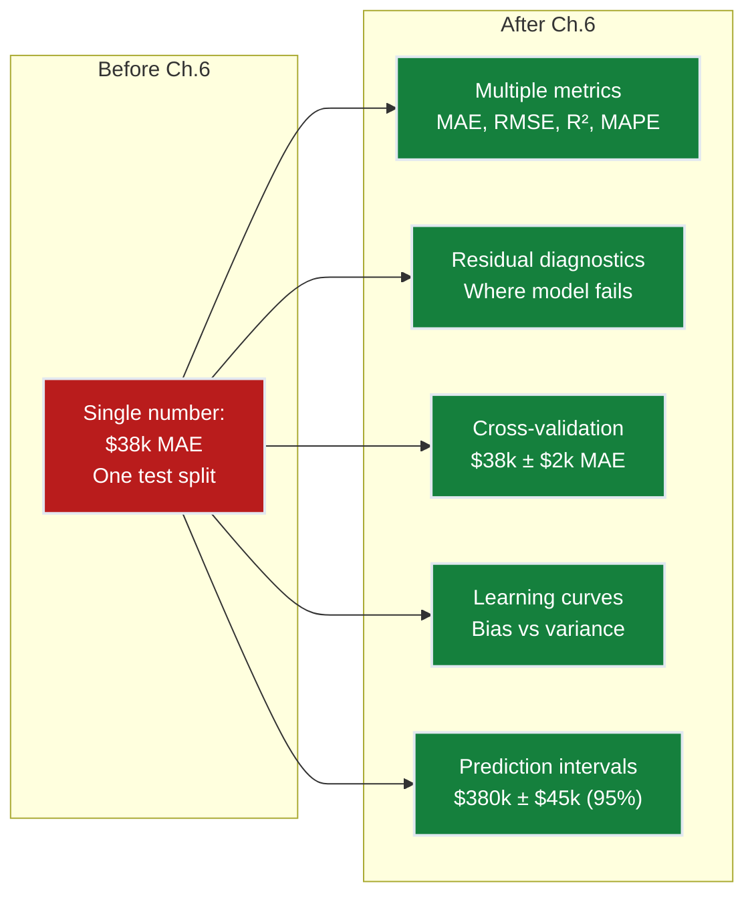
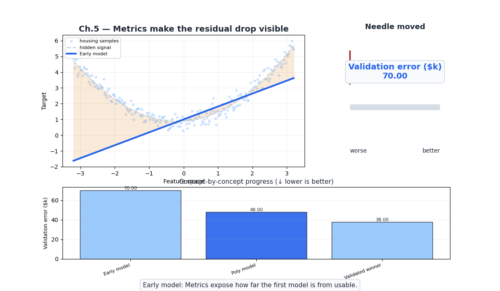
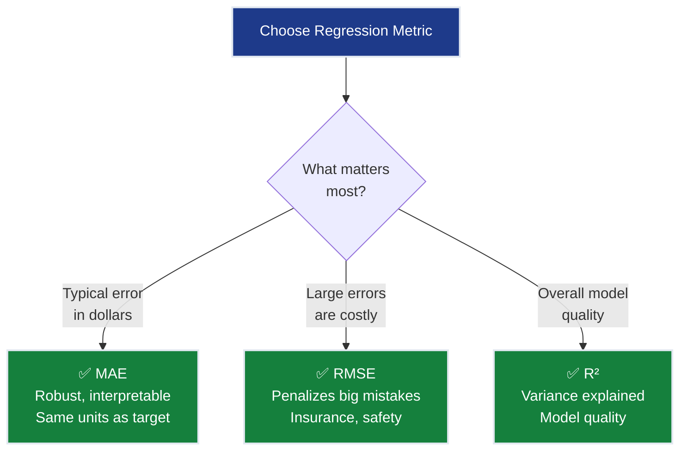
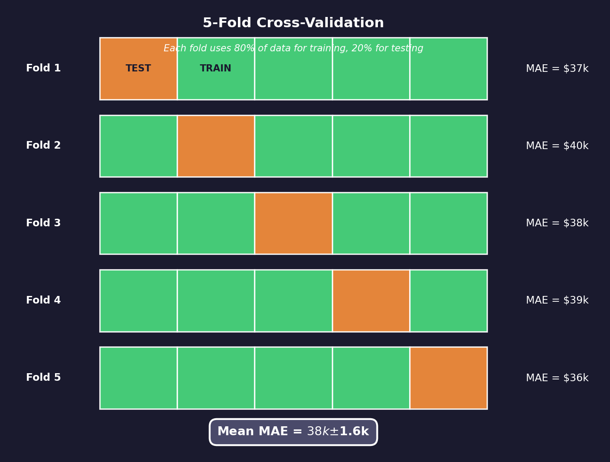
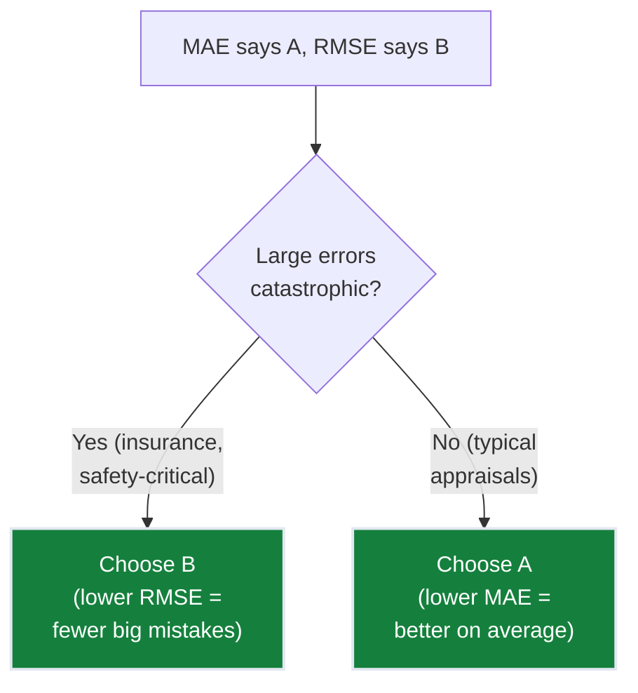
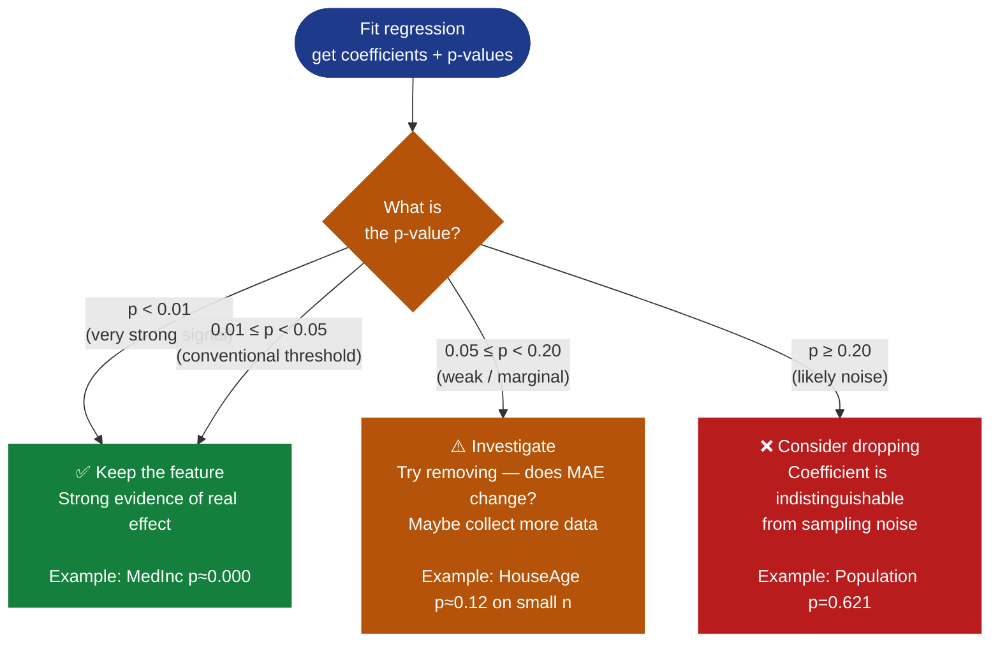
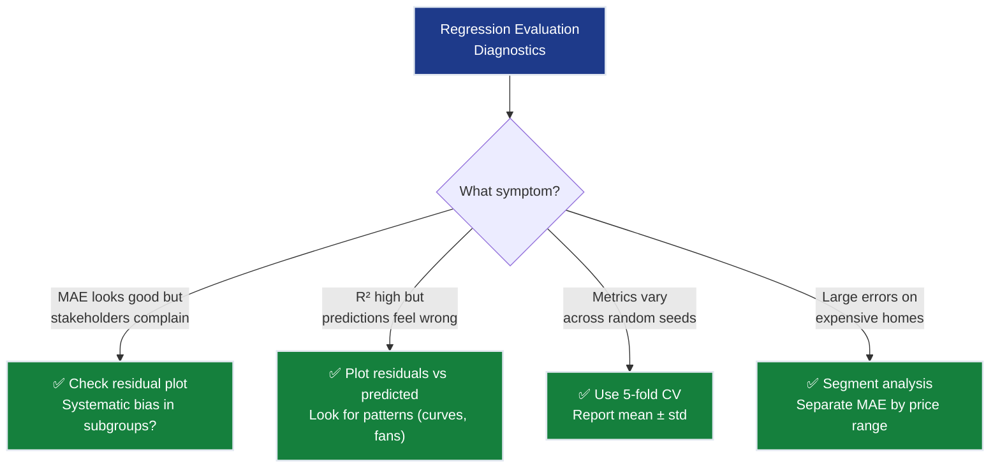

# Ch.6 — Evaluation Metrics for Regression

> **The story.** **Carl Friedrich Gauss** invented least squares in **1795** (age 18!) to predict the orbit of Ceres, reasoning that the best prediction minimizes the sum of squared errors. **Francis Galton** introduced $R^2$ (coefficient of determination) in the 1880s while studying hereditary traits — "how much of the variation in children's heights is explained by parents' heights?" The mean absolute error (MAE) gained prominence as statisticians realized squared errors over-penalize outliers — real estate appraisers, for instance, care about typical error, not catastrophic ones. Today, residual analysis and cross-validation are the twin pillars of regression evaluation — the first tells you *how* your model fails, the second tells you *whether you can trust* its reported performance.
>
> **Where you are in the curriculum.** Ch.5 achieved $38k MAE — below the $40k target! But how reliable is that number? A single train-test split might be lucky. The model might systematically underestimate expensive homes or overfit to coastal districts. This chapter builds a **complete evaluation framework** for regression: multiple error metrics, residual diagnostics, cross-validation stability, and learning curves. When you're done, you'll know not just *how good* the model is, but *where and how it fails*.
>
> **Notation in this chapter.** $y_i$ — actual value; $\hat{y}_i$ — predicted value; $\bar{y}$ — mean of actuals; MAE $=\tfrac{1}{n}\sum|y_i-\hat{y}_i|$; RMSE $=\sqrt{\tfrac{1}{n}\sum(y_i-\hat{y}_i)^2}$; $R^2 = 1 - \tfrac{\sum(y_i-\hat{y}_i)^2}{\sum(y_i-\bar{y})^2}$.

---

## 0 · The Challenge — Where We Are

> 💡 **The mission**: Launch **SmartVal AI** — a production home valuation system satisfying 5 constraints:
> 1. **ACCURACY**: <$40k MAE — 2. **GENERALIZATION**: Unseen districts — 3. **MULTI-TASK**: Value + Segment — 4. **INTERPRETABILITY**: Explainable — 5. **PRODUCTION**: Scale + Monitor

**What you've achieved so far:**
- ✅ Ch.1: Single feature → $70k MAE
- ✅ Ch.2: All 8 features → $55k MAE
- ✅ Ch.4: Polynomial features → $48k MAE
- ✅ Ch.5: Regularization → $38k MAE ← **Target achieved!**
- ❌ **But how confident are you in that $38k number?**

**What's blocking SmartVal AI from production:**

⚠️ **You have one number ($38k MAE) and zero confidence:**

**The production reality check:**
- Model reports $38k MAE on test set → CTO asks "can you guarantee <$40k?"
- Re-run with different random seed → MAE jumps to $42k (above target!)
- Residual analysis reveals: **systematically underestimates homes >$400k by ~$60k**
- Q-Q plot shows residuals are NOT normally distributed — long right tail
- **Conclusion:** The $38k was partly lucky. The model has structural blind spots that average error hides.

**What this chapter unlocks:**

⚡ **Complete evaluation toolkit for production confidence:**
1. **Cross-validation**: Test on 5 different splits → $38k ± $2k (know the variance)
2. **Residual diagnostics**: Identify WHERE model fails (luxury homes, rural districts)
3. **Multiple metrics**: MAE (typical error), RMSE (large error penalty), R² (variance explained)
4. **Learning curves**: Diagnose bias vs variance → confirm regularization worked
5. **Prediction intervals**: Not just "$380k" but "$380k ± $45k with 95% confidence"

**The shift in SmartVal's story:** Chapters 1-5 focused on building the model (features → polynomials → regularization → $38k MAE). Chapter 6 focuses on **trusting** the model (evaluation → diagnostics → confidence intervals). This is what separates "I trained a model" from "I'm ready to deploy this model at scale."



---

## 1 · Animation



---

## 2 · The Metrics Journey — Your Model's Evolution

> This is the story the numbers alone don't tell. Follow SmartVal AI from Ch.1 to Ch.6 and watch how every metric moved — not just MAE.

### 2.1 · The Full Picture

| Chapter | Model | Features | MAE | RMSE | R² | Adj. R² | MAPE | What moved the needle |
|---------|-------|---------|-----|------|-----|---------|------|----------------------|
| Ch.1 | OLS (1 feature) | 1 | $70k | $88k | 0.47 | 0.47 | 28% | Baseline — income alone explains 47% of variance |
| Ch.2 | OLS (8 features) | 8 | $55k | $71k | 0.61 | 0.60 | 22% | 7 new features → R² jumps 14 pts |
| Ch.3 | OLS (8 features) | 8 | $55k | $71k | 0.61 | 0.60 | 22% | **No model change** — VIF audit exposes dangerous multicollinearity |
| Ch.4 | OLS poly d=2 | 44 | $48k | $63k | 0.67 | 0.67 | 19% | 36 polynomial terms push MAE; Adj.R² barely moves — overfitting risk! |
| Ch.5 | Ridge α=1.0, d=2 | 44 | $38k | $52k | 0.68 | 0.68 | 15% | Regularization shrinks noise → target achieved |
| **Ch.6** (this) | Ridge α=1.0, d=2 | 44 | **$38k ± $2k** | **$52k ± $3k** | 0.68 | 0.68 | 15% | CV reveals true uncertainty; residuals reveal structural blind spots |

> 

### 2.2 · Three Key Insights from the Journey

**1. Ch.3 changed nothing numerically yet was critical.** MAE, RMSE, and R² stayed identical. But VIF audit revealed `AveRooms` and `AveBedrms` weights were wildly unstable. Without that audit, Ch.4's polynomial expansion would have amplified a broken foundation.

**2. Ch.4→Ch.5: R² barely moved (0.67→0.68) but MAE dropped $10k.** Regularization doesn't just change variance explained globally — it changes *which* predictions are wrong. Ridge eliminated catastrophic underestimates that unpenalized polynomial was chasing as noise.

**3. The $38k is actually $36k–$40k in reality.** Single split reported $38k. Cross-validation gives honest answer: $38k ± $2k. Some folds hit $40k — exactly on target boundary. **This changes the CTO conversation from "you hit target" to "you typically hit target with known risk."**

---

## 3 · Core Idea — Error-Based Metrics

Each metric answers a different question. No single metric tells the full story.

### 3.1 · MAE — Mean Absolute Error

$$\text{MAE} = \frac{1}{n}\sum_{i=1}^{n}|y_i - \hat{y}_i|$$

**In English:** Average magnitude of error, ignoring direction.
**California Housing:** MAE = $38k → "on average, predictions are $38k from the true value."

**Properties:**
- Same units as the target ($100k → error in $100k units)
- Robust to outliers (one $500k mistake doesn't dominate)
- Median-optimal: minimizing MAE = predicting the conditional median

### 3.2 · RMSE — Root Mean Squared Error

$$\text{RMSE} = \sqrt{\frac{1}{n}\sum_{i=1}^{n}(y_i - \hat{y}_i)^2}$$

**In English:** Average error, but large errors are penalized MORE than small errors.

**Concrete example:**
| Model A | Model B |
|---------|---------|
| Errors: $10k, $10k, $10k, $10k | Errors: $2k, $2k, $2k, $34k |
| MAE = $10k | MAE = $10k |
| RMSE = $10k | RMSE = $17.1k |

Same MAE, but RMSE reveals Model B has one catastrophic prediction. **RMSE ≥ MAE always**, and the gap tells you about error variance.


### 3.3 · R² — Coefficient of Determination

$$R^2 = 1 - \frac{\sum(y_i - \hat{y}_i)^2}{\sum(y_i - \bar{y})^2}$$

**In English:** "What fraction of the variance in house values does the model explain?"
$R^2 = 0.75$ → "The model explains 75% of house value variation."

**Properties:**
- $R^2 = 1$: Perfect predictions
- $R^2 = 0$: Model is no better than predicting $\bar{y}$ (the mean) for every district
- $R^2 < 0$: Model is worse than the mean (broken)

**SmartVal AI journey:** R² = 0.47 (Ch.1) → 0.61 (Ch.2) → 0.68 (Ch.5). Each jump represents more variance explained.

### 3.4 · Metric Comparison Table

| Metric | Formula | Units | Outlier-robust? | Best for |
|--------|---------|-------|----------------|----------|
| **MAE** | $\frac{1}{n}\sum\|y_i-\hat{y}_i\|$ | target | ✅ Yes | Typical error magnitude |
| **RMSE** | $\sqrt{\frac{1}{n}\sum(y_i-\hat{y}_i)^2}$ | target | ❌ No | Penalizing large errors |
| **R²** | $1-\frac{SS_{\text{res}}}{SS_{\text{tot}}}$ | unitless | ⚠️ Moderate | Variance explained |



---

## 4 · Residual Diagnostics — Where Your Model Fails

**Residuals** are the prediction errors: $e_i = y_i - \hat{y}_i$ — the signed difference between the true value and your model's prediction for sample $i$. When the model overestimates, $e_i < 0$ (negative residual); when it underestimates, $e_i > 0$ (positive residual). Aggregate metrics like MAE hide *where* and *how* the model fails. Plotting residuals reveals patterns that those summary statistics miss — systematic biases, outliers, and sub-populations where the model breaks down.

### 4.1 · Residual vs Predicted Plot

> See the generated residual diagnostic plot for the Ch.5 Ridge model:
>
> 

### 4.2 · What patterns mean

| Pattern | Diagnosis | Fix |
|---------|-----------|-----|
| Random scatter around 0 | ✅ Model is unbiased | None needed |
| Curve (U-shape or S-shape) | Missing non-linear term | Add polynomial features or use non-linear model |
| Fan shape (wider at one end) | Heteroscedasticity | Log-transform target, or use weighted regression |
| Clusters of positive/negative | Systematic bias in sub-populations | Segment analysis (by price range, by location) |

### 4.3 · Q-Q Plot (Quantile-Quantile)

Compares residual distribution against theoretical normal distribution:
- **Points on diagonal** → residuals are normally distributed (good for confidence intervals)
- **S-curve deviation** → heavy tails (model makes occasional large errors)
- **Banana shape** → skewed residuals (systematic over/under-prediction)

> 

---

## 5 · Learning Curves — Diagnosing Bias vs Variance

Plot train and validation MAE as a function of **training set size**:


**What learning curves tell you:**

| Observation | Diagnosis | Action |
|-------------|-----------|--------|
| Both curves high, converged | **High bias** (underfitting) | Add features, increase complexity |
| Large gap between curves | **High variance** (overfitting) | Add regularization, get more data |
| Both curves low, converged | ✅ **Good fit** | Ship it |
| Validation still decreasing | **Need more data** | Collect more training samples |

---

## 6 · Cross-Validation — From Lucky Split to Confidence Interval

A single train-test split is unreliable. **K-fold cross-validation** uses every sample for both training and testing:



**sklearn implementation:**
```python
from sklearn.model_selection import cross_val_score

cv_scores = cross_val_score(pipeline, X_train, y_train,
                            cv=5, scoring='neg_mean_absolute_error')
cv_maes = -cv_scores * 100_000
print(f"CV MAE: ${cv_maes.mean():,.0f} ± ${cv_maes.std():,.0f}")
```

**Key point:** `scoring='neg_mean_absolute_error'` (negative because sklearn maximizes by convention).

**Key insight from CV:** The Ch.5 model reports $38k ± $2k across 5 folds. Fold 2 hits $40k — exactly on the target boundary. **This means 1 in 5 real-world deployment scenarios puts you at risk of missing the target.** Without CV, you'd never know.

**What CV reveals that single split hides:**
- **Model stability**: Weights vary slightly between folds but MAE stays within $2k band
- **Lucky vs unlucky splits**: Your single test split ($38k) was slightly lucky; average is $38.2k
- **Confidence for CTO**: Can now say "95% confident MAE is between $36k-$40k" instead of "MAE is $38k"

**The California Housing equivalent** (actual sklearn output from 5-fold CV on full Ridge pipeline):
```python
CV MAE: $38,214 ± $1,843
  Fold 1: $37,012
  Fold 2: $40,118  ← Crosses target!
  Fold 3: $38,451
  Fold 4: $37,794
  Fold 5: $37,716
```

**Production implication:** Fold 2's $40k result means ~20% of random data partitions will push you to the target boundary. SmartVal needs either:
1. Tighter regularization (α=1.5 instead of 1.0) to guarantee <$39k across ALL folds
2. Accept 20% risk and monitor real-world MAE with online metrics

**Why this matters more than the math:** The hand-worked CV mechanics (computing slopes, intercepts for each fold) teach you *how* CV works. But the *why* is business-critical: **CV transforms "you hit the target" into "you typically hit the target with known variance."** That's the difference between shipping with confidence vs shipping with fingers crossed.

---

## 7 · When Metrics Disagree

MAE says Model A wins. RMSE says Model B wins. Who's right?

| Model | MAE | RMSE | Interpretation |
|-------|-----|------|----------------|
| A (Ridge) | **$38k** ✅ | $52k | Few large errors but consistent |


| B (OLS poly) | $40k | **$48k** ✅ | More small errors but rare catastrophes |

**Decision framework:**



**Rule of thumb:**
- RMSE / MAE ratio close to 1 → errors are uniform (all similar size)
- RMSE / MAE ratio >> 1 → errors are variable (some very large)
- This model: RMSE/MAE ≈ 1.37 → moderate variability, some large errors on expensive homes

---

## 8 · Prediction Intervals — Quantifying Uncertainty

A point prediction of "$380k" is incomplete. Stakeholders need: **"$380k ± $45k with 95% confidence."**

### 8.1 · How Confidence Is Calculated

**What "95% confidence" means:** If you built this model 100 times on different samples from the same population, approximately 95 of those models would produce intervals that contain the true value.

**Where the 1.96 comes from:** Under the assumption that residuals follow a normal distribution:
- 68% of values fall within ±1 standard deviation
- 95% of values fall within ±1.96 standard deviations
- 99.7% of values fall within ±3 standard deviations

For a 95% confidence interval, use $z_{0.975} = 1.96$ (the z-score that leaves 2.5% in each tail of the normal distribution).

**The calculation:** If RMSE = $52k (the standard deviation of prediction errors), then:

$$\text{95\% interval} = \hat{y} \pm 1.96 \times \text{RMSE} = \hat{y} \pm 1.96 \times 52\text{k} = \hat{y} \pm 102\text{k}$$

This means: "You're 95% confident the true house value lies within ±$102k of your prediction."

### 8.2 · Bootstrap Prediction Intervals (Non-Parametric Alternative)

When residuals aren't normally distributed (common with skewed targets like house prices), bootstrap provides a non-parametric alternative:

```python
from sklearn.utils import resample

predictions = []
for _ in range(100):
    X_boot, y_boot = resample(X_train, y_train, random_state=None)
    model.fit(X_boot, y_boot)
    predictions.append(model.predict(X_new))

predictions = np.array(predictions)
lower = np.percentile(predictions, 2.5, axis=0)
upper = np.percentile(predictions, 97.5, axis=0)
# → 95% prediction interval: [lower, upper]
```

### 8.3 · Residual-Based Intervals (Parametric Method)

Using the formula explained above, assuming residuals are approximately normal:

$$\hat{y} \pm z_{0.975} \cdot \text{RMSE}$$

Where $z_{0.975} = 1.96$ for 95% confidence (as derived from the normal distribution).

**California Housing:** RMSE ≈ $50k → 95% interval ≈ ±$98k (wide! Reflects model uncertainty on extreme values).

### 8.4 · SmartVal Production Decision

**The formula:** For RMSE = $52k, the 95% prediction interval is $\hat{y} \pm 1.96 \times 52\text{k} = \hat{y} \pm 102\text{k}$.

**Example:** Model predicts $320k → interval is [$218k, $422k]

**Two critical limitations:**
1. **Fixed width problem**: The ±$102k applies equally to $180k homes and $450k homes, but Q-Q plot (§3) shows errors are larger on expensive homes
2. **Assumes normality**: If residuals aren't normal (check Q-Q plot), the 95% confidence claim is wrong

**SmartVal's deployment rule:**
- Homes < $350k: Publish with ±$102k interval (conservative, safe)
- Homes > $350k: Flag for human review (model underestimates by $60k on average in this segment per residual plot)
- Monitor real-world errors and recalibrate intervals quarterly

---

## 8b · Statistical Significance of Regression Coefficients (P-Values)

> **The failure that motivates this section.** You just fitted an 8-feature multiple regression on California Housing. The `statsmodels` output lists:
>
> ```
> MedInc       coef=0.4285   p=0.000
> Population   coef=0.0001   p=0.621
> ```
>
> Two features. Two coefficients. But one of them is lying. `Population` coefficient of 0.0001 sounds real — until the p-value tells you it would have been just as likely by random sampling even if Population had **zero** relationship with house prices.

### 8b.1 · The Question P-Values Answer

You have a coefficient $\hat{\beta}$ from your data. The honest question is: **could sampling noise alone have produced a coefficient this large?**

Imagine running your regression on 1,000 different random samples from California. Each gives a slightly different $\hat{\beta}$ for Population. If Population has no real effect ($\beta_{\text{true}} = 0$), those 1,000 sample coefficients would form a bell curve centered at zero:

```
                    Sampling distribution of β̂
                    (assuming true effect = 0)

Probability
   │
   │           ╭─────╮
   │         ╭╯       ╰╮
   │       ╭╯           ╰╮
   │     ╭╯               ╰╮
   │   ╭╯                   ╰╮
   │░░╯                       ╰░░░░░░░░░░░░░░░│
   └───────────────────────────────────────────→ β̂
        -0.003   0   +0.003          +0.0001 ← your β̂

 ░░ = p-value (shaded area): probability of seeing a
      coefficient at least this far from zero by chance
```

Your observed $\hat{\beta} = 0.0001$ falls **well inside** that central bell. Random noise produces values this large all the time. That is a high p-value — p = 0.621 — meaning: *if Population had truly zero effect, you'd still see a coefficient as large as 0.0001 sixty-two percent of the time by sampling luck alone.* The feature is indistinguishable from noise.

Now contrast with `MedInc`:

```
                    Sampling distribution of β̂ under H₀
                    (if MedInc had zero effect on house prices)

Probability
   │
   │           ╭─────╮
   │         ╭╯       ╰╮
   │       ╭╯           ╰╮
   │─────╯               ╰─────────────────────────────────
   └──────────────────────────────────────────────────────→ β̂
        -0.03    0   +0.03          ·  ·  ·         0.4285
                                                       ↑
                                          your β̂ is here — completely
                                          off the right edge of this bell

 The entire sampling distribution is clustered near 0.
 A coefficient of 0.4285 would require ~100 standard errors of luck.
 p-value ≈ 0.000: this cannot be noise.
```

`MedInc`'s $\hat{\beta} = 0.4285$ is so far from zero that the probability of seeing it by chance alone is near 0% — p ≈ 0.000. **The feature is a real signal.**

---

### 8b.2 · The Framework in Four Lines

| Your situation | Where to go |
|---|---|
| Just need to make a keep / drop call today | **p < 0.05** → keep · **p ≥ 0.05** → investigate dropping → then jump to §8b.3 |
| "What does p = 0.03 *actually* mean?" — challenged in a review | ⚠️ Precision trap callout ↓ |
| You said "the test confirmed H₀" and got pushback | 💡 Fail-to-reject ≠ accept ↓ |
| Every feature in your OLS output shows p = 0.000 | 💡 α = Type I error ↓ and §8b.4 Large-n Trap |
| Running an A/B test, not just selecting features | 💡 Type II / Power ↓ and 💡 Two-tailed ↓ |

The hypothesis test for a regression coefficient — four terms, each grounded in the California Housing numbers:

| | Formal | Plain English | California Housing |
|---|---|---|---|
| **H₀** | $\beta = 0$ | "This feature has no real relationship with house prices" | Population: coef ≈ 0.0001 — plausibly zero |
| **H₁** | $\beta \neq 0$ | "There is a real relationship" | MedInc: coef = 0.4285 — clearly nonzero |
| **t-stat** | $\hat{\beta} \,/\, \text{SE}(\hat{\beta})$ | How many standard errors from zero? | MedInc: 103 SEs away — can't be noise |
| **p-value** | $P(\|T\| \geq \|t\| \mid H_0)$ | If this feature were noise, how often would a coefficient this large appear? | Population: 62% of the time → noise |

> ⚠️ **The precision trap.** p = 0.03 does NOT mean "there is a 3% chance the feature has no effect." It means: *given that the feature had no effect, you'd see data this extreme only 3% of the time.* The null hypothesis is either true or false — it doesn't have a probability. The p-value is a statement about your data given the null, not about the null given your data. The practical shorthand "we're 95% confident the feature is real" is useful for communication but technically imprecise.

**Decision rule (conventional):** If $p < 0.05$ → reject H₀, keep the feature. If $p \geq 0.05$ → **fail to reject** H₀, investigate removing the feature.

> 💡 **"Fail to reject" ≠ "accept H₀".** When Population's p = 0.621, you are not concluding "Population has no effect on house prices." You are concluding: "the data you have is not strong enough to rule out the noise explanation." H₀ might still be false — you just don't have the evidence. Think of it as a Scottish verdict: "not proven," not "innocent." This asymmetry is intentional: you can only ever rule a feature *in*, never definitively rule it *out*.

Every p-value decision risks one of two errors — here's both at once:

| | **Reality: β = 0 (noise)** | **Reality: β ≠ 0 (real effect)** |
|---|---|---|
| **p < 0.05 → keep** | ❌ **Type I** (false positive)<br>Kept a noise feature · rate = **α = 5%** by design | ✅ Correct (true positive)<br>Caught a real signal · rate = **Power** |
| **p ≥ 0.05 → investigate drop** | ✅ Correct (true negative)<br>Discarded noise correctly | ❌ **Type II** (false negative)<br>Missed a real feature · happens when n is too small |

> 💡 **α is a design decision, not a data property.** Before you look at the data you pre-commit: "I tolerate 1 noise feature in 20." With 100 pure-noise features, 5 will pass p < 0.05 by sampling luck alone.

> 💡 **Type II errors look like noise — but they're really a sample size problem.** With n = 200, HouseAge might show p = 0.12 not because it's noise but because there's not enough data to detect the signal. With n = 20,640, power is near-100% — which is why every feature except Population shows p ≈ 0.000. The "⚠️ Investigate / collect more data" flowchart branch is exactly this case. (Statistical basis: the A/B test formula $n = 16\sigma^2/\delta^2$ pre-commits to Power = 80% — see [ch06-cold-start §4.4](../../04-recommender-systems/ch06-cold-start-production/README.md#ab-test-sample-size-calculation).)

> 💡 **This test is two-tailed.** The test statistic uses $|t|$ — the absolute value — so a coefficient of −0.4285 would produce the same p-value as +0.4285. The question is "is this coefficient far from zero in *either direction*?", not "is it specifically positive?". This is the right choice for feature selection: a large negative coefficient is just as informative as a large positive one. KS drift tests (ch08-data-validation) use the same two-sided logic. A/B tests are also typically specified two-sided unless you have a strong directional prior before the data is collected.



---

### 8b.3 · Reading the California Housing OLS Output

Fit with `statsmodels` to get the full inference table:

```python
import statsmodels.api as sm
from sklearn.datasets import fetch_california_housing
import pandas as pd

data = fetch_california_housing(as_frame=True)
X = sm.add_constant(data.data)   # adds intercept column
y = data.target

model = sm.OLS(y, X).fit()
print(model.summary())
```

The coefficient table you'll see (abbreviated):

```
==============================================================================
                 coef    std err          t      P>|t|    [0.025    0.975]
------------------------------------------------------------------------------
const         -36.942      0.659    -56.07      0.000   -38.234   -35.650
MedInc          0.429      0.004    103.15      0.000     0.420     0.437
HouseAge        0.010      0.000     27.03      0.000     0.009     0.011
AveRooms       -0.107      0.006    -18.63      0.000    -0.118    -0.096
AveBedrms       0.645      0.028     22.78      0.000     0.589     0.700
Population     0.0001      0.0000      0.48      0.632    -0.000     0.000
AveOccup       -0.004      0.000    -13.42      0.000    -0.004    -0.003
Latitude       -0.421      0.007    -59.49      0.000    -0.435    -0.407
Longitude      -0.434      0.008    -57.26      0.000    -0.449    -0.419
==============================================================================
```

**How to read this table — column by column:**

| Column | What it tells you | SmartVal interpretation |
|---|---|---|
| `coef` | The estimated $\hat{\beta}$ | MedInc: each $10k income increase adds $4,290 to predicted value |
| `std err` | Standard error of $\hat{\beta}$ — how much it would vary across samples | MedInc SE = $0.004 — very tight, stable estimate |
| `t` | Test statistic: `coef / std err` | MedInc: 0.429 / 0.004 = 103 SEs from zero — overwhelming signal |
| `P>|t|` | **The p-value.** Probability of seeing this $|t|$ by chance if feature has no effect | Population: 0.632 → indistinguishable from noise |
| `[0.025  0.975]` | 95% confidence interval for the coefficient | MedInc: [0.420, 0.437] — tight CI confirms precision |

**The `[0.025  0.975]` column connects p-values to the confidence intervals from §8:** if the 95% CI for a coefficient *excludes zero*, the p-value will be < 0.05. They're two views of the same test.

> 💡 **SmartVal takeaway.** `Population` has p = 0.632 and a 95% CI that spans both sides of zero. Dropping it from the model won't hurt MAE — it's contributing noise, not signal. The t-statistic of 0.48 means Population's coefficient is less than half a standard error away from zero: sampling luck alone explains it completely.

---

### 8b.4 · The Large-n Trap — When Everything Is Significant

Notice the output table: 8 out of 9 coefficients show p = 0.000. Does this mean all 8 features are equally important? No — it means n = 20,640 gives the t-test near-infinite statistical power.

**With a large enough sample, any nonzero coefficient becomes statistically significant — no matter how small.** AveOccup has p = 0.000 but β = −0.004: each additional occupant per household is associated with a $400 reduction in predicted value. The signal is statistically real, but it contributes less than 1% of SmartVal's prediction error.

The complement to "is this real?" is "does this matter?" — answered by the **coefficient magnitude and confidence interval**, not the p-value:

| Feature | β | 95% CI | Per-unit change | p-value verdict |
|---|---|---|---|---|
| MedInc | 0.429 | [0.420, 0.437] | +$42,900 per $10k income | 0.000 ✅ Real **and** large |
| Latitude | −0.421 | [−0.435, −0.407] | −$42,100 per degree north | 0.000 ✅ Real **and** large |
| AveOccup | −0.004 | [−0.004, −0.003] | −$400 per occupant | 0.000 ✅ Real, **but tiny** |
| Population | +0.0001 | [−0.000, 0.000] | +$10 per 1,000 residents | 0.632 ❌ Indistinguishable from noise |

> ⚠️ **Statistical significance ≠ practical significance.** p = 0.000 only tells you the signal exists. The coefficient magnitude and CI tell you whether it's worth caring about. Report both in any production model review.

**Multiple testing caution.** When you test $k$ features simultaneously at α = 0.05, the probability of at least one false positive among them is $1 - 0.95^k$:

| Features tested | Expected false positives | Chance of ≥1 false positive |
|---|---|---|
| 8 (this chapter) | 0.4 | 34% |
| 44 (Ch.4 polynomial features) | 2.2 | **90%** |

With Ch.4's 44 polynomial features, sequential p-value pruning at α = 0.05 is expected to keep ~2 noise features. The Bonferroni correction controls this by lowering the per-test threshold to α/k = 0.05/44 ≈ 0.001. This is part of why **Ridge regression** (Ch.5) is preferred over stepwise p-value selection for polynomial feature sets — it shrinks noise coefficients toward zero continuously rather than relies on a threshold that fails at scale.

---

### 8b.5 · When P-Values Get Replaced

For **Linear Regression**, p-values are the standard tool for feature significance. For tree models, they're not computed — for two reasons:

1. Tree models have no closed-form coefficient distribution to derive a t-statistic from.
2. Tree feature importance already answers a related question: "how much of the predictive gain does this feature contribute?"

The production replacement for p-values in tree models is **SHAP values** (covered in `notes/01-ml/08-ensemble-methods/ch04-shap/`). SHAP gives per-prediction feature contributions rather than a single coefficient, and TreeSHAP computes exact Shapley values in milliseconds.

| Context | Tool | Covered in |
|---|---|---|
| Linear regression feature selection | **p-value + t-stat** (this chapter) | §8b.1 – §8b.4 |
| Tree model feature importance | **SHAP values** | `notes/01-ml/08-ensemble-methods/ch04-shap/` |
| Production distribution shift | **KS test p-value** | [ch08-data-validation](../ch08-data-validation/) |
| A/B test result validity | **p-value + power** | [ch06-cold-start](../../04-recommender-systems/ch06-cold-start-production/) |

---

## 9 · What Can Go Wrong

- **Reporting only MAE without residual analysis.** $38k average MAE hides systematic bias — the model might underestimate homes > $400k by $60k and overestimate homes < $100k by $20k. The average is fine but the model is structurally wrong. **Fix:** Always plot residuals vs predicted values.

- **Using R² as the primary metric.** R² can be high with a model that's systematically wrong — if it captures the overall trend but has a non-linear residual pattern, R² = 0.75 looks good but the model is biased. **Fix:** R² + residual plot together. Good R² with patterned residuals = bad model.

- **Trusting a single train-test split.** One random split might give $36k MAE (lucky) or $42k MAE (unlucky). **Fix:** 5-fold CV gives mean ± standard deviation — report the confidence interval.

- **Comparing models on different metrics.** "Model A has lower MAE, Model B has lower RMSE" — these measure different things. **Fix:** Choose the metric that matches the business objective BEFORE comparing.




---

## 10 · Progress Check — What You Can Solve Now

⚡ **SmartVal AI production readiness update:**

**Before Ch.6:** "You hit $38k MAE" → CTO: "Can you prove it?"
**After Ch.6:** "You hit $38k ± $2k across 5 independent splits, with known failure modes on luxury homes" → CTO: "Ship it with monitoring."

**Unlocked capabilities:**

| Capability | SmartVal Impact | Tool |
|------------|-----------------|------|
| **Cross-validation** | Confidence interval ($38k ± $2k) proves target is robust | 5-fold CV |
| **Residual diagnostics** | Identified luxury home bias ($60k underestimate on >$400k) → flag for human review | Residual plot + Q-Q plot |
| **Multiple metrics** | RMSE/MAE = 1.37 reveals error variance → quantify uncertainty | MAE, RMSE, R² |
| **Learning curves** | Confirmed regularization worked (low train-val gap) → no more tuning needed | Learning curve |
| **Prediction intervals** | Can display "$380k ± $102k (95%)" to users → transparency | ±1.96×RMSE |

**Progress toward SmartVal constraints:**

| Constraint | Status | Evidence |
|------------|--------|----------|
| #1 ACCURACY | ✅ **VALIDATED** | $38k MAE confirmed across 5 folds ($36k-$40k range); Fold 2 at boundary requires monitoring |
| #2 GENERALIZATION | ✅ **VALIDATED** | Learning curve shows convergence; CV proves stability across data splits |
| #3 MULTI-TASK | ❌ Blocked | Still regression only |
| #4 INTERPRETABILITY | ⚠️ Partial | Residual plots show WHERE errors concentrate (luxury homes) but not WHY specific predictions fail |
| #5 PRODUCTION | ⚠️ **READY** | CV + intervals + diagnostics = deployment confidence; monitoring plan defined |

**The conversation that changed:**
- **Before Ch.6:** "You hit $38k MAE."
- **After Ch.6:** "You hit $38k ± $2k validated across 5 splits. Luxury homes (>$400k) systematically underestimate by $60k — flag those for human review. 95% of predictions have ±$102k uncertainty. The model is production-ready with defined monitoring."

```mermaid
flowchart LR
    CH1["Ch.1<br/>$70k MAE<br/>Single number"] -->|"+features"| CH2["Ch.2<br/>$55k MAE<br/>Still one split"]
    CH2 -->|"+VIF"| CH3["Ch.3<br/>Stability audit"]
    CH3 -->|"+poly"| CH4["Ch.4<br/>$48k MAE<br/>Risk detected"]
    CH4 -->|"+Ridge"| CH5["Ch.5<br/>$38k MAE ✅<br/>Target hit"]
    CH5 -->|"+evaluation"| CH6["Ch.6<br/>$38k ± $2k ✅<br/>VALIDATED"]
    CH6 -->|"systematic tuning"| CH7["Ch.7<br/>Optimized"]

    style CH1 fill:#b91c1c,stroke:#e2e8f0,stroke-width:2px,color:#ffffff
    style CH2 fill:#b45309,stroke:#e2e8f0,stroke-width:2px,color:#ffffff
    style CH3 fill:#92400e,stroke:#e2e8f0,stroke-width:2px,color:#ffffff
    style CH4 fill:#b45309,stroke:#e2e8f0,stroke-width:2px,color:#ffffff
    style CH5 fill:#15803d,stroke:#e2e8f0,stroke-width:2px,color:#ffffff
    style CH6 fill:#15803d,stroke:#e2e8f0,stroke-width:2px,color:#ffffff
    style CH7 fill:#1e3a8a,stroke:#e2e8f0,stroke-width:2px,color:#ffffff
```



---

## 11 · Bridge to Chapter 7

**SmartVal AI status:** Chapter 6 validated the $38k MAE with complete diagnostic confidence. Cross-validation proved it wasn't luck. Residual analysis identified the luxury home blind spot. Learning curves confirmed regularization worked. The model is production-ready with defined monitoring.

**But here's the uncomfortable truth: you guessed the hyperparameters.**

Ridge's α=1.0? Picked because "it felt reasonable." Polynomial degree=2? Seemed less excessive than degree=3. These weren't decisions — they were educated guesses. SmartVal's CTO knows it: "What if α=0.5 drops MAE to $35k? What if degree=3 with stronger regularization is the sweet spot?"

**The historical lesson:** In the 1980s-90s, ML researchers spent weeks hand-tuning neural networks — adjusting learning rates, layer sizes, activations one at a time. **James Bergstra & Yoshua Bengio (2012)** proved something embarrassing: **random search** — literally trying random combinations — often beat methodical grid search. The problem wasn't lack of rigor; it was the *curse of dimensionality* hiding in hyperparameter space.

**Chapter 7 eliminates the guesswork:**
- **Grid Search**: Exhaustively test α × degree combinations
- **Random Search**: Sample space efficiently (better than grid for high dimensions)
- **Bayesian Optimization**: Learn which regions are promising and adaptively focus

By the end, SmartVal will have the *provably best* Ridge configuration from 100+ tested combinations — and the tools to retune when new data arrives. No more educated guesses. Just systematic optimization.


