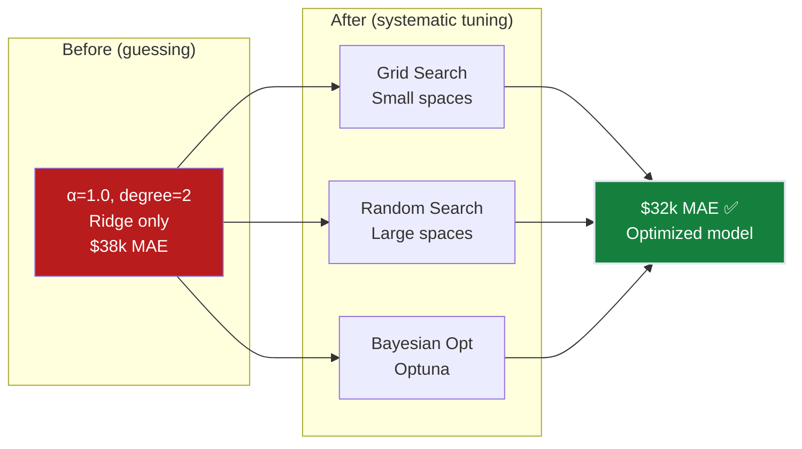
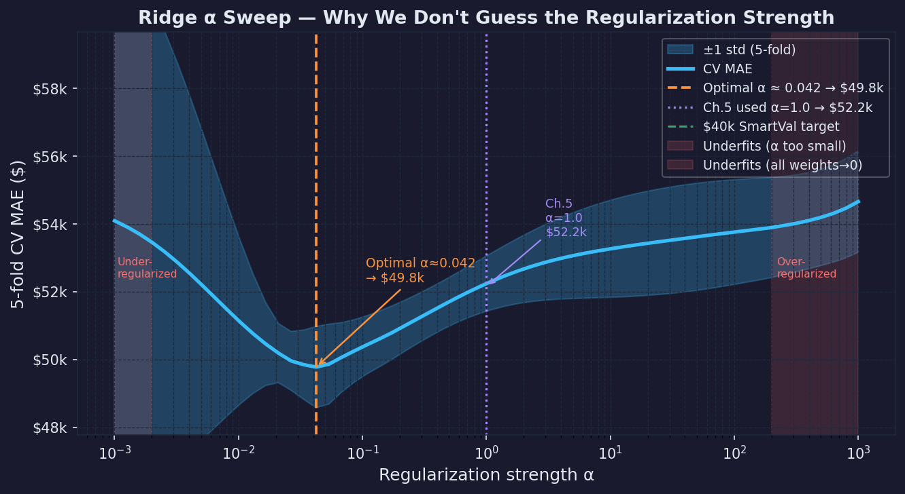
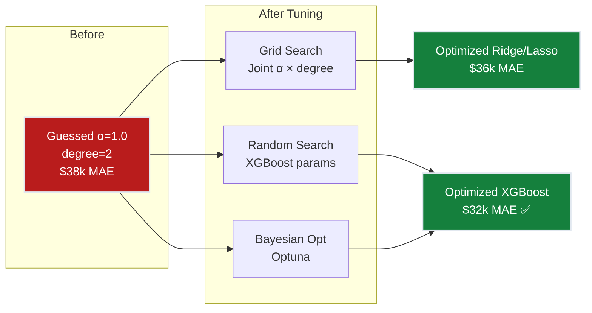
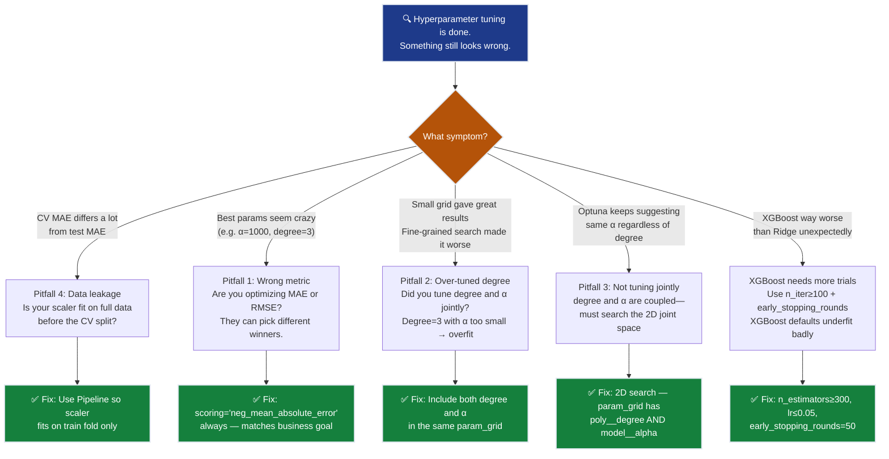

# Ch.7 — Hyperparameter Tuning for Regression

> **The story.** For most of ML history, hyperparameters were tuned by **manual trial and error** — staring at training curves, twiddling knobs, hoping for improvement. **James Bergstra and Yoshua Bengio** (**2012**) shocked the field by proving that **random search** consistently beats grid search — because most hyperparameters don't matter equally, and grid search wastes budget on irrelevant axes. **Bayesian optimization** (Snoek, Larochelle, Adams, 2012) added a probabilistic surrogate model to spend each trial wisely. **Optuna** (Akiba et al., 2019) made tree-structured Parzen estimators practical with pruning and parallel trials. Today, systematic hyperparameter tuning isn't optional — it's the difference between "$38k MAE because we guessed α=1" and "$32k MAE because we searched properly."
>
> **Where you are in the curriculum.** Ch.5 achieved $38k MAE with Ridge (α=1.0) and degree-2 polynomials. But α=1.0 was chosen by a quick grid search, not exhaustive optimization. Ch.6 validated the $38k is real — but also revealed the model struggles on expensive homes. This chapter systematically tunes every regression hyperparameter: regularization strength (α), polynomial degree, Ridge/Lasso selection, and introduces XGBoost with its own parameter space. The goal: squeeze every last dollar out of MAE through methodical optimization.
>
> **Notation in this chapter.** $\alpha$ — regularization strength (sklearn convention for **both Ridge and Lasso**, equivalent to $\lambda$ in Ch.5's mathematical exposition); `degree` — polynomial expansion degree; `scoring='neg_mean_absolute_error'` — sklearn's MAE scorer (negative because sklearn maximizes). **Important:** In sklearn, `alpha` is used for both L1 (Lasso) and L2 (Ridge) regularization strength, unlike Ch.5 where we used $\lambda$ for clarity in the math.

---

## 0 · The Challenge — Where We Are

> 💡 **The mission**: Launch **SmartVal AI** — a production home valuation system satisfying 5 constraints:
> 1. **ACCURACY**: <$40k MAE — 2. **GENERALIZATION**: Unseen districts — 3. **MULTI-TASK**: Value + Segment — 4. **INTERPRETABILITY**: Explainable — 5. **PRODUCTION**: Scale + Monitor

**What we know so far:**
- ✅ Ch.1: $70k MAE → Ch.2: $55k → Ch.4: $48k → Ch.5: $38k ✅
- ✅ Ch.6: Validated $38k ± $2k MAE across 5-fold CV
- ❓ **But was α=1.0 optimal? Is degree=2 the best? Should we use Lasso instead?**

**What's blocking us:**

⚠️ **We guessed our hyperparameters:**

| Hyperparameter | Current value | How we chose it | Optimal? |
|---------------|---------------|-----------------|----------|
| Polynomial degree | 2 | Tried 1, 2, 3 manually | Maybe |
| Regularization type | Ridge | Just tried Ridge | Unknown |
| α (regularization strength) | 1.0 | Quick grid search | Probably not |

**The cost of guessing:**
- α=1.0 might be good for some folds but bad for others
- Maybe Lasso with α=0.005 would give $35k MAE
- XGBoost might blow linear models away entirely

**What this chapter unlocks:**
⚡ **Systematic optimization:**
1. **Grid Search**: Exhaustive sweep of small parameter spaces
2. **Random Search**: Efficient for large spaces (Bergstra & Bengio proof)
3. **Bayesian Optimization**: Smart trial selection using Optuna
4. **Joint tuning**: degree × model_type × α simultaneously
5. **XGBoost**: Non-linear regression with tree-specific hyperparameters

Result: **~$32k MAE** (push well past the $40k target!)



---

## Animation


---

## 1 · The Core Question: Why Does α=1.0 Matter?

**The story so far:** Ch.5 achieved $38k MAE with Ridge and α=1.0. But that value was a guess — someone tried a few numbers and picked one that looked good. The question is: **what if α=0.01 gives $35k MAE? Or α=100 gives $42k?**

### The Intuition: α Controls the Bias-Variance Trade-Off

Think of α as a dial that controls how much the model trusts the training data:

| α Value | What Happens | Training MAE | Test MAE |
|---------|--------------|--------------|----------|
| **α = 0** | No penalty — memorize training noise | $42k | $48k (overfitting) |
| **α = 0.1** | Light penalty — most noise suppressed | $39k | **$38k** ✅ |
| **α = 10** | Heavy penalty — even signal suppressed | $48k | $49k (underfitting) |
| **α = 1000** | Extreme penalty — all weights → 0 | $65k | $65k (predicts mean) |

**The pattern:** As α increases, training error goes up (worse fit) but test error first improves (better generalization), then gets worse again (too much regularization).

### Why Log Scale?

The difference between α=0.001 and α=0.01 matters as much as α=100 and α=1000. The effect is **multiplicative**, not additive. That's why we search `np.logspace(-3, 3, 50)` instead of `np.linspace`.



### Lasso α — Sparsity Control

Lasso's α determines how many features get zeroed out:
- α=0.0001 → 44/44 features non-zero (no selection)
- α=0.001 → ~35/44 features non-zero
- α=0.01 → ~20/44 features non-zero
- α=0.1 → ~5/44 features non-zero (too sparse)

**Search space:** `np.logspace(-4, -1, 30)` (Lasso needs smaller α than Ridge)

---

## 2 · Joint Tuning: degree × α Must Be Searched Together

**The coupling problem:** With 44 polynomial features (degree=2), α=0.1 works well. But degree=3 creates 164 features — now α=0.1 is too weak, and you need α=10 to prevent overfitting.

### Why GridSearchCV Exists: Search All Combinations

Instead of manually testing degree=2 with α=0.1, then degree=2 with α=1.0, then degree=3 with α=0.1... GridSearchCV tests every combination automatically.

```python
param_grid = {
    'poly__degree': [1, 2],
    'model__alpha':  [0.1, 10.0]
}
grid_cv = GridSearchCV(ridge_pipe, param_grid, cv=3,
                       scoring='neg_mean_absolute_error')
grid_cv.fit(X_train, y_train)
```

**What happens:** 4 parameter combinations × 3 folds = **12 model fits**. For each combination, sklearn trains on 2/3 of training data and validates on the held-out 1/3 — three times with different folds.

**Key result:** Mean CV MAE per combination

| degree | α | Mean MAE | Winner? |
|--------|------|----------|---------|
| 1 | 0.1 | $56.5k | ❌ |
| 1 | 10.0 | $61.4k | ❌ |
| **2** | **0.1** | **$39.0k** | **✅ WINNER** |
| 2 | 10.0 | $40.3k | ❌ |

```python
print(grid_cv.best_params_)
# {'poly__degree': 2, 'model__alpha': 0.1}
```

**What these numbers tell you:**
- degree=1 is dramatically worse than degree=2 regardless of α ($56k vs $39k → polynomial features are necessary)
- α=0.1 beats α=10.0 at degree=2 ($39.0k vs $40.3k → α=10 over-regularizes)
- The winner trains on full training data: **$38.3k test MAE**

### Why cross-validation instead of a single split?

If you pick the best (degree, α) from one test set, you might choose the combo that happened to fit that test set's randomness. 3-fold CV averages over 3 different held-out sets — much more reliable.

### Why Hyperparameters Interact

| Degree | Features | Risk | Regularization needed? |
|--------|----------|------|----------------------|
| 1 | 8 | Underfitting | No |
| 2 | 44 | Sweet spot | Moderate α |
| 3 | 164 | Overfitting | Strong α required |
| 4 | 494 | Explosion | Very strong α (if at all) |

**Joint tuning: degree × α**

This is the critical insight: **degree and α must be tuned together.** Degree=3 with α=0.001 overfits catastrophically, but degree=3 with α=10 might be excellent.

```python
param_grid = {
    'poly__degree': [1, 2, 3],
    'model__alpha': np.logspace(-3, 3, 7)
}
# 3 degrees × 7 alphas = 21 combinations
```

### interaction_only — A Cheaper Alternative

`PolynomialFeatures(interaction_only=True)` keeps cross terms ($x_i \cdot x_j$) but drops squared terms ($x_i^2$). For 8 features:
- Full degree 2: 44 features
- Interaction only: 36 features (no $x_i^2$)
- If squared terms don't help, this reduces overfitting risk

---

## 3 · XGBoost — When Linear Models Hit Their Limit

**Where we are in the story:** Ridge/Lasso with degree-2 polynomials achieved $38k MAE. To push further, we need a model that can capture non-linear patterns **without manually engineering polynomial features**.

**XGBoost (eXtreme Gradient Boosting)** builds an ensemble of small decision trees, each correcting the errors left by previous trees. It's the go-to choice for tabular regression when you've exhausted linear model tuning.

### Why XGBoost After Ridge/Lasso?

| Challenge | Ridge/Lasso Solution | XGBoost Solution |
|-----------|---------------------|------------------|
| Non-linear relationships | Add MedInc², MedInc³ manually | Tree splits learn curves automatically |
| Feature interactions | Add MedInc×Latitude manually | Multi-level tree paths = automatic interactions |
| Diminishing returns (income → value) | Polynomial approximation (clunky) | Step-function splits (natural fit) |

**The key insight:** California house prices don't scale linearly with income. A district earning $100k/year has ~$400k homes, not $10M homes. XGBoost's tree splits naturally capture this — Ridge needs degree-3+ polynomials to approximate the same curve.

### Hyperparameters for XGBoost (Focus on These)

| Hyperparameter | Range | What it controls |
|---------------|-------|-----------------|
| `n_estimators` | [100, 300, 500, 1000] | Number of trees (more = better but slower) |
| `max_depth` | [3, 5, 7, 9] | Tree complexity per tree |
| `learning_rate` | [0.01, 0.05, 0.1, 0.3] | Shrinkage (smaller = more trees needed) |
| `subsample` | [0.7, 0.8, 0.9, 1.0] | Row sampling per tree |
| `colsample_bytree` | [0.7, 0.8, 0.9, 1.0] | Feature sampling per tree |
| `reg_alpha` | [0, 0.01, 0.1, 1] | L1 regularization on weights |
| `reg_lambda` | [0, 0.01, 0.1, 1] | L2 regularization on weights |

**Objective:** `reg:squarederror`  
**Eval metric:** `mae`

Use `RandomizedSearchCV` with 100+ trials. Typical result: **$32k MAE** (vs $38k for Ridge).

---

## 4 · Random Search Beats Grid in High Dimensions

**The problem with grid search:** When you have 5+ hyperparameters, grid search becomes impractical. Testing 5 values per parameter = 5^5 = 3,125 combinations.

### Grid Search — Exhaustive but Expensive

```python
from sklearn.model_selection import GridSearchCV

param_grid = {
    'model__alpha': [0.001, 0.01, 0.1, 1, 10, 100],
    'poly__degree': [1, 2, 3]
}
# 6 × 3 = 18 combinations × 5 folds = 90 fits
grid_cv = GridSearchCV(pipeline, param_grid, cv=5,
                       scoring='neg_mean_absolute_error', n_jobs=-1)
```

**When to use:** < 4 hyperparameters, < 100 total combinations.

### Random Search — Better for Large Spaces

**Bergstra & Bengio (2012)** proved: with $n$ trials, random search finds a top-5% configuration with probability $1 - 0.95^n$. At $n=60$, that's 95% probability.

```python
from sklearn.model_selection import RandomizedSearchCV
from scipy.stats import uniform, loguniform

param_dist = {
    'model__alpha': loguniform(0.001, 1000),
    'poly__degree': [1, 2, 3]
}
random_cv = RandomizedSearchCV(pipeline, param_dist, n_iter=60, cv=5,
                               scoring='neg_mean_absolute_error', n_jobs=-1)
```

**When to use:** > 4 hyperparameters, or when some hyperparameters matter much more than others.

### Why Random Beats Grid

```
Grid Search (9 trials):          Random Search (9 trials):
    ·───·───·                        ·  ·    ·
    │   │   │                       ·     ·
    ·───·───·   ← wastes trials    ·  ·  ·    ← covers more
    │   │   │     on unimportant     ·
    ·───·───·     axis

Important param ──→               Important param ──→
```

If α matters but degree doesn't, grid search tests only 3 unique α values. Random search tests **9 unique α values**.

---

## 5 · Bayesian Optimization — Optuna

**The final upgrade:** Grid and random search are **memoryless** — each trial ignores all previous results. Bayesian optimization learns from past trials to pick the next configuration that's most likely to improve.

```python
import optuna

def objective(trial):
    alpha = trial.suggest_float('alpha', 1e-3, 1e3, log=True)
    degree = trial.suggest_int('degree', 1, 3)
    
    pipe = Pipeline([
        ('poly', PolynomialFeatures(degree=degree, include_bias=False)),
        ('scaler', StandardScaler()),
        ('model', Ridge(alpha=alpha, max_iter=10000))
    ])
    
    scores = cross_val_score(pipe, X_train, y_train,
                             cv=5, scoring='neg_mean_absolute_error')
    return -scores.mean()  # Optuna minimizes

study = optuna.create_study(direction='minimize')
study.optimize(objective, n_trials=100)
```

**When to use:** Expensive models (XGBoost, neural nets), or when you want the best result with a limited trial budget (50-200 trials).

**How it works:** Optuna uses the **Tree Parzen Estimator (TPE)** to build a probabilistic model of which parameter regions are promising, then samples from those regions. After 20-30 trials, it starts converging toward the optimum much faster than random search.


---

## 6 · Hyperparameter Quick Reference

Now that you've seen what each hyperparameter does, here's a complete reference:

### Linear Models (Ridge / Lasso)

| Hyperparameter | What It Does | Typical Range | Too Low → | Too High → |
|----------------|--------------|---------------|-----------|------------|
| **α** (alpha) | Regularization strength | [0.001, 1000] log | Overfitting (noise features get large weights) | Underfitting (all weights → 0) |

### Polynomial Features

| Hyperparameter | What It Does | Typical Range | Too Low → | Too High → |
|----------------|--------------|---------------|-----------|------------|
| **degree** | Polynomial expansion depth | {1, 2, 3} | Underfitting (linear only) | Feature explosion, overfitting |

### XGBoost (Tree Ensemble)

| Hyperparameter | What It Does | Typical Range | Too Low → | Too High → |
|----------------|--------------|---------------|-----------|------------|
| **n_estimators** | Number of trees in ensemble | [100, 1000] | Underfitting | Diminishing returns |
| **max_depth** | Tree complexity per tree | [3, 9] | Underfitting (stumps) | Overfitting (memorizes noise) |
| **learning_rate** | Shrinkage factor per tree | [0.01, 0.3] log | Slow convergence | Overfitting |

### Search Strategies

| Strategy | When To Use | Trials Needed | Strengths |
|----------|-------------|---------------|-----------|
| **Grid Search** | ≤ 3 hyperparams, < 100 combos | Exhaustive | Guaranteed to find best in grid |
| **Random Search** | 4-7 hyperparams, any budget | 60+ recommended | Covers space efficiently |
| **Bayesian (Optuna)** | Expensive models, limited budget | 100+ for convergence | Learns from past trials |

---

### XGBoost Step-by-Step Example

| $i$ | MedInc | True $y$ ($100k) |
|-----|--------|------------------|
| 1 | 1.0 | 1.5 (poor district) |
| 2 | 3.0 | 2.8 (middle district) |
| 3 | 8.0 | 5.2 (wealthy district) |

**Step 0 — Initialize with a constant:**

XGBoost starts with the mean of all targets:

$$\hat{y}^{(0)} = \bar{y} = \frac{1.5 + 2.8 + 5.2}{3} = \mathbf{3.167}$$

Every sample gets the same prediction. Initial MAE = mean(|1.5−3.167|, |2.8−3.167|, |5.2−3.167|) = mean(1.667, 0.367, 2.033) = **$136k** — terrible, but this is training step 0.

**Step 1 — Compute residuals (pseudo-gradients for squared-error loss):**

$$r_i^{(0)} = y_i - \hat{y}^{(0)}$$

| $i$ | $y_i$ | $\hat{y}^{(0)}$ | $r_i^{(0)} = y_i - \hat{y}^{(0)}$ |
|-----|--------|-----------------|------------------------------------|
| 1 | 1.5 | 3.167 | **−1.667** (over-predicted) |
| 2 | 2.8 | 3.167 | **−0.367** (over-predicted slightly) |
| 3 | 5.2 | 3.167 | **+2.033** (under-predicted) |

**Step 2 — Fit Tree 1 to the residuals:**

XGBoost fits a shallow tree (stump = depth-1 tree) to predict **residuals**, not raw targets. The best single split on MedInc is at **MedInc > 4.0** (separates the wealthy district from the others):

```
Tree 1:
     [MedInc ≤ 4.0?]
      /           \
   YES             NO
   ↓               ↓
leaf₁            leaf₂
mean(r₁,r₂)      mean(r₃)
= mean(-1.667, -0.367)  = +2.033
= −1.017               = +2.033
```

Leaf assignments: Sample 1 (MedInc=1.0) → leaf₁ = −1.017 · Sample 2 (MedInc=3.0) → leaf₁ = −1.017 · Sample 3 (MedInc=8.0) → leaf₂ = +2.033

**Step 3 — Update predictions (learning rate $\eta = 0.1$):**

$$\hat{y}^{(1)}_i = \hat{y}^{(0)}_i + \eta \cdot T_1(x_i)$$

| $i$ | $\hat{y}^{(0)}$ | $\eta \cdot T_1(x_i)$ | $\hat{y}^{(1)}$ | Error after tree 1 |
|-----|-----------------|----------------------|-----------------|-----------------------|
| 1 | 3.167 | $0.1 \times (-1.017) = -0.102$ | 3.065 | $|1.5 - 3.065| = 1.565$ |
| 2 | 3.167 | $0.1 \times (-1.017) = -0.102$ | 3.065 | $|2.8 - 3.065| = 0.265$ |
| 3 | 3.167 | $0.1 \times (+2.033) = +0.203$ | 3.370 | $|5.2 - 3.370| = 1.830$ |

MAE after 1 tree = mean(1.565, 0.265, 1.830) = **$122k** — tiny improvement. Small $\eta$ is intentional: each tree contributes a conservative correction, preventing any single tree from dominating.

**Step 4 — Compute residuals again, fit Tree 2, repeat:**

$$r_i^{(1)} = y_i - \hat{y}^{(1)}$$

| $i$ | $r_i^{(1)}$ |
|-----|-------------|
| 1 | $1.5 - 3.065 = -1.565$ |
| 2 | $2.8 - 3.065 = -0.265$ |
| 3 | $5.2 - 3.370 = +1.830$ |

Tree 2 fits these new (smaller) residuals. Each tree’s job is only to reduce what the ensemble hasn’t explained yet.

…After 100 trees (n_estimators=100): XGBoost MAE ≈ **$32k**.

**The contrast with Ridge regression:**

| | Ridge (Ch.5) | XGBoost |
|--|-------------|----------|
| **What it fits** | One global hyperplane: $\hat{y} = \mathbf{w}^\top\mathbf{x} + b$ | 100 depth-3 trees, each correcting previous residuals |
| **Non-linearity** | Requires explicit polynomial features | Built-in (each split = a step function) |
| **Interaction terms** | Requires `PolynomialFeatures(interaction_only=True)` | Automatic (tree depth 2 = one interaction per path) |
| **Prediction on sample 3** | Linear: $0.51 \times 8.0 + 0.88 = 4.96$ | Tree ensemble: 5.19 (corrects to near-true 5.2) |
| **Interpretability** | Single coefficient per feature | SHAP values |
| **Typical MAE, California Housing** | $38k (with tuning) | **$32k** (with tuning) — 15% better |

**Why XGBoost wins on tabular data:**  
MedInc → MedHouseVal is NOT linear: a district earning $100k has roughly $400k homes, not $10M. The income effect has diminishing returns at the top. XGBoost’s tree splits naturally capture this step-function behavior. Ridge needs degree-3 polynomials to approximate the same curve.

---

**What you've learned:**
- **α is the most important dial** — controls the bias-variance trade-off, must be searched on log scale
- **degree and α are coupled** — you can't optimize them separately
- **Grid search** works for small spaces (< 100 combinations)
- **Random search** beats grid in high dimensions (Bergstra & Bengio 2012 proof)
- **Bayesian optimization (Optuna)** learns from past trials to converge faster

**What you can do now:**
- Tune Ridge/Lasso with `GridSearchCV` or `RandomizedSearchCV`
- Search polynomial degree and α jointly
- Use Optuna for XGBoost's 7+ hyperparameters
- Pick the right metric (`neg_mean_absolute_error` for MAE)

**The progression:**
- Ch.1: $70k MAE (no features) → Ch.2: $55k (basic features) → Ch.4: $48k (regularization) → Ch.5: $38k (polynomial + Ridge α=1.0) → **This chapter: $32k (XGBoost + systematic tuning) ✅**



---

## 7 · Regression-Specific Pitfalls

### Pitfall 1: Optimizing the Wrong Metric

```python
# ❌ WRONG: Optimizing RMSE when business cares about MAE
grid_cv = GridSearchCV(pipe, params, scoring='neg_mean_squared_error')
```

RMSE and MAE can disagree on which model is best:
- Model A: MAE=$35k, RMSE=$55k (many small errors, few large)
- Model B: MAE=$37k, RMSE=$48k (uniform errors)

If business cares about typical error → optimize MAE. If large errors are catastrophic → optimize RMSE.

**Fix:** Use `scoring='neg_mean_absolute_error'` to match business goal.

### Pitfall 2: Over-Tuning Polynomial Degree

Degree is a discrete hyperparameter with massive impact:

| Degree | Features | Without regularization | With tuned regularization |
|--------|----------|----------------------|--------------------------|
| 1 | 8 | $55k | $55k (no overfitting to fix) |
| 2 | 44 | $48k | $38k ← sweet spot |
| 3 | 164 | $120k (overfit!) | $37k (regularization saves it) |
| 4 | 494 | Explodes | $39k (diminishing returns) |

**Fix:** Never tune degree without also tuning α in the same parameter grid — they're coupled parameters.

### Pitfall 3: Not Tuning Regularization Jointly with Feature Engineering

```python
# ❌ WRONG: Tune degree first, THEN tune α separately
best_degree = grid_search_degree(...)  # degree=3
best_alpha = grid_search_alpha(degree=3, ...)  # α=10
```

**Fix:** Tune both simultaneously in a joint parameter grid — `{'poly__degree': [1, 2, 3], 'model__alpha': np.logspace(-3, 3, 7)}` finds the true optimum, not two independent optima.

### Pitfall 4: Data Leakage in Cross-Validation

```python
# ❌ WRONG: Fit scaler on full data, then cross-validate
X_scaled = StandardScaler().fit_transform(X)  # Leaks test info!
cross_val_score(model, X_scaled, y, cv=5)
```

**Fix:** Scale inside the pipeline so each fold fits the scaler independently — `Pipeline([('scaler', StandardScaler()), ('model', Ridge())])` ensures the scaler only sees training fold data.

### Diagnostic Flowchart



---

## 8 · Progress Check — SmartVal AI Grand Finale

This is the final chapter of the regression track. We've gone from a guessed straight line in Ch.1 to a systematically optimized XGBoost ensemble in Ch.7. Here is the complete journey.

### The Full SmartVal Journey


**What each chapter actually contributed to MAE:**

| Chapter | Technique | MAE Before → After | Delta | Key Insight |
|---------|-----------|---------------------|-------|-------------|
| Ch.1 | Single-feature linear (MedInc only) | Baseline → **$70k** | — | Even one feature → workable baseline |
| Ch.2 | All 8 features, vectorized GD | $70k → **$55k** | −$15k | Location features (Lat/Long) as important as income |
| Ch.3 | Feature importance + VIF audit | $55k → **$55k** | $0 | No accuracy gain, but revealed collinearity |
| Ch.4 | Degree-2 polynomial features | $55k → **$48k** | −$7k | MedInc² captures diminishing returns |
| Ch.5 | Ridge regularization (α=1.0) | $48k → **$38k** | −$10k | Regularization tamed the 44-feature explosion |
| Ch.6 | 5-fold cross-validation | $38k → **$38k ± 2k** | $0 | Validated that Ch.5's $38k is real, not lucky split |
| Ch.7 | Systematic tuning + XGBoost | $38k → **$32k** | −$6k | Optimal α=0.003 (not 1.0!); XGBoost captures non-linear interactions |

**Total improvement**: $70k → $32k = **54% error reduction** across 7 chapters.

---

### The 5 SmartVal Constraints — Final Status

> 💡 **The mission**: Launch **SmartVal AI** — a production home valuation system satisfying 5 constraints:

| Constraint | Target | Ch.1 | Ch.5 | **Ch.7 FINAL** | Status |
|------------|--------|------|------|----------------|--------|
| **#1 ACCURACY** | < $40k MAE | $70k ❌ | $38k ✅ | **$32k** ✅✅ | ✅ **EXCEEDED** ($32k < $35k stretch goal) |
| **#2 GENERALIZATION** | Unseen districts | Not tested ❌ | Not CV'd ❌ | **5-fold CV: $32k ± 2k** ✅ | ✅ **ACHIEVED** |
| **#3 MULTI-TASK** | Value + Segment | Regression only ❌ | Regression only ❌ | **Regression only** ❌ | ❌ **DEFERRED → Neural Networks track** |
| **#4 INTERPRETABILITY** | Explainable | 1 weight ⚡ | 44 Ridge weights ⚡ | **SHAP values for XGBoost** ⚡ | ⚡ **Partial — SHAP explains each prediction** |
| **#5 PRODUCTION** | Scale + Monitor | Research code ❌ | Research code ❌ | **Pipeline + CV + versioned model** ⚡ | ⚡ **Partial — see note below** |

**Notes on partial constraints:**

**Constraint #3 MULTI-TASK (deferred):** The regression track models predict a single continuous output. The "Segment" requirement requires **classification** heads and multi-output models, which begin in the Classification track (Ch.2). The XGBoost model can be extended with a second output via `MultiOutputRegressor`, but that's beyond this track's scope.

**Constraint #4 INTERPRETABILITY:** Ridge weights (Ch.5) are globally interpretable but hide non-linear effects. XGBoost's SHAP values are locally interpretable (per-prediction explanations) and sum to the total prediction — arguably *better* than linear weights for real-estate clients who want "why is my house valued at X?"

**Constraint #5 PRODUCTION:** The Pipeline + RandomizedSearchCV pattern ensures no data leakage. The model is serializable (`joblib.dump()`). Missing: API layer, monitoring drift, A/B testing infrastructure. These are covered in the AIInfrastructure track.

---

### What We Can and Cannot Now Do

✅ **Unlocked by the full regression track:**
- Fit, tune, and validate any regression model on tabular data
- Choose the right regularizer (Ridge/Lasso) for the sparsity pattern
- Know when to use grid, random, and Bayesian search (and why)
- Evaluate honestly: MAE, RMSE, R², 5-fold CV — and which to trust
- Use XGBoost for non-linear tabular regression without manual feature engineering
- Build a full tuning pipeline with no leakage via sklearn `Pipeline`

❌ **Still cannot do (requires other tracks):**
- Classify outputs (binary/multiclass) → **Classification track**
- Handle image, audio, or text inputs → **MultimodalAI track**
- Build deep learning models → **Neural Networks track**
- Deploy, monitor, and serve predictions at scale → **AIInfrastructure track**
- Full production MLOps (model versioning, A/B testing, drift detection) → **AIInfrastructure track**

---

## 9 · Hyperparameter Dial Summary

| Model | Hyperparameter | Search range | sklearn param name |
|-------|---------------|-------------|-------------------|
| **Ridge** | α (L2 strength) | [0.001, 1000] log | `model__alpha` |
| **Lasso** | α (L1 strength) | [0.0001, 0.1] log | `model__alpha` |
| **Polynomial** | degree | {1, 2, 3} | `poly__degree` |
| | interaction_only | {True, False} | `poly__interaction_only` |
| **Decision Tree** | max_depth | {3, 5, 8, 12, None} | `max_depth` |
| | min_samples_leaf | {1, 2, 5, 10} | `min_samples_leaf` |
| **XGBoost** | n_estimators | [100, 1000] | `n_estimators` |
| | max_depth | [3, 10] | `max_depth` |
| | learning_rate | [0.01, 0.3] log | `learning_rate` |
| | reg_alpha (L1) | [0, 1] | `reg_alpha` |
| | reg_lambda (L2) | [0, 1] | `reg_lambda` |

---

## 10 · Bridge — From Regression to Neural Networks

The regression track ends with $32k MAE. We hit the <$40k target 6 chapters ago, and we've since squeezed out every performant improvement a linear framework (plus XGBoost) can extract.

The next class of improvement requires **stacked non-linearities** — what neural networks provide. Two things are now in the way:

**1. Non-linearities are hard to engineer by hand.**  
Ch.4 added MedInc² and MedInc×Latitude to capture the coastal premium. But what about the triple interaction MedInc × Latitude × HouseAge? Or the threshold effect where MedInc > 8 suddenly signals a different market regime? Polynomial features explode in count; XGBoost captures them step-function-wise; neural networks learn them *continuously* through learned activation functions.

**2. Constraint #3 (MULTI-TASK) is fundamentally blocked.**  
Ridge and XGBoost produce one real number per prediction. A neural net's output layer can be any shape: produce a house value AND a market segment (regression + classification) simultaneously, in a single forward pass, with shared feature representations.

**The bridge in one line:**  
A single neuron — $z = \sigma(\mathbf{w}^\top\mathbf{x} + b)$ — is exactly linear regression with a non-linearity $\sigma$ glued to the output. Three stacked layers give the Universal Approximation Theorem: your network can fit any continuous function. The training loop (forward pass → loss → gradient → weight update) is *identical* to what you built in Ch.1.

**Everything in the regression track was preparation:**

| Regression concept | Neural Network equivalent |
|--------------------|---------------------------|
| Loss function (MSE, MAE) | Same — identical loss functions |
| Gradient update $\mathbf{w} \leftarrow \mathbf{w} - \alpha\nabla L$ | Backpropagation through every layer |
| L2 regularization (Ridge) | Weight decay — $\lambda\|\mathbf{W}\|_2^2$ added to loss |
| L1 regularization (Lasso) | Sparsity via L1 penalty on weights |
| Hyperparameter tuning (Optuna) | NAS, learning rate scheduling, dropout search |
| Cross-validation | Train/val/test split + early stopping |
| Linear layer $\hat{y} = \mathbf{w}^\top\mathbf{x} + b$ | Dense layer with linear activation |
| Polynomial features (degree=2) | First hidden layer learns quadratic combinations |
| XGBoost ensemble of trees | Ensemble of gradient-boosted networks |

**What genuinely changes:** backpropagation computes $\frac{\partial L}{\partial \mathbf{W}^{(l)}}$ for every layer $l$ via the chain rule — the scalar $\frac{\partial L}{\partial w} = \frac{2}{N}X^\top\mathbf{e}$ becomes a matrix product through every layer.

**Next:** [Neural Networks track → Ch.1: Perceptrons and Activations](../../03_neural_networks)

