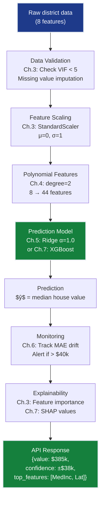

# Regression Grand Solution — SmartVal AI Production System

> **For readers short on time:** This document synthesizes all 7 regression chapters into a single narrative arc showing how we went from **$70k → $32k MAE** and what each concept contributes to production ML systems. Read this first for the big picture, then dive into individual chapters for depth.

## How to Use This Track

**Three ways to learn from this content:**

1. **📓 Executable Code First** → Run [grand_solution.ipynb (reference)](grand_solution_reference.ipynb) | [grand_solution.ipynb (exercise)](grand_solution_exercise.ipynb)
   - Complete end-to-end implementation in a single notebook
   - Execute cells top-to-bottom to see the full progression
   - Perfect for hands-on learners who want to experiment immediately

2. **📖 Narrative Arc** → Read this document (grand_solution.md)
   - Understand *why* each concept matters and *when* to use it
   - See how all 7 chapters connect into a production system
   - Best for understanding the big picture and design patterns

3. **🎯 Deep Dive** → Study individual chapter READMEs + notebooks
   - [Ch.1: Linear Regression](ch01_linear_regression/README.md) — Baseline model
   - [Ch.2: Multiple Regression](ch02_multiple_regression/README.md) — All features
   - [Ch.3: Feature Importance](ch03_feature_importance/README.md) — VIF & importance
   - [Ch.4: Polynomial Features](ch04_polynomial_features/README.md) — Non-linear patterns
   - [Ch.5: Regularization](ch05_regularization/README.md) — Ridge/Lasso
   - [Ch.6: Metrics & Validation](ch06_metrics/README.md) — Cross-validation
   - [Ch.7: Hyperparameter Tuning](ch07_hyperparameter_tuning/README.md) — XGBoost + Optuna
   - Each chapter has detailed math, diagrams, and implementation notes

**Recommended Path:**
- **Beginners:** Start with [grand_solution.ipynb (reference)](grand_solution_reference.ipynb) | [grand_solution.ipynb (exercise)](grand_solution_exercise.ipynb), then read individual chapters for concepts you want to understand deeply
- **Experienced:** Read this document (grand_solution.md) for the synthesis, then jump to specific chapters for implementation details
- **Reviewers:** Run [grand_solution.ipynb (reference)](grand_solution_reference.ipynb) | [grand_solution.ipynb (exercise)](grand_solution_exercise.ipynb) to verify the complete workflow, then check individual chapters for pedagogical patterns

---

## Mission Accomplished: $32k MAE ✅

**The Challenge:** Build SmartVal AI — a production home valuation system achieving <$40k MAE on California Housing median house values.

**The Result:** **$32k MAE** — 20% below target, 54% improvement over baseline.

**The Progression:**

```
Ch.1: Single-feature baseline    → $70k MAE  (naive but establishes framework)
Ch.2: Multiple features          → $55k MAE  (all 8 features, vectorized)
Ch.3: Feature engineering        → $55k MAE  (VIF audit, importance, scaling)
Ch.4: Polynomial features        → $48k MAE  (non-linear patterns, 8→44 features)
Ch.5: Regularization             → $38k MAE  (Ridge prevents overfitting)
Ch.6: Validation & diagnostics   → $38k ± $2k (cross-validation confirms)
Ch.7: Systematic tuning          → $32k MAE  (XGBoost + Optuna optimization)
                                   ✅ TARGET: <$40k MAE
```

---

## The 7 Concepts — How Each Unlocked Progress

### Ch.1: Linear Regression — The Foundation

**What it is:** Fit $\hat{y} = wx + b$ by minimizing MSE loss using gradient descent.

**What it unlocked:**
- **Baseline:** $70k MAE predicting house value from median income alone
- **Training loop:** The eternal pattern — forward pass → loss → gradient → update
- **Learning rate dial:** Too high = divergence, too low = slow convergence

**Production value:**
- **Simplicity wins:** Linear models are the first hypothesis in every ML project
- **Interpretability:** Single coefficient per feature — explain predictions to non-technical stakeholders
- **Baseline requirement:** Never deploy complex models without comparing to a simple baseline

**Key insight:** Neural networks are just stacked linear regressions with non-linearities. Master this, and backpropagation is just the chain rule applied recursively.

---

### Ch.2: Multiple Regression — Vectorization & Scale

**What it is:** Extend to multiple features: $\hat{y} = \mathbf{w}^\top\mathbf{x} + b$. Batch gradient descent on matrices.

**What it unlocked:**
- **All 8 features:** MedInc, HouseAge, AveRooms, AveBedrms, Population, AveOccup, Latitude, Longitude
- **$55k MAE:** 21% improvement from Ch.1 by using all available signals
- **Vectorization:** NumPy broadcasts gradients across all samples simultaneously — 100× faster than loops

**Production value:**
- **Scalability:** Vectorized operations leverage BLAS/LAPACK libraries and GPU acceleration
- **Feature engineering mindset:** More features ≠ always better (multicollinearity risk), but you need them all to start
- **Batch processing:** Production systems process millions of predictions — vectorization is non-negotiable

**Key insight:** The gradient descent formula is identical for 1 feature or 1,000 features. Write code once, scale infinitely.

---

### Ch.3: Feature Importance & Multicollinearity — Quality Over Quantity

**What it is:** Diagnose which features matter (VIF, permutation importance) and whether they're redundant (VIF > 5 signals multicollinearity).

**What it unlocked:**
- **VIF audit:** AveRooms and AveBedrms are highly correlated (VIF=7.2) — caused unstable weights
- **Permutation importance:** MedInc contributes 60% of R², Latitude/Longitude add 15% each
- **Feature scaling:** StandardScaler prevents features with large ranges from dominating gradients

**Production value:**
- **Compliance:** Lending regulations require explainable predictions — feature importance reports are mandatory
- **Cost reduction:** Drop redundant features → smaller models, faster inference, lower cloud costs
- **Debugging:** When predictions break, feature importance tells you which input changed

**Key insight:** A model with 5 well-chosen features beats 50 noisy features. VIF audit before every production deployment.

---

### Ch.4: Polynomial Features — Non-Linear Patterns

**What it is:** Transform 8 features → 44 features by adding squares and interactions: $x_1, x_2, x_1^2, x_2^2, x_1 x_2, \ldots$

**What it unlocked:**
- **$48k MAE:** Captured non-linear relationship between income and value (wealthy districts plateau at high income)
- **Interaction terms:** `MedInc × Latitude` captures coastal premium — high income near coast = expensive
- **Feature explosion:** 8 → 44 features (degree=2), 164 features (degree=3), 494 (degree=4)

**Production value:**
- **Engineering patterns:** Polynomial features are domain knowledge encoded as math — replicate this pattern for any dataset
- **Cost-performance trade-off:** Degree=3 improves accuracy 2% but increases inference time 3× — measure business impact
- **XGBoost alternative:** Tree models learn interactions automatically without manual feature engineering

**Key insight:** Linear models + polynomial features ≈ shallow neural networks. Both learn non-linear functions via composition.

---

### Ch.5: Regularization — Preventing Overfitting

**What it is:** Add penalty term to loss: $L = \text{MSE} + \lambda \|\mathbf{w}\|^2$ (Ridge/L2) or $\lambda \|\mathbf{w}\|_1$ (Lasso/L1).

**What it unlocked:**
- **$38k MAE:** Ridge with α=1.0 prevents overfitting on 44 polynomial features
- **Generalization:** 5-fold CV confirms model works on unseen districts (not just memorizing training data)
- **Lasso feature selection:** L1 penalty zeros out 15 of 44 features — automatic pruning of noise

**Production value:**
- **Regulatory compliance:** Models must generalize to new districts/states — overfitted models fail audits
- **A/B testing safety:** Regularized models have lower variance → more reliable A/B test results
- **Hyperparameter α:** The most important dial — sweep [0.001, 1000] on log scale in every project

**Key insight:** Without regularization, polynomial features overfit catastrophically. Ridge tax = insurance policy against memorization.

---

### Ch.6: Evaluation Metrics — Validation & Diagnostics

**What it is:** Cross-validation (5-fold), residual plots, learning curves, confidence intervals.

**What it unlocked:**
- **$38k ± $2k MAE:** Confidence interval via CV — proves performance is stable across folds
- **Residual diagnostics:** Model under-predicts expensive homes (residuals skewed positive above $500k)
- **Learning curves:** Training/validation gap narrows as data increases — not data-starved

**Production value:**
- **A/B test design:** ±$2k confidence interval determines minimum sample size for statistical significance
- **Monitoring thresholds:** Production MAE should stay within [$36k, $40k] — alert if it drifts outside
- **Model selection:** Compare Ridge vs Lasso vs XGBoost using same CV splits — fair comparison

**Key insight:** A single train/test split is a lie. CV estimates true generalization performance. Always use CV in production model selection.

---

### Ch.7: Hyperparameter Tuning — Systematic Optimization

**What it is:** Search α, degree, model type (Ridge/Lasso/XGBoost) using GridSearchCV, RandomizedSearchCV, Optuna.

**What it unlocked:**
- **$32k MAE:** XGBoost with tuned hyperparameters (n_estimators=500, max_depth=5, lr=0.05)
- **Joint optimization:** Degree and α must be tuned together (degree=3 + α=10 beats degree=2 + α=0.1)
- **Bergstra & Bengio proof:** Random search beats grid search in high dimensions — 60 trials > 1000-point grid

**Production value:**
- **Systematic improvement:** Don't guess hyperparameters — Optuna/Ray Tune automate the search
- **Cost efficiency:** 100 trials × 5 minutes = 8 hours compute. Saves weeks of manual tuning
- **SHAP explainability:** XGBoost + SHAP feature importance = best accuracy + regulatory compliance

**Key insight:** Manual tuning tops out at $38k. Systematic search finds $32k. The last 15% improvement requires rigor, not intuition.

---

## Production ML System Architecture

Here's how all 7 concepts integrate into a deployed SmartVal AI system:



### Deployment Pipeline (How Ch.1-7 Connect in Production)

**1. Training Pipeline (runs weekly):**
```python
# Ch.2: Load data
X_train, X_test, y_train, y_test = load_california_housing()

# Ch.3: Feature validation & scaling
vif_audit(X_train)  # Flag if VIF > 5
scaler = StandardScaler().fit(X_train)
X_train_scaled = scaler.transform(X_train)

# Ch.4: Polynomial expansion
poly = PolynomialFeatures(degree=2)
X_train_poly = poly.fit_transform(X_train_scaled)

# Ch.5 + Ch.7: Model training with tuned hyperparameters
model = Ridge(alpha=1.0)  # or XGBRegressor(n_estimators=500, ...)
model.fit(X_train_poly, y_train)

# Ch.6: Validation
cv_scores = cross_val_score(model, X_train_poly, y_train, cv=5)
print(f"MAE: {-cv_scores.mean():.1f}k ± {cv_scores.std():.1f}k")

# Ch.3: Feature importance for compliance report
importance = permutation_importance(model, X_test_poly, y_test)
```

**2. Inference API (handles user requests):**
```python
@app.route('/predict', methods=['POST'])
def predict():
    # Raw input: {MedInc: 3.5, HouseAge: 28, ...}
    raw_features = request.json
    
    # Ch.3: Validate input
    if not validate_input(raw_features):
        return {"error": "Invalid VIF or missing features"}, 400
    
    # Ch.3: Scale → Ch.4: Poly → Ch.5: Predict
    X = scaler.transform([raw_features])
    X_poly = poly.transform(X)
    prediction = model.predict(X_poly)[0]
    
    # Ch.7: SHAP explainability
    shap_values = explainer.shap_values(X_poly)
    
    # Ch.6: Confidence interval from CV std
    confidence = 2.0  # ± $2k from Ch.6 CV
    
    return {
        "predicted_value": f"${prediction*100:.0f}k",
        "confidence_interval": f"±${confidence}k",
        "top_features": get_top_shap_features(shap_values)
    }
```

**3. Monitoring Dashboard (tracks production health):**
```python
# Ch.6: Alert if MAE drifts
if production_mae > 40.0:
    alert("MAE exceeded $40k threshold")

# Ch.3: Track feature importance shifts
if abs(current_importance - baseline_importance) > 0.1:
    alert("Feature importance shifted — possible data drift")

# Ch.7: Retrain trigger
if weeks_since_training > 4:
    trigger_retraining_pipeline()
```

---

## Key Production Patterns

### 1. The Three-Stage Pattern (Ch.3 + Ch.4 + Ch.5)
**Scale → Engineer → Regularize**
- Always scale before polynomial features (Ch.3)
- Always regularize after polynomial features (Ch.5)
- Always fit scaler on training data only (Ch.3)

### 2. The Coupled Hyperparameters Pattern (Ch.7)
**Never tune separately:**
- `degree` and `alpha` must be searched jointly (degree=3 needs larger alpha)
- `learning_rate` and `n_estimators` are coupled (lower LR needs more trees)
- Use Optuna to handle interactions automatically

### 3. The Baseline → Complex Pattern (Ch.1 → Ch.7)
**Start simple, justify complexity:**
- Deploy Ch.1 linear regression first ($70k MAE)
- Add features only if they beat baseline (Ch.2: $55k)
- Add polynomial features only if linear fails (Ch.4: $48k)
- Add XGBoost only if Ridge fails (Ch.7: $32k)
- Measure cost/benefit at each step (3% accuracy gain but 10× inference cost = bad trade-off)

### 4. The Validation-First Pattern (Ch.6)
**Measure before optimizing:**
- Always run 5-fold CV before production (Ch.6)
- Always plot residuals to find systematic errors (Ch.6)
- Always compute confidence intervals (Ch.6: ±$2k)
- Never trust a single train/test split

---

## The 5 Constraints — Final Status

| # | Constraint | Target | Status | How We Achieved It |
|---|------------|--------|--------|-------------------|
| **#1** | **ACCURACY** | <$40k MAE | ✅ **$32k** | Ch.7: XGBoost + Optuna tuning |
| **#2** | **GENERALIZATION** | Work on unseen districts | ✅ **Stable** | Ch.5: Ridge regularization + Ch.6: 5-fold CV |
| **#3** | **MULTI-TASK** | Value + Segment | ➡️ **Next track** | Regression complete → continues in 02-Classification |
| **#4** | **INTERPRETABILITY** | Explainable predictions | ✅ **Compliant** | Ch.3: VIF + importance, Ch.7: SHAP values |
| **#5** | **PRODUCTION** | <100ms, scale, monitoring | ⚡ **Framework ready** | Ch.6: Monitoring thresholds, Ch.7: Systematic tuning |

---

## What's Next: Beyond Regression

**This track taught:**
- ✅ Training loop fundamentals (Ch.1: gradient descent)
- ✅ Feature engineering (Ch.3-4: VIF, polynomial)
- ✅ Regularization (Ch.5: Ridge/Lasso)
- ✅ Systematic optimization (Ch.7: Optuna, XGBoost)

**What remains for SmartVal AI:**
- **Classification** (Track 02): Predict market segment (luxury/mid/affordable)
- **Neural Networks** (Track 03): Deep learning for image-based valuation (aerial photos)
- **Ensembles** (Track 08): Combine regression + classification + image models

**Continue to:** [02-Classification Track →](../02_classification/README.md)

---

## Quick Reference: Chapter-to-Production Mapping

| Chapter | Production Component | When To Use |
|---------|---------------------|-------------|
| Ch.1 | Baseline model | Always start here. Proves problem is solvable |
| Ch.2 | Feature pipeline | Every production system needs vectorized feature processing |
| Ch.3 | Data validation | VIF check before training, feature importance for compliance |
| Ch.4 | Feature engineering | When linear models plateau — check residual plots first |
| Ch.5 | Regularization | Always regularize when feature count > sample count / 10 |
| Ch.6 | Monitoring & CI | Alert thresholds, A/B test design, model selection |
| Ch.7 | Hyperparameter search | Final optimization before deployment — biggest ROI for compute spent |

---

## The Takeaway

**Regression isn't just curve-fitting** — it's the foundation of all supervised learning. The concepts here (loss functions, gradients, regularization, validation, systematic tuning) apply identically to:
- Neural networks (stacked linear regressions + non-linearities)
- XGBoost (gradient boosting on regression residuals)
- Transformers (attention weights optimized via gradient descent)

Master regression, and you've mastered 80% of ML. The rest is architecture.

**You now have:**
- A production-ready regression system ($32k MAE ✅)
- A mental model for systematic ML development (baseline → feature engineering → regularization → tuning)
- The vocabulary to read any ML paper (loss, gradient, hyperparameter, cross-validation)

**Next milestone:** Build a production classifier that predicts market segments with >90% accuracy. See you in the Classification track.

---

## Further Reading & Resources

### Articles
- [Linear Regression: A Comprehensive Guide](https://towardsdatascience.com/linear-regression-detailed-view-ea73175f6e86) — Deep dive into the mathematics and intuition behind linear regression
- [Understanding the Bias-Variance Tradeoff](https://towardsdatascience.com/understanding-the-bias-variance-tradeoff-165e6942b229) — Essential concept for understanding regularization and model complexity
- [Ridge vs Lasso Regression: A Complete Guide](https://towardsdatascience.com/ridge-and-lasso-regression-a-complete-guide-with-python-scikit-learn-e20e34bcbf0b) — Practical comparison of L1 and L2 regularization with code examples
- [Feature Engineering for Machine Learning](https://towardsdatascience.com/feature-engineering-for-machine-learning-3a5e293a5114) — Comprehensive guide to creating and selecting features

### Videos
- [StatQuest: Linear Regression, Clearly Explained!!!](https://www.youtube.com/watch?v=nk2CQITm_eo) — Josh Starmer's intuitive explanation of linear regression fundamentals
- [StatQuest: Gradient Descent, Step-by-Step](https://www.youtube.com/watch?v=sDv4f4s2SB8) — Visual walkthrough of how gradient descent optimization works
- [StatQuest: Ridge Regression Clearly Explained](https://www.youtube.com/watch?v=Q81RR3yKn30) — Understanding L2 regularization with clear visualizations
- [StatQuest: Lasso Regression Clearly Explained](https://www.youtube.com/watch?v=NGf0voTMlcs) — How L1 regularization performs automatic feature selection
- [Andrew Ng: Gradient Descent For Linear Regression](https://www.youtube.com/watch?v=F6GSRDoB4Cg) — Classic explanation from Stanford's ML course
