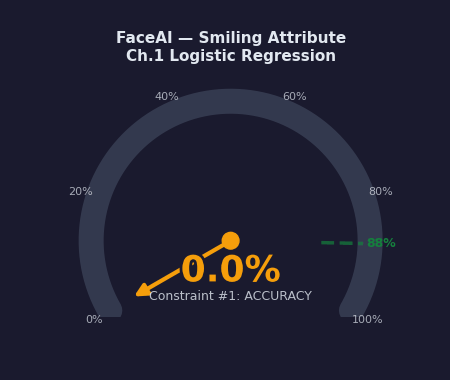
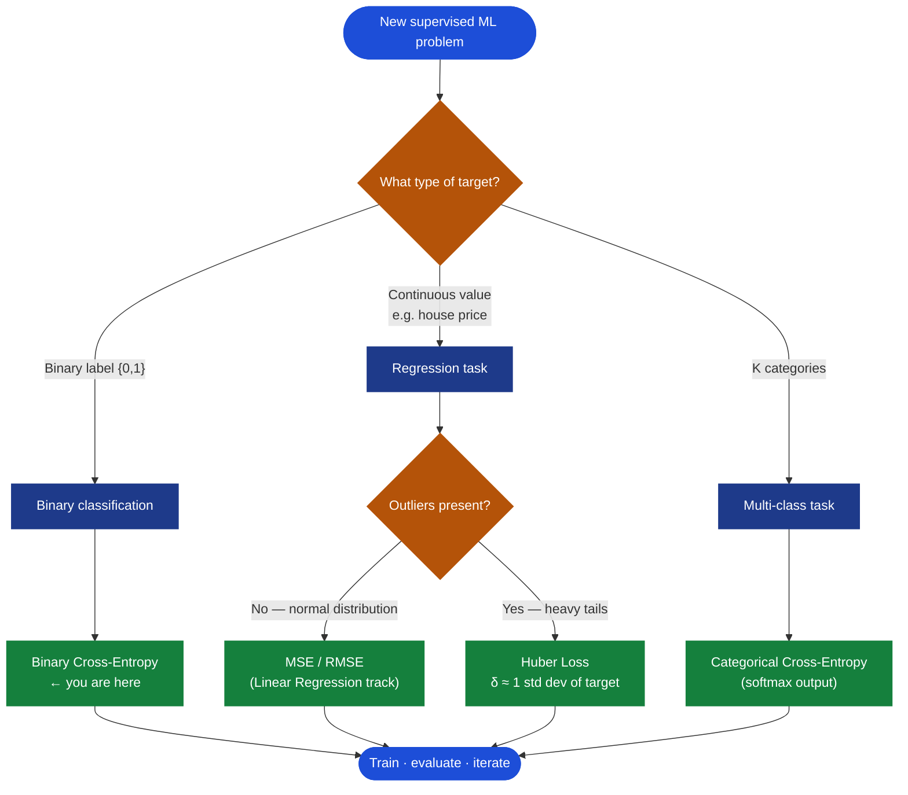
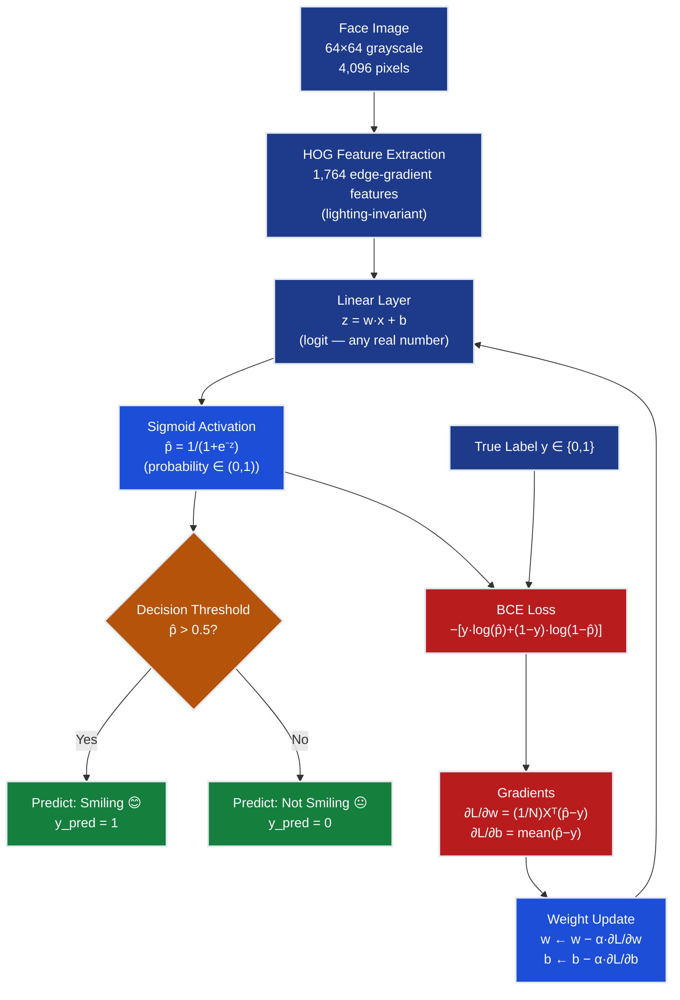
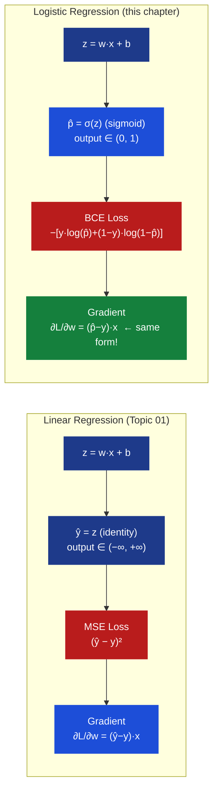
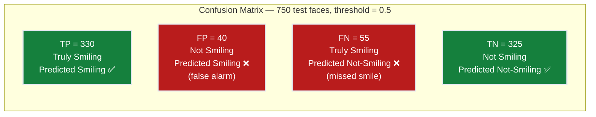
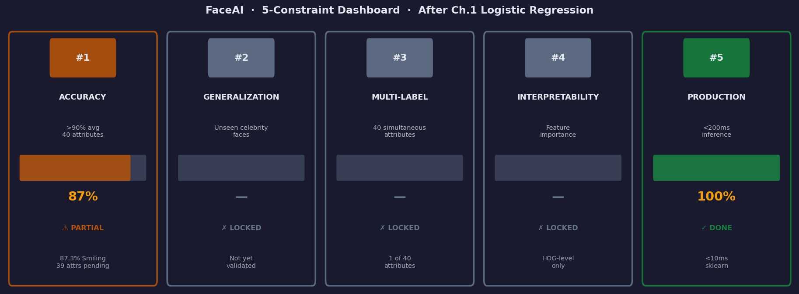

# Ch.1 — Logistic Regression

> **The story.** In **1838**, the Belgian mathematician **Pierre-François Verhulst** sat with a puzzle that had haunted Malthus: why does population growth slow down? Malthus predicted exponential explosion; the census data disagreed. Verhulst's elegant answer was a differential equation whose solution traced an S-curve — growth starts slow, accelerates in the middle, then decelerates as it approaches a ceiling he called the *carrying capacity*. The formula for this S-curve: $P(t) = \frac{K}{1 + e^{-r(t - t_0)}}$. He published it in 1838 and 1845, naming it the **logistic function** after the Greek *logistikos* (skilled in calculation). For nearly a century it sat in a drawer labelled "population dynamics."
>
> Then, in **1944**, the American biostatistician **Joseph Berkson** was wrestling with a different problem: modelling the probability that a patient responds to a drug dose. The probability lives between 0 and 1; a linear model can drift below 0 or above 1 on new inputs. Berkson recognized that Verhulst's logistic function was the ideal probability "squasher." He invented the **logit transformation** — $\text{logit}(p) = \log\left(\frac{p}{1-p}\right)$ — which inverts the sigmoid, transforming odds to a linear scale. His 1944 paper coined the word *logit* and introduced what he called "logistic regression." A half-century of population biology had quietly produced the key to binary classification.
>
> **David Cox** completed the story in **1958**. Cox placed Berkson's technique on firm statistical ground by showing it emerges naturally from maximum likelihood estimation when outcomes are Bernoulli-distributed. His 1958 paper in the *Journal of the Royal Statistical Society* gave the field both rigorous justification and a clean inference framework. By the 1970s, logistic regression was standard in medicine, credit scoring, and epidemiology. When the neural network renaissance began in the 2000s, researchers realized that **a single neuron with a sigmoid activation and cross-entropy loss is exactly logistic regression** — and everything before was a special case. The reason logistic regression feels almost identical to linear regression is because it *is* linear regression — you have just added a sigmoid at the output and swapped MSE for the loss Cox derived.
>
> **Where you are in the curriculum.** Topic 01 (Regression) taught you to predict continuous values. The FaceAI product team now needs a binary signal: is a person **Smiling** or not? This chapter introduces the sigmoid activation, binary cross-entropy loss, and the confusion matrix — the evaluation framework the rest of this track builds on.
>
> **Notation in this chapter.** $\mathbf{x} \in \mathbb{R}^d$ — input feature vector (HOG descriptors, $d=1{,}764$); $y \in \{0,1\}$ — true label (1 = Smiling, 0 = Not Smiling); $z = \mathbf{w} \cdot \mathbf{x} + b$ — the **logit** (raw linear output); $\hat{p} = \sigma(z) = 1/(1+e^{-z})$ — **sigmoid** output (predicted probability); $L = -\frac{1}{N}\sum_i[y_i \log\hat{p}_i + (1-y_i)\log(1-\hat{p}_i)]$ — **binary cross-entropy** (BCE) loss; $\eta$ or $\alpha$ — learning rate; $\mathbf{W}$ — weight vector ($d$-dimensional); $b$ — bias scalar; $TP, FP, TN, FN$ — confusion-matrix counts.

---

## 0 · The Challenge — Where We Are

> 💡 **Grand Challenge**: Launch **FaceAI** — auto-tag 202,599 celebrity photos across 40 binary attributes with >90% average accuracy.
>
> | # | Constraint | Target | Status |
> |---|-----------|--------|--------|
> | 1 | ACCURACY | >90% avg across 40 attributes | ❌ Starting — 0% so far |
> | 2 | GENERALIZATION | Unseen celebrity faces | ❌ |
> | 3 | MULTI-LABEL | 40 simultaneous attributes | ❌ |
> | 4 | INTERPRETABILITY | Which features drive predictions | ❌ |
> | 5 | PRODUCTION | <200ms inference | ❌ |

> **This chapter's target:** detect the **Smiling** attribute (48% positive rate — nearly balanced). Bald and Eyeglasses appear as illustrative asides only — their full treatment is in Ch.3 and Ch.5.

**What we know so far:**
- ✅ Topic 01: Linear regression for continuous targets — fitted $\hat{y} = \mathbf{w} \cdot \mathbf{x} + b$
- ✅ MSE loss, gradient descent, learning rate, feature scaling
- ✅ Training loop: forward pass → loss → gradient → update
- ❌ **But we can only predict continuous values, not probabilities or categories!**

**What's blocking us:**
The FaceAI app needs binary labels: *is this person Smiling?* Linear regression outputs unbounded real numbers ($-\infty$ to $+\infty$), not probabilities. Your product manager asks: "What's the model's confidence?" You cannot answer — a raw output of $3.8$ has no probabilistic meaning. Worse: when you try to threshold ("anything above 2.5 is Smiling"), the threshold is arbitrary, has no statistical grounding, and the MSE loss sends the wrong gradient signal for binary targets.

**What this chapter unlocks:**
- **Sigmoid activation** — squash $z \in (-\infty, +\infty)$ → $\hat{p} \in (0, 1)$
- **Binary cross-entropy loss** — the statistically principled loss for probability predictions
- **Confusion matrix** — precision, recall, F1 (full treatment in [Ch.3 — Metrics](../ch03_metrics))
- **Constraint #1 PARTIAL** — ~88% accuracy on Smiling attribute (first dent in the 90% target)


---

## Animation



---

## 1 · Core Idea

Logistic regression takes a linear combination of features — exactly the same $z = \mathbf{w} \cdot \mathbf{x} + b$ from linear regression — and passes it through the **sigmoid function** $\sigma(z) = 1/(1+e^{-z})$, squashing the output to a probability between 0 and 1. You classify by thresholding at 0.5: above → "Smiling," below → "Not Smiling." Training minimizes **binary cross-entropy** — not MSE, which breaks for classification in subtle but serious ways (§5). The gradient update is elegantly simple: $\nabla_\mathbf{w} L = \frac{1}{N}\mathbf{X}^\top(\hat{\mathbf{p}} - \mathbf{y})$ — the same shape as the linear regression update, just with the sigmoid-squashed $\hat{p}$ instead of the raw linear $\hat{y}$.

---

## 2 · Running Example — FaceAI Smiling Detector on CelebA

You are the lead ML engineer at a photo platform. The CelebA dataset lands in your queue: **202,599 celebrity face images**, each labelled for 40 binary attributes — Smiling, Young, Attractive, Bald, Eyeglasses, and 35 others. The backlog alone is enormous: manual tagging costs \$0.05 × 200,000 images = **\$10,000** and takes weeks. An ML classifier under 200ms can automate the entire pipeline.

**Your sprint-one target:** get the Smiling attribute working end-to-end. At 48% positive rate, the class is nearly balanced — accuracy is a meaningful metric here.

**Dataset details:**
- **Full CelebA**: 202,599 celebrity face images, 40 binary attributes, 10,177 unique identities
- **Working subset for this chapter**: 5,000 face images resized to 64×64 grayscale
- **Split**: 3,500 train / 750 validation / 750 test
- **Features**: HOG descriptors (Histogram of Oriented Gradients) — 1,764 edge-gradient features per image
- **Target label**: `Smiling` (1 = smiling, 0 = not smiling)
- **Baselines**: random guessing ≈ 50%; always-predict-majority ≈ 52%

**Why HOG, not raw pixels?** A raw 64×64 grayscale image has 4,096 pixel intensities. Those pixels carry enormous lighting noise: the same smile looks completely different under studio lights, natural light, or flash. HOG captures the *gradient structure* — the edge patterns at mouth corners, cheekbone angles, and eye crinkles — that signal "Smiling" regardless of brightness. The trade-off: 4,096 noisy pixels compress to 1,764 stable gradient features.

**The two HOG proxies we use in worked examples** (simplified to 2D for arithmetic visibility):

| Feature | What it measures |
|---------|-----------------|
| $f_1$ — mouth-corner curvature | HOG gradient strength around mouth corners; positive = upturned corners = smile |
| $f_2$ — eye-squint index | HOG gradient around outer eye creases; positive = crinkled eyes = smile |

**Three toy training faces (§4–§6 will use these throughout):**

| Face | $f_1$ (mouth) | $f_2$ (eyes) | $y$ (Smiling) | Description |
|------|--------------|-------------|---------------|-------------|
| 1 | 1.5 | 0.8 | 1 | Broad grin, crinkled eyes |
| 2 | −0.9 | 0.2 | 0 | Neutral mouth, flat eyes |
| 3 | 0.6 | −0.4 | 1 | Slight smile, wide eyes |

---

## 3 · The Training Loop at a Glance

Before diving into the math, here is the complete training loop you will be running. Each numbered step has a corresponding deep-dive in the sections that follow — treat this as your map.

```
LOGISTIC REGRESSION TRAINING LOOP
────────────────────────────────────────────────────────────
Input:  X_train (N × d feature matrix), y_train (N × 1 binary labels)
Output: Trained weights w (d × 1), bias b (scalar)

1. EXTRACT FEATURES
   └─ HOG(face_image) → x ∈ ℝ¹⁷⁶⁴  for each image

2. INITIALISE PARAMETERS
   └─ w = zeros(d),  b = 0          (or small random values)

3. FOR epoch = 1 to max_epochs:

   a. FORWARD PASS — compute logits
      └─ z = X_train @ w + b        # shape: (N,)

   b. FORWARD PASS — compute probabilities
      └─ p_hat = sigmoid(z)         # p_hat = 1 / (1 + exp(−z))
                                     # shape: (N,)  values ∈ (0,1)

   c. COMPUTE LOSS — binary cross-entropy
      └─ L = −mean( y*log(p_hat) + (1−y)*log(1−p_hat) )
                                     # scalar > 0

   d. BACKWARD PASS — gradients
      └─ ∂L/∂w = (1/N) · X_train.T @ (p_hat − y)   # shape: (d,)
      └─ ∂L/∂b = mean(p_hat − y)                    # scalar

   e. UPDATE WEIGHTS
      └─ w ← w − α · ∂L/∂w
      └─ b ← b − α · ∂L/∂b

   f. CHECK CONVERGENCE
      └─ if |ΔL| < ε or epoch == max_epochs: break

4. PREDICT ON TEST SET
   └─ z_test = X_test @ w + b
   └─ p_test = sigmoid(z_test)
   └─ y_pred = (p_test > 0.5).astype(int)

5. EVALUATE
   └─ confusion matrix → TP, FP, TN, FN
   └─ accuracy = (TP + TN) / N_test
```

**Notation:**
- $d = 1{,}764$ — number of HOG features per image
- $N$ — number of training examples (3,500 for CelebA subset)
- $\alpha$ — learning rate (§6 explores its effect on convergence)
- $\hat{p}$ — predicted probability vector; every entry is in $(0,1)$, not a raw linear number

> ⚡ **The only two differences from the linear regression loop:**
> (1) Step b: insert $\sigma(\cdot)$ to convert logits to probabilities.
> (2) Step c: replace MSE with BCE. The gradient formula in step d *looks* nearly identical but derives from a completely different loss — §4 and §5 explain every step.

> ➡️ **Gradient descent fundamentals** — momentum, Adam, learning rate schedules — are covered in the Neural Networks track ([Ch.3 →](../../03_neural_networks/ch03_backprop_optimisers)). Here, plain gradient descent with fixed $\alpha$ is sufficient to reach ~88% on Smiling.

---

## 4 · The Math

### 4.1 · Why Linear Regression Fails — and How the Sigmoid Fixes It

You already know how to compute a linear output:

$$z = \mathbf{w} \cdot \mathbf{x} + b$$

For face 1 (broad grin, $f_1=1.5$, $f_2=0.8$) with initial weights $w_1=0.2$, $w_2=-0.3$, $b=0.1$:

$$z = 0.2 \times 1.5 + (-0.3) \times 0.8 + 0.1 = 0.30 - 0.24 + 0.10 = 0.16$$

The problem: $z = 0.16$ is *not* a probability. It is just a real number. On different faces it might be $-4.2$ or $+7.8$. You cannot interpret it as "16% chance of smiling" because there is no guarantee $z$ stays in $[0,1]$, and no probabilistic theorem connects raw logits to calibrated probabilities.

**What you need** is a function $f: \mathbb{R} \to (0,1)$ that:
1. Maps any real number to $(0, 1)$
2. Is monotonically increasing (larger logit → higher probability)
3. Has a clean, non-zero derivative everywhere (for gradient descent)
4. Admits a probabilistic interpretation: $f(z) = P(y=1 \mid \mathbf{x})$

The **sigmoid function** is the unique function satisfying all four:

$$\hat{p} = \sigma(z) = \frac{1}{1 + e^{-z}}$$

**Why it is "the" unique choice** — start from the assumption that the log-odds (logit) are linear:

$$\log\left(\frac{p}{1-p}\right) = z$$

Solve for $p$: multiply both sides by $(1-p)$, expand, rearrange:

$$p = (1-p)e^z \implies p + pe^z = e^z \implies p(1+e^z) = e^z \implies p = \frac{e^z}{1+e^z} = \frac{1}{1+e^{-z}}$$

This is exactly $\sigma(z)$. The sigmoid is not a design choice — it is the *implied* probability function whenever you assume that the log-odds of the outcome are linear in $\mathbf{x}$.

**Sigmoid curve — key landmarks at a glance:**

```
σ(z)
1.00 ┤                                         ━━━━━━━━━━━━
0.90 ┤                                  ━━━━━━━
0.80 ┤                            ━━━━━━
0.73 ┤                         ━━━
0.69 ┤                      ━━
0.50 ┤━━━━━━━━━━━━━━━━━━━━━━●━━━━━━━━━━━━━━━━━   ← σ(0) = 0.500 (decision boundary)
0.31 ┤           ━━
0.27 ┤        ━━━
0.20 ┤     ━━━━━━
0.10 ┤━━━━━━━━
0.00 ┤━━━━
     ──────────────────────────────────────────→ z
     -6    -4    -2     0    +2    +4    +6

  σ(−6) ≈ 0.002    σ(−2) ≈ 0.119    σ(0) = 0.500
  σ(−4) ≈ 0.018    σ(−1) ≈ 0.269    σ(+1) ≈ 0.731
                                     σ(+2) ≈ 0.881
                                     σ(+4) ≈ 0.982
                                     σ(+6) ≈ 0.998

  Derivative:  σ'(z) = σ(z)(1 − σ(z))   — max 0.25 at z=0
  Saturates:   σ'(z) → 0 when |z| > 4   — "vanishing gradient" zone
```

**Four properties that matter for training:**

| Property | Value | Why it matters |
|----------|-------|----------------|
| $\sigma(0)$ | 0.500 | Neutral: no evidence either way |
| $\sigma(+\infty)$ | 1.000 | Maximally confident Smiling |
| $\sigma(-\infty)$ | 0.000 | Maximally confident Not-Smiling |
| $\sigma'(z)$ | $\sigma(z)(1-\sigma(z))$ | Cancels in the BCE gradient (§4.3) — no vanishing gradient |

**Decision boundary geometry.** The model predicts Smiling when $\hat{p} > 0.5$, i.e., when $\sigma(z) > 0.5$. This happens exactly when $z > 0$. Expanding:

$$z = w_1 f_1 + w_2 f_2 + b > 0 \iff w_1 f_1 + w_2 f_2 + b = 0 \quad \text{(boundary)}$$

In 2D this is a **line** separating the $f_1$–$f_2$ plane. In the full 1,764-dimensional HOG space it is a **hyperplane**. Logistic regression is always a linear classifier.

**Decision boundary in 2D feature space:**

```
       f2 (eye-squint index)
    ↑
 1.0│   ● (Smiling)         /  ← boundary: w₁f₁ + w₂f₂ + b = 0
    │         ●        ●   /
 0.5│                      /     (Smiling region: z > 0)
    │      ●              /
 0.0│             ●      /
    │  ○ (Not Smiling)  /
-0.5│      ○           /
    │           ○      /
-1.0│               ○ /   (Not-Smiling region: z < 0)
    └──────────────────────────────→ f1 (mouth-corner curvature)
         -1    0    +1   +2
```

---

### 4.2 · Binary Cross-Entropy — Derived from First Principles (MLE)

The question is not "what loss should I pick?" but: **given that each label $y_i \in \{0,1\}$, what is the probability that these specific labels came from our model?** Maximum likelihood answers exactly this.

**Step 1 — Model each prediction as a Bernoulli trial.**

Our model outputs $\hat{p}_i = \sigma(z_i)$. Each label is a coin-flip with bias $\hat{p}_i$:
- $P(y_i = 1 \mid \mathbf{x}_i) = \hat{p}_i$
- $P(y_i = 0 \mid \mathbf{x}_i) = 1 - \hat{p}_i$

These two cases collapse into one expression using the Bernoulli PMF:

$$P(y_i \mid \mathbf{x}_i) = \hat{p}_i^{\,y_i} \cdot (1 - \hat{p}_i)^{1 - y_i}$$

*Check:* when $y_i=1$: $\hat{p}_i^1(1-\hat{p}_i)^0 = \hat{p}_i$ ✓. When $y_i=0$: $\hat{p}_i^0(1-\hat{p}_i)^1 = 1-\hat{p}_i$ ✓.

**Step 2 — Joint likelihood over all $N$ training examples** (assuming independence):

$$\mathcal{L}(\mathbf{w}, b) = \prod_{i=1}^{N} \hat{p}_i^{\,y_i} \,(1 - \hat{p}_i)^{1 - y_i}$$

**Step 3 — Take the log** (products become sums; log is monotone so the maximiser is the same):

$$\log \mathcal{L}(\mathbf{w}, b) = \sum_{i=1}^{N} \bigl[ y_i \log \hat{p}_i + (1 - y_i) \log(1 - \hat{p}_i) \bigr]$$

**Step 4 — Negate and average** (minimising loss ≡ maximising log-likelihood; divide by $N$ for scale-invariance):

$$\boxed{L(\mathbf{w}, b) = -\frac{1}{N} \sum_{i=1}^{N} \bigl[ y_i \log \hat{p}_i + (1 - y_i) \log(1 - \hat{p}_i) \bigr]}$$

This is **binary cross-entropy**. You did not choose it — you *derived* it from the Bernoulli assumption. Any other loss for binary classification is, in a precise statistical sense, suboptimal.

**What the loss looks like per sample:**

If $y_i = 1$: $L_i = -\log(\hat{p}_i)$ → penalises low smile-probability for a true smiler.

If $y_i = 0$: $L_i = -\log(1-\hat{p}_i)$ → penalises high smile-probability for a non-smiler.

**Penalty table:**

| $y_i$ | $\hat{p}_i$ | $L_i$ | Interpretation |
|--------|------------|-------|----------------|
| 1 | 0.95 | 0.051 | Correct, confident → tiny penalty |
| 1 | 0.60 | 0.511 | Correct, uncertain → moderate penalty |
| 1 | 0.10 | 2.303 | Wrong, confident → **huge** penalty |
| 0 | 0.05 | 0.051 | Correct, confident → tiny penalty |
| 0 | 0.40 | 0.511 | Correct, uncertain → moderate penalty |
| 0 | 0.90 | 2.303 | Wrong, confident → **huge** penalty |

The $\log$ function ensures that confidently wrong predictions receive exponentially larger penalties — exactly the gradient signal that drives rapid correction.

---

### 4.3 · Gradient Derivation — Chain Rule, All Steps Explicit

We need $\frac{\partial L}{\partial w_j}$ for each weight. The chain rule on a single example:

$$\frac{\partial L}{\partial w_j} = \frac{\partial L}{\partial \hat{p}} \cdot \frac{\partial \hat{p}}{\partial z} \cdot \frac{\partial z}{\partial w_j}$$

**Step A — $\partial L / \partial \hat{p}$:**

$$L = -\bigl[ y \log \hat{p} + (1-y) \log(1-\hat{p}) \bigr]$$

$$\frac{\partial L}{\partial \hat{p}} = -\frac{y}{\hat{p}} + \frac{1-y}{1-\hat{p}}$$

**Step B — $\partial \hat{p} / \partial z$ (sigmoid derivative):**

$$\hat{p} = \sigma(z) = \frac{1}{1+e^{-z}}$$

Full derivation using the quotient rule:

$$\frac{d\sigma}{dz} = \frac{e^{-z}}{(1+e^{-z})^2} = \frac{1}{1+e^{-z}} \cdot \frac{e^{-z}}{1+e^{-z}} = \sigma(z) \cdot \frac{1+e^{-z}-1}{1+e^{-z}} = \sigma(z)(1-\sigma(z)) = \hat{p}(1-\hat{p})$$

**Step C — $\partial z / \partial w_j$:**

$$z = \sum_k w_k x_k + b \implies \frac{\partial z}{\partial w_j} = x_j$$

**Step D — Multiply all three (the beautiful cancellation):**

$$\frac{\partial L}{\partial w_j} = \left( -\frac{y}{\hat{p}} + \frac{1-y}{1-\hat{p}} \right) \cdot \hat{p}(1-\hat{p}) \cdot x_j$$

Expand only the first two factors:

$$\left( -\frac{y}{\hat{p}} + \frac{1-y}{1-\hat{p}} \right) \hat{p}(1-\hat{p})
= -y(1-\hat{p}) + (1-y)\hat{p}$$
$$= -y + y\hat{p} + \hat{p} - y\hat{p}
= \hat{p} - y$$

Therefore:

$$\boxed{\frac{\partial L}{\partial w_j} = (\hat{p} - y) \cdot x_j}$$

Averaged over $N$ examples in vectorised form:

$$\frac{\partial L}{\partial \mathbf{w}} = \frac{1}{N} \mathbf{X}^\top (\hat{\mathbf{p}} - \mathbf{y})
\qquad
\frac{\partial L}{\partial b} = \frac{1}{N} \sum_{i=1}^{N} (\hat{p}_i - y_i)$$

> 💡 **The magic of the cancellation.** The sigmoid derivative $\hat{p}(1-\hat{p})$ in Step B looks like it will cause vanishing gradients (it is small when $|z|$ is large). But the BCE derivative in Step A has $\hat{p}(1-\hat{p})$ in its *denominator*, and the two cancel exactly. The final gradient $(\hat{p}-y) \cdot x_j$ contains no sigmoid factor. This is why logistic regression with BCE does **not** suffer the vanishing gradient that would afflict MSE + sigmoid (§5).

> 💡 **Identical form to linear regression.** The linear regression gradient is $(\hat{y}-y) \cdot x_j$; the logistic gradient is $(\hat{p}-y) \cdot x_j$. The formulas look the same. The difference is what $\hat{\cdot}$ means: a raw linear output in regression vs a sigmoid-squashed probability in classification.

---

### 4.4 · Toy Numerical Example — 3 Faces, All Arithmetic Shown

**Setup:** $w_1 = 0.2$, $w_2 = -0.3$, $b = 0.1$, $\alpha = 0.01$.

| Face | $f_1$ | $f_2$ | $y$ |
|------|-------|-------|-----|
| 1 — broad grin | 1.5 | 0.8 | 1 |
| 2 — neutral | −0.9 | 0.2 | 0 |
| 3 — slight smile | 0.6 | −0.4 | 1 |

**Compute logits:**

$$z_1 = 0.2 \times 1.5 + (-0.3) \times 0.8 + 0.1 = 0.300 - 0.240 + 0.100 = \mathbf{0.160}$$
$$z_2 = 0.2 \times (-0.9) + (-0.3) \times 0.2 + 0.1 = -0.180 - 0.060 + 0.100 = \mathbf{-0.140}$$
$$z_3 = 0.2 \times 0.6 + (-0.3) \times (-0.4) + 0.1 = 0.120 + 0.120 + 0.100 = \mathbf{0.340}$$

**Apply sigmoid:**

$$\hat{p}_1 = \frac{1}{1+e^{-0.16}} = \frac{1}{1+0.852} = \mathbf{0.540}$$
$$\hat{p}_2 = \frac{1}{1+e^{+0.14}} = \frac{1}{1+1.150} = \mathbf{0.465}$$
$$\hat{p}_3 = \frac{1}{1+e^{-0.34}} = \frac{1}{1+0.712} = \mathbf{0.584}$$

All near 0.5 — the model is barely informed yet.

**Compute BCE per face:**

$$L_1 = -\log(0.540) = \mathbf{0.616} \qquad L_2 = -\log(1-0.465) = -\log(0.535) = \mathbf{0.625} \qquad L_3 = -\log(0.584) = \mathbf{0.537}$$

$$L = \frac{0.616 + 0.625 + 0.537}{3} = \mathbf{0.593}$$

**Compute errors** ($e_i = \hat{p}_i - y_i$):

$$e_1 = 0.540 - 1 = \mathbf{-0.460} \qquad e_2 = 0.465 - 0 = \mathbf{+0.465} \qquad e_3 = 0.584 - 1 = \mathbf{-0.416}$$

**Compute gradients:**

$$\frac{\partial L}{\partial w_1} = \frac{1}{3}\bigl[(-0.460)(1.5) + (0.465)(-0.9) + (-0.416)(0.6)\bigr] = \frac{-0.690 - 0.419 - 0.250}{3} = \frac{-1.359}{3} = \mathbf{-0.453}$$

$$\frac{\partial L}{\partial w_2} = \frac{1}{3}\bigl[(-0.460)(0.8) + (0.465)(0.2) + (-0.416)(-0.4)\bigr] = \frac{-0.368 + 0.093 + 0.166}{3} = \frac{-0.109}{3} = \mathbf{-0.036}$$

$$\frac{\partial L}{\partial b} = \frac{1}{3}(-0.460 + 0.465 - 0.416) = \frac{-0.411}{3} = \mathbf{-0.137}$$

Both $w_1$ and $w_2$ gradients are negative — the model should *increase* both weights. Intuitively: smile features should get larger positive weights so logits push further above 0 for Smiling faces.

**Update weights:**

$$w_1 \leftarrow 0.200 - 0.01 \times (-0.453) = 0.200 + 0.00453 = \mathbf{0.2045}$$
$$w_2 \leftarrow -0.300 - 0.01 \times (-0.036) = -0.300 + 0.00036 = \mathbf{-0.2996}$$
$$b \leftarrow 0.100 - 0.01 \times (-0.137) = 0.100 + 0.00137 = \mathbf{0.1014}$$

---

## 5 · Loss Function Discovery Arc

> You do not memorise loss functions. You *need* them — one at a time, when each previous attempt breaks.

**The stage.** The product manager wants a baseline. You have three labelled training faces. You reach for the loss you already know.

---

### Act 1 — First instinct: MSE for classification *(it breaks badly)*

The regression loss:

$$L_{\text{MSE}} = \frac{1}{N}\sum_{i=1}^{N}(y_i - \hat{p}_i)^2 \quad \text{where } y_i \in \{0,1\},\ \hat{p}_i \in (0,1)$$

Using our three faces with $\hat{p} = [0.540, 0.465, 0.584]$:

$$L_{\text{MSE}} = \frac{(1-0.540)^2 + (0-0.465)^2 + (1-0.584)^2}{3} = \frac{0.212 + 0.216 + 0.173}{3} = 0.200$$

**Where it breaks — three independent failures:**

**Failure 1 — Vanishing gradient at saturation.** The gradient flowing back through the sigmoid is:

$$\frac{\partial L_{\text{MSE}}}{\partial z} = \frac{\partial L}{\partial \hat{p}} \cdot \hat{p}(1-\hat{p}) = -2(y-\hat{p}) \cdot \hat{p}(1-\hat{p})$$

When $\hat{p}=0.02$ but $y=1$ (confidently wrong): gradient $= (-2)(0.98)(0.0196) = -0.0384$. Tiny — even though the prediction is catastrophically wrong. The model learns nothing from its worst mistakes.

**Failure 2 — Non-convex loss surface.** MSE + sigmoid creates a loss surface with multiple local minima. Gradient descent can stall at a plateau that is not the global minimum.

**Failure 3 — No probabilistic interpretation of errors.** MSE does not enforce that $\hat{p}$ behaves like a calibrated probability. You can minimise MSE without "80% confident" being correct 80% of the time. BCE enforces calibration via MLE.

> ⚠️ **Summary**: MSE's flat gradient tails (where $|\sigma'(z)| \approx 0$) multiply the loss gradient and kill the signal. The model will confidently stay wrong.

---

### Act 2 — Try hard thresholding the raw linear output *(wrong tool for probabilities)*

Skip sigmoid entirely — threshold $z$ at 0 to classify:

$$\hat{y} = \mathbf{1}[z > 0]$$

This is the **Perceptron** (Rosenblatt, 1957). Three problems:

1. The step function has zero derivative almost everywhere — gradient descent receives no signal.
2. Outputs hard labels $\{0, 1\}$, not probabilities — no confidence score for the product manager.
3. When classes are not linearly separable (CelebA is not), the Perceptron never converges.

---

### Act 3 — Binary Cross-Entropy from Bernoulli MLE *(the fix that solves all three)*

Section §4.2 derived BCE from first principles. The key properties that resolve all failures:

1. **No vanishing gradient.** Gradient = $(\hat{p} - y) \cdot x_j$ — no sigmoid factor. When $\hat{p}=0.02$ and $y=1$: gradient $= (0.02-1) \cdot x_j = -0.98 \cdot x_j$. The model corrects aggressively.

2. **Convex loss surface.** BCE + sigmoid is globally convex (negative log-likelihood of a Bernoulli model is convex in the logit $z$). Gradient descent finds the unique global minimum.

3. **Statistically principled.** BCE is the exact negative log-likelihood of the Bernoulli model. Minimising it is maximum likelihood estimation. The probabilities it outputs are calibrated — "80% confident" is right ~80% of the time.

**The discovery arc:**

```
MSE on probabilities
  → Vanishing gradient when |z| > 2  (sigmoid saturates)
  → Non-convex surface (local minima trap GD)
  → No probabilistic calibration
        ↓ BREAKS for binary classification

Perceptron (hard threshold)
  → Zero gradient everywhere (step function)
  → No confidence scores
        ↓ WRONG TOOL for probabilistic output

BCE from Bernoulli MLE
  → Gradient = (p̂ − y)·x — never vanishes
  → Globally convex — single minimum
  → MLE-calibrated probabilities
        ✅ THE RIGHT LOSS for binary classification
```

**Quick-reference — loss choice by problem type:**

| Situation | Training loss | Evaluation metric |
|-----------|--------------|-------------------|
| Binary labels, probabilities needed | **BCE** | Accuracy, AUC, F1 |
| K categories (softmax output) | Categorical cross-entropy | Top-K accuracy |
| Continuous target, Gaussian noise | MSE | RMSE |
| Continuous target, outliers present | Huber | RMSE |

**Loss choice flowchart:**



---

## 6 · Gradient Descent — Two Complete Epochs Worked Out in Full

A complete numerical walkthrough of two epochs. The same three faces as §4.4 are used throughout — the data never changes, only the weights.

**Training data:**

| Face | $f_1$ | $f_2$ | $y$ |
|------|-------|-------|-----|
| 1 — broad grin | 1.5 | 0.8 | 1 |
| 2 — neutral | −0.9 | 0.2 | 0 |
| 3 — slight smile | 0.6 | −0.4 | 1 |

**Initial parameters:** $w_1 = 0.200$, $w_2 = -0.300$, $b = 0.100$, $\alpha = 0.01$

---

### Epoch 1 · Using $w_1 = 0.200$, $w_2 = -0.300$, $b = 0.100$

**Stage 1 — Forward pass: compute logits**

$$z_1 = 0.200 \times 1.5 + (-0.300) \times 0.8 + 0.100 = 0.300 - 0.240 + 0.100 = \mathbf{0.160}$$
$$z_2 = 0.200 \times (-0.9) + (-0.300) \times 0.2 + 0.100 = -0.180 - 0.060 + 0.100 = \mathbf{-0.140}$$
$$z_3 = 0.200 \times 0.6 + (-0.300) \times (-0.4) + 0.100 = 0.120 + 0.120 + 0.100 = \mathbf{0.340}$$

**Stage 1 — Forward pass: apply sigmoid**

$$\hat{p}_1 = \frac{1}{1+e^{-0.160}} = \frac{1}{1.852} = \mathbf{0.540}$$
$$\hat{p}_2 = \frac{1}{1+e^{+0.140}} = \frac{1}{2.150} = \mathbf{0.465}$$
$$\hat{p}_3 = \frac{1}{1+e^{-0.340}} = \frac{1}{1.712} = \mathbf{0.584}$$

| Face | $z_i$ | $\hat{p}_i$ | $y_i$ | Correct? |
|------|--------|------------|--------|----------|
| 1 | 0.160 | 0.540 | 1 | ✅ above threshold |
| 2 | −0.140 | 0.465 | 0 | ✅ below threshold |
| 3 | 0.340 | 0.584 | 1 | ✅ above threshold |

All three are on the correct side of the decision boundary, but barely. Probabilities hover near 0.5 — the model is not yet confident.

**Stage 2 — Compute BCE loss per face**

$$L_1 = -\log(0.540) = \mathbf{0.616}$$
$$L_2 = -\log(1 - 0.465) = -\log(0.535) = \mathbf{0.625}$$
$$L_3 = -\log(0.584) = \mathbf{0.537}$$
$$L_{\text{epoch 1}} = \frac{0.616 + 0.625 + 0.537}{3} = \mathbf{0.593}$$

**Stage 2 — Compute errors** ($e_i = \hat{p}_i - y_i$):

$$e_1 = 0.540 - 1 = \mathbf{-0.460}$$
$$e_2 = 0.465 - 0 = \mathbf{+0.465}$$
$$e_3 = 0.584 - 1 = \mathbf{-0.416}$$

Faces 1 and 3 have negative errors (we underestimated smile probability for true smilers). Face 2 has a positive error (we overestimated smile probability for a non-smiler). All three errors agree on the same correction: increase $w_1$ (positive $f_1$ → push up smile probability) and reduce the magnitude of $w_2$'s negative pull.

**Stage 3 — Compute gradients**

$$\frac{\partial L}{\partial w_1} = \frac{1}{3}\bigl[(-0.460)(1.5) + (0.465)(-0.9) + (-0.416)(0.6)\bigr]$$
$$= \frac{1}{3}(-0.690 - 0.419 - 0.250) = \frac{-1.359}{3} = \mathbf{-0.453}$$

$$\frac{\partial L}{\partial w_2} = \frac{1}{3}\bigl[(-0.460)(0.8) + (0.465)(0.2) + (-0.416)(-0.4)\bigr]$$
$$= \frac{1}{3}(-0.368 + 0.093 + 0.166) = \frac{-0.109}{3} = \mathbf{-0.036}$$

$$\frac{\partial L}{\partial b} = \frac{1}{3}(-0.460 + 0.465 - 0.416) = \frac{-0.411}{3} = \mathbf{-0.137}$$

**Stage 4 — Update weights** ($\alpha = 0.01$, move opposite the gradient):

$$w_1 \leftarrow 0.200 - 0.01 \times (-0.453) = 0.200 + 0.00453 = \mathbf{0.2045}$$
$$w_2 \leftarrow -0.300 - 0.01 \times (-0.036) = -0.300 + 0.00036 = \mathbf{-0.2996}$$
$$b \leftarrow 0.100 - 0.01 \times (-0.137) = 0.100 + 0.00137 = \mathbf{0.1014}$$

---

### Epoch 2 · Using $w_1 = 0.2045$, $w_2 = -0.2996$, $b = 0.1014$

**Stage 1 — Forward pass: compute logits** (same faces, updated weights)

$$z_1 = 0.2045 \times 1.5 + (-0.2996) \times 0.8 + 0.1014 = 0.3068 - 0.2397 + 0.1014 = \mathbf{0.1685}$$
$$z_2 = 0.2045 \times (-0.9) + (-0.2996) \times 0.2 + 0.1014 = -0.1841 - 0.0599 + 0.1014 = \mathbf{-0.1426}$$
$$z_3 = 0.2045 \times 0.6 + (-0.2996) \times (-0.4) + 0.1014 = 0.1227 + 0.1198 + 0.1014 = \mathbf{0.3439}$$

Compare to Epoch 1: $z_1$ grew (0.160 → 0.169), $z_2$ became more negative (−0.140 → −0.143), $z_3$ grew (0.340 → 0.344). All logits moved in the right direction.

**Stage 1 — Forward pass: apply sigmoid**

$$\hat{p}_1 = \frac{1}{1+e^{-0.1685}} = \frac{1}{1.845} = \mathbf{0.542}$$
$$\hat{p}_2 = \frac{1}{1+e^{+0.1426}} = \frac{1}{2.153} = \mathbf{0.464}$$
$$\hat{p}_3 = \frac{1}{1+e^{-0.3439}} = \frac{1}{1.709} = \mathbf{0.585}$$

Face 1: 0.540 → 0.542 (correctly increasing). Face 2: 0.465 → 0.464 (correctly decreasing). Face 3: 0.584 → 0.585 (correctly increasing). All moving in the right direction.

**Stage 2 — Compute BCE loss**

$$L_1 = -\log(0.542) = \mathbf{0.612}$$
$$L_2 = -\log(1-0.464) = -\log(0.536) = \mathbf{0.624}$$
$$L_3 = -\log(0.585) = \mathbf{0.535}$$
$$L_{\text{epoch 2}} = \frac{0.612 + 0.624 + 0.535}{3} = \mathbf{0.590}$$

**Stage 2 — Compute errors**

$$e_1 = 0.542 - 1 = \mathbf{-0.458}$$
$$e_2 = 0.464 - 0 = \mathbf{+0.464}$$
$$e_3 = 0.585 - 1 = \mathbf{-0.415}$$

Errors are slightly smaller than Epoch 1 (magnitudes 0.460, 0.465, 0.416 → 0.458, 0.464, 0.415). This is the self-braking property: as probabilities move toward their targets, errors shrink, gradients shrink, and update steps shrink automatically.

**Stage 3 — Compute gradients**

$$\frac{\partial L}{\partial w_1} = \frac{1}{3}\bigl[(-0.458)(1.5) + (0.464)(-0.9) + (-0.415)(0.6)\bigr]$$
$$= \frac{1}{3}(-0.687 - 0.418 - 0.249) = \frac{-1.354}{3} = \mathbf{-0.451}$$

$$\frac{\partial L}{\partial w_2} = \frac{1}{3}\bigl[(-0.458)(0.8) + (0.464)(0.2) + (-0.415)(-0.4)\bigr]$$
$$= \frac{1}{3}(-0.366 + 0.093 + 0.166) = \frac{-0.107}{3} = \mathbf{-0.036}$$

$$\frac{\partial L}{\partial b} = \frac{1}{3}(-0.458 + 0.464 - 0.415) = \frac{-0.409}{3} = \mathbf{-0.136}$$

**Stage 4 — Update weights**

$$w_1 \leftarrow 0.2045 - 0.01 \times (-0.451) = 0.2045 + 0.00451 = \mathbf{0.2090}$$
$$w_2 \leftarrow -0.2996 - 0.01 \times (-0.036) = -0.2996 + 0.00036 = \mathbf{-0.2993}$$
$$b \leftarrow 0.1014 - 0.01 \times (-0.136) = 0.1014 + 0.00136 = \mathbf{0.1028}$$

---

### What the Numbers Reveal Across Two Epochs

| Quantity | Init | After Epoch 1 | After Epoch 2 | Trend |
|----------|------|--------------|--------------|-------|
| $w_1$ | 0.2000 | 0.2045 | **0.2090** | ↑ growing (mouth = strong signal) |
| $w_2$ | −0.3000 | −0.2996 | **−0.2993** | ↑ recovering toward 0 (eyes = positive signal) |
| $b$ | 0.1000 | 0.1014 | **0.1028** | ↑ slight positive shift |
| BCE loss | 0.593 | 0.590 | **0.587** | ↓ monotonically decreasing |
| $|\partial L / \partial w_1|$ | — | 0.453 | **0.451** | ↓ self-braking |
| $|\partial L / \partial b|$ | — | 0.137 | **0.136** | ↓ self-braking |

**Epoch loop in pseudocode:**

```
for each epoch:
    z = w @ X.T + b                        # forward: logits
    p_hat = 1 / (1 + exp(-z))             # forward: probabilities
    e = p_hat - y                          # errors
    ∂L/∂w = (1/N) · X.T · e               # gradient w.r.t. weights
    ∂L/∂b = (1/N) · sum(e)               # gradient w.r.t. bias
    w ← w − α · ∂L/∂w                    # update
    b ← b − α · ∂L/∂b
    if |ΔL| < ε: break                    # converged
```

The training rows never change between epochs — only $w$ and $b$ change, which changes the logits, which changes the errors, which changes the gradients.

> ⚡ **Self-braking confirmed.** The gradient magnitude for $w_1$ dropped from 0.453 to 0.451 between epochs. On the real CelebA dataset over 200 epochs, this shrinkage accelerates: early gradients are large (model is far from correct), late gradients are tiny (model is near convergence). You get more learning per epoch at the start — without changing $\alpha$.

### Learning Rate Effect

| $\alpha$ | What happens | Visual signature |
|----------|-------------|-----------------|
| $10^{-5}$ | Correct direction; negligible step | Loss flatlines; weights barely move |
| $0.01$ | Our example above; steady progress | Smooth monotone loss decrease |
| $0.1$ | 10× larger steps; faster but may overshoot near end | Loss decreases faster, small oscillations near convergence |
| $1.0$ | Step is too large; logits explode | Loss diverges to $\infty$ |

**Practical starting point:** $\alpha = 0.1$ on Z-score normalised features. If loss oscillates, halve $\alpha$. If loss is decreasing but very slowly after 500 epochs, double $\alpha$.

---

## 7 · Key Diagrams

### The Complete Logistic Regression Pipeline



> Forward path (A → B → C → D → E → F/G): prediction. Backward path (H → I → J → K → C): learning. These two paths repeat every epoch for up to 100–500 epochs on the CelebA subset.

---

### Logistic vs Linear Regression — Anatomy of the Difference



> The gradient formula $(\hat{\cdot} - y) \cdot x$ has the same structure. Two changes: (1) sigmoid squashes the output to $(0,1)$; (2) BCE replaces MSE. The chain-rule cancellation in §4.3 is why the gradient takes this identical form despite the different loss.

---

### Confusion Matrix for FaceAI Smiling Detector — 750 Test Faces



$$\text{Accuracy} = \frac{TP + TN}{N} = \frac{330+325}{750} = \mathbf{87.3\%}
\qquad
\text{Precision} = \frac{TP}{TP+FP} = \frac{330}{370} = \mathbf{89.2\%}
\qquad
\text{Recall} = \frac{TP}{TP+FN} = \frac{330}{385} = \mathbf{85.7\%}$$

> **Why accuracy is not the whole story.** On Smiling (48% positive) accuracy is meaningful. For rare attributes — Bald (2%), Wearing_Necktie (7.3%) — always predicting "No" gives 98%+ accuracy while being completely useless. Precision, recall, AUC, and F1 are the full framework; see [Ch.3 — Metrics](../ch03_metrics).

---

## 8 · Hyperparameter Dial

Three dials dominate in logistic regression:

### Dial 1 — Decision Threshold (default: 0.5)

The threshold converts $\hat{p}$ to a binary prediction without touching the model's weights. Moving it trades precision against recall:

| Threshold | Smiling predictions | Effect |
|-----------|--------------------|-|
| 0.3 (low) | More → higher recall | Miss fewer smiles; more false alarms |
| 0.5 (default) | Balanced | Good when classes are balanced (like Smiling) |
| 0.7 (high) | Fewer → higher precision | Fewer false alarms; miss more real smiles |

For rare attributes like Bald (2% positive), setting threshold to 0.15 is often needed to achieve useful recall at all.

> ➡️ The ROC curve, which sweeps all thresholds in one plot, is in [Ch.3 — Metrics](../ch03_metrics).

### Dial 2 — Regularisation Strength C (sklearn default: C=1.0)

sklearn's `LogisticRegression(C=...)` uses inverse regularisation: $C = 1/\lambda$ where $\lambda$ is the L2 penalty coefficient:

$$L_{\text{regularised}} = L_{\text{BCE}} + \frac{\lambda}{2}\|\mathbf{w}\|_2^2 = L_{\text{BCE}} + \frac{1}{2C}\|\mathbf{w}\|_2^2$$

| $C$ | $\lambda$ | Behaviour | When to use |
|-----|-----------|-----------|------------|
| 0.01 | 100 | Strong regularisation; weights forced near 0 | Many redundant features, small dataset |
| 0.1 | 10 | Moderate–strong | HOG on small CelebA subset |
| 1.0 (default) | 1 | Moderate | Starting point for most problems |
| 10 | 0.1 | Weak regularisation | Large dataset ($N \gg d$), features are informative |
| 100 | 0.01 | Near unregularised | Risk of overfitting on high-dimensional inputs |

**Practical rule:** start at $C=1.0$; if validation accuracy is much lower than training accuracy (overfitting), halve $C$. If both are low (underfitting), double $C$.

### Dial 3 — Learning Rate $\alpha$ (when using manual gradient descent)

sklearn's `LogisticRegression` uses L-BFGS by default — no $\alpha$ to tune. If you implement gradient descent manually (as in §6):

| $\alpha$ | Convergence | Notes |
|----------|-------------|-------|
| $10^{-4}$ | Glacially slow (~5,000+ epochs) | Always stable |
| $0.01$ | Moderate (~500 epochs) | Safe starting point |
| $0.1$ | Fast (~100 epochs) | Good for scaled features |
| $> 1.0$ | Diverges | Loss explodes; reduce immediately |

**Rule:** scale features to zero mean, unit variance first. With Z-normalised features, $\alpha = 0.1$ converges reliably.

---

## 9 · What Can Go Wrong

- ⚠️ **Using raw pixels instead of HOG.** 4,096 raw pixel values drown in lighting variation. The same smile under studio lights vs outdoor flash maps to entirely different pixel vectors — but to similar HOG gradient patterns. Feature-engineer or use a pretrained CNN feature extractor before logistic regression on image data.

- ⚠️ **Forgetting feature scaling.** If $f_1$ ranges over $[0, 255]$ and $f_2$ over $[0.0, 1.0]$, the gradients for $w_1$ and $w_2$ operate at vastly different scales. $w_1$ updates ~255× faster than $w_2$. The decision boundary is numerically unstable. Z-score normalise all features before training (`sklearn.preprocessing.StandardScaler`).

- ⚠️ **Using MSE loss for binary classification.** As §5 showed: vanishing gradients at saturation, non-convex surface, no probabilistic calibration. The loss surface has local minima and the gradient is negligible precisely when the model is most confidently wrong. Always use BCE for binary targets.

- ⚠️ **Treating 87% Smiling accuracy as "mission accomplished."** The FaceAI challenge requires >90% *average across all 40 attributes*. Many attributes (Bald, Mustache, Wearing_Necktie) are rare and harder — their accuracy may be well below 70% with basic logistic regression. This chapter unlocks one attribute; the full system needs 39 more.

- ⚠️ **Confusing threshold with model.** Changing the decision threshold from 0.5 to 0.3 does not retrain the model — it only changes which probabilities are called "positive" at evaluation time. If you need recall above 90%, lower the threshold. If you need precision above 95%, raise it. The weights $\mathbf{w}$ and $b$ do not change; only the cutoff changes.

---

## 10 · Where This Reappears

Every model in this track and beyond builds directly on logistic regression:

| Chapter / Topic | Connection |
|----------------|------------|
| [Ch.2 — Classical Classifiers](../ch02_classical_classifiers) | Naive Bayes models $P(\mathbf{x}|y)$ instead of $P(y|\mathbf{x})$; KNN makes no assumptions about the boundary; Decision Trees split the space with rectangles. All three will be benchmarked against logistic regression's ~88% Smiling baseline. |
| [Ch.3 — Metrics](../ch03_metrics) | The confusion matrix, ROC curve, precision-recall curve, AUC-PR, and F1 introduced here get their full treatment. Choosing a threshold becomes a principled decision rather than a guess. |
| [Ch.4 — SVM](../ch04_svm) | SVM also finds a linear boundary $\mathbf{w} \cdot \mathbf{x} + b = 0$ but maximises the margin rather than the likelihood. The dual formulation explains how SVMs extend to non-linear boundaries via kernels. |
| [Ch.5 — Hyperparameter Tuning](../ch05_hyperparameter_tuning) | The $C$ dial from §8 is tuned systematically with cross-validation grid search. Learning to tune $C$ here prepares you for tuning depth, width, and dropout in neural networks. |
| [Neural Networks Ch.1 — XOR Problem](../../03_neural_networks/ch01_xor_problem) | A single logistic regression unit is one neuron. The XOR problem shows why one linear boundary is insufficient for some tasks — the motivation for stacking neurons into layers. |
| [Neural Networks Ch.3 — Backpropagation](../../03_neural_networks/ch03_backprop_optimisers) | The chain rule steps in §4.3 are backpropagation for a one-layer network. Multi-layer backprop applies the same rule recursively across all layers via the chain rule. |
| [Neural Networks Ch.7 — MLE & Loss Functions](../../03_neural_networks/ch07_mle_loss_functions) | The full MLE derivation from §4.2 is generalised: Bernoulli → BCE (here), Categorical → cross-entropy (multi-class), Gaussian → MSE (regression). All losses as MLE under different noise assumptions. |

---

## 11 · Progress Check — FaceAI After Ch.1



**Smiling attribute results (Ch.1):**

| Metric | Value |
|--------|-------|
| Training accuracy | ~88% |
| Test accuracy | ~87.3% |
| Precision (Smiling) | ~89.2% |
| Recall (Smiling) | ~85.7% |
| Inference time | <10ms per image (sklearn L-BFGS) |

**Grand Challenge scorecard after Ch.1:**

| # | Constraint | Target | Status |
|---|-----------|--------|--------|
| 1 | ACCURACY | >90% avg, 40 attrs | ⚠️ **87.3% on Smiling only** — 39 attrs untouched |
| 2 | GENERALIZATION | Unseen celebrity faces | ❌ Random split, not identity-split |
| 3 | MULTI-LABEL | 40 simultaneous attrs | ❌ One attribute per model so far |
| 4 | INTERPRETABILITY | Which features drive predictions | ❌ HOG-level only, not semantic |
| 5 | PRODUCTION | <200ms inference | ✅ **<10ms** — trivially satisfied |

✅ **Unlocked this chapter:**
- Sigmoid activation — any linear model now produces probabilities
- Binary cross-entropy — the statistically principled binary classification loss
- Confusion matrix — TP/FP/TN/FN, accuracy, precision, recall
- FaceAI Smiling classifier: 87–88% accuracy, <10ms inference

❌ **Still cannot solve:**
- ❌ 39 remaining attributes (Young, Bald, Attractive, …) — Ch.2 and Ch.3 build these
- ❌ Multi-label unified model — need one model for all 40 attrs (Ch.3 multi-label extension)
- ❌ Semantic interpretability — which facial region drives "Smiling"? (ensemble track SHAP)
- ❌ Generalisation to unseen identities — identity-disjoint train/test split not yet used

**Real-world status:** FaceAI can auto-tag Smiling at 87–88% in under 10ms — a useful production component. The grand challenge requires this performance across all 40 attributes with principled generalisation and interpretability.

---

## 12 · Bridge to Ch.2 — Classical Classifiers

Logistic regression established the foundational pattern: a **linear decision boundary** ($\mathbf{w} \cdot \mathbf{x} + b = 0$) trained end-to-end by gradient descent on BCE loss.

**The question Ch.2 asks:** What if the boundary is not a hyperplane? What if different regions of feature space have different class densities, local geometries, or hard rules?

**Three new tools in Ch.2:**
- **Naive Bayes** — models $P(\mathbf{x}|y)$ and applies Bayes' rule; assumes feature independence but can outperform logistic regression when features are genuinely independent or when data is scarce
- **K-Nearest Neighbours** — no training phase at all; classify by majority vote of the $k$ nearest points; captures local density but is slow at inference ($O(N)$ per query)
- **Decision Trees** — rectangular partitions of feature space; fully interpretable and human-readable but prone to overfitting

Each will be benchmarked against the logistic regression baseline. The lesson: there is no universally best classifier. Logistic regression wins when the boundary is truly linear and data is large; KNN wins when structure is highly local; trees win when interpretability is paramount.

> ➡️ **[Ch.2 — Classical Classifiers →](../ch02_classical_classifiers)**

---

*[← Topic 01: Regression](../../01_regression) · [Ch.2: Classical Classifiers →](../ch02_classical_classifiers) · [Ch.3: Metrics →](../ch03_metrics)*
