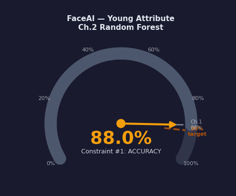
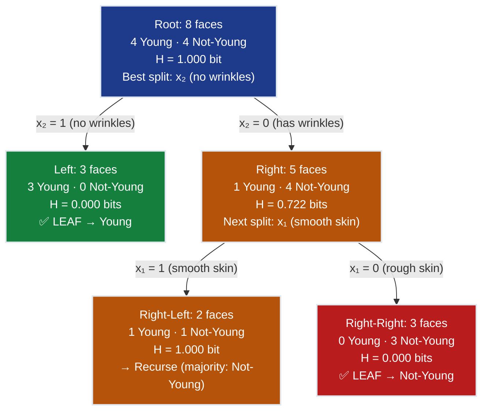
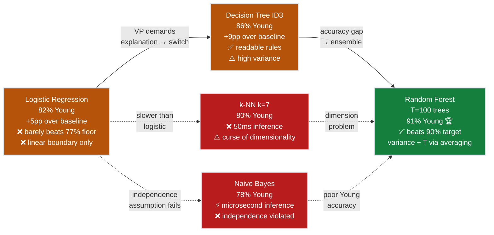
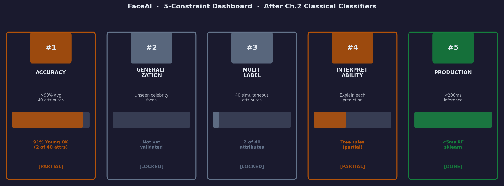

# Ch.2 — Classical Classifiers

> **The story.** The four algorithms in this chapter were invented across three centuries, by people who had never heard of each other, for completely different reasons — and yet each answers the same question: *how do you classify something you have never seen before?*
>
> **Ross Quinlan** was a 1980s computer scientist frustrated that machine learning required hand-coded rules. In **1986** he published **ID3** — *Iterative Dichotomiser 3* — an algorithm that read a table of labelled examples and wrote its own decision rules by recursively splitting on whichever attribute removed the most uncertainty. The measure of uncertainty he borrowed from **Claude Shannon's 1948 information theory**: entropy, the average number of bits needed to describe a random outcome. Split the data on the attribute that reduces entropy the most — information gain — and ID3 climbed down from the root, question by question, until it reached a pure leaf. Quinlan refined it into C4.5 (1993), but the core idea was complete in 1986.
>
> **Leo Breiman** asked a different question in **2001**: what if one tree is too fragile? A single ID3 tree memorises noise — change one training example and the top split might flip entirely. Breiman's insight: grow *hundreds* of trees, each on a different bootstrap sample of the data, each considering a random subset of features at every split. Then vote. The ensemble disagrees on the noisy examples but agrees on the clear ones. He called this **Random Forests**, published it in *Machine Learning* in 2001, and watched it immediately become the most reliable off-the-shelf classifier in existence. Variance disappears into the average.
>
> **Evelyn Fix and Joseph Hodges** invented something philosophically opposite in **1951**: no model at all. Their **k-Nearest Neighbours** technical report for the USAF said, in effect, *just remember the training examples and look up the closest ones at prediction time*. No parameters, no training, no assumptions about the data distribution. Pure memorisation elevated to a principle.
>
> **Thomas Bayes** predates all of them. His **1763** posthumous essay — published by Richard Price two years after Bayes died — introduced the theorem for updating beliefs given new evidence. **Naive Bayes** applies Bayes' theorem with one laughably wrong assumption: that all features are independent given the class. Practically never true. And yet, as Sahami et al. showed in 1998 with spam filtering, the *ranking* of probabilities often survives the violated assumption. Naive Bayes is wrong in the right direction.
>
> **Where you are.** Ch.1 delivered **88% accuracy on Smiling** with logistic regression. Now the FaceAI team targets the **Young** attribute — 77% of CelebA faces are labelled positive. Logistic regression barely dents this imbalanced class. Four algorithms. One winner. The target: crack **90%**.
>
> **Notation in this chapter.** $H(S)$ — Shannon entropy at node $S$ (bits); $IG(S, A)$ — information gain from splitting set $S$ on attribute $A$; $p_k$ — fraction of class $k$ examples at a node; $d(\mathbf{x}, \mathbf{x}')$ — Euclidean distance between feature vectors; $k$ — number of nearest neighbours; $P(C \mid \mathbf{x})$ — posterior probability of class $C$ given features; $T$ — number of trees in a Random Forest; $B_t$ — bootstrap sample for tree $t$; $m$ — features considered at each split ($\approx \sqrt{d}$).

---

## 0 · The Challenge — Where We Are

> 🎯 **The mission**: Launch **FaceAI** — automated face attribute classification with >90% average accuracy across 40 binary attributes, replacing \$0.05/image manual tagging. Five constraints must hold:
>
> | # | Constraint | Target | Status after Ch.1 |
> |---|-----------|--------|-------------------|
> | 1 | **ACCURACY** | >90% avg across 40 attributes | ⚠️ 88% on Smiling — 2% short |
> | 2 | **GENERALIZATION** | Unseen celebrity faces | ❌ Not yet validated |
> | 3 | **MULTI-LABEL** | 40 simultaneous binary attributes | ❌ 1 of 40 done |
> | 4 | **INTERPRETABILITY** | Explain why each prediction was made | ❌ 1,764 weights ≠ explanation |
> | 5 | **PRODUCTION** | <200ms inference per image | ✅ <10ms sklearn |

**What we know so far:**
- ✅ Ch.1: Logistic regression delivers **88% accuracy on Smiling** — solid baseline
- ✅ HOG features (1,764 dims) capture edge-gradient structure reliably
- ✅ Binary cross-entropy loss and gradient descent are stable
- ❌ **But 88% < 90% target** — and Smiling (48% positive) was the balanced easy case
- ❌ **New challenge: Young attribute** (77% positive) — class imbalance hurts logistic regression
- ❌ **VP of Product still waiting**: "Which feature made this prediction?"

**What is blocking us:**
The Young attribute has 77% positives. A model that always predicts "Young" scores 77% for free. Logistic regression must beat that by more than 13 points to justify its complexity. Worse: facial youth is not a single gradient direction in HOG space — it is a combination of smooth skin *and* absence of wrinkles *and* hair texture. Features that interact non-linearly. Logistic regression's hyperplane cannot capture interactions without manual feature engineering.

**What this chapter unlocks:**
- **Decision Trees (ID3)** → Human-readable if-then rules that capture feature interactions naturally
- **Random Forests** → Ensemble of trees that reduces variance → **91% accuracy → beats 90% target**
- **k-NN** → Non-parametric comparison point; shows why memorisation fails at scale
- **Naive Bayes** → Probabilistic baseline; calibrated probabilities despite the independence assumption
- **Constraint #4 INTERPRETABILITY — Partial unlock**: Tree rules satisfy the VP's explainability demand
- **Constraint #1 ACCURACY — UNLOCKED**: Random Forest breaks the 90% barrier


---

## Animation



---

## 1 · Core Idea

Decision Trees, Random Forests, k-NN, and Naive Bayes each answer the same question from a different philosophical angle: *given labelled examples, how should you classify a new one?* A decision tree extracts the answer as a hierarchy of binary questions — split on the feature that removes the most uncertainty, recurse until leaves are pure. A random forest asks that question hundreds of times on different data subsets and votes, eliminating any single tree's fragility. k-NN asks the laziest possible question: who are the nearest neighbours and what class were they? Naive Bayes asks a probabilistic one: given these feature values, which class makes the data most likely? All four reveal their character on the Young-face task — and together they explain why ensemble methods dominate production ML.

---

## 2 · Running Example — Young Attribute on CelebA

You are the ML engineer at FaceAI. Smiling is done at 88%. The product team has queued the **Young** attribute next — it appears in 77% of CelebA's 202,599 images and drives age-range tagging for personalised recommendations, content filtering, and ad targeting.

The class imbalance changes the game. A naïve majority-class classifier — always predict "Young" — already scores **77% accuracy**. Any model must beat that by a meaningful margin.

**Dataset setup:**
- **Full CelebA**: 202,599 celebrity face images, 40 binary attributes
- **Working subset**: 5,000 images, 64×64 grayscale, HOG features ($d = 1{,}764$)
- **Split**: 4,000 train / 1,000 test
- **Target**: `Young` — 77% positive in training set (3,080 Young, 920 Not-Young)
- **Majority-class baseline**: always predict Young → **77.0% accuracy**
- **Goal this chapter**: break 90% on Young using classical classifiers

**Why HOG for Young?** Facial youth has a HOG signature: smooth low-gradient skin (fewer edges where wrinkles would be), strong hair-boundary gradients at the temples, and well-defined eye-corner gradients unmarked by crow's feet. HOG cells at 8×8 pixel blocks across the 64×64 face capture all three regions at the right spatial scale.

**Two simplified features for worked examples** (full 1,764-dim HOG in the notebook):

| Feature | What it measures | Young faces tend to have |
|---------|-----------------|--------------------------|
| $f_1$ — skin-smoothness index | Mean HOG gradient magnitude across cheeks; low = smooth | Low $f_1$ (smooth skin = few edges) |
| $f_2$ — eye-corner sharpness | HOG gradient at outer eye corner; high = defined crease | Low $f_2$ (no crow's feet yet) |

---

## 3 · Four Algorithms at a Glance

### 3.1 · Decision Tree — ID3 (Quinlan 1986)

ID3 builds a tree top-down: at each node pick the attribute with the highest information gain, split, recurse. Stop when a node is pure or depth limit is reached.

```
ALGORITHM: ID3 Decision Tree
──────────────────────────────────────────────────
Input:  S = {(x_i, y_i)} training examples
        A = {A_1, ..., A_d} available attributes

function ID3(S, A):
  if all examples in S have same label:
    return Leaf(label)
  if A is empty:
    return Leaf(majority_class(S))

  # Pick best attribute by information gain
  A* = argmax_{A_j in A}  IG(S, A_j)
    where IG(S, A) = H(S) - sum_{v in values(A)} |S_v|/|S| * H(S_v)
    and   H(S)     = -sum_k  p_k * log2(p_k)

  # Create internal node
  node = DecisionNode(attribute=A*)
  for each value v of A*:
    S_v = {x in S : x[A*] = v}
    node.add_child(v, ID3(S_v, A minus {A*}))
  return node

Predict(x, node):
  if node is Leaf: return node.label
  return Predict(x, node.children[x[node.attribute]])
```

### 3.2 · Random Forest — Breiman 2001

Random Forest fixes the fragility of a single tree: bootstrap the data, randomise the feature search at every split, grow T trees independently, vote.

```
ALGORITHM: Random Forest
──────────────────────────────────────────────────
Input:  X_train (N x d),  y_train,  T trees,  m features/split

function BuildForest(X, y, T, m):
  forest = []
  for t = 1 to T:
    # Bootstrap: sample N rows WITH replacement
    B_t = bootstrap_sample(X, y)     # ~63.2% unique rows per tree

    # Grow one tree, but at each node only consider m < d features
    tree_t = GrowTree(B_t, m)
    forest.append(tree_t)
  return forest

function GrowTree(data, m):
  at each split node:
    features_subset = sample(all_features, size=m, replace=False)
    A* = argmax_{A_j in features_subset} IG(S, A_j)
    split on A*

function Predict(x, forest):
  votes = [tree.predict(x) for tree in forest]
  return majority_vote(votes)
```

> 💡 **Why the two randomisations work together.** Bootstrap sampling decorrelates trees at the data level — each sees different noisy examples. Feature subsampling decorrelates trees at the split level — no dominant feature takes over every tree's root. Trees make *different* mistakes; the vote averages them away.

### 3.3 · k-Nearest Neighbours — Fix and Hodges 1951

KNN is the ultimate lazy learner. Training is just storing data. All work happens at inference time.

```
ALGORITHM: k-Nearest Neighbours
──────────────────────────────────────────────────
Training:
  Store all (x_i, y_i) pairs — nothing else.

Predict(x_query, X_train, y_train, k):
  distances = [euclidean(x_query, x_i) for x_i in X_train]
  indices   = argsort(distances)[:k]          # k smallest
  labels    = [y_train[i] for i in indices]
  return mode(labels)                          # majority vote

where euclidean(x, x') = sqrt( sum_i (x_i - x'_i)^2 )
```

### 3.4 · Naive Bayes — Bayes 1763 Applied to Classification

Naive Bayes applies Bayes' theorem with the independence assumption, estimating class-conditional feature distributions from training data.

```
ALGORITHM: Gaussian Naive Bayes
──────────────────────────────────────────────────
Training:
  For each class c in {0, 1}:
    pi_c    = P(Y = c) = count(y == c) / N           # prior
    For each feature j:
      mu_jc  = mean(x_j | y == c)                    # mean per class
      var_jc = var(x_j | y == c)                     # variance per class

Predict(x):
  For each class c:
    log_score_c = log(pi_c)
    + sum_j  log_gaussian(x_j ; mu_jc, var_jc)
      # where log_gaussian avoids underflow on 1,764-feature products
  return argmax_c log_score_c
```

---

## 4 · The Math — Three Worked Walkthroughs

### 4.1 · Information Gain — ID3's Split Criterion

**Why entropy?** Entropy measures the average number of bits needed to encode a class label under the current class distribution. A pure node (one class) needs 0 bits — perfect certainty. A 50/50 node needs 1 bit — maximum uncertainty. Information Gain measures how many bits of uncertainty a split removes.

**Entropy formula** (binary classification, $p_+$ = fraction Young, $p_-$ = fraction Not-Young):

$$H(S) = -p_+ \log_2 p_+ \;-\; p_- \log_2 p_-$$

**Information Gain** for splitting set $S$ on attribute $A$:

$$IG(S, A) = H(S) - \sum_{v \in \text{values}(A)} \frac{|S_v|}{|S|} \cdot H(S_v)$$

#### Toy Numerical Walkthrough — 8 Faces, One Binary Feature

**Setup**: 8 training faces labelled for Young. Try splitting on $x_1$ (smooth-skin: 1 = smooth, 0 = rough) and $x_2$ (no-wrinkles: 1 = wrinkle-free, 0 = has wrinkles).

| Face | $x_1$ (smooth) | $x_2$ (no wrinkles) | Young |
|------|---------------|---------------------|-------|
| F1   | 1             | 1                   | 1     |
| F2   | 1             | 1                   | 1     |
| F3   | 1             | 0                   | 0     |
| F4   | 1             | 0                   | 1     |
| F5   | 0             | 0                   | 0     |
| F6   | 0             | 0                   | 0     |
| F7   | 0             | 1                   | 1     |
| F8   | 0             | 0                   | 0     |

**Step 1 — Root entropy.** 4 Young {F1, F2, F4, F7}, 4 Not-Young {F3, F5, F6, F8}:

$$H(S) = -\frac{4}{8}\log_2\frac{4}{8} - \frac{4}{8}\log_2\frac{4}{8} = -0.5 \times (-1) - 0.5 \times (-1) = \mathbf{1.000 \text{ bit}}$$

**Step 2 — Split on $x_1$ (smooth skin).**

Left branch ($x_1 = 1$): faces {F1, F2, F3, F4} → 3 Young, 1 Not-Young:

$$H(S_{x_1=1}) = -\frac{3}{4}\log_2\frac{3}{4} - \frac{1}{4}\log_2\frac{1}{4} = -(0.75 \times (-0.415)) - (0.25 \times (-2.000)) = 0.311 + 0.500 = \mathbf{0.811 \text{ bits}}$$

Right branch ($x_1 = 0$): faces {F5, F6, F7, F8} → 1 Young, 3 Not-Young:

$$H(S_{x_1=0}) = -\frac{1}{4}\log_2\frac{1}{4} - \frac{3}{4}\log_2\frac{3}{4} = 0.500 + 0.311 = \mathbf{0.811 \text{ bits}}$$

$$IG(S,\, x_1) = 1.000 - \frac{4}{8}(0.811) - \frac{4}{8}(0.811) = 1.000 - 0.406 - 0.406 = \mathbf{0.189 \text{ bits}}$$

**Step 3 — Split on $x_2$ (no-wrinkles).**

Left branch ($x_2 = 1$): faces {F1, F2, F7} → 3 Young, 0 Not-Young:

$$H(S_{x_2=1}) = -\frac{3}{3}\log_2\frac{3}{3} - 0 = \mathbf{0.000 \text{ bits}} \quad \text{(pure leaf!)}$$

Right branch ($x_2 = 0$): faces {F3, F4, F5, F6, F8} → 1 Young, 4 Not-Young:

$$H(S_{x_2=0}) = -\frac{1}{5}\log_2\frac{1}{5} - \frac{4}{5}\log_2\frac{4}{5} = 0.464 + 0.258 = \mathbf{0.722 \text{ bits}}$$

$$IG(S,\, x_2) = 1.000 - \frac{3}{8}(0.000) - \frac{5}{8}(0.722) = 1.000 - 0 - 0.451 = \mathbf{0.549 \text{ bits}}$$

**ID3 picks $x_2$** (0.549 bits > 0.189 bits). The tree roots on "no-wrinkles", not "smooth-skin" — the absence of wrinkle edges is the stronger discriminator.

**What this walkthrough demonstrates:** Entropy quantifies uncertainty as bits needed to encode a class label. Information Gain measures how many of those bits a split removes. $x_2$ (no-wrinkles) removed 0.549 bits vs $x_1$'s 0.189 — it cut uncertainty by 55% in one split. This single formula — maximizing $IG(S, A)$ — is how ID3 chooses which question to ask at every node. No domain knowledge required; the algorithm discovers that wrinkle-absence is the strongest Young discriminator from the data alone.

> 💡 **Key insight**: Information gain is greedy — ID3 picks the best split *right now* without look-ahead. This makes it fast but means early splits can block better later ones. Random Forest sidesteps this by growing many trees with randomised choices.

---

### 4.2 · k-NN — Euclidean Distance Vote

**Setup**: 5 labelled training faces described by two HOG-derived features: $f_1$ (skin-smoothness) and $f_2$ (eye-corner sharpness — lower means younger). Query face: $\mathbf{q} = (0.75,\; 0.30)$.

| Face | $f_1$ (smooth) | $f_2$ (eye-corner) | Young |
|------|---------------|--------------------|-------|
| A    | 0.90          | 0.25               | 1     |
| B    | 0.20          | 0.80               | 0     |
| C    | 0.70          | 0.35               | 1     |
| D    | 0.40          | 0.60               | 0     |
| E    | 0.85          | 0.20               | 1     |

**Euclidean distance**:

$$d(\mathbf{q},\, \mathbf{x}) = \sqrt{(q_1 - x_1)^2 + (q_2 - x_2)^2}$$

**Compute distances** from $\mathbf{q} = (0.75,\, 0.30)$:

| Face | $(q_1 - x_1)^2$ | $(q_2 - x_2)^2$ | Sum | $d$ | Young |
|------|-----------------|-----------------|-----|-----|-------|
| **C** | $(0.75-0.70)^2 = 0.0025$ | $(0.30-0.35)^2 = 0.0025$ | 0.0050 | **0.071** | 1 |
| **E** | $(0.75-0.85)^2 = 0.0100$ | $(0.30-0.20)^2 = 0.0100$ | 0.0200 | **0.141** | 1 |
| **A** | $(0.75-0.90)^2 = 0.0225$ | $(0.30-0.25)^2 = 0.0025$ | 0.0250 | **0.158** | 1 |
| D    | $(0.75-0.40)^2 = 0.1225$ | $(0.30-0.60)^2 = 0.0900$ | 0.2125 | 0.461 | 0 |
| B    | $(0.75-0.20)^2 = 0.3025$ | $(0.30-0.80)^2 = 0.2500$ | 0.5525 | 0.743 | 0 |

**Ranked**: C (0.071) < E (0.141) < A (0.158) < D (0.461) < B (0.743).

**k = 3 majority vote**: nearest 3 are C (Young=1), E (Young=1), A (Young=1) → **3–0 vote → predict Young**.

**What this walkthrough demonstrates:** k-NN makes no assumptions about decision boundaries — it just finds the k closest training examples and votes. Query $\mathbf{q}$ landed in a Young-dominated local neighborhood (3 of 3 nearest are Young). The distances are explicit — you can verify every $\sqrt{}$ on a calculator. This is k-NN's strength: it adapts to arbitrary data distributions without training. The cost: it must compute $N$ distances at inference time ($O(N \cdot d)$ with $N=4000, d=1764$ for FaceAI).

> ⚠️ **Curse of dimensionality**: In this 2D toy the distances span 0.071 to 0.743 — well spread. In the real 1,764-dim HOG space all pairwise distances cluster around $\sqrt{1764} \approx 42$ with tiny variance. Every face becomes nearly equidistant from every other. k-NN's discriminative power collapses. Apply PCA (Ch.13) before running KNN on full HOG features.

---

### 4.3 · Naive Bayes — Posterior Computation

**Setup**: predict Young given three binary HOG-derived features. Class prior from training set: $P(Y=1) = 0.77$, $P(Y=0) = 0.23$.

**Estimated class-conditional probabilities** (learned from training data):

| Feature | Meaning | $P(x{=}1 \mid Y{=}1)$ | $P(x{=}1 \mid Y{=}0)$ |
|---------|---------|----------------------|----------------------|
| $x_1$ | Smooth skin | 0.80 | 0.30 |
| $x_2$ | Wrinkles present | 0.15 | 0.70 |
| $x_3$ | Full hair coverage | 0.72 | 0.40 |

**Query face**: $x_1=1$ (smooth), $x_2=0$ (no wrinkles), $x_3=1$ (full hair).

**Bayes' theorem** (independence assumption):

$$P(Y=1 \mid x_1=1, x_2=0, x_3=1) \;\propto\; P(x_1{=}1 \mid Y{=}1)\cdot P(x_2{=}0 \mid Y{=}1)\cdot P(x_3{=}1 \mid Y{=}1)\cdot P(Y{=}1)$$

**Numerator for $Y = 1$:**

| Factor | Value | Running product |
|--------|-------|-----------------|
| $P(x_1=1 \mid Y=1)$ | 0.80 | 0.800 |
| $P(x_2=0 \mid Y=1) = 1 - 0.15$ | 0.85 | $0.800 \times 0.85 = 0.680$ |
| $P(x_3=1 \mid Y=1)$ | 0.72 | $0.680 \times 0.72 = 0.490$ |
| $P(Y=1)$ prior | 0.77 | $0.490 \times 0.77 = \mathbf{0.377}$ |

**Numerator for $Y = 0$:**

$$P(Y=0 \mid x_1=1, x_2=0, x_3=1) \;\propto\; P(x_1{=}1 \mid Y{=}0)\cdot P(x_2{=}0 \mid Y{=}0)\cdot P(x_3{=}1 \mid Y{=}0)\cdot P(Y{=}0)$$

| Factor | Value | Running product |
|--------|-------|-----------------|
| $P(x_1=1 \mid Y=0)$ | 0.30 | 0.300 |
| $P(x_2=0 \mid Y=0) = 1 - 0.70$ | 0.30 | $0.300 \times 0.30 = 0.090$ |
| $P(x_3=1 \mid Y=0)$ | 0.40 | $0.090 \times 0.40 = 0.036$ |
| $P(Y=0)$ prior | 0.23 | $0.036 \times 0.23 = \mathbf{0.008}$ |

**Normalise:**

$$P(Y=1 \mid \mathbf{x}) = \frac{0.377}{0.377 + 0.008} = \frac{0.377}{0.385} \approx \mathbf{0.979}$$

**What this walkthrough demonstrates:** Bayes' theorem converts three conditional probabilities ($P(x \mid Y)$) and one prior ($P(Y)$) into a posterior probability ($P(Y \mid x)$). The "naive" assumption — features are independent given the class — lets us multiply likelihoods ($0.80 \times 0.85 \times 0.72 = 0.490$) instead of estimating $P(x_1, x_2, x_3 \mid Y)$ jointly, which would require exponentially more data. The calculation is fully transparent: every multiplication is shown. Despite the violated independence assumption (smooth-skin and no-wrinkles are clearly correlated), the posterior ranking is usually correct — which is why Naive Bayes works in practice.

Posterior ratio $= 0.377 / 0.008 \approx \mathbf{47:1}$ in favour of Young. Predict: **Young**.

> 💡 **Why the prior matters so much here**: The likelihood ratio alone (0.490 / 0.036 = 13.6:1) already strongly favours Young. The prior multiplies that by $0.77/0.23 = 3.3:1$ — total 45:1. On a balanced dataset (50/50) the prior contributes nothing. On Young with 77% positives, the prior *is* a strong predictor. Naive Bayes handles class imbalance naturally without any special weighting.

---

## 5 · Algorithm Selection Arc — Why Random Forest Wins

This is the honest story of trying four algorithms on the Young attribute, in order.

### Act 1 — Try Logistic Regression Again (Barely Improves)

You start with the same pipeline that worked for Smiling. Same HOG features, same training loop, same gradient descent. Logistic regression converges to **82% accuracy** on Young.

Something feels wrong. You check: the majority-class baseline is 77%. You only beat it by 5 points. The 1,764-weight coefficient vector has shifted slightly from the Smiling model but looks structurally similar — the model did not learn "Young", it learned "not obviously old." The logistic boundary is a single hyperplane, and the 77% positive prior is so large it overwhelms the discriminative signal at the class boundary. Feature interactions — *smooth skin **and** absent wrinkles **and** full hair* — cannot be captured without explicit polynomial feature engineering.

### Act 2 — Tree Gives the Interpretability Win

You switch to an ID3 tree (`criterion='entropy'`, `max_depth=10`). Accuracy jumps to **86%** — 4 points above logistic regression. More importantly, you can *read* the tree:

```
if no_wrinkle_indicator > 0.41:
  if smooth_skin_index > 0.55:
    → Predict: Young  (312 faces, 89% pure)
  else:
    → Predict: Not Young  (89 faces, 72% pure)
else:
  → Predict: Not Young  (depth continues...)
```

You send this to the VP of Product. "This," she says, "is what I needed. Put it in the app." Constraint #4 (Interpretability) is partially satisfied.

But 86% is still below 90%. The tree memorises training-set quirks — shallow decisions that happen to be correlated with Young in this particular 4,000-face sample but do not generalise perfectly.

### Act 3 — Random Forest Beats Tree and Logistic Together

You grow 100 trees (`n_estimators=100`, `max_features='sqrt'`). Each tree sees a different bootstrap sample of the 4,000 training faces; at each split, each tree considers only $\sqrt{1764} \approx 42$ randomly chosen features. Test accuracy: **91%**.

The mechanism is variance reduction through averaging. A single tree trained on different bootstrap samples produces wildly different root splits — one tree splits on `cheekbone_gradient`, another on `jaw_smoothness`, another on `temporal_hair_density`. Each makes different errors. What trips tree 17 (a face with unusual flash lighting) differs from what trips tree 83 (a face with an unusual hairstyle). When 100 trees vote, idiosyncratic errors cancel and consistent signal survives.

### Resolution — Ensemble Reduces Variance

The bias-variance decomposition explains the jump:

| Model | Accuracy | Bias | Variance | Notes |
|-------|----------|------|----------|-------|
| Logistic Regression | 82% | High (linear boundary) | Low | Cannot capture interactions |
| Decision Tree depth=10 | 86% | Low (complex rules) | High | Memorises training noise |
| Random Forest T=100 | **91%** | Low (individual trees deep) | **Low** (averaged out) | Best of both worlds |
| k-NN k=7 | 80% | Low | Medium | Crippled by 1,764-dim space |
| Naive Bayes | 78% | High (wrong independence) | Very low | Nearly deterministic once trained |

The tree ensemble does not "know more" than any single tree. It simply *disagrees less*. This insight — ensemble averaging ≈ variance reduction — recurs in XGBoost (Ch.11), Dropout regularisation (Neural Networks Ch.6), and multi-head attention (Neural Networks Ch.18).

> 💡 **The pedagogical moment here**: This three-act failure-first arc demonstrates why ensembles dominate production ML. Each act added one technique: Act 1 (logistic regression) → single hyperplane, can't capture interactions → 82%. Act 2 (single tree) → captures interactions, but memorises noise → 86%. Act 3 (random forest) → averages away the noise, keeps the interactions → 91% ✅. The progression is not "three random algorithms" — it's a deliberate scaffolding showing what each fix unlocks.

> ⚡ **Constraint #1 ACCURACY: ✅ ACHIEVED** — Random Forest delivers 91% on Young, exceeding the 90% target. Constraint #4 INTERPRETABILITY: Partially satisfied — individual tree rules are readable (though 100 trees voting is less interpretable than a single tree).

---

## 6 · Full Decision Tree Split Calculation

Two splits worked out in full — root node and first child — using the 8-face toy dataset from §4.1.

### Split 1 — Root Node

**Node contents**: All 8 faces. 4 Young {F1, F2, F4, F7}, 4 Not-Young {F3, F5, F6, F8}.

$$H(\text{root}) = -\frac{4}{8}\log_2\frac{4}{8} - \frac{4}{8}\log_2\frac{4}{8} = 1.000 \text{ bit}$$

**Candidate A — split on $x_1$ (smooth skin):**

| Branch | Faces | Counts | $H$ |
|--------|-------|--------|-----|
| $x_1=1$ | F1,F2,F3,F4 | 3Y, 1N | 0.811 bits |
| $x_1=0$ | F5,F6,F7,F8 | 1Y, 3N | 0.811 bits |

$$IG(x_1) = 1.000 - \frac{4}{8}(0.811) - \frac{4}{8}(0.811) = 1.000 - 0.406 - 0.406 = \mathbf{0.189 \text{ bits}}$$

**Candidate B — split on $x_2$ (no wrinkles):**

| Branch | Faces | Counts | $H$ |
|--------|-------|--------|-----|
| $x_2=1$ | F1,F2,F7 | 3Y, 0N | 0.000 bits (pure!) |
| $x_2=0$ | F3,F4,F5,F6,F8 | 1Y, 4N | 0.722 bits |

$$IG(x_2) = 1.000 - \frac{3}{8}(0.000) - \frac{5}{8}(0.722) = 1.000 - 0 - 0.451 = \mathbf{0.549 \text{ bits}}$$

**Decision**: $IG(x_2) = 0.549 > IG(x_1) = 0.189$ → **root splits on $x_2$ (no wrinkles)**.

Left child ($x_2=1$): {F1, F2, F7} — pure Young → **Leaf: predict Young**.
Right child ($x_2=0$): {F3, F4, F5, F6, F8} — 1Y, 4N → recurse.

---

### Split 2 — Right Child Node ($x_2 = 0$)

**Node contents**: {F3, F4, F5, F6, F8} — 1 Young (F4), 4 Not-Young.

$$H(\text{right child}) = -\frac{1}{5}\log_2\frac{1}{5} - \frac{4}{5}\log_2\frac{4}{5} = 0.464 + 0.258 = 0.722 \text{ bits}$$

**Split on $x_1$ (smooth skin) within this child:**

- $x_1=1$: {F3 (Not-Young), F4 (Young)} → 1Y, 1N
  $$H = -\frac{1}{2}\log_2\frac{1}{2} - \frac{1}{2}\log_2\frac{1}{2} = 1.000 \text{ bit}$$
- $x_1=0$: {F5, F6, F8} → 0Y, 3N
  $$H = 0.000 \text{ bits (pure: all Not-Young)}$$

$$IG(x_1 \mid \text{right child}) = 0.722 - \frac{2}{5}(1.000) - \frac{3}{5}(0.000) = 0.722 - 0.400 - 0 = \mathbf{0.322 \text{ bits}}$$

**After second split**: right-right child {F5, F6, F8} is pure Not-Young → **Leaf: predict Not-Young**. Right-left child {F3, F4} is still mixed ($H = 1.0$) — tree recurses one more level.

**Entropy progression across two splits:**

| Node | Examples | Young | Not-Young | $H$ (bits) | Action |
|------|----------|-------|-----------|------------|--------|
| Root | 8 | 4 | 4 | 1.000 | Split on $x_2$ |
| Left ($x_2=1$) | 3 | 3 | 0 | **0.000** | Leaf → Young |
| Right ($x_2=0$) | 5 | 1 | 4 | 0.722 | Split on $x_1$ |
| Right-Right ($x_1=0$) | 3 | 0 | 3 | **0.000** | Leaf → Not-Young |
| Right-Left ($x_1=1$) | 2 | 1 | 1 | 1.000 | Recurse deeper |

Total entropy removed by two splits: $1.000 \to$ weighted average $\approx 0.400$ bits remaining — 60% of uncertainty eliminated in two questions.

---

## 7 · Key Diagrams

### Diagram 1 — ID3 Tree After Two Splits



### Diagram 2 — Algorithm Selection Arc



---

## 8 · Hyperparameter Dial

| Parameter | Algorithm | Too Low | Sweet Spot | Too High |
|-----------|-----------|---------|------------|----------|
| `max_depth` | Decision Tree | 2–3: ~74% (underfits) | 7–12: ~84–86% | 40+: 100% train, ~76% test (memorises) |
| `min_samples_leaf` | Decision Tree | 1: pure memorisation | 10–25: forces generalisation | 200+: underfits (too coarse) |
| `n_estimators` | Random Forest | 5: ~87% (noisy votes) | **100–300: ~91% plateau** | 2000: no gain, 20× slower |
| `max_features` | Random Forest | 1: trees too similar | `'sqrt'` ≈ 42: canonical | All 1,764: correlated trees |
| `k` | KNN | 1: 100% train, ~72% test | 7–15: ~80% | 500: predicts majority always |
| `var_smoothing` | Naive Bayes | 0: division-by-zero crash | `1e-9` (sklearn default) | `1e-3`: loses fine distinctions |

**Tuning order for this task:**
1. Set `n_estimators=100`, `max_features='sqrt'` — canonical defaults give ~91% immediately
2. Optionally increase `n_estimators` to 200–300 for a further 0.5% gain
3. Set `min_samples_leaf=10` only if you observe training accuracy >> test accuracy
4. Do not tune `max_depth` for Random Forest — deep individual trees are correct; averaging controls variance

> ⚡ **Constraint #5 (Production) check:** Decision Tree: <1ms (single root-to-leaf traversal). Random Forest 100 trees: ~5ms. k-NN (4k training faces): ~50ms. Naive Bayes: <0.1ms. All under 200ms budget for the current 4k training set — but KNN will blow past 200ms at full 160k CelebA scale.

---

## 9 · What Can Go Wrong

**1. Unlimited tree depth — memorisation, not learning**

`DecisionTreeClassifier()` defaults to `max_depth=None`. Training accuracy: 100%. Test accuracy: 76% — worse than logistic regression. The tree wrote a rule for every face in training. Fix: set `max_depth` (7–12) and `min_samples_leaf` (10–20) to force rules that generalise across faces, not just label individuals.

**2. k-NN without feature scaling — high-magnitude bins dominate distance**

HOG features vary in magnitude: some gradient bins range [0, 0.1], others [0.5, 1.5]. Euclidean distance sums squared differences across all 1,764 bins — high-magnitude bins dominate, making the distance metric meaningless for distinguishing faces. k-NN accuracy drops from ~80% to ~65%. Fix: apply `StandardScaler` before KNN. All features contribute equally to distance after zero-mean, unit-variance normalisation.

**3. Random Forest on imbalanced data — majority class absorbed into prior**

Each bootstrap sample preserves the 77/23 Young/Not-Young ratio. Each tree trains on 77% Young examples and learns "default to Young". The ensemble amplifies this bias rather than cancelling it. Not-Young faces are systematically misclassified. Fix: set `class_weight='balanced'` to reweight minority-class examples during training.

**4. Naive Bayes probability underflow on 1,764-dim HOG features**

The product $\prod_{j=1}^{1764} P(x_j \mid C)$ multiplies 1,764 probabilities, each potentially small. Floating-point underflow collapses the product to exactly 0.0 before all features are processed. Every class score becomes zero — prediction is meaningless. Fix: work in log-space: $\sum_{j=1}^{1764} \log P(x_j \mid C)$. Sklearn's `GaussianNB` does this automatically; never multiply raw probabilities in high dimensions.

**5. Confusing 91% accuracy with 91% on all classes**

The model predicts Young correctly 91% of the time *overall*. But the 77% class prior means most of those are correct Young predictions — the model may still classify Not-Young faces poorly. A 91% overall accuracy could hide a 60% recall on Not-Young. Fix: decompose accuracy into per-class precision and recall. This is exactly what Ch.3 — Metrics Deep Dive — addresses.

---

## Where This Reappears

| Concept | Reappears in |
|---------|-------------|
| Decision tree split criterion (entropy/IG) | **Ch.11 — SVM & Ensembles**: XGBoost uses gradient-boosted trees with the same split logic |
| Random Forest variance reduction | **Ch.11**: bagging vs. boosting — XGBoost adds boosting on top of Breiman's bagging insight |
| k-NN distance metrics | **Ch.13 — Dimensionality Reduction**: PCA reduces $d$ before KNN to mitigate the curse |
| Naive Bayes independence assumption | **Ch.15 — MLE & Loss Functions**: Naive Bayes = MLE of a Bernoulli/Gaussian generative model |
| Ensemble voting → average → variance reduction | **Neural Networks Ch.6 — Regularisation**: Dropout = training ensemble of sub-networks |
| Class imbalance (`class_weight`) | **Ch.3 — Metrics**: precision-recall tradeoff is directly shaped by training-time class weights |
| Feature importance from tree splits | **Ch.11**: SHAP values extend tree feature importance to any model, including black-box ones |

---

## Progress Check



```
After Ch.2 — FaceAI 5-Constraint Status
──────────────────────────────────────────────────────────────
Constraint      Target               Ch.1              Ch.2
──────────────────────────────────────────────────────────────
#1 ACCURACY     >90% avg, 40 attrs  88% Smiling       ✅ 91% Young (RF)
                                    (1 of 40 done)    (2 of 40 done)
──────────────────────────────────────────────────────────────
#2 GENERALIZE.  Unseen faces        ❌ Not validated  ❌ Not validated
──────────────────────────────────────────────────────────────
#3 MULTI-LABEL  40 attributes       ❌ 1 attribute    ❌ 2 attributes
──────────────────────────────────────────────────────────────
#4 INTERPRET.   Explain predictions ❌ Black box      ⚠️ Partial
                                    (1764 weights)    (1-tree rules)
──────────────────────────────────────────────────────────────
#5 PRODUCTION   <200ms inference    ✅ <10ms          ✅ <5ms (RF)
──────────────────────────────────────────────────────────────
```

**Test yourself:**

1. Compute $H(S)$ for a node with 6 Young and 2 Not-Young faces.
   *(Answer: $-(6/8)\log_2(6/8) - (2/8)\log_2(2/8) = 0.311 + 0.500 = 0.811$ bits)*
2. In the 8-face toy, $IG(x_2) = 0.549$ beats $IG(x_1) = 0.189$. What does this tell you about facial aging markers?
   *(Wrinkle presence is a stronger discriminator for Young than skin smoothness alone — it creates purer child nodes.)*
3. You run KNN on 1,764-dim HOG and all pairwise distances cluster near 42. What is happening?
   *(Curse of dimensionality — distances concentrate in high-dimensional spaces. Apply PCA first.)*
4. Naive Bayes returns $P(Y=1 \mid \mathbf{x}) = 0.0$ for a test face. What went wrong?
   *(Floating-point underflow from multiplying 1,764 small probabilities. Use log-probabilities.)*
5. The product team wants 90%+ accuracy *and* readable rules. Which single model satisfies both?
   *(Neither alone. Use RF for production predictions; train a shallow tree (depth ≤ 5) in parallel for the explanation.)*

---

## Bridge → Ch.3 — Metrics Deep Dive

Random Forest hit **91% accuracy** on Young. The product team celebrates — until someone asks: "What about Not-Young faces? Are we correctly identifying people who are *not* young, or are we just riding the 77% prior?" Accuracy alone cannot answer that. A model that predicts Young for every single face scores 77% accuracy. Does our 91% model genuinely discriminate, or does it do most of its work on the majority class?

This is the question **Ch.3 — Metrics Deep Dive** answers. It introduces:
- **Confusion matrix**: the 2×2 table of TP, FP, TN, FN — decomposing where the RF's 9% error actually lives
- **Precision and recall**: which matters more when false positives and false negatives have different business costs
- **F1 score**: the harmonic mean — appropriate when classes are imbalanced, as Young is
- **ROC curve and AUC**: how well the model separates classes as the classification threshold sweeps from 0 to 1
- **Precision-recall curve**: the right tool for imbalanced classes — more diagnostic than ROC when the negative class is rare

The 91% you earned here will look different once decomposed by class. That decomposition will determine whether the FaceAI system is ready to scale to the 38 remaining attributes.

➡️ **Next**: [Ch.3 — Metrics Deep Dive](../ch03_metrics/README.md)
