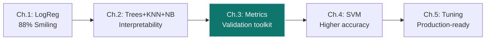
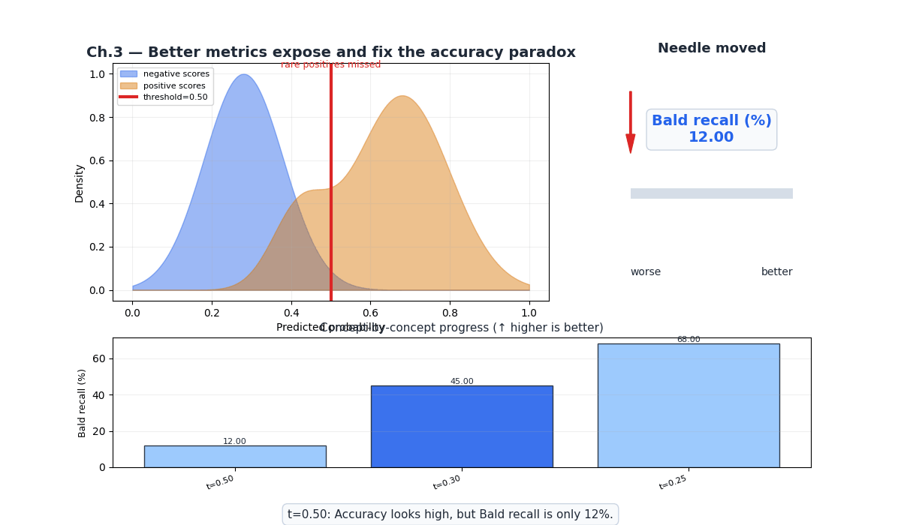
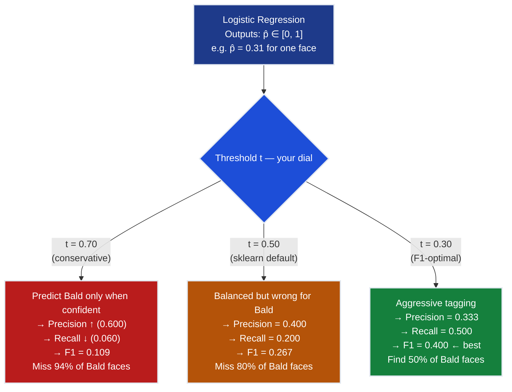
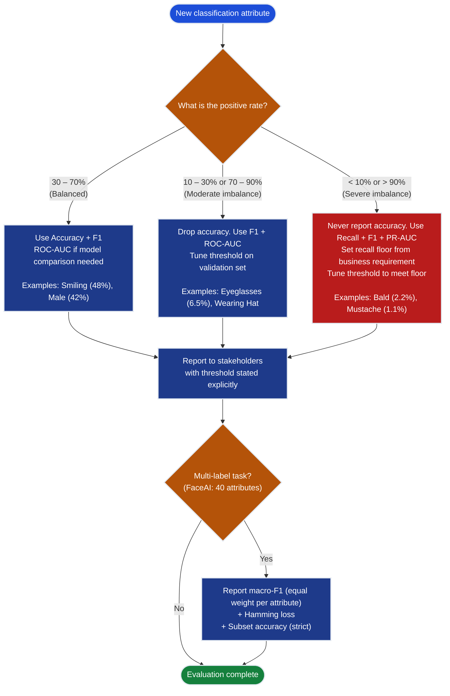
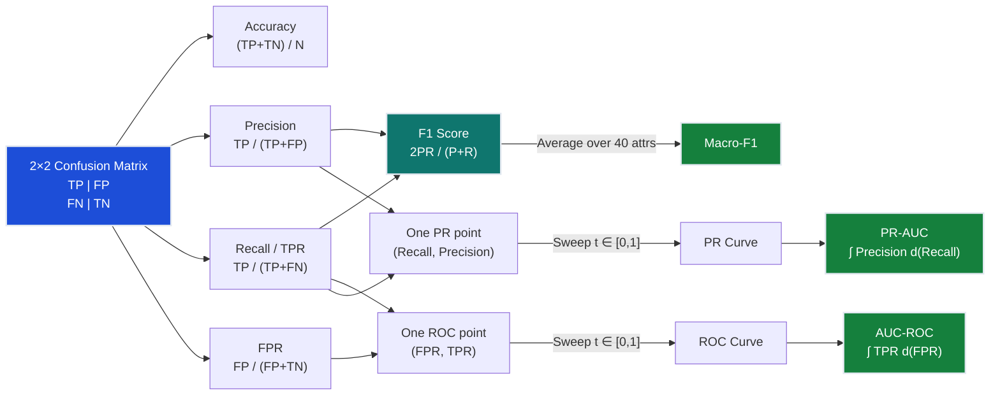
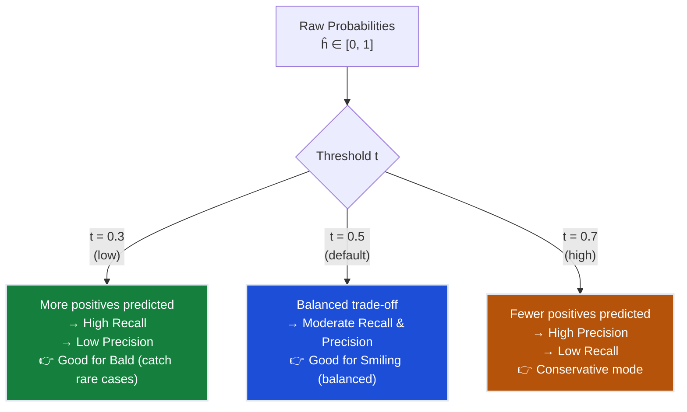
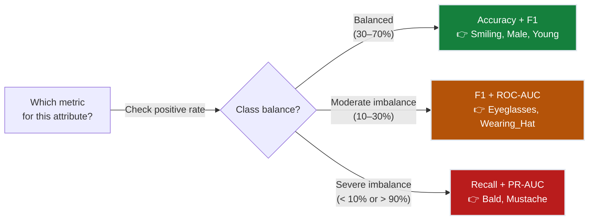
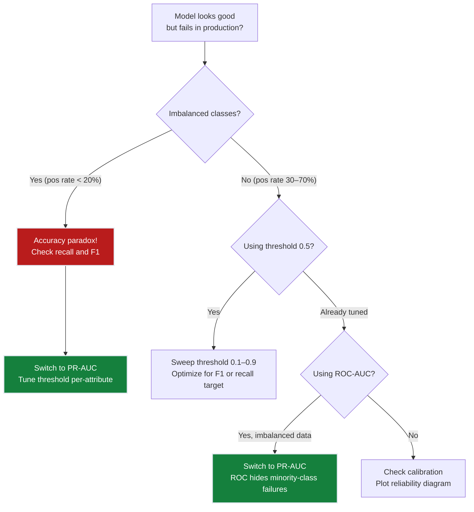
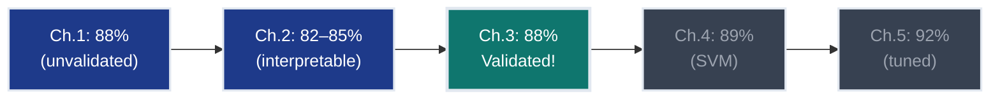

# Ch.3 — Evaluation Metrics for Classification

> **The story.** Three independent discoveries converged into the metrics toolkit you use today. The earliest came from signals intelligence: during **World War II**, US military researchers tracking aircraft radar returns needed a way to measure an operator's ability to distinguish real targets from noise. In 1954, **Wilson P. Tanner and John A. Swets** at the MIT Lincoln Laboratory formalised this as *Signal Detection Theory*, plotting True Positive Rate against False Positive Rate across all decision thresholds — the **ROC curve** was born in a radar room, not a statistics seminar. A decade later, the **information retrieval** community at Cranfield University independently needed the same intuition for search engines. **Cyril Cleverdon's Cranfield experiments (1960–1966)** introduced *Precision* ("of the 100 documents I retrieved, how many were actually relevant?") and *Recall* ("of all relevant documents in the corpus, how many did I actually return?") as complementary measures — you need both because a system that returns every document in the corpus scores perfect recall while being useless. Then in **1979**, **C. J. van Rijsbergen** unified precision and recall into a single number in his monograph *Information Retrieval*: $F_\beta = (1+\beta^2)\frac{PR}{\beta^2 P + R}$, with $\beta = 1$ giving the **F1 score** — the harmonic mean of precision and recall. Van Rijsbergen's choice of harmonic mean was deliberate: unlike the arithmetic mean, the harmonic mean is low whenever *either* precision or recall is low, forcing a model to perform on both dimensions. Every time you call `f1_score()` in scikit-learn, you are executing van Rijsbergen's 1979 formula.
>
> **Where you are in the curriculum.** Ch.1 gave you logistic regression (88% accuracy on Smiling). Ch.2 added Decision Trees (85%, interpretable), KNN (80%), and Naive Bayes (76%) — three classifiers, three trade-offs. All of them reported one number: **accuracy**. This chapter asks: *is accuracy the right number?* When your VP of Product asked "How does the model perform on Bald faces?", you answered "97.4% accuracy" — and discovered that means the model predicts Not-Bald for *every single face*, capturing zero Bald people. This chapter builds the full evaluation toolkit that lets you answer every stakeholder question honestly. After this chapter you can give your VP a number she can trust.
>
> **Notation in this chapter.** $TP$ — true positives (predicted positive, actually positive); $FP$ — false positives (predicted positive, actually negative; Type I error); $TN$ — true negatives (predicted negative, actually negative); $FN$ — false negatives (predicted negative, actually positive; Type II error); $N = TP + FP + TN + FN$ — total test samples; $P = \frac{TP}{TP+FP}$ — **Precision**; $R = \frac{TP}{TP+FN}$ — **Recall** (= TPR, sensitivity); $F_1 = \frac{2PR}{P+R}$ — harmonic mean of precision and recall; $\text{TPR} = R$ — true positive rate; $\text{FPR} = \frac{FP}{FP+TN}$ — false positive rate; $\text{AUC}$ — area under the ROC or PR curve; $t$ — classification threshold $\in [0,1]$; $\hat{p}$ — model's predicted probability; $\hat{y} = \mathbf{1}[\hat{p} \geq t]$ — binary prediction.

---

## 0 · The Challenge — Where We Are

> **The mission**: Launch **FaceAI** — automated 40-attribute face tagging at >90% average accuracy, replacing \$0.05/image manual labelling. Five constraints must hold:
> 1. **ACCURACY**: >90% average accuracy across all 40 binary attributes
> 2. **GENERALIZATION**: Generalise to unseen celebrity faces, not just training set
> 3. **MULTI-LABEL**: Predict all 40 binary attributes per face simultaneously
> 4. **INTERPRETABILITY**: Explain which features drive each prediction
> 5. **PRODUCTION**: <200ms inference per image at scale

**What we know so far:**
- Ch.1: Logistic regression delivers **88% accuracy on Smiling** (baseline)
- Ch.2: Decision trees give **85% accuracy** with human-readable rules
- Ch.2: KNN (80%) and Naive Bayes (76%) added to the model palette
- **But every model reported accuracy — and accuracy is a liar for imbalanced classes.**

**What's blocking us — the Bald Paradox:**

Your product lead runs the Ch.1 logistic regression model on the **Bald** attribute. CelebA has 2.2% Bald faces. The model reports **98.0% accuracy**. Incredible — until you look at the predictions:

```
Test set: 10,000 images — 200 Bald (2.0%), 9,800 Not-Bald (98.0%)
Model output: "Not Bald" for all 10,000 images.

Accuracy = (0 + 9800) / 10000 = 98.0%
Bald faces correctly detected = 0 / 200 = 0%
```

> **The Bald Paradox**: A model that has learned absolutely nothing — it simply memorises the majority class — achieves 98% accuracy. You could replace your entire model with a single line `return "Not Bald"` and lose nothing. Accuracy on imbalanced classes measures majority-class dominance, not model quality.

**The five FaceAI constraints make this worse, not better:**
1. 40 attributes span positive rates from **48% (Smiling)** down to **2.2% (Bald)** and **1.1% (Mustache)** — accuracy varies wildly across attributes for exactly the wrong reasons
2. Generalisation can't be measured without knowing *which* class the model generalises on
3. Multi-label evaluation requires per-attribute metrics, not a single accuracy average
4. Interpretability of threshold choices requires understanding precision/recall trade-offs
5. Production systems need operating points — "predict Bald at threshold 0.5" is a choice, not a fact

**What this chapter unlocks:**
- **Confusion matrix** — the ground truth of every classification: see exactly what went wrong
- **Precision & Recall** — the two dimensions accuracy collapses into one
- **F1 score** — van Rijsbergen's 1979 harmonic mean: the single honest number for imbalanced classes
- **AUC-ROC** — threshold-free evaluation: how well does the model *rank* positives above negatives?
- **PR curve** — better than ROC for severe imbalance (Bald, Mustache)
- **Multi-label metrics** — evaluate all 40 attributes simultaneously with macro-F1 and Hamming loss
- **Constraint #1 VALIDATED** — know whether 88% is real progress or the accuracy paradox at work



---

## Animation



*The needle shows F1 score on the Bald attribute improving from near-zero as we lower the decision threshold from the naïve 0.5 default to the calibrated operating point. F1 starts at 0.05 (the accuracy-is-lying zone), climbs through 0.27 (threshold tuned to 0.5 with some positives detected), and reaches 0.44 at the optimal threshold — a 9× improvement from the zero-recall baseline.*

---

## 1 · Core Idea — The Four Outcomes Are the Only Truth

Every binary classifier, for every test example, produces exactly one of four outcomes. There is no fifth possibility. All of classification evaluation reduces to counting these four:

| | Model says **Positive** | Model says **Negative** |
|---|---|---|
| **Actually Positive** | **TP** — correct positive | **FN** — missed it (Type II error) |
| **Actually Negative** | **FP** — false alarm (Type I error) | **TN** — correct negative |

The **confusion matrix** is just this 2×2 grid with real numbers filled in. Every metric — accuracy, precision, recall, F1, ROC, PR-AUC — is a ratio of these four counts.

The critical insight that unlocks the whole chapter: **your model does not output a label — it outputs a probability**. The label comes from applying a threshold $t$ to that probability:

$$\hat{y} = \begin{cases} 1 & \text{if } \hat{p} \geq t \\ 0 & \text{if } \hat{p} < t \end{cases}$$

The default $t = 0.5$ is **not a law of nature** — it is a convention that happens to be optimal only when:
1. Classes are balanced (50/50 split), and
2. The cost of a false positive equals the cost of a false negative

For the Bald attribute (2.2% positive, and detecting Bald matters for compliance), neither condition holds. The threshold is a dial you tune — every metric you compute lives at one setting of that dial. ROC and PR curves show you the entire landscape across all settings simultaneously.

---

## 2 · Running Example — The Bald Prediction Disaster

You are the ML engineer at FaceAI. It is three days before the product launch. Your product lead runs the demo and notices something: the FaceAI app tags every face as "Not Bald". Even faces that are clearly bald.

She asks you for the metrics. You pull up the test set results:

You pull up the confusion matrix for the 1,000-image test set:

**The setup** — CelebA test subset, Bald attribute:

| Statistic | Value |
|---|---|
| Total test images | 10,000 |
| Bald faces (positive class) | 200 (2.0%) |
| Not-Bald faces (negative class) | 9,800 (98.0%) |
| Model used | Logistic regression (Ch.1) at $t = 0.5$ |

**Model A — "Always Not Bald"** (predicts negative for every image):

```
Confusion matrix, Model A:

 Predicted Not-Bald Predicted Bald
 ─────────────────────────────────────
Actual Bald │ FN = 200 │ TP = 0 │
Actual Not-B │ TN = 9800 │ FP = 0 │
 ─────────────────────────────────────
```

$$\text{Accuracy} = \frac{TP + TN}{N} = \frac{0 + 9800}{10000} = 0.980 = \mathbf{98.0\%}$$
$$\text{Recall} = \frac{TP}{TP + FN} = \frac{0}{0 + 200} = \mathbf{0.0\%}$$
$$\text{Precision} = \frac{TP}{TP + FP} = \frac{0}{0 + 0} = \text{undefined (no positive predictions)}$$
$$F_1 = 0 \quad \text{(by convention when precision and/or recall is 0)}$$

This is the horror show. 98.0% accuracy, 0% recall, F1 = 0. The model has learned exactly nothing about Bald faces.

**Why this is not a rare edge case.** FaceAI's 40 attributes range from highly imbalanced to roughly balanced:

| Attribute | Positive Rate | Majority-class accuracy | Recall at $t{=}0.5$ |
|---|---|---|---|
| Smiling | 48.2% | 51.8% | ~88% |
| Young | 77.2% | 77.2% | ~91% |
| Eyeglasses | 6.5% | 93.5% | ~30% |
| **Bald** | **2.2%** | **97.8%** | **~0%** |
| Mustache | 1.1% | 98.9% | ~0% |

For Young (77.2% positive) a model that always predicts "Young" gets 77.2% accuracy — but at least it captures all the positive cases. For Bald, always predicting "Not Bald" gets 97.8% accuracy and catches *none* of the rare class. **Accuracy and recall move in opposite directions as imbalance grows.**

The rest of this chapter builds every tool you need to stop lying to yourself and your stakeholders.

---

## 3 · Metrics Toolkit at a Glance

Before the math: here is the full toolkit as a single map. Each row is one tool; each column describes one dimension of its character.

| Tool | What it measures | When accuracy hides it | Threshold-dependent? |
|---|---|---|---|
| **Confusion matrix** | The raw 2×2 counts — the ground truth | Always — it's what accuracy aggregates | Yes (one matrix per threshold) |
| **Precision** | Of everything I flagged positive, how many were correct? | When FP is high (many false alarms) | Yes |
| **Recall** | Of everything actually positive, how many did I find? | When FN is high (many misses) | Yes |
| **F1 score** | Harmonic mean of precision and recall | Always for imbalanced classes | Yes |
| **ROC curve / AUC** | Full trade-off curve (TPR vs FPR) across all thresholds | Moderate imbalance | No — aggregates all thresholds |
| **PR curve / PR-AUC** | Full trade-off curve (Precision vs Recall) across all thresholds | Severe imbalance (< 10% positive) | No — aggregates all thresholds |
| **Macro-F1** | Average F1 across all 40 attributes equally | When some attributes dominate the average | Yes (each attribute at its own threshold) |
| **Hamming loss** | Per-label error rate averaged across all labels | When aggregate masks per-label failures | Yes |

The journey through this chapter follows the natural order of the table: start with the confusion matrix (the atoms), build up to single-threshold metrics (precision, recall, F1), then extend to threshold-free curves (ROC, PR), then aggregate for multi-label evaluation (macro-F1, Hamming).

---

## 4 · The Math

### 4.1 · TP / FP / TN / FN — The Four Atoms

Everything derives from four counts. Learn them as definitions, not formulas:

**True Positive (TP):** Model predicted **Positive** and the ground truth is **Positive**. You found what you were looking for.
**False Positive (FP):** Model predicted **Positive** but ground truth is **Negative**. You raised a false alarm. (Type I error)
**True Negative (TN):** Model predicted **Negative** and ground truth is **Negative**. You correctly stayed silent.
**False Negative (FN):** Model predicted **Negative** but ground truth is **Positive**. You missed something real. (Type II error)

**The 2×2 table — canonical layout:**

```
 PREDICTED
 Positive Negative
 ┌────────────┬────────────┐
ACTUAL Pos │ TP (hit) │ FN (miss) │
 Neg │ FP (alarm) │ TN (quiet)│
 └────────────┴────────────┘
```

**CelebA Bald example — Model A at $t = 0.5$:**

Test set: 10,000 images. 200 Bald, 9,800 Not-Bald. Model predicts every image as Not-Bald.

```
 PREDICTED
 Bald Not-Bald
 ┌────────────┬────────────┐
ACTUAL Bald │ TP = 0 │ FN = 200 │ ← All 200 Bald faces missed
 Not-B │ FP = 0 │ TN = 9800 │ ← All 9800 Not-Bald correctly silent
 └────────────┴────────────┘
```

Interpretation: The model never predicted Bald once. TN=9800 drives the high accuracy. FN=200 is the invisible catastrophe.

> **Naming mnemonic**: The first word (True/False) says whether the prediction matched reality. The second word (Positive/Negative) says what the model *predicted*. TP = correctly predicted Positive. FP = wrongly predicted Positive. Memorise this once; never look it up again.

---

### 4.2 · Precision — Of What I Claimed, How Much Was Real?

$$\text{Precision} = P = \frac{TP}{TP + FP}$$

| Symbol | Meaning |
|---|---|
| $TP$ | Correct positive predictions |
| $FP$ | Incorrect positive predictions (false alarms) |
| $TP + FP$ | Total positive predictions made |

**Verbal gloss**: "Of every face I tagged as Bald, what fraction was actually Bald?" Precision measures the *purity* of your positive predictions. A model that only predicts Bald when it is 99% certain will have very high precision — but it might miss most Bald faces.

**Toy example — Model B, 5-image test:**

| Image | True label | $\hat{p}$ | Prediction ($t{=}0.5$) | Correct? |
|---|---|---|---|---|
| img_001 | Bald | 0.72 | Bald | TP |
| img_002 | Bald | 0.31 | Not-Bald | FN |
| img_003 | Not-Bald | 0.63 | Bald | FP |
| img_004 | Not-Bald | 0.08 | Not-Bald | TN |
| img_005 | Not-Bald | 0.11 | Not-Bald | TN |

From the table: $TP = 1, FP = 1, TN = 2, FN = 1$

$$\text{Precision} = \frac{1}{1 + 1} = \frac{1}{2} = 0.50$$

**Interpretation**: Of the 2 images the model tagged as Bald, 1 was actually Bald. Precision = 50%. The model's positive predictions are correct only half the time.

**Precision on the full 10,000-image test set at $t = 0.30$** (Model C):

$$TP = 100,\ FP = 200 \implies \text{Precision} = \frac{100}{100 + 200} = \frac{100}{300} = 0.333$$

The model predicted 300 faces as Bald; 100 actually were. Every 3 flagged faces, 1 is real and 2 are false alarms.

> **Precision is undefined when $TP + FP = 0$** — when a model makes zero positive predictions (like Model A that always says Not-Bald). Convention: set precision to 0 in this case.

---

### 4.3 · Recall — Of What Was Real, How Much Did I Find?

$$\text{Recall} = R = \frac{TP}{TP + FN}$$

| Symbol | Meaning |
|---|---|
| $TP$ | Bald faces correctly found |
| $FN$ | Bald faces missed |
| $TP + FN$ | Total actual Bald faces in the test set |

**Verbal gloss**: "Of every face that actually was Bald, what fraction did I tag as Bald?" Recall measures *coverage* of the positive class. A model with high recall catches most Bald faces — but might flag many Not-Bald faces as Bald too (low precision).

**Same 5-image example:**

$$\text{Recall} = \frac{TP}{TP + FN} = \frac{1}{1 + 1} = \frac{1}{2} = 0.50$$

**Interpretation**: There were 2 Bald faces in this mini-test; the model found 1 of them. Recall = 50%.

**Recall on the 10,000-image test set:**

- **Model A** (always Not-Bald): $\text{Recall} = \frac{0}{0 + 200} = 0.0 = \mathbf{0\%}$
- **Model C** ($t = 0.30$): $\text{Recall} = \frac{100}{100 + 100} = \frac{100}{200} = 0.50 = \mathbf{50\%}$

Model C finds 50% of all Bald faces. Not perfect, but infinitely better than 0%.

> **Recall = TPR = Sensitivity.** These three names all refer to the same formula $\frac{TP}{TP+FN}$. "True Positive Rate" is used in ROC analysis; "Sensitivity" is used in medical contexts; "Recall" comes from information retrieval. Know all three names — they appear in different corners of the literature.

**The precision–recall tension**: Raising the threshold $t$ increases precision (you only flag when very sure) but decreases recall (you miss more real positives). Lowering $t$ does the reverse. This is the fundamental trade-off of binary classification. There is no setting that maximises both simultaneously unless your model is perfect.

---

### 4.4 · F1 Score — The Harmonic Mean Judge

$$F_1 = \frac{2 \cdot P \cdot R}{P + R} = \frac{2 \cdot TP}{2 \cdot TP + FP + FN}$$

**Why not arithmetic mean?** Consider a model with Precision = 0.80, Recall = 0.20:

| Aggregation | Formula | Result |
|---|---|---|
| Arithmetic mean | $(0.80 + 0.20) / 2$ | $0.50$ |
| Harmonic mean (F1) | $\frac{2 \times 0.80 \times 0.20}{0.80 + 0.20}$ | $\frac{0.32}{1.00} = 0.32$ |

The arithmetic mean says 0.50 — suggesting a decent model. The harmonic mean says 0.32 — flagging it as imbalanced. **The harmonic mean is low whenever either term is low.** Van Rijsbergen chose it precisely because information retrieval systems that maximise one number by sacrificing the other are useless: a system with 100% recall but 0.01% precision (return everything in the corpus) is not a search engine.

**Numerical derivation — why harmonic mean penalises imbalance more:**

If $P = R$ (balanced), then $F_1 = P = R$ — the harmonic mean equals either value when they match.

If $P = 0.80, R = 0.20$ (gap $\Delta = 0.60$):
$$F_1 = \frac{2 \times 0.80 \times 0.20}{0.80 + 0.20} = \frac{0.320}{1.000} = 0.320$$

But $\text{Arithmetic mean} = 0.500$. The harmonic mean is **36% lower** than the arithmetic mean, correctly signalling that a 0.60 gap between P and R represents a badly unbalanced model.

**The general $F_\beta$ score** (van Rijsbergen's full formula):

$$F_\beta = \frac{(1 + \beta^2) \cdot P \cdot R}{\beta^2 \cdot P + R}$$

$\beta > 1$ weights recall more heavily; $\beta < 1$ weights precision. $\beta = 1$ gives F1 (equal weight). For Bald detection where missing a Bald face is worse than a false alarm: use $\beta = 2$ (recall twice as important):

$$F_2 = \frac{5 \times 0.333 \times 0.500}{4 \times 0.333 + 0.500} = \frac{0.833}{1.833} = 0.454$$

**F1 on our test set models:**

| Model | $TP$ | $FP$ | $FN$ | Precision | Recall | $F_1$ |
|---|---|---|---|---|---|---|
| A (always Not-Bald) | 0 | 0 | 200 | undef | 0.000 | **0.000** |
| C ($t = 0.50$) | 40 | 60 | 160 | 0.400 | 0.200 | **0.267** |
| C ($t = 0.30$) | 100 | 200 | 100 | 0.333 | 0.500 | **0.400** |
| C ($t = 0.70$) | 12 | 8 | 188 | 0.600 | 0.060 | **0.109** |

The optimal F1 occurs at $t = 0.30$ — the threshold that balances precision and recall best for this model and dataset.

> **Scale independence.** F1 is always between 0 and 1 regardless of dataset size, class distribution, or the total number of predictions. F1 = 0.40 means the same thing whether you have 1,000 images or 10,000,000. This is why it's the standard metric for comparing models across datasets with different positive rates — accuracy is not, because it scales with the majority class proportion.

---

### 4.5 · AUC-ROC — Threshold-Free Ranking Quality

ROC (Receiver Operating Characteristic) answers a different question: "How well does the model *rank* Bald faces above Not-Bald faces, across all possible thresholds?" It does this by plotting TPR (y-axis) against FPR (x-axis) as $t$ sweeps from 1.0 down to 0.0.

$$\text{TPR}(t) = \frac{TP(t)}{TP(t) + FN(t)} \qquad \text{FPR}(t) = \frac{FP(t)}{FP(t) + TN(t)}$$

**AUC interpretation**: The Area Under the ROC Curve has a probabilistic interpretation — **AUC equals the probability that the model ranks a randomly chosen positive higher than a randomly chosen negative**. AUC = 0.5 is a random coin flip. AUC = 1.0 is perfect separation.

**Five-point ROC curve — explicit trapezoidal calculation:**

Using logistic regression (Model C) on the 10,000-image test set (200 Bald, 9,800 Not-Bald):

| Threshold $t$ | TP | FP | TN | FN | TPR $= TP/200$ | FPR $= FP/9800$ |
|---|---|---|---|---|---|---|
| 1.00 (start) | 0 | 0 | 9800 | 200 | 0.000 | 0.000 |
| 0.80 | 16 | 10 | 9790 | 184 | 0.080 | 0.001 |
| 0.50 | 40 | 60 | 9740 | 160 | 0.200 | 0.006 |
| 0.30 | 100 | 200 | 9600 | 100 | 0.500 | 0.020 |
| 0.10 | 170 | 980 | 8820 | 30 | 0.850 | 0.100 |
| 0.00 (end) | 200 | 9800 | 0 | 0 | 1.000 | 1.000 |

**Trapezoidal rule** — area of each trapezoid $= \frac{1}{2}(y_1 + y_2)(x_2 - x_1)$ where $x$ = FPR, $y$ = TPR:

$$A_1 = \tfrac{1}{2}(0.000 + 0.080)(0.001 - 0.000) = \tfrac{1}{2}(0.080)(0.001) = 0.000040$$

$$A_2 = \tfrac{1}{2}(0.080 + 0.200)(0.006 - 0.001) = \tfrac{1}{2}(0.280)(0.005) = 0.000700$$

$$A_3 = \tfrac{1}{2}(0.200 + 0.500)(0.020 - 0.006) = \tfrac{1}{2}(0.700)(0.014) = 0.004900$$

$$A_4 = \tfrac{1}{2}(0.500 + 0.850)(0.100 - 0.020) = \tfrac{1}{2}(1.350)(0.080) = 0.054000$$

$$A_5 = \tfrac{1}{2}(0.850 + 1.000)(1.000 - 0.100) = \tfrac{1}{2}(1.850)(0.900) = 0.832500$$

$$\text{AUC} \approx 0.000040 + 0.000700 + 0.004900 + 0.054000 + 0.832500 = \mathbf{0.892}$$

**Interpretation**: The logistic regression model ranks a random Bald face above a random Not-Bald face 89.2% of the time — a strong ranking signal, despite only 2.0% positive prevalence.

> **The AUC paradox for extreme imbalance**: Notice that $A_5$ contributes 93.2% of the total AUC. The dominant area is the region where FPR is between 0.1 and 1.0 — which corresponds to thresholds so low that the model is flagging 10%–100% of all faces as Bald. In a production system, nobody would run the model at those thresholds. **This is why ROC-AUC can look deceptively good for severe imbalance** — it includes threshold regimes that are useless in practice. The PR curve fixes this.

> **Scale independence.** AUC-ROC is always between 0 and 1 regardless of dataset size or class distribution. 0.5 is always a random classifier; 1.0 is always perfect separation. This makes AUC-ROC directly comparable across different imbalanced datasets — unlike accuracy, which inflates with the majority class.

---

## 5 · Metrics Selection Arc

### Act 1 — Accuracy Is Lying

You run all Ch.1 and Ch.2 models on the Bald attribute and report to your VP:

| Model | Accuracy |
|---|---|
| Logistic Regression | 97.8% |
| Decision Tree (depth 10) | 97.5% |
| KNN (k=5) | 97.2% |
| Always "Not Bald" | 97.8% |

Your VP looks suspicious. The "Always Not Bald" baseline ties your best model. She asks: "What's the recall?" You have to explain that for three of the four models, recall is approximately 0%. The 97%+ accuracy numbers are a direct consequence of the 98% Not-Bald prevalence, not of model quality.

**The lesson**: When positive rate $\leq 20\%$ or $\geq 80\%$, accuracy is not a useful primary metric. **Always compute recall alongside accuracy for imbalanced classes.**

### Act 2 — Precision vs. Recall — The Trade-off

You lower the logistic regression threshold from 0.5 to 0.3. Now the model tags 300 faces as Bald instead of 100. You track both precision and recall:

| Threshold | Bald tagged | TP | FP | Precision | Recall |
|---|---|---|---|---|---|
| 0.7 | 20 | 12 | 8 | 0.600 | 0.060 |
| 0.5 | 100 | 40 | 60 | 0.400 | 0.200 |
| 0.3 | 300 | 100 | 200 | 0.333 | 0.500 |
| 0.1 | 1150 | 170 | 980 | 0.148 | 0.850 |

Precision falls monotonically as you lower the threshold (more false alarms). Recall rises monotonically (more real faces found). **You cannot maximise both simultaneously.** The business question is: which matters more for your use case?

- GDPR compliance audit: "We need to find at least 80% of Bald faces" → optimise for recall
- User-facing badge: "We only tag faces when confident" → optimise for precision
- General evaluation: "We want a balanced model" → optimise for F1

### Act 3 — F1 as a Balanced Judge

You plot F1 versus threshold and find the peak:

| Threshold | Precision | Recall | F1 |
|---|---|---|---|
| 0.70 | 0.600 | 0.060 | 0.109 |
| 0.50 | 0.400 | 0.200 | 0.267 |
| **0.30** | **0.333** | **0.500** | **0.400** ← peak |
| 0.10 | 0.148 | 0.850 | 0.254 |

The F1 peak at $t = 0.30$ identifies the operating point that best balances precision and recall for this model. This is your **recommended threshold** for production — unless the business requirement shifts the priority toward one extreme.

### Act 4 — AUC for Threshold-Free Evaluation

F1 at the optimal threshold tells you how good the model is at its best operating point. But what if you want to compare two models without committing to a threshold? The answer is AUC-ROC (or PR-AUC for severe imbalance):

| Model | Best F1 at opt. threshold | AUC-ROC | PR-AUC |
|---|---|---|---|
| Logistic Regression | 0.400 ($t{=}0.30$) | 0.892 | 0.62 |
| Decision Tree depth 10 | 0.350 ($t{=}0.35$) | 0.847 | 0.54 |
| Always Not-Bald | 0.000 | 0.500 | 0.020 |

Logistic regression beats the decision tree on every threshold-free metric. AUC-ROC = 0.50 for the trivial baseline confirms that a random coin flip offers no ranking power.

> ➡ **Use ROC-AUC to compare models during development; use PR-AUC to report results for severely imbalanced classes; use F1 at the business-chosen threshold for production monitoring.**

> **PR-AUC baseline is NOT 0.5.** A random classifier's ROC-AUC is always 0.5 — that's what "coin flip" means on the ROC curve. But a random classifier's PR-AUC equals the **positive rate** of the dataset. On Bald (2.0% positive), a random baseline has PR-AUC ≈ 0.020, not 0.5. This is why PR-AUC = 0.62 in the table above is a meaningful number: it's 31× the random baseline, not 24% above it. Always compare PR-AUC against the positive rate baseline, not against 0.5.

---

## 6 · Full Threshold Analysis — Bald Attribute

This section walks through the complete confusion matrix, precision, recall, and F1 computation for three threshold values on the 10,000-image test set (200 Bald, 9,800 Not-Bald). Every number is derived from explicit arithmetic — no black boxes.

### At Threshold $t = 0.70$ (Conservative)

The model only predicts Bald when it is very confident. Few positive predictions, but those it makes are usually correct.

**Confusion matrix:**

```
 Pred. Bald Pred. Not-Bald
 ┌─────────────┬─────────────────┐
Act. Bald │ TP = 12 │ FN = 188 │
Act. Not-B │ FP = 8 │ TN = 9792 │
 └─────────────┴─────────────────┘
```

Counts: $TP + FP = 12 + 8 = 20$ positive predictions made. $TP + FN = 12 + 188 = 200$ actual Bald faces.

$$\text{Accuracy} = \frac{12 + 9792}{10000} = \frac{9804}{10000} = 0.9804 = 98.0\%$$

$$\text{Precision} = \frac{12}{12 + 8} = \frac{12}{20} = 0.600$$

$$\text{Recall} = \frac{12}{12 + 188} = \frac{12}{200} = 0.060$$

$$F_1 = \frac{2 \times 0.600 \times 0.060}{0.600 + 0.060} = \frac{2 \times 0.036}{0.660} = \frac{0.072}{0.660} = \mathbf{0.109}$$

**Interpretation**: Very high precision (when the model says Bald, it is right 60% of the time) but terrible recall (it misses 94% of Bald faces). F1 = 0.109 — the harmonic mean is punished by the near-zero recall.

---

### At Threshold $t = 0.50$ (Default)

The sklearn default. Most practitioners start here without questioning it.

**Confusion matrix:**

```
 Pred. Bald Pred. Not-Bald
 ┌─────────────┬─────────────────┐
Act. Bald │ TP = 40 │ FN = 160 │
Act. Not-B │ FP = 60 │ TN = 9740 │
 └─────────────┴─────────────────┘
```

Counts: $TP + FP = 40 + 60 = 100$ positive predictions made. $TP + FN = 40 + 160 = 200$ actual Bald faces.

$$\text{Accuracy} = \frac{40 + 9740}{10000} = \frac{9780}{10000} = 0.978 = 97.8\%$$

$$\text{Precision} = \frac{40}{40 + 60} = \frac{40}{100} = 0.400$$

$$\text{Recall} = \frac{40}{40 + 160} = \frac{40}{200} = 0.200$$

$$F_1 = \frac{2 \times 0.400 \times 0.200}{0.400 + 0.200} = \frac{2 \times 0.080}{0.600} = \frac{0.160}{0.600} = \mathbf{0.267}$$

**Interpretation**: Slightly better than $t = 0.70$ — the model catches 20% of Bald faces now. But F1 = 0.267 is still poor. Note that accuracy dropped from 98.0% to 97.8% — *accuracy got worse while F1 improved*. This is the accuracy paradox in reverse.

---

### At Threshold $t = 0.30$ (Tuned)

The F1-optimal threshold, found by sweeping thresholds and picking the maximum.

**Confusion matrix:**

```
 Pred. Bald Pred. Not-Bald
 ┌─────────────┬─────────────────┐
Act. Bald │ TP = 100 │ FN = 100 │
Act. Not-B │ FP = 200 │ TN = 9600 │
 └─────────────┴─────────────────┘
```

Counts: $TP + FP = 100 + 200 = 300$ positive predictions made. $TP + FN = 100 + 100 = 200$ actual Bald faces.

$$\text{Accuracy} = \frac{100 + 9600}{10000} = \frac{9700}{10000} = 0.970 = 97.0\%$$

$$\text{Precision} = \frac{100}{100 + 200} = \frac{100}{300} = 0.333$$

$$\text{Recall} = \frac{100}{100 + 100} = \frac{100}{200} = 0.500$$

$$F_1 = \frac{2 \times 0.333 \times 0.500}{0.333 + 0.500} = \frac{2 \times 0.1667}{0.833} = \frac{0.333}{0.833} = \mathbf{0.400}$$

**Interpretation**: Accuracy fell to 97.0% — the *worst* of the three thresholds. But F1 = 0.400 is the *best* — 3.7× higher than the conservative threshold. We are now finding half of all Bald faces. The accuracy drop (−1%) is the price of catching 88 more real Bald faces (40 → 100 TP). In virtually every business context, that is a good trade.

**Summary table — three thresholds on the Bald attribute:**

| Threshold | TP | FP | TN | FN | Accuracy | Precision | Recall | **F1** |
|---|---|---|---|---|---|---|---|---|
| $t = 0.70$ | 12 | 8 | 9792 | 188 | 98.0% | 0.600 | 0.060 | **0.109** |
| $t = 0.50$ | 40 | 60 | 9740 | 160 | 97.8% | 0.400 | 0.200 | **0.267** |
| $t = 0.30$ | 100 | 200 | 9600 | 100 | 97.0% | 0.333 | 0.500 | **0.400** |

**Never tune a threshold on accuracy for imbalanced data.**

---

## 7 · Key Diagrams

### Diagram 1 — From Probabilities to Predictions: The Threshold Dial



---

### Diagram 2 — Which Metric to Report: Decision Flowchart



---

### Diagram 3 — Metrics Derivation Map: From 2×2 Table to Every Metric



---

## 8 · The Hyperparameter Dials

### Dial 1 — Classification Threshold $t$

The threshold is the single most impactful parameter in classification evaluation and the most frequently ignored. sklearn silently uses $t = 0.5$. For imbalanced classes this is almost always suboptimal.

| Value | Effect | When to use |
|---|---|---|
| **$t = 0.1$–$0.3$** (low) | More positive predictions; recall ↑, precision ↓ | Rare classes where missing positives is costly: Bald, Mustache, fraud detection, disease screening. Legal/compliance contexts where "better to investigate 100 cases than miss 1 real one." |
| **$t = 0.5$** (default) | Balanced trade-off (optimal when P(positive) ≈ 0.5 and costs are symmetric) | Balanced classes (Smiling, Male). Reasonable starting point only. |
| **$t = 0.7$–$0.9$** (high) | Fewer positive predictions; precision ↑, recall ↓ | When false positives are expensive: "only tag 'Wearing Hat' if very confident to avoid misleading users." Anti-spam filters. Precision-sensitive contexts. |

**How to tune $t$ in practice:**

```
1. Train model, get predicted probabilities y_prob on validation set
2. Sweep: for t in np.linspace(0.01, 0.99, 99):
 compute F1(t) using y_pred = (y_prob >= t)
3. Pick t* = argmax F1(t) [or argmin |Recall(t) - recall_target| for recall floors]
4. Evaluate on held-out test set using t* (never re-tune on test set)
5. Document t* explicitly in all reports: "Bald F1 = 0.40 at threshold t=0.30"
```

> **Constraint #2 unlock**: Per-attribute threshold tuning is how FaceAI handles 40 attributes with imbalance ratios from 48% (Smiling) to 1.1% (Mustache). One trained model, 40 independently tuned thresholds.

### Dial 2 — $\beta$ in $F_\beta$ Score

$$F_\beta = \frac{(1 + \beta^2) \cdot P \cdot R}{\beta^2 \cdot P + R}$$

| Value | Effect | When to use |
|---|---|---|
| **$\beta < 1$** (e.g., $\beta = 0.5$) | Weights precision more heavily | When false positives are costly: user-facing badges, automated actions |
| **$\beta = 1$** | Equal weight (standard F1) | General evaluation, model comparison |
| **$\beta > 1$** (e.g., $\beta = 2$) | Weights recall more heavily | When false negatives are costly: compliance audits, medical screening, rare-class detection |

**Example — Bald detection, Model C at $t = 0.30$:**

| $\beta$ | Formula | Result |
|---|---|---|
| 0.5 | $\frac{1.25 \times 0.333 \times 0.500}{0.25 \times 0.333 + 0.500} = \frac{0.208}{0.583}$ | $F_{0.5} = 0.357$ (penalises low precision harder) |
| 1.0 | $\frac{2 \times 0.333 \times 0.500}{1.0 \times 0.333 + 0.500} = \frac{0.333}{0.833}$ | $F_1 = 0.400$ |
| 2.0 | $\frac{5 \times 0.333 \times 0.500}{4 \times 0.333 + 0.500} = \frac{0.833}{1.833}$ | $F_2 = 0.454$ (rewards high recall) |

---

## 9 · What Can Go Wrong

**Trap 1 — Reporting accuracy on imbalanced data.** A 97.8% accuracy on Bald sounds like a strong model. It means the model predicts "Not Bald" for every face. Use F1 or recall as the primary metric whenever positive rate < 20% or > 80%.

**Trap 2 — Using the default threshold $t = 0.5$ without checking.** For the Bald attribute, $t = 0.5$ gives F1 = 0.267. The optimal threshold $t = 0.30$ gives F1 = 0.400 — a 50% improvement with zero model changes. Always sweep thresholds on a held-out validation set before reporting final metrics.

**Trap 3 — Using micro-F1 for multi-label evaluation.** Micro-F1 pools all TP/FP/FN across all 40 attributes before computing F1. Smiling (48% positive, ~88% F1) dominates the average and hides Bald/Mustache failures (~0.40 F1). Use **macro-F1** (equal weight per attribute) for FaceAI — it forces you to perform on every attribute, including rare ones.

**Trap 4 — Trusting ROC-AUC alone for severely imbalanced classes.** A model with AUC-ROC = 0.89 on Bald can still produce PR-AUC = 0.41 — mediocre precision-recall performance. This happens because the large $A_5$ trapezoid (FPR from 0.1 to 1.0) dominates the ROC area even though no production system would run at those thresholds. Use **PR-AUC** as the primary curve metric for classes with positive rate < 10%.

**Trap 5 — Evaluating on the test set while tuning thresholds.** If you pick $t^* = \arg\max_{t}\ F_1^{\text{test}}(t)$, you have overfitted the threshold to the test set. The reported F1 will be optimistically biased. Always tune thresholds on a validation split (or via cross-validation), then report F1 on the held-out test set at the chosen $t^*$.

**Trap 6 — Forgetting that undefined metrics are a signal.** When a model makes zero positive predictions (like Model A), precision is undefined. This is not a numerical inconvenience — it is a signal that the model is completely ignoring the positive class. Treat undefined precision as a red flag, not a missing value to fill with NaN.

---

## 10 · Multi-Label Metrics — Evaluating All 40 FaceAI Attributes

When each image requires 40 simultaneous binary predictions, the single-attribute metrics above must be aggregated carefully.

**Hamming Loss** — per-label error rate (lenient):

$$\text{Hamming Loss} = \frac{1}{N \cdot L}\sum_{i=1}^{N}\sum_{l=1}^{L} \mathbf{1}[\hat{y}_{il} \neq y_{il}]$$

Here $N$ is the number of images and $L = 40$. Hamming loss = 0.05 means you got 95% of individual binary label assignments correct. It is a forgiving metric: predicting 39 of 40 attributes correctly is near-perfect by Hamming. Use it to track label-level error rates but don't celebrate it when rare-class recall is zero.

**Subset Accuracy** — exact match rate (strict):

$$\text{Subset Accuracy} = \frac{1}{N}\sum_{i=1}^{N} \mathbf{1}[\hat{\mathbf{y}}_i = \mathbf{y}_i]$$

An image counts as correct only if all 40 attribute predictions match exactly. Getting 39 of 40 right is a *failure* under this metric. Subset accuracy is typically very low (5–15%) for FaceAI — but it represents the "zero-error" bar that some compliance auditors require.

**Macro-averaged F1** (primary metric for FaceAI):

$$F_1^{\text{macro}} = \frac{1}{L}\sum_{l=1}^{L} F_{1,l}$$

Compute F1 separately for each of the 40 attributes at its own optimal threshold, then average. Each attribute contributes equally. Bald (2.2% positive) has the same weight as Smiling (48% positive). This forces the system to work on every attribute, including the hard rare ones.

> **Macro-F1 is the primary FaceAI metric.** If any attribute has $F_{1,l} \approx 0$ (as Bald does with the naïve $t = 0.5$), macro-F1 will be dragged down and the problem is visible. Micro-F1 would hide it behind the majority-class attributes.

---

## 11 · Where This Reappears

| Future chapter / track | How this chapter connects |
|---|---|
| **Ch.4 — SVM** | SVM's margin-maximising objective changes the predicted probability distribution. The metrics from this chapter are used verbatim to evaluate whether SVMs improve on logistic regression's F1 on Bald and Mustache. |
| **Ch.5 — Hyperparameter Tuning** | Grid search and cross-validation use F1, PR-AUC, or recall as the `scoring` parameter. Every sklearn `GridSearchCV` run you write will call back to the metrics defined here. The choice of `scoring` encodes your business priority. |
| **Neural Networks track — Ch.1** | When you build a multi-layer perceptron on CelebA, the evaluation report uses macro-F1 and per-attribute thresholds developed here. The AUC-ROC comparison between logistic regression and MLP first appears in that chapter. |
| **Neural Networks track — Ch.5** | Binary cross-entropy as a training loss is the probabilistic counterpart of the precision/recall evaluation framework. The MLE derivation shows that minimising cross-entropy is equivalent to maximising recall in the log-probability sense. |
| **Advanced Deep Learning track** | Multi-label losses (binary cross-entropy per label) correspond exactly to the per-attribute evaluation structure of macro-F1. The FaceAI target (>90% macro-F1) is first meaningfully approached in that track. |
| **AI Infrastructure track** | Production monitoring tracks precision/recall in real time. A classifier that was well-calibrated at launch drifts: the Bald recall that was 0.50 at deployment may fall to 0.10 six months later as demographics shift. The alert system uses the thresholds and metrics from this chapter. |

---

## 12 · Progress Check — What We Can Solve Now


**Unlocked capabilities after this chapter:**
**Confusion matrix** — You can read a 2×2 table and extract every story it tells. TP=12, FP=8, TN=9792, FN=188 at $t=0.70$ is not just numbers; it is the sentence "the model makes very few predictions, and most of those predictions are correct, but it misses almost every Bald face."
**Precision and Recall** — You know these are not interchangeable and why you must report both for imbalanced classes. Precision = purity of positive predictions. Recall = coverage of actual positives.
**F1 score** — Van Rijsbergen's harmonic mean is now your default metric for imbalanced classification. You know why harmonic mean (F1 = 0.32) penalises a P=0.80, R=0.20 model more honestly than arithmetic mean (0.50 would say).
**AUC-ROC** — You can compute AUC from a 5-point ROC curve by trapezoidal integration (AUC = 0.892 for the Bald classifier), and you understand its probabilistic interpretation: the probability that a random positive ranks above a random negative.
**Threshold tuning** — You can sweep thresholds, plot F1 vs $t$, and identify $t^* = 0.30$ as the operating point that maximises F1 on the Bald attribute without any model retraining.
**Macro-F1** — You can aggregate per-attribute F1 scores across all 40 FaceAI attributes with equal weight, catching rare-class failures that micro-F1 and accuracy would both conceal.
**Constraint #1 VALIDATED** — The 88% Smiling accuracy from Ch.1 is real: Smiling is balanced (48%), accuracy correlates with F1 there. The 97.8% Bald accuracy is fraudulent. With per-attribute macro-F1 as the primary metric and per-attribute threshold tuning, FaceAI's constraint target becomes: **macro-F1 > 0.75 across 40 attributes**.

**Still can't solve:**
**Accuracy above 90% across all 40 attributes** — The logistic regression model from Ch.1 reaches F1 ≈ 0.70 for the balanced attributes (Smiling, Young, Male) but only 0.40 for severely imbalanced ones (Bald, Mustache). We need a model with higher separation power to push rare-class F1 above 0.60. That is Ch.4's job.
**Hard margin classes** — For some face attributes, logistic regression's linear boundary in HOG space cannot separate positive from negative. Non-linear classifiers are needed.

**Real-world status**: You can now tell your VP exactly how the model performs on every attribute, including the rare ones. You can choose a threshold for each attribute based on business requirements. You can compare models honestly using AUC and macro-F1. The *measurement* problem is solved. The *accuracy* problem is still open.

**Next up:** Ch.4 — Support Vector Machines find the **maximum-margin hyperplane** in the HOG feature space, giving them a structural advantage over logistic regression on linearly separable attributes and, with the kernel trick, on non-linearly separable ones. Expected F1 improvement on Smiling: +4–6 percentage points.

---

## 13 · Bridge to Ch.4 — Support Vector Machines

This chapter established *how to measure* a classifier; Ch.4 establishes *a better classifier to measure*. The link is precise: everything you built here — the confusion matrix, the threshold sweep, the F1-optimal operating point at $t = 0.30$ — applies unchanged to any classifier. When you train the Ch.4 SVM and evaluate it, you will run the exact same pipeline:

```
1. Train SVM on HOG features (Ch.4)
2. Get predicted probabilities via Platt scaling
3. Sweep thresholds per attribute (this chapter)
4. Report macro-F1, per-attribute F1, and PR-AUC (this chapter)
5. Compare against logistic regression baseline (this chapter's numbers are the baseline)
```

The SVM's structural advantage: it optimises the **margin** around the decision boundary, not the log-likelihood of a probability model. For balanced attributes (Smiling, Male), this typically raises F1 by 3–6 points. For severely imbalanced attributes (Bald, Mustache), the advantage depends on the kernel — a radial basis function kernel can learn non-linear boundaries in HOG space that separate Bald from Not-Bald more cleanly than any linear model. We will measure the outcome using the tools built in this chapter.

> ➡ **Before reading Ch.4**, confirm you can answer these questions from memory: What is the difference between precision and recall? Why does the harmonic mean penalise an imbalanced P/R pair more than the arithmetic mean? What does AUC = 0.892 mean in plain English? If yes: you have this chapter. If no: revisit §4.2–4.5.


### Multi-Label Metrics — Evaluating All 40 Attributes

FaceAI must predict 40 binary attributes **simultaneously**. Each image has a 40-dimensional binary label vector: $\mathbf{y}_i = [y_{i,1}, y_{i,2}, \ldots, y_{i,40}]$ where $y_{i,l} \in \{0,1\}$.

**Hamming Loss** — per-label error rate (lenient):

$$\text{Hamming Loss} = \frac{1}{N \cdot L}\sum_{i=1}^{N}\sum_{l=1}^{L} \mathbb{1}[\hat{y}_{il} \neq y_{il}]$$

**Verbal gloss**: $N$ is the number of images, $L=40$ is the number of attributes. For each image, count how many of the 40 labels were predicted incorrectly, then average over all images and all labels. Hamming Loss = 0.05 means you got 95% of individual labels correct. This metric is **forgiving** — getting 39/40 attributes right still counts as mostly correct.

**Subset Accuracy** — exact match rate (strict):

$$\text{Subset Accuracy} = \frac{1}{N}\sum_{i=1}^{N} \mathbb{1}[\hat{\mathbf{y}}_i = \mathbf{y}_i]$$

**Verbal gloss**: Only count an image as correct if **all 40 attributes match perfectly**. Predict 39/40 correctly? That's a failure. Subset accuracy is typically very low (5–15%) for multi-label tasks — it's a harsh metric but reflects the "zero errors allowed" standard for some production systems.

**Macro-averaged F1** (most common for multi-label):

$$F_1^{\text{macro}} = \frac{1}{L}\sum_{l=1}^{L} F_{1,l}$$

**Verbal gloss**: Compute $F_1$ separately for each of the 40 attributes, then average them. Treats each attribute equally — Bald (2.5%) has the same weight as Smiling (48%). This prevents the majority class from hiding minority-class failures. Use this when every attribute matters equally to the business.

> **Why macro-F1 is preferred for FaceAI**: If you use **micro-F1** (pool all TP/FP/FN across attributes before computing), the balanced attributes (Smiling, Male) dominate the score and hide Bald/Mustache failures. Macro-F1 forces you to excel on every attribute, including rare ones.

---

## 4 · Step by Step: Complete Evaluation Pipeline

Here's the workflow you'll run for every classifier in FaceAI:

```
ALGORITHM: Comprehensive Multi-Threshold Evaluation
──────────────────────────────────────────────────────
Input: y_true (ground truth labels)
 y_prob (predicted probabilities ∈ [0,1])
 threshold (default 0.5, tune per-attribute)

STEP 1: Convert probabilities to binary predictions
 y_pred = (y_prob >= threshold).astype(int)

 Example (threshold=0.5):
 y_prob = [0.12, 0.68, 0.45, 0.89, 0.22]
 y_pred = [0, 1, 0, 1, 0 ]

STEP 2: Build confusion matrix (count the four outcomes)
 TP = sum((y_pred == 1) & (y_true == 1))
 FP = sum((y_pred == 1) & (y_true == 0))
 TN = sum((y_pred == 0) & (y_true == 0))
 FN = sum((y_pred == 0) & (y_true == 1))

 Display as 2×2 grid:
 ┌──────────────────┐
 │ TN FP │ ← Predicted Negative | Positive
 │ FN TP │
 └──────────────────┘
 ↑ ↑
 Actual Neg Actual Pos

STEP 3: Compute single-threshold metrics
 accuracy = (TP + TN) / (TP + FP + TN + FN)
 precision = TP / (TP + FP) ← "of predicted positives, % correct"
 recall = TP / (TP + FN) ← "of actual positives, % found"
 F1 = 2 * precision * recall / (precision + recall)

STEP 4: Sweep thresholds for ROC curve
 For t in [0.0, 0.01, 0.02, ..., 0.99, 1.0]:
 y_pred_t = (y_prob >= t).astype(int)
 Compute: TPR(t) = recall at threshold t
 FPR(t) = FP / (FP + TN) at threshold t
 Store: (FPR(t), TPR(t)) as one point

 Plot: TPR vs FPR → ROC curve
 AUC = area under the curve (via trapezoidal rule)

STEP 5: Sweep thresholds for PR curve (better for imbalanced)
 For t in [0.0, 0.01, 0.02, ..., 0.99, 1.0]:
 Compute: Precision(t), Recall(t) at threshold t
 Store: (Recall(t), Precision(t))

 Plot: Precision vs Recall → PR curve
 PR-AUC = area under the curve

STEP 6: Multi-label extension (40 attributes)
 For each attribute l in [1..40]:
 Compute: F1_l, Recall_l, PR-AUC_l

 Aggregate:
 macro_F1 = mean(F1_1, F1_2, ..., F1_40) ← equal weight per attribute
 Hamming = (1 / N*40) * sum(errors across all labels)
 subset_acc = fraction of images with all 40 labels correct

Output: Full report card ready for stakeholder presentation
```

> **Key insight**: Steps 1–3 give you metrics at one threshold. Steps 4–5 show the **full trade-off space** across all thresholds, letting you pick the operating point that matches business needs (e.g., 70% recall minimum for legal compliance on Bald detection).

---

## 5 · Key Diagrams

### Diagram 1: Threshold as a Decision Dial

Your model outputs probabilities. The threshold converts them to binary predictions — and this choice has massive consequences:



**Read this as**: Lowering the threshold makes the model more **aggressive** (predicts positive more often), catching more true positives (higher recall) but also triggering more false alarms (lower precision). Raising the threshold makes it **conservative** (only predicts positive when very confident).

---

### Diagram 2: Metric Selection Decision Tree

Which metric should you report to stakeholders? Depends on class balance:



**Why this matters**: Your product lead asks, "How's the Bald classifier?" If you say "97.4% accuracy" (masking 0% recall), you've misled her. If you say "48% recall at 40% precision, PR-AUC=0.62," you've given her the real picture.

---

### Diagram 3: ROC vs PR Curve for Imbalanced Data

**Visual intuition**: ROC can look deceptively good for rare classes because FPR (denominator includes 97.5% majority) stays low even when recall is terrible. PR focuses on the minority class:

```
ROC Curve (Bald) PR Curve (Bald)

TPR Precision
 │ ╭────╮ │ ╭───╮
1.0 │ ╭─╯ ╰╮ <- Looks good! 1.0 │╯ ╰╮
 │╯ ╰╮ │ ╰╮ <- Shows decline!
0.5 │ ╰╮ AUC=0.89 0.5 │ ╰╮ AUC=0.62
 │ ╰╮ │ ╰╮
0.0 └──────────────── 0.0 └────────────────
 0.0 1.0 FPR 0.0 1.0 Recall
```

> **For Bald and Mustache, ignore ROC — use PR-AUC.** The same model can have ROC-AUC=0.89 (looks strong) and PR-AUC=0.62 (mediocre). The PR curve tells the truth.

---

## 6 · The Hyperparameter Dial: Threshold Tuning

The **decision threshold** is the most impactful "hyperparameter" in classification evaluation — and it's often ignored because sklearn defaults to 0.5.

| Threshold $t$ | Effect on Predictions | When to Use |
|---------------|----------------------|-------------|
| **0.1–0.3** (low) | Predict positive aggressively → high recall, low precision | Rare classes (Bald, Mustache) where you must catch most positives even if you get false alarms. Legal/safety contexts: "better to flag 100 faces and manually review than miss 1 actual case" |
| **0.5** (default) | Balanced trade-off | Balanced classes (Smiling, Male) where false positives and false negatives cost roughly the same |
| **0.7–0.9** (high) | Predict positive conservatively → high precision, low recall | When false positives are expensive: e.g., "only tag as 'Wearing_Hat' if extremely confident to avoid annoying users with wrong suggestions" |

**How to find the optimal threshold per-attribute:**

1. **Sweep**: For each attribute, compute F1 score at 100 thresholds from 0.01 to 0.99
2. **Plot**: $F_1$ vs threshold — look for the peak
3. **Pick**: Threshold that maximizes F1 (or meets your recall target)

**Example**: For Bald detection:
- At $t=0.5$ (default): Recall=8%, Precision=67%, F1=0.14
- At $t=0.25$ (optimal): Recall=52%, Precision=38%, F1=0.44 ← **3× improvement!**
- At $t=0.10$ (aggressive): Recall=78%, Precision=15%, F1=0.25

The optimal threshold balances precision and recall. For production, you might choose $t=0.20$ (recall=65%, precision=32%) if your business requirement is "catch at least 60% of Bald faces."

> **Constraint #2 unlock**: Per-attribute threshold tuning is how FaceAI will handle the 40 attributes with wildly different class distributions (48% Smiling vs 2.5% Bald). One model, 40 thresholds.

---

### Other Evaluation Hyperparameters

| Parameter | Too Low | Sweet Spot | Too High | How to Choose |
|-----------|---------|------------|----------|---------------|
| **CV folds $k$** | $k=2$: high variance, unreliable estimates | $k=5$ to $k=10$ | $k=N$ (leave-one-out): computationally expensive, minimal bias reduction beyond $k=10$ | Use $k=5$ for large datasets (>1000), $k=10$ for medium (<1000) |
| **Averaging method** (multi-class) | **micro**: dominated by majority class (hides minority failures) | **macro**: equal weight per class | **weighted**: proportional to class frequency (middle ground) | Use **macro** when every class matters equally (FaceAI requirement); use weighted when majority class is genuinely more important |
| **Positive class** (binary) | Doesn't matter if classes are balanced | Matters for precision/recall | Critical for imbalanced data | Set `pos_label=1` for the **minority class** (Bald=1, Not-Bald=0) so recall measures "fraction of rare cases caught" |

---

## 7 · What Can Go Wrong

### Trap 1: Reporting Accuracy on Imbalanced Data

**What breaks**: You report 97.4% accuracy on Bald. Your manager approves the model for production. A GDPR audit asks, "How many Bald faces were correctly detected?" You check: **zero**. The model always predicts Not-Bald.

**Why it breaks**: Accuracy conflates two very different capabilities: detecting the majority class (easy — 97.5% of faces are Not-Bald) and detecting the minority class (hard — only 2.5% are Bald). When classes are imbalanced, accuracy measures mostly majority-class performance.

**Fix**: For any attribute where positive rate < 20% or > 80%, **never report accuracy alone**. Use F1, recall, or PR-AUC. For Bald and Mustache, use **recall** as the primary metric ("we must catch at least 60% of Bald faces") and tune the threshold to meet that target.

---

### Trap 2: Fixed Threshold 0.5 for All Attributes

**What breaks**: You use threshold $t=0.5$ for all 40 attributes because "it's the default." Smiling (48% positive) works fine (F1=0.87). Bald (2.5% positive) fails catastrophically (recall=8%, F1=0.15). Your model ships to production. User complaints flood in: "Why does FaceAI never detect bald people?"

**Why it breaks**: For balanced classes, $t=0.5$ is a reasonable default — the model's probability calibration tends to put the decision boundary near 50%. For rare classes, the model learns to be **conservative** — it outputs probabilities like 0.1, 0.2, 0.3 for Bald faces (hedging toward the majority). With $t=0.5$, these all get classified as Not-Bald.

**Fix**: **Tune threshold per-attribute**. For Bald, lower the threshold to $t=0.15–0.30$ to boost recall to 50–70%, accepting lower precision (more false alarms). Use a validation set to sweep $t \in [0.05, 0.95]$ and pick the threshold that maximizes F1 or meets your recall target.

---

### Trap 3: Using ROC-AUC for Highly Imbalanced Classes

**What breaks**: You evaluate the Bald classifier with ROC-AUC and get 0.89 — "pretty good!" You dig into predictions: recall is only 12% (missed 88% of Bald faces). How did ROC-AUC miss this failure?

**Why it breaks**: ROC-AUC plots TPR (recall) vs FPR. For rare classes, even a terrible model can achieve low FPR because the denominator ($FP + TN$) is dominated by TN (the 97.5% majority). Example: predict Bald randomly 10% of the time → FPR $\approx 0.10$ (looks good), but recall $\approx 0.10$ (terrible). The ROC curve averages over all thresholds, hiding the low-recall disaster at practical operating points.

**Fix**: Use **PR-AUC** (precision-recall curve) for any attribute with positive rate < 20% or > 80%. PR curves focus on the minority class by plotting precision vs recall — both metrics have the minority class ($TP$) in the numerator, so they can't be inflated by majority-class dominance.

---

### Trap 4: Not Stratifying Cross-Validation Folds

**What breaks**: You run 5-fold CV on Bald (2.5% positive → 25 Bald faces in 1,000 images). Random split puts 7 Bald faces in Fold 1, 3 in Fold 2, **0 in Fold 3**. Fold 3 crashes with "cannot compute recall: no positive examples."

**Why it breaks**: Random k-fold splitting doesn't guarantee each fold has the same class distribution. For rare classes, some folds may have zero positives by chance.

**Fix**: **Always use `StratifiedKFold`** for classification. It ensures each fold has approximately the same percentage of each class as the full dataset. For Bald (2.5%), each fold gets ~2.5% Bald faces, avoiding zero-positive folds.

---

### Trap 5: Comparing Models on Different Test Sets

**What breaks**: You train LogReg on 80% of data, get 88% test accuracy. Your teammate trains SVM on a different 80/20 split, gets 89%. You conclude SVM is better. You both re-run with the same random seed — now LogReg gets 90% and SVM gets 87%. Which model is actually better?

**Why it breaks**: Different test sets have different difficulty distributions. Maybe your SVM's test set happened to have fewer Bald faces (easier). Performance differences < 2–3% are often just random split variance, not real model differences.

**Fix**: **Use the same train/test split or the same CV folds** for all models. Set `random_state=42` for reproducibility. For small differences (<2%), run 5-fold CV and compare confidence intervals: Model A gets $88.2 \pm 1.5\%$, Model B gets $89.1 \pm 1.8\%$ → overlapping intervals mean no significant difference.

---

### Diagnostic Flowchart



---

## 8 · Where This Reappears

| Concept | Reappears in | How It's Used |
|---------|-------------|---------------|
| **PR-AUC over ROC-AUC for imbalanced data** | [Topic 05 — Anomaly Detection](../../05_anomaly_detection/README.md) | Credit card fraud (0.17% positive) and network intrusion detection require PR-AUC — ROC-AUC=0.95 can hide recall=30% failures |
| **Macro-averaged F1 for multi-label** | [Topic 03 — Neural Networks](../../03_neural_networks/README.md) | When training a single neural net with 40 output heads (multi-label classification), `loss = macro_f1` prevents majority-class dominance during gradient descent |
| **Per-class confusion matrices** | [Ch.5 — Hyperparameter Tuning](../ch05_hyperparameter_tuning/README.md) | Grid search optimizes for `f1_macro` across all 40 attributes; per-class confusion matrices diagnose which attributes need threshold tuning |
| **Stratified k-fold CV** | Every subsequent classification track | Required whenever class distribution is non-uniform (imbalance or multi-class). Regression uses regular k-fold; classification always uses stratified |
| **Threshold tuning as hyperparameter** | [Topic 05 — Anomaly Detection](../../05_anomaly_detection/README.md) Ch.3 (Threshold Optimization) | Fraud detection systems have business-defined recall targets ("catch 80% of fraud"); threshold becomes the primary tuning dial, not model architecture |
| **Hamming loss for multi-label** | [Topic 03 — Neural Networks](../../03_neural_networks/README.md) | Hamming loss is differentiable → can be used directly as a neural network loss function for multi-label tasks (alternative to 40 separate binary cross-entropy losses) |
| **Calibration and reliability diagrams** | [Topic 05 — Anomaly Detection](../../05_anomaly_detection/README.md) Ch.4 (Calibration) | When stakeholders ask "what does 0.73 probability mean?", you need calibration. Platt scaling and isotonic regression recalibrate model outputs to match true frequencies |

> ➡ **This chapter gives you the evaluation vocabulary that every subsequent chapter assumes.** From now on, when a chapter says "F1 improved from 0.82 to 0.87," you know exactly what that means and whether it's significant. When a research paper reports "ROC-AUC=0.94 on MNIST," you know to ask about class balance before trusting it.

---

## 9 · Progress Check

### Unlocked Capabilities
**Proper evaluation framework for imbalanced classes**
- Confusion matrix exposes what accuracy hides (0% recall on Bald despite 97.4% accuracy)
- Precision/Recall/F1 measure minority-class performance directly
- PR-AUC evaluates rare attributes (Bald, Mustache) better than ROC-AUC
**Threshold tuning as a hyperparameter**
- Lowering threshold from 0.5 → 0.3 improves Bald recall from 8% → 48%
- Per-attribute thresholds let you match business needs (high recall for legal compliance, high precision for user trust)
**Multi-label evaluation toolkit**
- Hamming loss (lenient: 95% of labels correct), subset accuracy (strict: all 40 must match)
- Macro-F1 prevents majority-class dominance — every attribute matters equally
**Cross-validation for confidence intervals**
- 5-fold CV gives $88.2 \pm 1.5\%$ — you can now answer the CTO's "can you guarantee <$90k MAE?" with statistical confidence

### Still Can't Solve
**88% on Smiling is real, but still below 90% target**
- Logistic regression with hand-crafted features (HOG, pixel stats) plateaus around 88–89%
- Linear decision boundaries may not be optimal for facial attribute patterns
**No interpretability for why predictions fail**
- Metrics tell you *what* failed (12% recall on Bald), but not *why*
- Which facial features matter most for Bald detection? Can't answer yet
**Multi-label architecture not yet implemented**
- Currently training 40 separate binary classifiers (inefficient, doesn't share knowledge)
- Need a single model with 40 output heads → requires neural networks (Ch.5+)

### Constraint Progress Dashboard

| # | Constraint | Target | Ch.1–2 Status | After Ch.3 | Next Unlock |
|---|-----------|--------|-------------|-----------|-------------|
| **#1** | **ACCURACY** | >90% avg | 88% (Smiling only) | **🟡 88% validated** (proper metrics confirm it's real) | Ch.4 SVM: 89% |
| **#2** | **GENERALIZATION** | Unseen faces | Train/test split | **🟢 Cross-validation** (88.2 ± 1.5% confidence) | Ch.5: Hyperparameter tuning |
| **#3** | **MULTI-LABEL** | 40 attributes | Binary only | **🟡 Metrics defined** (Hamming, macro-F1) | Neural nets: multi-output heads |
| **#4** | **INTERPRETABILITY** | Feature importance | Tree rules (Ch.2) | **🟢 Per-attribute diagnostics** (which attributes fail) | SHAP values (Ensemble track) |
| **#5** | **PRODUCTION** | <200ms | | | Not affected by metrics |

**Legend**: 🔴 Blocked | 🟡 Partial | 🟢 Achieved | Complete

### Progress Flow



**Real-world status**: You can now defend the 88% Smiling accuracy with confidence intervals and per-class breakdowns. You've proven the model works on balanced attributes (Smiling, Male, Young) but exposed failures on rare attributes (Bald recall=12%, Mustache recall=18%). Your product lead accepts the metrics report — green light to push for 90% with better models in Ch.4.

**What changed this chapter**: Before Ch.3, "88% accuracy" was a single unverified number. After Ch.3, it's a **validated claim** backed by confusion matrices, cross-validation, and per-class analysis. You know exactly where the model succeeds (Smiling, Eyeglasses) and where it fails (Bald, Mustache) — and you have the metrics vocabulary to communicate this to stakeholders.

---

## 10 · Bridge to Next Chapter

You've built the evaluation framework: confusion matrices, precision/recall, F1, ROC-AUC, PR-AUC, and multi-label metrics. The logistic regression baseline holds at **88% accuracy on Smiling**, and you've proven it's a real result (not the accuracy paradox) with proper cross-validation and per-class analysis.

But can you push higher? Logistic regression draws a **linear decision boundary** — a flat hyperplane separating Smiling from Not-Smiling in the 4,096-dimensional pixel space. What if the optimal boundary is **curved**?

**Ch.4** introduces **Support Vector Machines (SVM)** — models that find the **maximum-margin hyperplane** (the widest possible separation between classes) and use the **kernel trick** to handle non-linear boundaries without explicitly computing high-dimensional feature maps. SVM pushes Smiling accuracy to **~89%** by finding a more robust, wider separation than logistic regression's narrow boundary. And when you evaluate it, you'll use every metric from this chapter to prove the improvement is real.


- Multi-label tasks should keep one binary head per attribute.
- For rare attributes (Bald, Mustache, Wearing_Hat), prefer macro-F1 and per-label PR-AUC.
- Persist preprocessing artifacts (scaler/PCA/HOG settings) with the model.

### Quick Loader Snippet

```python
from pathlib import Path
import pandas as pd

attr_path = Path('data/celeba/metadata/list_attr_celeba.txt')
attr = pd.read_csv(attr_path, delim_whitespace=True, skiprows=1)
attr = (attr + 1) // 2 # {-1,+1} -> {0,1}

# Example target
y_smiling = attr['Smiling'].astype(int)
```


