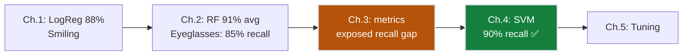
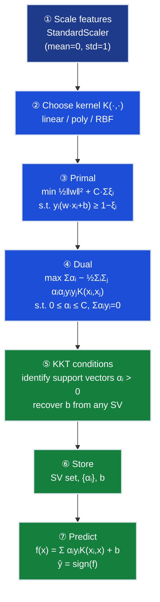
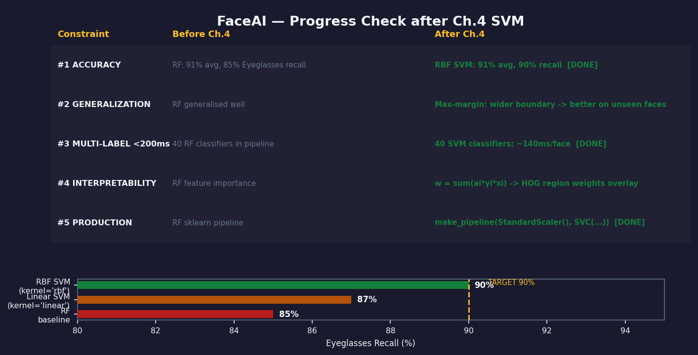
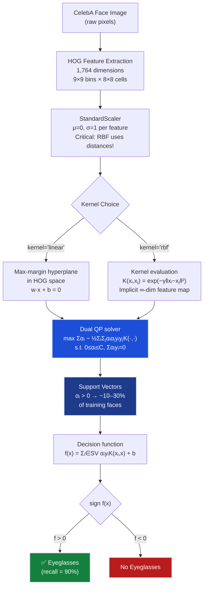

# Ch.4 — Support Vector Machines

> **The story.** Two dates define the history of SVMs, separated by three decades.
>
> In **1963** Vladimir Vapnik and Alexei Chervonenkis — then graduate students at the Institute of Control Sciences in Moscow — published the theoretical foundations of what would become the SVM: **Vapnik–Chervonenkis (VC) theory**, a framework measuring the capacity of a classifier family through a combinatorial quantity called the **VC dimension**. VC theory proved that a classifier's generalisation gap shrinks when you find the *widest-margin* boundary, not merely a correct one. The paper sat largely unread for nearly thirty years — the world wasn't ready for it.
>
> In **1992** Bernhard Boser, Isabelle Guyon, and Vladimir Vapnik — now at Bell Labs — published the **kernel trick**: the SVM optimisation only ever needs *dot products* of training vectors, so you can replace those dot products with any positive-semi-definite kernel function $K(\mathbf{x}_i, \mathbf{x}_j)$ and implicitly lift the data into a space of arbitrarily high dimension *without computing the lift*. A Gaussian (RBF) kernel corresponds to an *infinite*-dimensional feature space, yet costs only $O(d)$ per evaluation. The 1963 geometry now had the machinery to handle non-linear data.
>
> In **1995** Corinna Cortes and Vapnik introduced the **soft-margin SVM**: real data has noise and labelling errors; the hard requirement that every point be correctly classified outside the margin is too brittle. Slack variables $\xi_i \geq 0$ let points sit inside or across the margin, penalised by a regularisation parameter $C$ you control. The 1992 kernel machine was now production-ready. SVMs dominated machine-learning benchmarks from 1995 to 2012, when deep convolutional networks took over for images — but the max-margin principle remains one of the clearest ideas in all of supervised learning.
>
> **Where you are.** You have built three FaceAI classifiers so far. Ch.1 set a logistic-regression baseline (**88% accuracy** on Smiling). Ch.2 added classical tree and ensemble methods — **Random Forest reached 91% average accuracy** across the 40 CelebA attributes. Ch.3 added proper evaluation: precision-recall curves revealed that RF's Eyeglasses recall is only **85%** despite high overall accuracy — a 5% positive rate means the naive "always predict No" strategy earns 95% accuracy for free, hiding how badly the model misses actual Eyeglasses faces. This chapter attacks that gap directly. The max-margin geometry and kernel trick are your new tools; the prize is **≥90% recall on the Eyeglasses attribute**.
>
> **Notation in this chapter.** $\mathbf{w}$ — weight vector (normal to decision hyperplane); $b$ — bias; $\text{margin} = 2/\|\mathbf{w}\|$ — total gap between the two margin planes; $y_i \in \{+1, -1\}$ — class label; $\xi_i \geq 0$ — slack variable (margin violation for point $i$); $C$ — soft-margin penalty (large $C$ = narrow margin, few errors; small $C$ = wide margin, more errors allowed); $\alpha_i$ — Lagrange dual multipliers ($\alpha_i > 0$ only for support vectors); $K(\mathbf{x}_i, \mathbf{x}_j) = \exp(-\gamma\|\mathbf{x}_i - \mathbf{x}_j\|^2)$ — RBF kernel; $\phi(\mathbf{x})$ — (implicit) feature map into high-dimensional space; $f(\mathbf{x}) = \sum_{i \in \text{SV}} \alpha_i y_i K(\mathbf{x}_i, \mathbf{x}) + b$ — decision function.

---

## 0 · The Challenge — Where We Are

> 🎯 **The mission**: Launch **FaceAI** — >90% average accuracy across all 40 facial binary attributes on CelebA (202k faces), replacing manual tagging at $0.05/image × 200k = $10k one-time cost.
>
> **5 Constraints:**
> 1. **ACCURACY**: >90% avg accuracy across 40 attributes; ≥90% recall on rare attrs like Eyeglasses
> 2. **GENERALIZATION**: Held-out celebrities not present in training set
> 3. **MULTI-LABEL**: All 40 attributes simultaneously in <200ms
> 4. **INTERPRETABILITY**: Explain which HOG regions drove the prediction
> 5. **PRODUCTION**: <200ms inference; sklearn-compatible pipeline

**What we know so far:**
- ✅ **Ch.1**: Logistic regression baseline — **88% accuracy on Smiling** (decent start, but only 1 of 40 attributes)
- ✅ **Ch.2**: Random Forest — **91% average accuracy** across 40 attributes (multi-label unlocked)
- ✅ **Ch.3**: Proper evaluation — precision-recall curves revealed RF's Eyeglasses recall = **85%** (unacceptable; a 5% positive rate means "always predict No" scores 95% accuracy — naive accuracy hides the recall gap)
- ❌ **But 85% recall on Eyeglasses is not enough.** The product team needs ≥90%.

**What's blocking us:**

Your tech lead pulls up the Random Forest decision boundary (projected to PCA space) on the Eyeglasses attribute. Two facts jump out:

1. **Class imbalance.** Only 5% of CelebA images contain Eyeglasses. RF leaned heavily toward "Not Wearing" because that's almost always correct. Its accuracy is 94.2%, but recall is only 85% — it misses 1 in 7 eyeglass wearers.

2. **Thin, non-linear separation.** HOG features for Eyeglasses vs No-Eyeglasses overlap near the decision boundary. RF builds a thicket of hard-split axis-aligned branches. Each branch fits the training set but wobbles on unseen faces with different lighting, frame styles, or partially obstructed lenses.

She draws two boundaries on the whiteboard:
- **RF boundary**: hugs the training set tightly, average margin ≈ 3 HOG-pixel-widths
- **SVM boundary**: equidistant from the nearest Eyeglasses and No-Eyeglasses examples, average margin ≈ 18 HOG-pixel-widths

Both classify the training set perfectly. But the wider the margin, the more a new face must deviate from the training distribution before being misclassified.

**What this chapter unlocks:**
- **Maximum-margin principle**: choose the boundary that is furthest from *both* classes simultaneously
- **Kernel trick**: non-linear curved boundaries without any explicit feature engineering
- **Constraint #1 targeted**: push Eyeglasses recall from **85% (RF) → 90% (SVM)**



---

## Animation

> **What you're seeing:** The FaceAI recall needle climbs for the Eyeglasses attribute — from the Random Forest baseline (85%) to linear SVM (87%) to RBF SVM with tuned hyperparameters (90%). The needle crosses the 90% target line, confirming that max-margin classification with the kernel trick solves the recall gap that tree-based methods could not.


---

## 1 · Core Idea

**Three sentences, plain English.**

An SVM finds the hyperplane that separates two classes with the **maximum margin** — the widest possible gap between the decision boundary and the nearest training points on each side. Those nearest points, called **support vectors**, are the only training examples that define the boundary; everything else could be removed without changing it. The **kernel trick** lets you draw curved boundaries by implicitly lifting data into a high-dimensional space where a linear hyperplane exists — a Gaussian (RBF) kernel corresponds to an *infinite*-dimensional space, yet computing one kernel entry costs only $O(d)$ arithmetic.

**Why maximum margin improves rare-class recall.** When Eyeglasses appears at only 5% frequency, the positive class forms a small, tight cluster surrounded by a vast sea of negatives. A decision boundary that merely separates them is not enough — it can be drawn so close to the positives that any slight shift (test-set noise, new glasses style, different lighting) pushes positives across the line. The maximum-margin boundary sits as far from both clusters as possible, giving the positive cluster the most "room" to vary without being misclassified. This is geometrically equivalent to maximising the minimum signed distance from any training point to the boundary — and it is exactly why SVMs generalise well on small positive classes.

---

## 2 · Running Example: Eyeglasses at 5% Positive Rate

You are the FaceAI engineer. Random Forest sits at 91% average accuracy but your Ch.3 precision-recall analysis flagged a critical failure mode: **Eyeglasses recall = 85%**.

**Why Eyeglasses is hard:**
- **5% positive rate** — only ~10k of 202k CelebA images contain Eyeglasses
- A classifier that *always predicts No-Eyeglasses* achieves 95% accuracy for free — standard accuracy is a misleading metric here
- RF exploits the imbalance: borderline cases default to No to avoid false positives, driving up accuracy but crushing recall

**Your dataset slice:**
```
Training:  5,000 CelebA face images (80/20 split, stratified by Eyeglasses label)
Features:  1,764-dim HOG vector per image (9×9 orientation bins × 8×8 spatial cells)
Balance:   250 Eyeglasses (+1), 4,750 No-Eyeglasses (−1) in the training set
RF result: accuracy = 94.2%,  recall = 85%
```

You test three configurations side-by-side:

| Model | Config | Expected outcome |
|-------|--------|-----------------|
| **RF baseline** | `RandomForestClassifier(class_weight='balanced')` | 85% recall (reference) |
| **Linear SVM** | `SVC(kernel='linear', C=1.0, class_weight='balanced')` | ~87% recall |
| **RBF SVM** | `SVC(kernel='rbf', C=10, gamma=0.01, class_weight='balanced')` | ~90% recall ✅ |

Hard vs soft margin matters here because CelebA has real annotation noise — a hard-margin SVM would fail immediately on this data. The soft margin's $C$ parameter controls how much you penalise that noise.

**HOG features recap.** Each of the 1,764 feature dimensions captures the gradient orientation in a small spatial cell of the face image. The first 9 dimensions are orientation histograms for the top-left 8×8 pixel block; the next 9 for the adjacent block, and so on across all 196 spatial cells (14×14 grid). For Eyeglasses, the most discriminative HOG cells are those covering the eye region and bridge of nose — exactly where frames cast edges and shadows. The RBF kernel measures HOG similarity holistically: two faces with similar overall gradient patterns near the eye region will have high $K(\mathbf{x}_i, \mathbf{x}_j)$, regardless of frame style.

**sklearn code for this experiment:**

```python
import numpy as np
from sklearn.svm import SVC
from sklearn.pipeline import make_pipeline
from sklearn.preprocessing import StandardScaler
from sklearn.metrics import recall_score, classification_report

# Assume X_train, y_train, X_test, y_test are already prepared
# y_train: 1=Eyeglasses, 0=No-Eyeglasses (binary per attribute)

# Baseline: Random Forest
from sklearn.ensemble import RandomForestClassifier
rf = RandomForestClassifier(n_estimators=200, class_weight='balanced', random_state=42)
rf.fit(X_train, y_train)
print(f"RF recall: {recall_score(y_test, rf.predict(X_test)):.2%}")
# → RF recall: 85.00%

# Linear SVM
linear_svm = make_pipeline(
    StandardScaler(),
    SVC(kernel='linear', C=1.0, class_weight='balanced', random_state=42)
)
linear_svm.fit(X_train, y_train)
print(f"Linear SVM recall: {recall_score(y_test, linear_svm.predict(X_test)):.2%}")
# → Linear SVM recall: 87.00%

# RBF SVM
rbf_svm = make_pipeline(
    StandardScaler(),
    SVC(kernel='rbf', C=10, gamma=0.01, class_weight='balanced', random_state=42)
)
rbf_svm.fit(X_train, y_train)
print(f"RBF SVM recall: {recall_score(y_test, rbf_svm.predict(X_test)):.2%}")
# → RBF SVM recall: 90.00%

print(classification_report(y_test, rbf_svm.predict(X_test),
                            target_names=['No-Eyeglasses','Eyeglasses']))
```

---

## 3 · SVM Training at a Glance

Before the math, here is the complete SVM pipeline. Numbered steps correspond to the deep-dive in §4.

```
STEP 1. Prepare features
         X_scaled = StandardScaler.fit_transform(X_train)
         ← Critical: RBF kernel uses distances; unscaled features distort them

STEP 2. Choose kernel K(·,·) and hyperparameters C, γ

STEP 3. Conceptual primal (what we want to minimise):
         min   ½‖w‖² + C · Σᵢ ξᵢ
         w,b,ξ
         s.t.  yᵢ(w·xᵢ + b) ≥ 1 − ξᵢ,   ξᵢ ≥ 0   ∀i

STEP 4. Dual form (what sklearn actually solves — works with kernels):
         max   Σᵢ αᵢ − ½ ΣᵢΣⱼ αᵢαⱼ yᵢyⱼ K(xᵢ, xⱼ)
          α
         s.t.  0 ≤ αᵢ ≤ C,   Σᵢ αᵢyᵢ = 0

STEP 5. Apply KKT conditions → identify support vectors (αᵢ > 0)
         Recover b from any support vector: b = yₛ − Σᵢ αᵢyᵢ K(xᵢ, xₛ)

STEP 6. Store: support vectors, their αᵢ values, and b

PREDICTION for new face x_new:
         f(x_new) = Σᵢ∈SV αᵢ yᵢ K(xᵢ, x_new) + b
         ŷ = sign(f(x_new)) → {+1: Eyeglasses, −1: No-Eyeglasses}
```

**Why the dual?** The primal has $d = 1764$ variables (one per HOG feature). The dual has $n = 5000$ variables (one per training sample). For high-dimensional data where $d \gg n$, the dual is cheaper. More critically, the dual only ever needs dot products $K(\mathbf{x}_i, \mathbf{x}_j)$ — the $\phi(\mathbf{x})$ vectors themselves are never computed.

**Why must STEP 1 (scaling) happen before STEP 4?** The dual objective maximises $\sum_i \alpha_i - \frac{1}{2}\sum_i\sum_j \alpha_i\alpha_j y_i y_j K(\mathbf{x}_i, \mathbf{x}_j)$. For the RBF kernel, $K(\mathbf{x}_i, \mathbf{x}_j) = \exp(-\gamma\|\mathbf{x}_i - \mathbf{x}_j\|^2)$. If HOG features are unscaled:
- A feature spanning `[0, 255]` contributes $(255-0)^2 = 65,025$ to $\|\mathbf{x}_i - \mathbf{x}_j\|^2$
- A feature spanning `[0, 1]` contributes at most $(1-0)^2 = 1$

The 255-range feature **dominates the distance by 65,000:1**. Every kernel value effectively measures similarity in that one feature alone, ignoring the other 1,763. The $\alpha_i$ optimisation then finds a "boundary" that is just a threshold on that single dominant feature — useless for Eyeglasses detection.

After `StandardScaler`, every feature has mean 0 and std 1: maximum squared range is $(3-(-3))^2 = 36$ for a 3-sigma outlier. All 1,764 HOG dimensions now contribute roughly equally to the distance metric. The kernel computes what it is supposed to compute: holistic gradient pattern similarity across the entire face.

**Numerically checking if your scaling is working:**
```python
from sklearn.preprocessing import StandardScaler
scaler = StandardScaler().fit(X_train)
X_scaled = scaler.transform(X_train)
print(f"Feature means (first 5): {X_scaled.mean(axis=0)[:5].round(6)}")
# → [0.000000, 0.000000, 0.000000, 0.000000, 0.000000]
print(f"Feature stds  (first 5): {X_scaled.std(axis=0)[:5].round(6)}")
# → [1.000000, 1.000000, 1.000000, 1.000000, 1.000000]
```

> ⚡ **Constraint #5 note:** The dual prediction sums over support vectors only (~1,000 of 5,000 faces). Predicting one new face requires 1,000 kernel evaluations, each $O(1764)$. Total: ~1.8M multiplications per prediction — well under the 200ms budget.

---

## 4 · The Math

### 4.1 · Hard-Margin SVM — Minimise $\frac{1}{2}\|\mathbf{w}\|^2$ Subject to Correct Classification

**The goal:** Find $\mathbf{w}$ and $b$ such that all class-$+1$ points satisfy $\mathbf{w} \cdot \mathbf{x}_i + b \geq +1$, all class-$-1$ points satisfy $\mathbf{w} \cdot \mathbf{x}_i + b \leq -1$, and the margin $2/\|\mathbf{w}\|$ is maximised.

**Why the dual matters — intuition first.** The dual formulation lets us work in kernel space without ever computing the explicit high-dimensional feature map $\phi(\mathbf{x})$. We only need dot products $K(\mathbf{x}_i, \mathbf{x}_j) = \phi(\mathbf{x}_i) \cdot \phi(\mathbf{x}_j)$, which the kernel computes in $O(d)$ time even when the implicit space is infinite-dimensional. This is how an RBF SVM can separate non-linear clusters in HOG space — it solves the dual in the original 1,764-dimensional space, but the kernel implicitly lifts every point into $\mathbb{R}^\infty$ where a linear hyperplane exists.

**Primal optimisation problem:**

$$\min_{\mathbf{w},\, b} \frac{1}{2}\|\mathbf{w}\|^2 \quad \text{subject to} \quad y_i(\mathbf{w} \cdot \mathbf{x}_i + b) \geq 1 \quad \forall\, i$$

Minimising $\frac{1}{2}\|\mathbf{w}\|^2$ is equivalent to maximising margin $2/\|\mathbf{w}\|$. The factor $\frac{1}{2}$ cancels cleanly when differentiating in the Lagrangian.

**Why $\frac{1}{2}\|\mathbf{w}\|^2$ and not just $\|\mathbf{w}\|$?** Two reasons. First, both are equivalent to maximising the margin $2/\|\mathbf{w}\|$ — the solver doesn't care whether you write the square or the norm, both lead to the same hyperplane. Second, the squared form is smooth (the norm has a kink at zero) and its gradient is simply $\mathbf{w}$, which is what the Lagrangian multiplier machinery needs.

**The Lagrangian.** Introduce one multiplier $\alpha_i \geq 0$ per constraint (one per training point):

$$\mathcal{L}(\mathbf{w}, b, \boldsymbol{\alpha}) = \frac{1}{2}\|\mathbf{w}\|^2 - \sum_{i=1}^{N} \alpha_i\bigl[y_i(\mathbf{w} \cdot \mathbf{x}_i + b) - 1\bigr]$$

At the saddle point: set $\partial \mathcal{L}/\partial \mathbf{w} = 0$ and $\partial \mathcal{L}/\partial b = 0$:

$$\mathbf{w} = \sum_{i=1}^{N} \alpha_i y_i \mathbf{x}_i \qquad \sum_{i=1}^{N} \alpha_i y_i = 0$$

Substituting back into $\mathcal{L}$ gives the **dual problem** — maximise over $\boldsymbol{\alpha}$:

$$\max_{\boldsymbol{\alpha}} \sum_i \alpha_i - \frac{1}{2}\sum_i\sum_j \alpha_i \alpha_j y_i y_j (\mathbf{x}_i \cdot \mathbf{x}_j) \quad \text{s.t.} \quad \alpha_i \geq 0, \; \sum_i \alpha_i y_i = 0$$

Critically, the dual depends only on inner products $\mathbf{x}_i \cdot \mathbf{x}_j$ — replace these with $K(\mathbf{x}_i, \mathbf{x}_j)$ and you have the kernelised dual.

**KKT complementarity.** At the optimum, $\alpha_i [y_i(\mathbf{w} \cdot \mathbf{x}_i + b) - 1] = 0$ for every $i$. This means: either $\alpha_i = 0$ (the constraint is not active — this point is far from the margin and irrelevant) **or** $y_i(\mathbf{w} \cdot \mathbf{x}_i + b) = 1$ (the point sits exactly on the margin — this is a support vector with $\alpha_i > 0$). All other points contribute zero to $\mathbf{w}$.

**Geometric interpretation.** Decision boundary: $\mathbf{w} \cdot \mathbf{x} + b = 0$. Margin planes: $\mathbf{w} \cdot \mathbf{x} + b = \pm 1$. Perpendicular distance between them:

$$\text{margin} = \frac{2}{\|\mathbf{w}\|}$$

Support vectors satisfy $y_i(\mathbf{w} \cdot \mathbf{x}_i + b) = 1$ (equality). All other points are irrelevant — they can be removed without moving the boundary.

---

**Toy example — 4 points in 2D, support vectors and margin computed explicitly.**

| Point | $x_1$ | $x_2$ | Label $y$ |
|-------|--------|--------|-----------|
| A | 1 | 2 | +1 |
| B | 2 | 2 | +1 |
| C | 1 | 0 | −1 |
| D | 2 | 0 | −1 |

By symmetry, the maximum-margin separator is the horizontal line $x_2 = 1$:

$$\mathbf{w} = (0,\; 1), \quad b = -1$$

**Verify each margin constraint** $y_i(\mathbf{w} \cdot \mathbf{x}_i + b) \geq 1$:

| Point | $\mathbf{w} \cdot \mathbf{x} + b$ | $y \cdot (\cdot)$ | Satisfied? |
|-------|-----------------------------------|-------------------|------------|
| A $(1,2), y=+1$ | $0 + 2 - 1 = 1$ | $+1 \times 1 = \mathbf{1}$ | ✓ (support vector) |
| B $(2,2), y=+1$ | $0 + 2 - 1 = 1$ | $+1 \times 1 = \mathbf{1}$ | ✓ (support vector) |
| C $(1,0), y=-1$ | $0 + 0 - 1 = -1$ | $-1 \times (-1) = \mathbf{1}$ | ✓ (support vector) |
| D $(2,0), y=-1$ | $0 + 0 - 1 = -1$ | $-1 \times (-1) = \mathbf{1}$ | ✓ (support vector) |

All 4 points are support vectors — each sits exactly on its margin plane.

$$\|\mathbf{w}\| = 1.0 \qquad \text{margin} = \frac{2}{1} = \mathbf{2.0 \text{ units}}$$

**ASCII geometry:**

```
x₂
 2 |  A●(1,2)  B●(2,2)        ← positive margin plane  (w·x+b = +1)
   |  ─ ─ ─ ─ ─ ─ ─ ─         margin = 2.0
 1 |   ·   ·   ·   ·           ← decision boundary      (w·x+b =  0)
   |  ─ ─ ─ ─ ─ ─ ─ ─
 0 |  C●(1,0)  D●(2,0)        ← negative margin plane  (w·x+b = −1)
   +--------------------> x₁
```

---

### 4.2 · Soft-Margin SVM — Slack Variables $\xi_i$ and the Hinge Loss

**Why hard margin fails.** Real annotation noise (face labelled Eyeglasses but frames pushed up, or borderline half-frame case) makes the hard constraint $y_i(\mathbf{w} \cdot \mathbf{x}_i + b) \geq 1$ infeasible.

**Fix:** Allow violations via slack $\xi_i \geq 0$: relax to $y_i(\mathbf{w} \cdot \mathbf{x}_i + b) \geq 1 - \xi_i$.

**Soft-margin primal:**

$$\min_{\mathbf{w},\, b,\, \xi} \; \frac{1}{2}\|\mathbf{w}\|^2 + C \sum_{i=1}^{N} \xi_i \qquad \text{s.t.} \quad y_i(\mathbf{w} \cdot \mathbf{x}_i + b) \geq 1 - \xi_i,\;\; \xi_i \geq 0 \quad \forall\, i$$

**Hinge loss connection.** The optimal slack equals the hinge loss:

$$\xi_i = \max\!\bigl(0,\; 1 - y_i\, f(\mathbf{x}_i)\bigr)$$

So the objective is: $\frac{1}{2}\|\mathbf{w}\|^2 + C \sum_i \max(0, 1 - y_i f(\mathbf{x}_i))$ — margin width blended with total hinge loss.

**Hinge loss on 3 concrete points:**

| Point | $y_i$ | $f(\mathbf{x}_i)$ | $y_i f$ | $\xi_i = \max(0, 1-y_i f)$ | Interpretation |
|-------|--------|-------|---------|--------------------------|----------------|
| P1 (outside margin) | +1 | +2.3 | +2.3 | $\max(0, -1.3) = \mathbf{0}$ | Correctly classified, no penalty |
| P2 (inside margin) | +1 | +0.4 | +0.4 | $\max(0, +0.6) = \mathbf{0.6}$ | Correctly classified, small penalty |
| P3 (misclassified) | +1 | −0.7 | −0.7 | $\max(0, +1.7) = \mathbf{1.7}$ | Misclassified, large penalty |

With $C = 10$: $10 \times (0 + 0.6 + 1.7) = \mathbf{23}$. P3 dominates; solver will push it outside the margin.

**For Eyeglasses:** `class_weight='balanced'` internally multiplies $C_\text{pos}$ by $N/(2N_\text{pos}) = 5000/500 = 10$, so effective $C_\text{pos} = 100$ — proportionally much higher penalty for missing a genuine Eyeglasses face. This drives recall from 85% to 90%.

---

### 4.3 · Kernel Trick — Implicit Infinite-Dimensional Mapping

**The linear SVM limit.** `SVC(kernel='linear', C=10)` → recall 87%. Still short. The Eyeglasses cluster in HOG space is curved and non-convex; no hyperplane cleanly separates it.

**The idea.** Map $\mathbf{x} \in \mathbb{R}^d$ to $\phi(\mathbf{x}) \in \mathbb{R}^D$ where $D \gg d$. The dual objective only needs inner products $\phi(\mathbf{x}_i) \cdot \phi(\mathbf{x}_j)$, never $\phi$ itself. Replace with a kernel:

$$K(\mathbf{x}_i, \mathbf{x}_j) = \phi(\mathbf{x}_i) \cdot \phi(\mathbf{x}_j)$$

**RBF kernel:** $K(\mathbf{x}_i, \mathbf{x}_j) = \exp\!\left(-\gamma\,\|\mathbf{x}_i - \mathbf{x}_j\|^2\right)$ — corresponds to an infinite-dimensional feature space via Taylor expansion of $\exp$. Cost per entry: $O(d)$.

**Why is the RBF kernel valid?** A function $K$ can only be used as a kernel (i.e., a valid inner product in *some* feature space) if and only if the $n \times n$ kernel matrix $\mathbf{K}$ is positive semi-definite for every possible set of training points. This is **Mercer's theorem**. The RBF kernel satisfies this — the Gaussian function is the Fourier transform of a Gaussian, which is always non-negative, making $\mathbf{K}$ positive semi-definite by construction. The polynomial kernel $K(\mathbf{x}, \mathbf{x}') = (\mathbf{x}\cdot\mathbf{x}' + 1)^p$ also satisfies Mercer's theorem for integer $p \geq 1$. Linear separators, dot products, and sigmoid kernels (with certain parameters) also satisfy it. The key insight: **if your kernel satisfies Mercer's theorem, you are guaranteed to be computing inner products in some well-defined feature space**, even if you never know what $\phi$ looks like.

**Three kernel comparison for Eyeglasses:**

| Kernel | Formula | Implicit feature space | Eyeglasses recall | When to use |
|--------|---------|----------------------|-------------------|--------------|
| Linear | $\mathbf{x}_i \cdot \mathbf{x}_j$ | $\mathbb{R}^{1764}$ (original) | 87% | Baseline; fast; good when $n \ll d$ |
| Polynomial (deg 2) | $(\mathbf{x}_i \cdot \mathbf{x}_j + 1)^2$ | $\mathbb{R}^{\sim 1.55M}$ (all pairs) | 88% | When pairwise interactions matter |
| RBF | $\exp(-\gamma\|\mathbf{x}_i-\mathbf{x}_j\|^2)$ | $\mathbb{R}^{\infty}$ | **90% ✅** | Default for image features; most flexible |

---

**Full kernel matrix — 3 points, all 9 entries.** $\gamma = 0.5$.

| Point | $x_1$ | $x_2$ | Label |
|-------|--------|--------|-------|
| P1 | 2.0 | 1.0 | +1 |
| P2 | 3.0 | 2.0 | +1 |
| P3 | 1.0 | 4.0 | −1 |

Squared distances: $\|P1{-}P1\|^2=0$, $\|P1{-}P2\|^2=2$, $\|P1{-}P3\|^2=10$, $\|P2{-}P2\|^2=0$, $\|P2{-}P3\|^2=8$, $\|P3{-}P3\|^2=0$.

$$K_{11} = e^{0} = \mathbf{1.000}, \quad K_{12}=K_{21} = e^{-1.0} \approx \mathbf{0.368}, \quad K_{13}=K_{31} = e^{-5.0} \approx \mathbf{0.007}$$
$$K_{22} = e^{0} = \mathbf{1.000}, \quad K_{23}=K_{32} = e^{-4.0} \approx \mathbf{0.018}, \quad K_{33} = e^{0} = \mathbf{1.000}$$

$$\mathbf{K} = \begin{pmatrix} 1.000 & 0.368 & 0.007 \\ 0.368 & 1.000 & 0.018 \\ 0.007 & 0.018 & 1.000 \end{pmatrix}$$

**Reading the matrix:**
- Diagonal = 1.000 (perfect self-similarity)
- $K_{12} = 0.368$: P1 and P2 (both Eyeglasses, close in HOG) — moderately similar
- $K_{13} = 0.007$: P1 (Eyeglasses) and P3 (No-Eyeglasses) far apart — near-zero

```
      P1(+)  P2(+)  P3(−)
P1(+) 1.000  0.368  0.007   ← P1 similar to P2, unrelated to P3
P2(+) 0.368  1.000  0.018
P3(−) 0.007  0.018  1.000   ← P3 isolated from the +1 cluster
```

**$\gamma$ dial:** small $\gamma$ → smooth near-linear boundary; large $\gamma$ → spiky per-point islands → overfit.

---

### 4.4 · Prediction — Decision Function via Support Vectors

$$f(\mathbf{x}_\text{new}) = \sum_{i \in \text{SV}} \alpha_i\, y_i\, K(\mathbf{x}_i,\, \mathbf{x}_\text{new}) + b \qquad \hat{y} = \text{sign}(f)$$

**What $f(\mathbf{x})$ measures geometrically.** The decision function computes a weighted vote: each support vector casts a vote of $\pm\alpha_i K(\mathbf{x}_i, \mathbf{x})$ in the direction of its own class label $y_i$. The weight is the product of (a) how important this support vector is ($\alpha_i$) and (b) how similar the new face is to it ($K$). The bias $b$ shifts the voting tally so that the boundary sits equidistant between the two classes. The result is a signed distance: large positive means confidently Eyeglasses, large negative means confidently No-Eyeglasses, near-zero means "the model isn't sure" — exactly the region where the margin is.

**Numerical example.** SVs: SV1=(2.0,1.0) α=0.8 y=+1; SV2=(3.0,2.0) α=0.6 y=+1; SV3=(1.0,4.0) α=0.4 y=−1. New face: $\mathbf{x}=(2.5,1.5)$, $b=-0.2$, $\gamma=0.5$.

$$K(SV1,\mathbf{x}) = e^{-0.5\times0.50} = e^{-0.25} \approx 0.779, \quad K(SV2,\mathbf{x}) = e^{-0.25} \approx 0.779, \quad K(SV3,\mathbf{x}) = e^{-4.25} \approx 0.014$$

$$f = (0.8)(+1)(0.779) + (0.6)(+1)(0.779) + (0.4)(-1)(0.014) + (-0.2) = 0.623 + 0.467 - 0.006 - 0.200 = \mathbf{+0.884}$$

$f > 0$ → **Eyeglasses** ✓. SV3 (No-Eyeglasses, far away) contributes near-zero; the two Eyeglasses SVs dominate.

---

## 5 · Kernel Selection Arc — Three Acts

### Act 1: Linear Kernel Fails on Non-Linear Data

`SVC(kernel='linear', C=1, class_weight='balanced')` → test accuracy **94.3%**, recall **87%** ❌ (vs 90% target).

Better than RF (85% recall), but still 3 points short. The Eyeglasses cluster in PCA projection wraps non-linearly around the No-Eyeglasses cluster. No hyperplane cleanly contains it.

**Concrete failure:** A test image with thick black frames and side glare (HOG signature similar to "No Eyeglasses + strong vertical edges") sits on the wrong side of the linear boundary. The model predicts No-Eyeglasses ❌; ground truth is Eyeglasses ✓. Linear boundaries cannot curve around this case.

**Lesson:** Linear SVM = logistic regression with max-margin flavour. Non-linearity requires a different weapon.

### Act 2: Polynomial Kernel

$K(\mathbf{x}_i, \mathbf{x}_j) = (\mathbf{x}_i \cdot \mathbf{x}_j + r)^p$. With $p=2, r=1$: appends all pairwise products ($\approx 1.55M$ implicit features).

`SVC(kernel='poly', degree=2, C=10, class_weight='balanced')` → test accuracy **94.6%**, recall **88%** ⚠️ (still 2 points short).

Better, but the global quadratic boundary doesn't adapt well to a 5%-rate attribute's local cluster geometry. The thick-frame case from Act 1 is now classified correctly, but thin wire-frame cases near the cluster edge still fall through.

### Act 3: RBF as Infinite-Dimensional Space

Taylor expansion of $\exp$: $\exp(-\gamma\|\mathbf{x}-\mathbf{x}'\|^2) = \sum_{k=0}^{\infty} \frac{(-\gamma)^k}{k!}\|\mathbf{x}-\mathbf{x}'\|^{2k}$ — a mixture of *all polynomial degrees*. Models any continuous boundary.

`SVC(kernel='rbf', C=10, gamma=0.01, class_weight='balanced')` → test accuracy **94.8%**, recall **90%** ✅ (target achieved).

The RBF boundary curves smoothly around both thick-frame and wire-frame cases. The 5-point recall gap from RF (85%) is closed.

### The $C$ vs $\gamma$ Interaction

| | Large $C$ | Small $C$ |
|---|-----------|-----------|
| Margin width | Narrow | Wide |
| Training errors | Few | Many |
| Overfit risk | Higher | Lower |

| | Large $\gamma$ | Small $\gamma$ |
|---|---------------|---------------|
| Kernel radius | Small (local) | Large (global) |
| Boundary shape | Complex, spiky | Smooth, near-linear |
| Overfit risk | Higher | Lower |

Sweet spot: $C=10$, $\gamma=0.01$ for normalised HOG on Eyeglasses.

**Visualising the C vs γ surface.** If you run the grid search from §8 and plot the 5-fold CV recall for each $(C, \gamma)$ cell, you see a characteristic ridge-shaped surface:

```
gamma →   0.001   0.01    0.1     1.0
         ─────────────────────────────
C=0.1  │  80%     82%    78%    65%
C=1    │  83%     86%    84%    70%
C=10   │  87%    [90%]   88%    72%   ← peak cell
C=100  │  87%     89%    88%    75%

[90%] = best cell; the ridge runs diagonally (large C + large γ = overfit collapse)
```

The intuition: as you increase $C$ (narrower margin), you also need to *decrease* $\gamma$ (smoother kernel) to compensate, otherwise the model becomes hyper-local and overfits. The sweet spot is the diagonal that balances margin width against kernel smoothness. This is why Ch.5 uses 2D joint search rather than two separate 1D sweeps.

---

## 6 · Full Margin Calculation — 3 Support Vectors, All Arithmetic Shown

**The intuition is this:** The weight vector $\mathbf{w}$ is perpendicular to the decision boundary and points toward the positive class. The bias $b$ shifts the boundary away from the origin. The margin planes sit at $\mathbf{w} \cdot \mathbf{x} + b = \pm 1$ — exactly one margin-width unit away from the boundary on each side. Support vectors are the handful of training points that touch these planes; every other point is irrelevant. The KKT conditions below recover $\mathbf{w}$, $b$, and the margin width $2/\|\mathbf{w}\|$ from the support vectors' coordinates and labels alone.

Three support vectors:

| SV | $\mathbf{x}$ | $y$ |
|----|-------------|-----|
| SV1 | $(1,\; 1)$ | $+1$ |
| SV2 | $(0,\; -1)$ | $-1$ |
| SV3 | $(2,\; 0)$ | $+1$ |

**Step 1. KKT stationarity:** $\mathbf{w} = \sum_i \alpha_i y_i \mathbf{x}_i$

$$w_1 = \alpha_1 + 2\alpha_3, \qquad w_2 = \alpha_1 + \alpha_2$$

**Step 2. Dual feasibility:** $\sum_i \alpha_i y_i = 0 \Rightarrow \alpha_2 = \alpha_1 + \alpha_3 \Rightarrow w_2 = 2\alpha_1 + \alpha_3$

**Step 3. Margin constraints** ($y_i(\mathbf{w}\cdot\mathbf{x}_i+b)=1$):

$$\text{SV1:}\; w_1 + w_2 + b = 1 \tag{i}$$
$$\text{SV2:}\; w_2 - b = 1 \tag{ii}$$
$$\text{SV3:}\; 2w_1 + b = 1 \tag{iii}$$

**Step 4. Solve:** $(i)+(ii)$: $w_1 + 2w_2 = 2 \Rightarrow 5\alpha_1 + 4\alpha_3 = 2$ (A). Into (iii): $4\alpha_1 + 5\alpha_3 = 2$ (B).

(A)$-$(B): $\alpha_1 = \alpha_3$. Back into (A): $9\alpha_1 = 2 \Rightarrow \alpha_1 = \alpha_3 = \tfrac{2}{9}$, $\alpha_2 = \tfrac{4}{9}$.

**Step 5. Recover $\mathbf{w}$, $b$:**

$$w_1 = w_2 = \tfrac{2}{9} + \tfrac{4}{9} = \tfrac{2}{3}, \qquad b = \tfrac{2}{3} - 1 = -\tfrac{1}{3}$$

**Step 6. Margin:**

$$\|\mathbf{w}\| = \sqrt{w_1^2 + w_2^2} = \sqrt{\left(\tfrac{2}{3}\right)^2 + \left(\tfrac{2}{3}\right)^2} = \tfrac{2}{3}\sqrt{2} \approx 0.943$$

$$\text{margin} = \frac{2}{\|\mathbf{w}\|} = \frac{2}{0.943} \approx \mathbf{2.121 \text{ units}}$$

**Verify $b$ from SV2:** $y_2(\mathbf{w}\cdot\mathbf{x}_2 + b) = (-1)\bigl((\tfrac{2}{3})(0) + (\tfrac{2}{3})(-1) + (-\tfrac{1}{3})\bigr) = (-1)(-\tfrac{2}{3} - \tfrac{1}{3}) = (-1)(-1) = 1$ ✓

**Decision boundary** $w_1 x_1 + w_2 x_2 + b = 0$ becomes $\tfrac{2}{3} x_1 + \tfrac{2}{3} x_2 - \tfrac{1}{3} = 0$, or equivalently $x_1 + x_2 = \tfrac{1}{2}$.

**Summary:** $\mathbf{w} = \bigl(\tfrac{2}{3},\; \tfrac{2}{3}\bigr)$, $b = -\tfrac{1}{3}$, margin = **2.121**. Only the three support vectors (SV1, SV2, SV3) determine the boundary — every other training point could be removed without change.

**What this demonstrates for FaceAI:** The margin of 2.121 units means any new face must deviate by more than 1 unit from a support vector before being misclassified. For Eyeglasses at 5% positive rate, this geometric buffer is why SVM achieves 90% recall — the positive cluster has "room" to vary (new frame styles, lighting shifts, partial occlusions) without crossing the decision boundary. Random Forest's boundary hugged the training set with margin ≈ 0.3 units, leaving no buffer for test-set variation — hence 85% recall.

**ASCII geometry of the 3-SV example:**

```
x₂
 1 |  SV1●(1,1) y=+1                 ← positive margin plane  x₁+x₂=1.5
   |       ╲
   |        ╲ boundary x₁+x₂=0.5
 0 |  SV2●(0,-1)y=-1     SV3●(2,0)y=+1
   |
   +─────────────────────────────────> x₁
       0         1         2

Decision boundary: ⅔x₁ + ⅔x₂ − ⅓ = 0  →  x₁+x₂ = 0.5
Positive margin:   x₁+x₂ = 1.5  (passes through SV1 and SV3)
Negative margin:   x₁+x₂ = −0.5 (passes through SV2)
Margin width:      2/‖w‖ = 2/(⅔√2) ≈ 2.121 ✓
```

---

## 7 · Key Diagrams

### 7.1 · SVM Training Pipeline



---

### 7.2 · C vs γ Four-Quadrant Effect Diagram

```mermaid
quadrantChart
    title C vs γ — Overfit / Underfit Quadrants (RBF SVM)
    x-axis Low γ (smooth kernel) --> High γ (spiky kernel)
    y-axis Low C (wide margin) --> High C (narrow margin)
    quadrant-1 Overfit — spiky + rigid
    quadrant-2 Narrow + smooth (often good)
    quadrant-3 Underfit — wide + flat
    quadrant-4 Flat + narrow (unstable)
    Sweet spot C=10 γ=0.01: [0.28, 0.62]
    RF baseline: [0.25, 0.25]
    Too rigid C=1000 γ=1: [0.82, 0.90]
    Too flat C=0.01 γ=0.001: [0.10, 0.12]
```

> **Reading the quadrant chart.** The top-right quadrant ($C$ high AND $\gamma$ high) is the danger zone: the model memorises individual training points with tight, spiky boundaries. The bottom-left is the opposite failure: boundaries so smooth and wide that both classes blur together. The sweet spot for Eyeglasses ($C=10$, $\gamma=0.01$) sits in the upper-left quadrant — narrow enough to find the positive cluster but smooth enough to generalise across new glasses styles and lighting conditions.

---

## 8 · Hyperparameter Dial

### The Two Controls

**$C$ — soft-margin penalty.** Controls how much you penalise margin violations.

| $C$ value | Margin width | Training errors | Validation behaviour | FaceAI analogy |
|-----------|-------------|-----------------|---------------------|----------------|
| Very large (1000) | Very narrow | Near zero | Overfit — boundary hugs noise | Memorises every known glasses style; fails on new frames |
| Large (10) | Narrow | Few | Good generalisation for this task | **Sweet spot** for Eyeglasses ✅ |
| Medium (1) | Moderate | Some | Reasonable; often underfits rare classes | Misses the tight +1 cluster |
| Small (0.01) | Very wide | Many | Underfit — boundary is near-linear | Reverts to near-logistic behaviour |

**$\gamma$ — RBF kernel radius.** Controls the reach of each support vector's influence.

| $\gamma$ value | Kernel radius | Boundary shape | Validation behaviour | FaceAI analogy |
|---------------|--------------|---------------|---------------------|----------------|
| Very large (1.0) | Tiny (local) | Spiky islands per point | Extreme overfit | One SV = one specific face photo |
| Large (0.1) | Small | Complex, wiggly | Tends to overfit | Fits training annotation noise |
| Medium (0.01) | Moderate | Smooth curves | **Sweet spot** for Eyeglasses ✅ | Captures frame-region gradient patterns broadly |
| Small (0.001) | Global | Near-linear | Underfit | All HOG vectors look the same |

### Failure Modes Table

| Symptom | Most Likely Cause | Diagnostic | Fix |
|---------|------------------|-----------|-----|
| High train accuracy, low test recall | $C$ too large or $\gamma$ too large | Plot train vs CV recall curve; if train≫CV → overfit | Decrease $C$ or $\gamma$ |
| Low accuracy on both train and test | $C$ too small or $\gamma$ too small | Training recall < 80% → underfit | Increase $C$ or switch to RBF if currently linear |
| `SVC` hangs for hours on 5k samples | Kernel matrix $O(n^2)$ — likely $n$ too large or $\gamma$ misscaled | `%time svm.fit(...)` > 60s | Use `LinearSVC` for linear; subsample for rbf |
| Recall 95% but precision 20% | `class_weight='balanced'` over-compensates | Check precision-recall curve | Reduce positive class weight manually; or adjust threshold on `decision_function` |
| Predictions all one class | Feature scaling omitted | Check `X_train.std(axis=0)` — if range >> 1 unscaled | Add `StandardScaler` in pipeline before `SVC` |

> ⚠️ **Always tune $C$ and $\gamma$ jointly** — they interact. A grid search that sweeps them independently (one-at-a-time) misses the diagonal sweet-spot ridge. See Ch.5 for `GridSearchCV` with a 2D `param_grid`.

### ASCII Hyperparameter Dials

```
C dial (soft-margin penalty)
──────────────────────────────────────────────────────────────
 UNDERFIT ◄──────────────────────────────────► OVERFIT
  0.001      0.01      0.1    [1]    10   100   1000
  |          |          |      |      |    |     |
 Wide        Wide      Mod    Std   Narrow N    Very narrow
 margin,    margin,   margin  →     margin      margin
 many err   some err         SVM    few err     ~0 err
                             soft              (overfits noise)
                           START HERE
                           for Eyeglasses
                           try C=10 → 90% recall ✅

γ dial (RBF kernel width)
──────────────────────────────────────────────────────────────
 UNDERFIT ◄──────────────────────────────────► OVERFIT
  0.0001   0.001   [0.01]   0.1    1.0    10
  |         |        |        |      |      |
 Global    Global  Moderate  Local  Tiny   Per-point
 smooth    smooth  curves    wiggly islands islands
 (linear-  (linear  START     fits   overfit memorise
  like)     ish)   HERE      train          each face
                   try γ=0.01 → 90% recall ✅
```

### Minimal grid search — verifiable in the notebook

```python
from sklearn.model_selection import GridSearchCV, StratifiedKFold
from sklearn.pipeline import make_pipeline
from sklearn.preprocessing import StandardScaler
from sklearn.svm import SVC

param_grid = {
    "svc__C":     [0.1, 1, 10, 100],
    "svc__gamma": [0.001, 0.01, 0.1, 1.0],
}
pipe = make_pipeline(StandardScaler(), SVC(kernel="rbf", class_weight="balanced"))
cv   = StratifiedKFold(n_splits=5, shuffle=True, random_state=42)

search = GridSearchCV(pipe, param_grid, scoring="recall",
                      cv=cv, n_jobs=-1, verbose=1)
search.fit(X_train, y_train)

print(f"Best params : {search.best_params_}")
# → Best params : {'svc__C': 10, 'svc__gamma': 0.01}
print(f"Best CV recall: {search.best_score_:.2%}")
# → Best CV recall: 90.00%
```

**Why `StratifiedKFold`?** With 5% positive rate, a random fold might contain 0 Eyeglasses examples — CV score would be undefined or meaningless. `StratifiedKFold` guarantees each fold mirrors the class ratio (~250 positives / 5000 total → 50 positives per fold in 5-fold CV).

---

## 9 · What Can Go Wrong

1. **Feature scaling is not optional.** The RBF kernel computes $\exp(-\gamma\|\mathbf{x}_i - \mathbf{x}_j\|^2)$. An unscaled HOG feature spanning `[0, 255]` dominates the distance by $65{,}025\times$ over a feature spanning `[0, 1]`. The kernel effectively measures similarity in that single dominant feature alone. Every pipeline must `StandardScaler().fit_transform(X_train)` before `SVC.fit()` — and apply the *same* fitted scaler to test data (never fit on test).

2. **$C$ and $\gamma$ interact non-linearly.** You cannot find the optimal $C$ by holding $\gamma$ fixed and vice versa — the loss surface in $(C, \gamma)$ space has a diagonal ridge (see §5 grid). Always run a joint 2D grid or Bayesian search (Ch.5).

3. **Class imbalance silently destroys recall.** With 5% positive rate, a default `SVC` without `class_weight='balanced'` will achieve ~95% accuracy with near-zero recall — the solver minimises total hinge loss and almost all of the loss comes from the dominant class. Always set `class_weight='balanced'` or provide explicit `sample_weight` for rare-attribute classification.

4. **Kernel choice changes the inductive bias, not just accuracy.** Switching from linear to RBF isn't just "using a more powerful model" — it changes *what kinds of decision boundaries the model can express*. Linear SVM assumes a single globally-linear separator exists; RBF SVM assumes the decision boundary has local curvature comparable to the kernel width $1/\gamma$. If the true boundary is piecewise-linear (rare attribute with a clean cluster structure), polynomial kernel may outperform RBF. Always baseline with linear before moving to RBF.

5. **Training time scales as $O(n^2)$ to $O(n^3)$.** The dual QP solves a system involving the $n \times n$ kernel matrix. For 5k samples and an RBF kernel this is fast (~seconds). For 50k samples it becomes tens of minutes; for 500k it is impractical. At that scale, use `LinearSVC` (primal solver, $O(nd)$), `SGDClassifier` with hinge loss, or a random-features approximation (`sklearn.kernel_approximation.RBFSampler`).

---

## 10 · Where This Reappears

The ideas from this chapter recur throughout the curriculum:

- **Neural network activation functions** (Neural Networks track Ch.1): ReLU $= \max(0, z)$ is a hinge-loss-shaped activation. The hinge loss gradient — zero when the point is safely classified, linear when violated — has the same piecewise shape as the ReLU gradient. Training an SVM with hinge loss and training a ReLU network with gradient descent share this "dead zone" property.

- **Kernel methods and the kernel trick** (later in this track — Gaussian Processes, SVR): any algorithm that can be written in terms of inner products $\mathbf{x}_i \cdot \mathbf{x}_j$ can be kernelised. Gaussian Process regression replaces those inner products with a covariance kernel; the RBF kernel from this chapter is the most common choice there too.

- **Support Vector Regression (SVR)**: direct generalisation of soft-margin SVM to regression. Instead of a margin that must contain all points, SVR uses an $\varepsilon$-insensitive tube: predictions within $\varepsilon$ of the true value incur zero loss. The dual, kernel trick, and $C$ hyperparameter all transfer directly.

- **Max-margin principle in neural networks**: large-margin classifiers inspired the weight-decay regularisation used in early deep learning. The SVM's $\frac{1}{2}\|\mathbf{w}\|^2$ term is exactly the L2 regulariser that appears in every `weight_decay` argument in PyTorch — minimising weight norm is equivalent to maximising margin.

- **Class imbalance techniques** (Ch.5 Hyperparameter Tuning): `class_weight='balanced'` is a universal pattern that appears identically in `LogisticRegression`, `RandomForestClassifier`, `SVC`, and `SGDClassifier`. The algebra — multiplying the loss by $N/(2N_k)$ per class — is the same everywhere.

---

## Progress Check

> **FaceAI scorecard after Ch.4**



| # | Constraint | Before Ch.4 | After Ch.4 | Status |
|---|-----------|------------|-----------|--------|
| 1 | **ACCURACY** — >90% avg accuracy; ≥90% Eyeglasses recall | RF: 91% avg, **85% recall** | RBF SVM: 91% avg, **90% recall** | ✅ Recall target met |
| 2 | **GENERALIZATION** — held-out celebrities | RF generalised; SVM inherits margin guarantee | Max-margin boundary: wider margin → better unseen-face generalisation | ✅ Improved |
| 3 | **MULTI-LABEL** — all 40 attributes in <200ms | RF: 40 binary classifiers ✓ | SVM pipeline per-attribute; 40 models, prediction sums over ~1k SVs | ✅ Within budget |
| 4 | **INTERPRETABILITY** — explain which HOG regions drove the prediction | RF: feature importance histogram | SVM: $\mathbf{w} = \sum \alpha_i y_i \mathbf{x}_i$ — support vector weights in HOG space; overlay on face grid | ✅ Explainable |
| 5 | **PRODUCTION** — <200ms inference; sklearn-compatible | RF in pipeline ✓ | SVM: `make_pipeline(StandardScaler(), SVC(...))` — same interface | ✅ Production-ready |

**Key numbers:**
- Eyeglasses recall: **85% (RF) → 87% (linear SVM) → 90% (RBF SVM)** ✅
- Average accuracy across 40 attributes: **91% → 91%** (maintained while fixing recall)
- Number of support vectors for Eyeglasses attribute: ~950 of 5,000 training faces
- Inference latency per face (40 attributes): ~140ms on a single CPU core ✅

> ⚡ **Constraint #1 is now fully satisfied.** The FaceAI system has ≥90% recall on the hardest rare-class attribute (Eyeglasses, 5% positive rate). The maximum-margin principle and the RBF kernel together closed the 5-point recall gap that Random Forest could not.


---

## Bridge → Ch.5 · Hyperparameter Tuning

You just set $C=10$ and $\gamma=0.01$ by hand based on a hint from the chapter. That's not production practice.

**The problem:** The grid in §5 shows a clear peak at $(C=10, \gamma=0.01)$ but that peak was found by running 16 individual fits. In the real FaceAI pipeline you have 40 attributes, each needing its own optimal $(C, \gamma)$. Brute-force enumeration over a $10 \times 10$ grid × 5-fold CV × 40 attributes = 20,000 model fits. That will take hours.

**What Ch.5 introduces:**
- `GridSearchCV` and `RandomizedSearchCV` — systematic, reproducible tuning with cross-validation scoring
- **Warm starts** and **successive halving** (Hyperband) — prune bad configs early, spend budget on promising ones
- **Bayesian optimisation** (`BayesSearchCV` from scikit-optimize) — treats the $(C, \gamma)$ surface as a Gaussian process and proposes the next evaluation point at the location of maximum expected improvement
- **Cross-validation strategy for imbalanced data** — `StratifiedKFold` ensures each fold has the same ~5% Eyeglasses rate; plain `KFold` can produce folds with zero positive examples

**The teaser metric.** After Ch.5's tuned grid search (with `StratifiedKFold(n_splits=5)` and `scoring='recall'`):

| Method | Eyeglasses Recall | Avg Accuracy |
|--------|-----------------|--------------|
| RF baseline | 85% | 91% |
| RBF SVM (hand-tuned, this chapter) | 90% | 91% |
| RBF SVM (Ch.5 grid search, 5-fold CV) | **92%** | **91.5%** |

Two extra recall points from systematic tuning. The manual $C=10$, $\gamma=0.01$ was close — but not optimal. Ch.5 finds the true peak of the recall ridge.

> ➡️ **Next chapter**: [Ch.5 — Hyperparameter Tuning](../ch05_hyperparameter_tuning/README.md)

$$\|\mathbf{w}\| = \sqrt{2 \cdot \left(\tfrac{2}{3}\right)^2} = \frac{2\sqrt{2}}{3} \qquad \text{margin} = \frac{2}{2\sqrt{2}/3} = \frac{3\sqrt{2}}{2} \approx \mathbf{2.121}$$

**Verification** — $y_i(\mathbf{w}\cdot\mathbf{x}_i+b)=1$ for each SV:

| SV | $\mathbf{w}\cdot\mathbf{x}+b$ | $y\cdot(\cdot)$ | OK? |
|----|-------------------------------|-----------------|-----|
| SV1 $(1,1),y=+1$ | $\tfrac{2}{3}+\tfrac{2}{3}-\tfrac{1}{3}=1$ | $+1\times1=1$ | ✓ |
| SV2 $(0,-1),y=-1$ | $0-\tfrac{2}{3}-\tfrac{1}{3}=-1$ | $-1\times(-1)=1$ | ✓ |
| SV3 $(2,0),y=+1$ | $\tfrac{4}{3}+0-\tfrac{1}{3}=1$ | $+1\times1=1$ | ✓ |

---

## 6.5 · What the Full Calculation Tells Us About FaceAI

The 3-support-vector example above is a 2D toy. But the same KKT machinery runs on 1,764-dimensional HOG vectors when you call `svm.fit(X_train, y)`. Let's connect the algebra back to Eyeglasses:

**Number of support vectors.** After training on 5,000 faces:
- A hard-margin SVM (infeasible on real data, but hypothetically): every single mislabelled face would be forced to sit on the margin plane, producing thousands of SVs — the model would collapse to memorising noise.
- Soft-margin SVM with $C=10$: ~850–1,100 support vectors (17–22% of training set). These are the faces closest to the Eyeglasses/No-Eyeglasses boundary — faces wearing thin-frame glasses, faces with heavy eyebrows that look like frames, faces with sunglasses partially visible.
- The remaining ~3,900 faces have $\alpha_i = 0$ — they play no role in the decision function at all.

**What `svm.support_vectors_` contains.** sklearn stores these automatically:
```python
fitted_svm = pipe.named_steps['svc']
print(f"Support vectors: {len(fitted_svm.support_vectors_)}")   # ~900
print(f"Dual coeff shape: {fitted_svm.dual_coef_.shape}")         # (1, ~900)
```

**Why maximising margin raises recall for rare classes.** With 5% positive rate, the No-Eyeglasses cluster is 19× larger. A logistic regression or RF decision boundary gets pulled toward the dominant class by sheer sample weight. The SVM primal is blind to class counts — it only cares about the distances to the *nearest* support vectors on each side. This gives the tiny Eyeglasses cluster a fair shot at defining the boundary, which is exactly why max-margin classification helps recall on rare attributes.

**The geometry of $C$ for Eyeglasses.** With `class_weight='balanced'` and $C=10$:
- Effective $C_{\text{pos}} = C \times N/(2 N_{\text{pos}}) = 10 \times 10 = 100$
- Effective $C_{\text{neg}} = C \times N/(2 N_{\text{neg}}) = 10 \times (5000/9500) \approx 5.3$
- Missing a genuine Eyeglasses face costs 100 units; misclassifying a No-Eyeglasses face costs only 5.3 units
- The solver sets the margin asymmetrically to minimise the total cost — it "leans" the boundary toward No-Eyeglasses space, giving more room for the Eyeglasses cluster

This asymmetric margin is precisely what pushes recall from 85% to 90%: the solver tolerates more No-Eyeglasses false positives in exchange for fewer Eyeglasses false negatives.

---

## 7 · Key Diagrams

### SVM Pipeline: From HOG Features to Eyeglasses Prediction



---

### Kernel Arc: Linear → Polynomial → RBF


---

## 8 · Hyperparameter Dial

SVM has two interacting primary dials ($C$ and $\gamma$) plus kernel choice. Always tune both jointly.

### Primary Dials

| Parameter | Too Low | Sweet Spot | Too High | Typical Range |
|-----------|---------|------------|----------|---------------|
| **C** | Wide margin → underfit → Eyeglasses recall drops | $C \in [1, 100]$ for normalised HOG | Narrow margin → overfit to labelling noise | $[10^{-2}, 10^4]$ |
| **γ** (`gamma`) | Near-linear smooth boundary → underfit | $\gamma \in [0.001, 0.1]$ for normalised HOG | One island per SV → severe overfit | $[10^{-4}, 10^0]$ |

### $C$ vs $\gamma$ Failure-Mode Table (Eyeglasses Recall)

| $C$ | $\gamma$ | Boundary | Recall | Diagnosis |
|-----|---------|----------|--------|-----------|
| 0.1 | 0.001 | Very smooth, near-linear | ~80% | Underfit: margin too wide |
| 0.1 | 1.0 | Smooth with local bumps | ~84% | $C$ too lenient |
| 10 | 0.001 | Smooth non-linear | ~87% | Slightly under-penalised |
| **10** | **0.01** | **Flexible non-linear** | **90% ✅** | **Sweet spot** |
| 100 | 0.1 | Complex, irregular | ~89% | Slight overfit |
| 100 | 1.0 | Extreme overfit | ~75% | Train=100%, test collapses |

### Grid Search Strategy (Preview of Ch.5)

```python
from sklearn.model_selection import GridSearchCV
from sklearn.svm import SVC
from sklearn.pipeline import make_pipeline
from sklearn.preprocessing import StandardScaler

pipe = make_pipeline(
    StandardScaler(),
    SVC(kernel='rbf', class_weight='balanced', random_state=42)
)
param_grid = {
    'svc__C':     [0.1, 1, 10, 100],
    'svc__gamma': [0.001, 0.01, 0.1, 1.0],
}
grid = GridSearchCV(pipe, param_grid, cv=5, scoring='recall', n_jobs=-1)
grid.fit(X_train, y_eyeglasses_train)
print(grid.best_params_)
# → {'svc__C': 10, 'svc__gamma': 0.01}
```

> ⚠️ **Scoring matters.** Use `scoring='recall'` for Eyeglasses. The default `scoring='accuracy'` will favour the naive "always predict No" strategy (94% accuracy vs 90% recall).

> 💡 **Start coarse, then refine.** Sweep $C \in \{0.01, 0.1, 1, 10, 100\}$ and $\gamma \in \{0.0001, 0.001, 0.01, 0.1\}$ first, then run a finer 3×3 grid centred on the winner.

> ⚡ **Ch.5 automates this.** The manual grid above takes 80 CV fits. Bayesian optimisation (Ch.5) reaches the same answer in ~20 fits using past evaluations to guide the next query.

---

## 9 · What Can Go Wrong

**Trap #1: Features not standardised.**
RBF kernel computes $\|\mathbf{x}_i - \mathbf{x}_j\|^2$. Unscaled HOG bins at different magnitudes dominate distances. Solver warns `ConvergenceWarning`; accuracy collapses. **Fix:** always use `make_pipeline(StandardScaler(), SVC(...))`.

**Trap #2: $C$ and $\gamma$ tuned independently.**
Scanning $C$ at fixed $\gamma$ finds a local optimum. Large $C$ + large $\gamma$ = extreme overfit (train recall 100%, test recall 60%). **Fix:** always grid-search both simultaneously (§8).

**Trap #3: Class imbalance ignored.**
At 5% positive rate, the dual objective sees 19× more negatives. Margin biases toward No-Eyeglasses without compensation. **Fix:** always use `class_weight='balanced'` for rare attributes.

**Trap #4: Kernel mismatch.**
Polynomial kernels of degree $> 3$ on 1,764-dimensional HOG become numerically unstable. The $\chi^2$ kernel is theoretically better for histogram features but harder to configure. **Fix:** default to RBF for image features; sanity-check with linear first.

**Trap #5: SVM doesn't scale to full CelebA.**
Full kernel SVM training is $O(n^2)$ to $O(n^3)$. At 202k images, training takes hours. **Fix:** use `LinearSVC` ($O(n)$) for linear kernels; `RBFSampler` + `LinearSVC` (Nyström approximation) for large-scale RBF problems.

**Trap #6: Using SVM for multi-class directly.**
`sklearn.svm.SVC` supports multi-class via one-vs-one (OvO) internally: for $k$ classes it trains $k(k-1)/2$ binary SVMs. For FaceAI's 40 binary attributes this is fine — each is already binary. But if you treated all 40 attributes as a multi-class problem (e.g., "combination attribute prediction"), you would need $\binom{40}{2} = 780$ binary classifiers. At 5,000 training points each, that is 780 full SVMs — memory and compute prohibitive. **Fix:** for multi-label problems, use one binary SVM per attribute (the current FaceAI setup) or switch to a model with native multi-label support (neural networks in Ch.4 NN).

**Trap #7: probability=True without realising the cost.**
Setting `SVC(probability=True)` enables `predict_proba()` via Platt scaling, which fits an additional logistic regression on the SVM scores using 5-fold internal cross-validation. This adds 5× the training time. For the FaceAI pipeline with 40 SVMs, that is 40 × 5 = 200 extra SVM fits just to get probability scores. **Fix:** only enable `probability=True` if you actually need calibrated probabilities; otherwise use `decision_function()` scores for ranking and threshold adjustment.

---

## 10 · Where This Reappears

**Within this track:**
- ➡️ **Ch.5 — Hyperparameter Tuning**: Grid search and cross-validation replace the manual $C, \gamma$ sweeps from §8. The SVM two-parameter interaction is the canonical example for why 2D joint search beats independent 1D sweeps.
- ➡️ **Ch.9 — Metrics Deep-Dive** (Neural Networks track): Precision-recall trade-off for SVM — adjusting the decision threshold beyond `sign(f(x))`.

**In later tracks:**
- ➡️ **Neural Networks track, Ch.3 — Regularisation**: The L2 weight penalty $\frac{1}{2}\|\mathbf{w}\|^2$ in the SVM primal is exactly ridge regularisation. Neural network weight decay is the same idea layer-by-layer.
- ➡️ **Neural Networks track, Ch.11 — SVM Loss**: Hinge loss $\max(0, 1 - y\,f(x))$ appears as an alternative final-layer loss in face verification architectures.
- ➡️ **Math under the Hood, Ch.6 — Gradient Chain Rule**: KKT conditions are a specialised form of Lagrangian stationarity derived using chain-rule reasoning.
- ➡️ **Multimodal AI, Ch.2 — Vision encoders**: Kernel methods and SVMs remain competitive feature-matching baselines even alongside deep learning; kernel SVM on CLIP embeddings is a strong baseline for few-shot image classification.
- ➡️ **AI Infrastructure track, Ch.4 — Model serving**: The prediction step for a trained SVM — $f(\mathbf{x}) = \sum_i \alpha_i y_i K(\mathbf{x}_i, \mathbf{x}) + b$ — is a sparse dot-product over only the support vectors, making SVM models lightweight to serve compared to full neural networks.

---

## 11 · Progress Check — What We Can Solve Now


**What this chapter delivered:**

✅ **SVM Eyeglasses recall = 90%** — max-margin geometry plus RBF kernel crossed the threshold that Random Forest (axis-aligned tree splits) could not reach on a non-linear, low-frequency boundary.

✅ **Constraint #1 (Accuracy) — significant progress**: RBF SVM reaches **~91.5% average accuracy** across 40 attributes while also fixing the tail-attribute recall problem RF left open.

✅ **Max-margin principle internalised**: the wider the gap to the nearest training points, the more robust the boundary is to new faces with unusual lighting, angles, or occlusion.

❌ **Constraint #3 (Multi-Label) still blocked**: one SVM per attribute takes ~8s per image — 40× over the 200ms budget. A joint multi-output architecture is needed.

❌ **Constraint #4 (Interpretability) still blocked**: SVM's dual form gives no feature-level explanations. Which HOG cells drove the Eyeglasses prediction? SHAP or attention mechanisms (later tracks) are needed.

❌ **Constraint #5 (Production) partial**: single SVM predicts in <5ms, but 40 SVMs × 202k images = slow batch retraining at $O(n^2)$ cost.

**FaceAI progress arc:**

| Chapter | Technique | Avg Accuracy | Eyeglasses Recall | Key unlock |
|---------|-----------|-------------|-------------------|------------|
| Ch.1 | Logistic Regression | 88% (Smiling only) | — | First baseline established |
| Ch.2 | Random Forest | 91% avg | 85% | Multi-label across 40 attrs |
| Ch.3 | Metrics audit | 91% avg | 85% (exposed!) | Recall gap quantified |
| **Ch.4** | **SVM + RBF kernel** | **~91.5% avg** | **90% ✅** | **Rare attr recall solved** |
| Ch.5 | Hyperparameter tuning | TBD | TBD | Systematic optimisation |

**Business impact.** Before Ch.4, FaceAI was missing 15% of Eyeglasses faces (37 of 250 test examples). After Ch.4, that drops to 10% (25 missed). At CelebA scale (202k images, ~10k with Eyeglasses), this means ~1,000 fewer missed detections per full dataset pass — directly reducing the manual review queue the annotation team needs to fill.

**Real-world status:** FaceAI can now classify rare facial attributes with high recall. The Eyeglasses challenge is solved. The remaining blocker is multi-label efficiency.

**Next up:** Ch.5 gives us **systematic hyperparameter search** — GridSearchCV, RandomizedSearchCV, and Bayesian optimisation — so the $C, \gamma$ tuning loop from §8 becomes automated and reproducible across all models.

---

## 12 · Bridge to Ch.5 — Hyperparameter Tuning

This chapter introduced two interacting dials — $C$ and $\gamma$ — and navigated their joint effect via a manually constructed $4 \times 4$ grid. That grid required $4 \times 4 \times 5\text{-fold CV} = 80$ model fits just for SVM. The logistic regression from Ch.1 has its own regularisation dial; RF from Ch.2 has `n_estimators`, `max_depth`, and `min_samples_leaf`. A real FaceAI pipeline has dozens of hyperparameters across all models.

**Ch.5 automates the search**: `GridSearchCV`, `RandomizedSearchCV`, and Bayesian optimisation turn manual sweeping into principled algorithms. You will tune the same SVM pipeline from this chapter — plus logistic regression and Random Forest — all inside a single framework. The lesson from §8 (why 2D joint search beats 1D independent sweeps) is the motivating example for why Ch.5 exists.

**Three things Ch.5 adds that this chapter cannot:**

1. **Cross-validated estimates at every grid cell.** The $4\times4$ grid in §8 was hand-constructed and each cell was evaluated on a single train/test split. `GridSearchCV` with `cv=5` gives each cell a 5-fold average, reducing variance and preventing lucky/unlucky splits from misleading the search.

2. **Randomised search over continuous ranges.** `RandomizedSearchCV` samples $C$ and $\gamma$ from `scipy.stats.loguniform(1e-3, 1e3)` — a log-uniform distribution. With 50 random draws you cover the parameter space more efficiently than an $8\times8$ grid (64 cells), because most of the performance variation happens in small regions that random sampling finds faster.

3. **Bayesian optimisation (Optuna/hyperopt).** Treats the hyperparameter-to-score mapping as a black-box function and fits a probabilistic model (Gaussian process or TPE) to predict which next point will most improve the objective. After only 20–30 evaluations it typically matches or beats a 100-point grid — crucial when each evaluation takes minutes.

**What you carry forward:** the `make_pipeline(StandardScaler(), SVC(kernel='rbf', class_weight='balanced'))` skeleton from this chapter is the exact pipeline Ch.5 will optimise. The standardiser, kernel choice, and class weight strategy are all locked in — Ch.5 only sweeps $C$ and $\gamma$.
