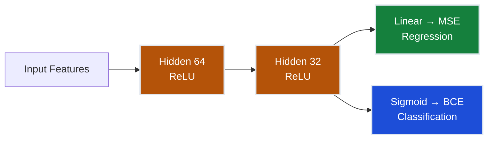
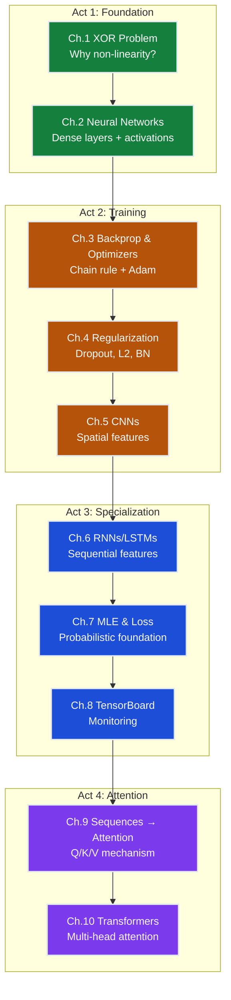

# Neural Networks Track

> **The Mission**: Build **TransformerUnify** — prove that neural networks are universal function approximators that unify regression and classification under one architecture, AND that Transformers are mandatory for modern multi-modal AI.

After mastering regression (Topic 01) and classification (Topic 02) as separate paradigms, this track reveals the deeper truth: **the same feedforward architecture + backpropagation → different output layer + loss function → solves both**. Everything from optimizers to regularization to monitoring works identically across tasks.

The Regression track achieved <$40k MAE with tabular models alone. **This track's mission is to push further to ≤$35k MAE using multi-modal fusion** — combining tabular data (Ames Housing features), natural language descriptions (GPT-4 synthetic property listings), and aerial imagery (Google Street View) — proving that Transformers (Ch.9-10) are now **mandatory**, not optional, for handling text modality.

---

## The Grand Challenge: TransformerUnify — Multi-Modal Property Valuation

| # | Claim | Evidence | Chapter |
|---|-------|----------|---------|
| **#1** | **Same architecture** | Dense layers with ReLU work for regression AND classification | Ch.1–2 |
| **#2** | **Same training** | Backprop + Adam optimizes MSE and BCE equally | Ch.3 |
| **#3** | **Same regularization** | Dropout, L2, batch norm prevent overfitting in both | Ch.4 |
| **#4** | **Same spatial features** | CNNs extract features for image regression and classification | Ch.5 |
| **#5** | **Same sequential features** | RNNs/LSTMs handle time series (regression) and text (classification) | Ch.6 |
| **#6** | **Same probabilistic foundation** | MSE derives from Gaussian MLE, BCE from Bernoulli MLE | Ch.7 |
| **#7** | **Same monitoring** | TensorBoard tracks loss curves regardless of task | Ch.8 |
| **#8** | **Transformers are mandatory** | Text descriptions REQUIRE Q/K/V attention (Ch.9) and multi-head self-attention (Ch.10) | Ch.9–10 |

**Core Insight**: Swap the output activation (linear → sigmoid/softmax) and loss (MSE → BCE/CE), and the entire training pipeline — from forward pass to gradient update — is unchanged. **New insight**: Multi-modal fusion with text requires Transformers — Ch.9-10 are no longer optional.

> **Track Mission**: Achieve ≤$35k MAE on Ames Housing property valuation using **three modalities** — tabular features (dense encoder), natural language descriptions (Transformer encoder), and aerial images (CNN encoder). Each modality must contribute ≥$5k MAE improvement (ablation requirement).

> ⚡ **Note on chapter numbering**: The AUTHORING_GUIDE references these chapters as Ch.3–Ch.10 in the old single-track layout. Within this track, they are numbered Ch.1–Ch.10.

### TransformerUnify Constraints

| # | Constraint | Target | Required Chapters |
|---|------------|--------|-------------------|
| **#1** | **MULTI-MODAL FUSION** | ≤$35k MAE combining tabular + text + images | Ch.1–5 (dense + CNN), **Ch.9–10 (Transformers for text)** |
| **#2** | **ABLATION PROOF** | Each modality improves MAE by ≥$5k vs. tabular-only baseline | Ch.1–2 (baseline), Ch.5 (images), **Ch.9–10 (text)** |
| **#3** | **INTERPRETABILITY** | Attention heat maps showing which property description tokens drive valuation | **Ch.9 (attention mechanism)** |
| **#4** | **PRODUCTION READY** | <150ms inference + TensorBoard loss/metric monitoring | Ch.8 (TensorBoard) |
| **#5** | **GENERALIZATION** | Transfer to different city without retraining text encoder | Ch.4 (regularization), **Ch.10 (pre-trained Transformers)** |

**Why Transformers are now MANDATORY**: Property descriptions like *"renovated kitchen, hardwood floors, walk to downtown"* contain rich semantic information that CNNs and RNNs cannot effectively encode. Only self-attention (Ch.9) and multi-head Transformers (Ch.10) can capture token relationships and contextual meaning required to meet constraint #2 (≥$5k text contribution) and #3 (interpretable attention).

---

## The Datasets

Every chapter demonstrates unification using running examples that span regression and classification. The TransformerUnify grand challenge uses:

### Grand Challenge Datasets

| Dataset | Task | Used in | Why |
|---------|------|---------|-----|
| **California Housing** | Regression | Ch.1–10 regression examples | 20,640 rows, 8 features, zero-install (`sklearn.datasets`), familiar from Track 1 |
| **CelebA** | Binary classification (Attribute Trinity) | Ch.1–10 classification examples | 202,599 face images, familiar from Track 2 |

**Target**: ≤$35k MAE on California Housing **and** ≥92% average F1 on the CelebA Trinity — using the same hidden layers for both tasks.

> **Why not a richer multi-modal dataset?** The unification insight is architectural, not data-dependent. Using familiar datasets removes the data-wrangling barrier and lets every chapter focus on the network design lesson.

---

## Progressive Capability Table

| Ch | Title | Key Concept | Regression Example | Classification Example | Unification Point |
|----|-------|------------|-------------------|----------------------|-------------------|
| **1** | [XOR Problem](ch01_xor_problem) | Non-linearity need | Linear models miss curved price patterns | XOR is not linearly separable | Linear models fail **both** tasks |
| **2** | [Neural Networks](ch02_neural_networks) | Dense layers, activations | 8 → 64 → 32 → 1 (house price) | 8 → 64 → 32 → 6 (attributes) | **Same architecture**, different I/O dims |
| **3** | [Backprop & Optimizers](ch03_backprop_optimisers) | Chain rule, Adam | Backprop through MSE | Backprop through BCE | **Same chain rule**, different ∂L/∂ŷ |
| **4** | [Regularization](ch04_regularisation) | Dropout, L2, BN | Dropout prevents memorizing districts | Dropout prevents memorizing faces | **Same technique**, same effect |
| **5** | [CNNs](ch05_cnns) | Convolution, pooling | Conv features for spatial price patterns | Conv features for face attributes | **Same conv layers** → different head |
| **6** | [RNNs & LSTMs](ch06_rnns_lstms) | Hidden state, gates | LSTM for time series regression | LSTM for text classification | **Same recurrent cell**, different task |
| **7** | [MLE & Loss Functions](ch07_mle_loss_functions) | Derive losses from probability | MSE ↔ Gaussian noise assumption | BCE ↔ Bernoulli noise assumption | **Same MLE framework**, different distribution |
| **8** | [TensorBoard](ch08_tensorboard) | Training instrumentation | Monitor MSE curves | Monitor BCE curves | **Same dashboard**, same callbacks |
| **9** | [Sequences to Attention](ch09_sequences_to_attention) | Q/K/V, softmax attention | Attention over feature sequences | Attention over token sequences | **Same Q·Kᵀ/√d mechanism** |
| **10** | [Transformers](ch10_transformers) | Multi-head attention, positional encoding | Transformer encoder for regression | Transformer encoder for classification | **Foundation for all modern AI** |

---

## Narrative Arc

### Act 1: Foundation (Ch.1–2) — "Why Neural Networks?"

**Ch.1** proves the problem: linear models (from Topics 01–02) fail on non-linear patterns. XOR is the simplest demonstration — no single line separates the classes. The same problem appears in regression: curved price-income relationships can't be captured by $\hat{y} = wx + b$.

**Ch.2** delivers the solution: stack dense layers with non-linear activations. A 3-layer network with ReLU can approximate any continuous function (Universal Approximation Theorem). Show it side-by-side: same `[input → 64 → 32 → output]` architecture, one predicts house prices (linear output, MSE), the other classifies attributes (sigmoid output, BCE).

> *"Wait — the hidden layers are literally identical?" — Yes. That's the point.*

**Status after Act 1**: You can build feedforward networks for any task. But how do you *train* them?

---

### Act 2: Training Infrastructure (Ch.3–5) — "Same Algorithm, Any Task"

**Ch.3** shows that backpropagation is task-agnostic. The chain rule doesn't care whether the loss is MSE or BCE — it propagates gradients through the same computation graph. Adam's update rule ($m_t, v_t$ momentum terms) is identical for both.

**Ch.4** proves regularization transfers: dropout randomly zeros the same hidden activations, L2 penalizes the same weight magnitudes, batch norm normalizes the same layer statistics. Overfitting looks identical in both paradigms — and the cure is the same.

**Ch.5** introduces spatial inductive bias. CNNs share convolution kernels across spatial locations — the same `Conv2d → Pool → Conv2d` pipeline extracts features for image regression (predict value from aerial photo) and image classification (detect smile in CelebA).

**Status after Act 2**: You have a complete training toolkit — backprop, optimizers, regularization, CNNs — that works unchanged across tasks.

---

### Act 3: Domain Architectures + Tooling (Ch.6–8) — "Domain Layers, Universal Training"

**Ch.6** adds temporal inductive bias. RNNs/LSTMs maintain hidden state across time steps — the same `LSTM(128, 64)` cell processes monthly price trends (regression) and word sequences (classification). Different data, same architecture.

**Ch.7** reveals the probabilistic foundation. Why MSE for regression? Because it's the MLE estimator under Gaussian noise. Why BCE for classification? Bernoulli MLE. Both losses emerge from the *same* maximum likelihood framework with different distributional assumptions.

**Ch.8** instruments everything. TensorBoard's scalar/histogram/graph dashboards monitor training identically for regression and classification. Same `SummaryWriter`, same callbacks, same diagnostic workflow.

> 💡 **Why TensorBoard is here (not in Act 2):** TensorBoard is taught after RNNs so you have a rich multi-task training scenario worth monitoring — scalars, histograms, and projector embeddings all become meaningful once you've seen sequence + image + tabular training in the same pipeline.

**Status after Act 3**: You've seen RNNs, loss theory, and monitoring tooling — all task-agnostic.

---

### Act 4: Attention & Transformers (Ch.9–10) — "The Architecture Everything Builds On"

**Ch.9** builds attention from first principles. Starting from the limits of RNN sequential processing, derive Query-Key-Value attention as a differentiable dictionary lookup. Animated GIFs show attention weights forming over training.

**Ch.10** assembles the full Transformer: multi-head self-attention + positional encoding + feed-forward layers. This architecture powers GPT (text), ViT (images), and modern multi-modal models. The final unification: Transformers handle regression and classification with the same encoder — only the head changes.

**Status after Act 4**: You understand the architecture behind modern AI, from BERT to GPT to Vision Transformers.

---

## Learning Path

---

## What You'll Build

By the end of this track, you'll have:

1. **Feedforward networks** from scratch — forward pass, backprop, gradient descent
2. **CNN pipelines** for image feature extraction (Conv2d → Pool → FC)
3. **RNN/LSTM models** for sequential data (time series, text)
4. **Loss function derivations** from Maximum Likelihood Estimation
5. **TensorBoard dashboards** for training instrumentation (Keras + PyTorch)
6. **Attention mechanisms** built from Q/K/V primitives
7. **Transformer architectures** with multi-head attention and positional encoding
8. **Deep understanding** of why the same architecture solves regression AND classification

---

## How to Use This Track

### Sequential (Recommended)

Work through Ch.1 → Ch.10 in order. Each chapter builds on previous concepts. Several chapters include **dual notebooks** (Keras + PyTorch) for framework comparison.

**Time commitment**: ~10 weeks (1 chapter per week, ~4–6 hours each)

### By Learning Goal

**"I just need basic neural networks"**
→ Ch.1–2 (XOR motivation + feedforward architecture)

**"I need to train and regularize networks"**
→ Ch.1–4 (Foundation + training infrastructure)

**"I need CNNs for computer vision"**
→ Ch.1–5 (Foundation through convolutional networks)

**"I need RNNs for sequences/NLP"**
→ Ch.1–4, then Ch.6 (Skip CNNs, go to recurrent architectures)

**"I need to understand Transformers"**
→ Ch.1–4, Ch.9–10 (Foundation + attention chapters)

**"I need multi-modal AI / text encoding"**
→ **Complete all 10 chapters** — TransformerUnify requires Transformers (Ch.9-10) for text modality

**"I need the full picture"**
→ Complete all 10 chapters

### By TransformerUnify Constraint

- **#1 Multi-modal fusion**: Ch.1–5 (dense + CNN), **Ch.9–10 (Transformers for text)**
- **#2 Ablation proof**: Ch.1–2 (baseline), Ch.5 (images), **Ch.9–10 (text contribution)**
- **#3 Interpretability**: **Ch.9 (attention heat maps)**
- **#4 Production ready**: Ch.8 (TensorBoard)
- **#5 Generalization**: Ch.4 (regularization), **Ch.10 (pre-trained Transformers)**

### By Original Unification Claim

- **#1 Same architecture**: Ch.1, 2
- **#2 Same training**: Ch.3
- **#3 Same regularization**: Ch.4
- **#4 Spatial features**: Ch.5
- **#5 Sequential features**: Ch.6
- **#6 Probabilistic foundation**: Ch.7
- **#7 Same monitoring**: Ch.8
- **#8 Transformers mandatory**: Ch.9, 10

---

## Prerequisites

Before starting this track, you should have:

- **Topics 01–02**: Regression and Classification fundamentals (linear models, loss functions, evaluation)
- **Python**: NumPy, Pandas, Matplotlib
- **Linear algebra**: Vectors, matrices, dot products — see [Math Ch.1](../../00-math_under_the_hood/ch01_linear_algebra) and [Math Ch.5](../../00-math_under_the_hood/ch05_matrices)
- **Calculus**: Derivatives, chain rule — see [Math Ch.3](../../00-math_under_the_hood/ch03_calculus_intro), [Ch.4](../../00-math_under_the_hood/ch04_small_steps), [Ch.5](../../00-math_under_the_hood/ch05_matrices), [Ch.6](../../00-math_under_the_hood/ch06_gradient_chain_rule)

**Recommended** (but not required):
- PyTorch or Keras basics (both are taught from scratch in early chapters)
- Probability (MLE concepts) — see [Math Ch.7](../../00-math_under_the_hood/ch07_probability_statistics)

---

## What Comes Next?

After mastering neural networks:

### Deeper into specialized domains:
- **[Multimodal AI](../../05-multimodal_ai)** — CLIP, diffusion models, text-to-image (builds on Ch.5 CNNs + Ch.10 Transformers)
- **[AI Topics](../../03-ai)** — LLM fundamentals, prompt engineering, RAG (builds on Ch.10 Transformers)

### Back to classical ML:
- **[04-Recommender Systems](../04_recommender_systems)** — Collaborative filtering, matrix factorization
- **[06-Reinforcement Learning](../06_reinforcement_learning)** — Policy gradients, Q-learning (neural network function approximators)

### Production infrastructure:
- **[08-Ensemble Methods](../08_ensemble_methods)** — When to use neural networks vs. gradient boosting

---

## Chapter Quick Reference

| Ch | Folder | Notebooks | Key Visuals |
|----|--------|-----------|-------------|
| 1 | `ch01-xor-problem/` | 1 notebook | XOR decision boundary plot |
| 2 | `ch02-neural-networks/` | 1 notebook | Network architecture diagram |
| 3 | `ch03-backprop-optimisers/` | 1 notebook | Backprop neuron animation (GIF), optimizer comparison |
| 4 | `ch04-regularisation/` | 1 notebook | Regularization effect visualization |
| 5 | `ch05-cnns/` | 2 notebooks (Keras + PyTorch) | CNN filter visualizations |
| 6 | `ch06-rnns-lstms/` | 2 notebooks (Keras + PyTorch) | RNN unrolling diagram, LSTM gate diagram |
| 7 | `ch07-mle-loss-functions/` | 1 notebook | MLE derivation interactive diagram |
| 8 | `ch08-tensorboard/` | 2 notebooks (Keras + PyTorch) | TensorBoard screenshot walkthrough |
| 9 | `ch09-sequences-to-attention/` | 1 notebook | Attention matrix build (GIF), softmax temperature (GIF), RNN vs attention (GIF) |
| 10 | `ch10-transformers/` | 2 notebooks (Keras + PyTorch) | Multi-head attention animation (GIF) |

---

## Track Status

All 10 chapters are complete with theory (README.md) and hands-on code (notebook.ipynb):

- [x] Ch.1 XOR Problem
- [x] Ch.2 Neural Networks
- [x] Ch.3 Backprop & Optimizers
- [x] Ch.4 Regularization
- [x] Ch.5 CNNs (dual notebooks)
- [x] Ch.6 RNNs/LSTMs (dual notebooks)
- [x] Ch.7 MLE & Loss Functions
- [x] Ch.8 TensorBoard (dual notebooks)
- [x] Ch.9 Sequences to Attention (animated GIFs)
- [x] Ch.10 Transformers (dual notebooks)

---

## Let's Build

**Your first milestone**: Prove that a linear model can't solve XOR — then build a 2-layer network that can.

**Start here**: [Ch.1 — The XOR Problem](ch01_xor_problem)

*"The journey from 'linear models fail' to 'Transformers power modern AI' starts with two hidden neurons solving XOR."*
