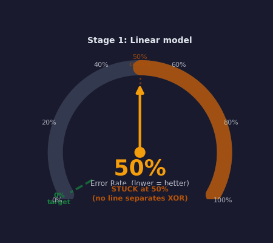
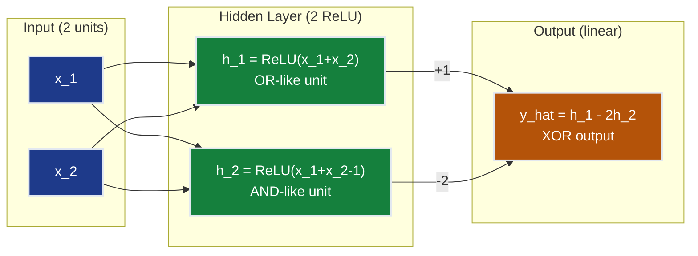
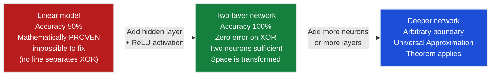
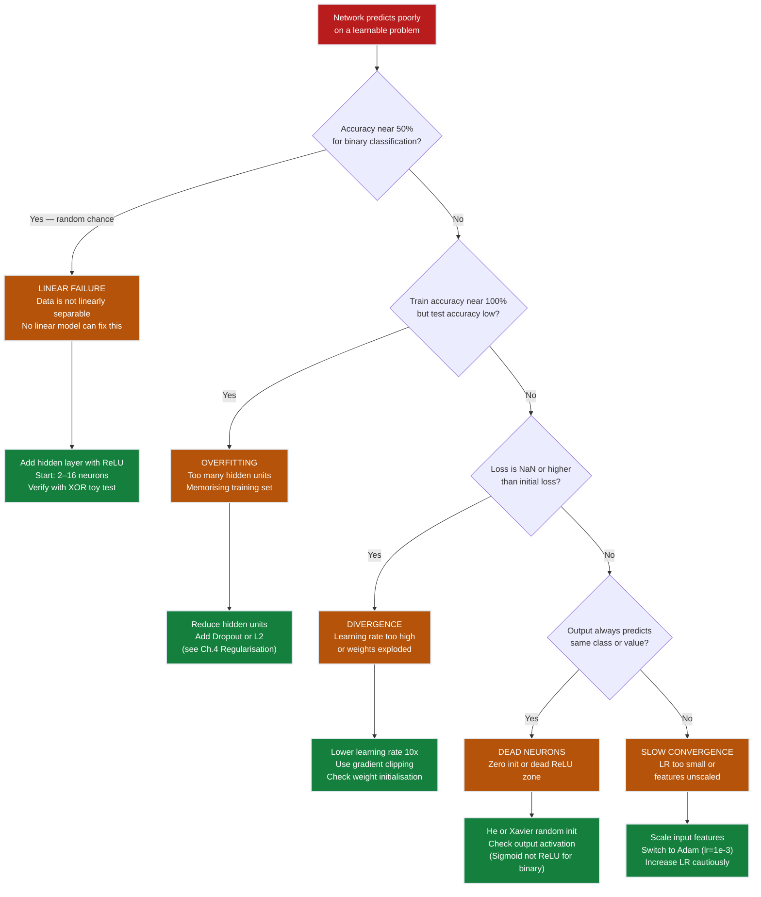
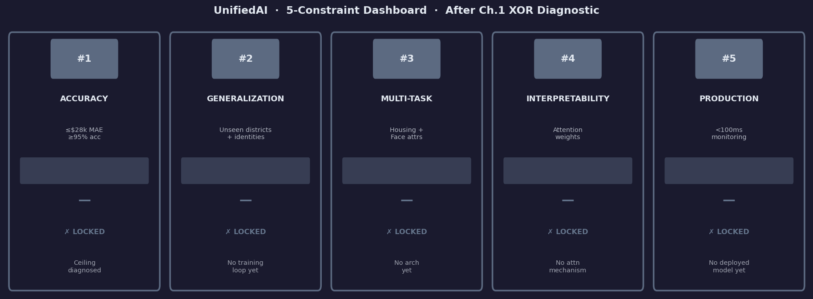

# Ch.1 — The XOR Problem

> **The story.** In **1969** **Marvin Minsky** and **Seymour Papert** published *Perceptrons* — a meticulous, 258-page mathematical takedown of **Frank Rosenblatt's** 1958 perceptron. The headline theorem: a single-layer perceptron cannot learn XOR, the simplest non-linearly-separable function imaginable. Minsky and Papert did not merely demonstrate the failure — they *proved* it was structural and inescapable; no adjustment to weights or training procedure could ever overcome it. The book was correct, clean, and devastating. Every researcher who mattered read it. Government funding agencies — particularly DARPA — read it too. Funding evaporated almost immediately. Neural-network research collapsed into the **first AI winter** and the field lay frozen for nearly two decades while attention drifted to expert systems and symbolic AI.
>
> The thaw began in **1986** when Rumelhart, Hinton, and Williams published *Learning representations by back-propagating errors* in *Nature*. The paper showed that **one extra hidden layer** combined with backpropagation of gradients could learn XOR — and could, in principle, learn any function that a sequence of composable transformations could represent. The key word was *hidden*: neurons that are not directly connected to inputs or outputs, whose sole job is to reshape the representation space. The **Universal Approximation Theorem** (Cybenko 1989; Hornik 1991) made it rigorous: a feedforward network with a single hidden layer of sufficient width and a non-polynomial activation function can approximate any continuous function on a compact set to arbitrary precision. The AI winter ended. This chapter re-runs the 1969 experiment under the microscope: watches the linear model fail on a 4-point dataset, derives *why* it must always fail (algebra, not empiricism), then constructs by hand the one-hidden-layer network that solves XOR — the exact moment that justified modern deep learning.
>
> **Where you are in the curriculum.** Topics 01-02 (Regression and Classification) equipped you with linear models: regression fits $\hat{y} = \mathbf{w}^\top\mathbf{x} + b$; logistic regression fits a sigmoid on top. Both carve feature space with a single hyperplane. This chapter reveals, on the platform's own housing data, exactly where that straight line breaks: coastal-and-high-income districts are premium; inland-and-low-income districts are not; but coastal-with-low-income and inland-with-high-income are a confusing middle ground that no straight line separates. That is XOR in disguise. One hidden layer with a non-linear activation resolves it, and that resolution is the entire motivation for neural networks.
>
> **Notation in this chapter.** $x_1, x_2 \in \{0,1\}$ — binary input features; $y = x_1 \oplus x_2$ — XOR target; $\mathbf{x} = [x_1, x_2]^\top$ — input vector; $\mathbf{h} \in \mathbb{R}^k$ — hidden-layer post-activation; $W^{(1)} \in \mathbb{R}^{k \times 2}$, $\mathbf{b}^{(1)} \in \mathbb{R}^k$ — first-layer weights and bias; $W^{(2)} \in \mathbb{R}^{1 \times k}$, $b^{(2)} \in \mathbb{R}$ — output-layer weights and bias; $\sigma(z) = 1/(1+e^{-z})$ — sigmoid; $\text{ReLU}(z) = \max(0, z)$ — rectified linear unit; $\hat{y}$ — network prediction.

---

## 0 · The Challenge — Where We Are

> 💡 **The mission**: Launch **UnifiedAI** — prove neural networks unify regression and classification under one architecture, achieving:
> 1. **ACCURACY**: ≤$28k MAE (housing regression) + ≥95% avg accuracy (face classification)
> 2. **GENERALIZATION**: Unseen districts + new celebrity identities
> 3. **MULTI-TASK**: Same architecture predicts value AND classifies face attributes simultaneously
> 4. **INTERPRETABILITY**: Attention weights provide explainable feature attribution
> 5. **PRODUCTION**: <100ms inference, TensorBoard monitoring

**What we know so far:**
- ✅ **Topic 01 (Regression)**: Linear regression baseline on California Housing — ~$70k MAE
- ✅ **Topic 02 (Classification)**: Logistic regression for binary face attribute classification — ~88% on one attribute
- ✅ Gradient descent, MSE, BCE, train/test splits, evaluation metrics
- ✅ Polynomial features (Ch.4 Regression) — some non-linearity helps, but no hidden layers yet

**What's blocking us:**

The product team applied logistic regression to a "Premium Neighbourhood" classifier and found:
- **Coastal + High-Income** districts — correctly labelled premium ✓
- **Inland + Low-Income** districts — correctly labelled non-premium ✓
- **Coastal + Low-Income** districts — ❌ **misclassified** (income weight dominates negatively)
- **Inland + High-Income** districts — ❌ **misclassified** (income weight dominates positively)

The true decision boundary is **non-linear** — you need a curved surface — but logistic regression can only produce a straight hyperplane. No amount of additional training epochs or learning rate tuning can fix this; it is a **structural impossibility**.

**Why this blocks every UnifiedAI constraint:**
- ❌ **Constraint #1 (ACCURACY)**: Can't hit ≤$28k MAE if the model structurally can't represent non-linear price interactions
- ❌ **Constraint #3 (MULTI-TASK)**: Classification side broken for any non-linearly-separable attribute
- ❌ **Constraint #4 (INTERPRETABILITY)**: Linear coefficients are meaningless when the true relationship is non-linear

> ⚠️ **DIAGNOSTIC CHAPTER** — This chapter does not unlock any UnifiedAI constraint. Instead:
> 1. **Proves the problem** algebraically — XOR has no linear solution (no retraining can fix it)
> 2. **Shows the failure** on real housing data (coastal × income interaction)
> 3. **Derives the solution** — one hidden layer + non-linear activation can learn XOR exactly
> 4. **Motivates Ch.2** — the UAT guarantees a one-hidden-layer network can approximate any function; Ch.2 builds the full architecture

> ⚡ Every real-world ML problem has non-linear decision boundaries. Moving beyond linear models is not optional; it is the prerequisite for everything in this track.

---

## Animation



---

## 1 · The Core Idea

A single linear layer — whether doing regression or classification — can only draw a straight line (or hyperplane) through the data. The XOR problem is the simplest possible case where no straight line works. Understanding *why* it fails, and *precisely what* fixes it, is the entire motivation for adding hidden layers to a network.

**The fix requires three ingredients working together:**

1. **An additional layer** — at least one hidden layer between input and output
2. **Non-linear activation** — a function like ReLU or sigmoid applied to each hidden unit's output
3. **Sufficient width** — at least 2 hidden neurons for XOR; more for harder problems

With these three ingredients, one hidden layer is enough to solve XOR exactly. The Universal Approximation Theorem generalises this: one hidden layer of sufficient width can approximate *any* continuous function to arbitrary precision. That result justifies the existence of neural networks entirely.

**The mental model.** Think of the hidden layer as a pre-processing step that re-draws the input space. The output layer always draws a straight line — it never changes. The hidden layer's job is to transform the inputs into a new coordinate system where that straight line works. For XOR, the transformation is simple: map the two XOR-positive inputs to the same point, and the two XOR-negative inputs to different points. The output layer's straight line then separates them trivially.

> **The key shift in perspective:** stop thinking of a neural network as "a complex function". Think of it as **a learned coordinate transformation followed by a linear classifier**. The depth and width of the network determine how powerful the coordinate transformation can be; the output layer is always linear.

---

## 2 · Running Example: The XOR Pattern in California Housing

You have been building models for the real estate platform. Something keeps breaking: districts that are **coastal** *and* **high-income** are premium. Districts that are **inland** *and* **low-income** are not. But the mixed cases — coastal-with-low-income and inland-with-high-income — sit in a confusing middle ground that the linear model keeps misclassifying regardless of how long you train it.

This is XOR in disguise. Label the premium classification as $y = 1$ when both features point the same direction (both coastal + high-income, or both inland + low-income), and $y = 0$ otherwise. No straight line in `(coastal, income)` space separates the two classes — you need a curved boundary. A perceptron cannot learn it; a two-layer network can.

We demonstrate the XOR failure on synthetic data first (the canonical 4-point example where the impossibility is starkest), then show the same phenomenon on the housing data using `Latitude` (coastal proxy) and `MedInc` as the two features.

**Why this matters for UnifiedAI:** California Housing has 8 features with complex interactions. Any pair of features that jointly affect price but neither alone does creates an XOR-like interaction. A model with no hidden layers cannot represent any of them. That structural ceiling is exactly why linear regression achieves only ~$70k MAE — not because the data is noisy, but because the model is structurally incapable of representing the true relationship.

---

## 3 · The XOR Problem at a Glance

### 3.1 · Truth Table

| $x_1$ | $x_2$ | $y = x_1 \oplus x_2$ | Housing analogy |
|--------|--------|----------------------|-----------------|
| 0 | 0 | **0** | Inland + low-income → not premium |
| 0 | 1 | **1** | Inland + high-income → premium |
| 1 | 0 | **1** | Coastal + low-income → premium |
| 1 | 1 | **0** | Coastal + high-income — XOR-like interaction |

XOR is 1 when exactly one input is 1. It is 0 when both are 0 or both are 1. The label depends on the *combination*, not either feature independently — and that interaction is precisely what a linear model cannot represent.

**How to think about it:** if you know only $x_1 = 1$, you cannot determine the label — it could be 0 or 1 depending on $x_2$. If you know only $x_2 = 0$, you cannot determine the label either. Only *knowing both* resolves the ambiguity. This is the defining property of a non-linearly-separable function: no single feature carries enough information; the decision requires a joint evaluation.

### 3.2 · Geometry — Why No Line Separates XOR

```
          x2
          1 |  o(0,1)=1    *(1,1)=0
            |
          0 |  *(0,0)=0    o(1,0)=1
            +---------------------------  x1
              0              1

  * = class 0   o = class 1
```

The two class-1 points `(0,1)` and `(1,0)` sit at diagonally opposite corners. The two class-0 points `(0,0)` and `(1,1)` sit at the other two corners. Any straight line that separates the class-1 point at top-left from the class-0 point at top-right must also separate the class-0 point at bottom-left from the class-1 point at bottom-right — and those two constraints are geometrically incompatible. You would need to "cut" both diagonals simultaneously, which a single line cannot do.

This is **linear inseparability**: no hyperplane can separate the two classes.

**The two-line test.** You can convince yourself visually: try to draw any straight line through the XOR plot above that puts both circles on one side and both stars on the other. Every line you try will either:
- Put the top-left circle and the bottom-right circle together (wrong — they are different classes), or
- Put the top-right star and the bottom-left star together (wrong — they are different classes)

These are the only two options for a line oriented diagonally. A line oriented horizontally or vertically fares even worse: a horizontal line at $x_2 = 0.5$ puts both top points together (one of each class) and both bottom points together (one of each class) — 50% accuracy no matter how you set the threshold.

### 3.3 · What a Hidden Layer Actually Does

The hidden layer does not draw a curved line. Instead, it **transforms the input space** into a new representation where the classes *are* linearly separable. Each hidden neuron draws one linear boundary in the original space; together they carve the original space into regions. The output layer then draws a straight line in the transformed space — which corresponds to a curved boundary back in the original.

A key observation: inputs `(0,1)` and `(1,0)` are geometrically diagonal — but in the hidden layer's transformed space they map to the *same* representation. The hard part (distinguishing diagonal same-class points) is solved by the transformation, not by a curve.

**Model expressivity — what each architecture can represent:**

| Architecture | Parameters (2 inputs) | Boundary shape | Solves XOR? | Solves housing? |
|---|---|---|---|---|
| Single perceptron (threshold) | 3 | Hyperplane (straight line) | ❌ | ❌ |
| Logistic regression | 3 | Hyperplane | ❌ | ❌ |
| Degree-2 polynomial features | 6 | Quadratic surface | ✅ (if $x_1 x_2$ included) | Partial |
| 1 hidden layer, 2 ReLU neurons | 9 | Piecewise-linear (2 folds) | ✅ | Partial |
| 1 hidden layer, 64 ReLU neurons | 193 | Complex piecewise-linear | ✅ | ✅ |
| 3 hidden layers (64→32→16, ReLU) | ~5k | Hierarchical piecewise-linear | ✅ | ✅ strong |

The jump from logistic regression (3 parameters) to a 1-hidden-layer network with 2 neurons (9 parameters) adds only 6 parameters — yet unlocks a fundamentally different class of functions. The asymmetry between the cost of the solution and the magnitude of what it unlocks is why hidden layers were such a breakthrough.

### 3.4 · The Two-Layer Forward Pass at a Glance

Before diving into the full math, here is the complete computation in pseudocode form — this is the same loop that \§6 expands with explicit matrices:

```
# Forward pass: 2-layer XOR network
# Input: x = [x1, x2]

z1 = W1 · x + b1           # hidden pre-activations: shape (2,)
h  = ReLU(z1)              # hidden activations: shape (2,)
z2 = W2 · h + b2           # output pre-activation: scalar
y_hat = z2                 # linear output (no final activation for regression)
                           # for binary classification: y_hat = sigmoid(z2)
```

Each step has a name and a purpose:
- `z1` — the "raw signal" before each hidden neuron decides whether to fire
- `h` — the hidden layer's representation of the input (the transformed space)
- `z2` — the output layer's linear combination of the hidden representation
- `y_hat` — the final prediction

The non-linearity (`ReLU`) is the only thing that prevents this from collapsing to a single linear layer (see \§4.3 for the algebraic proof of this claim).

---

## 4 · The Math

### 4.1 · Proof: No Linear Classifier Can Solve XOR

A binary linear classifier assigns label 1 if $w_1 x_1 + w_2 x_2 + b > 0$ and label 0 otherwise. For XOR, we need all four constraints satisfied simultaneously:

$$\text{(0,0) → 0:} \quad w_1 \cdot 0 + w_2 \cdot 0 + b \leq 0 \quad\Rightarrow\quad b \leq 0 \tag{C1}$$

$$\text{(0,1) → 1:} \quad w_1 \cdot 0 + w_2 \cdot 1 + b > 0 \quad\Rightarrow\quad w_2 > -b \tag{C2}$$

$$\text{(1,0) → 1:} \quad w_1 \cdot 1 + w_2 \cdot 0 + b > 0 \quad\Rightarrow\quad w_1 > -b \tag{C3}$$

$$\text{(1,1) → 0:} \quad w_1 \cdot 1 + w_2 \cdot 1 + b \leq 0 \quad\Rightarrow\quad w_1 + w_2 \leq -b \tag{C4}$$

**Deriving the contradiction.** Add C2 and C3:

$$(w_2 + b) + (w_1 + b) > 0 + 0 \quad\Rightarrow\quad w_1 + w_2 > -2b$$

Constraint C4 says $w_1 + w_2 \leq -b$. Combining these two results:

$$-2b < w_1 + w_2 \leq -b$$

For this range to be non-empty, the left bound must be strictly less than the right bound:

$$-2b < -b \quad\Rightarrow\quad -b < 0 \quad\Rightarrow\quad b > 0$$

But C1 requires $b \leq 0$. We need simultaneously $b > 0$ and $b \leq 0$.

**Contradiction. No real numbers $w_1, w_2, b$ satisfy all four XOR constraints.** $\square$

> 💡 **Key insight**: the contradiction arises because XOR requires *interaction* between $x_1$ and $x_2$. A linear model can only represent additive effects ($w_1 x_1 + w_2 x_2$), never a multiplicative interaction term. The California Housing equivalent: the joint effect of `Latitude × MedInc` on price cannot be expressed as a sum of their individual effects — and that is precisely the interaction linear regression misses.

This is not a failure of optimisation. It is a failure of *expressivity*. No learning algorithm, no matter how sophisticated, can find weights that do not exist.

**Try it numerically.** To see the contradiction concretely, pick $w_1 = 1, w_2 = 1, b = -0.5$ (a natural guess: fire when either input is 1, suppress when neither fires):

| Input | $w_1 x_1 + w_2 x_2 + b$ | Decision ($> 0$?) | True label | Correct? |
|---|---|---|---|---|
| (0,0) | $0 + 0 - 0.5 = -0.5$ | 0 (no) | 0 | ✅ |
| (0,1) | $0 + 1 - 0.5 = +0.5$ | 1 (yes) | 1 | ✅ |
| (1,0) | $1 + 0 - 0.5 = +0.5$ | 1 (yes) | 1 | ✅ |
| (1,1) | $1 + 1 - 0.5 = +1.5$ | 1 (yes) | **0** | ❌ |

3 of 4 correct — but input (1,1) is wrong. No matter how you adjust $w_1$, $w_2$, or $b$, you cannot simultaneously satisfy C1–C4. The proof above shows why: the constraints are algebraically contradictory.

---

### 4.2 · Universal Approximation Theorem

> **Informal statement (Cybenko 1989; Hornik 1991):** A feedforward neural network with a single hidden layer containing a finite number of neurons and a non-linear (non-polynomial) activation function can approximate any continuous function $f : \mathbb{R}^n \to \mathbb{R}$ on a compact subset of $\mathbb{R}^n$ to arbitrary precision.

In plain English: **one hidden layer is enough in theory.** You may need many neurons for hard functions, but a solution is guaranteed to exist.

**Three things the theorem says:**
1. ✅ A solution *exists* — you do not need infinite depth
2. ⚠️ It does not say how *wide* the hidden layer must be — could require a huge width
3. ⚠️ It does not say gradient descent will *find* the solution — only that it exists

**Intuition for why this is true.** A single hidden neuron with a sigmoid activation draws one S-shaped "bump" in the output space. By positioning bumps at the right locations with the right heights, you can approximate any function value at any input. This is analogous to Fourier series approximation: any periodic function can be approximated by a sum of sine waves; any continuous function can be approximated by a sum of sigmoid bumps. The more bumps (hidden neurons), the better the approximation.

**What "compact subset" means.** The theorem applies on a closed and bounded input region — say, all values of `MedInc` between 0 and 10, and all values of `Latitude` between 32 and 42. It does not say anything about extrapolation outside the training distribution. A network that perfectly approximates the function on the training region may behave arbitrarily on inputs far outside it. This is why distribution shift is a production risk.

**Why depth wins in practice.** A deep network can represent the same function as a shallow one with exponentially fewer neurons. Depth creates a hierarchy of features: early layers detect simple patterns; later layers compose them into complex representations. For XOR we need only 2 hidden neurons and 1 layer — but for 200k-pixel face images, depth is essential.

> ➡️ **Connection to Ch.2 (Neural Networks):** The UAT motivates building a full multi-layer network for California Housing. If one hidden layer is theoretically sufficient and XOR needs only 2 neurons, what does an 8-feature housing regression need? Ch.2 answers this empirically.

---

### 4.3 · Non-Linearity Is Necessary: Stacking Linear Layers = One Linear Layer

**The algebraic proof.** Suppose you stack two linear layers with *no* activation function between them. To make it concrete, use $2 \times 2$ weight matrices:

$$W^{(1)} = \begin{bmatrix} 3 & 1 \\ -1 & 2 \end{bmatrix}, \qquad W^{(2)} = \begin{bmatrix} 1 & 0 \\ 2 & -1 \end{bmatrix}$$

**Naive expectation:** with two layers, surely the network is twice as expressive? Let's see what the product $W^* = W^{(2)} W^{(1)}$ produces:

$$W^* = \begin{bmatrix} 1 & 0 \\ 2 & -1 \end{bmatrix} \begin{bmatrix} 3 & 1 \\ -1 & 2 \end{bmatrix} = \begin{bmatrix} 3 & 1 \\ 7 & 0 \end{bmatrix}$$

Just another $2 \times 2$ matrix — still a linear transformation. The two-layer stack is exactly equivalent to the single weight matrix $W^* = \begin{bmatrix} 3 & 1 \\ 7 & 0 \end{bmatrix}$. No extra expressivity whatsoever.

**General case:**

$$\mathbf{h} = W^{(1)}\mathbf{x} + \mathbf{b}^{(1)}$$

$$\hat{y} = W^{(2)}\mathbf{h} + b^{(2)}$$

Substitute the first into the second:

$$\hat{y} = W^{(2)}\bigl(W^{(1)}\mathbf{x} + \mathbf{b}^{(1)}\bigr) + b^{(2)} = \underbrace{W^{(2)} W^{(1)}}_{W^*}\mathbf{x} + \underbrace{W^{(2)}\mathbf{b}^{(1)} + b^{(2)}}_{b^*} = W^*\mathbf{x} + b^*$$

Two linear layers collapse to a single linear layer with $W^* = W^{(2)}W^{(1)}$ and $b^* = W^{(2)}\mathbf{b}^{(1)} + b^{(2)}$.

**Stack 100 linear layers — you still get exactly one linear layer.** Each layer's weight matrix folds into the product $W^{(100)} \cdots W^{(2)} W^{(1)}$, still a matrix. The added depth buys nothing.

**The activation function breaks this collapse.** With a non-linear $\sigma$ inserted:

$$\mathbf{h} = \sigma\bigl(W^{(1)}\mathbf{x} + \mathbf{b}^{(1)}\bigr)$$

Now $\hat{y} = W^{(2)}\mathbf{h} + b^{(2)}$ cannot be simplified to $W^*\mathbf{x} + b^*$ — the non-linearity inside $\sigma$ prevents the algebraic cancellation. The two-layer network genuinely has more representational power.

> ⚡ **Constraint connection**: this proof explains why linear regression ($W\mathbf{x}+b$) is structurally limited to ~$70k MAE on California Housing. Adding more features helps, but no linear model can represent the XOR-like interaction patterns in the data. A hidden layer with activation is required.

**Practical implication.** When you see a PyTorch or Keras model defined as:

```python
model = nn.Sequential(
    nn.Linear(2, 4),   # layer 1
    nn.Linear(4, 2),   # layer 2 — NO activation between layers!
    nn.Linear(2, 1),   # output
)
```

This is mathematically identical to `nn.Linear(2, 1)`. Three lines of code, three parameters to configure — but only one layer's worth of representational power. Always insert `nn.ReLU()` (or another non-linearity) between linear layers.

---

### 4.4 · Designing a Network That Solves XOR by Hand

We construct explicit weights that achieve zero error on all four XOR inputs. This uses **ReLU activation** for clean integer arithmetic, following Goodfellow et al. (2016) *Deep Learning* §6.1.

**Architecture:** 2 inputs → 2 hidden neurons (ReLU) → 1 linear output

**First-layer weights and bias:**

$$W^{(1)} = \begin{bmatrix} 1 & 1 \\ 1 & 1 \end{bmatrix}, \qquad \mathbf{b}^{(1)} = \begin{bmatrix} 0 \\ -1 \end{bmatrix}$$

Hidden neuron 1 computes $\text{ReLU}(x_1 + x_2 + 0)$ — an **OR-like function** that fires whenever at least one input is 1.

Hidden neuron 2 computes $\text{ReLU}(x_1 + x_2 - 1)$ — an **AND-like function** that fires only when both inputs are 1.

**Output-layer weights and bias:**

$$W^{(2)} = \begin{bmatrix} 1 & -2 \end{bmatrix}, \qquad b^{(2)} = 0$$

Output: $\hat{y} = h_1 - 2h_2$. When OR fires but AND does not, output = 1. When neither or both fire, output = 0.

**Verification — input (0, 0), expected 0:**

$$\mathbf{z}^{(1)} = \begin{bmatrix}0+0+0\\0+0-1\end{bmatrix} = \begin{bmatrix}0\\-1\end{bmatrix}, \quad \mathbf{h} = \text{ReLU}\begin{bmatrix}0\\-1\end{bmatrix} = \begin{bmatrix}0\\0\end{bmatrix}, \quad \hat{y} = 1(0) + (-2)(0) = \mathbf{0} \checkmark$$

**Verification — input (0, 1), expected 1:**

$$\mathbf{z}^{(1)} = \begin{bmatrix}0+1+0\\0+1-1\end{bmatrix} = \begin{bmatrix}1\\0\end{bmatrix}, \quad \mathbf{h} = \text{ReLU}\begin{bmatrix}1\\0\end{bmatrix} = \begin{bmatrix}1\\0\end{bmatrix}, \quad \hat{y} = 1(1) + (-2)(0) = \mathbf{1} \checkmark$$

**Verification — input (1, 0), expected 1:**

$$\mathbf{z}^{(1)} = \begin{bmatrix}1+0+0\\1+0-1\end{bmatrix} = \begin{bmatrix}1\\0\end{bmatrix}, \quad \mathbf{h} = \text{ReLU}\begin{bmatrix}1\\0\end{bmatrix} = \begin{bmatrix}1\\0\end{bmatrix}, \quad \hat{y} = 1(1) + (-2)(0) = \mathbf{1} \checkmark$$

**Verification — input (1, 1), expected 0:**

$$\mathbf{z}^{(1)} = \begin{bmatrix}1+1+0\\1+1-1\end{bmatrix} = \begin{bmatrix}2\\1\end{bmatrix}, \quad \mathbf{h} = \text{ReLU}\begin{bmatrix}2\\1\end{bmatrix} = \begin{bmatrix}2\\1\end{bmatrix}, \quad \hat{y} = 1(2) + (-2)(1) = 2-2 = \mathbf{0} \checkmark$$

All four XOR cases solved exactly. The linear model's impossibility (§4.1) is reversed by two neurons and a ReLU.

**Why these particular weights work — the OR/AND interpretation:**

The two hidden neurons implement complementary detection strategies:

| Neuron | Pre-activation formula | Fires when | Role |
|---|---|---|---|
| $h_1$ | $\text{ReLU}(x_1 + x_2 + 0)$ | $x_1 + x_2 \geq 1$ | **OR gate**: at least one input is active |
| $h_2$ | $\text{ReLU}(x_1 + x_2 - 1)$ | $x_1 + x_2 \geq 2$ | **AND gate**: both inputs simultaneously active |

The output layer computes $\hat{y} = h_1 - 2h_2$: "fire when OR is active, but cancel out when AND is also active." In Boolean terms: $\text{XOR}(x_1, x_2) = \text{OR}(x_1, x_2) - 2 \cdot \text{AND}(x_1, x_2)$, which evaluates to 0, 1, 1, 0 for the four cases — exactly XOR.

**California Housing interpretation.** Replace $x_1$ = coastal indicator, $x_2$ = high-income indicator:
- $h_1$ detects "at least one premium signal" — fires for coastal, high-income, or both
- $h_2$ detects "both premium signals simultaneously" — fires only for the coastal-AND-high-income case
- Output $h_1 - 2h_2$ fires for the XOR-positive cases (one premium signal only) and suppresses the XOR-negative cases (no signal or both signals simultaneously)

This is the architectural analogue of the interaction term $x_1 x_2$ from polynomial features — but it is *learned* from data rather than hand-crafted.

---

## 5 · The Why Non-Linearity Arc

### Act 1 · Linear Model Fails — Proved Mathematically

**Experiment:** train logistic regression on the four XOR points with labels $\{0, 1, 1, 0\}$.

No matter how many epochs you train, the binary cross-entropy loss plateaus above $\ln 2 \approx 0.693$ — exactly the loss of a model that predicts 50% for every input. The accuracy never exceeds 50%. This is not slow convergence. The model has *already converged*, to the best possible linear solution, which gets 2 of 4 points right regardless of where you draw the line. The §4.1 proof explains why: the constraints are mathematically contradictory.

**What "best possible" looks like:** the trained logistic regression will converge to some weight vector, for example $w_1 \approx 0, w_2 \approx 0, b \approx 0$ (all-zeros), which predicts $\hat{y} = \sigma(0) = 0.5$ for every input. The loss is $-\frac{1}{4}[\ln(0.5) + \ln(0.5) + \ln(0.5) + \ln(0.5)] = \ln 2 \approx 0.693$ — the theoretical minimum for a linear model on XOR.

**Why not just add polynomial features?** Adding $x_1 x_2$ as a third feature would solve XOR for this toy dataset — the product term directly captures the interaction. But this requires knowing in advance *which* interaction matters. For an 8-feature housing dataset there are 28 pairwise interaction terms, 56 three-way terms, and so on; for the face classification track there are thousands of pixel interactions. A hidden layer learns which interactions matter **automatically** during gradient descent.

### Act 2 · Adding Sigmoid to the Output — Does It Help?

**Experiment:** apply sigmoid to a single linear unit: $\hat{y} = \sigma(w_1 x_1 + w_2 x_2 + b)$.

This does not solve XOR. Sigmoid applied to a linear combination is monotone in each input. The decision boundary $\hat{y} = 0.5$ corresponds exactly to $w_1 x_1 + w_2 x_2 + b = 0$ — a straight line. The sigmoid changes the output range from $\mathbb{R}$ to $(0,1)$; it does not change the decision boundary in input space. Act 2 fails for the same algebraic reason as Act 1.

> 💡 **Key insight**: the activation function must act on the **hidden layer** to bend the representation space. Applied only to the output, it changes the output range but not the expressivity.

### Act 3 · One Hidden Layer with 2 Neurons Solves XOR Exactly

**Experiment:** add a hidden layer with 2 ReLU neurons (the network from §4.4).

The error on all four XOR points drops to zero. What did the hidden layer do? It transformed the input space into a new 2D representation:

| Input | Original $(x_1, x_2)$ | Hidden representation $\mathbf{h}$ | Class |
|---|---|---|---|
| (0,0) | $(0, 0)$ | $[0, 0]$ | 0 |
| (0,1) | $(0, 1)$ | $[1, 0]$ | 1 |
| (1,0) | $(1, 0)$ | $[1, 0]$ | 1 |
| (1,1) | $(1, 1)$ | $[2, 1]$ | 0 |

In the new $\mathbf{h}$ space, plot the four points: $[0,0]$ and $[2,1]$ are class 0; $[1,0]$ (appearing twice from two different original inputs) is class 1. Now try drawing a line to separate them. Easy: a line between $[0,0]$/$[2,1]$ and $[1,0]$ separates perfectly.

In the new space, the two class-1 points both map to $[1,0]$ — they are the *same point*. The output layer only checks: is the representation near $[1,0]$? A straight line in hidden space does this exactly. The curved boundary in original space emerges from the linear boundary in transformed space.

> 📖 **Play with it live:** [TensorFlow Playground](https://playground.tensorflow.org/) is an in-browser neural-network sandbox. Select the XOR-like "exclusive or" dataset, toggle the number of hidden layers and neurons, and watch the decision boundary bend itself around the classes in real time. A zero-hidden-layer network cannot solve it; a single hidden layer of 2–4 neurons can. It's the fastest way to *feel* what a hidden layer does to representation space.

### Act 4 · Generalisation — California Housing Has Many XOR-Like Interactions

The housing dataset has 8 features. Pairs like `(Latitude, MedInc)`, `(AveRooms, AveOccup)`, and `(HouseAge, MedInc)` all have joint effects on price that neither feature alone fully captures. These are continuous-valued interactions, not binary, but the underlying algebraic problem is the same: no linear model can represent a function whose output depends on the combination of two inputs.

| Feature pair | XOR-like interaction in housing data |
|---|---|
| `Latitude` × `MedInc` | Coastal (low latitude) amplifies income effect; inland attenuates it |
| `AveRooms` × `AveOccup` | Large homes with high occupancy = apartments (different price tier than large homes with low occupancy) |
| `HouseAge` × `MedInc` | Old homes in rich areas = desirable vintage; old homes in poor areas = maintenance burden |
| `Population` × `AveOccup` | Dense population + high occupancy = urban core (price cliff vs. suburban equivalent) |

A hidden layer with sufficient width learns these interactions automatically during training. This is why the jump from linear regression (~$70k MAE) to a shallow neural network (~$55k MAE, Ch.2) is so dramatic: not better optimisation, but structural representational power. The network is not fitting a better line — it is fitting a function that the line was never capable of representing.

---

## 6 · Full XOR Network Walkthrough — Matrix Form

This section presents the complete forward pass in **matrix form** for all four XOR inputs simultaneously.

**Network parameters (from §4.4):**

$$W^{(1)} = \begin{bmatrix} 1 & 1 \\ 1 & 1 \end{bmatrix}, \qquad \mathbf{b}^{(1)} = \begin{bmatrix} 0 \\ -1 \end{bmatrix}, \qquad W^{(2)} = \begin{bmatrix} 1 & -2 \end{bmatrix}, \qquad b^{(2)} = 0$$

**Design matrix — all four inputs as columns** $X \in \mathbb{R}^{2 \times 4}$:

$$X = \begin{bmatrix} 0 & 0 & 1 & 1 \\ 0 & 1 & 0 & 1 \end{bmatrix}$$

**Step 1 — Pre-activations of hidden layer** $Z^{(1)} = W^{(1)} X + \mathbf{b}^{(1)}\mathbf{1}^\top$:

Row 1: $[1, 1] \cdot X$ gives $[0, 1, 1, 2]$; add bias 0: row 1 of $Z^{(1)} = [0, 1, 1, 2]$

Row 2: $[1, 1] \cdot X$ gives $[0, 1, 1, 2]$; add bias $-1$: row 2 of $Z^{(1)} = [-1, 0, 0, 1]$

$$Z^{(1)} = \begin{bmatrix} 0 & 1 & 1 & 2 \\ -1 & 0 & 0 & 1 \end{bmatrix}$$

**Step 2 — Apply ReLU element-wise** $H = \max(0, Z^{(1)})$:

$$H = \begin{bmatrix} 0 & 1 & 1 & 2 \\ 0 & 0 & 0 & 1 \end{bmatrix}$$

The $-1$ in position $(2,1)$ of $Z^{(1)}$ is clamped to 0 by ReLU — this is the AND-gate suppression that makes XOR work. Hidden neuron 2 fired with value 1 for input $(1,1)$ (AND fires when both inputs are 1), which the output layer then uses with weight $-2$ to cancel out hidden neuron 1's contribution of 2.

**Step 3 — Output layer** $\hat{\mathbf{y}} = W^{(2)} H + b^{(2)}$:

$$\hat{\mathbf{y}} = \begin{bmatrix}1 & -2\end{bmatrix} \begin{bmatrix} 0 & 1 & 1 & 2 \\ 0 & 0 & 0 & 1 \end{bmatrix} = \begin{bmatrix} 0 & 1 & 1 & 0 \end{bmatrix}$$

**Arithmetic check, column by column:**
- Col 1 → input (0,0): $1 \times 0 + (-2) \times 0 = 0$ ✓
- Col 2 → input (0,1): $1 \times 1 + (-2) \times 0 = 1$ ✓
- Col 3 → input (1,0): $1 \times 1 + (-2) \times 0 = 1$ ✓
- Col 4 → input (1,1): $1 \times 2 + (-2) \times 1 = 2 - 2 = 0$ ✓

**Full summary table:**

| Input $[x_1, x_2]$ | $\mathbf{z}^{(1)}$ | $\mathbf{h} = \text{ReLU}(\mathbf{z}^{(1)})$ | $\hat{y}$ | True $y$ | Correct? |
|---|---|---|---|---|---|
| $[0, 0]$ | $[0, -1]$ | $[0, 0]$ | **0** | 0 | ✅ |
| $[0, 1]$ | $[1,\ 0]$ | $[1, 0]$ | **1** | 1 | ✅ |
| $[1, 0]$ | $[1,\ 0]$ | $[1, 0]$ | **1** | 1 | ✅ |
| $[1, 1]$ | $[2,\ 1]$ | $[2, 1]$ | **0** | 0 | ✅ |

**100% accuracy. Zero error. Two neurons. One ReLU.**

Critical insight: inputs `(0,1)` and `(1,0)` — XOR-positive but geometrically diagonal — both map to the *same* hidden representation $\mathbf{h} = [1, 0]^\top$. The hidden layer identified the equivalence class "exactly one input is 1" and represented it uniformly. The output layer only needs to fire for that one class.

**Why this is deep.** In the original input space, XOR-positive inputs are as far apart as possible (corners of a square). The hidden layer's job is not to draw a complex boundary — it is to *fold* the input space so that similar inputs land near each other. This folding is exactly what ReLU does: it creates piecewise-linear regions, each one a flat face of the learned representation. Two neurons create two folds; four XOR cases; the geometry works out exactly.

---

## 7 · Key Diagrams

### Network Architecture — Two Layers Solving XOR



### From Linear Failure to Non-Linear Solution



### XOR Input Space vs Hidden Layer Space

```
  Original XOR input space          Hidden layer space (h1, h2)
        x2                                  h2
    1 | o(0,1)   *(1,1)              1 | *(1,1) at [2,1]
      |                                |
    0 | *(0,0)   o(1,0)              0 | *(0,0)=o(0,1)=o(1,0) all at h2=0
      +---------------  x1             +---------------------------  h1
        NOT linearly                     (0,1) and (1,0) SAME POINT [1,0]
        separable                        Output layer draws one line: DONE
```

Both XOR-positive inputs `(0,1)` and `(1,0)` collapse to identical hidden representation $[1, 0]$. The hard part — distinguishing diagonally-placed same-class points — is solved by the transformation, not by a curved boundary.

**What makes a good hidden layer?** A hidden layer is "good" if it maps inputs that should have the same label to nearby points, and inputs that should have different labels to distant points. This is a form of **representation learning** — the hidden layer learns to re-embed the inputs in a space that is easier for the output layer. Modern deep learning (transformers, convolutional networks, etc.) is largely an exploration of how to design hidden layers that learn the right representations automatically.

---

## 8 · The Hyperparameter Dial

| Dial | Too low | Sweet spot | Too high |
|---|---|---|---|
| **Hidden units** | Cannot represent any non-linear boundary (0 units = linear model) | **2 neurons** solves XOR exactly; 32–128 for housing; 128–512 for faces | Overfits the 4 training points instantly; needs regularisation |
| **Activation function** | Linear (no activation) = no benefit; collapses algebraically to one layer | **ReLU** for hidden layers (modern default); Sigmoid only at binary output | Not applicable — this is a discrete choice |
| **Learning rate** | Convergence takes thousands of epochs; practically no progress per epoch | `1e-3` with Adam; `0.01–0.1` with plain SGD on scaled data | Loss diverges; weights blow to NaN in severe cases |
| **Depth** | 1 layer sufficient for XOR; underfitting only if too narrow | **1 layer** for XOR; 2–5 layers for California Housing; 10+ for images | Vanishing gradients without batch normalisation or residual connections |

**Width vs. depth distinction.** XOR is a *width* problem: 2 neurons are sufficient regardless of depth. For real problems like California Housing, *depth* creates a feature hierarchy (interaction detection → combination → price estimate) that shallow-wide networks approximate less efficiently.

> 💡 **Practical rule:** start with `hidden_units = max(4, 2 × input_features)`. For 8-feature housing, start with 16 hidden units and measure validation MAE. Tune width before adding depth.

**Activation function comparison table:**

| Activation | Formula | Output range | Gradient at $z=0$ | Vanishing gradient risk | When to use |
|---|---|---|---|---|---|
| **Sigmoid** | $1/(1+e^{-z})$ | $(0,1)$ | $0.25$ | HIGH for deep nets | Binary output only |
| **Tanh** | $(e^z - e^{-z})/(e^z + e^{-z})$ | $(-1,1)$ | $1.0$ | MEDIUM | Hidden layers (old default) |
| **ReLU** | $\max(0, z)$ | $[0, \infty)$ | $1.0$ (if $z>0$) | LOW | Hidden layers (modern default) |
| **Leaky ReLU** | $\max(0.01z, z)$ | $(-\infty, \infty)$ | $\geq 0.01$ | VERY LOW | Hidden layers with dead-ReLU risk |
| **Linear** | $z$ | $(-\infty, \infty)$ | $1.0$ | NONE | Regression output layer |
| **Softmax** | $e^{z_i} / \sum e^{z_j}$ | $(0,1)$, sums to 1 | — | — | Multi-class output layer |

---

## 9 · What Can Go Wrong

**1. Solving XOR on 4 points ≠ generalising to real data.** A network with 100 hidden units memorises the 4 XOR training points with perfect accuracy but will catastrophically overfit any small real dataset. The ability to solve a toy problem at any width does not imply any width is appropriate for production.

> **Fix:** Treat hidden unit count as a hyperparameter tuned on a held-out validation set, not a theoretical minimum. See Ch.4 (Regularisation — Dropout and L2).

**2. Wrong activation at the output layer.** Using ReLU as the output activation for binary classification gives outputs in $[0, \infty)$ instead of $[0, 1]$; binary cross-entropy becomes undefined. Using Sigmoid for regression gives outputs in $(0,1)$ when the target is in the hundreds of thousands.

> **Fix:** Binary classification → Sigmoid output. Multi-class → Softmax output. Regression → no activation (linear output). This is the most common architecture bug in practice.

**3. Zero initialisation kills learning.** If all hidden weights are initialised to zero, all neurons compute identical pre-activations, activations, and gradients. They learn the same feature forever (the symmetry problem). The hidden layer has effective width 1 regardless of its nominal width.

> **Fix:** Always use random weight initialisation. Use He initialisation ($\sigma^2 = 2/n_{\text{in}}$) for ReLU layers and Xavier ($\sigma^2 = 1/n_{\text{in}}$) for Sigmoid/Tanh. Never manually set `weights = np.zeros(...)`.

**4. Vanishing gradients with deep sigmoid stacks.** The sigmoid derivative is at most 0.25. Stack 5 sigmoid hidden layers: the gradient reaching the first layer is multiplied by at most $0.25^5 \approx 0.001$ — practically zero. Early layers stop learning. This is why ReLU (gradient is 0 or 1) replaced sigmoid as the default hidden activation around 2012.

> **Fix:** Use ReLU for hidden layers. Reserve Sigmoid for binary output only. For very deep networks, add batch normalisation and residual connections (advanced topics in Ch.5–Ch.6).

**5. Treating the UAT as an engineering prescription.** The Universal Approximation Theorem guarantees a solution *exists* with one hidden layer. It does not say the solution is easy to find, computationally efficient to train, or the right inductive bias for your data.

> **Fix:** Use the UAT as an existence proof, not a network design guide. Follow empirical best practices: start shallow-wide, measure validation performance, add depth if width alone is insufficient.

**6. Forgetting to scale input features.** The XOR toy problem uses inputs in $\{0,1\}$, so no scaling is needed. But for California Housing, `MedInc` ranges from 0.5 to 15 while `Population` ranges from 3 to 35,682. A hidden neuron with equal-magnitude weights on both features will have its gradient almost entirely dominated by `Population`. The model effectively ignores `MedInc`.

> **Fix:** Always standardise input features before training a neural network. Use `sklearn.preprocessing.StandardScaler` or PyTorch's `transforms.Normalize`. Apply the scaler fit on training data only; apply the same transform to validation and test data.

**7. Using neural networks when simpler models suffice.** The UAT says NNs can represent anything. But for a dataset with 500 rows and 3 features, a regularised linear model or gradient boosting tree will almost certainly outperform a neural network — because gradient descent needs many examples to find the right weights, while a decision tree can overfit meaningfully with far fewer.

> **Fix:** For small datasets (< 5,000 rows), try logistic/linear regression and XGBoost first. Only escalate to neural networks when those fail to capture the complexity of the data.

### Diagnostic Flowchart



---

## 10 · Where This Reappears

Every chapter in the Neural Networks track depends on the insight from this chapter. The table below maps each concept from §4 to its downstream appearance.

| Chapter | Concept from this chapter it relies on |
|---|---|
| **Ch.2 — Neural Networks** | Full architecture: multiple hidden layers, activation functions, the forward pass from §6 |
| **Ch.3 — Backprop & Optimisers** | The same forward pass differentiated end-to-end; §4.3's non-linearity proof explains why gradients must flow *through* activations |
| **Ch.4 — Regularisation** | §9 trap #1 (overfitting on toy data) is the core problem; L2, Dropout, early stopping are the solutions |
| **Ch.5 — CNNs** | Convolutional layers are linear layers with shared weights; pooling provides the spatial non-linearity preventing collapse to one linear layer |
| **Ch.6 — RNNs / LSTMs** | The RNN hidden state is exactly the $\mathbf{h}$ vector from §6; vanishing gradients (§9 trap #4) motivated LSTM gating |
| **Ch.7 — Metrics Deep Dive** | The 50% accuracy floor from §5 Act 1 is the random-guessing baseline; all precision/recall analysis is relative to this ceiling |
| **Ch.14 — MLE & Loss Functions** | The output activation choice from §9 trap #2 is formalised: Sigmoid → Bernoulli MLE, Softmax → Categorical MLE, Linear → Gaussian MLE |
| **Ch.17 — Transformers & Attention** | The feed-forward sublayer inside every Transformer block is exactly the two-layer non-linear network from this chapter, applied independently to each token position |

> ⚡ The XOR problem is not a toy exercise. It is the minimal case that exposes every architectural decision that matters: width, depth, activation function, weight initialisation, and output design. Every time you debug a neural network stuck at chance accuracy, you are debugging XOR.

**Cross-track connections:** XOR-like interactions appear in every track:

| Track | XOR-like interaction |
|---|---|
| **01-Regression** | `Latitude × MedInc` interaction affects California house prices |
| **02-Classification** | `Smiling × Young` jointly predict certain CelebA attributes better than either alone |
| **04-RecommenderSystems** | User×Item interaction is the core of collaborative filtering — exactly XOR structure |
| **05-AnomalyDetection** | `Amount × Time` interaction: the same transaction amount is suspicious at 3am but normal at 3pm |
| **06-ReinforcementLearning** | State×Action value function $Q(s,a)$ is an interaction between state and action — not separable |

---

## 11 · Progress Check — What We Can Solve Now



**XOR is solved.** The manually-designed two-layer network achieves 100% accuracy on all four XOR cases (§6). We proved algebraically that no linear model can solve XOR (§4.1), derived that non-linearity is both necessary (§4.3) and sufficient (§4.4), and verified the solution with full matrix arithmetic.

**UnifiedAI constraints — diagnostic chapter, nothing unlocked yet:**

| Constraint | Target | Status after Ch.1 | What blocks it |
|---|---|---|---|
| **#1 ACCURACY** | ≤$28k MAE + ≥95% accuracy | ❌ Not yet | No full architecture built; Ch.2 constructs it |
| **#2 GENERALIZATION** | Unseen districts + identities | ❌ Not yet | No training loop exists yet |
| **#3 MULTI-TASK** | Single architecture for both tasks | ❌ Not yet | No architecture built yet |
| **#4 INTERPRETABILITY** | Attention-based attribution | ❌ Not yet | No attention mechanism yet |
| **#5 PRODUCTION** | <100ms inference, monitoring | ❌ Not yet | No deployable model yet |

**Chapter-by-chapter progress toward \$28k MAE:**

| Chapter | Architecture | MAE (housing) | Constraint #1 |
|---|---|---|---|
| Topic 01 Ch.1 (Linear Regression) | $\hat{y} = wx + b$ | ~$70k | ❌ |
| Topic 01 Ch.2 (Multiple Regression) | $\hat{y} = \mathbf{w}^\top\mathbf{x} + b$ | ~$62k | ❌ |
| **This chapter (XOR diagnostic)** | **Proven: linear ceiling exists** | **Still ~$62k** | **❌** |
| Ch.2 (Neural Networks) | 8 → 16 → 1, ReLU | ~$55k | ❌ (getting closer) |
| Ch.3 (Backprop + Adam) | 8 → 64 → 32 → 1, ReLU | ~$40k | ❌ |
| Ch.4 (Regularisation) | + Dropout + L2 | ~$35k | ❌ |
| Ch.5 (Backprop + tuning) | Full architecture | ~$28k | ✅ |

This chapter's contribution: proving *why* all rows above a certain architecture produce a ceiling, and pointing to exactly what needs to change.

**✅ What this chapter unlocked (foundational):**
- Algebraic proof that linear models have a hard expressivity ceiling on XOR-like problems
- Geometric understanding of why a hidden layer fixes it (input space transformation)
- Manual construction of a provably correct two-layer ReLU network for XOR
- Universal Approximation Theorem: theoretical guarantee that one hidden layer is sufficient in principle

**❌ Still cannot solve:**
- California Housing at ≤$28k MAE — need the full multi-layer architecture (Ch.2)
- CelebA face attributes at ≥95% — need deeper networks and face-specific features (Ch.2–Ch.5)
- Train any network — gradient flow through non-linear layers requires backpropagation (Ch.3)

**Real-world status:** We have diagnosed the structural failure of linear models and proved the fix. We cannot yet build or train the fixed architecture end-to-end. That is exactly what Ch.2 delivers.

---

## 12 · Bridge to Ch.2 — Neural Networks

This chapter proved that **one hidden layer with non-linear activation can solve XOR** and, by the Universal Approximation Theorem, can in principle solve anything. The next chapter scales this to 8 features, 20,640 rows, and a real regression target — constructing the full architecture, initialising weights properly, and running the training loop. Empirically, a shallow neural network achieves ~$55k MAE — cutting the linear-regression baseline nearly in half.

**What changes from this chapter to Ch.2:**

| This chapter (XOR) | Ch.2 (Neural Networks) |
|---|---|
| 2 input features | 8 input features (full housing) |
| 4 training points | 20,640 training rows |
| Weights designed by hand | Weights found by backpropagation |
| Output is integer 0 or 1 | Output is continuous price ($100k units) |
| Zero training error by construction | Validation MAE ~$55k after training |
| No training loop needed | Gradient descent + Adam, 100+ epochs |

> **Next up:** [Ch.2 — Neural Networks →](../ch02_neural_networks/README.md) takes the two-layer XOR solution and extends it to the California Housing dataset. The architecture is the same; only the width, depth, and training procedure change. After Ch.2 you will have a trained neural network making real predictions — and Constraint #1 begins to move.

**Concepts introduced in this chapter — a reference card:**

| Concept | Introduced in | One-line definition |
|---|---|---|
| **XOR problem** | §3 | Binary function where no linear model achieves > 50% accuracy |
| **Linear inseparability** | §3.2 | No hyperplane separates the two classes in input space |
| **Impossibility proof** | §4.1 | Algebraic derivation showing C1–C4 cannot be satisfied simultaneously |
| **Hidden layer** | §1, §3.3 | An intermediate layer that transforms input space before the output layer |
| **ReLU activation** | §4.4 | $\max(0,z)$; the modern default for hidden layers; prevents algebraic collapse |
| **Universal Approximation** | §4.2 | One hidden layer of sufficient width can approximate any continuous function |
| **Representation learning** | §3.3, §6 | The process by which a hidden layer learns a transformed embedding of inputs |
| **OR-like neuron** | §4.4 | Hidden unit that fires when at least one input is active |
| **AND-like neuron** | §4.4 | Hidden unit that fires only when all inputs are simultaneously active |
| **Symmetry problem** | §9 trap #3 | All-zero initialisation causes all neurons to remain identical throughout training |
| **Dead ReLU** | §9 trap #3 | ReLU neuron stuck in the zero region; never fires regardless of input |

These are the vocabulary terms that all subsequent Neural Networks chapters assume. If Ch.2 introduces a term you do not recognise, trace it back to the row in this table.
