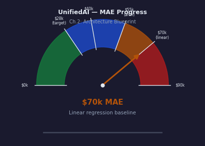
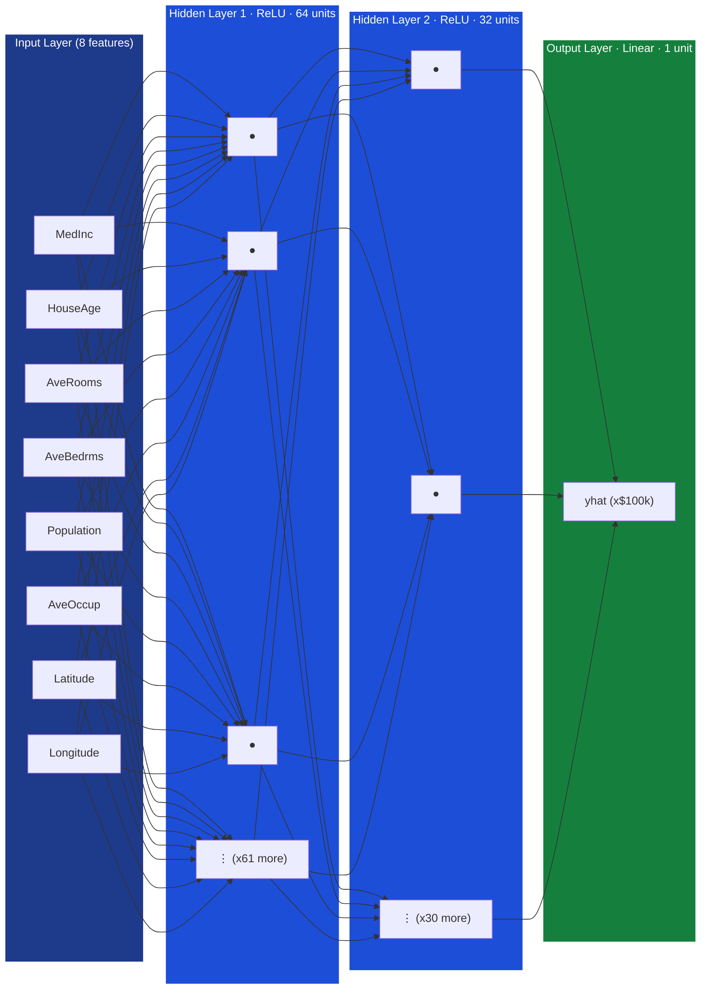
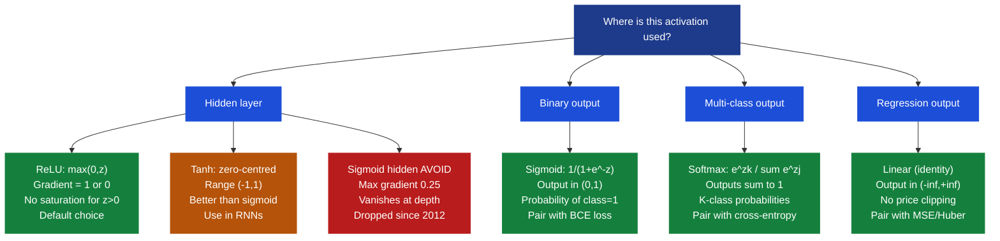
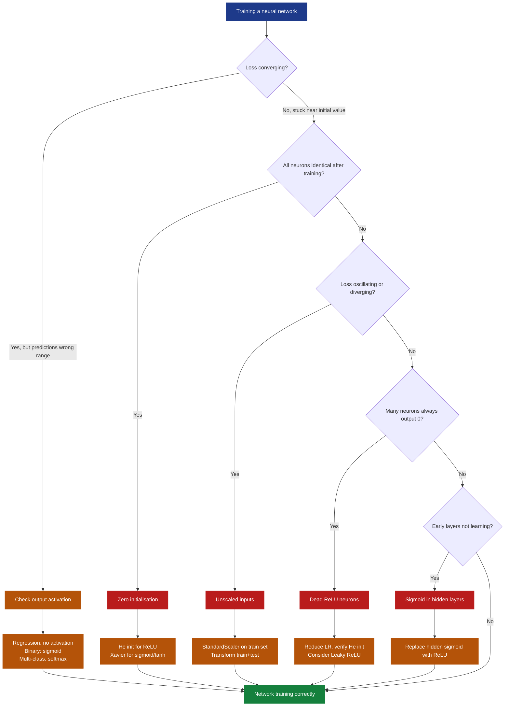
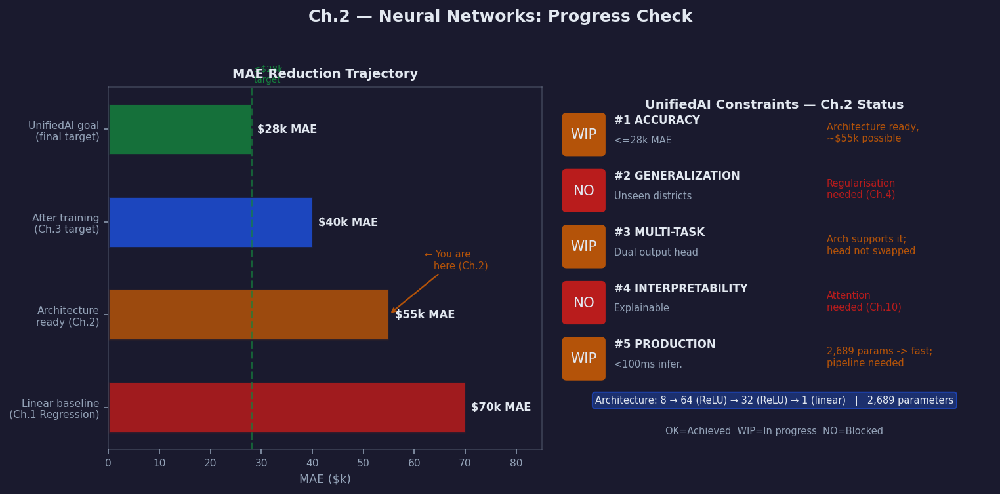

# Ch.2 — Neural Networks

> **The story.** The very first mathematical model of a neuron was published in **1943** by **Warren McCulloch** (neurophysiologist) and **Walter Pitts** (self-taught logician) — a binary unit that fired when the weighted sum of its inputs crossed a threshold. **Frank Rosenblatt's** Perceptron (1958) made it learnable: real-valued weights updated by a simple error-driven rule, trained on data. Eleven years later **Minsky and Papert** published *Perceptrons* (1969), proving algebraically that a single-layer network cannot learn XOR — and the field froze for nearly two decades. The thaw arrived in **1986** when **Rumelhart, Hinton & Williams** published *Learning representations by back-propagating errors* in *Nature*, showing that hidden layers combined with gradient backpropagation could learn non-linear functions at scale. Two further breakthroughs made *deep* networks trainable in practice: **ReLU activations** (Glorot & Bengio 2010; Krizhevsky et al. 2012) replaced the saturating sigmoid that had been killing gradients at depth, and **Xavier / He initialisation** (Glorot 2010; He et al. 2015) cured the variance-collapse problem — the insight that without careful weight scaling, signals either vanish to zero or explode to infinity as depth increases. Every dense layer you write in PyTorch or TensorFlow today is a direct descendant of McCulloch and Pitts, wrapped in eight decades of engineering fixes.
>
> **Where you are in the curriculum.** Linear regression ([Ch.1 Regression](../../01_regression/ch01_linear_regression)) was too rigid for non-linear price interactions; logistic regression ([Ch.1 Classification](../../02_classification/ch01_logistic_regression)) handles only linear decision boundaries; the XOR experiment ([Ch.1 Neural Networks](../ch01_xor_problem)) proved algebraically that hidden layers are necessary. Now you build the full thing: a multi-layer perceptron (MLP) with ReLU hidden layers, Xavier/He initialisation, and a task-appropriate output, ready for [Ch.3](../ch03_backprop_optimisers) to teach it to learn. The platform's CTO wants a smarter valuation engine — one that captures the coastal x income interaction that destroyed the linear model. This chapter produces that architecture.
>
> **Notation in this chapter.** $L$ — number of layers (network depth); $\ell \in \{1,\dots,L\}$ — layer index; $n_\ell$ — number of units in layer $\ell$, with $n_0 = d$ (input dimension); $W^{(\ell)} \in \mathbb{R}^{n_\ell \times n_{\ell-1}}$ — weight matrix of layer $\ell$; $\mathbf{b}^{(\ell)} \in \mathbb{R}^{n_\ell}$ — bias vector of layer $\ell$; $\mathbf{z}^{(\ell)} = W^{(\ell)}\mathbf{a}^{(\ell-1)} + \mathbf{b}^{(\ell)}$ — **pre-activation** (linear combination before the non-linearity); $\mathbf{a}^{(\ell)} = \phi(\mathbf{z}^{(\ell)})$ — **activation** (output of layer $\ell$, with $\mathbf{a}^{(0)} = \mathbf{x}$); $\phi$ — activation function (ReLU, sigmoid, tanh, softmax, or linear); $\hat{\mathbf{y}} = \mathbf{a}^{(L)}$ — network output.

---

## 0 · The Challenge — Where We Are

> 🎯 **The mission**: Launch **UnifiedAI** — prove neural networks unify regression and classification in one architecture, satisfying:
> 1. **ACCURACY**: ≤$28k MAE (housing regression) + ≥95% accuracy (face classification)
> 2. **GENERALIZATION**: Unseen districts + new celebrity faces — no memorisation
> 3. **MULTI-TASK**: Same hidden layers, different output heads (regression vs classification)
> 4. **INTERPRETABILITY**: Attention weights provide explainable feature attribution
> 5. **PRODUCTION**: <100ms inference, TensorBoard monitoring, handles missing data

**What we know so far:**
- ✅ [Regression track Ch.1](../../01_regression/ch01_linear_regression): Linear baseline — ~$70k MAE on California Housing
- ✅ [Classification track Ch.1](../../02_classification/ch01_logistic_regression): Logistic regression for binary face attributes
- ✅ [NN Ch.1 — XOR Problem](../ch01_xor_problem): Proved linear models structurally cannot represent non-linear boundaries
- ✅ [NN Ch.1 — XOR Problem](../ch01_xor_problem): UAT guarantees one hidden layer of sufficient width approximates any continuous function

**What's blocking us:**

⚠️ The XOR chapter diagnosed the problem on a toy 4-point dataset with 2 features. California Housing has **8 correlated features** and **20,640 districts** with genuinely non-linear interactions:
- *Coastal + high-income* jointly drives premium pricing — neither feature alone is sufficient
- Income shows **diminishing returns**: doubling income in an already-expensive area lifts price less than in an affordable one
- Latitude and Longitude encode micro-regions whose effect is **non-additive** with every other feature

The linear model's ~$70k MAE is not a tuning problem — it is structural. No amount of regularisation or additional epochs can make $\hat{y} = \mathbf{w}^\top\mathbf{x} + b$ fit a curved surface.

We know we need hidden layers. But the XOR fix used two neurons on two features. For California Housing we still need answers to:
- **How many layers?** When does depth help vs adding width?
- **How many units per layer?** 32? 64? 512?
- **Which activation function?** ReLU vs sigmoid vs tanh — and *why*?
- **How to initialise weights?** Zeros will fail; what is the right scale?
- **What output layer?** Unbounded regression differs from binary probability.

**Immediate business need:** The CTO asks: *"Our linear model is $70k MAE. Show me a neural network architecture that proves non-linearity helps — before we invest in training infrastructure."*

Product management milestones:
- **Current**: ~$70k MAE (linear regression, single-feature baseline)
- **This chapter's target**: ~$55k MAE potential — **25% improvement** by capturing non-linearity
- **Final UnifiedAI target** (after training chapters): ≤$28k MAE

**What this chapter unlocks:** The full MLP architecture blueprint — every design decision answered with principled reasoning. You will leave with a network that *could* achieve ~$55k MAE once trained, understanding exactly why each design choice was made.

---

## Animation



---

## 1 · The Core Idea

A neural network is a **chain of linear transformations interleaved with non-linearities**: each hidden layer performs a weighted sum (linear), then applies an activation function (non-linear), producing a new representation of the data. The key insight is that each layer **learns a coordinate transformation** — reshaping the feature space so that the final output layer (always linear) can draw its straight-line boundary in a space where the problem has become linearly separable. The **Universal Approximation Theorem** guarantees that a single hidden layer of sufficient width can approximate any continuous function to arbitrary precision — depth and multiple layers are an engineering choice for efficiency, not a theoretical necessity.

### 1a · What a Hidden Layer Actually Does to Space

Think of California's 20,640 districts plotted in 8-dimensional feature space. Districts with `(high income, coastal latitude)` and `(high income, inland latitude)` overlap badly in that raw space — a flat plane cannot separate them. Each hidden layer applies two operations: a weight matrix that rotates and rescales the axes, then a ReLU that folds the space by zeroing out the negative half. The result is not a scaled version of the original space — it is a *bent and folded* version.

```
Raw input space         After layer 1           After layer 2
(tangled clusters)  →   (first fold applied) →  (clusters separated)
     ●  ○                   ●    ○                  ●●●    ○○○
  ○  ●  ○  ●     →       ●   ○   ●    →          ●●●●●  ○○○○○
     ○  ●                   ○    ●
```

By the time the data reaches the final output layer, the network has warped feature space until the coastal-premium clusters are in different corners. The output layer then draws a flat plane — but across a space that has already been bent into the right shape.

> 💡 This is why adding a third hidden layer to SmartVal's architecture can unlock the non-linear interaction between `Latitude × MedInc`: no single fold is enough, but two sequential folds can separate that cluster boundary.

---

## 2 · Running Example

California Housing: **8 input features** → **two hidden layers** → **one regression output**.

| Feature | Description | Scale (raw) |
|---|---|---|
| `MedInc` | Median income (x$10k) | 0.5–15 |
| `HouseAge` | Median house age (years) | 1–52 |
| `AveRooms` | Avg rooms per house | 1–141 |
| `AveBedrms` | Avg bedrooms per house | 0.3–35 |
| `Population` | Block population | 3–35,682 |
| `AveOccup` | Average occupancy | 0.7–1,243 |
| `Latitude` | Block latitude | 32.5–42.0 |
| `Longitude` | Block longitude | -124.4 to -114.3 |

**Architecture:** $8 \to 64_{\text{ReLU}} \to 32_{\text{ReLU}} \to 1_{\text{linear}}$

The funnel shape (64 → 32 → 1) mirrors how representations compress: the first hidden layer extracts 64 non-linear combinations of the raw features; the second compresses them into 32 higher-level patterns; the output maps those to a single price estimate.

**Expected result after training** (Ch.3): ~$55k MAE — a **25% improvement** over the $70k linear baseline, halfway to the ≤$28k UnifiedAI goal.

---

## 3 · Architecture at a Glance

### Layer-by-layer computation

For each layer $\ell = 1, \dots, L$:

$$\mathbf{z}^{(\ell)} = W^{(\ell)}\mathbf{a}^{(\ell-1)} + \mathbf{b}^{(\ell)} \qquad \text{(linear — weighted sum + bias)}$$

$$\mathbf{a}^{(\ell)} = \phi\!\left(\mathbf{z}^{(\ell)}\right) \qquad \text{(non-linear — activation applied element-wise)}$$

with boundary conditions $\mathbf{a}^{(0)} = \mathbf{x}$ (input) and $\hat{\mathbf{y}} = \mathbf{a}^{(L)}$ (output, no activation for regression).

### Annotated pseudocode — full forward pass

```
Given: input x in R^8 (one California Housing district, standardised)

# Layer 1: 8 to 64 (ReLU hidden)
z1 = W1 . x  + b1       W1 in R^{64x8},  b1 in R^{64}
a1 = ReLU(z1)           a1 in R^{64}      (negatives clipped to 0)

# Layer 2: 64 to 32 (ReLU hidden)
z2 = W2 . a1 + b2       W2 in R^{32x64}, b2 in R^{32}
a2 = ReLU(z2)           a2 in R^{32}

# Output layer: 32 to 1 (linear — no activation)
z3 = W3 . a2 + b3       W3 in R^{1x32},  b3 in R
yhat = z3               yhat in R  (predicted house value in x$100k units)
```

The output layer has **no activation** because house value is unbounded. For binary classification the output uses sigmoid; for multi-class, softmax. Only the last layer changes — hidden layers are identical across tasks.

---

## 4 · The Math

### 4.1 · Forward Pass — Complete Toy Example

> The best way to understand the forward pass is to run the numbers by hand. We use a small 3→2→1 network so every matrix multiply fits on one line, then scale up to the 8→64→32→1 architecture.

**Network:** 3 inputs → 2 hidden (ReLU) → 1 output (linear)

**Weights (fixed for this example):**

$$W^{(1)} = \begin{bmatrix} 0.4 & -0.2 & 0.8 \\ 0.1 & 0.5 & -0.3 \end{bmatrix} \in \mathbb{R}^{2 \times 3}, \qquad \mathbf{b}^{(1)} = \begin{bmatrix} 0.1 \\ -0.2 \end{bmatrix}$$

$$W^{(2)} = \begin{bmatrix} 0.6 & -0.4 \end{bmatrix} \in \mathbb{R}^{1 \times 2}, \qquad b^{(2)} = 0.05$$

**Input:** $\mathbf{x} = [0.5,\ -1.0,\ 0.3]^\top$

---

**Step 1 — Pre-activation at hidden layer** ($\mathbf{z}^{(1)} = W^{(1)}\mathbf{x} + \mathbf{b}^{(1)}$):

$$z^{(1)}_1 = 0.4 \times 0.5 + (-0.2) \times (-1.0) + 0.8 \times 0.3 + 0.1$$
$$= 0.20 + 0.20 + 0.24 + 0.10 = \mathbf{0.74}$$

$$z^{(1)}_2 = 0.1 \times 0.5 + 0.5 \times (-1.0) + (-0.3) \times 0.3 + (-0.2)$$
$$= 0.05 - 0.50 - 0.09 - 0.20 = \mathbf{-0.74}$$

$$\mathbf{z}^{(1)} = [0.74,\ -0.74]^\top$$

**Step 2 — Apply ReLU activation** ($\mathbf{a}^{(1)} = \max(0, \mathbf{z}^{(1)})$):

$$a^{(1)}_1 = \max(0,\ 0.74) = \mathbf{0.74} \qquad \text{(positive — passes through unchanged)}$$
$$a^{(1)}_2 = \max(0,\ -0.74) = \mathbf{0.00} \qquad \text{(negative — clipped to zero)}$$

$$\mathbf{a}^{(1)} = [0.74,\ 0.00]^\top$$

> 💡 **Neuron 2 is dead for this input.** Its pre-activation is negative, so ReLU sets its output to 0. It contributes nothing to the prediction for this particular input. If a neuron is negative across *all* training inputs it becomes permanently dead — see §9.

**Step 3 — Output layer** ($\hat{y} = W^{(2)}\mathbf{a}^{(1)} + b^{(2)}$, no activation):

$$\hat{y} = 0.6 \times 0.74 + (-0.4) \times 0.00 + 0.05$$
$$= 0.444 + 0.000 + 0.050 = \mathbf{0.494}$$

**Result:** $\hat{y} = 0.494$. In the California Housing context (x$100k units), this corresponds to ~$49.4k predicted value. The architecture can produce any real number — there is no squashing at the output.

---

### 4.2 · Activation Functions — Formulas, Derivatives, and When to Use

Every activation function introduces the non-linearity that separates neural networks from linear models.

**ReLU (Rectified Linear Unit) — the default hidden-layer activation:**

$$\text{ReLU}(z) = \max(0,\ z) \qquad \frac{d}{dz}\text{ReLU}(z) = \begin{cases} 1 & z > 0 \\ 0 & z \leq 0 \end{cases}$$

*Use when:* hidden layers in any feedforward or convolutional network. Computationally free (just a threshold). Gradient is exactly 1 for positive pre-activations — no signal squashing.

**Sigmoid — the binary output activation:**

$$\sigma(z) = \frac{1}{1+e^{-z}} \qquad \frac{d}{dz}\sigma(z) = \sigma(z)(1-\sigma(z)) \leq 0.25$$

*Use when:* output layer for binary classification (produces a probability in $(0,1)$). Avoid in hidden layers — derivative is at most 0.25, cutting gradients by ≥75% per layer. Stack 4 sigmoid layers: $0.25^4 \approx 0.4\%$ of the original gradient survives. This is the **vanishing gradient problem**.

**Tanh — the zero-centred alternative:**

$$\tanh(z) = \frac{e^z - e^{-z}}{e^z + e^{-z}} \qquad \frac{d}{dz}\tanh(z) = 1 - \tanh^2(z) \leq 1.0$$

*Use when:* hidden layers in RNNs where zero-centring the hidden state matters. Derivative reaches up to 1.0 (better than sigmoid's 0.25), but still saturates at $|z| \geq 2$ and suffers from vanishing gradients at depth.

**Softmax — the multi-class output:**

$$\text{softmax}(z_k) = \frac{e^{z_k}}{\sum_{j=1}^{K} e^{z_j}} \qquad \sum_{k=1}^{K}\text{softmax}(z_k) = 1$$

*Use when:* output layer for $K$-class mutually exclusive classification.

#### Computed values — $z \in \{-2,\ -1,\ 0,\ 1,\ 2\}$

| $z$ | ReLU$(z)$ | $\sigma(z)$ | $\tanh(z)$ |
|----:|----------:|------------:|-----------:|
| -2 | 0.000 | 0.119 | -0.964 |
| -1 | 0.000 | 0.269 | -0.762 |
|  0 | 0.000 | 0.500 |  0.000 |
| +1 | 1.000 | 0.731 | +0.762 |
| +2 | 2.000 | 0.881 | +0.964 |

**Reading the table:** ReLU is linear for $z > 0$ and dead for $z \leq 0$ — no saturation on the positive side. Sigmoid compresses everything to $(0,1)$, saturating heavily at $|z| \geq 2$. Tanh is zero-centred but saturates the same way.

**Practical rule:** Default to ReLU for feedforward hidden layers. Sigmoid only on the output for binary classification. Softmax only on the output for multi-class. Tanh in RNN hidden states.

---

### 4.3 · Weight Initialisation — Why Scale Matters

> Before the formulas, understand the problem: with $L$ layers, the forward pass is $L$ matrix multiplications. If each shrinks the signal by constant factor $c < 1$, the output is $c^L$ times the input — **vanishing**. If each grows it by $c > 1$, the output is $c^L$ — **exploding**. Proper initialisation keeps $c \approx 1$.

**The variance preservation requirement:**

We want $\text{Var}(\mathbf{z}^{(\ell)}) \approx \text{Var}(\mathbf{a}^{(\ell-1)})$. For a layer with $n_{\text{in}}$ inputs, if each weight has variance $\sigma^2_W$:

$$\text{Var}(z_j) = n_{\text{in}} \cdot \sigma^2_W \cdot \text{Var}(a_i)$$

Setting $\text{Var}(z_j) = \text{Var}(a_i)$ requires $\sigma^2_W = 1/n_{\text{in}}$, i.e. $\sigma_W = 1/\sqrt{n_{\text{in}}}$.

**Xavier (Glorot) initialisation** — designed for sigmoid/tanh (symmetric, zero-centred):

$$W \sim \mathcal{N}\!\left(0,\ \sqrt{\frac{2}{n_{\text{in}}+n_{\text{out}}}}\right)$$

**He initialisation** — designed for ReLU, which kills half the neurons (all negatives → 0):

$$W \sim \mathcal{N}\!\left(0,\ \sqrt{\frac{2}{n_{\text{in}}}}\right)$$

The factor of 2 compensates for ReLU zeroing approximately half the activations on average. Without this correction, variance halves at every layer and the network vanishes.

**Numerical example — He initialisation for $n_{\text{in}} = 64$ inputs (Layer 2 of our architecture):**

$$\sigma_W = \sqrt{\frac{2}{64}} = \sqrt{0.03125} = \mathbf{0.1768}$$

Weights sampled from $\mathcal{N}(0,\ 0.1768)$. Typical values lie in $[-0.35, +0.35]$ (within $\pm 2\sigma$). Compare to $\sigma_W = \sqrt{1/64} = 0.125$ (without the ReLU-correction factor) — He is $\sqrt{2} \approx 1.41\times$ larger to compensate for the dead half.

**What happens with zero initialisation?** All neurons receive identical gradients, so all update identically. After any number of epochs, all $n_\ell$ neurons have identical weight vectors — the network is effectively width-1. This is the **symmetry breaking failure** and is why random initialisation is mandatory.

---

### 4.4 · Parameter Count

> Every parameter is a degree of freedom. Knowing the exact count tells you how much data you need and how expensive inference and storage will be.

**Architecture: 8 → 64 → 32 → 1**

For each layer: parameters = (input units × output units) + output units (biases)

| Layer | Shape | Weights | Biases | Subtotal |
|---|---|---:|---:|---:|
| Layer 1: 8 → 64 | $W^{(1)} \in \mathbb{R}^{64 \times 8}$ | $8 \times 64 = 512$ | 64 | **576** |
| Layer 2: 64 → 32 | $W^{(2)} \in \mathbb{R}^{32 \times 64}$ | $64 \times 32 = 2048$ | 32 | **2080** |
| Layer 3: 32 → 1 | $W^{(3)} \in \mathbb{R}^{1 \times 32}$ | $32 \times 1 = 32$ | 1 | **33** |

$$\text{Total} = (8\times64+64) + (64\times32+32) + (32\times1+1) = 576 + 2080 + 33 = \mathbf{2{,}689\ \text{parameters}}$$

**Context:** 2,689 parameters for 20,640 training samples — roughly **8 samples per parameter**, well above the practical rule of thumb for tabular learning. The network is not over-parameterised for this dataset.

**Comparison:** A single linear regression on 8 features has $8 + 1 = 9$ parameters. Our MLP has 299× more — each one representing a learned non-linear combination of the input features.


### 4.5 · Three-District Spot-Check Through the 8→64→32→1 Architecture

> It helps to see the *shapes* flow through the full production architecture even before training. This spot-check uses standardised feature values — mean 0, std 1.

**Three representative California Housing districts (standardised):**

| District | MedInc | HouseAge | AveRooms | AveBedrms | Pop | AveOccup | Lat | Lon | True value (×$100k) |
|---|---:|---:|---:|---:|---:|---:|---:|---:|---:|
| Bakersfield (affordable) | −0.82 | +0.41 | −0.21 | −0.14 | +0.08 | −0.04 | −0.76 | +1.23 | 0.9 ($90k) |
| San Jose (expensive) | +2.34 | −0.61 | +0.54 | +0.11 | −0.32 | +0.07 | +0.44 | −0.88 | 4.5 ($450k) |
| Fresno (mid-range) | +0.05 | +0.23 | −0.08 | +0.02 | +0.15 | +0.01 | −0.35 | +0.61 | 1.8 ($180k) |

**Forward pass shape trace** (before any training, with random He-initialised $W^{(1)}$):

```
District input x:  shape (8,)
                       ↓  W^(1) @ x + b^(1)
z^(1):             shape (64,)   — 64 pre-activations (mix of +/− values)
                       ↓  ReLU
a^(1):             shape (64,)   — ~32 neurons active, ~32 clamped to 0
                       ↓  W^(2) @ a^(1) + b^(2)
z^(2):             shape (32,)   — 32 pre-activations
                       ↓  ReLU
a^(2):             shape (32,)   — ~16 neurons active, ~16 clamped to 0
                       ↓  W^(3) @ a^(2) + b^(3)
yhat:              shape (1,)    — single scalar: predicted house value
```

Before training, all three districts receive nearly random predictions (all near 0 in standardised units). After training with backprop (Ch.3), the weight matrices learn to route high-income/coastal features to produce high $\hat{y}$ and low-income/inland features to produce low $\hat{y}$. The architecture is agnostic to the task during this chapter — it is simply a function from $\mathbb{R}^8$ to $\mathbb{R}$.

> 💡 **Why ~half the neurons are active at initialisation.** He initialisation draws from $\mathcal{N}(0, \sigma)$, which is symmetric around zero. The pre-activations $z = Wx + b$ are therefore approximately symmetric too. ReLU zeros exactly the negative half, leaving ~50% active. After training, the fraction changes based on what the task requires — some neurons may specialise and fire rarely, others frequently.


---

## 5 · Design Choice Arc

Good architecture design follows a story of constraints and discoveries, not memorised recipes. Here are the three acts that justify every choice in the 8→64→32→1 network.

### Act 1 — How many layers? Universal Approximation vs practice.

The Universal Approximation Theorem says **one hidden layer of sufficient width** can approximate any continuous function. So why use two?

The answer is efficiency. A one-layer network approximating a complex function with $\varepsilon$ precision may need exponentially many units. Two layers of moderate width can represent the same function with polynomially fewer parameters by learning **hierarchical features**: Layer 1 learns simple combinations (income bands, latitude zones), Layer 2 composes those into higher-level patterns (affluent coastal vs affordable inland neighbourhoods). For California Housing, two hidden layers of 64 and 32 units consistently outperform one layer of 100 units while being far more practical than one layer of 10,000 units.

**Practical rule for tabular data:** Start with 2 hidden layers. Add a third only if validation loss is still improving after tuning learning rate and batch size. Beyond 3 layers, tabular data rarely benefits — depth helps most for images (CNNs) and sequences (RNNs, Transformers) where hierarchical spatial or temporal patterns exist.

### Act 2 — Which activation? Sigmoid killed gradients → ReLU fixed it.

Networks from the 1980s–2000s used sigmoid activations throughout. The gradient of sigmoid is at most 0.25 — every backward pass through a sigmoid hidden layer cuts the gradient by at least 4×. In a 5-layer network: $0.25^5 \approx 0.001$ — the gradient at the first layer is one-thousandth of its value at the output. The first layers stop learning entirely. This is the **vanishing gradient problem** that paralysed deep learning until ~2010.

**ReLU's gradient is exactly 1 for positive pre-activations** — it passes the gradient through unchanged. For the roughly-half of neurons whose pre-activations are positive, the backward pass is a clean copy of the upstream gradient. Deep networks with ReLU train reliably where sigmoid fails. This single change — sigmoid → ReLU in hidden layers — was responsible for a large fraction of the deep learning revolution from 2012 onward.

**Practical rule:** ReLU for all hidden layers. Sigmoid on the output layer for binary classification only. Linear (no activation) for regression outputs.

### Act 3 — Initialisation matters. Zeros fail; Xavier/He solve it.

As derived in §4.3: zeros produce symmetry collapse (all neurons learn identically). Too-large random values cause the pre-activations to explode before any training begins. Xavier init balances variance for symmetric activations (sigmoid/tanh). He init corrects for ReLU's half-killing property: because ReLU zeros out ~50% of activations, the remaining signal needs double the initial variance to compensate — hence the factor of 2 in the numerator.

**Practical rule:** He init for ReLU layers (`torch.nn.init.kaiming_normal_`). Xavier init for sigmoid/tanh layers. Biases initialised to zero.

---

## 6 · Full Forward Pass — Two Complete Examples

We now run **two different inputs** through the same 3→2→1 network from §4.1 to show how the architecture produces different predictions depending on input composition. Same weights throughout.

**Fixed weights:**

$$W^{(1)} = \begin{bmatrix} 0.4 & -0.2 & 0.8 \\ 0.1 & 0.5 & -0.3 \end{bmatrix}, \quad \mathbf{b}^{(1)} = \begin{bmatrix} 0.1 \\ -0.2 \end{bmatrix}$$

$$W^{(2)} = \begin{bmatrix} 0.6 & -0.4 \end{bmatrix}, \quad b^{(2)} = 0.05$$

---

### Example 1 — Input: $\mathbf{x}_1 = [0.5,\ -1.0,\ 0.3]^\top$

**Layer 1 pre-activation:**

$$z^{(1)}_1 = 0.4(0.5) + (-0.2)(-1.0) + 0.8(0.3) + 0.1 = 0.20 + 0.20 + 0.24 + 0.10 = 0.74$$
$$z^{(1)}_2 = 0.1(0.5) + 0.5(-1.0) + (-0.3)(0.3) + (-0.2) = 0.05 - 0.50 - 0.09 - 0.20 = -0.74$$

**Layer 1 activation (ReLU):**

$$\mathbf{a}^{(1)} = [\max(0, 0.74),\ \max(0, -0.74)] = [\mathbf{0.74},\ \mathbf{0.00}]$$

Neuron 1 active. Neuron 2 dead (pre-activation negative → output clamped to 0).

**Output layer (linear):**

$$\hat{y}_1 = 0.6(0.74) + (-0.4)(0.00) + 0.05 = 0.444 + 0.000 + 0.050 = \mathbf{0.494}$$

---

### Example 2 — Input: $\mathbf{x}_2 = [-0.5,\ 0.8,\ -0.2]^\top$

**Layer 1 pre-activation:**

$$z^{(1)}_1 = 0.4(-0.5) + (-0.2)(0.8) + 0.8(-0.2) + 0.1 = -0.20 - 0.16 - 0.16 + 0.10 = -0.42$$
$$z^{(1)}_2 = 0.1(-0.5) + 0.5(0.8) + (-0.3)(-0.2) + (-0.2) = -0.05 + 0.40 + 0.06 - 0.20 = +0.21$$

**Layer 1 activation (ReLU):**

$$\mathbf{a}^{(1)} = [\max(0, -0.42),\ \max(0, 0.21)] = [\mathbf{0.00},\ \mathbf{0.21}]$$

Neuron 1 dead. Neuron 2 active — completely inverted from Example 1.

**Output layer (linear):**

$$\hat{y}_2 = 0.6(0.00) + (-0.4)(0.21) + 0.05 = 0.000 - 0.084 + 0.050 = \mathbf{-0.034}$$

---

### Comparing the two examples

| | Example 1 ($\mathbf{x}_1$) | Example 2 ($\mathbf{x}_2$) |
|---|---|---|
| Input | [0.5, −1.0, 0.3] | [−0.5, 0.8, −0.2] |
| $\mathbf{z}^{(1)}$ | [0.74, −0.74] | [−0.42, +0.21] |
| $\mathbf{a}^{(1)}$ (post-ReLU) | [**0.74**, 0.00] | [0.00, **0.21**] |
| Active neurons | Neuron 1 | Neuron 2 |
| $\hat{y}$ | **0.494** | **−0.034** |

**Key architectural observation:** For each input, a *different subset of neurons fires*. ReLU produces **sparse activations** — only neurons whose pre-activations are positive contribute to the output. This is the network's routing mechanism. After training, each neuron specialises — one may learn "high-income signal", another "coastal proximity", another "rooms-to-occupancy ratio". The ReLU gate determines which specialists are consulted for each new district.

The predictions (0.494 vs −0.034) are both poor — these are random untrained weights. After backpropagation (Ch.3), the weights will shift so that high-value inputs produce high predictions and low-value inputs produce low ones. The architecture is correct; it just needs training.

---

## 7 · Key Diagrams

### Architecture — the 8→64→32→1 funnel



### Activation function decision tree



---

## 8 · Hyperparameter Dial

| Dial | Too low | Sweet spot (tabular) | Too high |
|---|---|---|---|
| **Depth** (hidden layers) | Underfits; can't model feature interactions | **2 layers** for tabular; 3 only if validation still improving | Vanishing gradients; marginal gain; slow |
| **Width** (units/layer) | Bottleneck; information loss | **64 → 32** (halving funnel) | Wastes parameters; may overfit past ~256 |
| **Activation (hidden)** | — | **ReLU** (default) | Sigmoid/tanh → saturate gradients |
| **Activation (output)** | — | **Linear** (regression); sigmoid (binary) | Wrong activation is structural, not tunable |
| **Initialisation** | Zero → symmetry collapse | **He** (ReLU); Xavier (sigmoid/tanh) | Too-large → exploding pre-activations |
| **Learning rate** | Crawls; never converges | **1e-3** (Adam default) | Loss explodes or oscillates |

**Tabular-specific guidance:** Width ≥ 4× input dimension for the first hidden layer is a common starting point ($8 \times 4 = 32$, so 64 is generous but not excessive). Halving depth-wise (64→32) creates a compression bottleneck that encourages efficient representations. Going beyond 3 layers rarely helps on structured tabular data.

---

## 9 · What Can Go Wrong

### Dead ReLU neurons

**Symptom:** A neuron outputs 0 for every sample in the dataset, forever. Its weights never update (ReLU gradient is 0 for negative pre-activations).

**Cause:** The neuron's pre-activation $z = W\mathbf{a}^{(\ell-1)} + b$ is negative for every training sample — usually because the learning rate was too high (weights jumped to a bad region) or input features are not standardised.

**Consequence:** Effective network width is reduced. If 30 out of 64 Layer 1 neurons are permanently dead, you have an effective 34-unit first layer despite paying the parameter cost of 64.

**Fix:** Standardise inputs. Reduce learning rate. Use He initialisation. Consider Leaky ReLU: $\max(0.01z, z)$, which retains a small gradient for negative pre-activations.

---

### Vanishing gradients with sigmoid hidden layers

**Symptom:** First hidden layer weights barely change across epochs; validation loss improves extremely slowly despite reasonable learning rate.

**Cause:** $\sigma'(z) \leq 0.25$. Gradient arriving at Layer 1 after 4 sigmoid hidden layers: $\leq 0.25^4 \approx 0.4\%$ of the output gradient.

**Fix:** Replace hidden-layer sigmoid activations with ReLU.

---

### Zero initialisation — the symmetry trap

**Symptom:** After many epochs, all neurons in a layer have identical weight vectors. Validation loss stuck near the single-neuron baseline.

**Cause:** If $W^{(\ell)} = \mathbf{0}$, all neurons receive identical gradients → all update identically → all neurons forever identical. The layer is effectively width-1 while paying the cost of width-64.

**Fix:** Random initialisation — He for ReLU, Xavier for sigmoid/tanh.

---

### Unscaled inputs — gradient descent gridlock

**Symptom:** Training loss oscillates or converges to a poor solution. Takes 5–10× more epochs than expected.

**Cause:** `Population` ranges 3–35,682; `MedInc` ranges 0.5–15. The loss surface is a narrow elongated ellipse; gradient descent zigzags across it rather than descending efficiently.

**Fix:** Apply `StandardScaler` to all input features before training. Fit scaler on training data only; transform test/validation sets using training statistics.

---

### Wrong output activation — silent prediction disaster

**Symptom:** Regression: predictions clamped between 0 and 1 — expensive houses systematically under-predicted. Classification: logits passed to BCE → NaN on the first epoch.

**Cause:** Applying sigmoid to a regression output, or omitting sigmoid on a binary classification output.

**Fix:** Regression → linear output (no activation). Binary classification → sigmoid. Multi-class → softmax. This is the most common production neural network bug.

---

### Diagnostic flowchart



---

## 10 · Where This Reappears

**Every neural network in the rest of this track uses the primitives from this chapter.** The forward pass formula $\mathbf{z}^{(\ell)} = W^{(\ell)}\mathbf{a}^{(\ell-1)} + \mathbf{b}^{(\ell)}$, ReLU activation, and He initialisation are the universal substrate.

**Immediate next chapters:**

- **[Ch.3 — Backpropagation & Optimisers](../ch03_backprop_optimisers)**: Derives the chain rule for propagating gradients backward through the exact architecture you built here. Without backprop, the 2,689 parameters have no way to improve. Ch.3 introduces Adam — converges 5–10× faster than vanilla SGD on California Housing. ⚡ **This is where ~$55k MAE becomes achievable.**

- **[Ch.4 — Regularisation](../ch04_regularisation)**: After Ch.3 gets MAE to ~$55k on training data, validation MAE will be ~$62k — the model is memorising training neighbourhoods. Ch.4 adds L2 weight decay, dropout (randomly zeroing activations during training), and early stopping. The forward pass equations from this chapter remain unchanged; regularisation operates on top.

**Later in this track:**

- **[Ch.5 — CNNs](../ch05_cnns)**: Convolutional layers are dense layers with a weight-sharing constraint — the same filter slides across spatial positions. Forward pass still $\mathbf{z} = W \star \mathbf{a} + b$; same ReLU, same He init, same backward pass.

- **[Ch.6 — RNNs/LSTMs](../ch06_rnns_lstms)**: The recurrent hidden state $\mathbf{h}_t = \tanh(W_h \mathbf{h}_{t-1} + W_x \mathbf{x}_t + \mathbf{b})$ is a dense layer where output feeds back as input. Same weight structure, same init problem, same vanishing gradient that ReLU solved for feedforward nets.

- **[Ch.10 — Transformers](../ch10_transformers)**: Multi-head attention is four dense layers ($W_Q$, $W_K$, $W_V$, $W_O$) with scaled dot-product and softmax between them. The feedforward sublayer inside each Transformer block is exactly a two-layer MLP (this chapter) with GeLU activation. Parameter counts in the billions follow the same $(n_{\text{in}} \times n_{\text{out}} + n_{\text{out}})$ formula from §4.4.

**Cross-track applications:**

- **[Multimodal AI track](../../05-multimodal_ai)**: Vision Transformers (ViT) split images into patches and process them through Transformer encoder blocks, each containing a dense sublayer identical to this chapter's MLP. The forward pass, weight init, and activation choices transfer directly.

- **[AI Infrastructure — Inference Optimisation](../../06-ai_infrastructure/ch05_inference_optimization)**: INT8 quantisation and FP16 mixed-precision training operate on the weight matrices $W^{(\ell)}$. Understanding $W \in \mathbb{R}^{n_\ell \times n_{\ell-1}}$ shapes is essential for memory profiling and latency estimation.

**The unification preview:**

This chapter built a **regression** head (linear output + MSE). UnifiedAI requires *both* regression (California Housing MAE) *and* classification (CelebA face attributes). The solution: **shared hidden layers, separate output heads**:

```
x  -->  [64 ReLU]  -->  [32 ReLU]  -->  yhat_regression     (linear,  MSE loss)
                                  \-->  yhat_classification  (sigmoid, BCE loss)
```

Hidden layers learn a universal representation; output heads are task-specific adapters. This multi-task architecture is introduced in Ch.5 (CNNs) and fully realised in Ch.9 (Metrics & Multi-task Learning).

---

## 11 · Progress Check — What We Can Solve Now



✅ **Unlocked this chapter:**
- ✅ **Full MLP architecture**: 8 → 64 (ReLU) → 32 (ReLU) → 1 (linear) — blueprint complete
- ✅ **Activation function selection**: ReLU for hidden layers (no gradient saturation); linear output for regression
- ✅ **Weight initialisation**: He init for ReLU layers — variance preserved; symmetry broken
- ✅ **Forward pass**: Can compute predictions layer-by-layer from any input vector — verified by hand arithmetic for two distinct inputs
- ✅ **Parameter count**: 2,689 parameters — well-conditioned for 20,640 training samples
- ✅ **Non-linearity proof of concept**: Architecture capable of ~$55k MAE (25% better than linear) once trained

❌ **Still can't do:**
- ❌ **Train the network** — forward pass computes predictions but gradients are not yet computed
- ❌ **Improve the weights** — 2,689 random parameters produce random predictions (Example 1: yhat = 0.494 vs true ~4.5 for a San Jose district)
- ❌ **Achieve ~$55k MAE** — the architecture supports it but only backpropagation can realise it
- ❌ **Guard against overfitting** — no train/validation split; memorisation not yet prevented

**UnifiedAI constraint status:**

| Constraint | Target | Status | Blocker |
|---|---|---|---|
| #1 ACCURACY | ≤$28k MAE | ⏳ Architecture ready — ~$55k possible | Backprop needed (Ch.3) |
| #2 GENERALIZATION | Unseen districts | ❌ | Regularisation needed (Ch.4) |
| #3 MULTI-TASK | Same arch, dual head | ⏳ Architecture supports it | Output head not yet swapped |
| #4 INTERPRETABILITY | Explainable features | ❌ | Attention mechanism needed (Ch.10) |
| #5 PRODUCTION | <100ms inference | ⏳ 2,689 params → fast | Deployment pipeline needed |

**Real-world status:** The blueprint is complete and the forward pass is verified. The network is a dormant engine — all the cylinders are in place, but there is no ignition yet. Chapter 3 provides the spark.

---

## 12 · Bridge to Ch.3 — Backpropagation & Optimisers

This chapter defined the architecture: layers, activations, initialisation, and the forward pass. Every one of the 2,689 parameters is positioned; none are correct yet.

**Chapter 3** works backwards through everything you just built. It applies the **chain rule** to compute $\frac{\partial L}{\partial W^{(\ell)}}$ and $\frac{\partial L}{\partial \mathbf{b}^{(\ell)}}$ for every layer simultaneously — propagating the loss signal from the output (where the error is known) back through ReLU and linear layers to the input. It then introduces the **Adam optimiser**, which adapts the learning rate per parameter and converges 5–10× faster than vanilla SGD on California Housing. By the end of Ch.3, the 2,689 parameters will have been updated hundreds of times, and the model will achieve ~$55k MAE on held-out districts — the first real proof that neural networks beat the $70k linear baseline.

> ⚡ **One chapter away from the $55k MAE milestone** — the architecture is ready. Ch.3 pulls the trigger.
