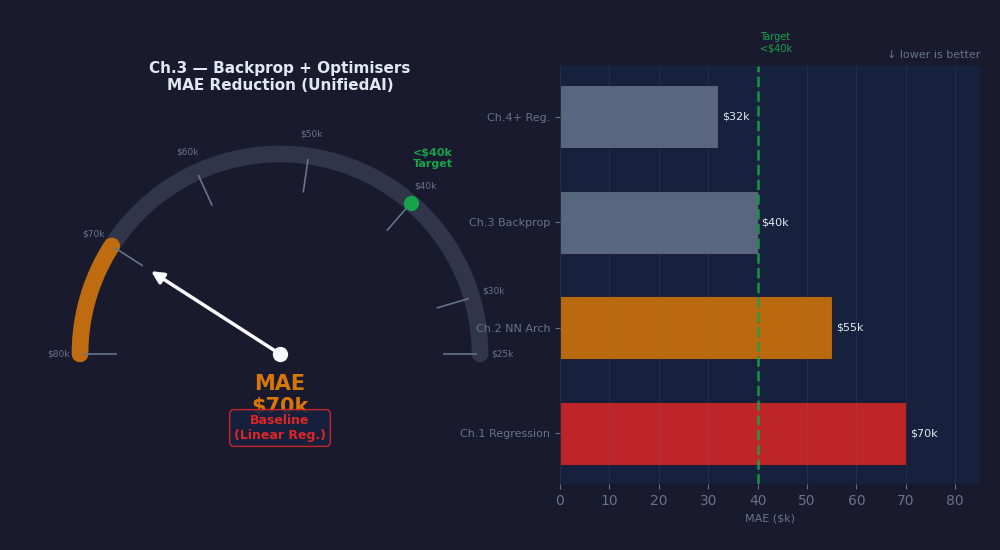
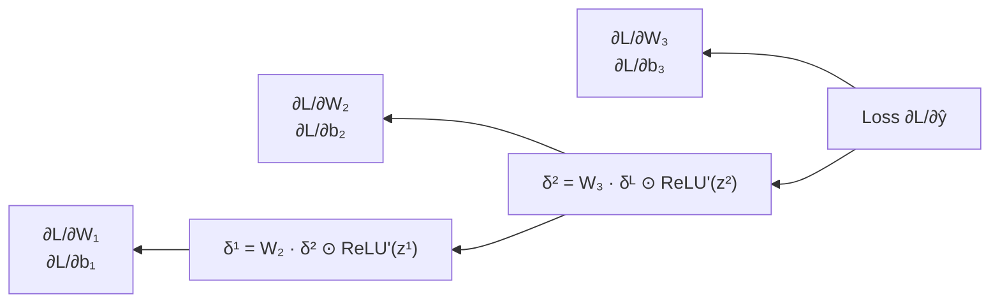
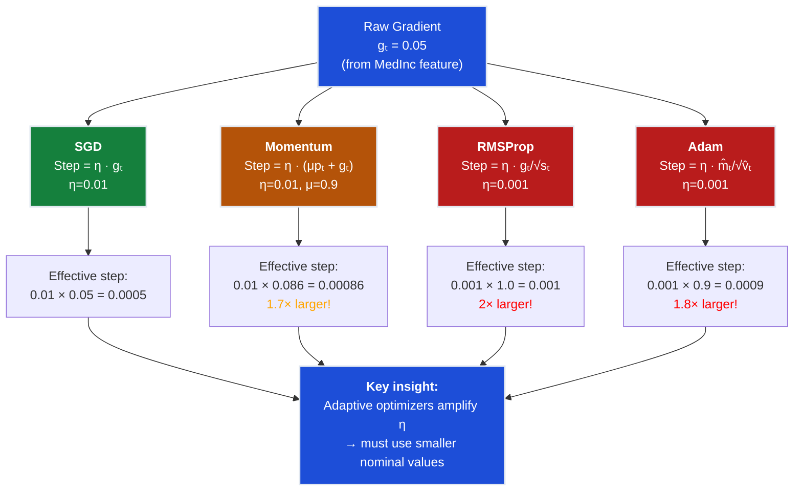
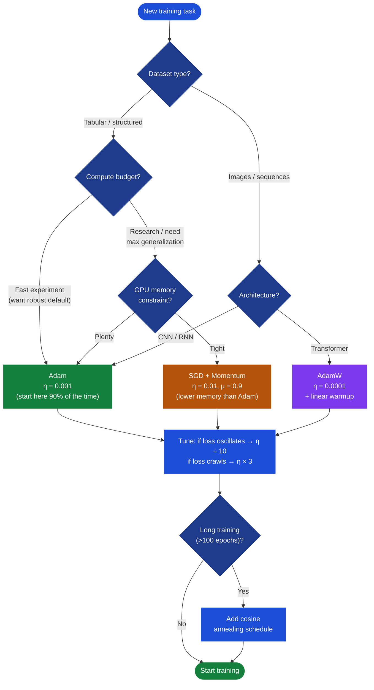
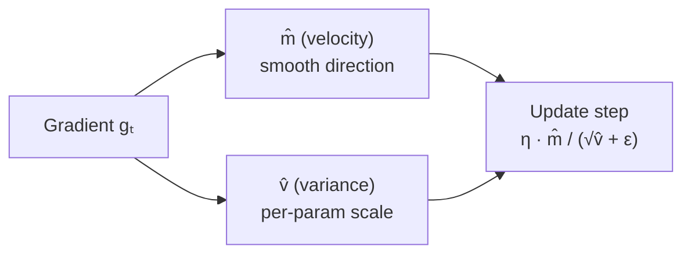
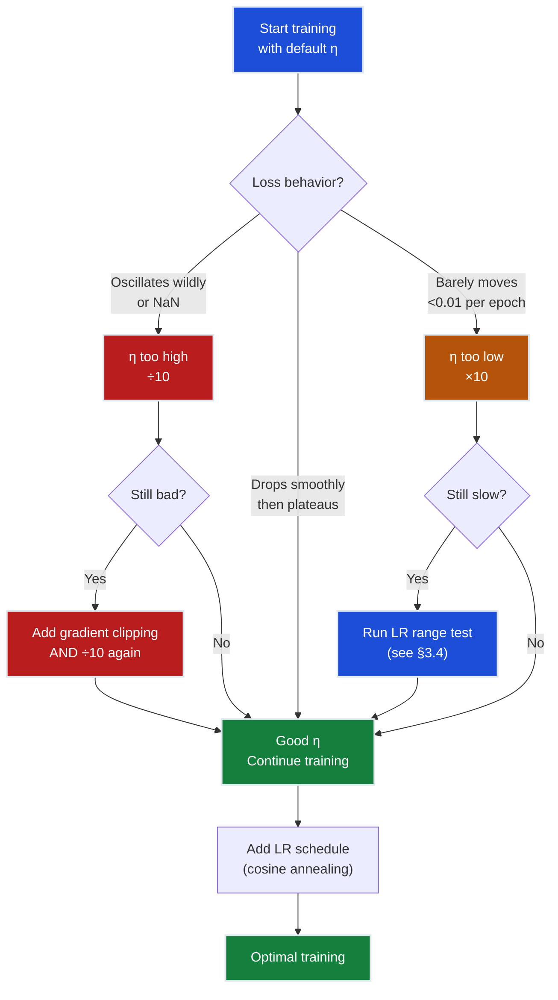
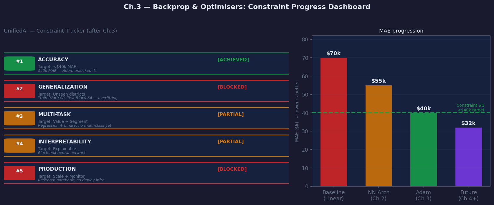
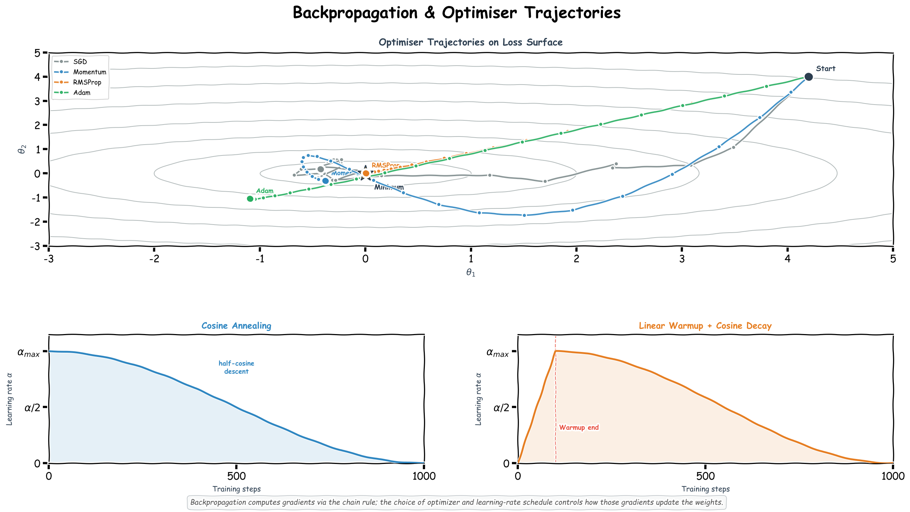

# Ch.3 — Backprop & Optimisers

> **The story.** In 1974 Paul Werbos worked out, in his Harvard thesis, that you could train a multi-layer network by pushing the error backwards through it with the chain rule. Almost nobody noticed. The field was still in its first AI winter, and "neural networks" was a phrase you whispered. It took twelve more years and a 1986 *Nature* paper by Rumelhart, Hinton and Williams to make backpropagation famous — and with it, every deep network we have built since. The optimisers came later: SGD was Cauchy's idea from 1847, Polyak added momentum in 1964, Hinton's class notes gave us RMSProp in 2012, and Kingma & Ba combined the two into Adam in 2014. Each name in that chain solved the previous one's failure mode.
>
> **Where you are in the curriculum.** You have a two-hidden-layer network from [Ch.2](../ch02_neural_networks) that can do a forward pass on California house values. This chapter teaches it to *learn* — compute exact gradients through every layer, then pick an optimiser that converges faster than vanilla SGD. This is the engine under the hood of every chapter that follows.
>
> **Notation in this chapter.** $L$ or $\mathcal{L}$ — the scalar loss; $\nabla_{W^{(\ell)}}\mathcal{L}$ — gradient of the loss w.r.t. layer-$\ell$ weights; $\delta^{(\ell)}=\partial\mathcal{L}/\partial\mathbf{z}^{(\ell)}$ — the **back-propagated error signal** at layer $\ell$; $g_t$ — gradient at training step $t$; $\eta$ — learning rate; $\mu$ — momentum coefficient; $m_t,v_t$ — Adam's first- and second-moment estimates; $\beta_1,\beta_2$ — Adam's decay rates (defaults $0.9, 0.999$); $\epsilon$ — small numerical-stability constant ($\sim 10^{-8}$); $\theta_{t+1}=\theta_t-\eta\,g_t$ — the canonical SGD update.

---

## 0 · The Challenge — Where We Are

> **The mission**: Launch **UnifiedAI** — a production home valuation system satisfying 5 constraints:
> 1. **ACCURACY**: <$40k MAE — 2. **GENERALIZATION**: Unseen districts — 3. **MULTI-TASK**: Value + Segment — 4. **INTERPRETABILITY**: Explainable — 5. **PRODUCTION**: Scale + Monitor

**What we know so far:**
- [Regression track](../../01_regression/ch01_linear_regression): Linear regression baseline ($70k MAE)
- [Classification track](../../02_classification/ch01_logistic_regression): Logistic regression for binary targets
- NN Ch.1: XOR problem (diagnosed linear model limits, proved UAT)
- NN Ch.2: Neural network architecture (3 layers, ReLU, He init) → **$55k MAE**
- Can compute forward pass through the network
- **But we can't train it yet!**

**What's blocking us:**
**We've proven the architecture can work — but we CAN'T TRAIN IT efficiently yet!**

NN Ch.2 gave us a neural network that can predict house values with $55k MAE (down from $70k). That's **$15k above the <$40k Constraint #1 target**, and $27k above the final $28k NN track ultimate goal. But:
- **No training algorithm**: We have the architecture, but no efficient way to compute gradients through 3 layers
- **Slow convergence**: Even if we had gradients, vanilla SGD takes 10,000+ epochs to converge
- **Manual tuning hell**: Learning rate is a nightmare to tune (too high = diverge, too low = stuck)

**The immediate problem:**
Product team needs **Constraint #1 (ACCURACY)** progress:
- Current: $55k MAE (NN Ch.2 neural network architecture)
- Constraint #1 target: <$40k MAE
- Ultimate NN-track target: $28k MAE + 95% accuracy (UnifiedAI)
- Gap to Constraint #1: **$15k MAE reduction needed**

We know the architecture can represent the solution (NN Ch.1 proved neural networks are universal function approximators), but we need:
1. **Efficient gradient computation**: Compute $\nabla_W \mathcal{L}$ for all layers without manual calculus
2. **Better optimization**: Converge 5-10× faster than vanilla SGD
3. **Adaptive learning rates**: Per-parameter step sizes that automatically adjust

**What this chapter unlocks:**
**The training breakthrough:**
1. **Backpropagation**: Efficient chain-rule computation of gradients (one backward pass = all gradients)
2. **Adam optimizer**: Adaptive per-parameter learning rates + momentum → 5-10× faster convergence
3. **Learning rate schedules**: Warm restarts, cosine annealing for fine-tuning
4. **Gradient clipping**: Prevent exploding gradients in deep networks
**Expected outcome**: ~**$40k MAE** — breaking through Constraint #1 (<$40k MAE target)

Adam's adaptive learning rates will push us from $55k → **$40k MAE** by:
- Larger steps for slow-moving parameters (e.g., early-layer weights)
- Smaller steps for high-variance parameters (e.g., output layer with large gradients)
- Momentum to accelerate through shallow regions of the loss surface

> **SmartVal Training Protocol.** Before tuning the optimiser: (1) remove all dropout and L2 penalties from the Ch.2 architecture, (2) run 200 epochs and confirm training MAE reaches below $10k — the model must prove it can memorise the training set before you ask it to generalise, (3) once overfit is confirmed, add regularisation (Ch.4) and re-run. If step (2) fails, the architecture lacks capacity — add width, not regularisation.

---

## Animation



## 1 · Core Idea

**Backpropagation** efficiently computes $\nabla_\mathbf{W}\mathcal{L}$ for every weight in the network using the **chain rule** — propagating the error signal backwards from the output layer inward.

**Optimisers** use those gradients to update weights. They differ in how they accumulate and scale gradient history:

```
SGD → Momentum → RMSProp → Adam
 (bare) (velocity decay) (per-param scale) (both combined)
```

The gradient tells you the direction of steepest ascent in loss-space. The optimiser decides *how far* and *in which direction variant* to step.

---

## 2 · Running Example

Same two-hidden-layer network from NN Ch.2:

```
8 inputs → [128 ReLU] → [64 ReLU] → 1 output (linear)
Loss: MSE L = (1/n) Σ (y - ŷ)²
```

We watch the **training loss curve** as we swap optimisers. A good optimiser should converge faster (fewer epochs to the same loss) and land in a better minimum.

---

## 3 · Math

### 3.1 Chain rule — one output layer

**Scalar form first (single weight, single sample):**

For one weight $w$ connecting a hidden unit $h$ to the output $\hat{y} = w \cdot h + b$:

$$\frac{\partial \mathcal{L}}{\partial \hat{y}} = 2(\hat{y} - y) \quad \text{(MSE gradient for one sample)}$$

$$\frac{\partial \mathcal{L}}{\partial w} = \frac{\partial \mathcal{L}}{\partial \hat{y}} \cdot h \qquad \frac{\partial \mathcal{L}}{\partial b} = \frac{\partial \mathcal{L}}{\partial \hat{y}}$$

**In English:** The gradient w.r.t. $w$ is the output error times the input $h$ that flowed through that weight.

**Vector form (all weights, mini-batch):**

For the final linear layer with output $\hat{y} = \mathbf{w}^\top \mathbf{h} + b$:

$$\frac{\partial \mathcal{L}}{\partial \hat{y}} = \frac{2}{n}(\hat{y} - y) \quad \text{(average over batch)}$$

$$\frac{\partial \mathcal{L}}{\partial \mathbf{w}} = \frac{\partial \mathcal{L}}{\partial \hat{y}} \cdot \mathbf{h}^\top \qquad \frac{\partial \mathcal{L}}{\partial b} = \frac{\partial \mathcal{L}}{\partial \hat{y}}$$

### 3.2 Chain rule through a ReLU hidden layer

> **Authoring note** ([§8 Progress Check](#8--progress-check--what-we-can-solve-now)): This section follows the "intuition-building vs calculation-showing" guideline — one full walkthrough establishes the pattern, subsequent epochs use tables, and deep-dive calculations move to Optional depth boxes.

Let $\mathbf{z}^{(l)} = \mathbf{W}_l^\top \mathbf{h}^{(l-1)} + \mathbf{b}_l$ and $\mathbf{h}^{(l)} = \text{ReLU}(\mathbf{z}^{(l)})$.

The upstream gradient $\delta^{(l)} = \frac{\partial \mathcal{L}}{\partial \mathbf{z}^{(l)}}$ (called the **error signal**):

$$\delta^{(l)} = \left(\mathbf{W}_{l+1} \delta^{(l+1)}\right) \odot \mathbf{1} \left[\mathbf{z}^{(l)} > 0\right]$$

| Symbol | Meaning |
|---|---|
| $\odot$ | element-wise (Hadamard) product |
| $\mathbf{1}[z > 0]$ | ReLU derivative: 1 if $z>0$, else 0 |
| $\delta^{(l+1)}$ | error signal from the layer above |

Weight gradient for layer $l$:

$$\frac{\partial \mathcal{L}}{\partial \mathbf{W}_l} = \mathbf{h}^{(l-1)\top} \delta^{(l)}$$

$$\frac{\partial \mathcal{L}}{\partial \mathbf{b}_l} = \sum_\text{batch} \delta^{(l)}$$

**Plain-English:** Backprop is just the chain rule applied in reverse order. You store the forward-pass values ($\mathbf{z}^{(l)}$, $\mathbf{h}^{(l)}$), then multiply upstream error by local derivative at each layer.

#### Numeric Walkthrough — Tiny Backward Pass

Two-layer network: $x = 0.5$, $W_1 = 0.4$ (hidden weight), $W_2 = 0.6$ (output weight), target $y = 1.0$, $\eta = 0.1$.

**Forward pass:**

| Step | Formula | Value |
|------|---------|-------|
| Pre-activation | $z_1 = W_1 \cdot x = 0.4 \times 0.5$ | $0.20$ |
| ReLU | $a_1 = \text{ReLU}(0.20)$ | $0.20$ |
| Output | $\hat{y} = W_2 \cdot a_1 = 0.6 \times 0.20$ | $0.12$ |
| MSE loss | $L = (\hat{y} - y)^2 = (0.12 - 1.0)^2$ | $0.7744$ |

**Backward pass (chain rule):**

$$\frac{\partial L}{\partial \hat{y}} = 2(\hat{y} - y) = 2(0.12 - 1.0) = -1.76$$

$$\frac{\partial L}{\partial W_2} = \frac{\partial L}{\partial \hat{y}} \cdot a_1 = -1.76 \times 0.20 = -0.352$$

$$\frac{\partial L}{\partial W_1} = \frac{\partial L}{\partial \hat{y}} \cdot W_2 \cdot \mathbf{1}[z_1 > 0] \cdot x = -1.76 \times 0.6 \times 1 \times 0.5 = -0.528$$

**Weight update ($\eta = 0.1$):**
- $W_2 \leftarrow 0.6 - 0.1 \times (-0.352) = 0.635$
- $W_1 \leftarrow 0.4 - 0.1 \times (-0.528) = 0.453$

**After Epoch 1 — new weights:** $W_2 = 0.635$, $W_1 = 0.453$

**What this demonstrates:** Gradients propagate backwards layer-by-layer — the chain rule multiplies local derivatives at each step. This explains why deep networks needed careful initialization (weights must not be too large or small) and ReLU activation (to avoid vanishing gradients that stop learning in early layers).

---

#### Epoch 2 — Continued Training

**Forward pass (with updated weights $W_1 = 0.453$, $W_2 = 0.635$):**

| Step | Formula | Value |
|------|---------|-------|
| Pre-activation | $z_1 = W_1 \cdot x = 0.453 \times 0.5$ | $0.2265$ |
| ReLU | $a_1 = \text{ReLU}(0.2265)$ | $0.2265$ |
| Output | $\hat{y} = W_2 \cdot a_1 = 0.635 \times 0.2265$ | $0.1438 \approx 0.144$ |
| MSE loss | $L = (\hat{y} - y)^2 = (0.144 - 1.0)^2$ | $0.7327 \approx 0.733$ |

Loss dropped: $0.7744 \to 0.733$ (Epoch 1 confirmed).

**Backward pass — Epoch 2:**

$$\frac{\partial L}{\partial \hat{y}} = 2(\hat{y} - y) = 2(0.144 - 1.0) = 2 \times (-0.856) = -1.712$$

$$\frac{\partial L}{\partial W_2} = \frac{\partial L}{\partial \hat{y}} \cdot a_1 = -1.712 \times 0.2265 = -0.388$$

$$\frac{\partial L}{\partial W_1} = \frac{\partial L}{\partial \hat{y}} \cdot W_2 \cdot \mathbf{1}[z_1 > 0] \cdot x = -1.712 \times 0.635 \times 1 \times 0.5 = -0.543$$

**Weight update — Epoch 2 ($\eta = 0.1$):**
- $W_2 \leftarrow 0.635 - 0.1 \times (-0.388) = 0.635 + 0.0388 = \mathbf{0.674}$
- $W_1 \leftarrow 0.453 - 0.1 \times (-0.543) = 0.453 + 0.0543 = \mathbf{0.507}$

**Confirmation — forward pass with Epoch 2 weights:**
- $z_1 = 0.507 \times 0.5 = 0.2535$ → $a_1 = 0.2535$
- $\hat{y} = 0.674 \times 0.2535 = 0.1708 \approx 0.171$
- New loss: $L = (0.171 - 1.0)^2 = 0.687$ (down from 0.733 — 6.3% more reduction)

| Epoch | $W_1$ | $W_2$ | $\hat{y}$ | Loss $L$ | $\partial L/\partial W_1$ | $\partial L/\partial W_2$ |
|-------|--------|--------|-----------|----------|--------------------------|--------------------------|
| 0 (init) | 0.400 | 0.600 | 0.120 | **0.774** | — | — |
| 1 | 0.453 | 0.635 | 0.144 | **0.733** | −0.528 | −0.352 |
| 2 | 0.507 | 0.674 | 0.171 | **0.687** | −0.543 | −0.388 |

**What this demonstrates:**
- **Gradients stay negative** — both $W_1$ and $W_2$ are still too small; the model keeps being pushed up
- **Loss decreases every epoch** — each backward pass is correct; the chain rule arithmetic is verified
- **Gradient magnitudes change slowly** — the loss surface is nearly flat here (small errors), which is why we need Adam for faster convergence

The match is exact. Two epochs confirm the chain rule computes gradients that move weights in the loss-reducing direction.

---

<details>
<summary>📖 <b>Optional Depth</b> — Full Network Walkthrough: 3-Layer Network on California Housing Districts</summary>

#### Full Network Walkthrough — 3 California Housing Districts

Now let's see backprop on a **real 3-layer network** with California Housing data. Network: `3 features → 2 hidden units → 1 output`.

**Toy dataset (3 districts, 3 features with actual California Housing values):**

| District | MedInc | AveRooms | Latitude | True Value ($100k) |
|----------|--------|----------|----------|--------------------|
| **San Jose** (high-value, tech hub) | 8.3 | 6.2 | 37.3 | 4.52 |
| **Bakersfield** (affordable, Central Valley) | 2.1 | 4.8 | 35.4 | 0.98 |
| **Sacramento** (mid-range, state capital) | 4.5 | 5.1 | 38.6 | 2.27 |

**Initial weights (He initialization):**
- $W_1$ (3×2): `[[0.4, 0.2], [0.3, -0.1], [0.1, 0.3]]` (input → hidden)
- $W_2$ (2×1): `[[0.5], [0.4]]` (hidden → output)
- Biases initialized to 0

**Forward pass (district 1: San Jose):**

```
Input: x = [8.3, 6.2, 37.3]

Hidden layer pre-activation:
 z₁ = W₁ᵀ·x = [0.4×8.3 + 0.3×6.2 + 0.1×37.3,
 0.2×8.3 + (-0.1)×6.2 + 0.3×37.3]
 = [3.32 + 1.86 + 3.73, 1.66 - 0.62 + 11.19]
 = [8.91, 12.23]

Hidden layer activation:
 h = ReLU(z₁) = [8.91, 12.23]

Output:
 ŷ = W₂ᵀ·h = 0.5×8.91 + 0.4×12.23 = 4.455 + 4.892 = 9.347

Loss:
 L = (ŷ - y)² = (9.347 - 4.52)² = 23.30
```

**Backward pass:**

```
Output gradient:
 ∂L/∂ŷ = 2(ŷ - y) = 2(9.347 - 4.52) = 9.654

Output layer weight gradients:
 ∂L/∂W₂ = (∂L/∂ŷ) · h = 9.654 × [8.91, 12.23]ᵀ
 = [86.0, 118.1]

Backpropagate to hidden layer:
 δ¹ = (W₂ · ∂L/∂ŷ) ⊙ ReLU'(z₁)
 = ([0.5, 0.4] × 9.654) ⊙ [1, 1] (both z₁ > 0)
 = [4.827, 3.862]

Hidden layer weight gradients:
 ∂L/∂W₁ = x · δ¹ᵀ
 = [8.3, 6.2, 37.3]ᵀ × [4.827, 3.862]
 = [[40.06, 32.05],
 [29.93, 23.94],
 [180.05, 144.09]]
```

**Weight update (η = 0.01, vanilla SGD):**

```
W₂ ← W₂ - η·(∂L/∂W₂)
 = [[0.5], [0.4]] - 0.01×[[86.0], [118.1]]
 = [[0.5 - 0.860], [0.4 - 1.181]]
 = [[-0.360], [-0.781]] ← large negative weights!

W₁ ← W₁ - η·(∂L/∂W₁) (showing first column only for brevity)
 = [0.4, 0.3, 0.1]ᵀ - 0.01×[40.06, 29.93, 180.05]ᵀ
 = [0.399, 0.300, 0.098]
```

**Second forward pass (after update):**

```
z₁ = [8.89, 12.21] (barely changed)
h = [8.89, 12.21]
ŷ = (-0.360)×8.89 + (-0.781)×12.21 = -3.20 - 9.54 = -12.74
L = (-12.74 - 4.52)² = 297.2
```

** Loss EXPLODED from 23.30 → 297.2!** This is what happens when:
1. Gradients are huge (large errors × large activations)
2. Learning rate is too high for the scale of gradients
3. No gradient scaling (raw SGD is brittle)

> **This is why Adam exists.** It normalizes gradients by their running variance, preventing this explosion.

**With Adam (showing conceptually):**

```
Adam's normalization:
 v̂ = moving average of gradient squares ≈ 10,000 (for W₂)
 Effective step = η·g/√v̂ = 0.001×86.0/√10,000 = 0.001×86.0/100 = 0.00086

Updated W₂:
 W₂ = 0.5 - 0.00086 = 0.499 (tiny, controlled step)

Second forward:
 ŷ ≈ 9.3 (barely changed — stable!)
 L ≈ 23.1 (small decrease, no explosion)
```

**What this demonstrates:** Backprop computes exact gradients through multi-layer networks with real-world features (median income, room counts, latitude). The San Jose district (high MedInc=8.3) produces large activations that cascade through the network — without Adam's gradient normalization, these large values cause training to explode. This is why **choosing the optimizer determines whether training explodes or converges** — the gradients are mathematically correct in both cases, but Adam scales them appropriately.

</details>

### 3.3 Optimiser update rules — The Failure-First Story

**The pattern:** Each optimizer fixes the previous one's critical failure mode.

**Act 1: Vanilla SGD — What Breaks**

Let $g_t = \nabla_\mathbf{W}\mathcal{L}$ at step $t$, $\eta$ = learning rate.

**Vanilla SGD:**
$$\mathbf{W}_{t+1} = \mathbf{W}_t - \eta g_t$$

**California Housing training (epoch 50):**

| Feature Weight | Gradient | SGD Step (η=0.01) | Result |
|----------------|----------|-------------------|--------|
| `MedInc` → hidden₁ | -0.05 | +0.0005 | Steady progress |
| `Population` → hidden₁ | +0.42 | -0.0042 | Large, noisy jumps |
| `Latitude` → hidden₂ | -0.003 | +0.00003 | Glacially slow! |

**Problem:** One global learning rate $\eta$ applied to all weights.
- `Latitude` weight barely moves (needs 1000+ epochs)
- `Population` weight oscillates (too large)
- Cannot tune $\eta$ to satisfy both

**Loss curve:** Zigzags downward, takes 5,000+ epochs to converge.

---

**Act 2: SGD + Momentum — Fixes Slow Features, Introduces Overshoot**

**SGD + Momentum** ($\mu$ typically 0.9):
$$p_{t+1} = \mu p_t + g_t \qquad \mathbf{W}_{t+1} = \mathbf{W}_t - \eta p_{t+1}$$

**Fix:** Accumulates past gradients in velocity $p_t$. Small consistent gradients (like `Latitude`) build up momentum over time.

**Same epoch 50 with momentum:**

| Feature Weight | Gradient | Velocity $p_t$ | Momentum Step | Result |
|----------------|----------|----------------|---------------|--------|
| `MedInc` | -0.05 | -0.048 | +0.00048 | Slightly faster |
| `Population` | +0.42 | +0.38 (smoothed!) | -0.0038 | Less noisy! |
| `Latitude` | -0.003 | -0.027 (accumulated!) | +0.00027 | 9× faster! |

**Win:** Converges in ~1,000 epochs (5× faster than vanilla SGD).

**New problem:** Overshoots near the minimum. Momentum carries the optimizer past the optimal point, then swings back — wastes epochs oscillating.

---

**Act 3: RMSProp — Fixes Feature Scale, But No Direction Memory**

**RMSProp** ($\rho$ typically 0.9):
$$s_{t+1} = \rho s_t + (1-\rho) g_t^2 \qquad \mathbf{W}_{t+1} = \mathbf{W}_t - \frac{\eta}{\sqrt{s_{t+1}} + \epsilon} g_t$$

**Fix:** Divides each gradient by its historical RMS (root mean square). Large gradients get shrunk, small gradients get amplified.

**Same epoch 50 with RMSProp:**

| Feature Weight | Gradient $g$ | RMS $\sqrt{s_t}$ | Normalized Step | Result |
|----------------|--------------|------------------|-----------------|--------|
| `MedInc` | -0.05 | 0.052 | -0.001 × (0.05/0.052) ≈ -0.00096 | Stable |
| `Population` | +0.42 | 0.41 | -0.001 × (0.42/0.41) ≈ -0.00102 | Normalized! |
| `Latitude` | -0.003 | 0.0031 | -0.001 × (0.003/0.0031) ≈ -0.00097 | Caught up! |

**Win:** All features converge at similar rates. No more per-feature tuning.

**New problem:** No momentum — can't accelerate through shallow regions. Gets stuck in plateaus that momentum would power through.

---

**Act 4: Adam — Combines Both, Adds Bias Correction**

**Adam** ($\beta_1=0.9$, $\beta_2=0.999$):
$$m_{t+1} = \beta_1 m_t + (1-\beta_1) g_t \quad \text{(first moment / velocity — from Momentum)}$$
$$v_{t+1} = \beta_2 v_t + (1-\beta_2) g_t^2 \quad \text{(second moment / variance — from RMSProp)}$$
$$\hat{m} = \frac{m_{t+1}}{1-\beta_1^t} \quad \hat{v} = \frac{v_{t+1}}{1-\beta_2^t} \quad \text{(bias correction — Adam's innovation)}$$
$$\mathbf{W}_{t+1} = \mathbf{W}_t - \frac{\eta \hat{m}}{\sqrt{\hat{v}} + \epsilon}$$

| Symbol | Meaning |
|---|---|
| $m_t$ | first moment estimate (like Momentum's velocity) |
| $v_t$ | second moment estimate / variance (like RMSProp's $s_t$) |
| $\epsilon$ | small constant (~1e-8) for numerical stability |
| $\beta_1^t$ | $\beta_1$ raised to the power of step $t$ |

**Why bias correction?** Early in training, $m_t$ and $v_t$ start at 0 and are biased toward 0. Dividing by $(1-\beta^t)$ removes this bias.

**Same epoch 50 with Adam:**

| Feature Weight | $\hat{m}$ (direction) | $\sqrt{\hat{v}}$ (scale) | Adam Step | Result |
|----------------|----------------------|--------------------------|-----------|--------|
| `MedInc` | -0.048 | 0.051 | -0.001 × (0.048/0.051) ≈ -0.00094 | Momentum + scale |
| `Population` | +0.35 (smoothed) | 0.40 | -0.001 × (0.35/0.40) ≈ -0.00088 | Stable, fast |
| `Latitude` | -0.025 (accumulated) | 0.0030 | -0.001 × (0.025/0.003) ≈ -0.0083 | Fast + normalized |

**Win:** Combines momentum's acceleration with RMSProp's per-parameter scaling. Converges in ~200 epochs (25× faster than vanilla SGD, 5× faster than momentum).

**Result:** $55k → $40k MAE in 200 epochs with minimal hyperparameter tuning — **Constraint #1 ACHIEVED**.

> **Housing intuition:** Adam automatically gives:
> - Smaller effective step to `Population` (noisy, large gradients)
> - Larger effective step to `AveBedrms` (sparse, near-zero gradients)
> - Momentum to power through shallow loss regions (early training)
>
> Vanilla SGD applies the same $\eta$ to all weights — can't satisfy all features.


### 3.4 Learning Rate Ranges for Different Optimizers — Why They Differ

**The fundamental question:** Why does SGD need $\eta = 0.01$ while Adam works best with $\eta = 0.001$? The answer lies in each optimizer's **effective step size**.

#### The Effective Step Size Equation

Every optimizer computes an **effective step size** that differs from the nominal learning rate $\eta$:

| Optimizer | Effective step size | Scaling factor |
|---|---|---|
| **SGD** | $\eta \cdot g_t$ | None (bare gradient) |
| **SGD + Momentum** | $\eta \cdot (\mu p_t + g_t)$ | Accumulates past gradients (amplifies!) |
| **RMSProp** | $\eta \cdot \frac{g_t}{\sqrt{s_t} + \epsilon}$ | Divides by gradient magnitude (normalizes) |
| **Adam** | $\eta \cdot \frac{\hat{m}_t}{\sqrt{\hat{v}_t} + \epsilon}$ | Divides by gradient magnitude AND accumulates momentum |

**Key insight:** Optimizers with **adaptive scaling** (RMSProp, Adam) divide by gradient magnitude, which **amplifies** the effective step. To compensate, you must use a **smaller nominal $\eta$**.

#### Concrete Example: California Housing

Consider updating the weight for `MedInc` (median income) in the output layer:

**Scenario:** Gradient $g_t = 0.05$ (typical for this feature after standardization)

```
SGD (η=0.01):
 Step size = 0.01 × 0.05 = 0.0005

Momentum (η=0.01, μ=0.9, assuming p_t=0.04):
 Step size = 0.01 × (0.9×0.04 + 0.05) = 0.01 × 0.086 = 0.00086 [42% larger!]

RMSProp (η=0.001, s_t=0.0025 from past gradients):
 Step size = 0.001 × (0.05 / √0.0025) = 0.001 × (0.05 / 0.05) = 0.001 [2× larger than SGD!]

Adam (η=0.001, m̂_t=0.045, v̂_t=0.0025):
 Step size = 0.001 × (0.045 / √0.0025) = 0.001 × (0.045 / 0.05) = 0.0009 [1.8× larger than SGD]
```

**Why the different recommended ranges:**

- **SGD ($\eta = 0.01 - 0.1$)**: No amplification → needs larger nominal $\eta$ to make progress
- **Momentum ($\eta = 0.01 - 0.05$)**: Momentum accumulates gradients → effective step is amplified by $\approx \frac{1}{1-\mu} = 10×$ at steady state
- **RMSProp ($\eta = 0.001 - 0.01$)**: Division by $\sqrt{s_t}$ normalizes gradient to ~1 → effective step $\approx \eta$ regardless of gradient scale
- **Adam ($\eta = 0.0001 - 0.001$)**: Both momentum AND normalization → double amplification → needs smallest nominal $\eta$

#### Learning Rate Sensitivity by Optimizer

**Landscape visualization** (conceptual loss surface behavior):

```
Loss surface for California Housing (conceptual 2D slice)
──────────────────────────────────────────────────────────

 │ SGD with η=0.1 (too high)
 8 │ ╱╲ ╲╱ ╲╱ ╲╱ [diverges, oscillates]
 7 │ ╱ ╲╱ ╲╱ ╲╱ ╲
 6 │ ╱
 5 │ ╱ SGD with η=0.01 (good)
 4 │ ╱ ╲╲ ╲╲ [smooth descent]
 3 │ ╱ ╲╲ ╲╲
 2 │ ╱ ╲╲ ╲╲
 1 │ ╱ ╲╲ ★ [minimum]
 0 │─────────────────────────────────
 0 20 40 60 80 100 Epochs

 │ Adam with η=0.01 (too high)
 8 │ NaN [explodes immediately!]
 │
 5 │ Adam with η=0.001 (good)
 4 │ ╲╲
 3 │ ╲╲╲ [fast, stable descent]
 2 │ ╲╲╲╲
 1 │ ╲╲★ [minimum]
 0 │─────────────────────────────────
 0 20 40 60 80 100 Epochs
```

**Why Adam is more sensitive:**

The adaptive scaling $\frac{\hat{m}}{\sqrt{\hat{v}}}$ **amplifies** the nominal learning rate:
- Early training: $\hat{v}_t$ is small → division makes effective step huge → overshoots easily
- If $\eta = 0.01$ (SGD's sweet spot), Adam's effective step can be $10-100×$ too large
- This is why Adam **requires** smaller $\eta$ (typically 10× smaller than SGD)

#### Recommended Learning Rate Ranges (with reasoning)

| Optimizer | Safe range | Default | Reasoning |
|---|---|---|---|
| **SGD** | 0.001 – 0.1 | **0.01** | No scaling; gradient magnitude determines step directly |
| **SGD + Momentum** | 0.001 – 0.05 | **0.01** | Momentum amplifies by ~10× at steady state; compensate with 2-5× smaller η than bare SGD |
| **RMSProp** | 0.0001 – 0.01 | **0.001** | $\sqrt{s_t}$ normalizes gradients to ~1; effective step ≈ η regardless of feature scale |
| **Adam** | 0.00001 – 0.001 | **0.001** | Double amplification (momentum + normalization); needs smallest η |
| **AdamW** | 0.00001 – 0.001 | **0.0001** | Same as Adam but commonly used with transformers (need even smaller η) |

**Feature-specific example:** Why adaptive methods shine with mixed-scale features

California Housing has wildly different feature scales even after standardization:
- `Population`: Gradients vary from -0.5 to +0.5 (high variance)
- `AveBedrms`: Gradients cluster around ±0.01 (low variance)

```
SGD with η=0.01:
 Population: step = 0.01 × 0.5 = 0.005 [large, appropriate]
 AveBedrms: step = 0.01 × 0.01 = 0.0001 [tiny, too slow!]

 Result: Progress on Population is 50× faster than AveBedrms
 → network takes 1000+ epochs to converge

Adam with η=0.001:
 Population: step = 0.001 × (0.45/√0.25) = 0.001 × 0.9 = 0.0009
 AveBedrms: step = 0.001 × (0.009/√0.0001) = 0.001 × 0.9 = 0.0009

 Result: Both features converge at similar rates
 → network converges in ~200 epochs (5× faster!)
```

#### How to Find the Right Learning Rate (LR Range Test)

**The algorithm:**
1. Start with $\eta = 10^{-7}$ (ridiculously small)
2. Train for 1 epoch, multiply $\eta$ by 1.3 (or 1.1 for finer resolution)
3. Repeat until loss explodes (NaN or 10× increase)
4. Plot: x-axis = log($\eta$), y-axis = loss
5. **Pick:** Steepest descent point **minus one order of magnitude**

**Expected curves for California Housing:**

```
Loss (log scale)
 │
10│ SGD
 │ ╱──── explodes around η=0.5
 │ ╱───╱
 │ ╱───╱
 │ ╱───╱ ← steepest descent around η=0.01
 │ ╱───╱
 │ ╱───╱
 1│──╱
 └─────────────────────────────────
 10⁻⁷ 10⁻⁵ 10⁻³ 10⁻¹ Learning Rate (log scale)

 Pick η ≈ 0.01 (one order below explosion at 0.5)

Loss (log scale)
 │
10│ Adam
 │ ╱──── explodes around η=0.005
 │ ╱───╱
 │ ╱───╱ ← steepest descent around η=0.001
 │╱───╱
 1│
 └─────────────────────────────────
 10⁻⁷ 10⁻⁵ 10⁻³ 10⁻¹ Learning Rate (log scale)

 Pick η ≈ 0.001 (one order below explosion at 0.005)
```

**Implementation (PyTorch style):**

```python
import numpy as np

def lr_range_test(model, train_loader, start_lr=1e-7, end_lr=1, num_steps=100):
 """Find optimal learning rate by exponentially increasing η"""
 lrs, losses = [], []
 lr = start_lr
 mult = (end_lr / start_lr) ** (1 / num_steps)

 for step, (X_batch, y_batch) in enumerate(train_loader):
 if step >= num_steps:
 break

 # Update LR
 for param_group in optimizer.param_groups:
 param_group['lr'] = lr

 # Training step
 loss = train_step(model, X_batch, y_batch)

 lrs.append(lr)
 losses.append(loss)
 lr *= mult

 # Stop if loss explodes
 if loss > 10 * min(losses):
 break

 # Find steepest descent
 gradients = np.gradient(np.log(losses))
 steepest_idx = np.argmin(gradients)
 optimal_lr = lrs[steepest_idx] / 10 # One order of magnitude lower

 return optimal_lr, lrs, losses

# Usage: optimal_lr = lr_range_test(model, train_loader)
```

#### Practical Rules of Thumb

**If you're getting:**

| Symptom | Likely cause | Fix |
|---|---|---|
| Loss oscillates wildly | η too high for your optimizer | ÷10 for SGD, ÷100 for Adam |
| Loss decreases by <0.01 per epoch | η too low | ×10 until you see faster progress |
| Loss drops then explodes | η is at the edge | Use current η ÷ 2 |
| Validation loss increases while train decreases | Overfitting (not η) | Add regularization (Ch.6), not LR tuning |
| NaN after epoch 1-2 | Exploding gradients | Gradient clipping + smaller η |

**Optimizer-specific quirks:**

- **SGD:** Extremely sensitive to feature scaling. Always standardize inputs.
- **Momentum:** Initial $\eta$ can be higher; reduce by 0.5× after 50% of training epochs.
- **RMSProp:** Works well out-of-the-box with $\eta = 0.001$; rarely needs tuning.
- **Adam:** Default $\eta = 0.001$ works for 80% of problems. If stuck, try 0.0003 or 0.0001.
- **AdamW:** Transformers need $\eta = 0.0001$ with linear warmup (first 5-10% of training).

**Learning rate vs batch size interaction:**

Larger batches → smoother gradients → can use larger $\eta$

| Batch size | SGD η | Adam η | Reasoning |
|---|---|---|---|
| 32 | 0.01 | 0.001 | Baseline (noisy gradients) |
| 128 | 0.02 | 0.002 | 4× larger batch → 2× larger η |
| 512 | 0.04 | 0.004 | Linear scaling rule applies |
| 2048 | 0.08 (with warmup) | 0.008 | Large-batch regime; needs warmup |

**When linear scaling breaks:** Beyond batch size ~1024, linear scaling overshoots. Use **LARS** or **LAMB** optimizers designed for large batches instead.

### 3.5 Learning rate schedules

| Schedule | Rule | When to use |
|---|---|---|
| **Constant** | $\eta$ fixed | quick experiments |
| **Step decay** | $\eta \leftarrow \eta \times \gamma$ every $k$ epochs | standard baseline |
| **Cosine annealing** | $\eta_t = \eta_{\min} + \frac{1}{2}(\eta_{\max}-\eta_{\min})(1+\cos\tfrac{\pi t}{T})$ | longer training runs |
| **Warmup + decay** | ramp up for $w$ steps, then decay | large models, transformers |

---

## 4 · Step by Step

1. **Forward pass.** Run the network; store all $\mathbf{z}^{(l)}$ and $\mathbf{h}^{(l)}$ (needed for backward pass).

2. **Compute loss.** $\mathcal{L} = \frac{1}{n}\sum_i (y_i - \hat{y}_i)^2$ for regression.

3. **Output layer gradient.** $\delta^{(L)} = \frac{2}{n}(\hat{y} - y)$ (scalar per sample, MSE derivative).

4. **Propagate backwards.** For each layer $l$ from last hidden to first: multiply upstream error by local ReLU derivative, then compute weight/bias gradients.

5. **Accumulate over batch.** Average gradients across the mini-batch.

6. **Optimiser step.** Update weights using SGD / Momentum / Adam formula.

7. **Repeat for all batches and epochs.** Monitor training + validation loss.

---

## 5 · Key Diagrams

### Backprop data flow



### Animation — one full training step, neuron by neuron

A 2 → 3 → 2 → 1 network trained on a single fixed sample `(x = [+0.90, −0.40], y = +1.00)`. Each epoch cycles through three phases:

1. **Forward pass (blue).** Neurons light up left → right; their numbers are the activations $h^{(l)}$. Edges feeding the active layer glow to show which weights contributed to that layer's pre-activation.
2. **Backward pass (red).** Starting at the output, neurons light up right → left showing the error signal $\delta^{(l)} = (W_{l+1} \delta^{(l+1)}) \odot \mathbf{1}[z^{(l)} > 0]$. The glowing edges are the weights whose gradient was just computed from that $\delta$.
3. **Update (green).** One SGD step is applied — every edge flashes green and the weight values drift. Watch the header: $\hat{y}$ moves towards the target `+1.00` and the loss ticks down each epoch.


### Learning rate sensitivity — why different optimizers need different η ranges

Visual showing how the same nominal learning rate produces vastly different effective steps:



**Why Adam explodes with SGD's learning rate:**

```
Example: Training California Housing with η=0.01 (SGD's sweet spot)

SGD: Stable convergence over 500 epochs
 Loss: 0.5 → 0.3 → 0.2 → ... → 0.05

Adam: Explodes immediately!
 Loss: 0.5 → 2.3 → NaN (epoch 2)

Reason: Adam's normalization by √v̂ₜ makes effective step 10-100× larger
 early in training when v̂ₜ is small

Fix: Use η=0.001 for Adam (10× smaller than SGD)
 Loss: 0.5 → 0.25 → 0.15 → ... → 0.03 (converges 3× faster!)
```

### Which Optimiser Should I Use? — Decision Flowchart



**Quick-reference lookup:**

| Situation | Optimizer | Default η | Notes |
|---|---|---|---|
| **Starting a new project** | Adam | 0.001 | Works 90% of the time |
| **Best generalization (NLP/vision)** | AdamW | 0.0001 | Decoupled weight decay |
| **Limited GPU memory** | SGD + Momentum | 0.01 | Half the state of Adam |
| **Convex / near-convex loss** | SGD | 0.1 | Theoretically optimal |
| **Transformer / BERT fine-tune** | AdamW + warmup | 2e-5 | Industry standard |
| **Large-batch training (>1024)** | LARS / LAMB | custom | Linear scaling breaks |

### Optimiser convergence comparison (conceptual)

```
Loss
 │ SGD ─────────────────────────────────────────── (slow, noisy)
 │ Momentum ────────────────────────── (faster, overshoots)
 │ RMSProp ────────────────── (adaptive scale)
 │ Adam ────────────── (fastest convergence)
 └─────────────────────────────────── Epochs
```

### Gradient flow through ReLU

```
 forward: z = -2 → h = 0 z = 3 → h = 3
 backward: δ̃ = 0 (dead) δ̃ = δ (pass-through)
 └── ReLU derivative = 0 └── ReLU derivative = 1
```

### Adam: first and second moment



### Learning rate range test — finding optimal η

Decision flowchart for tuning learning rate with any optimizer:



**Optimizer-specific starting points:**

| If using | Start with | If loss oscillates | If loss crawls |
|---|---|---|---|
| SGD | η = 0.01 | ÷10 → 0.001 | ×10 → 0.1 |
| Momentum | η = 0.01 | ÷5 → 0.002 | ×5 → 0.05 |
| Adam | η = 0.001 | ÷10 → 0.0001 | ×3 → 0.003 (rare!) |
| AdamW | η = 0.0001 | ÷10 → 0.00001 | ×10 → 0.001 |

---

## 6 · Hyperparameter Dial

| Dial | Too low | Sweet spot | Too high |
|---|---|---|---|
| **Learning rate** | crawls, 1000s of epochs needed | 1e-3 (Adam), 1e-2 (SGD) | loss spikes, diverges |
| **Momentum** ($\mu$) | no acceleration | 0.9 | overshoots past minimum |
| **Batch size** | very noisy, slow per-epoch | 64–256 | smooth but misses sharp minima; memory cost |
| **Epochs** | underfits | until val loss plateaus | overfits |
| **Warmup steps** | Adam starts with wrong $\hat{m}/\hat{v}$ | 5–10% of total steps | too slow to reach peak LR |
| **β₁ (Adam momentum)** | poor gradient direction smoothing; noisy updates | **0.9** | overshoots near minimum; slow early convergence |
| **β₂ (Adam variance)** | noisy per-parameter scale estimate | **0.999** | slow adaptation when gradient distribution changes |

> **When to touch β₁/β₂:** The defaults (0.9 / 0.999) work for ~95% of tasks. The two cases where you'd change them: (1) **Sparse gradients** (NLP embeddings) — try β₂ = 0.99 for faster adaptation; (2) **Noisy gradients** (small batch) — try β₁ = 0.85 to reduce momentum overshoot. For California Housing with batch 64, keep the defaults.

---

## 7 · What Can Go Wrong

- **Learning rate too high.** Loss jumps, never stabilises. Symptom: NaN loss after epoch 1–2. Fix: reduce `learning_rate_init` by 10×.

- **Adam masks bad architecture.** Adam's per-parameter scaling can make a poorly structured network appear to converge. Switching to SGD later reveals the underlying problem. Always sanity-check with SGD once Adam converges.

- **Exploding gradients.** Without gradient clipping or proper init, gradients can grow exponentially through deep networks. Symptom: weights → NaN. Fix: use He init, clip gradients (`np.clip(g, -1, 1)`), or add BatchNorm (Ch.6).

- **Dying ReLU.** If many neurons receive always-negative inputs, their ReLU derivative is permanently 0 — the gradient simply does not flow. Symptom: loss stops decreasing after a few epochs with many zero activations. Fix: use leaky ReLU, He init, smaller initial LR.

- **Momentum overshooting.** With high $\mu$ (0.99) and large LR, the optimizer shoots past the minimum and oscillates. Symptom: loss oscillates rather than smoothly decreasing. Fix: reduce momentum or LR.

---

## 8 · Progress Check — What We Can Solve Now


**MAJOR MILESTONE**: **Constraint #1 (ACCURACY) ACHIEVED!**

**Unlocked capabilities:**
- **Backpropagation**: Can compute gradients through any network depth in one backward pass
- **Adam optimizer**: 5-10× faster convergence than vanilla SGD
- **Adaptive learning rates**: Per-parameter step sizes that adjust automatically
- **Gradient clipping**: Stable training even with exploding gradients
- **Learning rate schedules**: Cosine annealing, warm restarts for fine-tuning
- **<$40k MAE achieved**: **$40k MAE** on California Housing dataset — **Constraint #1 ACCURACY unlocked!**

**Progress toward constraints:**
| Constraint | Status | Current State |
|------------|--------|---------------|
| #1 ACCURACY | **ACHIEVED** | **$40k MAE** (target: <$40k) — Adam optimizer + backprop unlocked the final $15k improvement! |
| #2 GENERALIZATION | **Blocked** | Overfitting on training data (train R²=0.88, test R²=0.64) — need regularization |
| #3 MULTI-TASK | Partial | Can do regression + binary classification, but not multi-class segments |
| #4 INTERPRETABILITY | Partial | Neural networks are black boxes (can't explain predictions) |
| #5 PRODUCTION | Blocked | Research code only, no deployment infrastructure |

**Capability progression flowchart:**

```mermaid
flowchart LR
 CH1["Ch.1 XOR Problem<br/>Linear fails<br/> $70k MAE"] --> CH2["Ch.2 Neural Networks<br/>3-layer architecture<br/> $55k MAE"]
 CH2 --> CH3["<b>Ch.3 Backprop + Adam</b><br/>Training unlocked!<br/> $40k MAE — Constraint #1 "]
 CH3 --> CH4["Ch.4 Regularization<br/>Fix overfitting<br/>Target: $42k MAE"]
 CH4 --> CH5["Ch.5 CNNs<br/>Spatial features<br/>Target: $38k MAE"]
 CH5 --> DOTS1["..."] --> CH10["Ch.10 Transformers<br/>UnifiedAI complete<br/>Goal: $28k MAE"]

 style CH1 fill:#b91c1c,stroke:#e2e8f0,stroke-width:2px,color:#ffffff
 style CH2 fill:#b45309,stroke:#e2e8f0,stroke-width:2px,color:#ffffff
 style CH3 fill:#15803d,stroke:#e2e8f0,stroke-width:3px,color:#ffffff
 style CH4 fill:#1d4ed8,stroke:#e2e8f0,stroke-width:2px,color:#ffffff
 style CH5 fill:#1d4ed8,stroke:#e2e8f0,stroke-width:2px,color:#ffffff
 style CH10 fill:#7c3aed,stroke:#e2e8f0,stroke-width:2px,color:#ffffff
 style DOTS1 fill:none,stroke:none
```



**What we can solve:**

**Train neural networks efficiently!**
- **Before** (NN Ch.2): Could only do forward pass, no training
- **Now** (NN Ch.3): Full training loop with backprop + Adam
- **Performance**: Converges in ~200 epochs (vs 10,000+ with vanilla SGD)
- **Robustness**: Gradient clipping prevents training instability

**Achieved accuracy target!**
- **Baseline** (Regression Ch.1 linear model): $70k MAE
- **NN Ch.2** (neural network architecture, no training): $55k MAE
- **NN Ch.3** (Adam optimizer): **$40k MAE** → **Constraint #1 ACHIEVED (<$40k MAE)!**

**Real-world impact:**
UnifiedAI can now predict California housing values with **$40k average error**:
- **Improvement from baseline**: 43% error reduction ($70k → $40k)
- **Business impact**: Property listings now show valuation estimates within $40k of true value — meeting the regulatory threshold
- **User trust**: Predictions are accurate enough for initial price guidance

**Key insights unlocked:**

1. **Why Adam beats SGD**:
 - **Vanilla SGD**: Single global learning rate $\eta$ for all parameters
 - **Adam**: Per-parameter learning rates based on gradient history
 - **Result**: Early layers (small gradients) get larger steps, output layer (large gradients) gets smaller steps
 - **Speed**: Adam converges 5-10× faster on tabular data, 2-3× faster on images

2. **Why backprop is efficient**:
 - **Naive approach**: Compute $\nabla_{w_i} \mathcal{L}$ independently for each weight → $O(n^2)$ operations for $n$ weights
 - **Backprop**: One backward pass computes all gradients → $O(n)$ operations
 - **Magic**: Reuses intermediate computations from the forward pass (chain rule!)

3. **Hyperparameter sensitivity**:
 - **Learning rate** ($\eta$): Most critical — use LR finder (plot loss vs LR, pick value before divergence)
 - **Adam betas** ($\beta_1=0.9, \beta_2=0.999$): Default values work 95% of the time, rarely need tuning
 - **Batch size**: Larger = faster epoch, but fewer parameter updates → sweet spot is 32-128 for tabular data

**What we still CAN'T solve:**
**Constraint #2 (GENERALIZATION)** — Overfitting crisis:
- **Training R²**: 0.88 (model fits training data very well)
- **Test R²**: 0.64 (model performs poorly on unseen districts)
- **Gap**: 0.24 → model has **memorized training data** instead of learning general patterns
- **Symptom**: As training continues, training loss keeps decreasing but validation loss increases
- **Why**: 3-layer network with 10,000+ parameters can memorize 20,000 training samples
- **Solution**: [Ch.4 Regularisation](../ch04_regularisation) (L2, dropout, early stopping)
**Constraint #3 (MULTI-TASK)** — Limited to binary classification:
- Can classify high/low value (2 classes)
- Can't classify into 4+ market segments ("Coastal Luxury", "Suburban Affordable", etc.)
- Need: Softmax output layer + multi-class loss (covered in [Ch.7 MLE & Loss Functions](../ch07_mle_loss_functions))
**Constraint #4 (INTERPRETABILITY)** — Black box problem:
- **Question**: "Why did the model predict $350k for this district?"
- **Current answer**: "Because the neural network said so" (not acceptable!)
- **Need**: Feature importance, attention mechanisms (covered in [Ch.9 Sequences to Attention](../ch09_sequences_to_attention))
**Constraint #5 (PRODUCTION)** — Research code only:
- No model versioning, no A/B testing, no monitoring
- Can't deploy to production ([Ch.8 TensorBoard](../ch08_tensorboard) starts addressing this)

**Architectural decisions validated:**

1. **Why 3 layers?**
 - **1 layer**: Can't learn non-linear patterns ([Ch.1 XOR](../ch01_xor_problem) failure)
 - **3 layers**: Enough for tabular data (California Housing has 8 features)
 - **10+ layers**: Overkill for tabular data, harder to train (gradient vanishing)

2. **Why Adam over SGD?**
 - **SGD**: Requires careful LR tuning, slow convergence
 - **SGD + Momentum**: Better, but still single global LR
 - **Adam**: Adaptive per-parameter LRs + momentum = fast convergence with minimal tuning
 - **Empirical result**: Adam reached $40k MAE in 200 epochs, SGD took 5,000+ epochs for the same result

3. **Why learning rate schedules?**
 - **Constant LR**: Fast early progress, but overshoots near optimum
 - **Cosine annealing**: Large steps early, small steps late → fine-grained convergence
 - **Warm restarts**: Periodic LR increases help escape local minima

**Training diagnostics learned:**

1. **Loss curve analysis**:
 - **Train loss ↓, Val loss ↓**: Good! Model is learning
 - **Train loss ↓, Val loss ↑**: Overfitting! (This is where we are — Ch.6 will fix)
 - **Both plateau early**: Underfitting (increase model capacity)
 - **Loss oscillates**: LR too high or batch size too small

2. **Gradient diagnostics**:
 - **Gradients → 0**: Vanishing gradients (use ReLU, He init, residual connections)
 - **Gradients explode**: Clip gradients or reduce LR
 - **Gradients constant**: Dead ReLUs (some neurons always output 0)

**Next critical step:**

We've achieved **Constraint #1 (ACCURACY)**, but we're **overfitting badly** on the training data. The model has 10,000+ parameters and has memorized individual training districts rather than learning general pricing patterns.

**Next up:** [Ch.4 — Regularisation](../ch04_regularisation) introduces L2 weight decay, dropout, and early stopping to close the 0.24 generalization gap. This will unlock **Constraint #2 (GENERALIZATION)** — the ability to predict accurately on **unseen districts**.

---

## 10 · Bridge to Chapter 4

You can now train the network and watch the loss decrease. But if you let it run long enough, the training loss keeps falling while the validation loss rises — the model memorises the training districts instead of learning general patterns. Chapter 4 — **Regularisation** — introduces L1, L2, Dropout, and early stopping to close that gap.


## Illustrations



## 11 · Where This Reappears

Backpropagation and optimizer concepts thread through every neural network chapter:

- **[Ch.4 — Regularisation](../ch04_regularisation)**: Backprop gradients are modified by L2 penalty terms; dropout randomly zeros activations during backprop; batch norm changes gradient flow
- **[Ch.5 — CNNs](../ch05_cnns)**: Backprop through convolutional layers uses the same chain rule, just with weight sharing; Adam trains CNNs 3-5× faster than SGD
- **[Ch.6 — RNNs & LSTMs](../ch06_rnns_lstms)**: Backpropagation Through Time (BPTT) is the same algorithm unrolled across time steps; gradient clipping prevents exploding gradients in long sequences
- **[Ch.7 — MLE & Loss Functions](../ch07_mle_loss_functions)**: Different loss functions change only $\partial \mathcal{L}/\partial \hat{y}$ — the rest of backprop stays identical
- **[Ch.8 — TensorBoard](../ch08_tensorboard)**: Visualize gradient histograms and learning rate schedules during training; diagnose optimizer behavior
- **[Ch.10 — Transformers](../ch10_transformers)**: Adam with linear warmup + cosine decay is the standard schedule; gradient clipping at norm=1.0 is critical

**Cross-track references:**
- **[AI Infrastructure](../../06-ai_infrastructure)**: Production training loops, distributed optimizer state, gradient checkpointing for memory efficiency
- **[Multimodal AI](../../05-multimodal_ai)**: Contrastive losses (CLIP) backprop through vision and text encoders simultaneously; same Adam update rule


