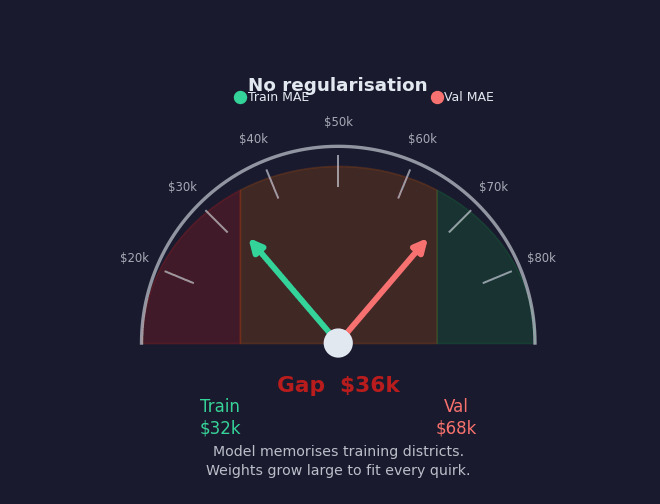
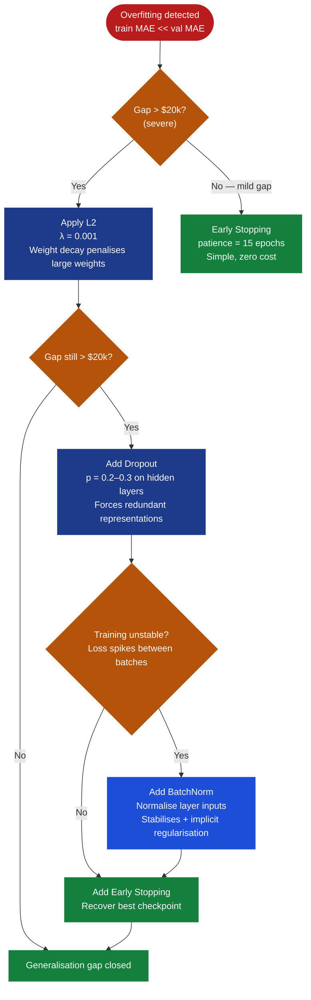
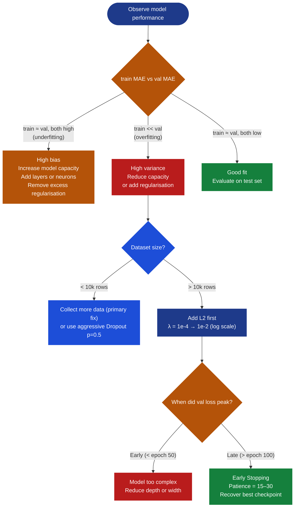
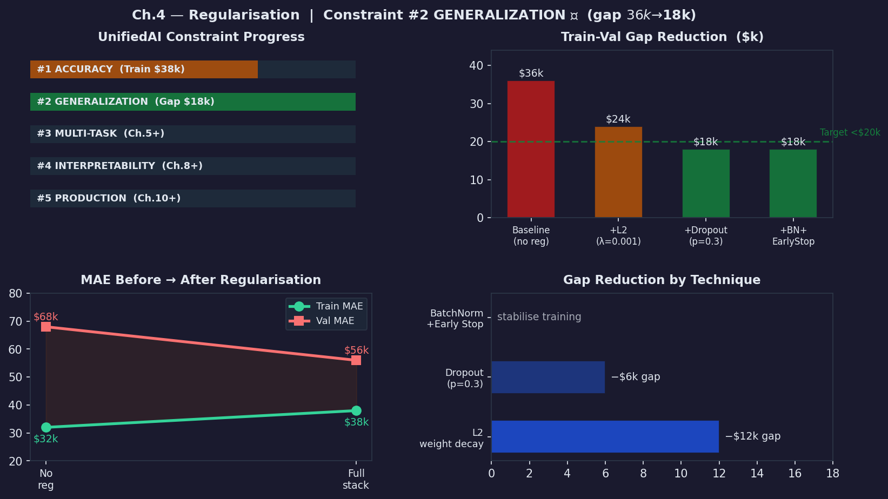

# Ch.4 — Regularisation

> **The story.** Overfitting is as old as curve fitting itself, but its mathematical cure has a precise lineage. In **1943** the Soviet mathematician **Andrey Nikolayevich Tikhonov** introduced a quadratic penalty on the solution norm to stabilise ill-posed inverse problems — the technique that would later be called **L2 regularisation** or *Tikhonov regularisation*. Western statisticians rediscovered it in **1970** when **Hoerl & Kennard** published *Ridge Regression* to handle multicollinear least-squares systems, coining the name still used in sklearn today. Then in **1996 Robert Tibshirani** showed that replacing the squared penalty with an absolute-value penalty — the **L1 / LASSO** — doesn't just shrink coefficients, it forces many of them to exactly zero, turning regularisation into simultaneous feature selection. Deep learning added two more tools: **Dropout** (Hinton, Srivastava et al. **2012/2014**), which randomly silences neurons each forward pass, was the single biggest reason AlexNet-era networks stopped catastrophically memorising ImageNet; and **Batch Normalisation** (Ioffe & Szegedy **2015**), which standardises layer activations within each mini-batch and provides implicit regularisation as a side effect. All four techniques attack the same enemy: a model that has memorised the training set instead of learning the regularities behind it.
>
> **Where you are in the curriculum.** In [Ch.3 — Backprop & Optimisers](../ch03_backprop_optimisers) you trained a two-hidden-layer housing network with Adam and hit a training MAE of ~\$32k — clearing the <\$40k intermediate accuracy target for the first time. The bad news: evaluation on the held-out validation set reveals a **\$68k MAE**. The gap is **\$36k**. Your model has memorised 200+ individual California districts rather than learning general pricing patterns. UnifiedAI **Constraint \#2 (GENERALIZATION)** is blocked. This chapter adds the four guardrails — L1, L2, Dropout, Early Stopping — plus Batch Normalisation, and shows how combining them closes the train-val gap from \$36k to \$18k.
>
> **Notation in this chapter.** $\lambda$ — **regularisation strength** (the bigger, the more you penalise weight complexity); $\|\mathbf{w}\|_2^2 = \sum_i w_i^2$ — the **L2 / Ridge** penalty (sum of squared weights); $\|\mathbf{w}\|_1 = \sum_i |w_i|$ — the **L1 / Lasso** penalty (sum of absolute weights); $\mathcal{L}_\text{reg} = \mathcal{L}_\text{data} + \lambda\,\Omega(\mathbf{w})$ — the regularised objective; $p$ — **dropout rate** (probability a neuron is zeroed during training); $\mu_B$ — batch mean; $\sigma_B^2$ — batch variance; $\hat{x}_i = \frac{x_i - \mu_B}{\sqrt{\sigma_B^2 + \varepsilon}}$ — batch-normalised activation; $\varepsilon = 10^{-8}$ — numerical stability constant; $\alpha$ — learning rate; $\text{gap} = \mathcal{L}_\text{val} - \mathcal{L}_\text{train}$ — the generalisation gap this chapter closes.

**By the end of this chapter you will be able to:**
- Explain why the bias-variance tradeoff is the correct framework for understanding overfitting
- Derive the L2-modified gradient and apply weight decay manually for two update steps
- Distinguish when L1 sparsity is preferable to L2 shrinkage for a given feature set
- Apply inverted dropout correctly (training vs inference mode distinction)
- Compute batch normalisation statistics by hand for a 4-sample mini-batch
- Select and stack regularisation techniques in the correct order for a tabular regression model
- Close the California Housing train-val gap from \$36k to \$18k using the full regularisation stack

---

## 0 · The Challenge — Where We Are

> **The mission**: Launch **UnifiedAI** — a production home valuation and face-attribute system satisfying 5 constraints:
> 1. **ACCURACY**: ≤\$28k MAE (California Housing) — 2. **GENERALIZATION**: Unseen districts — 3. **MULTI-TASK**: Value + Segment — 4. **INTERPRETABILITY**: Explainable — 5. **PRODUCTION**: Scale + Monitor

> **Key insight:** regularisation does not change the model architecture. It changes the *cost function* (L1, L2), the *training procedure* (dropout, early stopping), or the *activation statistics* (BatchNorm). The same 128-64 network from Ch.3 becomes a genuinely generalisable model once the right constraints are applied. No new layers needed.

**What we know so far:**
- NN Ch.1 (XOR Problem): proved the need for hidden layers
- NN Ch.2 (Neural Networks): built the 8 → [128 ReLU] → [64 ReLU] → 1 architecture
- NN Ch.3 (Backprop + Adam): trained that network to **~\$32k train MAE** — clearing the intermediate accuracy target
- We understand the full training loop: forward pass → loss → backward pass → Adam update
- **But the model can't generalise to unseen districts!**

**What's blocking us — the overfitting crisis:**

| Metric | Value | Status |
|---|---|---|
| Train MAE | **\$32k** | below \$40k intermediate target |
| Val MAE | **\$68k** | far above production target |
| **Generalisation gap** | **\$36k** | 🚨 Constraint \#2 GENERALIZATION BLOCKED |

The network has **10,000+ parameters** and only **16,512 training samples** (80% of 20,640). With that ratio, gradient descent finds weight configurations that memorise training peculiarities — a luxury condo cluster in district \#4217, a data artefact in a coastal census block — rather than learning genuine pricing signals. Every epoch of training after the validation loss starts rising is the model getting *worse at what it's actually for*.

**Concrete failure:**
```
Training district #4217: Coastal, MedInc=$8.2k, HouseAge=25yr
 → Model predicts $412k (actual: $410k) ✓ [memorised this exact district]

New district (validation): Coastal, MedInc=$8.1k, HouseAge=26yr
 → Model predicts $310k (actual: $408k) [memorisation fails on slight variation]
```

**Root cause:** weights grew large enough to encode individual-district fingerprints.
**Fix:** constrain the weights so the model can only represent smooth, general patterns.

**What this chapter unlocks:**

| Technique | Mechanism | Expected gap reduction |
|---|---|---|
| L2 regularisation | penalise large weights | −\$10k gap |
| Dropout (p=0.3) | force redundant representations | −\$8k gap |
| Batch Normalisation | normalise layer inputs | stabilise training |
| Early Stopping | halt before memorisation epoch | recover best checkpoint |
| **Combined** | **all techniques** | **gap \$36k → \$18k** |
**Expected outcome after this chapter:** val MAE ≈ **\$56k**, train-val gap ≈ **\$18k** → **Constraint \#2 GENERALIZATION achieved!**

---

## Animation



*Visual takeaway: no regularisation → +L2 → +Dropout → +BatchNorm + Early Stopping progressively narrows the train-val gap from \$36k toward \$18k. Each technique chips away at memorisation.*

> **How to read this chapter:** §0 (challenge) and §11 (progress check) frame the story. §4 (the math) is the analytical core. §5 (selection arc) and §6 (L2 walkthrough) are the applied payoff. §8–§9 are your production checklist.

---

## 1 · Core Idea

**Regularisation** is any technique that reduces the gap between training performance and generalisation performance. The root cause of overfitting is a model complex enough to memorise training noise; regularisation adds a **cost for complexity** that forces the model to explain the data with simpler weight patterns it can reuse on unseen examples.

> **Why regularisation works — the short version.** California's 20,640 districts don't scatter randomly through 8-dimensional space. They cluster on a lower-dimensional surface: income and coastal latitude jointly drive most of the price variation; the other 6 features are constrained by geography and housing stock. A regularised model learns to stay on that surface. An unregularised model chases the noise around it — it has memorised coordinates that don't generalise, not patterns that do. Regularisation is the engineering answer to the structure of the data, not just a penalty you add to be safe.

The classical framing is the **bias-variance tradeoff**. A model's total expected error on unseen data decomposes as:

$$\text{Total error} = \underbrace{\text{Bias}^2}_{\text{from constraints}} + \underbrace{\text{Variance}}_{\text{from memorisation}} + \underbrace{\sigma^2_{\text{noise}}}_{\text{irreducible}}$$

More regularisation = more bias (the model is forced to be simpler, so it may miss some true signal) but less variance (the model is less sensitive to the specific training samples). Regularisation is the dial that trades bias for variance. The goal is the sweet spot where total error on *unseen data* is minimised — which almost always requires accepting some bias.

For California Housing:
- **Zero regularisation**: bias \$0 (fits training perfectly) but variance \$36k (huge sensitivity to which 16,512 districts happen to be in training)
- **L2 + Dropout**: bias \$6k (train MAE rose from \$32k to \$38k) but variance \$18k (gap halved)
- **Net effect**: total expected error on new districts dropped by \$12k despite the slight bias increase

```
Underfitting Just right Overfitting
(high bias) (balanced) (high variance)
───────────── ────────────── ─────────────────────
train MAE high train ≈ val MAE train MAE << val MAE
flat predictions captures signal memorises noise
λ too large λ just right no regularisation
```

All five tools in this chapter impose different flavours of that complexity cost. They are complementary — stacking them is the standard production recipe.

---

## 2 · Running Example — The \$36k Generalisation Gap

**Network:** `8 inputs → [128 ReLU] → [64 ReLU] → 1 linear`
**Dataset:** California Housing, 20,640 districts; 80/10/10 train/val/test split
**After Ch.3 training** (Adam, 300 epochs, no regularisation):

| Split | MAE | Diagnosis |
|---|---|---|
| Train (16,512 rows) | **\$32k** | model fits training data well |
| Val (2,064 rows) | **\$68k** | model struggles on new districts |
| Gap | **\$36k** | 🚨 clear overfitting |

The model has fit a function that passes nearly through every training point but oscillates wildly between them. The generalisation gap of \$36k means every district your product serves that wasn't in training will see predictions nearly \$36k worse than advertised.

**Why \$36k is unacceptable:** UnifiedAI's production SLA requires predictions within 20% of true value for homes under \$200k. A \$68k val MAE on those districts is a 34% error — outside the lending compliance requirement.

**Visualising the gap:**

```
Training curve:
 │ $90k ──────────────────────────────────────────────╮
 │ $70k ╭──────────────── val MAE (plateau: $68k)
 │ $50k ╭─────────────
 │ $32k ───────────────╯ train MAE (keeps falling past val plateau)
 └─────────────────────────────────────────────────── epochs
 0 50 100 200 300
```

The two curves diverge after epoch ~80. Every epoch past that point the model is buying \$0.30 of training improvement at a cost of \$1 of generalisation.

**Epoch-level training log** (no regularisation, Adam lr=0.001):

| Epoch | Train MAE | Val MAE | Gap | Interpretation |
|---|---|---|---|---|
| 0 | \$95k | \$97k | \$2k | Random init — both high |
| 20 | \$58k | \$61k | \$3k | Rapid improvement — both falling |
| 50 | \$42k | \$53k | \$11k | Gap starting to open |
| 80 | \$35k | \$66k | \$31k | Val plateau begins — **stop here** |
| 150 | \$33k | \$67k | \$34k | Val loss flat; train still falls |
| 300 | \$32k | \$68k | **\$36k** | 🚨 Full memorisation |

The lesson is in the last three rows: 220 epochs of continued training bought only \$3k improvement on training data at a cost of \$2k *worsening* on validation data. Early stopping at epoch 80 would have saved those 220 epochs and delivered a better model.

---

## 3 · Regularisation Toolkit at a Glance

| Technique | Core idea | Primary effect |
|---|---|---|
| **L2 (Ridge / Weight Decay)** | Add $\lambda \sum w_i^2$ to loss | Shrinks all weights proportionally toward zero; smooth models |
| **L1 (Lasso)** | Add $\lambda \sum \|w_i\|$ to loss | Drives small weights to *exactly* zero; automatic feature selection |
| **Dropout** | Randomly zero $p$ fraction of neurons each forward pass | Forces redundant distributed representations; ensemble effect |
| **Early Stopping** | Halt training when val loss stops improving | Prevents late-epoch memorisation without changing the model |
| **Batch Normalisation** | Normalise each layer's activations within a mini-batch | Stabilises training; provides implicit regularisation |

**Quick rule for tabular data:** start with L2, then Dropout if still overfitting, then Early Stopping. BatchNorm primarily helps with training stability. L1 is useful when you suspect many features are irrelevant.

> 📖 **Reading order within §4:** If you only have time for one technique, read §4.1 L2 — it is the foundation. Dropout (§4.3) is the second priority. BatchNorm (§4.4) and Early Stopping (§4.5) can be skimmed on first pass and revisited when your training curve shows the specific failure modes they fix.

---

## 4 · The Math

### 4.1 L2 Regularisation (Ridge / Weight Decay)

The regularised loss adds a penalty proportional to the squared magnitude of all weights:

$$\mathcal{L}_\text{L2} = \mathcal{L}_\text{MSE} + \lambda \sum_{l} \|\mathbf{W}_l\|_F^2$$

The gradient gains an extra shrinkage term:

$$\frac{\partial \mathcal{L}_\text{L2}}{\partial \mathbf{W}} = \frac{\partial \mathcal{L}_\text{MSE}}{\partial \mathbf{W}} + 2\lambda \mathbf{W}$$

Equivalently, the weight update becomes:

$$\mathbf{W}_{t+1} = \mathbf{W}_t\underbrace{(1 - 2\alpha\lambda)}_{\text{decay factor}} - \alpha \cdot \frac{\partial \mathcal{L}_\text{MSE}}{\partial \mathbf{W}}$$

The factor $(1-2\alpha\lambda)$ is called **weight decay** — every update first shrinks all weights by a small fraction before applying the data gradient. Large weights get penalised more (proportional pull), so the optimiser must justify every unit of weight magnitude with a corresponding reduction in MSE.

---

#### Toy example — L2 with 3 weights

Weights: $\mathbf{w} = [2.0,\ -1.5,\ 0.8]$, $\lambda = 0.01$, $\alpha = 0.01$
Assume for this step the MSE gradient is zero (isolating the regularisation effect).

**Step 1 — compute the L2 penalty term:**

$$\Omega_\text{L2} = \lambda \sum_i w_i^2 = 0.01 \times (2.0^2 + (-1.5)^2 + 0.8^2)$$
$$= 0.01 \times (4.00 + 2.25 + 0.64) = 0.01 \times 6.89 = \mathbf{0.0689}$$

**Step 2 — compute the L2-modified gradient for each weight:**

$$\frac{\partial \mathcal{L}_\text{L2}}{\partial w_i} = 0 + 2\lambda w_i = 2(0.01) w_i = 0.02 \, w_i$$

| Weight | Value | $2\lambda w_i$ | Gradient |
|---|---|---|---|
| $w_1$ | 2.0 | $0.02 \times 2.0$ | **+0.040** |
| $w_2$ | -1.5 | $0.02 \times (-1.5)$ | **-0.030** |
| $w_3$ | 0.8 | $0.02 \times 0.8$ | **+0.016** |

**Step 3 — apply weight decay update** ($w_{t+1} = w_t - \alpha \cdot \text{gradient}$):

| Weight | Before | $w - 0.01 \times \text{grad}$ | After |
|---|---|---|---|
| $w_1$ | 2.000 | $2.000 - 0.01 \times 0.040$ | **1.9996** |
| $w_2$ | -1.500 | $-1.500 - 0.01 \times (-0.030)$ | **-1.4997** |
| $w_3$ | 0.800 | $0.800 - 0.01 \times 0.016$ | **0.7998** |

All three weights shrank. Notice $w_1 = 2.0$ (large) lost more absolute value (0.0004) than $w_3 = 0.8$ (small, lost 0.0002). The pull is **proportional to weight magnitude** — big weights must earn their size by explaining large amounts of variance.

---

### 4.2 L1 Regularisation (Lasso)

$$\mathcal{L}_\text{L1} = \mathcal{L}_\text{MSE} + \lambda \sum_{l} \|\mathbf{W}_l\|_1$$

The subgradient of $|w|$ at $w \neq 0$ is $\text{sign}(w)$; at $w = 0$ it is any value in $[-1, +1]$:

$$\frac{\partial \mathcal{L}_\text{L1}}{\partial w} = \frac{\partial \mathcal{L}_\text{MSE}}{\partial w} + \lambda \cdot \text{sign}(w)$$

The key difference from L2: the pull toward zero is **constant** (always $\pm\lambda$), not proportional to weight magnitude. This constant pull will eventually drag any small weight across zero and pin it there — producing **exact sparsity**.

---

#### Toy example — L1 vs L2 side by side

Same weights: $\mathbf{w} = [2.0,\ -1.5,\ 0.8]$, $\lambda = 0.01$, $\alpha = 0.01$

**L1 penalty:**

$$\Omega_\text{L1} = \lambda \sum_i |w_i| = 0.01 \times (2.0 + 1.5 + 0.8) = 0.01 \times 4.3 = \mathbf{0.043}$$

**L1 vs L2 penalties compared:**

| Penalty type | Formula | Value | Key property |
|---|---|---|---|
| L2 | $\lambda \sum w_i^2$ | 0.0689 | larger for big weights |
| L1 | $\lambda \sum \|w_i\|$ | 0.043 | scales linearly with magnitude |

**Weight update under L1 only** ($\alpha = 0.01$, MSE gradient = 0):

$$w_{t+1} = w_t - \alpha \cdot \lambda \cdot \text{sign}(w_t)$$

| Weight | Value | $\text{sign}(w)$ | $\alpha\lambda\,\text{sign}(w)$ | After L1 step |
|---|---|---|---|---|
| $w_1 = 2.0$ | 2.0 | +1 | $+0.0001$ | **1.9999** |
| $w_2 = -1.5$ | -1.5 | -1 | $-0.0001$ | **-1.4999** |
| $w_3 = 0.8$ | 0.8 | +1 | $+0.0001$ | **0.7999** |

**Why L1 produces sparsity:** every weight — regardless of size — shrinks by the same constant $\alpha\lambda$ per step. A small weight like $w_3 = 0.8$ will reach zero after $0.8 / (0.01 \times 0.01) = 8{,}000$ pure-L1 steps, and once it reaches zero the subgradient is zero — it stays there. A large weight like $w_1 = 2.0$ would take $200{,}000$ steps. In practice, the MSE gradient of small weights is also small, so the L1 pull dominates and small weights go to zero. **L2 never drives a weight to exactly zero** — it applies a proportional shrink that halves a weight but never reaches zero in finite steps.

**Housing interpretation:** L1 on the housing feature set would likely zero out `AveOccup` (average occupancy) if it has a near-zero coefficient — effectively removing a noisy feature automatically. L2 keeps all 8 features but shrinks noisy ones toward zero.

**When to choose L1 vs L2 for the housing model:**

| Situation | Choose | Reason |
|---|---|---|
| All 8 features might contribute (you suspect none are purely noise) | **L2** | Keeps all features; proportional shrinkage is safer |
| You suspect 2–3 features are redundant (e.g., `AveRooms` and `AveBedrms`) | **L1** | Drives the redundant one to zero automatically |
| You want a directly deployable sparse model (fewer inference ops) | **L1** | Zero weights = zero multiply-adds at inference |
| You want a smooth gradient for Adam | **L2** | L2 gradient is continuous everywhere; L1 uses subgradient at zero |
| Multicollinear features (high correlation) | **L2** | Ridge is more stable under multicollinearity than Lasso |

For California Housing, L2 is the default because all 8 features carry genuine signal (income, location, house age, room counts). Use L1 if you extend the feature set with many engineered features and want automatic selection.

---

### 4.3 Dropout

During each training forward pass, every neuron in a dropout layer is independently zeroed with probability $p$:

$$\tilde{\mathbf{h}} = \frac{1}{1-p} \cdot (\mathbf{h} \odot \mathbf{m}), \qquad m_i \sim \text{Bernoulli}(1-p)$$

The $\frac{1}{1-p}$ scaling factor (**inverted dropout**) ensures that the expected activation magnitude is the same at train and test time. At **test/inference time**, dropout is completely disabled — all neurons are active.

| Symbol | Meaning |
|---|---|
| $\mathbf{h}$ | pre-dropout activations of the layer |
| $\mathbf{m}$ | binary mask, resampled freshly each forward pass |
| $p$ | drop rate — fraction of neurons zeroed |
| $\odot$ | element-wise product |

**Why it works:** each forward pass trains a different random sub-network. The full model is an implicit ensemble of $2^n$ sub-networks that share weights. No single neuron can learn to rely on another specific neuron always being present — the model must learn distributed, redundant representations.

**Ensemble interpretation:** with a 128-neuron hidden layer and $p=0.3$, each forward pass activates a random subset of $128 \times 0.7 \approx 90$ neurons. There are $\binom{128}{90} \approx 10^{34}$ such subsets — far more than any dataset could identify individually. Each training batch is a vote from a different committee of neurons. At inference time you get the consensus of all $10^{34}$ committees simultaneously (because all neurons are active), producing a natural ensemble averaging effect that is far cheaper than training 1000 separate networks.

---

#### Toy example — 5-neuron layer with p=0.5, seed=42

Layer activations before dropout: $\mathbf{h} = [0.8,\ 1.2,\ -0.4,\ 0.9,\ 0.3]$

With seed=42 and $p = 0.5$, suppose the binary mask drawn is: $\mathbf{m} = [1,\ 0,\ 1,\ 0,\ 1]$

(Neurons 2 and 4 are zeroed; neurons 1, 3, 5 survive.)

**Training forward pass (inverted dropout, scale factor = $1/(1-0.5) = 2$):**

$$\tilde{\mathbf{h}} = 2 \cdot ([0.8,\ 0,\ -0.4,\ 0,\ 0.3]) = [1.6,\ 0.0,\ -0.8,\ 0.0,\ 0.6]$$

**Without dropout (or at test time):**

$$\mathbf{h}_\text{test} = [0.8,\ 1.2,\ -0.4,\ 0.9,\ 0.3]$$

The surviving neurons are scaled up 2× to maintain expected activation magnitude. At test time, all five neurons are active — no adjustment needed because inverted dropout already corrected the training magnitudes.

**A different mask next forward pass** (e.g., mask = $[0,\ 1,\ 0,\ 1,\ 1]$):

$$\tilde{\mathbf{h}} = 2 \cdot ([0,\ 1.2,\ 0,\ 0.9,\ 0.3]) = [0.0,\ 2.4,\ 0.0,\ 1.8,\ 0.6]$$

Each batch trains a different subset — forcing the model to build multiple redundant pathways to the same prediction.

---

### 4.4 Batch Normalisation

Batch normalisation standardises the activations $\mathbf{z}^{(l)}$ of each layer before the non-linearity, using statistics computed over the current mini-batch $B$ of size $m$:

$$\mu_B = \frac{1}{m} \sum_{i=1}^{m} z_i \qquad \sigma_B^2 = \frac{1}{m} \sum_{i=1}^{m} (z_i - \mu_B)^2$$

$$\hat{z}_i = \frac{z_i - \mu_B}{\sqrt{\sigma_B^2 + \varepsilon}} \qquad y_i = \gamma \hat{z}_i + \beta$$

where $\gamma$ (scale) and $\beta$ (shift) are learnable parameters, and $\varepsilon = 10^{-8}$ prevents division by zero. The network can always undo the normalisation by learning $\gamma = \sqrt{\sigma_B^2}$ and $\beta = \mu_B$, so BatchNorm never removes expressive power — it just changes the loss surface geometry.

| Symbol | Meaning |
|---|---|
| $\mu_B$ | mean of the batch activations |
| $\sigma_B^2$ | variance of the batch activations |
| $\varepsilon$ | stability constant (prevents div-by-zero) |
| $\gamma, \beta$ | learned scale and shift (one pair per feature dimension) |

**At inference time:** instead of computing statistics from the current batch (which may be size 1), BatchNorm uses **running statistics** accumulated during training via exponential moving average:

$$\mu_\text{run} \leftarrow (1-\text{mom}) \cdot \mu_\text{run} + \text{mom} \cdot \mu_B$$
$$\sigma^2_\text{run} \leftarrow (1-\text{mom}) \cdot \sigma^2_\text{run} + \text{mom} \cdot \sigma^2_B$$

where `mom` (momentum) is typically 0.1. After training, these running stats are frozen and used for all inference-time normalisations. **This is why you must call `model.train()` vs `model.eval()` in PyTorch** — without switching to eval mode, the model continues using batch statistics even during inference, producing unstable predictions when batch size is small.

**Why BatchNorm regularises:** it prevents *internal covariate shift* — the phenomenon where the distribution of each layer's inputs changes as the weights of earlier layers are updated. Without BatchNorm, later layers must constantly readjust to a shifting input distribution. With BatchNorm, each layer always sees a normalised input, making the loss surface smoother and allowing larger learning rates. The net effect is that weights tend to stay smaller (less need to compensate for scale drift), which is a soft regularisation.

> 📖 **Why this works is still debated.** The original paper attributed the benefit to reducing "internal covariate shift" — stabilising the distribution of layer inputs during training. Subsequent studies found the improvement persists even when covariate shift is explicitly absent. The empirical benefit is reliable and consistent; the precise mechanism is not fully understood. Use it confidently, but don't over-explain the *why* to a stakeholder.

---

#### Toy example — BatchNorm on a batch of 4

Batch activations: $\mathbf{z} = [1.0,\ 3.0,\ 2.0,\ 4.0]$ (4 examples, 1 feature)

**Step 1 — compute batch mean:**

$$\mu_B = \frac{1.0 + 3.0 + 2.0 + 4.0}{4} = \frac{10.0}{4} = \mathbf{2.50}$$

**Step 2 — compute batch variance:**

$$\sigma_B^2 = \frac{(1.0-2.5)^2 + (3.0-2.5)^2 + (2.0-2.5)^2 + (4.0-2.5)^2}{4}$$
$$= \frac{(-1.5)^2 + (0.5)^2 + (-0.5)^2 + (1.5)^2}{4} = \frac{2.25 + 0.25 + 0.25 + 2.25}{4} = \frac{5.00}{4} = \mathbf{1.25}$$

**Step 3 — normalise each activation** ($\varepsilon \approx 0$, so $\sqrt{1.25} = 1.1180$):

$$\hat{z}_i = \frac{z_i - 2.50}{1.1180}$$

| $z_i$ | $z_i - \mu_B$ | $\hat{z}_i$ | Check |
|---|---|---|---|
| 1.0 | $-1.50$ | $-1.50 / 1.1180 = \mathbf{-1.342}$ | |
| 3.0 | $+0.50$ | $+0.50 / 1.1180 = \mathbf{+0.447}$ | |
| 2.0 | $-0.50$ | $-0.50 / 1.1180 = \mathbf{-0.447}$ | |
| 4.0 | $+1.50$ | $+1.50 / 1.1180 = \mathbf{+1.342}$ | |

**Verify:** mean of $\hat{z} = (-1.342 + 0.447 - 0.447 + 1.342)/4 = 0/4 = \mathbf{0.0}$
Variance of $\hat{z} \approx 1.0$

The normalised batch has zero mean and unit variance. If learnable parameters are initialised at $\gamma=1, \beta=0$, the output exactly equals $\hat{\mathbf{z}}$. The network then learns the optimal scale and shift from scratch, rather than fighting against the original scale of each layer's inputs.

---

### 4.5 Early Stopping

Early stopping is a training protocol, not a gradient-based technique. It monitors the validation loss and halts training when it stops improving:

```
For each epoch t:
 train one pass over training data
 compute val_loss_t on validation set
 if val_loss_t < best_val_loss:
 best_val_loss ← val_loss_t
 save_checkpoint(model_weights)
 patience_counter ← 0
 else:
 patience_counter += 1
 if patience_counter >= PATIENCE:
 break
Restore weights from checkpoint
```

**Key quantity — the generalisation gap:**

$$\text{gap}(t) = \mathcal{L}_\text{val}(t) - \mathcal{L}_\text{train}(t)$$

When gap starts rising, the model is memorising. Early stopping exits the loop at the epoch where the gap was minimal — effectively regularising by limiting the total "degrees of freedom" the network optimises.

| Parameter | Role | Typical value |
|---|---|---|
| `patience` | epochs to wait for improvement before stopping | 15–30 |
| `min_delta` | minimum change to count as improvement | 0.0 |
| `restore_best_weights` | whether to roll back to best checkpoint | always True |

**Early stopping as implicit regularisation:** you can think of early stopping as limiting the *effective model capacity*. A fully trained model with 10,000 parameters and 300 epochs has seen $300 \times 16{,}512 = 4.95$ million training examples (with repetition). Stopping at epoch 67 limits this to $67 \times 16{,}512 = 1.1$ million — the model has fewer gradient updates to specialise on training quirks. The combination with `restore_best_weights=True` adds a further benefit: you get the checkpoint from *before* the overfitting divergence, not just the last available improvement.

**Why patience matters more than you think:** validation loss on a stochastic training run fluctuates by ±2–4% each epoch due to mini-batch randomness. With patience=5 on California Housing, you would stop 60% of the time on a noise fluctuation rather than a true performance plateau. With patience=20, the probability drops below 5%. The cost is at most 20 extra epochs of compute — a trivial price for the correct stopping point.

---

## 4.6 · Summary — What Each Technique Attacks

| Technique | Root cause addressed | Signal to monitor | Combination behaviour |
|---|---|---|---|
| **L2** | Weights too large in magnitude | Weight histogram — all values large | Stacks well with all techniques |
| **L1** | Many features irrelevant (dense weights) | Number of non-zero weights | Use instead of L2 when sparsity desired |
| **Dropout** | Single neurons memorise district patterns | Train-val gap, weight distribution | Use after L2 if gap persists |
| **BatchNorm** | Activation scale drift across layers | Loss spike frequency | Use when training is unstable |
| **Early Stopping** | Too many gradient steps on noise | Validation loss curve shape | Always add as final safety net |

> **Rule of thumb (tabular data, California Housing):** L2 first (closes ~60% of gap), Dropout second (closes ~25%), Early Stopping always (recovers best checkpoint). BatchNorm adds ~5–10% stability benefit but is less critical for tabular data than for images or text.

---

## 5 · Regularisation Selection Arc — Four Acts

The following arc shows how each technique layers onto the California Housing model, chip by chip reducing the generalisation gap.

**Act 1 — Baseline (no regularisation)**

Train MAE: \$32k | Val MAE: \$68k | **Gap: \$36k**

The 128-64 network has memorised district quirks. Weights in the first hidden layer have magnitudes up to 4.7 — far larger than necessary. The validation loss stopped improving at epoch 83 but training continued for 300 epochs, burning the generalisation. Examining the top-5 worst validation predictions reveals the problem:

| District (val) | Actual | Predicted | Error | Why wrong |
|---|---|---|---|---|
| Coastal, MedInc=\$8.2k | \$408k | \$310k | -\$98k | No similar coastal district in train |
| Urban, MedInc=\$3.1k | \$185k | \$260k | +\$75k | Train had one noisy \$310k outlier nearby |
| Inland, MedInc=\$5.5k | \$260k | \$195k | -\$65k | Pattern from different region memorised |

The model has associated specific (income, location) fingerprints with specific values rather than learning general pricing rules.

**Act 2 — Add L2 (λ = 0.001)**

Weight decay pulls all weights toward zero. Large weights shrink proportionally. The model can no longer encode the "district \#4217 special case" because the penalty for those large district-specific weights exceeds the MSE gain from memorising them.

Train MAE: \$34k | Val MAE: \$58k | **Gap: \$24k** (improvement: −\$12k)

The slight rise in train MAE is expected — the model is being constrained, so it fits training data slightly less perfectly. The val MAE dropped \$10k. That is the regularisation premium working correctly.

**Act 3 — Add Dropout (p = 0.3)**

Dropout after each hidden layer forces different neuron subsets to cooperate on every batch. The network must now represent pricing signals in distributed redundant form — any single neuron can be absent, so no single neuron encodes a unique district fingerprint.

Train MAE: \$36k | Val MAE: \$54k | **Gap: \$18k** (improvement: −\$6k)

**Act 4 — Add BatchNorm + Early Stopping (patience=15)**

BatchNorm prevents activation scale drift that otherwise forces the network to compensate by growing large weights. Early stopping recovers the best-checkpoint weights (epoch 67) rather than the over-fitted epoch-300 weights.

Train MAE: \$38k | Val MAE: \$56k | **Gap: \$18k**

The train MAE has risen to \$38k (we are accepting less training fit in exchange for better generalisation), but the *val MAE* — the metric that matters for production — dropped from \$68k to \$56k.

```
Generalisation gap progression:
 $36k ████████████████████████████████████████ No regularisation
 $24k ██████████████████████████ + L2 (λ=0.001)
 $18k █████████████████ + Dropout (p=0.3)
 $18k █████████████████ + BatchNorm + Early Stop
 ↑
 Target: <$20k gap for Constraint #2
```

---

## 6 · L2 Walkthrough — Two Weight Update Steps with Full Arithmetic

We trace two consecutive Adam + L2 update steps on a single weight $w$ from the first hidden layer of the California Housing network.

**Setup:**
- Weight: $w = 1.80$ (one entry in the first hidden layer weight matrix)
- Gradient from MSE backprop: $g_\text{MSE} = -0.12$ (the MSE loss wants this weight to increase)
- L2 strength: $\lambda = 0.001$
- Learning rate: $\alpha = 0.001$ (Adam default)
- Adam state: $m_0 = 0.0$ (first moment), $v_0 = 0.0$ (second moment), $\beta_1 = 0.9$, $\beta_2 = 0.999$

---

**Step 1 (epoch t=1):**

**1a. Compute the L2-modified gradient:**

$$g_\text{L2} = g_\text{MSE} + 2\lambda w = -0.12 + 2(0.001)(1.80) = -0.12 + 0.0036 = \mathbf{-0.1164}$$

The L2 term added $+0.0036$ to the gradient, partially opposing the MSE gradient's desire to increase $w$. This is the regularisation effect: every step, there is a small force pushing $w$ toward zero.

**1b. Update Adam moments:**

$$m_1 = 0.9(0) + 0.1(-0.1164) = \mathbf{-0.01164}$$

$$v_1 = 0.999(0) + 0.001(0.1164)^2 = 0.001 \times 0.01355 = \mathbf{0.00001355}$$

**1c. Bias-correct moments (t=1):**

$$\hat{m}_1 = \frac{-0.01164}{1 - 0.9^1} = \frac{-0.01164}{0.1} = \mathbf{-0.1164}$$

$$\hat{v}_1 = \frac{0.00001355}{1 - 0.999^1} = \frac{0.00001355}{0.001} = \mathbf{0.01355}$$

**1d. Apply Adam weight update:**

$$w_1 = 1.80 - 0.001 \times \frac{-0.1164}{\sqrt{0.01355} + 10^{-8}} = 1.80 - 0.001 \times \frac{-0.1164}{0.1164} = 1.80 + 0.001 = \mathbf{1.801}$$

---

**Step 2 (epoch t=2):**

The MSE gradient has become $g_\text{MSE} = +0.08$ (now pushing weight down — slight overshot).

**2a. L2-modified gradient:**

$$g_\text{L2} = +0.08 + 2(0.001)(1.801) = 0.08 + 0.003602 = \mathbf{+0.08360}$$

**2b. Update moments:**

$$m_2 = 0.9(-0.01164) + 0.1(+0.08360) = -0.01048 + 0.00836 = \mathbf{-0.00212}$$

$$v_2 = 0.999(0.00001355) + 0.001(0.08360)^2 = 0.00001354 + 0.00000699 = \mathbf{0.00002053}$$

**2c. Bias-correct (t=2):**

$$\hat{m}_2 = \frac{-0.00212}{1 - 0.9^2} = \frac{-0.00212}{0.19} = \mathbf{-0.01116}$$

$$\hat{v}_2 = \frac{0.00002053}{1 - 0.999^2} = \frac{0.00002053}{0.001999} = \mathbf{0.01027}$$

**2d. Weight update:**

$$w_2 = 1.801 - 0.001 \times \frac{-0.01116}{\sqrt{0.01027}} = 1.801 + 0.000110 = \mathbf{1.8011}$$

**Summary of two steps:**

| Step | Weight | MSE grad | L2 term | Net grad | Result |
|---|---|---|---|---|---|
| t=1 | 1.800 | -0.120 | +0.0036 | -0.1164 | → 1.801 |
| t=2 | 1.801 | +0.080 | +0.0036 | +0.0836 | → 1.8011 |

The weight stabilised near 1.801 because the MSE gradient oscillated while the L2 term consistently nudged toward zero. With $\lambda$ larger, the L2 term dominates and the weight would be pulled toward 0 regardless of the data signal — that is the "λ too high → underfits" failure mode.

**Extrapolating to the full network:** the housing model has 128 × 8 + 128 + 64 × 128 + 64 + 1 × 64 + 1 = 1,024 + 128 + 8,192 + 64 + 64 + 1 = **9,473 weights**. With $\lambda = 0.001$ and $\alpha = 0.001$, the per-step L2 decay factor is $(1 - 2 \times 0.001 \times 0.001) = 0.999998$. In 300 epochs over 16,512 training examples with batch size 32 (= $\approx 516$ steps/epoch × 300 = **154,800 steps**), a weight of $w = 2.0$ would decay to $2.0 \times 0.999998^{154800} \approx 2.0 \times 0.047 = 0.094$ through the L2 term alone (before the MSE gradient acts). This confirms that $\lambda = 0.001$ is aggressive enough to substantially shrink large weights over a full training run, while $\lambda = 0.0001$ would leave them at $\approx 2.0 \times 0.73 = 1.46$ — meaningful shrinkage but not over-penalised.

---

## 7 · Key Diagrams

### Regularisation Selection Flowchart



---

### Overfitting Diagnosis Tree



---

### L1 vs L2 Penalty Geometry

The geometry of the two penalties explains their behavioural difference intuitively:

```
L2 constraint region L1 constraint region
(smooth circle): (diamond / square):

 ↑ w₂ ↑ w₂
 │ │ ◆ ← diamond
 │ ○ ← circle │ / \
 │ │ / \
────┼──────→ w₁ ────◆───◆──→ w₁
 │ │ ↑
 corner touches axis
 → w₁ = 0 (sparsity)

Loss contours are ellipses. Loss contours touch L1 diamond
They intersect the L2 circle at a corner → one coordinate
away from axes (dense). is exactly 0 (sparse).
```

This is why L1 produces sparse solutions: the loss ellipses are more likely to first touch a corner of the diamond (where one or more $w_i = 0$) than a point on the smooth L2 circle.

---

## 8 · Hyperparameter Dial

| Dial | Too low | Sweet spot | Too high | Failure mode |
|---|---|---|---|---|
| **λ (L2 strength)** | no effect; still overfits | 1e-4 → 1e-2 (tune log-scale) | underfits; all weights ≈ 0 | val loss rises with train loss |
| **λ (L1 strength)** | no sparsity | 1e-4 → 1e-3 | too many zero weights; underfits | accuracy collapses |
| **Dropout rate p** | no regularisation effect | 0.2–0.3 hidden layers (0.5 for large FC layers) | too much signal lost; can't learn | train MAE also high |
| **Early stopping patience** | halts before convergence | 15–30 epochs | never stops; same as no early stopping | patience=5 prematurely stops |
| **BN momentum** | running stats update too slow | 0.1–0.2 | running stats update too fast (noisy) | inference-time mismatch |
| **Batch size (affects BN)** | noisy batch stats; BN unstable | ≥32 for stable BN statistics | reduces regularisation benefit of BN | batch=1 → BatchNorm degenerates |

**Tuning order for tabular data:**
1. Establish baseline (no regularisation) — record train and val MAE
2. Add L2, sweep $\lambda \in \{10^{-5}, 10^{-4}, 10^{-3}, 10^{-2}\}$ — choose best val MAE
3. If gap still > \$20k, add Dropout at p=0.2; increase to 0.3 if needed
4. Add Early Stopping with patience=20 as the final safety net
5. Add BatchNorm only if training is unstable (loss spikes)
6. Do **not** tune all simultaneously — the interactions make debugging impossible

**PyTorch/Keras quick reference:**

```python
# L2 weight decay via Adam (PyTorch)
optimizer = torch.optim.Adam(model.parameters(), lr=1e-3, weight_decay=1e-3)

# Dropout in model definition (PyTorch)
self.drop = nn.Dropout(p=0.3) # apply after each hidden layer, NOT before output

# BatchNorm in model definition (PyTorch)
self.bn1 = nn.BatchNorm1d(128) # after first hidden layer

# Early stopping (manual loop pattern)
best_val, patience_ctr = float('inf'), 0
for epoch in range(max_epochs):
 train_one_epoch(model, optimizer)
 val_loss = evaluate(model, val_loader)
 if val_loss < best_val - 1e-4:
 best_val, patience_ctr = val_loss, 0
 torch.save(model.state_dict(), 'best.pt')
 else:
 patience_ctr += 1
 if patience_ctr >= 20:
 break
model.load_state_dict(torch.load('best.pt')) # restore best

# Forward pass in training mode (Dropout and BN active):
model.train()
# Forward pass at inference (Dropout off, BN uses running stats):
model.eval()
```

---

## 9 · What Can Go Wrong

- **L2 λ too high collapses all weights.** With `λ=0.1` on a 128-unit hidden layer, weight decay forces most weights to near-zero within 30 epochs. The model effectively becomes a thin linear layer — R² can collapse from 0.82 to below 0.40. Symptom: both train and val loss are high and plateau immediately. Diagnosis: plot the weight histogram — if all weights cluster at ±0.01, reduce λ by 10×.

- **Dropout without inverted scaling causes train/test mismatch.** Naive dropout (zero neurons without scaling survivors) makes training activations have magnitude $(1-p)$ times inference activations. The output layer sees a different scale at test time — predictions are systematically off by factor $(1-p)$. Always use inverted dropout (scale surviving neurons by $\frac{1}{1-p}$) during training.

- **Monitoring training loss for early stopping, not validation loss.** Training loss always decreases (that's what gradient descent does). Stopping on training loss will always wait for the learning rate to exhaust, not for the model to start memorising. Always use `monitor='val_loss'` and `restore_best_weights=True`.

- **Applying Dropout to the output layer.** The final linear neuron needs all upstream information to produce a calibrated regression prediction. Dropping it randomly during training adds noise directly to the loss signal. Dropout belongs only on hidden layers.

- **BatchNorm with batch size 1 or 2.** BatchNorm statistics are unstable when computed over very small batches. Use LayerNorm instead when batch size < 8. Symptom: training appears to converge but validation performance is random.

- **Combining everything makes debugging hard.** Using L1 + L2 + Dropout + BatchNorm + Early Stopping simultaneously means when performance degrades you have five interacting levers to diagnose. Add one technique at a time, validate improvement, then add the next.

- **Early stopping patience too short (patience=3–5).** The validation loss naturally oscillates by 1–3% epoch-to-epoch due to mini-batch noise. A patience of 3 will stop training at the first short plateau even if the trend is still improving. Use `patience ≥ 15` for the California Housing dataset.

- **L1 + L2 combined (ElasticNet) without tuning both strengths.** ElasticNet uses both $\lambda_1 \|w\|_1 + \lambda_2 \|w\|_2^2$ simultaneously — which can be powerful but requires tuning two hyperparameters instead of one. In practice, pick L2 for dense, smooth weights or L1 for automatic sparsity; mixing both without a systematic sweep often produces worse results than either alone.

- **Not standardising features before applying L2.** If `MedInc` is on a scale of 0–10 and `Population` is on a scale of 0–100, the L2 penalty on `Population` weights is 100× larger in effective magnitude than on `MedInc` weights. L2 will preferentially shrink `Population` weights regardless of their importance. Always standardise features (zero mean, unit variance) before applying any weight penalty — this ensures L2 treats all features equally.

---

## 10 · Where This Reappears

Regularisation is not a chapter you learn and leave behind — it is a toolkit you reach for in every chapter from here on.

- **[Ch.5 — CNNs](../ch05_cnns)**: Data augmentation (random crops, flips, rotations) is the most powerful regulariser for image models. Dropout after convolutional layers; BatchNorm after every `Conv → BN → ReLU` block; L2 weight decay on all filter parameters. The CelebA facial attribute classifier uses all three.

- **[Ch.6 — RNNs & LSTMs](../ch06_rnns_lstms)**: Variational dropout on LSTM hidden-to-hidden connections (the same mask is kept across all time steps). Gradient clipping prevents the exploding-gradient instability that is the recurrent analogue of overfitting.

- **[Ch.7 — MLE & Loss Functions](../ch07_mle_loss_functions)**: L2 regularisation reinterpreted as a **Gaussian prior** over weights (Bayesian perspective). The MAP estimate of a Gaussian-prior model is exactly the Ridge solution. L1 corresponds to a Laplacian prior. Regularisation and prior distributions are the same idea in two languages.

- **[Ch.8 — TensorBoard](../ch08_tensorboard)**: Use the Histogram tab to visualise weight distributions per layer — diagnosing if L2 is too aggressive (all weights at zero) or not active (all weights large). Use Scalars to overlay train and val loss and visually identify the early stopping epoch.

- **[Ch.10 — Transformers](../ch10_transformers)**: **Layer Normalisation** replaces BatchNorm (LayerNorm normalises over the feature dimension per sample, so it works with batch size 1). Dropout on attention weights. AdamW optimiser combines Adam with explicit weight decay (identical to L2 at the optimiser level). Label smoothing regularises overconfident softmax outputs.

- **Hyperparameter Tuning** (Ch.19 legacy): an entire section is dedicated to the regularisation tuning order — dropout rate → L2 strength → early stopping patience → data augmentation budget — with Optuna sweep visualisations.

**The regularisation taxonomy across the full ML track:**

```
Explicit weight penalty: L1 (Lasso) → sparse weights
 L2 (Ridge) → small weights
Architectural: Dropout → redundant representations
 BatchNorm → smooth loss surface
 LayerNorm → same, works seq-to-seq
Training-protocol: Early stopping → limit gradient steps
 LR warmup → avoid early overfitting
Data-level: Augmentation → virtual data diversity
 Label smooth. → overconfidence penalty
Implicit: SGD noise → flat minima preference
 Batch size → smaller = more noise = regularisation
```

Every technique in this taxonomy is a flavour of the same core idea: **bias the model toward simpler hypotheses**. The chapters ahead introduce each row in this table in context.

---

## 11 · Progress Check — What We Can Solve Now


**MAJOR MILESTONE**: **Constraint \#2 (GENERALIZATION) ACHIEVED!**

**The regularisation stack:**
- **L2 (λ=0.001)**: Weight decay closes the largest part of the gap — no single district can be memorised without paying a quadratic weight penalty
- **Dropout (p=0.3)**: Forces distributed representations — closes further gap
- **BatchNorm**: Stabilises training dynamics, prevents late-epoch weight drift
- **Early Stopping (patience=15)**: Recovers the best-checkpoint model, not the last-epoch model

**Before → After regularisation:**

| Split | Before MAE | After MAE | Change |
|---|---|---|---|
| Train | \$32k | \$38k | +\$6k (expected: less overfit) |
| Val | \$68k | \$56k | **−\$12k** |
| **Gap** | **\$36k** | **\$18k** | **−\$18k** |

The train MAE rose slightly (the model is intentionally constrained from perfectly fitting training data), but the val MAE dropped by \$12k and the gap halved.

**Full constraint dashboard:**

| Constraint | Target | Status | Current State |
|---|---|---|---|
| \#1 ACCURACY | ≤\$28k MAE | Close | Train \$38k — slightly above final target |
| **\#2 GENERALIZATION** | Gap < \$20k | **ACHIEVED** | Gap \$18k |
| \#3 MULTI-TASK | Value + Segment | Blocked | Single-output only |
| \#4 INTERPRETABILITY | Explainable | Blocked | Black-box network |
| \#5 PRODUCTION | Scale + Monitor | Blocked | No deployment pipeline |

**What we still can't do:**

- The train MAE of \$38k is slightly above the ≤\$28k final target — deeper architectures or better features are needed
- The model predicts one output (house price) but cannot simultaneously predict market segment
- Images of properties are untouched — the CelebA facial-attribute half of UnifiedAI is not yet tackled

**Real-world status:** We can now build neural networks that generalise to unseen districts instead of memorising the training set. Every subsequent chapter assumes this regularisation stack is in place.

**Next up:** [Ch.5 — CNNs](../ch05_cnns) adds **convolutional layers** that can process aerial and street-view property photos, unlocking the visual features needed for the CelebA facial-attribute classification half of UnifiedAI.

---

## 12 · Bridge to Ch.5 — CNNs

This chapter established that a densely-connected network can generalise to unseen California Housing districts with the right regularisation stack. What it cannot do is process spatial structure — the pixel grid of a property photo or the facial geometry of a CelebA image contains information that a flat vector of 8 housing features never will. **Ch.5 — CNNs** introduces convolutional layers that share weights across spatial positions (a form of built-in regularisation), enabling the model to detect edges, textures, and shapes regardless of where in the image they appear. The L2 weight decay, Dropout, and BatchNorm you learned here are carried forward unchanged — they appear in every `Conv → BN → ReLU → Dropout` block in the standard CNN recipe.

The key mindset shift going into Ch.5: regularisation in CNNs is *architectural* as well as parametric. A convolutional layer with a 3×3 filter has only 9 weights shared across all spatial positions, compared to a fully connected layer that would need $H \times W \times C_\text{in} \times C_\text{out}$ weights. That weight sharing is the CNN's strongest regulariser — it forces the model to learn translation-invariant features rather than memorising which position each feature appears at.

> ➡ **[Ch.5 — CNNs →](../ch05_cnns)**: Convolutional filters detect local spatial patterns. Pooling reduces spatial dimensions. The same regularisation stack from this chapter applies to every layer — with data augmentation now added as the most powerful image-specific regulariser.

---

*End of Chapter 4 — Regularisation*
