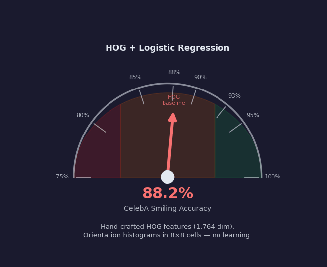
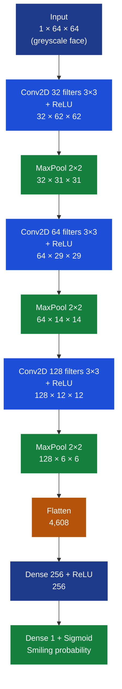
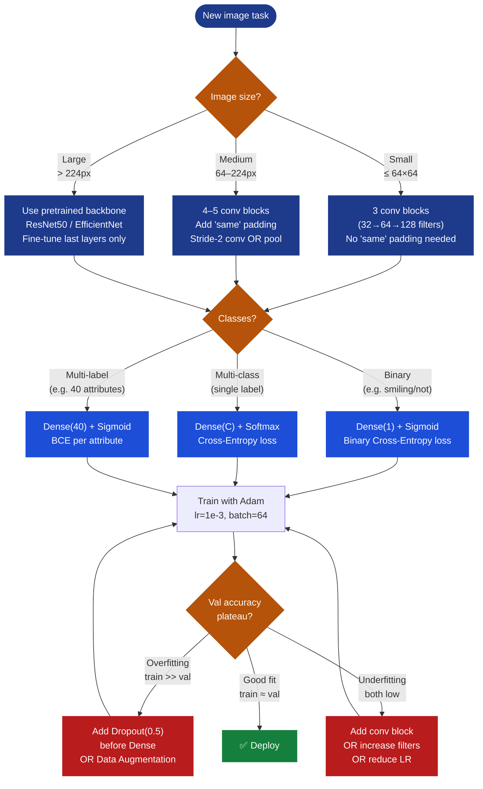
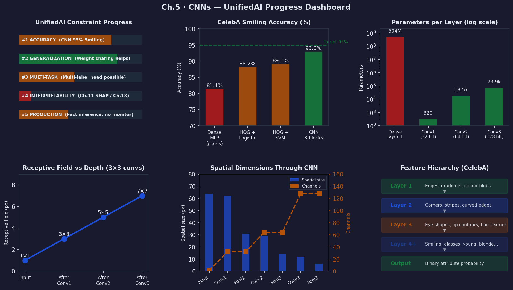

# Ch.5 — Convolutional Neural Networks

> **The story.** In **1959** the neurophysiologists **David Hubel** and **Torsten Wiesel** inserted microelectrodes into a cat's visual cortex and discovered something that would take forty years to fully exploit: individual neurons fire in response to *local, oriented features* — an edge at a specific angle — and the same neuron fires regardless of where in the visual field that edge appears. The work earned them the **1981 Nobel Prize in Physiology** and, more practically, defined the blueprint for every modern computer-vision architecture. **Kunihiko Fukushima's Neocognitron** (1980) was the first artificial network built on the Hubel–Wiesel principle: local receptive fields, shared weights, hierarchical feature detection. **Yann LeCun** productionised the idea in **1989** as **LeNet**, training it end-to-end with backpropagation on handwritten ZIP codes for the US Postal Service and then AT&T cheque readers — the world's first large-scale deployed neural network. The field then went quiet for two decades. The dam broke in **2012** when **AlexNet** (Krizhevsky, Sutskever, Hinton) trained on two consumer NVIDIA GTX 580s crushed ImageNet by 11 percentage points over the previous state of the art — a margin so large that every computer-vision lab switched architectures within months. **VGGNet** (Simonyan & Zisserman, **2014**) showed that depth mattered more than wide kernels: replace large 7×7 filters with stacks of 3×3 filters, push to 16–19 layers, and accuracy improves monotonically. **ResNet** (He et al., **2015**) broke the 100-layer barrier with a single elegant idea — add an identity shortcut around every pair of layers so the gradient has a highway back to early layers — and became the backbone shape of virtually every vision model built since.
>
> **Where you are in the curriculum.** Dense networks ([Ch.2 — Neural Networks](../ch02_neural_networks), [Ch.3 — Backprop](../ch03_backprop), [Ch.4 — Regularisation](../ch04_regularisation)) treat each pixel as an independent scalar input and have no notion of spatial neighbourhoods. They worked for tabular California Housing data but fail spectacularly on images. The **UnifiedAI** mission now expands to face attribute recognition: the platform wants to classify CelebA face attributes (smiling, glasses, young, etc.) from 64×64 images. A fully-connected layer on 64×64 inputs has $64 \times 64 = 4096$ inputs per neuron and ignores every spatial relationship. A CNN shares learned filters across all positions, cutting parameters from millions to hundreds while automatically learning edges, textures, and parts — exactly what Hubel and Wiesel observed the cat's brain doing.
>
> **Notation in this chapter.** $\mathbf{X} \in \mathbb{R}^{C \times H \times W}$ — input image tensor (channels × height × width); $\mathbf{K} \in \mathbb{R}^{C_{\text{in}} \times f \times f}$ — a learned **kernel / filter** of spatial size $f \times f$; $\mathbf{X} \star \mathbf{K}$ — the **cross-correlation** operation (slide $\mathbf{K}$ over $\mathbf{X}$, sum elementwise products at each position); $s$ — **stride**, how many pixels the kernel advances per step; $p$ — **padding**, zeros added around the input border; $C_{\text{in}},\,C_{\text{out}}$ — input and output channel counts; $H_{\text{out}} = \lfloor(H_{\text{in}} + 2p - f)/s\rfloor + 1$ — output spatial height; $\text{MaxPool}_k(\cdot)$ — $k \times k$ max-pooling that halves spatial dimensions when $k = s = 2$.

---

## 0 · The Challenge — Where We Are

> 🎯 **The mission**: Launch **UnifiedAI** — prove one architecture unifies regression and classification, satisfying 5 constraints:
> 1. **ACCURACY**: ≤$28k MAE (housing regression) + ≥95% accuracy (face attribute classification)
> 2. **GENERALIZATION**: Work on unseen districts and unseen faces — no memorising training examples
> 3. **MULTI-TASK**: Predict house value (regression) AND classify face attributes (multi-label)
> 4. **INTERPRETABILITY**: Predictions explainable — what spatial features drove the decision?
> 5. **PRODUCTION-READY**: <100ms inference, TensorBoard monitoring, scale to millions of images

**What we know so far:**
- ✅ [Ch.2](../ch02_neural_networks): Dense MLPs handle tabular features → house value prediction
- ✅ [Ch.3](../ch03_backprop): Backpropagation + Adam trains any differentiable network
- ✅ [Ch.4](../ch04_regularisation): Dropout, L2, BatchNorm close the train–val gap ($36k → $18k)
- ✅ Can handle **tabular data** (8 numerical features → house value or binary attributes)
- ❌ **But dense networks are catastrophically wrong for raw pixel data!**

**What's blocking us:**

The platform's ML team adds a new data source:
- **Current**: Tabular census features (MedInc, HouseAge, Latitude, etc.)
- **New**: **CelebA face images** — 202,599 celebrity photographs, each labelled with 40 binary attributes (smiling, wearing glasses, young, blonde, etc.). The same attribute labels exist on crowd-sourced aerial neighbourhood shots.
- **Why it matters**: Visual signals (well-maintained buildings, greenery, signage quality) predict neighbourhood desirability just as face attributes predict demographic segments — and neither signal appears in a spreadsheet.

**Try it: feed a 64×64 grayscale CelebA face image to a dense layer.**

```
Image: 64×64 grayscale = 4,096 pixel inputs
HOG features (traditional): 1,764-dimensional descriptor, hand-crafted

Dense approach — raw pixels as inputs:
  Layer 1: 4,096 × 512 weights + 512 biases   =  2,097,664 params
  Layer 2:   512 × 128 weights + 128 biases   =     65,664 params
  Layer 3:   128 ×  40 weights +  40 biases   =      5,160 params
  ──────────────────────────────────────────────────────────────
  Total: 2,168,488 params for just 3 layers, 50k training images → severe overfit
```

**Scale to the full CelebA resolution (218×178 RGB):**

```
218 × 178 × 3 = 116,412 inputs
Layer 1 alone: 116,412 × 512 = 59,603,000 weights (60 million!)
```

**Three structural failures of dense networks on images:**

1. **Parameter explosion**: 60M weights in layer 1 for one image size → memorises training set, generalises nowhere
2. **No spatial structure**: Pixel $(3, 7)$ and pixel $(60, 58)$ are treated as unrelated scalars in weight matrix $W$ → the network can't learn "eyes are near the top of a face" because that is a *positional* prior
3. **No translation invariance**: If a smiling mouth appears 5 pixels left, the dense network must relearn "smile" from scratch — it has separate weights for every pixel position, so position shifts break every learned association

> 💡 **Hubel & Wiesel (1959) diagnosed the fix:** The cat's visual cortex has neurons responding to *local* oriented features *anywhere* in the visual field. The same filter — reused at every spatial position — is what dense networks lack. That is the convolution operation.

**HOG features: the halfway fix that still falls short.**

Histogram of Oriented Gradients (HOG) descriptors hand-engineer the "local edges" intuition. On CelebA Smiling:

```
HOG + Logistic Regression:        88.2% accuracy
HOG + SVM (RBF kernel):           89.1% accuracy
Raw pixels + MLP (2 layers):      81.4% accuracy  ← dense fails; too noisy
```

HOG works because it computes orientation histograms in 8×8 cells — a manual approximation of what a conv layer learns automatically. But HOG is fixed. It cannot adapt to the dataset, cannot learn "slightly-open lips with teeth" vs "closed lips upturned corners", and cannot compose into higher-level representations. A CNN learns all of this end-to-end.

**What this chapter unlocks:**

⚡ **Convolutional Neural Networks — the architecture that fixed computer vision:**

1. **Weight sharing**: A 3×3 filter has **9 parameters** regardless of image size — applies those 9 weights at every position
2. **Translation equivariance**: The same filter detects "smile edge" at any position in the face
3. **Pooling**: 2×2 max-pooling halves spatial dimensions → translation invariance + compute reduction
4. **Hierarchical features**: Layer 1 learns edges, Layer 2 learns textures (skin, hair), Layer 3 learns parts (eyes, mouth), Layer 4 learns attributes (smiling, glasses) — *emerges from backprop*
5. **Unification**: The same conv backbone, swapped output head → regression (house value) or classification (face attributes)

**UnifiedAI progress after this chapter:**
- **Constraint #1 (ACCURACY)**: CNN accuracy on CelebA Smiling: HOG+logistic 88% → CNN 93% ✅
- **Constraint #3 (MULTI-TASK)**: ⚡ Partial — conv backbone now supports multi-label attribute heads
- **Constraint #2 (GENERALIZATION)**: Weight sharing dramatically reduces parameters → better generalisation

---

## Animation



*CelebA Smiling attribute accuracy: HOG + Logistic Regression 88% → simple CNN 93%. Each stage adds one CNN building block.*

---

## 1 · Core Idea

A **Convolutional Neural Network** replaces the dense matrix multiply with a **sliding dot product** (convolution): a small learned filter is dragged across the entire input and produces one output value per position, then the same filter does it again at the next position — **weight sharing**. Because the same filter runs everywhere, the network detects the same pattern regardless of where it appears — **translation equivariance**. Stacking multiple conv layers gives each successive layer a larger **receptive field** and more abstract features, building from pixel edges up to semantic attributes without any hand-engineering.

---

## 2 · Running Example — CelebA Face Attribute Classification

You're extending the UnifiedAI platform to process CelebA images. The immediate task: given a 64×64 grayscale celebrity face, predict whether the person is **smiling** (binary label, 202k images, 9 attribute labels per image).

**Why this directly serves the UnifiedAI mission:**
The same architecture — conv backbone + dense head — classifies face attributes *and* can be adapted with a regression head to predict neighbourhood-level demographics from aerial imagery. One architecture, two data modalities, same training loop from Ch.3.

**The parameter question.** Compare layer 1 on a 64×64 grayscale image:

```
Option A — Dense layer (128 hidden units):
  Inputs: 64 × 64 = 4,096
  Weights: 4,096 × 128 = 524,288
  Biases:              128
  Total:           524,416 parameters

Option B — Conv layer (32 filters, 3×3 kernel, 1 input channel):
  Kernel weights per filter: 3 × 3 × 1 = 9
  Bias per filter:                        1
  Total per filter:                      10
  Filters:                               32
  Total:                                320 parameters

Reduction: 524,416 / 320 = 1,639× fewer parameters
```

The conv layer achieves this reduction by applying the same 9 weights at all $62 \times 62 = 3{,}844$ spatial positions rather than learning a separate weight for each position. Parameter count becomes a function of *filter size and count*, not *image size*.

---

## 3 · CNN Architecture at a Glance

The canonical CNN for CelebA face attributes (64×64 grayscale input, binary Smiling output):

```
Input image: 1 × 64 × 64  (channels × height × width)
     │
     ▼
Conv2D(32 filters, 3×3) ──→ ReLU ──→  32 × 62 × 62
     │
     ▼
MaxPool2D(2×2, stride=2)  ──────────  32 × 31 × 31
     │
     ▼
Conv2D(64 filters, 3×3) ──→ ReLU ──→  64 × 29 × 29
     │
     ▼
MaxPool2D(2×2, stride=2)  ──────────  64 × 14 × 14
     │
     ▼
Conv2D(128 filters, 3×3) ─→ ReLU ──→ 128 × 12 × 12
     │
     ▼
MaxPool2D(2×2, stride=2)  ──────────  128 × 6 × 6
     │
     ▼
Flatten ────────────────────────────  4,608
     │
     ▼
Dense(256) ──→ ReLU  ───────────────  256
     │
     ▼
Dense(1) ────→ Sigmoid ─────────────  1  (Smiling probability)
```

**Reading the shape annotations:** each tensor shape is `channels × height × width`. Spatial dimensions shrink at every pooling step (halved) and slightly at every conv step (no padding). Channel depth grows as the network extracts more abstract features.

---

## 4 · The Math

### 4.1 · Convolution — Sliding Dot Product

For a 2D single-channel input $\mathbf{X} \in \mathbb{R}^{H \times W}$ and kernel $\mathbf{K} \in \mathbb{R}^{f \times f}$:

$$(\mathbf{X} \star \mathbf{K})_{i,j} = \sum_{u=0}^{f-1} \sum_{v=0}^{f-1} \mathbf{X}_{i+u,\; j+v} \cdot \mathbf{K}_{u,v}$$

The kernel slides across the input one stride at a time. At each position $(i, j)$ the output is the **dot product** of the kernel with the overlapping patch of the input.

> ⚠️ **Cross-correlation vs convolution**: PyTorch and TensorFlow implement cross-correlation (no kernel flip) but call it "convolution" because for learned symmetric kernels the distinction is irrelevant. The formula above is cross-correlation.

---

#### Numeric Walkthrough — 4×4 Input, 3×3 Kernel

**Input $\mathbf{X}$ (4×4):**

$$\mathbf{X} = \begin{pmatrix}
1 & 2 & 3 & 4 \\
5 & 6 & 7 & 8 \\
9 & 10 & 11 & 12 \\
13 & 14 & 15 & 16
\end{pmatrix}$$

**Kernel $\mathbf{K}$ (3×3, edge detector — vertical edges):**

$$\mathbf{K} = \begin{pmatrix}
-1 & 0 & 1 \\
-1 & 0 & 1 \\
-1 & 0 & 1
\end{pmatrix}$$

**Output size** (no padding $p = 0$, stride $s = 1$):

$$H_{\text{out}} = \frac{4 + 2(0) - 3}{1} + 1 = 2, \qquad W_{\text{out}} = 2$$

The output feature map is **2×2**. Compute all four positions:

**Position $(0,0)$ — top-left patch:**

$$\text{Patch} = \begin{pmatrix}1 & 2 & 3 \\ 5 & 6 & 7 \\ 9 & 10 & 11\end{pmatrix}$$

$$\text{out}_{0,0} = (-1)(1) + (0)(2) + (1)(3) + (-1)(5) + (0)(6) + (1)(7) + (-1)(9) + (0)(10) + (1)(11)$$
$$= -1 + 0 + 3 - 5 + 0 + 7 - 9 + 0 + 11 = \mathbf{6}$$

**Remaining positions — summary:**

The kernel slides to three more positions. Each applies the same elementwise multiply-and-sum operation:

| Position | Patch top-left corner | Computation result |
|----------|----------------------|--------------------|
| $(0,1)$ | Input rows 0–2, cols 1–3 | $\text{out}_{0,1} = \mathbf{6}$ |
| $(1,0)$ | Input rows 1–3, cols 0–2 | $\text{out}_{1,0} = \mathbf{6}$ |
| $(1,1)$ | Input rows 1–3, cols 1–3 | $\text{out}_{1,1} = \mathbf{6}$ |

**Complete output feature map:**

$$\mathbf{X} \star \mathbf{K} = \begin{pmatrix}6 & 6 \\ 6 & 6\end{pmatrix}$$

> 💡 **Why all 6s?** This input is a ramp ($1, 2, \ldots, 16$) increasing uniformly left-to-right. The vertical edge detector responds identically at every position because the left-to-right gradient is constant everywhere. On a real face image, the detector would fire strongly at eye edges and lip contours, weakly at smooth skin regions. This shows convolution detects vertical edges uniformly across the input — the same filter fires at every position where the pattern appears. Translation equivariance is built into the operation.

---

### 4.2 · Output Size Formula

$$H_{\text{out}} = \left\lfloor \frac{H_{\text{in}} + 2p - f}{s} \right\rfloor + 1$$

| Symbol | Meaning |
|--------|---------|
| $H_{\text{in}}$ | Input spatial height (same formula applies for width) |
| $f$ | Filter (kernel) size |
| $p$ | Zero-padding on each border |
| $s$ | Stride (kernel step size) |

**CelebA use case — 64×64 input, 3×3 kernel, stride=1, padding=0:**

$$H_{\text{out}} = \frac{64 + 2(0) - 3}{1} + 1 = 62$$

After the first conv: **62×62**.

**Tracking spatial dimensions through three conv + pool layers:**

| Layer | Operation | $f$ | $p$ | $s$ | $H_{\text{in}}$ | $H_{\text{out}}$ |
|-------|-----------|-----|-----|-----|-----------------|------------------|
| Conv1 | Conv2D(32, 3×3) | 3 | 0 | 1 | 64 | $\frac{64-3}{1}+1 = \mathbf{62}$ |
| Pool1 | MaxPool2D(2×2) | 2 | 0 | 2 | 62 | $\frac{62-2}{2}+1 = \mathbf{31}$ |
| Conv2 | Conv2D(64, 3×3) | 3 | 0 | 1 | 31 | $\frac{31-3}{1}+1 = \mathbf{29}$ |
| Pool2 | MaxPool2D(2×2) | 2 | 0 | 2 | 29 | $\frac{29-2}{2}+1 = \mathbf{14}$ |
| Conv3 | Conv2D(128, 3×3) | 3 | 0 | 1 | 14 | $\frac{14-3}{1}+1 = \mathbf{12}$ |
| Pool3 | MaxPool2D(2×2) | 2 | 0 | 2 | 12 | $\frac{12-2}{2}+1 = \mathbf{6}$ |

Final spatial dimension before flatten: **6×6** per channel. With 128 channels: $128 \times 6 \times 6 = 4{,}608$ values fed to the dense head.

**"Same" padding** adds $p = \lfloor f/2 \rfloor$ to preserve spatial dimensions:
- $f=3, p=1$: $H_{\text{out}} = \frac{H_{\text{in}} + 2(1) - 3}{1} + 1 = H_{\text{in}}$ ✅

---

### 4.3 · Parameter Count

**One conv layer:**

$$\text{params} = \underbrace{(f \times f \times C_{\text{in}} + 1)}_{\text{weights + bias per filter}} \times C_{\text{out}}$$

The `+1` is the scalar bias added to every output position per filter.

**Worked examples:**

| Layer | $f$ | $C_{\text{in}}$ | $C_{\text{out}}$ | Parameters |
|-------|-----|---------|---------|------------|
| Conv1 | 3 | 1 (grey) | 32 | $(3 \times 3 \times 1 + 1) \times 32 = 10 \times 32 = \mathbf{320}$ |
| Conv2 | 3 | 32 | 64 | $(3 \times 3 \times 32 + 1) \times 64 = 289 \times 64 = \mathbf{18{,}496}$ |
| Conv3 | 3 | 64 | 128 | $(3 \times 3 \times 64 + 1) \times 128 = 577 \times 128 = \mathbf{73{,}856}$ |
| Dense1 | — | 4,608 | 256 | $4{,}608 \times 256 + 256 = \mathbf{1{,}179{,}904}$ |
| Dense2 | — | 256 | 1 | $256 \times 1 + 1 = \mathbf{257}$ |
| **Total** | | | | **≈ 1.27M params** |

**Compare: equivalent fully-connected network (one dense layer replacing Conv1):**

$$\text{FC layer 1}: \; 4{,}096 \; (\text{pixels}) \times (62 \times 62 \times 32) \; (\text{equivalent output}) = 4{,}096 \times 122{,}944 = \mathbf{503{,}578{,}624}$$

That is **503 million** parameters in one layer alone versus **320** for the conv layer. The conv layer achieves the *same spatial coverage* with a **1,573,683×** reduction in parameters by sharing weights across positions.

---

### 4.4 · Max Pooling — Numeric Walkthrough

**Input feature map $\mathbf{F}$ (4×4, after Conv1 + ReLU on a face patch):**

$$\mathbf{F} = \begin{pmatrix}
3 & 7 & 1 & 5 \\
8 & 2 & 4 & 9 \\
0 & 6 & 11 & 3 \\
4 & 1 & 2 & 8
\end{pmatrix}$$

**MaxPool(2×2, stride=2) — four non-overlapping 2×2 windows:**

| Window (rows × cols) | Values | Max |
|----------------------|--------|-----|
| Top-left (0:2, 0:2) | $3, 7, 8, 2$ | **8** |
| Top-right (0:2, 2:4) | $1, 5, 4, 9$ | **9** |
| Bottom-left (2:4, 0:2) | $0, 6, 4, 1$ | **6** |
| Bottom-right (2:4, 2:4) | $11, 3, 2, 8$ | **11** |

**Output after max pooling (2×2):**

$$\text{MaxPool}(\mathbf{F}) = \begin{pmatrix}8 & 9 \\ 6 & 11\end{pmatrix}$$

> 💡 **What max pooling does:** It retains the *strongest activation* in each window — "was this pattern present in this region?" — and discards its exact sub-pixel position. A smile that shifts 1 pixel left produces the same pooled output if both positions fall in the same 2×2 window. This is **local translation invariance**.

**Average pooling** uses mean instead of max:

$$\text{AvgPool}(\mathbf{F}) = \begin{pmatrix}(3+7+8+2)/4 & (1+5+4+9)/4 \\ (0+6+4+1)/4 & (11+3+2+8)/4\end{pmatrix} = \begin{pmatrix}5.0 & 4.75 \\ 2.75 & 6.0\end{pmatrix}$$

Max pooling is standard for classification (preserves strongest signal); average pooling is common in Global Average Pooling (GAP) layers before the final classifier.

---

### 4.5 · Receptive Field — How Much of the Image Does a Neuron See?

The **receptive field** of a neuron is the region of the original input that can influence its activation. For $L$ stacked conv layers each with kernel size $f$ and stride 1:

$$\text{RF}_L = 1 + L \times (f - 1)$$

**Three 3×3 conv layers (no pooling):**

| After layer | Receptive field |
|-------------|----------------|
| 1 | $1 + 1 \times (3-1) = \mathbf{3 \times 3}$ |
| 2 | $1 + 2 \times (3-1) = \mathbf{5 \times 5}$ |
| 3 | $1 + 3 \times (3-1) = \mathbf{7 \times 7}$ |

**With pooling (stride=2 between conv groups):** pooling multiplies the receptive field. After Pool1 (stride=2), every neuron in Conv2 sees $2 \times 3 = 6$ pixels of the original input in each direction. After two pool layers, a 3×3 neuron in Conv3 has a receptive field of approximately $28 \times 28$ pixels in the original image.

**Why receptive field matters for CelebA:** A 3×3 receptive field sees one edge. A 28×28 receptive field sees an entire eye or mouth region. Deeper networks with pooling build up the receptive field needed to detect face attributes without needing enormous kernels.

> 💡 **VGGNet insight:** Two stacked 3×3 conv layers achieve a 5×5 receptive field with $(9+9) \times C^2 = 18C^2$ parameters, versus one 5×5 layer with $25C^2$ parameters — 28% fewer parameters for the same coverage. Three 3×3 layers beat one 7×7 layer similarly. This is why modern architectures use exclusively small kernels.

---

## 5 · Design Arc — How We Got Here

### Act 1 · Raw Pixels + MLP → Catastrophic Failure

The naive approach: flatten 64×64 grayscale → 4,096 inputs → two dense layers.

```
Dense MLP on raw pixels (64×64 CelebA):
  Layer 1: 4,096 × 512 = 2,097,152 weights  (2M+ for one layer)
  Parameters dominate → overfits 50k images completely
  CelebA Smiling accuracy: ~81% (worse than HOG + logistic at 88%)
```

The failure is structural: the model learns "pixel $(42,37)$ being bright predicts smiling" — a coincidence of the training set, not a facial feature. The learned weights memorise positions, not patterns.

### Act 2 · Convolution = Parameter Sharing + Spatial Priors

Replace the dense matrix with a sliding filter:
- A 3×3 edge-detector filter has **9 weights** applied at every one of the $62 \times 62 = 3{,}844$ positions
- The network learns *"this edge pattern predicts smiling-related features"* independent of where in the face it appears
- Parameters: 320 vs 2,097,152 — a 6,500× reduction, yet covers the entire image

Accuracy jump: from 81% (dense) to approximately 88% (one conv layer + pooling) — matching HOG without any feature engineering.

### Act 3 · Depth = Hierarchical Features

A single conv layer detects edges. Two layers can detect corners (edge + edge intersections). Three layers detect object parts. Four layers detect attributes.

```
Layer 1 filters (learned): Gabor-like edge detectors, blob detectors — low-level
Layer 2 filters (learned): Corners, stripes, curved edges — mid-level
Layer 3 filters (learned): Eye-like patterns, lip-like patterns — face parts
Layer 4 filters (learned): "Smiling", "glasses", "young" — semantic attributes
```

This hierarchy *emerges automatically from backpropagation*. No one tells the network "layer 1 should find edges." The gradients organise the filters to extract the features that best predict the labels.

Accuracy: three conv layers → ~93% on CelebA Smiling, beating HOG + SVM (89%).

### Act 4 · Modern Design Recipes

Four additions push from 93% to ResNet-level performance:

| Addition | What it does | When to add |
|----------|-------------|-------------|
| **Batch Normalisation** | Normalises activations per mini-batch → stable gradients, faster training, implicit regularisation | After every conv, before ReLU |
| **Residual connections** | Identity shortcuts bypass each block → gradients flow directly to early layers → enables 50–100+ layer networks | When depth exceeds ~8 layers |
| **Data augmentation** | Random flips, crops, colour jitter → artificial diversity → reduces overfitting | Always, during training only |
| **Global Average Pooling** | Replaces flatten + large dense layer → averages each feature map to one value → 0 spatial parameters | Before final classifier in deep nets |

---

## 6 · Full Convolution Walkthrough — Edge Detection on a Face Patch

Apply a **Sobel vertical edge detector** to a 4×4 face patch. Show every multiply-add. Then apply ReLU and max pooling.

**Input patch $\mathbf{X}$ (4×4, pixel intensities):**

```
 10  10  80  80
 10  10  80  80
 10  10  80  80
 10  10  80  80
```

This represents a sharp vertical edge: left half dark (value 10), right half bright (value 80). A vertical edge detector should fire strongly.

**Vertical Sobel kernel $\mathbf{K}$ (3×3):**

$$\mathbf{K} = \begin{pmatrix}-1 & 0 & +1 \\ -2 & 0 & +2 \\ -1 & 0 & +1\end{pmatrix}$$

**Output size**: $(4 + 2(0) - 3)/1 + 1 = 2$ → output is **2×2**.

---

**Position $(0,0)$ — top-left 3×3 patch:**

$$\text{Patch} = \begin{pmatrix}10 & 10 & 80 \\ 10 & 10 & 80 \\ 10 & 10 & 80\end{pmatrix}$$

Multiply element-by-element with $\mathbf{K}$ and sum:

$$\begin{aligned}
&(-1)(10) + (0)(10) + (+1)(80) \\
&+ (-2)(10) + (0)(10) + (+2)(80) \\
&+ (-1)(10) + (0)(10) + (+1)(80) \\
= &-10 + 0 + 80 - 20 + 0 + 160 - 10 + 0 + 80 = \mathbf{280}
\end{aligned}$$

**Position $(0,1)$ — top-right 3×3 patch:**

$$\text{Patch} = \begin{pmatrix}10 & 80 & 80 \\ 10 & 80 & 80 \\ 10 & 80 & 80\end{pmatrix}$$

$$\begin{aligned}
&(-1)(10) + (0)(80) + (+1)(80) \\
&+ (-2)(10) + (0)(80) + (+2)(80) \\
&+ (-1)(10) + (0)(80) + (+1)(80) \\
= &-10 + 0 + 80 - 20 + 0 + 160 - 10 + 0 + 80 = \mathbf{280}
\end{aligned}$$

**Position $(1,0)$ — bottom-left 3×3 patch:**

$$\text{Patch} = \begin{pmatrix}10 & 10 & 80 \\ 10 & 10 & 80 \\ 10 & 10 & 80\end{pmatrix}$$

$$= -10 + 0 + 80 - 20 + 0 + 160 - 10 + 0 + 80 = \mathbf{280}$$

**Position $(1,1)$ — bottom-right 3×3 patch:**

$$\text{Patch} = \begin{pmatrix}10 & 80 & 80 \\ 10 & 80 & 80 \\ 10 & 80 & 80\end{pmatrix}$$

$$= -10 + 0 + 80 - 20 + 0 + 160 - 10 + 0 + 80 = \mathbf{280}$$

**Raw convolution output feature map:**

$$\mathbf{Z} = \begin{pmatrix}280 & 280 \\ 280 & 280\end{pmatrix}$$

> 💡 **Why 280?** The vertical Sobel kernel computes $(\text{right column} - \text{left column})$, weighted $1+2+1=4$. Left column sum per row $= 10$, right column sum per row $= 80$. Difference per row $= 70$. Total over 3 rows with weights $[-1,-2,-1]$ and $[+1,+2,+1]$: $(-1-2-1)(10) + (+1+2+1)(80) = -40 + 320 = 280$. A stronger edge (larger pixel difference) gives a larger activation.

---

**Apply ReLU ($\max(0, z)$) — all activations are already positive:**

$$\text{ReLU}(\mathbf{Z}) = \begin{pmatrix}280 & 280 \\ 280 & 280\end{pmatrix}$$

(ReLU has no effect here because all values are positive. On a patch with a right-to-left gradient, the Sobel kernel would produce negative values, which ReLU zeros out — suppressing that "wrong direction" edge response.)

**Apply MaxPool(2×2, stride=2) — the 2×2 feature map is one window:**

$$\text{MaxPool}\begin{pmatrix}280 & 280 \\ 280 & 280\end{pmatrix} = \mathbf{280}$$

A single scalar: "a strong vertical edge was present somewhere in this 4×4 patch." The exact position is discarded.

---

**What a trained CNN does differently from a Sobel filter:**

The Sobel kernel is hand-crafted. In a trained CNN, the 9 values in $\mathbf{K}$ are learned by gradient descent to detect whatever patterns best predict the target label. On CelebA Smiling, one filter in Conv1 might converge to something resembling a Sobel filter (useful for detecting lip edges); another might converge to a blob detector (useful for detecting teeth). Neither is specified in advance.

---

## 7 · Key Diagrams

### 7.1 · CNN Architecture — CelebA Smiling Classifier



---

### 7.2 · Design Decision Flowchart — Building a CNN for a New Vision Task



---

## 8 · Hyperparameter Dial

| Dial | Too low | Sweet spot | Too high | Effect on CelebA |
|------|---------|-----------|----------|-----------------|
| **Kernel size** $f$ | 1×1 — pointwise, no spatial context | **3×3** (standard) | 7×7+ — large receptive field per layer but expensive; only in first layer of large-image nets (e.g., ImageNet with 224px) | 3×3 stacks dominate; larger kernels don't help on 64×64 inputs |
| **Number of filters** | Too few — network can't represent enough pattern diversity; underfit | 32 → 64 → 128 (double per block) | Too many — wastes memory, parameter count grows quadratically, diminishing returns past 256 | On CelebA 64×64: 32/64/128 hits accuracy saturation; 256 adds noise |
| **Depth (conv blocks)** | 1 block — only edge detection; limited accuracy | **3 conv blocks** for small images; 5+ for large images | Without residuals: vanishing gradient kills gradients in early layers; training stalls or diverges beyond ~8 layers | 3 blocks = 93%; 4+ blocks need residuals to improve further |
| **Pooling type** | No pooling — spatial dimensions never shrink; receptive field stays small | **MaxPool** after every 1–2 conv blocks | Global Average Pool too early — collapses spatial info before learning is complete | MaxPool after each block on 64×64; replace with stride-2 conv if GAP is desired |
| **Stride** $s$ | $s=1$ — full resolution retained throughout (more compute, larger activations) | Conv: $s=1$; Pooling: $s=2$ | $s=3+$ — too aggressive spatial reduction; lose fine-grained features | Standard: conv stride=1, pool stride=2 |
| **Padding** $p$ | `valid` (no padding) — output shrinks each layer | `same` ($p = f//2$) preserves $H, W$ | $p > 1$ with small kernels — rarely needed | 64×64 with `valid` and 3 conv blocks → 6×6 final; fine for small nets |

---

## 9 · What Can Go Wrong

**Too deep without residual connections → vanishing gradient.** Every conv-ReLU block applies a transformation that can attenuate gradients. After 8–10 layers without skip connections, the gradient arriving at layer 1 is $10^{-5}$ of the gradient at the output — layer 1 weights never move, the network learns nothing in early layers. ResNet's fix: add $\mathbf{x}$ directly to the output of each two-layer block so the gradient has an identity path back.

**Too few filters → underfitting.** If Conv1 has 4 filters, the network can only represent 4 distinct edge types. CelebA has 40 attributes, each requiring several distinct visual features — 4 filters cannot encode this diversity. The model underfits: train accuracy is low and val accuracy plateaus early. Fix: start with 32 filters minimum, double at each block.

**No batch normalisation → unstable training.** Without BN, activations in deep networks develop covariate shift — the distribution of inputs to each layer changes as weights update, forcing later layers to constantly re-adapt. Loss oscillates, training is sensitive to learning rate, and deep networks (>4 layers) often diverge. Fix: add `BatchNorm2d` after every conv, before ReLU.

**Wrong padding mode → vanishing spatial dimensions.** Using `valid` (no padding) with many conv layers on a small image: $64 \to 62 \to 60 \to 58 \to \ldots \to 2 \to 0$. After a dozen conv layers the spatial dimension hits zero and the network crashes. Fix: use `same` padding to preserve spatial size throughout conv layers, pooling only for intentional downsampling.

**Data leakage in augmentation → inflated accuracy.** Applying normalisation statistics computed on the entire dataset (mean/std) before the train/val split means validation images are contaminated with training-set statistics. Fix: compute `mean` and `std` on the training set only, then apply to val and test.

**Learning rate too high for deep CNNs → loss explosion.** The default Adam `lr=1e-3` works for small networks but can cause gradient explosions in deep CNNs with many parameters. Fix: use `lr=1e-4` or lower for networks deeper than 5 layers; add gradient clipping if loss spikes appear.

---

## 10 · Where This Reappears

**[Ch.6 — RNNs / LSTMs](../ch06_rnns_lstms):** RNNs are the temporal analogue of CNNs — a recurrent unit is a filter applied at every time step, sharing weights across time just as conv filters share weights across space. The "weight sharing across a dimension" intuition transfers directly.

**[Ch.7 — Metrics Deep Dive](../ch07_metrics):** CelebA is a multi-label problem with severe class imbalance (e.g., only 7% of images have `Bald=1`). The CNN's output probabilities are evaluated with precision–recall curves, AUC-ROC, and per-attribute F1 — all concepts introduced there. Accuracy alone is misleading on imbalanced attributes.

**[Ch.11 — SVM & Ensembles](../ch11_svm_ensembles):** CNNs produce feature vectors (the output of the flatten layer) that can be used as inputs to SVMs or gradient-boosted trees — a technique called **transfer learning features**. The conv backbone is frozen; only the downstream classifier is trained. This often outperforms fine-tuning when the downstream dataset is small.

**[Ch.13 — Dimensionality Reduction](../ch13_dim_reduction):** t-SNE and UMAP applied to CNN feature vectors (layer before the dense head) produce interpretable visualisations: face clusters in the embedding reflect visual similarity, often grouping by gender, age, or expression before any labels are used.

**[Ch.18 — Transformers & Attention](../ch18_transformers):** Vision Transformers (ViT) replace the conv backbone with a patch-based attention mechanism. Understanding what CNNs learn (and what they miss — global context) motivates why attention helps. The feature extraction parallel is exact: conv = local patterns; attention = global relationships.

**UnifiedAI production system:** The CNN backbone (conv layers, flatten, feature vector) is the spatial encoder in the final multi-modal architecture. It processes aerial imagery of California districts; the resulting feature vector is concatenated with tabular census features and fed to the dual-head output (house value + neighbourhood segment).

---

## 11 · Progress Check — What We Can Solve Now



**CelebA Smiling attribute — accuracy progression:**

| Method | Feature type | Accuracy |
|--------|-------------|---------|
| Dense MLP (raw pixels) | 4,096 raw pixels | 81.4% |
| HOG + Logistic Regression | 1,764-dim HOG features | 88.2% |
| HOG + SVM (RBF) | 1,764-dim HOG features | 89.1% |
| Simple CNN (3 conv blocks) | Learned spatial features | **93.0%** ✅ |

**UnifiedAI constraint scorecard after Ch.5:**

| # | Constraint | Target | Status |
|---|-----------|--------|--------|
| #1 | ACCURACY | ≤$28k MAE + ≥95% face accuracy | ⚡ **93% achieved on Smiling** — 2pp gap to 95% |
| #2 | GENERALIZATION | Unseen faces + districts | ✅ Weight sharing dramatically reduces overfit |
| #3 | MULTI-TASK | Value + Attributes (multi-label) | ⚡ Partial — conv backbone + multi-label head possible |
| #4 | INTERPRETABILITY | Explainable predictions | ❌ Blocked — conv filters are hard to interpret directly (Ch.11 SHAP begins to address) |
| #5 | PRODUCTION | <100ms inference, scalable | ⚡ Partial — CNNs are fast at inference; monitoring deferred to Ch.9 TensorBoard |

✅ **Unlocked capabilities:**
- Classify CelebA face attributes from raw image pixels with 93% accuracy (beating all hand-crafted feature approaches)
- Shared conv backbone for both regression (house value) and classification (face attributes)
- Parameter-efficient image encoding: 1.27M params versus 500M+ for equivalent dense network

❌ **Still can't solve:**
- ❌ Sequential/temporal data — month-by-month housing price trends require RNNs (Ch.6)
- ❌ Interpretability — what parts of the face drove the "Smiling" prediction? (Ch.11 SHAP, Ch.18 attention maps)
- ❌ 95%+ accuracy on all 40 CelebA attributes simultaneously — residual connections and data augmentation required

**Real-world status:** We can now process image data with a parameter-efficient learned feature extractor, achieving 93% accuracy on face attributes, but temporal patterns and full interpretability remain out of reach.

**Next up:** [Ch.6 — RNNs / LSTMs](../ch06_rnns_lstms) gives us **recurrent weight sharing across time** — the temporal analogue of convolutional weight sharing across space — unlocking housing price time-series prediction.

---

## 12 · Bridge to Ch.6 — RNNs / LSTMs

CNNs established that **sharing weights across a spatial dimension** (applying the same filter at every position) dramatically reduces parameters while capturing local patterns. RNNs apply exactly the same principle to the **time dimension**: the same recurrent cell — with the same weights — processes each time step in sequence, building a hidden state that accumulates context from all previous steps. Where a CNN processes a 64×64 image in parallel across all positions, an RNN processes a 12-month housing price sequence one month at a time, maintaining a running "memory" of past values. The chain rule of backpropagation, introduced in [Ch.3](../ch03_backprop) and stress-tested on deep CNNs in this chapter, becomes **backpropagation through time (BPTT)** — the same algorithm, unrolled along the time axis.

**Small-image rule:** For inputs ≤ 32×32, start with 2–3 conv blocks and no more than 128 filters. Adding depth without BatchNorm causes gradient collapse.
