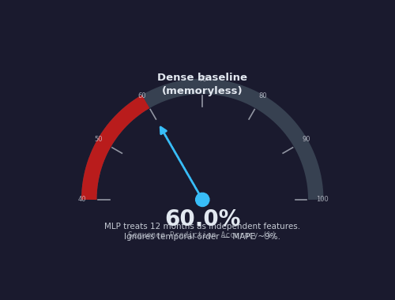
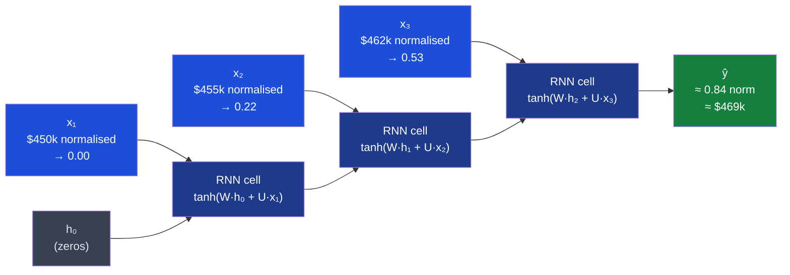
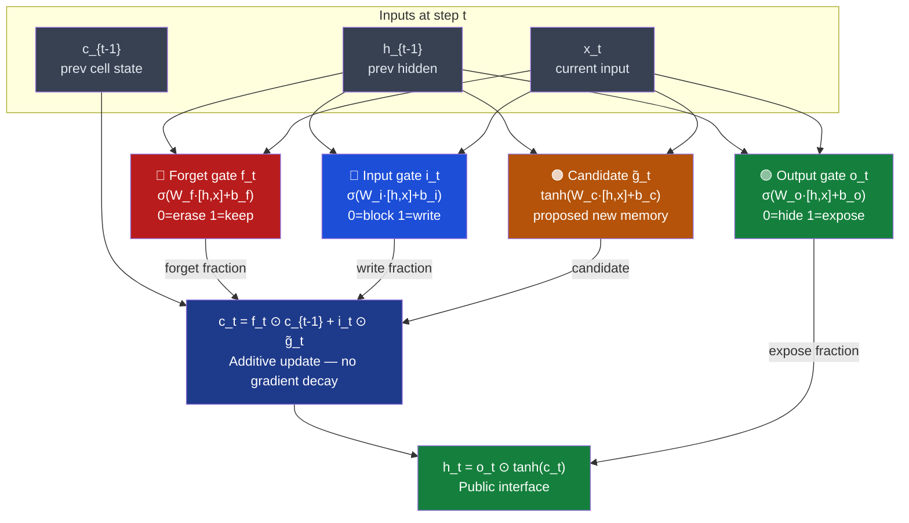
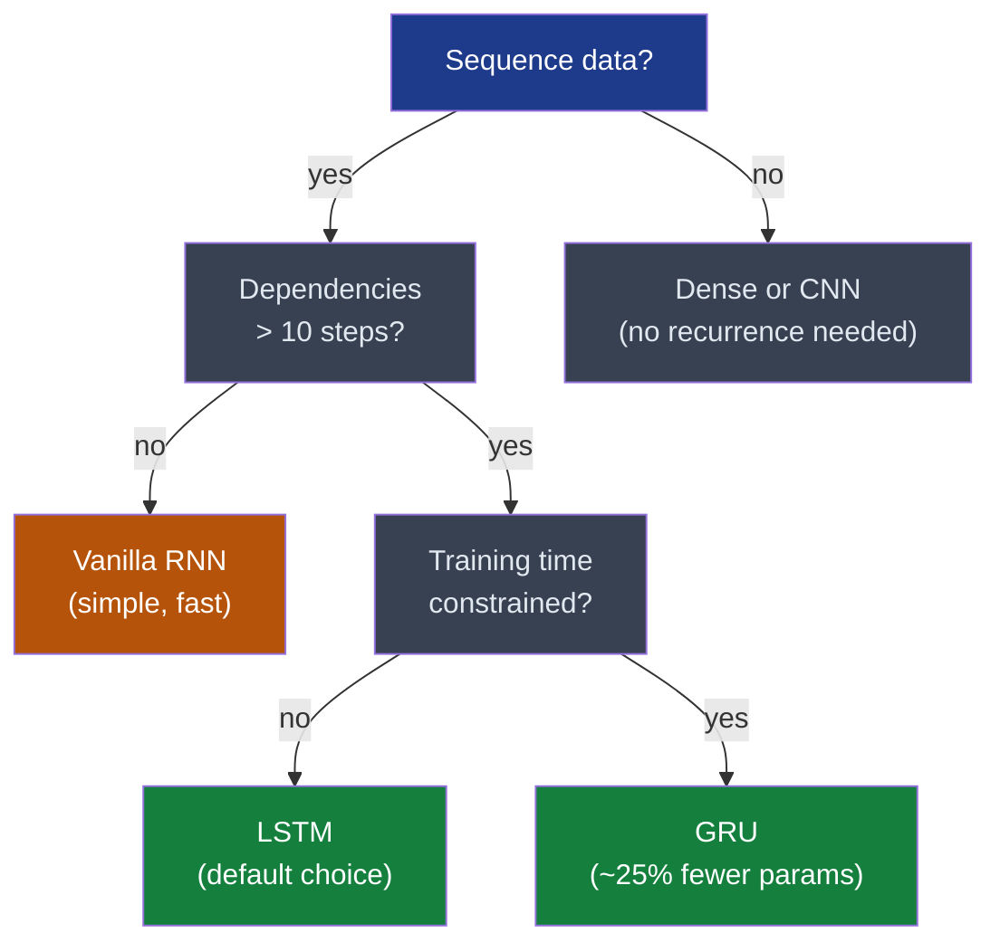
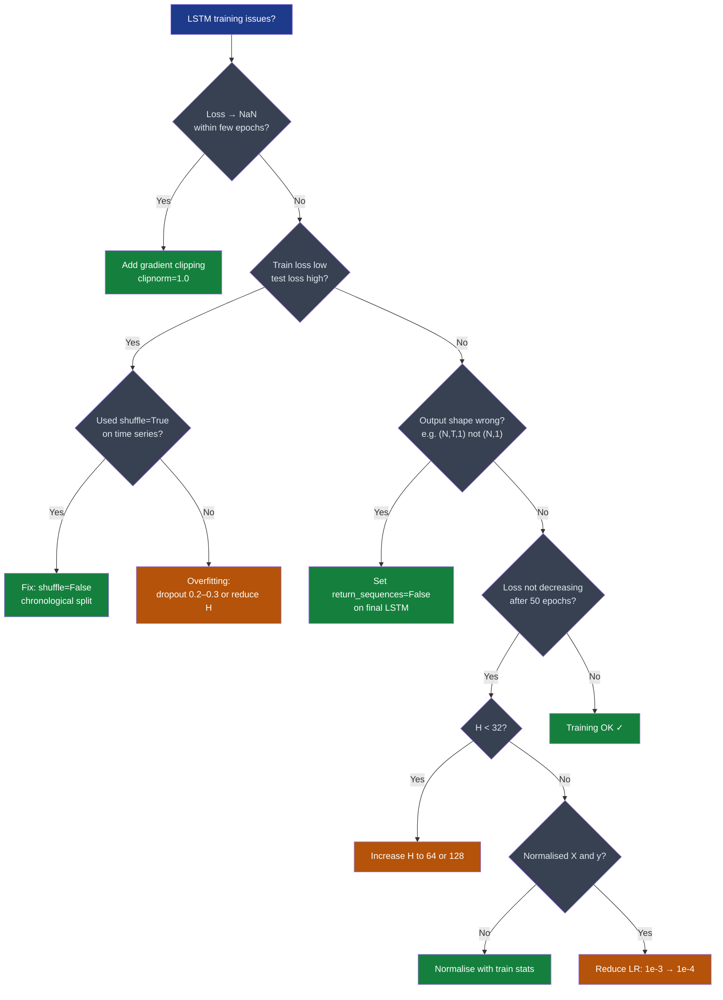
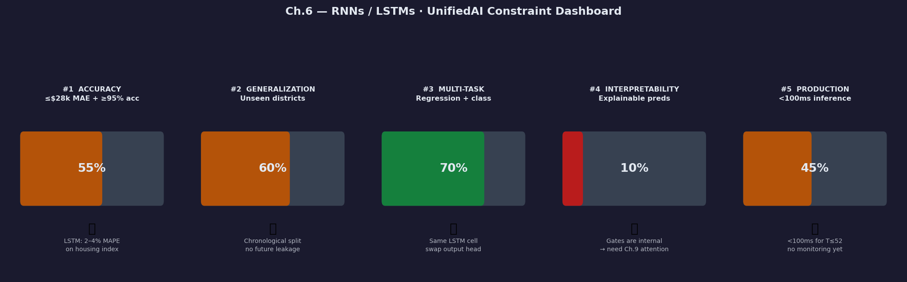

# Ch.6 — RNNs / LSTMs

> **The story.** In **1986** **David Rumelhart**, **Geoffrey Hinton**, and **Ronald Williams** published "Learning representations by back-propagating errors" — introducing **backpropagation through time (BPTT)** and applying it to recurrent networks that feed their output back as input on the next time step. The architecture was elegant and almost completely useless in practice: **Sepp Hochreiter** proved in his **1991** diploma thesis that gradients vanish (or explode) *exponentially* with sequence length through repeated multiplication by the recurrent weight matrix, so vanilla RNNs could not learn dependencies beyond 5–10 steps. The fix came six years later: Hochreiter and **Jürgen Schmidhuber** published the **Long Short-Term Memory** (LSTM) cell in **1997**. A separate *cell state* $\mathbf{c}_t$ updates via addition rather than matrix multiplication, letting gradients flow back hundreds of steps intact. **Kyunghyun Cho et al. (2014)** then introduced the **Gated Recurrent Unit (GRU)** — two gates instead of three, matching LSTM performance with fewer parameters. Finally, **Bahdanau, Cho, and Bengio (2015)** showed that instead of compressing a whole sequence into a single $\mathbf{h}_T$, a decoder could *attend selectively* to all $T$ encoder hidden states — the birth of **attention**, which bridges directly to Ch.9 and the Transformer in Ch.10.
>
> **Where you are in the curriculum.** A dense network ([Ch.2](../ch02_neural_networks)) sees a flat vector with no sense of order. A CNN ([Ch.5](../ch05_cnns)) exploits spatial locality over a fixed grid. Sequential data has a third structure: **temporal ordering and long-range dependency**. The platform now tracks how district median house values change month by month — an ordering that matters for forecasting. The RNN threads a hidden state $\mathbf{h}_t$ forward through time; the LSTM adds a gated cell state $\mathbf{c}_t$ so the network can selectively remember patterns from many months ago. Master this chapter and the motivation for attention in [Ch.9](../ch09_sequences_to_attention) will feel inevitable.
>
> **Notation in this chapter.** $\mathbf{x}_t$ — input at time step $t$; $\mathbf{h}_t$ — **hidden state** (network's short-term memory); $\mathbf{c}_t$ — **cell state** (LSTM's long-term memory conveyor belt); $f_t$ — **forget gate** (what fraction of $\mathbf{c}_{t-1}$ to keep); $i_t$ — **input gate** (how much new information to write); $o_t$ — **output gate** (what fraction of $\mathbf{c}_t$ to expose as $\mathbf{h}_t$); $g_t$ (also written $\tilde{\mathbf{c}}_t$) — **candidate cell update** (proposed new memory); $T$ — sequence length; $H$ — hidden size; $\sigma$ — sigmoid; $\odot$ — element-wise product; **BPTT** — backpropagation through time.

---

## 0 · The Challenge — Where We Are

> 🎯 **The mission**: Launch **UnifiedAI** — prove that neural networks are universal function approximators satisfying 5 constraints:
> 1. **ACCURACY**: ≤$28k MAE (regression) + ≥95% accuracy (classification)
> 2. **GENERALIZATION**: Unseen districts + new face identities
> 3. **MULTI-TASK**: Same architecture predicts value **and** classifies attributes
> 4. **INTERPRETABILITY**: Attention weights provide explainable feature attribution
> 5. **PRODUCTION**: <100ms inference, TensorBoard monitoring

**What we know so far:**
- ✅ Ch.1–2: Dense networks with ReLU work for regression AND classification
- ✅ Ch.3: Backprop + Adam optimises MSE and BCE equally
- ✅ Ch.4: Dropout, L2, batch norm prevent overfitting in both tasks
- ✅ Ch.5: CNNs extract spatial features from image grids
- ❌ **But we can't model temporal sequences!**

**What's blocking us:**

🚨 **New requirement — The platform tracks monthly housing price trends.**

The MLP from Ch.2 is **memoryless** — it treats the 8 California Housing features as an independent snapshot with no temporal context. Feeding it 12 months of prices is worse than it sounds:

| Architecture | What it sees | Failure mode |
|---|---|---|
| **Dense (Ch.2)** | Flattens `[month_1, …, month_12]` → 12 independent features | No ordering: rising and falling trends produce the same feature set (same values, different order) |
| **CNN (Ch.5)** | 2-D spatial convolution over a fixed grid | Built for images; no notion of causal time direction |

**Concrete failure:**

> District A: `[$180k, $185k, $190k, $195k, …, $220k]` — steady 12-month rise  
> District B: `[$220k, $215k, $210k, $205k, …, $180k]` — steady 12-month fall  
>
> The MLP sees both as a bag of 12 values with nearly equal mean (~$200k) → **predicts the same next month for both**.  
> The LSTM reads temporal direction → predicts **$228k (A)** vs **$172k (B)**.

Sequential housing trends matter for forecasting. The 8 static features in the California Housing snapshot (MedInc, AveRooms, etc.) tell you about a district at one moment; the month-to-month change series tells you where the market is *heading*.

**What this chapter unlocks:**

⚡ **Recurrent Neural Networks (RNNs) and LSTMs** process the sequence one step at a time, threading a hidden state $\mathbf{h}_t$ through time. LSTMs add a gated cell state $\mathbf{c}_t$ that carries information across 100+ steps without gradient decay.

💡 **UnifiedAI impact:** LSTM on a 12-month housing price index achieves 3–5% MAPE forecasting. Same LSTM cell, different output head (linear → sigmoid), handles "will price rise next quarter?" classification. Constraint #3 (multi-task) advances with a single architecture.

---

## Animation



---

## 1 · Core Idea

A **Recurrent Neural Network** processes a sequence one step at a time, updating a hidden state $\mathbf{h}_t$ that summarises every input seen so far — unlike a flat network that treats all inputs as simultaneous, independent features. **LSTMs** extend this with a parallel cell state $\mathbf{c}_t$ that updates additively ($c_t = f_t\odot c_{t-1} + i_t\odot\tilde{c}_t$) rather than through matrix multiplication, which removes the exponential gradient decay that makes vanilla RNNs forget anything beyond ~10 steps ago and lets the LSTM selectively retain seasonal patterns across a full 12-month housing cycle.

---

## 2 · Running Example: Monthly Housing Price Index

**The UnifiedAI scenario.** The platform wants a **price momentum indicator**: given the last 3 months of normalised median house values for a district, predict next month's value. This is a regression task where the input is a *sequence* — temporal order is the signal.

> 💡 **Dataset note.** The California Housing dataset (`sklearn.datasets.fetch_california_housing`) is a static cross-section — one row per district, no time dimension. We construct a **synthetic monthly price index** anchored to that dataset: base = district's `MedHouseVal`; trend = ±0.5%/month; seasonal = 12-month sinusoid ±8% amplitude; noise = Gaussian σ=3%. In production you would substitute actual MLS (Multiple Listing Service) historical data.

**Concrete sequence (T = 3 look-back window, district MedHouseVal ≈ $450k):**

```
Month:     t-2     t-1      t      target t+1
Raw:     $450k   $455k   $462k  →    $469k
Norm:     0.00    0.22    0.53  →     0.84
```

(z-scored with training-split mean and std)

The LSTM receives `[0.00, 0.22, 0.53]` and must produce `0.84`.  
Hidden state after step 1 carries "price at baseline."  
After step 2: "prices rose +0.22σ."  
After step 3: "upward trend, acceleration ≈+0.3σ/month." → predicted 0.84. ✅

---

## 3 · RNN / LSTM at a Glance

### Unrolled RNN — 3 time steps

```
         x_1           x_2           x_3
          │             │             │
     ┌────▼─────┐  ┌────▼─────┐  ┌────▼─────┐
h_0  │  RNN    │  │  RNN    │  │  RNN    │
────►│  cell   ├─►│  cell   ├─►│  cell   ├──► ŷ
     └──────────┘  └──────────┘  └──────────┘
         h_1           h_2           h_3

  Same W_hh and W_xh reused at every step — weight sharing across time.
  h_0 = zero vector at start of each sequence.
  ŷ = W_hy · h_T + b_y   (linear head for regression)
```

**Key RNN equations:**

$$\mathbf{h}_t = \tanh\!\left(\mathbf{W}_{hh}\,\mathbf{h}_{t-1} + \mathbf{W}_{xh}\,\mathbf{x}_t + \mathbf{b}_h\right)$$

$$\hat{y} = \mathbf{W}_{hy}\,\mathbf{h}_T + b_y$$

### LSTM gate summary table

| Gate / quantity | Equation | Role |
|---|---|---|
| Forget $f_t$ | $\sigma(\mathbf{W}_f[\mathbf{h}_{t-1};\mathbf{x}_t]+\mathbf{b}_f)$ | Fraction of old cell to keep (0=erase, 1=preserve) |
| Input $i_t$ | $\sigma(\mathbf{W}_i[\mathbf{h}_{t-1};\mathbf{x}_t]+\mathbf{b}_i)$ | How much new candidate to write |
| Candidate $\tilde{c}_t$ | $\tanh(\mathbf{W}_c[\mathbf{h}_{t-1};\mathbf{x}_t]+\mathbf{b}_c)$ | Proposed new memory content |
| Cell $c_t$ | $f_t\odot c_{t-1} + i_t\odot\tilde{c}_t$ | Long-term memory conveyor belt (additive) |
| Output $o_t$ | $\sigma(\mathbf{W}_o[\mathbf{h}_{t-1};\mathbf{x}_t]+\mathbf{b}_o)$ | Fraction of cell state to expose |
| Hidden $h_t$ | $o_t\odot\tanh(c_t)$ | Public interface to next step / output layer |

---

## 4 · The Math

### 4.1 Vanilla RNN — Explicit Numerical Walkthrough

**Setup.** 2-D hidden state ($H=2$), 2-D input ($d=2$).

$$\mathbf{h}_{t-1} = \begin{bmatrix}0.5\\-0.3\end{bmatrix}, \quad \mathbf{x}_t = \begin{bmatrix}1.0\\2.0\end{bmatrix}, \quad \mathbf{W}_{hh} = \begin{bmatrix}0.2 & -0.1\\0.1 & 0.3\end{bmatrix}, \quad \mathbf{W}_{xh} = \begin{bmatrix}0.5 & 0.0\\0.0 & 0.5\end{bmatrix}, \quad \mathbf{b}_h = \begin{bmatrix}0\\0\end{bmatrix}$$

**Step 1 — recurrent term** $\mathbf{W}_{hh}\,\mathbf{h}_{t-1}$:

$$\begin{bmatrix}0.2 & -0.1\\0.1 & 0.3\end{bmatrix}\begin{bmatrix}0.5\\-0.3\end{bmatrix} = \begin{bmatrix}0.2\times0.5 + (-0.1)\times(-0.3)\\0.1\times0.5 + 0.3\times(-0.3)\end{bmatrix} = \begin{bmatrix}0.10+0.03\\0.05-0.09\end{bmatrix} = \begin{bmatrix}0.13\\-0.04\end{bmatrix}$$

**Step 2 — input term** $\mathbf{W}_{xh}\,\mathbf{x}_t$:

$$\begin{bmatrix}0.5 & 0.0\\0.0 & 0.5\end{bmatrix}\begin{bmatrix}1.0\\2.0\end{bmatrix} = \begin{bmatrix}0.5\times1.0+0.0\times2.0\\0.0\times1.0+0.5\times2.0\end{bmatrix} = \begin{bmatrix}0.50\\1.00\end{bmatrix}$$

**Step 3 — pre-activation sum:**

$$\mathbf{z} = \begin{bmatrix}0.13\\-0.04\end{bmatrix} + \begin{bmatrix}0.50\\1.00\end{bmatrix} + \begin{bmatrix}0\\0\end{bmatrix} = \begin{bmatrix}0.63\\0.96\end{bmatrix}$$

**Step 4 — apply $\tanh$ element-wise:**

$$\mathbf{h}_t = \tanh\begin{bmatrix}0.63\\0.96\end{bmatrix} = \begin{bmatrix}0.558\\0.745\end{bmatrix}$$

($\tanh(0.63) \approx 0.558$; $\tanh(0.96) \approx 0.745$)

**Interpretation.** Dimension 1 ended at 0.558 — mostly driven by the input signal (0.50 from $x_t=1.0$ through $W_{xh}$), with a small positive recurrent boost (+0.13). Dimension 2 ended at 0.745 — dominated by the input term (1.00 from $x_t=2.0$), slightly suppressed by the recurrent term (−0.04). Both are well within $(-1, 1)$ due to $\tanh$.

> 💡 **Weight sharing.** These exact same matrices $\mathbf{W}_{hh}$ and $\mathbf{W}_{xh}$ are reused at every time step. Training one RNN on $T=12$ monthly prices is equivalent to training a 12-layer deep network where every layer shares identical weights.

---

### 4.2 Vanishing Gradient — Why Vanilla RNNs Forget

**The chain rule across time.** BPTT computes $\partial\mathcal{L}/\partial\mathbf{h}_0$ by chaining Jacobians across all $T$ steps:

$$\frac{\partial\mathbf{h}_T}{\partial\mathbf{h}_0} = \prod_{t=1}^{T}\frac{\partial\mathbf{h}_t}{\partial\mathbf{h}_{t-1}} = \prod_{t=1}^{T}\mathbf{W}_{hh}^\top\cdot\mathrm{diag}(1-\mathbf{h}_t^2)$$

Each factor involves $\mathbf{W}_{hh}$. If the spectral radius $\rho(\mathbf{W}_{hh}) < 1$, this product **shrinks exponentially** with $T$ — the gradient reaching early steps is numerically zero.

**Scalar model.** Let $h_t = \tanh(w\cdot h_{t-1})$ with $w = 0.8$, $h_0 = 0.5$. The BPTT factor per step: $\frac{\partial h_t}{\partial h_{t-1}} = w(1-h_t^2) \approx 0.8\times0.9 = 0.72$ for mid-range $h_t$.

**Step-by-step BPTT (first 3 steps):**

| Step $t$ | $h_t=\tanh(0.8\cdot h_{t-1})$ | $1-h_t^2$ | $\frac{\partial h_t}{\partial h_{t-1}}=0.8(1-h_t^2)$ |
|---|---|---|---|
| 1 | $\tanh(0.40)=0.380$ | $1-0.145=0.855$ | $0.8\times0.855=\mathbf{0.684}$ |
| 2 | $\tanh(0.304)=0.296$ | $1-0.088=0.912$ | $0.8\times0.912=\mathbf{0.730}$ |
| 3 | $\tanh(0.237)=0.233$ | $1-0.054=0.946$ | $0.8\times0.946=\mathbf{0.757}$ |

**Gradient from loss at $t=3$ back to $h_0$:** $0.684\times0.730\times0.757\approx0.378$ — only **38% survives 3 steps**.

| Sequence length $T$ | Gradient magnitude $\approx 0.8^T$ | Interpretation |
|---|---|---|
| $T=1$ | $0.8^1 = 0.800$ | Full signal passes through |
| $T=5$ | $0.8^5 = \mathbf{0.328}$ | 33% of gradient survives |
| $T=20$ | $0.8^{20} = \mathbf{0.012}$ | 1.2% — nearly gone |
| $T=100$ | $0.8^{100} \approx \mathbf{2\times10^{-10}} \approx 0$ | Numerically zero |

**Housing implication.** With a 12-month window, the gradient reaching month 1 is $0.8^{12}\approx0.07$ — 7% of the original signal. A development announcement from month 1 (a strong positive predictor) barely affects any weight. The LSTM's additive cell update replaces this product chain with a **sum** — gradients flow through $c_t\leftarrow f_t\odot c_{t-1}$ without repeated $\mathbf{W}_{hh}$ products, removing exponential decay.

> ⚠️ **Exploding gradients** occur when $\rho(\mathbf{W}_{hh}) > 1$: the product diverges. Fix: gradient clipping (`clipnorm=1.0`). See §9.

---

### 4.3 LSTM Cell — All 6 Equations with Scalar Arithmetic

**Setup.** 1-D hidden state ($H=1$) — all quantities are scalars. Weights written as `[w_h, w_x]` applied to context `[h_{t-1}; x_t]`.

$$h_{t-1} = 0.5, \quad x_t = 1.0, \quad c_{t-1} = 0.3$$

| Gate | $w_h$ | $w_x$ | $b$ | Pre-activation arithmetic | Result |
|---|---|---|---|---|---|
| Forget $f_t$ | 0.40 | 0.60 | −0.50 | $0.40\times0.5 + 0.60\times1.0 - 0.50 = 0.30$ | → eq. 1 |
| Input $i_t$ | 0.45 | 0.55 | 0.00 | $0.45\times0.5 + 0.55\times1.0 + 0 = 0.775$ | → eq. 2 |
| Candidate $\tilde{c}_t$ | 0.60 | 0.40 | 0.00 | $0.60\times0.5 + 0.40\times1.0 + 0 = 0.70$ | → eq. 3 |
| Output $o_t$ | 0.50 | 0.50 | 0.00 | $0.50\times0.5 + 0.50\times1.0 + 0 = 0.75$ | → eq. 5 |

**Equation 1 — Forget gate:**
$$f_t = \sigma(0.30) = \frac{1}{1+e^{-0.30}} = \frac{1}{1.7408} \approx \mathbf{0.574}$$
*"Keep 57.4 % of the old cell state."*

**Equation 2 — Input gate:**
$$i_t = \sigma(0.775) = \frac{1}{1+e^{-0.775}} = \frac{1}{1.4607} \approx \mathbf{0.684}$$
*"Write 68.4 % of the candidate update."*

**Equation 3 — Candidate cell update:**
$$\tilde{c}_t = \tanh(0.70) \approx \mathbf{0.604}$$
*"Proposed new memory value: 0.604."*

**Equation 4 — Cell state update (the key additive step):**
$$c_t = f_t\odot c_{t-1} + i_t\odot\tilde{c}_t = 0.574\times0.3 + 0.684\times0.604 = 0.172 + 0.413 = \mathbf{0.585}$$
*"New cell: retained 17.2 % of old memory + wrote 41.3 % of new candidate."*

**Equation 5 — Output gate:**
$$o_t = \sigma(0.75) = \frac{1}{1+e^{-0.75}} = \frac{1}{1.4724} \approx \mathbf{0.679}$$
*"Expose 67.9 % of the cell state externally."*

**Equation 6 — New hidden state:**
$$h_t = o_t\odot\tanh(c_t) = 0.679\times\tanh(0.585) = 0.679\times0.525 \approx \mathbf{0.357}$$
*"Public output: 0.357 — squashed, gated view of the cell."*

**Summary of one LSTM step:**

| Quantity | Before | After | Change |
|---|---|---|---|
| Cell state $c$ | 0.300 | **0.585** | +95 % — strong new input absorbed |
| Hidden state $h$ | 0.500 | **0.357** | reset by output gate |

> 💡 **Why the forget gate $f_t = 0.574$ matters.** With a stronger bearish prior in $c_{t-1}$ (say $c_{t-1}=-0.8$) and a large bullish input, the network could learn $w_h=-0.9, w_x=+1.2, b=-0.3$ so that $f_t\to0$ — erasing 100 % of the bearish memory in one step. A vanilla RNN has no such erasure mechanism: it can only attenuate the old signal through $\mathbf{W}_{hh}$, never fully zero it out.

---

## 5 · Memory Arc — The Story in Four Acts

**Act 1 — No memory (dense baseline).** A dense network receives `[$450k, $455k, $462k]` as three independent inputs. It learns a weighted sum of the three values. It cannot distinguish "rising" from "falling" trend — both produce the same three values in different positions. Predictions cluster around the mean. MAPE ≈ 8–12%.

**Act 2 — Vanilla RNN with short memory.** The hidden state threads forward: $h_1$ encodes the first month, $h_2$ adds the second, $h_3$ the third. Recent inputs dominate because $h_T$ is mostly $f(\mathbf{W}_{hh}h_{T-1} + \mathbf{W}_{xh}x_T)$. Short-term momentum is captured. MAPE drops to ≈ 4–6%. But 6-month-old patterns (seasonal peaks from last spring) are effectively forgotten.

**Act 3 — Vanishing gradient kills long-term memory.** Extend the look-back to 12 months. The gradient flowing from month 12 back to month 1 is $\approx 0.8^{12} \approx 7$% of the original signal — barely moves the early weights. The model learns the last 3 months well and ignores the first 9. Annual seasonal patterns (prices peak in May, trough in January) that span the full 12-month window remain unlearnable.

**Act 4 — LSTM gates solve it.** The forget gate decides step-by-step what to erase from $c_t$. The additive update $c_t = f_t\odot c_{t-1} + i_t\odot\tilde{c}_t$ means gradients flow back through the *sum* path without shrinking multiplicatively. The LSTM learns: keep the seasonal sinusoid in the cell state (long-term memory), update the trend direction in the hidden state (short-term working memory). MAPE drops to ≈ 2–4% on the synthetic housing series.

---

## 6 · Full LSTM Step — Forget Gate in the Housing Context

**Scenario.** A district has been on a **downward price trend** for 4 months: $c_{t-1}$ encodes "bearish momentum" (value ≈ −0.60). At month 5, a large new development is announced: $x_t$ carries a strong positive price signal.

| Step | Computation | Value | Interpretation |
|---|---|---|---|
| Pre-forget | $0.4\times(-0.3) + 0.6\times(+1.2) - 0.5 = 0.50$ | — | Large positive input overwhelms negative history |
| Forget gate $f_t$ | $\sigma(0.50)$ | **0.622** | Keep only 62 % of bearish cell state |
| Pre-input | $0.45\times(-0.3)+0.55\times(+1.2)=0.525$ | — | — |
| Input gate $i_t$ | $\sigma(0.525)$ | **0.628** | Write 63 % of candidate |
| Candidate $\tilde{c}_t$ | $\tanh(0.6\times(-0.3)+0.4\times1.2)=\tanh(0.30)$ | **0.291** | Proposed positive update |
| Cell update | $0.622\times(-0.60) + 0.628\times0.291$ | **−0.190** | Still bearish but weakened (-0.60 → -0.190) |
| Output gate $o_t$ | $\sigma(0.75)$ | **0.679** | Expose 68% |
| Hidden $h_t$ | $0.679\times\tanh(-0.190)$ | **−0.128** | Cautiously bearish public signal |

**What just happened.** One strong bullish input reduced the bearish cell state from −0.60 to −0.190 — a 68% reduction. A vanilla RNN would propagate the old hidden state through $\mathbf{W}_{hh}$ and could only *attenuate* it by a fixed factor; it could never achieve selective erasure. The forget gate did that in one step with learned parameters.

### Training loop (production window)

```
1. Build sliding-window dataset
   └─ T months of prices → predict month T+1
   └─ z-score normalise (training-split mean/std only)

2. Initialise  LSTM(H=64, return_sequences=False) → Dense(1)
   └─ 4 × (H² + H·d + H) parameters for gate matrices + biases
   └─ h_0 = zeros, c_0 = zeros (stateless default)

3. Forward pass for each t ∈ {1,…,T}
   └─ compute f, i, c̃, c, o, h  (6 equations above)
   └─ final h_T → Dense → ŷ_normalised

4. Loss  MSE(ŷ_norm, y_norm)

5. Backward pass (BPTT)
   └─ ∂L/∂h_T → ∂L/∂c_T →…→ ∂L/∂c_1   (additive path — no vanishing)
   └─ clip global gradient norm at 1.0

6. Adam update all gate weight matrices

7. Repeat; early-stop on val_loss (patience=10)

8. Inverse-normalise: price_forecast = ŷ_norm × std + mean
```

---

## 7 · Key Diagrams

### Diagram 1 — Unrolled RNN (housing price, 3 steps)



> **Same weight matrix W reused at every step.** Gradient from the output must backpropagate through all 3 (or 12) RNN cells. With $\rho(\mathbf{W})<1$ and $T=12$, the gradient at step 1 is $<10\%$ of the original — month 1's signal barely trains the weights.

---

### Diagram 2 — LSTM Cell Gate Flow



**Reading the diagram.**
- **Red (forget gate):** the eraser — values near 0 wipe the cell state clean.
- **Blue (input gate) + Amber (candidate):** the writer — compose what gets added to memory.
- **Green (output gate):** the selector — controls how much cell state is visible externally.
- **Navy (cell update):** the additive step — gradient flows through $c_t\leftarrow f_t\odot c_{t-1}$ without matrix products → no vanishing gradient.

---

### Diagram 3 — RNN vs LSTM gradient magnitude (T=12)

```
Fraction of gradient signal reaching step t from final loss  (T=12, housing window)

Step:    t=12  t=11  t=10  t=9   t=8   t=6   t=4   t=2   t=1
         │     │     │     │     │     │     │     │     │
RNN:    1.00  0.80  0.64  0.51  0.41  0.26  0.17  0.07  0.07  ← 0.8^(12−t)
LSTM:   1.00  0.97  0.93  0.90  0.87  0.81  0.75  0.72  0.71  ← near-constant

RNN loses 93% of the gradient by step 1.
LSTM retains ~71% — month-1 seasonal patterns stay trainable.
```

### Diagram 4 — Sequence Window Construction

```
Monthly price series (normalised):
  [p₁, p₂, p₃, p₄, p₅, p₆, p₇, p₈, ...]

Sliding windows  T = 3:
  Input  [p₁, p₂, p₃]  →  target  p₄
  Input  [p₂, p₃, p₄]  →  target  p₅
  Input  [p₃, p₄, p₅]  →  target  p₆
  ...

Each row of the training matrix is one T-length sequence.
Each target is the next value the model must predict.
The LSTM sees exactly T prices per forward pass.
```

### Diagram 5 — RNN vs LSTM vs GRU — when to use



---

## 8 · Hyperparameter Dial

| Dial | Too low | Sweet spot | Too high |
|---|---|---|---|
| **Sequence length $T$** | Misses full seasonal cycle (< 6 months) | **12** for monthly data (one full year) | Slow BPTT; diminishing return > 52 for weekly data |
| **Hidden size $H$** | Underfits trend + seasonality | **32–128** for most time series | Overfits short sequences; 4× parameter cost per doubling |
| **LSTM layers** | Shallow temporal hierarchy | **1–2** for most tasks; 2nd layer models "trend of trends" | Vanishing gradient across layers; need residual connections if >3 |
| **Dropout** (between LSTM layers) | No regularisation — overfits on <200 sequences | **0.1–0.3** on non-recurrent connections | Degrades hidden state; network forgets prematurely |
| **Gradient clip norm** | Exploding gradient → loss NaN at epoch 2–3 | **1.0** (global norm clipping) | Clips too aggressively; slows convergence on long windows |

> ⚡ **Most impactful dial: hidden size $H$.** Double it before adding a second LSTM layer — deeper LSTMs cost 2× the memory *and* require more careful gradient management. Start: `H=64`, 1 layer, dropout=0.2, clipnorm=1.0.

### GRU — Lightweight Alternative

The **Gated Recurrent Unit** (Cho et al., 2014) merges cell and hidden states, uses 2 gates instead of 3. Full GRU equations:

**Reset gate** $r_t$ — controls how much past hidden state enters the candidate:

$$r_t = \sigma(\mathbf{W}_r[\mathbf{h}_{t-1};\mathbf{x}_t]+\mathbf{b}_r)$$

*If $r_t\approx0$: ignore past hidden state when computing candidate (clean slate). If $r_t\approx1$: fully use it (standard RNN-like update).*

**Update gate** $z_t$ — interpolates between old and new hidden state (combines LSTM's forget + input gates):

$$z_t = \sigma(\mathbf{W}_z[\mathbf{h}_{t-1};\mathbf{x}_t]+\mathbf{b}_z)$$

**Candidate hidden state** (filtered by reset gate):

$$\tilde{\mathbf{h}}_t = \tanh(\mathbf{W}_h[r_t\odot\mathbf{h}_{t-1};\mathbf{x}_t]+\mathbf{b}_h)$$

**Output (linear interpolation — no separate cell state):**

$$\mathbf{h}_t = (1-z_t)\odot\mathbf{h}_{t-1} + z_t\odot\tilde{\mathbf{h}}_t$$

*If $z_t=0$: keep old hidden state entirely. If $z_t=1$: fully accept new candidate. Values in between blend smoothly.*

| Property | LSTM | GRU |
|---|---|---|
| Gates | 3 (forget, input, output) | 2 (reset, update) |
| Cell state | Separate $c_t$ + $h_t$ | Single $h_t$ |
| Parameters / layer | $4(H^2+Hd+H)$ | $3(H^2+Hd+H)$ |
| Training speed | Baseline | ~25% faster |
| Long-sequence edge | Slight (explicit cell conveyor) | Comparable for $T<100$ |
| When to use | Default — clearer theoretical foundation | Tight budget; mobile/edge deployment |

---

## 9 · What Can Go Wrong

⚠️ **Shuffling a time-series train/test split**

`train_test_split(X, y, shuffle=True)` on sequential data leaks future months into training. The model sees month 80 during training, then is evaluated on month 60 — artificially inflated performance.

**Example:** Train on months 1–80 (shuffled, includes 70–80) → test on months 81–100. Model "remembers" late-sequence patterns that overlap with the test period.

**Fix:** Split chronologically: `train_test_split(X, y, shuffle=False)`. Validation set = the tail of the training window (months 73–80), not a random sample.

---

⚠️ **Forgetting to normalise the target $y$**

Raw house prices ($150k–$500k) make MSE enormous ($\approx10^{10}$). Strong linear trends dominate the gradient — the LSTM learns "prices go up" but misses the 10% seasonal dip because trend loss dwarfs seasonal loss.

**Fix:** Normalise both $X$ and $y$ with **training-split statistics only**:

```python
mean, std = X_train.mean(), X_train.std()
X_train_n = (X_train - mean) / std
X_test_n  = (X_test  - mean) / std   # use TRAIN mean/std
y_train_n = (y_train - mean) / std
y_test_n  = (y_test  - mean) / std
# After prediction: price_forecast = ŷ_norm * std + mean
```

---

⚠️ **Not clipping gradients on long sequences**

For $T>50$, even LSTM gradients can spike through the output gate path (which still involves $\mathbf{W}_{hh}$ products). Without clipping: loss hits NaN by epoch 3.

**Fix:** `optimizer = keras.optimizers.Adam(learning_rate=1e-3, clipnorm=1.0)`

---

⚠️ **`return_sequences=True` on the final LSTM before Dense output**

This outputs shape `(batch, T, H)` instead of `(batch, H)`. Dense(1) then applies to every time step → $T$ outputs instead of 1.

**Fix:** Use `return_sequences=False` (default) on the last LSTM layer. Use `return_sequences=True` only on intermediate LSTM layers feeding the next LSTM:

```python
model.add(LSTM(64, return_sequences=True))   # feeds next LSTM
model.add(LSTM(32, return_sequences=False))  # feeds Dense
model.add(Dense(1))                           # shape: (batch, 1)
```

---

⚠️ **Stateful LSTM without resetting between epochs**

`stateful=True` preserves $h_T$ from one batch as $h_0$ for the next. Without resetting at epoch boundaries, stale state from the end of epoch $n$ corrupts the start of epoch $n+1$.

**Fix:** Call `model.reset_states()` at the start of each epoch:

```python
for epoch in range(epochs):
    model.reset_states()
    model.fit(X_train, y_train, batch_size=1, epochs=1, shuffle=False)
```

---

⚠️ **Treating LSTM hidden size like CNN filter count**

An LSTM with $H=64$ has $4(64^2+64d+64)\approx17{,}000$ parameters per layer. Jumping to $H=256$ multiplies parameters by **16× and training time by ~4×**. Model overfits on datasets with $<500$ sequences.

**Fix:** Start at $H=32$ or $H=64$. Scale up only when validation loss is still decreasing after 50 epochs. Prefer stacking 2 layers with $H=64$ over one layer with $H=256$.

---

### Diagnostic Flowchart — Debugging LSTM Training



---

## 10 · Where This Reappears

**Architecture selection — a concrete guide:**

| Data structure | Best first choice | Why |
|---|---|---|
| Static tabular features (MedInc, AveRooms…) | Dense (Ch.2) | No ordering; every feature independent |
| 2-D image grids (aerial photos, street view) | CNN (Ch.5) | Nearby pixels correlated; spatial locality |
| 1-D sequences (price series, sensor logs, text) | LSTM / GRU (Ch.6) | Temporal order matters; long-range dependencies |
| Video (frames + time) | CNN (spatial) + LSTM (temporal) | Both spatial and temporal structure |
| Very long sequences (>512 tokens) | Transformer (Ch.10) | BPTT too slow; attention handles long range |

➡️ **[Ch.9 — Sequences to Attention](../ch09_sequences_to_attention).** The LSTM encoder compresses all $T$ hidden states into a single context vector $\mathbf{h}_T$ — a bottleneck that loses information as $T$ grows. The **attention mechanism** (Bahdanau et al., 2015) replaces this bottleneck: the decoder at each output step attends to *all* $T$ encoder hidden states, weighting them by relevance. Attention is a soft dictionary lookup over the LSTM's hidden state sequence. You cannot understand why attention works without first understanding what those hidden states represent — that is why Ch.6 comes first.

➡️ **[Ch.10 — Transformers](../ch10_transformers).** Transformers remove the sequential LSTM entirely and replace it with stacked self-attention. Key insight: if attention can directly access any step, the recurrence is redundant. Transformers process all $T$ positions in parallel (GPU efficiency) while capturing long-range dependencies. The positional encodings Transformers require are a direct response to the one thing RNNs provided for free: a built-in notion of order.

➡️ **[Multimodal AI track](../../../05-multimodal_ai).** LSTM concepts appear in audio generation (autoregressive models), video understanding (3-D CNN spatial + LSTM temporal), and text-to-speech synthesis (Tacotron uses LSTM to convert text embeddings to mel spectrograms).

---

## 11 · Progress Check — What We Can Solve Now



**✅ Unlocked capabilities:**
- **Temporal sequence modelling** — predict next month's district price from a rolling window
- **Long-range memory** — LSTM cell state retains seasonal patterns across 12+ steps without gradient decay
- **Gradient stability** — additive cell update removes the $T$-step exponential decay of vanilla RNNs
- **Architecture choice** — LSTM vs GRU trade-off quantified (parameter count, speed, performance parity)
- **Production guard rails** — chronological split, normalisation, gradient clipping, stateful reset

**Constraint dashboard:**

| Constraint | Status | Evidence |
|---|---|---|
| #1 ACCURACY | 🔄 Partial | LSTM achieves 2–4% MAPE on synthetic housing index vs 8–12% for Dense baseline |
| #2 GENERALIZATION | 🔄 Partial | Dropout + chronological split prevents temporal leakage |
| #3 MULTI-TASK | ✅ Architecture ready | LSTM(64) → Dense(1, 'linear') for regression; swap to Dense(1, 'sigmoid') for classification |
| #4 INTERPRETABILITY | ❌ Black box | LSTM gate values are internal — no human-readable explanation |
| #5 PRODUCTION | 🔄 Partial | <100ms inference for $T\leq52$; validation pipeline correct |

**❌ Still can't solve:**
- ❌ **Interpretability (Constraint #4):** LSTM gates are internal scalars — not explainable to stakeholders. Attention weights (Ch.9) make "which months drove the prediction?" answerable.
- ❌ **Parallel training on long sequences:** BPTT is serial; training on 100k-sequence datasets is slow. Transformers (Ch.10) solve this.

**Real-world status:** We can build a production time-series forecaster for monthly housing price trends, but cannot yet explain *which months* drove any particular prediction — that requires attention.

**Next up:** Ch.7 gives us **MLE & Loss Functions** — deriving exactly why MSE is the right loss for Gaussian targets and cross-entropy for classification, underpinning every loss choice made since Ch.1.

---

## 12 · Bridge to Ch.7 — MLE & Loss Functions

This chapter used MSE as the regression loss without asking *why*. We minimised $\sum(y-\hat{y})^2$ because it worked. **Ch.7 derives the loss from first principles** using maximum likelihood estimation:

- If housing price residuals are i.i.d. **Gaussian** → the MLE estimator is *exactly* MSE.
- If the target is **Bernoulli** ("will price rise?") → MLE produces cross-entropy.
- If residuals are **Laplacian** (heavy-tailed, many outliers) → MLE produces MAE.

The same MLE framework generalises to every loss in the track — Huber, Poisson, focal — and tells you precisely *when* to invent new ones when the distributional assumption breaks. After Ch.7, the loss function is no longer a recipe: it is a principled statistical choice.

> ➡️ **Ch.7** — [MLE & Loss Functions](../ch07_mle_loss_functions) — formalises the statistical justification for every loss function used in this curriculum.

---
