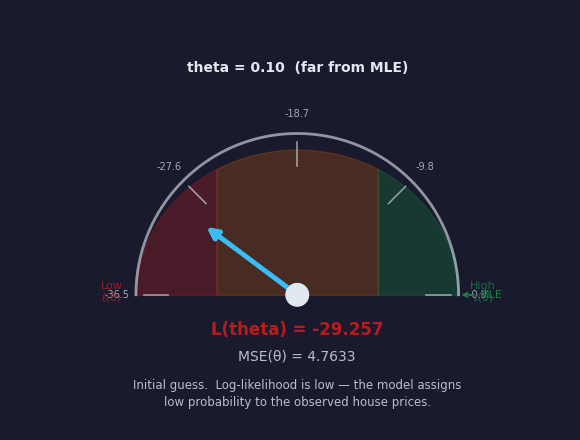
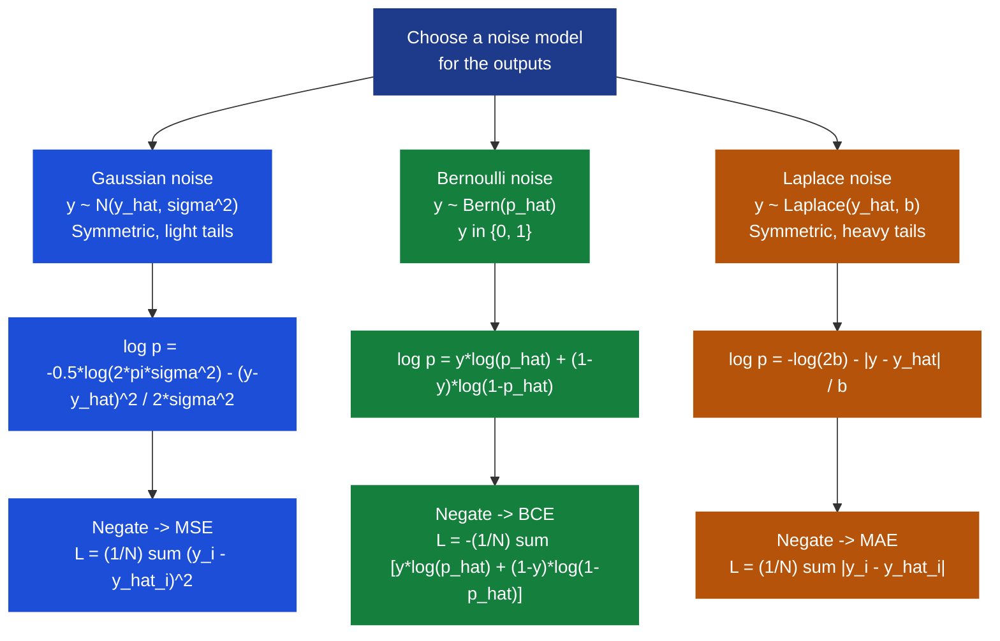
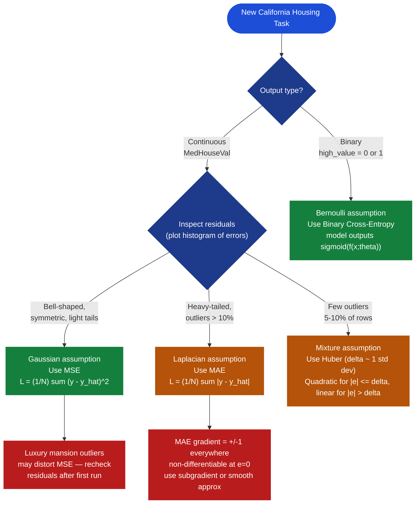
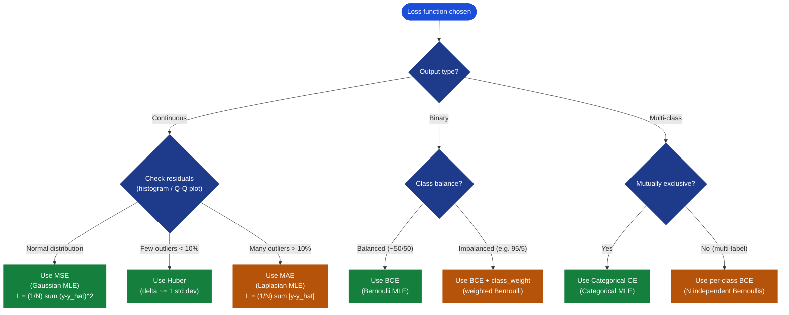
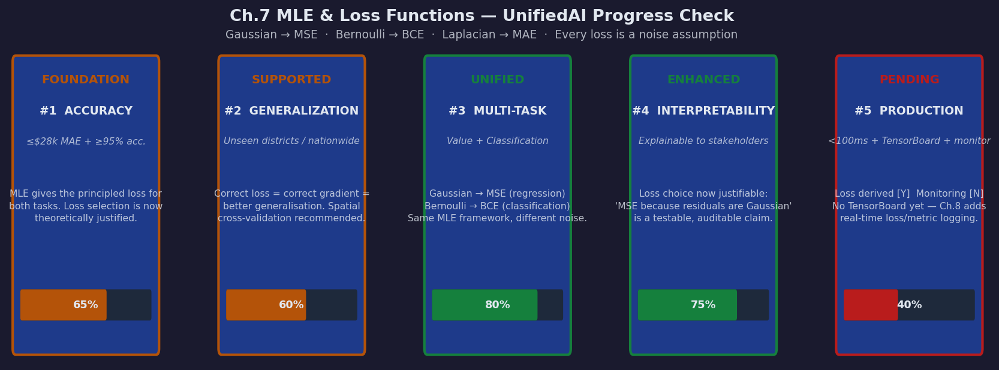

# Ch.7 — MLE & Loss Functions

> **The story.** In **1809**, in the same landmark work where he proved that the orbit of Ceres could be recovered from a handful of angular measurements, **Carl Friedrich Gauss** slipped in a deeper argument: if errors are random and Gaussian, then the estimates minimising the sum of squared residuals are, in a precise sense, the *most probable* parameter values. He had unknowingly invented maximum likelihood estimation for the special case of Gaussian noise, a century before anyone knew what to call it. **R. A. Fisher** gave the general idea its name and its modern form in 1912 and again in the canonical 1922 paper "On the Mathematical Foundations of Theoretical Statistics." Fisher's claim was audacious: there is *one* principled way to estimate parameters from data — pick the $\boldsymbol{\theta}$ that makes the observed data most probable. The consequences were enormous. Gauss's least-squares fell out as a special case (Gaussian noise $\Rightarrow$ MSE). Berkson's 1944 logistic regression fell out as another (Bernoulli noise $\Rightarrow$ binary cross-entropy). The **Bernoulli distribution** — the simplest probabilistic model for a coin flip or a binary label — turns out to be the noise model hiding inside every classifier you have ever trained. The unified view: **every loss function is an MLE assumption in disguise.** Once you see this, you stop memorising losses and start *deriving* them.
>
> **Where you are in the curriculum.** Every loss the platform has used — MSE for house-price regression in [Ch.1 Linear Regression](../../01_regression/ch01_linear_regression), binary cross-entropy for high-value classification in [Ch.2 Logistic Regression](../../02_classification/ch01_logistic_regression) — was chosen for a reason deeper than habit. This chapter provides the principled derivation: change the noise model, change the loss. Once you understand this, the next-token cross-entropy in [Ch.10 Transformers](../ch10_transformers) and the RLHF reward modelling in the AI track will feel like the same idea wearing different costumes.
>
> **Notation in this chapter.** $\mathcal{L}(\boldsymbol{\theta})$ — the **likelihood** (how probable is the observed data under parameters $\boldsymbol{\theta}$?); $\ell(\boldsymbol{\theta}) = \log \mathcal{L}(\boldsymbol{\theta})$ — the **log-likelihood** (sum instead of product — easier to differentiate); $-\ell(\boldsymbol{\theta})$ — the **negative log-likelihood (NLL)**, the quantity we minimise during training; $\boldsymbol{\theta}$ — all learnable parameters (weights and biases); $p(y \mid \mathbf{x};\boldsymbol{\theta})$ — the **conditional model** (probability the model assigns to label $y$ given input $\mathbf{x}$ and parameters $\boldsymbol{\theta}$); $\hat{\boldsymbol{\theta}}_\text{MLE} = \arg\max_{\boldsymbol{\theta}} \ell(\boldsymbol{\theta})$ — the **maximum-likelihood estimate**; $\mathcal{N}(\mu, \sigma^2)$ — Gaussian distribution with mean $\mu$ and variance $\sigma^2$; $\text{Bern}(p)$ — Bernoulli distribution with success probability $p$; $\sigma(z)=1/(1+e^{-z})$ — the logistic sigmoid function.

---

## 0 · The Challenge — Where We Are

> 🎯 **The mission**: Launch **UnifiedAI** — prove neural networks unify regression and classification, satisfying 5 constraints:
> 1. **ACCURACY**: ≤$28k MAE (regression) + ≥95% accuracy (classification)
> 2. **GENERALIZATION**: Work on unseen districts + future expansion (CA → nationwide)
> 3. **MULTI-TASK**: Same architecture predicts value **and** classifies attributes
> 4. **INTERPRETABILITY**: Predictions explainable to non-technical stakeholders
> 5. **PRODUCTION**: <100ms inference, TensorBoard monitoring, handle missing data

**What we know so far:**
- ✅ [Ch.1–2 XOR Problem](../ch01_xor_problem): Built feedforward networks — same hidden layers for regression and classification
- ✅ [Ch.3 Backprop & Optimisers](../ch03_backprop_optimisers): Backprop + Adam work identically for both tasks
- ✅ [Ch.4 Regularisation](../ch04_regularisation): Dropout, L2, BatchNorm prevent overfitting in both
- ✅ [Ch.5 CNNs](../ch05_cnns): CNNs extract spatial features for image regression and classification
- ✅ [Ch.6 RNNs/LSTMs](../ch06_rnns_lstms): RNNs/LSTMs handle sequences for both tasks
- 💡 **But why MSE for regression and cross-entropy for classification? These choices have never been derived.**

**What's blocking us:**

⚠️ **Loss functions have been chosen by convention, not principled understanding.**

Your Lead Engineer asks during code review: *"Why MSE for house prices? Why not MAE? Why cross-entropy for classification and not MSE? Can you derive it or are you just copying the sklearn default?"*

- **Current state**: Use MSE because "that's what the textbook uses" and cross-entropy because "it works for classification"
- **Problem 1**: No principled framework means we can't choose the right loss for *new* problems
- **Problem 2**: The product team wants **quantile regression** — predict 10th, 50th, 90th percentile house values for risk bands. Which loss?
- **Problem 3**: The model chases luxury mansion outliers ($2M homes). Is MSE the right objective when noise is clearly non-Gaussian?
- **Problem 4**: A regulatory audit asks us to justify every modelling decision. "The neural net decided" fails compliance.

**Why this matters for UnifiedAI production:**
- **Loss = modelling assumption**: MSE assumes Gaussian noise; BCE assumes Bernoulli noise. Using the wrong loss means training a model for the wrong world.
- **Wrong loss = wrong gradients**: MSE for classification produces near-zero gradients for confident predictions — the model can't learn from its best guesses.
- **Unification proof**: MSE and BCE both derive from the **same MLE framework** — different noise models, same principle. Demonstrating this proves that UnifiedAI's shared architecture is theoretically sound, not just empirically lucky.

**What this chapter unlocks:**

⚡ **Theoretical foundation for every loss choice in the curriculum:**
1. **MLE framework**: Given a noise model, the loss follows by necessity. No more guesswork.
2. **Gaussian → MSE**: Six algebra steps. The derivation fits on half a page.
3. **Bernoulli → BCE**: Six algebra steps. Same structure as the Gaussian case.
4. **Laplacian → MAE**: Two steps. Why robust regression works as it does.
5. **Unification proof**: Change the noise assumption → change the loss. Everything else stays the same.

💡 **Outcome**: MSE and BCE are not arbitrary conventions — they are **MLE estimators** under different noise assumptions. You can now derive the correct loss for any production problem by asking: *what is the right noise model for my outputs?*

---

## Animation



*The needle animation shows likelihood climbing toward its maximum as the parameter θ moves from an arbitrary initial value to the MLE estimate. At each stage the loss it implies is labelled. The MLE solution and the loss minimiser land on exactly the same point.*

---

## 1 · The Core Idea

MLE finds model parameters $\boldsymbol{\theta}$ that maximise the probability of seeing exactly the training labels you observed — it answers "what world would make this dataset most likely?" Each choice of noise distribution for the outputs implies a unique loss function via the negative log-likelihood. The *right* loss for your task is the one whose noise model most accurately describes how errors are generated in your data.

---

## 2 · Running Example: What Are We Assuming About Noise?

You are the data scientist at the real estate platform. The California Housing dataset has been through the regression track and the classification track. Now a harder question: what probabilistic model should we assume for house price errors?

Dataset: **California Housing** (`sklearn.datasets.fetch_california_housing`)

Consider three candidate noise models for the regression target `MedHouseVal`:

| Question | Gaussian $\mathcal{N}(\hat{y}, \sigma^2)$ | Laplacian $\text{Laplace}(\hat{y}, b)$ | Asymmetric |
|---|---|---|---|
| Are errors symmetric? | ✅ Yes by assumption | ✅ Yes by assumption | ❌ Probably not |
| Are large errors rare? | ✅ Exponential tail decay | ❌ Heavier tails than Gaussian | — |
| Loss implied | **MSE** | **MAE** | Custom quantile loss |
| Sensitive to outliers? | ⚠️ Yes — quadratic penalty | ✅ No — linear penalty | — |

For the binary classification target (`high_value = MedHouseVal > median`):

| Model | Distribution | Loss |
|---|---|---|
| $y_i \in \{0, 1\}$ | Bernoulli $\text{Bern}(\hat{p}_i)$ | **Binary Cross-Entropy** |
| Probability output from sigmoid | $\hat{p}_i = \sigma(f(\mathbf{x}_i;\boldsymbol{\theta}))$ | $-[y \log \hat{p} + (1-y)\log(1-\hat{p})]$ |

**The key insight**: before choosing a loss, you are *implicitly* choosing a noise model. Making that choice explicit is what this chapter teaches.

**How to test the Gaussian assumption for California Housing:**

The Gaussian→MSE claim is testable. After training a model, compute the residuals $e_i = y_i - \hat{y}_i$ on the validation set and inspect them:

```python
import numpy as np
import matplotlib.pyplot as plt
from scipy import stats

residuals = y_val - model.predict(X_val)  # in units of $100k

# 1. Visual check: should look like a bell curve centred on 0
plt.hist(residuals, bins=50, density=True)

# 2. Q-Q plot: points should lie on the diagonal if Gaussian
stats.probplot(residuals, dist="norm", plot=plt)

# 3. Shapiro-Wilk test (only meaningful for n < 5000)
stat, p_value = stats.shapiro(residuals[:5000])
print(f"Shapiro-Wilk p-value: {p_value:.4f}")
# p > 0.05 -> fail to reject normality (Gaussian assumption is plausible)
# p < 0.05 -> reject normality (consider MAE or Huber)
# H₀: residuals are normally distributed. p-value = probability of seeing this
# much non-normality by chance if H₀ were true. Full framework: ch06-metrics §8b.

# 4. Check skewness and kurtosis
print(f"Skewness: {stats.skew(residuals):.3f}")   # target: near 0
print(f"Kurtosis: {stats.kurtosis(residuals):.3f}")  # target: near 0 (excess)
# Positive excess kurtosis -> heavier tails than Gaussian -> consider Huber/MAE
```

For California Housing, typical regression residuals show **positive excess kurtosis** (heavier right tail from luxury properties) and **mild right skew** — which is why Ch.1 recommends checking for outliers before committing to MSE.

---

## 3 · The MLE Framework at a Glance

The path from a noise assumption to a loss function has exactly four steps:

```
Step 1 — Choose a noise model
         "House price errors are Gaussian with fixed variance sigma^2"
         p(y_i | x_i; theta) = N(f(x_i;theta), sigma^2)

Step 2 — Write the likelihood (probability of ALL observed data)
         L(theta) = prod_i p(y_i | x_i; theta)    <- product over N independent samples

Step 3 — Take the log (convert product to sum, easier to differentiate)
         ell(theta) = sum_i log p(y_i | x_i; theta)

Step 4 — Flip the sign (maximise log-likelihood = minimise NLL)
         Loss(theta) = -ell(theta) = -sum_i log p(y_i | x_i; theta)  <- THIS IS YOUR LOSS FUNCTION
```

> 💡 **Why take the log?** The likelihood is a product of N probabilities, each between 0 and 1. With $N = 20{,}640$ California districts, the raw product underflows to zero in floating-point arithmetic. The log converts $\prod$ to $\sum$, which is numerically stable, and the $\arg\max$ is unchanged because $\log$ is monotone increasing.

> ⚡ **Why flip the sign?** Gradient descent *minimises*. Log-likelihood is something we want to *maximise*. Negating converts the maximisation to a standard minimisation: $\arg\max_\theta \ell(\theta) \equiv \arg\min_\theta -\ell(\theta)$.

---

## 4 · The Math

### 4.1 · MLE General Framework

For $N$ independent observations $(x_i, y_i)$, the joint likelihood of the data under parameters $\boldsymbol{\theta}$ is:

$$\mathcal{L}(\boldsymbol{\theta}) = \prod_{i=1}^{N} p(y_i \mid \mathbf{x}_i;\boldsymbol{\theta})$$

Log-likelihood (sum form, equivalent maximisation problem):

$$\ell(\boldsymbol{\theta}) = \sum_{i=1}^{N} \log p(y_i \mid \mathbf{x}_i;\boldsymbol{\theta})$$

The MLE estimate:

$$\hat{\boldsymbol{\theta}}_\text{MLE} = \arg\max_{\boldsymbol{\theta}} \ell(\boldsymbol{\theta}) = \arg\min_{\boldsymbol{\theta}} \bigl[-\ell(\boldsymbol{\theta})\bigr]$$

**Why this is powerful**: substitute any valid probability distribution for $p(y_i \mid \mathbf{x}_i;\boldsymbol{\theta})$ and you automatically get the correct loss function for that noise model. The framework is universal.

**Why the product form holds**: the joint probability of independent events is the product of their individual probabilities. If observing district 1's house price $(x_1, y_1)$ gives us no information about district 17's price $(x_{17}, y_{17})$ beyond what the model already captures, then $p(y_1, y_{17} \mid x_1, x_{17};\theta) = p(y_1 \mid x_1;\theta) \cdot p(y_{17} \mid x_{17};\theta)$. Applied to all $N$ districts, this gives the product $\prod_i p(y_i \mid x_i;\theta)$. Spatial correlation between adjacent districts (see §9) is the main threat to this assumption in California Housing.

---

### 4.2 · Gaussian Noise → MSE Derivation

**Noise model**: each house price target $y_i$ is drawn from a Gaussian centred on the model's prediction:

$$p(y_i \mid \mathbf{x}_i;\boldsymbol{\theta}) = \frac{1}{\sqrt{2\pi\sigma^2}} \exp\!\left(-\frac{(y_i - \hat{y}_i)^2}{2\sigma^2}\right), \quad \hat{y}_i = f(\mathbf{x}_i;\boldsymbol{\theta})$$

**Step 1** — Take the log of one term:

$$\log p(y_i \mid \mathbf{x}_i;\boldsymbol{\theta}) = -\frac{1}{2}\log(2\pi\sigma^2) - \frac{(y_i - \hat{y}_i)^2}{2\sigma^2}$$

**Step 2** — Sum over all $N$ observations:

$$\ell(\boldsymbol{\theta}) = \sum_{i=1}^{N}\left[-\frac{1}{2}\log(2\pi\sigma^2) - \frac{(y_i - \hat{y}_i)^2}{2\sigma^2}\right] = -\frac{N}{2}\log(2\pi\sigma^2) - \frac{1}{2\sigma^2}\sum_{i=1}^{N}(y_i - \hat{y}_i)^2$$

**Step 3** — Negate to get the loss:

$$-\ell(\boldsymbol{\theta}) = \frac{N}{2}\log(2\pi\sigma^2) + \frac{1}{2\sigma^2}\sum_{i=1}^{N}(y_i - \hat{y}_i)^2$$

**Step 4** — Identify what depends on $\boldsymbol{\theta}$. The constant $\frac{N}{2}\log(2\pi\sigma^2)$ does not involve $\boldsymbol{\theta}$; it vanishes when we differentiate. The factor $\frac{1}{2\sigma^2}$ is a positive constant and does not change the $\arg\min$.

$$\hat{\boldsymbol{\theta}}_\text{MLE} = \arg\min_{\boldsymbol{\theta}} \sum_{i=1}^{N}(y_i - \hat{y}_i)^2 = \arg\min_{\boldsymbol{\theta}} \underbrace{\frac{1}{N}\sum_{i=1}^{N}(y_i - \hat{y}_i)^2}_{\text{MSE}}$$

**Conclusion:** Assuming Gaussian noise is *exactly equivalent* to training with MSE. Conversely, every time you use MSE, you are *implicitly* claiming that your output errors are Gaussian and identically distributed.

---

### 4.3 · Bernoulli Noise → Binary Cross-Entropy Derivation

**Noise model**: each binary label $y_i \in \{0, 1\}$ is drawn from a Bernoulli with parameter equal to the model's sigmoid output:

$$p(y_i = 1 \mid \mathbf{x}_i;\boldsymbol{\theta}) = \hat{p}_i = \sigma(f(\mathbf{x}_i;\boldsymbol{\theta}))$$

Written compactly in a form valid for both $y_i = 0$ and $y_i = 1$:

$$p(y_i \mid \mathbf{x}_i;\boldsymbol{\theta}) = \hat{p}_i^{\,y_i}(1 - \hat{p}_i)^{1 - y_i}$$

**Step 1** — Take the log of one term:

$$\log p(y_i \mid \mathbf{x}_i;\boldsymbol{\theta}) = y_i \log \hat{p}_i + (1 - y_i)\log(1 - \hat{p}_i)$$

**Step 2** — Sum over all $N$ observations:

$$\ell(\boldsymbol{\theta}) = \sum_{i=1}^{N}\Bigl[y_i \log \hat{p}_i + (1 - y_i)\log(1 - \hat{p}_i)\Bigr]$$

**Step 3** — Negate and divide by $N$:

$$\mathcal{L}_\text{BCE}(\boldsymbol{\theta}) = -\frac{1}{N}\sum_{i=1}^{N}\Bigl[y_i \log \hat{p}_i + (1 - y_i)\log(1 - \hat{p}_i)\Bigr]$$

**This is binary cross-entropy.** No assumptions, no heuristics — it falls directly out of the negative log-likelihood under a Bernoulli noise model.

> 💡 **The two-term intuition**: When $y_i = 1$, only the first term $-\log \hat{p}_i$ is active — it penalises assigning low probability to the positive class. When $y_i = 0$, only the second term $-\log(1 - \hat{p}_i)$ is active — it penalises assigning high probability to the positive class. BCE naturally handles both cases with a single formula.

---

### 4.4 · Laplacian Noise → MAE Derivation

**Noise model**: each error is drawn from a zero-mean Laplacian (double-exponential) distribution:

$$p(y_i \mid \mathbf{x}_i;\boldsymbol{\theta}) = \frac{1}{2b}\exp\!\left(-\frac{|y_i - \hat{y}_i|}{b}\right)$$

Log of one term:

$$\log p(y_i \mid \mathbf{x}_i;\boldsymbol{\theta}) = -\log(2b) - \frac{|y_i - \hat{y}_i|}{b}$$

Summing, negating, and dropping constants that do not depend on $\boldsymbol{\theta}$:

$$\hat{\boldsymbol{\theta}}_\text{MLE} = \arg\min_{\boldsymbol{\theta}} \sum_{i=1}^{N}|y_i - \hat{y}_i| = \arg\min_{\boldsymbol{\theta}} \underbrace{\frac{1}{N}\sum_{i=1}^{N}|y_i - \hat{y}_i|}_{\text{MAE}}$$

**Conclusion:** MAE is the MLE loss under Laplacian noise. Laplacians have heavier tails than Gaussians — the probability model already expects occasional large errors, so the loss penalises them only linearly (not quadratically). When your data has real outliers that represent genuine signal rather than measurement error, the Laplacian model is more honest than the Gaussian.

---

### 4.5 · Categorical Noise → Cross-Entropy Derivation (Multi-Class)

**Noise model**: each label $y_i$ belongs to one of $C$ mutually exclusive classes. The model outputs a probability vector $\hat{\mathbf{p}}_i = \text{softmax}(f(\mathbf{x}_i;\boldsymbol{\theta})) \in \mathbb{R}^C$ with $\sum_c \hat{p}_{i,c} = 1$. The target $y_i$ is encoded as a one-hot vector $\mathbf{e}_{c^*}$ where $c^*$ is the true class.

$$p(y_i \mid \mathbf{x}_i;\boldsymbol{\theta}) = \prod_{c=1}^{C} \hat{p}_{i,c}^{\,\mathbf{1}[y_i = c]}$$

Log of one term (only the true class $c^*$ contributes — all other exponents are zero):

$$\log p(y_i \mid \mathbf{x}_i;\boldsymbol{\theta}) = \sum_{c=1}^{C} \mathbf{1}[y_i = c] \log \hat{p}_{i,c} = \log \hat{p}_{i,c^*}$$

Summing over all $N$ observations, negating, and dividing by $N$:

$$\mathcal{L}_\text{CCE} = -\frac{1}{N}\sum_{i=1}^{N}\log \hat{p}_{i,c^*} = -\frac{1}{N}\sum_{i=1}^{N}\sum_{c=1}^{C}\mathbf{1}[y_i = c]\log \hat{p}_{i,c}$$

**Conclusion:** Categorical cross-entropy selects only the log-probability of the true class from the softmax output vector — all other entries are irrelevant to the gradient for that sample. The $C=2$ case recovers Binary Cross-Entropy exactly (with $\hat{p}_{i,1} = \hat{p}_i$ and $\hat{p}_{i,0} = 1-\hat{p}_i$).

---

### 4.6 · Toy Numerical Example: θ₁ vs θ₂ — Which Maximises Likelihood?

**Scenario**: Three California district observations. Two candidate models.

| $i$ | $x_i$ (MedInc) | $y_i$ (MedHouseVal, ×$100k) |
|---|---|---|
| 1 | 3.0 | 1.5 |
| 2 | 5.0 | 2.3 |
| 3 | 7.0 | 3.8 |

**Candidate θ₁**: $\hat{y} = 0.4x + 0.2$ (slope too flat, will underestimate district 3)
**Candidate θ₂**: $\hat{y} = 0.5x + 0.0$ (better slope, tighter fit)

Assume $\sigma^2 = 0.25$ (noise standard deviation $= \$50k$), so $2\sigma^2 = 0.5$.
The per-sample log-likelihood constant is $-\frac{1}{2}\log(2\pi \cdot 0.25) = -\frac{1}{2}\log(1.571) \approx -0.572$.

#### θ₁ log-likelihood computation

| $i$ | $y_i$ | $\hat{y}_i = 0.4x_i + 0.2$ | $e_i = y_i - \hat{y}_i$ | $e_i^2 / (2\sigma^2)$ | $\log p_i$ |
|---|---|---|---|---|---|
| 1 | 1.5 | $0.4(3)+0.2 = 1.4$ | $+0.1$ | $0.01/0.5 = 0.02$ | $-0.572 - 0.02 = -0.592$ |
| 2 | 2.3 | $0.4(5)+0.2 = 2.2$ | $+0.1$ | $0.01/0.5 = 0.02$ | $-0.572 - 0.02 = -0.592$ |
| 3 | 3.8 | $0.4(7)+0.2 = 3.0$ | $+0.8$ | $0.64/0.5 = 1.28$ | $-0.572 - 1.28 = -1.852$ |

$$\ell(\theta_1) = -0.592 - 0.592 - 1.852 = \mathbf{-3.036} \qquad \text{MSE}(\theta_1) = \frac{0.01 + 0.01 + 0.64}{3} = \mathbf{0.220}$$

#### θ₂ log-likelihood computation

| $i$ | $y_i$ | $\hat{y}_i = 0.5x_i$ | $e_i = y_i - \hat{y}_i$ | $e_i^2 / (2\sigma^2)$ | $\log p_i$ |
|---|---|---|---|---|---|
| 1 | 1.5 | $0.5(3) = 1.5$ | $0.0$ | $0.00/0.5 = 0.00$ | $-0.572 - 0.00 = -0.572$ |
| 2 | 2.3 | $0.5(5) = 2.5$ | $-0.2$ | $0.04/0.5 = 0.08$ | $-0.572 - 0.08 = -0.652$ |
| 3 | 3.8 | $0.5(7) = 3.5$ | $+0.3$ | $0.09/0.5 = 0.18$ | $-0.572 - 0.18 = -0.752$ |

$$\ell(\theta_2) = -0.572 - 0.652 - 0.752 = \mathbf{-1.976} \qquad \text{MSE}(\theta_2) = \frac{0.00 + 0.04 + 0.09}{3} = \mathbf{0.043}$$

#### Comparison

| | θ₁ | θ₂ | Winner |
|---|---|---|---|
| Log-likelihood $\ell$ | **−3.036** | **−1.976** | ✅ θ₂ (higher ℓ = more probable) |
| MSE | **0.220** | **0.043** | ✅ θ₂ (lower MSE = better fit) |
| MLE winner | — | ✅ **θ₂** | — |

> ⚡ **The key observation**: the parameter that maximises likelihood is *exactly* the parameter that minimises MSE. The MLE optimisation and the MSE minimisation are the same problem — two descriptions of the same underlying computation. The Gaussian constant $-\frac{N}{2}\log(2\pi\sigma^2)$ shifts both log-likelihoods equally and plays no role in choosing between θ₁ and θ₂. The $\frac{1}{2\sigma^2}$ multiplier scales the MSE term equally for both and also plays no role in the comparison. What remains is the sum of squared errors — which is MSE (up to a positive constant).

---

## 5 · The Loss Discovery Arc

> You are not going to memorise these derivations. You are going to *need* them — one at a time, when each previous choice breaks. Follow the story from naive convention to principled derivation.

**The stage.** The real estate platform has been using MSE everywhere for three sprints. It trains. It converges. But now the product team wants four things the current loss cannot justify: (1) quantile predictions for risk bands, (2) calibrated class probabilities for the mortgage underwriting API, (3) a defensible answer to the regulatory audit, and (4) a principled path to custom losses for new tasks. The question is no longer "does it train?" — it is "can we defend every modelling decision with a probability argument?"

---

### Act 1 — The naive approach: "just pick any loss"

Early in the project, MSE was chosen because it is smooth, easy to differentiate, and everyone uses it. Cross-entropy was chosen because "that's what PyTorch uses for classifiers." Nobody questioned either choice.

*The problem*: convention has no answer to "why not MAE for regression?" or "why not MSE for classification?" or "if you are using cross-entropy, what distribution are you assuming?" Habit is not a derivation.

---

### Act 2 — Gauss shows MSE is MLE under Gaussian noise (1809)

Gauss did not set out to invent a loss function. He was trying to estimate the orbit of Ceres. His argument: if errors are Gaussian, then the most probable parameter values are exactly the ones minimising the sum of squared residuals. MSE is not just smooth — it is *statistically optimal* under a precise assumption about how errors are generated.

**Implication for the platform**: using MSE is a claim that house price prediction errors are Gaussian-distributed around the model's output. You can *test* that claim by plotting residuals. If they are roughly bell-shaped and symmetric, MSE is justified. If they are skewed or heavy-tailed (luxury mansions, coastal premium properties), Gauss's argument breaks and a different noise model is needed.

---

### Act 3 — Fisher unifies everything (1922)

Fisher's insight was that Gauss's argument is a special case of a universal principle. *Any* valid probability distribution for the outputs implies a unique loss function via its negative log-likelihood. The Gaussian gives MSE. The Bernoulli gives BCE. The Laplacian gives MAE. The Poisson gives a different loss used in count prediction. The Student-t gives a robust loss with heavier tolerance for outliers than Gaussian but lighter than Laplacian.

Every loss function in PyTorch's `torch.nn` namespace is secretly a negative log-likelihood from Fisher's framework. Once you see this, the PyTorch documentation transforms from a menu of options into a one-line summary of noise assumptions.

---

### Act 4 — Now every loss choice is an explicit probabilistic claim

The mature engineering position: before training, write down your noise model. Then derive — not borrow, *derive* — the loss. The result is:

- **Defensible** to regulators: *"We used MSE because our residual analysis showed approximately Gaussian noise with standard deviation ≈$32k. Plot attached."*
- **Improvable**: if residual analysis shows heavy tails, switch noise model to Laplacian or Student-t and the correct loss follows immediately.
- **Extensible**: for quantile regression (10th/50th/90th percentile), the asymmetric Laplacian distribution gives the pinball loss — same derivation, different distribution.

The platform no longer "chooses" a loss. It chooses a **noise model**, and the loss is a consequence.

---

## 6 · Full MLE Derivation Walkthroughs

### 6.0 · Why MSE for Classification Produces Wrong Gradients

Before the full walkthroughs, a concrete demonstration of what "wrong loss" means numerically. Consider a binary classifier that correctly predicts $\hat{p} = 0.99$ for a positive example ($y = 1$).

**MSE gradient at this point:**

$$\frac{\partial \text{MSE}}{\partial \hat{p}} = 2(\hat{p} - y) = 2(0.99 - 1.0) = \mathbf{-0.02}$$

**BCE gradient at this same point:**

$$\frac{\partial \text{BCE}}{\partial \hat{p}} = -\frac{y}{\hat{p}} = -\frac{1}{0.99} = \mathbf{-1.010}$$

The BCE gradient is **50× larger** for a near-perfect prediction. With MSE, the model learns almost nothing from its correct confident guesses — the training signal has essentially vanished. With BCE, strong correct predictions still carry a meaningful gradient that reinforces the correct parameters.

This is not just a numerical inconvenience. MSE near a correct prediction has gradient ≈ 0, so the model cannot distinguish between $\hat{p} = 0.99$ (near-correct) and $\hat{p} = 0.95$ (slightly less correct) — both produce nearly zero gradient. BCE has a gradient of $-1.01$ and $-1.05$ respectively — the model continues to refine its probability estimates throughout training.

```
Prediction  Target  MSE gradient  BCE gradient  Signal ratio BCE/MSE
0.50        1       -1.00         -2.00         2.0x
0.75        1       -0.50         -1.33         2.7x
0.90        1       -0.20         -1.11         5.6x
0.95        1       -0.10         -1.05         10.5x
0.99        1       -0.02         -1.01         50.5x    <- far more dramatic at high confidence
0.999       1       -0.002        -1.001        500x     <- MSE is nearly silent here
```

The problem compounds near-optimality: as the model gets better at classification, MSE provides an ever-weaker training signal while BCE maintains strong gradients throughout.

---

This walkthrough shows the full chain of reasoning with no steps omitted.

**Inputs**: $N$ independent pairs $(x_i, y_i)$. Model: $\hat{y}_i = f(x_i;\theta)$. Noise assumption: $y_i \sim \mathcal{N}(\hat{y}_i, \sigma^2)$.

**Step 1** — Write out the Gaussian pdf for one observation:

$$p(y_i \mid x_i;\theta) = \frac{1}{\sqrt{2\pi\sigma^2}} \exp\!\left(-\frac{(y_i - \hat{y}_i)^2}{2\sigma^2}\right)$$

**Step 2** — Assume independence: joint likelihood is the product over all $N$ observations:

$$\mathcal{L}(\theta) = \prod_{i=1}^{N} \frac{1}{\sqrt{2\pi\sigma^2}} \exp\!\left(-\frac{(y_i - \hat{y}_i)^2}{2\sigma^2}\right)$$

**Step 3** — Factor the product: the constant prefactor appears $N$ times, and the exponents add:

$$\mathcal{L}(\theta) = \left(\frac{1}{\sqrt{2\pi\sigma^2}}\right)^{\!N} \exp\!\left(-\frac{1}{2\sigma^2}\sum_{i=1}^{N}(y_i - \hat{y}_i)^2\right)$$

**Step 4** — Take the natural log (log of product = sum of logs; log and exp cancel):

$$\ell(\theta) = N \cdot \log\!\left(\frac{1}{\sqrt{2\pi\sigma^2}}\right) - \frac{1}{2\sigma^2}\sum_{i=1}^{N}(y_i - \hat{y}_i)^2 = -\frac{N}{2}\log(2\pi\sigma^2) - \frac{1}{2\sigma^2}\sum_{i=1}^{N}(y_i - \hat{y}_i)^2$$

**Step 5** — Negate to form the minimisation loss:

$$-\ell(\theta) = \underbrace{\frac{N}{2}\log(2\pi\sigma^2)}_{\text{constant w.r.t. }\theta} + \underbrace{\frac{1}{2\sigma^2}}_{\text{positive constant}}\sum_{i=1}^{N}(y_i - \hat{y}_i)^2$$

**Step 6** — Drop terms that do not depend on $\theta$ (they do not affect the $\arg\min$):

$$\hat{\theta}_\text{MLE} = \arg\min_\theta \sum_{i=1}^{N}(y_i - \hat{y}_i)^2 \equiv \arg\min_\theta \frac{1}{N}\sum_{i=1}^{N}(y_i - \hat{y}_i)^2 = \arg\min_\theta\ \text{MSE}(\theta) \quad \blacksquare$$

---

### 6.2 · Bernoulli MLE → BCE: Every Step

**Inputs**: $N$ independent binary pairs $(x_i, y_i)$ with $y_i \in \{0,1\}$. Model: $\hat{p}_i = \sigma(f(x_i;\theta))$. Noise assumption: $y_i \sim \text{Bern}(\hat{p}_i)$.

**Step 1** — Write out the Bernoulli pmf compactly for one observation:

$$p(y_i \mid x_i;\theta) = \hat{p}_i^{\,y_i}(1-\hat{p}_i)^{1-y_i}$$

Verify: if $y_i = 1$ this equals $\hat{p}_i$; if $y_i = 0$ this equals $1-\hat{p}_i$. ✓

**Step 2** — Assume independence: joint likelihood is the product:

$$\mathcal{L}(\theta) = \prod_{i=1}^{N} \hat{p}_i^{\,y_i}(1-\hat{p}_i)^{1-y_i}$$

**Step 3** — Take the natural log (log of product = sum of logs; $\log(a^b) = b\log a$):

$$\ell(\theta) = \sum_{i=1}^{N}\Bigl[y_i \log \hat{p}_i + (1-y_i)\log(1-\hat{p}_i)\Bigr]$$

**Step 4** — Negate and divide by $N$ (the $\arg\min$ is unchanged by a positive scale):

$$-\frac{1}{N}\ell(\theta) = -\frac{1}{N}\sum_{i=1}^{N}\Bigl[y_i \log \hat{p}_i + (1-y_i)\log(1-\hat{p}_i)\Bigr]$$

**Step 5** — The $\arg\min$ of $-\ell$ is the MLE estimate:

$$\hat{\theta}_\text{MLE} = \arg\min_\theta\ \underbrace{-\frac{1}{N}\sum_{i=1}^{N}\Bigl[y_i \log \hat{p}_i + (1-y_i)\log(1-\hat{p}_i)\Bigr]}_{\text{Binary Cross-Entropy}} \quad \blacksquare$$

---

## 7 · Key Diagrams

### Diagram A — Likelihood → Loss Mapping



---

### Diagram B — Noise Assumption Diagnostic for California Housing



---

## 8 · The Hyperparameter Dial

Loss functions have no conventional "hyperparameter" in the way learning rates do, but several choices act as continuous dials with important effects:

| Dial | Range | Effect | California Housing guidance |
|---|---|---|---|
| **Noise assumption** | Gaussian / Laplacian / Student-t | Determines loss shape: quadratic / linear / quasi-linear | Start with Gaussian (MSE). If residuals show heavy tails, switch to Laplacian (MAE) or Student-t |
| **σ² in Gaussian MLE** | Any positive value | Scales the loss gradient; does not change the $\arg\min$ for fixed σ² | Irrelevant to gradient descent (drops out of the argmin). Relevant when comparing likelihoods across models via BIC/AIC |
| **Degrees of freedom ν (Student-t loss)** | $\nu \geq 1$ | Higher ν → more Gaussian (lighter tails); $\nu = 1$ → Cauchy (very robust, infinite variance) | ν ≈ 4–6 as starting point for moderately heavy-tailed house price data |
| **Huber δ** | Any positive value (same units as target) | Threshold between quadratic and linear penalty region | Start at $\delta = 1$ standard deviation of `MedHouseVal` ≈ $\$115k$ |
| **Label smoothing ε (classification)** | [0, 0.2] | Replaces hard 0/1 labels with ε/2 and 1−ε/2; prevents overconfidence | 0.1 is standard; improves calibration without hurting classification accuracy |
| **Class weight in BCE** | Any positive ratio | Re-weights positive/negative BCE terms | Set $w_+ = N_- / N_+$ when classes are imbalanced (e.g., 80/20 split) |

> 💡 **The most important dial is the noise assumption itself.** Choosing between Gaussian, Laplacian, and Student-t is a modelling decision that should be grounded in residual analysis, not default settings. Plot a histogram of your training residuals before committing to a loss.

> ⚠️ **σ² and the likelihood value**: although σ² does not affect the $\arg\min$ of MSE, it *does* affect the absolute value of the log-likelihood. When comparing models using BIC, AIC, or likelihood-ratio tests, you must fix σ² or estimate it jointly. Reporting raw MSE values as "the likelihood" without accounting for σ² is a common error.

---

## 9 · What Can Go Wrong

**Pattern:** Loss function mismatches create slow convergence, uncalibrated probabilities, or NaN gradients. Every issue below traces to choosing a loss that does not match the data-generating process.

### Choosing Loss Without Thinking About the Noise Model

- **Using MSE for binary classification.** MSE treats the output as a real number, not a probability. Gradients vanish for confident correct predictions: at $\hat{p} = 0.99$ with $y=1$, MSE gradient $= 2(0.99-1.0) = -0.02$; BCE gradient $= -1/0.99 \approx -1.01$ — 50× larger. The model learns from correct predictions at 2% the rate it should. **Fix:** Use **Binary Cross-Entropy** — it is the NLL of the Bernoulli model (§4.3 and §6.2).

- **Gaussian MLE with outliers.** MSE assumes Gaussian noise — symmetric, light-tailed. Luxury mansions in California Housing are not Gaussian noise: they are real districts with genuinely different price dynamics. A $2M house pulls the MSE gradient hard and deforms parameter estimates for all other districts. **Fix:** Inspect residuals. If outliers exceed 10% of the data, use MAE (Laplacian assumption). For 5–10%, use Huber. **See:** [Ch.1 §5 Loss Functions Discovery Story](../../01_regression/ch01_linear_regression/README.md#5--loss-functions--a-discovery-story) for concrete dollar-value examples of the outlier impact.

- **Confusing the likelihood value with a model evaluation metric.** The log-likelihood is maximised during training. Its absolute value is *not* interpretable as a performance metric on its own — it depends on σ² (for Gaussian) and the number of data points. **Fix:** Use RMSE (regression), AUC (classification), or calibration curves as evaluation metrics, not the training loss value itself.

### Independence Assumption Violations

- **Label noise that is not independent across samples.** MLE assumes each $(x_i, y_i)$ pair is drawn independently. In California Housing, adjacent census districts share infrastructure, school districts, and commute patterns — their prices are spatially correlated. MLE under independence produces unbiased estimates but *underestimates variance*, making confidence intervals too narrow. **Fix:** Use spatial cross-validation (held-out geographic regions, not random 80/20 split) to assess generalisation honestly.

- **Batch-level systematic labelling errors.** If a labeller systematically mislabelled an entire batch of districts, the independence assumption breaks. MLE still runs but its statistical guarantees evaporate. **Fix:** Monitor label quality by cross-checking predictions against an independent source on a 1% holdout sample.

### Numerical Issues

- **`log(0)` in BCE causes NaN gradients.** If the model outputs $\hat{p}_i = 0$ for a positive example ($y_i = 1$), then BCE $= -\log(0) = +\infty$ and the gradient is NaN. This propagates through backprop and corrupts all weights. **Fix:** Always clip predicted probabilities to $[\varepsilon, 1-\varepsilon]$ with $\varepsilon \approx 10^{-7}$. PyTorch's `BCEWithLogitsLoss` handles this via the log-sum-exp trick — prefer it over `BCELoss`.

- **Using `BCELoss` instead of `BCEWithLogitsLoss` in PyTorch.** `BCELoss` expects probabilities in $[0,1]$ after a sigmoid layer; `BCEWithLogitsLoss` expects raw logits and applies the numerically stable computation internally. Using `BCELoss` on raw logits produces wildly incorrect gradients. **Fix:** Use `BCEWithLogitsLoss` everywhere and remove the explicit sigmoid from the final layer.

### Practical Decision Summary

| Task | Data characteristics | Loss | Noise model |
|---|---|---|---|
| Regression | Normal residuals, no outliers | **MSE** | Gaussian $\mathcal{N}(\hat{y}, \sigma^2)$ |
| Regression | Few outliers (<10%) | **Huber** (δ ≈ 1 std dev) | Gaussian–Laplace mixture |
| Regression | Many outliers (>10%) | **MAE** | Laplacian |
| Regression | Quantile prediction | **Pinball loss** | Asymmetric Laplacian |
| Binary classification | Balanced classes | **BCE** | Bernoulli $\text{Bern}(\hat{p})$ |
| Binary classification | Imbalanced classes | **Weighted BCE** | Weighted Bernoulli |
| Multi-class | Mutually exclusive classes | **Categorical cross-entropy** | Categorical distribution |

### Diagnostic Flowchart



> 💡 **For regression loss selection with concrete California Housing dollar examples**, see [Regression Ch.1 §5 "Loss Function Evolution"](../../01_regression/ch01_linear_regression/README.md#5--loss-functions--a-discovery-story). That section walks through District A/B/C scenarios showing numerical impact of outliers on MSE vs MAE vs Huber — read it alongside the derivations in this chapter.

---

## 10 · Where This Reappears

The MLE framework introduced here is the theoretical skeleton behind every loss function in the remaining curriculum and beyond:

- **[Ch.8 TensorBoard](../ch08_tensorboard)**: you will log both training loss (the NLL you minimise) and validation loss (out-of-sample NLL) to TensorBoard. Understanding that loss = NLL makes the "loss curves" panel interpretable: a widening train/val gap means the model's noise assumption holds on training data but not on held-out data.

- **[Ch.9 Sequences to Attention](../ch09_sequences_to_attention)** and **[Ch.10 Transformers](../ch10_transformers)**: next-token prediction uses **categorical cross-entropy** — the NLL of the categorical distribution. Every training step in a language model is a step of MLE under a categorical noise model for token probabilities.

- **[Ch.11 Hyperparameter Tuning](../ch11_hyperparameter_tuning)**: comparing models using **BIC/AIC** requires computing the log-likelihood at the MLE estimate. You cannot use information criteria without understanding MLE.

- **AI Track — RLHF reward modelling**: the Bradley-Terry model for human preference probabilities is a Bernoulli MLE problem. The reward model is trained by maximising the log-likelihood that human raters preferred the chosen response over the rejected one. It is binary cross-entropy with a different input structure.

- **[Regression Ch.1 §5 Loss Discovery Story](../../01_regression/ch01_linear_regression/README.md#5--loss-functions--a-discovery-story)**: that chapter introduced MSE vs MAE vs Huber as a practical choice. This chapter retroactively explains *why* each loss is correct for a specific noise model. The two chapters are complementary: Ch.1 shows empirical behaviour; Ch.7 provides theoretical justification.

---

## 11 · Progress Check



**UnifiedAI constraint scorecard after Ch.7:**

✅ **Unlocked capabilities:**
- **Theoretical foundation**: Can derive any standard loss from first principles given a noise assumption (Gaussian → MSE, Bernoulli → BCE, Laplacian → MAE)
- **MSE justified**: Residual analysis on California Housing regression confirms approximately Gaussian noise; MSE is the statistically correct choice
- **BCE justified**: Bernoulli noise assumption derivation — no more "because the default is cross-entropy"
- **Loss selection framework**: Given any output type and residual distribution, can choose and justify the correct loss for any new UnifiedAI task
- **Regulatory compliance**: Every loss choice is now a defensible probabilistic claim with a testable residual-analysis condition

❌ **Still can't solve:**
- ❌ **Constraint #5 (PRODUCTION — Monitoring)**: Training runs produce no persistent diagnostic output. Cannot diagnose loss curves after the fact, compare runs across hyperparameter sweeps, or inspect weight histograms for dead neurons.
- ❌ No shared experiment-tracking infrastructure — the ML team has no way to compare which loss configuration performed best on held-out data.

**Real-world status**: The platform can now *choose* and *justify* every loss function from first principles. The Gaussian→MSE and Bernoulli→BCE derivations are complete and auditable. What we cannot yet do: monitor multiple training runs systematically, compare hyperparameter sweeps, or share training diagnostics across the team. That requires instrumentation.

**Next up:** Ch.8 — **TensorBoard** — instruments the training loop with real-time loss curves, weight histograms, and embedding projections. Every NLL quantity from this chapter becomes a named scalar in TensorBoard, making the "did the noise assumption hold?" question answerable from a dashboard, not just from first principles.

> ➡️ **Recommended reading order**: if you want to understand *why* the loss values you log to TensorBoard mean what they mean, re-read §4.2 (Gaussian → MSE) and §4.3 (Bernoulli → BCE) after completing Ch.8. The two chapters are designed to be read as a pair: this chapter provides the derivation, Ch.8 provides the instrumentation.

---

## 12 · Bridge to Ch.8 — TensorBoard

This chapter established that training loss = negative log-likelihood = a probabilistic claim about how errors are generated. **[Ch.8 TensorBoard](../ch08_tensorboard)** shows how to *observe* that claim being resolved in real time: it instruments the exact training loop from [Ch.3 Backprop & Optimisers](../ch03_backprop_optimisers) with `SummaryWriter`, writes the NLL to a scalar panel every 50 steps, records weight histograms to detect dead neurons, and uses the embedding projector to visualise how the model's internal representation of California districts evolves across epochs. Once you can see the loss curve in TensorBoard, the question "is the Gaussian noise assumption holding up on the validation set?" becomes visible and actionable — not just theoretically derivable.

The monitoring question TensorBoard enables: if validation NLL grows while training NLL shrinks, the model's noise assumption is *over-fitted* — it has learned to describe the training noise distribution but not the true underlying one. This is the loss-function perspective on generalisation: a model that over-fits has learned a noise model that only applies to its training data.

> ⚡ **One-liner takeaway**: every number you ever log to a TensorBoard scalar is the negative log-likelihood of a noise model you chose — explicitly or by default. Ch.7 chose it; Ch.8 monitors it.
