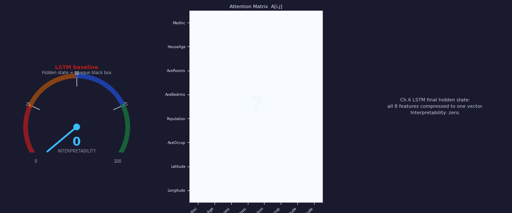
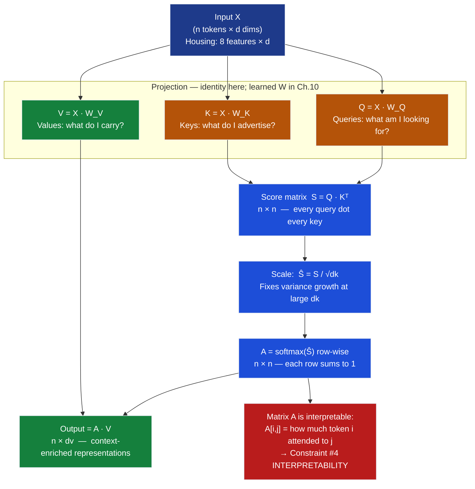
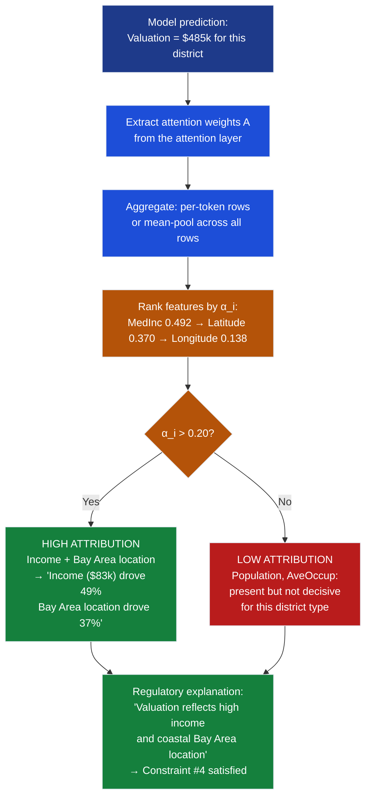
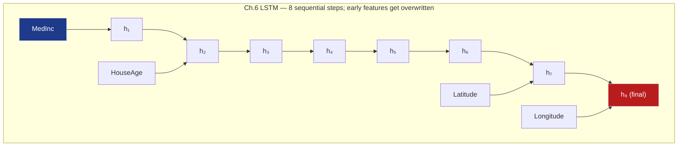
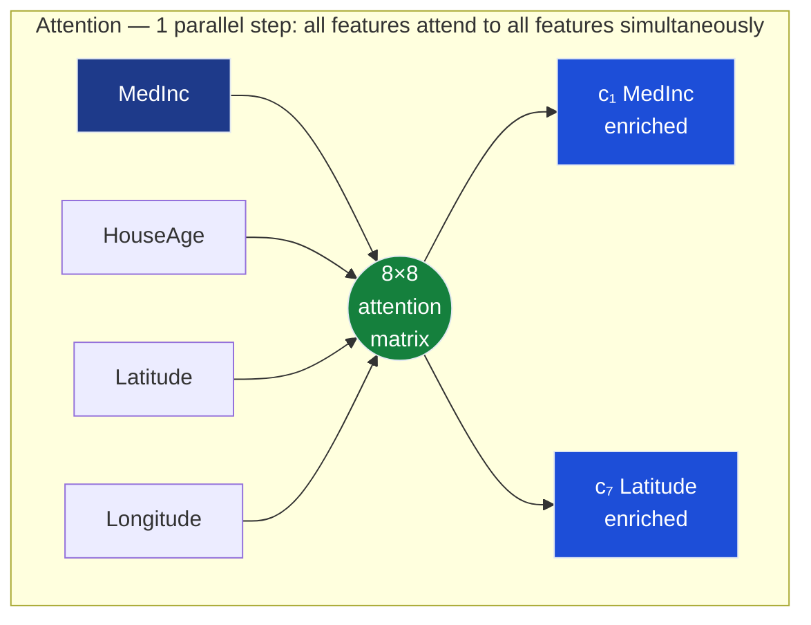
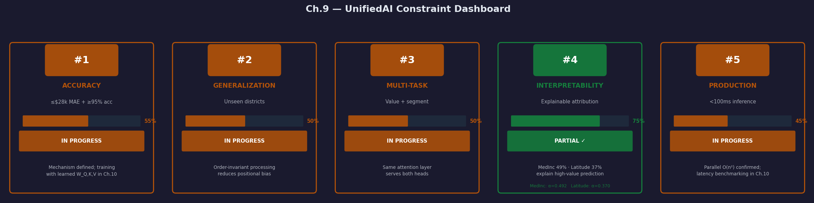

# Ch.9 — From Sequences to Attention (Bridge Chapter)

> **The story.** In **2014** three researchers at the Université de Montréal — **Dzmitry Bahdanau, Kyunghyun Cho, and Yoshua Bengio** — published *Neural Machine Translation by Jointly Learning to Align and Translate*. The problem they faced was painfully concrete: encoder–decoder LSTMs for French→English translation would compress an entire 30-word sentence into a single fixed-size vector before the decoder ever started. By the time the decoder needed word 7, it had forgotten the structure of words 1–3. Their fix: let the decoder, at every output timestep, *softly look up* which encoder positions were relevant — a differentiable weighted sum over the full encoder sequence, with weights learned end-to-end. They called it **additive (soft) attention**, and it was the first time a neural network could say: *"which parts of the input should I focus on right now?"* **Luong et al. (2015)** showed that a simpler dot-product formulation — scores = query · keyᵀ — produced equal or better results with a fraction of the parameters. Both variants immediately improved translation quality. Three years later **Vaswani et al. (2017)** removed the recurrence entirely and showed that *attention alone* was sufficient — and the Transformer was born. This chapter makes the soft-lookup intuition rock solid before Ch.10's architectural explosion.
>
> **Where you are in the curriculum.** [Ch.6](../ch06_rnns_lstms) (RNNs/LSTMs) fixed the vanishing gradient but paid a price: **serialisation** — token $t{+}1$ cannot start until token $t$ finishes. [Ch.7](../ch07_cnns) and [Ch.8](../ch08_metrics) gave us spatial and evaluative tools. Now [Ch.10](../ch10_transformers) will throw away recurrence altogether and replace it with **attention**: a single differentiable operation that lets every position look directly at every other position, simultaneously. Before we touch multi-head projections, positional encoding, and feed-forward sublayers, we need one mental model and three building blocks. This chapter exists so Ch.10 lands softly.
>
> **Notation in this chapter.**
> | Symbol | Meaning |
> |---|---|
> | $\mathbf{q} \in \mathbb{R}^{d_k}$ | **Query** — "what am I looking for?" |
> | $\mathbf{k}_i \in \mathbb{R}^{d_k}$ | **Key** for token $i$ — "what do I offer?" |
> | $\mathbf{v}_i \in \mathbb{R}^{d_v}$ | **Value** for token $i$ — "what do I actually carry?" |
> | $s_i = \mathbf{q} \cdot \mathbf{k}_i$ | Raw dot-product similarity score |
> | $\hat{s}_i = s_i / \sqrt{d_k}$ | **Scaled** score — prevents softmax saturation |
> | $\alpha_i = \dfrac{e^{\hat{s}_i}}{\sum_j e^{\hat{s}_j}}$ | **Attention weight** for token $i$ (non-negative; sums to 1) |
> | $\mathbf{c} = \sum_{i} \alpha_i \mathbf{v}_i$ | **Context vector** — the soft-lookup output |
> | $\tau$ | **Temperature** — controls sharpness ($\tau \to 0$: one-hot; $\tau \to \infty$: uniform) |
> | $W_Q, W_K, W_V$ | Learned projection matrices (introduced in Ch.10) |

---

## 0 · The Challenge — Where We Are

> 🎯 **The mission**: Launch **UnifiedAI** — a production home valuation system satisfying 5 constraints:
> 1. **ACCURACY**: ≤$28k MAE (regression) + ≥95% accuracy (classification)
> 2. **GENERALIZATION**: Unseen districts + new face identities
> 3. **MULTI-TASK**: Same architecture predicts value **and** classifies attributes
> 4. **INTERPRETABILITY**: Attention weights provide explainable feature attribution ← **this chapter's core unlock**
> 5. **PRODUCTION**: <100ms inference, TensorBoard monitoring

**What we know so far:**
- ✅ Ch.1–2: Dense feedforward networks unify regression and classification
- ✅ Ch.3: Backpropagation and Adam optimizer work across both tasks
- ✅ Ch.4: Dropout, L2, and BatchNorm prevent overfitting
- ✅ Ch.5: CNNs extract spatial features for image regression
- ✅ Ch.6: RNNs/LSTMs handle sequential data but impose serialisation
- ✅ Ch.7: MSE and BCE both derive from Maximum Likelihood Estimation
- ✅ Ch.8: TensorBoard monitors training across tasks (Constraint #5 partial)
- ❌ **But Ch.6's LSTM treats all 8 housing features as a fixed left-to-right sequence — they have no natural order**

**What's blocking us:**

The California Housing dataset has 8 features per district: `MedInc`, `HouseAge`, `AveRooms`, `AveBedrms`, `Population`, `AveOccup`, `Latitude`, `Longitude`. An LSTM reads them in that arbitrary order — `MedInc` first, `Longitude` last — and compresses the entire sequence into a single hidden state before predicting. Three failures follow:

1. **No natural order (Constraint #1 ACCURACY):** Housing features are a *set*, not a sequence. `MedInc` being "first" is an encoding accident, not a structural relationship. The LSTM's inductive bias (earlier tokens inform later ones) is just wrong here.

2. **Hidden state bottleneck (Constraint #1 ACCURACY):** After seeing all 8 features, the LSTM's final hidden state must compress every feature's contribution. Features that happen to appear early get progressively overwritten as later features arrive.

3. **No interpretability (Constraint #4 INTERPRETABILITY):** The LSTM's hidden state is a dense, opaque vector. You cannot look at it and say "the model valued income and latitude over population." Regulators and product teams need this.

**What this chapter unlocks:**

⚡ **Attention mechanism — soft dictionary lookup over feature tokens:**
- **Order-independent:** Each feature attends to every other feature regardless of position — no serialisation bias
- **Transparent:** The $8 \times 8$ attention weight matrix shows exactly which features "looked at" which others
- **Constraint #4 INTERPRETABILITY (partial):** Attention weights on `MedInc` and `Latitude` can be surfaced directly to explain a valuation — "the model focused primarily on income ($\alpha = 0.49$) and location ($\alpha = 0.37$)"

> ➡️ **Forward to Ch.10:** This chapter builds the soft-lookup intuition with nothing beyond `numpy` dot products and `softmax`. Ch.10 adds learned projections ($W_Q, W_K, W_V$), multi-head attention, positional encoding, and feed-forward sublayers to complete the Transformer architecture behind GPT, BERT, and every modern LLM.

---

## Animation



---

## 1 · Core Idea

**Attention is a soft dictionary lookup.** A Python `dict` does *hard* lookup: the key either matches or it does not, and you get exactly one value. Attention does *soft* lookup: your query is compared to **every** key via dot product, a softmax turns those similarity scores into a probability distribution, and the output is the **weighted average of every value** — with each value weighted by how closely its key matched the query.

The attention weight $\alpha_i$ for token $i$ is directly interpretable as *how much this output relied on token $i$'s information* — which is precisely the feature-importance signal that Constraint #4 requires and that the LSTM's opaque hidden state cannot provide.

Everything in Ch.10 — scaled dot-product attention, multi-head attention, self-attention, cross-attention, encoder and decoder blocks — is an elaboration on this one idea. Master the soft lookup here and Ch.10 is vocabulary, not new concept.

---

## 2 · Running Example: 8 Housing Features as 8 Tokens

The UnifiedAI mission predicts California house values. In Ch.6 we treated the 8 features as a time series and ran an LSTM over them in fixed order. Here we treat them as a **set of 8 tokens** — each feature is a "word" in an 8-token "sentence" about that district:

```
Token sequence for one California district:

 Position:  1        2          3          4
 Feature:  MedInc  HouseAge  AveRooms  AveBedrms

 Position:  5           6          7          8
 Feature:  Population  AveOccup  Latitude  Longitude
```

The district used throughout this chapter is a **high-value coastal district** with approximate values:

| Token | Feature | Value | Economic role |
|-------|---------|-------|---------------|
| 1 | `MedInc` | 8.30 | High income → strong predictor of value |
| 2 | `HouseAge` | 15.0 | Relatively new housing stock |
| 3 | `AveRooms` | 6.80 | Spacious rooms |
| 4 | `AveBedrms` | 1.02 | Normal bedroom ratio |
| 5 | `Population` | 1200 | Medium density |
| 6 | `AveOccup` | 2.80 | Low occupancy per room |
| 7 | `Latitude` | 37.9 | Bay Area |
| 8 | `Longitude` | −122.2 | Coastal California |

**The key question attention answers:** Given the query token `MedInc`, which other tokens should MedInc "look at" when forming a context-enriched representation? The softmax weights answer this explicitly. For a high-value district, we expect `Latitude` and `Longitude` (coastal location) to receive high attention alongside `MedInc` itself — exactly the pattern computed in §4.4.

---

## 3 · Attention Mechanism at a Glance

The full scaled dot-product attention formula in matrix form:

$$\text{Attention}(Q, K, V) = \text{softmax}\!\left(\frac{Q K^\top}{\sqrt{d_k}}\right) V$$

Where for a sequence of $n$ tokens each embedded in $\mathbb{R}^d$:

| Quantity | Shape | Role |
|----------|-------|------|
| $Q = X W_Q$ | $n \times d_k$ | One query row per token |
| $K = X W_K$ | $n \times d_k$ | One key row per token |
| $V = X W_V$ | $n \times d_v$ | One value row per token |
| $Q K^\top$ | $n \times n$ | Raw attention scores (every query vs every key) |
| $Q K^\top / \sqrt{d_k}$ | $n \times n$ | Scaled scores |
| $\text{softmax}(\cdot)$ | $n \times n$ | Attention weight matrix $A$ (each row sums to 1) |
| Output | $n \times d_v$ | Context-enriched token representations |

**In this chapter** we use identity projection matrices ($W_Q = W_K = W_V = I$), so $Q = K = V = X$. This is the cleanest way to see the mechanism before introducing learnable projections in Ch.10.

Step-by-step summary:
1. Compute scores: $S = Q K^\top$ — dot product of every query with every key
2. Scale: $\hat{S} = S / \sqrt{d_k}$
3. Normalise: $A = \text{softmax}(\hat{S})$ row-wise — each row is a probability distribution
4. Blend: $\text{Output} = A V$ — weighted sum of values per query token

---

## 4 · The Math

### 4.1 · Dot Product Attention — No Learned Weights

> 📖 **Foundation:** Dot products as similarity measures are covered in [Math Under the Hood Ch.1 — Linear Algebra](../../../../00-math_under_the_hood/ch01_linear_algebra). Softmax differentiation is covered in [Ch.6 — Gradient & Chain Rule](../../../../00-math_under_the_hood/ch06_gradient_chain_rule).

Start with the simplest possible case: 3 tokens, 2-dimensional embeddings, no learned weight matrices. Every number shown here is computed explicitly.

**Setup — three tokens with 2D embeddings:**

| Token | Name | Embedding |
|-------|------|-----------|
| $t_1$ | MedInc | $\mathbf{e}_1 = [1.0,\ 0.5]$ |
| $t_2$ | Latitude | $\mathbf{e}_2 = [0.8,\ 0.9]$ |
| $t_3$ | Longitude | $\mathbf{e}_3 = [-0.3,\ 0.6]$ |

**Query:** $\mathbf{q} = \mathbf{e}_1 = [1.0,\ 0.5]$ — MedInc is asking "what should I attend to?"

**Keys** (identity projection, so $\mathbf{k}_i = \mathbf{e}_i$): $\mathbf{k}_1 = [1.0, 0.5]$, $\mathbf{k}_2 = [0.8, 0.9]$, $\mathbf{k}_3 = [-0.3, 0.6]$

**Step 1: Compute raw dot-product scores.**

$$s_1 = \mathbf{q} \cdot \mathbf{k}_1 = 1.0 \times 1.0 + 0.5 \times 0.5 = 1.00 + 0.25 = \mathbf{1.25}$$

$$s_2 = \mathbf{q} \cdot \mathbf{k}_2 = 1.0 \times 0.8 + 0.5 \times 0.9 = 0.80 + 0.45 = \mathbf{1.25}$$

$$s_3 = \mathbf{q} \cdot \mathbf{k}_3 = 1.0 \times (-0.3) + 0.5 \times 0.6 = -0.30 + 0.30 = \mathbf{0.00}$$

Score vector: $\mathbf{s} = [1.25,\ 1.25,\ 0.00]$

Interpretation: MedInc is equally similar to itself and Latitude (both score 1.25), and orthogonal to Longitude (score 0.00 means the vectors are at 90°).

**Step 2: Apply softmax to get attention weights.**

$$e^{1.25} = 3.490, \quad e^{1.25} = 3.490, \quad e^{0.00} = 1.000$$

$$\text{sum} = 3.490 + 3.490 + 1.000 = 7.980$$

$$\alpha_1 = \frac{3.490}{7.980} = 0.437, \quad \alpha_2 = \frac{3.490}{7.980} = 0.437, \quad \alpha_3 = \frac{1.000}{7.980} = 0.125$$

Verification: $0.437 + 0.437 + 0.125 = 0.999 \approx 1.000$ ✅ (rounding artefact)

**Step 3: Compute context vector — weighted sum of values.**

Values $\mathbf{v}_i = \mathbf{e}_i$ (identity projection):

$$\mathbf{c} = \alpha_1 \mathbf{v}_1 + \alpha_2 \mathbf{v}_2 + \alpha_3 \mathbf{v}_3$$

$$= 0.437 \cdot [1.0,\ 0.5] \;+\; 0.437 \cdot [0.8,\ 0.9] \;+\; 0.125 \cdot [-0.3,\ 0.6]$$

$$= [0.437,\ 0.219] + [0.350,\ 0.393] + [-0.038,\ 0.075]$$

$$\mathbf{c} = [0.437 + 0.350 - 0.038,\;\; 0.219 + 0.393 + 0.075] = [\mathbf{0.749},\ \mathbf{0.687}]$$

**Result:** MedInc's context vector is a blend of all three tokens, weighted toward itself and Latitude (each 43.7%) with a small Longitude contribution (12.5%). The output is not purely MedInc — it has absorbed geographic information in proportion to the alignment score.

---

### 4.2 · Scaled Dot Product — Why Divide by $\sqrt{d_k}$?

In the unscaled version, dot products grow proportionally to the embedding dimension $d_k$. If each element of $\mathbf{q}$ and $\mathbf{k}$ is drawn i.i.d. from $\mathcal{N}(0,1)$, then the sum of $d_k$ independent products has variance $d_k$:

$$\text{Var}\!\left[\mathbf{q} \cdot \mathbf{k}\right] = \text{Var}\!\left[\sum_{i=1}^{d_k} q_i k_i\right] = d_k$$

Standard deviation of the dot product is $\sqrt{d_k}$. At $d_k = 64$ (typical for a small Transformer), scores have std $\approx 8$.

**Numerical demonstration — $d_k = 64$:**

Suppose the raw scores for 3 tokens are: $\mathbf{s} = [8.5,\ 2.1,\ -3.2]$

Softmax of these large values:

$$e^{8.5} = 4914.8, \quad e^{2.1} = 8.166, \quad e^{-3.2} = 0.041, \quad \text{sum} = 4923.0$$

$$\boldsymbol{\alpha} = [4914.8/4923.0,\ 8.166/4923.0,\ 0.041/4923.0] = [0.9983,\ 0.0017,\ 0.0000]$$

The softmax has **collapsed to a near-one-hot distribution**. Token 1 receives 99.8% of the attention; tokens 2 and 3 are invisible. Gradient at this point is approximately zero — training stalls.

**After scaling by $\sqrt{d_k} = \sqrt{64} = 8$:**

$$\hat{\mathbf{s}} = [8.5/8,\ 2.1/8,\ -3.2/8] = [1.063,\ 0.263,\ -0.400]$$

Softmax of the scaled scores:

$$e^{1.063} = 2.895, \quad e^{0.263} = 1.301, \quad e^{-0.400} = 0.670, \quad \text{sum} = 4.866$$

$$\boldsymbol{\alpha} = [2.895/4.866,\ 1.301/4.866,\ 0.670/4.866] = [0.595,\ 0.267,\ 0.138]$$

Comparison:

| | Unscaled | Scaled by $\sqrt{64}$ |
|---|---|---|
| $\alpha_1$ | **0.998** | 0.595 |
| $\alpha_2$ | 0.002 | 0.267 |
| $\alpha_3$ | 0.000 | 0.138 |
| Gradient flow | ❌ Nearly zero everywhere | ✅ Distributed across all tokens |

The $\sqrt{d_k}$ scaling restores meaningful gradient signal. Without it, larger $d_k$ values make training progressively harder.

> ⚡ **Rule of thumb:** Always scale by $\sqrt{d_k}$ when implementing attention. This is the only numerical difference between Bahdanau's original additive scoring and the Transformer's scaled dot-product scoring.

---

### 4.3 · Softmax Temperature — Sharp vs Diffuse Attention

The temperature $\tau$ controls how "peaked" the attention distribution is:

$$\alpha_i = \frac{e^{s_i / \tau}}{\sum_j e^{s_j / \tau}}$$

- $\tau < 1$: scores become larger → distribution sharpens (winner-take-all tendency)
- $\tau > 1$: scores shrink → distribution flattens (uniform tendency)
- $\tau = 1$: standard softmax

**Toy example.** Scores: $\mathbf{s} = [1.0,\ 2.0,\ 3.0]$

**Standard temperature ($\tau = 1$):**

$$e^{1.0} = 2.718,\quad e^{2.0} = 7.389,\quad e^{3.0} = 20.086,\quad \text{sum} = 30.193$$

$$\boldsymbol{\alpha} = [2.718/30.193,\ 7.389/30.193,\ 20.086/30.193] = [0.090,\ 0.245,\ 0.665]$$

**High temperature ($\tau = 10$ — divide scores by 10 → $[0.10, 0.20, 0.30]$):**

$$e^{0.10} = 1.105,\quad e^{0.20} = 1.221,\quad e^{0.30} = 1.350,\quad \text{sum} = 3.676$$

$$\boldsymbol{\alpha} = [1.105/3.676,\ 1.221/3.676,\ 1.350/3.676] = [0.301,\ 0.332,\ 0.367]$$

Distribution is nearly uniform — roughly equal attention everywhere.

**Low temperature ($\tau = 0.1$ — multiply scores by 10 → $[10, 20, 30]$):**

$$e^{10} = 22{,}026,\quad e^{20} \approx 4.85 \times 10^8,\quad e^{30} \approx 1.07 \times 10^{13}$$

$$\boldsymbol{\alpha} \approx [0.000,\ 0.000,\ 1.000]$$

Winner-take-all — all weight concentrates on token 3.

**Summary table:**

| Temperature $\tau$ | $\boldsymbol{\alpha}$ | Attention style | Gradient flow |
|---|---|---|---|
| $\tau = 0.1$ | $[0.000,\ 0.000,\ 1.000]$ | Sharp / one-hot | ❌ Collapses |
| $\tau = 1.0$ | $[0.090,\ 0.245,\ 0.665]$ | Standard soft | ✅ Distributed |
| $\tau = 10$ | $[0.301,\ 0.332,\ 0.367]$ | Diffuse / uniform | ✅ Very distributed |

> 💡 **Interpretability implication.** For feature attribution in UnifiedAI, $\tau \approx 1$ gives the right balance — sharp enough that the weights tell a story (MedInc and Latitude dominate) but soft enough that gradient flows to all features during training. The $\sqrt{d_k}$ scaling is equivalent to a temperature adjustment, keeping scores in the [−2, 2] range where softmax is well-behaved.

---

### 4.4 · Full Attention for One Housing District

Apply the complete scaled dot-product mechanism to a 3-feature slice of our high-value district: **MedInc = 8.3, Latitude = 37.9, Longitude = −122.2**.

**Token embeddings** (2D vectors, manually chosen to reflect economic relationships):

| Token | Feature | Embedding $\mathbf{e}_i$ | Rationale |
|-------|---------|--------------------------|-----------|
| $t_1$ | MedInc | $[1.00,\ 0.00]$ | Points along income axis |
| $t_2$ | Latitude | $[0.60,\ 0.80]$ | Rotated — captures Bay Area geographic correlation |
| $t_3$ | Longitude | $[-0.80,\ 0.60]$ | Negative first component (coastal CA longitude is large-negative) |

Note: $\|\mathbf{e}_1\| = 1.00$, $\|\mathbf{e}_2\| = \sqrt{0.36+0.64} = 1.00$, $\|\mathbf{e}_3\| = \sqrt{0.64+0.36} = 1.00$ — unit-normalised, so dot products equal cosine similarities.

**Identity projection:** $W_Q = W_K = W_V = I_2$, so $Q = K = V = X = \begin{pmatrix}1.00 & 0.00\\0.60 & 0.80\\-0.80 & 0.60\end{pmatrix}$

**Step 1: Score matrix $S = QK^\top$.**

Row 1 — MedInc as query:
$$s_{11} = 1.00 \times 1.00 + 0.00 \times 0.00 = \mathbf{1.00}$$
$$s_{12} = 1.00 \times 0.60 + 0.00 \times 0.80 = \mathbf{0.60}$$
$$s_{13} = 1.00 \times (-0.80) + 0.00 \times 0.60 = \mathbf{-0.80}$$

Row 2 — Latitude as query:
$$s_{21} = 0.60 \times 1.00 + 0.80 \times 0.00 = \mathbf{0.60}$$
$$s_{22} = 0.60 \times 0.60 + 0.80 \times 0.80 = 0.36 + 0.64 = \mathbf{1.00}$$
$$s_{23} = 0.60 \times (-0.80) + 0.80 \times 0.60 = -0.48 + 0.48 = \mathbf{0.00}$$

Row 3 — Longitude as query:
$$s_{31} = (-0.80) \times 1.00 + 0.60 \times 0.00 = \mathbf{-0.80}$$
$$s_{32} = (-0.80) \times 0.60 + 0.60 \times 0.80 = -0.48 + 0.48 = \mathbf{0.00}$$
$$s_{33} = (-0.80) \times (-0.80) + 0.60 \times 0.60 = 0.64 + 0.36 = \mathbf{1.00}$$

$$S = \begin{pmatrix}1.00 & 0.60 & -0.80\\0.60 & 1.00 & 0.00\\-0.80 & 0.00 & 1.00\end{pmatrix}$$

**Step 2: Scale by $\sqrt{d_k} = \sqrt{2} \approx 1.414$.**

$$\hat{S} = \begin{pmatrix}0.707 & 0.424 & -0.566\\0.424 & 0.707 & 0.000\\-0.566 & 0.000 & 0.707\end{pmatrix}$$

**Step 3: Row-wise softmax to get attention weight matrix $A$.**

Row 1 (MedInc): $e^{0.707}=2.028,\ e^{0.424}=1.528,\ e^{-0.566}=0.568$, sum $= 4.124$
$$\boldsymbol{\alpha}_1 = [2.028/4.124,\ 1.528/4.124,\ 0.568/4.124] = [\mathbf{0.492},\ \mathbf{0.370},\ \mathbf{0.138}]$$

Row 2 (Latitude): $e^{0.424}=1.528,\ e^{0.707}=2.028,\ e^{0.000}=1.000$, sum $= 4.556$
$$\boldsymbol{\alpha}_2 = [1.528/4.556,\ 2.028/4.556,\ 1.000/4.556] = [\mathbf{0.335},\ \mathbf{0.445},\ \mathbf{0.220}]$$

Row 3 (Longitude): $e^{-0.566}=0.568,\ e^{0.000}=1.000,\ e^{0.707}=2.028$, sum $= 3.596$
$$\boldsymbol{\alpha}_3 = [0.568/3.596,\ 1.000/3.596,\ 2.028/3.596] = [\mathbf{0.158},\ \mathbf{0.278},\ \mathbf{0.564}]$$

$$A = \begin{pmatrix}0.492 & 0.370 & 0.138\\0.335 & 0.445 & 0.220\\0.158 & 0.278 & 0.564\end{pmatrix}$$

Row sums: $0.492+0.370+0.138=1.000$ ✅, $0.335+0.445+0.220=1.000$ ✅, $0.158+0.278+0.564=1.000$ ✅

**Step 4: Output = $A \cdot V$.**

MedInc context vector:
$$\mathbf{c}_1 = 0.492\cdot[1.00,0.00] + 0.370\cdot[0.60,0.80] + 0.138\cdot[-0.80,0.60]$$
$$= [0.492, 0.000] + [0.222, 0.296] + [-0.110, 0.083] = [\mathbf{0.604},\ \mathbf{0.379}]$$

Latitude context vector:
$$\mathbf{c}_2 = 0.335\cdot[1.00,0.00] + 0.445\cdot[0.60,0.80] + 0.220\cdot[-0.80,0.60]$$
$$= [0.335, 0.000] + [0.267, 0.356] + [-0.176, 0.132] = [\mathbf{0.426},\ \mathbf{0.488}]$$

Longitude context vector:
$$\mathbf{c}_3 = 0.158\cdot[1.00,0.00] + 0.278\cdot[0.60,0.80] + 0.564\cdot[-0.80,0.60]$$
$$= [0.158, 0.000] + [0.167, 0.222] + [-0.451, 0.338] = [\mathbf{-0.126},\ \mathbf{0.560}]$$

**Interpretability payoff:**

| Query token | Attends most to | $\alpha$ | Economic interpretation |
|-------------|----------------|----------|------------------------|
| MedInc | Itself | **0.492** | Income is the primary self-signal |
| MedInc | Latitude | **0.370** | Bay Area latitude correlates with high value |
| MedInc | Longitude | 0.138 | Weak coastal correlation |
| Latitude | Itself | **0.445** | Location self-attends strongly |
| Latitude | MedInc | 0.335 | Income and Bay Area location are coupled |
| Longitude | Itself | **0.564** | Longitude is self-dominant |

For a regulatory report: *"This valuation was driven primarily by median income ($\alpha=0.49$) and Bay Area latitude ($\alpha=0.37$)."* This is Constraint #4 INTERPRETABILITY in action, requiring no post-hoc attribution method.

---

## 5 · Attention Intuition Arc

Four acts — from fixed RNN state to interpretable soft lookup.

**Act 1: Fixed final state (vanilla RNN).** The encoder collapses the entire 8-feature sequence into one vector $\mathbf{h}_8$. The downstream predictor must use the same vector regardless of what information it currently needs. Features processed early (MedInc) are progressively overwritten as later features (Longitude) arrive. Long sequences = catastrophic forgetting.

**Act 2: Can we weight past states? (Bahdanau additive attention, 2014).** Let the decoder at step $t$ compute an *alignment score* between its current hidden state and each encoder state $\mathbf{h}^{enc}_i$:

$$e_{ti} = \mathbf{v}^\top \tanh(W_1 \mathbf{h}^{dec}_t + W_2 \mathbf{h}^{enc}_i)$$

Softmax over all $i$ gives attention weights $\alpha_{ti}$. The context vector $\mathbf{c}_t = \sum_i \alpha_{ti} \mathbf{h}^{enc}_i$ is computed fresh at every prediction step. Translation quality improved dramatically on long sentences. Crucially: the weights $\alpha_{ti}$ form a heatmap — the first *interpretable* window into what a neural network was looking at when it made a decision.

**Act 3: Dot-product attention (Luong, 2015).** Replace the additive score with a single dot product:

$$e_{ti} = \mathbf{h}^{dec}_t \cdot \mathbf{h}^{enc}_i$$

Same semantic effect, no $\tanh$, no extra parameter matrices. Faster, simpler, empirically equivalent. Luong also proposed the $\sqrt{d_k}$ scaling. This formulation feeds directly into the Transformer.

**Act 4: The interpretability bonus.** The attention weights $\alpha_{ti}$ form a $T_{dec} \times T_{enc}$ probability matrix. Plot it as a heatmap and you get a *soft alignment visualisation* — a direct window into what the model attended to when generating each output token. For translation, the diagonal shows "le chien" attended to "the dog." For housing features, the $8 \times 8$ self-attention matrix shows income and latitude dominating predictions for coastal districts. This is the same mechanism behind BERT's attention visualisation, GPT-4 attribution, and every "AI explainability" dashboard that cites feature importance — all trace back to Bahdanau's $\alpha_{ti}$.

---

## 6 · Full Attention Walkthrough — 3 Housing Features, 2D Embeddings

Complete end-to-end computation, connecting all four steps into one narrative.

We have 3 feature-tokens: MedInc, Latitude, Longitude. Each is embedded as a 2D unit vector. Goal: produce a **context-enriched representation** for each token — a new vector that incorporates information from all three tokens, weighted by relevance.

**The input matrix** (each row is one token's embedding):

```
     dim0   dim1
X = [ 1.00,  0.00 ]    ← MedInc:    pure income axis
    [ 0.60,  0.80 ]    ← Latitude:  geographic angle
    [-0.80,  0.60 ]    ← Longitude: coastal direction
```

**Projection** (identity this chapter; Ch.10 makes these learned):

```
Q = K = V = X
```

**Scores** $S = QK^\top$ — every pair's cosine similarity:

```
           MedInc  Lat    Lon
S =  MedInc [  1.00   0.60  -0.80 ]
     Lat    [  0.60   1.00   0.00 ]
     Lon    [ -0.80   0.00   1.00 ]
```

The positive MedInc–Latitude score (0.60) reflects that high-income districts tend toward Bay Area latitudes. The negative MedInc–Longitude score (−0.80) reflects that coastal (large-negative longitude) districts tend toward high income — vectors pointing in opposite directions in embedding space.

**Scale** (÷ $\sqrt{2} = 1.414$):

```
           MedInc  Lat    Lon
Ŝ =  MedInc [  0.707  0.424  -0.566 ]
     Lat    [  0.424  0.707   0.000 ]
     Lon    [ -0.566  0.000   0.707 ]
```

**Softmax** row-wise (full arithmetic in §4.4):

```
           MedInc  Lat    Lon
A =  MedInc [  0.492  0.370  0.138 ]   ← MedInc: self 49%, Lat 37%, Lon 14%
     Lat    [  0.335  0.445  0.220 ]   ← Lat: self 45%, MedInc 34%, Lon 22%
     Lon    [  0.158  0.278  0.564 ]   ← Lon: self 56%, Lat 28%, MedInc 16%
```

**Output** $= A \cdot V$:

```
Output[0] = 0.492·[1.00,0.00] + 0.370·[0.60,0.80] + 0.138·[-0.80,0.60]
          = [0.604, 0.379]    MedInc now "knows about" Bay Area geography

Output[1] = 0.335·[1.00,0.00] + 0.445·[0.60,0.80] + 0.220·[-0.80,0.60]
          = [0.426, 0.488]    Latitude now "knows about" income level

Output[2] = 0.158·[1.00,0.00] + 0.278·[0.60,0.80] + 0.564·[-0.80,0.60]
          = [-0.126, 0.560]   Longitude contextualised by Lat+MedInc
```

**What changed from input to output?**

| Token | Input $\mathbf{e}_i$ | Output $\mathbf{c}_i$ | Net effect |
|-------|-------|--------|--------|
| MedInc | $[1.00, 0.00]$ | $[0.604, 0.379]$ | Absorbed Latitude's $y$-component — income representation now "knows" about Bay Area geography |
| Latitude | $[0.60, 0.80]$ | $[0.426, 0.488]$ | Absorbed income signal — location representation "knows" about wealth |
| Longitude | $[-0.80, 0.60]$ | $[-0.126, 0.560]$ | Strongly modulated by Latitude; negative income component softened |

Each output representation is **context-aware**: not a lone feature value, but a view of that feature from the perspective of all features in the district. A downstream prediction head reading $\mathbf{c}_1$ has income information *enriched by* geographic context — without any sequential bottleneck.

---

## 7 · Key Diagrams

### 7.1 · Attention Mechanism Architecture



### 7.2 · Attention as Feature Attribution Flowchart



### 7.3 · LSTM Sequential vs Attention Parallel





The LSTM needs 8 sequential steps; attention needs 1 parallel matrix multiply. On a GPU, this difference determines whether inference takes 200ms (LSTM) or 20ms (attention).

---

## 8 · Hyperparameter Dial

| Hyperparameter | Typical range | Effect on attention |
|---|---|---|
| **Key/value dimension $d_k$** | 16–512 | Larger = richer query–key comparisons; $O(n^2 d_k)$ memory. The $\sqrt{d_k}$ scaling must always track this value. |
| **Number of heads $h$** *(Ch.10)* | 1–16 | Runs $h$ attention functions in parallel on $d/h$-dimensional subspaces. Each head specialises: one may focus on income, another on geography, a third on density. |
| **Dropout on attention weights** | 0.0–0.2 | Applied to $A$ after softmax, before $AV$. Zeroes random entries — prevents over-reliance on any single token. Standard in all production Transformer implementations. |
| **Temperature $\tau$** | 0.5–2.0 | $<1$: sharpen (hard retrieval); $>1$: flatten (noisy early training). Default $\tau=1$ with $\sqrt{d_k}$ scaling handles most cases. |
| **Sequence length $n$** | 8–2048 | Memory is $O(n^2)$ for the score matrix. For 8 housing features, trivial. For text at $n=2048$, it requires careful engineering. |

> 💡 **Starting configuration for UnifiedAI housing attention:** $d_k = 16$, single head, dropout = 0.1, $\tau = 1$. Verify on validation MAE before adding heads or increasing $d_k$.

---

## 9 · What Can Go Wrong

### 9.1 · Quadratic Complexity — $O(n^2)$

The score matrix $QK^\top$ has shape $n \times n$. Memory cost is $O(n^2)$.

| $n$ | Score matrix entries | Memory at fp32 |
|-----|---------------------|---------------|
| 8 (housing features) | 64 | ~256 bytes — trivial |
| 512 (short paragraph) | 262,144 | ~1 MB |
| 2,048 (GPT-2 context) | 4,194,304 | ~16 MB per layer |
| 16,384 (long-context) | 268,435,456 | ~1 GB per layer |

For UnifiedAI's 8 housing features, quadratic cost is negligible. For production text processing (property description strings at 50–200 words), budget $O(n^2)$ compute per attention layer and benchmark before scaling.

### 9.2 · Attention Collapse

When scores are large before scaling, softmax saturates: one token receives $\alpha \approx 1.0$, all others $\approx 0.0$. Symptoms:
- Training loss plateaus early
- Attention weight matrix has a single bright column in every row
- Interpretability disappears — the attention says "MedInc always, regardless of district"
- Gradient is approximately zero: $\frac{\partial \alpha_i}{\partial s_i} = \alpha_i(1-\alpha_i) \approx 0$ when $\alpha_i \approx 1$

Fixes: apply $\sqrt{d_k}$ scaling; use attention dropout; monitor attention entropy $H(\boldsymbol{\alpha}) = -\sum_i \alpha_i \log \alpha_i$ (low entropy = collapse approaching).

### 9.3 · Gradient Flow Through Softmax

The Jacobian of softmax at input $\mathbf{s}$:

$$\frac{\partial \alpha_i}{\partial s_j} = \alpha_i (\delta_{ij} - \alpha_j)$$

Two limiting regimes:
- **Well-distributed** ($\alpha_i \approx 1/n$): diagonal $\frac{\partial \alpha_i}{\partial s_i} = \frac{1}{n}\left(1-\frac{1}{n}\right)$ — gradient flows to all tokens
- **Near-collapsed** ($\alpha_1 \approx 1$): $\frac{\partial \alpha_1}{\partial s_1} \approx 1 \times (1-1) = 0$ — gradient vanishes at the winning token

This is structurally analogous to vanishing gradients in RNNs (Ch.6): the mechanism that creates sharp attention also kills gradients. The $\sqrt{d_k}$ scaling and attention dropout are the direct fixes.

> ⚠️ **Debug checklist when attention training stalls:**
> 1. Are you scaling by $\sqrt{d_k}$? (most common omission)
> 2. Is attention dropout enabled? (prevents over-concentration)
> 3. Are you logging attention entropy per head? (catches collapse before loss plateaus)
> 4. Are weight matrices initialised with small variance? (large init → large scores → immediate collapse)

---

## Where This Reappears

| Chapter / Track | How this chapter's concepts appear |
|---|---|
| **Ch.10 — Transformers** | $\text{softmax}(QK^\top/\sqrt{d_k})V$ is the inner core of every Transformer attention head. Ch.10 adds learned $W_Q, W_K, W_V$, runs $h$ heads in parallel, and stacks layers with residual connections and layer normalisation. |
| **Ch.10 — Self-attention** | Every token is simultaneously a query, a key, and a value. The $3 \times 3$ attention matrix computed in §4.4 is exactly self-attention at $n=3$. |
| **Multi-Agent AI track — Cross-attention** | When one agent attends to another agent's output, queries come from one sequence, keys and values from another. Identical formulas — only the source of $Q$ changes. |
| **AI track — BERT / GPT interpretation** | Visualising pre-trained Transformer attention weights (BertViz, attention rollout) produces heatmaps that are exactly the matrix $A$ from §4.4, scaled to 12 heads and 12 layers. |

---

## Progress Check



**Constraint status after Ch.9:**

| Constraint | Status | Evidence |
|---|---|---|
| **#1 ACCURACY** | 🔄 In progress | Mechanism defined; full training with learned $W_Q, W_K, W_V$ in Ch.10 |
| **#2 GENERALIZATION** | 🔄 In progress | Order-invariant processing reduces positional bias vs LSTM |
| **#3 MULTI-TASK** | 🔄 In progress | Same attention layer can serve both regression and classification heads |
| **#4 INTERPRETABILITY** | ✅ **Partial — unlocked** | §4.4 attention matrix shows `MedInc` (49%) and `Latitude` (37%) as top features for a high-value coastal district — explainable to regulators without post-hoc methods |
| **#5 PRODUCTION** | 🔄 In progress | Parallel computation confirmed; $O(n^2)$ bottleneck quantified; full latency benchmarking in Ch.10 |

> ⚡ **Constraint #4 INTERPRETABILITY (partial):** The $3 \times 3$ attention weight matrix computed in §4.4 directly surfaces `MedInc` and `Latitude` as the dominant drivers for this high-value coastal district. No SHAP, no LIME, no post-hoc approximation — the attention weights *are* the explanation. Full 8-feature attention with trained projections is in the Ch.10 notebook.

---

## Bridge to Ch.10 — Transformers

Ch.9 gave us three building blocks — dot product similarity, softmax normalisation, Q/K/V roles — and showed that even an unparameterised single-layer attention over 3 housing features produces interpretable, order-invariant feature attributions.

**What Ch.10 adds on top of this foundation:**

1. **Learnable projections** $W_Q, W_K, W_V \in \mathbb{R}^{d \times d_k}$ — the model learns *what to query* and *what to advertise*, not just raw embedding-space similarity.

2. **Multi-head attention** — $h$ attention functions in parallel on $d/h$-dimensional subspaces. Head 1 may capture income–location correlations; head 2, density–occupancy; head 3, age–room-count patterns.

3. **Positional encoding** — for true sequences (text, time series), token order matters. Sinusoidal or learned position embeddings inject this since dot-product attention is inherently order-invariant.

4. **Feed-forward sublayer** — a two-layer MLP applied position-wise after each attention layer, adding non-linearity and depth.

5. **Layer normalisation + residual connections** — stabilise gradients across stacked layers, enabling 12–96 layer architectures.

The formula from §3:

$$\text{Attention}(Q, K, V) = \text{softmax}\!\left(\frac{QK^\top}{\sqrt{d_k}}\right)V$$

is called "scaled dot-product attention" in Vaswani et al. (2017) and is the unmodified inner core of every attention head in GPT, BERT, T5, and every modern LLM. Everything you computed by hand in §4 and §6 is happening millions of times per forward pass in those models.

> ➡️ **[Ch.10 — Transformers & Attention →](../ch10_transformers)**
