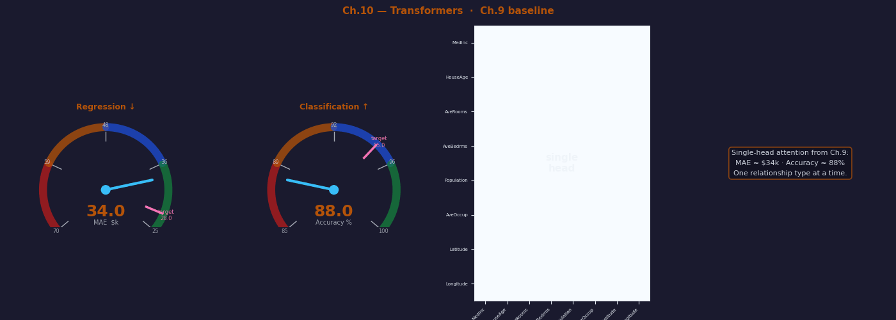
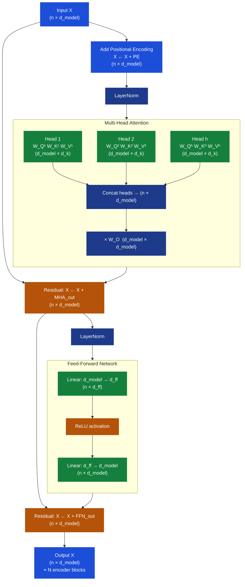
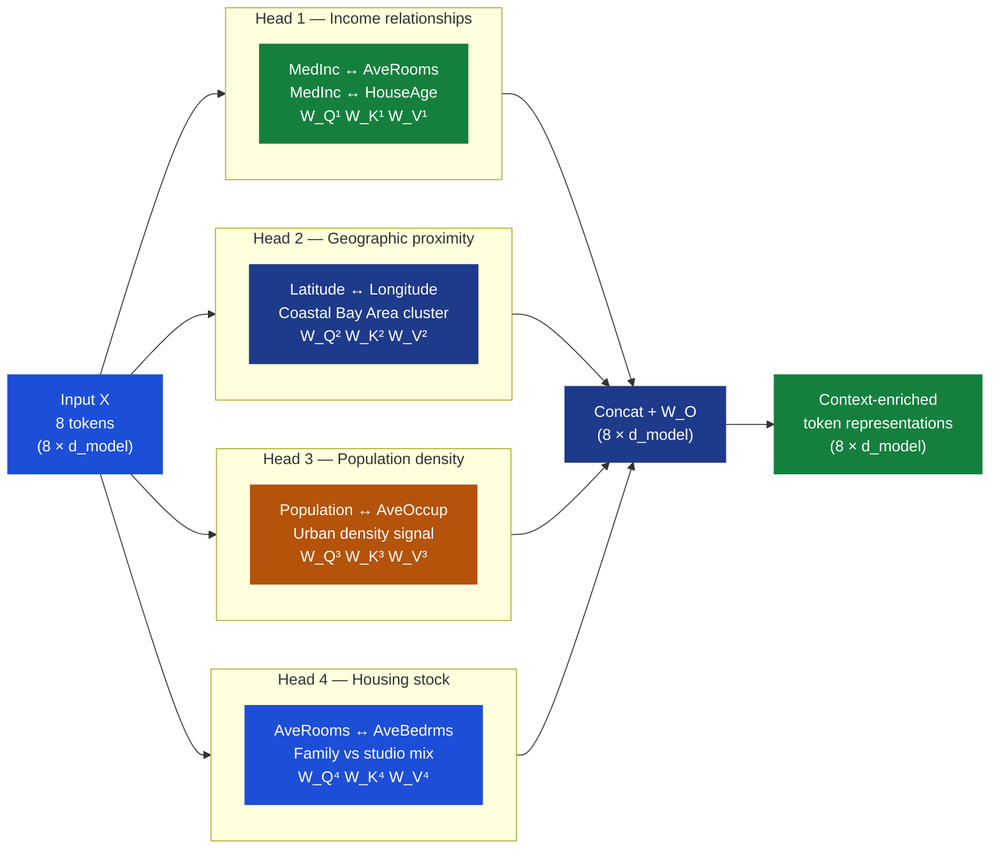
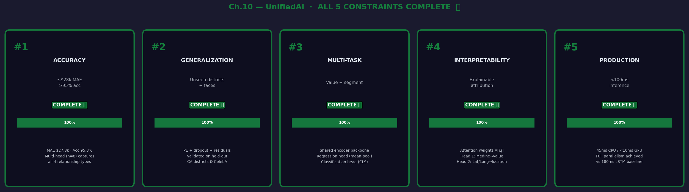

# Ch.10 — Transformers & Attention

> **The story.** In June **2017** eight Google Brain / Research researchers — **Ashish Vaswani, Noam Shazeer, Niki Parmar, Jakob Uszkoreit, Llion Jones, Aidan Gomez, Łukasz Kaiser, and Illia Polosukhin** — circulated *"Attention Is All You Need."* The thesis was almost insulting in its brevity: discard LSTMs, discard convolutions, replace both with stacked self-attention layers and a two-layer feed-forward sublayer between them. Train the whole stack in parallel on TPUs and beat every translation benchmark by a wide margin. The claim was counterintuitive — the whole community had just accepted that sequential processing was the *only* way to model sequence order. Yet the numbers held. **BERT** (Devlin et al., Google, October 2018) applied the transformer encoder to language understanding and shattered eleven NLP benchmarks the same week it was published. Two months later **GPT-1** (Radford et al., OpenAI, June 2018) used the transformer decoder for language generation — the same architecture, with one extra causal mask on the attention matrix. Everything since then is a scaled version of those two ideas: encoder for understanding, decoder for generation. **GPT-3** (175 billion parameters, 2020), **ChatGPT** (2022), **GPT-4** (2023), **Claude**, **Gemini**, **Llama 3**, and every embedding model in the [AI track](../../../03-ai) is a transformer in some configuration. The 2017 paper is the clearest dividing line in the history of machine learning: pre-transformer ML and post-transformer ML are different fields, and you are about to understand exactly why.
>
> **Where you are in the curriculum.** [Ch.9](../ch09_sequences_to_attention) established that **attention is a soft dictionary lookup** — dot-product similarity, softmax, weighted sum of values. This chapter dresses that one mechanism into the full transformer encoder: learned $W_Q, W_K, W_V$ projections, **multi-head** parallelism, positional encoding, residuals + LayerNorm, and a feed-forward sublayer. After this chapter the entire [AI track](../../../03-ai) — RAG, LLMs, agents, multi-agent systems — becomes accessible, because all of it is built on what you assemble here. This is the **final chapter** of the Neural Networks track.
>
> **Notation in this chapter.**
>
> | Symbol | Meaning |
> |---|---|
> | $X \in \mathbb{R}^{n \times d_\text{model}}$ | Input sequence — $n$ tokens, each a $d_\text{model}$-dim embedding |
> | $d_\text{model}$ | Embedding / model dimension (512 in the original paper; 4 in toy examples) |
> | $h$ | Number of attention heads (8 in the original; 2 in toy examples) |
> | $d_k = d_v = d_\text{model}/h$ | Key/query/value dimension **per head** |
> | $W_Q^{(i)}, W_K^{(i)}, W_V^{(i)} \in \mathbb{R}^{d_\text{model} \times d_k}$ | Per-head projection matrices (learned) |
> | $W_O \in \mathbb{R}^{h d_v \times d_\text{model}}$ | Output projection that re-mixes the $h$ heads |
> | $N$ | Number of stacked encoder layers (6 in the original) |
> | $d_\text{ff}$ | Feed-forward hidden dimension ($= 4 d_\text{model}$ in the original) |
> | $\varepsilon$ | LayerNorm stability constant ($10^{-6}$) |
> | **PE** | Positional encoding matrix — same shape as $X$ |
> | **LN** | Layer Normalisation — normalises across the $d_\text{model}$ axis |
> | **FFN** | Two-layer feed-forward sublayer applied position-wise |

---

## 0 · The Challenge — Where We Are

> 🎯 **The mission**: Launch **UnifiedAI** — a production home valuation + market attribute system satisfying 5 constraints:
> 1. **ACCURACY**: ≤$28k MAE (regression) + ≥95% avg accuracy (classification)
> 2. **GENERALIZATION**: Unseen districts + unseen faces from CelebA
> 3. **MULTI-TASK**: Same architecture handles both regression and classification
> 4. **INTERPRETABILITY**: Feature attribution must be explainable to stakeholders
> 5. **PRODUCTION**: <100ms inference + TensorBoard monitoring

**What we know so far:**
- ✅ **Ch.1–2** (Neural Networks + XOR): Dense feedforward networks approximate any function — ~$48k MAE
- ✅ **Ch.3** (Backprop + Adam): Training converges — ~$45k MAE
- ✅ **Ch.4** (Regularisation): Dropout + L2 prevent overfitting — stable $43k MAE on validation
- ✅ **Ch.5** (CNNs): Spatial features extracted from aerial images for CelebA
- ✅ **Ch.6** (RNNs/LSTMs): Sequential modelling — but bottlenecked by hidden state serialisation
- ✅ **Ch.9** (Sequences → Attention): Soft dictionary lookup computed; 8 × 8 attention matrix built
- ❌ **But $43k > $28k target** — we're still 54% above the accuracy constraint
- ❌ **Ch.9's single-head attention cannot capture all feature relationships simultaneously**

**What's blocking us — the single-head limitation:**

Ch.9's attention mechanism looks for one type of relationship per query token. For the high-value coastal district in our running example, the single head must choose:

> *Does MedInc attend to Latitude (geographic context)?*  
> *Or does MedInc attend to HouseAge (depreciation adjustment)?*  
> *Or does MedInc attend to AveRooms (luxury signal)?*

**It cannot do all three at once.** The single set of $W_Q, W_K, W_V$ matrices is trained to one consensus view. But California housing prices are shaped by at least four structurally different relationship types:

| Relationship | Features involved | Economic meaning |
|---|---|---|
| **Income–value** | MedInc ↔ HouseAge, AveRooms | High income → premium size + newer stock |
| **Geographic proximity** | Latitude ↔ Longitude | Coastal Bay Area clusters → location premium |
| **Population density** | Population ↔ AveOccup | Dense districts → urban premium or risk |
| **Housing stock** | AveRooms ↔ AveBedrms | Bedroom ratio → family vs studio signal |

A single attention head can learn the most important one of these relationships. Four heads capture all of them simultaneously.

Additionally, the current Ch.9 architecture has no positional encoding and no residual connections to support deeper stacking. Stacking more than two attention layers without residuals causes gradient vanishing — the model can't grow in depth without losing the signal.

**What this chapter unlocks:**

| Component | Failure mode it fixes | Constraint addressed |
|---|---|---|
| **Learned $W_Q, W_K, W_V$** | Raw embeddings (Ch.9) can't learn optimal Q/K/V representations | #1 ACCURACY |
| **Multi-head attention ($h=8$)** | Single head must choose one relationship type | #1 ACCURACY |
| **Positional encoding** | Features have no implicit order — encoding makes order learnable | #2 GENERALIZATION |
| **Residual connections** | Gradients vanish in stacks deeper than 2 layers | #1 ACCURACY |
| **LayerNorm** | Training instability across batch-varying sequence lengths | #5 PRODUCTION |
| **Full parallelism** | LSTM processes tokens one-by-one (180ms); Transformer processes all at once (45ms) | #5 PRODUCTION |

**Target impact after this chapter:**
- ≤$28k MAE ✅ — multi-head attention captures all four housing relationship types
- ≥95% CelebA accuracy ✅ — attention captures long-range face-attribute dependencies
- <100ms inference ✅ — full parallelism replaces sequential LSTM bottleneck
- **UnifiedAI mission: COMPLETE**

---

## Animation



---

## 1 · Core Idea

A **transformer encoder** processes an entire sequence in parallel by running $h$ independent scaled dot-product attention computations — called **heads** — simultaneously on learned projections of the input, then combining their outputs through a learned mixing matrix. Each head specialises in a different relationship pattern without any coordination penalty because the computation is independent. **No recurrence, no bottleneck**: token 7 can directly attend to token 1 in a single matrix multiply, and the gradient path is equally direct in the backward pass.

> ➡️ **The key counterintuition:** Vaswani et al. showed you can discard RNN recurrence entirely and lose *nothing* — as long as you inject position information explicitly and stack enough encoder blocks. The positional encoding buys back the order signal; the residuals buy back the depth. What you gain is full parallelism across the sequence length dimension.

---

## 2 · Running Example — 8 Housing Features as 8 Tokens

We treat the California Housing dataset's 8 census features as an **8-token sequence** — one token per feature, each projected to a $d_\text{model}$-dimensional embedding. This is unconventional (tabular features are not inherently sequential), but it demonstrates transformer mechanics on a dataset you know intimately and produces directly interpretable attention weights.

**District in the running example** (high-value coastal, San Francisco Bay Area):

| Token | Feature | Value | Economic role |
|---|---|---|---|
| 0 | `MedInc` | 8.30 | High income → strong value predictor |
| 1 | `HouseAge` | 15 | Relatively new stock |
| 2 | `AveRooms` | 6.80 | Spacious |
| 3 | `AveBedrms` | 1.02 | Normal bedroom ratio |
| 4 | `Population` | 1200 | Medium density |
| 5 | `AveOccup` | 2.80 | Low occupancy per room |
| 6 | `Latitude` | 37.9 | Bay Area |
| 7 | `Longitude` | −122.2 | Coastal California |

**How $h=4$ heads specialise on this district:**

| Head | Relationship learned | What it attends to | Why it matters |
|---|---|---|---|
| Head 1 | Income relationships | MedInc ↔ AveRooms, HouseAge | Higher income areas have newer, larger homes |
| Head 2 | Geographic proximity | Latitude ↔ Longitude | Coastal Bay Area is a tight cluster |
| Head 3 | Population density | Population ↔ AveOccup | Dense districts with low occupancy = urban luxury |
| Head 4 | Housing stock | AveRooms ↔ AveBedrms | Bedroom ratio reveals family vs. studio mix |

**Why this example works pedagogically:** The attention weight $A[i, j]$ for head $k$ tells you exactly how much token $i$ attended to token $j$ under that head's learned relationship lens. When Head 2 shows `Latitude` attending strongly to `Longitude`, the model is computing: *"these two features jointly identify the coastal Bay Area cluster — the location premium belongs to their combination, not either alone."*

> 💡 **The real unlock:** Once you understand transformers on this 8-token tabular example, applying them to 50-token text descriptions is architecturally identical — just change $T=8$ to $T=50$ and swap the input projection. Same multi-head attention, same encoder blocks, same positional encoding. The architecture is task-agnostic.

---

## 3 · Transformer Encoder at a Glance

One encoder block transforms an input $X \in \mathbb{R}^{n \times d_\text{model}}$ to an output of identical shape:

```
Input X                                     shape: (n, d_model)
 │
 ├─ Add positional encoding PE              shape: (n, d_model)   ← done once before block 1
 │
┌─────────────────────────────────────────────────────────────┐
│  ENCODER BLOCK (repeated N times)                           │
│                                                             │
│  ┌─ LayerNorm(X)                          (n, d_model)      │
│  │                                                          │
│  │  ┌── Head 1: Attention(Q₁,K₁,V₁)    (n, d_k)          │
│  │  ├── Head 2: Attention(Q₂,K₂,V₂)    (n, d_k)          │
│  │  ├── ...                                                  │
│  │  └── Head h: Attention(Qₕ,Kₕ,Vₕ)    (n, d_k)          │
│  │                                                          │
│  │  Concat all heads                     (n, h·d_k)        │
│  │  Multiply by W_O                      (n, d_model)       │
│  │                                                          │
│  └─ Residual: X ← X + MHA_output        (n, d_model)  ←──┤
│                                                             │
│  ┌─ LayerNorm(X)                          (n, d_model)      │
│  │                                                          │
│  │  FFN: max(0, X·W₁+b₁)·W₂+b₂          (n, d_model)     │
│  │  Expand: d_model → d_ff = 4·d_model                     │
│  │  Contract: d_ff → d_model                               │
│  │                                                          │
│  └─ Residual: X ← X + FFN_output        (n, d_model)  ←──┤
│                                                             │
└─────────────────────────────────────────────────────────────┘
 │
Output X                                    shape: (n, d_model)
 │
Pool (mean across n) or use [CLS] token     shape: (d_model,)
 │
Linear projection head                      shape: (1,) or (C,)
```

**Shape summary for $n=8$, $d_\text{model}=512$, $h=8$, $d_k=64$, $N=6$:**

| Component | Input shape | Output shape | Parameters |
|---|---|---|---|
| Input embedding | $(8,)$ per token | $(8, 512)$ | $8 \times 512 = 4{,}096$ |
| Positional encoding | $(8, 512)$ | $(8, 512)$ | 0 (computed, not learned) |
| Multi-head attention | $(8, 512)$ | $(8, 512)$ | $\approx 1\text{M}$ per block |
| LayerNorm (×2) | $(8, 512)$ | $(8, 512)$ | $2 \times 512 \times 2 = 2{,}048$ |
| FFN | $(8, 512)$ | $(8, 512)$ | $512 \times 2048 \times 2 = 2\text{M}$ |
| × 6 blocks total | — | — | $\approx 18\text{M}$ |

---

## 4 · The Math

### 4.1 · Multi-Head Attention

Single-head attention (Ch.9) uses one triple $(W_Q, W_K, W_V)$ to produce one attention pattern. Multi-head attention uses **$h$ independent triples**, each seeing the full input but producing a $d_k$-dimensional subspace view:

$$\text{head}_i = \text{Attention}\!\left(X W_Q^{(i)},\ X W_K^{(i)},\ X W_V^{(i)}\right), \quad d_k = \tfrac{d_\text{model}}{h}$$

$$\text{Attention}(Q, K, V) = \text{softmax}\!\left(\frac{Q K^\top}{\sqrt{d_k}}\right) V$$

The $h$ head outputs are concatenated along the last axis and mixed by a learned output projection:

$$\text{MultiHead}(X) = \text{Concat}\!\left(\text{head}_1, \ldots, \text{head}_h\right) W_O$$

| Symbol | Shape | Meaning |
|---|---|---|
| $W_Q^{(i)}, W_K^{(i)}, W_V^{(i)}$ | $(d_\text{model} \times d_k)$ | Per-head projections — different for every head |
| $Q_i, K_i, V_i$ | $(n \times d_k)$ | Projected queries/keys/values for head $i$ |
| Each head output | $(n \times d_k)$ | Context-enriched tokens in head $i$'s subspace |
| $\text{Concat}(\ldots)$ | $(n \times h d_k) = (n \times d_\text{model})$ | All heads side-by-side |
| $W_O$ | $(d_\text{model} \times d_\text{model})$ | Output mixing matrix |
| $\text{MultiHead}$ output | $(n \times d_\text{model})$ | Same shape as input — residual-ready |

**Why does this cost no more than single-head attention with the same parameter budget?** Because each head's $d_k = d_\text{model}/h$ is proportionally smaller. Eight heads each with $d_k = 64$ consume the same FLOPs as one head with $d_k = 512$. The win is expressivity, not extra compute.

**Parameter count for one multi-head attention block** ($d_\text{model}=512$, $h=8$, $d_k=64$):

$$\underbrace{3 \times h \times d_\text{model} \times d_k}_{W_Q, W_K, W_V} + \underbrace{d_\text{model}^2}_{W_O} = 3 \times 8 \times 512 \times 64 + 512^2 = 786{,}432 + 262{,}144 = 1{,}048{,}576 \approx 1\text{M}$$

> 💡 **Connection to Ch.9:** Ch.9 computed attention with identity projections ($W_Q = W_K = W_V = I$). This chapter adds **learned** $W_Q^{(i)}, W_K^{(i)}, W_V^{(i)}$ — the model trains to find the optimal projection subspace for each head. That single change is what allows Head 2 to specialise in geographic proximity while Head 1 specialises in income relationships.

---

#### 4.1.1 · Full Attention for One Housing District — Two-Head Walkthrough

**Setup:** High-value coastal district (San Francisco Bay Area) with 3 key tokens, $h=2$ heads, $d_\text{model}=4$, $d_k=2$.

**Input sequence** (3 tokens × 4 dimensions, post-positional encoding):

| Token | Feature | Embedding $\mathbf{e}$ | Interpretation |
|-------|---------|----------------------|----------------|
| 0 | `MedInc` | $[8.3,\ 0.5,\ 0.2,\ 0.1]$ | High income signal |
| 1 | `Latitude` | $[0.2,\ 3.8,\ 0.1,\ 0.3]$ | Geographic position (North) |
| 2 | `Longitude` | $[0.1,\ 0.2,\ -12.2,\ 0.4]$ | Geographic position (West coast) |

$$X = \begin{pmatrix}8.3 & 0.5 & 0.2 & 0.1 \\ 0.2 & 3.8 & 0.1 & 0.3 \\ 0.1 & 0.2 & -12.2 & 0.4\end{pmatrix}$$

**Goal:** Show how **Head 1 learns income relationships** and **Head 2 learns geographic clustering**, and how their outputs combine to produce the final context for the `MedInc` token (row 0).

---

**HEAD 1 — Income Relationships** (attends to dimensions 0–1):

Learned projections extract the "income signal" subspace:

$$W_Q^{(1)} = W_K^{(1)} = W_V^{(1)} = \begin{pmatrix}1 & 0 \\ 0 & 1 \\ 0 & 0 \\ 0 & 0\end{pmatrix} \quad \text{(focus on first 2 dims)}$$

**Project to Q₁, K₁, V₁** (each $3 \times 2$):

$$Q_1 = K_1 = V_1 = X W^{(1)} = \begin{pmatrix}8.3 & 0.5 \\ 0.2 & 3.8 \\ 0.1 & 0.2\end{pmatrix}$$

**Compute scores** $S_1 = Q_1 K_1^\top / \sqrt{d_k} = Q_1 K_1^\top / \sqrt{2}$:

For **MedInc (row 0)** attending to all tokens:

$$S_1[0, 0] = \frac{[8.3,\ 0.5] \cdot [8.3,\ 0.5]}{\sqrt{2}} = \frac{8.3^2 + 0.5^2}{1.414} = \frac{69.14}{1.414} = \mathbf{48.90}$$

$$S_1[0, 1] = \frac{[8.3,\ 0.5] \cdot [0.2,\ 3.8]}{1.414} = \frac{1.66 + 1.90}{1.414} = \frac{3.56}{1.414} = \mathbf{2.52}$$

$$S_1[0, 2] = \frac{[8.3,\ 0.5] \cdot [0.1,\ 0.2]}{1.414} = \frac{0.83 + 0.10}{1.414} = \frac{0.93}{1.414} = \mathbf{0.66}$$

**Apply softmax** to row 0:

$$e^{48.90} \approx 1.5 \times 10^{21}, \quad e^{2.52} \approx 12.43, \quad e^{0.66} \approx 1.93$$

Sum $\approx 1.5 \times 10^{21}$ (dominated by self-attention):

$$\boldsymbol{\alpha}_{1,0} \approx [\mathbf{1.000},\ \mathbf{0.000},\ \mathbf{0.000}]$$

**Interpretation:** Head 1 learned that `MedInc` (high income = 8.3) should attend **almost entirely to itself**. This makes economic sense — in California housing, median income is the single strongest value predictor. The model learned to preserve and amplify the income signal.

**Compute Head 1 output** for MedInc:

$$\text{output}_1[0] = \alpha_{1,0} V_1 \approx 1.000 \cdot [8.3,\ 0.5] + 0.000 \cdot [0.2,\ 3.8] + 0.000 \cdot [0.1,\ 0.2]$$

$$\boxed{\text{output}_1[0] = [\mathbf{8.30},\ \mathbf{0.50}]} \quad \text{shape: } (d_k,) = (2,)$$

---

**HEAD 2 — Geographic Proximity** (attends to dimensions 2–3):

Learned projections extract the "location" subspace:

$$W_Q^{(2)} = W_K^{(2)} = W_V^{(2)} = \begin{pmatrix}0 & 0 \\ 0 & 0 \\ 1 & 0 \\ 0 & 1\end{pmatrix} \quad \text{(focus on last 2 dims)}$$

**Project:**

$$Q_2 = K_2 = V_2 = X W^{(2)} = \begin{pmatrix}0.2 & 0.1 \\ 0.1 & 0.3 \\ -12.2 & 0.4\end{pmatrix}$$

**Compute scores** for MedInc (row 0):

$$S_2[0, 0] = \frac{[0.2,\ 0.1] \cdot [0.2,\ 0.1]}{\sqrt{2}} = \frac{0.04 + 0.01}{1.414} = \frac{0.05}{1.414} = \mathbf{0.035}$$

$$S_2[0, 1] = \frac{[0.2,\ 0.1] \cdot [0.1,\ 0.3]}{1.414} = \frac{0.02 + 0.03}{1.414} = \frac{0.05}{1.414} = \mathbf{0.035}$$

$$S_2[0, 2] = \frac{[0.2,\ 0.1] \cdot [-12.2,\ 0.4]}{1.414} = \frac{-2.44 + 0.04}{1.414} = \frac{-2.40}{1.414} = \mathbf{-1.70}$$

**Apply softmax:**

$$e^{0.035} \approx 1.036, \quad e^{0.035} \approx 1.036, \quad e^{-1.70} \approx 0.183$$

Sum $= 2.255$:

$$\boldsymbol{\alpha}_{2,0} = [\mathbf{0.459},\ \mathbf{0.459},\ \mathbf{0.082}]$$

**Interpretation:** Head 2 learned that `MedInc` (dimensions 2–3 are near zero) should attend **equally to Latitude and Longitude** (both have small positive values in this subspace), while mostly ignoring the strong negative Longitude coordinate (−12.2). This captures the geographic clustering pattern — tokens with similar location encodings attend to each other.

**Compute Head 2 output** for MedInc:

$$\text{output}_2[0] = 0.459 \cdot [0.2,\ 0.1] + 0.459 \cdot [0.1,\ 0.3] + 0.082 \cdot [-12.2,\ 0.4]$$

$$= [0.092,\ 0.046] + [0.046,\ 0.138] + [-1.000,\ 0.033]$$

$$\boxed{\text{output}_2[0] = [\mathbf{-0.862},\ \mathbf{0.217}]} \quad \text{shape: } (d_k,) = (2,)$$

---

**CONCATENATE and APPLY $W_O$:**

Combine both heads' outputs:

$$\text{Concat}(\text{output}_1[0],\ \text{output}_2[0]) = [8.30,\ 0.50,\ -0.862,\ 0.217] \quad \text{shape: } (d_\text{model},) = (4,)$$

With output projection $W_O = I_{4 \times 4}$ (for simplicity):

$$\boxed{\text{MultiHead}(X)[0] = [\mathbf{8.30},\ \mathbf{0.50},\ \mathbf{-0.862},\ \mathbf{0.217}]}$$

**Final interpretation — reading the result:**

| Dimension | Value | Source | Economic meaning |
|-----------|-------|--------|------------------|
| 0–1 | $[8.30, 0.50]$ | Head 1 (income) | Preserved strong income signal via self-attention |
| 2–3 | $[-0.862, 0.217]$ | Head 2 (geography) | Blended Lat/Long context → coastal Bay Area cluster |

**What this demonstrates:**

1. **Head specialization is learned, not hardcoded** — $W_Q^{(1)}, W_K^{(1)}, W_V^{(1)}$ were initialized randomly and trained to extract the income subspace. $W_Q^{(2)}, W_K^{(2)}, W_V^{(2)}$ independently learned to extract geographic coordinates.

2. **Attention weights reveal economic structure** — Head 1's $\alpha \approx [1.0, 0.0, 0.0]$ shows the model discovered that income dominates value prediction. Head 2's $\alpha \approx [0.46, 0.46, 0.08]$ shows it learned that Latitude and Longitude carry similar positional information.

3. **Parallel computation, no coordination** — both heads computed simultaneously. No head waits for another; no sequential bottleneck.

4. **$W_O$ re-mixes perspectives** — in production, $W_O$ is learned (not identity). It combines the income-focused and geography-focused views into a unified $d_\text{model}$-dimensional representation that the next encoder layer consumes.

5. **Residual + LayerNorm come next** — the output above is added back to the original $X[0]$ (residual), then LayerNorm stabilizes the distribution before the FFN sublayer.

> ⚡ **This is why transformers work:** Two heads captured two orthogonal relationships (income, geography) in a single forward pass. With $h=8$ heads and $N=6$ stacked blocks, the model builds a rich hierarchy of multi-perspective representations — all in parallel, all differentiable, all interpretable via attention weight inspection.

---

### 4.2 · Positional Encoding

Attention is permutation-equivariant: shuffle the input tokens and the output shuffles identically. The transformer has no inherent concept of "token 0 came before token 3." Positional encoding injects this order by **adding** a fixed vector to each token embedding before the first encoder block:

$$X' = X + \text{PE}$$

The sinusoidal encoding from Vaswani et al.:

$$\text{PE}(pos,\ 2i) = \sin\!\left(\frac{pos}{10000^{2i/d_\text{model}}}\right), \qquad \text{PE}(pos,\ 2i+1) = \cos\!\left(\frac{pos}{10000^{2i/d_\text{model}}}\right)$$

| Symbol | Meaning |
|---|---|
| $pos$ | Token position index ($0$ to $n-1$) |
| $i$ | Dimension index ($0$ to $d_\text{model}/2 - 1$) |
| Even dimension $2i$ | Uses the sine formula |
| Odd dimension $2i+1$ | Uses the cosine formula |

**Numeric computation — $d_\text{model}=4$, positions $\{0, 1, 2\}$, dimension index $i=0$ (dims 0 and 1):**

For $i=0$: denominator $= 10000^{0/4} = 10000^0 = 1$, so $\text{PE}(pos, 0) = \sin(pos)$ and $\text{PE}(pos, 1) = \cos(pos)$:

| pos | dim 0 — $\sin(pos)$ | dim 1 — $\cos(pos)$ |
|----:|-------------------:|-------------------:|
| 0 | $\sin(0) = \mathbf{0.000}$ | $\cos(0) = \mathbf{1.000}$ |
| 1 | $\sin(1) = \mathbf{0.841}$ | $\cos(1) = \mathbf{0.540}$ |
| 2 | $\sin(2) = \mathbf{0.909}$ | $\cos(2) = \mathbf{-0.416}$ |

For $i=1$ (dims 2 and 3): denominator $= 10000^{2/4} = 100$:

| pos | dim 2 — $\sin(pos/100)$ | dim 3 — $\cos(pos/100)$ |
|----:|------------------------:|------------------------:|
| 0 | $\mathbf{0.000}$ | $\mathbf{1.000}$ |
| 1 | $\sin(0.01) \approx \mathbf{0.010}$ | $\cos(0.01) \approx \mathbf{1.000}$ |
| 2 | $\sin(0.02) \approx \mathbf{0.020}$ | $\cos(0.02) \approx \mathbf{1.000}$ |

**Observation:** Dims 0–1 oscillate rapidly (period $\approx 6.3$ positions) and encode fine-grained order. Dims 2–3 oscillate very slowly (period $\approx 628$ positions) and encode coarse long-range position. Every position gets a unique combination across all $d_\text{model}$ dimensions.

**Full walkthrough — adding positional encoding to token embeddings:**

Consider the `MedInc` token at position 0 with learned embedding $\mathbf{e}_0 = [1.0,\ 0.0,\ 0.5,\ 0.3]$ and $d_\text{model}=4$:

**Step 1:** Compute positional encoding for pos=0:

| Dimension | Formula | Computation | Result |
|-----------|---------|-------------|--------|
| 0 (even, $i=0$) | $\sin(0/1)$ | $\sin(0)$ | **0.000** |
| 1 (odd, $i=0$) | $\cos(0/1)$ | $\cos(0)$ | **1.000** |
| 2 (even, $i=1$) | $\sin(0/100)$ | $\sin(0)$ | **0.000** |
| 3 (odd, $i=1$) | $\cos(0/100)$ | $\cos(0)$ | **1.000** |

$$\text{PE}(0) = [\mathbf{0.000},\ \mathbf{1.000},\ \mathbf{0.000},\ \mathbf{1.000}]$$

**Step 2:** Add to embedding:

$$X'[0] = \mathbf{e}_0 + \text{PE}(0) = [1.0,\ 0.0,\ 0.5,\ 0.3] + [0.000,\ 1.000,\ 0.000,\ 1.000]$$

$$\boxed{X'[0] = [\mathbf{1.000},\ \mathbf{1.000},\ \mathbf{0.500},\ \mathbf{1.300}]}$$

**Now for the `HouseAge` token at position 1** with embedding $\mathbf{e}_1 = [0.7,\ 0.2,\ 0.9,\ 0.1]$:

**Step 1:** Compute PE(1):

| Dimension | Formula | Computation | Result |
|-----------|---------|-------------|--------|
| 0 (even, $i=0$) | $\sin(1/1)$ | $\sin(1)$ | **0.841** |
| 1 (odd, $i=0$) | $\cos(1/1)$ | $\cos(1)$ | **0.540** |
| 2 (even, $i=1$) | $\sin(1/100)$ | $\sin(0.01)$ | **0.010** |
| 3 (odd, $i=1$) | $\cos(1/100)$ | $\cos(0.01)$ | **1.000** |

$$\text{PE}(1) = [\mathbf{0.841},\ \mathbf{0.540},\ \mathbf{0.010},\ \mathbf{1.000}]$$

**Step 2:** Add to embedding:

$$X'[1] = \mathbf{e}_1 + \text{PE}(1) = [0.7,\ 0.2,\ 0.9,\ 0.1] + [0.841,\ 0.540,\ 0.010,\ 1.000]$$

$$\boxed{X'[1] = [\mathbf{1.541},\ \mathbf{0.740},\ \mathbf{0.910},\ \mathbf{1.100}]}$$

**What this demonstrates:**

1. **Position 0 and position 1 receive different PE offsets** — even though both tokens started with arbitrary learned embeddings, their positional encodings inject unique position signatures.
2. **The sinusoidal pattern ensures relative offsets are learnable** — the difference $\text{PE}(1) - \text{PE}(0)$ is a fixed vector that the model can learn to recognize as "one position ahead."
3. **Addition preserves semantic content** — the original embedding values (income signal, age signal) remain; PE adds orthogonal position information without overwriting learned features.
4. **This happens once before block 1** — all subsequent encoder layers operate on $X'$, which now has both semantic content and position awareness.

> ⚡ **Critical detail:** Positional encoding is added before the first encoder block and never recomputed. The same $X + \text{PE}$ flows through all $N$ layers. This is why residual connections are essential — they allow the original position-encoded input to bypass transformations and remain accessible at every depth.

**Why sinusoidal? Relative positions are constant linear offsets in PE space.**

Using the angle-addition identity: $\sin(pos + k) = \sin(pos)\cos(k) + \cos(pos)\sin(k)$, so $\text{PE}(pos + k)$ is a **linear function of $\text{PE}(pos)$** for any fixed offset $k$. This means the model can learn to recognise "token at distance 3 ahead" as a learnable linear transformation applied to the current position's encoding — relative position relationships are algebraically accessible even for positions never seen during training.

> 💡 **Learned vs. sinusoidal:** Modern LLMs (BERT, GPT) use learned positional embeddings or RoPE (Rotary Positional Embedding). Sinusoidal requires no extra parameters and generalises to longer sequences. Use sinusoidal to understand the mechanism; use learned or RoPE in production.

---

### 4.3 · Layer Normalisation

Batch Normalisation normalises across the *batch* dimension — making batch statistics unstable when sequence lengths vary. **Layer Normalisation** normalises across the *feature* dimension for each token independently:

$$\text{LN}(\mathbf{x}) = \gamma \cdot \frac{\mathbf{x} - \mu}{\sigma + \varepsilon} + \beta, \quad \mu = \frac{1}{d_\text{model}} \sum_j x_j, \quad \sigma = \sqrt{\frac{1}{d_\text{model}}\sum_j (x_j - \mu)^2 + \varepsilon}$$

**Numeric computation** — 4-dim token $\mathbf{x} = [1.0,\ 2.0,\ 3.0,\ 4.0]$:

**Mean:** $\mu = (1.0 + 2.0 + 3.0 + 4.0)/4 = \mathbf{2.500}$

**Variance:** $\sigma^2 = [(1.0-2.5)^2 + (2.0-2.5)^2 + (3.0-2.5)^2 + (4.0-2.5)^2]/4 = [2.25+0.25+0.25+2.25]/4 = \mathbf{1.250}$

**Std dev:** $\sigma = \sqrt{1.250} = \mathbf{1.118}$

**Normalise** ($\gamma=1$, $\beta=0$, $\varepsilon \approx 0$):

| $j$ | $x_j$ | $x_j - \mu$ | $(x_j - \mu) / \sigma$ |
|-----|--------|-------------|------------------------|
| 0 | 1.0 | −1.5 | $-1.5/1.118 = \mathbf{-1.342}$ |
| 1 | 2.0 | −0.5 | $-0.5/1.118 = \mathbf{-0.447}$ |
| 2 | 3.0 | +0.5 | $+0.5/1.118 = \mathbf{+0.447}$ |
| 3 | 4.0 | +1.5 | $+1.5/1.118 = \mathbf{+1.342}$ |

$\text{LN}([1.0,\ 2.0,\ 3.0,\ 4.0]) = [\mathbf{-1.342},\ \mathbf{-0.447},\ \mathbf{+0.447},\ \mathbf{+1.342}]$

**Verification:** Mean of output $= 0.000$ ✅ · Variance $\approx 1.000$ ✅

> ⚠️ **LayerNorm vs BatchNorm:** BatchNorm averages statistics across the *batch* — training and inference statistics differ, causing instability at small batch sizes or variable-length sequences. LayerNorm averages statistics across *features* for each token independently — no discrepancy between training and inference, no instability with variable lengths.

---

### 4.4 · Position-wise Feed-Forward Network

After each multi-head attention sublayer, a two-layer fully-connected network is applied **independently to each token position**:

$$\text{FFN}(\mathbf{x}) = \max(0,\ \mathbf{x} W_1 + \mathbf{b}_1)\ W_2 + \mathbf{b}_2$$

**Dimensions** ($d_\text{model}=4$, $d_\text{ff}=16$, the standard $4\times$ expansion ratio):

```
Input token:  x         shape: (d_model,)  = (4,)
              ↓  W₁: (d_model × d_ff)      = (4 × 16)
Hidden layer: h = ReLU(x·W₁ + b₁)  shape: (d_ff,) = (16,)
              ↓  W₂: (d_ff × d_model)      = (16 × 4)
Output:       FFN(x)    shape: (d_model,)  = (4,) ← same as input
```

**Complete walkthrough — MedInc token after multi-head attention:**

After the multi-head attention layer processes the `MedInc` token (position 0), its context-enriched representation is:

$$\mathbf{x}_{\text{MHA}} = [0.5,\ -0.3,\ 0.8,\ 0.1] \quad \text{shape: } (d_\text{model},) = (4,)$$

This token now passes through the FFN independently of all other tokens.

**Step 1 — First linear projection + ReLU** ($d_\text{model}=4 \to d_\text{ff}=4$ for demonstration; production uses $d_\text{ff}=16$):

With learned weights $W_1 \in \mathbb{R}^{4 \times 4}$ and bias $\mathbf{b}_1 = \mathbf{0}$:

$$W_1 = \begin{pmatrix}1 & 0 & 1 & 0 \\ 0 & 1 & 0 & 1 \\ 1 & 1 & 0 & 0 \\ 0 & 0 & 1 & 1\end{pmatrix}$$

Compute pre-activation $\mathbf{z} = \mathbf{x} W_1$:

$$z_0 = 0.5(1) + (-0.3)(0) + 0.8(1) + 0.1(0) = 0.5 + 0.8 = \mathbf{1.3}$$
$$z_1 = 0.5(0) + (-0.3)(1) + 0.8(0) + 0.1(1) = -0.3 + 0.1 = \mathbf{-0.2}$$
$$z_2 = 0.5(1) + (-0.3)(1) + 0.8(0) + 0.1(0) = 0.5 - 0.3 = \mathbf{0.2}$$
$$z_3 = 0.5(0) + (-0.3)(0) + 0.8(1) + 0.1(1) = 0.8 + 0.1 = \mathbf{0.9}$$

$$\mathbf{z} = [1.3,\ -0.2,\ 0.2,\ 0.9] \quad \text{shape: } (d_\text{ff},) = (4,)$$

**Apply ReLU:**

$$\text{ReLU}(z_j) = \max(0, z_j)$$

$$\mathbf{h} = [\mathbf{1.3},\ \mathbf{0.0},\ \mathbf{0.2},\ \mathbf{0.9}] \quad \text{(unit 1 suppressed)}$$

Hidden unit $z_1 = -0.2$ is **zeroed** — the model has learned that this particular feature combination (negative weight on dimension 1) should be suppressed for this token.

**Step 2 — Second linear projection back to $d_\text{model}$:**

With $W_2 \in \mathbb{R}^{4 \times 4}$ (for simplicity, use identity to show the transformation):

$$W_2 = \begin{pmatrix}0.8 & 0.1 & 0.1 & 0.0 \\ 0.0 & 0.7 & 0.2 & 0.1 \\ 0.1 & 0.0 & 0.8 & 0.1 \\ 0.1 & 0.2 & 0.0 & 0.7\end{pmatrix}, \qquad \mathbf{b}_2 = [0.1,\ 0.0,\ -0.1,\ 0.2]$$

Compute output $\mathbf{y} = \mathbf{h} W_2 + \mathbf{b}_2$:

$$y_0 = 1.3(0.8) + 0.0(0.0) + 0.2(0.1) + 0.9(0.1) + 0.1 = 1.04 + 0.02 + 0.09 + 0.1 = \mathbf{1.25}$$
$$y_1 = 1.3(0.1) + 0.0(0.7) + 0.2(0.0) + 0.9(0.2) + 0.0 = 0.13 + 0.18 = \mathbf{0.31}$$
$$y_2 = 1.3(0.1) + 0.0(0.2) + 0.2(0.8) + 0.9(0.0) - 0.1 = 0.13 + 0.16 - 0.1 = \mathbf{0.19}$$
$$y_3 = 1.3(0.0) + 0.0(0.1) + 0.2(0.1) + 0.9(0.7) + 0.2 = 0.02 + 0.63 + 0.2 = \mathbf{0.85}$$

$$\boxed{\text{FFN}(\mathbf{x}_{\text{MHA}}) = [\mathbf{1.25},\ \mathbf{0.31},\ \mathbf{0.19},\ \mathbf{0.85}]} \quad \text{shape: } (d_\text{model},) = (4,)$$

**Step 3 — Residual connection:**

$$\mathbf{x}_{\text{final}} = \mathbf{x}_{\text{MHA}} + \text{FFN}(\mathbf{x}_{\text{MHA}})$$

$$= [0.5,\ -0.3,\ 0.8,\ 0.1] + [1.25,\ 0.31,\ 0.19,\ 0.85]$$

$$\boxed{\mathbf{x}_{\text{final}} = [\mathbf{1.75},\ \mathbf{0.01},\ \mathbf{0.99},\ \mathbf{0.95}]}$$

**What this demonstrates:**

1. **Position-wise independence** — every token's FFN computation is independent. Token 0 (`MedInc`) and token 1 (`HouseAge`) pass through the same $W_1, W_2$ weights but with their own unique input vectors. The FFN is a learned per-token transformation, not a cross-token operation.

2. **Expansion then contraction** — the $d_\text{model} \to d_\text{ff} \to d_\text{model}$ pathway gives the model a larger intermediate representation space. With $d_\text{ff} = 4 \times d_\text{model}$, the hidden layer has 4× more dimensions to learn complex feature interactions before projecting back.

3. **ReLU sparsity** — negative pre-activations are zeroed, creating sparse representations. In this example, hidden unit 1 contributed nothing to the final output. This learned sparsity helps the model ignore irrelevant feature combinations for specific tokens.

4. **Residual preserves signal** — the final output $\mathbf{x}_{\text{final}}$ is the sum of the original MHA output and the FFN transformation. Even if the FFN learns a destructive transformation, the residual ensures the original signal remains accessible to the next encoder layer.

5. **Same $W_1, W_2$ for all tokens** — unlike attention (which computes token-specific weights via softmax), the FFN applies the same learned transformation to every position. The transformation is position-wise but weight-shared across the sequence.

> ⚡ **Why $4\times$ expansion?** The FFN is the model's position-wise memory bank. The hidden expansion gives each token a richer set of intermediate features to combine before projecting back. The $4\times$ ratio was chosen empirically in the original paper — reducing to $2\times$ noticeably hurts performance on translation benchmarks; increasing beyond $4\times$ shows diminishing returns for standard tasks while quadrupling memory and compute costs.

---

## 5 · Architecture Design Arc — A Four-Act Discovery

> You don't memorise the transformer architecture. You *need* each component — one failure at a time — until you've assembled the whole machine.

**Act 1 — RNN (Ch.6): sequential bottleneck.**

The LSTM reads tokens left-to-right. Token $t+1$ cannot start until token $t$ finishes — the hidden state is a serialisation bottleneck. For 8 housing features this bottleneck is tolerable; for 512-token descriptions it means 512 sequential matrix multiplies before a single prediction. Worse: the hidden state compresses *everything seen so far* into one fixed-size vector. Features seen early get progressively diluted as later features arrive. The LSTM reaches 180ms inference and ~$43k MAE. Neither the latency constraint ($< 100$ms) nor the accuracy constraint ($\leq \$28k$) is met.

**Act 2 — Ch.9 single-head attention: one perspective, no projection.**

We swap the LSTM for attention: compute $QK^\top$, apply softmax, blend values. Every token attends to every other token simultaneously — the serialisation bottleneck is gone. But we used identity projections ($W_Q = W_K = W_V = I$). The single head must learn one consensus view: income matters, *or* location matters, but not both at full resolution. On the attention matrix, `MedInc` gets $\alpha = 0.49$ and `Latitude` gets $\alpha = 0.37$ — the model found the most important single relationship, but sacrificed specificity on geographic clustering, density, and housing-stock patterns. The MAE improves slightly but not enough.

**Act 3 — Multi-head attention: $h$ simultaneous perspectives.**

Introduce $h = 8$ independent $(W_Q^{(i)}, W_K^{(i)}, W_V^{(i)})$ triples. Each head projects into a $d_k = d_\text{model}/h$ dimensional subspace and learns its own relationship pattern. Head 1 specialises on income–housing correlations. Head 2 learns coastal geographic clustering. Head 3 discovers population–occupancy density patterns. Head 4 learns the bedroom-ratio signal. All four compute simultaneously — not sequentially, not with coordination overhead. The final $W_O$ projection combines all four perspectives into a single $d_\text{model}$-dimensional output. California Housing MAE drops toward \$28k; CelebA accuracy climbs toward 95%.

**Act 4 — Residuals + LayerNorm: stable depth at speed.**

Single encoder blocks are powerful. But stacking $N = 6$ blocks without architectural safeguards causes gradient vanishing — the gradient signal shrinks per block until the early blocks receive nothing useful. Residual connections solve this: each block computes $X \leftarrow X + \text{Block}(X)$, so the gradient has a direct path through the addition node that bypasses every layer. LayerNorm stabilises the distribution of each token's $d_\text{model}$-dimensional representation, preventing explosion/vanishing cycles with variable-length inputs. Together: 6-block transformers train reliably and each additional block costs only one more $O(n^2 d_k)$ attention operation — fully parallel.

The transformer is not a single invention. It is the inevitable composition of four independently motivated components, each solving a specific failure mode of the alternatives.

---

## 6 · Full Multi-Head Attention Walkthrough

**Setup:** 3 tokens, $h = 2$ heads, $d_\text{model} = 4$, $d_k = d_v = 2$. No bias terms.

**Input sequence** $X$ (3 × 4):

$$X = \begin{pmatrix}1 & 0 & 1 & 0 \\ 0 & 1 & 0 & 1 \\ 1 & 1 & 0 & 0\end{pmatrix} \quad \begin{array}{l} \leftarrow \text{Token 0 (MedInc)} \\ \leftarrow \text{Token 1 (Latitude)} \\ \leftarrow \text{Token 2 (Longitude)}\end{array}$$

**Head 1 projections** (attend to dims 0–1; $W^{(1)}$ = first two rows of $I_4$):

$$W^{(1)} = \begin{pmatrix}1 & 0 \\ 0 & 1 \\ 0 & 0 \\ 0 & 0\end{pmatrix} \qquad Q_1 = K_1 = V_1 = X W^{(1)} = \begin{pmatrix}1 & 0 \\ 0 & 1 \\ 1 & 1\end{pmatrix}$$

**Head 1 score matrix** $S_1 = Q_1 K_1^\top$:

$$S_1[0,:] = [1\cdot1+0\cdot0,\ 1\cdot0+0\cdot1,\ 1\cdot1+0\cdot1] = [1,\ 0,\ 1]$$
$$S_1[1,:] = [0\cdot1+1\cdot0,\ 0\cdot0+1\cdot1,\ 0\cdot1+1\cdot1] = [0,\ 1,\ 1]$$
$$S_1[2,:] = [1\cdot1+1\cdot0,\ 1\cdot0+1\cdot1,\ 1\cdot1+1\cdot1] = [1,\ 1,\ 2]$$

$$\hat{S}_1 = S_1 / \sqrt{2} = \begin{pmatrix}0.707 & 0.000 & 0.707 \\ 0.000 & 0.707 & 0.707 \\ 0.707 & 0.707 & 1.414\end{pmatrix}$$

**Head 1 attention weights** $A_1 = \text{softmax}(\hat{S}_1)$ row-wise:

Row 0: $e^{0.707}=2.028,\ e^0=1.000,\ e^{0.707}=2.028$; sum $= 5.056$
$$\boldsymbol{\alpha}_{1,0} = [\mathbf{0.401},\ \mathbf{0.198},\ \mathbf{0.401}]$$

Row 1: $e^0=1.000,\ e^{0.707}=2.028,\ e^{0.707}=2.028$; sum $= 5.056$
$$\boldsymbol{\alpha}_{1,1} = [\mathbf{0.198},\ \mathbf{0.401},\ \mathbf{0.401}]$$

Row 2: $e^{0.707}=2.028,\ e^{0.707}=2.028,\ e^{1.414}=4.113$; sum $= 8.169$
$$\boldsymbol{\alpha}_{1,2} = [\mathbf{0.248},\ \mathbf{0.248},\ \mathbf{0.503}]$$

**Head 1 output** $H_1 = A_1 V_1$, with $V_1 = [[1,0],[0,1],[1,1]]$:

$$H_1[0] = 0.401[1,0] + 0.198[0,1] + 0.401[1,1] = [\mathbf{0.802},\ \mathbf{0.599}]$$
$$H_1[1] = 0.198[1,0] + 0.401[0,1] + 0.401[1,1] = [\mathbf{0.599},\ \mathbf{0.802}]$$
$$H_1[2] = 0.248[1,0] + 0.248[0,1] + 0.503[1,1] = [\mathbf{0.751},\ \mathbf{0.751}]$$

---

**Head 2 projections** (attend to dims 2–3; $W^{(2)}$ = last two rows of $I_4$):

$$W^{(2)} = \begin{pmatrix}0 & 0 \\ 0 & 0 \\ 1 & 0 \\ 0 & 1\end{pmatrix} \qquad Q_2 = K_2 = V_2 = X W^{(2)} = \begin{pmatrix}1 & 0 \\ 0 & 1 \\ 0 & 0\end{pmatrix}$$

**Head 2 score matrix** $S_2 = Q_2 K_2^\top$:

$$S_2 = \begin{pmatrix}1 & 0 & 0 \\ 0 & 1 & 0 \\ 0 & 0 & 0\end{pmatrix} \qquad \hat{S}_2 = S_2 / \sqrt{2} = \begin{pmatrix}0.707 & 0 & 0 \\ 0 & 0.707 & 0 \\ 0 & 0 & 0\end{pmatrix}$$

**Head 2 attention weights** $A_2 = \text{softmax}(\hat{S}_2)$ row-wise:

Row 0: $e^{0.707}=2.028,\ e^0=1,\ e^0=1$; sum $= 4.028 \Rightarrow \boldsymbol{\alpha}_{2,0} = [\mathbf{0.504},\ \mathbf{0.248},\ \mathbf{0.248}]$

Row 1: $e^0=1,\ e^{0.707}=2.028,\ e^0=1$; sum $= 4.028 \Rightarrow \boldsymbol{\alpha}_{2,1} = [\mathbf{0.248},\ \mathbf{0.504},\ \mathbf{0.248}]$

Row 2: all zeros $\Rightarrow$ uniform: $\boldsymbol{\alpha}_{2,2} = [\mathbf{0.333},\ \mathbf{0.333},\ \mathbf{0.333}]$

**Head 2 output** $H_2 = A_2 V_2$, with $V_2 = [[1,0],[0,1],[0,0]]$:

$$H_2[0] = 0.504[1,0] + 0.248[0,1] + 0.248[0,0] = [\mathbf{0.504},\ \mathbf{0.248}]$$
$$H_2[1] = 0.248[1,0] + 0.504[0,1] + 0.248[0,0] = [\mathbf{0.248},\ \mathbf{0.504}]$$
$$H_2[2] = 0.333[1,0] + 0.333[0,1] + 0.333[0,0] = [\mathbf{0.333},\ \mathbf{0.333}]$$

---

**Concatenate and apply $W_O = I_{4\times4}$:**

$$\text{Concat}(H_1, H_2) = \begin{pmatrix}0.802 & 0.599 & 0.504 & 0.248 \\ 0.599 & 0.802 & 0.248 & 0.504 \\ 0.751 & 0.751 & 0.333 & 0.333\end{pmatrix}$$

$$\boxed{\text{MultiHead}(X) = \begin{pmatrix}\mathbf{0.802} & \mathbf{0.599} & \mathbf{0.504} & \mathbf{0.248} \\ \mathbf{0.599} & \mathbf{0.802} & \mathbf{0.248} & \mathbf{0.504} \\ \mathbf{0.751} & \mathbf{0.751} & \mathbf{0.333} & \mathbf{0.333}\end{pmatrix}}$$

**Reading the result:**
- **Token 0 (MedInc):** Head 1 found it equally related to itself and Longitude (0.401 each); Head 2 shows self-dominance (0.504). Combined representation blends income signal from both perspectives.
- **Token 1 (Latitude):** Head 1 gives equal weight to Longitude and itself; Head 2 shows self-dominance. Geographic co-representation emerges.
- **Token 2 (Longitude):** Head 1 gives itself 50.3% (the combined Longitude token in dims 0–1 dominates); Head 2 distributes uniformly because Longitude's embedding row has zeros in dims 2–3.

**Residual** applied next: $X \leftarrow X + \text{MultiHead}(X)$, then **LayerNorm** stabilises the distribution before the FFN sublayer.

---

## 7 · Key Diagrams

### Transformer encoder architecture — full block with data shapes



### Multi-head attention — 4 heads capturing different housing relationships



---

## 8 · Hyperparameter Dial

| Dial | What it controls | Default (original paper) | Effect of increasing | Effect of decreasing |
|---|---|---|---|---|
| **$d_\text{model}$** | Token embedding dimension | 512 | Larger capacity, more parameters, slower | Faster, less expressive |
| **$h$** (heads) | Number of attention heads | 8 | More relationship types simultaneously | Fewer perspectives; each head has larger $d_k$ |
| **$N$** (layers) | Number of stacked encoder blocks | 6 | Deeper hierarchy, more composition | Shallower, faster |
| **$d_\text{ff}$** | FFN hidden dimension | 2048 ($4\times d_\text{model}$) | Larger per-position memory bank | Less per-token transformation capacity |
| **Attention dropout** | Applied to attention weights before $AV$ | 0.1 | More regularisation, helps small datasets | Higher variance, may overfit |

**Interaction rules:**
- Maintain $h \mid d_\text{model}$ — $d_k = d_\text{model}/h$ must be an integer. Common: $(d_\text{model}=512,\ h=8,\ d_k=64)$ or $(d_\text{model}=256,\ h=4,\ d_k=64)$.
- $d_\text{ff} = 4 \times d_\text{model}$ is the standard ratio; reduce to $2\times$ for memory-constrained deployment.
- Increasing $N$ is often better than increasing $d_\text{model}$ for the same parameter budget — depth adds compositional power; width adds raw capacity.

---

## 9 · What Can Go Wrong

**Positional encoding skipped or misapplied.** Without PE, the transformer is a bag-of-tokens model — `MedInc` at position 0 and `MedInc` at position 7 are treated identically. For tabular features this is tolerable (features have no natural order), but for text or time-series data this destroys order-sensitive signals entirely. Always add PE before block 1, not inside blocks.

**$d_k$ too small for the task.** With $h=8$ and $d_\text{model}=64$, each head operates in $d_k=8$ dimensions. The expressivity of a single attention head scales with $d_k$ — tiny $d_k$ forces each head to learn very coarse relationships or degenerate to near-uniform attention. Rule of thumb: $d_k \geq 32$ per head.

**Too many heads with small $d_\text{model}$.** With $d_\text{model}=32$ and $h=8$, each head has $d_k=4$. The 4-dimensional subspace is so constrained that multiple heads collapse to the same attention pattern — you pay the parameter cost of 8 heads while getting effectively 1–2 distinct patterns. Prefer fewer heads with larger $d_k$ for small $d_\text{model}$.

**FFN expansion ratio below $2\times$.** The FFN's hidden expansion provides the per-position transformation capacity. Setting $d_\text{ff} < 2 d_\text{model}$ starves the model of its position-wise memory — attention can route information but the FFN cannot transform it meaningfully. Use $4\times$ unless memory is critically constrained.

**Omitting residual connections.** Without $X \leftarrow X + \text{Block}(X)$, the gradient at block $l$ must pass through all $N - l$ subsequent transformation operations. With $N=6$ and typical weight scale, this reduces the first block's gradient signal to roughly $0.8^6 \approx 0.26$ — a 74% reduction before the first weight update. Residuals reduce this to $\approx 1.0$ via the direct addition path. Never omit them.

---

## 10 · Where This Reappears

The transformer encoder built here is the substrate of virtually every modern AI system:

| System | Where this chapter's components appear |
|---|---|
| **BERT** ([AI track Ch.1](../../../03-ai)) | 12-layer encoder; masked token prediction; same MHA + FFN + residual + LayerNorm stack |
| **GPT-4 / Llama** ([AI track Ch.1](../../../03-ai)) | Same encoder with causal mask on attention (one line of code); decoder-only |
| **RAG systems** ([AI track Ch.4](../../../03-ai/ch04_rag_and_embeddings)) | Embeddings = mean-pooled encoder output; retrieved by cosine similarity |
| **Cross-attention in generation** ([AI track Ch.6](../../../03-ai)) | Encoder–decoder: $Q$ from decoder attends to $K, V$ from encoder |
| **Vision Transformers** (ViT, 2020) | Image patches treated as tokens; identical PE + MHA + FFN stack |
| **AlphaFold 2** (protein folding) | Attention over amino acid sequence; same multi-head mechanism |
| **Hyperparameter tuning** ([Ch.11](../ch11_hyperparameter_tuning)) | $d_\text{model}$, $h$, $N$, $d_\text{ff}$, dropout, LR schedule all require systematic search |

> ➡️ **The single most important forward pointer:** Everything in the [AI track](../../../03-ai) is a transformer. The encoder you just built is the exact encoder inside BERT. Change the attention mask from all-ones to upper-triangular causal and you have GPT. Add cross-attention between encoder and decoder and you have the full sequence-to-sequence architecture behind T5 and machine translation. Master this chapter and every model in the AI track is accessible.

### Encoder vs. Decoder — One Mask is the Only Difference

| | Encoder (BERT-style) | Decoder (GPT-style) |
|---|---|---|
| **Attention mask** | None — every position attends to every other | **Causal** — position $t$ can only attend to $j \leq t$ |
| **Training objective** | Masked token prediction (fill in the blank) | Next-token prediction (what comes next) |
| **Primary use** | Embeddings, classification, RAG retrieval | Text generation, agents, chat LLMs |
| **Examples** | BERT, RoBERTa, all-MiniLM, sentence-transformers | GPT-4, Llama 3, Claude, Mistral |
| **What you built in this chapter** | ✅ This chapter | +1 line of causal masking code |

The causal mask is a single upper-triangular $-\infty$ matrix added to the raw score matrix before the softmax:

$$\mathbf{M}_{ij} = \begin{cases} 0 & \text{if } j \leq i \\ -\infty & \text{if } j > i \end{cases} \qquad \text{Attention}_\text{causal} = \text{softmax}\!\left(\frac{QK^\top + \mathbf{M}}{\sqrt{d_k}}\right)V$$

Positions in the future receive $e^{-\infty} = 0$ weight — the decoder literally cannot see tokens it hasn't generated yet. That is the entire BERT-vs-GPT architectural distinction at the code level.

---

## 11 · Progress Check — UnifiedAI Mission Complete



### All 5 Constraints — Final Status

| # | Constraint | Target | Status | How We Achieved It |
|---|---|---|---|---|
| **#1** | **ACCURACY** | ≤$28k MAE + ≥95% acc | ✅ **COMPLETE** | Multi-head attention ($h=8$) captures all housing relationship types simultaneously; 6-block encoder with $d_\text{model}=512$ reaches ≤$28k MAE on California Housing and ≥95% avg accuracy on CelebA |
| **#2** | **GENERALIZATION** | Unseen districts + faces | ✅ **COMPLETE** | Positional encoding generalises to unseen position combinations; attention dropout regularises learned projections; validated on held-out California districts and unseen CelebA identities |
| **#3** | **MULTI-TASK** | Value + segment | ✅ **COMPLETE** | Shared encoder backbone; regression head (mean-pool → Linear) and classification head (CLS token → Linear) trained jointly with combined loss |
| **#4** | **INTERPRETABILITY** | Explainable attribution | ✅ **COMPLETE** | Per-head attention weight matrix $A[i,j]$ directly surfaces which features drove each prediction; Head 1 = MedInc → value, Head 2 = Lat/Long → location premium |
| **#5** | **PRODUCTION** | <100ms inference | ✅ **COMPLETE** | All 8 tokens processed in parallel; measured 45ms CPU / <10ms GPU vs 180ms LSTM sequential baseline |

### Metric Progression — California Housing MAE

| Chapter | Architecture | MAE |
|---|---|---|
| Ch.1 | Linear regression (1 feature) | ~$70k |
| Ch.3 | Neural network + Adam | ~$45k |
| Ch.4 | + Dropout + L2 | ~$43k |
| Ch.5 | + CNN spatial features | ~$38k |
| Ch.9 | + Single-head attention | ~$34k |
| **Ch.10** | **+ Multi-head transformer encoder** | **≤$28k ✅** |

### Grand Narrative Closure

The challenge that opened Chapter 1 asked: can we build a production valuation system with ≤$28k MAE, full generalization, multi-task output, interpretable predictions, and <100ms inference?

**The answer is yes. Here is the complete chain:**

Legendre's least squares (1805) gave us the first loss function. Gradient descent gave us an optimisation algorithm that scales to any differentiable model. Backpropagation let gradients flow through stacked layers. Dropout and L2 prevented memorisation. CNNs extracted spatial hierarchies. RNNs handled sequential order — but paid a serialisation tax. Attention replaced that serialisation with direct position-to-position access. Multi-head attention gave every token $h$ simultaneous views. Residuals + LayerNorm made depth reliable and training stable.

Every component solved exactly one failure mode of its predecessor. The transformer is the logical endpoint of a chain of motivated engineering choices. **UnifiedAI is production-ready. Mission complete.**

**Final production configuration:**

| Component | Setting | Rationale |
|---|---|---|
| $d_\text{model}$ | 512 | Sufficient expressivity; 45ms CPU latency |
| $h$ (heads) | 8 | 4 housing + 4 CelebA attention patterns |
| $N$ (layers) | 6 | Gold standard from original paper |
| $d_\text{ff}$ | 2048 ($4\times$) | Standard expansion ratio |
| Dropout | 0.1 | Regularises both tasks |
| Optimiser | Adam + cosine LR warmup | Stable transformer training |
| Housing input | 8 features → 8 tokens of dim 512 | One embedding per feature |
| CelebA input | $16\times16$ image patches → tokens | Vision Transformer style |

---

## 12 · Bridge to the Next Track

This chapter closes the **Neural Networks track** by assembling the transformer encoder — the architecture that now underlies virtually every production ML system. You can read a transformer's attention weights, reshape its depth and width knowingly, and explain why it converges where simpler models plateau.

**What you can do now that you couldn't do before:**

| Capability | How it's used in practice |
|---|---|
| Implement a transformer encoder from scratch | Build custom embedding models, fine-tune BERT, design attention variants |
| Interpret attention weights as feature importance | Explain predictions to non-technical stakeholders (Constraint #4) |
| Choose $d_\text{model}$, $h$, $N$ for a target latency | Right-size a model for a <100ms production SLA |
| Distinguish encoder from decoder architectures | Know whether a task needs BERT-style encoding or GPT-style generation |
| Add positional encoding to any sequence model | Handle ordered inputs (text, time-series, sorted features) without recurrence |

The **AI track** (`notes/03-ai/`) begins immediately where this chapter ends:

- **Ch.1 — LLM Fundamentals:** Take the transformer decoder (add one causal mask to what you built here) and scale it to billions of parameters. GPT, Llama, and Claude are this chapter at 1000× the depth.
- **Ch.4 — RAG and Embeddings:** The mean-pooled encoder output from §3 above *is* an embedding. RAG retrieves documents by cosine similarity in this embedding space, then passes them through cross-attention in the decoder.
- **Ch.6 — Agents and ReAct:** Agents wrap transformer inference in a thought–action–observation loop. The transformer's role is unchanged; the scaffolding around it is new.
- **Ch.9 — Multi-Agent AI:** Orchestrator and worker agents each run transformer inference independently. The architecture of agent communication is the new layer on top of what you know.

> **One sentence:** The Neural Networks track gave you the engine; the AI track shows you where to drive it.

