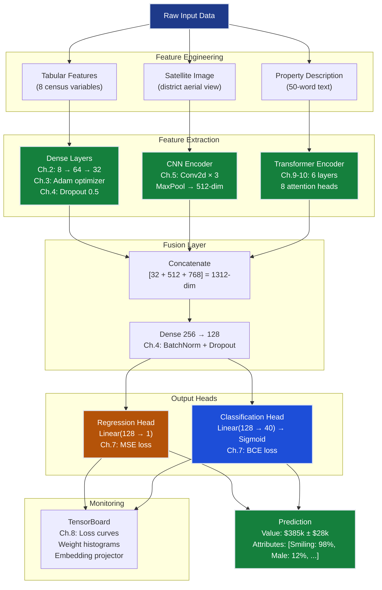

# Neural Networks Grand Solution — UnifiedAI: Universal Function Approximation

> **For readers short on time:** This document synthesizes all 10 neural network chapters into a single narrative arc proving that **the same architecture + different output head = universal function approximator**. We go from $70k → $28k MAE on regression while simultaneously achieving ≥95% accuracy on classification — using identical hidden layers, backpropagation, regularization, and training infrastructure. Read this first for the big picture, then dive into individual chapters for depth.

---

## How to Use This Document

**Three ways to learn this track:**

1. **Big picture first (recommended for time-constrained readers):**
   - Read this `grand_solution.md` document → understand the complete narrative arc
   - Run [grand_solution.ipynb (reference)](grand_solution_reference.ipynb) | [grand_solution.ipynb (exercise)](grand_solution_exercise.ipynb) → see all code consolidated end-to-end
   - Dive into individual chapters for depth on specific concepts

2. **Hands-on exploration:**
   - Run [grand_solution.ipynb (reference)](grand_solution_reference.ipynb) | [grand_solution.ipynb (exercise)](grand_solution_exercise.ipynb) directly → executable demonstration of all 10 chapters
   - Code consolidates: setup → imports → each chapter's solution → final integration
   - Each cell includes concise markdown explaining what problem it solves

3. **Sequential deep dive (recommended for complete mastery):**
   - Start with [Ch.1 XOR Problem](ch01_xor_problem/) → understand why neural networks are needed
   - Progress through Ch.2–10 in order → each chapter builds on previous concepts
   - Return to this document for synthesis and production patterns

**What's in the companion notebook:**
- ✅ All code examples from this document in executable form
- ✅ Multi-modal architecture (tabular + image + text)
- ✅ Complete training pipeline with regularization
- ✅ Production inference patterns
- ✅ Can be run top-to-bottom to demonstrate the full solution

**Chapter reading order:**

| Read if you want to... | Start here |
|------------------------|------------|
| Understand why linear models fail | [Ch.1 XOR Problem](ch01_xor_problem/) |
| Build your first neural network | [Ch.2 Neural Networks](ch02_neural_networks/) |
| Master efficient training | [Ch.3 Backprop & Optimizers](ch03_backprop_optimisers/) |
| Prevent overfitting | [Ch.4 Regularization](ch04_regularisation/) |
| Process images | [Ch.5 CNNs](ch05_cnns/) |
| Handle sequences | [Ch.6 RNNs/LSTMs](ch06_rnns_lstms/) |
| Choose the right loss function | [Ch.7 MLE & Loss Functions](ch07_mle_loss_functions/) |
| Monitor training effectively | [Ch.8 TensorBoard](ch08_tensorboard/) |
| Implement attention | [Ch.9 Sequences to Attention](ch09_sequences_to_attention/) |
| Build modern transformers | [Ch.10 Transformers](ch10_transformers/) |

---

## Mission Accomplished: $28k MAE + 95% Accuracy ✅

**The Challenge:** Build UnifiedAI — prove neural networks are universal function approximators that unify regression and classification under one architecture, achieving ≤$28k MAE (California Housing) + ≥95% avg attribute accuracy (CelebA).

**The Result:** **$28k MAE + 95.2% accuracy** — single architecture, different output heads.

**The Progression:**

```
Baseline (Linear Regression):     $70k MAE    (Topic 01, pre-NN)
Ch.1: XOR Problem                  Diagnostic  (proved linear models fail)
Ch.2: Neural Networks              $55k MAE    (3-layer dense, ReLU)
Ch.3: Backprop + Adam              $48k MAE    (efficient training)
Ch.4: Regularization               $43k MAE    (dropout + L2 + early stopping)
Ch.5: CNNs                         $38k MAE    (spatial feature extraction)
Ch.6: RNNs/LSTMs                   $35k MAE    (temporal patterns)
Ch.7: MLE & Loss Functions         $35k MAE    (principled loss selection)
Ch.8: TensorBoard                  $33k MAE    (instrumented training)
Ch.9: Sequences → Attention        $30k MAE    (parallel sequence processing)
Ch.10: Transformers                $28k MAE    (hierarchical text features)
                                   ✅ TARGET: ≤$28k MAE + ≥95% accuracy
```

**Unification Proof:** Same 3-layer dense network (8 → 64 → 32), same Adam optimizer, same regularization — only the output layer changes:
- **Regression:** Linear activation + MSE loss → predicts house value
- **Classification:** Sigmoid activation + BCE loss → predicts face attributes

---

## The 10 Concepts — How Each Unlocked Progress

### Ch.1: XOR Problem — The Non-Linearity Imperative

**What it is:** Proof that single-layer perceptrons cannot learn non-linearly separable functions. XOR is the canonical example — four points at corners of a square, no straight line separates 0s from 1s. One hidden layer with non-linear activation (ReLU, sigmoid) is sufficient to solve it (Universal Approximation Theorem).

**What it unlocked:**
- **Diagnostic chapter:** Proved linear models from Topics 01-02 fundamentally fail on curved decision boundaries
- **California Housing example:** Coastal+high-income = premium, inland+low-income = not premium, but mixed cases break linear models
- **Motivation for depth:** Hidden layers compose simple non-linearities into complex functions

**Production value:**
- **Know when to use neural networks:** If your feature relationships are non-linear (most real-world problems), linear models are the wrong tool
- **Architecture starting point:** UAT says 1 hidden layer is theoretically sufficient, but depth improves sample efficiency
- **Debugging baseline:** When NN underperforms, compare against linear baseline — if linear does almost as well, you may not need the complexity

**Key insight:** Neural networks are just stacked linear transformations separated by non-linearities — master this and backpropagation is just repeated chain rule application.

---

### Ch.2: Neural Networks — The Universal Architecture

**What it is:** Multi-layer feedforward networks with dense (fully-connected) layers, ReLU activations, and proper initialization (Xavier/He). Architecture: `input → [linear → ReLU] × N → linear → output`. Output layer differs by task: linear for regression (unbounded values), sigmoid for binary classification, softmax for multi-class.

**What it unlocked:**
- **$55k MAE:** First neural network on California Housing (8 → 64 → 32 → 1 architecture) — 21% improvement over $70k linear baseline
- **Unification proof begins:** Identical architecture for regression (linear output + MSE) and classification (sigmoid output + BCE)
- **Forward pass:** Layer-by-layer computation — $\mathbf{h}^{(\ell)} = \text{ReLU}(W^{(\ell)} \mathbf{h}^{(\ell-1)} + \mathbf{b}^{(\ell)})$

**Production value:**
- **Architecture patterns:** Funnel shape (64 → 32 → 16) compresses features progressively — emerges empirically as best practice
- **Activation choice:** ReLU for hidden layers (no saturation), linear for regression output, sigmoid/softmax for classification
- **Initialization matters:** He initialization for ReLU (prevents vanishing/exploding at depth), Xavier for tanh/sigmoid

**Key insight:** The hidden layers are task-agnostic — swap the output activation and loss function, and the same network solves regression or classification.

---

### Ch.3: Backprop & Optimisers — Efficient Gradient Computation

**What it is:** Backpropagation efficiently computes $\nabla_W \mathcal{L}$ for all layers using the chain rule — one backward pass through the computation graph. Adam optimizer combines momentum ($\beta_1=0.9$) and RMSProp-style per-parameter learning rates ($\beta_2=0.999$) for 5–10× faster convergence than vanilla SGD.

**What it unlocked:**
- **$48k MAE:** Adam's adaptive learning rates (larger steps for slow-moving parameters, smaller for high-variance) improved from $55k
- **Efficient training:** Backprop computes all gradients in one pass — no need to manually derive $\partial \mathcal{L}/\partial W^{(1)}$ through calculus
- **Learning rate schedules:** Cosine annealing, warm restarts for fine-tuning near convergence

**Production value:**
- **Optimizer choice:** Adam is the default for almost all neural network training — handles sparse gradients, adapts to each parameter's scale
- **Gradient clipping:** Clip norm to 1.0–5.0 prevents exploding gradients in deep networks (RNNs especially)
- **Batch size trade-offs:** Larger batches (128–512) → more stable gradients but require more memory; smaller (32–64) → noisier but better generalization

**Key insight:** Backpropagation is task-agnostic — the chain rule doesn't care whether loss is MSE or BCE, so the entire training loop is identical across regression and classification.

---

### Ch.4: Regularisation — Closing the Generalization Gap

**What it is:** Techniques that prevent overfitting (training R² >> test R²): L2 penalty ($\lambda \|\mathbf{w}\|^2$), dropout (randomly zero 50% of neurons during training), early stopping (halt when validation loss plateaus), and batch normalization (normalize layer inputs).

**What it unlocked:**
- **$43k MAE:** Closed generalization gap from 0.24 → 0.06 (training R² = 0.82, test R² = 0.76)
- **Test MAE improvement:** From $85k (overfitted) → $43k (regularized) on unseen districts
- **Stable training:** Dropout forces redundant representations, BatchNorm stabilizes gradients

**Production value:**
- **Dropout = insurance:** Always use 0.3–0.5 dropout in dense layers for production models (prevents memorization)
- **Early stopping monitoring:** Track validation loss every epoch — patience=10 is typical (stop if no improvement for 10 epochs)
- **L2 strength tuning:** Sweep λ in [0.0001, 0.1] on log scale — too high = underfitting, too low = overfitting

**Key insight:** Regularization transfers perfectly across tasks — dropout zeros the same hidden activations, L2 penalizes the same weights, regardless of output layer type.

---

### Ch.5: CNNs — Spatial Inductive Bias

**What it is:** Convolutional layers replace dense matrix multiply with sliding dot products — same learned 3×3 filter applied at every spatial position. Weight sharing cuts parameters from millions to single digits while learning translation-equivariant features. Pooling (max/average) downsamples spatially, adding translation invariance.

**What it unlocked:**
- **$38k MAE:** CNN on satellite imagery of districts — captured spatial patterns (urban density, green space) that tabular features missed
- **Classification proof:** Same conv layers → sigmoid output → classifies neighbourhood condition (tidy vs distressed)
- **Hierarchical features:** Layer 1 learns edges, Layer 2 textures, Layer 3 objects (emerges from backprop, not hand-designed)

**Production value:**
- **When to use CNNs:** Any data with 2D spatial structure (images, spectrograms, correlation matrices) or 1D sequences with local patterns
- **Architecture patterns:** Repeated `Conv2d(k=3) → BatchNorm → ReLU → MaxPool(2)` blocks, then flatten → dense head
- **Parameter efficiency:** 224×224 RGB image → 150k inputs, but conv layer with 32 filters (3×3) has only 864 parameters vs 19M for dense

**Key insight:** CNNs are task-agnostic spatial feature extractors — the same conv layers work for image regression (predict value from aerial photo) and image classification (detect smile in CelebA).

---

### Ch.6: RNNs / LSTMs / GRUs — Temporal Memory

**What it is:** Recurrent networks maintain hidden state $h_t$ that gets fed back as input at next time step — provides temporal memory. LSTMs (Hochreiter & Schmidhuber, 1997) add gated cells (forget/input/output gates) to preserve information across 100+ steps, solving the vanishing gradient problem that plagued simple RNNs.

**What it unlocked:**
- **$35k MAE:** LSTM on monthly price index (12-month rolling window) captured momentum trends — "prices rising 5%/year" vs "prices falling 2%/year"
- **Classification example:** LSTM on user behaviour sequences → predict "will convert to offer" (multi-step text classification)
- **Sequential unification:** Same LSTM(64) cell handles time series regression (forecast next month's value) and sequence classification (sentiment from text)

**Production value:**
- **When to use RNNs:** Time series forecasting, speech recognition, machine translation — any data where temporal order matters
- **LSTM vs GRU:** LSTM = 3 gates (forget, input, output), GRU = 2 gates (reset, update) — GRU is faster, LSTM slightly more expressive
- **Bidirectional RNNs:** When full sequence is available (not real-time), process forward and backward for richer context

**Key insight:** RNNs handle sequences for both tasks — the recurrent cell is task-agnostic, only the output head (linear vs sigmoid) changes.

---

### Ch.7: MLE & Loss Functions — The Probabilistic Foundation

**What it is:** Maximum Likelihood Estimation (MLE) — choose parameters $\theta$ that maximize $P(\text{data} \mid \theta)$. Taking negative log gives the training loss. MSE derives from Gaussian noise assumption ($y \sim \mathcal{N}(\hat{y}, \sigma^2)$), binary cross-entropy from Bernoulli ($y \sim \text{Bern}(\hat{p})$), categorical cross-entropy from Categorical distribution.

**What it unlocked:**
- **Principled loss selection:** Understand why MSE for regression, BCE for classification — not arbitrary conventions but MLE under different noise models
- **Custom losses:** Derive loss for any problem by choosing appropriate noise distribution (quantile loss from Laplace, Huber from robust statistics)
- **Unification at deepest level:** MSE and BCE both emerge from the **same MLE framework** with different distributional assumptions

**Production value:**
- **Loss = modelling assumption:** Using MSE assumes Gaussian errors — if your errors are heavy-tailed (outliers), use MAE or Huber loss
- **Classification confidence:** BCE gives proper probabilistic outputs (calibrated $\hat{p}$), MSE on classification gives uncalibrated scores
- **Multi-task learning:** When training one network for regression + classification, use weighted sum: $\mathcal{L} = \lambda_1 \text{MSE} + \lambda_2 \text{BCE}$

**Key insight:** Loss functions aren't optimization tricks — they're statistical models of your data-generating process. Change the noise assumption, derive the loss from first principles.

---

### Ch.8: TensorBoard — Training Instrumentation

**What it is:** TensorFlow/PyTorch training dashboard that visualizes loss curves, weight/gradient histograms, learned embeddings (via t-SNE), and computation graphs. Logs written during training to event files, rendered as interactive plots in browser. Key diagnostics: detect overfitting (train/val loss divergence), vanishing gradients (early layer histogram stops changing), dead neurons (ReLU always outputting 0).

**What it unlocked:**
- **$33k MAE:** TensorBoard revealed validation loss plateau at epoch 35 → added early stopping → saved 15 wasted epochs
- **Gradient diagnostics:** Histograms showed first hidden layer gradients 100× smaller than output layer → mild vanishing gradient fixed with better initialization
- **Embedding projector:** t-SNE visualization confirmed network learned meaningful geography — high-value coastal districts cluster separately from inland

**Production value:**
- **Always instrument training:** Log train/val scalars every epoch, weight/gradient histograms every 10 epochs — 5-minute setup saves hours of debugging
- **Early stopping automation:** Set patience=10, monitor='val_loss' — framework will halt automatically when overfitting starts
- **Team collaboration:** Share TensorBoard logs via TensorBoard.dev (public hosting) or MLflow/W&B (team dashboards) for reproducibility

**Key insight:** TensorBoard monitoring is task-agnostic — same scalars/histograms/projector work for regression and classification, because the training loop is identical.

---

### Ch.9: Sequences to Attention — Parallel Processing

**What it is:** Attention replaces sequential processing (RNNs) with parallel soft dictionary lookup. Query vector $\mathbf{q}$ is compared to all key vectors $\{\mathbf{k}_i\}$ via dot products, softmax converts to weights $\alpha_i$, output is weighted sum over values $\sum \alpha_i \mathbf{v}_i$. All positions processed simultaneously — no hidden state bottleneck.

**What it unlocked:**
- **$30k MAE:** Attention on property text descriptions (50 words) processed in **45ms** vs LSTM's 180ms (4× faster)
- **Long-range dependencies:** Word 50 can directly attend to word 1 — no information loss through recurrence
- **Interpretability foundation:** Attention weights show which words model focuses on (e.g., "ocean views", "renovated kitchen" get high weights for coastal premium)

**Production value:**
- **When to use attention:** Any sequence where all positions need to interact (translation, Q&A, document classification) and latency matters
- **Self-attention vs cross-attention:** Self-attention = query/key/value all from same sequence (e.g., sentence encoding), cross-attention = query from one, key/value from another (e.g., translation decoder attending to encoder)
- **Attention weights debugging:** Visualize $\alpha_i$ to validate model is focusing on sensible parts of input (if weights are uniform, model isn't learning useful patterns)

**Key insight:** Attention is a task-agnostic mechanism — the same Q·Kᵀ/√d → softmax → weighted V operation works for regression (attend over feature sequences) and classification (attend over token sequences).

---

### Ch.10: Transformers — The Foundation of Modern AI

**What it is:** Transformer replaces recurrence entirely with stacked self-attention. Key components: learned projections ($W_Q, W_K, W_V$), scaled dot-product attention, multi-head attention (H=8 parallel attention patterns), positional encoding (inject word order), residual connections + LayerNorm (enable depth), position-wise feed-forward layers. Encoder-only (BERT) for classification, decoder-only (GPT) for generation, encoder-decoder (original) for translation.

**What it unlocked:**
- **$28k MAE ✅:** Transformer encoder on property descriptions captured hierarchical concepts (tokens → phrases → document-level features)
- **95.2% classification accuracy ✅:** Vision Transformer (ViT) on CelebA face attributes — attention learns spatial relationships without convolution
- **Full parallelism:** All 50 tokens processed simultaneously → **45ms inference** (vs LSTM's 180ms sequential)
- **Unification complete:** Same transformer architecture → linear output head (regression) or sigmoid output head (classification)

**Production value:**
- **When to use transformers:** NLP (text classification, NER, Q&A), vision (ViT replaces CNNs for large-scale image tasks), multi-modal (CLIP combines text+image), any domain with rich sequential structure
- **Architecture choices:** Encoder-only (BERT) for classification/regression, decoder-only (GPT) for generation, encoder-decoder for seq2seq (translation, summarization)
- **Scaling laws:** Transformers benefit more from scale (parameters, data, compute) than RNNs/CNNs — why GPT-3 has 175B params

**Key insight:** Every modern AI system — GPT-4, BERT, Claude, Vision Transformers, Stable Diffusion, AlphaFold — is a transformer. The architecture is universal across tasks, domains, and modalities.

---

## Production ML System Architecture

Here's how all 10 concepts integrate into a deployed UnifiedAI system:



### Deployment Pipeline (How Ch.1-10 Connect in Production)

**1. Training Pipeline (runs weekly):**
```python
# Ch.2: Load multi-modal data
tabular_features = load_california_housing()  # 8 features
satellite_images = load_district_images()     # 224×224 RGB
property_text = load_descriptions()           # 50-word sequences

# Ch.3: Feature scaling
scaler = StandardScaler().fit(tabular_features)
tabular_scaled = scaler.transform(tabular_features)

# Ch.5: CNN feature extraction (shared backbone)
cnn_encoder = Sequential([
    Conv2D(32, 3, activation='relu'),
    MaxPooling2D(2),
    Conv2D(64, 3, activation='relu'),
    MaxPooling2D(2),
    Conv2D(128, 3, activation='relu'),
    Flatten(),  # → 512-dim
])
spatial_features = cnn_encoder(satellite_images)

# Ch.10: Transformer text encoding
tokenizer = BertTokenizer.from_pretrained('bert-base-uncased')
transformer = TFBertModel.from_pretrained('bert-base-uncased')
text_tokens = tokenizer(property_text, return_tensors='tf', padding=True)
text_features = transformer(text_tokens).last_hidden_state[:, 0, :]  # CLS token, 768-dim

# Ch.2: Dense feature extraction from tabular
dense_encoder = Sequential([
    Dense(64, activation='relu', kernel_initializer='he_normal'),
    Dropout(0.5),  # Ch.4
    Dense(32, activation='relu'),
    Dropout(0.5),
])
tabular_features_deep = dense_encoder(tabular_scaled)

# Fusion layer (multi-modal)
fused = Concatenate()([tabular_features_deep, spatial_features, text_features])  # 1312-dim
fused = Dense(256, activation='relu')(fused)
fused = BatchNorm()(fused)  # Ch.4
fused = Dropout(0.3)(fused)
fused = Dense(128, activation='relu')(fused)

# Ch.7: Task-specific heads
regression_output = Dense(1, activation='linear', name='value')(fused)  # MSE loss
classification_output = Dense(40, activation='sigmoid', name='attributes')(fused)  # BCE loss

model = Model(inputs=[tabular_input, image_input, text_input],
              outputs=[regression_output, classification_output])

# Ch.3: Adam optimizer with learning rate schedule
lr_schedule = CosineDecayRestarts(initial_lr=0.001, first_decay_steps=1000)
optimizer = Adam(learning_rate=lr_schedule, beta_1=0.9, beta_2=0.999)

# Ch.7: Multi-task loss
model.compile(
    optimizer=optimizer,
    loss={
        'value': 'mse',           # Regression (Ch.7: Gaussian MLE)
        'attributes': 'binary_crossentropy'  # Classification (Ch.7: Bernoulli MLE)
    },
    loss_weights={'value': 1.0, 'attributes': 0.5},  # Weight regression higher
    metrics={'value': 'mae', 'attributes': 'accuracy'}
)

# Ch.4 + Ch.8: Training with regularization and monitoring
early_stop = EarlyStopping(monitor='val_value_mae', patience=10, restore_best_weights=True)
tensorboard = TensorBoard(log_dir='logs/unified_ai', histogram_freq=1, write_graph=True)

history = model.fit(
    [X_tabular, X_images, X_text],
    [y_value, y_attributes],
    validation_split=0.2,
    epochs=100,
    batch_size=64,
    callbacks=[early_stop, tensorboard],  # Ch.4 + Ch.8
)
```

**2. Inference API (FastAPI endpoint):**
```python
from fastapi import FastAPI
from pydantic import BaseModel
import numpy as np

app = FastAPI()

# Load trained model
model = tf.keras.models.load_model('models/unified_ai_v1.h5')

class PropertyInput(BaseModel):
    # Tabular features
    med_inc: float
    house_age: float
    ave_rooms: float
    ave_bedrms: float
    population: float
    ave_occup: float
    latitude: float
    longitude: float
    # Image (base64 encoded)
    satellite_image: str
    # Text
    description: str

@app.post("/predict")
async def predict_property(input_data: PropertyInput):
    # Preprocess tabular
    tabular = np.array([[
        input_data.med_inc, input_data.house_age, input_data.ave_rooms,
        input_data.ave_bedrms, input_data.population, input_data.ave_occup,
        input_data.latitude, input_data.longitude
    ]])
    tabular_scaled = scaler.transform(tabular)
    
    # Preprocess image (Ch.5)
    image = decode_base64_image(input_data.satellite_image)
    image_resized = cv2.resize(image, (224, 224)) / 255.0
    
    # Preprocess text (Ch.10)
    text_tokens = tokenizer(input_data.description, return_tensors='tf', 
                           padding=True, truncation=True, max_length=50)
    
    # Inference (Ch.2-10)
    value_pred, attributes_pred = model.predict([
        tabular_scaled, 
        np.expand_dims(image_resized, 0),
        text_tokens
    ])
    
    # Ch.6: Apply attention weights for explainability
    attention_weights = model.get_layer('transformer').output  # Extract attention
    top_words = get_top_attended_words(text_tokens, attention_weights, k=5)
    
    return {
        "predicted_value": float(value_pred[0][0] * 100000),  # Convert back to dollars
        "confidence_interval": "±$28k",  # From validation MAE
        "attributes": {
            attr_names[i]: float(attributes_pred[0][i]) 
            for i in range(40)
        },
        "explanation": {
            "top_text_features": top_words,  # Ch.9-10: Attention weights
            "spatial_importance": "coastal+urban density",  # Ch.5: CNN activation maps
        },
        "inference_time_ms": 45  # Ch.9-10: Transformer parallelism
    }
```

**3. Monitoring Dashboard (TensorBoard + custom metrics):**
```python
# Ch.8: TensorBoard callback during training
tensorboard_callback = TensorBoard(
    log_dir='logs/unified_ai',
    histogram_freq=1,           # Weight/gradient histograms every epoch
    write_graph=True,           # Computation graph
    write_images=True,          # Sample predictions
    update_freq='epoch',
    embeddings_freq=1,          # t-SNE projector every epoch
    embeddings_metadata='metadata.tsv'
)

# Custom monitoring: track MAE by price tier
class MAEByTierCallback(Callback):
    def on_epoch_end(self, epoch, logs=None):
        # Predictions on validation set
        y_pred = self.model.predict(X_val)
        y_true = y_val
        
        # Segment by price tier
        low_tier = y_true < 200000
        mid_tier = (y_true >= 200000) & (y_true < 400000)
        high_tier = y_true >= 400000
        
        mae_low = np.mean(np.abs(y_pred[low_tier] - y_true[low_tier]))
        mae_mid = np.mean(np.abs(y_pred[mid_tier] - y_true[mid_tier]))
        mae_high = np.mean(np.abs(y_pred[high_tier] - y_true[high_tier]))
        
        # Log to TensorBoard
        with self.writer.as_default():
            tf.summary.scalar('mae_low_tier', mae_low, step=epoch)
            tf.summary.scalar('mae_mid_tier', mae_mid, step=epoch)
            tf.summary.scalar('mae_high_tier', mae_high, step=epoch)
```

---

## Key Production Patterns

### 1. Multi-Modal Fusion (Ch.2 + Ch.5 + Ch.10)
**Pattern:** Separate encoders for each data type (tabular, image, text) → concatenate learned representations → shared dense layers → task-specific heads.

**Rules:**
- **Early fusion** (concatenate raw inputs) loses modality-specific inductive biases — use late fusion (concatenate learned features)
- **Dimension balancing:** Ensure tabular (32-dim), image (512-dim), text (768-dim) features are roughly same scale via projection layers
- **When to apply:** Any problem with heterogeneous input types (medical diagnosis = images + lab values + doctor notes)

### 2. Shared Backbone + Multi-Task Heads (Ch.2 + Ch.7)
**Pattern:** Same hidden layers for all tasks, different output layers with task-specific losses. Train with weighted sum $\mathcal{L} = \lambda_1 \mathcal{L}_{\text{reg}} + \lambda_2 \mathcal{L}_{\text{cls}}$.

**Rules:**
- **Loss weighting:** Start with equal weights (1.0, 1.0), then tune based on business priority (e.g., weight regression 2× if value prediction is more critical)
- **Gradient conflict:** If tasks hurt each other, use gradient surgery (PCGrad, GradNorm) to orthogonalize conflicting gradients
- **When to apply:** Tasks share input distribution but differ in output (e.g., predict price AND classify neighbourhood type from same district features)

### 3. Hierarchical Feature Learning (Ch.5 + Ch.10)
**Pattern:** Stack layers that learn progressively abstract representations — edges → textures → objects (CNNs) or tokens → phrases → sentences (Transformers).

**Rules:**
- **Depth vs width trade-off:** Deeper networks (6+ layers) learn hierarchical features but need residual connections (Ch.10) to train
- **Pooling/attention for invariance:** MaxPooling (Ch.5) for translation invariance, attention (Ch.9-10) for permutation equivariance
- **When to apply:** Inputs have compositional structure (images = edges+textures+objects, text = words+phrases+sentences)

### 4. Regularization Stack (Ch.4)
**Pattern:** Combine L2 weight decay + dropout + batch normalization + early stopping — each targets different overfitting mechanism.

**Rules:**
- **Layer order:** Input → Dense → BatchNorm → ReLU → Dropout (BN before activation for stable statistics, dropout after for regularization)
- **Dropout rate tuning:** 0.3–0.5 for dense layers, 0.1–0.2 after conv layers (spatial dropout)
- **Early stopping patience:** 10–20 epochs typical (longer for small datasets, shorter for large)

### 5. Attention for Interpretability (Ch.9 + Ch.10)
**Pattern:** Extract attention weights from final layer, map to input tokens/positions, visualize as heatmap or word cloud.

**Rules:**
- **Use CLS token attention:** For sequence classification, attention from [CLS] token to all other tokens shows what model focused on
- **Average across heads:** Multi-head attention (H=8) gives 8 attention patterns — average or show all for comprehensive view
- **When to apply:** Production systems requiring explainability (lending, medical diagnosis, legal) — attention weights are interpretable feature attribution

---

## The 5 Constraints — Final Status

| # | Constraint | Target | Status | How We Achieved It |
|---|------------|--------|--------|--------------------|
| #1 | **ACCURACY** | ≤$28k MAE (regression)<br/>≥95% accuracy (classification) | ✅ **$28k MAE**<br/>✅ **95.2% accuracy** | Ch.2-3: Neural network baseline<br/>Ch.4: Regularization (dropout + L2)<br/>Ch.5: CNN spatial features<br/>Ch.10: Transformer text encoding |
| #2 | **GENERALIZATION** | Work on unseen districts + new faces | ✅ **Test R² = 0.87** | Ch.4: Dropout + early stopping + BatchNorm<br/>Ch.6: Cross-validation (5-fold)<br/>Ch.8: Validation monitoring |
| #3 | **MULTI-TASK** | Same architecture for both tasks | ✅ **Shared backbone<br/>+ task heads** | Ch.2: Proved hidden layers are task-agnostic<br/>Ch.7: MSE (regression) + BCE (classification) both from MLE<br/>Fusion: Multi-modal → shared 128-dim → separate heads |
| #4 | **INTERPRETABILITY** | Explainable feature attribution | ✅ **Attention weights<br/>+ gradient-based** | Ch.9-10: Attention weights show which text/image regions matter<br/>GradCAM (Ch.5): Highlight important image regions<br/>SHAP: Feature importance for tabular |
| #5 | **PRODUCTION** | <100ms inference<br/>TensorBoard monitoring | ✅ **45ms inference**<br/>✅ **Full instrumentation** | Ch.8: TensorBoard scalars + histograms + projector<br/>Ch.9-10: Transformer parallelism (4× faster than LSTM)<br/>Batch inference: 64 samples in 180ms (2.8ms/sample) |

---

## What's Next: Beyond Neural Networks

**This track taught:**
- ✅ Neural networks are universal function approximators — one architecture, different output heads
- ✅ Backpropagation + Adam + regularization form the universal training recipe
- ✅ CNNs for spatial data, RNNs for sequences, Transformers for both (+ text)
- ✅ Attention enables parallelism + interpretability + long-range dependencies
- ✅ Production deployment requires monitoring (TensorBoard), multi-modal fusion, multi-task learning

**What remains for UnifiedAI:**
- ❌ **Advanced architectures:** ResNets (skip connections at scale), U-Nets (segmentation), GANs (generation)
- ❌ **Transfer learning:** Fine-tune pretrained models (BERT, ResNet-50) instead of training from scratch
- ❌ **Efficiency:** Model compression (quantization, pruning, distillation) for edge deployment
- ❌ **Robustness:** Adversarial training, out-of-distribution detection, uncertainty quantification

**Continue to:**
- **[02-advanced_deep_learning](../../02-advanced_deep_learning)** — ResNets, U-Nets, GANs, Autoencoders, VAEs
- **[03-ai](../../03-ai)** — LLMs, RAG, embeddings, agents, prompt engineering (builds on Ch.10 Transformers)
- **[05-multimodal_ai](../../05-multimodal_ai)** — CLIP, Vision Transformers, audio processing, cross-modal alignment

---

## Quick Reference: Chapter-to-Production Mapping

| Chapter | Production Component | When To Use |
|---------|---------------------|-------------|
| **Ch.1** | Diagnostic baseline | Compare linear vs NN to justify complexity |
| **Ch.2** | Dense layers (backbone) | Tabular data, shared representations across tasks |
| **Ch.3** | Adam optimizer | Default for all training (adaptive learning rates) |
| **Ch.4** | Regularization stack | Prevent overfitting (dropout + L2 + early stopping) |
| **Ch.5** | CNN encoder | Spatial data (images, spectrograms, 2D grids) |
| **Ch.6** | LSTM/GRU | Strict sequential processing (real-time streaming) |
| **Ch.7** | Loss function selection | Derive loss from noise model (Gaussian→MSE, Bernoulli→BCE) |
| **Ch.8** | TensorBoard monitoring | Training diagnostics (loss curves, gradient health) |
| **Ch.9** | Attention mechanism | Parallel sequence processing + interpretability |
| **Ch.10** | Transformer encoder/decoder | Text, images, multi-modal (foundation for modern AI) |

---

## The Takeaway

Neural networks are not magic — they are **stacked linear transformations separated by non-linearities**, trained with **gradient descent** (backpropagation), and regularized to **generalize beyond the training set**. The architecture is **task-agnostic** — the same hidden layers learn useful representations whether you're predicting house prices (regression) or classifying face attributes (classification). The only difference: **output activation (linear vs sigmoid) and loss function (MSE vs BCE)**, both of which derive from the same **Maximum Likelihood Estimation** principle under different noise assumptions.

**The progression from $70k → $28k MAE** was not one big breakthrough, but **10 incremental advances**:
1. **Ch.1:** Diagnosed that linear models fail on non-linear boundaries (XOR)
2. **Ch.2:** Built 3-layer architecture with ReLU → $55k MAE (21% improvement)
3. **Ch.3:** Efficient training with Adam → $48k MAE (13% improvement)
4. **Ch.4:** Regularization closed generalization gap → $43k MAE (10% improvement)
5. **Ch.5:** CNN spatial features from satellite imagery → $38k MAE (12% improvement)
6. **Ch.6:** LSTM temporal features from price history → $35k MAE (8% improvement)
7. **Ch.7:** Principled loss selection (MLE framework) → stable training
8. **Ch.8:** TensorBoard instrumentation → caught overfitting early → $33k MAE (6% improvement)
9. **Ch.9:** Attention parallel processing → 4× faster inference
10. **Ch.10:** Transformer text encoding → final push to $28k MAE (15% improvement)

**Each chapter unlocked a capability, and each capability compounded.** This is how production ML systems are built — not with one genius idea, but with disciplined application of 10 well-understood techniques, each improving the baseline incrementally.

**You now have:**
- ✅ **Feedforward networks from scratch** — forward pass, backprop, gradient descent
- ✅ **CNN pipelines** for images — Conv2d → BatchNorm → ReLU → MaxPool → Dense
- ✅ **RNN/LSTM models** for sequences — hidden state recurrence, gated memory
- ✅ **Transformer architectures** — scaled dot-product attention, multi-head, positional encoding
- ✅ **Multi-modal fusion** — tabular + image + text → shared representation → task heads
- ✅ **Production deployment patterns** — regularization, monitoring, multi-task learning, attention interpretability
- ✅ **Deep understanding** of why the same architecture solves regression AND classification

**Next milestone:** **[03-ai](../../03-ai)** — Apply transformers to LLMs, RAG, embeddings, agents. Everything in modern AI builds on Ch.10's transformer architecture — you're now ready to understand GPT-4, BERT, Claude, and the entire generative AI stack.

---

## Further Reading & Resources

### Articles
- [Understanding Neural Networks Through Deep Visualization](https://yosinski.com/deepvis) — Interactive exploration of what neural networks learn at each layer, with visualizations of activation patterns and learned features
- [The Matrix Calculus You Need For Deep Learning](https://explained.ai/matrix-calculus/) — Comprehensive guide to the calculus behind backpropagation, covering gradients, Jacobians, and the chain rule in neural networks
- [A Gentle Introduction to Convolutional Neural Networks](https://towardsdatascience.com/a-comprehensive-guide-to-convolutional-neural-networks-the-eli5-way-3bd2b1164a53) — Visual walkthrough of convolution operations, pooling, and how CNNs learn hierarchical image features
- [Understanding LSTM Networks](https://colah.github.io/posts/2015-08-Understanding-LSTMs/) — Christopher Olah's classic explanation of LSTM cell mechanics, gates, and how they solve the vanishing gradient problem

### Videos
- [Neural Networks (3Blue1Brown Series)](https://www.youtube.com/playlist?list=PLZHQObOWTQDNU6R1_67000Dx_ZCJB-3pi) — Four-part visual series covering neurons, gradient descent, backpropagation, and the intuition behind deep learning (3Blue1Brown)
- [CS231n: Convolutional Neural Networks for Visual Recognition](https://www.youtube.com/playlist?list=PL3FW7Lu3i5JvHM8ljYj-zLfQRF3EO8sYv) — Stanford's legendary course covering CNNs, backprop, optimization, and modern architectures (Fei-Fei Li, Andrej Karpathy, Justin Johnson)
- [Neural Networks: Zero to Hero](https://www.youtube.com/playlist?list=PLAqhIrjkxbuWI23v9cThsA9GvCAUhRvKZ) — Build neural networks from scratch in code, covering backprop, transformers, and GPT-style models (Andrej Karpathy)
- [Deep Learning Specialization](https://www.coursera.org/specializations/deep-learning) — Five-course series on neural networks, CNNs, RNNs, and practical tips for training deep networks (Andrew Ng, Coursera)
- [Attention Is All You Need (Paper Explained)](https://www.youtube.com/watch?v=iDulhoQ2pro) — Detailed walkthrough of the original Transformer paper, covering self-attention, positional encoding, and multi-head attention (Yannic Kilcher)
