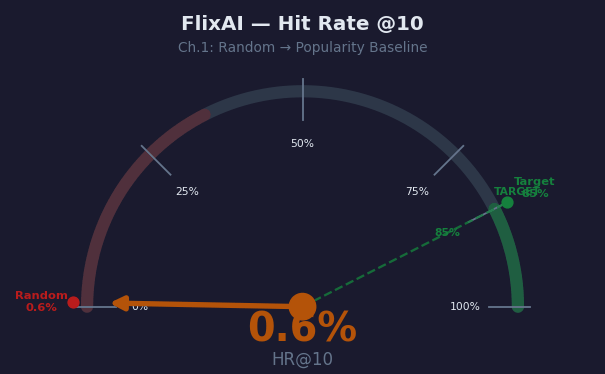
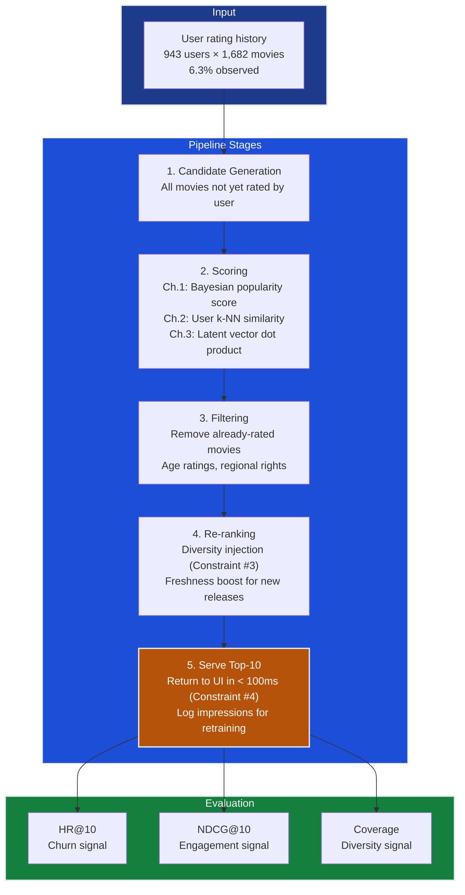
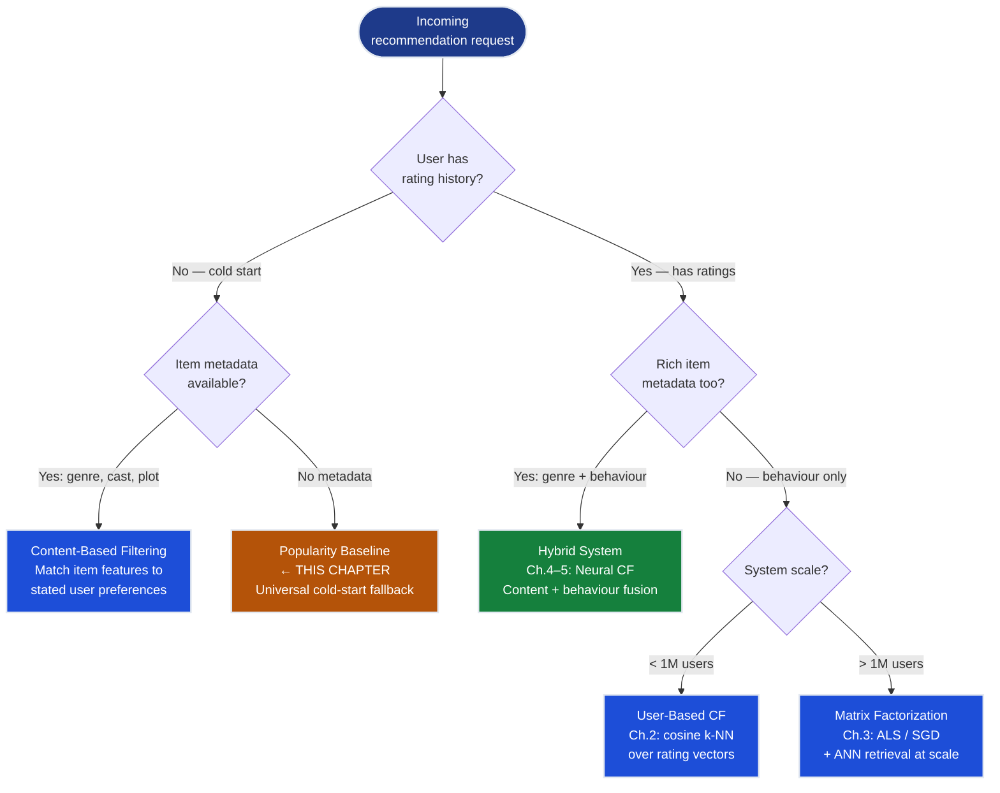
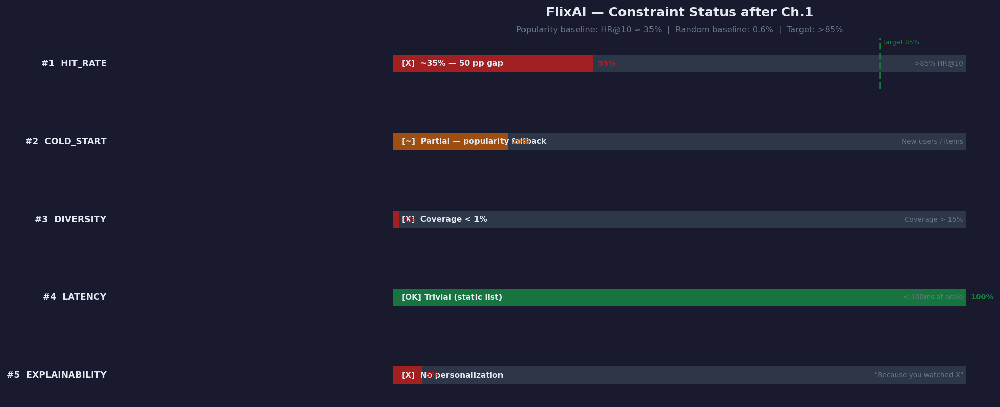

# Ch.1 — Recommender Systems Fundamentals

> **The story.** In **1992**, researchers at **Xerox PARC** built **Tapestry** — the first system ever to use the phrase "collaborative filtering." The idea was deceptively simple: let users annotate email messages, then route future messages based on *other people's* annotations. No algorithm had done this before. Three years later, the **GroupLens** team at the University of Minnesota applied the same principle to Usenet news articles, coined the term *recommender system*, and released the **MovieLens** dataset that would become the Rosetta Stone of recommendation research for the next 30 years. In **1998**, Amazon engineer **Greg Linden** filed a patent for **item-based collaborative filtering** — "customers who bought X also bought Y" — a system so effective it now drives 35% of Amazon's revenue. In **2006**, Netflix launched the **Netflix Prize**: $1,000,000 to anyone who could improve their CineMatch recommendation algorithm by 10%. Forty-four thousand teams from 186 countries competed for three years. The winners, **BellKor's Pragmatic Chaos**, crossed the line in 2009 with a 10.06% improvement using an ensemble of over 100 models — and proved, for the first time with rigorous evidence, that recommendation quality has direct, measurable, seven-figure business value. In **2015**, Spotify launched **Discover Weekly** — a personalised 30-song playlist refreshed every Monday, built entirely on collaborative filtering of listening histories. Within its first year, users streamed Discover Weekly songs over 5 billion times. The paradigm had permanently shifted: not *"what did people like you buy?"* but **"what will *you* love next?"**
>
> **Where you are in the curriculum.** This is chapter one of the Recommender Systems track. You are the lead ML engineer at **FlixAI**, a streaming platform competing with Netflix and Disney+. Your first task is the simplest possible model: recommend the most popular movies to everyone. It sounds lazy — and it is — but it establishes the entire evaluation framework, the metrics vocabulary, and the baseline numbers that every subsequent chapter must beat. The Recommender Systems track teaches the progression from naive popularity ranking (this chapter) through neighbourhood models (Ch.2), matrix factorization (Ch.3), deep learning (Ch.4–5), and production serving (Ch.6). Every chapter inherits the metrics and vocabulary introduced here.
>
> **Notation in this chapter.** Scan the table now; return to it when equations appear later.
>
> | Symbol | Meaning | MovieLens 100k value |
> |--------|---------|----------------------|
> | $m$ | Number of users | 943 |
> | $n$ | Number of items (movies) | 1,682 |
> | $R \in \mathbb{R}^{m \times n}$ | User-item rating matrix | 943 × 1,682, only 6.3% filled |
> | $r_{ui}$ | Rating given by user $u$ to item $i$ | Integer 1–5, or **missing** |
> | $\hat{r}_{ui}$ | Predicted rating for user $u$, item $i$ | Real-valued score |
> | $K$ | Size of the top-$K$ recommendation list | 10 (standard for this track) |
> | $\text{HR}@K$ | Hit rate at $K$ — fraction of users with ≥1 relevant item in top-$K$ | ~35% (popularity baseline) |
> | $\text{NDCG}@K$ | Normalized Discounted Cumulative Gain — position-weighted accuracy | 0–1, higher is better |
> | $\text{MRR}$ | Mean Reciprocal Rank — avg inverse rank of first relevant item | 0–1, higher is better |
> | $\text{Cov}$ | Coverage — fraction of catalogue ever recommended | 0–100% |
> | $\mu$ | Global mean rating across all observed ratings | 3.53 (MovieLens 100k) |
> | $C$ | Bayesian damping constant | ≈ median rating count per item |

---

## 0 · The Challenge — Where We Are

> 💡 **The mission**: Launch **FlixAI** — a production movie recommendation engine satisfying 5 constraints:
> 1. **HIT_RATE**: >85% HR@10 — users must find ≥1 relevant movie in every top-10 list
> 2. **COLD_START**: Handle new users and new movies with zero rating history
> 3. **DIVERSITY**: Avoid filter bubbles — don't trap users in one genre forever
> 4. **LATENCY**: <100ms recommendation serving at 1M+ concurrent users
> 5. **EXPLAINABILITY**: "Recommended because you watched X" — not a black box

**What we know so far:**
- ✅ MovieLens 100k dataset: 943 users, 1,682 movies, 100,000 explicit ratings, scale 1–5
- ✅ Business context: 60% of user sessions end without clicking a single recommendation → churn
- ✅ CEO mandate: "Netflix recommendations drive 80% of viewing hours; ours drive 12% — fix it"
- ❌ **No model. No metrics. No baseline.**

**What's blocking us:**
The VP of Product won't accept "it feels better." You need falsifiable numbers: "Our system achieves X% HR@10, which beats the naive baseline by Y points." Right now you have none of those numbers. Before building matrix factorization or deep learning, you must answer three foundational questions:

1. **How do you *measure* recommendation quality?** (Answer: the metrics framework in §4)
2. **What accuracy can you achieve with zero ML** — by recommending popular movies? (Answer: ~35% HR@10 in §6)
3. **What gap to the 85% target remains?** (Answer: ~50 percentage points — the work of Ch.2–6)

**What this chapter unlocks:**
- **Evaluation framework**: HR@K, NDCG@K, MRR, Coverage — the shared language for Ch.1–6
- **Popularity baseline**: ~35% HR@10 using Bayesian-averaged top movies (§6)
- **Sparsity quantification**: 93.7% of the rating matrix is empty — the constraint that forces latent factor approaches in Ch.3
- **Algorithm taxonomy**: content-based vs collaborative filtering vs hybrid — decision criteria


---

## Animation



The needle starts at **0.6%** — a random recommender picking 10 movies at random. It swings to **~35%** — the popularity baseline recommending the same Bayesian-averaged top-10 movies to everyone. The red zone at 85% is the production target. Every chapter in this track advances the needle.

---

## 1 · Core Idea

A recommender system predicts which items a user will prefer, then ranks those items to present a personalised top-$K$ list. Collaborative filtering identifies preferences by finding patterns in the behaviour of *millions of users* — users who rated the same movies similarly in the past tend to agree on new movies too. Content-based filtering matches items to users based on *item features* alone — recommend more sci-fi to a user whose history is mostly sci-fi — without needing any other user's data. This chapter builds the simplest possible recommender — a **popularity baseline** — and establishes the evaluation framework every later chapter uses and extends.

---

## 2 · Running Example: MovieLens 100k

You are a data scientist at **FlixAI**. The CEO calls you in: "Netflix recommendations drive 80% of their viewing hours. Ours drive 12%. I need a recommendation widget on our homepage by Friday." Your dataset: **MovieLens 100k** — 100,000 explicit ratings from 943 users on 1,682 movies, collected between September 1997 and April 1998 by the GroupLens research group at the University of Minnesota. Ratings are integers from 1 (terrible) to 5 (loved it).

```
The rating matrix R (943 × 1,682) — a toy 5×5 slice:

           Toy Story  GoodFellas  Fargo  Star Wars  The Matrix
User 1         5           —        4        —           —
User 2         —           —        —        5           3
User 3         —           3        —        —           —
User 4         4           —        —        4           —
User 5         —           —        2        —           5

Legend: — = NOT RATED (missing, not zero)
        A missing entry ≠ dislike; it means "has not seen it"
```

**Three facts that define the recommendation challenge:**

1. **Sparsity**: 93.7% of the matrix is empty. You cannot simply average over columns you have not seen.
2. **Scale**: 943 × 1,682 = 1,585,726 possible user-movie pairs, but only 100,000 are observed.
3. **Benchmark gap**: A random recommender (pick 10 movies uniformly at random) achieves HR@10 ≈ **0.6%**. Your target is **>85%**. That 84-point gap is the arc of the entire track.

| Baseline | HR@10 | Gap to target |
|----------|-------|---------------|
| Random (10 movies at random) | 0.6% | 84.4 pp |
| **Popularity (this chapter)** | **~35%** | **~50 pp** |
| User-based CF (Ch.2) | ~55% | ~30 pp |
| Matrix Factorization (Ch.3) | ~68% | ~17 pp |
| Neural CF (Ch.5) | >85% | ✅ Target met |

> 💡 **Why 0.6% for random?** With K=10 and n=1,682 items, the probability of randomly recommending a specific held-out item is 10/1682 ≈ 0.59%. The popularity baseline achieves 58× better than random — not because it is clever, but because popular movies genuinely appear in more people's preferences.

---

## 3 · Recommendation Pipeline at a Glance

Every production recommender — from a popularity list to a billion-parameter neural network — passes items through the same five-stage pipeline. The stages differ in *how* they work, not *that* they exist. This is your architecture map for the entire track.

```
USER HISTORY  ─────────────────────────────────────────────
                        │
                        ▼
        ┌───────────────────────────────────┐
        │  1. CANDIDATE GENERATION          │
        │  Retrieve N candidates from the   │
        │  full item catalogue.             │
        │  Ch.1: All 1,682 movies           │
        │  Ch.3: ANN lookup in latent space │
        └───────────────┬───────────────────┘
                        │
                        ▼
        ┌───────────────────────────────────┐
        │  2. SCORING / RANKING             │
        │  Score each candidate.            │
        │  Ch.1: Bayesian popularity score  │
        │  Ch.2: User-similarity score      │
        │  Ch.3: Dot product of latent vecs │
        └───────────────┬───────────────────┘
                        │
                        ▼
        ┌───────────────────────────────────┐
        │  3. FILTERING                     │
        │  Remove already-watched movies    │
        │  Apply business rules             │
        │  (age ratings, regional rights)   │
        └───────────────┬───────────────────┘
                        │
                        ▼
        ┌───────────────────────────────────┐
        │  4. RE-RANKING                    │
        │  Inject diversity (Constraint #3) │
        │  Boost recently-added content     │
        │  Exploration / exploitation       │
        └───────────────┬───────────────────┘
                        │
                        ▼
        ┌───────────────────────────────────┐
        │  5. SERVE TOP-K                   │
        │  Return K=10 items to the UI      │
        │  Log impressions for retraining   │
        └───────────────────────────────────┘
```

In this chapter, Stage 2 (scoring) is trivial: **sort by Bayesian-averaged rating count**. Starting in Ch.2, scoring becomes a user-similarity computation. In Ch.3 it becomes a dot product of latent vectors in a compressed embedding space. The pipeline architecture stays the same — only the scoring function evolves.

---

## 4 · The Math

> Every formula below gets a toy numerical example with explicit arithmetic. Work through each one — these five metrics appear in every chapter of this track.

---

### 4.1 · The Ratings Matrix and Sparsity

The user-item matrix $R \in \mathbb{R}^{m \times n}$ is the central object of all recommender systems:

$$R = \begin{pmatrix} r_{11} & r_{12} & \cdots & r_{1n} \\ r_{21} & r_{22} & \cdots & r_{2n} \\ \vdots & \vdots & \ddots & \vdots \\ r_{m1} & r_{m2} & \cdots & r_{mn} \end{pmatrix}$$

| Symbol | Meaning | MovieLens value |
|--------|---------|-----------------|
| $m$ | Number of users (rows) | 943 |
| $n$ | Number of items (columns) | 1,682 |
| $r_{ui}$ | Rating by user $u$ on item $i$ | 1–5, or **missing** |
| Observed ratings | $|\{(u,i) : r_{ui} \text{ exists}\}|$ | 100,000 |

Most entries are **missing** — not zero. Zero would mean "user rated it 0 out of 5." Missing means "user has not seen it." This distinction is fundamental: treating missing as zero would bias every similarity computation and factorization toward zero, which has no meaning in this domain.

**Sparsity — explicit computation for MovieLens 100k:**

$$\text{Sparsity} = 1 - \frac{|\text{observed ratings}|}{m \times n} = 1 - \frac{100{,}000}{943 \times 1{,}682}$$

Step 1 — total possible ratings:

$$m \times n = 943 \times 1{,}682 = 1{,}585{,}726$$

Step 2 — density (fraction observed):

$$\text{Density} = \frac{100{,}000}{1{,}585{,}726} = 0.0631 = \mathbf{6.31\%}$$

Step 3 — sparsity:

$$\text{Sparsity} = 1 - 0.0631 = \mathbf{0.937} = \mathbf{93.7\%}$$

Only 6.3% of cells are observed. Any collaborative filtering method must infer what users would think about the other 93.7% from the sparse 6.3% it can see.

**Why sparsity is a problem.** Suppose you want to find users similar to User 1 by comparing rating vectors. If User 1 has rated 50 movies and User 2 has rated 50 completely different movies, their vectors share zero overlap — you cannot compute any similarity at all. Ch.3's matrix factorization addresses this by learning dense latent representations where all users live in a shared embedding space regardless of which specific movies they have rated.

---

### 4.2 · Hit Rate @K

Hit rate measures whether the recommender surfaces at least one item the user cares about:

$$\text{HR}@K = \frac{\text{number of users with} \geq 1 \text{ relevant item in top-}K}{\text{total number of test users}}$$

**Formal definition (leave-one-out protocol):** For each user $u$, hold out one known relevant item $i^*_u$. Train the model on all remaining ratings. Generate the top-$K$ recommendation list. A **hit** occurs when $i^*_u \in \text{top-}K_u$.

$$\text{HR}@K = \frac{1}{|U|} \sum_{u \in U} \mathbf{1}\!\left[i^*_u \in \text{top-}K_u\right]$$

**Toy example — 5 users, K = 10:**

User has 3 relevant movies in total. We recommend 10 movies. 2 of the recommended movies are relevant.

$$\text{HR}@10_{\text{per user}} = \frac{|\text{relevant} \cap \text{recommended}_{10}|}{|\text{relevant}|} = \frac{2}{3} = 0.667$$

Across all users:

| User | Held-out movie | Appears in top-10? | Hit? |
|------|---------------|-------------------|------|
| Alice | Toy Story | ✅ Yes | 1 |
| Bob | GoodFellas | ❌ No | 0 |
| Carol | Star Wars | ✅ Yes | 1 |
| Dave | Fargo | ✅ Yes | 1 |
| Eve | The Matrix | ❌ No | 0 |

$$\text{HR}@10 = \frac{1 + 0 + 1 + 1 + 0}{5} = \frac{3}{5} = \mathbf{0.60 = 60\%}$$

**What HR@10 is and is not.** HR@10 asks a binary question per user: "did they find *anything* relevant?" It does not measure how relevant the item was (a 5-star hit and a 3-star hit count equally) or where in the list it appeared (position 1 and position 10 count the same). NDCG (§4.3) fills both gaps. Despite these limitations, HR@10 is the metric most strongly correlated with user churn — users who find zero relevant items in their top-10 leave.

> ⚡ **Constraint #1 (HIT_RATE) target**: >85% HR@10. Popularity baseline: ~35%. Gap: ~50 percentage points.

---

### 4.3 · NDCG@K — Normalized Discounted Cumulative Gain

NDCG extends HR by rewarding items placed *higher* in the ranking. A relevant movie at position 1 is worth more than the same movie at position 10 — because users scan from top to bottom and engagement drops sharply after the first 3 results.

**DCG (Discounted Cumulative Gain):**

$$\text{DCG}@K = \sum_{j=1}^{K} \frac{2^{\,\text{rel}_j} - 1}{\log_2(j + 1)}$$

where $\text{rel}_j \in \{0, 1\}$ is the relevance of the item at position $j$ (1 = relevant, 0 = not relevant).

**IDCG (Ideal DCG):** The DCG you would achieve if all relevant items were ranked first — the perfect ordering.

$$\text{NDCG}@K = \frac{\text{DCG}@K}{\text{IDCG}@K}$$

**Toy example — 5 recommendations, relevance pattern $[1, 0, 1, 0, 1]$:**

| Position $j$ | Relevant? | $\text{rel}_j$ | $2^{\text{rel}_j} - 1$ | $\log_2(j{+}1)$ | Contribution |
|:---:|:---:|:---:|:---:|:---:|:---:|
| 1 | ✅ Yes | 1 | 1 | $\log_2 2 = 1.000$ | **1.000** |
| 2 | ❌ No | 0 | 0 | $\log_2 3 = 1.585$ | **0.000** |
| 3 | ✅ Yes | 1 | 1 | $\log_2 4 = 2.000$ | **0.500** |
| 4 | ❌ No | 0 | 0 | $\log_2 5 = 2.322$ | **0.000** |
| 5 | ✅ Yes | 1 | 1 | $\log_2 6 = 2.585$ | **0.387** |

$$\text{DCG}@5 = 1.000 + 0.000 + 0.500 + 0.000 + 0.387 = \mathbf{1.887}$$

**Ideal ranking** — all 3 relevant items at positions 1, 2, 3 (pattern $[1, 1, 1, 0, 0]$):

| Position $j$ | $\text{rel}_j$ | $2^{\text{rel}_j} - 1$ | $\log_2(j{+}1)$ | Contribution |
|:---:|:---:|:---:|:---:|:---:|
| 1 | 1 | 1 | 1.000 | **1.000** |
| 2 | 1 | 1 | 1.585 | **0.631** |
| 3 | 1 | 1 | 2.000 | **0.500** |
| 4 | 0 | 0 | 2.322 | **0.000** |
| 5 | 0 | 0 | 2.585 | **0.000** |

$$\text{IDCG}@5 = 1.000 + 0.631 + 0.500 + 0.000 + 0.000 = \mathbf{2.131}$$

$$\text{NDCG}@5 = \frac{\text{DCG}@5}{\text{IDCG}@5} = \frac{1.887}{2.131} = \mathbf{0.885}$$

**Interpretation.** This ranking captures 88.5% of the maximum possible quality. If the 3rd relevant item had appeared at position 3 instead of position 5, we would have achieved NDCG = 1.0. Placing it at position 5 (discounted by $\log_2 6 = 2.585$) instead of position 3 ($\log_2 4 = 2.000$) cost 0.115 NDCG points. The further down a relevant item falls, the smaller its logarithmic contribution.

> 💡 **Key insight**: NDCG is strictly richer than HR. When HR@K = 0, NDCG@K = 0. When HR@K > 0, NDCG tells you *how well the relevant items were ranked*. For FlixAI production: HR@10 is the churn metric (binary — did they find anything?); NDCG@10 is the engagement metric (how good was the first thing they found?).

---

### 4.4 · MRR — Mean Reciprocal Rank

MRR measures the average rank of the **first** relevant item each user sees:

$$\text{MRR} = \frac{1}{|U|} \sum_{u \in U} \frac{1}{\text{rank of first relevant item for user } u}$$

A user whose first relevant item is at position 1 contributes $1/1 = 1.0$ (perfect). A user whose first relevant item is at position 10 contributes $1/10 = 0.1$ (poor). If a user has no relevant item in the top-K, their contribution is 0.

**Toy example — 3 users:**

| User | First relevant item at position | Reciprocal rank |
|------|:------:|:------:|
| Alice | 3 | $1/3 = 0.333$ |
| Bob | 1 | $1/1 = 1.000$ |
| Carol | 5 | $1/5 = 0.200$ |

$$\text{MRR} = \frac{0.333 + 1.000 + 0.200}{3} = \frac{1.533}{3} = \mathbf{0.511}$$

**Interpretation.** On average, the first relevant item appears at approximately position $1/0.511 \approx 2.0$. Bob's perfect score (rank 1) pulls the average up; Carol's rank-5 result drags it down.

**When MRR matters.** MRR is most useful when users want *one* good answer immediately — like search results. For movie recommendations where users scan a shelf of 10 titles, NDCG (which accounts for all relevant items, not just the first) is more informative. FlixAI tracks both: MRR for the search/query feature, NDCG for the browse/recommendation widget.

---

### 4.5 · Coverage

Coverage measures catalogue diversity across the entire user base:

$$\text{Coverage} = \frac{|\text{unique items recommended across all users}|}{|\text{total items}|} \times 100\%$$

**Toy example.** A system making recommendations for all 943 FlixAI users recommends only **12 unique movies** total (it always shows the same 12 popular titles):

$$\text{Coverage} = \frac{12}{1{,}682} \times 100 = \mathbf{0.71\%}$$

This system has never recommended 1,670 of the 1,682 available movies. The popularity baseline has exactly this problem: it recommends the same top-10 movies to everyone, so its coverage is at most $10/1682 = 0.59\%$.

> ⚠️ **The popularity trap.** The popularity baseline has reasonable HR@10 (~35%) but catastrophically low coverage (<1%). It successfully recommends movies people generally like — but it never discovers the niche titles that passionate users love. Netflix's actual production system achieves 20–30% catalogue coverage because 80% of content consumed is *outside* the top-10 most popular titles. Popularity alone cannot serve the long tail.

---

### 4.6 · Complete Metrics at a Glance

| Metric | What it measures | FlixAI target | Popularity baseline |
|--------|-----------------|:---:|:---:|
| **HR@10** | Binary: any hit in top-10? | >85% | ~35% |
| **NDCG@10** | Position-weighted hit quality | >0.70 | ~0.30 |
| **MRR** | How early the first hit appears | >0.60 | ~0.35 |
| **Coverage** | Catalogue diversity | >15% | <1% |
| **Sparsity** | How empty the rating matrix is | N/A (fixed) | 93.7% |

---

## 5 · Algorithm Taxonomy Arc

The history of recommender systems is a four-act story. Each act fixes the failure mode of the one before it. This is the arc of the entire Recommender Systems track.

---

**Act 1 — Popularity baseline: "Everyone likes what's popular"**

The simplest possible system: rank all movies by average rating (with Bayesian damping) and recommend the top-10 to everyone. No personalization whatsoever. Its strength: it is never embarrassingly wrong — popular movies are popular because many people liked them. Its weakness: it recommends the same 10 movies to a 7-year-old and a 65-year-old film critic.

```
score(movie) = Bayesian average of ratings
top_10 = sort all movies by score, descending
recommend top_10 to ALL users  ← same list for everyone
```

Result: HR@10 ≈ 35%. Used as the floor every later system must beat.

---

**Act 2 — Content-based filtering: "You liked X, here's more X"**

Match items to users based on *item features*: genre, director, cast, runtime, release year. If a user has rated three Christopher Nolan films highly, recommend more Nolan films.

- ✅ Solves cold start for *new users* (ask 3 genre preferences at onboarding)
- ✅ Highly explainable: "Because you liked The Dark Knight (action, Nolan, 2008)"
- ✅ Does not require any other user's data — fully private
- ❌ **Filter bubble**: recommend only action → user only sees action → world narrows
- ❌ Requires rich item metadata — not always available for new releases

---

**Act 3 — Collaborative filtering: "Users like you loved this"**

Ignore item features entirely. Find users with similar rating histories and recommend what they liked. "The 12 users who rated the same 15 films you did also loved *Amélie* — you have never heard of it, but you will."

- ✅ Discovers *serendipitous* recommendations beyond declared preferences
- ✅ No item metadata required — works from behaviour alone
- ❌ **User cold start**: zero rating history = no similar users to compare
- ❌ **Sparsity**: two users with no overlapping rated movies have undefined similarity
- ❌ Computationally expensive at scale: comparing every user to every other is $O(m^2)$

---

**Act 4 — Hybrid: best of both worlds**

Combine content-based signals (available immediately for new users) with collaborative signals (personalised once enough behaviour is observed). Use content features to bootstrap; graduate to collaborative signals as history grows.

- ✅ Most production systems (Netflix, Spotify, YouTube) are hybrids
- ✅ Handles cold start, sparsity, and filter bubbles simultaneously
- ❌ More complex to build, tune, and explain


---

## 6 · Popularity Baseline — The Floor to Beat

> Before any algorithm, establish the floor. Every later system must beat ~35% HR@10 or it is not worth deploying.

### 6.1 · The Bayesian Average Score

The naive popularity score — raw mean rating — has a critical flaw: a movie with two 5-star ratings ranks above a movie with 500 ratings averaging 4.9. The **Bayesian average** fixes this by shrinking low-count estimates toward the global mean:

$$\text{score}(i) = \frac{|U_i| \cdot \bar{r}_i + C \cdot \mu}{|U_i| + C}$$

| Symbol | Meaning | MovieLens value |
|--------|---------|-----------------|
| $|U_i|$ | Number of users who rated movie $i$ | 1 to 584 |
| $\bar{r}_i$ | Mean rating for movie $i$ | 1.0 to 5.0 |
| $\mu$ | Global mean rating across all movies | 3.53 |
| $C$ | Damping constant = median ratings per item | ≈ 27 |

**Worked example — three movies:**

| Movie | Ratings $|U_i|$ | Mean $\bar{r}_i$ | Bayesian score |
|-------|:---:|:---:|:---|
| Obscure Gem | 2 | 5.00 | $(2 \times 5.00 + 27 \times 3.53)/(2+27) = (10.00 + 95.31)/29 = \mathbf{3.63}$ |
| Star Wars (1977) | 584 | 4.36 | $(584 \times 4.36 + 27 \times 3.53)/(584+27) = (2546.24 + 95.31)/611 = \mathbf{4.33}$ |
| Shawshank Redemption | 298 | 4.47 | $(298 \times 4.47 + 27 \times 3.53)/(298+27) = (1332.06 + 95.31)/325 = \mathbf{4.39}$ |

Without Bayesian damping, "Obscure Gem" (two ratings, both 5.0) would rank **first** in the entire catalogue. With damping ($C = 27$), its score collapses to 3.63 — appropriate given only 2 data points. Star Wars retains 4.33 because 584 ratings provide overwhelming evidence.

### 6.2 · Top-10 Most Popular Movies (MovieLens 100k)

After Bayesian scoring across all 1,682 movies:

| Rank | Movie | Rating count | Mean rating | Bayesian score |
|:---:|-------|:---:|:---:|:---:|
| 1 | Star Wars (1977) | 584 | 4.36 | 4.33 |
| 2 | Contact (1997) | 509 | 3.80 | 3.80 |
| 3 | Fargo (1996) | 508 | 4.16 | 4.13 |
| 4 | Return of the Jedi (1983) | 507 | 4.01 | 3.99 |
| 5 | Liar Liar (1997) | 485 | 3.16 | 3.18 |
| 6 | English Patient, The (1996) | 481 | 3.66 | 3.66 |
| 7 | Scream (1996) | 478 | 3.44 | 3.45 |
| 8 | Toy Story (1995) | 452 | 3.88 | 3.87 |
| 9 | Air Force One (1997) | 431 | 3.63 | 3.63 |
| 10 | Independence Day (1996) | 429 | 3.44 | 3.44 |

Notice: this is entirely 1990s Hollywood blockbusters. Every user — regardless of age, taste, or cultural background — gets this exact same list. A user who loves Korean cinema, French New Wave, or 1940s noir finds nothing relevant here.

### 6.3 · Computing HR@10 Against Test Users

**Evaluation protocol — leave-one-out:**

```
For each user in the test set:
  1. Hold out one of their highest-rated movies (the "relevant" item i*_u)
  2. Remove the held-out movie from the training set
  3. Build the popularity top-10 list (excluding movies this user already rated)
  4. Check: is i*_u in the top-10?
     → Yes: HIT (1)   → No: MISS (0)

HR@10 = total HITs / total test users
```

**Worked example — 10 test users:**

| User | Held-out movie | In Top-10? | Hit |
|------|---------------|:---:|:---:|
| User 1 | Star Wars ✅ | Yes | 1 |
| User 2 | GoodFellas | No | 0 |
| User 3 | Toy Story ✅ | Yes | 1 |
| User 4 | Contact ✅ | Yes | 1 |
| User 5 | Schindler's List | No | 0 |
| User 6 | Fargo ✅ | Yes | 1 |
| User 7 | Pulp Fiction | No | 0 |
| User 8 | Return of the Jedi ✅ | Yes | 1 |
| User 9 | The Usual Suspects | No | 0 |
| User 10 | Liar Liar ✅ | Yes | 1 |

$$\text{HR}@10_{\text{10 users}} = \frac{1+0+1+1+0+1+0+1+0+1}{10} = \frac{6}{10} = \mathbf{0.60 = 60\%}$$

*This 10-user toy sample gives 60%. Scaling to all 943 users in the full leave-one-out evaluation produces HR@10 ≈ **35%**.*

**Why the drop from 60% → 35%?** The 10-user illustration was hand-selected to include users whose held-out movies happened to be in the global top-10. Across all 943 users, many held-out movies are foreign films, niche genres, or older titles that never appear in the blockbuster-dominated popularity list. Those users all contribute 0 — dragging the aggregate HR down.

$$\boxed{\text{HR}@10_{\text{popularity baseline}} \approx 35\% \qquad \text{Gap to target: } \approx 50 \text{ pp}}$$

---

## 7 · Key Diagrams

### Recommendation Pipeline — from Data to Served Top-10



### Taxonomy Decision Tree — Which Algorithm to Choose



---

## 8 · The Hyperparameter Dial

Two dials control the popularity baseline's behaviour:

### Dial 1 — K (top-K list size)

$K$ determines how many movies to show each user. Larger $K$ always increases HR (more chances for a hit) but dilutes precision (more irrelevant items in the list).

| K | HR@K (approx.) | Precision@K | Typical use |
|:--|:---:|:---:|:---|
| 1 | ~8% | ~8% | Hero card — one featured recommendation |
| 5 | ~23% | ~5% | Mobile row — limited screen space |
| **10** | **~35%** | **~3.5%** | **Standard homepage widget** |
| 20 | ~52% | ~2.5% | Expanded shelf / "Browse more" |
| 50 | ~73% | ~1.4% | Email digest, weekly roundup |

**Effect rule of thumb.** HR@K follows a roughly logarithmic curve: doubling K near K=10 increases HR by ~10 pp. But Precision@K falls roughly as $1/K$ because the number of relevant items per user does not grow with K.

> ⚠️ **The K tradeoff in production.** More items = higher HR but lower perceived quality. A list of 100 movies with 1 relevant item has HR=1.0 but Precision@100 = 0.01. Users who scroll through 90 irrelevant items to find the one they want still churn. Production systems optimise for the K that maximises *engagement* (click-through rate, watch rate), not raw HR.

### Dial 2 — Bayesian Damping Constant $C$

$C$ controls how aggressively the Bayesian average pulls low-count movies toward the global mean $\mu$:

| $C$ | Effect | Risk |
|:----|:-------|:-----|
| $C = 0$ | No damping — pure mean rating | Niche movies with 1–2 five-star ratings top the chart |
| $C = 10$ | Light damping | Low-count movies still rank too high |
| **$C \approx 27$** | **Balanced — median count (MovieLens default)** | **Best tradeoff for this dataset** |
| $C = 100$ | Heavy damping — only 100+ rating movies escape the mean | Conservative; might miss rising films |
| $C = \infty$ | Always recommend same K movies regardless of ratings | Degenerates to pure count-based ranking |

**Rule of thumb**: Set $C$ = median number of ratings per item. For MovieLens 100k the median movie has ~27 ratings, so $C = 27$. For a catalogue with different density, recompute the median.

---

## 9 · What Can Go Wrong

### 1. Popularity bias → filter bubbles

The popularity baseline recommends the same 10 movies to everyone. Users with niche tastes — documentary fans, foreign film lovers, classic cinema enthusiasts — receive zero relevant recommendations. Over time the system reinforces itself: popular movies get recommended → get watched → accumulate more ratings → rank even higher. The long tail of 1,670+ films starves.

*Fix in Ch.2–5*: Personalised approaches surface different items for different users. Ch.5's diversity-aware reranking explicitly injects catalogue coverage as a secondary objective alongside accuracy.

### 2. Cold start — the chicken-and-egg problem

Two variants that require different solutions:

- **User cold start**: A new user who just signed up has zero rating history. No personalisation is possible. Fallback: popularity baseline (this chapter) or explicit onboarding ("tell us 3 genres you love") → content-based bootstrap.
- **Item cold start**: A movie released today has zero ratings. Even a popularity-based system cannot recommend it. Fix: use content features (genre, cast, director) to position new items near similar existing items before collaborative signals accumulate.

*Fix in Ch.2*: Hybrid approaches combine content features (available at item creation time) with collaborative signals (accumulated over days/weeks). Pure collaborative systems fundamentally cannot recommend brand-new items.

### 3. Implicit vs explicit feedback

MovieLens 100k contains *explicit* ratings: users deliberately rated 1–5. Most real-world systems have *implicit* feedback: clicks, plays, pauses, completion rates, time spent. Implicit data is 100–1000× more abundant but far noisier.

Key problems:
- A click means "I noticed this" not "I liked this"
- Completion rate is biased by content length (short videos appear more liked)
- No signal for items the user saw but did not click (unknown preference, not dislike)

*Fix in Ch.3*: Hu et al. (2008) ALS for implicit feedback treats implicit data as confidence-weighted preferences ($c_{ui} = 1 + \alpha r_{ui}$) rather than explicit ratings, modelling confidence rather than opinion.

### 4. Evaluation offline ≠ evaluation online

HR@10 on a held-out test set measures whether the algorithm *could have predicted* a past choice. This is not the same as whether users *enjoy* live recommendations. A user might skip a familiar blockbuster that appears in the test set because they have already seen it — that is a "miss" in offline evaluation but a correct decision online.

More importantly: offline evaluation cannot measure *discovery value*. A user who discovers they love Akira Kurosawa through a surprising recommendation is a customer for life — but no offline metric captures this counterfactual.

*Fix*: Always validate offline improvements with a controlled **A/B test** in production before full rollout. Offline metrics are directional signals, not ground truth.

### 5. The long-tail problem

Movie popularity follows a power law: a few blockbusters get thousands of ratings; the vast majority get fewer than 10. Optimising purely for HR@10 gravitates toward blockbusters and ignores the long tail. But the long tail is where passionate users — and high retention — live.

*Fix*: Coverage-constrained optimisation; post-recommendation diversity re-ranking; exploration/exploitation (epsilon-greedy or Thompson sampling) to surface long-tail items.

---

## 10 · Where This Reappears

Every concept from this chapter propagates forward through the track:

| Concept | Where it reappears |
|---------|-------------------|
| HR@K, NDCG@K, MRR | Evaluation section of every chapter Ch.2–6 — the shared language |
| Sparsity of $R$ | Ch.3: matrix factorization needs sparse-efficient storage (COO / CSR format) |
| Bayesian average | Ch.2: item-based CF fallback for items with few co-ratings |
| Missing ≠ zero | Ch.3: ALS loss masks unobserved entries; only optimises observed $(u, i)$ pairs |
| Cold start taxonomy | Ch.2 §Cold Start, Ch.4 §Content-feature onboarding |
| Coverage metric | Ch.5: diversity-aware reranking; Ch.6: production monitoring dashboards |
| Pipeline stages | Ch.6: each stage becomes a microservice in the production architecture |
| Popularity baseline as fallback | Appears throughout production when personalised models lack sufficient data |

> ➡️ **Cross-track pointer**: The leave-one-out evaluation protocol here mirrors the hold-out evaluation in the Classification track. The key difference is that recommendation evaluation is *ranking*-based — we care about the order of items, not merely whether each is classified correctly. HR@K and NDCG@K are the ranking counterparts of accuracy and AUC.

---

## 11 · Progress Check — What We Can Solve Now



**Current best: popularity recommender — HR@10 ≈ 35%** (vs 0.6% random — 58× improvement)

✅ **Unlocked this chapter:**
- Evaluation framework: HR@K, NDCG@K, MRR, Coverage — shared with Ch.2–6
- Popularity baseline: ~35% HR@10 (the floor every future system must beat)
- Sparsity quantification: 6.31% density, 93.7% missing — motivates latent factor approaches
- Algorithm taxonomy: content-based / collaborative / hybrid — decision criteria established
- Bayesian average: prevents low-count niche movies from dominating rankings
- Leave-one-out evaluation protocol: the reusable test harness for all six chapters

**Constraint status after Chapter 1:**

| # | Constraint | Target | Status | Current best |
|---|------------|:---:|:---:|:---|
| #1 | HIT_RATE | >85% HR@10 | ❌ ~35% — 50 pp gap | Popularity baseline |
| #2 | COLD_START | New users/items | ⚠️ Partial | Same list for everyone (no personalization) |
| #3 | DIVERSITY | Avoid filter bubbles | ❌ Coverage < 1% | 10 blockbusters for everyone |
| #4 | LATENCY | <100ms at scale | ✅ Trivial | Pre-computed static list |
| #5 | EXPLAINABILITY | "Because you watched X" | ❌ No personalization | "These are popular" |

❌ **Still can't solve:**
- ❌ Personalization — every user gets the same list regardless of taste or history
- ❌ Filter bubble — 99%+ of the catalogue is never recommended to anyone
- ❌ Meaningful explainability — "this is popular" does not satisfy Constraint #5
- ❌ Cold start for items (new movies have zero ratings — cannot appear in popularity list)

**Real-world status**: We have a working floor. The ~35% HR@10 popularity baseline is meaningful — random was 0.6% — but FlixAI's 85% target requires personalisation. The evaluation framework is locked in and will be the shared language for the next 5 chapters.

**Next up:** Ch.2 gives us **user-based collaborative filtering** — comparing rating vectors to find similar users, then recommending what similar users liked. Target: ~55% HR@10, first steps toward addressing cold start.

---

## 12 · Bridge to Ch.2 — Collaborative Filtering

This chapter established the evaluation language (HR@K, NDCG@K, MRR, Coverage), the rating matrix abstraction, and the floor (~35% HR@10) that every subsequent chapter must beat. It also revealed the core limitation of the popularity baseline: it ignores individual user preferences entirely — the same 10 Hollywood blockbusters for every person on the platform.

Chapter 2 introduces **user-based collaborative filtering**: instead of recommending globally popular movies, find the $k$ most similar users to the target user (by cosine similarity of their rating vectors) and recommend what *those users* liked that the target user has not seen yet. This requires no item metadata — only the behaviour patterns in $R$. It addresses:

- ✅ **Personalization** — different users with different similarity neighbourhoods get different recommendations
- ✅ **Long tail** — niche users find niche content through similar-taste neighbours
- ✅ **No metadata required** — pure behaviour signal
- ❌ Still struggles with cold start: a user with zero ratings has no similar neighbours
- ❌ Scales poorly: comparing every user to every other user is $O(m^2)$ — infeasible at 100M users

The ~50-point gap from ~35% → >85% HR@10 is the arc of the entire Recommender Systems track. Each chapter closes part of the gap by fixing the failure mode of the previous approach.
