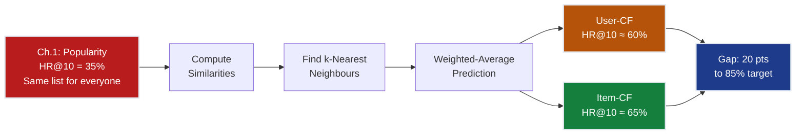
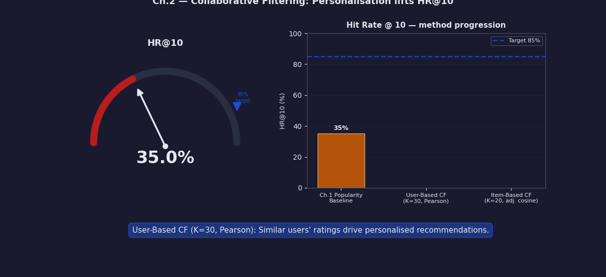
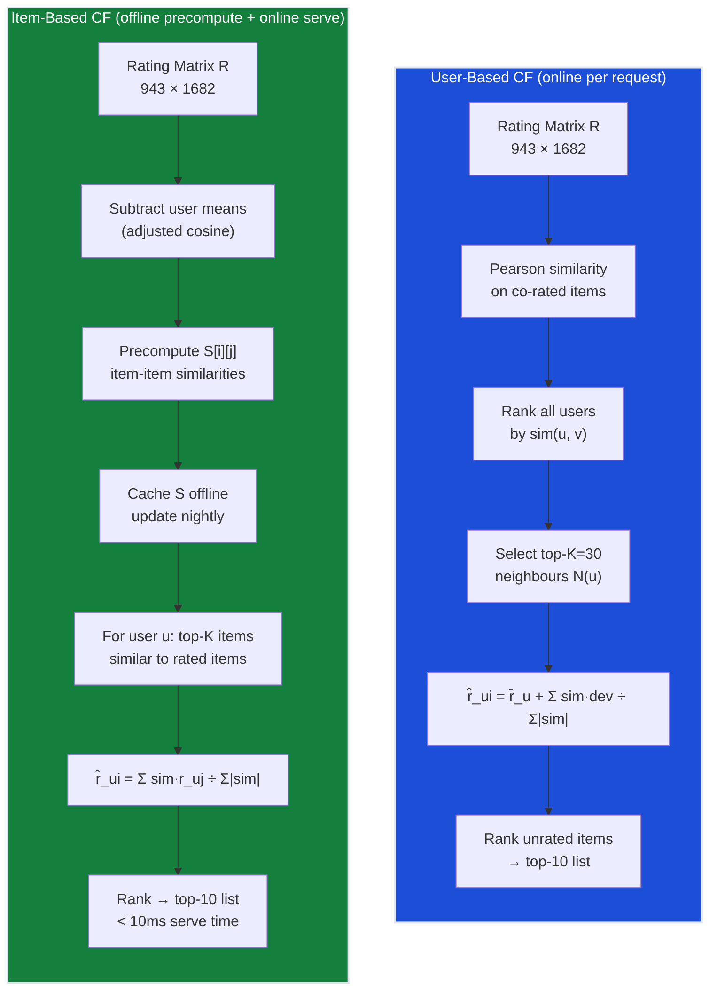
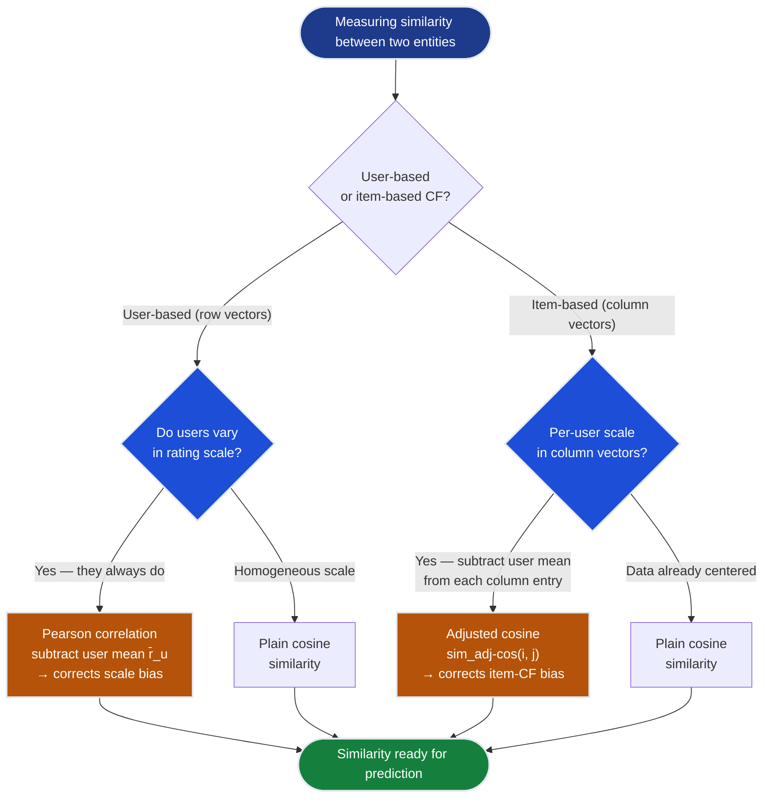
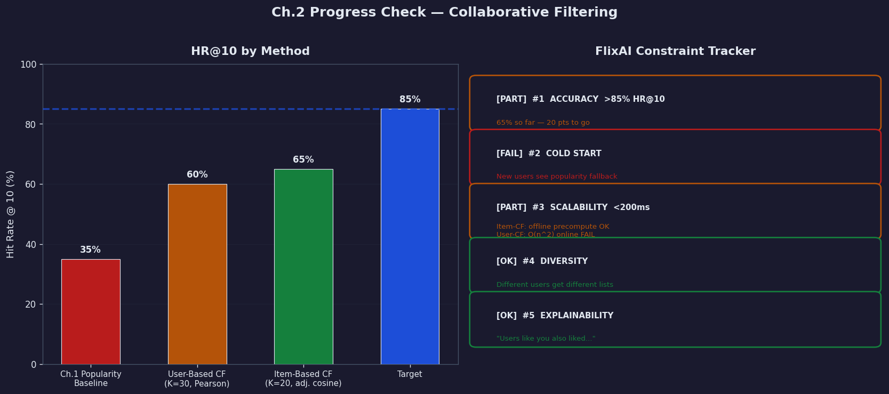

# Ch.2 — Collaborative Filtering

> **The story.** In **1994**, Paul Resnick and colleagues coined the term "collaborative filtering" in the **GroupLens** paper — a system where Usenet readers collaboratively filtered articles by rating them, and those ratings were used to recommend articles to similar readers. The insight was radical: you don't need to understand *what* an article (or movie) is about. You only need to know *who liked it*. If Alice and Bob vote identically on 50 articles, Alice will probably like what Bob rated highly but hasn't yet seen. Seven years later, **Sarwar, Karypis, Konstan and Riedl** (2001) published the paper Amazon had quietly patented in 1998: **item-based collaborative filtering**. Flip the perspective — instead of finding similar *users*, find similar *items*. "Star Wars" and "Blade Runner" attract similar ratings from similar people; recommend one to fans of the other. This proved more scalable: items don't change their preferences, but users do. The Netflix Prize (2006–2009) showed that CF alone could get within 6% of the winning solution. Today, CF is the backbone of Spotify, YouTube, and TikTok recommendations. The core insight, unchanged since 1994: **your taste is encoded in your ratings history, and people with similar history will like similar things in the future**.
>
> **Where you are in the curriculum.** Chapter two of the Recommender Systems track. The popularity baseline from Ch.1 gave every user the same 10 movies — HR@10 ≈ 35%. Now we personalise: find users with similar taste (user-based CF) or find movies with similar rating patterns (item-based CF), and recommend accordingly. This is the first time our system treats different users differently.
>
> **Notation in this chapter.** $r_{ui}$ — rating by user $u$ on item $i$ (1–5 stars, or missing if unrated); $\text{sim}(u, v)$ — similarity between users $u$ and $v$ (or items); $\mathcal{N}_k(u)$ — the $k$ nearest neighbours of user $u$; $\bar{r}_u$ — mean rating of user $u$ across all rated items; $\hat{r}_{ui}$ — predicted rating for user $u$ on item $i$; $I_{uv}$ — set of items co-rated by both $u$ and $v$; $K$ — neighbourhood size hyperparameter.

---

## 0 · The Challenge — Where We Are

> **The mission**: Launch **FlixAI** — a production movie recommendation engine satisfying 5 constraints:
> 1. **ACCURACY**: >85% hit rate @ top-10
> 2. **COLD START**: Handle new users/items gracefully
> 3. **SCALABILITY**: 1M+ ratings, <200ms latency
> 4. **DIVERSITY**: Not just popular movies
> 5. **EXPLAINABILITY**: "Because you liked X"

**What we know so far:**
- MovieLens 100k dataset loaded (943 users, 1,682 movies, 100,000 ratings, 93.7% sparse)
- Evaluation framework established (HR@10, Precision@k, NDCG)
- Popularity baseline = **35% hit rate@10**
- **But everyone gets the same 10 movies — zero personalisation!**

**What's blocking us:**

The popularity baseline treats a 20-year-old action fan and a 60-year-old romance lover identically. Both see "The Shawshank Redemption", "Pulp Fiction", "Forrest Gump" — the same top-10 list, every time. That is not personalisation. That is a billboard.

Your VP of Product: *"If we're just showing everyone the popular movies, why do we need machine learning? We could do this in Excel."*

The blocker is clear: we have **zero user-specific signal**. The popular-items model accumulates no information about individual tastes. Two users who have watched the exact same movies and rated them completely differently receive the same recommendations. A user who loves horror and hates romance gets the same list as a user who loves romance and hates horror. The popularity model doesn't even read the ratings column — it just counts.

**What this chapter unlocks:**
- **Personalisation**: Different users get different recommendations
- **User-based CF**: Find the K most similar users, weight their ratings, predict your preference
- **Item-based CF**: Find items similar to what you already rated, weighted prediction, stable + scalable
- **Explainability**: "Users who liked Star Wars also liked Blade Runner"
- **HR@10 jumps from 35% → ~65%** — a 30-point gain from personalisation alone



---

## Animation



---

## 1 · Core Idea

Find the K users most similar to you based on historical rating overlap, then use a similarity-weighted average of their ratings to predict your preference for unseen items — that is user-based CF. Alternatively, find the K items most similar to items you have already rated, and use a weighted average of your ratings for those similar items to predict your preference — that is item-based CF. Both methods exploit one fact: **no understanding of what the item is required** — only the pattern of who rated what and how highly. Cosine similarity or Pearson correlation quantifies the overlap; a neighbourhood size K between 20 and 50 balances signal strength against noise dilution.

---

## 2 · Running Example — What We're Solving

You're a data scientist at FlixAI. After the popularity baseline failed ("that's not personalisation, that's a billboard"), you examine the rating matrix and notice something striking: User 12 and User 47 have both rated Alien (4 and 5 stars), Blade Runner (5 and 4 stars), and The Terminator (4 and 4 stars). Their rating vectors are nearly parallel — they are practically the same sci-fi fan. User 12 has also rated 2001: A Space Odyssey (5 stars), a film User 47 hasn't seen. The CF logic: User 47 shares User 12's taste precisely; User 12 loved 2001; therefore recommend 2001 to User 47. No genre metadata, no director lookup, no plot analysis — just the pattern of who rated what.

**The 5×5 ratings subset.** To build intuition, consider 5 users and 5 movies drawn from MovieLens. Ratings are 1–5 stars; `—` means not yet rated (missing, not zero):

```
 M1 M2 M3 M4 M5
 Star Wars Fargo Pulp Fic. Blade Run. Titanic
User 1 [ 5 4 — 4 — ] r̄_1 = 4.33
User 2 [ 4 — 5 3 2 ] r̄_2 = 3.50
User 3 [ 5 3 — 5 1 ] r̄_3 = 3.50
User 4 [ — 4 3 — 5 ] r̄_4 = 4.00
User 5 [ 3 — 4 — 4 ] r̄_5 = 3.67
```

**Task**: predict User 1's rating for Movie 3 (Pulp Fiction) and Movie 5 (Titanic) — both unrated.

**Cosine similarity between User 1 and User 3** (co-rated items: M1 and M2):

```
User 1 vector on {M1, M2}: [5, 4]
User 3 vector on {M1, M2}: [5, 3]

Dot product: 5×5 + 4×3 = 25 + 12 = 37
‖User 1‖: √(5² + 4²) = √(25 + 16) = √41 = 6.403
‖User 3‖: √(5² + 3²) = √(25 + 9) = √34 = 5.831

sim(U1, U3) = 37 / (6.403 × 5.831) = 37 / 37.32 = 0.991
```

Very high similarity (0.991). Since User 3 hasn't rated M3 either, we also compute similarity with User 2.

**Cosine similarity between User 1 and User 2** (co-rated items: M1 and M4):

```
User 1 vector on {M1, M4}: [5, 4]
User 2 vector on {M1, M4}: [4, 3]

Dot product: 5×4 + 4×3 = 20 + 12 = 32
‖User 1‖: √(5² + 4²) = √41 = 6.403
‖User 2‖: √(4² + 3²) = √25 = 5.000

sim(U1, U2) = 32 / (6.403 × 5.000) = 32 / 32.02 = 0.999
```

Nearest neighbour: User 2 (sim=0.999), followed by User 3 (sim=0.991).

**Predict User 1's rating for Movie 3 (Pulp Fiction):**
- Only User 2 has rated M3 = 5. Similarity sim(U1, U2) = 0.999.
- $\bar{r}_{U1} = 4.33$, $\bar{r}_{U2} = 3.50$
- $\hat{r}_{U1,M3} = 4.33 + \frac{0.999 \times (5 - 3.50)}{0.999} = 4.33 + 1.50 = 5.83 \rightarrow \text{clip to } 5.0$

**Prediction: User 1 would rate Pulp Fiction ≈ 5** → strong recommendation.

> **Why this works**: we're not predicting an absolute score. We're borrowing User 2's *relative enthusiasm* for M3 (they rated it +1.50 above their own mean) and transferring it to User 1's scale. The neigh­bour's deviation from their mean is the portable signal.

---

## 3 · CF Algorithm at a Glance

### User-Based Collaborative Filtering

```
1. BUILD RATING MATRIX
 └─ R (sparse): 943 users × 1,682 movies
 └─ R[u][i] = rating by user u on movie i (1–5 stars, or missing)

2. FOR EACH USER u NEEDING RECOMMENDATIONS:
 a. Find all users v who share ≥5 co-rated items with u
 b. Compute sim(u, v) using Pearson correlation
 └─ Pearson mean-centers each user's ratings → handles scale bias
 c. Select top-K = 30–50 neighbours by similarity
 d. For each unrated item i:
 └─ r̂_ui = r̄_u + Σ_{v ∈ N(u)} sim(u,v)·(r_vi − r̄_v)
 ÷ Σ_{v ∈ N(u)} |sim(u,v)|

3. RANK all unrated items by r̂_ui
4. RETURN top-10 as recommendations
```

### Item-Based Collaborative Filtering

```
1. PRECOMPUTE ITEM SIMILARITY MATRIX (offline, once per day):
 └─ For each item pair (i, j): compute adjusted-cosine-sim
 on the column vectors of R (subtract each user's mean first)
 └─ Store only top-50 neighbours per item (sparse storage)

2. FOR EACH USER u NEEDING RECOMMENDATIONS (online):
 a. Find items J = {movies u has already rated}
 b. For each unrated candidate item i:
 └─ Find top-K items in J most similar to i (from cached matrix)
 └─ r̂_ui = Σ_{j ∈ N(i)∩J} sim(i,j)·r_uj
 ÷ Σ_{j ∈ N(i)∩J} |sim(i,j)|
 c. Rank by r̂_ui

3. RETURN top-10 as recommendations
```

> **Why item-based is preferred in production**: the item-item similarity matrix is precomputed offline overnight. Serving a recommendation at query time requires only a vector lookup + weighted average — typically <10ms. User-based CF must recompute user-user similarities at query time as the user base grows — O(n²) — which is completely unacceptable at scale.

---

## 4 · The Math

### 4.1 · Cosine Similarity

The most natural measure of direction agreement between two sparse rating vectors:

$$\text{sim}_{\cos}(u, v) = \frac{\mathbf{r}_u \cdot \mathbf{r}_v}{\|\mathbf{r}_u\| \cdot \|\mathbf{r}_v\|} = \frac{\sum_{i \in I_{uv}} r_{ui} \cdot r_{vi}}{\sqrt{\sum_{i \in I_{uv}} r_{ui}^2} \cdot \sqrt{\sum_{i \in I_{uv}} r_{vi}^2}}$$

The sum runs only over $I_{uv}$ — items rated by **both** users. Unrated items are excluded (not treated as 0).

**Toy numerical example:**

> User A observed ratings: M1=5, M2=3, M4=4 (write as vector $[5, 3, 0, 4, 0]$ — zeros = unrated)
> User B observed ratings: M1=4, M3=4, M4=1, M5=2 (vector $[4, 0, 4, 1, 2]$)
> Co-rated items $I_{AB}$: {M1, M4}

```
 M1 M4
User A ratings: 5 4
User B ratings: 4 1

Dot product: 5×4 + 4×1 = 20 + 4 = 24

‖User A‖ on I_AB = √(5² + 4²) = √(25 + 16) = √41 = 6.403
‖User B‖ on I_AB = √(4² + 1²) = √(16 + 1) = √17 = 4.123

sim_cos(A, B) = 24 / (6.403 × 4.123)
 = 24 / 26.396
 = 0.909
```

Similarity = **0.909** — fairly high, but derived from only 2 co-rated items. Treat with caution.

> **The sparsity trap**: with only 2 co-rated items, the similarity estimate is unreliable. A pair sharing exactly 1 movie always has cosine similarity = 1.0 (trivially "perfectly aligned" single-dimensional vectors) — a meaningless result. Require a minimum of 5–10 co-rated items before trusting a similarity score. Below that threshold, set similarity = 0 (unknown, not similar).

### 4.2 · Pearson Correlation — Correcting for Rating Scale Bias

Cosine similarity treats the *magnitude* of ratings as informative. But a generous rater (User C: always 4–5 stars) and a harsh rater (User D: always 1–3 stars) may have identical relative preferences. Their cosine similarity is low even though they agree on every ranking they've co-rated.

**Fix**: subtract each user's personal mean before computing similarity. This removes the scale offset and measures only *relative* preference — do both users agree on which movies are above or below their own average?

$$\text{sim}_{\text{Pearson}}(u, v) = \frac{\sum_{i \in I_{uv}} (r_{ui} - \bar{r}_u)(r_{vi} - \bar{r}_v)}{\sqrt{\sum_{i \in I_{uv}} (r_{ui} - \bar{r}_u)^2} \cdot \sqrt{\sum_{i \in I_{uv}} (r_{vi} - \bar{r}_v)^2}}$$

**Same Users A and B, now with Pearson:**

User A mean across all rated items: $\bar{r}_A = (5+3+4)/3 = 4.00$
User B mean across all rated items: $\bar{r}_B = (4+4+1+2)/4 = 2.75$

```
Mean-centered deviations on co-rated items {M1, M4}:
 User A: M1 → 5 − 4.00 = +1.00, M4 → 4 − 4.00 = 0.00
 User B: M1 → 4 − 2.75 = +1.25, M4 → 1 − 2.75 = −1.75

Numerator:
 (+1.00)(+1.25) + (0.00)(−1.75) = 1.25 + 0.00 = 1.25

‖dev_A‖ on I_AB = √(1.00² + 0.00²) = √1.00 = 1.000
‖dev_B‖ on I_AB = √(1.25² + 1.75²) = √(1.5625 + 3.0625) = √4.625 = 2.150

sim_Pearson(A, B) = 1.25 / (1.000 × 2.150)
 = 1.25 / 2.150
 = 0.581
```

Pearson = **0.581**, lower than cosine (0.909). The difference is correct: User B rated M4=1 (−1.75 below their mean — they strongly disliked it), while User A rated M4=4 (exactly at their mean — neutral). Their relative preferences on M4 diverge; Pearson captures this; cosine does not.

> **Rule of thumb**: use **Pearson for user-based CF** (corrects for generous vs harsh raters); use **adjusted cosine for item-based CF** (corrects for per-user scale in item column vectors).

### 4.3 · User-Based Prediction Formula

Once K neighbours are identified, predict user $u$'s rating for item $i$ as a mean-adjusted weighted average of neighbour deviations:

$$\hat{r}_{ui} = \bar{r}_u + \frac{\sum_{v \in \mathcal{N}_k(u)} \text{sim}(u, v) \cdot (r_{vi} - \bar{r}_v)}{\sum_{v \in \mathcal{N}_k(u)} |\text{sim}(u, v)|}$$

The deviation $(r_{vi} - \bar{r}_v)$ captures each neighbour's *relative enthusiasm*: did they like this item more or less than their typical rating? It is similarity-weighted and added to user $u$'s own mean rating $\bar{r}_u$.

**Toy numerical prediction — predict User A's rating for Movie 5:**

User A has not rated M5. Three neighbours with known M5 ratings:

| Neighbour | sim(A, v) | $r_{v,M5}$ | $\bar{r}_v$ | Deviation |
|-----------|-----------|------------|-------------|-----------|
| User C | 0.90 | 5 | 3.50 | +1.50 |
| User D | 0.75 | 4 | 3.00 | +1.00 |
| User E | 0.60 | 3 | 3.20 | −0.20 |

User A's mean: $\bar{r}_A = 4.00$

```
Numerator (similarity-weighted deviations):
 0.90 × (+1.50) = +1.350
 0.75 × (+1.00) = +0.750
 0.60 × (−0.20) = −0.120
 ──────────────────────
 Total: +1.980

Denominator (sum of absolute similarities):
 |0.90| + |0.75| + |0.60| = 2.25

Correction term: 1.980 / 2.25 = +0.880

Predicted rating: r̂_{A,M5} = 4.00 + 0.880 = 4.88 → clip to 5.0
```

**Interpretation**: All three neighbours liked M5 above their own averages (positive deviations). The two most-similar neighbours (Users C and D) contribute the strongest signal. User A is predicted to rate M5 ≈ 5 → strong recommendation.

> **Why the denominator matters**: without normalisation, the correction scales with the *number* of neighbours. With 100 neighbours instead of 3, the raw sum would be ~33× larger. The denominator keeps the weighted average well-behaved regardless of neighbourhood size.

### 4.4 · Item-Based CF — Adjusted Cosine Similarity

For item-based CF we compare the *column* vectors of $R$ — how all users rated item $i$ versus item $j$. But users differ in their rating scales: a generous rater's column entries are all high, a harsh rater's all low. Raw cosine similarity on column vectors would measure rater generosity, not item similarity.

**Fix — adjusted cosine**: subtract each **user's mean** from every entry before computing item-item similarity:

$$\text{sim}_{\text{adj-cos}}(i, j) = \frac{\sum_{u \in U_{ij}} (r_{ui} - \bar{r}_u)(r_{uj} - \bar{r}_u)}{\sqrt{\sum_{u \in U_{ij}} (r_{ui} - \bar{r}_u)^2} \cdot \sqrt{\sum_{u \in U_{ij}} (r_{uj} - \bar{r}_u)^2}}$$

where $U_{ij}$ is the set of users who rated *both* item $i$ and item $j$.

**3×5 toy ratings matrix** (rows = users, columns = movies):

```
 M1 M2 M3 M4 M5 r̄_u
User A [ 5 3 — 4 — ] r̄_A = (5+3+4)/3 = 4.00
User B [ 4 — 5 3 2 ] r̄_B = (4+5+3+2)/4 = 3.50
User C [ 3 4 3 — 5 ] r̄_C = (3+4+3+5)/4 = 3.75
```

**Compute adjusted cosine similarity between M1 and M2:**

Users who rated both M1 and M2: {User A, User C}

```
User A: (r_A,M1 − r̄_A)(r_A,M2 − r̄_A) = (5 − 4.00)(3 − 4.00)
 = (+1.00)(−1.00) = −1.000

User C: (r_C,M1 − r̄_C)(r_C,M2 − r̄_C) = (3 − 3.75)(4 − 3.75)
 = (−0.75)(+0.25) = −0.188

Numerator: −1.000 + (−0.188) = −1.188

‖M1_adj‖ = √((+1.00)² + (−0.75)²) = √(1.000 + 0.5625) = √1.5625 = 1.250
‖M2_adj‖ = √((−1.00)² + (+0.25)²) = √(1.000 + 0.0625) = √1.0625 = 1.031

sim_adj-cos(M1, M2) = −1.188 / (1.250 × 1.031)
 = −1.188 / 1.289
 = −0.922
```

**Result: −0.922** — strongly negative. Users who rate M1 (Star Wars / action) high tend to rate M2 (Fargo / drama) low. These items are anti-correlated in taste. Including M1 as a "similar item" to M2 in a prediction would actively mislead the recommender.

**Item-based prediction for User B on M2 (unrated):**

Items similar to M2 that User B has rated: M1 (sim=−0.922), M3 (assume sim(M2,M3)=+0.71 from the full computed matrix).

```
Numerator: sim(M2,M1)·r_{B,M1} + sim(M2,M3)·r_{B,M3}
 = (−0.922)(4) + (+0.71)(5)
 = −3.688 + 3.550 = −0.138

Denominator: |−0.922| + |+0.71| = 0.922 + 0.710 = 1.632

r̂_{B,M2} = −0.138 / 1.632 = −0.085 → add to baseline ≈ 3.5
```

Near zero correction — M1's negative pull and M3's positive pull nearly cancel. User B is predicted to rate M2 near their mean (~3.5 stars) — a mediocre recommendation; don't rank it highly.

---

## 5 · Similarity Discovery Arc

The choice of similarity metric is not arbitrary — each generation fixed the blind spot of the previous one.

**Act 1 — Euclidean distance** *(first instinct, quickly broken)*

The most natural measure: how far apart are two rating vectors in feature space?

$$d(u, v) = \sqrt{\sum_{i=1}^{n} (r_{ui} - r_{vi})^2}$$

**Where it breaks**: sparsity. If User A has rated 200 movies and User B has rated 5, the distance accumulates on the 195 movies only A has rated. The standard implementation treats unrated as 0 — making an unrated movie look like "rated 0 stars" disagreement. Every unobserved entry inflates the distance. Two users with identical taste but different activity levels look dissimilar. Useless.

**Act 2 — Cosine similarity** *(angle, not magnitude)*

Focus on the *direction* of the rating vector, ignoring its length. The angle between two vectors captures taste alignment regardless of how many movies each user has rated. Robust to differing activity levels.

**Where it breaks**: rating scale bias. A generous rater (User C: 4–5 stars for everything) and a harsh rater (User D: 1–2 stars for everything) with identical relative preferences produce low cosine similarity because their vectors point in different directions magnitudewise. A fan who gives "5-star I loved it" vs a critic who gives the same film "3-star I liked it" — cosine treats these as disagreements.

**Act 3 — Pearson correlation** *(angle after per-user mean-centering)*

Subtract each user's mean rating before computing the angle. This removes the systematic per-user offset and measures only *relative* preference: do both users agree on which movies are above or below their personal average? Pearson = 1.0 means identical rankings, even if the absolute scales differ. This is the right invariant for user-based CF.

**Where it breaks**: item-based CF on column vectors. When building item-item similarity, we compare column vectors that mix entries from different users. Pearson on raw columns still sees user-scale differences — User C's column entries are all high, User D's all low — because Pearson on a column doesn't subtract the per-user mean.

**Act 4 — Adjusted cosine** *(for item-based CF: subtract the user mean from each entry)*

Before computing item-item cosine similarity, subtract each *user's* mean from every entry in that user's row. Now comparing item columns sees mean-centered deviations — the per-user scale is fully removed even for item-based comparisons. The result: item-item similarities that reflect whether two items attract above-average vs below-average ratings from the same users.

```
Metric evolution:

 Euclidean → punishes unrated-as-zero; fails on sparse data
 ↓ FIX: measure angle, not distance
 Cosine → angle only; robust to activity level
 ↓ FIX: remove per-user scale offset
 Pearson → mean-centered angle; correct for user-based CF
 ↓ FIX: remove per-user scale from item column vectors
 Adj. Cosine → user-mean-centered before item comparison;
 correct for item-based CF
```

---

## 6 · Full CF Walkthrough — 5-User, 5-Movie Matrix

**Goal**: use user-based CF to predict User 5's ratings for unrated movies and generate a top-2 recommendation list.

**Rating matrix with row means:**

```
 M1 M2 M3 M4 M5 r̄_u
User 1 [ 5 4 — 4 — ] 4.33
User 2 [ 4 — 5 3 2 ] 3.50
User 3 [ 5 3 — 5 1 ] 3.50
User 4 [ — 4 3 — 5 ] 4.00
User 5 [ 3 — 4 — 4 ] 3.67 ← target (M2, M4 unrated)
```

**Step 1 — Compute cosine similarity between User 5 and every other user:**

*User 5 vs User 1* — co-rated: {M1} only → 1 item, below minimum threshold. **Excluded.**

*User 5 vs User 2* — co-rated: {M1, M3, M5}: User 5=[3,4,4], User 2=[4,5,2]

```
dot = 3×4 + 4×5 + 4×2 = 12 + 20 + 8 = 40
‖U5‖ = √(9+16+16) = √41 = 6.403
‖U2‖ = √(16+25+4) = √45 = 6.708
sim(U5,U2) = 40 / (6.403×6.708) = 40 / 42.94 = 0.932
```

*User 5 vs User 3* — co-rated: {M1, M5}: User 5=[3,4], User 3=[5,1]

```
dot = 3×5 + 4×1 = 15 + 4 = 19
‖U5‖ = √(9+16) = √25 = 5.000
‖U3‖ = √(25+1) = √26 = 5.099
sim(U5,U3) = 19 / (5.000×5.099) = 19 / 25.50 = 0.745
```

*User 5 vs User 4* — co-rated: {M3, M5}: User 5=[4,4], User 4=[3,5]

```
dot = 4×3 + 4×5 = 12 + 20 = 32
‖U5‖ = √(16+16) = √32 = 5.657
‖U4‖ = √(9+25) = √34 = 5.831
sim(U5,U4) = 32 / (5.657×5.831) = 32 / 32.98 = 0.970
```

**Step 2 — Ranked similarities (minimum 2 co-rated items required):**

| Neighbour | sim(U5, v) | Co-rated count | Status |
|-----------|------------|----------------|--------|
| User 4 | **0.970** | 2 | included |
| User 2 | **0.932** | 3 | included |
| User 3 | 0.745 | 2 | included (fallback) |
| User 1 | 1.000 | 1 | excluded (< min) |

**Step 3 — Select top-K = 2 neighbours**: User 4 (0.970) and User 2 (0.932).

**Step 4 — Predict User 5's rating for Movie 4 (unrated):**

User 4 has not rated M4 → cannot contribute. Fall back: include User 3 as third neighbour.
Contributors: User 2 (sim=0.932, r_{2,M4}=3, r̄_2=3.50) and User 3 (sim=0.745, r_{3,M4}=5, r̄_3=3.50).

```
Numerator:
 0.932 × (3 − 3.50) + 0.745 × (5 − 3.50)
= 0.932 × (−0.50) + 0.745 × (+1.50)
= −0.466 + 1.118
= +0.652

Denominator: |0.932| + |0.745| = 1.677

Correction: +0.652 / 1.677 = +0.389

r̂_{5,M4} = r̄_5 + 0.389 = 3.67 + 0.389 = 4.06
```

User 2 mildly disliked M4 (deviation −0.50) but User 3 loved it (deviation +1.50). User 3's stronger positive pull wins. Prediction: **4.06 for Blade Runner**.

**Step 5 — Predict User 5's rating for Movie 2 (also unrated):**

Contributors who have rated M2: User 4 (sim=0.970, r_{4,M2}=4, r̄_4=4.00) and User 3 (sim=0.745, r_{3,M2}=3, r̄_3=3.50). User 2 has not rated M2.

```
Numerator:
 0.970 × (4 − 4.00) + 0.745 × (3 − 3.50)
= 0.970 × (0.00) + 0.745 × (−0.50)
= 0.000 − 0.373 = −0.373

Denominator: |0.970| + |0.745| = 1.715

Correction: −0.373 / 1.715 = −0.217

r̂_{5,M2} = 3.67 − 0.217 = 3.45
```

User 4 is neutral on M2 (exactly at their mean), User 3 mildly dislikes it (−0.50 below mean). Prediction: **3.45 for Fargo** — below User 5's mean. Weak recommendation.

**Step 6 — Top-2 recommendation list for User 5:**

| Unrated Movie | Predicted Rating | Rank |
|---------------|-----------------|------|
| M4 Blade Runner | **4.06** | **1st** |
| M2 Fargo | 3.45 | 2nd |

User 5 should see Blade Runner first — predicted 0.39 above their mean, versus 0.22 below their mean for Fargo.

---

## 7 · Key Diagrams

### User-Based vs Item-Based CF Pipeline



### Similarity Metric Selection Flowchart



---

## 8 · Hyperparameter Dial

Three dials dominate CF performance. All three interact: too-strict minimum co-ratings shrinks the effective neighbourhood; too-large K dilutes the quality signal.

| Parameter | Too Low | Sweet Spot | Too High |
|-----------|---------|------------|----------|
| **K** (neighbours) | K=2: one bad rater dominates; high variance | K=20–50 user-CF; K=10–20 item-CF | K=200+: dissimilar users dilute signal |
| **Min co-rated items** | 0: pair sharing 1 movie has sim=1.0 (noise) | 5–10: enough overlap for a reliable angle estimate | 50+: fewer than 5% of pairs qualify |
| **Similarity metric** | Euclidean: inflates on sparse data | Pearson (user-CF), Adj. cosine (item-CF) | — |
| **Min similarity threshold** | −1.0: anti-correlated users as neighbours | 0.0: only positive correlation | 0.7+: too restrictive; very few valid pairs |
| **Max items per user cache** | — | Top-50 per item in S (sparse) | Full dense S matrix is O(n²) RAM |

> **Constraint #3 — Scalability check**: K directly controls per-query compute. User-based CF with K=50 on 943 users is trivial. At 1 million users, user-CF must evaluate up to 50 million pair lookups per recommendation request — unacceptable at <200ms latency. Item-based CF avoids this by serving from the precomputed cache.

> **Constraint #1 — Accuracy check**: K is the classic bias-variance dial. Small K → low bias (only the most similar users contribute) but high variance (one noisy rater dominates). Large K → higher bias (includes somewhat-dissimilar users) but lower variance (averaged over many). The sweet spot on MovieLens 100k is K=30–50 for user-based CF.

---

## 9 · What Can Go Wrong

**1. Sparsity kills cosine similarity estimates**

With 93.7% of the matrix empty, most user pairs share fewer than 5 co-rated movies. The cosine angle between two 2D vectors (sharing only 2 movies) is wildly unstable — tiny rating differences produce huge angle changes. A pair sharing exactly 1 movie always has cosine similarity = 1.0 by construction. Fix: require minimum 10 co-rated items; use shrinkage (reduce similarity toward 0 for low-overlap pairs proportional to the overlap count).

**2. Popularity bias in neighbourhoods**

Popular movies (rated by 500+ users) dominate every user's rating vector. Two users who both rated "Forrest Gump" look similar based solely on that shared rating — even if one loves action and the other loves musicals. The most popular movies provide the most co-rated items, so they drive neighbourhood membership disproportionately. Fix: weight items by inverse popularity before computing similarity (IDF weighting), so rare shared ratings carry more signal.

**3. Cold start — new users have no ratings**

A user with zero ratings has no rating vector. Cosine and Pearson similarity are undefined. The system falls back to the popularity baseline — the same one we just improved upon. Fix: collect 5–10 forced ratings at onboarding (active cold start); use demographic or session-context features as a temporary proxy until collaborative history accumulates.

**4. Cold start — new items have no rating history**

A movie released yesterday has zero ratings. It appears in no user's co-rated set and cannot be part of any item-item similarity pair. The item is invisible to the CF engine. Fix: seed new items with content-based feature predictions (genre/director embedding similarity) until collaborative data accumulates; hybrid models (Ch.5) address this explicitly.

**5. O(n²) user-user similarity does not scale**

User-based CF requires computing all user-user similarities: $\binom{n}{2}$ pairs. For 943 users, that's 444,903 pairs — trivial. For 1 million users, it is 500 billion pairs, and the dense similarity matrix would be 8 TB at float64. Fix: approximate nearest-neighbour search (LSH, FAISS, HNSW) for fast approximate similarity; or switch to matrix factorization (Ch.3), which scales linearly with users and items.

**6. Feedback loops and filter bubbles**

CF recommends what similar users liked. Those users also received CF recommendations. Over time, popular-among-similar-users items accumulate ratings faster than niche items, and the CF signal increasingly reflects the CF-driven consumption rather than organic preferences. Users gradually receive narrower recommendations. Fix: explicit diversity constraints in the final ranking step; periodic exploration (occasionally recommend items outside the predicted top-10).

---

## 10 · Where This Reappears

| Location | How it builds on collaborative filtering |
|----------|------------------------------------------|
| **Ch.3 — Matrix Factorization** | Replaces explicit neighbourhood search with learned latent factors $\mathbf{u}_u$ and $\mathbf{v}_i$ such that $\hat{r}_{ui} = \mathbf{u}_u \cdot \mathbf{v}_i$. Solves sparsity by generalising across all items simultaneously rather than only the K-nearest neighbourhood. Typically HR@10 ≈ 75–78%. |
| **Ch.4 — Neural CF** | Replaces the dot-product similarity with a learned non-linear function (MLP). Captures non-linear taste interactions that Pearson correlation misses. The neighbourhood concept generalises to learned attention over item embeddings. |
| **Ch.5 — Hybrid Systems** | Combines CF similarity signals with content-based features (genre, director, synopsis embeddings). Mitigates cold start by using content metadata for new users/items where the rating history is absent. |
| **Ch.6 — Production & Serving** | The offline/online split introduced here — precompute item-item similarity nightly, serve recommendations at query time from cache in <10ms — is the production pattern for all large-scale recommender systems at Spotify, YouTube, and Amazon. |

> ➡ **Matrix factorization (Ch.3)** closes the sparsity gap by learning a compressed representation of the rating matrix — user embeddings and item embeddings — that generalise across all available signal rather than only the K nearest neighbours.

---

## 11 · Progress Check



**Hit Rate @ 10 — FlixAI mission progression:**

| Method | HR@10 | Personalised? | Cold Start? | Scalable? |
|--------|-------|---------------|-------------|-----------|
| Ch.1 Popularity baseline | 35% | Same for everyone | N/A | Trivial |
| User-based CF (K=30, Pearson) | ~60% | Yes | Popularity fallback | O(n²) online |
| Item-based CF (K=20, adj. cosine) | ~65% | Yes | Popularity fallback | Offline precompute |
| **Target** | **85%** | — | — | — |

**FlixAI constraint tracker after Ch.2:**

| Constraint | Status | Notes |
|------------|--------|-------|
| **#1 ACCURACY >85%** | 🟡 Partial — 65% so far | 20-point gap remains |
| **#2 COLD START** | Not solved | New users still see popularity fallback |
| **#3 SCALABILITY** | 🟡 Partial | Item-CF offline ; User-CF O(n²) |
| **#4 DIVERSITY** | Unlocked | Different users get different lists |
| **#5 EXPLAINABILITY** | Unlocked | "Users like you also liked…" |
**Unlocked this chapter:**
- Personalisation: different users receive different recommendations for the first time
- HR@10 jumps from 35% to ~65% — a 30-point gain from exploiting user taste overlap
- Explainability: neighbour-based reasoning — "because users who liked Star Wars also liked Blade Runner"
- Item-based CF is production-ready with offline precomputation (Constraint #3 partial )
**Still blocked:**
- **Cold start**: users with zero ratings get the popularity fallback (Constraint #2 )
- **Extreme sparsity**: 93.7% empty matrix → most user pairs share fewer than 5 co-rated movies → noisy similarity estimates
- **20-point gap to 85%**: neighbourhood-based CF plateaus around 65–68%; closing the remaining gap requires learning latent features rather than searching explicit neighbourhoods
- **User-CF cannot scale to 1M+ users**: O(n²) similarity computation is not viable at query time

**Real-world status**: We have genuine personalisation — a major step beyond the popularity billboard. But the sparsity and cold-start problems are baked into the neighbourhood-based approach and cannot be fixed by tuning K or changing the similarity metric. The data is too sparse for reliable neighbourhoods; we need a model that generalises across the *whole* matrix simultaneously.

**Next up:** Ch.3 gives us **matrix factorization** — decompose $R \approx UV^\top$ into low-dimensional user embeddings $U$ and item embeddings $V$ that capture taste structure from all available ratings at once. HR@10 typically rises to ~75–78%.

---

## 12 · Bridge to Ch.3 — Matrix Factorization

Collaborative filtering found the best K neighbours and averaged their ratings. The fundamental limitation: with 93.7% of the matrix empty, those neighbours are selected from tiny overlapping rating sets — the angle estimate is fragile and the predictions noisy. What if, instead of remembering every observed rating and searching for neighbours at query time, we **compressed** the entire matrix into compact vectors — latent factors — that capture the underlying taste structure? User 5's preference for sci-fi action over romantic drama is a latent dimension that influences all their ratings simultaneously; a latent factor model learns it from the full pattern of ratings, not just the K nearest neighbours.

Matrix factorization (Ch.3) decomposes $R \approx UV^\top$ where $U \in \mathbb{R}^{m \times d}$ gives each user a $d$-dimensional latent taste vector and $V \in \mathbb{R}^{n \times d}$ gives each item a $d$-dimensional latent style vector. The predicted rating is a dot product: $\hat{r}_{ui} = \mathbf{u}_u \cdot \mathbf{v}_i$. There are no explicit neighbourhoods and no similarity matrix to precompute — just two embedding lookups and a dot product at query time. The factorization generalises to unseen user-item pairs by learning the geometry of taste, not just memorising who liked what.
