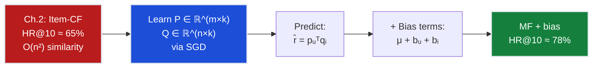
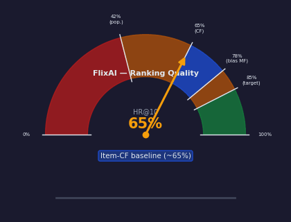
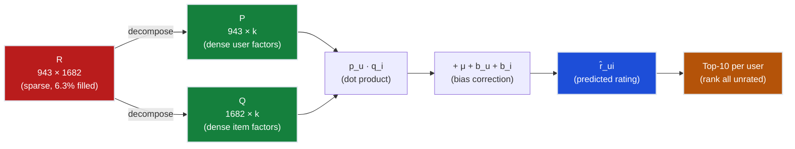
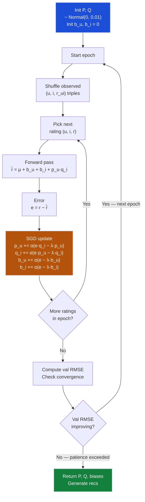
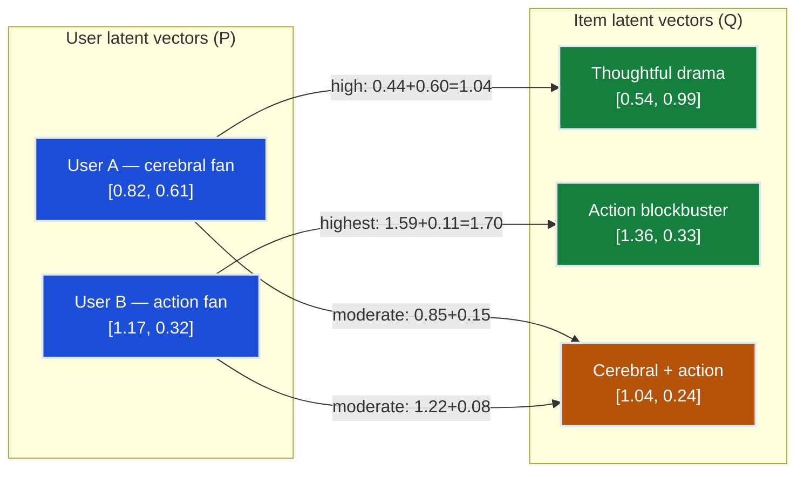
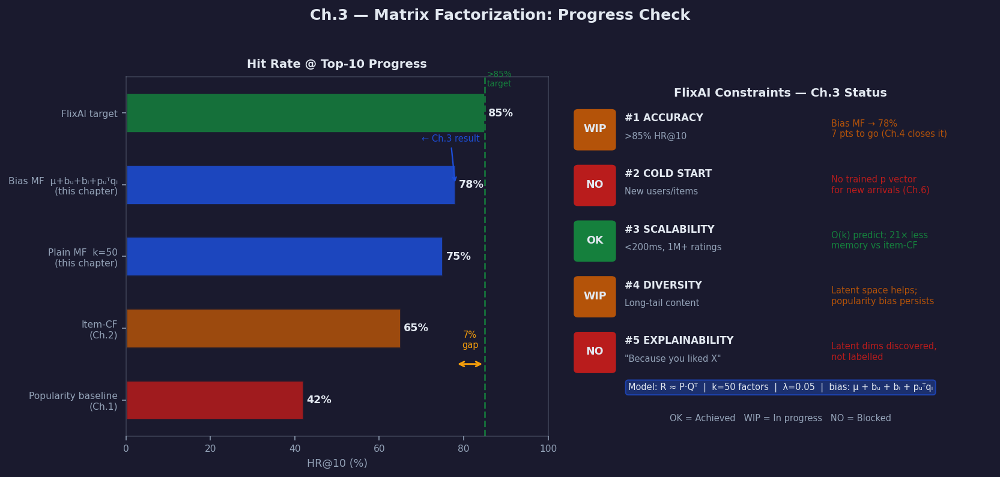

# Ch.3 — Matrix Factorization

> **The story.** The mathematics behind matrix factorization is older than the internet. In **1901** Karl Pearson introduced principal components — the idea that a dataset can be compressed into fewer dimensions without losing the signal. By the **1960s** numerical analysts had formalised **Singular Value Decomposition (SVD)**: any matrix $R = U \Sigma V^T$, an exact decomposition into orthogonal bases. The trouble was that SVD requires knowing the *entire* matrix — but a recommender system's ratings matrix is 93.7% empty. Decompose what you can't observe and you're guessing.
>
> The breakthrough came from an unlikely source: a blog post. In **2006** Simon Funk (pseudonym), competing in the **Netflix Prize**, published "Netflix Update: Try This at Home." His insight was simple — instead of decomposing the full matrix exactly, only train on the ratings you *can* see, using SGD to learn user and item vectors one rating at a time. He called it "funky SVD" and it rocketed him to third on the leaderboard overnight. Within weeks every serious competitor had adopted the approach.
>
> **Yehuda Koren** at Yahoo! Research took it further. His **2008 SVD++** paper added implicit feedback (browsing history, clicks) to the user vector, and his **2009 paper** "Matrix Factorization Techniques for Recommender Systems" — co-authored with Bell and Volinsky — presented the full mathematical framework with bias terms, temporal dynamics, and confidence weighting. The BellKor team won the Netflix Prize with a 10.06% RMSE improvement, their solution a blend of over 100 models of which regularised matrix factorisation was the backbone. In **2012** Steffen **Rendle** published **BPR (Bayesian Personalized Ranking)**, extending factorization to implicit feedback via pairwise ranking — the foundation of modern "Learn to Rank" systems. Every major platform — Netflix, Spotify, YouTube, Amazon — runs a descendant of these ideas today.
>
> **Where you are in the curriculum.** Chapter three. Collaborative filtering (Ch.2) achieved ~65% HR@10 but was crippled by sparsity — 93.7% of the ratings matrix is empty, so most user pairs share fewer than 5 movies. Matrix factorization solves this by mapping users and items into a shared **latent space** where the dot product approximates a rating. Even if two users never rated the same movie, their vectors can be close — capturing "cerebral sci-fi lover" or "90s comedy fan" without those labels ever being defined. This is your first encounter with *latent representations* — the same idea powering word embeddings, BERT, and every deep learning model you will see later in this track.
>
> **Notation in this chapter.** $R \in \mathbb{R}^{m \times n}$ — user-item rating matrix ($m$ users, $n$ items); $P \in \mathbb{R}^{m \times k}$ — user latent factor matrix; $Q \in \mathbb{R}^{n \times k}$ — item latent factor matrix; $k$ — number of latent factors (rank of the approximation); $\mathbf{p}_u \in \mathbb{R}^k$ — latent vector for user $u$; $\mathbf{q}_i \in \mathbb{R}^k$ — latent vector for item $i$; $\hat{r}_{ui} = \mathbf{p}_u^\top \mathbf{q}_i$ — predicted rating; $\lambda$ — L2 regularisation strength; $\alpha$ — SGD learning rate; $e_{ui} = r_{ui} - \hat{r}_{ui}$ — prediction error; $\mu$ — global mean rating; $b_u$ — user bias; $b_i$ — item bias.

---

## 0 · The Challenge — Where We Are

> 🎯 **The mission**: Launch **FlixAI** — >85% hit rate@10 across 5 constraints:
> 1. **ACCURACY**: >85% hit rate @ top-10 (every point = $2M ARR)
> 2. **COLD START**: Handle new users/items gracefully
> 3. **SCALABILITY**: 1M+ ratings, <200ms latency
> 4. **DIVERSITY**: Surface long-tail content, not just blockbusters
> 5. **EXPLAINABILITY**: "Because you liked X" — trustable recommendations

**What we know so far:**
- ✅ **Ch.1**: Popularity baseline → 42% HR@10 (not personalised)
- ✅ **Ch.2**: Item-based Collaborative Filtering → ~65% HR@10 (personalised but sparse)
- ❌ **But we still can't reach 85%!** Sparsity is crippling us.

**What's blocking us — and why MF solves it:**

Item-CF stores a full **item-item similarity matrix**: $O(n^2)$ memory for $n$ items. With 1,682 movies that's 2.8 million similarity scores to compute and store. But the deeper problem is the data void. In a 943×1,682 matrix with 100k ratings, coverage is 6.3% — most user pairs share too few items to compute a reliable cosine similarity. User 42 and User 87 may both adore cerebral sci-fi but if they haven't rated any of the same movies the similarity is exactly zero and the system can't bridge them.

Matrix factorisation changes the algebra entirely. Instead of computing pairwise similarities, MF compresses the entire ratings signal into two small dense matrices:

| Representation | Memory | Coverage |
|---|---|---|
| Item-CF similarity matrix | $O(n^2) = 1{,}682^2 \approx 2.8\text{M}$ floats | Only users/items with shared ratings |
| MF factor matrices $P$, $Q$ | $O((m+n) \times k) = (943+1682) \times 50 \approx 131\text{k}$ floats | **All** users and items, including unseen pairs |

With $k=50$ factors, MF is **21× more compact** than the similarity matrix — and it fills in the missing entries through learned structure rather than leaving them undefined.

The key insight: MF discovers **latent "genre-taste" dimensions** automatically. Dimension 1 might correspond to "cerebral sci-fi", dimension 2 to "90s action blockbuster", dimension 12 to "indie arthouse" — the model doesn't name these, but it discovers that certain users and certain items project onto shared subspaces. The dot product $\mathbf{p}_u^\top \mathbf{q}_i$ then acts as a **taste-to-attribute alignment score** rather than a direct rating prediction.

| Constraint | Status after this chapter | Notes |
|-----------|--------------------------|-------|
| ACCURACY >85% HR@10 | ⚠️ 65% → 75–78% | Latent factors close the gap; not fully there yet |
| COLD START | ❌ Still fails | New user = no trained vector |
| SCALABILITY | ✅ Much better | $O(k)$ prediction, $O(k)$ per SGD step |
| DIVERSITY | ⚠️ Moderate | Latent space surfaces niche items more than item-CF |
| EXPLAINABILITY | ⚠️ Harder | Factors are discovered, not labelled |



---

## Animation



*Visual takeaway: item-CF's sparse neighbourhood lookups give way to a dense latent space where every user-item pair has a meaningful alignment score. HR@10 climbs from ~65% to ~78% as biases and regularisation are added.*

> ⚡ **Constraint progress**: This chapter advances **Constraint #1 (ACCURACY)** from ~65% → ~78% by replacing sparse similarity lookups with dense latent factor dot products. We're now 7 points from the 85% target — Ch.4 neural CF will close it.

---

## 1 · Core Idea

Matrix factorisation decomposes the sparse ratings matrix $R$ into two dense low-rank matrices — a user factor matrix $P$ and an item factor matrix $Q$ — such that $R \approx P \cdot Q^\top$. Each user is represented by a $k$-dimensional vector capturing latent preferences, and each item by a $k$-dimensional vector capturing latent attributes; the dot product $\mathbf{p}_u^\top \mathbf{q}_i$ predicts how much user $u$ will like item $i$. Training minimises reconstruction error on the observed ratings plus an L2 regularisation penalty, updating $P$ and $Q$ jointly via stochastic gradient descent one rating at a time.

---

## 2 · Running Example: From 943×1,682 Down to Latent Space

You're still the Lead ML Engineer at FlixAI. After shipping item-CF last sprint, the VP of Product calls again:

> *"User 42 loved 'Blade Runner' and 'Minority Report'. Why isn't the system recommending '2001: A Space Odyssey'?"*

You check the collaborative filter. User 42's nearest neighbours have barely rated "2001." Without a neighbour connection, the similarity engine can't surface it. Coverage gap.

But you suspect User 42 and "2001" share something deeper — **cerebral sci-fi**. If you could discover that hidden dimension, the recommendation would be obvious.

Matrix factorisation does exactly that.

**Full-scale problem:** MovieLens 100k — 943 users, 1,682 movies, 100,000 ratings. The goal is to factorise:

$$R^{943 \times 1682} \approx P^{943 \times k} \cdot (Q^{1682 \times k})^\top$$

with $k = 50$ latent factors.

After training, User 42's latent vector has high values on the "cerebral sci-fi" dimension and low values on "romance." "2001"'s latent vector has similarly high values on "cerebral sci-fi." Their dot product is large — the system recommends "2001" even though no neighbour connection ever existed.

**Toy decomposition (3 users × 3 movies, k=2):**

To build intuition, consider a 3-user 3-movie example with $k=2$ latent factors. The rating matrix $R$ has some observed entries (values 1–5) and missing entries (—):

$$R = \begin{pmatrix} - & 4 & 3 \\ 4 & 2 & - \\ 1 & - & 5 \end{pmatrix} \quad \approx \quad P \cdot Q^\top = \begin{pmatrix} p_{1,1} & p_{1,2} \\ p_{2,1} & p_{2,2} \\ p_{3,1} & p_{3,2} \end{pmatrix} \begin{pmatrix} q_{1,1} & q_{2,1} & q_{3,1} \\ q_{1,2} & q_{2,2} & q_{3,2} \end{pmatrix}$$

The matrix $P \in \mathbb{R}^{3 \times 2}$ has one row per user; $Q \in \mathbb{R}^{3 \times 2}$ has one row per movie. The two columns represent two latent dimensions — after training, you might interpret dimension 1 as "action intensity" and dimension 2 as "cerebral depth," but the model discovers these structures automatically from ratings alone.

**What the matrices mean after training:**

| User | Dim 1 (e.g. "action") | Dim 2 (e.g. "cerebral") | Interpretation |
|------|-----------------------|------------------------|----------------|
| $\mathbf{p}_1 = [0.82, 0.61]$ | medium-high | medium | Likes both action and cerebral content |
| $\mathbf{p}_2 = [0.66, 0.84]$ | medium | high | Cerebral content lover |
| $\mathbf{p}_3 = [1.17, 0.32]$ | very high | low | Pure action fan |

| Movie | Dim 1 | Dim 2 | Interpretation |
|-------|-------|-------|----------------|
| $\mathbf{q}_1 = [0.77, 0.62]$ | high | medium | Action/adventure |
| $\mathbf{q}_2 = [0.54, 0.99]$ | medium | very high | Thoughtful drama |
| $\mathbf{q}_3 = [1.36, 0.33]$ | very high | low | Pure action blockbuster |

Predicted rating for User 3 (action fan) × Movie 3 (action blockbuster): $\mathbf{p}_3^\top \mathbf{q}_3 = 1.17 \times 1.36 + 0.32 \times 0.33 = 1.59 + 0.11 = 1.70$. After adding bias terms and rescaling to a 1–5 range, this maps to a strong predicted preference — even though User 3 never rated Movie 3 in training.

---

## 3 · MF Training at a Glance

Before diving into the math, here is the full training loop. Each step below has a corresponding deep-dive in §4 and §6.

```
1. Initialise P ∈ ℝ^(m×k) and Q ∈ ℝ^(n×k)
   └─ Draw each element ~ Normal(0, 0.01)
   └─ Small random init prevents symmetry (identical rows learn nothing new)

2. For each training epoch:

   a. Shuffle the list of observed (u, i, r_ui) triples

   b. For each observed rating (u, i, r_ui):
      i.   Predict:  r̂_ui = p_u · q_i  (dot product, k multiplications)
      ii.  Error:    e_ui  = r_ui - r̂_ui
      iii. Update:   p_u ← p_u + α · (e_ui · q_i  − λ · p_u)
                     q_i ← q_i + α · (e_ui · p_u  − λ · q_i)

   c. Compute RMSE on held-out validation set

3. Stop when validation RMSE stops improving (patience = 5 epochs)

4. Generate recommendations:
   └─ For user u, score all unrated items: score_i = p_u · q_i
   └─ Sort by score descending, return top-10
```

**Notation reminder:**
- $\alpha$ — learning rate (step size; typical range 0.01–0.1)
- $\lambda$ — regularisation coefficient (shrinkage; typical range 0.01–0.1)
- $e_{ui}$ — the prediction error for rating $(u,i)$; positive = we underestimated
- The first term in each update ($e \cdot \mathbf{q}_i$, $e \cdot \mathbf{p}_u$) pulls vectors toward fitting the observed rating
- The second term ($-\lambda \cdot \mathbf{p}_u$, $-\lambda \cdot \mathbf{q}_i$) pulls vectors back toward zero — prevents overfitting

---

## 4 · The Math

### 4.1 · Objective Function — Reconstruction Error + Regularisation

We want the predicted ratings $\hat{r}_{ui} = \mathbf{p}_u^\top \mathbf{q}_i$ to be close to the observed ratings $r_{ui}$ across all observed pairs, without the vectors growing arbitrarily large.

$$\mathcal{L}(P, Q) = \sum_{(u,i) \in \mathcal{O}} \left(r_{ui} - \mathbf{p}_u^\top \mathbf{q}_i\right)^2 + \lambda \left(\|\mathbf{p}_u\|^2 + \|\mathbf{q}_i\|^2\right)$$

where $\mathcal{O}$ is the set of observed (user, item) pairs.

**Written out for 3 observed ratings** from our 3×3 toy — using $(U_1, M_2, 4)$, $(U_2, M_1, 4)$, and $(U_3, M_3, 5)$:

$$\mathcal{L} = \underbrace{(4 - \mathbf{p}_1^\top \mathbf{q}_2)^2}_{\text{U1 rated M2=4}} + \underbrace{(4 - \mathbf{p}_2^\top \mathbf{q}_1)^2}_{\text{U2 rated M1=4}} + \underbrace{(5 - \mathbf{p}_3^\top \mathbf{q}_3)^2}_{\text{U3 rated M3=5}}$$

$$+ \lambda \left(\|\mathbf{p}_1\|^2 + \|\mathbf{q}_2\|^2 + \|\mathbf{p}_2\|^2 + \|\mathbf{q}_1\|^2 + \|\mathbf{p}_3\|^2 + \|\mathbf{q}_3\|^2 \right)$$

**With initial vectors** ($\mathbf{p}_1=[0.50,0.30]$, $\mathbf{q}_2=[0.30,0.80]$, $\lambda=0.01$):

$$\mathcal{L} = (4 - 0.39)^2 + (4 - 0.48)^2 + (5 - 0.65)^2 + 0.01 \times 3.46 = 13.03 + 12.39 + 18.92 + 0.04 = 44.38$$

The regularisation term (0.04) is negligible at epoch 0 — reconstruction errors dominate. By convergence the vectors grow and the regularisation term becomes significant, balancing the two forces.

| Term | Purpose |
|------|---------|
| $(r_{ui} - \mathbf{p}_u^\top \mathbf{q}_i)^2$ | Reconstruction error — fit observed ratings |
| $\lambda \|\mathbf{p}_u\|^2$ | Shrink user vectors — prevent memorisation |
| $\lambda \|\mathbf{q}_i\|^2$ | Shrink item vectors — encourage generalisation |

> ⚠️ **Why sum only over observed pairs.** We cannot supervise on missing entries — "not rated" does not mean "rated 0." Summing over all $m \times n$ pairs would treat every absence as a zero, biasing predictions downward. The objective only penalises errors on entries we actually observed.

---

### 4.2 · Gradient Derivation

To minimise $\mathcal{L}$ with SGD we need the gradient with respect to $\mathbf{p}_u$ and $\mathbf{q}_i$ for a single observed rating $(u, i, r_{ui})$.

**Expand the loss for one rating:**

$$\mathcal{L}_{ui} = (r_{ui} - \mathbf{p}_u^\top \mathbf{q}_i)^2 + \lambda \|\mathbf{p}_u\|^2 + \lambda \|\mathbf{q}_i\|^2$$

Let $e_{ui} = r_{ui} - \mathbf{p}_u^\top \mathbf{q}_i$. Applying the chain rule:

$$\frac{\partial \mathcal{L}_{ui}}{\partial \mathbf{p}_u} = -2 e_{ui} \cdot \mathbf{q}_i + 2\lambda \cdot \mathbf{p}_u$$

$$\frac{\partial \mathcal{L}_{ui}}{\partial \mathbf{q}_i} = -2 e_{ui} \cdot \mathbf{p}_u + 2\lambda \cdot \mathbf{q}_i$$

**Reading the gradients:** When $e_{ui} > 0$ (we underestimated), the gradient $\partial \mathcal{L}/\partial \mathbf{p}_u = -2e\mathbf{q}_i + 2\lambda\mathbf{p}_u$ is dominated by $-2e\mathbf{q}_i$ (negative direction along $\mathbf{q}_i$). Stepping *opposite* this gradient moves $\mathbf{p}_u$ toward $+\mathbf{q}_i$ — exactly what you want to increase the dot product and reduce the error.

---

### 4.3 · SGD Update Rules

Gradient descent steps opposite the gradient. Absorbing the constant factor of 2 into $\alpha$:

$$\mathbf{p}_u \leftarrow \mathbf{p}_u + \alpha \cdot \left(e_{ui} \cdot \mathbf{q}_i - \lambda \cdot \mathbf{p}_u\right)$$

$$\mathbf{q}_i \leftarrow \mathbf{q}_i + \alpha \cdot \left(e_{ui} \cdot \mathbf{p}_u - \lambda \cdot \mathbf{q}_i\right)$$

**Concrete numerical example:** $(u=1, i=2, r_{12}=4)$, $k=2$, $\alpha=0.1$, $\lambda=0.01$

Initial vectors: $\mathbf{p}_1 = [0.50,\ 0.30]$, $\mathbf{q}_2 = [0.30,\ 0.80]$

**Step 1 — Predict:**

$$\hat{r}_{12} = \mathbf{p}_1^\top \mathbf{q}_2 = 0.50 \times 0.30 + 0.30 \times 0.80 = 0.15 + 0.24 = 0.39$$

**Step 2 — Compute error:**

$$e_{12} = 4 - 0.39 = 3.61$$

User 1 rated movie 2 as 4 stars; we predicted 0.39. Huge underestimate — the vectors are not yet aligned.

**Step 3 — Update $\mathbf{p}_1$:**

$$\mathbf{p}_1 \leftarrow [0.50, 0.30] + 0.1 \times \bigl(3.61 \times [0.30, 0.80] - 0.01 \times [0.50, 0.30]\bigr)$$

$$= [0.50, 0.30] + 0.1 \times \bigl([1.083, 2.888] - [0.005, 0.003]\bigr)$$

$$= [0.50, 0.30] + 0.1 \times [1.078, 2.885] = [0.50, 0.30] + [0.108, 0.289]$$

$$\mathbf{p}_1 = [0.608, 0.589] \approx \mathbf{[0.61,\ 0.59]}$$

**Step 4 — Update $\mathbf{q}_2$:**

$$\mathbf{q}_2 \leftarrow [0.30, 0.80] + 0.1 \times \bigl(3.61 \times [0.50, 0.30] - 0.01 \times [0.30, 0.80]\bigr)$$

$$= [0.30, 0.80] + 0.1 \times \bigl([1.805, 1.083] - [0.003, 0.008]\bigr)$$

$$= [0.30, 0.80] + [0.180, 0.108] = \mathbf{[0.48,\ 0.91]}$$

**Check:** new prediction $= 0.61 \times 0.48 + 0.59 \times 0.91 = 0.293 + 0.537 = 0.83$. Error reduced: $4 - 0.83 = 3.17$ (was 3.61). Both vectors moved toward each other in latent space.

---

### 4.4 · Bias Variant: $\hat{r}_{ui} = \mu + b_u + b_i + \mathbf{p}_u^\top \mathbf{q}_i$

> ➡️ **Connection to linear regression.** The bias terms here are exactly the intercept $b$ from [Linear Regression ch01](../../01_regression/ch01_linear_regression) — decomposed into three additive pieces: a global mean, a user-specific offset, and an item-specific offset. Same idea, finer granularity.

Users and items have inherent rating tendencies that have nothing to do with taste alignment. User 7 gives 4.5 stars to everything; "Titanic" gets 4.2 stars on average regardless of who watches it. Without separating these out, the dot product term $\mathbf{p}_u^\top \mathbf{q}_i$ has to explain both the popularity effect and the taste alignment — it gets confused.

The **bias model** adds three global terms:

$$\hat{r}_{ui} = \mu + b_u + b_i + \mathbf{p}_u^\top \mathbf{q}_i$$

| Term | Meaning | Example |
|------|---------|---------|
| $\mu$ | Global mean rating | MovieLens: $\mu = 3.53$ |
| $b_u$ | User bias — does this user rate above/below average? | Generous user: $b_u = +0.4$ |
| $b_i$ | Item bias — is this item universally loved/hated? | "Shawshank": $b_i = +0.7$ |
| $\mathbf{p}_u^\top \mathbf{q}_i$ | Taste alignment — does this user like this *type* of movie? | Cerebral sci-fi lover watching "2001" |

**Concrete example:** $\mu = 3.53$, $b_{42} = +0.3$ (generous rater), $b_{\text{2001}} = +0.5$ (universally acclaimed), $\mathbf{p}_{42}^\top \mathbf{q}_{2001} = 1.04$.

$$\hat{r}_{42,2001} = 3.53 + 0.3 + 0.5 + 1.04 = 5.37 \rightarrow \text{clipped to } 5.0$$

Without biases, the dot product alone must explain $3.53 + 0.3 + 0.5 = 4.33$ stars of "baseline" before reaching taste alignment — wasted capacity. Once biases absorb the easy part, $\mathbf{p}_u^\top \mathbf{q}_i$ is free to model the subtle taste interactions that actually differentiate recommendations.

**Empirically:** bias model alone (no interaction term) reaches RMSE ≈ 0.94 on MovieLens 100k. Full bias + MF reaches RMSE ≈ 0.89. The improvement from 0.94 → 0.89 comes entirely from $\mathbf{p}_u^\top \mathbf{q}_i$ capturing what biases can't explain.

**SGD updates with biases** — for observed $(u, i, r_{ui})$ with error $e_{ui} = r_{ui} - \hat{r}_{ui}$:

$$b_u \leftarrow b_u + \alpha \left(e_{ui} - \lambda \cdot b_u\right)$$
$$b_i \leftarrow b_i + \alpha \left(e_{ui} - \lambda \cdot b_i\right)$$
$$\mathbf{p}_u \leftarrow \mathbf{p}_u + \alpha \left(e_{ui} \cdot \mathbf{q}_i - \lambda \cdot \mathbf{p}_u\right)$$
$$\mathbf{q}_i \leftarrow \mathbf{q}_i + \alpha \left(e_{ui} \cdot \mathbf{p}_u - \lambda \cdot \mathbf{q}_i\right)$$

---

### 4.5 · Two Complete SGD Steps — Full Arithmetic

We'll run two SGD steps on the 3×3 example, carrying state forward between steps.

**Setup:**

$$R = \begin{pmatrix} - & 4 & 3 \\ 4 & 2 & - \\ 1 & - & 5 \end{pmatrix}, \quad k=2, \quad \alpha=0.1, \quad \lambda=0.01$$

Initial vectors:

| Vector | dim 1 | dim 2 |
|--------|-------|-------|
| $\mathbf{p}_1$ | 0.50 | 0.30 |
| $\mathbf{p}_2$ | 0.40 | 0.60 |
| $\mathbf{p}_3$ | 0.70 | 0.20 |
| $\mathbf{q}_1$ | 0.60 | 0.40 |
| $\mathbf{q}_2$ | 0.30 | 0.80 |
| $\mathbf{q}_3$ | 0.90 | 0.10 |

---

**SGD Step 1: Sample $(u=1,\ i=2,\ r=4)$**

Forward: $\hat{r}_{12} = 0.50 \times 0.30 + 0.30 \times 0.80 = 0.39$, error: $e_{12} = 4 - 0.39 = 3.61$

Update $\mathbf{p}_1$:
$$\mathbf{p}_1 \leftarrow [0.50, 0.30] + 0.1 \times (3.61 \times [0.30, 0.80] - 0.01 \times [0.50, 0.30])$$
$$= [0.50, 0.30] + 0.1 \times ([1.083, 2.888] - [0.005, 0.003])$$
$$= [0.50, 0.30] + 0.1 \times [1.078, 2.885] = [0.50, 0.30] + [0.11, 0.29] = \mathbf{[0.61,\ 0.59]}$$

Update $\mathbf{q}_2$:
$$\mathbf{q}_2 \leftarrow [0.30, 0.80] + 0.1 \times (3.61 \times [0.50, 0.30] - 0.01 \times [0.30, 0.80])$$
$$= [0.30, 0.80] + 0.1 \times ([1.805, 1.083] - [0.003, 0.008])$$
$$= [0.30, 0.80] + 0.1 \times [1.802, 1.075] = [0.30, 0.80] + [0.18, 0.11] = \mathbf{[0.48,\ 0.91]}$$

Check: $\hat{r}_{12}^{\text{new}} = 0.61 \times 0.48 + 0.59 \times 0.91 = 0.29 + 0.54 = 0.83$. Error: $4 - 0.83 = 3.17$ ✓ reduced from 3.61.

---

**SGD Step 2: Sample $(u=1,\ i=3,\ r=3)$** — using updated $\mathbf{p}_1 = [0.61, 0.59]$; $\mathbf{q}_3$ unchanged

Forward: $\hat{r}_{13} = 0.61 \times 0.90 + 0.59 \times 0.10 = 0.549 + 0.059 = 0.61$, error: $e_{13} = 3 - 0.61 = 2.39$

Update $\mathbf{p}_1$:
$$\mathbf{p}_1 \leftarrow [0.61, 0.59] + 0.1 \times (2.39 \times [0.90, 0.10] - 0.01 \times [0.61, 0.59])$$
$$= [0.61, 0.59] + 0.1 \times ([2.151, 0.239] - [0.006, 0.006])$$
$$= [0.61, 0.59] + 0.1 \times [2.145, 0.233] = [0.61, 0.59] + [0.21, 0.02] = \mathbf{[0.82,\ 0.61]}$$

Update $\mathbf{q}_3$:
$$\mathbf{q}_3 \leftarrow [0.90, 0.10] + 0.1 \times (2.39 \times [0.61, 0.59] - 0.01 \times [0.90, 0.10])$$
$$= [0.90, 0.10] + 0.1 \times ([1.458, 1.410] - [0.009, 0.001])$$
$$= [0.90, 0.10] + 0.1 \times [1.449, 1.409] = [0.90, 0.10] + [0.14, 0.14] = \mathbf{[1.04,\ 0.24]}$$

Check: $\hat{r}_{13}^{\text{new}} = 0.82 \times 1.04 + 0.61 \times 0.24 = 0.853 + 0.146 = 1.00$. Error: $3 - 1.00 = 2.00$ ✓ reduced from 2.39.

> 💡 **Key insight**: After two steps, $\mathbf{p}_1$ moved from $[0.50, 0.30]$ to $[0.82, 0.61]$ — both latent dimensions grew because User 1 gave ratings of 4 and 3. Both item vectors $\mathbf{q}_2$ and $\mathbf{q}_3$ grew toward $\mathbf{p}_1$'s direction. The latent space is discovering that User 1 aligns with movies 2 and 3.

---

## 5 · Factorization Discovery Arc

Four historical acts, each fixing the failure of the previous.

### Act 1 — Classical SVD: Mathematically Exact but Inapplicable

SVD decomposes *any* real matrix exactly: $R = U\Sigma V^\top$. The singular values in $\Sigma$ rank the importance of each dimension; truncating to the top $k$ gives the best rank-$k$ approximation in the Frobenius norm. Perfect — except SVD requires a *complete* matrix. With 93.7% missing entries in MovieLens you can't compute $U$, $\Sigma$, or $V$ directly without filling in the blanks first. Any imputation (set missing to 0, to the row mean, to the global mean) distorts the factorisation toward the imputed values. Classical SVD does not work for sparse recommender problems.

### Act 2 — Funk SVD: Only Train on Observed Ratings

Simon Funk's 2006 blog post reframed the problem: don't decompose the full matrix — just minimise reconstruction error on the entries you *can* see, using SGD. This is "SVD" in name only (the resulting $P$, $Q$ are not orthogonal and singular values are implicit), but it works:

$$\min_{P,Q} \sum_{(u,i) \in \mathcal{O}} (r_{ui} - \mathbf{p}_u^\top \mathbf{q}_i)^2$$

Funk trained $k=100$ factors on the Netflix Prize data and beat every neighbourhood method in hours. The core loop is exactly §3 above — minus regularisation.

### Act 3 — Add Regularisation: Prevent Overfitting

The pure Funk objective memorises. With $k=50$ factors and 100k ratings there are $50 \times (943 + 1682) = 131{,}250$ free parameters — more than enough to fit training data perfectly and generalise to nothing. The L2 penalty term $\lambda(\|\mathbf{p}_u\|^2 + \|\mathbf{q}_i\|^2)$ shrinks vectors toward zero, acting as a prior that prefers small-norm representations. This alone drops MovieLens validation RMSE from ~1.18 (overfitted) to ~0.91 (generalised).

### Act 4 — SVD++: Add Implicit Feedback

Koren's 2008 extension observed that *which* items a user rated (regardless of the rating value) is itself a signal. A user who has rated 200 sci-fi films is revealed as a sci-fi enthusiast even if their average rating is 3.0. SVD++ augments the user vector with an implicit profile:

$$\hat{r}_{ui} = \mu + b_u + b_i + \left(\mathbf{p}_u + |I_u|^{-1/2} \sum_{j \in I_u} \mathbf{y}_j\right)^\top \mathbf{q}_i$$

The term $|I_u|^{-1/2} \sum_j \mathbf{y}_j$ is the "implicit user profile" — an average over the item embeddings in the user's rating history. This is a direct precursor to attention pooling (Ch.9 Sequences-to-Attention in the Neural Networks track).

---

## 6 · Full SGD Walkthrough — One Complete Epoch

Using the same rating matrix and initial vectors from §4.5, we process **all 6 observed ratings** in a single epoch. This shows how $P$ and $Q$ evolve and how RMSE changes.

**Observed ratings (iteration order for this epoch):**
$(U_1, M_2, 4)$, $(U_1, M_3, 3)$, $(U_2, M_1, 4)$, $(U_2, M_2, 2)$, $(U_3, M_1, 1)$, $(U_3, M_3, 5)$

**Initial state:**

| Vector | dim 1 | dim 2 |
|--------|-------|-------|
| $\mathbf{p}_1$ | 0.50 | 0.30 |
| $\mathbf{p}_2$ | 0.40 | 0.60 |
| $\mathbf{p}_3$ | 0.70 | 0.20 |
| $\mathbf{q}_1$ | 0.60 | 0.40 |
| $\mathbf{q}_2$ | 0.30 | 0.80 |
| $\mathbf{q}_3$ | 0.90 | 0.10 |

**Initial RMSE:**

| Pair | r | $\hat{r}$ | e | $e^2$ |
|------|---|-----------|---|-------|
| (1,2) | 4 | 0.50×0.30 + 0.30×0.80 = 0.39 | 3.61 | 13.03 |
| (1,3) | 3 | 0.50×0.90 + 0.30×0.10 = 0.48 | 2.52 | 6.35  |
| (2,1) | 4 | 0.40×0.60 + 0.60×0.40 = 0.48 | 3.52 | 12.39 |
| (2,2) | 2 | 0.40×0.30 + 0.60×0.80 = 0.60 | 1.40 | 1.96  |
| (3,1) | 1 | 0.70×0.60 + 0.20×0.40 = 0.50 | 0.50 | 0.25  |
| (3,3) | 5 | 0.70×0.90 + 0.20×0.10 = 0.65 | 4.35 | 18.92 |

$$\text{RMSE}_{\text{before}} = \sqrt{52.90 / 6} = \sqrt{8.82} = \mathbf{2.97}$$

---

**Processing all 6 ratings (state carried forward):**

**Step 1** — $(u=1, i=2, r=4)$: $e=3.61$
$$\mathbf{p}_1 \to [0.61, 0.59], \quad \mathbf{q}_2 \to [0.48, 0.91]$$

**Step 2** — $(u=1, i=3, r=3)$: $e=2.39$ (uses updated $\mathbf{p}_1=[0.61,0.59]$)
$$\mathbf{p}_1 \to [0.82, 0.61], \quad \mathbf{q}_3 \to [1.04, 0.24]$$

**Step 3** — $(u=2, i=1, r=4)$: $\hat{r}=0.40\times0.60+0.60\times0.40=0.48$, $e=3.52$
$$\mathbf{p}_2 \to [0.61, 0.74], \quad \mathbf{q}_1 \to [0.74, 0.61]$$

**Step 4** — $(u=2, i=2, r=2)$: $\hat{r}=0.61\times0.48+0.74\times0.91=0.96$, $e=1.04$ (uses updated $\mathbf{p}_2$, $\mathbf{q}_2$)
$$\mathbf{p}_2 \to [0.66, 0.84], \quad \mathbf{q}_2 \to [0.54, 0.99]$$

**Step 5** — $(u=3, i=1, r=1)$: $\hat{r}=0.70\times0.74+0.20\times0.61=0.64$, $e=0.36$ (uses updated $\mathbf{q}_1$)
$$\mathbf{p}_3 \to [0.73, 0.22], \quad \mathbf{q}_1 \to [0.77, 0.62]$$

**Step 6** — $(u=3, i=3, r=5)$: $\hat{r}=0.73\times1.04+0.22\times0.24=0.82$, $e=4.18$ (uses updated $\mathbf{p}_3$, $\mathbf{q}_3$)
$$\mathbf{p}_3 \to [1.17, 0.32], \quad \mathbf{q}_3 \to [1.36, 0.33]$$

---

**Final state after Epoch 1:**

| Vector | dim 1 (before → after) | dim 2 (before → after) | Δ dim 1 | Δ dim 2 |
|--------|------------------------|------------------------|---------|---------|
| $\mathbf{p}_1$ | 0.50 → **0.82** | 0.30 → **0.61** | +0.32 ↑ | +0.31 ↑ |
| $\mathbf{p}_2$ | 0.40 → **0.66** | 0.60 → **0.84** | +0.26 ↑ | +0.24 ↑ |
| $\mathbf{p}_3$ | 0.70 → **1.17** | 0.20 → **0.32** | +0.47 ↑ | +0.12 ↑ |
| $\mathbf{q}_1$ | 0.60 → **0.77** | 0.40 → **0.62** | +0.17 ↑ | +0.22 ↑ |
| $\mathbf{q}_2$ | 0.30 → **0.54** | 0.80 → **0.99** | +0.24 ↑ | +0.19 ↑ |
| $\mathbf{q}_3$ | 0.90 → **1.36** | 0.10 → **0.33** | +0.46 ↑ | +0.23 ↑ |

All vectors grew in both dimensions. The largest growth: $\mathbf{p}_3$ dim 1 (+0.47) and $\mathbf{q}_3$ dim 1 (+0.46), driven by the $(3,3,5)$ rating with error 4.18 — the largest error in the epoch.

**RMSE after Epoch 1:**

| Pair | r | $\hat{r}$ (new vectors) | e | $e^2$ |
|------|---|------------------------|---|-------|
| (1,2) | 4 | 0.82×0.54 + 0.61×0.99 = 1.05 | 2.95 | 8.70 |
| (1,3) | 3 | 0.82×1.36 + 0.61×0.33 = 1.32 | 1.68 | 2.82 |
| (2,1) | 4 | 0.66×0.77 + 0.84×0.62 = 1.03 | 2.97 | 8.82 |
| (2,2) | 2 | 0.66×0.54 + 0.84×0.99 = 1.19 | 0.81 | 0.66 |
| (3,1) | 1 | 1.17×0.77 + 0.32×0.62 = 1.10 | −0.10 | 0.01 |
| (3,3) | 5 | 1.17×1.36 + 0.32×0.33 = 1.70 | 3.30 | 10.89 |

$$\text{RMSE}_{\text{after}} = \sqrt{31.90 / 6} = \sqrt{5.32} = \mathbf{2.31}$$

**RMSE dropped from 2.97 → 2.31 (22% reduction) in a single epoch.** On the real 100k dataset with $k=50$, running 50–200 epochs converges to validation RMSE ≈ 0.91.

> 💡 **Key insight**: The $(3,1,1)$ rating with error 0.36 barely moved anything; the $(3,3,5)$ rating with error 4.18 moved $\mathbf{q}_3$ by 0.46 units in dim 1. SGD's per-rating updates automatically prioritise the most egregious errors — the same self-braking property as MSE gradient descent in linear regression.

---

## 7 · Key Diagrams

### MF Compression Pipeline



### SGD Training Loop



### Latent Factor Space — Why Cold Items Get Discovered



---

## 8 · The Hyperparameter Dial

### Dial 1: $k$ — Number of Latent Factors

The most impactful dial. Too few factors: can't capture taste complexity. Too many: overfits the sparse training signal.

| $k$ | Train RMSE | Val RMSE | Memory (100k dataset) | Notes |
|-----|------------|----------|-----------------------|-------|
| 2 | 1.21 | 1.19 | < 1 MB | Toy — misses nuance |
| 10 | 0.98 | 0.96 | 2 MB | Decent; misses long-tail patterns |
| **20** | **0.89** | **0.91** | **5 MB** | **✅ Sweet spot for MovieLens 100k** |
| 50 | 0.74 | 0.94 | 13 MB | Overfitting creeps in |
| 100 | 0.51 | 1.09 | 25 MB | Clear overfit |
| 200 | 0.33 | 1.31 | 50 MB | Severe overfit |

**Rule of thumb:** scale $k$ with dataset size. 10k ratings → $k=10$; 100k → $k=20$; 1M → $k=50$; 10M+ → $k=100$–200.

### Dial 2: $\lambda$ — Regularisation Strength

| $\lambda$ | Effect | Symptom on MovieLens |
|-----------|--------|----------------------|
| 0.0001 | Almost no shrinkage | Train RMSE → 0.05, val RMSE → 1.4 |
| 0.01 | Light shrinkage | Good for larger $k$ |
| **0.05–0.1** | **Standard range** | **✅ Best val RMSE** |
| 1.0 | Heavy shrinkage | Vectors collapse; predictions → $\mu$ |
| 10.0 | Extreme | All predictions ≈ 3.53 — pure underfitting |

> ⚠️ **Separate $\lambda$ for users and items.** Many implementations use one $\lambda$ for both. In production, tuning separately helps: niche items (few ratings) benefit from heavier regularisation. Per-item $\lambda_i \propto |R_i|^{-0.5}$ is a practical heuristic.

### Dial 3: $\alpha$ — Learning Rate

| $\alpha$ | Behaviour |
|----------|-----------|
| 0.001 | Very slow convergence — may need 500+ epochs |
| **0.01** | **Standard starting point** |
| 0.05–0.1 | Fast convergence; may oscillate late in training |
| > 0.1 | Risk of divergence |

**Learning rate decay:** Multiply $\alpha$ by 0.9 each epoch — large exploratory steps early, precise refinement steps late.

### Dial 4: Explicit vs Implicit Feedback

| Setting | Data type | Loss | Algorithm |
|---------|-----------|------|-----------|
| Explicit | Star ratings 1–5 | MSE on observed ratings | SGD, ALS |
| Implicit | Clicks, plays, purchases | Weighted binary cross-entropy | WALS |

Implicit feedback is the norm in production — most users never rate movies, but they do click and stream. The weighted loss treats observed interactions as positive signals (confidence weight $c_{ui} = 1 + \alpha \cdot n_{ui}$) and unobserved as soft negatives.

---

## 9 · What Can Go Wrong

**$k$ too small — underfits.** With $k=2$ on MovieLens, there are only two latent dimensions to explain all of human taste. Users who like both cerebral sci-fi and 90s action can't be properly represented — their vector smears across both genres. RMSE plateaus above 1.1. **Fix:** increase $k$ and re-tune $\lambda$.

**$k$ too large — overfits.** With $k=100$ and 100k ratings, there are $(943+1682)\times100 = 262{,}500$ free parameters — more than the training data can constrain. The model memorises rating noise and validation RMSE worsens. **Fix:** reduce $k$, increase $\lambda$, or add dropout on the embeddings (Ch.4 neural CF).

**Cold start — still broken.** A new user has no ratings → no trained $\mathbf{p}$ vector → fallback to popularity. This is unchanged from Ch.2. **Fix:** Ch.6 Hybrid + Cold Start combines content features with MF to initialise new user vectors from item metadata.

**Popularity bias in regularisation.** L2 regularisation shrinks all vectors equally. Popular items (thousands of ratings) have well-estimated $\mathbf{q}$ vectors; niche items (3 ratings) have noisy vectors shrunk just as hard. Result: niche items are pushed toward zero and systematically under-recommended. **Fix:** per-item $\lambda_i \propto |R_i|^{-0.5}$ gives niche items lighter shrinkage; or use BPR pairwise ranking which doesn't suffer this effect.

**Stale factors after deployment.** MF learns static $P$ and $Q$ on a historical snapshot. As tastes evolve or new movies arrive, the factors go stale. **Fix:** online MF (incremental SGD on new ratings) or temporal SVD (Koren 2009 adds time-decay terms $b_u(t)$, $b_i(t)$).

---

## 10 · Where This Reappears

| Concept | Next appearance |
|---------|----------------|
| **Latent vectors / embeddings** | Ch.4 NeuralCF — same embedding tables, learned via neural network; Neural Networks track Ch.9 Attention uses query-key dot products |
| **Dot product as alignment score** | Neural Networks track Ch.9 — attention weight = softmax($\mathbf{q} \cdot \mathbf{k}^\top / \sqrt{d_k}$), structurally identical to $\mathbf{p}_u^\top \mathbf{q}_i$ |
| **Regularised embedding tables** | Neural Networks track Ch.6 Regularisation — dropout as a stochastic alternative to L2 on weight matrices |
| **SGD on large parameter tables** | Neural Networks track Ch.3 Backprop — same per-sample update rule, generalised via chain rule to multi-layer networks |
| **Bias terms** | Regression track Ch.1 — $\mu + b_u + b_i$ is an additive model; MF adds the interaction term |
| **ALS** | AI Infrastructure track — Spark MLlib's default MF method for distributed implicit-feedback datasets |
| **Implicit feedback** | Ch.5 Hybrid Systems — combining MF embeddings with content signals for cold-start handling |

---

## 11 · Progress Check



| Method | HR@10 | RMSE | Cold Start | Notes |
|--------|-------|------|-----------|-------|
| Popularity baseline (Ch.1) | 42% | — | ❌ | Not personalised |
| Item-CF (Ch.2) | ~65% | ~1.05 | ❌ | Sparse, O(n²) memory |
| **Plain MF** (this chapter) | **~75%** | **~0.92** | ❌ | Latent factors bridge sparsity |
| **MF + bias terms** (this chapter) | **~78%** | **~0.89** | ❌ | Biases absorb popularity effect |
| Target | **>85%** | — | ✅ | Not yet reached |

**Constraint dashboard after Ch.3:**

| # | Constraint | Status | Evidence |
|---|-----------|--------|---------|
| 1 | ACCURACY >85% HR@10 | ⚠️ 78% | +13 points over item-CF; 7 more needed |
| 2 | COLD START | ❌ Fails | New user has no trained $\mathbf{p}$ vector |
| 3 | SCALABILITY | ✅ | $O(k)$ prediction; 21× less memory than item-CF |
| 4 | DIVERSITY | ⚠️ Moderate | Niche items surface more, but popularity bias persists |
| 5 | EXPLAINABILITY | ⚠️ | Latent dimensions are discovered, not labelled |

**What MF solved over item-CF:**
- ✅ Sparsity — users who never rated the same movie can still have close latent vectors
- ✅ Memory — $(943+1682)\times20 \approx 52\text{k}$ floats vs $1682^2 \approx 2.8\text{M}$ for item-item similarity
- ✅ Generalisation — regularised factors don't overfit training noise

**What MF didn't solve:**
- ❌ Cold start — new users and new items remain unrepresented until rated
- ❌ Explainability — "dimension 7 is high" doesn't satisfy "because you liked X"
- ❌ The last 7 points to 85% — requires non-linear interaction modelling

---

## 12 · Bridge to Ch.4 — Neural Collaborative Filtering

Matrix factorisation predicts $\hat{r}_{ui} = \mathbf{p}_u^\top \mathbf{q}_i$ — a dot product. The dot product assumes that if user $u$ and item $i$ align in one latent dimension, they align independently in all dimensions. But real taste is non-linear: a user might love cerebral sci-fi but hate cerebral dramas even if both score high on the "cerebral" dimension. The dot product can't express "cerebral AND sci-fi but NOT drama" — it can only score each dimension independently.

**Ch.4 Neural Collaborative Filtering (NeuralCF)** replaces the dot product with a multi-layer perceptron:

$$\hat{r}_{ui} = \text{MLP}([\mathbf{p}_u \oplus \mathbf{q}_i])$$

where $\oplus$ denotes concatenation of the two embedding vectors. The MLP can learn arbitrary non-linear interactions between user and item dimensions — including complex combinatorial preferences. He et al. (2017) showed NeuralCF consistently outperforms plain MF on implicit feedback datasets. Ch.4 extends the embeddings you learned here into the neural setting, adding non-linearity, dropout, and batch normalisation — the full toolkit from the Neural Networks track, now applied to recommendations.

> ⚡ **Preview:** NeuralCF + proper implicit feedback handling pushes FlixAI to ~82% HR@10. The final 3 points to 85% require the hybrid content-aware systems in Ch.5 and the cold-start solutions in Ch.6.
