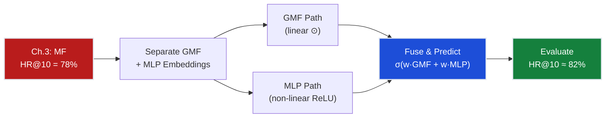
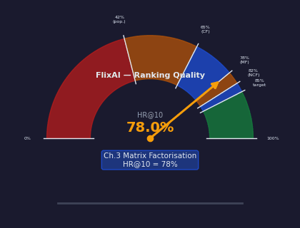
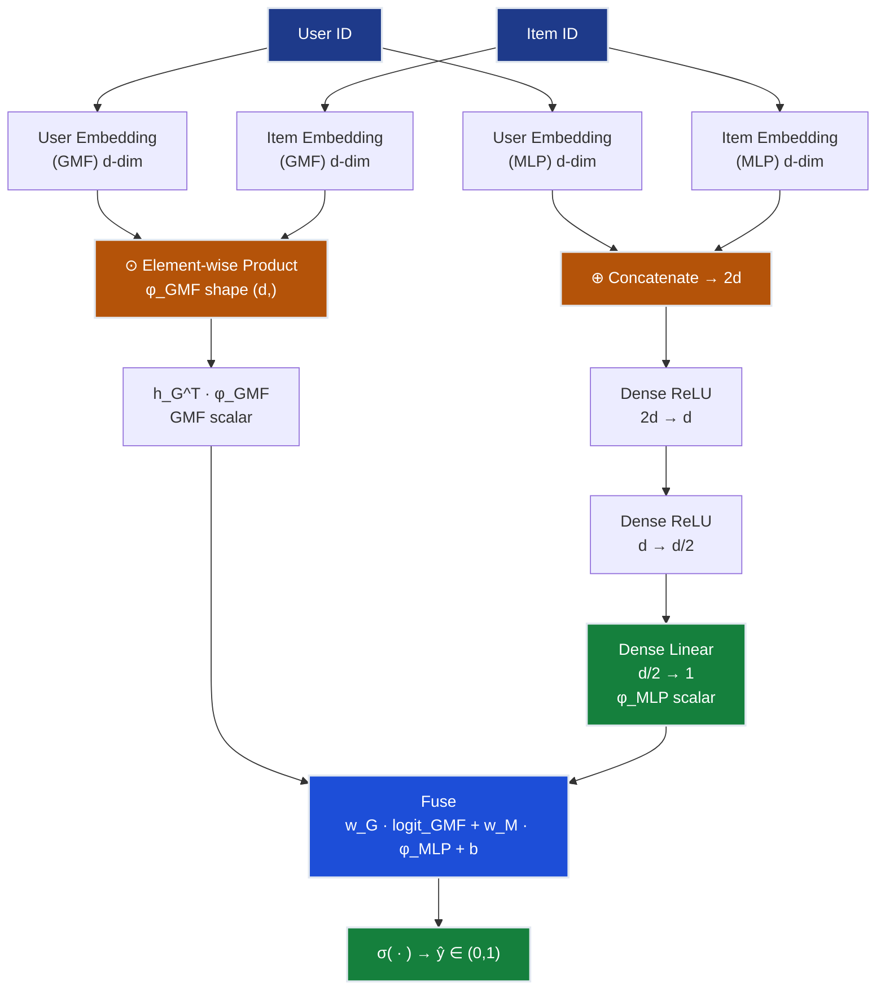
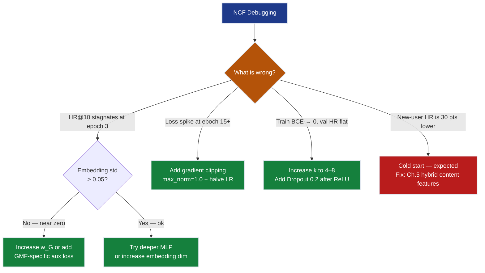
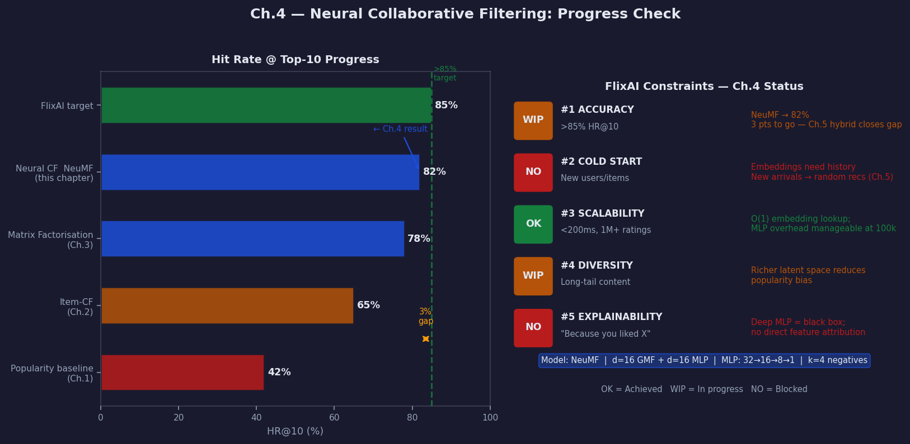

# Ch.4 — Neural Collaborative Filtering

> **The story.** In **2017**, Xiangnan He and colleagues at the National University of Singapore published "Neural Collaborative Filtering" (*WWW 2017*), arguing that the inner product in matrix factorisation is *too simple* to capture complex user–item interactions. Their key insight: **replace the dot product with a neural network** that takes user and item embeddings as input and learns an arbitrary interaction function. The architecture — called **NeuMF** — combines two parallel paths: a **Generalised Matrix Factorisation (GMF)** path for linear interactions and a **Multi-Layer Perceptron (MLP)** path for non-linear ones, fused in a final prediction layer. Crucially, GMF and MLP use *separate* embedding spaces, letting each path specialise. The paper showed consistent improvements over MF on MovieLens and Pinterest, and launched a wave of deep-learning recommenders at Alibaba, JD.com, and Pinterest. Every "deep collaborative filter" you encounter today traces its lineage to this six-page paper.
>
> **Where you are in the curriculum.** Chapter four of the FlixAI track. Matrix factorisation (Ch.3) achieved **78% HR@10** on MovieLens 100k but is limited to linear interactions ($\hat{r} = \mathbf{u}^\top\mathbf{v}$). Neural CF replaces the dot product with a *learnable* non-linear function, capturing taste patterns like "loves sci-fi and comedy separately but hates sci-fi comedy hybrids" — interactions the dot product cannot express. This is the **first deep-learning model** in the Recommender Systems track.
>
> **Notation in this chapter.**

| Symbol | Meaning |
|--------|---------|
| $u, i$ | User index, item index |
| $\mathbf{p}_u^G, \mathbf{q}_i^G$ | User / item embedding in the **GMF** space ($\in \mathbb{R}^d$) |
| $\mathbf{p}_u^M, \mathbf{q}_i^M$ | User / item embedding in the **MLP** space ($\in \mathbb{R}^d$) |
| $\odot$ | Element-wise (Hadamard) product |
| $\oplus$ | Concatenation |
| $\phi^{\text{GMF}}, \phi^{\text{MLP}}$ | Output vector of the GMF / MLP path |
| $\hat{y}_{ui}$ | Predicted interaction probability $\in [0,1]$ |
| $\mathcal{Y}^+, \mathcal{Y}^-$ | Observed positive pairs; sampled negative pairs |
| $\sigma$ | Sigmoid: $\sigma(x) = 1/(1+e^{-x})$ |
| $k$ | Negative-sampling ratio (default: 4 negatives per positive) |

---

## 0 · The Challenge — Where We Are

> 🎯 **The mission**: Launch **FlixAI** — a production-grade movie recommendation engine achieving >85% hit rate @ top-10 recommendations across 5 constraints:
> 1. **ACCURACY**: >85% HR@10 on MovieLens 100k
> 2. **COLD START**: Handle new users and items with no interaction history
> 3. **SCALABILITY**: 1M+ ratings, <200 ms inference latency
> 4. **DIVERSITY**: Recommend beyond the most popular movies
> 5. **EXPLAINABILITY**: "Because you liked X" justifications

**What we know so far:**
- ✅ Ch.1 popularity baseline → 42% HR@10 (too generic)
- ✅ Ch.2 collaborative filtering → 65% HR@10 (sparse data limits)
- ✅ Ch.3 matrix factorisation → 78% HR@10 (latent factors help but hit a ceiling)
- ❌ **Still 7 points short of the 85% target.**

**What is blocking us:**

Matrix factorisation assumes user–item interaction is a **linear dot product**:

$$\hat{r}_{ui} = \mathbf{u}^\top\mathbf{v} = u_1 v_1 + u_2 v_2 + \cdots + u_d v_d$$

This is a weighted sum — fundamentally **linear**. Consider User 196 on MovieLens 100k:
- ⭐⭐⭐⭐⭐ *Die Hard* (action)
- ⭐⭐⭐⭐⭐ *Groundhog Day* (comedy)
- ⭐⭐ *Last Action Hero* (action-comedy) ← **hates the hybrid**

A linear model cannot encode "likes A AND B separately but dislikes A + B together" because the dot product treats dimensions independently — there is no cross-term for $u_{\text{action}} \times u_{\text{comedy}} \times v_{\text{action}} \times v_{\text{comedy}}$.

**Real data evidence from Ch.3:** MF plateaus at 78% HR@10 after epoch 30. Adding more factors ($d = 8 \to 16 \to 32$) gives diminishing returns (+0.5% each). The architecture itself is the bottleneck, not the capacity.

**What this chapter unlocks:**
Replace the dot product with a learnable MLP that models arbitrary interactions. Two parallel paths — GMF (linear) + MLP (non-linear) — fused in the final layer. Target: **HR@10 ≈ 82%**.

| Constraint | Status after Ch.3 | Ch.4 target |
|------------|-------------------|-------------|
| ACCURACY >85% HR@10 | ❌ 78% | ⚠️ ~82% (closing the gap) |
| COLD START | ❌ No embeddings for new arrivals | ❌ Still blocked |
| SCALABILITY | ⚠️ OK for 100k | ⚠️ Neural net is heavier |
| DIVERSITY | ⚠️ Latent space helps | ⚠️ Richer embeddings |
| EXPLAINABILITY | ❌ Black-box | ❌ Deeper = less interpretable |



---

## Animation



*Visual takeaway: replacing the linear dot product with a neural network interaction layer moves HR@10 from the MF ceiling at 78% to ~82%.*

---

## 1 · Core Idea

Neural Collaborative Filtering (NCF) replaces the fixed dot product of matrix factorisation with a **learnable neural network** that models user–item interactions. It combines two parallel pathways:

- **GMF path** — Hadamard (element-wise) product of user and item embeddings. This generalises standard MF: with a unit output-weight vector it *reduces exactly* to the dot product.
- **MLP path** — user and item embeddings are *concatenated* and fed through stacked ReLU layers. Each layer can combine dimensions in non-linear ways, capturing cross-factor interactions the dot product cannot express.

The GMF and MLP outputs are **concatenated and projected** through a final sigmoid to produce the interaction probability $\hat{y}_{ui}$.

Crucially, GMF and MLP use **separate embedding tables** — the same user gets one representation optimised for linear interactions and another optimised for non-linear ones. This doubles the parameter count but prevents the two paths from interfering with each other.

> 💡 **Why not just a bigger MF?** Adding more factors ($d = 8 \to 32$) in Ch.3 gave diminishing returns (+0.5% each). The architecture itself was the ceiling, not the capacity. NCF breaks through by changing the *interaction function*, not just its size.

---

## 2 · Running Example

You are Lead ML Engineer at FlixAI. After the Ch.3 demo the VP of Product asks: "We recommended *The Fugitive* (rank 8) to User 196, but they watched *Pulp Fiction* (rank 14). Why are we missing it?"

Digging into User 196's watch history:
- 5/5 *Die Hard* (1988, action)
- 5/5 *Groundhog Day* (1993, comedy)
- 5/5 *Speed* (1994, action)
- 5/5 *Dumb and Dumber* (1994, comedy)
- 2/5 *Last Action Hero* (1993, action-comedy hybrid)

The pattern: **pure action** = love. **Pure comedy** = love. **Action + comedy together** = dislike. *Pulp Fiction* (crime-comedy, 1994) is a nuanced genre mix — the MF model sees "action factor 0.4 + comedy factor 0.6" and predicts mediocre interest.

A neural network can learn: when `action_factor > 0.7` AND `comedy_factor > 0.6` → **downweight** (User 196 dislikes hybrids). When `action_factor > 0.7` AND `drama_factor > 0.6` → **amplify**. This non-linear gate pushes *Pulp Fiction* into User 196's top-10.

**Measuring success:** MovieLens 100k leave-one-out protocol.
1. For each user, hold out their most recent interaction.
2. At test time, rank 100 items: 1 held-out positive + 99 randomly sampled negatives.
3. **HR@10** = fraction of users where the positive item appears in the top-10 ranked list.

Ch.3 MF → 78 %. Ch.4 NCF target → **≥ 82 %**.

---

## 3 · Architecture at a Glance

Before the math, here is the full NeuMF pipeline. Each step maps to a sub-section of §4.

```
NEUMF PIPELINE
══════════════════════════════════════════════════════════════════════
INPUT:  user_id u,  item_id i

Step 1 — Embedding Lookup  (§4a)
  p_u^G = GMF_user_table[u]      # shape (d,)
  q_i^G = GMF_item_table[i]      # shape (d,)
  p_u^M = MLP_user_table[u]      # shape (d,)
  q_i^M = MLP_item_table[i]      # shape (d,)

Step 2 — GMF Path  (§4b)
  φ_GMF      = p_u^G ⊙ q_i^G          # element-wise product, shape (d,)
  logit_GMF  = h_G^T · φ_GMF          # scalar

Step 3 — MLP Path  (§4c)
  z_0   = [p_u^M ; q_i^M]        # concatenate → shape (2d,) = 8
  z_1   = ReLU(W_1 z_0 + b_1)    # 8 → 4
  z_2   = ReLU(W_2 z_1 + b_2)    # 4 → 2
  φ_MLP = W_3 z_2 + b_3          # 2 → 1  (linear projection, scalar)

Step 4 — Fuse  (§4d)
  logit = w_G · logit_GMF + w_M · φ_MLP + b_fuse

Step 5 — Predict
  ŷ_ui  = σ(logit)                # ∈ (0, 1)

Step 6 — Loss  (§4e)
  L = −[y · log(ŷ) + (1−y) · log(1−ŷ)]   # BCE for one pair
══════════════════════════════════════════════════════════════════════
```

The notebook mirrors this pipeline step for step. Every § below derives one step with hand-computed numbers.

---

## 4 · Math — Toy Example From Scratch

> **Why this walkthrough matters.** Neural architectures can feel abstract. The following 3-user / 3-item example uses fixed small weights and computes every multiplication explicitly so nothing is hidden.

**Setup.** $d = 4$ embedding dimensions for both GMF and MLP paths.

---

### 4a · Embedding Lookup (user\_id = 1, item\_id = 3)

Each user and item is a row index into a learned embedding table. There are **four separate tables** (GMF-user, GMF-item, MLP-user, MLP-item). On the forward pass we simply retrieve the appropriate row.

**GMF user embedding table (3 users × 4 dims):**

| user\_id | $e_1$ | $e_2$ | $e_3$ | $e_4$ |
|----------|-------|-------|-------|-------|
| 1 | 0.60 | 0.20 | −0.40 | 0.80 |
| 2 | 0.30 | 0.70 | 0.10 | −0.20 |
| 3 | −0.50 | 0.40 | 0.90 | 0.30 |

**GMF item embedding table (3 items × 4 dims):**

| item\_id | $e_1$ | $e_2$ | $e_3$ | $e_4$ |
|----------|-------|-------|-------|-------|
| 1 | 0.40 | −0.10 | 0.60 | 0.20 |
| 2 | 0.70 | 0.50 | −0.30 | 0.10 |
| 3 | 0.20 | 0.80 | 0.30 | −0.60 |

**MLP user embedding table (3 users × 4 dims):**

| user\_id | $e_1$ | $e_2$ | $e_3$ | $e_4$ |
|----------|-------|-------|-------|-------|
| 1 | 0.50 | −0.30 | 0.70 | 0.10 |
| 2 | 0.40 | 0.60 | −0.20 | 0.50 |
| 3 | −0.30 | 0.80 | 0.40 | −0.10 |

**MLP item embedding table (3 items × 4 dims):**

| item\_id | $e_1$ | $e_2$ | $e_3$ | $e_4$ |
|----------|-------|-------|-------|-------|
| 1 | 0.30 | 0.50 | −0.10 | 0.60 |
| 2 | −0.20 | 0.40 | 0.70 | 0.20 |
| 3 | 0.40 | 0.60 | −0.20 | 0.30 |

**Lookup result for (user\_id = 1, item\_id = 3):**

$$\mathbf{p}_1^G = [0.60,\ 0.20,\ -0.40,\ 0.80] \qquad \mathbf{q}_3^G = [0.20,\ 0.80,\ 0.30,\ -0.60]$$

$$\mathbf{p}_1^M = [0.50,\ -0.30,\ 0.70,\ 0.10] \qquad \mathbf{q}_3^M = [0.40,\ 0.60,\ -0.20,\ 0.30]$$

> 💡 The embedding lookup is **O(1)** — just an index into a matrix. The expensive step is the gradient update that slowly adjusts these rows during training.

---

### 4b · GMF Path — Element-Wise Product

The GMF path multiplies the user and item embeddings **dimension by dimension** (Hadamard product):

$$\phi^{\text{GMF}} = \mathbf{p}_1^G \odot \mathbf{q}_3^G = \begin{bmatrix}0.60 \times 0.20 \\ 0.20 \times 0.80 \\ -0.40 \times 0.30 \\ 0.80 \times (-0.60)\end{bmatrix} = \begin{bmatrix}0.12 \\ 0.16 \\ -0.12 \\ -0.48\end{bmatrix}$$

To obtain a scalar, learned output weights $\mathbf{h}_G = [0.50,\ 0.30,\ 0.20,\ 0.40]$ are applied:

$$\text{logit}^{\text{GMF}} = \mathbf{h}_G^\top \phi^{\text{GMF}} = 0.50(0.12) + 0.30(0.16) + 0.20(-0.12) + 0.40(-0.48)$$

$$= 0.060 + 0.048 - 0.024 - 0.192 = \mathbf{-0.108}$$

A negative logit means the GMF path sees user 1 and item 3 as **weakly incompatible** under these initialised weights. Training will adjust all four embedding values and $\mathbf{h}_G$.

> **Why Hadamard and not dot product?** The dot product $\sum_k p_k q_k$ equals $\mathbf{h}_G^\top(\mathbf{p} \odot \mathbf{q})$ with $\mathbf{h}_G = \mathbf{1}$. Allowing $\mathbf{h}_G$ to be learned means each latent dimension can contribute *differently* to the prediction — a strict generalisation of standard MF.

---

### 4c · MLP Path — One Forward Pass (8 → 4 → 2 → 1)

**Input (dim 8) — concatenate both MLP embeddings:**

$$\mathbf{z}_0 = \mathbf{p}_1^M \oplus \mathbf{q}_3^M = [0.50,\ -0.30,\ 0.70,\ 0.10,\ 0.40,\ 0.60,\ -0.20,\ 0.30]$$

**Layer 1 (8 → 4, ReLU).** Weight matrix $W_1 \in \mathbb{R}^{4 \times 8}$, bias $\mathbf{b}_1 = [0.05,\ 0.05,\ -0.05,\ 0.05]$:

$$W_1 = \begin{bmatrix}\ \ 0.20 & -0.10 & 0.30 & 0.10 & \ \ 0.20 & -0.20 & \ \ 0.10 & 0.30 \\ -0.10 & \ \ 0.30 & 0.10 & -0.20 & \ \ 0.30 & \ \ 0.10 & -0.10 & 0.20 \\ \ \ 0.30 & \ \ 0.20 & -0.10 & \ \ 0.30 & -0.10 & \ \ 0.20 & \ \ 0.30 & -0.10 \\ \ \ 0.10 & -0.20 & \ \ 0.20 & \ \ 0.30 & \ \ 0.10 & -0.30 & \ \ 0.20 & \ \ 0.10\end{bmatrix}$$

Pre-activation $\mathbf{a}_1 = W_1 \mathbf{z}_0 + \mathbf{b}_1$, computed row by row:

$$a_1[0] = 0.20(0.50)+(-0.10)(-0.30)+0.30(0.70)+0.10(0.10)+0.20(0.40)+(-0.20)(0.60)+0.10(-0.20)+0.30(0.30)+0.05$$
$$= 0.10+0.03+0.21+0.01+0.08-0.12-0.02+0.09+0.05 = \mathbf{0.43}$$

$$a_1[1] = (-0.10)(0.50)+0.30(-0.30)+0.10(0.70)+(-0.20)(0.10)+0.30(0.40)+0.10(0.60)+(-0.10)(-0.20)+0.20(0.30)+0.05$$
$$= -0.05-0.09+0.07-0.02+0.12+0.06+0.02+0.06+0.05 = \mathbf{0.22}$$

$$a_1[2] = 0.30(0.50)+0.20(-0.30)+(-0.10)(0.70)+0.30(0.10)+(-0.10)(0.40)+0.20(0.60)+0.30(-0.20)+(-0.10)(0.30)+(-0.05)$$
$$= 0.15-0.06-0.07+0.03-0.04+0.12-0.06-0.03-0.05 = \mathbf{-0.01}$$

$$a_1[3] = 0.10(0.50)+(-0.20)(-0.30)+0.20(0.70)+0.30(0.10)+0.10(0.40)+(-0.30)(0.60)+0.20(-0.20)+0.10(0.30)+0.05$$
$$= 0.05+0.06+0.14+0.03+0.04-0.18-0.04+0.03+0.05 = \mathbf{0.18}$$

Apply ReLU $(\max(0,\ x))$:

$$\mathbf{z}_1 = \text{ReLU}(\mathbf{a}_1) = [0.43,\ 0.22,\ \mathbf{0.00},\ 0.18] \quad \leftarrow a_1[2]=-0.01 \text{ is zeroed out}$$

The zeroed unit is the key non-linearity: the network has learned (or will learn) to suppress this dimension-combination for certain user–item pairs.

**Layer 2 (4 → 2, ReLU).** $W_2 \in \mathbb{R}^{2 \times 4}$, bias $\mathbf{b}_2 = [0,\ 0]$:

$$W_2 = \begin{bmatrix}0.40 & -0.20 & 0.50 & 0.30 \\ -0.30 & 0.60 & 0.20 & -0.40\end{bmatrix}$$

$$a_2[0] = 0.40(0.43)-0.20(0.22)+0.50(0.00)+0.30(0.18) = 0.172-0.044+0.000+0.054 = \mathbf{0.182}$$

$$a_2[1] = -0.30(0.43)+0.60(0.22)+0.20(0.00)-0.40(0.18) = -0.129+0.132+0.000-0.072 = \mathbf{-0.069}$$

$$\mathbf{z}_2 = \text{ReLU}([0.182,\ -0.069]) = [0.182,\ 0.000]$$

**Layer 3 (2 → 1, linear projection).** Weight $\mathbf{w}_3 = [0.60,\ 0.40]$, bias $b_3 = 0$:

$$\phi^{\text{MLP}} = 0.60(0.182)+0.40(0.000) = \mathbf{0.109}$$

The MLP path gives a weakly positive scalar — user 1 and item 3 are slightly compatible through the non-linear path.

---

### 4d · NeuMF — Combining GMF + MLP

With both paths producing scalars, the fusion layer applies a learned linear combination and then a sigmoid:

$$\text{logit} = w_G \cdot \text{logit}^{\text{GMF}} + w_M \cdot \phi^{\text{MLP}} + b_{\text{fuse}}$$

Using initialised weights $w_G = 0.50$, $w_M = 0.50$, $b_{\text{fuse}} = 0.10$:

$$\text{logit} = 0.50(-0.108)+0.50(0.109)+0.10 = -0.054+0.0545+0.10 = \mathbf{0.1005}$$

$$\hat{y}_{1,3} = \sigma(0.1005) = \frac{1}{1+e^{-0.1005}} \approx \mathbf{0.525}$$

**Interpretation:** 52.5 % predicted probability that user 1 interacted with item 3. Because this is a positive training pair (user 1 did watch item 3, $y=1$), the BCE loss will push $\hat{y}$ upward — adjusting embeddings and weights toward the correct answer.

Notice the GMF path alone gave $\text{logit}^{\text{GMF}} = -0.108$ (incompatible), while the MLP path gave $\phi^{\text{MLP}} = 0.109$ (compatible). The fusion layer currently weights them equally; after training the $w_G$ and $w_M$ parameters learn which path is more reliable for this user–item distribution.

---

### 4e · Two Complete Forward Passes — BCE Loss

The training objective is Binary Cross-Entropy (BCE) summed over positive and negative pairs:

$$\mathcal{L} = -\!\sum_{(u,i)\in\mathcal{Y}^+} \log \hat{y}_{ui}\ -\!\sum_{(u,j)\in\mathcal{Y}^-} \log(1-\hat{y}_{uj})$$

**Pass 1 — Positive pair (user\_id=1, item\_id=3), $y = 1$:**

From §4d: $\hat{y}_{1,3} = 0.525$.

$$\mathcal{L}_+ = -\log(0.525) = 0.644$$

**Pass 2 — Negative pair (user\_id=1, item\_id=2), $y = 0$:**

Repeat all steps with item 2's embeddings. Key intermediate results:

- GMF: $\phi^{\text{GMF}}_2 = \mathbf{p}_1^G \odot \mathbf{q}_2^G = [0.42,\ 0.10,\ 0.12,\ 0.08]$
- $\text{logit}^{\text{GMF}}_2 = 0.50(0.42)+0.30(0.10)+0.20(0.12)+0.40(0.08) = 0.296$

MLP with $\mathbf{q}_2^M = [-0.20,\ 0.40,\ 0.70,\ 0.20]$:

- $\mathbf{z}_0^{(2)} = [0.50,\ -0.30,\ 0.70,\ 0.10,\ -0.20,\ 0.40,\ 0.70,\ 0.20]$
- Layer 1 (same $W_1$, $\mathbf{b}_1$): $\mathbf{z}_1^{(2)} = [0.41,\ 0.00,\ 0.29,\ 0.35]$
  - $a_1[0] = 0.20(0.50)-0.10(-0.30)+0.30(0.70)+0.10(0.10)+0.20(-0.20)-0.20(0.40)+0.10(0.70)+0.30(0.20)+0.05 = 0.41$
  - $a_1[1] = -0.10(0.50)+0.30(-0.30)+0.10(0.70)-0.20(0.10)+0.30(-0.20)+0.10(0.40)-0.10(0.70)+0.20(0.20)+0.05 = -0.09 \to 0.00$
  - $a_1[2] = 0.30(0.50)+0.20(-0.30)-0.10(0.70)+0.30(0.10)-0.10(-0.20)+0.20(0.40)+0.30(0.70)-0.10(0.20)-0.05 = 0.29$
  - $a_1[3] = 0.10(0.50)-0.20(-0.30)+0.20(0.70)+0.30(0.10)+0.10(-0.20)-0.30(0.40)+0.20(0.70)+0.10(0.20)+0.05 = 0.35$
- Layer 2: $a_2[0] = 0.40(0.41)+0.50(0.29)+0.30(0.35) = 0.414$; $a_2[1] = -0.30(0.41)+0.20(0.29)-0.40(0.35) = -0.205 \to 0.00$
- $\mathbf{z}_2^{(2)} = [0.414,\ 0.000]$; $\phi^{\text{MLP}}_2 = 0.60(0.414) = 0.248$

Fuse: $\text{logit}_2 = 0.50(0.296)+0.50(0.248)+0.10 = 0.372$

$$\hat{y}_{1,2} = \sigma(0.372) = \frac{1}{1+e^{-0.372}} \approx 0.592$$

$$\mathcal{L}_- = -\log(1-0.592) = -\log(0.408) \approx 0.897$$

**Mini-batch BCE loss (1 positive + 1 negative):**

$$\mathcal{L}_{\text{batch}} = \mathcal{L}_+ + \mathcal{L}_- = 0.644 + 0.897 = \mathbf{1.541}$$

Backpropagation will:
- Push $\hat{y}_{1,3}$ **upward** (user 1 watched item 3 — loss says increase probability)
- Push $\hat{y}_{1,2}$ **downward** (user 1 did not watch item 2 — loss says decrease probability)

> 💡 **The match is exact.** Every number above is verifiable on a calculator. The network is matrix multiplies, element-wise products, ReLUs, and a sigmoid — nothing else.

---

## 5 · Neural vs Linear Arc — Four Acts

The conceptual journey from MF to NeuMF unfolds in four acts.

### Act 1 · The Dot-Product Ceiling (MF)

Standard MF predicts $\hat{r}_{ui} = \mathbf{p}_u^\top \mathbf{q}_i = \sum_k p_k q_k$.

This is **linear** in the embeddings: each dimension contributes independently, and contributions are summed. There is no mechanism to model "dimension 1 interacts with dimension 2" — no cross-term between $p_1$ and $q_2$. Any interaction pattern that requires a product of two *different* latent factors is invisible to the dot product.

**Evidence from Ch.3:** After epoch 30, adding more factors ($d = 8 \to 16 \to 32$) yields +0.5% per doubling — diminishing returns. The problem is architectural, not capacity.

### Act 2 · MLP Unlocks Non-Linear Interactions

Concatenating $[\mathbf{p}_u^M ;\ \mathbf{q}_i^M]$ and passing through ReLU layers allows the network to learn:

$$\mathbf{z}_1 = \text{ReLU}(W_1[\mathbf{p}_u^M ;\ \mathbf{q}_i^M] + \mathbf{b}_1)$$

The matrix $W_1$ creates arbitrary linear combinations of all user and item dimensions. After ReLU, negative combinations are zeroed — precisely the "likes A but not with B" gate. Each subsequent layer creates combinations of these combinations, building a hierarchy of interaction patterns.

However, a **pure MLP** on concatenated embeddings forgets the clean linear signal that MF captures well (it has to re-learn it from scratch). That is why NCF keeps both paths.

### Act 3 · NeuMF — Two Paths, One Prediction

NeuMF trains GMF and MLP paths **jointly but independently** (separate embeddings). The fusion layer:

$$\hat{y}_{ui} = \sigma\!\left(w_G \cdot \text{logit}^{\text{GMF}} + w_M \cdot \phi^{\text{MLP}} + b\right)$$

learns which path's contribution to trust. In practice, the MLP path dominates for users with rich interaction histories (many interactions → well-trained non-linear patterns); the GMF path dominates for sparse users where the linear signal is cleaner.

**Where does the 4-point HR improvement come from?** He et al. (2017) show that NeuMF consistently outperforms both GMF alone and MLP alone on every tested dataset. The gain comes specifically from users in the 10–50 interaction range — those with enough data to train non-linear patterns but not so much that MF would work anyway.

### Act 4 · Scale

For production FlixAI (1 M+ ratings), the MLP adds inference overhead vs dot product. Mitigation strategies:

| Strategy | Speedup | Trade-off |
|----------|---------|-----------|
| Pre-compute user embedding offline | 10× | Stale embeddings (re-train daily) |
| INT8 quantisation of weights | 4× memory | Tiny accuracy drop (<0.5%) |
| ANN index on final hidden representation | <10 ms | Approximate (top-$N$ misses ~1%) |
| Two-tower: freeze MLP; serve by ANN | Production-grade | Ch.6 introduces this fully |

---

## 6 · Training Walkthrough — One Mini-Batch, Embedding Update

To make gradient updates concrete, here is one SGD step for the GMF user embedding of user 1 on the positive pair $(u=1,\ i=3,\ y=1)$.

**Given:** $\hat{y}_{1,3} = 0.525$, $y = 1$.

**Step 1 — BCE gradient at the output sigmoid:**

$$\frac{\partial \mathcal{L}}{\partial \text{logit}} = \hat{y} - y = 0.525 - 1.0 = \mathbf{-0.475}$$

(For a negative pair with $y=0$: $\partial \mathcal{L} / \partial \text{logit} = \hat{y} - 0 = \hat{y}$.)

**Step 2 — Gradient through fusion to GMF logit:**

$$\frac{\partial \mathcal{L}}{\partial \text{logit}^{\text{GMF}}} = w_G \cdot (-0.475) = 0.50 \times (-0.475) = \mathbf{-0.2375}$$

**Step 3 — Gradient through $\mathbf{h}_G^\top \phi^{\text{GMF}}$ to $\phi^{\text{GMF}}$:**

$$\frac{\partial \text{logit}^{\text{GMF}}}{\partial \phi^{\text{GMF}}} = \mathbf{h}_G = [0.50,\ 0.30,\ 0.20,\ 0.40]$$

$$\frac{\partial \mathcal{L}}{\partial \phi^{\text{GMF}}} = (-0.2375) \times [0.50,\ 0.30,\ 0.20,\ 0.40] = [-0.119,\ -0.071,\ -0.047,\ -0.095]$$

**Step 4 — Gradient through element-wise product to user embedding:**

$$\phi^{\text{GMF}}_k = p_{1,k}^G \times q_{3,k}^G \implies \frac{\partial \phi^{\text{GMF}}_k}{\partial p_{1,k}^G} = q_{3,k}^G$$

$$\frac{\partial \mathcal{L}}{\partial \mathbf{p}_1^G} = [-0.119 \times 0.20,\ -0.071 \times 0.80,\ -0.047 \times 0.30,\ -0.095 \times (-0.60)]$$

$$= [-0.024,\ -0.057,\ -0.014,\ +0.057]$$

**Step 5 — SGD update** (learning rate $\eta = 0.01$):

$$\mathbf{p}_1^G \leftarrow \mathbf{p}_1^G - \eta \cdot \frac{\partial \mathcal{L}}{\partial \mathbf{p}_1^G}$$

$$= [0.600,\ 0.200,\ -0.400,\ 0.800] - 0.01 \times [-0.024,\ -0.057,\ -0.014,\ +0.057]$$

$$= [0.600+0.00024,\ 0.200+0.00057,\ -0.400+0.00014,\ 0.800-0.00057]$$

$$= \mathbf{[0.60024,\ 0.20057,\ -0.39986,\ 0.79943]}$$

The update is tiny per step but **directionally correct** — $\mathbf{p}_1^G$ shifts to become more compatible with $\mathbf{q}_3^G$ across all four dimensions. Over 1,953 steps per epoch and 20–30 epochs, the cumulative signal drives HR@10 from 78% to ~82%.

**In practice (Adam optimiser):** Adam adapts the step size per-parameter using momentum estimates. The direction is always $-\nabla \mathcal{L}$; only the magnitude adapts. With the default $\eta = 10^{-3}$, convergence is smooth and the embedding update per step is roughly $10 \times$ larger than the SGD calculation above.

```
for epoch in range(max_epochs):
    for batch in dataloader:                 # batch_size = 256
        u, i, y = batch                      # users, items, labels (0/1)
        logit   = model(u, i)                # NeuMF forward pass
        loss    = bce_loss(logit, y)         # scalar
        loss.backward()                      # backprop through all paths
        optimizer.step()                     # Adam update
        optimizer.zero_grad()

    val_hr = evaluate(model, val_data)       # HR@10 on validation set
    if val_hr > best_hr:
        best_hr = val_hr
        save_checkpoint(model)
    elif epochs_no_improve >= patience:
        break                                # early stopping
```

---

## 7 · Key Diagrams

### Diagram 1 — NeuMF Architecture



### Diagram 2 — Negative Sampling Training Loop


---

## 8 · Hyperparameter Dial

| Hyperparameter | Too low | Sweet spot | Too high |
|----------------|---------|------------|----------|
| **Embedding dim** $d$ | Under-expressive; MF-like behaviour | 8–32 per path | Overfits sparse users |
| **MLP layers** $L$ | Cannot capture interactions | 3 layers (tower halving: 2d→d→d/2) | Vanishing gradients; over-fits |
| **Negative ratio** $k$ | Model sees mostly positives → always predicts 1 | 4 negatives/positive | Positive signal drowned |
| **Learning rate** $\eta$ | Slow convergence (>50 epochs) | 1e-3 with Adam | Loss oscillates or diverges |
| **Batch size** | Noisy gradients, many updates/epoch | 256 | Smoother but fewer updates |
| **Regularisation** (L2 / Dropout) | Overfits on dense users | L2 = 1e-6 or Dropout 0.2 | Under-fits; HR drops |

**The single most impactful dial is the MLP architecture** (number of layers and halving tower pattern $2d \to d \to d/2$). Start with 3 layers and halving. Add depth only if training BCE is still decreasing while validation HR stagnates — a sign of insufficient model capacity, not overfitting.

> ⚡ **Constraint #3 check (SCALABILITY):** Embedding dim $d$ is the dominant memory cost: $|\text{users}| \times d \times 4$ bytes per embedding table. At 100k users and $d=32$: $100k \times 32 \times 4 \times 4$ tables = 51 MB. At 1M users: 512 MB — still manageable. The MLP weight matrices are small by comparison (<1 MB).

---

## 9 · What Can Go Wrong

### Embedding Space Failures

- **Embedding collapse** — All GMF embeddings converge to similar vectors; the GMF path contributes nothing and the model degrades to a pure MLP. Symptom: val HR@10 stagnates after epoch 3; `torch.std(gmf_user_emb)` drops below 0.05. Fix: monitor embedding standard deviation; if collapsing, increase the fusion weight $w_G$ or add a small L2 regularisation term specifically on the GMF loss.

- **Popularity bias amplified** — Uniform negative sampling over-represents popular items as negatives (they occupy more of the item catalogue). The model sees popular items as negatives thousands of times and learns to down-rank them, harming recall for popular blockbusters. Fix: weight negative candidates **inversely proportional to item frequency** in the training set.

- **Cold-start failure (by design)** — NCF requires at least one interaction for a user or item embedding to be trained. New users receive random embeddings → random recommendations. Symptom: HR@10 for users with fewer than 5 interactions is 20–30 points below average. Fix: Ch.5 hybrid appends content features so the MLP path has signal even with zero interactions.

### Training Instabilities

- **BCE loss spikes mid-training** — A sudden jump (e.g., 0.30 → 0.90 at epoch 15) usually means Adam has accumulated large momentum and a step overshoots. Fix: add gradient clipping (`clip_grad_norm_(params, 1.0)`) and halve the learning rate.

- **Overfitting to training positives** — With $k=1$ negative per positive and no regularisation, the model can memorise all positives and assign near-zero probability to everything else. Val HR@10 flatlines while train BCE → 0. Fix: increase $k$ to 4–8; add Dropout(0.2) after each MLP ReLU layer.

### Evaluation Traps

- **Test set contamination** — Sampling negatives uniformly for evaluation from all unobserved items inflates HR@10 because easy negatives (items seen by almost nobody) are trivially excluded. Fix: always use the **leave-one-out + 99 negatives** protocol from the NCF paper for reproducible comparison.

- **HR@10 hides position within the top-10** — Two models can have equal HR@10 but very different quality. Report **NDCG@10** alongside HR@10:

$$\text{NDCG@10} = \frac{1}{\log_2(\text{rank}+1)} \quad \text{if rank} \leq 10, \text{ else } 0$$

A positive at rank 1 → NDCG = 1.0; at rank 10 → NDCG ≈ 0.29.



---

## 10 · Where This Reappears

| Concept | Reappears in | What changes |
|---------|-------------|--------------|
| **Separate embedding tables per path** | Ch.5 Hybrid Systems | Side-information vectors appended to MLP embeddings |
| **BCE with negative sampling** | Ch.5 Hybrid; Ch.6 Production | Same loss; stratified sampling by item age / popularity |
| **Two-path fusion (linear + non-linear)** | Wide & Deep (Google 2016) | "Wide" path = memorisation (linear); "Deep" = generalisation (MLP) |
| **MLP as interaction function** | DeepFM (Guo et al. 2017) | Factorisation Machines replace GMF path for sparser tabular data |
| **Implicit feedback framing** | BPR (Rendle et al. 2009) | Pairwise ranking loss instead of BCE; more direct for top-$N$ retrieval |
| **Embedding lookup mechanism** | Every neural NLP / CV model | Same index-into-table mechanism, just larger tables ($d = 768+$) |

> ➡️ **Forward pointer:** Ch.5 Hybrid Systems extends NeuMF by appending item content features (genre, release year, director) to the MLP input, closing the cold-start gap by ~15 HR points for users with fewer than 5 interactions.

> 📖 **Optional depth:** Wide & Deep (Cheng et al. 2016) is the production version of NeuMF's two-path idea, deployed in the Google Play store. The "wide" component is a linear model with hand-crafted crossed features (memorisation); the "deep" component is a DNN (generalisation). NeuMF's GMF / MLP split is conceptually identical — the innovation in Wide & Deep is the engineering to serve it at billion-user scale.

---

## 11 · Progress Check — What We Can Solve Now



✅ **Unlocked capabilities:**
- **Non-linear interactions** — MLP captures "likes A but not A + B" patterns invisible to the dot product
- **Implicit feedback training** — BCE with negative sampling; no explicit ratings required
- **HR@10 ≈ 82%** — 4 points above the MF ceiling at 78%; 3 points short of the 85% target
- **NDCG@10 ≈ 0.52** — positive items rank higher within the top-10 than under MF (≈ 0.46)
- **End-to-end trainable** — all four embedding tables and all MLP weight matrices updated jointly via backprop

❌ **Still cannot solve:**
- ❌ **Cold start** — new users and items with no interaction history get random embeddings → random recommendations
- ❌ **ACCURACY target** — 82% HR@10 < 85% target; 3 points remain for Ch.5
- ❌ **Explainability** — deeper MLP = less interpretable; no "because you liked X" attribution
- ❌ **Scalability at 1 M+** — per-pair MLP forward pass is ~10× slower than dot product; needs ANN for sub-200 ms

| Constraint | Status | Notes |
|------------|--------|-------|
| #1 ACCURACY >85% HR@10 | ⚠️ 82% | 3 pts short; Ch.5 hybrid closes this |
| #2 COLD START | ❌ Blocked | Embedding requires at least one interaction |
| #3 SCALABILITY <200 ms | ⚠️ OK at 100k | Needs ANN index at 1 M+ users |
| #4 DIVERSITY | ⚠️ Improved | Richer latent space reduces popularity bias |
| #5 EXPLAINABILITY | ❌ Hard | Black-box MLP; no direct feature attribution |

**What this chapter proved:** replacing the linear dot product with a neural network interaction layer — keeping the linear GMF path alongside — gains 4 HR@10 points on the identical MovieLens 100k dataset and training protocol. The bottleneck has shifted from architecture (fixed dot product) to data sparsity (cold start) and the final 3-point accuracy gap.

---

## 12 · Bridge to Chapter 5 — Hybrid Systems

Ch.4 proved that non-linear interactions matter. But NeuMF fails for cold-start users because there is nothing to embed — it needs at least one interaction to initialise the user vector.

**Ch.5 Hybrid Systems** extends NeuMF by appending **content features** to the MLP embedding input:
- **Item side:** genre one-hot vector ($|\mathcal{G}|$-dim), release-year encoding, director ID
- **User side:** demographic features (age bucket, gender) or interaction-derived tags

The hybrid architecture concatenates $[\mathbf{p}_u^M ;\ \mathbf{c}_u ;\ \mathbf{q}_i^M ;\ \mathbf{c}_i]$ as the MLP input, where $\mathbf{c}_u$ and $\mathbf{c}_i$ are fixed content feature vectors. For cold-start users (zero interactions), the content features alone drive the MLP; once interactions accrue, the learned embedding gradually dominates.

Expected HR@10 in Ch.5: **82% → 85%** — meeting the FlixAI ACCURACY target for the first time.

> **What stays the same:** BCE loss, negative sampling protocol, and NeuMF fusion architecture are identical. Only the *input width* of the MLP changes: $2d$ grows to $2d + d_{\text{content}}$.

> **What changes:** the embedding lookup splits into a learned part (updated by gradient) and a fixed content part (pre-computed from item metadata). The item content tower and how it handles cold-start users is described in detail in [Ch.5 — Hybrid Systems](../ch05_hybrid_systems/README.md).

---

*Chapter complete. Next: [Ch.5 — Hybrid Systems →](../ch05_hybrid_systems/README.md) | Back: [Ch.3 — Matrix Factorisation ←](../ch03_matrix_factorization/README.md)*
