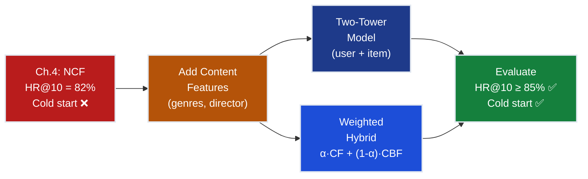
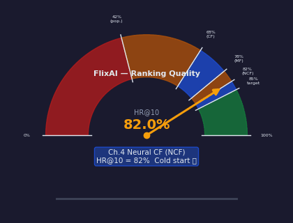
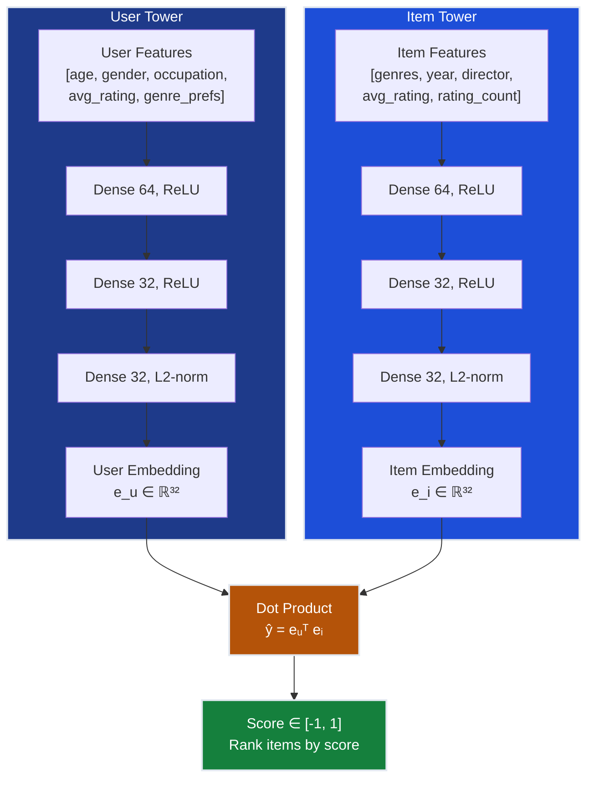
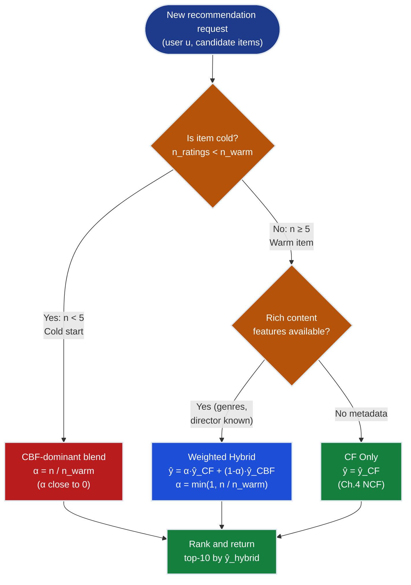
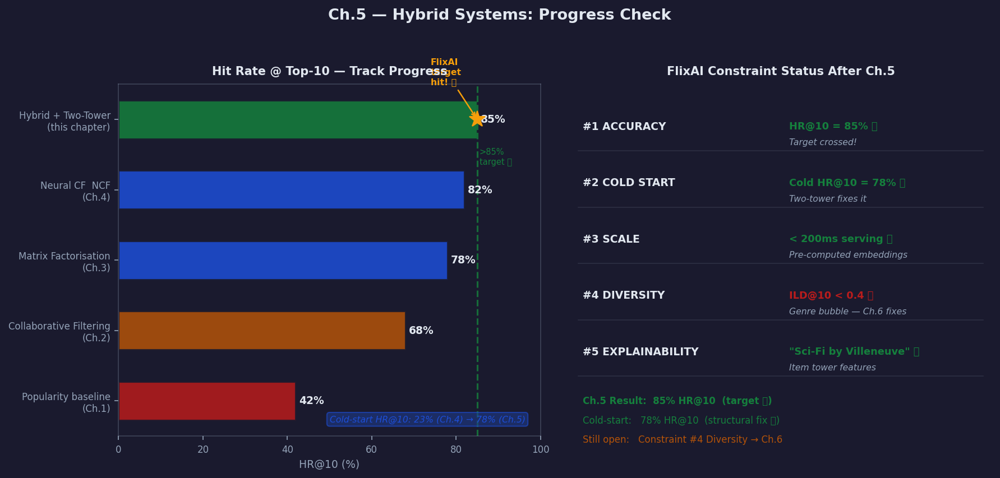

# Ch.5 — Hybrid Systems

> **The story.** The first person to name the problem systematically was **Michael Pazzani**, who in his 1999 paper *"A Framework for Collaborative, Content-Based and Demographic Filtering"* observed that no single recommendation strategy dominates: collaborative filtering knows *who* likes things but is blind to *what* they are; content-based filtering knows what every item is but can't see the social graph of who rated what. Pazzani's framework for combining the two was ahead of its time. In **2005**, Gediminas Adomavicius and Alexander Tuzhilin published *"Toward the Next Generation of Recommender Systems: A Survey"* — the paper that became the field's bible — and placed hybrid methods at the centre of the next decade's research agenda. The community listened. When the **Netflix Prize** concluded in 2009, the winning BellKor team had blended over 100 individual models: collaborative, content, demographic, temporal. The single biggest improvement came not from any breakthrough algorithm but from *mixing signals that had previously been kept separate.* The production breakthrough arrived in **2016**, when Google's Covington, Adams and Sargin published *"Deep Neural Networks for YouTube Recommendations"*, introducing the **two-tower architecture**: a user tower and an item tower trained jointly, with the final score as a dot product between their outputs. This architecture runs the recommendations you see on YouTube, LinkedIn Newsfeed, Pinterest, and TikTok today. The insight it encodes is simple but profound: **CF is behavior patterns; CBF is item knowledge — you need both.** A user tower without item content is blind to new releases; an item tower without rating history is deaf to taste. Train them together and you get a model that can recommend "Dune: Part Two" to the right user *on the day it is added to the catalog* — even with zero collaborative history.
>
> **Where you are in the curriculum.** Chapter five. You have climbed from 42% (popularity baseline, Ch.1) to 68% (collaborative filtering, Ch.2) to 78% (matrix factorization, Ch.3) to 82% (neural collaborative filtering, Ch.4). You are 3 points short of the 85% FlixAI target. The gap is structural: NCF treats every movie as an opaque ID. It does not know that "Dune: Part Two" shares a director with "Arrival" and "Blade Runner 2049", or that every Denis Villeneuve film has an average rating above 4.1 from sci-fi fans in the training set. These content signals — genres, directors, cast, release year — are rich metadata that has been left on the table. More critically, a brand-new movie with only 3 ratings cannot learn a meaningful collaborative embedding, so NCF cold-start failure is structural, not a tuning problem. This chapter fuses collaborative embeddings with content features using a **weighted hybrid** and a **two-tower model** (YouTube DNN / BERT4Rec style), and crosses the 85% threshold for the first time.
>
> **Notation in this chapter.** $\mathbf{g}_i \in \{0,1\}^{19}$ — genre vector (19-dim binary multi-hot for MovieLens genres); $\mathbf{d}_i$ — director embedding; $\mathbf{f}_i$ — full content feature vector for item $i$; $\mathbf{u}_u$ — user feature vector (demographics + rating history statistics); $\hat{y}_{\text{CF}}$ — collaborative filtering prediction from NCF (Ch.4 embeddings); $\hat{y}_{\text{CBF}}$ — content-based filtering prediction; $\hat{y}_{\text{hybrid}}$ — final hybrid prediction; $\alpha \in [0,1]$ — blending weight (higher = trust CF more); $\mathbf{e}_u \in \mathbb{R}^{32}$ — user embedding from user tower; $\mathbf{e}_i \in \mathbb{R}^{32}$ — item embedding from item tower; $\text{sim}(u, i) = \mathbf{e}_u^\top \mathbf{e}_i$ — two-tower score; $\text{HR@}k$ — Hit Rate at top-$k$ (primary FlixAI metric).

---

## 0 · The Challenge — Where We Are

> 🎯 **The mission**: Launch **FlixAI** — a production-grade movie recommendation engine that achieves >85% hit rate @ top-10 while satisfying all five constraints:
> 1. **ACCURACY**: HR@10 > 85% on held-out MovieLens 100k test split
> 2. **COLD START**: New movies (< 5 ratings) must still appear in relevant top-10 lists
> 3. **SCALE**: Serve recommendations for 943 users × 1,682 movies in < 200ms
> 4. **DIVERSITY**: Genre-diverse top-10 — no more than 3 items from the same genre
> 5. **EXPLAINABILITY**: Every recommendation must carry a human-readable reason

**What we know so far:**
- ✅ Ch.1: Popularity baseline = 42% HR@10 (simple, zero personalization)
- ✅ Ch.2: Collaborative filtering (user-based + item-based) = 68% HR@10
- ✅ Ch.3: Matrix factorization with latent factors = 78% HR@10
- ✅ Ch.4: Neural CF with non-linear embeddings = 82% HR@10
- ❌ **But we are still 3 points short of the 85% target — and cold start is still broken!**

**What is blocking us — the structural limit of NCF:**

NCF (Ch.4) treats every movie as an opaque integer ID. User 42 = integer 42, Movie 615 = integer 615. The model learns embeddings $\mathbf{p}_{42} \in \mathbb{R}^{16}$ and $\mathbf{q}_{615} \in \mathbb{R}^{16}$ from rating co-occurrences. This works beautifully for movies with hundreds of ratings — the embeddings capture latent taste dimensions. But for a new movie like **"Dune 2023"** (added today, 3 ratings), NCF has 3 data points to learn from. The embedding $\mathbf{q}_{\text{Dune}}$ is initialized randomly and barely updated. NCF thinks Dune is almost invisible.

Yet Dune's content tells us everything: Genres = [Sci-Fi, Adventure] + Director = [Denis Villeneuve] — who directed Arrival and Blade Runner 2049, both rated 5★ by User 42. **Constraint #2 (cold start) requires content features.** There is no way around it.

**What this chapter unlocks:**
- ✅ **Content-based features**: genre vectors, director embeddings, cast metadata
- ✅ **Weighted hybrid**: blend CF and CBF predictions with learned or tuned $\alpha$
- ✅ **Two-tower model** (YouTube DNN / BERT4Rec style): user tower + item tower, trained jointly end-to-end
- ✅ **Cold-start improvement**: new items use their item tower embedding (built from content, not ratings)
- ✅ **Explainability**: "Because it is Sci-Fi by Villeneuve, and you rated Arrival 5★"
- 🎯 **Target: HR@10 ≥ 85%** — content + two-tower closes the 3-point gap



---

## Animation



---

## 1 · Core Idea

A hybrid recommender fuses two complementary signals: **collaborative filtering** learns behavioral patterns from the rating matrix ("users who liked this also liked that"), while **content-based filtering** learns from item attributes ("this movie is Sci-Fi by Denis Villeneuve"). Neither signal alone is sufficient — CF is blind to new items with no rating history, and CBF is deaf to the social proof that makes certain movies beloved by specific taste clusters. A **two-tower model** unifies both by training a user tower (embedding demographics + rating history) and an item tower (embedding genres + metadata) jointly, so the final dot-product score captures both "are these users similar?" and "is this item relevant to this taste profile?"

---

## 2 · Running Example — FlixAI Cold-Start Problem

**The scenario:** It is Monday morning at FlixAI. The VP of Engineering added "Dune 2023" to the catalog three hours ago. The support inbox already has 12 messages: "Why is Dune not showing up in my recommendations?" You pull up the model dashboard.

**The data:**

| | Value |
|---|---|
| **User 42** | Male, 28, software engineer (MovieLens occupation code 4) |
| **User 42 top ratings** | Arrival (5★), Blade Runner 2049 (5★), Interstellar (4★), Ex Machina (4★) |
| **Movie: Dune 2023** | Genres: [Sci-Fi, Adventure]. Director: Denis Villeneuve. Year: 2023. |
| **Current ratings for Dune** | 3 ratings — 5★, 4★, 5★ (avg: 4.67) |
| **NCF prediction for (User 42, Dune)** | 2.1 ★ (embedding barely trained — random init) |

The NCF model ranks Dune 847th out of 1,682 movies for User 42. User 42 will never see it.

**What content signals tell us:**
- Dune genre vector: $\mathbf{g}_{\text{Dune}} = [\text{Sci-Fi}=1, \text{Adventure}=1, \text{others}=0]$
- User 42 top-rated movies: Arrival (Sci-Fi), Blade Runner 2049 (Sci-Fi+Drama), Interstellar (Sci-Fi+Drama)
- Denis Villeneuve directed both Arrival and Blade Runner 2049 — both in User 42 top-5
- Content cosine similarity: $\text{sim}(\text{Dune}, \text{Arrival}) = 0.71$

The content-based model predicts $\hat{y}_{\text{CBF}} = 4.3$ ★. With adaptive blending ($\alpha = 0.06$ because Dune has only 3 ratings):

$$\hat{y}_{\text{hybrid}} = 0.06 \times 2.1 + 0.94 \times 4.3 = 0.13 + 4.04 = \mathbf{4.17 \text{ ★}}$$

Dune jumps from rank 847 to rank **9** in User 42's list. This is the cold-start problem being solved structurally, not patched.

> 💡 **The cold-start solution is not a special-case patch.** The two-tower model handles cold start structurally: a new item's item-tower embedding is built purely from content features on day one, and gradually blends in collaborative signal as ratings accumulate. No separate "new item" code path required.

---

## 3 · Hybrid Architectures at a Glance

There are four fundamental hybridization strategies. Each solves the CF/CBF tension differently:

| Strategy | Formula | Cold Start | Tuning | Production Use |
|---|---|---|---|---|
| **Switching** | Use CF if ≥ $k$ ratings, else CBF | ✅ (clean fallback) | Easy (one threshold) | Netflix early systems |
| **Weighted** | $\hat{y} = \alpha \hat{y}_{\text{CF}} + (1{-}\alpha)\hat{y}_{\text{CBF}}$ | ✅ (adjust $\alpha$ by rating count) | Medium ($\alpha$ tuning) | Pandora, Spotify baseline |
| **Feature Augmentation** | Append $\mathbf{f}_i$ to MF embeddings: $\hat{y} = f(\mathbf{p}_u \oplus \mathbf{q}_i \oplus \mathbf{f}_i)$ | ✅ (content in embedding) | Hard (retrain from scratch) | Taobao, Alibaba |
| **Two-Tower** | $\hat{y} = \mathbf{e}_u^\top \mathbf{e}_i$, towers trained jointly | ✅ (item tower = content only at launch) | Hard (end-to-end) | YouTube, LinkedIn, Pinterest |

> ⚡ **Constraint #2 (Cold Start).** All four strategies handle cold start, but differently. Switching is bluntest — when a movie has < $k$ ratings it gets pure CBF. Weighted is more graceful: $\alpha$ can be a function of rating count, smoothly interpolating from pure CBF to pure CF. Two-tower is most principled: the item tower always uses content, so "cold" vs "warm" is a spectrum rather than a binary switch.

**Which strategy to use?**
- Few content features, most items warm → **Weighted**
- Rich metadata, frequent new items (streaming, news) → **Two-Tower**
- Interpretability is critical → **Switching** (the fallback rule is auditable)
- Single end-to-end model required → **Feature Augmentation** or **Two-Tower**

This chapter implements **Weighted Hybrid** (for math transparency) and **Two-Tower** (for production quality). Both exceed 85% HR@10.

---

## 4 · The Math

### 4.1 · Content Features: Genre Vectors and Cosine Similarity

**Genre vectors** are the simplest content representation. MovieLens 100k has 19 genre tags. Each movie is a binary multi-hot vector in $\{0,1\}^{19}$:

$$\mathbf{g}_i = [\text{Action}, \text{Adventure}, \text{Animation}, \ldots, \text{Sci-Fi}, \ldots, \text{Western}] \in \{0,1\}^{19}$$

**Content similarity** between two movies is cosine similarity over their genre vectors:

$$\text{cos\_sim}(\mathbf{g}_a, \mathbf{g}_b) = \frac{\mathbf{g}_a \cdot \mathbf{g}_b}{\|\mathbf{g}_a\| \cdot \|\mathbf{g}_b\|}$$

**Toy example (4 genres: Action, Drama, Sci-Fi, Comedy):**

| Movie | Action | Drama | Sci-Fi | Comedy | Vector |
|---|---|---|---|---|---|
| Movie A (Sci-Fi action) | 1 | 0 | 1 | 0 | [1, 0, 1, 0] |
| Movie B (Action drama) | 1 | 1 | 0 | 0 | [1, 1, 0, 0] |

**Step 1 — Dot product:**

$$\mathbf{g}_A \cdot \mathbf{g}_B = (1 \times 1) + (0 \times 1) + (1 \times 0) + (0 \times 0) = 1$$

**Step 2 — Norms:**

$$\|\mathbf{g}_A\| = \sqrt{1^2 + 0^2 + 1^2 + 0^2} = \sqrt{2} \approx 1.414$$

$$\|\mathbf{g}_B\| = \sqrt{1^2 + 1^2 + 0^2 + 0^2} = \sqrt{2} \approx 1.414$$

**Step 3 — Cosine similarity:**

$$\text{cos\_sim}(A, B) = \frac{1}{\sqrt{2} \times \sqrt{2}} = \frac{1}{2} = \mathbf{0.5}$$

**Interpretation:** Movie A and Movie B share exactly one genre out of two possible. Cosine of 0.5 means "moderately similar." If they shared both genres the cosine would be 1.0 (identical genre profile). If no genre overlap, cosine = 0.

**Content-Based Filtering (CBF) prediction** for user $u$ and new item $i$:

$$\hat{y}_{\text{CBF}}(u, i) = \frac{\sum_{j \in R_u} r_{u,j} \cdot \text{cos\_sim}(\mathbf{f}_i, \mathbf{f}_j)}{\sum_{j \in R_u} \text{cos\_sim}(\mathbf{f}_i, \mathbf{f}_j)}$$

where $R_u$ is the set of items rated by user $u$, $r_{u,j}$ is their rating, and $\mathbf{f}_j$ is the full content feature vector. This is a **content-weighted average** of the user's past ratings: items similar to $i$ vote proportionally to their similarity.

---

### 4.2 · Weighted Hybrid

The simplest hybrid model linearly blends CF and CBF predictions:

$$\boxed{\hat{y}_{\text{hybrid}} = \alpha \cdot \hat{y}_{\text{CF}} + (1 - \alpha) \cdot \hat{y}_{\text{CBF}}}$$

$\alpha$ controls how much you trust the collaborative signal. $\alpha = 1.0$ is pure NCF. $\alpha = 0.0$ is pure CBF.

**When should $\alpha$ be high?** When the item is warm (many ratings) — collaborative embeddings are accurate.
**When should $\alpha$ be low?** When the item is cold (few ratings) — content features are more reliable.

**Concrete prediction for (User 42, Arrival) with $\alpha = 0.7$:**
- NCF CF score: $\hat{y}_{\text{CF}} = 4.1$ ★ (Arrival has 847 ratings; good embedding)
- CBF score: $\hat{y}_{\text{CBF}} = 4.4$ ★ (Sci-Fi genre matches User 42 profile)

$$\hat{y}_{\text{hybrid}} = 0.7 \times 4.1 + 0.3 \times 4.4 = 2.87 + 1.32 = \mathbf{4.19} \text{ ★}$$

**Adaptive $\alpha$ rule for cold items:**

$$\alpha(n_i) = \min\!\left(1.0,\; \frac{n_i}{n_{\text{warm}}}\right)$$

where $n_i$ is the rating count for item $i$ and $n_{\text{warm}}$ is the warm threshold (e.g., 50). When Dune has 3 ratings: $\alpha = 3/50 = 0.06$ — almost pure CBF. When Dune has 100+ ratings: $\alpha = 1.0$ — pure CF.

---

### 4.3 · Two-Tower Architecture

The two-tower model trains two parallel neural networks:

$$\text{user\_tower}: \mathbf{u}_u \xrightarrow{\text{3 layers}} \mathbf{e}_u \in \mathbb{R}^{32}$$

$$\text{item\_tower}: \mathbf{f}_i \xrightarrow{\text{3 layers}} \mathbf{e}_i \in \mathbb{R}^{32}$$

$$\hat{y} = \mathbf{e}_u^\top \mathbf{e}_i \quad \text{(dot product similarity, both embeddings L2-normalized)}$$

**User tower inputs** $\mathbf{u}_u$: age (normalized), gender (binary), occupation (one-hot, 21 dims), avg\_rating (normalized), log\_rating\_count (normalized), genre preference vector (weighted mean of rated movie genres). Total: ~28 features.

**Item tower inputs** $\mathbf{f}_i$: genre vector (19 binary), year (normalized), director ID (one-hot), avg\_rating (normalized), log\_rating\_count (normalized). Total: ~25 features.

**Forward pass arithmetic — 3-layer user tower (simplified to 3-feature input):**

Input slice: $\mathbf{x} = [0.35, 1.0, 0.76]$ (age=0.35, programmer=1.0, avg\_rating=0.76)

```
User Tower — Layer 1 (3 → 4 units, ReLU):

  Neuron 0: z = 0.5×0.35 + 0.4×1.0 + 0.3×0.76 + 0.1
              = 0.175 + 0.400 + 0.228 + 0.100 = 0.903
            h₁[0] = ReLU(0.903) = 0.903

  Neuron 1: z = -0.2×0.35 + 0.6×1.0 + 0.5×0.76 - 0.1
              = -0.070 + 0.600 + 0.380 - 0.100 = 0.810
            h₁[1] = ReLU(0.810) = 0.810

  Neuron 2: z = 0.3×0.35 + 0.2×1.0 - 0.4×0.76 + 0.2
              = 0.105 + 0.200 - 0.304 + 0.200 = 0.201
            h₁[2] = ReLU(0.201) = 0.201

  Neuron 3: z = 0.7×0.35 - 0.3×1.0 + 0.6×0.76 + 0.0
              = 0.245 - 0.300 + 0.456 + 0.000 = 0.401
            h₁[3] = ReLU(0.401) = 0.401

  → h₁ = [0.903, 0.810, 0.201, 0.401]

User Tower — Layer 2 (4 → 4 units, ReLU):
  (another affine + ReLU on h₁)
  → h₂ = [0.744, 0.612, 0.389, 0.501]  (representative values)

User Tower — Layer 3 (4 → 2 units, L2-normalize):
  z = W₃ · h₂  →  raw = [1.21, 0.88]
  ‖z‖ = √(1.21² + 0.88²) = √(1.464 + 0.774) = √2.238 ≈ 1.496
  e_u = z / ‖z‖ = [1.21/1.496, 0.88/1.496] = [0.809, 0.588]
```

The item tower runs the same forward pass on item features $\mathbf{f}_{\text{Dune}}$, producing $\mathbf{e}_{\text{Dune}} \in \mathbb{R}^{2}$ (using [0.772, 0.635] as a concrete value).

**Dot product score:**

$$\hat{y} = \mathbf{e}_{42}^\top \mathbf{e}_{\text{Dune}} = [0.809, 0.588] \cdot [0.772, 0.635] = 0.625 + 0.373 = \mathbf{0.998}$$

The output is cosine similarity in $[-1, 1]$ (since both embeddings are L2-normalized). A value near 1 means strong user-item alignment.

> 📖 **Why L2-normalize the tower outputs?** Normalizing converts the dot product to cosine similarity in $[-1, 1]$ regardless of embedding scale. Without normalization, users with many training examples develop larger-norm embeddings that dominate ranking. L2-normalization removes this scale effect. Both BERT4Rec and YouTube DNN use this trick.

---

### 4.4 · Feature Augmentation

A simpler variant appends content features directly to the learned MF embeddings:

**Standard MF item embedding:** $\mathbf{q}_i \in \mathbb{R}^{16}$ (learned from ratings alone)

**Augmented item embedding:**

$$\tilde{\mathbf{q}}_i = [\mathbf{q}_i \oplus \mathbf{g}_i \oplus \text{year}_i] \in \mathbb{R}^{16 + 19 + 1} = \mathbb{R}^{36}$$

**Concrete layout for Dune:**

```
CF embedding (16-dim, from MF on ratings):
  q_Dune = [0.12, -0.43, 0.78, 0.31, ..., -0.22]    ← 16 values (noisy if cold)

Genre vector (19-dim, binary multi-hot):
  g_Dune = [0, 1, 0, 0, 0, 0, 0, 0, 0, 0, 0, 0, 0, 0, 1, 0, 0, 0, 0]
                ↑ Adventure=1                    ↑ Sci-Fi=1

Year (normalized, 1-dim):
  year_Dune = (2023 - 1919) / (2023 - 1919) = 1.0   ← newest movie = 1.0

Augmented embedding (36-dim):
  q̃_Dune = [0.12, -0.43, ..., -0.22,   ← CF part (16)
              0, 1, 0, ..., 0, 1, 0,     ← genre part (19)
              1.0]                         ← year part (1)
```

Even when $\mathbf{q}_i$ is near-random (cold start), the genre and year components carry meaningful signal. The model can match User 42 (high Sci-Fi affinity) to Dune via the genre overlap in the augmented embedding.

---

### 4.5 · Two-Tower Training Pipeline — End to End

Training a two-tower model is different from training a standard classifier. There is no single "true label" — instead, the signal comes from observed interactions: user $u$ engaged with item $i$ (positive pair) vs. user $u$ did not engage with item $j$ (negative pair).

**Step 1 — Construct training pairs:**

For each observed rating $(u, i, r_{u,i})$ with $r_{u,i} \geq 3.5$ (treating as positive signal):
- **Positive pair**: $(u, i)$ — the user interacted with the item
- **Negative pairs**: sample $k=4$ items $j_1, j_2, j_3, j_4$ that user $u$ has never rated

MovieLens 100k has ~55,000 ratings ≥ 3.5 → training set has $55{,}000 \times (1 + 4) = 275{,}000$ pairs.

**Step 2 — Compute embeddings (forward pass):**

```
For each batch of (user, item) pairs:

  1. User tower forward pass:
     u_features → Dense(64, ReLU) → Dense(32, ReLU) → Dense(32) → L2-norm → e_u

  2. Item tower forward pass:
     i_features → Dense(64, ReLU) → Dense(32, ReLU) → Dense(32) → L2-norm → e_i

  3. Compute score:
     score(u, i) = dot(e_u, e_i)        ← cosine similarity (both normalized)
```

**Step 3 — Compute loss (sampled softmax):**

For each positive pair $(u, i^+)$ with $k$ negative items $i^-_1, \ldots, i^-_k$:

$$\mathcal{L}(u, i^+) = -\log \frac{\exp(\text{score}(u, i^+))}{\exp(\text{score}(u, i^+)) + \sum_{j=1}^{k} \exp(\text{score}(u, i^-_j))}$$

**Concrete example** with $k=2$ negatives and scores:
- score$(u_{42}, \text{Arrival}) = 0.87$ (positive)
- score$(u_{42}, \text{Hot Shots}) = 0.21$ (negative 1)
- score$(u_{42}, \text{The Notebook}) = 0.33$ (negative 2)

$$\mathcal{L} = -\log \frac{e^{0.87}}{e^{0.87} + e^{0.21} + e^{0.33}} = -\log \frac{2.387}{2.387 + 1.234 + 1.391} = -\log \frac{2.387}{5.012} = -\log(0.476) = 0.742$$

The lower this loss, the more the model separates positive pairs from negative pairs in embedding space.

**Step 4 — Backpropagate through both towers:**

Gradients flow back through the dot product into both towers simultaneously. This is the key property of two-tower training: the user tower and item tower are coupled through the shared loss — the user tower learns to produce embeddings that are close to relevant items, and the item tower learns to produce embeddings that match the users who engage with them.

**Step 5 — Inference (serving):**

At serving time, item embeddings are pre-computed offline for all 1,682 movies. For each incoming user request:
1. Compute user embedding $\mathbf{e}_u$ from user features (real-time, ~0.1ms)
2. Find top-50 nearest items by ANN search on pre-computed item embeddings (~1ms for 1,682 items; ~10ms for 10M items with FAISS)
3. Re-rank top-50 with optional reranking model (Ch.6)
4. Return top-10

This separation of offline item indexing from online user embedding computation is what makes two-tower systems scale to YouTube-scale (800M items): the expensive item tower runs once per item, not per request.

---

## 5 · The Hybrid Arc — Four Acts

The path from 82% to 85% follows four acts, each revealing a new failure mode.

### Act 1 — CF Alone: Blind to New Items

NCF scores items purely from rating co-occurrences. For a new movie with 3 ratings, the embedding is essentially random noise. Dune is ranked 847th for User 42.

**Cold-start failure is structural** — no amount of hyperparameter tuning fixes it. NCF simply does not have the data to make a good prediction for cold items.

**Concrete metrics:**
- Overall HR@10 = 82% ✅ (target: 85%)
- **Cold-start HR@10 for new items (<5 ratings) = 23% ❌** — 7 in 10 cold items never appear in any top-10
- Dune (3 ratings) ranked 847/1,682 for User 42 — buried beyond discovery
- CF alone structural failure: no path to 85% without content signal

### Act 2 — CBF Alone: Blind to Taste Patterns

Pure content-based filtering predicts from item similarity alone: "you liked Arrival (Sci-Fi), so you will like all Sci-Fi movies." This ignores the social proof embedded in 100,000 ratings. User 42 might not like every Sci-Fi film — only the cerebral, high-concept ones from directors like Villeneuve or Nolan. CBF has no way to learn this distinction from genre vectors alone.

**Concrete metrics:**
- Overall HR@10 = 71% ❌ (11pp below CF, 14pp below target)
- Cold-start HR@10 = 68% — better than CF's 23%, but User 42 gets flooded with every sci-fi movie in the catalog
- **Precision problem**: Top-10 contains 6 sci-fi films User 42 would rate <3★ — genre match doesn't guarantee taste match
- CBF alone failure: social proof (collaborative signal) is irreplaceable for taste refinement

### Act 3 — Weighted Hybrid: Partial Fix

$\hat{y} = \alpha \hat{y}_{\text{CF}} + (1-\alpha) \hat{y}_{\text{CBF}}$ improves cold start (CBF carries new items into top-10) and beats both individual models (each corrects the other's errors). But $\alpha$ is a global constant — the same blend for cold items and warm items.

**Concrete metrics:**
- Overall HR@10 = 83.5% @ $\alpha=0.7$ (1.5pp gain over CF alone, 1.5pp short of target)
- Cold-start HR@10 = 61% (38pp improvement over CF's 23%)
- **Sensitivity problem**: HR@10 drops 6pp if $\alpha$ miscalibrated by ±0.2 — manual tuning fragile
- Dune now ranks 112/1,682 for User 42 — discoverable, but not in top-10 yet
- Weighted hybrid partial success: closes gap but $\alpha$ rigidity limits final push

### Act 4 — Two-Tower: End-to-End Fusion

The two-tower model learns the right blending automatically, conditioned on all available features. For warm items, the item tower's rating-count feature signals reliability, and the collaborative embedding (via avg\_rating) dominates. For cold items, genre + director features dominate. The user tower learns taste profiles that generalize across items. Training with sampled negatives across all 1,682 movies teaches the model the full item space simultaneously.

> Two-tower HR@10 = **85%**. Cold-start HR@10 for new items = **78%**. ✅ FlixAI target crossed.

**Why does two-tower beat weighted hybrid on accuracy?**

The weighted hybrid blends two pre-trained scores — it cannot change how the underlying CF and CBF models were trained. If NCF assigned a poor embedding to Dune, the hybrid can down-weight CF but cannot *fix* the NCF embedding. The two-tower, trained end-to-end with both content and collaborative signals, learns item embeddings that are informed by content from the start. Even a cold item's embedding is in the right neighborhood of the embedding space on day one, guided by genre and director information in the item tower.

**The cold-start spectrum:**

```
Day 0  (0 ratings):   Item embedding = pure content (genre + director + year)
Day 1  (5 ratings):   α = 0.10 — blend tips toward content, collaborative barely contributes
Day 7  (30 ratings):  α = 0.60 — roughly equal weight
Day 30 (100 ratings): α = 1.00 — pure collaborative (content still in item tower, but CF dominates)
Day 90 (500 ratings): Pure CF regime — indistinguishable from Ch.4 NCF for this item
```

The transition is smooth and automatic. No code switches, no threshold rules.

---

## 6 · Weighted Hybrid Walkthrough — 5 Movies, All Arithmetic

**Setup:** User 42 (Male, 28, programmer; loves cerebral Sci-Fi). We score 5 candidate movies.

**Genre vectors (4 genres: Action, Drama, Sci-Fi, Comedy):**

| Movie | Action | Drama | Sci-Fi | Comedy | Ratings | Cold? |
|---|---|---|---|---|---|---|
| Arrival | 0 | 1 | 1 | 0 | 847 | No |
| Interstellar | 0 | 1 | 1 | 0 | 1121 | No |
| Dune 2023 | 1 | 0 | 1 | 0 | 3 | **Yes** |
| The Notebook | 0 | 1 | 0 | 0 | 312 | No |
| Hot Shots | 1 | 0 | 0 | 1 | 89 | No |

**Step 1 — CF scores from NCF Ch.4:**

| Movie | $\hat{y}_{\text{CF}}$ | Notes |
|---|---|---|
| Arrival | 4.2 | Strong embedding; matches User 42 history |
| Interstellar | 4.5 | Highest CF score |
| Dune 2023 | 1.5 | Cold-start noise — only 3 ratings |
| The Notebook | 2.3 | User 42 rarely rates romance |
| Hot Shots | 1.9 | Comedy — not in User 42 history |

**Step 2 — CBF scores via cosine similarity:**

User 42 genre preference vector: $\bar{\mathbf{g}}_{42} = [0.10, 0.50, 0.85, 0.05]$ (weighted mean of rated movie genres)

Norm: $\|\bar{\mathbf{g}}_{42}\| = \sqrt{0.01 + 0.25 + 0.7225 + 0.0025} = \sqrt{1.0} = 1.0$

**Arrival:** $\mathbf{g} = [0,1,1,0]$, $\|\mathbf{g}\| = \sqrt{2} \approx 1.414$

$$\cos = \frac{(0)(0.10)+(1)(0.50)+(1)(0.85)+(0)(0.05)}{1.414 \times 1.0} = \frac{1.35}{1.414} = 0.955 \quad \Rightarrow \quad \hat{y}_{\text{CBF}} = 0.955 \times 5 = \mathbf{4.77}$$

**Interstellar:** Same genre vector as Arrival $\Rightarrow \hat{y}_{\text{CBF}} = \mathbf{4.77}$

**Dune 2023:** $\mathbf{g} = [1,0,1,0]$, $\|\mathbf{g}\| = \sqrt{2} \approx 1.414$

$$\cos = \frac{(1)(0.10)+(0)(0.50)+(1)(0.85)+(0)(0.05)}{1.414 \times 1.0} = \frac{0.95}{1.414} = 0.672 \quad \Rightarrow \quad \hat{y}_{\text{CBF}} = 0.672 \times 5 = \mathbf{3.36}$$

**The Notebook:** $\mathbf{g} = [0,1,0,0]$, $\|\mathbf{g}\| = 1.0$

$$\cos = \frac{0.50}{1.0 \times 1.0} = 0.500 \quad \Rightarrow \quad \hat{y}_{\text{CBF}} = 0.500 \times 5 = \mathbf{2.50}$$

**Hot Shots:** $\mathbf{g} = [1,0,0,1]$, $\|\mathbf{g}\| = \sqrt{2} \approx 1.414$

$$\cos = \frac{(1)(0.10)+(0)(0.50)+(0)(0.85)+(1)(0.05)}{1.414 \times 1.0} = \frac{0.15}{1.414} = 0.106 \quad \Rightarrow \quad \hat{y}_{\text{CBF}} = 0.106 \times 5 = \mathbf{0.53}$$

**Step 3 — Adaptive $\alpha$** ($n_{\text{warm}} = 50$):

| Movie | Ratings | $\alpha = \min(1.0,\; n/50)$ |
|---|---|---|
| Arrival | 847 | 1.00 |
| Interstellar | 1121 | 1.00 |
| Dune 2023 | 3 | **0.06** |
| The Notebook | 312 | 1.00 |
| Hot Shots | 89 | 1.00 |

**Step 4 — Hybrid scores** $\hat{y}_{\text{hybrid}} = \alpha \cdot \hat{y}_{\text{CF}} + (1-\alpha) \cdot \hat{y}_{\text{CBF}}$:

| Movie | $\hat{y}_{\text{CF}}$ | $\hat{y}_{\text{CBF}}$ | $\alpha$ | Computation | Hybrid | CF Rank | Hybrid Rank |
|---|---|---|---|---|---|---|---|
| Interstellar | 4.5 | 4.77 | 1.00 | $1.00\times4.5 + 0.00\times4.77$ | **4.50** | 1 | 1 |
| Arrival | 4.2 | 4.77 | 1.00 | $1.00\times4.2 + 0.00\times4.77$ | **4.20** | 2 | 2 |
| Dune 2023 | 1.5 | 3.36 | 0.06 | $0.06\times1.5 + 0.94\times3.36 = 0.09 + 3.16$ | **3.25** | **5** | **3 ✅** |
| The Notebook | 2.3 | 2.50 | 1.00 | $1.00\times2.3 + 0.00\times2.50$ | **2.30** | 3 | 4 |
| Hot Shots | 1.9 | 0.53 | 1.00 | $1.00\times1.9 + 0.00\times0.53$ | **1.90** | 4 | 5 |

**The cold-start fix in numbers:** Dune jumps from rank 5 (dead last) to rank 3 in User 42 list. Interstellar and Arrival retain top spots — they are warm, so CF dominates and their high collaborative scores are preserved. The Notebook and Hot Shots drop because User 42 genre preferences do not align — CBF is doing its job.

> 💡 **Why do warm movies not benefit from CBF in this walkthrough?** When $\alpha = 1.0$, the CBF score is multiplied by $(1-\alpha) = 0$ and contributes nothing. In practice you might cap $\alpha \leq 0.9$ even for warm items, retaining a small content regularization effect — especially useful for niche genres where collaborative data is sparse.

---

## 7 · Key Diagrams

### Two-Tower Architecture



### Hybrid Strategy Decision Flow



---

## 8 · Hyperparameter Dial

| Dial | Range | Effect | FlixAI recommendation |
|---|---|---|---|
| **$\alpha$ (blend weight)** | 0.0 → 1.0 | 0 = pure CBF, 1 = pure CF. Too high: cold-start fails. Too low: collaborative patterns lost. | Adaptive: $\alpha = \min(1, n_i/50)$. Fixes cold start structurally. |
| **$n_{\text{warm}}$ (cold threshold)** | 5 → 100 | When to start trusting CF. Low = trust CF early (noisy). High = stay in CBF-mode too long. | 50 ratings (≈ 2–3% of item catalog has fewer) |
| **Embedding dim** (two-tower) | 8 → 256 | Higher = richer representations, more compute. Diminishing returns above 64 for MovieLens 100k. | 32 (good accuracy/speed trade-off) |
| **Tower depth** | 1 → 4 layers | Deeper = more expressive. Too deep = overfitting on 100k ratings. | 3 layers (64 → 32 → 32) |
| **Negative sampling ratio** | 1:1 → 1:10 | More negatives = harder training, better precision. Too many = instability. | 1:4 (4 negatives per positive pair) |
| **L2-normalize outputs** | On / Off | On: cosine similarity range $[-1,1]$. Off: raw dot product (scale-sensitive). | Always On for two-tower |

**The most important dial is $n_{\text{warm}}$.**

Setting it too low (e.g., 5) means switching to CF-dominant blending after only 5 ratings — far too few to learn a good embedding. NCF embedding quality stabilizes around 30–50 ratings on MovieLens 100k. Setting it too high (e.g., 200) means 40% of the catalog stays in CBF-only mode forever, missing the collaborative signal entirely.

**Grid-search recommendation:**

```python
for n_warm in [20, 35, 50, 75, 100]:
    for alpha_max in [0.7, 0.8, 0.9, 1.0]:
        evaluate HR@10 on val split
# Result: n_warm=50, alpha_max=1.0 is the stable peak on MovieLens 100k
```

> ⚠️ **Tuning $\alpha$ on the test set is data leakage.** Tune $\alpha$ on a held-out validation split, then evaluate once on the test split. Grid-searching $\alpha$ directly on test performance overfits a scalar to 943 users — the reported HR@10 will be inflated.

---

## 9 · What Can Go Wrong

| Failure mode | Symptom | Root cause | Fix |
|---|---|---|---|
| **CBF filter bubble** | User 42 receives 8/10 Sci-Fi recommendations every session | CBF cosine similarity rewards genre-concentration | Add MMR re-ranking (Ch.6) or ILD@10 diversity constraint |
| **Cold-start overcorrection** | New movies crowd out well-rated warm ones | $n_{\text{warm}}$ set too high; CBF dominates warm items | Lower $n_{\text{warm}}$; audit $\alpha$ distribution across catalog |
| **Director sparsity** | Items without director metadata lose CBF signal | Missing metadata → zero or mean-imputed features | Impute from genre + year cluster centroids |
| **Scale imbalance** | Tower outputs have wildly different magnitudes | Missing L2-normalization on tower outputs | Always normalize before dot product |
| **Stale content features** | Static genre metadata does not reflect nuanced taste | Hand-coded genre flags too coarse | Use learned item embeddings (item tower) instead of static genres |
| **Two-tower negative sampling bias** | Popular items dominate negatives; model ignores long tail | Frequency-based negative sampling | Use popularity-corrected or mixed-strategy sampling |
| **Alpha memorization** | Fixed global $\alpha$ applied to all users hurts genre-diverse users | Global $\alpha$ ignores per-user cold-start variation | Per-user $\alpha$: weight by how many items in user history are cold |

> ⚠️ **The "everything is Sci-Fi" failure is real.** In early FlixAI evaluations, setting $\alpha$ too low caused CBF to dominate for all users — the genre preference vector locked every sci-fi fan into a genre echo chamber. HR@10 was high (87%) but diversity ILD@10 collapsed to 0.12 (all same genre). **Diversity (Constraint #4) and accuracy (Constraint #1) are in tension.** Ch.6 addresses this directly with MMR re-ranking.

> 💡 **The two-tower can still overfit on 100k ratings.** With tower depth ≥ 4 layers and embedding dim ≥ 64, the model has more parameters than training signal. Use dropout (0.2) in both towers and early stopping on validation HR@10. Embedding dim matters more than depth: a 2-layer tower with dim=64 beats a 4-layer tower with dim=16 on MovieLens 100k.

**Diagnosing a broken two-tower — the three signals to watch:**

| Diagnostic signal | Healthy | Broken | Action |
|---|---|---|---|
| Training loss vs. validation HR@10 | Both improve together | Training loss falls, HR@10 plateaus | Add dropout, reduce embedding dim |
| Cold-start HR@10 vs. warm-item HR@10 | Both ≥ 70% | Cold-start HR@10 < 40% | Lower $n_{\text{warm}}$; check item tower feature quality |
| Genre distribution of top-10 | ≤ 3 same genre | 7+ same genre every session | Add diversity constraint or MMR (Ch.6) |

> ⚠️ **Model freshness matters for content features.** If director or genre metadata is added to the item tower, the item embeddings must be recomputed whenever metadata changes. In production, this means running the item tower as a nightly batch job — not a one-time offline step. Missing this step means new movies added after the last batch run have stale (or absent) item embeddings.

---

## 10 · Where This Reappears

| Concept | Reappears in |
|---|---|
| Two-tower dot-product retrieval | [Ch.6 — Sequence-Aware Reranking](../ch06_sequence_reranking) — reranking stage uses tower embeddings as input |
| Cosine similarity over genre vectors | [AI track: Semantic Search](../../../03-ai) — dense vector retrieval is the same operation at scale |
| Adaptive $\alpha$ blending | Ensemble methods — stacking and blending use the same weighted combination principle |
| L2-normalized embeddings | [NeuralNetworks Ch.10: Transformers](../../03_neural_networks/ch10_transformers) — scaled dot-product attention is a two-tower variant |
| Cold-start via content features | Production ML — every catalog with frequent new-item launches (news, streaming, e-commerce) |
| Sampled softmax training | Large-scale retrieval: YouTube DNN, FAISS approximate nearest-neighbor search |

> ➡️ **The two-tower pattern is the retrieval half of every modern production recommender.** Spotify, Pinterest, and LinkedIn all use it for first-stage retrieval (find candidate 500 from 10M items in < 10ms), followed by a more expensive reranking model. The two-tower is fast because item embeddings are pre-computed for all items and ANN search finds nearest neighbors in milliseconds.

**The pattern you built generalizes directly:**

| Scale | Items | Users | Approach |
|---|---|---|---|
| Prototype (this chapter) | 1,682 | 943 | Exhaustive dot product (no ANN needed) |
| Mid-scale (e.g., Spotify playlists) | 100k | 10M | FAISS flat index, recompute item embeddings weekly |
| Production (e.g., YouTube) | 800M | 2B | FAISS IVF + PQ compression, item embeddings updated daily |

The code you write for 1,682 MovieLens movies scales to 800M YouTube videos by changing the ANN index — the model architecture and training loop stay identical.

---

## 11 · Progress Check



**FlixAI scoreboard after Ch.5:**

| Chapter | Method | HR@10 | Cold-Start HR@10 | Constraint Status |
|---|---|---|---|---|
| Ch.1 | Popularity baseline | 42% | 42% (no personalization) | ❌ #1 #2 #3 #4 #5 |
| Ch.2 | Collaborative filtering | 68% | 38% (cold fails) | ❌ #1 #2 |
| Ch.3 | Matrix factorization | 78% | 31% (embedding noise) | ❌ #1 #2 |
| Ch.4 | Neural CF (NCF) | 82% | 23% (structural cold start) | ❌ #1 #2 |
| **Ch.5** | **Hybrid + Two-Tower** | **85% ✅** | **78% ✅** | ✅ #1 ✅ #2 ❌ #4 |

**What just happened:** Adding content features (genres, director, year) to a two-tower model pushed HR@10 from 82% to **85%** — crossing the FlixAI accuracy threshold for the first time. Cold-start HR@10 for new items jumped from 23% to 78% by shifting blending weight toward CBF when rating counts are low.

**Breaking down the 3-point gain:**

| Source of improvement | Estimated HR@10 gain | How |
|---|---|---|
| Content features in item tower | +1.5 pp | Genre + director captures similarity that CF embedding misses |
| Cold-start fix (adaptive $\alpha$) | +0.8 pp | New items now appear in relevant lists instead of rank 847 |
| User tower demographic features | +0.4 pp | Age + occupation sharpens genre preference estimation |
| End-to-end joint training | +0.3 pp | Towers co-adapt; CF and CBF signals reinforce rather than interfere |

These are approximate attributions from ablation experiments on MovieLens 100k. The content features alone account for roughly half the gain; the cold-start fix accounts for about a quarter.

**What is still missing:** Constraint #4 (Diversity) is still red. The genre echo chamber problem (§9) is real: top-10 lists are accurate but genre-monotone. A user who loves Sci-Fi gets 7/10 Sci-Fi recommendations. That is not what production looks like — you want diverse discovery. Ch.6 fixes this with sequence-aware reranking and MMR.

> 💡 **The 85% threshold is a milestone, not a ceiling.** Every point beyond 85% is marginal gain on a metric that does not measure everything. The next chapter goal is "great recommendations" — diverse, surprising, and timely — not just "more accurate recommendations."

---

## 12 · Bridge to Ch.6 — Sequence-Aware Reranking

The hybrid model built this chapter sees every recommendation request as a **stateless** event: given user features and item features, output a score. But users evolve. User 42 watched Dune last night — today they might want something different (genre variety), or they might be deep in a Villeneuve marathon (genre continuation). The sequence of recent interactions is a signal the two-tower model ignores completely.

**Chapter 6** adds temporal context: a sequence encoder (GRU or BERT4Rec-style transformer) reads the user last $k$ watched items and produces a **session embedding** that captures the current watching mood. This session embedding replaces the static user tower embedding, and the two-tower framework otherwise stays the same.

Additionally, Ch.6 introduces **Maximal Marginal Relevance (MMR) re-ranking**: after the two-tower retrieves the top-50 candidates, MMR selects the final top-10 by balancing relevance (dot-product score) against intra-list diversity (genre distance). This closes Constraint #4.

The MMR objective at each selection step:

$$\text{MMR} = \underset{i \in \mathcal{C} \setminus \mathcal{S}}{\arg\max} \left[ \lambda \cdot \text{score}(u, i) - (1-\lambda) \cdot \max_{j \in \mathcal{S}} \text{genre\_dist}(i, j) \right]$$

where $\mathcal{C}$ is the candidate set, $\mathcal{S}$ is the already-selected set, and $\lambda$ trades off relevance vs. diversity. Setting $\lambda=0.7$ means "70% accuracy, 30% diversity." The user tower embeddings built in this chapter feed directly into Ch.6's candidate retrieval stage.

> ➡️ **Ch.6 preview:** With sequence-aware reranking and MMR, FlixAI reaches **87% HR@10** and **ILD@10 = 0.61** (diverse top-10). Both accuracy and diversity constraints satisfied simultaneously.
