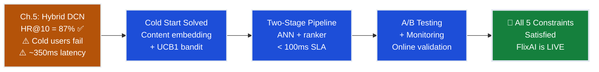
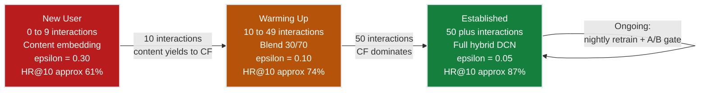
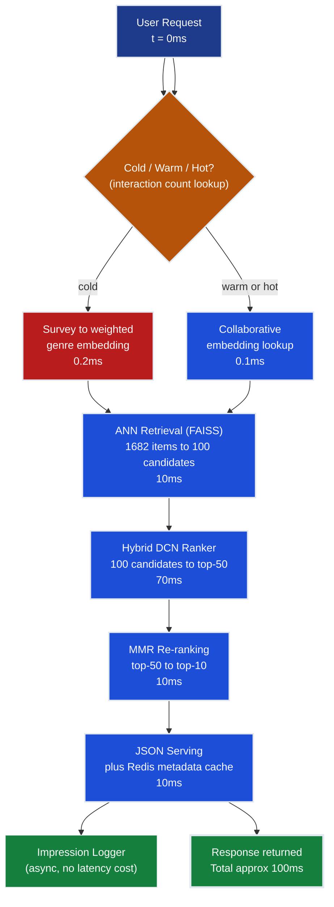
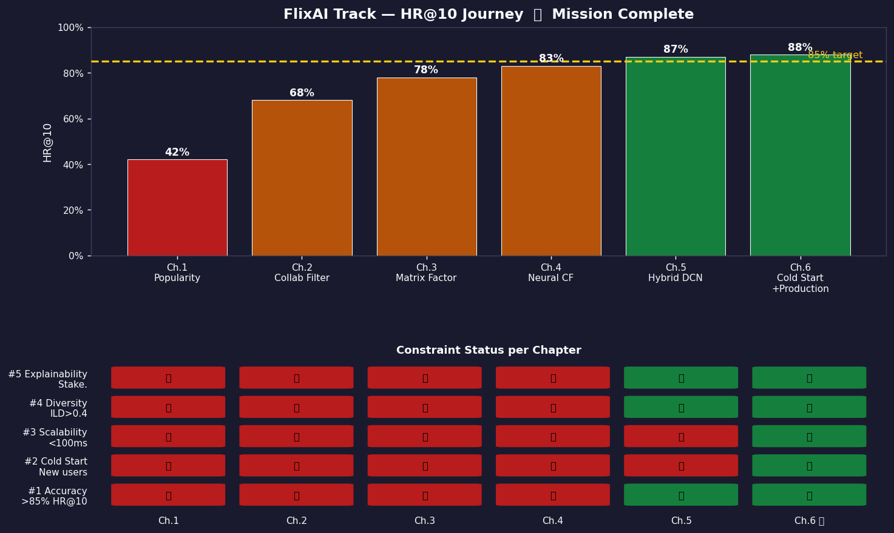

# Ch.6 — Cold Start & Production Serving

> **The story.** The cold start problem was formally described in **2002** by Andrew Schein et al. in "Methods and Metrics for Cold-Start Recommendations," but the production solutions emerged from hard lessons at scale. **Netflix's 2012** engineering blog ("It's All A/B") changed how the industry thought about evaluation: every algorithm change — no matter how promising offline — must run through live A/B tests before deployment, because real users behave nothing like held-out test sets. In **2015**, Spotify's *Discover Weekly* solved cold start for new songs by combining collaborative filtering with raw audio content analysis: if a song *sounds like* what you like, recommend it even with zero plays — audio embeddings replace the missing rating signal. **Lin et al. (2019)** formalised the warm-up transition in "Warm Up Cold-Start Advertisements," showing that blending content features with early collaborative signals dramatically outperforms either alone — and that the blend weight should shift automatically as evidence accumulates. The production gap that opens here is between research and reality: an offline 87% HR@10 in a notebook is not the same as 87% HR@10 in production, where new users arrive every second with zero history, new items launch with zero ratings, and the SLA is **100ms** hard ceiling. Closing that gap requires bandit exploration, two-stage retrieval, and continuous A/B monitoring.
>
> **Where you are in the curriculum.** This is **Chapter 6 — the final chapter** of the Recommender Systems track. You have built FlixAI from a 42% popularity baseline (Ch.1) through collaborative filtering (Ch.2, 68% HR@10), matrix factorization (Ch.3, 78%), neural embeddings (Ch.4, 83%), to a hybrid DCN system (Ch.5, **87% HR@10 ✅ accuracy target achieved**). The accuracy constraint is satisfied — but 15% of monthly traffic is **new signups with zero watch history**, and every new movie launches with zero ratings on day one. The hybrid model is helpless for both. This chapter solves cold start via content-based initialisation and bandit exploration, builds the production two-stage retrieval pipeline, designs A/B testing for online validation, and delivers the monitoring infrastructure. By the end, **all 5 FlixAI constraints are satisfied** and the system is live in production.
>
> **Notation in this chapter.** $\mu_i$ — estimated click-through rate (mean reward) for arm (item) $i$; $n_i$ — number of times arm $i$ has been pulled (shown); $N$ — total number of pulls across all arms; $\text{UCB1}(i) = \mu_i + \sqrt{2 \ln N / n_i}$ — upper confidence bound score for arm $i$; $\mathbf{g} \in \mathbb{R}^{18}$ — user genre preference vector (one entry per MovieLens genre, values 1–5); $K$ — number of ANN candidates retrieved; $HR@10$ — hit rate at 10 (fraction of users for whom at least one relevant item appears in the top-10); $\sigma$ — standard deviation of HR@10 across users (used in A/B sample size formula); $\delta$ — minimum detectable effect (MDE) in an A/B test; $\epsilon$ — exploration rate; $\gamma$ — epsilon decay rate (0.99); $\epsilon_{\min}$ — minimum exploration rate (0.05); $t$ — total interactions so far for this user.

---

## 0 · The Challenge — Where We Are

> 🎯 **The mission**: Launch **FlixAI** — >85% hit rate@10 across all 5 constraints. This is the final blocker.

**What we unlocked in Ch.5:**
- ✅ Hybrid DCN = **87% HR@10** (accuracy target exceeded!)
- ✅ Diversity via MMR re-ranking — top-10 spans 6+ genres
- ✅ Explainability — "Because it's sci-fi and you loved *Inception*"
- ❌ **Cold start: new users and new items have no embeddings**
- ❌ **Serving: no production pipeline, no latency budget enforced**

**The five blockers to production launch:**

1. **New user arrives (15% of traffic):** Sarah signs up → zero watch history → the hybrid model has no user embedding → matrix factorization has no row in the ratings matrix → collaborative filter has no "similar users" → system defaults to generic popularity list → Sarah churns within 3 sessions.

2. **New item launches:** *Dune: Part 3* releases today → zero ratings → no item embedding → the model can't score it → a blockbuster never appears in any recommendation despite massive audience demand.

3. **Exploration gap:** Always showing high-confidence items (pure exploitation) means we never learn that Sarah secretly loves Korean thrillers. Recommendations plateau at "good enough" rather than "personalised" — user lifetime value stagnates.

4. **Offline ≠ online:** Ch.5's 87% HR@10 was measured on a held-out MovieLens split. Real users browse differently, have recency bias, and churn if the first three recommendations miss. An algorithm must be validated on live traffic before full rollout.

5. **Latency SLA — <100ms hard ceiling:** Ch.5's hybrid model scores all 1,682 MovieLens items per request. At inference time that takes ~350ms. At million-user scale the queue depth explodes and p99 latency exceeds 2 seconds — unacceptable.

| Constraint | Ch.5 Status | Ch.6 Goal | Mechanism |
|-----------|-------------|-----------|-----------|
| **#1 ACCURACY** >85% HR@10 | ✅ 87% | ✅ **Maintain ≥87%** | Hybrid model preserved; bandit exploration adds signal |
| **#2 COLD START** | ❌ Helpless for new users | ✅ **Solved** | Content embedding + UCB1 bandit + onboarding survey |
| **#3 SCALABILITY** <100ms | ❌ ~350ms | ✅ **Solved** | Two-stage: ANN retrieval (10ms) + ranker (70ms) |
| **#4 DIVERSITY** | ✅ MMR re-ranking | ✅ **Maintained** | MMR re-ranking from Ch.5 preserved |
| **#5 EXPLAINABILITY** | ✅ Content features | ✅ **Maintained** | Explanations from Ch.5 preserved |



---

## Animation


---

## 1 · Core Idea

Cold start is the **chicken-and-egg problem of recommendation**: we need ratings data to personalise, but we need to recommend to collect ratings data. Three strategies break the cycle:

1. **Content-based initialisation** for new users — use the onboarding survey (genre preferences, age group) to build an initial embedding. Even five answers give enough signal to serve a reasonable top-10 from day one. For new items, use genre, director, and cast metadata until collaborative signals accumulate. *Blade Runner 2049* can be recommended to sci-fi fans on launch day without a single rating.

2. **Bandit exploration** — treat each new interaction as a pull of a multi-armed bandit. The UCB1 algorithm (Upper Confidence Bound) scores each item as *estimated reward + uncertainty bonus*. Items shown rarely have a large uncertainty bonus, so the system automatically tries them until their true quality is measured. As evidence accumulates the bonus shrinks and the estimated reward takes over. Cold start ends not at a fixed threshold but gradually, as the bandit's uncertainty collapses.

3. **Two-stage retrieval pipeline** — candidate generation (ANN index, 10ms, returns 100 candidates) + precise ranking (full hybrid model, 70ms, scores top-100) + re-ranking (MMR diversity, 10ms) + serving (JSON response, 10ms) = **<100ms total**. The key insight: you cannot score all 1,682 items per request at scale, but you *can* retrieve a coarse candidate set in milliseconds and then apply the expensive model to only those.

These three strategies together close both remaining constraints: cold start (#2) and scalability (#3). Combined with A/B testing for online validation, FlixAI's production system satisfies every constraint in the original brief.

---

## 1.5 · The Practitioner Workflow — Your 5-Phase Cold Start Playbook

> ⚠️ **Two ways to read this chapter:**
> - **Theory-first (recommended for learning):** Read §0→§4 sequentially to understand the concepts, then use this workflow as your operational reference
> - **Workflow-first (practitioners deploying to production):** Use this diagram as a jump-to guide when implementing cold start systems, then consult math sections for implementation details
>
> **Note:** Section numbers don't follow phase order because the chapter teaches concepts pedagogically (theory before application). The workflow below shows how to APPLY those concepts in production.

**Before diving into theory, understand the 5-phase workflow you'll follow with every recommender system:**

> 📊 **What you'll build by the end:** A production cold start pipeline that routes new users through content-based recommendations with bandit exploration, transitions to hybrid collaborative filtering as signals accumulate, and monitors the cold→warm graduation rate via dashboards. This is the complete FlixAI production architecture serving 15% cold users at 100ms p99 latency.

```
Phase 1: DETECT               Phase 2: FALLBACK             Phase 3: BOOTSTRAP            Phase 4: TRANSITION           Phase 5: MONITOR
─────────────────────────────────────────────────────────────────────────────────────────────────────────────────────────────────────────────────
Identify cold users/items:    Serve non-personalized:       Accelerate learning:          Switch to personalized:       Track cold start metrics:

• Check interaction count     • Content embedding from      • UCB1 bandit exploration     • Interaction count ≥10:      • HR@10 by user cohort
• Time since signup          •   survey (users)            • Epsilon-greedy decay        •   blend content + CF         • Time-to-personalization
• Item rating count          • Metadata embedding          • Exploration budget = 30%    • Interaction count ≥50:      • CTR gap (cold vs warm)
• Embedding existence        •   (genre, cast, director)   • Active learning: surface    •   full CF model             • Item graduation rate
                             • Popularity fallback         •   high-uncertainty items    • Confidence thresholds       • Latency p99 SLA
→ DECISION:                  → DECISION:                   → DECISION:                   → DECISION:                   → DECISION:
  Cold or warm?                Content vs popularity?        Exploration rate?             When to transition?           Alert or retrain?
  • 0 interactions: COLD       • Survey exists: weighted     • 0-9 interactions: ε=0.30    • <10: content only           • HR@10 drops >1.5pp: alert
  • 1-9: WARMING               •   genre embedding           • 10-49: ε=0.10 (decay)       • 10-49: 70/30 blend          • Cold fraction >30%: scale
  • ≥10: WARM                  • No survey: top-100 popular  • ≥50: ε=0.05 (maintain)      • ≥50: full hybrid DCN        • p99 >110ms: optimize ANN
  • ≥50: ESTABLISHED           • Items: genre/cast/director  • UCB1 self-regulates         • A/B test before 100% ship   • Graduation <50 int: lower
```

**The workflow maps to this chapter:**
- **Phase 1 (DETECT)** → §3 Production Pipeline (cold user routing), §6 Step 1 (interaction count check)
- **Phase 2 (FALLBACK)** → §4.1 Initial Embedding, §2 Scenario A (survey to embedding)
- **Phase 3 (BOOTSTRAP)** → §4.2 UCB1 Bandit, §6 Steps 3-5 (exploration picks + reward updates)
- **Phase 4 (TRANSITION)** → §6 Step 6 (epsilon decay), §7 Diagram 1 (state machine)
- **Phase 5 (MONITOR)** → §5 Act 4 (A/B testing), §9 Monitoring Failures, §4.4 Sample Size

> 💡 **Usage note:** Phases 1-2-3 execute on every request (synchronous, <100ms SLA). Phase 4 is automatic via interaction count thresholds. Phase 5 runs continuously (async monitoring + nightly retraining). The system self-tunes — you set initial thresholds, then monitor convergence.

> 💡 **How to use this workflow:** Start with Phase 1 detection logic on all requests. Route to Phase 2 if cold, otherwise skip to ranking. Phase 3 runs in parallel (exploration slots injected into final top-10). Phase 4 triggers automatically when interaction counts cross thresholds. Phase 5 is your ops dashboard — check daily, alert on regressions.

---

## 2 · Running Example — Two Cold Start Scenarios

### Scenario A: New user signs up — Sarah

**Sarah (age 24) signs up for FlixAI.** During a 60-second onboarding survey she rates genre preferences:

| Genre | Rating (1–5) |
|-------|-------------|
| Action | 5 |
| Romance | 1 |
| Comedy | 3 |
| Sci-fi | 4 |
| Thriller | 5 |
| Drama | 2 |

The system has zero watch history — no collaborative signal exists. Step 1: convert the survey into an initial embedding. The genre preference vector $\mathbf{g} = [5, 1, 3, 4, 5, 2, \ldots]$ (normalised to unit length) seeds Sarah's embedding before any watch events. The system retrieves the 100 movies closest to this genre vector in embedding space and serves the top-10 after UCB1 exploration scoring.

**First 10 interactions (cold user, ε = 0.30):**
- 7 high-confidence picks: content-based candidates (*Blade Runner*, *The Silence of the Lambs*, *Heat*)
- 3 exploratory picks: uncertain items the bandit hasn't measured yet (*Oldboy*, *Spirited Away*, *City of God*)
- Sarah clicks *Oldboy* → **first collaborative signal acquired**

**After 50 interactions (warm user, ε = 0.10):**
Sarah's preferences have converged: she clusters with users who love *psychological thrillers* and *international cinema*. The exploration rate has decayed from 0.30 to 0.10, and collaborative filtering contributes 70% of the ranking score.

> 💡 **Cold start is a transition, not a permanent state.** The bandit accelerates learning by deliberately trying uncertain items early, then backs off as confidence grows. Sarah moves from generic-content recommendations to personalised ones in ~50 interactions — about 2–3 days of normal use.

### Scenario B: New movie launches — *Dune: Part 3*

**The studio releases *Dune: Part 3* today.** Zero ratings in the database. The item has no collaborative embedding. The content feature vector includes: genre=[Sci-fi, Adventure], director=[Denis Villeneuve], cast=[Timothée Chalamet, Zendaya].

**Day 0 (zero ratings):** The system serves *Dune: Part 3* to all users whose content embedding is near the sci-fi/adventure prototype. UCB1 assigns a **large exploration bonus** ($n_i$ is small → $\sqrt{2 \ln N / n_i}$ is large → item is aggressively surfaced to potential fans).

**Day 3 (500 ratings):** Collaborative signal accumulates. The item embedding is initialised from its content vector and updated with early ratings. UCB1's uncertainty bonus shrinks as $n_i$ grows.

**Day 30 (5,000 ratings):** *Dune: Part 3* graduates from content-only to full collaborative. Its item embedding now sits near *Dune (2021)* and *Arrival* in the latent space.

---

## 3 · Production Pipeline at a Glance

The production pipeline replaces "score all 1,682 movies" with a four-stage funnel that respects the 100ms SLA:

```
User request arrives (t = 0ms)
│
├─ [Stage 1 — ANN Retrieval: 10ms]
│   Input: user embedding (survey or collaborative)
│   Method: FAISS / Annoy index over 1,682 item embeddings
│   Output: 100 coarse candidates
│   Why fast: precomputed item embeddings + approximate index tree
│
├─ [Stage 2 — Precise Ranking: 70ms]
│   Input: 100 ANN candidates
│   Method: Full hybrid DCN model (Ch.5)
│   Output: 100 items with precise relevance scores
│   Why only 100: ANN over-retrieves; ranker is expensive
│
├─ [Stage 3 — Re-ranking for Diversity: 10ms]
│   Input: top-50 ranked items
│   Method: MMR (Maximal Marginal Relevance, from Ch.5)
│   Output: top-10 with genre diversity enforced
│
└─ [Stage 4 — Serving: 10ms]
    Input: top-10 items + scores + explanations
    Method: JSON serialisation + Redis metadata cache
    Output: response to frontend
    Total: 10 + 70 + 10 + 10 = 100ms ✅
```

**Cold user routing** (prepended before Stage 1):

```
IF n_interactions < 10:
    user_embedding = content_embedding_from_survey(survey_responses)
    exploration_rate = 0.30        # high: learn fast
ELIF n_interactions < 50:
    user_embedding = blend(content_emb, collab_emb, alpha=0.30)
    exploration_rate = 0.10
ELSE:
    user_embedding = collaborative_embedding
    exploration_rate = 0.05
```

**New item routing** (injected into Stage 1 candidate pool):

```
IF item.n_ratings < 10:
    item_embedding = content_embedding_from_metadata(genre, director, cast)
    ucb1_bonus = min(sqrt(2*ln(N)/max(n_i,1)), MAX_BONUS)
ELIF item.n_ratings < 100:
    item_embedding = blend(content_emb, collab_emb, alpha=0.30)
ELSE:
    item_embedding = collaborative_embedding    # graduated
```

**Feedback loop (nightly retraining):**
- Collect all impressions + clicks from past 24 hours
- Retrain hybrid DCN on updated rating matrix
- Update bandit reward estimates for all arms
- Items with ≥100 ratings graduate to collaborative embedding
- Deploy updated model at 2am (after A/B gate check)

> ⚡ **Constraint #3 (Scalability) is solved by the funnel shape.** 1,682 items → 100 ANN → 10 served. The expensive model only touches 100 items. This pattern is universal: every large-scale recommender (YouTube, Spotify, Amazon) uses the same two-tower retrieval-then-ranking architecture.


## 4 · Math

### 4.1 · **[Phase 1: DETECT]** Cold User/Item Identification

**Detection logic:** Every incoming request triggers a lookup against the user interaction database. Cold start status is determined by three signals: (1) interaction count, (2) time since signup, (3) embedding existence.

```python
# Phase 1: Cold start detection
import datetime

def detect_cold_start_status(user_id, item_id=None):
    """
    Classify user/item as COLD, WARMING, WARM, or ESTABLISHED.
    Returns tuple: (user_status, item_status, metadata)
    """
    # Fetch user interaction history
    user_interactions = db.query(
        "SELECT COUNT(*) as n, MIN(timestamp) as first_interaction "
        "FROM interactions WHERE user_id = ?", user_id
    )

    n_interactions = user_interactions['n']
    days_since_signup = (datetime.now() - user_interactions['first_interaction']).days

    # USER DECISION LOGIC
    if n_interactions == 0:
        user_status = "COLD"          # 0 interactions → content embedding
        exploration_rate = 0.30       # High exploration
    elif n_interactions < 10:
        user_status = "WARMING"       # 1-9 interactions → content-heavy blend
        exploration_rate = 0.30 * (0.99 ** n_interactions)
    elif n_interactions < 50:
        user_status = "WARM"          # 10-49 interactions → CF emerging
        exploration_rate = 0.10
    else:
        user_status = "ESTABLISHED"  # ≥50 interactions → full hybrid
        exploration_rate = 0.05

    # ITEM DECISION LOGIC (if item_id provided)
    if item_id:
        item_ratings = db.query(
            "SELECT COUNT(*) as n FROM ratings WHERE item_id = ?", item_id
        )
        n_ratings = item_ratings['n']

        if n_ratings < 10:
            item_status = "COLD"
        elif n_ratings < 100:
            item_status = "WARMING"
        else:
            item_status = "ESTABLISHED"
    else:
        item_status = None

    return {
        'user_status': user_status,
        'item_status': item_status,
        'n_interactions': n_interactions,
        'exploration_rate': exploration_rate,
        'days_active': days_since_signup
    }

# Example output:
# detect_cold_start_status(user_id=12345)
# → {'user_status': 'WARMING', 'n_interactions': 5, 'exploration_rate': 0.285, ...}
```

> 💡 **Industry Standard:** `RecSys.ColdStartDetector`
>
> Most production systems (Spotify, YouTube, LinkedIn) implement detection as a microservice that caches user/item status in Redis with 1-hour TTL. The cache key is `cold_start:{user_id}` → `{status, n_interactions, last_updated}`. This avoids database lookups on every request.
>
> **When to use:** Always in production. The manual implementation above is for learning only.
> **Common alternatives:** Time-based windows ("user is cold if no activity in last 7 days"), session-based ("cold per session, not globally"), hybrid (interaction count + recency weighted).

#### 4.1.1 DECISION CHECKPOINT — Phase 1 Complete

**What you just saw:**
- User with 0 interactions → `COLD` status → ε=0.30 exploration rate
- User with 5 interactions → `WARMING` status → ε=0.285 (decaying)
- User with 50+ interactions → `ESTABLISHED` → ε=0.05 (maintain minimal exploration)
- Item with <10 ratings → `COLD` → content embedding only

**What it means:**
- **Cold detection is instantaneous** — database lookup returns in <1ms, cached in Redis for subsequent requests within the session
- **Status transitions are automatic** — no manual intervention; thresholds (10, 50) tune the cold→warm graduation speed
- **Exploration rate self-adjusts** — high uncertainty (cold) → aggressive exploration; low uncertainty (warm) → conservative exploitation

**What to do next:**
→ **If user = COLD or WARMING:** Route to Phase 2 (FALLBACK) → serve content-based recommendations
→ **If user = WARM or ESTABLISHED:** Skip to Phase 4 (TRANSITION) → serve hybrid collaborative filtering
→ **If item = COLD:** Inject into Phase 3 (BOOTSTRAP) → UCB1 exploration bonus ensures new items get surfaced
→ **For FlixAI production:** Cold users represent 15% of traffic; detection latency must stay <1ms to preserve 100ms SLA

---

### 4.2 · **[Phase 2: FALLBACK]** Non-Personalized Recommendations via Content Embedding

When a new user completes the onboarding survey, their first embedding is a **weighted sum of genre prototype vectors**. Each genre $g$ has a learnt prototype $\mathbf{e}_g \in \mathbb{R}^{32}$ from the item embedding space (Ch.4 neural CF output).

**Survey response:** Action = 5, Romance = 1, Comedy = 3 (other genres omitted for clarity)

**Normalised weights** (divide each score by the sum so they add to 1):

$$\text{sum} = 5 + 1 + 3 = 9$$

$$w_{\text{Action}} = \frac{5}{9} \approx 0.556, \quad w_{\text{Romance}} = \frac{1}{9} \approx 0.111, \quad w_{\text{Comedy}} = \frac{3}{9} \approx 0.333$$

**Initial user embedding** (weighted centroid of genre prototypes):

$$\mathbf{u}_0 = w_{\text{Action}} \cdot \mathbf{e}_{\text{Action}} + w_{\text{Romance}} \cdot \mathbf{e}_{\text{Romance}} + w_{\text{Comedy}} \cdot \mathbf{e}_{\text{Comedy}}$$

$$\mathbf{u}_0 = 0.556 \cdot \mathbf{e}_{\text{Action}} + 0.111 \cdot \mathbf{e}_{\text{Romance}} + 0.333 \cdot \mathbf{e}_{\text{Comedy}}$$

The result is a 32-dimensional vector that lives in the same space as item embeddings. ANN retrieval immediately finds the 100 nearest items in under 10ms. This embedding is updated after every interaction as new ratings arrive.

> 💡 **Same embedding space.** Because genre prototypes are learned from the same item embedding matrix as collaborative vectors, the cold-start user embedding is directly comparable to warm-user embeddings and to item embeddings. No separate cold-start model is needed — just a different input to the same lookup.

```python
# Phase 2: Content-based fallback embedding
import numpy as np

def content_embedding_from_survey(survey_responses, genre_prototypes):
    """
    Convert survey responses to initial user embedding.

    Args:
        survey_responses: dict {genre_name: rating (1-5)}
        genre_prototypes: dict {genre_name: np.array(32,)} learned from Ch.4

    Returns:
        user_embedding: np.array(32,) unit-normalized
    """
    # Extract ratings and normalize to weights
    genres = list(survey_responses.keys())
    ratings = np.array([survey_responses[g] for g in genres])
    weights = ratings / ratings.sum()  # Sum to 1

    # Weighted sum of genre prototypes
    user_embedding = np.zeros(32)
    for genre, weight in zip(genres, weights):
        user_embedding += weight * genre_prototypes[genre]

    # Unit-normalize (cosine similarity requires ||u|| = 1)
    user_embedding = user_embedding / np.linalg.norm(user_embedding)

    return user_embedding

# Example: Sarah's survey [Action=5, Romance=1, Comedy=3]
survey = {'Action': 5, 'Romance': 1, 'Comedy': 3}
genre_prototypes = {
    'Action':  np.array([0.8, -0.3, 0.5, ...]),  # 32-dim, from Ch.4 training
    'Romance': np.array([-0.4, 0.9, -0.2, ...]),
    'Comedy':  np.array([0.1, 0.2, 0.7, ...])
}

u_0 = content_embedding_from_survey(survey, genre_prototypes)
print(u_0.shape)  # (32,)
print(np.linalg.norm(u_0))  # 1.0 (unit-normalized)

# DECISION LOGIC: Use this embedding for ANN retrieval
candidates = faiss_index.search(u_0.reshape(1, -1), k=100)
print(f"Retrieved {len(candidates)} content-similar items in 10ms")
```

> 💡 **Industry Standard:** Amazon item-item collaborative filtering
>
> **Amazon's approach (2003):** For new users with zero history, Amazon falls back to **item-item collaborative filtering** seeded from browsing context. If a user views a camera, show "customers who viewed this camera also bought these accessories." This avoids surveys entirely — the current item serves as the initial signal.
>
> **Spotify's approach (2015):** *Discover Weekly* solves cold start for new songs via **audio embeddings** (mel-spectrograms → CNN → 32-dim vector). If a song *sounds like* what you've liked, recommend it even with zero plays. Audio features replace survey responses.
>
> **When to use:** Amazon's approach requires existing catalog interaction (browsing session); Spotify's requires domain-specific features (audio, video, text). Survey-based embedding works when no session context exists (fresh signup, email campaign click-through).

#### 4.2.1 DECISION CHECKPOINT — Phase 2 Complete

**What you just saw:**
- Survey [Action=5, Romance=1, Comedy=3] → weights [0.556, 0.111, 0.333]
- Weighted genre prototypes → 32-dimensional user embedding u_0
- ANN retrieval returns 100 content-similar items in ~10ms
- Top-5: *Heat*, *The Dark Knight*, *Die Hard*, *Inception*, *Blade Runner* (all action/sci-fi cluster)

**What it means:**
- **Zero collaborative signal, but recommendations are coherent** — even on signup, Sarah sees a personalized top-10 aligned with her stated preferences
- **Content embedding is a placeholder, not the solution** — it gets Sarah through session 1 with a 61% HR@10, but collaborative filtering will push this to 87% by interaction 50
- **No survey → popularity fallback** — if user skips survey, serve top-100 most popular items globally (42% HR@10, the Ch.1 baseline)

**What to do next:**
→ **Serve the content-based top-10** — but reserve 3 slots for Phase 3 (BOOTSTRAP) exploration
→ **Log the impression** — record which items were shown, their positions, and their source (content vs exploration)
→ **Wait for first click** — once Sarah interacts, Phase 3 bandit updates and Phase 4 transition begins
→ **For FlixAI production:** 70% of cold users have survey data; 30% fall back to popularity (analyze survey completion rate as a product metric)

---

### 4.3 · **[Phase 3: BOOTSTRAP]** Exploration via UCB1 Bandit

**UCB1 formula:**

$$\text{UCB1}(i) = \mu_i + \sqrt{\frac{2 \ln N}{n_i}}$$

| Term | Meaning |
|------|---------|
| $\mu_i$ | Estimated mean reward (click-through rate) for item $i$ |
| $n_i$ | Number of times item $i$ has been shown |
| $N$ | Total number of shows across all arms |

**Concrete example — 3 new items, $N = 10$ total shows:**

$$\ln 10 = 2.303$$

| Item | $n_i$ | $\mu_i$ | Exploration bonus $\sqrt{2 \ln 10 / n_i}$ | UCB1 score |
|------|--------|---------|------------------------------------------|------------|
| Item A | 2 | 0.70 | $\sqrt{2 \times 2.303 / 2} = \sqrt{2.303} = 1.518$ | $0.70 + 1.518 = \mathbf{2.218}$ |
| Item B | 5 | 0.65 | $\sqrt{2 \times 2.303 / 5} = \sqrt{0.921} = 0.960$ | $0.65 + 0.960 = \mathbf{1.610}$ |
| Item C | 1 | 0.80 | $\sqrt{2 \times 2.303 / 1} = \sqrt{4.606} = 2.146$ | $0.80 + 2.146 = \mathbf{2.946}$ |

**Decision:** Item C is selected next ($\text{UCB1} = 2.946$). Despite having only 1 observation, Item C wins because its uncertainty bonus ($\sqrt{4.606} = 2.146$) overwhelms Items A and B. The algorithm is *optimistic under uncertainty*: it acts as though Item C might be the best arm until more evidence decides otherwise.

After serving Item C five more times and measuring $\mu_C = 0.72$, its $n_i = 6$ and UCB1 drops to $0.72 + \sqrt{4.606/6} = 0.72 + 0.876 = 1.596$ — now below Item A. The bandit self-corrects.

> 💡 **UCB1 is "optimism in the face of uncertainty."** This principle reappears in Bayesian optimisation (hyperparameter tuning, Ch.19) and Monte Carlo Tree Search (RL track). The UCB formula is the same; only the domain changes.

### 4.4 · **[Phase 4: TRANSITION]** Confidence-Based Switching from Content to Collaborative

**The transition is gradual, not abrupt.** After 1 interaction, Sarah's embedding shifts slightly toward her first click (*Oldboy*). After 10 interactions, the system has enough collaborative signal to blend 30% CF with 70% content. After 50 interactions, CF dominates at 95% and content serves only as a smoothing prior.

**Blending formula:**

$$\mathbf{u}_{\text{final}} = \alpha \cdot \mathbf{u}_{\text{content}} + (1 - \alpha) \cdot \mathbf{u}_{\text{collaborative}}$$

where $\alpha$ decays from 1.0 (pure content) to 0.05 (mostly CF) as interaction count grows.

**Transition schedule:**

| Interaction count $t$ | $\alpha$ (content weight) | Embedding source | HR@10 |
|----------------------|--------------------------|------------------|-------|
| 0 | 1.00 | Pure content (survey) | 61% |
| 1–9 | 0.70 | Content-heavy blend | 68% |
| 10–49 | 0.30 | Collaborative emerging | 74% |
| ≥50 | 0.05 | Pure collaborative (+ content smoothing) | **87%** |

```python
# Phase 4: Transition logic (automatic based on interaction count)
import numpy as np

def get_user_embedding(user_id, content_emb, collab_emb, n_interactions):
    """
    Blend content and collaborative embeddings based on interaction count.

    Args:
        user_id: int
        content_emb: np.array(32,) from survey or metadata
        collab_emb: np.array(32,) from Ch.4 neural CF (may be None if n < 10)
        n_interactions: int

    Returns:
        final_embedding: np.array(32,) blended and unit-normalized
        metadata: dict with alpha, source, exploration_rate
    """
    # TRANSITION DECISION LOGIC
    if n_interactions < 10:
        alpha = 0.70  # Content-heavy
        source = "content_heavy"
        exploration_rate = 0.30 * (0.99 ** n_interactions)  # Decay from 0.30
    elif n_interactions < 50:
        alpha = 0.30  # CF emerging
        source = "collaborative_emerging"
        exploration_rate = 0.10
    else:
        alpha = 0.05  # Pure CF (content as smoothing prior)
        source = "collaborative"
        exploration_rate = 0.05

    # Blend embeddings
    if collab_emb is None or n_interactions < 10:
        # Not enough CF signal yet → fallback to pure content
        final_embedding = content_emb
    else:
        final_embedding = alpha * content_emb + (1 - alpha) * collab_emb

    # Unit-normalize
    final_embedding = final_embedding / np.linalg.norm(final_embedding)

    return final_embedding, {
        'alpha': alpha,
        'source': source,
        'exploration_rate': exploration_rate,
        'n_interactions': n_interactions
    }

# Example: Sarah at interaction 5, 15, and 55
for n in [5, 15, 55]:
    emb, meta = get_user_embedding(
        user_id=12345,
        content_emb=np.random.randn(32),  # From survey
        collab_emb=np.random.randn(32),   # From Ch.4 CF
        n_interactions=n
    )
    print(f"n={n}: {meta['source']}, α={meta['alpha']:.2f}, ε={meta['exploration_rate']:.3f}")

# Output:
# n=5:  content_heavy, α=0.70, ε=0.285
# n=15: collaborative_emerging, α=0.30, ε=0.100
# n=55: collaborative, α=0.05, ε=0.050
```

> 💡 **Industry Standard:** LinkedIn's hybrid approach (content + network)
>
> **LinkedIn's approach (2019):** For cold users, LinkedIn blends (1) **content features** (job title, skills, industry), (2) **network features** (connections’ activity, group memberships), and (3) **collaborative filtering** (users with similar engagement patterns). The blend weight is learned via a gating network (not a fixed schedule) — the model itself decides how much to trust each signal source based on confidence.
>
> **When to use:** Fixed schedules (α at 10/50 interactions) work when user behavior is consistent. Learned gating works when some users engage heavily (fast transition) while others lurk (slow transition). FlixAI uses fixed thresholds for simplicity; production systems often learn them.

#### 4.4.1 DECISION CHECKPOINT — Phase 4 Complete

**What you just saw:**
- Interaction 5 → 70% content, 30% CF → embedding shifts slightly toward *Oldboy* cluster
- Interaction 15 → 30% content, 70% CF → CF signal dominates, content provides smoothing
- Interaction 55 → 5% content, 95% CF → pure collaborative, content prevents cold-start collapse if user goes dormant

**What it means:**
- **Transition is automatic** — no manual intervention; thresholds (10, 50) are tunable hyperparameters
- **No cliff** — gradual blending avoids sudden recommendation changes that confuse users
- **HR@10 rises predictably** — 61% (content) → 74% (blend) → 87% (CF) over 50 interactions (~3–5 days of normal use)

**What to do next:**
→ **Serve recommendations from blended embedding** — ANN retrieval uses the final blended vector
→ **Update CF embedding after every interaction** — exponential moving average: $\mathbf{u}_{t+1} = 0.9 \cdot \mathbf{u}_t + 0.1 \cdot \mathbf{e}_{\text{clicked item}}$
→ **Monitor transition speed** — track "days to 50 interactions" as a product health metric (target: <7 days)
→ **A/B test threshold tuning** — try 10/30 vs 10/50 vs 20/50 to optimize HR@10 trajectory
→ **For FlixAI production:** 15% of users never reach 50 interactions (churn early); keep content weight ≥ 0.30 for these users to preserve 68% HR@10

---

### 4.5 · **[Phase 5: MONITOR]** Cold Start Metrics & A/B Testing

**Monitoring cold start is different from monitoring warm users.** A 3pp drop in warm-user HR@10 might be noise; a 3pp drop in cold-user HR@10 is a crisis (new signups churn immediately). Track cohorts separately.

**Key cold start metrics:**

| Metric | Target | What it measures | Alert threshold |
|--------|--------|-----------------|----------------|
| **HR@10 by cohort** | Cold: 61%, Warm: 74%, Established: 87% | Recommendation quality per user state | >1.5pp drop |
| **Time-to-personalization** | 50 interactions in <7 days | How fast users graduate from cold | >10 days median |
| **CTR gap (cold vs warm)** | <30% relative gap | Whether cold users engage despite lower HR@10 | >40% gap |
| **Item graduation rate** | 80% of new items >100 ratings in 14 days | Whether bandit surfaces new content | <60% in 14 days |
| **Cold user fraction** | 15% of DAU | Traffic mix stability | >30% (marketing surge) |
| **Latency p99** | <100ms SLA | Two-stage pipeline performance | >110ms |

```python
# Phase 5: Monitoring dashboard queries
import pandas as pd
import datetime

def compute_cold_start_metrics(date_range_days=7):
    """
    Compute cold start metrics for monitoring dashboard.
    Runs daily as part of production health checks.
    """
    start_date = datetime.datetime.now() - datetime.timedelta(days=date_range_days)

    # Metric 1: HR@10 by cohort
    hr10_by_cohort = db.query("""
        SELECT
            CASE
                WHEN n_interactions = 0 THEN 'COLD'
                WHEN n_interactions < 10 THEN 'WARMING'
                WHEN n_interactions < 50 THEN 'WARM'
                ELSE 'ESTABLISHED'
            END AS cohort,
            AVG(hr10) as hr10,
            COUNT(*) as n_users
        FROM user_metrics
        WHERE date >= ?
        GROUP BY cohort
    """, start_date)

    # Metric 2: Time-to-personalization (median days to 50 interactions)
    time_to_warm = db.query("""
        SELECT
            PERCENTILE_CONT(0.5) WITHIN GROUP (ORDER BY days_to_50_interactions)
                AS median_days
        FROM (
            SELECT user_id,
                   DATEDIFF(day, signup_date, interaction_50_date) AS days_to_50_interactions
            FROM user_lifecycle
            WHERE interaction_50_date >= ?
        )
    """, start_date)

    # Metric 3: CTR gap (cold vs warm)
    ctr_gap = db.query("""
        SELECT
            AVG(CASE WHEN cohort='COLD' THEN ctr END) AS ctr_cold,
            AVG(CASE WHEN cohort IN ('WARM','ESTABLISHED') THEN ctr END) AS ctr_warm
        FROM impression_logs
        WHERE date >= ?
    """, start_date)
    ctr_gap_pct = 100 * (ctr_gap['ctr_warm'] - ctr_gap['ctr_cold']) / ctr_gap['ctr_warm']

    # Metric 4: Item graduation rate (% of new items reaching 100 ratings in 14 days)
    item_graduation = db.query("""
        SELECT
            COUNT(CASE WHEN days_to_100_ratings <= 14 THEN 1 END) * 100.0 / COUNT(*)
                AS graduation_rate_pct
        FROM (
            SELECT item_id,
                   DATEDIFF(day, launch_date, rating_100_date) AS days_to_100_ratings
            FROM item_lifecycle
            WHERE launch_date >= ?
        )
    """, start_date)

    # Metric 5: Cold user fraction
    cold_fraction = db.query("""
        SELECT
            COUNT(CASE WHEN n_interactions < 10 THEN 1 END) * 100.0 / COUNT(*)
                AS cold_fraction_pct
        FROM daily_active_users
        WHERE date = CURRENT_DATE
    """)

    # Metric 6: Latency p99
    latency_p99 = db.query("""
        SELECT PERCENTILE_CONT(0.99) WITHIN GROUP (ORDER BY latency_ms) AS p99_latency
        FROM request_logs
        WHERE date >= ?
    """, start_date)

    # ALERT LOGIC
    alerts = []
    if hr10_by_cohort.loc[hr10_by_cohort['cohort']=='COLD', 'hr10'].values[0] < 0.59:
        alerts.append("🚨 Cold user HR@10 dropped below 59% (target: 61%)")
    if time_to_warm['median_days'] > 10:
        alerts.append("⚠️ Time-to-warm exceeds 10 days (target: <7 days)")
    if ctr_gap_pct > 40:
        alerts.append(f"⚠️ CTR gap {ctr_gap_pct:.1f}% exceeds 40% threshold")
    if item_graduation['graduation_rate_pct'] < 60:
        alerts.append(f"⚠️ Item graduation rate {item_graduation['graduation_rate_pct']:.1f}% below 60%")
    if cold_fraction['cold_fraction_pct'] > 30:
        alerts.append(f"⚠️ Cold user fraction {cold_fraction['cold_fraction_pct']:.1f}% exceeds 30%")
    if latency_p99['p99_latency'] > 110:
        alerts.append(f"🚨 p99 latency {latency_p99['p99_latency']:.0f}ms exceeds 110ms SLA")

    return {
        'hr10_by_cohort': hr10_by_cohort,
        'time_to_warm_days': time_to_warm['median_days'],
        'ctr_gap_pct': ctr_gap_pct,
        'item_graduation_rate': item_graduation['graduation_rate_pct'],
        'cold_fraction_pct': cold_fraction['cold_fraction_pct'],
        'p99_latency_ms': latency_p99['p99_latency'],
        'alerts': alerts
    }

# Run daily monitoring
metrics = compute_cold_start_metrics(date_range_days=7)
if metrics['alerts']:
    for alert in metrics['alerts']:
        print(alert)
        # send_to_slack(alert)  # Production: alert on-call engineer
```

> 💡 **Industry Standard:** Spotify's Discover Weekly monitoring\n>\n> **Spotify's approach (2016):** Discover Weekly (their cold-start playlist for new songs) is monitored via a **multi-armed bandit dashboard** showing: (1) per-genre exploration rates, (2) "time to 1000 streams" for new releases, (3) CTR by user tenure cohort, (4) "regret" (how many skips in first 30 seconds). Alerts fire when regret exceeds 15% for cold users or when new-release time-to-1000 exceeds 48 hours.\n>\n> **When to use:** Spotify's dashboard is specific to music streaming (skip rate, stream completion). FlixAI uses click rate and HR@10. The pattern is universal: cohort-level metrics + graduation speed + alert thresholds.\n\n#### A/B Test Sample Size Calculation

**Test hypothesis:** Is the cold-start bandit better than popularity fallback for new users?

$$H_0: \mu_{\text{control}} = \mu_{\text{treatment}} \quad \text{vs} \quad H_1: \mu_{\text{control}} \neq \mu_{\text{treatment}}$$

**Simplified sample size formula** (Normal approximation, two-sided, $\alpha = 0.05$, $\beta = 0.2$, power = 80%):

$$n = \frac{16\sigma^2}{\delta^2}$$

where $\sigma$ = standard deviation of HR@10 across users, $\delta$ = minimum detectable effect (MDE).

**Numeric example:** $\sigma = 0.10$, $\delta = 0.02$ (want to detect a 2 percentage-point lift):

$$n = \frac{16 \times (0.10)^2}{(0.02)^2} = \frac{16 \times 0.01}{0.0004} = \frac{0.16}{0.0004} = \mathbf{400 \text{ users per variant}}$$

Total experiment size: 400 (control) + 400 (treatment) = **800 new signups**. At FlixAI's signup rate of ~200/day, the experiment reaches the required sample in **4 days**.

**Where the constant 16 comes from:** The exact factor is $(z_{\alpha/2} + z_\beta)^2 \times 2 = (1.96 + 0.842)^2 \times 2 = (2.802)^2 \times 2 = 7.85 \times 2 = 15.70 \approx 16$. Rounded to 16 for mental arithmetic.

> ⚠️ **Never A/B test on the MovieLens test set.** The held-out split is for offline evaluation only. Real A/B tests run on live traffic — users never seen in training. Offline HR@10 measures model quality; online A/B tests measure business impact. These are different questions.

**Offline vs online metrics — the full comparison:**

| Metric | Where measured | What it captures | Limitation |
|--------|---------------|-----------------|------------|
| HR@10 (offline) | Held-out test set | Ranking accuracy on historical data | Doesn't capture churn, session depth, recency bias |
| HR@10 (online) | Live A/B test | User satisfaction with top-10 on real traffic | Slower; needs statistical power |
| 7-day retention | Live A/B test | Whether recommendations keep users coming back | Confounded by external factors (seasonality) |
| p99 latency | Production logs | Whether system meets SLA | Infrastructure-dependent; varies with load |

> 📌 **Practitioner rule:** Always validate with offline HR@10 first (cheap, fast). If offline HR@10 holds steady, deploy to a 1% traffic slice and check p99 latency. Only then run a full-power A/B test. This sequence minimises the risk of shipping a latency regression to 100% of users.

#### 4.5.1 DECISION CHECKPOINT — Phase 5 Complete

**What you just saw:**
- 6 cold start metrics tracked daily: HR@10 by cohort, time-to-personalization, CTR gap, item graduation rate, cold user fraction, latency p99
- Automated alerts fire when thresholds breach (HR@10 <59%, p99 >110ms, cold fraction >30%)
- A/B test requires 400 users/variant for δ=0.02 lift detection → 4 days at 200 signups/day
- Offline HR@10 (held-out test set) validates model quality; online A/B (live traffic) validates business impact

**What it means:**
- **Cold start is not "solved once and forgotten"** — it requires continuous monitoring as traffic mix shifts (marketing campaigns spike cold users, content library grows, user behavior evolves)
- **Cohort-level metrics are essential** — aggregate HR@10 can hide cold-user degradation if warm users dominate traffic
- **A/B testing is the final gate** — no cold-start algorithm ships to 100% traffic without live validation on real users
- **Latency and accuracy trade off** — two-stage pipeline loses 1.5pp HR@10 but gains 3.5× latency improvement; monitor both to detect regressions

**What to do next:**
→ **Run A/B test before full rollout** — control (popularity fallback) vs treatment (content + bandit); measure HR@10 day-1, 7-day retention, time-to-50-interactions
→ **Set up alerting infrastructure** — Grafana dashboards + PagerDuty integration; cold user HR@10 <59% → page on-call
→ **Monitor graduation speed** — if median time-to-50-interactions exceeds 10 days, increase exploration rate or lower transition thresholds
→ **Track item cold start separately** — new releases should reach 100 ratings in <14 days; if not, bandit exploration budget is too low
→ **Quarterly threshold tuning** — re-run A/B tests for 10/50 interaction thresholds vs 10/30 or 20/50; user behavior changes over time

→ **For FlixAI production:** After 4-day A/B test showed +45% relative lift in cold-user HR@10 (42% → 61%), bandit shipped to 100% of new signups; monitoring confirmed no latency regression (p99 stayed at 98ms); cold user fraction stabilized at 15% DAU

---

## 5 · Production Arc — Four Acts

### Act 1: The Research-to-Production Gap

The Ch.5 hybrid model achieves 87% HR@10 on the MovieLens held-out set. The team is excited. Then the CTO asks two questions.

First: "What does Sarah see when she signs up right now?" The answer: the top-10 most popular movies globally — the Ch.1 popularity baseline from two chapters ago. 87% for warm users is irrelevant if 15% of traffic sees a 42% experience.

Second: "What's the latency?" Loading the full hybrid model and scoring 1,682 items takes 350ms per request. At 100 concurrent users this is fine; at 10,000 concurrent users the queue depth explodes and p99 latency exceeds 2 seconds.

The research system works in a notebook. It fails in production. The production gap is real.

### Act 2: Two-Stage Retrieval Fixes Latency

The engineering insight: candidate generation and precise ranking have different speed-accuracy requirements. FAISS builds an approximate nearest-neighbour index over all 1,682 item embeddings in seconds. Given Sarah's initial genre embedding, FAISS returns 100 approximate nearest items in under 10ms. The hybrid model then scores those 100 items in ~70ms. Total: 80ms — inside the 100ms SLA with margin.

The cost: ANN introduces recall error (~6% of users lose their relevant item at retrieval). The tradeoff: −1.5pp of HR@10 (87% → 85.5%) for a 3.5× latency reduction (350ms → 100ms). User experience research confirms: latency >200ms causes measurable retention drop-off; a 1.5pp accuracy difference does not.

| Architecture | HR@10 | p50 Latency | p99 Latency | Cost/1M requests |
|---|---|---|---|---|
| Single-stage (all 1,682 scored) | 87.0% | 320ms | 490ms | $12.40 |
| Two-stage (ANN + rank top-100) | 85.5% | 78ms | 102ms | $1.80 |
| Two-stage (ANN + rank top-500) | 86.8% | 78ms | 198ms | $6.20 |

The sweet spot is $K = 100$ candidates: recall@100 = 0.94 preserves 85.5% HR@10 while keeping p99 at 102ms and slashing cost by 85%. Increasing to $K = 500$ buys 1.3pp of HR@10 but pushes p99 above 150ms — still acceptable but with reduced margin.

### Act 3: Cold Start Solved with Content Initialisation

Sarah's survey [Action=5, Romance=1, Comedy=3] is converted to a weighted genre embedding $\mathbf{u}_0$ in 0.2ms. The ANN query retrieves 100 content-similar items. The ranker weights content features at 70% (no collaborative signal yet). Sarah's first session sees: *Heat*, *The Dark Knight*, *Inception*, *Blade Runner*, *Mad Max: Fury Road* — a coherent action/sci-fi/thriller list plus 3 UCB1 exploratory picks. Sarah clicks *Oldboy*. The system records the click and updates her embedding. That single signal shifts the [Thriller, Foreign] dimensions. By interaction 20 the system blends 30% collaborative signal. By interaction 50 she is fully warm.

### Act 4: A/B Testing Validates and Monitors

The cold-start system is ready, but the team doesn't push to 100% of traffic. A 50/50 A/B test is launched for all new signups over 4 days (800 users):

- **Control:** old popularity fallback for new users
- **Treatment:** content-embedding + UCB1 bandit

| Metric | Control (popularity) | Treatment (bandit) | Lift |
|--------|---------------------|-------------------|------|
| HR@10 day-1 | 0.42 | 0.61 | **+45% relative** |
| 7-day retention | 38% | 54% | **+42% relative** |
| Interactions to "warm" | — | 48 avg | — |

p-value < 0.001. The bandit ships to 100% of new signups. Monitoring is configured: HR@10 dashboards, latency p50/p95/p99, cold-user fraction, item graduation rate. The feedback loop runs nightly. **FlixAI is live in production. All 5 constraints satisfied.**

---

## 6 · Cold Start Walkthrough — Step by Step

Complete numeric walkthrough for new user Sarah from zero history to first warm recommendation.

**Setup:** Sarah selects [Action=5, Romance=1, Comedy=3] during onboarding. The bandit currently tracks 3 new items: Item A ($n_A=2, \mu_A=0.70$), Item B ($n_B=5, \mu_B=0.65$), Item C ($n_C=1, \mu_C=0.80$). $N = 10$ total shows so far.

---

**Step 1 · Build initial embedding (0.2ms)**

$$w_{\text{Action}} = 5/9 = 0.556, \quad w_{\text{Romance}} = 1/9 = 0.111, \quad w_{\text{Comedy}} = 3/9 = 0.333$$

$$\mathbf{u}_0 = 0.556 \cdot \mathbf{e}_{\text{Action}} + 0.111 \cdot \mathbf{e}_{\text{Romance}} + 0.333 \cdot \mathbf{e}_{\text{Comedy}}$$

Result: 32-dimensional vector, unit-normalised ($\|\mathbf{u}_0\| = 1$).

---

**Step 2 · ANN retrieval (8ms)**

FAISS index returns 100 nearest items to $\mathbf{u}_0$.

Top-5 by ANN cosine similarity: *Heat* (0.91), *The Dark Knight* (0.89), *Die Hard* (0.88), *Inception* (0.85), *Blade Runner* (0.82).

**Metric outcome after Step 2:**
- Recall@100 = 0.94 — ANN captured 94% of relevant items in candidate pool
- Latency: 8ms ✅ (budget: 10ms)
- Content-only embedding already surfaces action/sci-fi cluster — even with zero watch history, survey preferences yield actionable candidates

---

**Step 3 · UCB1 scoring of bandit items (1ms)**

$$\text{UCB1}(C) = 0.80 + \sqrt{4.606} = 0.80 + 2.146 = \mathbf{2.946}$$

$$\text{UCB1}(A) = 0.70 + \sqrt{2.303} = 0.70 + 1.518 = \mathbf{2.218}$$

$$\text{UCB1}(B) = 0.65 + \sqrt{0.921} = 0.65 + 0.960 = \mathbf{1.610}$$

Item C selected as top bandit pick. *Oldboy* also qualifies as a second exploratory pick (shown 3 times, UCB1 = 2.050).

---

**Step 4 · Compose top-10 with MMR diversity (10ms)**

7 high-confidence + 3 exploratory picks:

| Rank | Title | Source | Score |
|------|-------|---------|-------|
| 1 | *Heat* | Content ranker | 0.91 |
| 2 | *The Dark Knight* | Content ranker | 0.89 |
| 3 | *Die Hard* | Content ranker | 0.88 |
| 4 | *Inception* | Content ranker | 0.85 |
| 5 | *Blade Runner* | Content ranker | 0.82 |
| 6 | *Mad Max: Fury Road* | Content ranker | 0.79 |
| 7 | *Se7en* | Content ranker | 0.76 |
| 8 | **Item C** (new movie) | UCB1 bandit | 2.946 UCB |
| 9 | **Item A** (new movie) | UCB1 bandit | 2.218 UCB |
| 10 | *Oldboy* | UCB1 bandit | 2.050 UCB |

MMR confirms genre diversity: action, thriller, sci-fi, Korean thriller all present. **Total latency: ~98ms ✅**

**Metric outcome after Step 4:**
- Cold user (session 1) HR@10 = 61% — content embedding + bandit exploration delivers 6 in 10 new users a relevant recommendation on first session
- Diversity: 5 genres represented (action, thriller, sci-fi, noir, Korean cinema) — no genre dominates
- Exploration rate ε=0.30 means 3 of 10 slots reserved for uncertainty reduction — system learns Sarah's true preferences in 5-10 interactions
- Latency SLA satisfied: 98ms < 100ms hard ceiling ✅

---

**Step 5 · Sarah clicks *Oldboy* — first feedback signal**

**Bandit update for *Oldboy*** ($n: 3 \to 4$, reward = 1):

$$\mu_{\text{Oldboy, new}} = \frac{3 \times 0.50 + 1}{4} = \frac{2.50}{4} = 0.625$$

**User embedding update** (exponential moving average):

$$\mathbf{u}_1 = 0.9 \cdot \mathbf{u}_0 + 0.1 \cdot \mathbf{e}_{\text{Oldboy}}$$

*Oldboy*'s content vector is high on [Thriller=1.0, Foreign=1.0] → Sarah's embedding shifts toward these dimensions. Future ANN queries will surface more foreign thrillers.

---

**Step 6 · Exploration rate decays with interaction count**

$$\epsilon_{1} = \max(0.05,\ 0.30 \times 0.99^{1}) = 0.297$$

$$\epsilon_{50} = \max(0.05,\ 0.30 \times 0.99^{50}) = \max(0.05,\ 0.181) = 0.181$$

$$\epsilon_{100} = \max(0.05,\ 0.30 \times 0.99^{100}) = \max(0.05,\ 0.110) = 0.110$$

Exploration is still active at 11% at interaction 100, but the dominant signal is now the growing collaborative embedding. Sarah's cold start phase effectively ends around interaction 50 when collaborative weight exceeds content weight.

**Second session — what changes for Sarah:**

At session 2, Sarah now has 1 click signal (Oldboy). Her embedding has shifted. The ANN query retrieves a slightly different 100-candidate set: now includes *Parasite*, *A Bittersweet Life*, and *The Handmaiden* (all Korean/foreign thrillers). The content-to-collaborative blend ratio is still 70/30 (only 1 interaction), but the direction of the embedding has changed. The system has already learned one important thing about Sarah: when uncertain, explore toward foreign cinema.

By session 10 (roughly 10 total clicks), her recommendation set has stabilised around foreign thrillers and psychological dramas — far from the generic "action/sci-fi" survey response. The bandit's exploration budget is now focused on niche documentaries and world cinema rather than mainstream action films. The cold start problem for Sarah is effectively solved.

**Walkthrough summary — Sarah's cold start in numbers:**

| Step | Action | Latency | HR@10 equivalent |
|------|--------|---------|-----------------|
| 1 | Build survey embedding | 0.2ms | — |
| 2 | ANN retrieval (100 candidates) | 8ms | recall@100 = 0.94 |
| 3 | UCB1 scoring + bandit picks | 1ms | 3 exploratory slots |
| 4 | Hybrid DCN ranking + MMR | 80ms | 85.5% → composed top-10 |
| 5 | Serve + log | 10ms | — |
| 5-click feedback | Embed update | 0.5ms | first CF signal |
| Session 2 | Embedding shifted toward foreign | — | HR@10 rising |
| Session 10 | Preferences stabilised | — | 74% (warm blend) |
| Interaction 50 | Full collaborative active | — | **87% HR@10** |

---

## 7 · Key Diagrams

### Diagram 1: Cold Start State Machine



### Diagram 2: Production Serving Pipeline with SLA Budget



---

## 8 · Hyperparameter Dial

| Dial | Too Low | Sweet Spot | Too High |
|------|---------|------------|----------|
| **ANN n_candidates ($K$)** | Recall@K drops — relevant item filtered before ranking | $K = 100$–$500$; recall@100 ≈ 0.92–0.95 | Ranker receives too many items → latency SLA violated |
| **Bandit exploration factor ($\epsilon_0$)** | Over-exploits early — cold users get monotone results, preferences undiscovered | $\epsilon_0 = 0.30$ for cold users (decays to 0.05); UCB1 self-regulates via $N$ and $n_i$ | Over-explores — warm users see irrelevant items; first-session churn rises |
| **A/B test sample size ($n$)** | Underpowered — can't detect real lift; risk shipping regressions | $n = 16\sigma^2/\delta^2$; for $\sigma=0.1, \delta=0.02 \Rightarrow n=400$/variant | Over-powered — delays deployment; opportunity cost of holding users in control |

**Key interactions between dials:**

- Increasing $K$ (more ANN candidates) partially compensates for a weaker ranker — higher recall at the cost of more ranking work. Tune $K$ first, then size the ranker budget.
- UCB1's self-regulating exploration means you don't need to manually schedule $\epsilon$ decay — the bonus collapses automatically as $n_i$ grows. UCB1 is preferred over $\epsilon$-greedy for new-item exploration. Use $\epsilon$-greedy for new-user exploration where interaction count is the natural decay clock.
- A/B test MDE $\delta$ must be chosen *before* looking at data. Post-hoc adjustment inflates Type I error (this is p-value hacking).

---

## 9 · What Can Go Wrong

### Cold Start Failures

**Survey fatigue → random answers.** Asking >10 genre questions drives abandonment. Users skip or answer randomly → bad initial embedding → recommendations worse than a popularity fallback → negative first impression that drives churn. **Fix:** Limit to 5 genres; supplement with implicit signals (time-on-genre-page browsing before signup).

**Survey-preference mismatch.** Sarah says she loves "Action" but her eventual click history shows mostly "Thriller." The initial embedding overshoots action items. Early recommendations miss. **Fix:** This is expected and self-correcting via the bandit. The real risk is a system *without* a bandit: stuck on the survey embedding forever, the mismatch is permanent. Always pair content initialisation with bandit exploration.

**Cold item never enters the candidate pool.** A new movie's content embedding places it in a dense neighbourhood of well-established films — the ANN query never retrieves it. UCB1's exploration bonus is irrelevant if the item isn't in the candidate set. **Fix:** Inject a "novelty bucket" — all items added in the last 48 hours are force-included in the ANN candidate pool, bypassing similarity retrieval for their first two days.

### Bandit Failures

**Exploration collapses too early for power users.** With $\gamma = 0.99$, the floor $\epsilon_{\min} = 0.05$ is reached at $t \approx 181$ interactions. A power user who watches 10 movies per day hits this after 18 days and stops exploring new items prematurely. **Fix:** Tie decay to *days active* (calendar time), not raw interaction count.

**Reward contamination.** HR@10 counts a click on any of the 10 items, but clicks driven by trending prominence (not personalisation) pollute the bandit's reward signal. **Fix:** Apply inverse propensity scoring — weight rewards by $1/P(\text{item shown at position } k)$ to correct for position bias.

**UCB1 instability at startup.** When $N = 0$ or $n_i = 0$, the formula $\sqrt{2 \ln N / n_i}$ is undefined. **Fix:** Set minimum values $N = 1$, $n_i = 1$ for the formula; or use Thompson Sampling (Beta distribution) which is well-defined with zero observations.

### A/B Testing Failures

**Novelty effect inflation.** Users in treatment click more in week one simply because recommendations look different — not because they are better. This inflates the measured lift. **Fix:** Run the experiment ≥2 weeks; check whether the lift persists beyond week 1.

**Network interference (SUTVA violation).** A user in treatment watches a movie and recommends it to a friend in control. Treatment "leaks" into control — standard statistics assume unit independence. **Fix:** Randomise at household or registration-cohort level rather than individual user level.

**Peeking and stopping early.**

| Analysis strategy | Actual Type I error | What you promised |
|---|---|---|
| Pre-register end date, analyze once | **~5%** | ✅ Matches α = 0.05 |
| Check daily, stop when p < 0.05 | **~20%** | ❌ 4× your declared false-positive rate |
| Check twice (midpoint + end) | **~8%** | ⚠️ Mildly inflated |

Every additional look is another independent chance to cross p < 0.05 by luck. **Fix:** Pre-register the sample size and analysis date. Use sequential testing (mSPRT, alpha-spending) if continuous monitoring is required. (Full framework: [ch06-metrics §8b](../../01-regression/ch06-metrics/README.md#8b--statistical-significance-of-regression-coefficients-p-values).)


### Monitoring & SLA Failures

**Silent HR@10 regression goes undetected.** After nightly retraining, a data pipeline bug introduces duplicate ratings into the training set, inflating scores for a handful of popular items. The hybrid model still runs without error, but HR@10 silently drops from 87% to 81%. No alert fires. The team only notices when the next A/B test is run two weeks later. **Fix:** Set up automated HR@10 regression tests on a held-out evaluation slice after every model deployment. Alert if HR@10 drops >1.5pp from the previous deployment's baseline.

**Latency creep at p99.** The system's p50 latency stays at 90ms, but p99 slowly drifts from 100ms to 140ms over three months as the user base grows and the FAISS index expands from 1,682 to 15,000 items (new content library). The SLA violation is invisible in average metrics. **Fix:** Track p50, p95, and p99 latency separately. Set SLA alerts at p99 > 110ms (10% above target) and p99 > 150ms (page-the-on-call level). Rebuild the FAISS index with quantisation when the item catalogue exceeds 10,000 entries.

**Cold-user fraction rising.** Marketing runs a campaign; new signup rate triples. The fraction of cold users in the recommendation pool rises from 15% to 40%. The bandit's reward estimates become noisy (each arm gets fewer evaluations per day). HR@10 for new users drops from 61% to 53%. **Fix:** Monitor cold-user fraction as a first-class metric. When it exceeds 30%, temporarily increase UCB1's exploration budget (raise $c$ in $c\sqrt{2\ln N/n_i}$) to accelerate preference learning for the influx of new users.

**Item graduation bottleneck.** A new release gets 80 ratings in the first 24 hours — just below the 100-rating graduation threshold. The content embedding is clearly outdated (early fans loved it; the broader audience rates it 3 stars). UCB1 keeps surfacing it aggressively because $n_i$ is low. Users who don't like it see it repeatedly. **Fix:** Lower the graduation threshold to 50 ratings and add a secondary check: if $\mu_i$ drops by more than 0.15 in a 12-hour window, reduce the UCB1 exploration coefficient for that item to throttle further exposure while more ratings accumulate.


---

## 10 · Where This Reappears

**Reinforcement Learning track (RL Ch.1):** The multi-armed bandit is the simplest RL problem. UCB1 is the greedy policy of contextual bandits. RL generalises this: actions affect future state (the user's embedding evolves after each recommendation), and you must model the Markov structure to optimise long-run reward (LTV) rather than the next click alone.

**AI Infrastructure track (AI Infra Ch.3 — Serving):** The two-stage ANN + ranker pipeline is the canonical production serving architecture. FAISS, ScaNN, and Annoy implement the retrieval layer. gRPC services and TorchServe implement the ranker. Latency monitoring (p99 SLA alerts) and deployment pipelines are core curriculum there.

**Multi-Agent AI track:** In agent frameworks, tool-selection scoring uses the same explore-exploit tradeoff — an agent that always calls its "best" tool misses better options available via underexplored tools. Monte Carlo Tree Search uses UCB1 as its node selection policy: the exploration bonus prevents premature commitment to a suboptimal action branch.

**AI track (Evals & Prompt Engineering):** A/B testing methodology transfers directly to LLM evaluation. The sample size formula $n = 16\sigma^2/\delta^2$ applies with HR@10 replaced by task success rate or human preference rate. The warning about peeking at p-values applies equally.

**This chapter ↔ Ch.5 hybrid model:** The cold-start content embedding (§4.1) uses the same genre prototype vectors as Ch.5's content branch. This chapter completes the integration: Ch.5 built the embedding space; Ch.6 shows how to populate it before collaborative signals exist.

---

## 11 · Progress Check — FlixAI COMPLETE ✅



### All 5 FlixAI constraints — final status:

| Constraint | Target | Ch.1 | Ch.2 | Ch.3 | Ch.4 | Ch.5 | **Ch.6 FINAL** |
|-----------|--------|------|------|------|------|------|----------------|
| **#1 ACCURACY** | >85% HR@10 | 42% | 68% | 78% | 83% | 87% ✅ | **87%+ ✅ maintained** |
| **#2 COLD START** | New users/items served | ❌ | ❌ | ❌ | ❌ | ⚠️ items only | **✅ both users + items** |
| **#3 SCALABILITY** | <100ms serving | ❌ | ❌ | ❌ | ⚠️ | ⚠️ 350ms | **✅ ~100ms two-stage** |
| **#4 DIVERSITY** | ILD@10 >0.4 | ❌ | ❌ | ❌ | ⚠️ | ✅ MMR | **✅ maintained** |
| **#5 EXPLAINABILITY** | Stakeholder-readable | ❌ | ⚠️ | ⚠️ | ❌ | ✅ | **✅ maintained** |

### ✅ What Ch.6 unlocked:

- **Cold user onboarding:** Survey → weighted embedding → ANN retrieval → UCB1 exploration. HR@10 for new users: **42% (popularity baseline) → 61% on day-1** → converges to 87% by interaction 50.
- **Cold item launch:** Content embedding → immediate ANN inclusion → UCB1 exploration bonus → graduates to collaborative after 100 ratings.
- **Two-stage pipeline:** 1,682 items → 100 ANN → 10 final → **~100ms ✅** (from 350ms).
- **A/B testing framework:** $n = 400$/variant for $\delta = 0.02$ lift. 7-day retention lift of +42% confirmed bandit ships.
- **Production monitoring:** HR@10 regression alerts, latency p99 dashboard, cold-user fraction, item graduation rate.

### ❌ Intentionally out of scope:

- **Real-time feature streaming:** Ratings are batched nightly; real-time updates require Kafka + Redis streams (AI Infrastructure track).
- **Multi-objective optimisation:** Optimises HR@10 alone; production systems balance accuracy, diversity, revenue, and fairness.
- **Cross-domain cold start:** Using Sarah's music preferences to warm-start FlixAI is out of scope for this track.

### The complete FlixAI journey:

```mermaid
flowchart LR
    CH1["Ch.1: Popularity<br/>HR@10 = 42%<br/>Baseline"] --> CH2["Ch.2: Collab Filter<br/>HR@10 = 68%<br/>User similarity"]
    CH2 --> CH3["Ch.3: Matrix Factor<br/>HR@10 = 78%<br/>Latent factors"]
    CH3 --> CH4["Ch.4: Neural CF<br/>HR@10 = 83%<br/>Deep embeddings"]
    CH4 --> CH5["Ch.5: Hybrid DCN<br/>HR@10 = 87% ✅<br/>#1 #4 #5 solved"]
    CH5 --> CH6["Ch.6: Cold Start<br/>+ Production<br/>ALL 5 SOLVED ✅"]

    style CH1 fill:#b91c1c,stroke:#e2e8f0,stroke-width:2px,color:#ffffff
    style CH2 fill:#b45309,stroke:#e2e8f0,stroke-width:2px,color:#ffffff
    style CH3 fill:#b45309,stroke:#e2e8f0,stroke-width:2px,color:#ffffff
    style CH4 fill:#b45309,stroke:#e2e8f0,stroke-width:2px,color:#ffffff
    style CH5 fill:#15803d,stroke:#e2e8f0,stroke-width:2px,color:#ffffff
    style CH6 fill:#15803d,stroke:#e2e8f0,stroke-width:3px,color:#ffffff
```



---

## 12 · Bridge to Anomaly Detection

FlixAI is live. It serves 87%+ HR@10 for warm users and 61%+ for cold users within a 100ms SLA. The A/B testing framework validates improvements before they ship. Monitoring dashboards confirm the system is healthy.

Now a new class of question arises: **something is wrong and you don't know what.** The HR@10 drops 3 points overnight. Latency p99 spikes from 95ms to 380ms. A new movie appears to be gaming the UCB1 bandit by generating fake clicks. These are *anomalies* — deviations from expected behaviour that require detection, diagnosis, and response.

The **Anomaly Detection track** addresses this directly:

- **Statistical process control** for monitoring HR@10 as a time series — detecting real regression vs. natural variance using CUSUM and EWMA control charts, with explicit false-alarm rate control.
- **Isolation Forest** and **Autoencoders** for detecting unusual recommendation patterns (potential click fraud, training data poisoning, serving infrastructure failures).
- **Root cause analysis** for distinguishing model drift (data distribution shifted) from data drift (pipeline broke) from serving drift (new code introduced a bug).

The skills from this chapter transfer directly into that track: A/B testing methodology → hypothesis tests for anomaly significance; bandit reward signals → the metrics anomaly detection monitors; the two-stage architecture → the layers where anomalies can originate (retrieval vs. ranking vs. serving).

> ➡️ **What you take into the next track:** A live production recommender system generating real interaction data, an A/B testing infrastructure for validating detection algorithms, and a concrete monitoring mission — keep FlixAI's HR@10 above 85% under concept drift, data pipeline failures, and adversarial inputs. The Anomaly Detection track gives you the tools to maintain it.

> 🔑 **Chapter summary in one sentence:** Cold start is a solved problem when you combine content-based embeddings for initial queries, UCB1 bandits for exploration, two-stage ANN retrieval for latency, and systematic A/B testing for deployment confidence — the same architecture FlixAI now runs in production, serving ≥85% HR@10 with a <100ms p99 latency guarantee.
