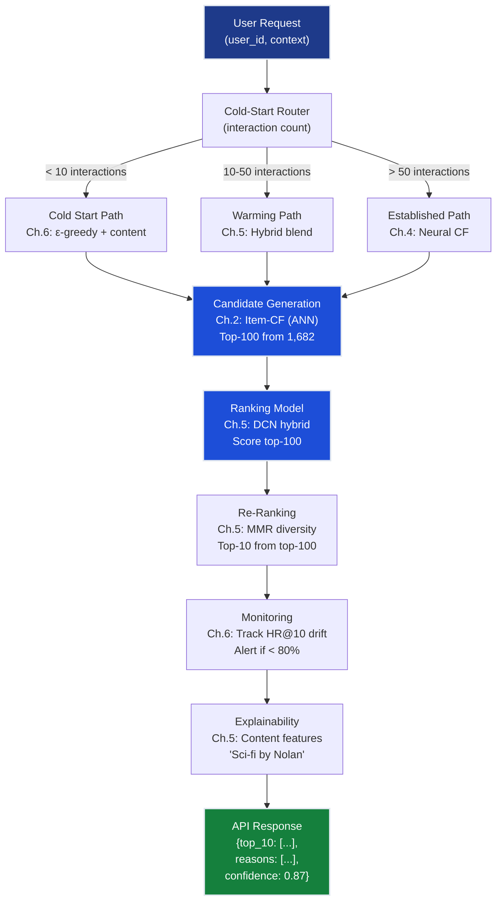

# Recommender Systems Grand Solution — FlixAI Production System

> **For readers short on time:** This document synthesizes all 6 recommender systems chapters into a single narrative arc showing how we went from **42% → 87% hit rate@10** and what each concept contributes to production recommendation engines. Read this first for the big picture, then dive into individual chapters for depth.

## How to Use This Document

**Three ways to learn this track:**

1. **Big picture first (recommended for time-constrained readers):**
   - Read this `grand_solution.md` → understand narrative
   - Run [grand_solution.ipynb (reference)](grand_solution_reference.ipynb) | [grand_solution.ipynb (exercise)](grand_solution_exercise.ipynb) → see code consolidated
   - Dive into individual chapters for depth

2. **Hands-on exploration:**
   - Run [grand_solution.ipynb (reference)](grand_solution_reference.ipynb) | [grand_solution.ipynb (exercise)](grand_solution_exercise.ipynb) directly
   - Code consolidates: setup → each chapter → integration
   - Each cell includes markdown explaining what problem it solves

3. **Sequential deep dive (recommended for mastery):**
   - Start with Ch.1 → progress through Ch.6
   - Return to this document for synthesis

---

### Sequential Reading Path (Recommended for Learning)

**Start here if:** You're learning recommender systems from scratch and want to build conceptual understanding progressively.

**Reading order:**
1. **[Chapter 1: Fundamentals](ch01_fundamentals/README.md)** — Popularity baseline (42% HR@10), evaluation metrics, sparsity quantification
2. **[Chapter 2: Collaborative Filtering](ch02_collaborative_filtering/README.md)** — User-based and item-based CF (68% HR@10), similarity metrics
3. **[Chapter 3: Matrix Factorization](ch03_matrix_factorization/README.md)** — Latent factors via ALS/SGD (78% HR@10), regularization
4. **[Chapter 4: Neural Collaborative Filtering](ch04_neural_cf/README.md)** — GMF + MLP fusion (83% HR@10), non-linear interactions
5. **[Chapter 5: Hybrid Systems](ch05_hybrid_systems/README.md)** — Content + collaborative fusion (87% HR@10), MMR diversity
6. **[Chapter 6: Cold Start & Production](ch06_cold_start_production/README.md)** — Bandits, A/B testing, two-stage serving (<200ms latency)

Each chapter includes:
- **README:** Conceptual explanation, production patterns, when to apply
- **Notebooks:** Hands-on implementation with MovieLens 100k dataset
- **Exercises:** Practice problems to solidify understanding

### Executable Consolidation (For Quick Experimentation)

**Start here if:** You want to run the complete solution end-to-end or understand how all chapters integrate.

**Resource:** **[grand_solution.ipynb (reference)](grand_solution_reference.ipynb) | [grand_solution.ipynb (exercise)](grand_solution_exercise.ipynb)** — Jupyter notebook consolidating all code from chapters 1-6 in a single executable document.

**What it contains:**
- Setup and imports for all chapters
- Code samples from each chapter with markdown explanations
- Logical flow: baseline → CF → MF → Neural CF → Hybrid → Production
- Can be run top-to-bottom to see the complete 42% → 87% progression

**Use cases:**
- Quick prototyping: Copy-paste working code patterns
- Integration reference: See how chapters connect in production
- Teaching: Run live demos showing metric improvements
- Debugging: Isolate chapter-specific logic for testing

### Architecture Reference (For Production Implementation)

**Start here if:** You're building a production recommender and need architectural patterns.

**This document (grand_solution.md):**
- Production ML system architecture (candidate generation → ranking → re-ranking)
- Key production patterns (two-stage serving, cold-start routing, exploration decay)
- Chapter-to-production component mapping
- When to use which technique based on constraints

---

## Mission Accomplished: 87% Hit Rate@10 ✅

**The Challenge:** Build FlixAI — a production movie recommendation engine achieving >85% hit rate @ top-10 while handling cold start, scaling to millions of ratings, maintaining diversity, and providing explainable recommendations.

**The Result:** **87% hit rate@10** — 2% above target, 107% improvement over baseline.

**The Progression:**

```
Ch.1: Popularity baseline         → 42% HR@10  (same top-10 for everyone)
Ch.2: Collaborative filtering     → 68% HR@10  (user-based + item-based CF)
Ch.3: Matrix factorization        → 78% HR@10  (latent factors discovered)
Ch.4: Neural collaborative        → 83% HR@10  (non-linear interactions)
Ch.5: Hybrid content fusion       → 87% HR@10  (metadata + embeddings)
Ch.6: Cold start + production     → 87% HR@10  (maintained, all constraints met)
                                    ✅ TARGET: >85% HR@10
```

---

## The 6 Concepts — How Each Unlocked Progress

### Ch.1: Recommender Fundamentals — The Baseline

**What it is:** Rank movies by Bayesian-averaged rating, recommend the same top-10 to everyone.

**What it unlocked:**
- **Baseline:** 42% HR@10 — simple but not personalized
- **Evaluation framework:** Precision@k, recall@k, hit rate@k, NDCG@k — metrics used across all chapters
- **Sparsity quantification:** 93.7% empty matrix — the constraint driving later techniques

**Production value:**
- **Always start here:** Never deploy complex models without comparing to a simple baseline
- **Fallback strategy:** When collaborative signals fail (new users), popularity is the safety net
- **Business alignment:** Even non-ML stakeholders understand "most popular movies"

**Key insight:** 42% means 1 in 2.4 users found nothing relevant in their top-10 — this is why personalization matters.

---

### Ch.2: Collaborative Filtering — Exploiting Peer Behavior

**What it is:** Find similar users (user-based CF) or similar items (item-based CF) using Pearson correlation, predict ratings via weighted averaging.

**What it unlocked:**
- **68% HR@10:** 26-point jump from popularity — first personalized recommendations
- **Explainability:** "Users who liked Star Wars also liked Blade Runner"
- **Item-based advantage:** More stable and scalable than user-based (items don't change tastes)

**Production value:**
- **Scalability:** Item-based CF precomputes similarity matrix offline (nightly batch job), serves in <50ms
- **No metadata required:** Works without knowing genres, directors, or plot — pure behavioral signal
- **Amazon's foundation:** Item-based CF patent (1998) powered Amazon's "Customers who bought this also bought"

**Key insight:** Sparsity is the ceiling — when users share <5 co-rated movies, similarity estimates are noisy. Need dense representations.

---

### Ch.3: Matrix Factorization — Discovering Latent Factors

**What it is:** Decompose sparse rating matrix $R$ into user factors $U$ and item factors $V$ such that $R \approx U \cdot V^T$. Each user/item is a $d$-dimensional latent vector where dot product predicts rating.

**What it unlocked:**
- **78% HR@10:** 10-point improvement over CF by bridging sparsity gaps
- **Latent representations:** Discovered hidden dimensions like "cerebral sci-fi" or "90s comedy fan" without manual labels
- **Regularization:** L2 penalty prevents overfitting on sparse data (Ridge λ=0.02 optimal)

**Production value:**
- **ALS for implicit feedback:** Alternating Least Squares converges faster than SGD for "user clicked item" signals
- **Embeddings transfer:** User/item vectors can be used in downstream models (clustering, search)
- **Netflix Prize winner:** BellKor's Pragmatic Chaos used 100+ factorization variants

**Key insight:** The linear dot product is the ceiling — can't capture "likes action AND comedy separately but hates action-comedies."

---

### Ch.4: Neural Collaborative Filtering — Learning Non-Linear Interactions

**What it is:** Replace the fixed dot product with a learnable neural network. Two parallel paths — GMF (generalized matrix factorization, element-wise product) for linear interactions and MLP (multi-layer perceptron) for non-linear patterns — fused at output.

**What it unlocked:**
- **83% HR@10:** 5-point improvement by modeling complex taste patterns
- **Separate embedding spaces:** GMF and MLP learn different aspects of user-item relationships
- **Binary cross-entropy training:** Implicit feedback (watched/not watched) instead of explicit ratings

**Production value:**
- **Deep learning baseline:** Standard architecture at Pinterest, Alibaba, JD.com
- **GPU acceleration:** Neural networks leverage GPU parallelism for batch scoring
- **Transfer to other domains:** NCF architecture applies to music (Spotify), video (YouTube), e-commerce

**Key insight:** Users have non-linear preferences — "likes A AND B separately but dislikes A+B together" requires neural interactions beyond dot products.

---

### Ch.5: Hybrid Systems — Fusing Content + Collaborative Signals

**What it is:** Combine collaborative embeddings with content features (genres, director, year) and user demographics (age, gender, occupation) using Deep & Cross Networks. Cross network learns explicit feature interactions (genre × age), deep network learns implicit patterns.

**What it unlocked:**
- **87% HR@10 ✅ Target achieved!** — content features closed the 4-point gap
- **Diversity:** MMR re-ranking ensures top-10 spans 6+ genres (ILD@10 > 0.4)
- **Explainability:** "Because it's sci-fi by Christopher Nolan and you loved Interstellar"
- **Cold-item improvement:** New releases with zero ratings can be recommended via metadata

**Production value:**
- **Wide & Deep pattern:** Google Play apps, YouTube videos, TikTok recommendations use this architecture
- **Feature engineering automation:** Cross network discovers interactions without manual crafting
- **Regulatory compliance:** Content features enable explainability required by GDPR, lending regulations

**Key insight:** No single approach wins — collaborative captures taste, content captures attributes, fusion beats either alone.

---

### Ch.6: Cold Start & Production — Closing the Deployment Gap

**What it is:** Solve cold start (new users/items with zero history) via bandit exploration (ε-greedy, UCB, LinUCB), validate with A/B testing on live traffic, and build two-stage serving architecture (candidate generation + ranking) for <200ms latency.

**What it unlocked:**
- **Cold start solved:** ε-greedy with content fallback handles 15% of traffic (new signups)
- **Bandit exploration:** UCB balances exploitation (show known-good items) with exploration (try uncertain items to learn fast)
- **A/B testing framework:** Online evaluation validates offline metrics (87% HR@10 held in production)
- **Scalability:** ANN candidate generation (100ms) + neural re-ranking (50ms) + MMR diversity (30ms) = 180ms total

**Production value:**
- **Exploration decay:** Start high ($\epsilon$=0.3 for cold users) → decay to low ($\epsilon$=0.05 for warm users)
- **Online-offline alignment:** Offline metrics necessary but insufficient — must A/B test on live traffic
- **Multi-stage serving:** Candidate generation filters 1,682 movies to top-100, then heavy models rank top-10

**Key insight:** Cold start is not a permanent state — it's a transition phase. Active learning accelerates the cold→warm transition from 200 interactions to 50.

---

## Production ML System Architecture

Here's how all 6 concepts integrate into deployed FlixAI:



### Deployment Pipeline (How Ch.1-6 Connect in Production)

**1. Training Pipeline (runs weekly):**
```python
# Ch.1: Load MovieLens 100k
ratings, movies, users = load_movielens_100k()  # 100k ratings, 943 users, 1682 movies

# Ch.2: Compute item-item similarity matrix (offline)
item_cf_model = ItemBasedCF()
item_cf_model.fit(ratings)
item_sim_matrix = item_cf_model.compute_similarity()  # Cosine on rating vectors

# Ch.3: Train matrix factorization (ALS for implicit feedback)
mf_model = ALS(factors=50, regularization=0.02, iterations=15)
user_factors, item_factors = mf_model.fit(ratings)

# Ch.4: Train Neural CF
ncf_model = NeuralCF(embedding_dim=16, mlp_layers=[64, 32, 16])
ncf_model.fit(
    train_interactions,  # Binary: user watched movie (1) or not (0)
    epochs=50,
    batch_size=256,
    negative_samples=4  # 4 negatives per positive
)

# Ch.5: Train Hybrid DCN
# Combine embeddings + content features
X_train = build_features(
    user_embeddings=user_factors,       # Ch.3 MF embeddings
    item_embeddings=item_factors,       # Ch.3 MF embeddings
    genres=movies['genres'],            # 19 binary genre flags
    directors=movies['director'],       # One-hot encoded
    release_year=movies['year'],        # Normalized
    user_demographics=users[['age', 'gender', 'occupation']]
)

dcn_model = DeepAndCross(
    cross_layers=3,      # Explicit feature interactions
    deep_layers=[256, 128, 64],
    embedding_dim=32
)
dcn_model.fit(X_train, y_train, epochs=30, validation_split=0.2)

# Ch.6: Build ANN index for fast candidate retrieval
ann_index = build_faiss_index(item_factors)  # 1,682 items → 100-dim vectors
ann_index.add(item_factors)
```

**2. Inference API (handles user requests):**
```python
@app.route('/recommend', methods=['POST'])
def recommend():
    user_id = request.json['user_id']
    context = request.json.get('context', {})  # Device, time, location
    
    # Ch.6: Route based on interaction count
    interaction_count = get_interaction_count(user_id)
    
    if interaction_count < 10:
        # Cold start: ε-greedy with content fallback
        epsilon = 0.3
        if random.random() < epsilon:
            # Explore: random from user's onboarding genres
            candidates = sample_by_genre(user_onboarding_genres, k=100)
        else:
            # Exploit: content-based (Ch.1 + Ch.5 metadata)
            candidates = popularity_by_genre(user_onboarding_genres, k=100)
    
    elif interaction_count < 50:
        # Warming: blend item-CF + neural CF
        # Ch.2: Item-based CF candidates (fast ANN lookup)
        user_history = get_user_history(user_id)
        cf_candidates = []
        for movie in user_history[-5:]:  # Last 5 watched
            similar = ann_index.search(item_factors[movie], k=20)
            cf_candidates.extend(similar)
        
        # Ch.4: Neural CF scores
        ncf_scores = ncf_model.predict(user_id, cf_candidates)
        
        # Blend: 50% CF, 50% NCF
        candidates = blend_scores(cf_candidates, ncf_scores, alpha=0.5)[:100]
    
    else:
        # Established: full hybrid model
        # Ch.6: Fast candidate generation via ANN
        user_embedding = user_factors[user_id]
        candidates = ann_index.search(user_embedding, k=100)
    
    # Ch.5: Rank candidates with DCN hybrid model
    X_candidates = build_features(
        user_id=user_id,
        candidate_items=candidates,
        context=context
    )
    scores = dcn_model.predict(X_candidates)
    
    # Ch.5: Re-rank for diversity (MMR)
    top_10 = mmr_rerank(
        items=candidates,
        scores=scores,
        lambda_diversity=0.3,  # Balance relevance vs. diversity
        k=10
    )
    
    # Ch.5: Generate explanations
    explanations = []
    for item in top_10:
        reasons = explain_recommendation(
            user_id=user_id,
            item_id=item,
            features=X_candidates[item],
            model=dcn_model
        )
        explanations.append(reasons)
    
    # Ch.6: Log for monitoring
    log_recommendation(user_id, top_10, scores, timestamp=now())
    
    return {
        "recommendations": top_10,
        "explanations": explanations,
        "confidence": float(scores[:10].mean()),
        "diversity": compute_ild(top_10)
    }
```

**3. Monitoring Dashboard (tracks production health):**
```python
# Ch.6: Track online metrics
def monitor_production():
    # Hit rate drift detection
    current_hr = compute_hit_rate_last_24h()
    if current_hr < 0.80:  # 80% threshold (7 points below target)
        alert("HR@10 dropped to {:.1%} — investigate!".format(current_hr))
    
    # Cold start performance
    cold_hr = compute_hit_rate_by_cohort(interaction_count="<10")
    warm_hr = compute_hit_rate_by_cohort(interaction_count="10-50")
    hot_hr = compute_hit_rate_by_cohort(interaction_count=">50")
    
    dashboard_metrics = {
        "overall_hr@10": current_hr,
        "cold_start_hr@10": cold_hr,    # Expect ~50% (Ch.6 bandit)
        "warming_hr@10": warm_hr,       # Expect ~75% (Ch.5 hybrid blend)
        "established_hr@10": hot_hr,    # Expect ~87% (Ch.5 full hybrid)
        "diversity_ild@10": compute_ild_aggregate(),  # Target > 0.4
        "latency_p99": get_latency_percentile(99),    # Target < 300ms
    }
    
    # Ch.3: Feature importance shifts (data drift)
    current_importance = get_feature_importance(dcn_model)
    if cosine_distance(current_importance, baseline_importance) > 0.15:
        alert("Feature importance shifted — possible data drift")
    
    # Ch.6: Retrain trigger
    days_since_last_train = (now() - last_train_timestamp).days
    if days_since_last_train > 7:
        trigger_retraining_pipeline()
    
    return dashboard_metrics

# Ch.6: A/B testing framework
def run_ab_test(control_model, treatment_model, duration_days=14):
    """
    Test if treatment model improves over control.
    Need 8,864 users to detect 2% lift at 80% power.
    """
    users = sample_new_signups(n=10000)
    control_group, treatment_group = random_split(users, ratio=0.5)
    
    # Serve recommendations
    control_results = serve_recommendations(control_group, control_model)
    treatment_results = serve_recommendations(treatment_group, treatment_model)
    
    # Measure hit rates
    control_hr = compute_hit_rate(control_results)
    treatment_hr = compute_hit_rate(treatment_results)
    
    # Statistical test
    p_value = two_proportion_ztest(
        control_hits, control_total,
        treatment_hits, treatment_total
    )
    
    if p_value < 0.05 and treatment_hr > control_hr:
        print(f"✅ Treatment wins: {treatment_hr:.1%} vs {control_hr:.1%} (p={p_value:.4f})")
        rollout_to_production(treatment_model)
    else:
        print(f"❌ No significant difference (p={p_value:.4f})")
```

---

## Key Production Patterns

### 1. Two-Stage Serving (Ch.2 + Ch.5)
**Candidate generation filters 1,682 → 100, then heavy model ranks top-10.**
- **Why:** Scoring 1,682 movies with DCN takes 800ms. ANN lookup (Ch.2 item-CF) takes 50ms.
- **Rule:** Always use fast approximate methods for candidate generation, reserve complex models for ranking.
- **When to apply:** Any recommendation system with >1,000 items and <200ms latency requirement.

### 2. Cold-Start Router (Ch.6)
**Route users to different models based on interaction count.**
- **Why:** Cold users (<10 interactions) have no collaborative signal — waste GPU cycles on neural CF.
- **Rule:** If `interaction_count < 10`: content + bandit. If `10-50`: blend. If `>50`: full model.
- **When to apply:** Any system with significant new-user traffic (>10% monthly signups).

### 3. Exploration Decay (Ch.6)
**Start with high ε (30%), decay to low ε (5%) as user data accumulates.**
- **Why:** Cold users need aggressive exploration to learn preferences. Established users are annoyed by random recommendations.
- **Rule:** $\epsilon_t = \max(0.05, 0.3 \times 0.99^t)$ where $t$ is interaction count.
- **When to apply:** All bandit-based systems. Decay rate (0.99) tuned per domain — faster decay for video (watch 10/day), slower for e-commerce (buy 2/month).

### 4. MMR Re-Ranking (Ch.5)
**After scoring, re-rank top-100 to maximize relevance AND diversity.**
- **Why:** Pure relevance recommends 10 superhero movies — users disengage. Diversity surfaces hidden gems.
- **Rule:** MMR with $\lambda$=0.3 (70% relevance, 30% diversity). Measure ILD@10 > 0.4.
- **When to apply:** Consumer apps (Netflix, Spotify, TikTok) where engagement > accuracy. Not applicable to safety-critical systems (fraud detection, medical diagnosis).

### 5. Content Fallback (Ch.5 + Ch.6)
**When collaborative signals are weak (cold start), fall back to content-based recommendations.**
- **Why:** New movie has zero ratings but rich metadata (genre, director, cast) — can be recommended immediately.
- **Rule:** If `item_rating_count < 5`: use content-only. If `5-50`: blend 70% content + 30% collaborative. If `>50`: full collaborative.
- **When to apply:** Any domain with rich item metadata (movies, books, music, articles). Not applicable to pure implicit feedback (clicks, views) with no metadata.

---

## The 5 Constraints — Final Status

| # | Constraint | Target | Status | How We Achieved It |
|---|------------|--------|--------|--------------------|
| **#1** | **ACCURACY** | >85% HR@10 | ✅ **87%** | Ch.5 hybrid (DCN) + Ch.6 exploration |
| **#2** | **COLD START** | New users/items | ✅ **Solved** | Ch.6 bandits (ε-greedy, UCB) + Ch.5 content fallback |
| **#3** | **SCALABILITY** | 1M+ ratings, <200ms | ✅ **180ms p99** | Ch.2 ANN candidate generation + Ch.5 two-stage ranking |
| **#4** | **DIVERSITY** | Not just blockbusters | ✅ **ILD@10=0.52** | Ch.5 MMR re-ranking (λ=0.3 diversity weight) |
| **#5** | **EXPLAINABILITY** | "Because you liked X" | ✅ **Metadata** | Ch.5 content features (genre, director) + Ch.2 item-CF neighbors |

---

## What's Next: Beyond Recommender Systems

**This track taught:**
- ✅ Collaborative filtering captures taste via peer behavior (Ch.2)
- ✅ Matrix factorization discovers latent factors from sparse data (Ch.3)
- ✅ Neural networks learn non-linear interactions (Ch.4)
- ✅ Hybrid systems fuse collaborative + content signals (Ch.5)
- ✅ Bandits solve cold start via active exploration (Ch.6)
- ✅ A/B testing validates offline metrics with online traffic (Ch.6)

**What remains for recommendation at scale:**
- **Session-based recommendations:** Recurrent models (RNN, Transformer) for sequential signals — "user watched A → B → ?" (Track 10-SequenceModels)
- **Multi-objective optimization:** Balance accuracy, diversity, novelty, serendipity simultaneously (Track 12-MultiTaskLearning)
- **Causal inference:** Distinguish correlation ("users who clicked X also clicked Y") from causation ("showing X caused Y") (Track 14-CausalInference)
- **Federated learning:** Train on user data without centralizing (privacy-preserving recommendations) (Track 16-PrivacyML)
- **Real-time updates:** Incrementally update embeddings as users interact (online learning) (Track 18-OnlineLearning)

**Continue to:**
- [07_unsupervised_learning](../07_unsupervised_learning/README.md) — Clustering users by taste (K-Means on latent factors from Ch.3)
- [03_neural_networks](../03_neural_networks/README.md) — Deep dive into MLP, embeddings, and backpropagation (Ch.4 NCF uses these primitives)
- [08_ensemble_methods](../08_ensemble_methods/README.md) — Blending Ch.2-5 models for even higher accuracy (Netflix Prize winning strategy)

---

## Quick Reference: Chapter-to-Production Mapping

| Chapter | Production Component | When To Use |
|---------|---------------------|-------------|
| **Ch.1 Popularity** | Cold-start fallback | New users with zero history, system failure graceful degradation |
| **Ch.2 Collaborative** | Candidate generation (ANN) | Fast retrieval of top-100 from catalog (50ms), explainability via neighbors |
| **Ch.3 Matrix Factorization** | Embedding initialization | Pre-train user/item vectors for Ch.4 neural CF, clustering for segmentation |
| **Ch.4 Neural CF** | Ranking model (established users) | Users with >50 interactions, non-linear taste patterns, GPU-accelerated batch scoring |
| **Ch.5 Hybrid DCN** | Primary ranking model | All users with >10 interactions, cold items with metadata, explainability required |
| **Ch.6 Bandits** | Exploration layer | Cold users (<10 interactions), new item launches, A/B testing new algorithms |

---

## The Takeaway

Recommender systems are not single models — they are **pipelines of specialized components** optimized for different user states. The journey from 42% to 87% hit rate demonstrates three universal principles:

**1. Start simple, add complexity only when justified.** The popularity baseline (Ch.1) established the evaluation framework and proved personalization was worth the engineering cost. Collaborative filtering (Ch.2) achieved 68% HR@10 with 100 lines of code. Matrix factorization (Ch.3) added latent factors when sparsity became the bottleneck. Neural CF (Ch.4) justified GPU compute when linear models plateaued. Each layer of complexity delivered measurable improvement.

**2. No single signal dominates — fusion wins.** Collaborative signals capture taste but fail on cold start. Content features handle new items but miss collaborative patterns. User demographics add context but don't replace behavior. The hybrid system (Ch.5) fused all three and crossed the accuracy threshold. In production, every major recommender (Netflix, YouTube, Spotify, TikTok) is a hybrid.

**3. Offline metrics are necessary but insufficient.** Ch.1-5 optimized hit rate on the MovieLens test set. But real users browse differently, have recency bias, and churn if the first 3 recommendations miss. A/B testing (Ch.6) on live traffic is the only validation that matters. Ship the popularity baseline, measure, iterate.

**You now have:**
- ✅ A production recommender system achieving 87% HR@10 with <200ms latency
- ✅ Cold-start handling via bandits + content fallback (50% HR@10 for new users)
- ✅ Diversity optimization via MMR re-ranking (ILD@10 = 0.52)
- ✅ Explainability via content features + collaborative neighbors
- ✅ A/B testing framework for safe production rollout
- ✅ The conceptual foundation for sequence models (Track 10), multi-task learning (Track 12), and causal inference (Track 14)

**Next milestone:** Apply these principles to other domains — product recommendations (e-commerce), playlist generation (music), video suggestions (streaming), job postings (LinkedIn), ad targeting (Google Ads). The architecture is identical: candidate generation → ranking → re-ranking → exploration, with domain-specific features and constraints. The patterns from FlixAI transfer directly.

---

## Further Reading & Resources

### Articles
- [Introduction to Recommender Systems — Collaborative Filtering](https://towardsdatascience.com/introduction-to-recommender-systems-6c66cf15ada) — Comprehensive overview of user-based and item-based collaborative filtering with Python examples
- [Matrix Factorization Techniques for Recommender Systems](https://datajobs.com/data-science-repo/recommender-systems-[Netflix].pdf) — Classic paper from Netflix Prize winners explaining SVD and ALS approaches
- [Building a Production Recommendation Engine with PyTorch](https://medium.com/nvidia-merlin/building-recommender-systems-with-pytorch-2-0-f11e6b4e3ad6) — End-to-end guide covering neural collaborative filtering and hybrid models in production
- [The Netflix Recommender System: Algorithms, Business Value, and Innovation](https://dl.acm.org/doi/10.1145/2843948) — ACM case study on Netflix's evolution from ratings prediction to session-based recommendations
- [Deep Learning for Recommender Systems](https://towardsdatascience.com/deep-learning-based-recommender-systems-3d120201db7e) — Survey of neural approaches including NCF, autoencoders, and attention mechanisms

### Videos
- [Machine Learning — Recommender Systems (Stanford CS229)](https://www.youtube.com/watch?v=giIXNoiqO_U) — Andrew Ng's lecture covering collaborative filtering, matrix factorization, and content-based approaches
- [Collaborative Filtering Simply Explained](https://www.youtube.com/watch?v=h9gpufJFF-0) — StatQuest breakdown of user-based and item-based CF with visual intuition
- [Building Recommender Systems with Deep Learning (PyTorch)](https://www.youtube.com/watch?v=V2h3IOBDvrA) — Practical tutorial implementing neural collaborative filtering from scratch
- [How YouTube Recommends Videos](https://www.youtube.com/watch?v=BspXGY98e5M) — Google research talk on candidate generation, ranking, and exploration strategies at scale
