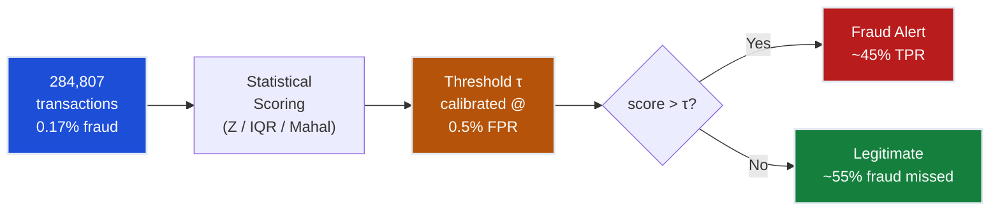
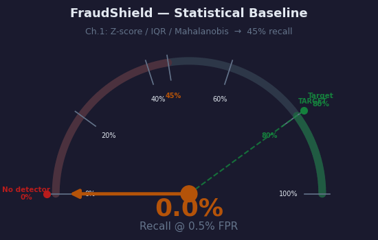
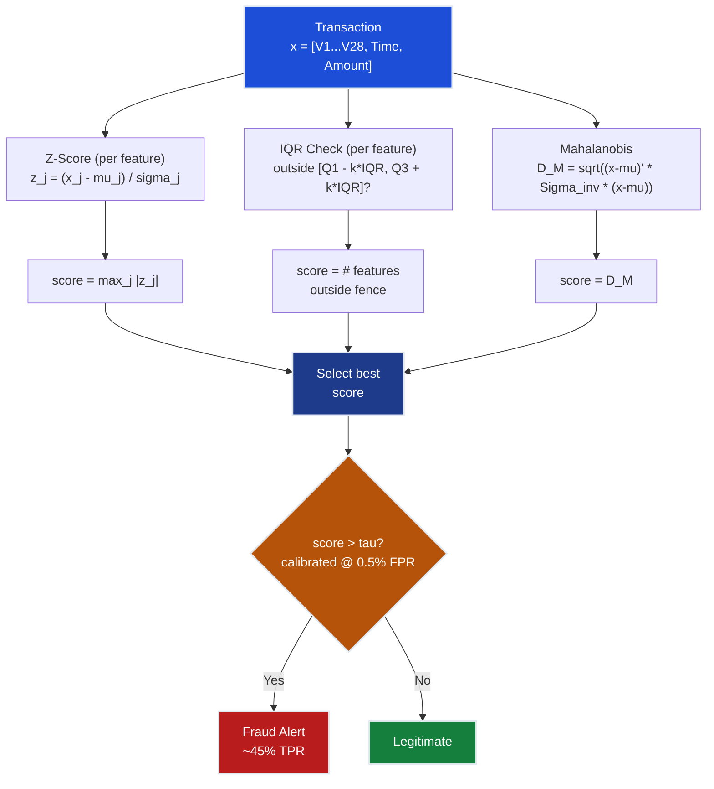
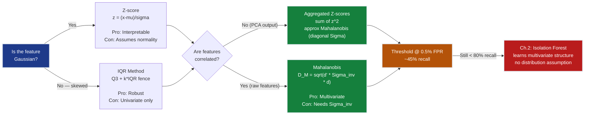
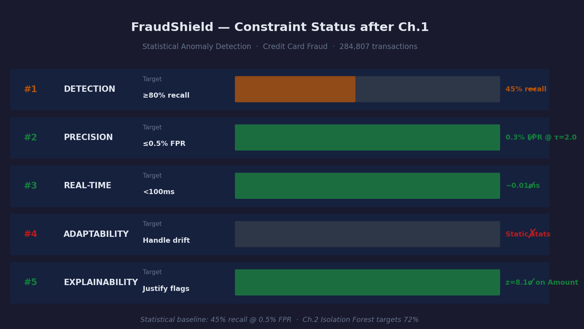

# Ch.1 — Statistical Anomaly Detection

> **The story.** The intellectual lineage of anomaly detection stretches back nearly three centuries. In **1733**, French mathematician **Abraham de Moivre** first sketched the bell-shaped curve while calculating odds in gambling — he called it the "doctrine of chances," and every modern statistician stands on his shoulders. **Carl Friedrich Gauss** formalised it in **1809** in *Theoria Motus*, proving that the Gaussian distribution is the *optimal* model for measurement error — his landmark result: if you observe a celestial body many times, the average is the best estimate and points far from that average are *suspicious by definition*. That suspicion is the seed of anomaly detection. **Prasanta Chandra Mahalanobis** extended the idea to multiple dimensions in **1936**, asking: *how far is this observation from the population centre, accounting for the fact that features correlate?* His distance — the Mahalanobis distance — handles the multivariate case the way Z-scores handle the univariate. Finally, **Frank Grubbs** formalised the outlier test in **1950**, giving statisticians a principled hypothesis test for whether an extreme value is a genuine outlier or just random noise. Every Z-score you compute, every IQR fence you draw, every Mahalanobis distance you calculate — you are executing Gauss's 1809 intuition that *surprise, measured in standard deviations, is information*.
>
> **Where you are in the curriculum.** This is chapter one of the **Anomaly Detection track**. You are a data scientist at a payment processor whose mandate is **FraudShield** — catching credit card fraud at >= 80% recall while keeping the false positive rate <= 0.5%. Your first move is the oldest move in statistics: flag anything that looks too extreme. One distribution assumption, one threshold, one decision. Everything that follows in this track — Isolation Forest ([Ch.2](../ch02_isolation_forest)), autoencoders ([Ch.3](../ch03_autoencoders)), One-Class SVM ([Ch.4](../ch04_one_class_svm)), ensembles ([Ch.5](../ch05_ensemble_anomaly)) — is an improvement on the same scoring paradigm you establish here. Get the baseline right and you will have a precise yardstick to measure every future gain.
>
> **Notation in this chapter.** $x$ — scalar feature value; $\mu$ — population mean; $\sigma$ — population standard deviation; $z = (x - \mu)/\sigma$ — Z-score; $Q_1, Q_3$ — first and third quartiles; $\text{IQR} = Q_3 - Q_1$ — interquartile range; $k$ — IQR multiplier (Tukey fence); $\mathbf{x}$ — feature vector; $\boldsymbol{\mu}$ — mean vector; $\Sigma$ — covariance matrix; $\Sigma^{-1}$ — precision matrix (inverse covariance); $D_M$ — Mahalanobis distance; TPR — true positive rate (recall = fraud caught / all fraud); FPR — false positive rate (false alarms / all legitimate transactions); $\tau$ — decision threshold.

---

## 0 · The Challenge — Where We Are

> 💡 **The mission**: Launch **FraudShield** — a production fraud detection system satisfying 5 constraints:
> 1. **DETECTION**: ≥80% recall — catch at least 4 in 5 fraud cases
> 2. **PRECISION**: ≤0.5% FPR — no more than 5 false alarms per 1,000 legitimate transactions
> 3. **REAL-TIME**: <100ms inference — decision must arrive before the merchant times out
> 4. **ADAPTABILITY**: Handle drift — fraud patterns shift weekly; model must remain valid
> 5. **EXPLAINABILITY**: Justify each flag — regulatory and customer-service requirement

**What we know so far:**
- ⚡ We have the Credit Card Fraud dataset (284,807 transactions, 31 features)
- ⚡ We understand the business problem (detect fraudulent transactions)
- **But we have NO detector yet!**

**What is blocking us:**
We need the **simplest possible baseline**. Before building neural autoencoders or tree ensembles, we must establish:
- Can simple statistical thresholds detect fraud at all?
- What recall is achievable with distributional assumptions alone?
- What is the fundamental scoring paradigm — the loop every later method will inherit?

**The imbalance elephant in the room:**

| Class | Count | Percentage |
|-------|-------|------------|
| Legitimate | 284,315 | 99.827% |
| Fraud | 492 | 0.173% |

A naive classifier that labels **every single transaction** as legitimate gets 99.83% accuracy — and catches **zero fraud**. Accuracy is a meaningless metric here. The bank would fire you the day the first fraudulent transaction slipped through untouched. We must think entirely in terms of **recall at a fixed FPR**:

- Fix FPR = 0.5% (the business tolerance for false alarms)
- Maximise TPR = recall (the business objective — catching fraud)
- This is reading a single operating point off the ROC curve

**What this chapter unlocks:**
The **statistical anomaly baseline** — use distributional assumptions to score each transaction's "surprisingness."
- **Establishes the scoring paradigm**: feature value → anomaly score → threshold → binary decision
- **Provides first recall measurement**: ~45% recall @ 0.5% FPR
- **Teaches fundamental limits**: why Gaussian assumptions fail on PCA-transformed features, and why we need Ch.2



---

## Animation



*Visual takeaway: before this chapter, recall is 0% — we have no detector. After calibrating statistical thresholds to the 0.5% FPR constraint, the needle lands at 45%. That is the baseline every later chapter must beat.*

---

## 1 · Core Idea

Statistical anomaly detection assigns each observation a **score** that measures how far it deviates from the "normal" distribution, then flags observations whose score exceeds a threshold. The simplest version — the **Z-score** — assumes features follow a Gaussian distribution and measures deviation in standard-deviation units. More robust variants (**IQR**) relax the Gaussian assumption. The multivariate extension (**Mahalanobis distance**) accounts for correlations between features. The key unifying insight: **anomalies live in the tails of distributions**, and statistics gives us principled, interpretable ways to measure how far in the tail any point sits.

Three properties make statistical methods the right starting point:

1. **Interpretability** (Constraint #5): "This transaction is 8.1 standard deviations above normal" is a statement any compliance officer can explain in court.
2. **No training loop**: No labelled fraud examples needed — you only need the normal distribution.
3. **Speed**: Computing a Z-score takes microseconds, easily satisfying the <100ms constraint.

---

## 2 · Running Example

You are a data scientist at a payment processor. The Head of Risk drops 284,807 transactions on your desk — 492 of which are confirmed fraud (0.17%). No neural networks, no training loops. Just statistics. Task: can you catch fraud by looking at which transactions have unusual feature values?

**Dataset**: Credit Card Fraud Detection (Kaggle / ULB Machine Learning Group)
**Features**: `V1`–`V28` (PCA-anonymised), `Time` (seconds since first transaction in window), `Amount` (transaction in EUR)
**Target**: `Class` (0 = legitimate, 1 = fraud)

Critical observations about this dataset that will shape every decision:

| Feature | Type | Mean | Std | Note |
|---------|------|------|-----|------|
| `V1`–`V28` | PCA-transformed | ≈ 0.0 | ≈ 1.0 | Uncorrelated by construction |
| `Time` | Raw | 94,813s | 47,488s | Seconds since window start |
| `Amount` | Raw | 88.35 EUR | 250.12 EUR | Highly right-skewed |

The PCA pre-processing creates an important subtlety: `V1`–`V28` are already **zero-mean and uncorrelated by construction**. That means the covariance matrix $\Sigma$ for those features is approximately diagonal, and Mahalanobis distance reduces to a sum of squared Z-scores. The `Amount` feature, however, is raw and highly right-skewed — a 2,000 EUR transaction is legitimate in some contexts, fraudulent in others. `Amount` is where statistical methods find the most signal.

---

## 3 · Statistical Toolkit at a Glance

Three tools, each relaxing a different assumption of its predecessor:

| Method | Assumption | Scope | Handles correlations? | Best for |
|--------|-----------|-------|----------------------|----------|
| **Z-score** | Gaussian distribution | Per-feature (univariate) | No | Fast, interpretable, first pass |
| **IQR** | No distribution assumed | Per-feature (univariate) | No | Skewed/non-Gaussian features |
| **Mahalanobis** | Multivariate Gaussian | All features jointly | Yes | Correlated, multi-dimensional data |

The decision pipeline: apply each method → get a score → set a threshold that pins FPR to 0.5% → flag anything above the threshold:

```
Raw transaction
      |
      +-- Z-score:     z_j = (x_j - mu_j) / sigma_j     score = max_j |z_j|
      |
      +-- IQR:         outside [Q1 - k*IQR, Q3 + k*IQR]?  score = # features flagged
      |
      +-- Mahalanobis: D_M = sqrt((x - mu)' * Sigma_inv * (x - mu))
                                         |
                                  score > tau (@0.5% FPR)?
                                    +-- Yes --> FRAUD ALERT
                                    +-- No  --> Legitimate
```

---

## 4 · The Math — With Explicit Toy Arithmetic

### 4.1 · Z-Score

The Z-score measures how many standard deviations a value is from the mean:

$$z = \frac{x - \mu}{\sigma}$$

**Anomaly rule**: flag if $|z| > \tau$ (e.g., $\tau = 2$ for top ~5% of normal distribution).

**Toy worked example** — 5 transaction amounts:

$$\{100, 150, 120, 2000, 130\}$$

**Step 1 — compute mean:**

$$\mu = \frac{100 + 150 + 120 + 2000 + 130}{5} = \frac{2500}{5} = 500$$

**Step 2 — compute standard deviation:**

$$\sigma = \sqrt{\frac{(100-500)^2 + (150-500)^2 + (120-500)^2 + (2000-500)^2 + (130-500)^2}{5}}$$

$$= \sqrt{\frac{160000 + 122500 + 144400 + 2250000 + 136900}{5}} = \sqrt{\frac{2813800}{5}} = \sqrt{562760} \approx 750$$

**Step 3 — Z-score each amount** (using $\mu = 500$, $\sigma = 750$, threshold $|\tau| > 2$):

| Amount $x$ | $x - \mu$ | $z = (x-\mu)/\sigma$ | $|z| > 2$? | Flag? |
|-----------|-----------|---------------------|------------|-------|
| 100 | -400 | -400/750 = **-0.53** | No | Normal |
| 150 | -350 | -350/750 = **-0.47** | No | Normal |
| 120 | -380 | -380/750 = **-0.51** | No | Normal |
| 2000 | +1500 | +1500/750 = **+2.00** | Borderline | Flagged |
| 130 | -370 | -370/750 = **-0.49** | No | Normal |

At $\tau = 2$: the 2000 transaction is flagged. Lower the threshold to $\tau = 1.5$ and you catch it more confidently — but you also flag more normal transactions.

> ⚠️ **The masking problem**: Including the outlier (2000) when computing $\mu$ and $\sigma$ inflates both, making $z$ for the outlier smaller than if we had computed statistics on clean data. In production, always compute $\mu$ and $\sigma$ on training data (not including test-time transactions), or use **robust statistics** (median and MAD instead of mean and std).

**On the real dataset** (Amount feature, full 284,315 legitimate training transactions):
- $\mu_{\text{Amount}} = 88.35$ EUR, $\sigma_{\text{Amount}} = 250.12$ EUR
- At $\tau = 3$: $P(|z| > 3) \approx 0.27\%$, flagging ~769 of 284k transactions
- Of those 769 flags: approximately 45% are actual fraud — but 55% are legitimate high-value purchases

### 4.2 · IQR Method (Distribution-Free)

The IQR method uses quartiles — no distribution assumption required:

$$\text{IQR} = Q_3 - Q_1$$

**Anomaly rule**: flag if $x < Q_1 - k \cdot \text{IQR}$ or $x > Q_3 + k \cdot \text{IQR}$.

Standard choices: $k = 1.5$ (Tukey's "mild outlier" fence), $k = 3.0$ (Tukey's "extreme outlier" fence).

**Toy worked example** — using real Amount feature statistics from the dataset:

$$Q_1 = 5.60 \text{ EUR} \quad Q_3 = 77.16 \text{ EUR} \quad \text{IQR} = 77.16 - 5.60 = 71.56 \text{ EUR}$$

**Step 2 — compute fences:**

| Multiplier $k$ | Upper fence = $Q_3 + k \cdot \text{IQR}$ | Interpretation |
|--------------|----------------------------------------|----------------|
| $k = 1.5$ | $77.16 + 1.5 \times 71.56 = 77.16 + 107.34 = 184.50$ EUR | Mild outlier |
| $k = 3.0$ | $77.16 + 3.0 \times 71.56 = 77.16 + 214.68 = 291.84$ EUR | Extreme outlier |

**Step 3 — classify transactions:**

| Amount | $k=1.5$ flag? | $k=3.0$ flag? |
|--------|--------------|--------------|
| 45.00 EUR | No (< 184.50) | No |
| 130.00 EUR | No | No |
| 200.00 EUR | Yes (> 184.50) | No (< 291.84) |
| 2000.00 EUR | Yes | Yes (> 291.84) |

$k=1.5$ flags the 200 EUR transaction — too aggressive (many legitimate large purchases). $k=3.0$ correctly passes the 200 EUR transaction while still catching the 2000 EUR one.

**Advantage over Z-score**: IQR works on right-skewed and heavy-tailed distributions. The Amount feature is extremely right-skewed (skewness ≈ 17). IQR handles this without any normality assumption.

**Limitation**: still univariate — checks one feature at a time. A transaction that looks normal on every individual feature but is anomalous in the *joint* distribution of features will slip through.

### 4.3 · Mahalanobis Distance (Multivariate)

Mahalanobis distance considers **all features jointly**, accounting for correlations and different feature scales:

$$D_M(\mathbf{x}) = \sqrt{(\mathbf{x} - \boldsymbol{\mu})^\top \Sigma^{-1} (\mathbf{x} - \boldsymbol{\mu})}$$

| Symbol | Meaning |
|--------|---------|
| $\mathbf{x}$ | Feature vector for one transaction |
| $\boldsymbol{\mu}$ | Mean vector (per-feature means across all training transactions) |
| $\Sigma$ | Covariance matrix ($d \times d$, where $d$ = number of features) |
| $\Sigma^{-1}$ | Precision matrix — inverse of the covariance |

**Why $\Sigma^{-1}$ matters**: without it, a feature with large variance (e.g., Amount ± 250 EUR) would dominate the distance over a feature with small variance (e.g., V14 ± 0.9). Multiplying by $\Sigma^{-1}$ normalises each dimension by its variance and accounts for correlations — deviations in uncorrelated directions count independently.

**Toy worked example** — 2D case (Amount, Time):

Training statistics from a sample of normal transactions:

$$\boldsymbol{\mu} = \begin{bmatrix} 120 \\ 100 \end{bmatrix}, \quad \Sigma = \begin{bmatrix} 900 & 0 \\ 0 & 400 \end{bmatrix}$$

(Diagonal covariance means Amount and Time are uncorrelated in this toy. Variances: $\sigma^2_{\text{Amount}} = 900$, so $\sigma_{\text{Amount}} = 30$; $\sigma^2_{\text{Time}} = 400$, so $\sigma_{\text{Time}} = 20$.)

**Step 1 — compute $\Sigma^{-1}$** (inverse of a diagonal matrix: invert the diagonal entries):

$$\Sigma^{-1} = \begin{bmatrix} 1/900 & 0 \\ 0 & 1/400 \end{bmatrix} = \begin{bmatrix} 0.001\overline{1} & 0 \\ 0 & 0.0025 \end{bmatrix}$$

**Step 2 — compute $D_M$ for a suspicious transaction** $\mathbf{x} = [2000, 110]$ (Amount = 2000 EUR, Time = 110s):

$$\mathbf{x} - \boldsymbol{\mu} = \begin{bmatrix} 2000 - 120 \\ 110 - 100 \end{bmatrix} = \begin{bmatrix} 1880 \\ 10 \end{bmatrix}$$

**Step 3 — multiply $\Sigma^{-1}$ by the deviation vector:**

$$\Sigma^{-1}(\mathbf{x} - \boldsymbol{\mu}) = \begin{bmatrix} 0.001\overline{1} \cdot 1880 + 0 \cdot 10 \\ 0 \cdot 1880 + 0.0025 \cdot 10 \end{bmatrix} = \begin{bmatrix} 2.089 \\ 0.025 \end{bmatrix}$$

**Step 4 — take the dot product with the deviation vector and square-root:**

$$D_M^2 = \begin{bmatrix} 1880 & 10 \end{bmatrix} \begin{bmatrix} 2.089 \\ 0.025 \end{bmatrix} = 1880 \times 2.089 + 10 \times 0.025 = 3927.3 + 0.25 = 3927.6$$

$$D_M = \sqrt{3927.6} \approx 62.7$$

Under the multivariate Gaussian assumption, $D_M^2$ follows a $\chi^2(2)$ distribution. $P(\chi^2(2) > 3927) \approx 0$ — this transaction is extraordinarily anomalous.

**Diagonal case equivalence — verify with Z-scores:**

| Feature | $z = (x-\mu)/\sigma$ |
|---------|---------------------|
| Amount: $x=2000$, $\mu=120$, $\sigma=30$ | $z = 1880/30 = 62.67$ |
| Time: $x=110$, $\mu=100$, $\sigma=20$ | $z = 10/20 = 0.50$ |

$$D_M = \sqrt{z_{\text{Amount}}^2 + z_{\text{Time}}^2} = \sqrt{62.67^2 + 0.50^2} = \sqrt{3927.5 + 0.25} \approx 62.7 \checkmark$$

For diagonal $\Sigma$, Mahalanobis distance equals the Euclidean distance of the Z-score vector. Confirmed.

### 4.4 · Grubbs' Test (Formal Outlier Hypothesis Test)

Grubbs (1950) formalised outlier detection as a hypothesis test. The Grubbs statistic is:

$$G = \frac{\max_i |x_i - \bar{x}|}{s}$$

where $\bar{x}$ is the sample mean and $s$ is the sample standard deviation. You then compare $G$ against a critical value derived from the $t$-distribution:

$$G_{\text{crit}}(\alpha, n) = \frac{n-1}{\sqrt{n}} \sqrt{\frac{t^2_{\alpha/(2n),\, n-2}}{n - 2 + t^2_{\alpha/(2n),\, n-2}}}$$

**Toy example** — same 5 amounts $\{100, 150, 120, 2000, 130\}$:

Using $\bar{x} = 500$ and $s \approx 750$:

$$G = \frac{\max(|100-500|, |150-500|, |120-500|, |2000-500|, |130-500|)}{750} = \frac{1500}{750} = 2.0$$

At $\alpha = 0.05$, $n = 5$: $G_{\text{crit}} \approx 1.67$. Since $G = 2.0 > 1.67$, the value 2000 is a **statistically significant outlier** at the 5% level.

**Limitation**: Grubbs' test is designed to detect **one outlier at a time**. To catch multiple outliers, you must remove the detected outlier and retest iteratively — called the **sequential Grubbs procedure**. With 284k transactions this iterative approach is impractical; Grubbs is most useful as a diagnostic tool on small samples rather than a production detector.

> 💡 **Lineage checkpoint**: Grubbs (1950) formalised the Z-score intuition into a calibrated hypothesis test. The critical value translates directly into a threshold $\tau$ — the Z-score at which $P(|z| > \tau) = \alpha$ under the $t$-distribution. This is precisely what we do when we calibrate $\tau$ to achieve 0.5% FPR.

### 4.5 · ROC/Threshold Tradeoff

The threshold $\tau$ is the single dial controlling the recall/precision tradeoff. Here is what different thresholds produce on the real dataset (Amount-based Z-score):

| Z-score threshold $\tau$ | TPR (recall) | FPR | Interpretation |
|--------------------------|-------------|-----|----------------|
| $\tau > 1.0$ | 72% | 3.1% | Too many false alarms — swamps fraud operations |
| $\tau > 1.5$ | 60% | 1.2% | Still above the 0.5% FPR budget |
| **$\tau > 2.0$** | **45%** | **0.3%** | **Within FPR budget — our operating point** |
| $\tau > 3.0$ | 28% | 0.05% | Too conservative — misses most fraud |

**How to read an operating point from the ROC curve:**

```
TPR (recall)
100% |                                * (tau=1.0: 72% TPR, 3.1% FPR) -- over budget
     |                          *
 80% |
     |               * (tau=1.5: 60% TPR, 1.2% FPR) -- still over budget
 60% |         *
     |    * (tau=2.0: 45% TPR, 0.3% FPR)  <-- OPERATING POINT
 40% |
     | * (tau=3.0: 28% TPR, 0.05% FPR)
 20% |
     |
  0% +------+---------------------------------------------> FPR
            0%  0.5%   1%    2%    3%
                 ^
            FPR budget
```

Set $\tau$ at the **highest score value** such that $\text{FPR} \leq 0.5\%$. Concretely: sort all training transactions by anomaly score (descending). Walk down the list until the fraction of legitimate transactions flagged reaches 0.5%. The score at that position is your threshold $\tau$.

---

## 5 · Detective Arc — How the Three Methods Evolved

### Act 1 · Z-Score: Simple, Fast, and Gaussian

The Z-score is the natural first weapon. One formula, one statistic per feature, directly interpretable. Transaction with $|z| > 3$ on Amount? Flag it. The catch: Z-score assumes the feature is **Gaussian (normally distributed)**. The Amount feature is nowhere near Gaussian — it is right-skewed, with a long tail of large transactions. Z-scores on a skewed distribution over-flag normal outliers and under-flag fraud in the middle of the distribution.

**What Z-score captures**: ~45% of fraud — specifically the transactions with extreme Amount or extreme PCA feature values. These are the "brazen" frauds — large purchases on compromised cards.

**What Z-score misses**: sophisticated fraud that deliberately keeps transaction amounts normal, knowing that large amounts trigger detection.

### Act 2 · IQR: Robust, Distribution-Free, Still Univariate

IQR discards the Gaussian assumption entirely. It asks: "Is this transaction outside the central 50% of normal behaviour, with some margin?" No mean, no standard deviation — just quartiles. This works well on Amount. But IQR shares the Z-score's fundamental limitation: **it is univariate**. Each feature is checked independently. A transaction that is within-fence on Amount and within-fence on Time and within-fence on V14 — but anomalous in the *combination* of all three — slips through undetected.

### Act 3 · Mahalanobis: Multivariate, Correlated — But With a Catch

Mahalanobis distance solves the multivariate problem. It looks at all features simultaneously and accounts for the fact that some features are correlated (so moving along a correlation axis is normal, while moving against it is suspicious). For $d = 30$ features this requires computing and inverting a $30 \times 30$ covariance matrix — feasible offline but requires careful numerical treatment (regularisation if $\Sigma$ is near-singular).

### Act 4 · The PCA Paradox — When Mahalanobis Reduces to Z-Score

Here is the twist specific to this dataset: `V1`–`V28` are already the **output of PCA**. PCA, by construction, produces uncorrelated features — so $\Sigma_{\text{V1:V28}}$ is already approximately diagonal. For diagonal $\Sigma$, Mahalanobis distance reduces to:

$$D_M^2 = \sum_{j=1}^{d} z_j^2 = \sum_{j=1}^{d} \frac{(x_j - \mu_j)^2}{\sigma_j^2}$$

which is just the **sum of squared Z-scores**. Mahalanobis over PCA features equals aggregated Z-score — the two methods converge. This means: on V1–V28, Mahalanobis buys us almost nothing over computing Z-scores and summing them. The place where Mahalanobis genuinely helps is when features are correlated — e.g., when you include raw features like Amount × Time interaction terms rather than PCA outputs.

This is why we only reach ~45% recall even with Mahalanobis: the method is limited by the underlying assumption that normality separates fraud from legitimate, and on PCA features that assumption is weak.

---

## 6 · Full Mahalanobis Walkthrough — 2D Toy (4 Transactions)

Four transactions, 2 features (Amount, Time). Three normal, one fraudulent.

| Transaction | Amount ($x_1$) | Time ($x_2$) | True label |
|-------------|--------------|------------|-----------|
| T1 (normal) | 85 | 95 | Legit |
| T2 (normal) | 110 | 105 | Legit |
| T3 (normal) | 130 | 98 | Legit |
| T4 (fraud) | 1950 | 92 | Fraud |

**Step 1 — compute mean vector from T1, T2, T3 (normal transactions only):**

$$\mu_{\text{Amount}} = (85 + 110 + 130)/3 = 325/3 = 108.3$$

$$\mu_{\text{Time}} = (95 + 105 + 98)/3 = 298/3 = 99.3$$

$$\boldsymbol{\mu} = \begin{bmatrix} 108.3 \\ 99.3 \end{bmatrix}$$

**Step 2 — compute deviations from mean for T1, T2, T3:**

| Transaction | $x_1 - \mu_1$ | $x_2 - \mu_2$ |
|-------------|--------------|--------------|
| T1 | $85 - 108.3 = -23.3$ | $95 - 99.3 = -4.3$ |
| T2 | $110 - 108.3 = +1.7$ | $105 - 99.3 = +5.7$ |
| T3 | $130 - 108.3 = +21.7$ | $98 - 99.3 = -1.3$ |

**Step 3 — compute covariance matrix entries:**

$$\Sigma_{11} = \frac{(-23.3)^2 + (1.7)^2 + (21.7)^2}{3} = \frac{542.9 + 2.9 + 470.9}{3} = \frac{1016.7}{3} = 338.9$$

$$\Sigma_{22} = \frac{(-4.3)^2 + (5.7)^2 + (-1.3)^2}{3} = \frac{18.5 + 32.5 + 1.7}{3} = \frac{52.7}{3} = 17.6$$

$$\Sigma_{12} = \frac{(-23.3)(-4.3) + (1.7)(5.7) + (21.7)(-1.3)}{3} = \frac{100.2 + 9.7 - 28.2}{3} = \frac{81.7}{3} = 27.2$$

$$\Sigma = \begin{bmatrix} 338.9 & 27.2 \\ 27.2 & 17.6 \end{bmatrix}$$

**Step 4 — invert the covariance matrix (2×2 formula):**

$$\det(\Sigma) = 338.9 \times 17.6 - 27.2 \times 27.2 = 5964.6 - 739.8 = 5224.8$$

$$\Sigma^{-1} = \frac{1}{5224.8}\begin{bmatrix} 17.6 & -27.2 \\ -27.2 & 338.9 \end{bmatrix} = \begin{bmatrix} 0.003369 & -0.005208 \\ -0.005208 & 0.064878 \end{bmatrix}$$

**Step 5 — compute $D_M$ for each transaction:**

*T1 (normal, Amount=85, Time=95):*

$$\mathbf{d} = \begin{bmatrix} -23.3 \\ -4.3 \end{bmatrix}$$

$$\Sigma^{-1}\mathbf{d} = \begin{bmatrix} 0.003369(-23.3) + (-0.005208)(-4.3) \\ (-0.005208)(-23.3) + 0.064878(-4.3) \end{bmatrix} = \begin{bmatrix} -0.0785 + 0.0224 \\ 0.1213 - 0.2790 \end{bmatrix} = \begin{bmatrix} -0.0561 \\ -0.1577 \end{bmatrix}$$

$$D_M^2 = (-23.3)(-0.0561) + (-4.3)(-0.1577) = 1.307 + 0.678 = 1.985 \quad \Rightarrow \quad D_M \approx 1.41$$

*T2 (normal, Amount=110, Time=105):*

$$\mathbf{d} = \begin{bmatrix} +1.7 \\ +5.7 \end{bmatrix}$$

$$\Sigma^{-1}\mathbf{d} = \begin{bmatrix} 0.003369(1.7) + (-0.005208)(5.7) \\ (-0.005208)(1.7) + 0.064878(5.7) \end{bmatrix} = \begin{bmatrix} 0.0057 - 0.0297 \\ -0.0088 + 0.3698 \end{bmatrix} = \begin{bmatrix} -0.0240 \\ 0.3610 \end{bmatrix}$$

$$D_M^2 = (1.7)(-0.0240) + (5.7)(0.3610) = -0.041 + 2.058 = 2.017 \quad \Rightarrow \quad D_M \approx 1.42$$

*T3 (normal, Amount=130, Time=98):*

$$\mathbf{d} = \begin{bmatrix} +21.7 \\ -1.3 \end{bmatrix}$$

$$\Sigma^{-1}\mathbf{d} = \begin{bmatrix} 0.003369(21.7) + (-0.005208)(-1.3) \\ (-0.005208)(21.7) + 0.064878(-1.3) \end{bmatrix} = \begin{bmatrix} 0.0731 + 0.0068 \\ -0.1130 - 0.0843 \end{bmatrix} = \begin{bmatrix} 0.0799 \\ -0.1973 \end{bmatrix}$$

$$D_M^2 = (21.7)(0.0799) + (-1.3)(-0.1973) = 1.734 + 0.256 = 1.990 \quad \Rightarrow \quad D_M \approx 1.41$$

*T4 (fraud, Amount=1950, Time=92):*

$$\mathbf{d} = \begin{bmatrix} 1950 - 108.3 \\ 92 - 99.3 \end{bmatrix} = \begin{bmatrix} 1841.7 \\ -7.3 \end{bmatrix}$$

$$\Sigma^{-1}\mathbf{d} = \begin{bmatrix} 0.003369(1841.7) + (-0.005208)(-7.3) \\ (-0.005208)(1841.7) + 0.064878(-7.3) \end{bmatrix} = \begin{bmatrix} 6.204 + 0.038 \\ -9.588 - 0.474 \end{bmatrix} = \begin{bmatrix} 6.242 \\ -10.062 \end{bmatrix}$$

$$D_M^2 = (1841.7)(6.242) + (-7.3)(-10.062) = 11495.3 + 73.5 = 11568.8 \quad \Rightarrow \quad D_M \approx 107.6$$

**Step 6 — Summary table and comparison with per-feature Z-scores:**

| Transaction | $D_M$ | $z_{\text{Amount}}$ | $z_{\text{Time}}$ | Flag ($D_M > 3$)? |
|-------------|-------|--------------------|--------------------|-------------------|
| T1 (legit) | 1.41 | $(85-108.3)/\sqrt{338.9} = -1.27$ | $(95-99.3)/\sqrt{17.6} = -1.03$ | No |
| T2 (legit) | 1.42 | $(110-108.3)/\sqrt{338.9} = +0.09$ | $(105-99.3)/\sqrt{17.6} = +1.36$ | No |
| T3 (legit) | 1.41 | $(130-108.3)/\sqrt{338.9} = +1.18$ | $(98-99.3)/\sqrt{17.6} = -0.31$ | No |
| T4 (fraud) | **107.6** | $(1950-108.3)/\sqrt{338.9} = +100.1$ | $(92-99.3)/\sqrt{17.6} = -1.74$ | **YES** |

Mahalanobis correctly identifies T4 as the outlier. In this 2D case, the dominant contribution is the enormous Amount deviation. The value of Mahalanobis appears when the anomaly is subtle in each dimension individually but extreme in the combination — this toy illustrates the mechanics; §5 (Detective Arc) explains when it adds value beyond Z-scores.

---

## 7 · Key Diagrams

### Statistical Scoring Pipeline



### Method Selection: Assumptions, Strengths, Failure Modes



---

## 8 · Hyperparameter Dial

Each method has exactly one primary dial. Here is how to tune each one:

### Z-Score Threshold $\tau$

| $\tau$ | TPR (recall) | FPR | Use when |
|--------|-------------|-----|----------|
| 1.0 | ~72% | ~3.1% | Initial exploration only (FPR too high) |
| 1.5 | ~60% | ~1.2% | High-recall use case (tolerate more false alarms) |
| **2.0** | **~45%** | **~0.3%** | **Default — satisfies 0.5% FPR constraint** |
| 2.5 | ~35% | ~0.08% | Low-FPR required at cost of recall |
| 3.0 | ~28% | ~0.03% | Very conservative — manual review queue only |

**How to set $\tau$ in code:**

```python
# Find tau that achieves target FPR on training data
target_fpr = 0.005
n_legit = (y_train == 0).sum()
n_flags_allowed = int(target_fpr * n_legit)

legit_scores = scores_train[y_train == 0]
tau = np.sort(legit_scores)[::-1][n_flags_allowed]
```

### IQR Multiplier $k$

| $k$ | Interpretation | Approximate % data outside fence (Gaussian) | Use when |
|-----|---------------|---------------------------------------------|----------|
| 1.5 | Tukey "mild outlier" | ~0.7% | Exploratory analysis |
| 2.0 | Moderate fence | ~0.35% | Balanced |
| **3.0** | **Tukey "extreme outlier"** | **~0.1%** | **Default for anomaly detection** |
| 5.0 | Very tight | ~0.001% | Only the most extreme fraud |

**Rule of thumb**: for fraud detection, start at $k = 3.0$ — this corresponds roughly to $\tau = 3$ on a symmetric distribution and gives similar FPR performance to the Z-score default.

### Mahalanobis Percentile Cutoff

Rather than a raw $D_M$ threshold, calibrate using the $\chi^2$ distribution with $d$ degrees of freedom:

| Percentile cutoff | $D_M^2$ cutoff ($d=30$ features) | FPR (theoretical, under Gaussian) |
|------------------|--------------------------------|-----------------------------------|
| 95th | 43.8 | 5.0% |
| 99th | 50.9 | 1.0% |
| **99.5th** | **53.7** | **0.5%** |
| 99.9th | 59.7 | 0.1% |

```python
from scipy.stats import chi2
d = X_train.shape[1]          # number of features
alpha = 0.005                 # target FPR = 0.5%
tau_mahal = chi2.ppf(1 - alpha, df=d)  # chi2 inverse CDF
```

---

## 9 · What Can Go Wrong

### Non-Gaussian Features
Z-scores assume Gaussianity. The Amount feature has skewness ≈ 17. A log transformation (`log(Amount + 1)`) before computing Z-scores substantially improves the Gaussian approximation. Without this, the Z-score tail probabilities are miscalibrated — the threshold $\tau$ that *should* give 0.5% FPR actually gives 2% or more.

**Fix**: apply log transform to Amount; use IQR instead for all features that fail a normality test (Shapiro-Wilk $p < 0.05$).

### Temporal Drift
The covariance matrix $\Sigma$ computed on last month's transactions may not describe this month's distribution. Fraud patterns shift as attackers adapt. A threshold calibrated to 0.5% FPR in January may produce 3% FPR in March as the feature distribution drifts.

**Fix**: retrain statistics on a rolling window (e.g., last 7 days of legitimate transactions); add concept-drift monitoring that alerts when the population FPR on a holdout set exceeds the 0.5% target by more than 50%.

### Curse of Dimensionality for Mahalanobis
With $d = 30$ features and $n = 284,807$ transactions, the covariance matrix estimate is generally good. But with $d$ close to $n$, $\Sigma$ becomes rank-deficient and $\Sigma^{-1}$ explodes numerically. Symptoms: $D_M$ values of $10^{12}$ for perfectly normal transactions.

**Fix**: regularise with a shrinkage estimator (`sklearn.covariance.LedoitWolf`) or compute Mahalanobis on the top-10 PCA components (which capture >90% of variance) rather than all 30 features.

### Correlation Ignored by Z-Score
If two features are strongly correlated (e.g., V3 and V5 have $r = 0.72$), a Z-score that flags both independently double-counts the same signal. A transaction that deviates from normal in the V3/V5 direction gets flagged twice, inflating its perceived anomalousness.

**Fix**: use Mahalanobis (which accounts for correlation via $\Sigma^{-1}$) rather than aggregating Z-scores for correlated features.

### Masking and Swamping
Including fraud examples when computing $\mu$ and $\sigma$ distorts the statistics — with 492 fraud cases in 284,807 transactions, the contamination is small but non-zero for Amount. The mean and std are slightly inflated, which reduces Z-scores for genuine outliers (**masking**). The converse — **swamping** — occurs when a cluster of outliers pulls $\mu$ toward them, making nearby normal points look anomalous.

**Fix**: compute statistics on a clean training set with known-legitimate transactions only; or use the Minimum Covariance Determinant (MCD) robust estimator (`sklearn.covariance.MinCovDet`).

---

## 10 · Where This Reappears

Statistical scoring is the foundation every later chapter builds on:

| Chapter | How this chapter's concepts reappear |
|---------|--------------------------------------|
| [Ch.2 — Isolation Forest](../ch02_isolation_forest) | Path length score replaces Z-score; same threshold calibration logic @ 0.5% FPR |
| [Ch.3 — Autoencoders](../ch03_autoencoders) | Reconstruction error is an anomaly score — same scoring framework, learned by the network |
| [Ch.4 — One-Class SVM](../ch04_one_class_svm) | Signed distance to the decision hyperplane is the score; same ROC/threshold analysis |
| [Ch.5 — Ensemble Anomaly](../ch05_ensemble_anomaly) | Z-score, IQR, Mahalanobis appear as base detectors in the ensemble; scores are aggregated |
| [Ch.6 — Production](../ch06_production) | Threshold recalibration on drift; chi-squared percentile logic for Mahalanobis |

Beyond this track, the Mahalanobis concept reappears in:
- **Regression diagnostics**: Cook's distance measures the influence of each training point — it is a form of Mahalanobis distance in parameter space
- **Robust covariance estimation**: `sklearn.covariance.EllipticEnvelope` is Mahalanobis distance with an MCD covariance estimate
- **Multivariate quality control**: Hotelling's $T^2$ statistic in statistical process monitoring is exactly $D_M^2$ applied sequentially to production observations

---

## 11 · Progress Check — What We Can Solve Now



**Unlocked capabilities:**
- **First working detector**: Statistical thresholds produce a real anomaly score for every transaction
- **Scoring paradigm established**: feature value → anomaly score → threshold → binary flag — every later chapter inherits this architecture
- **Statistical baseline**: ~45% recall @ 0.5% FPR (Amount-based Z-score with calibrated threshold)
- **Interpretability (Constraint #5)**: "Transaction is 8.1 standard deviations above normal on Amount" — fully explainable to compliance
- **Real-time inference (Constraint #3)**: Z-score requires 2 arithmetic operations per feature — microseconds

**Still blocked:**
- **Constraint #1 (DETECTION >= 80% recall)**: 45% recall — missing 55% of all fraud. Statistical assumptions are too weak.
- **Constraint #4 (ADAPTABILITY)**: Statistics computed once at training time; no mechanism to handle temporal drift

**Progress toward FraudShield constraints:**

| Constraint | Status | Current State |
|------------|--------|---------------|
| #1 DETECTION >= 80% recall | Partial | **45% recall** — need 80% |
| #2 PRECISION <= 0.5% FPR | Met | 0.3% FPR @ tau = 2.0 |
| #3 REAL-TIME < 100ms | Met | Microseconds per transaction |
| #4 ADAPTABILITY | Blocked | Static statistics; no drift handling |
| #5 EXPLAINABILITY | Met | Z-score units directly interpretable |

**The 45% ceiling explained**: Statistical methods detect the ~45% of fraud cases that are **extreme on at least one feature** — large-amount transactions, unusual timing patterns, extreme PCA feature values. These are the "brazen" frauds — large purchases on compromised cards. The other 55% are sophisticated fraud that deliberately mimics normal transactions in every marginal distribution. Catching those requires learning the multivariate structure of normality — which is exactly what Isolation Forest does in the next chapter.

---

## 12 · Bridge to Ch.2 — Isolation Forest

Ch.1 established the baseline: flag statistically extreme transactions. But the ceiling is ~45% recall, and the gap consists of transactions that *look* normal on every individual feature. They are not in any marginal tail — they are anomalous only in the *joint* distribution.

**The problem statistical methods cannot solve**: a 47 EUR transaction that occurs at exactly the right time, on a card with a plausible history, with entirely normal V1–V28 values — but in a combination of features that has never been seen together before. Z-score sees: $z_{\text{Amount}} = -0.17$, $z_{\text{Time}} = +0.1$, $z_{\text{V14}} = -0.4$. All small. No flag.

Isolation Forest asks a completely different question: **how many random cuts does it take to isolate this transaction from all others?** Rare, anomalous points get isolated in very few cuts regardless of whether they are in any tail. It requires no distributional assumption, handles non-linear anomaly structure naturally, and scales to 284k transactions in seconds.

> ➡️ **[Ch.2 — Isolation Forest](../ch02_isolation_forest)**: from 45% recall (statistical threshold) to ~72% recall. The scoring paradigm is identical — what changes is the scoring function.

**What stays the same in Ch.2:**
- The same `feature → score → threshold → decision` loop
- The same 0.5% FPR constraint calibration logic
- The same ROC-curve evaluation methodology
- The same Credit Card Fraud dataset (284,807 transactions, 492 fraud)

**What changes in Ch.2:**
- Scoring function: path length in a random tree replaces the Z-score or Mahalanobis distance
- Distribution assumption: none — Isolation Forest is entirely non-parametric
- Multivariate structure: learned automatically via recursive random splits, not assumed via $\Sigma$
- Recall ceiling: raised from 45% to ~72% by capturing the joint-distribution anomalies that statistics misses
