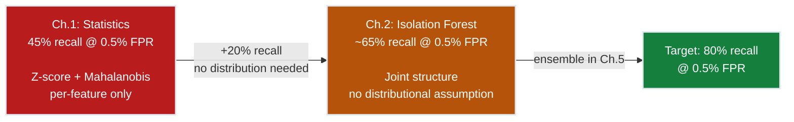
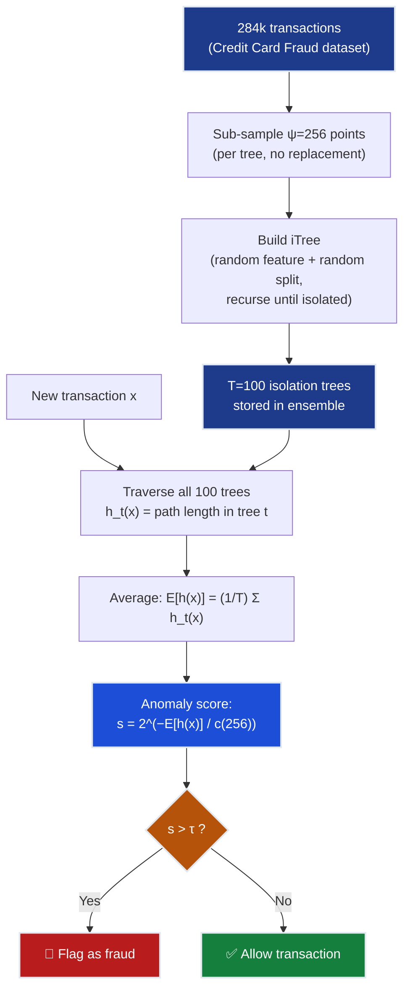
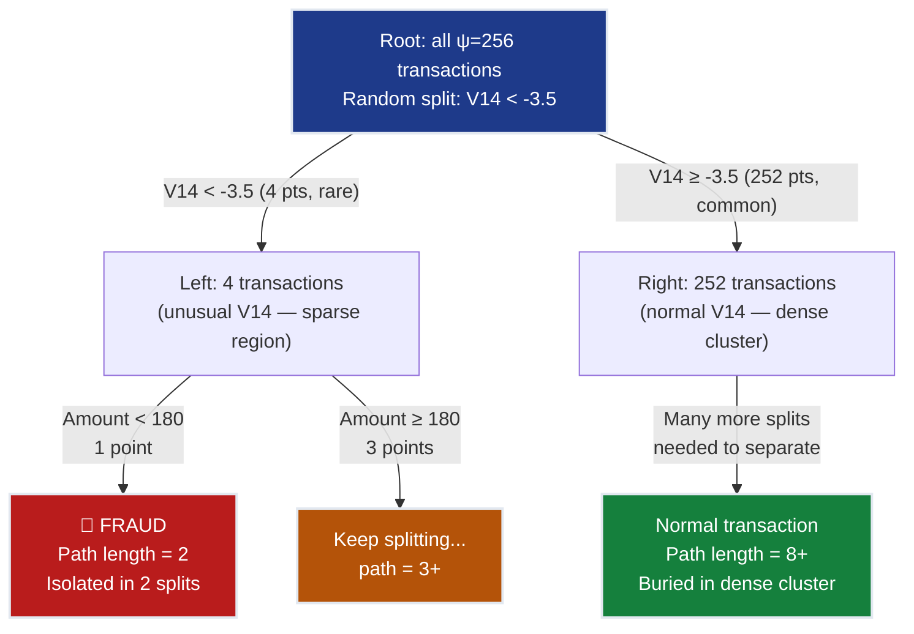

# Ch.2 — Isolation Forest

> **The story.** In **2008**, **Fei Tony Liu**, **Kai Ming Ting**, and **Zhi-Hua Zhou** published *"Isolation Forest"* in the Proceedings of the IEEE International Conference on Data Mining — and flipped anomaly detection on its head. Every method that came before asked some version of "how far is this point from normal?" Distance-based methods (kNN, Mahalanobis) computed proximity to the bulk of the data. Density-based methods (LOF, DBSCAN) estimated local neighbourhood densities. Both approaches required expensive $O(n^2)$ comparisons and quietly assumed that "normal" was well-defined, bounded, and describable. Liu, Ting, and Zhou asked a fundamentally different question: **"how easy is this point to isolate?"** Their insight was both obvious in hindsight and genuinely novel in practice: *anomalies are few and different*. If you recursively partition data with random axis-aligned cuts, anomalies — sitting in sparse regions — get cordoned off in very few splits. Normal points, packed together in dense clusters, require many more splits before they are isolated from one another. The average number of splits needed becomes the anomaly score: short path = anomaly, long path = normal. No distance metric, no density kernel, no Gaussian assumption. Just trees and randomness. The algorithm trained in $O(n \log n)$, scored new points in $O(\log n)$, and — crucially — worked on raw tabular data with minimal preprocessing. Within a decade it became the default first-try anomaly detector in industry fraud pipelines, network intrusion detection, and medical outlier flagging.
>
> **Where you are in the curriculum.** Ch.1 established that statistical thresholds (Z-score, IQR, Mahalanobis distance) catch roughly 45% of fraud at the 0.5% false positive rate — the easy cases where a transaction is simply extreme in one feature. This chapter introduces the first *structure-based* anomaly detector. Isolation Forest does not assume any distribution; it lets the joint data geometry decide what is anomalous. The path-length scoring you build here reappears in the ensemble chapter [Ch.5](../ch05_ensemble_anomaly) where IF scores are combined with autoencoder reconstruction errors and DBSCAN density scores for the final FraudShield pipeline.
>
> **Notation in this chapter.** $T$ — number of isolation trees in the ensemble; $\psi$ (psi) — sub-sample size per tree (default 256); $h(\mathbf{x})$ — path length of point $\mathbf{x}$ in one tree (number of edges from root to the isolating leaf); $E[h(\mathbf{x})]$ — expected (average) path length of $\mathbf{x}$ across all $T$ trees; $c(\psi)$ — normalisation constant: average path length of an unsuccessful search in a Binary Search Tree (BST) of size $\psi$; $s(\mathbf{x}, \psi)$ — anomaly score for $\mathbf{x}$ at sub-sample size $\psi$, in $[0,1]$ where $s \to 1$ means anomaly and $s \to 0$ means deeply normal.

---

## 0 · The Challenge — Where We Are

> 💡 **The mission**: Launch **FraudShield** — a production fraud detection system satisfying 5 constraints:
> 1. **RECALL**: ≥80% fraud recall at ≤0.5% false positive rate
> 2. **GENERALIZATION**: Detect novel fraud patterns not seen in training
> 3. **MULTI-SIGNAL**: Combine transaction amount, PCA features V1–V28, and temporal patterns
> 4. **SPEED**: <10ms inference latency per transaction at production scale
> 5. **NO DISTRIBUTION ASSUMPTION**: Fraud patterns are non-Gaussian and shift over time

**What we know so far:**
- ✅ Dataset: 284,807 credit card transactions, 492 fraud (0.17% fraud rate)
- ✅ Features: Time, Amount, and 28 PCA-transformed features V1–V28
- ✅ Ch.1 baseline: Z-score + IQR + Mahalanobis distance thresholds → **45% recall @ 0.5% FPR**
- ❌ **But 55% of fraud is still undetected!**

**What's blocking us:**
Statistical methods assume fraud equals extreme feature values. They test each feature independently, flagging a transaction only when V14 is below −10 *or* Amount is above $10,000. But sophisticated fraud transactions look completely normal on any single feature — their anomalousness lives in the *joint structure*. A fraudster who keeps Amount low and V14 moderate but combines features in an unusual way slips through every per-feature threshold. We need a method that:

- Makes **no distributional assumption** — fraud patterns are not Gaussian and they evolve
- Captures **multivariate structure** — not just per-feature extremes but unusual feature combinations
- Scales to 284k transactions **efficiently** — no $O(n^2)$ pairwise distances
- Works well under **severe class imbalance** — 0.17% fraud means 99.83% of the data is normal

**What this chapter unlocks:**
Isolation Forest scores anomalies by **how few random splits** it takes to separate them from the bulk of the data. This directly addresses the class-imbalance problem: because fraud is *few and different*, it is systematically isolated faster than normal transactions. No density estimation, no distance matrices — just recursive partitioning.



---

## Animation


*Visual takeaway: random tree partitioning isolates rare fraud transactions in fewer splits than dense normal transactions. Calibrating the score threshold pushes recall from 45% to 65% without flooding the false alarm rate.*

---

## 1 · Core Idea — Anomalies Are Isolated in Fewer Splits

Here is the central insight in one sentence: **anomalies are few and different, so random partitions isolate them faster than normal points**.

Imagine throwing random knife cuts through your data space. Each cut divides the current region into two halves by choosing a random feature and a random split value within that feature's range. You keep cutting until each point is alone in its own cell.

For a point in a dense cluster, every cut probably hits the cluster too — many of its neighbours are on the same side. It takes many cuts before the dense neighbourhood is thin enough to isolate this one point. For an anomaly sitting in a sparse region, the very first cut probably puts it in a small group or alone. One or two more cuts and it's isolated. The count of cuts required is the path length. The path length is the anomaly score.

Three properties make this work in practice:

1. **No distribution assumption.** The splits are random, not guided by any model of "what normal looks like." Whatever structure the data has, anomalies in sparse regions isolate faster — regardless of whether the features are Gaussian, log-normal, or multi-modal.
2. **Sub-sampling is a feature, not a compromise.** Using only $\psi = 256$ points per tree (instead of all 284k transactions) actually *improves* anomaly detection by reducing the "masking effect" — the tendency of very large, dense normal clusters to hide nearby anomalies. With a small sub-sample, the probability that an anomaly shares its neighbourhood with many normal points is low.
3. **Ensemble averaging reduces variance.** A single tree can mis-score a point due to unlucky splits. Averaging path lengths across $T = 100$ trees gives a stable, reproducible score.

> 💡 **Key contrast with Ch.1:** Statistical methods define "anomalous" as "far from the distribution centre." Isolation Forest defines "anomalous" as "easy to isolate" — these are different things. A transaction with moderately unusual V14 *and* moderately unusual Amount *and* moderately unusual V4 is not extreme on any single feature (Ch.1 misses it) but its joint position is sparse, and IF isolates it quickly.

---

## 2 · Running Example — FraudShield Needs Multivariate Anomaly Detection

Your Z-score detector from Ch.1 catches the obvious fraud: a transaction with Amount = $15,000 when normal transactions average $88. The Head of Risk looks at the misses and notices a pattern: the 55% of fraud that slipped through all have individually plausible feature values. V14 is −3 (unusual but not extreme), Amount is $240 (below your Z-score threshold), V4 is 2.1 (slightly above normal). No single feature screams fraud. But the *combination* is rare — in 284,807 legitimate transactions, you almost never see that exact joint configuration.

This is precisely the regime where Isolation Forest excels.

**Dataset:** **Credit Card Fraud** (284,807 transactions, 492 fraud, 0.17% fraud rate). Features: `Amount`, `Time`, and `V1`–`V28` (PCA-transformed, privacy-protected).

**Why Isolation Forest fits this problem:**

| Property | Why it helps FraudShield |
|---|---|
| No distribution assumption | V1–V28 are PCA projections with unknown marginal distributions; IF doesn't care |
| Exploits rarity directly | 0.17% fraud = anomalies are by definition few and different — IF's core assumption |
| Sub-linear training | Samples $\psi = 256$ per tree; never processes the full 284k per tree |
| Fast inference | Each transaction traverses $T$ shallow trees → $O(T \cdot \log \psi)$ per prediction |
| Threshold-free training | Train the score model first; set the threshold separately from the ROC curve |

**The toy we will use throughout §4 and §6.** To keep the arithmetic tractable we work with a 2-feature slice: $x_1$ and $x_2$ representing (for intuition) simplified versions of V14 and Amount. Real FraudShield uses all 29 features; the mechanics are identical.

---

## 3 · Isolation Forest at a Glance

Before diving into the math, here is the complete algorithm. Each step corresponds to a deep-dive in the sections that follow — treat this as your map.

```
ISOLATION FOREST — TRAINING

1. For each tree t = 1, ..., T:
   a. Draw a sub-sample of ψ points from the training data (no replacement)
   b. Build an iTree (isolation tree) on the sub-sample:
      - If |sample| = 1 or all points identical: return leaf (point is isolated)
      - Randomly choose a feature q from {1, ..., d}
      - Randomly choose a split value p ∈ [min(x_q), max(x_q)] in the sub-sample
      - Partition: left = {x : x_q < p}, right = {x : x_q ≥ p}
      - Recurse on left and right sub-samples
   c. Store the tree (each leaf records the sub-sample size that reached it)

ISOLATION FOREST — SCORING

2. For a new point x (or a training point):
   a. Pass x down each of the T trees
   b. Record path length h_t(x) in each tree
      (path length = number of edges from root to the leaf where x lands)
   c. Compute average: E[h(x)] = (1/T) × Σ_t h_t(x)
   d. Normalise: s(x, ψ) = 2^(−E[h(x)] / c(ψ))
      where c(ψ) is the expected path length in a BST of size ψ

3. Set anomaly threshold τ from the ROC curve on a labelled validation set
4. Flag x as anomaly if s(x, ψ) > τ
```

**Why $T = 100$ trees is usually enough?** The variance of the score estimate decreases as $1/T$. Empirically, scores stabilise at around $T = 100$ for most datasets. Using $T = 200$ rarely changes the ranking; it just doubles inference time.

**Why $\psi = 256$ is the sweet spot?** Liu et al.'s original paper showed that $\psi = 256$ achieves near-optimal performance on most datasets. Larger $\psi$ increases the risk of masking (anomaly clusters look dense). Smaller $\psi$ makes trees so shallow that normal points also get short paths.

**sklearn implementation note.** In `sklearn.ensemble.IsolationForest`, the parameters map as follows: `n_estimators` = $T$, `max_samples` = $\psi$ (accepts integer or `'auto'` for min(256, n_samples)), `contamination` = $\tau$ anchor (or `'auto'`). The `score_samples` method returns the negative anomaly score — lower (more negative) means more anomalous. To get $s \in [0,1]$ as described in this chapter, use `decision_function` and calibrate against labelled validation data, or negate and normalise `score_samples` output. The `fit_predict` method trains and scores in one call, returning +1 (normal) or −1 (anomaly) based on the contamination threshold.

---

## 4 · The Math

### 4.1 · Random Tree Construction — 5-Point Worked Example

To see how an isolation tree is built by hand, take **five points** on a single feature axis, values in $[0, 10]$:

| Point | Value |
|-------|-------|
| P1 | 1 |
| P2 | 3 |
| P3 | 5 |
| P4 | 8 |
| P5 | 9 |

**P1, P2, P3 form a left-side cluster; P4, P5 sit far right and are potential anomalies.**

**Step 1 — Root split.** Choose a random split at $x = 6$:
- Left ($x < 6$): P1, P2, P3 — **3 points**
- Right ($x \geq 6$): P4, P5 — **2 points**

**Step 2a — Left branch (3 points).** Split at $x = 2$:
- Left ($x < 2$): P1 — **isolated! path length = 2**
- Right ($x \geq 2$): P2, P3 — continue

**Step 2b — Right branch (2 points).** Split at $x = 8.5$:
- Left ($x < 8.5$): P4 — **isolated! path length = 2**
- Right ($x \geq 8.5$): P5 — **isolated! path length = 2**

**Step 3 — Left-right branch ({P2, P3}).** Split at $x = 4$:
- Left ($x < 4$): P2 — **isolated! path length = 3**
- Right ($x \geq 4$): P3 — **isolated! path length = 3**

The complete 3-level isolation tree:

```
                 [P1,P2,P3,P4,P5]
                  split: x < 6
                /                  \
         [P1,P2,P3]              [P4,P5]
          split: x < 2          split: x < 8.5
         /          \            /             \
       [P1]       [P2,P3]     [P4]           [P5]
     path=2      split: x<4  path=2         path=2
                 /        \
              [P2]        [P3]
             path=3      path=3
```

**Path lengths summary:**

| Point | Value | Path Length | Interpretation |
|-------|-------|-------------|----------------|
| P1 | 1 | 2 | Isolated quickly — left extreme |
| P4 | 8 | **2** | **Isolated quickly — right extreme (anomaly candidate)** |
| P5 | 9 | **2** | **Isolated quickly — right extreme (anomaly candidate)** |
| P2 | 3 | 3 | Needed one more split inside the dense cluster |
| P3 | 5 | 3 | Needed one more split inside the dense cluster |

> ⚡ **One tree is not enough.** P4 and P5 get path=2, same as P1. In different random splits, P1 might end up requiring more cuts than P4. The ensemble over $T = 100$ trees averages out the randomness: if P4 and P5 are genuinely anomalous (in sparse regions), they will *consistently* get short paths across many different trees. P1, while at the left extreme of this single feature, may have normal values on other features and will receive longer paths in trees that split on those features first.

### 4.2 · Path Length as an Anomaly Signal

Formally, $h(\mathbf{x})$ for a point $\mathbf{x}$ in a single isolation tree is the number of edges traversed from the root to the leaf containing $\mathbf{x}$.

When a point reaches a leaf that still contains more than one training point (because the tree was stopped before full isolation, due to a depth limit), we add a correction term:

$$h(\mathbf{x}) = e + c(|T_\ell|)$$

where $e$ is the number of edges traversed so far, $|T_\ell|$ is the number of points remaining in the leaf, and $c(|T_\ell|)$ is the expected additional path length to isolate one more point from a BST of that size. This ensures that a point reaching a leaf with 10 remaining neighbours is not given a free pass just because the tree stopped early.

### 4.3 · The BST Normaliser $c(\psi)$ — Explicit Arithmetic for $\psi = 10$

To compare path lengths across trees with different sub-sample sizes, we normalise by the **average path length of an unsuccessful search in a Binary Search Tree (BST)** with $\psi$ keys:

$$c(\psi) = 2\bigl(\ln(\psi - 1) + \gamma\bigr) - \frac{2(\psi - 1)}{\psi}$$

where $\gamma \approx 0.5772$ is the Euler–Mascheroni constant.

**Full arithmetic for $\psi = 10$:**

$$c(10) = 2\bigl(\ln(10 - 1) + 0.5772\bigr) - \frac{2(10 - 1)}{10}$$

$$= 2\bigl(\ln 9 + 0.5772\bigr) - \frac{18}{10}$$

$$= 2\bigl(2.197 + 0.5772\bigr) - 1.800$$

$$= 2 \times 2.7742 - 1.800$$

$$= 5.548 - 1.800 = \mathbf{3.748}$$

**Reference table for common sub-sample sizes:**

| $\psi$ | $c(\psi)$ | Typical max tree depth |
|--------|-----------|------------------------|
| 10 | **3.748** | Toy examples in this chapter |
| 64 | ~7.03 | Minimal production setting |
| 256 | ~9.00 | **sklearn default — recommended** |
| 1024 | ~12.7 | Large-sample; diminishing returns |

**Why normalisation matters:** Without $c(\psi)$, a path length of 4 in a size-10 sub-sample would score the same as a path length of 4 in a size-256 sub-sample. But the second tree is ~5× taller, so path=4 is *far* more anomalous in the smaller setting. Dividing by $c(\psi)$ makes the ratio $E[h(\mathbf{x})]/c(\psi)$ comparable across all tree sizes.

### 4.4 · The Anomaly Score Formula — Explicit Arithmetic

The anomaly score maps the normalised average path length to $[0, 1]$:

$$s(\mathbf{x}, \psi) = 2^{-\,E[h(\mathbf{x})]\,/\,c(\psi)}$$

| Score | Meaning |
|-------|---------|
| $s \to 1$ | $E[h] \ll c(\psi)$ — very short path → **strong anomaly** |
| $s = 0.5$ | $E[h] = c(\psi)$ — average path → **normal** |
| $s \to 0$ | $E[h] \gg c(\psi)$ — very long path → **deeply normal** |

**Example 1 — Fraud transaction, $E[h(\mathbf{x})] = 2.1$, $c(10) = 3.748$:**

$$s = 2^{-2.1/3.748} = 2^{-0.560} = e^{-0.560 \times 0.693} = e^{-0.388} = \mathbf{0.676}$$

Score $0.676 > \tau = 0.6$ → **flagged as fraud** ✅

**Example 2 — Legitimate transaction, $E[h(\mathbf{x})] = 4.2$, $c(10) = 3.748$:**

$$s = 2^{-4.2/3.748} = 2^{-1.120} = e^{-1.120 \times 0.693} = e^{-0.776} = \mathbf{0.462}$$

Score $0.462 < \tau = 0.6$ → **not flagged** ✅

The fraud transaction required only 2.1 splits on average — less than the 3.748 expected for a random point. The legitimate transaction required 4.2 splits — above average, buried deeper in the dense normal cluster.

**Why base 2?** The formula uses $2^{-x}$ rather than $e^{-x}$ or $10^{-x}$ by convention: it maps a ratio of 1 (average path = $c(\psi)$) to exactly $2^{-1} = 0.5$, giving a natural "is it above or below average?" reading at the midpoint. Any monotone decreasing function of $E[h]/c(\psi)$ would work; $2^{-x}$ was chosen because $s = 0.5$ means "exactly as hard to isolate as a random point" — a clean interpretation. The numerical values of the threshold $\tau$ change if you change the base, but the *ranking* of points by anomaly score is identical regardless of the base used.

**Three-point sanity check:**

| $E[h]$ relative to $c(\psi)$ | Exponent $-E[h]/c(\psi)$ | Score $s$ | Interpretation |
|------------------------------|--------------------------|-----------|----------------|
| $E[h] = 0.5 \cdot c(\psi)$ | $-0.50$ | $2^{-0.5} = 0.707$ | Isolated at half the expected depth → anomaly |
| $E[h] = 1.0 \cdot c(\psi)$ | $-1.00$ | $2^{-1.0} = 0.500$ | Isolated at exactly average depth → normal |
| $E[h] = 1.5 \cdot c(\psi)$ | $-1.50$ | $2^{-1.5} = 0.354$ | Isolated at 1.5× the expected depth → deeply normal |

### 4.5 · Threshold and Confusion Matrix — What Happens at $\tau = 0.6$

Four transactions with computed scores using $c(10) = 3.748$:

| ID | True Label | $E[h(\mathbf{x})]$ | Score $s$ | $s > 0.6$? | Decision |
|----|-----------|--------------------|-----------|------------|----------|
| T1 | Fraud | 2.1 | **0.676** | ✅ Yes | TP |
| T2 | Fraud | 3.2 | **0.553** | ❌ No | **FN** |
| T3 | Legitimate | 4.2 | **0.462** | ❌ No | TN |
| T4 | Legitimate | 5.1 | **0.392** | ❌ No | TN |

> Note: $s(\text{T2}) = 2^{-3.2/3.748} = 2^{-0.854} = e^{-0.592} = 0.553$. $s(\text{T4}) = 2^{-5.1/3.748} = 2^{-1.361} = e^{-0.943} = 0.390$.

**Confusion matrix at $\tau = 0.6$:**

```
                  Predicted Fraud    Predicted Normal
Actual Fraud           1 (TP)             1 (FN)
Actual Normal          0 (FP)             2 (TN)
```

- **Recall** $= 1/(1+1) = 50\%$ — T2 was missed (path too long, not isolated quickly enough)
- **FPR** $= 0/(0+2) = 0\%$ — no legitimate transactions were flagged

Lowering $\tau$ to 0.55 would catch T2 (recall → 100%) but would also start flagging transactions with scores in $[0.55, 0.60]$, increasing FPR. The ROC curve traces this trade-off across all possible $\tau$ values.

> 💡 This toy shows why we *must* use the full ROC curve. On the real Credit Card Fraud dataset with $T = 100$ trees and $\psi = 256$, the optimal threshold from the ROC curve at 0.5% FPR gives approximately **65% recall** — a significant improvement over the 45% from statistical methods, but still short of the 80% target. That's why Ch.3–Ch.5 exist.

---

## 5 · The Isolation Arc

**Act 1 — The Failure of Distance.** The dominant paradigm in 2008 was proximity: LOF, one-class SVM, Mahalanobis distance, k-NN anomaly detection. All asked "how far is this point from normal?" But *far from what?* You need to define the normal centre, the normal distribution shape, the normal scale. In high dimensions (28 features, like V1–V28), the "curse of dimensionality" makes distances concentrate — everything becomes approximately equidistant from the centre. And all these methods required $O(n^2)$ comparisons — 284k transactions means 80 billion pairwise comparisons. For a real-time fraud scoring system, this is fatal.

**Act 2 — The Isolation Insight.** Liu et al.'s breakthrough was recognising that you never need to define "normal" directly. Instead, define "anomalous" directly: a point is anomalous if it is easy to isolate. Isolability is a property of the *geometry*, not of the distribution. A point in a sparse region is isolable with few cuts regardless of whether the dense region follows a Gaussian, a log-normal, or a mixture model. This decoupling of anomaly definition from distributional assumption is the fundamental contribution. No distance metric needed. No density kernel needed. No covariance matrix needed. Just randomness and counting.

**Act 3 — Why an Ensemble?** A single isolation tree is extremely sensitive to the random splits chosen. On one run, P4 might get path length = 2; on another run, a different sequence of splits might give it path length = 4. The score from a single tree has high variance. By averaging path lengths across $T = 100$ independent trees (each using a fresh random sub-sample and fresh random splits), the variance decreases as $1/T$. At $T = 100$, the standard deviation of the score is typically $< 0.01$ — far smaller than the score gap between anomalies (0.65–0.85) and normal points (0.40–0.55). The ensemble turns a noisy local measurement into a stable global score.

**Act 4 — The Contamination Parameter.** In production, you must decide *how many* anomalies you expect. Isolation Forest does not automatically label any point as anomalous — it only provides scores in $[0, 1]$. You set the threshold yourself, either from the ROC curve (preferred) or via the `contamination` parameter, which sets the threshold so that `contamination × n` training points are labelled anomalous. For Credit Card Fraud:

| `contamination` | Transactions flagged | Effect |
|-----------------|----------------------|--------|
| `0.5%` (too high) | 1,424 | Threshold too low → high FPR, floods review queue |
| `0.17%` (exact rate) | 492 | Matches reality but recall depends on score quality |
| `0.05%` (too low) | 142 | Threshold too high → 350+ fraud cases missed |

> ⚡ **Always tune the threshold via the ROC curve, not `contamination`.** The contamination parameter assumes you know the exact anomaly rate — which you rarely do in practice. The ROC curve lets you choose the exact recall/FPR operating point you need for your business constraint.

---

## 6 · Full Walkthrough — 8 Points, 2 Trees by Hand

This section builds two isolation trees from scratch on a tiny 2D dataset and computes anomaly scores. Every split is shown explicitly.

### 6.1 · The Dataset

Eight points in 2D feature space ($x_1$, $x_2$). The normal points cluster tightly; the fraud point sits far away:

| ID | $x_1$ | $x_2$ | True Label |
|----|--------|--------|------------|
| N1 | 2 | 3 | Normal |
| N2 | 3 | 2 | Normal |
| N3 | 3 | 4 | Normal |
| N4 | 4 | 3 | Normal |
| N5 | 4 | 4 | Normal |
| N6 | 5 | 3 | Normal |
| N7 | 2 | 4 | Normal |
| **A** | **9** | **8** | **Fraud** |

Normal points occupy $x_1 \in [2,5]$, $x_2 \in [2,4]$. The fraud point sits isolated at $(9, 8)$.

### 6.2 · Tree 1

**Depth 0 — Root (all 8 points).**  
Feature $x_1$, split $= 5.5$:
- Left ($x_1 < 5.5$): N1, N2, N3, N4, N5, N6, N7
- Right ($x_1 \geq 5.5$): **A** → **$h_1(A) = 1$** ✅

**Depth 1 (7 normal points).**  
Feature $x_2$, split $= 3.5$:
- Left ($x_2 < 3.5$): N1, N2, N4, N6 — 4 points
- Right ($x_2 \geq 3.5$): N3, N5, N7 — 3 points

**Depth 2a (4 points: N1, N2, N4, N6).**  
Feature $x_1$, split $= 2.5$:
- Left: N1$(x_1=2)$ → **$h_1(N1) = 3$**
- Right: N2, N4, N6 — 3 points

**Depth 2b (3 points: N3, N5, N7).**  
Feature $x_1$, split $= 3.5$:
- Left: N3$(3)$, N7$(2)$ — 2 points
- Right: N5$(4)$ → **$h_1(N5) = 3$**

**Depth 3a (3 points: N2, N4, N6).**  
Feature $x_1$, split $= 3.5$:
- Left: N2$(3)$ → **$h_1(N2) = 4$**
- Right: N4$(4)$, N6$(5)$ — 2 points

**Depth 3b (2 points: N3, N7).**  
Feature $x_1$, split $= 2.5$:
- Left: N7$(2)$ → **$h_1(N7) = 4$**
- Right: N3$(3)$ → **$h_1(N3) = 4$**

**Depth 4 (2 points: N4, N6).**  
Feature $x_1$, split $= 4.5$:
- Left: N4$(4)$ → **$h_1(N4) = 5$**
- Right: N6$(5)$ → **$h_1(N6) = 5$**

**Tree 1 path lengths:**

| Point | $h_1$ | | Point | $h_1$ |
|-------|-------|-|-------|-------|
| A | **1** | | N2 | 4 |
| N1 | 3 | | N3 | 4 |
| N5 | 3 | | N7 | 4 |
| | | | N4 | 5 |
| | | | N6 | 5 |

### 6.3 · Tree 2

**Depth 0 — Root (all 8 points).**  
Feature $x_2$, split $= 7.0$:
- Left ($x_2 < 7.0$): N1–N7 (all have $x_2 \leq 4$)
- Right ($x_2 \geq 7.0$): **A** ($x_2=8$) → **$h_2(A) = 1$** ✅

**Depth 1 (7 normal points).**  
Feature $x_1$, split $= 4.5$:
- Left: N1$(2)$, N2$(3)$, N3$(3)$, N4$(4)$, N5$(4)$, N7$(2)$ — 6 points
- Right: N6$(5)$ → **$h_2(N6) = 2$**

**Depth 2 (6 points: N1, N2, N3, N4, N5, N7).**  
Feature $x_2$, split $= 2.5$:
- Left: N2$(x_2=2)$ → **$h_2(N2) = 3$**
- Right: N1, N3, N4, N5, N7 — 5 points

**Depth 3 (5 points: N1, N3, N4, N5, N7).**  
Feature $x_1$, split $= 2.5$:
- Left: N1$(2)$, N7$(2)$ — 2 points
- Right: N3$(3)$, N4$(4)$, N5$(4)$ — 3 points

**Depth 4a (2 points: N1, N7).**  
Feature $x_2$, split $= 3.5$:
- Left: N1$(x_2=3)$ → **$h_2(N1) = 5$**
- Right: N7$(x_2=4)$ → **$h_2(N7) = 5$**

**Depth 4b (3 points: N3, N4, N5).**  
Feature $x_1$, split $= 3.5$:
- Left: N3$(3)$ → **$h_2(N3) = 5$**
- Right: N4$(4)$, N5$(4)$ — 2 points

**Depth 5 (2 points: N4, N5).**  
Feature $x_2$, split $= 3.5$:
- Left: N4$(x_2=3)$ → **$h_2(N4) = 6$**
- Right: N5$(x_2=4)$ → **$h_2(N5) = 6$**

### 6.4 · Computing Anomaly Scores

**Average path lengths across both trees:**

$$E[h(\mathbf{x})] = \frac{h_1(\mathbf{x}) + h_2(\mathbf{x})}{2}$$

**Normaliser** for $\psi = 8$:

$$c(8) = 2(\ln 7 + 0.5772) - \frac{14}{8} = 2(1.946 + 0.577) - 1.750 = 5.046 - 1.750 = \mathbf{3.296}$$

**Full scoring table:**

| Point | $h_1$ | $h_2$ | $E[h]$ | $E[h]/c(8)$ | $s = 2^{-E[h]/c(8)}$ | Rank |
|-------|--------|--------|--------|-------------|----------------------|------|
| **A** | **1** | **1** | **1.0** | **0.303** | **0.810** | **1st → ANOMALY** |
| N2 | 4 | 3 | 3.5 | 1.062 | 0.479 | 2nd |
| N6 | 5 | 2 | 3.5 | 1.062 | 0.479 | 2nd |
| N1 | 3 | 5 | 4.0 | 1.213 | 0.434 | 4th |
| N3 | 4 | 5 | 4.5 | 1.365 | 0.390 | 5th |
| N5 | 3 | 6 | 4.5 | 1.365 | 0.390 | 5th |
| N7 | 4 | 5 | 4.5 | 1.365 | 0.390 | 5th |
| N4 | 5 | 6 | 5.5 | 1.669 | 0.314 | 8th → MOST NORMAL |

> ✅ **The anomaly rises to the top.** Point A scores 0.810 with a large gap to all normal points (max 0.479). With threshold $\tau = 0.6$, exactly one point is flagged: the fraud transaction. In production with $T = 100$ trees and $\psi = 256$, the gap is even cleaner.

**What changes with $T = 100$ trees?** In this toy we used only $T = 2$ trees. The score for A (0.810) is already clearly separated from all normal points (max 0.479), but in practice some normal points might land in sparse regions of one particular sub-sample and score higher by chance. With $T = 100$ trees, each drawing a fresh random $\psi = 256$ sub-sample, the expected path length estimate $E[h(\mathbf{x})]$ averages out these random fluctuations. The standard deviation of the ensemble score drops to approximately $\sigma_s \approx \sqrt{\text{Var}[h(\mathbf{x})]/(T \cdot c(\psi)^2)}$ — at $T = 100$, this is typically $< 0.01$, far smaller than the 0.33 gap between fraud (0.810) and the highest-scoring normal point (0.479). The ranking becomes stable and reproducible across random seeds.

---

## 7 · Key Diagrams

### Diagram 1 · Full Isolation Forest Pipeline



### Diagram 2 · Why Short Paths Mean Anomaly



**Score distribution — conceptual view:**

```
   Legitimate transactions               Fraud transactions
   (long paths → low scores)            (short paths → high scores)

count                                count
  │   ▄▄▄▄▄▄                            │
  │  ▄████████▄                          │         ▄▄▄▄▄
  │ ▄██████████▄                         │       ▄███████▄
  │▄████████████▄                        │     ▄███████████▄
  ├──────────────────── s               ├──────────────────── s
 0.30  0.40  0.50  0.60               0.50  0.60  0.70  0.80  0.90
              ↑                                    ↑
          s = 0.5                          threshold τ = 0.6
       (average path)

Normal clusters around 0.40–0.50       Fraud pushes toward 0.65–0.85
(path ≈ c(ψ) → exponent ≈ -1)         (path ≪ c(ψ) → exponent → 0⁻)
```

---

## 8 · Hyperparameter Dial

Isolation Forest has three main dials. Unlike most ML algorithms, the defaults work surprisingly well — a reflection of the algorithm's robustness to hyperparameter choices.

| Dial | Parameter | Default | Too Low | Sweet Spot | Too High |
|------|-----------|---------|---------|------------|----------|
| **Number of trees** | `n_estimators` | 100 | Noisy, unstable scores | **100–200** | No gain, slower inference |
| **Sub-sample size** | `max_samples` | 256 | Trees too shallow; normal points get short paths | **128–512** | Masking: dense clusters hide nearby anomalies |
| **Contamination** | `contamination` | `'auto'` | Too few flagged — misses fraud | **0.1%–1.0% for fraud** | Too many flagged — floods review queue |

**Tuning guidance for FraudShield:**

```
n_estimators:  Start at 100. Increase to 200 only if scores are noisy across runs.
               At T ≥ 100 the variance is typically < 0.01 — stable enough.

max_samples:   256 is the research-validated sweet spot for most datasets.
               If your fraud cases are in very dense regions, try 128.
               If you have many near-duplicate normal transactions, try 512.

contamination: Do not rely on contamination to set your threshold.
               Always use the ROC curve on a labelled validation set.
               Use contamination only as a rough starting point for score-rank thresholding.
```

**Concrete impact on FraudShield (0.17% fraud rate, 492 fraud in 284,807 transactions):**

| `contamination` | Transactions flagged | Effect at 0.5% FPR budget |
|-----------------|----------------------|---------------------------|
| `0.005` (too high) | 1,424 | Threshold too low → FPR > 0.5%, floods review queue |
| `0.0017` (exact) | 492 | Threshold calibrated but recall still depends on score quality |
| `0.001` (too low) | 285 | Threshold too high → ~200 fraud cases missed |

> ⚡ **Production practice:** Train with `contamination='auto'`, then sweep $\tau$ on the validation ROC curve to hit 80% recall @ 0.5% FPR. This decouples the model from the business constraint — the model scores, the threshold enforces the business rule.

---

## 9 · What Can Go Wrong

**1. Masking effect with clustered anomalies.**
When many anomalies cluster together in a small region, they look like a dense cluster to the random partitioning algorithm. Instead of being isolated quickly, they are isolated at a similar rate to normal points. Fix: reduce `max_samples` (smaller sub-samples make even small anomaly clusters look sparse) or combine IF with a density-based method that resolves within-cluster structure.

**2. Swamping — normal points near anomaly regions get high scores.**
If a legitimate transaction falls in a sparse region of feature space (unusual but valid combination), random splits isolate it quickly alongside genuine fraud. This creates false positives that are hard to filter without additional context. Fix: add a second model (autoencoder reconstruction error in Ch.3) and require both signals to agree before flagging.

**3. Sub-sample too small — all paths become uniformly short.**
If `max_samples` is very small (say, 16), the tree is only ~4 levels deep. Even normal points get isolated in 4 splits. The score distribution collapses toward $s \approx 0.5$ for everything, and anomaly discrimination disappears. Minimum recommended: `max_samples=64`.

**4. High-dimensional features dilute the isolation signal.**
In very high dimensions ($d \gg 100$), random splits on one feature carry little structural information. Most features are irrelevant for any given anomaly. Fix: apply PCA or feature selection before IF, or use the Extended Isolation Forest (EIF) variant that uses random hyperplane splits instead of axis-aligned cuts.

**5. No labelled data for threshold selection.**
If you have no labelled ground truth to build a ROC curve, the `contamination` parameter becomes your only threshold handle — a coarse knob. Calibration strategies: use even a small labelled sample (50 labelled anomalies is enough to roughly calibrate), or use the knee-point of the score histogram where the distribution transitions from a heavy anomaly tail to a compact normal cluster.

> 📖 **Extended Isolation Forest (EIF):** If axis-aligned splits are too restrictive for your data geometry — e.g., anomalies are distributed along a rotated ellipse relative to the normal cluster — the Extended Isolation Forest uses random hyperplane cuts instead of axis-aligned splits. EIF typically reduces the masking and swamping effects in high dimensions, at the cost of slightly higher computational complexity. It is available as `eif` package in Python and shares all the same hyperparameters.

---

## 10 · Where This Reappears

| Chapter | How Isolation Forest re-enters |
|---------|-------------------------------|
| **Ch.3 — Autoencoders** | Autoencoder reconstruction error provides a complementary signal. IF excels at globally sparse anomalies; autoencoders excel at locally unusual patterns. The two signals are combined in Ch.5. |
| **Ch.4 — One-Class SVM** | OCSVM creates a decision boundary around the normal region. The comparison between IF (path-based, non-parametric) and OCSVM (kernel-based, parametric) shows when distribution-free methods win. |
| **Ch.5 — Ensemble Anomaly Detection** | $s_{\text{IF}}$ is one of three signals in the FraudShield ensemble: $\text{FinalScore} = w_1 s_{\text{IF}} + w_2 s_{\text{AE}} + w_3 s_{\text{density}}$. This is where the 65% recall from IF alone combines with the other signals to reach the 80% target. |
| **Multi-Agent AI Track** | The FraudShield agent chapter uses an IF scorer as one of several agent tools in a fraud investigation pipeline. Each agent calls the scorer as a tool and adds the score to the investigation context. |

---

## 11 · Progress Check — What We Can Solve Now


✅ **Unlocked capabilities:**
- **First distribution-free anomaly detector.** Detects anomalies without any assumption about the data distribution — Gaussian, log-normal, or multi-modal, IF doesn't care.
- **Multivariate structure captured.** Catches fraud that statistical methods miss: the transaction that looks normal on every single feature but unusual in aggregate.
- **Scalable scoring.** $O(T \log \psi)$ inference per transaction — fast enough for real-time fraud scoring at production volume.
- **IF recall: ~65% @ 0.5% FPR** — a significant improvement over Ch.1's 45%.

❌ **Still can't solve:**
- ❌ **Constraint #1 (RECALL ≥ 80%):** 65% recall falls 15 percentage points short. Isolation Forest captures spatial sparsity but misses fraud that is unusual in its local reconstruction pattern. That requires a different signal entirely.
- ❌ **Constraint #2 (GENERALIZATION to novel fraud):** IF scores are calibrated on training sub-samples. A brand-new fraud pattern not present during training may not be isolated more quickly than normal transactions. Autoencoders, which learn to reconstruct normal patterns, handle novel fraud better by flagging anything that reconstructs poorly.
- ❌ **Constraint #3 (MULTI-SIGNAL):** FraudShield's final system needs at least three independent anomaly signals. Isolation Forest provides one.

**FraudShield constraint progress:**

| Constraint | Status | Current State |
|------------|--------|---------------|
| #1 RECALL ≥ 80% | ⚡ Partial | **65% recall** @ 0.5% FPR (was 45% in Ch.1) |
| #2 GENERALIZATION | ⚡ Partial | Better than statistical; still fails on totally novel fraud |
| #3 MULTI-SIGNAL | ❌ Blocked | One signal (IF score) — need AE + density in Ch.3–Ch.5 |
| #4 SPEED < 10ms | ✅ Achieved | $O(T \log \psi) \approx 800$ operations per transaction |
| #5 NO DIST. ASSUMPTION | ✅ Achieved | IF makes no distributional assumption |

**Real-world status:** We can score 284k transactions in seconds and detect ~65% of fraud without any distribution assumption. But 35% of fraud still escapes — transactions that are unusual in high-level joint structure but not in coarse isolation distance. Ch.3 adds the reconstruction signal to close that gap.

**Next up:** [Ch.3 — Autoencoders](../ch03_autoencoders) train a neural network to reconstruct normal transactions. Transactions that reconstruct poorly (high reconstruction error) are anomalies. The reconstruction signal catches different fraud from isolation — autoencoders catch patterns that are locally unusual in sequence structure, where IF catches patterns that are globally sparse.

---

## 12 · Bridge to Ch.3 — Autoencoders

Isolation Forest established one key idea: **how easy is this point to isolate?** The path length is an anomaly score that needs no distribution — it captures global sparsity. Ch.3 (Autoencoders) establishes a second key idea: **how well can this point be reconstructed from its compressed representation?** The reconstruction error captures local pattern deviation — transactions that follow globally normal distributions but have unusual internal structure. When these two signals disagree, a human expert investigates. When both agree a transaction is anomalous, it is almost certainly fraud. That fusion is what pushes recall from 65% to 80% in Ch.5.

The two chapters also differ in what they need to learn: Isolation Forest uses no labelled data at all — it learns only from the structure of the unlabelled training set. An autoencoder also trains unsupervised, but it learns a specific *model* of normality (the encoder-decoder weights) rather than an ensemble of random trees. The parametric vs non-parametric contrast between these two approaches, and how each fails in different regimes, is one of the key lessons of Ch.3.

> ➡️ **The representation learning shift**: Ch.1 and Ch.2 score anomalies by *position* (distance or isolation). Ch.3 scores anomalies by *reconstructability* — a fundamentally different inductive bias that catches fraud the geometric methods miss. See [Ch.3 — Autoencoders →](../ch03_autoencoders)

