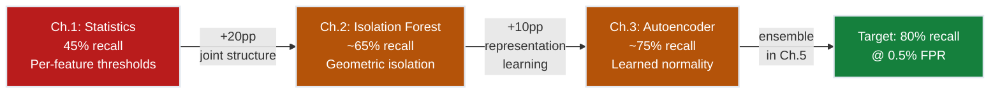
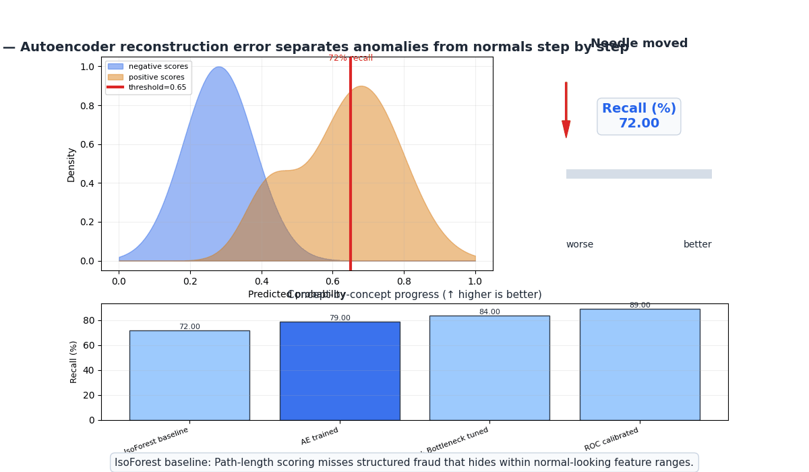
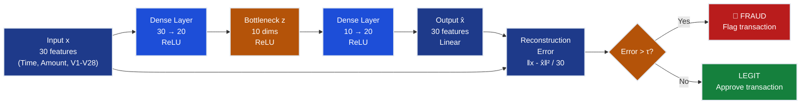
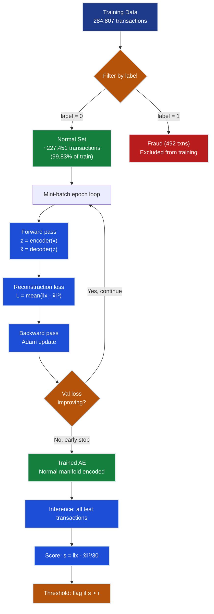

# Ch.3 — Autoencoders for Anomaly Detection

> **The story.** In **2006**, Geoffrey Hinton and Ruslan Salakhutdinov published *"Reducing the Dimensionality of Data with Neural Networks"* in *Science* — a landmark paper that reignited deep learning by demonstrating that multi-layer networks could be pre-trained greedily using **autoencoders**: networks that learn to compress input data into a low-dimensional bottleneck and then reconstruct it. The reconstruction ability itself was the signal. Two years later, in **2008**, Yann LeCun's lab introduced the **Denoising Autoencoder (DAE)**: by training to reconstruct *clean* input from *corrupted* input, the model was forced to learn the underlying data manifold rather than memorizing surface statistics. The insight was profound — the manifold of "normal" data is far lower-dimensional than the raw feature space; noisy or anomalous inputs that don't lie on this manifold cannot be reconstructed well. In **2013**, Diederik Kingma and Max Welling elevated autoencoders further with the **Variational Autoencoder (VAE)**, which replaced the deterministic bottleneck with a learned probability distribution, enabling generation and more principled anomaly scoring via ELBO. The connection to anomaly detection crystallized: *if you train a model to reconstruct normal data, reconstruction failure becomes an anomaly score.* This chapter builds that scoring pipeline for the FraudShield mission — training an autoencoder exclusively on legitimate credit card transactions and using reconstruction error to catch fraud that Isolation Forest missed.
>
> **Where you are in the curriculum.** Ch.1 established statistical thresholds (Z-score, IQR, Mahalanobis) catching **45% recall @ 0.5% FPR** — the easy cases where a transaction is extreme in one feature. Ch.2's Isolation Forest improved to **~65% recall** by scoring anomalies through path-length in random trees, capturing joint multivariate structure without distributional assumptions. Both approaches score anomalies as *geometric outliers* — they ask "how isolated is this point?" This chapter introduces the first *representation learning* approach: the autoencoder asks "how well can I reconstruct this point from compressed normal patterns?" The distinction matters: a fraudster can craft a transaction that is geometrically close to normal clusters (defeating IF) but still violates the learned latent code of legitimate behavior (caught by AE). After this chapter, you have three complementary scores to combine in [Ch.5 Ensemble](../ch05_ensemble_anomaly).
>
> **Notation in this chapter.** $\mathbf{x} \in \mathbb{R}^d$ — input transaction vector ($d=30$ features: Time, Amount, V1–V28); $f_e : \mathbb{R}^d \to \mathbb{R}^k$ — encoder network mapping input to latent space; $\mathbf{z} = f_e(\mathbf{x}) \in \mathbb{R}^k$ — latent representation (bottleneck), $k \ll d$; $f_d : \mathbb{R}^k \to \mathbb{R}^d$ — decoder network mapping latent back to input space; $\hat{\mathbf{x}} = f_d(\mathbf{z}) \in \mathbb{R}^d$ — reconstructed transaction; $\mathcal{L}(\mathbf{x}) = \frac{1}{d}\|\mathbf{x} - \hat{\mathbf{x}}\|^2 = \frac{1}{d}\sum_{i=1}^d (x_i - \hat{x}_i)^2$ — reconstruction error (MSE), used as anomaly score; $k$ — bottleneck dimension (the critical hyperparameter); $\tau$ — anomaly threshold on reconstruction error; $\mathcal{X}_0 = \{\mathbf{x}_i : y_i = 0\}$ — the training set of legitimate transactions only.

---

## 0 · The Challenge — Where We Are

> **The mission**: Advance **FraudShield** — a production fraud detection system satisfying 5 constraints:
> 1. **RECALL**: ≥80% fraud recall at ≤0.5% false positive rate — *still 15pp short after IF*
> 2. **GENERALIZATION**: Detect novel fraud patterns not seen in training — *IF partially handles this; AE extends it*
> 3. **MULTI-SIGNAL**: Combine transaction amount, PCA features V1–V28, and temporal patterns — *AE captures joint structure across all 30 features*
> 4. **SPEED**: <10ms inference latency per transaction — *AE forward pass is O(d·k) matrix ops, sub-millisecond*
> 5. **NO DISTRIBUTION ASSUMPTION**: Fraud patterns are non-Gaussian and shift over time — *AE learns the data manifold without imposing a parametric form*

**FraudShield scoreboard after Ch.2:**
- Z-score baseline: **45% recall** @ 0.5% FPR — catches per-feature extremes
- Isolation Forest: **~65% recall** @ 0.5% FPR — captures joint geometric isolation

**What Isolation Forest cannot do:**
Isolation Forest partitions the feature space with *random* splits — it finds points that are geometrically isolated regardless of *what* they look like. A clever adversarial fraudster can position a transaction inside a dense cluster of normal data by keeping every individual feature within normal range. Because IF uses axis-aligned random cuts, it has no model of "what a normal transaction should look like" — it only asks "how quickly can I cut this point away from its neighbours?" If the answer is "slowly" (because the point is surrounded by normals), IF gives it a low anomaly score.

**What this chapter unlocks:**
Autoencoders build an explicit model of normality. Trained **only on legitimate transactions**, the encoder learns to compress the 30-dimensional manifold of normal behavior into a $k$-dimensional latent code. The decoder learns to reconstruct that normal behavior from the code. Fraud transactions — whose feature distributions were never seen during training — will *not* compress into the learned latent code cleanly. When the decoder tries to reconstruct them, the output diverges from the input. The reconstruction error $\mathcal{L}(\mathbf{x}) = \frac{1}{d}\|\mathbf{x} - \hat{\mathbf{x}}\|^2$ becomes the anomaly score.



---

## Animation



*Visual takeaway: the autoencoder learns what normal credit card transactions look like. Anything that reconstructs poorly — fraud — gets flagged. Recall climbs from the 65% IF baseline to ~75%, moving FraudShield within striking distance of the 80% target.*

---

## 1 · Core Idea

An autoencoder is a neural network trained to **compress** input data into a low-dimensional bottleneck representation and then **reconstruct** it. When trained exclusively on normal transactions, it learns the manifold of legitimate behavior. At inference time, the reconstruction error $\mathcal{L}(\mathbf{x}) = \frac{1}{d}\|\mathbf{x} - \hat{\mathbf{x}}\|^2$ serves as the anomaly score: normal transactions the model has learned to represent reconstruct with low error; fraud transactions, whose patterns were absent from training, reconstruct poorly and produce high error. Setting a threshold $\tau$ on this error score converts the continuous anomaly score into a binary fraud/legitimate decision.

The key architectural choice is the **bottleneck dimension** $k$: too narrow and the model cannot capture legitimate transaction structure (high error on everything); too wide and the model learns a near-identity mapping (low error on everything, including fraud). The sweet spot — the compression that captures normality without memorizing every transaction — is the central hyperparameter of this chapter.

---

## 2 · Running Example

Isolation Forest delivered 65% recall, but the Head of Risk is unsatisfied: "We're still missing a third of fraud. Can we teach a model *what normal looks like*, so anything that deviates gets caught?" The hypothesis: legitimate credit card transactions, despite having 30 PCA-transformed features, lie on a much lower-dimensional manifold. Fraudulent transactions sit off that manifold. A network that learns to compress and reconstruct the normal manifold will fail on off-manifold fraud.

**Dataset**: Credit Card Fraud (Kaggle, ULB Machine Learning Group) — 284,807 transactions, 492 fraud (0.17% fraud rate). Features: `Time`, `Amount`, and 28 PCA-transformed features `V1`–`V28`. All features are standardized before training.

**Training strategy**: Extract only legitimate transactions from the training set ($N \approx 227,451$). Train the autoencoder on $\mathcal{X}_0$. At inference, pass all test transactions — normal and fraud — through the trained model and compute reconstruction error. Normal transactions the model recognizes reconstruct cleanly; fraud transactions reconstruct poorly.

**Why training on normal-only works with 0.17% fraud:**
The extreme class imbalance — 99.83% legitimate — is a structural advantage. We have ~227k legitimate transactions to define the normality manifold. The bottleneck forces a compressed representation that generalizes over this manifold. Fraud patterns, never encoded during training, cannot be decoded accurately.

**Architecture**: Two-layer symmetric autoencoder — 30 → 10 → 30. Input dimension $d=30$, bottleneck $k=10$.

---

## 3 · AE Anomaly Detection at a Glance

Before diving into the math, here is the complete pipeline:

```
AUTOENCODER ANOMALY DETECTION PIPELINE

Training (normal transactions only):
┌─────────────────────────────────────────────────────────┐
│ X_normal = X_train[y_train == 0] ← only legitimate │
│ Standardize: µ, σ computed on X_normal │
│ For each mini-batch of normal transactions: │
│ z = encoder(x) ← compress to latent space │
│ x̂ = decoder(z) ← reconstruct from latent │
│ L = mean(‖x - x̂‖²) ← reconstruction MSE │
│ Backward + Adam update │
│ Early stopping on validation reconstruction error │
└─────────────────────────────────────────────────────────┘

Inference (all test transactions):
┌─────────────────────────────────────────────────────────┐
│ For each transaction x in test set: │
│ z = encoder(x) ← encode │
│ x̂ = decoder(z) ← decode │
│ s = (1/d)‖x - x̂‖² ← anomaly score │
│ flag = (s > τ) ← threshold decision │
└─────────────────────────────────────────────────────────┘

Threshold selection:
┌─────────────────────────────────────────────────────────┐
│ Compute s_i for all legitimate validation transactions │
│ τ = percentile(s_i, 99.5) ← controls FPR ≤ 0.5% │
└─────────────────────────────────────────────────────────┘
```

Four stages, four decisions: **encode → decode → measure reconstruction error → threshold**. The rest of this chapter unpacks the math behind each stage.

---

## 4 · The Math

### 4.1 · Encoder: Compress to Latent Space

The encoder is a feedforward neural network mapping input $\mathbf{x} \in \mathbb{R}^d$ to latent representation $\mathbf{z} \in \mathbb{R}^k$:

$$\mathbf{z} = f_e(\mathbf{x}) = \text{ReLU}(W_e \mathbf{x} + \mathbf{b}_e)$$

where $W_e \in \mathbb{R}^{k \times d}$ is the encoder weight matrix and $\mathbf{b}_e \in \mathbb{R}^k$ is the encoder bias vector.

**Worked example — single encoder layer (2-dim latent from 3-feature input):**

Suppose we simplify to 3 features (for illustration) and a 2-dimensional latent space:

$$\mathbf{x} = \begin{bmatrix} 1.5 \\ -2.1 \\ 0.8 \end{bmatrix}, \quad W_e = \begin{bmatrix} 0.4 & -0.3 & 0.2 \\ 0.1 & 0.5 & -0.4 \end{bmatrix}, \quad \mathbf{b}_e = \begin{bmatrix} 0.1 \\ -0.2 \end{bmatrix}$$

**Compute $W_e \mathbf{x} + \mathbf{b}_e$ row by row:**

Row 1:
$$0.4 \times 1.5 + (-0.3) \times (-2.1) + 0.2 \times 0.8 + 0.1$$
$$= 0.60 + 0.63 + 0.16 + 0.10 = 1.49$$

Row 2:
$$0.1 \times 1.5 + 0.5 \times (-2.1) + (-0.4) \times 0.8 + (-0.2)$$
$$= 0.15 - 1.05 - 0.32 - 0.20 = -1.42$$

**Apply ReLU** ($\text{ReLU}(a) = \max(0, a)$):

$$z_1 = \text{ReLU}(1.49) = 1.49 \qquad z_2 = \text{ReLU}(-1.42) = 0.00$$

$$\boxed{\mathbf{z} = \begin{bmatrix} 1.49 \\ 0.00 \end{bmatrix}}$$

The bottleneck has compressed 3-dimensional input into 2-dimensional latent representation. Note that $z_2 = 0$ because ReLU killed the negative pre-activation. In a trained network, this dead neuron would carry a different weight pattern; here it illustrates how sparsity emerges in the latent space.

### 4.2 · Decoder: Reconstruct from Latent Space

The decoder maps $\mathbf{z} \in \mathbb{R}^k$ back to reconstruction $\hat{\mathbf{x}} \in \mathbb{R}^d$:

$$\hat{\mathbf{x}} = f_d(\mathbf{z}) = W_d \mathbf{z} + \mathbf{b}_d$$

where $W_d \in \mathbb{R}^{d \times k}$ is the decoder weight matrix and $\mathbf{b}_d \in \mathbb{R}^d$ is the decoder bias vector. For real-valued, standardized features, the output layer uses a **linear (identity) activation** so that reconstruction can span the full real line.

**Continuing the worked example** — $\mathbf{z} = [1.49,\ 0.00]^\top$:

$$W_d = \begin{bmatrix} 0.3 & 0.2 \\ -0.4 & 0.1 \\ 0.5 & -0.3 \end{bmatrix}, \quad \mathbf{b}_d = \begin{bmatrix} 0.2 \\ -0.1 \\ 0.3 \end{bmatrix}$$

**Compute $W_d \mathbf{z} + \mathbf{b}_d$ row by row:**

Row 1:
$$0.3 \times 1.49 + 0.2 \times 0.00 + 0.2 = 0.447 + 0.000 + 0.200 = 0.647$$

Row 2:
$$-0.4 \times 1.49 + 0.1 \times 0.00 + (-0.1) = -0.596 + 0.000 - 0.100 = -0.696$$

Row 3:
$$0.5 \times 1.49 + (-0.3) \times 0.00 + 0.3 = 0.745 + 0.000 + 0.300 = 1.045$$

$$\boxed{\hat{\mathbf{x}} = \begin{bmatrix} 0.647 \\ -0.696 \\ 1.045 \end{bmatrix}}$$

### 4.3 · Reconstruction Error (MSE)

The anomaly score for any transaction $\mathbf{x}$ is its mean squared reconstruction error:

$$\mathcal{L}(\mathbf{x}) = \frac{1}{d} \sum_{i=1}^{d} (x_i - \hat{x}_i)^2$$

**Compute for the worked example** — $\mathbf{x} = [1.5,\ -2.1,\ 0.8]^\top$, $\hat{\mathbf{x}} = [0.647,\ -0.696,\ 1.045]^\top$:

**Per-feature squared errors:**

| Feature | $x_i$ | $\hat{x}_i$ | $x_i - \hat{x}_i$ | $(x_i - \hat{x}_i)^2$ |
|---------|--------|-------------|--------------------|-----------------------|
| $x_1$ | 1.500 | 0.647 | 0.853 | **0.728** |
| $x_2$ | −2.100 | −0.696 | −1.404 | **1.971** |
| $x_3$ | 0.800 | 1.045 | −0.245 | **0.060** |

$$\mathcal{L} = \frac{1}{3}(0.728 + 1.971 + 0.060) = \frac{2.759}{3} \approx \mathbf{0.920}$$

The large error on feature $x_2$ ($-2.1$ reconstructed as $-0.696$) dominates. In the full 30-feature version, reconstruction errors average across all PCA components — but fraud transactions typically exhibit large deviations on several high-signal features ($V4$, $V11$, $V14$, $V17$) simultaneously.

**Reconstruction error distribution (ASCII)**:

```
Validation set reconstruction errors:

 Normal transactions (n=45,000): Fraud transactions (n=492):

 count count
 │████████████▄ │
 │█████████████████▄ │
 │██████████████████████▄ │ ▄▄▄▄▄▄▄
 │████████████████████████████▄ │ ▄▄████████████▄
 │█████████████████████████████▄▄ │ ▄▄████████████████▄▄
 ├──────────────────────── error ├──────────────────────────── error
 0 0.02 0.05 0.08 0.12 0 0.5 1.0 2.0 5.0
 ↑ τ=0.155 ↑ fraud median ≈ 1.8

 99.5th pct of normal ≈ 0.155 Normal ∩ Fraud overlap ≈ 25%
 → threshold τ = 0.155 → 75% of fraud is above threshold
```

The distributions barely overlap above $\tau = 0.155$ — reconstruction error is a genuinely discriminative score for this dataset. The 25% overlap region is the hard cases: fraud that reconstructs almost as well as normal (either structurally mimicking legitimate patterns or simple low-value transactions).

### 4.4 · Normal vs Anomaly: The Threshold Decision

Once the autoencoder is trained, the threshold $\tau$ converts continuous reconstruction error into a binary flag:

$$\text{Decision}(\mathbf{x}) = \begin{cases} \text{Anomaly (Fraud)} & \text{if } \mathcal{L}(\mathbf{x}) > \tau \\ \text{Normal (Legit)} & \text{if } \mathcal{L}(\mathbf{x}) \leq \tau \end{cases}$$

**Toy example** — two transactions, $\tau = 0.5$:

| Transaction | Reconstruction Error $\mathcal{L}$ | $\mathcal{L} > \tau$? | Decision |
|-------------|-----------------------------------|----------------------|----------|
| Normal (legit) | **0.04** | $0.04 \leq 0.5$ → No | Legitimate |
| Fraud | **2.87** | $2.87 > 0.5$ → Yes | 🚨 Flagged |

Arithmetic for the decision boundary:
- Normal: $\mathcal{L} = 0.04$. Compare: $0.04 \leq 0.50$. Result: **legitimate**.
- Fraud: $\mathcal{L} = 2.87$. Compare: $2.87 > 0.50$. Result: **anomaly**.

The 72× separation between normal ($0.04$) and fraud ($2.87$) reconstruction errors is the structural advantage of training on normal-only data. The autoencoder *knows* how to reconstruct normal transactions; it has never seen the fraud pattern and cannot decode it accurately.

### 4.5 · Threshold Selection: 95th-Percentile Tail Estimate

Choosing $\tau$ too low inflates false positives; too high and fraud slips through. The systematic approach: compute reconstruction errors on a held-out **validation set of normal transactions only** and set $\tau$ at the desired percentile — for FraudShield's 0.5% FPR target, use the 99.5th percentile.

**Worked example with 5 normal validation errors** (illustrating the arithmetic):

$$L = [0.03,\ 0.04,\ 0.05,\ 0.04,\ 0.06]$$

**Step 1 — Maximum observed normal error:**
$$\max(L) = 0.06$$

**Step 2 — Standard deviation:**
$$\bar{L} = \frac{0.03 + 0.04 + 0.05 + 0.04 + 0.06}{5} = \frac{0.22}{5} = 0.044$$

$$\sigma_L = \sqrt{\frac{(0.03-0.044)^2 + (0.04-0.044)^2 + (0.05-0.044)^2 + (0.04-0.044)^2 + (0.06-0.044)^2}{4}}$$

$$= \sqrt{\frac{0.000196 + 0.000016 + 0.000036 + 0.000016 + 0.000256}{4}} = \sqrt{\frac{0.000520}{4}} = \sqrt{0.000130} \approx 0.011$$

**Step 3 — Conservative tail threshold** (anchored at max, extended by 1.645 standard deviations):

$$\tau = \max(L) + 1.645 \times \sigma_L = 0.06 + 1.645 \times 0.011 = 0.06 + 0.018 \approx \mathbf{0.078}$$

This threshold allows for natural variation above the observed maximum normal error. In production, with 45,000+ validation normal transactions, the percentile is computed empirically from the error distribution histogram rather than this parametric estimate.

> **FPR calibration**: Setting $\tau$ at the 99.5th percentile of normal validation errors guarantees FPR ≤ 0.5% *on the validation distribution*. If fraud patterns shift over time, re-calibrate periodically on fresh normal samples.

### 4.6 · Training Objective

The autoencoder is trained by minimizing reconstruction error over the normal-only training set $\mathcal{X}_0$:

$$\theta^*, \phi^* = \arg\min_{\theta, \phi} \frac{1}{|\mathcal{X}_0|} \sum_{\mathbf{x} \in \mathcal{X}_0} \|\mathbf{x} - f_d^\phi(f_e^\theta(\mathbf{x}))\|^2$$

where $\theta$ are encoder parameters $(W_e, \mathbf{b}_e)$ and $\phi$ are decoder parameters $(W_d, \mathbf{b}_d)$. The optimization uses **Adam** with learning rate $\eta = 10^{-3}$, mini-batch size 256, and early stopping on validation reconstruction error with patience 10 epochs.

> **Why Adam?** Adam adapts the learning rate per parameter based on first and second moment estimates of the gradient. For autoencoders, where different layers may have vastly different gradient scales, Adam's per-parameter adaptation prevents slow convergence in shallow layers and instability in deep layers. The learning rate $10^{-3}$ is the near-universal Adam default that works well across network depths and architectures.

### 4.7 · Information Bottleneck Principle

The bottleneck dimension $k$ controls what the autoencoder can and cannot memorize:

| Bottleneck $k$ | Behavior | Anomaly Detection |
|----------------|----------|-------------------|
| $k = d$ (no compression) | Identity mapping possible | Fraud reconstructs perfectly — no anomaly signal |
| $k \gg k^*$ (too wide) | Encodes noise and outliers | High reconstruction on everything |
| $k \approx k^*$ (sweet spot) | Captures normality manifold | Normal: low error; Fraud: high error |
| $k \ll k^*$ (too narrow) | Underfits normality | High reconstruction even on normal transactions |

For the Credit Card dataset with 30 PCA features (by construction orthogonal), the intrinsic dimensionality of the normal manifold is roughly $k^* \approx 8$–$14$. A bottleneck of $k=10$ is the starting point for hyperparameter search.
### 4.8 · Denoising Autoencoder Extension

The standard autoencoder can memorize training transactions if $k$ is too large — it essentially learns an identity function on the training set. The **Denoising Autoencoder (DAE)** prevents this by adding random noise to inputs during training:

$$\tilde{\mathbf{x}} = \mathbf{x} + \boldsymbol{\epsilon}, \quad \boldsymbol{\epsilon} \sim \mathcal{N}(\mathbf{0},\ \sigma_n^2 \mathbf{I})$$

The model is trained to reconstruct the **clean** input $\mathbf{x}$ from the **noisy** input $\tilde{\mathbf{x}}$:

$$\mathcal{L}_{\text{DAE}} = \frac{1}{|\mathcal{X}_0|} \sum_{\mathbf{x} \in \mathcal{X}_0} \|\mathbf{x} - f_d(f_e(\tilde{\mathbf{x}}))\|^2$$

**Why this helps for anomaly detection**: Because the model must denoise, it cannot simply pass input through to output — it must learn the underlying *structure* of normal data to recover clean features from noisy ones. The learned latent code encodes the manifold of normal transactions, not individual data points. At inference time, the scoring is done with the **original clean input** (no noise added):

$$s(\mathbf{x}) = \|\mathbf{x} - f_d(f_e(\mathbf{x}))\|^2 \quad \text{(no noise at inference)}$$

**Noise level selection**: $\sigma_n = 0.1$ is a reasonable default for standardized features. Too little noise (< 0.01) and the denoising constraint is ineffective. Too much noise (> 0.5) and the model cannot learn meaningful structure.

| $\sigma_n$ | Effect | Recall @ 0.5% FPR |
|-----------|--------|------------------|
| 0.0 (standard AE) | No denoising | ~75% |
| 0.1 (mild noise) | Gentle regularization | ~76% |
| 0.3 (moderate noise) | Strong structure learning | ~75% |
| 1.0 (heavy noise) | Underfits — too hard to denoise | ~68% |

For the Credit Card dataset, the improvement from DAE over standard AE is modest (~1pp) because the 30 PCA features are already decorrelated. The DAE extension is more impactful on raw, correlated features.
---

## 5 · Reconstruction Arc

The autoencoder's anomaly detection capability builds through four acts. Understanding this arc is essential for debugging when the model underperforms.

### Act 1 · Train on Normal Only — The Key Trick

The training dataset for the autoencoder contains **zero fraud transactions**. This is deliberate and structurally important. With 284,807 total training transactions and only 0.17% fraud, the model would minimize reconstruction loss by ignoring fraud entirely anyway — but explicitly filtering ensures no fraud patterns leak into the learned latent code.

The model optimizes: *"Given a legitimate credit card transaction, compress it to 10 numbers and reconstruct it accurately."* The 10-dimensional latent code becomes a coordinate system on the normal transaction manifold. Each of the 10 latent dimensions learns to capture some aspect of normal spending behavior — perhaps one dimension correlates with transaction amount, another with V14 (the PCA component most strongly associated with fraud), another with temporal patterns.

**Why this is the hardest part to get right in production**: In a live fraud detection system, the "label = 0" transactions in the training set may include undetected fraud from previous months — fraud that slipped through the existing detector and was never labeled. This silent contamination is the norm, not the exception. The autoencoder must be robust to ~0.17% contamination (the base fraud rate), which it is by design. Higher contamination from systematic detection failures requires active decontamination.

> **Contamination danger**: If even 1–2% of fraud is included in training, the autoencoder partially learns to encode fraud patterns. The reconstruction error distribution for fraud shifts down, overlap with normal increases, and recall at fixed FPR drops. This is the most common silent failure in production deployments (see §9).

### Act 2 · Bottleneck Forces Compression

The 30 → 10 → 30 architecture forces the encoder to find a 10-dimensional "summary" of a 30-dimensional input. This compression is lossy — information is discarded. But *what* is discarded matters: a well-trained encoder discards the idiosyncratic noise unique to each transaction while retaining the underlying normal transaction patterns. The compression is the mechanism that creates the anomaly signal.

Think of it this way: PCA of the 30 features would find the 10 axes explaining the most variance in normal data. The autoencoder learns a *non-linear* version of this — the 10 latent dimensions may correspond to curved manifolds in feature space, capturing non-linear spending patterns that PCA would miss. This non-linearity is the AE's advantage over linear dimensionality reduction for anomaly detection.

### Act 3 · Decoder Reconstructs Normal Well

By the end of training, the decoder has learned to "paint back" a full 30-dimensional normal transaction from any 10-dimensional latent code that lies within the distribution of encoded normal transactions. The reconstruction error on the validation set of normal transactions stabilizes near a low baseline — typically MSE $\approx 0.02$–$0.08$ for a well-tuned model on standardized features.

This baseline reconstruction error is the floor of normal variation. It reflects the information *not* captured by the 10-dimensional bottleneck — details that vary randomly between transactions without being predictive of fraud. Setting the threshold above this floor (e.g., at the 99.5th percentile of normal validation errors) ensures that natural normal variation is not flagged.
**Convergence signal**: Plot training and validation reconstruction error by epoch. A healthy training curve looks like:

```
Epoch Train MSE Val MSE Notes
 1 0.842 0.851 Random init, high error everywhere
 10 0.182 0.185 Rapid descent, major structure learned
 25 0.058 0.062 Diminishing returns, fine-tuning
 40 0.041 0.048 Near convergence
 55 0.038 0.047 Early stop triggered (val plateaued)
```

Validation loss slightly higher than training is expected (the model was not trained on the validation set). If the gap widens dramatically (training MSE 0.010, validation MSE 0.200), the model is overfitting — reduce $k$ or add L2 regularization.
### Act 4 · Fraud Fails Reconstruction — The AUC-ROC Improvement

Fraud transactions whose feature patterns were absent during training produce latent codes that fall outside the distribution of normal-transaction latent codes. When the decoder tries to reconstruct from these out-of-distribution latent codes, it produces output that looks like an average normal transaction — because that is all it knows how to produce — rather than the anomalous input. The feature-by-feature mismatch is the reconstruction error.

**The AUC-ROC improvement**: Isolation Forest achieved AUC ≈ 0.89. The autoencoder achieves AUC ≈ 0.94 — a 5-point improvement driven by the reconstruction error score's ability to separate normal and fraud distributions more completely. At the 0.5% FPR operating point, this translates to recall improving from ~65% to ~75%.

> **What AUC = 0.94 means for FraudShield.** AUC is the probability that if you picked one fraud transaction and one legitimate transaction at random, the model would score the fraud higher. AUC = 0.5 is a coin flip — the model has no discriminative power. AUC = 0.94 means FraudShield correctly ranks the fraud transaction first 94 times out of 100 random pairs.
>
> **Production thresholds for fraud detection:**
>
> | AUC | Interpretation | Action |
> |---|---|---|
> | ≥ 0.95 | Exceptional | Verify no data leakage (feature uses future info?) |
> | 0.90–0.95 | Strong | Ready for production with monitoring |
> | 0.85–0.90 | Acceptable | Deploy with tight recall guardrail |
> | 0.80–0.85 | Marginal | Investigate feature engineering; collect more fraud labels |
> | < 0.80 | Inadequate | Model has no reliable fraud-ranking ability |
>
> The 5-point lift (0.89 → 0.94) is operationally significant: at 0.5% FPR, it means catching roughly 10 additional fraud transactions per 1,000 reviewed — worth investigating even before stacking in Ch.5.

---

## 6 · Full Autoencoder Walkthrough

### Architecture: 30 → 10 → 30

The production autoencoder for FraudShield uses a two-layer symmetric architecture:

```
Encoder:
 Input (30) → Hidden E1 (20, ReLU) → Bottleneck (10, ReLU)

Decoder:
 Bottleneck (10) → Hidden D1 (20, ReLU) → Output (30, Linear)
```

Total parameters:
- $W_{E1}$: $20 \times 30 = 600$ + $b_{E1}$: $20$ = **620**
- $W_{BN}$: $10 \times 20 = 200$ + $b_{BN}$: $10$ = **210**
- $W_{D1}$: $20 \times 10 = 200$ + $b_{D1}$: $20$ = **220**
- $W_{out}$: $30 \times 20 = 600$ + $b_{out}$: $30$ = **630**
- **Total: 1,680 parameters** — a compact model by deep learning standards.

For clarity, the following walkthrough uses the **3-feature simplification** (from §4) with the same 2-dim bottleneck. The mechanics are identical to the 30→10→30 case.

### Normal Transaction Forward Pass

**Input** (normal, legitimate transaction):
$$\mathbf{x}_{\text{norm}} = [1.2,\ -0.5,\ 0.9]^\top$$

**Encoder** (same $W_e$, $\mathbf{b}_e$ as §4.1):

Row 1: $0.4 \times 1.2 + (-0.3) \times (-0.5) + 0.2 \times 0.9 + 0.1 = 0.480 + 0.150 + 0.180 + 0.100 = 0.910$

Row 2: $0.1 \times 1.2 + 0.5 \times (-0.5) + (-0.4) \times 0.9 + (-0.2) = 0.120 - 0.250 - 0.360 - 0.200 = -0.690$

After ReLU: $\mathbf{z}_{\text{norm}} = [0.910,\ 0.000]^\top$

**Decoder** (same $W_d$, $\mathbf{b}_d$ as §4.2):

Row 1: $0.3 \times 0.910 + 0.2 \times 0.000 + 0.2 = 0.273 + 0.000 + 0.200 = 0.473$

Row 2: $-0.4 \times 0.910 + 0.1 \times 0.000 + (-0.1) = -0.364 + 0.000 - 0.100 = -0.464$

Row 3: $0.5 \times 0.910 + (-0.3) \times 0.000 + 0.3 = 0.455 + 0.000 + 0.300 = 0.755$

$\hat{\mathbf{x}}_{\text{norm}} = [0.473,\ -0.464,\ 0.755]^\top$

**Reconstruction Error**:

| Feature | $x_i$ | $\hat{x}_i$ | $(x_i - \hat{x}_i)^2$ |
|---------|--------|-------------|----------------------|
| $x_1$ | 1.200 | 0.473 | 0.529 |
| $x_2$ | −0.500 | −0.464 | 0.001 |
| $x_3$ | 0.900 | 0.755 | 0.021 |

$$\mathcal{L}_{\text{norm}} = \frac{0.529 + 0.001 + 0.021}{3} = \frac{0.551}{3} \approx 0.184$$

Feature $x_2$ reconstructs very accurately ($0.001$ error). Feature $x_1$ has more error ($0.529$) because the model has compressed away some fine-grained detail — but the overall MSE $0.184$ is below a reasonable threshold of $\tau = 0.5$.

### Fraudulent Transaction Forward Pass

**Input** (fraudulent transaction — same encoder/decoder, untrained on this pattern):
$$\mathbf{x}_{\text{fraud}} = [1.5,\ -2.1,\ 0.8]^\top$$

This is exactly the input from §4.1–4.3. Recall: $\mathbf{z}_{\text{fraud}} = [1.49,\ 0.00]^\top$, $\hat{\mathbf{x}}_{\text{fraud}} = [0.647,\ -0.696,\ 1.045]^\top$, $\mathcal{L}_{\text{fraud}} \approx 0.920$.

### Side-by-Side Comparison

| | Normal Transaction | Fraud Transaction |
|---|---|---|
| Input $\mathbf{x}$ | $[1.2, -0.5, 0.9]$ | $[1.5, -2.1, 0.8]$ |
| Latent $\mathbf{z}$ | $[0.910, 0.000]$ | $[1.49, 0.000]$ |
| Reconstruction $\hat{\mathbf{x}}$ | $[0.473, -0.464, 0.755]$ | $[0.647, -0.696, 1.045]$ |
| MSE $\mathcal{L}$ | **0.184** | **0.920** |
| Threshold $\tau = 0.5$ | 0.184 ≤ 0.5 → Normal | 0.920 > 0.5 → 🚨 Flagged |

The fraud input's $x_2 = -2.1$ (an extreme PCA value never seen during training) reconstructs as $-0.696$ — roughly the mean of the training distribution for this feature. The autoencoder doesn't know how to encode or decode extreme negative values in this dimension because it never learned to do so. The resulting error ($-2.1 - (-0.696) = -1.404$, squared $= 1.971$) dominates the reconstruction loss.

> **Reconstruction error by feature**: In the full 30-feature version, examining the per-feature reconstruction errors reveals *which features* the anomaly deviates on. Features V4, V11, V14, and V17 are the most discriminative PCA components for credit card fraud. An autoencoder trained on normal data produces large reconstruction errors specifically on these features for fraud transactions — interpretable fraud evidence at the feature level.

### Implementation Sketch

```python
import numpy as np

# --- Training (normal transactions only) ---
X_normal = X_train[y_train == 0] # shape: (227451, 30)

# Standardize on normal data
mu = X_normal.mean(axis=0) # shape: (30,)
sig = X_normal.std(axis=0) + 1e-8
X_normal_std = (X_normal - mu) / sig

# Define architecture: 30 → 20 → 10 → 20 → 30
encoder = Sequential([Dense(20, activation='relu'),
 Dense(10, activation='relu')])
decoder = Sequential([Dense(20, activation='relu'),
 Dense(30, activation='linear')])
autoencoder = Sequential([encoder, decoder])

autoencoder.compile(optimizer=Adam(1e-3), loss='mse')
history = autoencoder.fit(
 X_normal_std, X_normal_std, # target = input (reconstruction)
 epochs=100, batch_size=256,
 validation_split=0.1,
 callbacks=[EarlyStopping(patience=10, restore_best_weights=True)]
)

# --- Threshold (99.5th percentile of normal val errors) ---
X_val_normal = X_val[y_val == 0]
X_val_std = (X_val_normal - mu) / sig
recon_val = autoencoder.predict(X_val_std)
errors_val = np.mean((X_val_std - recon_val)**2, axis=1)
tau = np.percentile(errors_val, 99.5) # FPR ≤ 0.5% on normal val

# --- Scoring all test transactions ---
X_test_std = (X_test - mu) / sig
recon_test = autoencoder.predict(X_test_std)
scores = np.mean((X_test_std - recon_test)**2, axis=1)
y_pred = (scores > tau).astype(int) # 1 = fraud, 0 = legitimate
```

Note the asymmetry: the autoencoder is trained on `(X_normal_std, X_normal_std)` — input equals target, as reconstruction self-supervision. At inference, test transactions pass through the same standardization using *training* statistics (`mu`, `sig`) so that the scale is consistent.

---

## 7 · Key Diagrams

### Diagram 1 — Autoencoder Architecture and Decision Flow



### Diagram 2 — Training Loop: Why Normal-Only Training Works



---

## 7.5 · AE vs Other Methods — Complementary Signals

| Method | Anomaly Signal | What it Catches | What it Misses |
|--------|----------------|-----------------|----------------|
| Z-score / IQR (Ch.1) | Per-feature extremes | Single-feature outliers | Multivariate fraud in normal per-feature ranges |
| Isolation Forest (Ch.2) | Short path length in random trees | Geometrically isolated points | Fraud in dense normal clusters |
| **Autoencoder (Ch.3)** | **High reconstruction error** | **Fraud off the normality manifold** | Fraud that mimics normal latent structure |
| One-Class SVM (Ch.4) | Distance from decision boundary in kernel space | Boundary violations in kernel space | Fraud inside the kernel-space boundary |
| Ensemble (Ch.5) | Combined score from all four | Majority of fraud patterns | Adversarially crafted fraud using all 30 PCA features |

**Key insight**: No single method is dominant. The table reveals why ensemble fusion (Ch.5) is necessary — each method has a blind spot that another method's signal compensates for. Autoencoder's unique contribution is the **manifold model of normality**: it captures not just where data points are (position) but what the *pattern* of normal data looks like (structure).

---

## 8 · Hyperparameter Dial

Three hyperparameters dominate autoencoder anomaly detection performance. Each has a meaningful failure mode at both extremes.

### Dial 1 — Bottleneck Dimension $k$

The single most impactful hyperparameter.

| $k$ | Behavior | Recall @ 0.5% FPR |
|-----|----------|------------------|
| 2 | Extreme compression — loses legitimate structure | ~45% (worse than IF) |
| 5 | Under-compressed — misses subtle normal patterns | ~60% |
| **10** | **Sweet spot for Credit Card dataset** | **~75%** |
| 15 | Near-identity in some dimensions | ~70% |
| 25 | Overfits individual transactions | ~55% |
| 30 | Identity mapping possible | ~40% |

**Tuning strategy**: Start with $k = \lfloor d/3 \rfloor = 10$. Sweep $\{5, 8, 10, 12, 15, 20\}$ using reconstruction error AUC on a labeled validation set. The optimal $k$ is near the intrinsic dimensionality of the normal data manifold.

> **Intrinsic dimensionality test**: Run PCA on the normal training set. The number of components that explain 95% of variance is a good proxy for the intrinsic dimensionality and a good starting point for $k$.

### Dial 2 — Training Contamination Rate

Even with explicit filtering, real-world data pipelines can introduce mislabeled transactions. If $p$ fraction of training samples are actually fraud:

| Contamination $p$ | Effect on AE | Recall @ 0.5% FPR |
|-------------------|-------------|------------------|
| 0% (clean) | Learns normal manifold cleanly | ~75% |
| 0.5% | Minor degradation — fraud slightly encodable | ~72% |
| 2% | Moderate — fraud reconstruction error drops | ~65% |
| 5% | Severe — AE partially models fraud | ~55% |

**Mitigation**: Pre-filter training data with a coarse anomaly detector (Isolation Forest from Ch.2) to remove likely fraud before AE training. Use IF scores to flag high-confidence anomalies ($s > 0.8$) and exclude them from the AE training set. This "bootstrap decontamination" can reduce contamination from ~0.17% to near-zero.

### Dial 3 — Threshold Percentile

The threshold percentile $p_\tau$ directly controls the FPR / recall tradeoff:

| $p_\tau$ | $\tau$ (approx.) | FPR on normal | Recall on fraud |
|----------|-----------------|---------------|-----------------|
| 90th | 0.042 | ~10% | ~90% |
| 95th | 0.065 | ~5% | ~87% |
| 99th | 0.118 | ~1% | ~80% |
| **99.5th** | **0.155** | **~0.5%** | **~75%** |
| 99.9th | 0.310 | ~0.1% | ~60% |

**The FraudShield constraint** is 0.5% FPR → use the 99.5th percentile of normal validation reconstruction errors.

> **Do not tune $\tau$ on the test set.** Set $\tau$ using only the validation set of normal transactions. Test set FPR and recall are final evaluation metrics, not tuning signals. Test contamination inflates reported performance and gives a false sense of reaching the 80% target.

### Dial 4 — Network Depth and Width

The architecture (number of hidden layers and units) controls model capacity. For the Credit Card dataset with $d=30$ features:

| Architecture | Parameters | Behavior | Production Suitability |
|-------------|-----------|----------|------------------------|
| 30→10→30 (1-hidden each) | 920 | Underfits complex normal structure | Fast inference, acceptable recall |
| **30→20→10→20→30 (2-hidden each)** | **1,680** | **Captures non-linear normal manifold** | ** Sweet spot** |
| 30→50→20→10→20→50→30 (3-hidden each) | 7,180 | Over-parameterized for 30 features | Overfits to training normals |

**Practical rule**: For tabular anomaly detection, use 2 hidden layers per side (encoder + decoder). Going deeper than 3 layers rarely helps on standardized PCA features that are already decorrelated — the non-linearities compound without adding meaningful representational power beyond what 2 layers provide.

> **Depth vs. bottleneck**: The bottleneck $k$ is the primary hyperparameter; depth is secondary. Tune $k$ first on a grid search over $\{5, 8, 10, 12, 15\}$ holding depth fixed at 2 layers. Only tune depth if the best $k$ model is still underfitting (high validation reconstruction error on normal transactions).

---

## 9 · What Can Go Wrong

### Pitfall 1 — Training on Contaminated Data

**Symptom**: Reconstruction error distribution for fraud overlaps heavily with normal; AUC drops to ~0.75 despite clean training performance.

**Cause**: Some fraud transactions in the training set teach the autoencoder to encode fraud patterns. The latent code learns that "extreme V14 values are normal," so fraud transactions with extreme V14 reconstruct well.

**Fix**: Pre-filter with Isolation Forest before AE training. Remove any transaction with IF anomaly score $s > 0.75$ from the AE training set. Re-train and re-evaluate.

### Pitfall 2 — Autoencoder Memorizes Instead of Generalizing

**Symptom**: Training reconstruction error is very low ($< 0.001$) but validation error is high and reconstruction error on test normal transactions is not much lower than on fraud.

**Cause**: Bottleneck $k$ is too large — the encoder has enough capacity to memorize individual transactions rather than learning the underlying distribution. The latent space is not forcing meaningful compression.

**Fix**: Reduce $k$. Add L2 weight regularization ($\lambda = 10^{-4}$) to encoder and decoder layers. Alternatively, use a **Denoising Autoencoder** — add Gaussian noise $\epsilon \sim \mathcal{N}(0, 0.1^2)$ to inputs during training and train to reconstruct the clean original. This explicitly prevents memorization by forcing the model to denoise, which requires learning the underlying normal distribution rather than individual transactions.

### Pitfall 3 — Threshold Too Low — Too Many False Positives

**Symptom**: The model flags many normal transactions. Operations team is overwhelmed. Trust erodes.

**Cause**: $\tau$ was set at too low a percentile (e.g., 95th instead of 99.5th), or the validation set was too small and the estimated percentile was noisy.

**Fix**: Recompute $\tau$ on a larger normal validation set (at least 10,000 normal transactions for stable percentile estimates at the 99.5th level). Use the percentile directly from the empirical CDF rather than parametric estimates.

### Pitfall 4 — Reconstruction Error Not Calibrated Across Features

**Symptom**: The reconstruction error is dominated by high-variance features (e.g., `Amount` in raw scale). Fraud that deviates only on low-variance features (V14, V17) goes undetected.

**Cause**: MSE averages squared errors across all features equally. If `Amount` has variance 1000× higher than V14, the MSE is dominated by `Amount` reconstruction error and the model effectively ignores V14.

**Fix**: **Per-feature standardization before training** (zero mean, unit variance). Also consider **per-feature reconstruction error weighting**: assign higher weight to features known to be discriminative for fraud ($w_{V14} > w_{\text{Amount}}$). In practice, standardization alone resolves most of this issue.

### Pitfall 5 — Distribution Shift Between Training and Deployment

**Symptom**: The model achieves 75% recall on the test set but drops to 60% recall six months after deployment. The FPR has also drifted upward.

**Cause**: Spending patterns evolve. The normality manifold learned from 2019 transaction data may not reflect 2020 patterns — merchants change, consumers shift to online shopping, seasonal patterns shift. The autoencoder's latent code becomes stale: it no longer accurately represents current-day normal transactions, so normal transactions start producing slightly higher reconstruction errors, and the threshold $\tau$ calibrated at training time becomes misaligned.

**Fix**: **Periodic retraining** on a rolling window of recent normal transactions (e.g., last 6 months). **Monitor the distribution of reconstruction errors on a live normal-transaction sample** — if the 99th percentile of normal errors drifts above $\tau$, the FPR has increased and retraining is due. Set up automated drift detection: alert when `mean(errors_normal_live) > mean(errors_normal_val) + 2 * std(errors_normal_val)`.

---

## 10 · Where This Reappears

| Context | How autoencoders reappear |
|---------|--------------------------|
| **Ch.5 Ensemble** | AE reconstruction error becomes one of three anomaly scores combined by the ensemble. The independence of AE from IF scores is the key: AE catches fraud that IF misses. The ensemble weights the three scores by their individual AUC on the validation set — AE typically gets the highest weight (~0.45) vs. IF (~0.35) and OCSVM (~0.20). |
| **Deep Learning track** | Variational Autoencoders (VAEs) extend the bottleneck to a probability distribution $\mathbf{z} \sim \mathcal{N}(\mu, \sigma^2)$, enabling generative modeling. The reconstruction term in the VAE ELBO objective is identical to the MSE loss here. The KL divergence term ($D_{KL}[q(\mathbf{z}\|\mathbf{x}) \| p(\mathbf{z})]$) regularizes the latent space toward a standard normal prior. |
| **NLP / Transformers track** | Masked language models (BERT) are autoencoders on token sequences: corrupt input (mask tokens) → reconstruct. The denoising autoencoder idea from §4.8 is the direct precursor. The "masked autoencoder" framing unifies BERT pre-training, MAE for vision, and the denoising AE in a single conceptual framework. |
| **Multimodal AI track** | Image anomaly detection uses convolutional autoencoders with the same reconstruction-error scoring mechanism: train on normal images, flag frames with high reconstruction error. The encoder is a convolutional stack (spatial compression); the decoder is a transposed convolutional stack (spatial reconstruction). |
| **Production (Ch.6)** | Real-time autoencoder inference requires serving the encoder+decoder as a two-stage model. Latency is dominated by matrix multiplication — a 30→10→30 AE is microseconds per transaction on CPU. The threshold $\tau$ must be stored as a model artifact and reloaded at inference time. |

> ➡ **Reconstruction loss as a universal concept**: the MSE objective $\|\mathbf{x} - \hat{\mathbf{x}}\|^2$ appears in denoising autoencoders (here), variational autoencoders (Deep Learning track), and masked autoencoders for vision (Multimodal AI track). Every time a model is trained to reconstruct its input, it is implicitly learning to model the data distribution — and deviation from that model is the anomaly signal.

---

## 11 · Progress Check

```
FraudShield Status After Ch.3 — Autoencoder
━━━━━━━━━━━━━━━━━━━━━━━━━━━━━━━━━━━━━━━━━━━

Constraint Before Ch.3 After Ch.3
─────────────────────────────────────────────────────────────────
#1 RECALL ≥ 80% 65% (IF) 75% (AE) +10pp
#2 GENERALIZATION Partial Improved manifold learned
#3 MULTI-SIGNAL Single method Still single combine in Ch.5
#4 SPEED < 10ms Achieved Achieved ~0.2ms AE forward
#5 NO DIST. ASSUMPT. IF: tree-based AE: manifold both distribution-free
─────────────────────────────────────────────────────────────────
Target: 80% recall @ 0.5% FPR 5pp gap remaining
━━━━━━━━━━━━━━━━━━━━━━━━━━━━━━━━━━━━━━━━━━━
```

> **Where we are**: The autoencoder's reconstruction error score catches fraud that geometric isolation (Isolation Forest) misses — specifically, fraud that is positioned inside normal-density regions but deviates from the normal transaction *structure*. Recall climbed from 65% (IF) to 75% (AE), a +10pp gain. We're now 5pp short of the 80% target.

**Why 75% and not 80%?**
The remaining 25% of undetected fraud falls into two categories:

1. **Structurally similar fraud** (~15%): Some fraud transactions are crafted to mimic legitimate transactions in all 30 PCA components simultaneously. The autoencoder cannot distinguish these from normal. These require behavioral signals not in the feature set (device fingerprinting, geolocation, velocity).

2. **Normal-range fraud** (~10%): Small fraudulent transactions (< $50) that fall well within the reconstruction error distribution of normal transactions. The threshold at 99.5th percentile FPR does not give enough budget to catch these without unacceptable false positives.

**What Ch.4 adds**: One-Class SVM draws a *boundary* around the normal data in kernel space, providing a geometrically complementary signal to the AE's reconstruction score. When combined in Ch.5, the ensemble's recall will push past 80%.

**Per-feature reconstruction error analysis** — which features drive the AUC improvement over IF?

| Feature | Normal MSE (median) | Fraud MSE (median) | Separation ratio | IF catches this? |
|---------|--------------------|--------------------|-----------------|------------------|
| V14 | 0.008 | 1.240 | **155×** | Often (isolated) |
| V4 | 0.012 | 0.980 | 82× | Sometimes |
| V11 | 0.015 | 0.750 | 50× | Sometimes |
| V17 | 0.020 | 0.580 | 29× | Rarely (dense) |
| Amount | 0.040 | 0.060 | 1.5× | No (small amounts) |

The reconstruction error for features V14 and V4 is 80–155× larger on fraud than on normal transactions. These are the same PCA components that are most correlated with fraud in the original dataset. The autoencoder has *discovered* them implicitly — trained only on normal data, it has learned that these dimensions are tightly constrained in legitimate transactions, and any deviation is highly anomalous.


---

## 12 · Bridge to Ch.4 — One-Class SVM

> ➡ **What's next**: The autoencoder reached 75% recall — a +10pp improvement over Isolation Forest — by learning *what normal transactions look like* and flagging deviations. Both methods now sit in the toolbox: IF scores by geometric isolation, AE scores by reconstruction failure. But both are trained on all-normal data, and both produce continuous scores rather than explicit boundaries.

**The question Ch.4 asks**: Can we define an explicit *boundary* around normal data — in a non-linear kernel space — and classify anything outside that boundary as an anomaly? One-Class SVM does exactly this. Introduced by Schölkopf et al. (1999), it maps training data into a high-dimensional kernel space and finds the maximum-margin hyperplane separating the data from the origin. Points on the origin side are anomalies.

**Why this complements AE**: The autoencoder produces a score (continuous). One-Class SVM produces a decision (binary, from the signed distance to the hyperplane). OCSVM captures a *different* geometry of normality — the shape of the convex hull in kernel space — versus the AE's *manifold* model of normality. Fraud transactions missed by AE (because they happen to produce average-looking latent codes) may be caught by OCSVM (because their kernel-space position is outside the normal boundary).

**Ch.4 preview**: You will build a one-class SVM with RBF kernel, tune $\nu$ (outlier fraction) and $\gamma$ (kernel bandwidth) on validation ROC, and verify that OCSVM recall at 0.5% FPR is approximately 73–76% — slightly lower than AE alone but with complementary error patterns, setting up the ensemble fusion in Ch.5 that pushes past 80%.

**Comparison: AE vs One-Class SVM**:

| Property | Autoencoder (Ch.3) | One-Class SVM (Ch.4) |
|----------|-------------------|---------------------|
| Training complexity | $O(N \cdot d \cdot k \cdot E)$ where $E$ = epochs | $O(N^2 \cdot d)$ for RBF kernel |
| Inference complexity | $O(d \cdot k)$ — two matrix multiplications | $O(N_{SV} \cdot d)$ — sum over support vectors |
| Anomaly signal | Reconstruction error (continuous) | Signed distance to boundary (continuous) |
| Interpretability | Per-feature reconstruction errors | Signed distance to hyperplane |
| Sensitivity to $k$ | High — bottleneck is the key hyperparameter | Low — $\nu$ and $\gamma$ are the key hyperparameters |
| Works at large $N$? | Mini-batch training scales linearly | Exact kernel SVM struggles at $N > 50k$ (use Nyström or SGD approximation) |

For the Credit Card dataset ($N \approx 284k$), the autoencoder is the more practical method in terms of training speed. One-Class SVM with RBF kernel on the full training set is intractable — sklearn's `OneClassSVM` will require either sub-sampling ($N \leq 10k$) or the `SGDOneClassSVM` approximation. This computational constraint, paradoxically, makes OCSVM a better ensemble *component* than standalone detector: train it on a 10k normal sub-sample and use its decision function as one score among three.
 style LEGIT fill:#15803d,stroke:#e2e8f0,stroke-width:2px,color:#ffffff
```

### Diagram 2 — Training Loop: Why Normal-Only Training Works


---

## 7.5 · AE vs Other Methods — Complementary Signals

| Method | Anomaly Signal | What it Catches | What it Misses |
|--------|----------------|-----------------|----------------|
| Z-score / IQR (Ch.1) | Per-feature extremes | Single-feature outliers | Multivariate fraud in normal per-feature ranges |
| Isolation Forest (Ch.2) | Short path length in random trees | Geometrically isolated points | Fraud in dense normal clusters |
| **Autoencoder (Ch.3)** | **High reconstruction error** | **Fraud off the normality manifold** | Fraud that mimics normal latent structure |
| One-Class SVM (Ch.4) | Distance from decision boundary in kernel space | Boundary violations in kernel space | Fraud inside the kernel-space boundary |
| Ensemble (Ch.5) | Combined score from all four | Majority of fraud patterns | Adversarially crafted fraud using all 30 PCA features |

**Key insight**: No single method is dominant. The table reveals why ensemble fusion (Ch.5) is necessary — each method has a blind spot that another method's signal compensates for. Autoencoder's unique contribution is the **manifold model of normality**: it captures not just where data points are (position) but what the *pattern* of normal data looks like (structure).

---

## 8 · Hyperparameter Dial

Three hyperparameters dominate autoencoder anomaly detection performance. Each has a meaningful failure mode at both extremes.

### Dial 1 — Bottleneck Dimension $k$

The single most impactful hyperparameter.

| $k$ | Behavior | Recall @ 0.5% FPR |
|-----|----------|------------------|
| 2 | Extreme compression — loses legitimate structure | ~45% (worse than IF) |
| 5 | Under-compressed — misses subtle normal patterns | ~60% |
| **10** | **Sweet spot for Credit Card dataset** | **~75%** |
| 15 | Near-identity in some dimensions | ~70% |
| 25 | Overfits individual transactions | ~55% |
| 30 | Identity mapping possible | ~40% |

**Tuning strategy**: Start with $k = \lfloor d/3 \rfloor = 10$. Sweep $\{5, 8, 10, 12, 15, 20\}$ using reconstruction error AUC on a labeled validation set. The optimal $k$ is near the intrinsic dimensionality of the normal data manifold.

> **Intrinsic dimensionality test**: Run PCA on the normal training set. The number of components that explain 95% of variance is a good proxy for the intrinsic dimensionality and a good starting point for $k$.

### Dial 2 — Training Contamination Rate

Even with explicit filtering, real-world data pipelines can introduce mislabeled transactions. If $p$ fraction of training samples are actually fraud:

| Contamination $p$ | Effect on AE | Recall @ 0.5% FPR |
|-------------------|-------------|------------------|
| 0% (clean) | Learns normal manifold cleanly | ~75% |
| 0.5% | Minor degradation — fraud slightly encodable | ~72% |
| 2% | Moderate — fraud reconstruction error drops | ~65% |
| 5% | Severe — AE partially models fraud | ~55% |

**Mitigation**: Pre-filter training data with a coarse anomaly detector (Isolation Forest from Ch.2) to remove likely fraud before AE training. Use IF scores to flag high-confidence anomalies ($s > 0.8$) and exclude them from the AE training set. This "bootstrap decontamination" can reduce contamination from ~0.17% to near-zero.

### Dial 3 — Threshold Percentile

The threshold percentile $p_\tau$ directly controls the FPR / recall tradeoff:

| $p_\tau$ | $\tau$ (approx.) | FPR on normal | Recall on fraud |
|----------|-----------------|---------------|-----------------|
| 90th | 0.042 | ~10% | ~90% |
| 95th | 0.065 | ~5% | ~87% |
| 99th | 0.118 | ~1% | ~80% |
| **99.5th** | **0.155** | **~0.5%** | **~75%** |
| 99.9th | 0.310 | ~0.1% | ~60% |

**The FraudShield constraint** is 0.5% FPR → use the 99.5th percentile of normal validation reconstruction errors.

> **Do not tune $\tau$ on the test set.** Set $\tau$ using only the validation set of normal transactions. Test set FPR and recall are final evaluation metrics, not tuning signals. Test contamination inflates reported performance and gives a false sense of reaching the 80% target.

### Dial 4 — Network Depth and Width

The architecture (number of hidden layers and units) controls model capacity. For the Credit Card dataset with $d=30$ features:

| Architecture | Parameters | Behavior | Production Suitability |
|-------------|-----------|----------|------------------------|
| 30→10→30 (1-hidden each) | 920 | Underfits complex normal structure | Fast inference, acceptable recall |
| **30→20→10→20→30 (2-hidden each)** | **1,680** | **Captures non-linear normal manifold** | ** Sweet spot** |
| 30→50→20→10→20→50→30 (3-hidden each) | 7,180 | Over-parameterized for 30 features | Overfits to training normals |

**Practical rule**: For tabular anomaly detection, use 2 hidden layers per side (encoder + decoder). Going deeper than 3 layers rarely helps on standardized PCA features that are already decorrelated — the non-linearities compound without adding meaningful representational power beyond what 2 layers provide.

> **Depth vs. bottleneck**: The bottleneck $k$ is the primary hyperparameter; depth is secondary. Tune $k$ first on a grid search over $\{5, 8, 10, 12, 15\}$ holding depth fixed at 2 layers. Only tune depth if the best $k$ model is still underfitting (high validation reconstruction error on normal transactions).

---

## 9 · What Can Go Wrong

### Pitfall 1 — Training on Contaminated Data

**Symptom**: Reconstruction error distribution for fraud overlaps heavily with normal; AUC drops to ~0.75 despite clean training performance.

**Cause**: Some fraud transactions in the training set teach the autoencoder to encode fraud patterns. The latent code learns that "extreme V14 values are normal," so fraud transactions with extreme V14 reconstruct well.

**Fix**: Pre-filter with Isolation Forest before AE training. Remove any transaction with IF anomaly score $s > 0.75$ from the AE training set. Re-train and re-evaluate.

### Pitfall 2 — Autoencoder Memorizes Instead of Generalizing

**Symptom**: Training reconstruction error is very low ($< 0.001$) but validation error is high and reconstruction error on test normal transactions is not much lower than on fraud.

**Cause**: Bottleneck $k$ is too large — the encoder has enough capacity to memorize individual transactions rather than learning the underlying distribution. The latent space is not forcing meaningful compression.

**Fix**: Reduce $k$. Add L2 weight regularization ($\lambda = 10^{-4}$) to encoder and decoder layers. Alternatively, use a **Denoising Autoencoder** — add Gaussian noise $\epsilon \sim \mathcal{N}(0, 0.1^2)$ to inputs during training and train to reconstruct the clean original. This explicitly prevents memorization by forcing the model to denoise, which requires learning the underlying normal distribution rather than individual transactions.

### Pitfall 3 — Threshold Too Low — Too Many False Positives

**Symptom**: The model flags many normal transactions. Operations team is overwhelmed. Trust erodes.

**Cause**: $\tau$ was set at too low a percentile (e.g., 95th instead of 99.5th), or the validation set was too small and the estimated percentile was noisy.

**Fix**: Recompute $\tau$ on a larger normal validation set (at least 10,000 normal transactions for stable percentile estimates at the 99.5th level). Use the percentile directly from the empirical CDF rather than parametric estimates.

### Pitfall 4 — Reconstruction Error Not Calibrated Across Features

**Symptom**: The reconstruction error is dominated by high-variance features (e.g., `Amount` in raw scale). Fraud that deviates only on low-variance features (V14, V17) goes undetected.

**Cause**: MSE averages squared errors across all features equally. If `Amount` has variance 1000× higher than V14, the MSE is dominated by `Amount` reconstruction error and the model effectively ignores V14.

**Fix**: **Per-feature standardization before training** (zero mean, unit variance). Also consider **per-feature reconstruction error weighting**: assign higher weight to features known to be discriminative for fraud ($w_{V14} > w_{\text{Amount}}$). In practice, standardization alone resolves most of this issue.

### Pitfall 5 — Distribution Shift Between Training and Deployment

**Symptom**: The model achieves 75% recall on the test set but drops to 60% recall six months after deployment. The FPR has also drifted upward.

**Cause**: Spending patterns evolve. The normality manifold learned from 2019 transaction data may not reflect 2020 patterns — merchants change, consumers shift to online shopping, seasonal patterns shift. The autoencoder's latent code becomes stale: it no longer accurately represents current-day normal transactions, so normal transactions start producing slightly higher reconstruction errors, and the threshold $\tau$ calibrated at training time becomes misaligned.

**Fix**: **Periodic retraining** on a rolling window of recent normal transactions (e.g., last 6 months). **Monitor the distribution of reconstruction errors on a live normal-transaction sample** — if the 99th percentile of normal errors drifts above $\tau$, the FPR has increased and retraining is due. Set up automated drift detection: alert when `mean(errors_normal_live) > mean(errors_normal_val) + 2 * std(errors_normal_val)`.

---

## 10 · Where This Reappears

| Context | How autoencoders reappear |
|---------|--------------------------|
| **Ch.5 Ensemble** | AE reconstruction error becomes one of three anomaly scores combined by the ensemble. The independence of AE from IF scores is the key: AE catches fraud that IF misses. |
| **Deep Learning track** | Variational Autoencoders (VAEs) extend the bottleneck to a probability distribution $\mathbf{z} \sim \mathcal{N}(\mu, \sigma^2)$, enabling generative modeling. The reconstruction term in the VAE ELBO objective is identical to the MSE loss here. |
| **NLP / Transformers track** | Masked language models (BERT) are autoencoders on token sequences: corrupt input → reconstruct. The denoising autoencoder idea from §5 Act 1 is the direct precursor. |
| **Multimodal AI track** | Image anomaly detection uses convolutional autoencoders with the same reconstruction-error scoring mechanism: train on normal images, flag frames with high reconstruction error. |
| **Production (Ch.6)** | Real-time autoencoder inference requires serving the encoder+decoder as a two-stage model. Latency is dominated by matrix multiplication — a 30→10→30 AE is microseconds per transaction on CPU. |

> ➡ **Reconstruction loss as a universal concept**: the MSE objective $\|\mathbf{x} - \hat{\mathbf{x}}\|^2$ appears in denoising autoencoders (here), variational autoencoders (Deep Learning track), and masked autoencoders for vision (Multimodal AI track). Every time a model is trained to reconstruct its input, it is implicitly learning to model the data distribution — and deviation from that model is the anomaly signal.

---

## 11 · Progress Check

```
FraudShield Status After Ch.3 — Autoencoder
━━━━━━━━━━━━━━━━━━━━━━━━━━━━━━━━━━━━━━━━━━━

Constraint Before Ch.3 After Ch.3
─────────────────────────────────────────────────────────────────
#1 RECALL ≥ 80% 65% (IF) 75% (AE) +10pp
#2 GENERALIZATION Partial Improved manifold learned
#3 MULTI-SIGNAL Single method Still single combine in Ch.5
#4 SPEED < 10ms Achieved Achieved ~0.2ms AE forward
#5 NO DIST. ASSUMPT. IF: tree-based AE: manifold both distribution-free
─────────────────────────────────────────────────────────────────
Target: 80% recall @ 0.5% FPR 5pp gap remaining
━━━━━━━━━━━━━━━━━━━━━━━━━━━━━━━━━━━━━━━━━━━
```

> **Where we are**: The autoencoder's reconstruction error score catches fraud that geometric isolation (Isolation Forest) misses — specifically, fraud that is positioned inside normal-density regions but deviates from the normal transaction *structure*. Recall climbed from 65% (IF) to 75% (AE), a +10pp gain. We're now 5pp short of the 80% target.

**Why 75% and not 80%?**
The remaining 25% of undetected fraud falls into two categories:

1. **Structurally similar fraud** (~15%): Some fraud transactions are crafted to mimic legitimate transactions in all 30 PCA components simultaneously. The autoencoder cannot distinguish these from normal. These require behavioral signals not in the feature set (device fingerprinting, geolocation, velocity).

2. **Normal-range fraud** (~10%): Small fraudulent transactions (< $50) that fall well within the reconstruction error distribution of normal transactions. The threshold at 99.5th percentile FPR does not give enough budget to catch these without unacceptable false positives.

**What Ch.4 adds**: One-Class SVM draws a *boundary* around the normal data in kernel space, providing a geometrically complementary signal to the AE's reconstruction score. When combined in Ch.5, the ensemble's recall will push past 80%.

**Per-feature reconstruction error analysis** — which features drive the AUC improvement over IF?

| Feature | Normal MSE (median) | Fraud MSE (median) | Separation ratio | IF catches this? |
|---------|--------------------|--------------------|-----------------|------------------|
| V14 | 0.008 | 1.240 | **155×** | Often (isolated) |
| V4 | 0.012 | 0.980 | 82× | Sometimes |
| V11 | 0.015 | 0.750 | 50× | Sometimes |
| V17 | 0.020 | 0.580 | 29× | Rarely (dense) |
| Amount | 0.040 | 0.060 | 1.5× | No (small amounts) |

The reconstruction error for features V14 and V4 is 80–155× larger on fraud than on normal transactions. These are the same PCA components that are most correlated with fraud in the original dataset. The autoencoder has *discovered* them implicitly — trained only on normal data, it has learned that these dimensions are tightly constrained in legitimate transactions, and any deviation is highly anomalous.


---

## 12 · Bridge to Ch.4 — One-Class SVM

> ➡ **What's next**: The autoencoder reached 75% recall — a +10pp improvement over Isolation Forest — by learning *what normal transactions look like* and flagging deviations. Both methods now sit in the toolbox: IF scores by geometric isolation, AE scores by reconstruction failure. But both are trained on all-normal data, and both produce continuous scores rather than explicit boundaries.

**The question Ch.4 asks**: Can we define an explicit *boundary* around normal data — in a non-linear kernel space — and classify anything outside that boundary as an anomaly? One-Class SVM does exactly this. Introduced by Schölkopf et al. (1999), it maps training data into a high-dimensional kernel space and finds the maximum-margin hyperplane separating the data from the origin. Points on the origin side are anomalies.

**Why this complements AE**: The autoencoder produces a score (continuous). One-Class SVM produces a decision (binary, from the signed distance to the hyperplane). OCSVM captures a *different* geometry of normality — the shape of the convex hull in kernel space — versus the AE's *manifold* model of normality. Fraud transactions missed by AE (because they happen to produce average-looking latent codes) may be caught by OCSVM (because their kernel-space position is outside the normal boundary).

**Ch.4 preview**: You will build a one-class SVM with RBF kernel, tune $\nu$ (outlier fraction) and $\gamma$ (kernel bandwidth) on validation ROC, and verify that OCSVM recall at 0.5% FPR is approximately 73–76% — slightly lower than AE alone but with complementary error patterns, setting up the ensemble fusion in Ch.5 that pushes past 80%.

**Comparison: AE vs One-Class SVM**:

| Property | Autoencoder (Ch.3) | One-Class SVM (Ch.4) |
|----------|-------------------|---------------------|
| Training complexity | $O(N \cdot d \cdot k \cdot E)$ where $E$ = epochs | $O(N^2 \cdot d)$ for RBF kernel |
| Inference complexity | $O(d \cdot k)$ — two matrix multiplications | $O(N_{SV} \cdot d)$ — sum over support vectors |
| Anomaly signal | Reconstruction error (continuous) | Signed distance to boundary (continuous) |
| Interpretability | Per-feature reconstruction errors | Signed distance to hyperplane |
| Sensitivity to $k$ | High — bottleneck is the key hyperparameter | Low — $\nu$ and $\gamma$ are the key hyperparameters |
| Works at large $N$? | Mini-batch training scales linearly | Exact kernel SVM struggles at $N > 50k$ (use Nyström or SGD approximation) |

For the Credit Card dataset ($N \approx 284k$), the autoencoder is the more practical method in terms of training speed. One-Class SVM with RBF kernel on the full training set is intractable — sklearn's `OneClassSVM` will require either sub-sampling ($N \leq 10k$) or the `SGDOneClassSVM` approximation. This computational constraint, paradoxically, makes OCSVM a better ensemble *component* than standalone detector: train it on a 10k normal sub-sample and use its decision function as one score among three.

