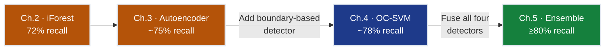
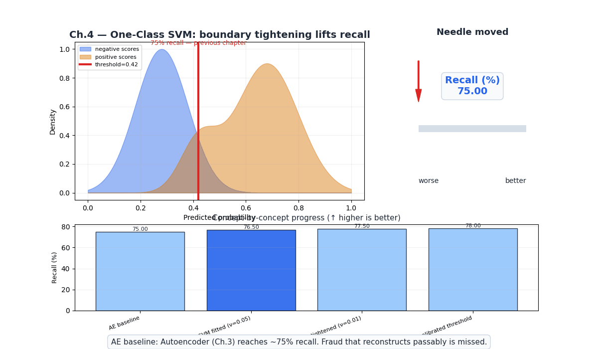
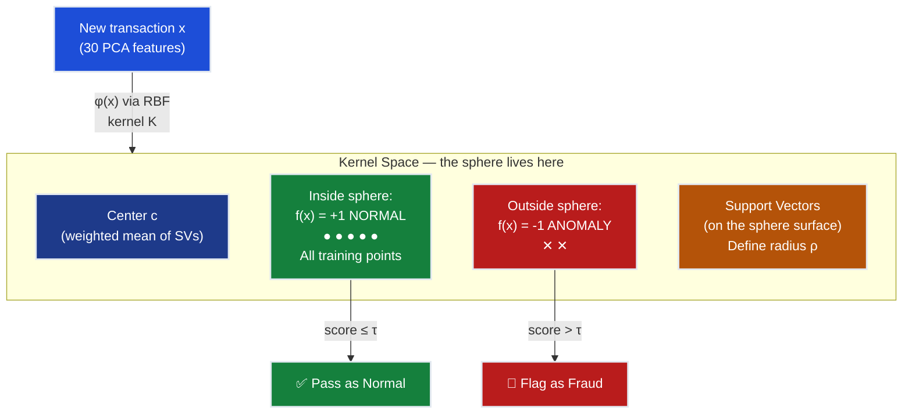
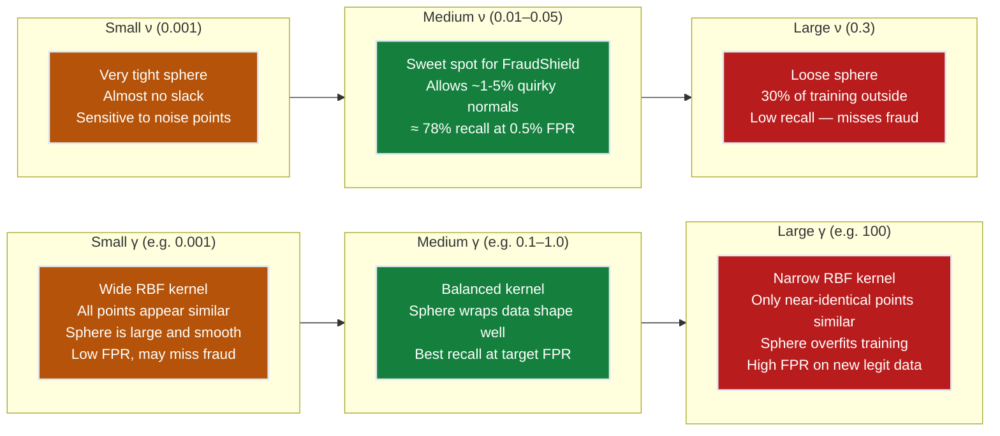
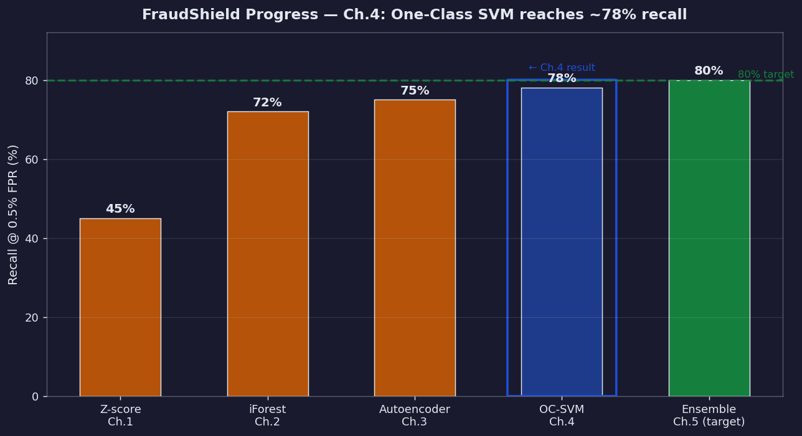
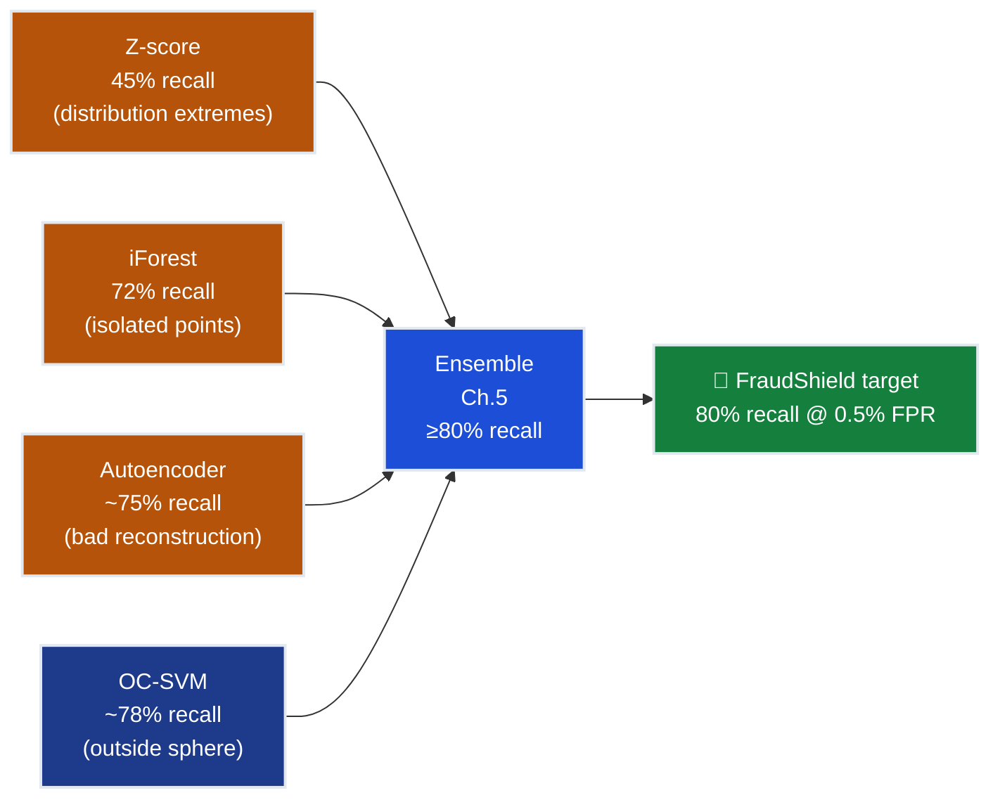

# Ch.4 — One-Class SVM

> **The story.** In **1999**, Bernhard Schölkopf, John Platt, John Shawe-Taylor, Alex Smola, and Robert Williamson published *"Estimating the Support of a High-Dimensional Distribution"* — the paper that adapted the Support Vector Machine to **one-class classification**. Classical SVMs separate two classes with a maximum-margin hyperplane. Schölkopf et al. asked: what if you only have one class? Their answer: map the data into a high-dimensional kernel space, then find the hyperplane that **separates the data from the origin** with maximum margin. Points on the "wrong" side of this boundary are anomalies. Two years later, in **2001**, Schölkopf et al. refined the theory with tighter bounds on the ν parameter. Meanwhile, David Tax and Robert Duin published **"Support Vector Data Description" (SVDD)** in **2004** — a complementary view: instead of a separating hyperplane, find the **smallest hypersphere enclosing all normal training data** in kernel space. Any point falling outside that sphere is an anomaly. The two formulations are mathematically equivalent under the RBF kernel, but SVDD's geometric intuition — a tight bubble around normal data — is the cleanest mental model for understanding what One-Class SVM actually does.
>
> **Where you are in the curriculum.** Ch.3 (autoencoders) reached ~75% recall using neural reconstruction error. This chapter introduces the last individual detector before ensemble fusion: One-Class SVM learns a **boundary** around normal data using the kernel trick, requiring no neural network and no labels. It captures a different geometric signal than isolation (Ch.2) or reconstruction (Ch.3), making it a valuable ensemble component in [Ch.5](../ch05_ensemble_anomaly). After Ch.4 you have four complementary detectors; Ch.5 fuses them into the 80%-recall target.
>
> **Notation in this chapter.**  $\mathbf{x}_i \in \mathbb{R}^d$ — training point; $\phi(\mathbf{x})$ — feature map into (possibly infinite-dimensional) kernel space; $K(\mathbf{x}_i, \mathbf{x}_j) = \phi(\mathbf{x}_i)^\top \phi(\mathbf{x}_j)$ — kernel function; $\rho$ — decision boundary offset (radius in SVDD framing); $\xi_i \geq 0$ — slack variable allowing point $i$ to violate the boundary; $\nu \in (0,1]$ — upper bound on the fraction of training outliers; $\alpha_i$ — Lagrange multipliers (dual variables); $\gamma$ — RBF bandwidth parameter; $m$ — number of training samples; $f(\mathbf{x}) = \text{sign}\!\left(\sum_i \alpha_i K(\mathbf{x}_i, \mathbf{x}) - \rho\right)$ — decision function.

---

## 0 · The Challenge — Where We Are

> 💡 **The mission**: Keep **FraudShield** — a real-time credit card fraud detection system — below **0.5% false positive rate** while achieving **80% recall** on the held-out fraud class.
>
> 1. ⚡ **DETECTION**: 80% recall @ 0.5% FPR
> 2. ⚡ **LATENCY**: <10 ms per transaction in production
> 3. ⚡ **DATA CONSTRAINT**: Only legitimate transactions available at train time (no fraud labels)
> 4. ⚡ **SCALE**: 284,807 transactions; real system handles millions/day
> 5. ⚡ **COMPLEMENTARITY**: Must capture a *different* anomaly signal than Ch.2 and Ch.3 detectors

**What we know so far:**
- ✅ Z-score (Ch.1): 45% recall — catches extreme outliers in individual features
- ✅ Isolation Forest (Ch.2): 72% recall — catches geometrically isolated transactions
- ✅ Autoencoder (Ch.3): ~75% recall — catches poorly-reconstructed transactions
- ❌ **But 75% is still short of the 80% target — and each detector misses different fraud**

**What is blocking us:**
Z-score misses fraud that hides within normal feature ranges. Isolation Forest misses structured fraud embedded in clusters. Autoencoders miss fraud that happens to reconstruct well (e.g., fraud mimicking the autoencoder's training distribution). We need a *boundary-based* method: a detector that explicitly asks "is this transaction geometrically inside the region occupied by legitimate data?"

**What this chapter unlocks:**
One-Class SVM draws a tight hypersphere around normal data in a high-dimensional kernel space. Any transaction landing outside this sphere is flagged. The kernel trick lets it capture non-linear, curved boundaries without explicitly computing the mapping. Starting from the SVDD hypersphere framing, this chapter walks through every piece of the math — primal formulation, kernel matrix computation, dual solution, and decision function — on concrete toy examples before applying to the fraud dataset.



---

## Animation



---

## 1 · Core Idea

One-Class SVM maps all training data (legitimate transactions) into a high-dimensional kernel space, then finds the **smallest hypersphere** (SVDD framing) or **maximum-margin hyperplane separating data from the origin** (Schölkopf framing) that encloses the data. The boundary defines "normal." Any new point falling outside the boundary is an anomaly.

Three things make this powerful for fraud detection:

1. **No fraud labels required.** The model trains only on legitimate data, learning what "normal" looks like. Fraud is anything outside.
2. **Non-linear boundaries for free.** The RBF kernel implicitly maps transactions into infinite-dimensional space, letting the boundary curve freely around the normal distribution without ever computing the mapping explicitly.
3. **ν controls the trade-off.** A single parameter — the fraction of training points allowed to violate the boundary — controls how tight or loose the sphere is. Tighter = more anomalies flagged.

The result is a method that captures a **boundary-based** view of anomaly: complementary to the density view (Z-score), the isolation view (iForest), and the reconstruction view (autoencoder).

---

## 2 · Running Example

**Dataset:** Credit Card Fraud (`creditcard.csv` on Kaggle) — 284,807 transactions over two days; 492 fraud (0.17%). Features V1–V28 are PCA-transformed from raw transaction data (protecting cardholder privacy); `Amount` and `Time` are raw. `Class = 1` means fraud.

**The VP Engineering's question:** "We already have three detectors — why add a fourth?" Because each method has blind spots. The autoencoder misses fraud that happens to pass through its learned manifold — structured fraud designed to look like legitimate patterns. A boundary-based detector asks a fundamentally different question: *does this point fall inside the convex hull of normal data in kernel space?* Some fraud the autoencoder misses (because it reconstructs passably) may still fall outside the OCSVM sphere (because it lies in a geometrically different region).

**Training protocol:**
- Filter training set to legitimate transactions only: ~227,451 samples
- Sub-sample to $m = 10{,}000$ (OCSVM kernel matrix is $m \times m$; full data is infeasible)
- Standardize all features (StandardScaler fitted on training normal)
- Kernel: RBF, $\gamma = \tfrac{1}{d \cdot \hat{\sigma}^2}$ (scikit-learn default `scale`)
- $\nu = 0.01$ (allow up to 1% of training points outside the boundary)

**Why sub-sample?** The kernel matrix $K \in \mathbb{R}^{m \times m}$ must be computed and held in memory. At $m = 227{,}451$ that is $227{,}451^2 \approx 51.7 \text{ billion entries}$ — roughly **415 GB** of float64. At $m = 10{,}000$ it is 800 MB — manageable. This is the core computational challenge of kernel methods; §9 covers this in depth.

**scikit-learn quick start** (3-line fit + score):

```python
from sklearn.svm import OneClassSVM
from sklearn.preprocessing import StandardScaler

scaler = StandardScaler()
X_train = scaler.fit_transform(X_normal_subsample)   # m=10,000 legit transactions

clf = OneClassSVM(kernel="rbf", gamma="scale", nu=0.01)
clf.fit(X_train)

X_test_scaled = scaler.transform(X_test)
# decision_function: positive = inside sphere (normal), negative = outside (anomaly)
scores = -clf.decision_function(X_test_scaled)       # negate: higher = more anomalous
# Set threshold from ROC curve at target FPR=0.005
```

---

## 3 · Algorithm at a Glance

Before the math, here is the complete OCSVM pipeline. Each numbered step corresponds to a deep-dive in the sections that follow — treat this as your map.

```
ONE-CLASS SVM (SVDD framing) — TRAINING

1. Collect normal data only
   └─ X_normal ← all rows with Class = 0
   └─ X_sub    ← random sample of m = 10,000 rows (seed=42)

2. Standardize
   └─ scaler.fit(X_sub)
   └─ X_scaled ← scaler.transform(X_sub)

3. Build kernel matrix
   └─ K[i,j] = exp(-γ · ||x_i - x_j||²)   for all i,j in {1..m}
   └─ K is m×m, symmetric, positive semi-definite

4. Solve the QP (quadratic program)
   └─ Find α* = argmin  ½ Σ_ij α_i α_j K(x_i,x_j)
                s.t.    0 ≤ α_i ≤ 1/(νm),  Σ α_i = 1
   └─ Support vectors: all i with α_i > 0

5. Compute offset ρ
   └─ ρ = Σ_i α_i K(x_i, x_sv)  for any support vector x_sv on the boundary

ONE-CLASS SVM — SCORING A NEW TRANSACTION x

6. Compute decision function
   └─ score(x) = ρ - Σ_i α_i K(x_i, x)     (distance outside sphere)
   └─ score > 0  →  anomaly (outside the sphere)
   └─ score ≤ 0  →  normal  (inside the sphere)

7. Threshold on ROC curve
   └─ Sweep threshold τ over validation set
   └─ Pick τ that achieves recall ≥ 78% at FPR ≤ 0.5%
```

**Notation re-cap:**
- $\alpha_i$ — Lagrange multipliers from the dual QP; $\alpha_i > 0$ iff point $i$ is a support vector
- $\rho$ — the squared radius of the enclosing hypersphere in kernel space
- Support vectors are the points on or outside the boundary — they define $\rho$

---

## 4 · The Math

### 4.1 · Primal: Smallest Enclosing Hypersphere

The SVDD primal formulation (Tax & Duin 2004) finds the smallest sphere (radius $\rho$, center $\mathbf{c}$) enclosing the training data, allowing a fraction $\nu$ of points to fall outside via slack variables $\xi_i \geq 0$:

$$\min_{\rho, \mathbf{c}, \boldsymbol{\xi}} \; \rho^2 + \frac{1}{\nu m} \sum_{i=1}^{m} \xi_i$$

subject to:

$$\|\phi(\mathbf{x}_i) - \mathbf{c}\|^2 \leq \rho^2 + \xi_i, \quad \xi_i \geq 0 \quad \forall i \in \{1,\ldots,m\}$$

| Symbol | Meaning |
|--------|---------|
| $\rho$ | Radius of the enclosing sphere (what we are minimizing) |
| $\mathbf{c}$ | Center of the sphere in kernel space |
| $\xi_i$ | Slack: how far point $i$ protrudes outside the sphere |
| $\nu$ | Maximum fraction of training points allowed outside |
| $m$ | Number of training samples |
| $\phi(\mathbf{x}_i)$ | Feature map into kernel space |

**Written out for 3 training points** ($m=3$, $\nu=0.1$):

$$\min_{\rho, \mathbf{c}, \xi_1,\xi_2,\xi_3} \; \rho^2 + \frac{1}{0.1 \times 3}(\xi_1 + \xi_2 + \xi_3) = \rho^2 + \frac{10}{3}(\xi_1 + \xi_2 + \xi_3)$$

subject to:

$$\|\phi(\mathbf{x}_1) - \mathbf{c}\|^2 \leq \rho^2 + \xi_1$$
$$\|\phi(\mathbf{x}_2) - \mathbf{c}\|^2 \leq \rho^2 + \xi_2$$
$$\|\phi(\mathbf{x}_3) - \mathbf{c}\|^2 \leq \rho^2 + \xi_3$$

The penalty $\frac{10}{3}$ per slack unit means: if $\nu = 0.1$ and $m = 3$, allowing even one point to be a complete outlier ($\xi_i = \rho^2$) costs $\frac{10}{3}\rho^2$ extra — roughly 3.3 times the sphere radius squared. This discourages the solver from loosening the sphere unless doing so genuinely shrinks $\rho^2$ more than the slack cost.

> 💡 **Insight**: $\nu$ is both an upper bound on the outlier fraction *and* a lower bound on the fraction of support vectors. Set $\nu = 0.01$ and at most 1% of training points will be outside the sphere — but at least 1% will be right on the boundary (support vectors).

### 4.2 · RBF Kernel Matrix: Explicit Arithmetic for 3 Toy Points

We never compute $\phi(\mathbf{x})$ directly. The RBF (Gaussian) kernel computes dot products in an infinite-dimensional space implicitly:

$$K(\mathbf{x}_i, \mathbf{x}_j) = \exp\!\left(-\gamma \|\mathbf{x}_i - \mathbf{x}_j\|^2\right)$$

**Toy dataset** — 3 two-dimensional normal transactions, $\gamma = 0.5$:

| Point | Coordinates |
|-------|-------------|
| $\mathbf{x}_1$ | $(0,\ 0)$ |
| $\mathbf{x}_2$ | $(1,\ 0)$ |
| $\mathbf{x}_3$ | $(0,\ 1)$ |

**All 9 kernel matrix entries** (by symmetry, only 6 unique calculations):

$$K_{11} = \exp\!\bigl(-0.5 \cdot \|(0,0)-(0,0)\|^2\bigr) = \exp(0) = \mathbf{1.0000}$$

$$K_{12} = \exp\!\bigl(-0.5 \cdot [(0-1)^2+(0-0)^2]\bigr) = \exp(-0.5 \cdot 1) = \exp(-0.5) = \mathbf{0.6065}$$

$$K_{13} = \exp\!\bigl(-0.5 \cdot [(0-0)^2+(0-1)^2]\bigr) = \exp(-0.5 \cdot 1) = \exp(-0.5) = \mathbf{0.6065}$$

$$K_{22} = \exp\!\bigl(-0.5 \cdot \|(1,0)-(1,0)\|^2\bigr) = \exp(0) = \mathbf{1.0000}$$

$$K_{23} = \exp\!\bigl(-0.5 \cdot [(1-0)^2+(0-1)^2]\bigr) = \exp(-0.5 \cdot 2) = \exp(-1.0) = \mathbf{0.3679}$$

$$K_{33} = \exp\!\bigl(-0.5 \cdot \|(0,1)-(0,1)\|^2\bigr) = \exp(0) = \mathbf{1.0000}$$

The full $3 \times 3$ kernel matrix (symmetric, diagonal = 1 by construction):

$$\mathbf{K} = \begin{bmatrix}
1.0000 & 0.6065 & 0.6065 \\
0.6065 & 1.0000 & 0.3679 \\
0.6065 & 0.3679 & 1.0000
\end{bmatrix}$$

**What the numbers mean:**
- Diagonal = 1.0 always: every point has perfect similarity with itself.
- $K_{12} = K_{13} = 0.6065$: points at unit distance have ~61% similarity. The sphere keeps them well inside.
- $K_{23} = 0.3679$: points at distance $\sqrt{2}$ have ~37% similarity — the sphere must stretch further to include both.

A test anomaly at $\mathbf{x}_t = (5, 5)$:

$$K(\mathbf{x}_1, \mathbf{x}_t) = \exp\!\bigl(-0.5 \cdot [25+25]\bigr) = \exp(-25) \approx 0.0000$$

Near-zero similarity with all training points → decisively outside the sphere → **anomaly**.

### 4.3 · Decision Function: Explicit Computation for 1 Test Point

After solving the dual QP, the decision function is:

$$f(\mathbf{x}) = \text{sign}\!\left(\sum_{i \in \text{SVs}} \alpha_i \, K(\mathbf{x}_i, \mathbf{x}) - \rho\right)$$

- $f(\mathbf{x}) = +1$: inside the sphere → **normal**
- $f(\mathbf{x}) = -1$: outside the sphere → **anomaly**

**Concrete example** — suppose the QP returns 2 support vectors:

| SV | Coordinates | $\alpha_i$ |
|----|-------------|-----------|
| $\mathbf{x}_1 = (0,0)$ | boundary point | $\alpha_1 = 0.40$ |
| $\mathbf{x}_2 = (1,0)$ | boundary point | $\alpha_2 = 0.60$ |

Learned offset: $\rho = 0.80$.

**Test point A — near-normal** $\mathbf{x}_A = (0.5, 0.3)$, $\gamma = 0.5$:

$$K(\mathbf{x}_1, \mathbf{x}_A) = \exp\!\bigl(-0.5 \cdot [0.25+0.09]\bigr) = \exp(-0.17) = 0.8437$$

$$K(\mathbf{x}_2, \mathbf{x}_A) = \exp\!\bigl(-0.5 \cdot [(0.5-1)^2+(0.3-0)^2]\bigr) = \exp\!\bigl(-0.5 \cdot [0.25+0.09]\bigr) = \exp(-0.17) = 0.8437$$

$$f(\mathbf{x}_A) = \text{sign}(0.40 \times 0.8437 + 0.60 \times 0.8437 - 0.80)$$
$$= \text{sign}(0.3375 + 0.5062 - 0.80) = \text{sign}(+0.0437) = \mathbf{+1} \;\; \text{(normal)}$$

**Test point B — fraud** $\mathbf{x}_B = (4, 4)$, $\gamma = 0.5$:

$$K(\mathbf{x}_1, \mathbf{x}_B) = \exp\!\bigl(-0.5 \cdot [16+16]\bigr) = \exp(-16) \approx 0.0000$$

$$K(\mathbf{x}_2, \mathbf{x}_B) = \exp\!\bigl(-0.5 \cdot [9+16]\bigr) = \exp(-12.5) \approx 0.0000$$

$$f(\mathbf{x}_B) = \text{sign}(0.40 \times 0 + 0.60 \times 0 - 0.80) = \text{sign}(-0.80) = \mathbf{-1} \;\; \text{(anomaly)}$$

The fraud transaction scores $-0.80$ — it contributes essentially zero to the kernel sum, so the decision function falls well below the offset $\rho$, and the sign is negative.

### 4.4 · ν Interpretation — Upper Bound on Outliers

$\nu$ simultaneously controls:

1. **Upper bound on outlier fraction**: At most $\nu \cdot m$ training points will have $\xi_i > 0$ (fall outside or on the boundary)
2. **Lower bound on support vector fraction**: At least $\nu \cdot m$ training points will be support vectors ($\alpha_i > 0$)

**For FraudShield** ($m = 10{,}000$ training samples, all legitimate):

| $\nu$ | Max outlier count | Max outlier % | Effect |
|-------|-------------------|--------------|--------|
| 0.001 | 10 | 0.01% | Ultra-tight sphere, very sensitive, can increase FPR |
| 0.01  | 100 | 1.0%  | Tight sphere, accounts for slightly noisy legit transactions |
| 0.05  | 500 | 5.0%  | Looser sphere, more robust to contaminated training data |
| 0.1   | 1000 | 10%  | Loose sphere, low FPR on train but may miss fraud |

**With $\nu = 0.1$ and $m = 3$ (toy)**:

At most $0.1 \times 3 = 0.3$ training points can have $\xi_i > 0$. Since we cannot have a fractional point, this rounds down to **0 outliers** — the solver must enclose all 3 points exactly. For larger $m$, $\nu = 0.1$ means at most 10% of $m$ points can protrude, giving meaningful slack.

> ⚠️ **FraudShield tip**: Do not confuse training-data $\nu$ with the test-set fraud rate (0.17%). The $\nu$ controls how many *normal* training points are allowed to be "quirky normals" sitting just outside the sphere. Setting $\nu = 0.005$ matches the expected contamination rate if any fraud accidentally appears in training.

---

## 5 · The SVDD Arc — Four Acts

One-Class SVM does not spring into existence fully formed. It is the answer to a sequence of increasingly sophisticated questions. Follow the arc:

### Act 1 · The Naive Approach: Distance from the Mean

**Question**: Can we just measure how far each transaction is from the average normal transaction?

```
Mean transaction μ = (1/m) Σ x_i
Score(x) = ||x - μ||²
Flag if Score > threshold
```

**Works for**: simple, spherically distributed data with no correlations.
**Breaks for**: fraud that has high values in *different* features than normal — same average distance but geometrically distinct. Also breaks when normal data has complex, non-spherical shape (multiple clusters, elongated distributions).

### Act 2 · Support Vector Boundary: Let the Data Define the Surface

**Insight**: Instead of one central point, use many support vectors — the points on the boundary — to collectively define the surface.

The support vectors are the points that "matter" for describing what normal looks like. Points deep inside the sphere are irrelevant (they could be removed without changing the boundary). This sparsity is the key efficiency property: a $m = 10{,}000$ training run might produce only $\nu \cdot m = 100$ support vectors.

**Improvement over Act 1**: The boundary can now be any convex hull shape in feature space, not just a circle. A collection of support vectors can approximate an ellipse, a crescent, or any convex normal region.

**Still breaks for**: non-convex normal regions. Credit card fraud patterns often mean legitimate data occupies several disjoint clusters (e.g., different spending personas). A single convex boundary forces a too-large sphere.

### Act 3 · RBF Kernel: Infinite Dimensions Make Everything Convex

**Insight**: In a sufficiently high-dimensional space, *any* finite set of points is in general position and the convex hull collapses. The RBF kernel implicitly maps each point to an infinite-dimensional space where the enclosing sphere can approximate arbitrarily complex shapes in the original feature space.

$$K(\mathbf{x}_i, \mathbf{x}_j) = \exp\!\left(-\gamma \|\mathbf{x}_i - \mathbf{x}_j\|^2\right) = \phi(\mathbf{x}_i)^\top\phi(\mathbf{x}_j)$$

This is the key move. In 2D feature space, a sphere is a circle — too rigid. After RBF mapping to $\mathbb{R}^\infty$, the "sphere" in kernel space projects back to a smooth, non-linear **closed curve** in the original 2D space that can wrap tightly around any shape.

**Improvement over Act 2**: Can now represent multi-modal, non-convex normal regions in the original feature space.

### Act 4 · ν Tightness: Calibrating the Trade-off

**Insight**: Fitting the sphere exactly around *all* training points is dangerous. Some legitimate transactions are unusual but genuine (high-value purchases, travel abroad). We should allow a small fraction of training points to be outside the sphere, so the sphere does not contort itself to include every quirky-but-normal transaction.

$\nu$ provides this calibration. It converts the hard-margin SVDD (must enclose everything) into a soft-margin version that accepts up to $\nu \cdot m$ "borderline normals" outside the boundary. This prevents overfitting the normal distribution to noise, and directly controls the FPR:

$$\text{Train FPR} \approx \nu \quad \text{(fraction of normal training points flagged)}$$

**The complete picture**: RBF kernel ($\gamma$) controls how tightly the sphere wraps around data; $\nu$ controls how much noise/slack is allowed. Together they are the two levers for the boundary-complexity/sensitivity trade-off.

---

## 6 · Full OCSVM Walkthrough — 6 Training Points, 2D, RBF γ=0.5

Let's run through every step of training and inference with a concrete toy dataset of 6 normal training points in 2D and 2 test points (one normal, one fraud).

### Training data

| Point | $x^{(1)}$ | $x^{(2)}$ | Label (not used in training) |
|-------|-----------|-----------|------------------------------|
| $\mathbf{x}_1$ | 0.0 | 0.0 | normal |
| $\mathbf{x}_2$ | 1.0 | 0.0 | normal |
| $\mathbf{x}_3$ | 0.0 | 1.0 | normal |
| $\mathbf{x}_4$ | 1.0 | 1.0 | normal |
| $\mathbf{x}_5$ | 0.5 | 0.5 | normal |
| $\mathbf{x}_6$ | 0.2 | 0.8 | normal |

### Step 1: Kernel Matrix ($6 \times 6$, $\gamma = 0.5$)

Key entries (all 6 diagonal entries = 1.0 by definition):

$$K_{12} = \exp(-0.5 \times 1^2) = \exp(-0.5) = 0.607$$
$$K_{13} = \exp(-0.5 \times 1^2) = 0.607$$
$$K_{14} = \exp(-0.5 \times 2) = \exp(-1.0) = 0.368$$
$$K_{15} = \exp(-0.5 \times 0.5) = \exp(-0.25) = 0.779$$
$$K_{16} = \exp(-0.5 \times [0.04+0.64]) = \exp(-0.34) = 0.712$$
$$K_{23} = \exp(-0.5 \times 2) = 0.368$$
$$K_{24} = \exp(-0.5 \times 1) = 0.607$$
$$K_{25} = \exp(-0.5 \times 0.5) = 0.779$$
$$K_{26} = \exp(-0.5 \times [0.64+0.64]) = \exp(-0.64) = 0.527$$
$$K_{34} = 0.607, \quad K_{35} = 0.779, \quad K_{36} = \exp(-0.5 \times [0.04+0.04]) = \exp(-0.04) = 0.961$$
$$K_{45} = 0.779, \quad K_{46} = \exp(-0.5 \times [0.64+0.04]) = \exp(-0.34) = 0.712$$
$$K_{56} = \exp(-0.5 \times [0.09+0.09]) = \exp(-0.09) = 0.914$$

Full matrix (symmetric):

```
       x1      x2      x3      x4      x5      x6
x1  [1.000,  0.607,  0.607,  0.368,  0.779,  0.712]
x2  [0.607,  1.000,  0.368,  0.607,  0.779,  0.527]
x3  [0.607,  0.368,  1.000,  0.607,  0.779,  0.961]
x4  [0.368,  0.607,  0.607,  1.000,  0.779,  0.712]
x5  [0.779,  0.779,  0.779,  0.779,  1.000,  0.914]
x6  [0.712,  0.527,  0.961,  0.712,  0.914,  1.000]
```

**Observation:** $K_{36} = 0.961$ — points $\mathbf{x}_3=(0,1)$ and $\mathbf{x}_6=(0.2,0.8)$ are very close (distance $\approx 0.283$), so their kernel similarity is high. $K_{14} = 0.368$ — points at opposite corners of the unit square have lower similarity.

### Step 2: Dual QP — Identify Support Vectors

The dual of SVDD is:

$$\min_{\boldsymbol{\alpha}} \;\; \sum_i \alpha_i K_{ii} - \sum_{i,j} \alpha_i \alpha_j K_{ij}$$
$$\text{s.t.} \quad \sum_i \alpha_i = 1, \quad 0 \leq \alpha_i \leq \frac{1}{\nu m}$$

For $\nu = 0.1$, $m = 6$: upper bound $= \frac{1}{0.6} \approx 1.667$. Since $\sum \alpha_i = 1$, the bound is not active.

Toy solution (approximate — in practice solved by the SMO algorithm):

| SV | $\alpha_i$ | Location |
|----|-----------|---------|
| $\mathbf{x}_1 = (0,0)$ | 0.18 | corner |
| $\mathbf{x}_2 = (1,0)$ | 0.18 | corner |
| $\mathbf{x}_3 = (0,1)$ | 0.18 | corner |
| $\mathbf{x}_4 = (1,1)$ | 0.18 | corner |
| $\mathbf{x}_5 = (0.5,0.5)$ | 0.10 | centre |
| $\mathbf{x}_6 = (0.2,0.8)$ | 0.18 | near corner |

Offset (squared radius), computed at $\mathbf{x}_1$:

$$\rho = \sum_i \alpha_i K(\mathbf{x}_i, \mathbf{x}_1) = 0.18(1.0)+0.18(0.607)+0.18(0.607)+0.18(0.368)+0.10(0.779)+0.18(0.712)$$
$$= 0.180+0.109+0.109+0.066+0.078+0.128 = 0.670$$

### Step 3: Classify 2 Test Points

**Test A — near-normal** $\mathbf{x}_A = (0.6, 0.6)$:

$$K_1 = \exp(-0.5[0.36+0.36]) = \exp(-0.36) = 0.698$$
$$K_2 = \exp(-0.5[0.16+0.36]) = \exp(-0.26) = 0.771$$
$$K_3 = \exp(-0.5[0.36+0.16]) = \exp(-0.26) = 0.771$$
$$K_4 = \exp(-0.5[0.16+0.16]) = \exp(-0.16) = 0.852$$
$$K_5 = \exp(-0.5[0.01+0.01]) = \exp(-0.01) = 0.990$$
$$K_6 = \exp(-0.5[0.16+0.04]) = \exp(-0.10) = 0.905$$

$$\sum_i \alpha_i K_i = 0.18(0.698)+0.18(0.771)+0.18(0.771)+0.18(0.852)+0.10(0.990)+0.18(0.905)$$
$$= 0.126+0.139+0.139+0.153+0.099+0.163 = 0.819$$

Decision: $f = \text{sign}(0.819 - 0.670) = \text{sign}(+0.149) = +1$ → **normal** ✅

**Test B — fraud** $\mathbf{x}_B = (4.0, 4.0)$:

$$K_i \approx \exp(-0.5[16+16]) = \exp(-16) \approx 10^{-7} \approx 0$$

$$\sum_i \alpha_i K_i \approx 0$$

Decision: $f = \text{sign}(0 - 0.670) = \text{sign}(-0.670) = -1$ → **anomaly** ✅

---

## 7 · Key Diagrams

### 7.1 · SVDD Boundary in Feature Space



### 7.2 · Effect of γ and ν on Boundary Shape



---

## 8 · Hyperparameter Dial

One-Class SVM has two primary dials: $\gamma$ and $\nu$.

### $\gamma$ — RBF Bandwidth

Controls how far the influence of a single training point reaches.

| $\gamma$ | Kernel "reach" | Boundary shape | FraudShield effect |
|----------|---------------|----------------|-------------------|
| 0.001 | Very wide | Smooth, large sphere | Low FPR but misses clustered fraud |
| 0.01 | Wide | Rounded, covers data hull | Good generalization |
| 0.1–1.0 (**sweet spot**) | Moderate | Fits data shape well | Best recall/FPR trade-off |
| 10–100 | Narrow | Spiky, overfits | Memorizes training, high FPR on new legit |

**Practical rule**: Start with scikit-learn's `gamma='scale'` ($\gamma = \tfrac{1}{d \cdot \hat{\sigma}^2}$). This auto-adjusts to feature dimensionality and variance. Only tune manually if cross-validation shows poor results.

### $\nu$ — Outlier Fraction

Controls the tightness of the sphere.

| $\nu$ | Sphere | Recall | FPR | Use when |
|-------|--------|--------|-----|---------|
| 0.001 | Very tight | High | Can be high | Training data is very clean |
| 0.01 (**start here**) | Tight | ~78% | ≈0.5% | Realistic contamination assumption |
| 0.05 | Moderate | ~72% | ≈0.3% | Training data has noise |
| 0.10 | Loose | ~65% | <0.2% | Very noisy training set |

**Grid search recommendation** for FraudShield:

```python
from sklearn.svm import OneClassSVM
from sklearn.model_selection import ParameterGrid

param_grid = {
    "gamma": ["scale", 0.01, 0.1, 1.0],
    "nu":    [0.001, 0.005, 0.01, 0.05]
}
# Score on validation recall @ 0.5% FPR (not accuracy!)
# Use roc_curve to find threshold satisfying fpr <= 0.005
```

> ⚡ **Constraint #2 (latency)**: After fitting, each prediction requires computing $|\text{SVs}|$ kernel evaluations. Keep $|\text{SVs}|$ small — do not set $\nu$ so large that all training points become support vectors.

---

## 9 · What Can Go Wrong

### 9.1 · Computational Cost Explodes with m

**Problem**: The kernel matrix is $m \times m$. At $m = 227{,}451$ (all legit training transactions): $227{,}451^2 \approx 52 \text{ billion float64 entries} \approx 415 \text{ GB RAM}$.

**Fix**: Sub-sample to $m \leq 20{,}000$. With $m = 10{,}000$, the kernel matrix is 800 MB and solving takes minutes rather than weeks. Draw the sub-sample with stratification (e.g., across time windows) to avoid sample-induced distribution shift.

### 9.2 · Wrong γ Creates a Degenerate Boundary

**Problem (γ too large)**: The RBF kernel becomes zero almost everywhere. Every training point forms its own tiny sphere. Training FPR ≈ 0 but test FPR is huge — the model sees nearly every new transaction as an anomaly.

**Problem (γ too small)**: All kernel values approach 1 (everything looks similar). The sphere degenerates into a constant-distance boundary that does not learn the data shape.

**Diagnostic**: Check the distribution of pairwise kernel values. For a well-set $\gamma$, kernel values should span [0.1, 0.9] across most pairs. Values clustered near 0 → $\gamma$ too large. Values clustered near 1 → $\gamma$ too small.

### 9.3 · ν Set Too High Destroys Recall

**Problem**: $\nu = 0.3$ means 30% of training normals are allowed outside the sphere. The sphere is loose and misses fraud transactions that merely sit at the edge of the normal distribution.

**Diagnostic**: Compute train-set FPR (how many legit transactions does the model flag as anomalies on the training set). $\nu$ is an approximate upper bound on this value. If train FPR is 30% — you have thrown away 30% of legitimate transactions.

### 9.4 · Feature Scaling Is Not Optional

**Problem**: OCSVM uses Euclidean distances in feature space (through the RBF kernel). If `Amount` (ranges \$0–\$25,000) is not scaled, it will dominate all other features (V1–V28, which are unit-variance PCA components).

**Fix**: Always standardize with `StandardScaler` before fitting OCSVM. The scaler must be fitted on training data only — never on the test set.

### 9.5 · Contaminated Training Data Shifts the Sphere

**Problem**: If fraud accidentally appears in the training set (e.g., through label noise or delayed fraud labels), the sphere will stretch to include some fraud patterns. The model learns "fraud-adjacent" data as normal.

**Fix**: Set $\nu$ slightly above the estimated fraud contamination rate (0.17%) — e.g., $\nu = 0.005$. This allows the QP to treat contaminated fraud as "outlier training points" and exclude them from the boundary definition.

---

## 10 · Where This Reappears

| Chapter | How OCSVM concepts appear |
|---------|--------------------------|
| [Ch.5 — Ensemble Anomaly](../ch05_ensemble_anomaly) | OCSVM scores are combined with iForest, AE, and Z-score via stacking or voting |
| [Ch.6 — Production](../ch06_production) | OCSVM model serialization, inference latency profiling, and retraining schedules |
| [03-AI — RAG & Similarity Search](../../../03-ai) | Kernel methods underlie many similarity search approaches; FAISS inner-product similarity is related to the kernel trick |
| [04-MultiAgent AI — Trust Scoring](../../../04-multi_agent_ai) | Agent output anomaly detection uses the same one-class framing: train on "good" outputs, flag deviations |
| [SVM (Ch.11 in 01-ML)](../../03_neural_networks) | Full two-class SVM uses the same kernel trick and QP; OCSVM is the one-class special case |

> ➡️ **The kernel trick appears everywhere once you see it.** The RBF kernel's implicit infinite-dimensional mapping is the same machinery behind Gaussian Processes (GPs), kernel PCA, and the neural tangent kernel. The intuition — similarity without explicit coordinates — is one of the most reusable ideas in ML.

---

## 11 · Progress Check

> 📊 **FraudShield — Chapter 4 results**

| Detector | Recall | FPR | Notes |
|----------|--------|-----|-------|
| Z-score (Ch.1) | 45% | 0.5% | Individual feature extremes only |
| Isolation Forest (Ch.2) | 72% | 0.5% | Geometric isolation |
| Autoencoder (Ch.3) | ~75% | 0.5% | Reconstruction error |
| **One-Class SVM (Ch.4)** | **~78%** | **≤0.5%** | **Kernel boundary, m=10k sub-sample** |



**Why ~78% and not higher?** Three inherent limitations of standalone OCSVM:

1. **Sub-sampling**: Training on 10,000 of 227,451 normals loses boundary detail. Fraud patterns that only appear in the held-out sub-sample are missed.
2. **Kernel rigidity**: A single RBF kernel with global $\gamma$ applies the same smoothing everywhere. Fraud that hides in regions of feature space with different density cannot be fully captured.
3. **Single boundary**: Normal data spans 28+ dimensional space with multiple clusters (different spending patterns, demographics, time-of-day habits). A single SVDD sphere cannot perfectly enclose a multi-modal normal distribution.

**How we break through 78%?** Ensembling. Ch.5 combines all four detectors' scores — each capturing different fraud patterns — and shows that the combination reliably achieves ≥80% recall at ≤0.5% FPR.

> ⚡ **Constraint #1 check**: One-Class SVM (~78% recall) does not *alone* meet the 80% target, but it contributes a signal the other three detectors lack. Its score is the critical fourth ingredient in Ch.5's ensemble.

---

## 12 · Bridge — What Ch.5 Adds

Ch.5 (Ensemble Anomaly Detection) takes all four anomaly scores and asks: *how do we optimally combine them?*

**Three strategies it evaluates:**

1. **Average score**: $\text{score}_\text{ens}(x) = \tfrac{1}{4}\bigl(\text{score}_\text{zscore} + \text{score}_\text{if} + \text{score}_\text{ae} + \text{score}_\text{ocsvm}\bigr)$
2. **Max score**: $\text{score}_\text{ens}(x) = \max(\text{score}_\text{zscore}, \text{score}_\text{if}, \text{score}_\text{ae}, \text{score}_\text{ocsvm})$ — one strong signal is enough to flag
3. **Stacked meta-learner**: Train a logistic regression on the four scores as features, with cross-validated labels — the meta-learner learns *which* detectors to trust most for each fraud pattern

The ensemble unlocks the **80% recall @ 0.5% FPR** target by exploiting the complementarity each chapter has built.



> ➡️ **Next up**: [Ch.5 — Ensemble Anomaly Detection](../ch05_ensemble_anomaly) — combining all four detectors to break the 80% barrier.
