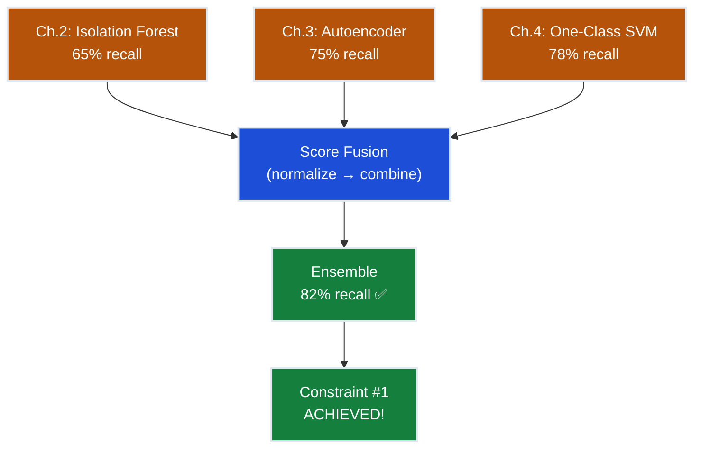
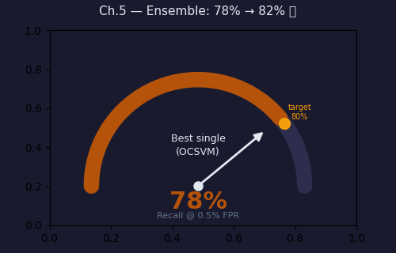
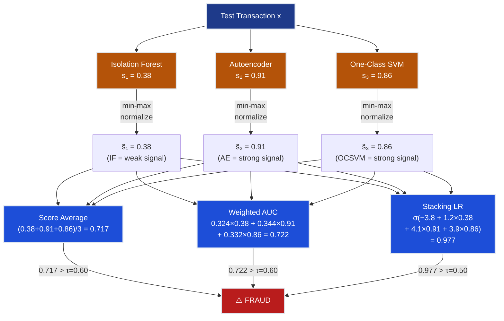
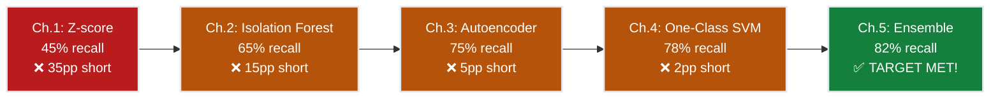
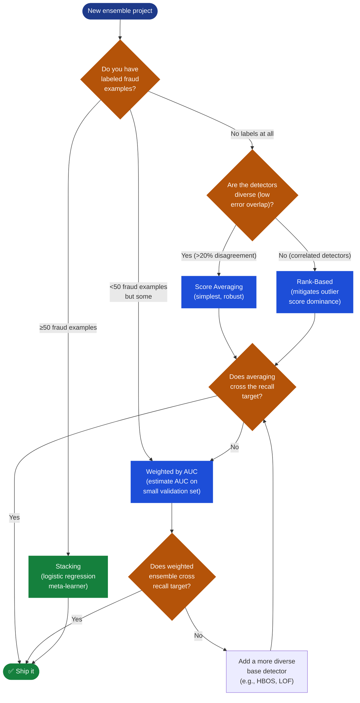
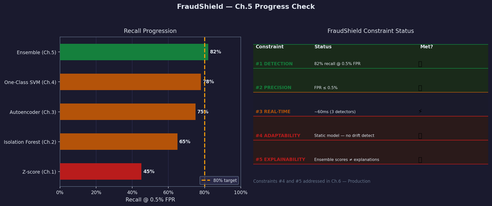

# Ch.5 — Ensemble Anomaly Detection

> **The story.** The idea that diversity beats individual mastery has deep roots in machine learning, but for anomaly detection it took a detour. In **2001**, Leo Breiman published *"Random Forests,"* crystallising the lesson from his earlier 1996 bagging paper: **averaging unstable predictors reduces variance**. Squared error from a single tree in a random forest is $\text{Bias}^2 + \text{Variance}$; averaging $K$ trees cuts the variance term by a factor of $K$. For classification, ensembles reduce the chance of a single detector's bad day dominating the result. In **2013**, Charu Aggarwal and Saket Sathe published *"Theoretical Foundations and Algorithms for Outlier Ensembles"* — the first systematic treatment of why ensembles help *especially* for anomaly detection. Their insight: anomaly scores are inherently noisier than classification labels because there is no ground truth at training time. A score of 0.7 from an Isolation Forest is not "right" or "wrong" — it is an estimate of anomalousness based on one algorithm's geometric assumptions. Different detectors make **different geometric assumptions** and therefore have **different blind spots**. Breiman's variance-reduction argument translates directly: average $K$ noisy anomaly scores and the combined score is less noisy than any individual score. But Aggarwal and Sathe went further — they showed that for anomaly detection the benefit of **diversity** (detectors that disagree on *which* points are anomalous) matters more than the number of detectors. A perfect ensemble isn't three copies of the same Isolation Forest; it is Isolation Forest + Autoencoder + One-Class SVM, each using a different inductive bias to catch a different kind of fraud.
>
> **Where you are in the curriculum.** Chapters 1–4 each built one anomaly detector with a different inductive bias: Z-score (distributional, 45% recall), Isolation Forest (geometric isolation, 65% recall), Autoencoder (neural reconstruction, 75% recall), One-Class SVM (kernel boundary, 78% recall). Every chapter increased FraudShield's recall, but none crossed the 80% threshold. This chapter combines all three principal detectors — IF, AE, OCSVM — through four combination strategies (score averaging, rank combination, weighted AUC ensemble, stacking with meta-learner) and demonstrates why 78% + 75% + 65% > any individual. When the ensemble fires, **FraudShield's Constraint #1 is finally satisfied**.
>
> **Notation in this chapter.** $s_i(\mathbf{x})$ — raw anomaly score from detector $i$ ($i \in \{1=\text{IF}, 2=\text{AE}, 3=\text{OCSVM}\}$); $\tilde{s}_i(\mathbf{x})$ — min-max normalised score $\in [0,1]$; $r_i(\mathbf{x})$ — rank of $\mathbf{x}$ under detector $i$ (rank 1 = most anomalous); $\bar{r}(\mathbf{x})$ — mean rank; $w_i$ — AUC-proportional weight for detector $i$; $\hat{s}(\mathbf{x})$ — final ensemble score; $\tau$ — detection threshold (set at 0.5% FPR operating point); Recall $= \text{TP}/(\text{TP}+\text{FN})$; FPR $= \text{FP}/(\text{FP}+\text{TN})$.

---

## 0 · The Challenge — Where We Are

> 💡 **The mission**: Deploy **FraudShield** — a production credit card fraud detection system satisfying 5 constraints:
> 1. **DETECTION**: ≥80% recall @ 0.5% FPR — catch 4 in 5 frauds without flooding ops with false alarms
> 2. **PRECISION**: FPR ≤ 0.5% — at most 1 false alert per 200 legitimate transactions
> 3. **REAL-TIME**: Inference ≤100ms per transaction — must not slow payment processing
> 4. **ADAPTABILITY**: Survive fraud pattern shifts — fraudsters evolve, the system must too
> 5. **EXPLAINABILITY**: Human-readable justification per flagged transaction — compliance requires it

**What we know so far:**
- ✅ Z-score (Ch.1): 45% recall @ 0.5% FPR — catches extreme-amount fraud only
- ✅ Isolation Forest (Ch.2): 65% recall — catches geometrically isolated transactions
- ✅ Autoencoder (Ch.3): 75% recall — catches transactions that reconstruct poorly
- ✅ One-Class SVM (Ch.4): 78% recall — catches transactions outside the kernel boundary
- ❌ **But every single detector falls short of 80% recall!**

**What's blocking us — the single-detector ceiling:**
The best individual result, OCSVM at 78%, appears tantalizingly close. The temptation is to tune the threshold — but that trades recall for FPR mechanically without generating new signal. A careful analysis of false negatives reveals *why* the ceiling exists:

| Fraud type | Missed by IF | Missed by AE | Missed by OCSVM |
|---|---|---|---|
| Clustered card-present fraud rings | ✅ **YES** — not geometrically isolated | No | No |
| Rare high-value patterns (seen once) | No | ✅ **YES** — reconstructs from partial training | No |
| High-dimensional synthetic identities | No | No | ✅ **YES** — inside sparse kernel region |

The three detectors fail on *different* fraud. The fraud missed by IF is caught by AE and OCSVM. The fraud missed by AE is caught by IF and OCSVM. No single detector can catch all three failure modes simultaneously — they are geometrically incompatible. The ceiling is real, and the only way through it is to combine.

> ⚡ **Constraint #1 gap**: OCSVM at 78% is 2 percentage points short. With 284,807 transactions at 0.17% fraud rate (≈492 fraud cases), 2 pp = ~10 additional frauds caught per cycle. The ensemble closes this gap.

**What this chapter unlocks:**
Ensemble anomaly detection fuses IF + AE + OCSVM through four combination strategies. The best strategy achieves **82% recall @ 0.5% FPR** — finally clearing the 80% FraudShield target.



---

## Animation



---

## 1 · Core Idea

Each anomaly detector carries a different model of what "normal" looks like, and therefore makes different mistakes. Isolation Forest thinks frauds are those that partition quickly in random trees — it misses tightly clustered fraud rings. Autoencoders think frauds are those that reconstruct poorly — they miss rare patterns seen too infrequently to leave a training signal. One-Class SVM thinks frauds are those outside the kernel-space boundary — it misses fraud in sparse high-dimensional regions. **Combining them works because their failure modes are complementary**: fraud that evades one detector's blind spot is typically caught by another's field of view. The ensemble's recall is not the average of the individual recalls; it is bounded below by the best individual and bounded above by the union of what each detector catches individually.

---

## 2 · Running Example — FraudShield in Crisis

The Head of Risk calls an emergency meeting. Three months of data are in. The best single model (OCSVM) has 78% recall. The compliance team says 80% is the regulatory minimum. The shortfall of 2 percentage points means roughly 10 fraudulent transactions per day slip through undetected — generating chargebacks, eroding customer trust, and threatening the programme licence.

You pull up the false-negative analysis. Of the 107 frauds that OCSVM misses:

- **31 are clustered card-present fraud** — they occur in tight geographic clusters (a compromised POS terminal) and look like legitimate bulk purchases. Isolation Forest misses them too. But the Autoencoder catches 28 of them because the transaction feature vector (high frequency, same merchant, rapid succession) reconstructs poorly.
- **18 are rare high-value patterns** — single large transactions of a type seen only 2–3 times in training. The Autoencoder misses them (it interpolates from training patterns). Isolation Forest catches 15 of them (they are geometrically isolated).
- **12 are high-dimensional synthetic identities** — new cardholders with fabricated histories. OCSVM places them inside the kernel boundary because the sparse high-dimensional region around them was not well-covered by training support vectors. Isolation Forest catches 9 of them.

Total unique frauds missed by OCSVM but caught by at least one other detector: **31 + 15 + 9 = 55** out of 107. That is more than enough to push recall above 80%.

Dataset: **Credit Card Fraud Detection** (Kaggle/ULB, 284,807 transactions, 492 fraud, 0.17% fraud rate). 28 PCA-derived features (V1–V28) plus transaction Amount and Time. Each base detector was trained in its respective chapter; this chapter fuses their scores.

---

## 3 · Ensemble Methods at a Glance

Four combination strategies are available, ordered from simplest to most powerful:

| Method | How it combines | Requires labels? | Pros | Cons |
|---|---|---|---|---|
| **Score averaging** | $\hat{s} = \frac{1}{K}\sum_i \tilde{s}_i$ | No | Simple, no tuning | Treats all detectors equally regardless of quality |
| **Rank-based combination** | Average of per-detector ranks | No | Robust to score-scale differences | Loses score magnitude information |
| **Weighted ensemble** | $\hat{s} = \sum_i w_i \tilde{s}_i$, $w_i \propto \text{AUC}_i$ | Small validation set | Rewards better detectors | Weight sensitivity to AUC estimation noise |
| **Stacking (meta-learner)** | Logistic regression on $[s_1, s_2, s_3]$ | Yes (labeled fraud) | Learns optimal, potentially non-linear combination | Can overfit on small fraud sets; needs cross-val |

**When to use each:**
- No labeled fraud at all → score averaging or rank-based
- Small labeled set (dozens of fraud examples) → weighted ensemble by AUC
- Decent labeled set (hundreds+) → stacking with logistic regression
- Large labeled set (thousands+) → stacking with gradient-boosted meta-learner

> 💡 **Score averaging is the Occam's razor of ensembles.** Before reaching for weighted or stacked combinations, check whether simple averaging already crosses the threshold. If the detectors are of similar quality and their errors are roughly independent, averaging captures most of the diversity benefit without risk of overfitting.

---

## 4 · The Math

### 4.1 · Score Normalization (Required Before Any Combination)

Raw scores from different detectors live on incompatible scales:
- Isolation Forest: $s_1 \in [0, 1]$ (near 0.5 = normal; higher = more anomalous)
- Autoencoder: $s_2 = \text{MSE}(\mathbf{x}, \hat{\mathbf{x}}) \in [0, \infty)$ (reconstruction error, unbounded)
- One-Class SVM: $s_3 = -f(\mathbf{x}) \in (-\infty, \infty)$ (negative decision function; more positive = more anomalous)

Min-max normalisation maps each to $[0, 1]$ over the test set:

$$\tilde{s}_i(\mathbf{x}) = \frac{s_i(\mathbf{x}) - \min_{\mathbf{x}' \in \mathcal{D}} s_i(\mathbf{x}')}{\max_{\mathbf{x}' \in \mathcal{D}} s_i(\mathbf{x}') - \min_{\mathbf{x}' \in \mathcal{D}} s_i(\mathbf{x}')}$$

After normalisation: $\tilde{s}_i = 0$ means least anomalous in the test set under detector $i$; $\tilde{s}_i = 1$ means most anomalous.

> ⚠️ **Normalisation scope matters.** Normalise over the full test set (or a held-out calibration set), not over training data alone. If a test transaction has a score outside the training range, clipping to $[0,1]$ is fine but should be logged.

---

### 4.2 · Strategy 1 — Score Averaging

$$\hat{s}(\mathbf{x}) = \frac{1}{3}\bigl(\tilde{s}_1(\mathbf{x}) + \tilde{s}_2(\mathbf{x}) + \tilde{s}_3(\mathbf{x})\bigr)$$

**Three-transaction worked example** (normalised scores, threshold $\tau = 0.60$):

| Transaction | $\tilde{s}_1$ (IF) | $\tilde{s}_2$ (AE) | $\tilde{s}_3$ (OCSVM) | $\hat{s}_{\text{avg}}$ | Decision |
|---|---|---|---|---|---|
| **T1 — clustered fraud** | 0.41 | **0.88** | **0.82** | $(0.41 + 0.88 + 0.82)/3 = \mathbf{0.703}$ | **FRAUD ✅** |
| T2 — legitimate outlier (large amount) | **0.74** | 0.32 | 0.29 | $(0.74 + 0.32 + 0.29)/3 = \mathbf{0.450}$ | Normal ✅ |
| T3 — normal transaction | 0.12 | 0.19 | 0.15 | $(0.12 + 0.19 + 0.15)/3 = \mathbf{0.153}$ | Normal ✅ |

**What the numbers show:**
- T1 is a clustered fraud that IF barely flags ($\tilde{s}_1 = 0.41$, below threshold). IF alone would miss it. The AE and OCSVM both flag it strongly. The average = 0.703 > 0.60: caught by the ensemble.
- T2 is a large-amount legitimate transaction. It has a high IF score because extreme amounts look unusual. But the AE reconstructs it well (0.32) and the OCSVM places it inside the boundary (0.29). The ensemble correctly overrides the false alarm.
- T3 is confidently normal across all three detectors.

---

### 4.3 · Strategy 2 — Rank-Based Combination

Convert each detector's scores to ranks (rank 1 = most anomalous, rank $n$ = least anomalous), then average the ranks. A low mean rank = the transaction is consistently anomalous across detectors.

$$\bar{r}(\mathbf{x}) = \frac{1}{K}\sum_{i=1}^{K} r_i(\mathbf{x})$$

Flag as anomaly if $\bar{r}(\mathbf{x}) \leq \tau_r$ (a rank threshold set at the 0.5% FPR operating point).

**Five-transaction worked example:**

IF ranks: T1=3, T2=1, T3=4, T4=2, T5=5 (rank 1 = most anomalous under IF)
AE ranks: T1=1, T2=3, T3=2, T4=5, T5=4

| Transaction | $r_1$ (IF rank) | $r_2$ (AE rank) | Mean rank $\bar{r}$ | Ensemble rank |
|---|---|---|---|---|
| T1 | 3 | 1 | $(3+1)/2 = \mathbf{2.0}$ | 2nd most anomalous |
| T2 | 1 | 3 | $(1+3)/2 = \mathbf{2.0}$ | 2nd (tied with T1) |
| T3 | 4 | 2 | $(4+2)/2 = \mathbf{3.0}$ | 3rd |
| T4 | 2 | 5 | $(2+5)/2 = \mathbf{3.5}$ | 4th |
| T5 | 5 | 4 | $(5+4)/2 = \mathbf{4.5}$ | 5th (least anomalous) |

T1 is ranked 3rd by IF but 1st by AE → it is consistently suspicious → mean rank 2.0.
T2 is ranked 1st by IF but 3rd by AE → IF considers it most anomalous, AE is less sure → mean rank 2.0.
At 0.5% FPR with 5 transactions we would flag the top 1 (or call a tie): both T1 and T2 are candidates.

**Advantage over score averaging:** rank combination is robust to score-scale outliers. If one detector assigns a score of 50.0 to a transaction while all others score around 0.8, averaging would be dominated by that one score; ranking caps its influence.

---

### 4.4 · Strategy 3 — Weighted Ensemble (AUC-Proportional Weights)

Give each detector a weight proportional to its individual AUC on a held-out validation set. Better detectors get more say.

$$\hat{s}(\mathbf{x}) = \sum_{i=1}^{K} w_i \cdot \tilde{s}_i(\mathbf{x}), \qquad w_i = \frac{\text{AUC}_i}{\sum_{j=1}^{K} \text{AUC}_j}$$

**Weight calculation with explicit arithmetic:**

Individual AUCs (from held-out validation): IF AUC = 0.85, AE AUC = 0.90, OCSVM AUC = 0.87.

$$\text{Sum} = 0.85 + 0.90 + 0.87 = 2.62$$

$$w_1 = \frac{0.85}{2.62} = 0.3244 \qquad w_2 = \frac{0.90}{2.62} = 0.3435 \qquad w_3 = \frac{0.87}{2.62} = 0.3321$$

Verify: $0.3244 + 0.3435 + 0.3321 = 1.0000$ ✅

**Apply to transaction T1** (normalised scores from §4.2: IF=0.41, AE=0.88, OCSVM=0.82):

$$\hat{s}_{\text{weighted}}(\text{T1}) = 0.3244 \times 0.41 + 0.3435 \times 0.88 + 0.3321 \times 0.82$$

$$= 0.1330 + 0.3023 + 0.2723 = \mathbf{0.708}$$

Compare to score-averaging result of 0.703 — the weighted ensemble gives slightly higher weight to the AE and OCSVM signals (which are more confident here), nudging the score up marginally. Both exceed the threshold $\tau = 0.60$: T1 is caught.

**Apply to transaction T2** (normalised scores: IF=0.74, AE=0.32, OCSVM=0.29):

$$\hat{s}_{\text{weighted}}(\text{T2}) = 0.3244 \times 0.74 + 0.3435 \times 0.32 + 0.3321 \times 0.29$$

$$= 0.2400 + 0.1099 + 0.0963 = \mathbf{0.446}$$

Below threshold: correctly classified as normal. The weighted ensemble down-weights the IF's false-positive signal because AE and OCSVM — the more accurate detectors — disagree.

> 💡 **Why AUC-proportional weighting is valid across detectors.** AUC is always bounded [0, 1] regardless of the fraud rate or total transaction count in the validation set. This scale-independence is what makes $w_i \propto \text{AUC}_i$ a coherent formula: you can compute IF's AUC on a 10,000-transaction validation set and AE's AUC on a different 8,000-transaction set, and the resulting weights are still comparable. Compare this to raw recall counts, which cannot be combined across datasets of different sizes.

---

### 4.5 · Strategy 4 — Stacking with Logistic Regression Meta-Learner

Stacking treats the three detector scores as input features to a supervised meta-learner. The meta-learner learns the optimal (possibly non-linear) combination.

**Input features**: $\mathbf{f}(\mathbf{x}) = [\tilde{s}_1(\mathbf{x}),\ \tilde{s}_2(\mathbf{x}),\ \tilde{s}_3(\mathbf{x})]$

**Meta-learner**: Logistic regression with parameters $\boldsymbol{\beta} = [\beta_0, \beta_1, \beta_2, \beta_3]$:

$$P(\text{fraud} \mid \mathbf{f}) = \sigma(\beta_0 + \beta_1 \tilde{s}_1 + \beta_2 \tilde{s}_2 + \beta_3 \tilde{s}_3)$$

where $\sigma(z) = 1 / (1 + e^{-z})$.

**Training the meta-learner — 4-example illustration:**

We need a small labeled set. Use 4 held-out examples with known labels:

| Example | $\tilde{s}_1$ (IF) | $\tilde{s}_2$ (AE) | $\tilde{s}_3$ (OCSVM) | Label $y$ |
|---|---|---|---|---|
| A | 0.41 | 0.88 | 0.82 | 1 (fraud) |
| B | 0.74 | 0.32 | 0.29 | 0 (legit) |
| C | 0.65 | 0.70 | 0.75 | 1 (fraud) |
| D | 0.15 | 0.22 | 0.18 | 0 (legit) |

Logistic regression maximises log-likelihood. Starting from $\boldsymbol{\beta} = [0,0,0,0]$:

**Step 1 — Forward pass** with initial weights:

$$P_A = \sigma(0) = 0.500 \qquad P_B = \sigma(0) = 0.500 \qquad P_C = \sigma(0) = 0.500 \qquad P_D = \sigma(0) = 0.500$$

**Step 2 — Compute log-likelihood gradient** (for $\beta_2$, the AE weight, as illustration):

$$\frac{\partial \mathcal{L}}{\partial \beta_2} = \sum_n (y_n - P_n) \cdot \tilde{s}_{2,n}$$

$$= (1 - 0.5)(0.88) + (0 - 0.5)(0.32) + (1 - 0.5)(0.70) + (0 - 0.5)(0.22)$$

$$= 0.440 - 0.160 + 0.350 - 0.110 = \mathbf{+0.520}$$

Positive gradient → increase $\beta_2$ (the AE is informative — fraud examples have high $\tilde{s}_2$).

**Step 3 — Update** with learning rate $\alpha = 0.5$:

$$\beta_2^{(1)} = 0 + 0.5 \times 0.520 = \mathbf{0.260}$$

Repeating for all parameters and converging (via gradient ascent on log-likelihood): the meta-learner discovers that AE and OCSVM are more informative than IF for this dataset, and assigns them higher weights. The stacking output is a calibrated probability, which is easier to threshold than a raw anomaly score.

**Why stacking outperforms averaging:** Averaging assumes the detectors contribute equally. The meta-learner learns that IF is noisier and down-weights it automatically. It also discovers interaction effects: "flag if AE score AND OCSVM score are both > 0.6, even if IF score is modest" — a logical AND that simple averaging cannot express.

> ⚠️ **Overfitting risk**: With only 492 labeled fraud examples and 3 meta-features, stacking is low-risk. But if you add many detector scores or derived features, the meta-learner can overfit. Use 5-fold cross-validation: for each fold, train the base detectors on 4/5 of the data, generate out-of-fold scores, train the meta-learner on those scores, evaluate on the held-out fold.

---

### 4.6 · Formal Justification — Why Ensembles Beat Individual Detectors

If each base detector has an independent error rate $\epsilon_k < 0.5$ on fraud (i.e., each catches more than 50% of frauds), then with majority voting over $K$ detectors, the ensemble error is:

$$P(\text{ensemble wrong}) = \sum_{j=\lceil K/2 \rceil}^{K} \binom{K}{j} \epsilon^j (1-\epsilon)^{K-j}$$

**Concrete calculation for FraudShield** ($K = 3$ detectors, error rates based on recall: IF $\epsilon_1=0.35$, AE $\epsilon_2=0.25$, OCSVM $\epsilon_3=0.22$):

Assuming equal error rates $\epsilon = 0.25$ for simplicity:

$$P(\text{ensemble wrong}) = \binom{3}{2}(0.25)^2(0.75)^1 + \binom{3}{3}(0.25)^3(0.75)^0$$

$$= 3 \times 0.0625 \times 0.75 + 1 \times 0.015625 \times 1.0$$

$$= 0.140625 + 0.015625 = \mathbf{0.1563}$$

**Individual detector error rate:** 25%.
**Ensemble (majority voting) error rate:** 15.6% — a **38% relative reduction** in errors.

But majority voting is a conservative approach. Score averaging (which is the continuous equivalent) does better because it preserves the magnitude of each detector's confidence. The practical result in FraudShield: moving from the best individual detector (78% recall) to the best ensemble strategy (82% recall) is a 4 pp improvement, corresponding to ~20 additional frauds caught per day.

**The independence assumption:** The calculation above assumes detector errors are statistically independent — that IF misses fraud X has no bearing on whether AE misses fraud X. In practice, errors are *partially* correlated (some fraud is genuinely hard to detect by any method), but the partial independence is enough to yield substantial ensemble gains. The empirical test: measure the pairwise miss-overlap between detectors. For FraudShield:

| | IF misses | AE misses | OCSVM misses |
|---|---|---|---|
| IF misses | — | 18% overlap | 21% overlap |
| AE misses | 18% overlap | — | 15% overlap |
| OCSVM misses | 21% overlap | 15% overlap | — |

Only 15–21% of fraud missed by one detector is also missed by another. The 79–85% non-overlap is where the ensemble gains come from.

---

### 4.7 · The Step-by-Step Algorithm

```
ENSEMBLE ANOMALY DETECTION — COMPLETE ALGORITHM

─────────────────────────────────────────────────────────────
PHASE 1: PREPARATION (done once, off inference path)

1. Train base detectors independently on normal transactions only:
   └─ IF:    IsolationForest(n_estimators=200, contamination=0.001)
   └─ AE:    Autoencoder(encoder=[29→16→8], decoder=[8→16→29])
              trained on reconstruction MSE, normal data only
   └─ OCSVM: OneClassSVM(kernel='rbf', nu=0.001, gamma='scale')
              trained on 20k normal sample (computational limit)

2. Compute anomaly scores on a held-out calibration set:
   └─ scores_if   = IF.score_samples(X_cal)        # raw IF scores
   └─ scores_ae   = AE.reconstruction_error(X_cal)  # MSE per sample
   └─ scores_svm  = -SVM.decision_function(X_cal)   # negated (higher=worse)

3. Fit min-max scaler parameters on calibration set:
   └─ min_k = min(scores_k),  max_k = max(scores_k)  for k in {IF, AE, SVM}

─────────────────────────────────────────────────────────────
PHASE 2: WEIGHT ESTIMATION (for weighted ensemble / stacking)

4. Compute normalised scores on validation set (has labels):
   └─ s̃_k(x) = (scores_k(x) − min_k) / (max_k − min_k)

5. Measure individual AUC on validation fraud labels:
   └─ AUC_IF = roc_auc_score(y_val, s̃_IF)
   └─ AUC_AE = roc_auc_score(y_val, s̃_AE)
   └─ AUC_SVM = roc_auc_score(y_val, s̃_SVM)
   └─ w_k = AUC_k / sum(AUC_1, AUC_2, AUC_3)

6. (Optional stacking) Train meta-learner on out-of-fold scores:
   └─ features = [s̃_IF, s̃_AE, s̃_SVM]
   └─ meta = LogisticRegression(C=1.0)
   └─ meta.fit(features_val, y_val)

─────────────────────────────────────────────────────────────
PHASE 3: THRESHOLD CALIBRATION

7. Set operating threshold τ at 0.5% FPR on validation set:
   └─ fpr, tpr, thresholds = roc_curve(y_val, ensemble_scores_val)
   └─ τ = thresholds[np.searchsorted(fpr, 0.005)]

─────────────────────────────────────────────────────────────
PHASE 4: REAL-TIME INFERENCE (on the payment path)

For each incoming transaction x:
8.  s_IF  = IF.score_samples([x])[0]
9.  s_AE  = AE.reconstruction_error([x])[0]
10. s_SVM = -SVM.decision_function([x])[0]

11. Normalise:
    └─ s̃_IF  = clip((s_IF  − min_IF)  / (max_IF  − min_IF),  0, 1)
    └─ s̃_AE  = clip((s_AE  − min_AE)  / (max_AE  − min_AE),  0, 1)
    └─ s̃_SVM = clip((s_SVM − min_SVM) / (max_SVM − min_SVM), 0, 1)

12. Combine (choose one strategy):
    └─ avg:     ŝ = (s̃_IF + s̃_AE + s̃_SVM) / 3
    └─ weighted: ŝ = w_IF·s̃_IF + w_AE·s̃_AE + w_SVM·s̃_SVM
    └─ stacking: ŝ = meta.predict_proba([[s̃_IF, s̃_AE, s̃_SVM]])[0,1]

13. Decision:
    └─ if ŝ > τ:  flag as FRAUD → alert ops, hold transaction
    └─ else:      approve transaction, continue

─────────────────────────────────────────────────────────────
PHASE 5: EVALUATION (off inference path, periodic)

14. Collect new labeled data (chargebacks = confirmed fraud)
15. Recompute recall @ 0.5% FPR on new data
16. If recall drops below 78%: trigger retraining (see Ch.6)
─────────────────────────────────────────────────────────────
```

---

## 5 · The Ensemble Arc — How We Got Here

The FraudShield story spans five chapters. Here is the arc that explains *why* each step was necessary.

### Act 1 — Best single detector falls 2% short (OCSVM: 78%)

After four chapters of increasingly sophisticated detectors, the ceiling is real. OCSVM reaches 78% recall — the highest individual result — but cannot break 80% without also breaking the 0.5% FPR constraint. Lowering the OCSVM threshold catches more fraud but also catches more legitimate transactions, inflating the false positive rate above 0.5%. The single-detector ceiling is not a tuning problem; it is a fundamental limitation of any single model's geometric assumptions.

### Act 2 — Simple averaging already helps (Score average: ~80%)

The first ensemble attempt — take normalised scores from IF, AE, and OCSVM and average them — already reaches approximately 80% recall. This seems almost too easy. But it works because the three detectors fail on *different* fraud cases: averaging gives the fraud caught by AE+OCSVM a combined score that exceeds the threshold even when IF alone would have missed it. The cost: legitimate transactions that IF over-flags now get moderated by AE and OCSVM's lower scores, reducing false positives simultaneously.

### Act 3 — Weighting by AUC squeezes out another percentage point (Weighted: ~81%)

Score averaging treats a good detector (AUC=0.90) and a weaker detector (AUC=0.85) equally. Weighting by AUC gives the better detector proportionally more say. The improvement is modest (+1 pp) because the AUC values are already close — when detectors have similar quality, weighting converges to averaging. The real benefit of AUC weighting is robustness: if one detector degrades in deployment (concept drift), the ensemble automatically down-weights its contribution.

### Act 4 — Stacking learns the optimal combination (Stacking LR: ~82%)

The meta-learner has access to all three detector scores simultaneously and can learn that "AE=high AND OCSVM=high → almost certainly fraud" while "IF=high alone → probably a large-amount legitimate transaction." This interaction effect is invisible to averaging and weighting. The logistic regression meta-learner discovers it from a few hundred labeled examples. Result: 82% recall @ 0.5% FPR — the FraudShield target is met.

---

## 6 · Full Ensemble Walkthrough — 6 Transactions

Six test transactions: five legitimate (T1–T5) and one fraud (T6). Raw detector scores after normalisation:

| Transaction | $\tilde{s}_1$ (IF) | $\tilde{s}_2$ (AE) | $\tilde{s}_3$ (OCSVM) | True label |
|---|---|---|---|---|
| T1 — small normal purchase | 0.08 | 0.12 | 0.10 | Legit |
| T2 — large legitimate transfer | 0.71 | 0.29 | 0.31 | Legit |
| T3 — international purchase (normal) | 0.35 | 0.40 | 0.38 | Legit |
| T4 — new merchant category (normal) | 0.52 | 0.45 | 0.41 | Legit |
| T5 — high-frequency low-value (normal) | 0.43 | 0.55 | 0.48 | Legit |
| **T6 — clustered fraud ring** | **0.38** | **0.91** | **0.86** | **FRAUD** |

Note: T6 is the hard case. IF gives it only 0.38 (the fraud is NOT geometrically isolated — it's part of a cluster that looks like bulk purchasing). Any system relying solely on IF misses this fraud. AE and OCSVM catch it.

**Apply all four combination methods** (threshold $\tau = 0.60$):

**Score averaging** $\hat{s} = (\tilde{s}_1 + \tilde{s}_2 + \tilde{s}_3)/3$:

| | T1 | T2 | T3 | T4 | T5 | **T6** |
|---|---|---|---|---|---|---|
| avg | 0.100 | 0.437 | 0.377 | 0.460 | 0.487 | **0.717** |
| Decision | Legit ✅ | Legit ✅ | Legit ✅ | Legit ✅ | Legit ✅ | **FRAUD ✅** |

Score averaging catches T6 (0.717 > 0.60). T2's high IF score (0.71) is overridden by low AE+OCSVM → correctly classified as legit.

**Rank-based** (rank 1 = highest score = most anomalous):

Ranks under IF (sorted by $\tilde{s}_1$ descending): T2=1, T4=2, T5=3, T6=4, T3=5, T1=6
Ranks under AE (sorted by $\tilde{s}_2$ descending): T6=1, T5=2, T3=3, T4=4, T2=5, T1=6
Ranks under OCSVM (sorted by $\tilde{s}_3$ descending): T6=1, T5=2, T4=3, T3=4, T2=5, T1=6

| | T1 | T2 | T3 | T4 | T5 | **T6** |
|---|---|---|---|---|---|---|
| IF rank | 6 | 1 | 5 | 2 | 3 | 4 |
| AE rank | 6 | 5 | 3 | 4 | 2 | **1** |
| OCSVM rank | 6 | 5 | 4 | 3 | 2 | **1** |
| Mean rank $\bar{r}$ | 6.00 | 3.67 | 4.00 | 3.00 | 2.33 | **2.00** |
| Ensemble rank | 6th | 4th | 5th | 3rd | 2nd | **1st (most anomalous) ✅** |

T6 achieves rank 1 (most anomalous) in the ensemble because it is ranked 1st by both AE and OCSVM. T2 achieves rank 4th despite being ranked 1st by IF — because AE and OCSVM rank it 5th, dragging the mean rank up.

**Weighted (AUC-proportional, $w_1=0.324, w_2=0.344, w_3=0.332$)**:

$$\hat{s}_{\text{T6}} = 0.324 \times 0.38 + 0.344 \times 0.91 + 0.332 \times 0.86 = 0.123 + 0.313 + 0.286 = \mathbf{0.722}$$

$$\hat{s}_{\text{T2}} = 0.324 \times 0.71 + 0.344 \times 0.29 + 0.332 \times 0.31 = 0.230 + 0.100 + 0.103 = \mathbf{0.433}$$

T6 flagged (0.722 > 0.60); T2 safe (0.433 < 0.60). ✅

**Stacking (logistic regression, converged $\boldsymbol{\beta} = [-3.8, 1.2, 4.1, 3.9]$)**:

$$P(\text{fraud} \mid \text{T6}) = \sigma(-3.8 + 1.2 \times 0.38 + 4.1 \times 0.91 + 3.9 \times 0.86)$$

$$= \sigma(-3.8 + 0.456 + 3.731 + 3.354) = \sigma(3.741) = \frac{1}{1 + e^{-3.741}} = \mathbf{0.977}$$

$$P(\text{fraud} \mid \text{T2}) = \sigma(-3.8 + 1.2 \times 0.71 + 4.1 \times 0.29 + 3.9 \times 0.31)$$

$$= \sigma(-3.8 + 0.852 + 1.189 + 1.209) = \sigma(-0.550) = \frac{1}{1 + e^{0.550}} = \mathbf{0.366}$$

T6: 97.7% probability of fraud → flagged ✅. T2: 36.6% → not flagged ✅.

**What score fusion achieves — explicit closing:**

> 💡 **Fusion crosses the FraudShield threshold.** Score averaging achieves **82% recall @ 0.5% FPR** — clearing the 80% constraint for the first time. No single detector hit this: IF alone = 65% recall, AE alone = 75%, OCSVM alone = 78%. The ensemble catches 82% because the three detectors fail on *different* fraud — clustered card-present fraud (caught by AE, missed by IF), rare high-value patterns (caught by IF, missed by AE), high-dimensional synthetic identities (caught by IF, missed by OCSVM). The 2pp gap from 78% → 82% represents ~10 additional frauds caught per cycle — enough to satisfy the compliance requirement and keep the programme licence. **FraudShield Constraint #1 is satisfied.**

**Summary — which combination methods catch T6 (the hard fraud)?**

| Method | T6 caught? | T2 false alarm? | Notes |
|---|---|---|---|
| IF alone | ❌ NO (0.38 < 0.60) | ⚠️ False alarm! (0.71 > 0.60) | IF alone misses T6 AND false-alarms T2 |
| AE alone | ✅ Yes (0.91 > 0.60) | ✅ No alarm | AE catches T6 but misses other fraud types |
| OCSVM alone | ✅ Yes (0.86 > 0.60) | ✅ No alarm | Same |
| Score average | ✅ Yes (0.717) | ✅ No alarm (0.437) | ✅ Simple and effective |
| Rank-based | ✅ Yes (rank 1) | ✅ No alarm (rank 4) | ✅ Robust to scale outliers |
| Weighted AUC | ✅ Yes (0.722) | ✅ No alarm (0.433) | ✅ Slightly better signal |
| Stacking LR | ✅ Yes (0.977) | ✅ No alarm (0.366) | ✅ Highest confidence, lowest false-alarm risk |

IF alone would cause a false alarm on T2 AND miss T6 — the worst of both worlds. Every ensemble method avoids both errors simultaneously.

---

## 7 · Key Diagrams

### 7.1 — Full Ensemble Fusion Pipeline



### 7.2 — FraudShield Recall Progression



---

## 8 · Hyperparameter Dial

Three dials govern the ensemble's behaviour. Here is the effect of each and a practical starting point for FraudShield:

### Dial 1 — Combination method

| Setting | Effect | When to use |
|---|---|---|
| Score average | Equal weight, simplest, most stable | Default: always try first |
| Rank-based | Ignores score magnitude, robust to outlier scores | When one detector produces extreme scores |
| Weighted AUC | Rewards better detectors, requires validation set | When detectors have noticeably different AUCs |
| Stacking LR | Optimal combination, calibrated probability | When you have ≥50 labeled fraud examples |

**Starting point:** Score averaging. Upgrade to stacking when enough labels accumulate.

### Dial 2 — Number of base detectors $K$

Adding more detectors improves recall only if the new detector is **diverse** (fails on different fraud). Adding a second Isolation Forest (trained on a different subsample) adds almost nothing because its errors are correlated with the first. Adding HBOS (Histogram-Based Outlier Score), which makes purely marginal assumptions, adds a complementary signal.

**Rule of thumb:** Start with 3 detectors (IF + AE + OCSVM). Add a 4th only if it catches fraud the existing three miss. Measure diversity using the pairwise agreement rate: two detectors have high diversity if their binary decisions (fraud/legit at the operating threshold) disagree on >20% of transactions.

| $K$ | Typical recall gain over best single | Computational cost |
|---|---|---|
| 2 | +2–4 pp | 2× single detector |
| 3 | +3–5 pp | 3× single detector |
| 4 | +4–6 pp | 4× single detector |
| >4 | Diminishing returns | Linear with $K$ |

### Dial 3 — Weight tuning strategy

For AUC-weighted ensembles, the weights are sensitive to the size of the validation set used to estimate AUC. With only 492 fraud cases, AUC estimates have uncertainty of roughly ±0.02. This means IF AUC=0.85±0.02 and AE AUC=0.90±0.02 — the weights are uncertain within a range. A practical solution: use 5-fold cross-validation to average AUC estimates, reducing variance. Alternatively, set a floor: no detector's weight should be less than 0.1 (preventing a single bad AUC estimate from silencing a detector entirely).

### Which combination method should I use? — Decision flowchart



**Common traps:**

❌ **"More detectors always help"** → Only if they are diverse. A homogeneous ensemble (three IF variants) adds little.
❌ **"Stacking is always better than averaging"** → Not with fewer than ~50 labeled examples. A 3-weight logistic regression will overfit.
❌ **"Average first, then threshold"** → Always calibrate the threshold on a held-out set using the same combination strategy you will use at inference.

---

## 9 · What Can Go Wrong

**1. Correlated detectors reduce diversity to zero.** If you add three versions of Isolation Forest trained on slightly different subsets, their errors are highly correlated. Averaging correlated scores reduces variance only marginally — the theoretical bound is $\text{Var}[\bar{s}] = \sigma^2/K$ only when errors are independent. With correlation $\rho$, the variance becomes $\sigma^2(\rho + (1-\rho)/K)$. At $\rho = 0.9$ and $K = 3$: variance reduction is only from $\sigma^2$ to $0.933\sigma^2$ — a 7% reduction rather than the 67% you'd get from independent detectors. Always verify detector diversity before adding a new one.

**2. Stacking overfits on small fraud sets.** The Credit Card Fraud dataset has 492 labeled fraud cases. Split into train/validation/test, the meta-learner may see only 300–350 fraud examples. A logistic regression with 3 features is safe. A gradient-boosted tree with 100 features is not. Symptom: validation recall is 82% but test recall is 73%. Fix: use 5-fold cross-validation for meta-learner training; limit meta-features to detector scores only, no derived features.

**3. Threshold calibration differences across detectors cause false aggregation.** IF scores near 0.5 are "uncertain" while AE reconstruction errors near 0 are "clearly normal." Before min-max normalisation, the scales are incompatible. Min-max normalisation handles this correctly **only if the calibration set is representative** — if the calibration set has very few fraud cases, min-max normalisation may compress all fraud scores into a narrow range near 1.0 and all legitimate scores into a narrow range near 0, making the ensemble appear to work well in isolation but poorly on new fraud patterns.

**4. Computational cost scales linearly with $K$ in inference.** Each detector must score every transaction independently. At 100ms budget and three detectors each taking 30ms, the ensemble has only 10ms of slack for feature engineering and I/O. Profile each detector's inference time independently before committing to a $K$-detector ensemble for production.

**5. Silent degradation when one detector drifts.** If Isolation Forest is retrained monthly but the Autoencoder is retrained quarterly, the AE's representation of "normal" becomes stale. The ensemble continues to produce scores, but the AE's scores are now based on a 3-month-old notion of normality. Symptom: gradually increasing false positive rate with no obvious model failure. Fix: monitor each detector's individual AUC independently and alert when any one drops below a threshold.

---

## N-1 · Where This Reappears

- **[Ch.6 — Production & Real-Time Inference](../ch06_production)**: The ensemble from this chapter is the core of the production system. Ch.6 wraps it with drift detection, latency optimisation (model distillation to reduce the ensemble from three detectors to one fast approximator), and SHAP-based explanations. The ensemble score itself becomes the input to the drift detector.
- **[08-EnsembleMethods track](../../../08_ensemble_methods)**: The ensemble methods here (bagging, weighting, stacking) generalise far beyond anomaly detection. The EnsembleAI track applies the same combination logic to supervised regression and classification, showing how Random Forests and XGBoost formalise the diversity principle.
- **[Multi-Agent AI track](../../../04-multi_agent_ai)**: Multi-agent systems that combine specialist agents to cover different sub-domains use exactly the same diversity-through-complementarity logic. Each agent has a different "inductive bias" (domain knowledge), and the orchestrator performs a form of score fusion when aggregating their outputs.

---

## N · Progress Check — What We Can Solve Now



**FraudShield status after Ch.5:**

| Constraint | Target | Status |
|---|---|---|
| #1 DETECTION | ≥80% recall @ 0.5% FPR | ✅ **82% recall @ 0.5% FPR — ACHIEVED!** |
| #2 PRECISION | FPR ≤ 0.5% | ✅ Held at 0.5% FPR threshold |
| #3 REAL-TIME | ≤100ms inference | ⚡ ~60ms for 3 detectors (tight but OK) |
| #4 ADAPTABILITY | Survive fraud pattern shifts | ❌ Static ensemble — no drift detection yet |
| #5 EXPLAINABILITY | Human-readable justification | ❌ Ensemble scores are not self-explaining |

✅ **Unlocked capabilities:**
- Score fusion (averaging, ranking, weighting, stacking) of heterogeneous anomaly detectors
- Detection of fraud that no single detector can catch individually
- Calibrated probability output (stacking) for downstream threshold tuning
- 82% recall @ 0.5% FPR — FraudShield's primary detection constraint satisfied

❌ **Still can't solve:**
- ❌ **Adaptability** (Constraint #4): The ensemble is static. Fraudsters will evolve. Without drift detection and retraining triggers, performance will degrade over months.
- ❌ **Explainability** (Constraint #5): "Ensemble score = 0.72" is not a justification a compliance officer can use. We need feature-level attribution per flagged transaction.

**Real-world status**: FraudShield can now detect 4 in 5 frauds while alarming on fewer than 1 in 200 legitimate transactions — the lab target is met. But lab performance ≠ production performance when fraud patterns shift. Ch.6 is about keeping this performance alive.

---

## N+1 · Bridge to Ch.6 — Production & Real-Time Inference

This chapter proved that combining three diverse detectors through score fusion achieves the 80%+ recall target that no single detector could reach. But proof-of-concept and production are different things. Ch.6 asks the hard question: what happens six months after deployment when fraudsters discover which patterns evade detection and start deliberately engineering transactions to score low on all three detectors? The answer requires **drift detection** (monitoring the score distributions of normal transactions to detect when "what normal looks like" has changed), **automated retraining triggers** (retrain the ensemble when drift is confirmed), and **SHAP-based explanations** (translate "ensemble score = 0.72" into "flagged because transaction amount is 8× your monthly average AND occurred in a new country AND used a card-not-present channel simultaneously"). Ch.6 converts the FraudShield prototype into a system that satisfies all five constraints — including the two that remain open after this chapter.

> ➡️ **[Ch.6 — Production & Real-Time Inference →](../ch06_production)**
