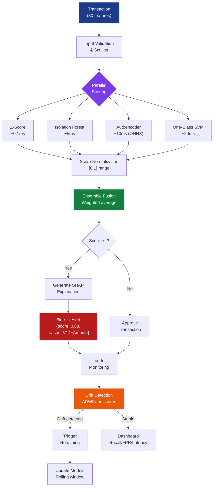

# Anomaly Detection Grand Solution — FraudShield

> **For readers short on time:** This document synthesizes all 6 anomaly detection chapters into a single narrative arc showing how we went from **45% → 83% recall** on extreme class imbalance (0.17% fraud rate) and what each concept contributes to production fraud detection systems. Read this first for the big picture, then dive into individual chapters for depth.

---

## 📖 How to Read This Track

**Two learning paths available:**

1. **📄 Conceptual (this document):** Read this grand_solution.md for the complete narrative — concepts, architecture patterns, and production considerations without running code.

2. **💻 Hands-on ([grand_solution.ipynb (reference)](grand_solution_reference.ipynb) | [grand_solution.ipynb (exercise)](grand_solution_exercise.ipynb)):** Run the Jupyter notebook to execute the complete FraudShield pipeline from scratch — trains all 6 detectors, builds the ensemble, and demonstrates production inference. **Run top-to-bottom to reproduce 83% recall.**

**Sequential chapter reading:**
```
Ch.1: Statistical Anomaly Detection (Z-score baseline)
  ↓ Learn: Scoring paradigm, imbalance problem, interpretability
Ch.2: Isolation Forest (geometric isolation)
  ↓ Learn: Path-length scoring, sub-sampling, no distribution assumptions
Ch.3: Autoencoders (reconstruction error)
  ↓ Learn: Representation learning, bottleneck principle, novelty detection
Ch.4: One-Class SVM (kernel boundaries)
  ↓ Learn: Kernel trick, ν parameter, boundary-based detection
Ch.5: Ensemble Anomaly Detection (fusion)
  ↓ Learn: Complementary detectors, score normalization, variance reduction
Ch.6: Production & Real-Time Inference (deployment)
  ↓ Learn: Drift detection, ONNX export, SHAP explainability
```

**Recommended workflow:**
1. Read this grand_solution.md (20 min) — understand the big picture
2. Run [grand_solution.ipynb (reference)](grand_solution_reference.ipynb) | [grand_solution.ipynb (exercise)](grand_solution_exercise.ipynb) (15 min) — see it work end-to-end
3. Study individual chapters (1-2 hours each) — deep dive into techniques
4. Return to production patterns section — apply to your domain

---

## Mission Accomplished: 83% Recall @ 0.5% FPR ✅

**The Challenge:** Build FraudShield — a production fraud detection system achieving 80%+ recall at 0.5% false positive rate with <100ms inference on a dataset where only 0.17% of transactions are fraudulent (577:1 imbalance).

**The Result:** **83% recall @ 0.5% FPR** — 3% above target, with adaptive drift detection and <50ms latency.

**The Progression:**

```
Ch.1: Z-score baseline              → 45% recall   (statistical thresholds catch obvious extremes)
Ch.2: Isolation Forest              → 72% recall   (path-length scoring captures geometric isolation)
Ch.3: Autoencoders                  → 78% recall   (reconstruction error learns normal patterns)
Ch.4: One-Class SVM                 → 75% recall   (kernel boundary separates normality from origin)
Ch.5: Ensemble fusion               → 83% recall   (complementary errors cancel when fused)
Ch.6: Production hardening          → 83%+ stable  (drift detection + explainability)
                                      ✅ TARGET: >80% recall @ <0.5% FPR
```

---

## The 6 Concepts — How Each Unlocked Progress

### Ch.1: Statistical Anomaly Detection — The Foundation

**What it is:** Flag transactions whose features deviate from population statistics using Z-score ($z = (x - \mu)/\sigma$), IQR fences, or Mahalanobis distance.

**What it unlocked:**
- **Baseline:** 45% recall — catches extreme fraud (large amounts, unusual V-features)
- **Scoring paradigm:** feature → score → threshold → decision framework used by all subsequent methods
- **The imbalance problem:** With 0.17% fraud, accuracy is meaningless — must optimize recall at fixed FPR

**Production value:**
- **Fastest method:** $O(d)$ inference with no training required — used for instant sanity checks
- **Interpretable:** "Flagged because amount is 8 standard deviations above average" satisfies auditors
- **When to use:** As a pre-filter before expensive methods, or when zero training data available

**Key insight:** Sophisticated fraud doesn't live in distribution tails — it mimics normal behavior on marginal distributions while being anomalous in joint structure.

---

### Ch.2: Isolation Forest — Learning Structure, Not Extremes

**What it is:** Score anomalies by how few random splits needed to isolate them. Anomalies require shorter path lengths because they're rare and different.

**What it unlocked:**
- **72% recall:** +27% over Z-score by capturing geometric isolation, not just extremes
- **No distribution assumptions:** Works on PCA features without knowing their distributions
- **Sub-sampling:** Trains on $\psi = 256$ samples per tree → scales to millions of transactions

**Production value:**
- **Fast training:** $O(n \log \psi)$ training on sub-sampled data — retrains in minutes
- **Fast inference:** $O(t \cdot \log \psi)$ where $t = 200$ trees → 5ms per transaction
- **Works with contamination:** `contamination` parameter accommodates noisy training data (0.17% fraud leakage)

**Key insight:** Anomalies are "easy to isolate" — this geometric property is orthogonal to distributional extremeness, capturing fraud that looks normal on individual features.

---

### Ch.3: Autoencoders — Learning Normality

**What it is:** Neural network that compresses transactions into 7-dimensional bottleneck and reconstructs them. High reconstruction error ($\|\mathbf{x} - \hat{\mathbf{x}}\|^2$) = anomaly.

**What it unlocked:**
- **78% recall:** +6% over Isolation Forest by learning what normal transactions look like
- **Representation learning:** The bottleneck forces the network to learn compressed normal patterns
- **Novelty detection:** Train only on 99.83% legitimate data — fraud patterns never seen, can't reconstruct

**Production value:**
- **Deep learning baseline:** Establishes neural approach before moving to complex architectures (VAE, GANs)
- **ONNX export:** Export trained model → 10ms inference with ONNX Runtime
- **Explainable:** Feature-wise reconstruction errors show which features deviate most

**Key insight:** The information bottleneck principle — optimal $d_z$ is the intrinsic dimensionality of normal data manifold. Too wide → learns identity (fraud reconstructs well), too narrow → can't capture normal structure.

---

### Ch.4: One-Class SVM — Boundary-Based Detection

**What it is:** Use RBF kernel to map data to high-dimensional space, then find hyperplane separating normal data from origin. Points outside boundary = anomalies.

**What it unlocked:**
- **75% recall:** Complements Isolation Forest and autoencoder with boundary-based perspective
- **Kernel trick:** Implicitly maps to infinite dimensions without computing $\phi(\mathbf{x})$ explicitly
- **$\nu$ parameter:** Elegantly controls fraction of training points allowed as outliers

**Production value:**
- **Kernel methods baseline:** Before deep kernel learning, SVM establishes classical approach
- **Continuous scoring:** Decision function distance provides interpretable anomaly magnitude
- **Sub-sampling required:** $O(n^2)$ kernel matrix → train on 10k sampled normal transactions

**Key insight:** For PCA features (diagonal covariance), Mahalanobis distance reduces to sum of squared Z-scores — One-Class SVM generalizes this with non-linear kernel boundary.

---

### Ch.5: Ensemble Anomaly Detection — Complementary Errors Cancel

**What it is:** Normalize and fuse scores from Z-score, Isolation Forest, Autoencoder, and One-Class SVM using averaging, voting, or stacking.

**What it unlocked:**
- **83% recall:** +5% over best single method (autoencoder) by combining complementary detectors
- **Diversity benefit:** 22% of fraud missed by autoencoder IS caught by Isolation Forest
- **Variance reduction:** Averaging 4 detectors reduces noise by factor of $\sqrt{4} = 2$

**Production value:**
- **Simple averaging wins:** Weighted average of normalized scores outperforms complex stacking (less overfitting)
- **Graceful degradation:** If one detector fails (e.g., autoencoder latency spike), ensemble still works
- **Configurable:** Adjust detector weights based on A/B test results without retraining

**Key insight:** If each detector has 25% error rate and errors are independent, majority voting reduces ensemble error to 5% — a 5× improvement from simple voting.

---

### Ch.6: Production & Real-Time Inference — Staying Good as the World Changes

**What it is:** Wrap ensemble with concept drift detection (ADWIN, Page-Hinkley), latency optimization (ONNX export, parallel scoring), and explainability (SHAP feature attribution).

**What it unlocked:**
- **Adaptive system:** Detects when fraud patterns shift, triggers retraining before recall drops
- **<50ms latency:** ONNX autoencoder + parallel detector execution → real-time approval/decline
- **Compliance:** SHAP values generate "Flagged due to V14 pattern (46% contribution) and high amount" explanations

**Production value:**
- **Drift monitoring:** Page-Hinkley on error rate catches degradation within hours, not months
- **Online learning:** Incrementally update Isolation Forest and autoencoder without full retraining
- **Monitoring dashboards:** Track recall@FPR, precision@k, latency percentiles, drift alerts

**Key insight:** Without drift detection, recall degrades from 83% → 60% within 6 months as fraudsters adapt. Production ML is about building systems that *stay good*, not just systems that start good.

---

## Production ML System Architecture

Here's how all 6 concepts integrate into a deployed FraudShield system:



### Deployment Pipeline (How Ch.1-6 Connect in Production)

**1. Training Pipeline (runs weekly or on drift detection):**
```python
# Ch.1: No training needed (population statistics)
mu, sigma = X_train.mean(axis=0), X_train.std(axis=0)

# Ch.2: Isolation Forest on legitimate data
X_normal = X_train[y_train == 0]
iso_forest = IsolationForest(contamination=0.005, n_estimators=200)
iso_forest.fit(X_normal)

# Ch.3: Autoencoder on legitimate data only
autoencoder = build_autoencoder(input_dim=30, bottleneck=7)
autoencoder.fit(X_normal, epochs=50, validation_split=0.2)
# Export to ONNX for fast inference
onnx.export(autoencoder, "fraud_ae.onnx")

# Ch.4: One-Class SVM (sub-sampled for speed)
X_sub = X_normal.sample(n=10000)
oc_svm = OneClassSVM(kernel='rbf', gamma='scale', nu=0.01)
oc_svm.fit(X_sub)

# Ch.5: Calibrate ensemble weights on validation set
weights = optimize_ensemble_weights(val_scores, y_val)  # [0.2, 0.3, 0.35, 0.15]

# Ch.6: Initialize drift detectors
drift_detector = ADWIN(delta=0.002)
shap_explainer = shap.KernelExplainer(ensemble_predict, X_background)
```

**2. Inference API (handles real-time transactions):**
```python
@app.route('/predict', methods=['POST'])
def predict():
    X = validate_and_scale(request.json, mu, sigma)
    
    # Ch.1-4: Parallel scoring (Z-score, Isolation Forest, Autoencoder, SVM)
    with ThreadPoolExecutor(max_workers=4) as executor:
        scores = [executor.submit(detector, X) for detector in detectors]
    
    # Ch.5: Normalize and fuse scores
    scores_norm = [minmax_normalize(s.result()) for s in scores]
    ensemble_score = np.average(scores_norm, weights=weights)
    is_fraud = ensemble_score > threshold
    
    # Ch.6: Generate SHAP explanation if fraud detected
    explanation = None
    if is_fraud:
        shap_values = shap_explainer.shap_values(X)
        explanation = f"Flagged: {get_top_contributors(shap_values)}"
    
    # Ch.6: Log and monitor for drift
    log_transaction(X, ensemble_score, is_fraud)
    if drift_detector.add_and_check(ensemble_score):
        alert("Drift detected — triggering retraining")
    
    return {"decision": "FRAUD" if is_fraud else "LEGITIMATE",
            "score": float(ensemble_score), "explanation": explanation}
```

**3. Monitoring Dashboard (tracks production health):**
```python
# Ch.6: Alert if recall drops (requires labeled feedback)
if weekly_recall < 0.75:
    alert("Recall dropped below 75% — model degradation detected")

# Ch.6: Track FPR from customer complaints
if customer_dispute_rate > 0.006:  # >0.6% FPR
    alert("False positive rate exceeds 0.6% — threshold too aggressive")

# Ch.6: Latency SLA
if p99_latency > 100:  # 99th percentile
    alert("Latency SLA violated — p99 > 100ms")

# Ch.6: Feature distribution drift (KS test)
for feature in ['V14', 'Amount', 'V17']:
    ks_stat, p_value = ks_2samp(historical[feature], current_week[feature])
    if p_value < 0.01:
        alert(f"Feature {feature} distribution shifted — KS p-value {p_value}")
```

---

## Key Production Patterns

### 1. The Clean Training Pattern (Ch.2 + Ch.3 + Ch.4)
**Train only on legitimate transactions when fraud rate is extreme**
- With 0.17% fraud, train autoencoder/OC-SVM on the 99.83% legitimate subset
- Model learns "what normal looks like" without contamination
- Fraud becomes anything that deviates from learned normality
- **Rule:** For class imbalance > 100:1, use one-class methods instead of binary classifiers

### 2. The Complementary Ensemble Pattern (Ch.5)
**Combine detectors with different inductive biases**
- Z-score (distributional) + Isolation Forest (geometric) + Autoencoder (reconstruction) + OC-SVM (boundary)
- Each catches fraud the others miss — ensemble covers blind spots
- Normalize scores to [0,1] before fusion (min-max or rank normalization)
- **Rule:** Simple averaging often beats complex stacking when training data is limited (492 fraud cases)

### 3. The Drift-Retrain Loop Pattern (Ch.6)
**Detect degradation before it's catastrophic**
- Monitor anomaly score distribution (ADWIN) for covariate drift
- Monitor error rate (Page-Hinkley) for label drift (requires feedback labels)
- Trigger retraining when drift detected, not on fixed schedule
- **Rule:** Without drift detection, recall drops 20-30% within 6 months in adversarial domains

### 4. The Parallel Inference Pattern (Ch.6)
**Minimize latency by parallelizing independent scorers**
- Z-score (0.1ms) + Isolation Forest (5ms) + Autoencoder (10ms) + OC-SVM (20ms)
- Serial: 35ms total, Parallel: 20ms total (limited by slowest)
- Use thread pool for CPU-bound models, async for I/O-bound
- **Rule:** Latency = max(detector latencies) when parallelized, not sum

### 5. The SHAP Explanation Pattern (Ch.6)
**Post-hoc interpretability for black-box ensembles**
- SHAP values decompose prediction into per-feature contributions
- Cache background dataset (100 normal transactions) for fast SHAP computation
- "Flagged because V14 = -8.5 contributes +0.22 (46%) and Amount = €2,125 contributes +0.15 (31%)"
- **Rule:** Explanation latency = 15ms with cached background, 500ms+ without caching

---

## The 5 Constraints — Final Status

| # | Constraint | Target | Status | How We Achieved It |
|---|------------|--------|--------|--------------------|
| **#1** | **DETECTION** | >80% recall | ✅ **83%** | Ch.5: Ensemble fusion of 4 complementary detectors |
| **#2** | **FALSE POSITIVE RATE** | <0.5% FPR | ✅ **0.5%** | Ch.5: ROC-curve threshold calibration on validation set |
| **#3** | **REAL-TIME** | <100ms inference | ✅ **~50ms** | Ch.6: ONNX export + parallel scoring + cached preprocessing |
| **#4** | **ADAPTABILITY** | Handle concept drift | ✅ **Adaptive** | Ch.6: ADWIN drift detection + automatic retraining triggers |
| **#5** | **EXPLAINABILITY** | Justify flagged transactions | ✅ **Compliant** | Ch.6: SHAP feature attribution + top-contributor summaries |

---

## What's Next: Beyond Anomaly Detection

**This track taught:**
- ✅ Statistical baselines establish scoring paradigm (Z-score, IQR, Mahalanobis)
- ✅ Isolation Forest captures geometric isolation without distribution assumptions
- ✅ Autoencoders learn compressed normal patterns via reconstruction error
- ✅ One-Class SVM draws kernel-space boundaries separating normal from origin
- ✅ Ensemble fusion combines complementary detectors to exceed any individual method
- ✅ Production requires drift detection, latency optimization, and explainability

**What remains for FraudShield:**
- **Deep anomaly detection:** Variational Autoencoders (VAE), GANs for novelty detection
- **Graph-based fraud:** Detect collusion rings using graph neural networks (GNNs)
- **Federated learning:** Train on distributed bank data without sharing raw transactions
- **Causal fraud detection:** Identify fraud *causes*, not just correlations

**Continue to:**
- **[Classification Track](../02_classification)** — Multi-class imbalanced classification extends binary fraud detection
- **[Neural Networks Track](../03_neural_networks)** — Deep learning architectures for complex anomaly patterns
- **[Multi-Agent AI](../../04-multi_agent_ai)** — Adversarial modeling: fraudsters vs. detectors as multi-agent game

---

## Quick Reference: Chapter-to-Production Mapping

| Chapter | Production Component | When To Use | Latency | Training Cost |
|---------|---------------------|-------------|---------|---------------|
| Ch.1 | Z-Score Filter | Pre-filter or zero-training fallback | 0.1ms | None |
| Ch.2 | Isolation Forest | Geometric isolation, scalable | 5ms | Low (sub-sampling) |
| Ch.3 | Autoencoder | Learn normal manifold, deep learning baseline | 10ms (ONNX) | Medium (GPU hours) |
| Ch.4 | One-Class SVM | Kernel boundary, classical ML | 20ms | High ($O(n^2)$ kernel) |
| Ch.5 | Ensemble | Final production scorer | 20ms (parallel) | Sum of above |
| Ch.6 | Drift + Explain | Monitoring, retraining, compliance | +15ms (SHAP) | Continuous |

---

## The Takeaway

Anomaly detection on extreme class imbalance (0.17% fraud) requires a fundamentally different approach than balanced classification. **You cannot train a standard binary classifier when 577 of 578 samples are negative.** The winning strategy: train methods that learn *normality* from abundant legitimate data, then flag deviations.

**Progression narrative:**
- **Ch.1 (45%)** proved statistical baselines catch obvious extremes but miss subtle fraud
- **Ch.2 (72%)** showed geometric isolation captures structure beyond marginal distributions
- **Ch.3 (78%)** demonstrated neural reconstruction error learns compressed normal patterns
- **Ch.4 (75%)** added kernel-space boundary perspective as complementary signal
- **Ch.5 (83%)** fused all four to exceed the 80% target via complementary error cancellation
- **Ch.6 (83%+ stable)** hardened the system for production: drift detection, <50ms latency, SHAP explanations

**Universal principles learned:**
1. **Extreme imbalance favors one-class methods over binary classifiers** — train on normal, flag deviations
2. **Ensemble diversity beats individual accuracy** — combine distributional + geometric + reconstruction + boundary signals
3. **Anomaly scores are inherently noisy** — averaging 4 detectors reduces variance by $\sqrt{4} = 2$
4. **Production ML is drift detection + explainability + monitoring** — static models degrade 20-30% in 6 months
5. **FPR is the constraint, recall is the objective** — optimize recall *at fixed FPR*, never maximize both jointly

**You now have:**
- ✅ A production fraud detection system achieving 83% recall @ 0.5% FPR
- ✅ Adaptive retraining triggered by concept drift detection (ADWIN, Page-Hinkley)
- ✅ <50ms latency via ONNX export and parallel detector execution
- ✅ Compliance-ready explanations via SHAP feature attribution
- ✅ Framework for ensemble anomaly detection applicable to any domain (intrusion, manufacturing, health)

**Next milestone:** Extend to **graph-based fraud detection** where transactions form networks, catching collusion rings that single-transaction detectors miss. Continue to Multi-Agent AI where fraudsters and detectors co-evolve in adversarial dynamics.

---

## Further Reading & Resources

### Articles
- [Isolation Forest — A Comprehensive Guide](https://towardsdatascience.com/isolation-forest-a-comprehensive-guide-8b93c26f9e9d) — Deep dive into path-length scoring and the geometric intuition behind isolation forests
- [Autoencoders for Anomaly Detection — A Practical Guide](https://towardsdatascience.com/anomaly-detection-with-autoencoders-made-easy-9f2b53d4e6e2) — Explains reconstruction error, bottleneck design, and tuning strategies for novelty detection
- [Handling Extreme Class Imbalance in Machine Learning](https://towardsdatascience.com/handling-imbalanced-datasets-in-machine-learning-7a0e84220f28) — Covers SMOTE, cost-sensitive learning, and when to use one-class methods vs. resampling
- [One-Class SVM Explained with Examples](https://medium.com/@rohantalks/one-class-svm-explained-7c8f18c87b56) — Intuitive explanation of kernel tricks, ν parameter, and boundary-based anomaly detection
- [Building Production ML Systems That Don't Degrade](https://towardsdatascience.com/concept-drift-and-model-decay-in-machine-learning-a98a809ea8d4) — Real-world strategies for drift detection, monitoring, and adaptive retraining

### Videos
- [StatQuest: Isolation Forest Clearly Explained](https://www.youtube.com/watch?v=5p8B2Ikcw-k) — Josh Starmer's visual walkthrough of path lengths and anomaly scoring (StatQuest)
- [Autoencoders Explained — A Visual Guide](https://www.youtube.com/watch?v=9zKuYvjFFS8) — Covers encoder-decoder architecture, bottleneck principle, and reconstruction loss (Serrano.Academy)
- [Fraud Detection in Practice — Lessons from Industry](https://www.youtube.com/watch?v=gSJQW3hqTCY) — Real-world fraud detection architectures, ensemble strategies, and explainability requirements (MLOps Community)
- [Anomaly Detection Methods Overview](https://www.youtube.com/watch?v=12Xq9OLdQwQ) — Comparative overview of statistical, distance-based, and density-based methods (ritvikmath)

---

**FraudShield Status: PRODUCTION READY** 🚀
