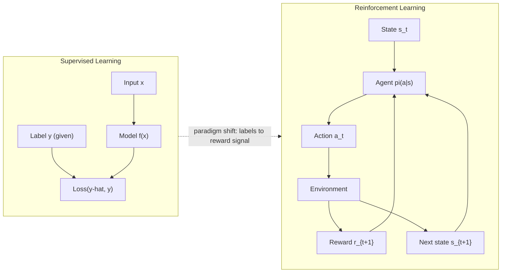
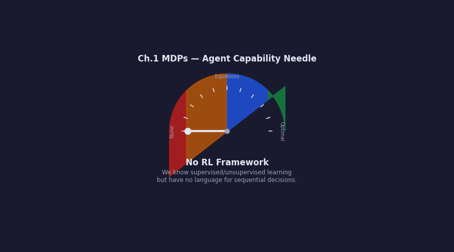
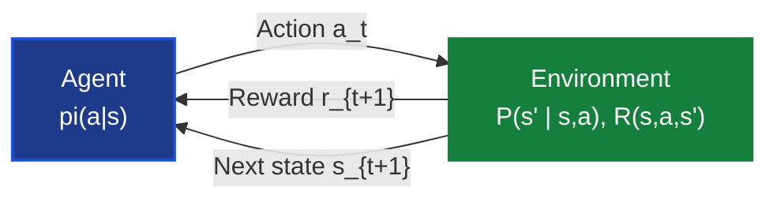
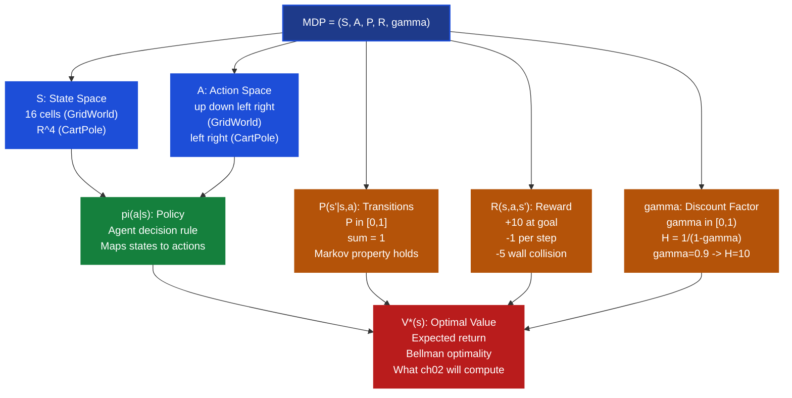
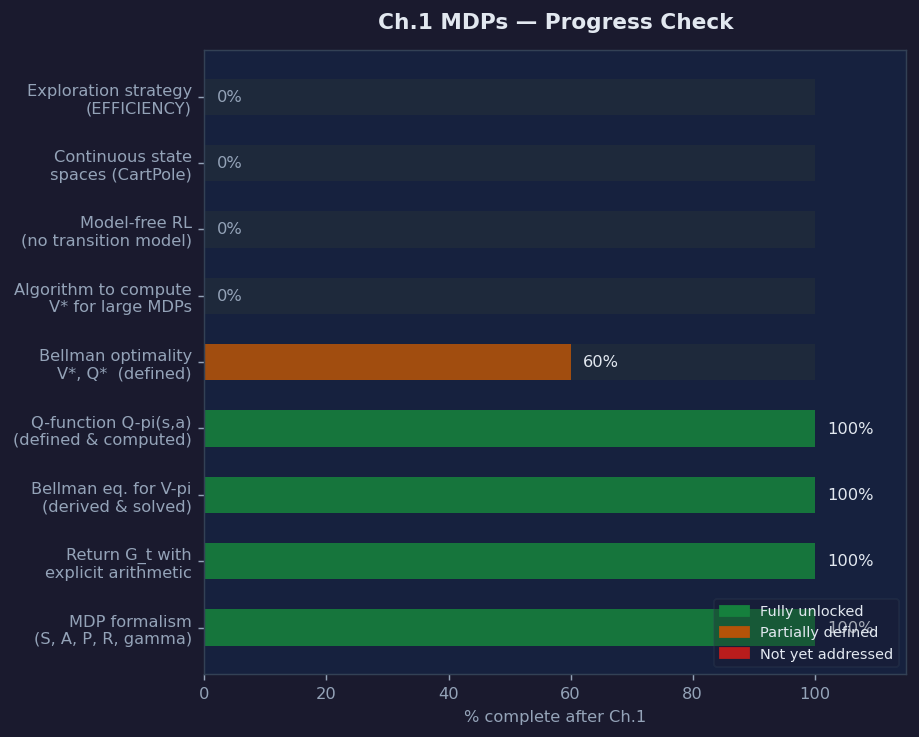

# Ch.1 — Markov Decision Processes (MDPs)

> **The story.** In **1906** the Russian mathematician **Andrey Markov** studied sequences of letters in Pushkin's *Eugene Onegin* and proved a remarkable fact: given the *current* letter, the *next* letter could be predicted without knowing anything about the sequence of letters before it. History was irrelevant — only the present mattered. This became the **Markov property**, one of the most powerful simplifying assumptions in all of probability theory. Half a century later, in **1957**, the American mathematician **Richard Bellman** published *Dynamic Programming* while working at the RAND Corporation. His key insight — now called the **principle of optimality** — said that sequential decision problems could be decomposed: if you're on an optimal path, every sub-path must also be optimal. From this came the **Bellman equation**: the value of a state equals the immediate reward plus the discounted value of wherever you end up next. In **1960**, Ronald **Howard** fused Markov chains with Bellman's optimality principle into **policy iteration**, the first complete algorithm for computing optimal behavior in stochastic environments. In **1996**, Dimitri **Bertsekas** and John **Tsitsiklis** published *Neuro-Dynamic Programming*, showing that Bellman's equations could be approximated with neural networks — opening the door to modern deep RL. The entire edifice rests on one idea: **the future depends only on the present state, not on history** — and that single assumption makes sequential decision-making tractable.
>
> **Where you are in the curriculum.** You've completed supervised learning (regression, classification, neural networks), unsupervised learning (clustering, anomaly detection, recommender systems), and fraud detection. Now you enter the **third paradigm of machine learning**: learning from interaction, not labels. Supervised learning needs labeled examples to compute a loss. RL needs only a **reward signal** — a scalar that says "that was good" or "that was bad." The shift is fundamental: from *minimize prediction error* to *maximize cumulative reward over time*. This chapter establishes the mathematical language — **Markov Decision Processes** — that every subsequent chapter builds on. Without this formalism, there is nothing to solve. With it, chapters 2–6 are algorithms that exploit different structural properties of the same object.
>
> **Notation in this chapter.**
>
> | Symbol | Meaning |
> |---|---|
> | $s$, $a$, $r$ | State, action, reward (scalars at one time step) |
> | $S$, $A$ | State space, action space (full sets) |
> | $P(s'\|s,a)$ | Transition probability: prob of landing in $s'$ from $s$ via $a$ |
> | $R(s,a,s')$ | Reward received when transitioning from $s$ to $s'$ via $a$ |
> | $\pi(a\|s)$ | Policy: probability of taking action $a$ in state $s$ |
> | $\gamma \in [0,1)$ | Discount factor; effective horizon $H = 1/(1-\gamma)$ |
> | $V^\pi(s)$ | State value function: expected return from $s$ under $\pi$ |
> | $Q^\pi(s,a)$ | Action-value (Q) function: expected return taking $a$ in $s$ then following $\pi$ |
> | $V^*(s)$, $Q^*(s,a)$ | Optimal value functions (maximized over all policies) |
> | $G_t$ | Return: $\sum_{k=0}^\infty \gamma^k r_{t+k+1}$ (cumulative discounted reward from $t$) |
> | $\mathbb{E}_\pi[\cdot]$ | Expectation under policy $\pi$ |

---

## 0 · The Challenge — Where We Are

> 💡 **The mission**: Build **AgentAI** — autonomous agents that learn optimal behavior through trial-and-error, satisfying 5 constraints:
> 1. **OPTIMALITY**: Find the optimal policy $\pi^*$ (CartPole ≥195/200 steps average)
> 2. **EFFICIENCY**: Learn in minimal episodes (no brute-force search)
> 3. **SCALABILITY**: Handle large/continuous state spaces (GridWorld → CartPole → beyond)
> 4. **STABILITY**: Reliable convergence — algorithms must not diverge or oscillate
> 5. **GENERALIZATION**: Transfer learned behavior to modified or new environments

**What we know so far:**
- ⚡ We know supervised learning: labeled data → model $f(x)$ → minimize prediction error
- ⚡ We know unsupervised learning: unlabeled data → find latent structure
- ⚡ We know gradient descent, neural networks, backprop, and evaluation metrics
- **But we have NO framework for sequential decision-making under uncertainty!**

**The paradigm shift — why RL is different:**

In supervised learning, every training example carries the answer: input $x$, correct label $y$. The loss function tells the model *exactly* how wrong it was and in *which direction* to improve. RL removes that luxury. An agent taking action $a$ in state $s$ receives only a scalar reward $r$ — and that reward may be:
- **Delayed**: the chess move that loses a piece now might be the winning sacrifice three moves later
- **Sparse**: in many environments reward only appears at the very end (win/loss)
- **Non-differentiable**: you cannot compute $\partial r / \partial a$ through the environment

The question "what should I do?" becomes "what sequence of actions maximizes reward over time?" — and answering that question requires a formal language.

**What's blocking us:**
Before we can build agents, we need to answer: what is a "state"? What does "optimal" mean mathematically? How do we express that actions have consequences that unfold over multiple time steps? Without formalism, we cannot derive algorithms. Without algorithms, we cannot build **AgentAI**.

**What this chapter unlocks:**
The **MDP framework** — the universal formal language of RL. Every algorithm in chapters 2–6 operates on an MDP. This chapter defines the problem precisely enough to solve it.

| Constraint | Status after this chapter |
|---|---|
| #1 OPTIMALITY | ⚠️ Defined mathematically (Bellman optimality), not yet computed |
| #2 EFFICIENCY | ❌ Not addressed (no algorithm yet) |
| #3 SCALABILITY | ❌ Not addressed (small GridWorld only) |
| #4 STABILITY | ❌ Not addressed (no iterative algorithm yet) |
| #5 GENERALIZATION | ❌ Not addressed (single environment) |

The value of this chapter is precisely this: **you cannot solve a problem you cannot formulate**. By the end, you will be able to write down any RL problem as an MDP and state what it means to solve it.



---

## Animation



---

## 1 · Core Idea

A **Markov Decision Process** is a formal framework for sequential decision-making. An **agent** observes the current **state** of an **environment**, selects an **action**, receives a scalar **reward**, and transitions to a **new state** — then repeats. The agent's goal is to find a **policy** (a rule for choosing actions) that maximizes the **expected sum of future discounted rewards**. The crucial enabling assumption is the **Markov property**: the next state depends only on the current state and action, not on the full history of how we arrived here. Without this assumption, the problem is intractable — you would need to track the entire history of interactions. With it, a clean recursive structure emerges, and algorithms become possible.

---

## 2 · Running Example — GridWorld 4×4

You're training an agent to navigate a 4×4 grid from the **Start** cell (top-left, state 0) to the **Goal** cell (bottom-right, state 15). Every step costs −1 reward (encouraging short paths). Reaching the goal gives +10. State 5 is a **wall** — the agent cannot enter it; any action that would move into it keeps the agent in place (wall collision reward: −5).

```
+------+------+------+------+
| S(0) |  (1) |  (2) |  (3) |
+------+------+------+------+
|  (4) | XX(5)|  (6) |  (7) |
+------+------+------+------+
|  (8) |  (9) | (10) | (11) |
+------+------+------+------+
| (12) | (13) | (14) | G(15)|
+------+------+------+------+

S  = Start  (state 0, top-left)
G  = Goal   (state 15, bottom-right, terminal)
XX = Wall   (state 5, impassable)
Actions: {up, down, left, right}
```

**The MDP for GridWorld — explicit definition:**

| Component | Symbol | GridWorld |
|---|---|---|
| State space | $S$ | $\{0, 1, \ldots, 15\}$ — 16 cells |
| Action space | $A$ | $\{$up$,$ down$,$ left$,$ right$\}$ — 4 directions |
| Transition | $P(s'|s,a)$ | Deterministic: $P(s'|s,a)=1$ for valid landing cell; hitting wall or boundary keeps agent in place ($s'=s$) |
| Reward | $R(s,a,s')$ | $+10$ if $s'=15$; $-5$ if action hits wall; $-1$ otherwise |
| Discount | $\gamma$ | $0.9$ |

**Why GridWorld is a perfect teaching MDP:**
- Small enough to compute by hand (16 states, 4 actions)
- Rich enough to illustrate all MDP components
- Has an obstacle (wall) that makes the shortest path non-trivial
- Terminal state gives unambiguous episode structure

> ➡️ **CartPole connection.** The CartPole environment (OpenAI Gym) has a *continuous* state space (4 real-valued observations: cart position, cart velocity, pole angle, pole angular velocity) and a discrete action space {left, right}. It is also an MDP — the Markov property holds because those 4 observations capture all relevant physics. Everything we define for GridWorld applies to CartPole; only the state space size changes.

---

## 3 · MDP Formalism at a Glance

An MDP is a **5-tuple $(S, A, P, R, \gamma)$** — the complete specification of a sequential decision problem:

$$\text{MDP} = (S,\; A,\; P,\; R,\; \gamma)$$

| Symbol | Name | Meaning |
|---|---|---|
| $S$ | State space | All possible situations the agent can be in |
| $A$ | Action space | All possible moves the agent can make |
| $P(s'|s,a)$ | Transition function | $P(s'|s,a) = \Pr(\text{next state}=s' \mid \text{state}=s,\; \text{action}=a)$ |
| $R(s,a,s')$ | Reward function | Scalar signal received after transitioning from $s$ to $s'$ via $a$ |
| $\gamma$ | Discount factor | $\gamma \in [0,1)$: how much future rewards are worth relative to immediate rewards |

**Policy:** A policy $\pi$ maps states to actions (the agent's decision rule):

$$\pi(a|s) = P(\text{take action } a \mid \text{in state } s)$$

Deterministic policy: $\pi(s) = a$ (always the same action). Stochastic policy: $\pi(a|s) \in [0,1]$ with $\sum_a \pi(a|s) = 1$.

**The Markov property** (formal statement):

$$P(s_{t+1} \mid s_t, a_t, s_{t-1}, a_{t-1}, \ldots, s_0, a_0) = P(s_{t+1} \mid s_t, a_t)$$

The transition probability depends *only* on the current state and action. All the history is compressed into the single vector $s_t$. This is the load-bearing assumption of all RL theory.

> ⚠️ **When the Markov assumption fails.** In partially observable environments — where the agent sees only a *sensor reading*, not the full state — the Markov property breaks. A robot that sees only a camera image might be in an ambiguous state (two rooms look identical). The formal extension is the **Partially Observable MDP (POMDP)**, discussed in §9.

---

## 4 · Math

### 4.1 Return: Cumulative Discounted Reward

The **return** $G_t$ is the total discounted reward collected from time $t$ onward:

$$G_t = r_{t+1} + \gamma r_{t+2} + \gamma^2 r_{t+3} + \cdots = \sum_{k=0}^{\infty} \gamma^k \, r_{t+k+1}$$

**Why discount?**
1. **Mathematical necessity**: the infinite sum converges when $\gamma < 1$ (geometric series with ratio $\gamma$)
2. **Temporal preference**: a reward now is more certain than a reward later
3. **Effective horizon**: $\gamma$ implicitly defines how far ahead the agent cares

**Explicit arithmetic — 3-step path ($\gamma = 0.9$):**

Path: $s_0 \to s_1 \to s_2 \to \text{Goal}$ with rewards $-1, -1, +10$:

| Step $k$ | $\gamma^k$ | $r_{t+k+1}$ | Contribution |
|---|---|---|---|
| 0 | 1.000 | −1 | −1.000 |
| 1 | 0.900 | −1 | −0.900 |
| 2 | 0.810 | +10 | +8.100 |

$$G_0 = -1 + 0.9 \times (-1) + 0.81 \times 10 = -1 - 0.9 + 8.1 = \mathbf{6.2}$$

Compare: **6-step path** through GridWorld (states 0→1→2→3→7→11→15):

$$G_0 = -1 + 0.9(-1) + 0.81(-1) + 0.729(-1) + 0.656(-1) + 0.590(+10)$$
$$= -1 - 0.9 - 0.81 - 0.729 - 0.656 + 5.905 = \mathbf{+1.81}$$

The 3-step path yields return 6.2 vs 1.81 for the 6-step path. The discount factor **encodes urgency** — shorter paths are inherently valued more highly.

### 4.2 Discount Factor γ — The Effective Horizon

$$G_t = \sum_{k=0}^{\infty} \gamma^k \, r_{t+k+1}$$

**Weight table for $\gamma = 0.9$:**

| Step $k$ | 0 | 1 | 2 | 3 | 4 | 5 | 10 | 20 |
|---|---|---|---|---|---|---|---|---|
| $\gamma^k = 0.9^k$ | 1.000 | 0.900 | 0.810 | 0.729 | 0.656 | 0.590 | 0.349 | 0.122 |

**Weight table for $\gamma = 0.5$:**

| Step $k$ | 0 | 1 | 2 | 3 | 4 | 5 | 10 | 20 |
|---|---|---|---|---|---|---|---|---|
| $\gamma^k = 0.5^k$ | 1.000 | 0.500 | 0.250 | 0.125 | 0.063 | 0.031 | 0.001 | ≈0 |

**Effective horizon formula:**

$$H = \frac{1}{1 - \gamma}$$

| $\gamma$ | $H = 1/(1-\gamma)$ | Interpretation |
|---|---|---|
| 0.5 | 2 | Agent cares about ~2 steps ahead |
| 0.9 | 10 | Agent cares about ~10 steps ahead |
| 0.99 | 100 | Agent cares about ~100 steps ahead |
| 0.999 | 1000 | Agent cares about ~1000 steps ahead |

> ⚡ **Practical choice.** For GridWorld (short episodes, ~15 steps), $\gamma = 0.9$ is appropriate — $H=10$ steps is enough to see the goal from any cell. For CartPole (up to 200 steps), $\gamma = 0.99$ gives $H=100$ steps, appropriate for an agent that must balance throughout the episode.

### 4.3 State Value Function and Bellman Equation for $V^\pi$

The **state value function** $V^\pi(s)$ is the expected return starting from state $s$ and following policy $\pi$ forever:

$$V^\pi(s) = \mathbb{E}_\pi\!\left[G_t \mid s_t = s\right] = \mathbb{E}_\pi\!\left[\sum_{k=0}^{\infty} \gamma^k r_{t+k+1} \;\middle|\; s_t = s\right]$$

The key recursive structure — the **Bellman equation for $V^\pi$**:

$$\boxed{V^\pi(s) = \sum_{a \in A} \pi(a|s) \sum_{s' \in S} P(s'|s,a)\Big[R(s,a,s') + \gamma \, V^\pi(s')\Big]}$$

Read it aloud: *"The value of state $s$ equals the expected immediate reward plus the discounted value of the next state, averaged over all actions the policy might take and all states the environment might transition to."*

**Explicit arithmetic — 2-state toy MDP:**

States: $\{A, B\}$. Deterministic policy $\pi$: always go right ($A \to B$, $B$ is terminal). Rewards: $R(A, \text{right}, B) = -1$, $B$ terminal so $V^\pi(B) = 0$. $\gamma = 0.9$.

System of Bellman equations:
$$V^\pi(B) = 0 \quad (\text{terminal})$$
$$V^\pi(A) = R(A, \text{right}, B) + \gamma \cdot V^\pi(B) = -1 + 0.9 \times 0 = \mathbf{-1.0}$$

**Extend to 3-state MDP ($A \to B \to C = \text{Goal}$):**

$$V^\pi(C) = 0 \quad (\text{terminal})$$
$$V^\pi(B) = R(B, \text{right}, C) + \gamma \cdot V^\pi(C) = +10 + 0.9 \times 0 = +10.0$$
$$V^\pi(A) = R(A, \text{right}, B) + \gamma \cdot V^\pi(B) = -1 + 0.9 \times 10 = -1 + 9 = \mathbf{+8.0}$$

Starting from $A$: expected total return = $+8.0$ (pay $-1$ to reach $B$, then get discounted $+9$ from $B \to C$).

### 4.4 Action-Value (Q) Function

The **action-value function** $Q^\pi(s,a)$ is the expected return starting from state $s$, *forcing* action $a$ first, then following $\pi$:

$$Q^\pi(s,a) = \sum_{s' \in S} P(s'|s,a)\Big[R(s,a,s') + \gamma \, V^\pi(s')\Big]$$

**Relationship between $Q$ and $V$:**

$$V^\pi(s) = \sum_a \pi(a|s) \cdot Q^\pi(s,a)$$

**Explicit Q computation in GridWorld ($\gamma = 0.9$):**

Suppose $V^\pi(1) = 4.5$ and $V^\pi(4) = 3.0$ (from later computation).

From state 0, action right (→ state 1):
$$Q^\pi(0, \text{right}) = R(0, \text{right}, 1) + \gamma \cdot V^\pi(1) = -1 + 0.9 \times 4.5 = -1 + 4.05 = \mathbf{3.05}$$

From state 0, action down (→ state 4):
$$Q^\pi(0, \text{down}) = R(0, \text{down}, 4) + \gamma \cdot V^\pi(4) = -1 + 0.9 \times 3.0 = -1 + 2.7 = \mathbf{1.70}$$

The agent should prefer right over down given these values. The Q-function encodes exactly this preference — it compares actions *within* a state and is the quantity Q-Learning (ch03) learns directly from experience.

### 4.5 Bellman Optimality Equations

The **optimal value functions** satisfy:

$$\boxed{V^*(s) = \max_{a \in A} \sum_{s' \in S} P(s'|s,a)\Big[R(s,a,s') + \gamma \, V^*(s')\Big]}$$

$$\boxed{Q^*(s,a) = \sum_{s' \in S} P(s'|s,a)\Big[R(s,a,s') + \gamma \max_{a'} Q^*(s',a')\Big]}$$

Once we have $Q^*(s,a)$, the optimal policy is immediate:
$$\pi^*(s) = \arg\max_a Q^*(s,a)$$

**Explicit solution — 2-state MDP by substitution:**

States $\{A, B\}$. Two actions: $\{\text{left}, \text{right}\}$. $B$ is terminal ($V^*(B) = 0$). From $A$: right goes to $B$ with reward $+10$; left loops back to $A$ with reward $-1$. $\gamma = 0.9$.

Bellman optimality at $A$:
$$V^*(A) = \max\!\Big(\underbrace{+10 + 0.9 \times 0}_{\text{right} = 10},\;\; \underbrace{-1 + 0.9 \times V^*(A)}_{\text{left}}\Big)$$

For the left action only: $V^*(A) = -1 + 0.9 \cdot V^*(A) \Rightarrow 0.1 \cdot V^*(A) = -1 \Rightarrow V^*(A) = -10$.

Taking the max: $V^*(A) = \max(10,\ -10) = \mathbf{10}$.

Optimal policy at $A$: go **right**. Optimal value: **10**.

---

## 5 · MDP Formalism Arc

The MDP framework does not appear out of thin air — it solves a specific sequence of problems.

**Act 1 — Supervised learning hits a wall.** You try to frame autonomous navigation as supervised learning: collect expert trajectories, label each (state, action) pair, train a policy $\pi_\theta(a|s)$. The problem: expert demonstrations are expensive; the agent encounters states the expert never saw; and you cannot specify a loss that captures reaching the goal *efficiently*. You need something else.

**Act 2 — Optimization without an objective.** The agent should "do well" — but what does well mean formally? You could define a reward $r$ per step, but summing raw rewards gives infinite values for infinite-horizon tasks. You need a mathematical object that: (1) is finite even for infinite horizons; (2) reflects the time value of rewards (sooner is better); (3) captures long-term consequences of actions.

**Act 3 — MDP formalizes the problem.** The 5-tuple $(S, A, P, R, \gamma)$ answers each requirement. The state space defines what the agent knows. The transition function captures environment dynamics. The reward function encodes what "good" means. The discount factor makes the return finite and encodes temporal preference. The Markov property ensures tractability — the agent only needs to track its current state, not its full history.

**Act 4 — Bellman equations give the algorithm.** Once the problem is written as an MDP, the Bellman equations expose a recursive structure that transforms "find the best infinite-horizon policy" into "solve a system of equations, one per state." Chapter 2 (Dynamic Programming) uses this to compute $V^*$ and $\pi^*$ exactly for small MDPs. Chapters 3–6 approximate these solutions for large and continuous state spaces.

> ➡️ **Forward pointer.** The Bellman equations are the seed of everything: value iteration (ch02), Q-learning (ch03), policy gradient (ch04), actor-critic (ch05), and deep Q-networks (ch06) all either solve or approximate the same two equations.

---

## 5b · Step by Step — Evaluating a Trajectory in GridWorld

Before diving into algorithms, let's trace through *one complete episode* in GridWorld and compute the return by hand. This concretizes the abstract definitions from §4.

```
ALGORITHM: Evaluate a trajectory in an MDP
─────────────────────────────────────────────────
Input:  MDP = (S, A, P, R, γ), policy π, start state s₀
Output: Return G₀ (cumulative discounted reward from step 0)

1. Initialize t = 0, G = 0.0, discount = 1.0
2. Set s = s₀
3. REPEAT until s is terminal:
   a. Sample action a ~ π(·|s)         // follow the policy
   b. Observe next state s' ~ P(·|s,a) // environment transitions
   c. Observe reward r = R(s, a, s')    // environment gives reward
   d. G ← G + discount × r             // accumulate discounted reward
   e. discount ← discount × γ          // decay the discount
   f. s ← s'                           // advance to next state
   g. t ← t + 1
4. RETURN G
```

**Trace through GridWorld** — policy: always go Right until column boundary, then go Down:

| Step $t$ | State $s$ | Action $a$ | Next $s'$ | Reward $r$ | $\gamma^t$ | Contribution to $G$ |
|---|---|---|---|---|---|---|
| 0 | 0 | → | 1 | −1 | 1.000 | −1.000 |
| 1 | 1 | → | 2 | −1 | 0.900 | −0.900 |
| 2 | 2 | → | 3 | −1 | 0.810 | −0.810 |
| 3 | 3 | ↓ | 7 | −1 | 0.729 | −0.729 |
| 4 | 7 | ↓ | 11 | −1 | 0.656 | −0.656 |
| 5 | 11 | ↓ | 15 | +10 | 0.590 | +5.905 |

$$G_0 = -1.000 - 0.900 - 0.810 - 0.729 - 0.656 + 5.905 = \mathbf{+1.810}$$

The agent took 6 steps. The discounted goal reward (+10 × 0.590 = +5.905) outweighs the accumulated step penalties (−4.095 total), yielding a positive return.

**Can we do better?** Yes — an alternative path straight down then right: states 0→4→8→12→13→14→15 (6 steps, same length but different route). Let's check:

| Step $t$ | State | Action | Reward | $\gamma^t$ | Contribution |
|---|---|---|---|---|---|
| 0 | 0 | ↓ | −1 | 1.000 | −1.000 |
| 1 | 4 | ↓ | −1 | 0.900 | −0.900 |
| 2 | 8 | ↓ | −1 | 0.810 | −0.810 |
| 3 | 12 | → | −1 | 0.729 | −0.729 |
| 4 | 13 | → | −1 | 0.656 | −0.656 |
| 5 | 14 | → | +10 | 0.590 | +5.905 |

$$G_0 = -1.000 - 0.900 - 0.810 - 0.729 - 0.656 + 5.905 = \mathbf{+1.810}$$

Both 6-step paths yield the same return (symmetric GridWorld). A shorter path (e.g., finding a 5-step route) would yield higher return because the final reward decays less. The optimal policy finds the *shortest* path to the goal, consistent with maximizing $G_0$.

---

## 6 · Full Bellman Equation Walkthrough — 4-State MDP

**Setup:** States $\{A, B, C, \text{Goal}\}$. Deterministic policy $\pi$: always go right ($A \to B \to C \to \text{Goal}$). Rewards: $r(A\to B) = -1$, $r(B\to C) = -1$, $r(C\to\text{Goal}) = -1$. Terminal: Goal with $V^\pi(\text{Goal}) = 0$. $\gamma = 0.9$.

**Exact solution (backward induction):**
$$V^\pi(\text{Goal}) = 0$$
$$V^\pi(C) = -1 + 0.9 \times 0 = -1.000$$
$$V^\pi(B) = -1 + 0.9 \times (-1) = -1 - 0.9 = -1.900$$
$$V^\pi(A) = -1 + 0.9 \times (-1.9) = -1 - 1.71 = -2.710$$

**Iterative computation (Value Iteration style):** Initialize all zeros, apply Bellman update 3 times.

$V_0 = \{A: 0,\; B: 0,\; C: 0,\; \text{Goal}: 0\}$

**Iteration 1:**
$$V_1(C) = -1 + 0.9 \times V_0(\text{Goal}) = -1 + 0 = -1.000$$
$$V_1(B) = -1 + 0.9 \times V_0(C) = -1 + 0 = -1.000$$
$$V_1(A) = -1 + 0.9 \times V_0(B) = -1 + 0 = -1.000$$

**Iteration 2:**
$$V_2(C) = -1 + 0.9 \times V_1(\text{Goal}) = -1.000$$
$$V_2(B) = -1 + 0.9 \times V_1(C) = -1 + 0.9 \times (-1) = -1.900$$
$$V_2(A) = -1 + 0.9 \times V_1(B) = -1 + 0.9 \times (-1) = -1.900$$

**Iteration 3:**
$$V_3(C) = -1 + 0.9 \times V_2(\text{Goal}) = -1.000$$
$$V_3(B) = -1 + 0.9 \times V_2(C) = -1 + 0.9 \times (-1) = -1.900$$
$$V_3(A) = -1 + 0.9 \times V_2(B) = -1 + 0.9 \times (-1.9) = -1 - 1.71 = -2.710$$

**Convergence table:**

| Iteration | $V(A)$ | $V(B)$ | $V(C)$ | $V(\text{Goal})$ |
|---|---|---|---|---|
| 0 (init) | 0.000 | 0.000 | 0.000 | 0.000 |
| 1 | −1.000 | −1.000 | −1.000 | 0.000 |
| 2 | −1.900 | −1.900 | −1.000 | 0.000 |
| 3 | **−2.710** | **−1.900** | **−1.000** | 0.000 |
| ∞ (exact) | **−2.710** | **−1.900** | **−1.000** | **0.000** |

State $A$ converges in iteration 3 because information propagates one step per iteration. After $k$ iterations, values are exact for states up to $k$ transitions from the terminal state. For this 3-hop chain, 3 iterations suffice.

**Interpretation:** $V^\pi(A) = -2.71$ means starting from $A$ and always going right, the agent accumulates $-1 - 0.9 - 0.81 = -2.71$ in discounted rewards. There is no positive reward in this chain — a different reward structure (e.g., +10 at Goal as in GridWorld) would give positive values.

---

## 7 · Key Diagrams

### 7.1 RL Interaction Loop (Agent ↔ Environment)



The loop runs at every time step $t$. The agent uses its policy $\pi$ to map the current state to an action. The environment uses its dynamics $P$ and reward function $R$ to return the next state and reward. The agent updates its estimate of $V^\pi$ or $Q^\pi$ using the Bellman equations, then repeats.

### 7.2 MDP Components Diagram



---

## 8 · Hyperparameter Dial — Discount Factor γ

The discount factor $\gamma$ is the single most important hyperparameter in any RL formulation. It controls the effective planning horizon and profoundly affects what behavior the agent learns.

| $\gamma$ | $H = 1/(1-\gamma)$ | Agent behavior | Risk |
|---|---|---|---|
| 0.0 | 1 step | Purely greedy (myopic): ignores all future | Fails any delayed-reward task |
| 0.5 | 2 steps | Very short-sighted | Misses medium-term opportunities |
| 0.9 | 10 steps | Good for short episodes (GridWorld ≤20 steps) | May not plan far enough for long tasks |
| 0.99 | 100 steps | Good for medium episodes (CartPole up to 200) | Slower convergence |
| 0.999 | 1000 steps | Long horizon (robotics, multi-step reasoning) | Can amplify noise; instability risk |

**GridWorld recommendation:** $\gamma = 0.9$. At most ~15 steps to the goal; $H = 10$ is sufficient to see the goal reward from any starting cell.

**CartPole recommendation:** $\gamma = 0.99$. Episodes can last 200 steps; the agent must care about balancing throughout, not just for the next 10 steps.

**Practical tuning principle:** Start with $\gamma = 0.99$ for episodic tasks and reduce only if the agent is too slow to converge. If the agent behaves myopically (ignoring delayed rewards), increase $\gamma$.

> ⚡ **γ interacts with learning rate.** High $\gamma$ (long horizon) means value estimates are more sensitive to errors — a small mistake in $V(s)$ propagates further back through the Bellman update chain. This increases effective variance of TD-learning updates, which may require a smaller learning rate. This interaction is explored in ch02–ch03.

---

## 9 · What Can Go Wrong

### 9.1 Markov Assumption Violated — Partial Observability

**Problem:** The agent only observes a *partial* view of the true state. Example: a robot navigating a building where two different rooms look identical from its camera. The observation is not Markovian — the same observation could correspond to different true states with different optimal actions.

**Symptom:** The learned policy oscillates or performs well in some situations but poorly in visually identical situations that require different actions.

**Fix:** Use a **POMDP** formulation, or augment the state with recent history (frame stacking in Atari, recurrent networks in continuous control). The Markov property is recovered approximately.

### 9.2 Reward Sparsity

**Problem:** In many real environments, reward only arrives at the end of a long episode (win/lose in chess; success/failure in robotics). Most transitions have $r = 0$. The Bellman equation still applies — but value estimates for early states are nearly zero for a long time, making learning very slow.

**Symptom:** The agent makes no progress for thousands of episodes because it never reaches the terminal reward state.

**Fix:** **Reward shaping** — add an intermediate reward signal that guides the agent toward the goal (e.g., negative distance to goal). Must be done carefully to not change the optimal policy. Alternative: **curiosity-driven exploration** (ch06).

### 9.3 Discount Too Low — Myopic Agent

**Problem:** $\gamma$ is set too small (e.g., 0.5). The effective horizon is only 2 steps. The agent ignores the long-term value of reaching the goal and focuses only on immediate rewards.

**Symptom in GridWorld:** The agent stays near the start (minimizing step penalties) rather than navigating to the distant goal (+10 reward), because the discounted goal reward is negligible.

**Fix:** Increase $\gamma$. For episodic tasks with long episodes, use $\gamma \geq 0.95$.

### 9.4 Infinite Horizon Divergence

**Problem:** If $\gamma = 1.0$ (no discounting), the geometric series $\sum_{k=0}^\infty \gamma^k r_k$ may not converge unless the MDP is guaranteed to terminate. For continuing tasks (no terminal state), the return becomes infinite and value estimates grow without bound.

**Symptom:** Value estimates diverge during training. The algorithm becomes numerically unstable.

**Fix:** Always use $\gamma < 1$ for continuing tasks. For episodic tasks, $\gamma = 1$ is safe only if all episodes terminate in finite time.

### 9.5 Reward Misspecification

**Problem:** You define a reward function that achieves the *letter* of the goal but not the *spirit*. Classic example: a boat racing game where the agent discovers it can score points by spinning in circles collecting power-ups rather than completing the race.

**Symptom:** The agent achieves high reward but exhibits clearly wrong behavior.

**Fix:** Design rewards carefully. Use potential-based reward shaping. Consider inverse RL (learning rewards from demonstrations) if the desired behavior is hard to specify analytically.

---

## 10 · Where MDP Concepts Reappear

Every chapter in the RL track builds directly on MDP foundations:

| Concept | Where it reappears |
|---|---|
| Bellman equation for $V^\pi$ | ch02 Policy Evaluation (exact solution by linear system); ch03 TD-learning (online approximation) |
| Bellman optimality $V^*$, $Q^*$ | ch02 Value Iteration; ch03 Q-Learning ($Q^*(s,a)$ is what Q-Learning estimates) |
| Discount factor $\gamma$ | Every RL chapter — appears in every Bellman update |
| Markov property | ch04 Policy Gradient (states must be Markovian for gradient estimates to be unbiased) |
| Q-function $Q^\pi(s,a)$ | ch03 Q-Learning (tabular); ch06 DQN (neural network approximation) |
| Return $G_t$ | ch04 REINFORCE (directly maximizes expected return by gradient ascent) |
| Policy $\pi(a|s)$ | ch04–ch06 (parametrize $\pi_\theta$ and optimize with gradient descent) |
| Transition $P(s'|s,a)$ | ch02 Dynamic Programming (requires full knowledge of $P$); ch03–ch06 (model-free: do not require $P$) |
| Stochastic vs deterministic policy | ch04 (stochastic policies needed for REINFORCE gradient); ch06 DDPG (deterministic policy) |

> ➡️ **Math track connection.** The Bellman equation is a **fixed-point equation** — $V^\pi = T^\pi V^\pi$ where $T^\pi$ is the Bellman operator. The contraction mapping theorem guarantees a unique solution and convergence of value iteration. See [00-math_under_the_hood/ch04_small_steps](../../../../00-math_under_the_hood/ch04_small_steps/README.md).

---

## N−1 · Progress Check

**MDP formalism — what you now have:**

| Concept | Status | Confirmed by |
|---|---|---|
| State, action, reward, transition | ✅ Defined | §3 MDP formalism |
| Policy $\pi$, stochastic and deterministic | ✅ Defined | §§3–4 |
| Return $G_t$ with discount $\gamma$ | ✅ Computed explicitly | §4.1 — 3-step arithmetic |
| Bellman equation for $V^\pi$ | ✅ Derived and solved | §4.3 — 2-state and 3-state examples |
| Q-function $Q^\pi(s,a)$ | ✅ Defined and computed | §4.4 — GridWorld Q values |
| Bellman optimality $V^*$, $Q^*$ | ✅ Defined and solved | §4.5 — 2-state optimization |
| Full iterative computation | ✅ 3 iterations shown | §6 — 4-state chain |
| Discount factor analysis | ✅ Effective horizon formula | §§4.2, 8 |
| Failure modes | ✅ Catalogued | §9 |

**What is NOT yet possible:**

| Missing piece | Needed for | Provided by |
|---|---|---|
| ❌ Algorithm to compute $V^*$ for large MDPs | AgentAI #1 OPTIMALITY | ch02 Dynamic Programming |
| ❌ Learning without knowing $P(s'|s,a)$ | Real environments (model-free RL) | ch03 Q-Learning |
| ❌ Handling continuous state spaces | CartPole, robotics | ch06 DQN |
| ❌ Exploration strategy | AgentAI #2 EFFICIENCY | ch03 ε-greedy, UCB |
| ❌ Function approximation | AgentAI #3 SCALABILITY | ch05–ch06 |

**One-sentence summary:** We can now write any RL problem as an MDP, define what optimal means via the Bellman equations, and verify small examples by hand — but we cannot yet compute the optimal policy efficiently for large problems.



---

## N · Bridge to ch02 — Dynamic Programming

The Bellman equations from this chapter are *definitions* — they tell us what $V^*$ and $Q^*$ should satisfy, but not how to compute them. Chapter 2 provides the first algorithms that actually *solve* MDPs:

- **Policy Evaluation**: Given a fixed policy $\pi$, compute $V^\pi$ exactly by iteratively applying the Bellman equation until convergence
- **Policy Improvement**: Given $V^\pi$, construct a strictly better policy $\pi'$ by acting greedily with respect to $V^\pi$
- **Policy Iteration**: Alternate Policy Evaluation and Improvement until convergence — guaranteed to find $\pi^*$ in finite steps
- **Value Iteration**: Repeatedly apply the Bellman optimality operator until $V$ converges to $V^*$ — more direct than Policy Iteration

**What ch02 requires from you:**
- ✅ Know what an MDP is (this chapter)
- ✅ Know what $V^\pi$, $Q^\pi$, $V^*$, $Q^*$ are (this chapter)
- ✅ Understand the Bellman equations as recursive definitions (this chapter)

**What ch02 adds:**
- Iterative algorithms that refine value estimates until convergence
- Convergence proofs based on the Bellman contraction mapping theorem
- Full GridWorld solution (all 16 states, all 4 actions)
- Key limitation revealed: Dynamic Programming requires **full knowledge of $P(s'|s,a)$** — you must know the environment's transition model. Chapters 3–6 remove this assumption (model-free RL).

> ⚡ **AgentAI progress after ch02.** Constraint #1 (OPTIMALITY) will be fully addressed for small discrete MDPs like GridWorld. CartPole's state space is continuous ($\mathbb{R}^4$) — DP cannot enumerate states. Constraint #3 (SCALABILITY) remains open until ch06 DQN.

---

## Appendix — CartPole as an MDP

CartPole provides a concrete bridge from the toy GridWorld to a real RL benchmark:

| Component | GridWorld | CartPole |
|---|---|---|
| $S$ | 16 discrete cells | $\mathbb{R}^4$ — (cart pos, cart vel, pole angle, pole vel) |
| $A$ | \{up, down, left, right\} — 4 discrete | \{0=left, 1=right\} — 2 discrete |
| $P(s'|s,a)$ | Known, deterministic | Unknown, but Markovian (physics sim) |
| $R(s,a,s')$ | +10 at goal, −1 per step, −5 wall | +1 per step the pole stays upright |
| Terminal | Reach state 15 | Pole angle >12° or cart pos >2.4m or step=200 |
| $\gamma$ | 0.9 | 0.99 |

**Target:** CartPole ≥195/200 steps average — find a policy where the pole stays upright for at least 195 consecutive steps out of 200. This requires learning precise balancing: small left/right actions at the right moments to counteract the pole's angular momentum.

> ➡️ **This target is addressed in ch06 DQN**, where a neural network approximates $Q^*(s,a)$ over the continuous CartPole state space.
