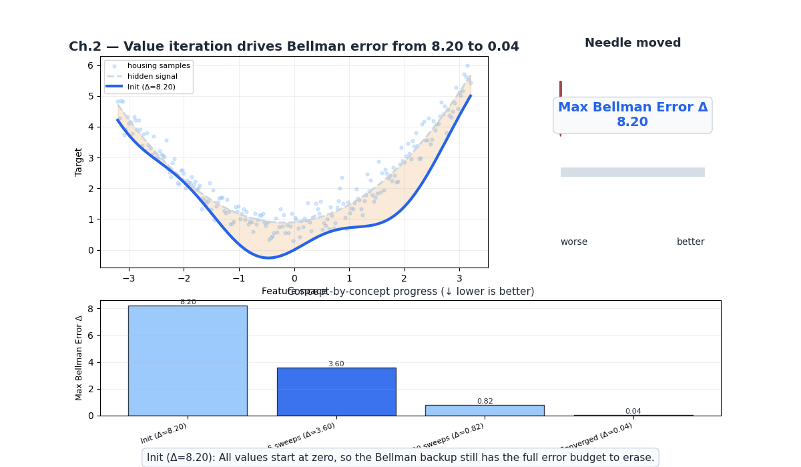
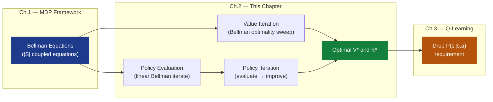
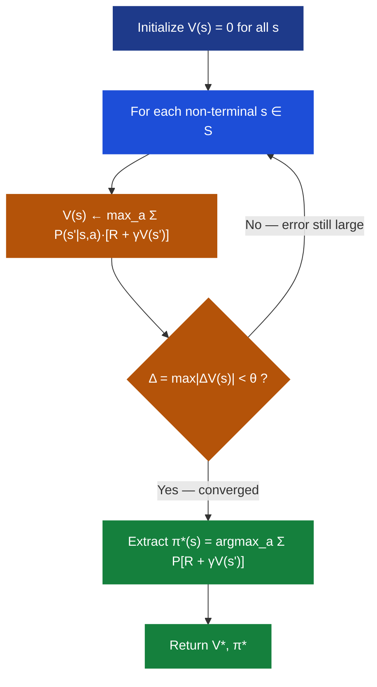
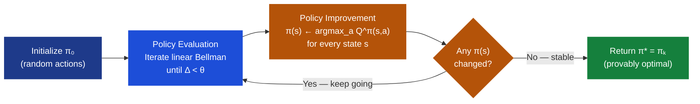
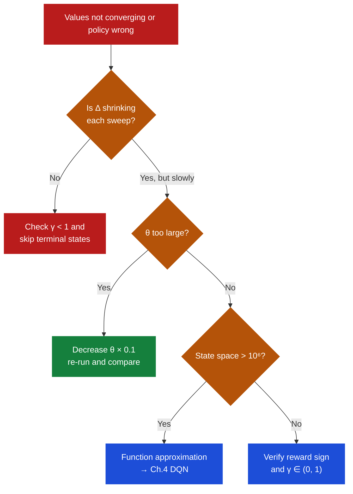

# Ch.2 — Dynamic Programming: Policy Evaluation, Policy Iteration, Value Iteration

> **The story.** In **1957**, while working for the RAND Corporation, **Richard Bellman** published *Dynamic Programming* — a book whose title he chose deliberately to obscure its mathematical nature. "The Secretary of Defence at the time had a pathological fear and hatred of the word 'research'," Bellman later recalled, "so I used 'dynamic', which is impossible to use in a pejorative sense." Inside that innocuously named book was the **Principle of Optimality**: *an optimal policy has the property that whatever the initial state and initial decision are, the remaining decisions must constitute an optimal policy with regard to the state resulting from the first decision.* In plain terms: the best plan from any point forward is independent of how you got there. From this single observation, Bellman derived the recursive equations that bear his name.
>
> Three years later, in **1960**, **Ronald Howard** published *Dynamic Programming and Markov Processes*, introducing **policy iteration** — the idea of alternating between evaluating a policy (computing its exact value) and improving it (making it greedy with respect to those values). Howard proved this cycle converges in finitely many steps, always reaching the optimal policy. Together, Bellman's value iteration and Howard's policy iteration form the oldest model-based RL algorithms still in active use today.
>
> **Where you are in the curriculum.** Chapter 1 gave you the MDP framework: states, actions, rewards, transitions, and the Bellman equations that relate values recursively. You understand *what* the optimal policy satisfies — but have no algorithm to *find* it. This chapter provides two algorithms guaranteed to converge to $\pi^*$ when the full model $P(s'|s,a)$ is available. Chapter 3 will drop that requirement entirely.
>
> **Notation in this chapter.** $V_k(s)$ — value estimate at iteration $k$; $V^{\pi}(s)$ — true value of state $s$ under policy $\pi$; $V^*(s)$ — optimal value; $\pi_k$ — policy at iteration $k$; $Q^{\pi}(s,a)$ — action-value under policy $\pi$; $\theta$ — convergence threshold; $\Delta$ — maximum Bellman error across all states in one sweep; $\gamma \in [0,1)$ — discount factor; $|S|, |A|$ — number of states, actions.

---

## 0 · The Challenge — Where We Are

> 💡 **AgentAI mission**: Build an agent that achieves ≥195/200 average reward on CartPole. Five constraints block the way:
> 1. **OPTIMALITY** — find the best possible policy, not a good-enough one
> 2. **EFFICIENCY** — converge in polynomial time, not exponential search
> 3. **SCALABILITY** — work at $|S| > 10^6$ (CartPole's state space is continuous)
> 4. **STABILITY** — guaranteed convergence, no divergence or oscillation
> 5. **GENERALIZATION** — transfer to new environments without relearning from scratch



**Needle moved:** max Bellman error $\Delta$ falls from roughly $8.20$ at initialization to $0.04$ at convergence, making the optimal policy readable from every grid cell.

**What we know so far:**
- ⚡ MDP framework: states, actions, rewards, transitions, policies (Ch.1)
- ⚡ Bellman policy equation: $V^{\pi}(s) = \sum_{a} \pi(a|s) \sum_{s'} P(s'|s,a)\bigl[R + \gamma V^{\pi}(s')\bigr]$
- ⚡ Bellman optimality equation: $V^*(s) = \max_a \sum_{s'} P(s'|s,a)\bigl[R + \gamma V^*(s')\bigr]$
- ⚡ Both equations have $|S|$ unknowns
- **But we have NO algorithm to find $V^*$ or $\pi^*$ from these equations!**

**What's blocking us:**
The Bellman optimality equation is a system of $|S|$ coupled non-linear equations — the $\max$ operator makes it non-linear. For the 4×4 GridWorld that is 15 equations with 15 unknowns. You cannot solve them in closed form. You need an **iterative** approach that chips away at the error one sweep at a time.

**What this chapter unlocks:**

| AgentAI Constraint | Status after Ch.2 |
|-------------------|------------------|
| #1 OPTIMALITY | ✅ **Achieved** — both algorithms provably reach $\pi^*$ with known $P$ |
| #2 EFFICIENCY | ⚠️ Polynomial: $O(\|S\|^2 \|A\|)$ per sweep — feasible for small MDPs |
| #3 SCALABILITY | ❌ Infeasible when $\|S\| > 10^6$ — CartPole is continuous; Ch.4 fixes this |
| #4 STABILITY | ✅ Guaranteed — contraction mapping theorem, $\gamma < 1$ |
| #5 GENERALIZATION | ❌ Solution is tied to the specific $P$ and $R$ — no transfer |

> ⚡ **CartPole is out of reach for now.** CartPole has a continuous 4-dimensional state space — an uncountably infinite $|S|$. Dynamic programming requires enumerating every state explicitly. Chapters 3–4 address this with Q-learning and function approximation.



---

## 1 · Core Idea

**Dynamic programming** (DP) solves MDPs by exploiting the recursive structure of the Bellman equations. The key insight: instead of solving $|S|$ coupled equations simultaneously (hard), repeatedly apply the Bellman update to every state until values stop changing (easy).

The reason this works is that the **Bellman backup operator** $T$ is a **contraction mapping** in the sup-norm. Applying $T$ to any two value functions $V$ and $V'$ brings them strictly closer together:

$$\|TV - TV'\|_\infty \leq \gamma\, \|V - V'\|_\infty$$

Because $\gamma < 1$, repeated application collapses both to the same fixed point — which is $V^*$. This is the **Banach fixed-point theorem** applied to the space of bounded value functions.

Two flavors of DP depend on which Bellman equation you iterate:

Three DP algorithms, one mathematical foundation:

| Algorithm | Bellman equation | Explicit policy? | Convergence type |
|-----------|-----------------|-----------------|-----------------|
| **Policy Evaluation** | Policy Bellman (linear, given $\pi$) | Yes — fixed | Geometric at rate $\gamma$ |
| **Value Iteration** | Optimality Bellman (has $\max_a$) | No — extracted at end | Geometric at rate $\gamma$ |
| **Policy Iteration** | Both, alternating | Yes — improves each pass | Finite — at most $\|A\|^{\|S\|}$ policies |

> 💡 **Why DP and not just search?** The MDP has $|A|^{|S|}$ deterministic policies. For the 4×4 GridWorld: $4^{15} \approx 10^9$ policies. Exhaustive search is hopeless. DP doesn't enumerate policies — it computes a value function that encodes all policy comparisons simultaneously in $|S|$ numbers.

**When does DP apply?** Three conditions must hold:
1. **Known model**: you can compute $P(s'|s,a)$ and $R(s,a,s')$ for any triple without sampling.
2. **Finite state and action spaces**: both $|S|$ and $|A|$ must be countable and enumerable.
3. **Markov property**: future transitions depend only on the current state, not history.

The GridWorld satisfies all three. CartPole fails condition 2 (continuous states). A poker agent fails condition 1 (opponent strategy is hidden). A traffic management system fails condition 3 if jam dynamics depend on hour of day (partial observability).

---

## 2 · Running Example — GridWorld 4×4 and 4-State Chain

Every section grounds its math in two environments.

**4×4 GridWorld** — state 0 is Start, state 15 (Goal) is terminal with $R = +10$ on arrival. Every other step costs $R = -1$. State 5 is an impassable wall. Actions: Up/Down/Left/Right. Hitting a boundary or wall leaves the agent in place.

```
┌──────┬──────┬──────┬──────┐
│ S(0) │  (1) │  (2) │  (3) │
├──────┼──────┼──────┼──────┤
│  (4) │ ██(5)│  (6) │  (7) │
├──────┼──────┼──────┼──────┤
│  (8) │  (9) │ (10) │ (11) │
├──────┼──────┼──────┼──────┤
│ (12) │ (13) │ (14) │ G(15)│
└──────┴──────┴──────┴──────┘

Known: P(s'|s,a) = 1 for the landing state (deterministic moves)
Known: R = +10 if s' = 15,  R = -1 otherwise
γ = 0.9,  θ = 0.001
```

**4-state chain** — stripped-down arithmetic toy used in §4 and §6:

```
A ──right──▶ B ──right──▶ C ──right──▶ Goal
(s=0)        (s=1)         (s=2)        (s=3, terminal)

R = -1 every step.  V(Goal) = 0 always (absorbed).
γ = 0.9.
```

In §6, state B gets a second action — **Detour** (B → A, $R = 0$) — so Policy Iteration has something to improve.

**Why two running examples?** The 4×4 GridWorld shows the spatial wave intuition — values propagating outward from the goal like concentric rings. The 4-state chain makes the arithmetic fit in one line per state. Both lead to the same conclusion; use whichever helps you think.

**A note on stochastic transitions.** In the GridWorld above, $P(s'|s,a) = 1$ (deterministic moves). In a *slippery* GridWorld, an action "Right" might move right with probability 0.8 and slip to Up/Down with probability 0.1 each. The Bellman update then becomes a genuine weighted average over $s'$:

$$V_{k+1}(s) = \max_a \Bigl[ 0.8 \cdot (R + \gamma V_k(s'_{\text{right}})) + 0.1 \cdot (R + \gamma V_k(s'_{\text{up}})) + 0.1 \cdot (R + \gamma V_k(s'_{\text{down}})) \Bigr]$$

The algorithms work identically — only the numeric computation inside the Bellman backup changes. All convergence guarantees hold regardless of transition stochasticity.

**Reward definition choices.** There are two common conventions:
1. **Step reward** ($R = -1$ per step, $R = 0$ at Goal): the agent minimizes path length. Values are negative everywhere except Goal.
2. **Terminal reward** ($R = 0$ per step, $R = +10$ at Goal): the agent maximizes total reward. Values are positive everywhere near Goal, zero far away.

The GridWorld in this chapter uses convention 2 for the 4×4 grid and convention 1 for the 4-state chain. Both encode the same preference: reach the Goal quickly. The absolute scale of values differs, but the optimal policy is identical.

---

## 3 · The DP Loop at a Glance

Before the math, here is the full structure of both algorithms. Each numbered step has a corresponding deep-dive in §4 and §6.

```
POLICY EVALUATION (inner loop of Policy Iteration)
────────────────────────────────────────────────────
1. Fix policy π
2. REPEAT
   a. Δ = 0
   b. FOR each non-terminal state s:
      v_old = V(s)
      V(s)  = Σ_a π(a|s) · Σ_{s'} P(s'|s,a) · [R + γV(s')]   ← linear Bellman backup
      Δ     = max(Δ, |V(s) − v_old|)
3. UNTIL Δ < θ
4. RETURN V^π

POLICY ITERATION (outer loop)
────────────────────────────────────────────────────
1. Initialize π randomly
2. REPEAT
   a. Run Policy Evaluation  →  obtain V^π
   b. FOR each state s:
      π(s) ← argmax_a Σ_{s'} P(s'|s,a)[R + γV^π(s')]          ← greedy improvement
3. UNTIL policy unchanged
4. RETURN π*

VALUE ITERATION (one-step shortcut)
────────────────────────────────────────────────────
1. Initialize V(s) = 0
2. REPEAT
   a. Δ = 0
   b. FOR each non-terminal state s:
      v_old = V(s)
      V(s)  = max_a Σ_{s'} P(s'|s,a) · [R + γV(s')]            ← Bellman optimality backup
      Δ     = max(Δ, |V(s) − v_old|)
3. UNTIL Δ < θ
4. π*(s) = argmax_a Σ_{s'} P(s'|s,a)[R + γV(s')]               ← extract at the end
5. RETURN V*, π*
```

> ➡️ **Value Iteration = Policy Iteration with 1-step evaluation.** Value iteration performs exactly one evaluation sweep before improving (the $\max_a$ is the implicit improvement). Policy iteration runs evaluation to full convergence before each improvement. Policy iteration takes fewer outer iterations but each is more expensive; value iteration takes more outer iterations but each is cheap.

**Algorithm selection flowchart:**

```
Do you have P(s'|s,a)?  ──No──▶ Ch.3 Q-Learning (model-free)
         │
        Yes
         ▼
Is |S| × |A| < 10⁶?   ──No──▶ Ch.4 DQN (function approximation)
         │
        Yes
         ▼
Is |A| small (≤ 10)?    ──Yes──▶ Policy Iteration (fewer outer iters)
         │
         No
         ▼
      Value Iteration   (cheaper per sweep when |A| is large)
```

---

## 4 · The Math — All Arithmetic Shown

### 4.1 Policy Evaluation — Iterating the Linear Bellman Equation

**Motivation.** Before you can improve a policy, you need to know how good it currently is. Policy evaluation answers the question: "If I follow $\pi$ forever, what is the total discounted reward from each state?"

**Why iterate instead of invert?** The Bellman equation under a fixed policy is a linear system:

$$V^{\pi} = R^{\pi} + \gamma P^{\pi} V^{\pi} \implies (I - \gamma P^{\pi}) V^{\pi} = R^{\pi}$$

For a small MDP you could invert $(I - \gamma P^{\pi})$ directly ($O(|S|^3)$). For any MDP with $|S| > 1{,}000$ this is impractical. Instead, iterating the backup rule converges geometrically and never materialises the full matrix.

**Before improving a policy, you need to know how good it is.** Policy evaluation computes $V^{\pi}(s)$ for every state by treating the Bellman equation as an update rule and applying it repeatedly. Because the update is linear in $V$ (no $\max$), it is guaranteed to converge.

The update rule for a deterministic policy $\pi(s) = a$ (one action per state):

$$V_{k+1}(s) = \sum_{a} \pi(a|s) \sum_{s'} P(s'|s,a)\Bigl[R(s,a,s') + \gamma\, V_k(s')\Bigr]$$

**Setup — 4-state chain, $\pi$ = always-right, $\gamma = 0.9$, $R = -1$ per step.**

Each state has one action (right) with deterministic transition, so the sum collapses to one term.

**$k = 0$ — initialize:**
$$V_0 = [\,0,\; 0,\; 0,\; 0\,] \qquad\text{(states A, B, C, Goal)}$$

**$k = 1$ — first sweep:**

$$V_1(A) = 1 \cdot \bigl(-1 + 0.9 \times V_0(B)\bigr) = -1 + 0.9 \times 0 = \mathbf{-1.00}$$

$$V_1(B) = 1 \cdot \bigl(-1 + 0.9 \times V_0(C)\bigr) = -1 + 0.9 \times 0 = \mathbf{-1.00}$$

$$V_1(C) = 1 \cdot \bigl(-1 + 0.9 \times V_0(\text{Goal})\bigr) = -1 + 0.9 \times 0 = \mathbf{-1.00}$$

$$V_1(\text{Goal}) = 0 \qquad\text{(terminal — never updated)}$$

$$\boxed{V_1 = [\,-1.00,\; -1.00,\; -1.00,\; 0\,]}$$

**$k = 2$ — second sweep (substitute $V_1$):**

$$V_2(A) = -1 + 0.9 \times V_1(B) = -1 + 0.9 \times (-1.00) = -1 - 0.90 = \mathbf{-1.90}$$

$$V_2(B) = -1 + 0.9 \times V_1(C) = -1 + 0.9 \times (-1.00) = -1 - 0.90 = \mathbf{-1.90}$$

$$V_2(C) = -1 + 0.9 \times V_1(\text{Goal}) = -1 + 0.9 \times 0 = \mathbf{-1.00}$$

$$\boxed{V_2 = [\,-1.90,\; -1.90,\; -1.00,\; 0\,]}$$

C has stabilized — it is exactly one step from Goal and its value locks at $-1$ regardless of future iterations.

**$k = 3$ — third sweep (substitute $V_2$):**

$$V_3(A) = -1 + 0.9 \times V_2(B) = -1 + 0.9 \times (-1.90) = -1 - 1.71 = \mathbf{-2.71}$$

$$V_3(B) = -1 + 0.9 \times V_2(C) = -1 + 0.9 \times (-1.00) = -1 - 0.90 = \mathbf{-1.90}$$

$$V_3(C) = -1 + 0.9 \times V_2(\text{Goal}) = -1 + 0.9 \times 0 = \mathbf{-1.00}$$

$$\boxed{V_3 = [\,-2.71,\; -1.90,\; -1.00,\; 0\,]}$$

**Summary table:**

| Iteration $k$ | $V(A)$ | $V(B)$ | $V(C)$ | $V(\text{Goal})$ | $\Delta$ |
|--------------|--------|--------|--------|-----------------|---------|
| 0 | 0.00 | 0.00 | 0.00 | 0 | — |
| 1 | −1.00 | −1.00 | −1.00 | 0 | 1.00 |
| 2 | −1.90 | −1.90 | −1.00 | 0 | 0.90 |
| 3 | −2.71 | −1.90 | −1.00 | 0 | 0.81 |
| ⋮ | ⋮ | ⋮ | ⋮ | 0 | $0.9^k$ |
| ∞ (exact) | −2.71 | −1.90 | −1.00 | 0 | 0 |

> 💡 **The $\Delta$ column shrinks by exactly $\gamma = 0.9$ each sweep.** This is not a coincidence — it is the $\gamma$-contraction property in action. At convergence, the exact values are $V^*(C) = -1$, $V^*(B) = -1 - 0.9 = -1.90$, $V^*(A) = -1 - 0.9 - 0.81 = -2.71$ — the discounted sum of future $-1$ penalties.

**Closed-form verification.** For the always-right policy on a chain of length $n$ from state 0 to terminal:
$$V^{\pi}(\text{state } k) = \sum_{t=0}^{n-k-1} \gamma^t \cdot (-1) = -(1 + \gamma + \gamma^2 + \ldots + \gamma^{n-k-1}) = -\frac{1-\gamma^{n-k}}{1-\gamma}$$
For our 4-state chain ($n=4$, $\gamma=0.9$):
- State C (k=2, 1 step to goal): $-(1-0.9^1)/0.1 = -1.00$ ✓
- State B (k=1, 2 steps): $-(1-0.9^2)/0.1 = -(1-0.81)/0.1 = -1.90$ ✓
- State A (k=0, 3 steps): $-(1-0.9^3)/0.1 = -(1-0.729)/0.1 = -2.71$ ✓

The iterative evaluation converges to the exact closed-form answer.

**When to stop the evaluation loop.** In the pseudocode, the inner loop runs until $\Delta < \theta$. For the 4-state chain:

- After sweep 1: $\Delta = 1.00$ (all states changed by 1.0)
- After sweep 2: $\Delta = 0.90$
- After sweep $k$: $\Delta = 0.9^k$
- Sweep needed for $\Delta < 0.001$: $0.9^k < 0.001 \implies k > \ln(0.001)/\ln(0.9) \approx 65.6$

So for $\theta = 0.001$, the always-right policy requires 66 evaluation sweeps to converge. For $\theta = 0.01$: 44 sweeps. For $\theta = 0.1$: 22 sweeps. The policy (always Right) is identifiable after just 2 sweeps — the remaining 64 sweeps refine the numeric values but don't change which action is best.

---

### 4.2 Policy Improvement — One Greedy Step Changes the Action

**Motivation.** Once you have $V^{\pi}$, you can ask: "Is there a *better* action available at any state?" The greedy improvement rule answers this for every state simultaneously:

$$\pi'(s) = \arg\max_{a \in A} \sum_{s'} P(s'|s,a)\Bigl[R(s,a,s') + \gamma\, V^{\pi}(s')\Bigr]$$

If $\pi'(s) \neq \pi(s)$ for any state $s$, then $V^{\pi'} \geq V^{\pi}$ strictly — this is the **Policy Improvement Theorem**.

**Worked example — state B with two actions.**

Extend the 4-state chain: state B can go **Right** (B→C, $R = -1$) or **Detour** (B→A, $R = 0$, goes backward).

**Initial policy $\pi_0$:** B takes Detour. (The agent has a bad habit of looping.)

Under $\pi_0$, the loop B→A→B→A→⋯ runs forever. Solving the linear system for $V^{\pi_0}$:

$$V^{\pi_0}(B) = 0 + 0.9\,V^{\pi_0}(A), \qquad V^{\pi_0}(A) = -1 + 0.9\,V^{\pi_0}(B)$$

Substitute: $V^{\pi_0}(B) = 0.9(-1 + 0.9\,V^{\pi_0}(B)) = -0.9 + 0.81\,V^{\pi_0}(B)$

$$0.19\,V^{\pi_0}(B) = -0.9 \implies V^{\pi_0}(B) = -4.74, \quad V^{\pi_0}(A) = -5.26$$

$$V^{\pi_0}(C) = -1 + 0.9 \times 0 = -1.00 \quad \text{(C → Goal unaffected)}$$

**Now apply the improvement rule to state B:**

$$Q^{\pi_0}(B,\; \text{Right}) = -1 + 0.9 \times V^{\pi_0}(C) = -1 + 0.9 \times (-1.00) = \mathbf{-1.90}$$

$$Q^{\pi_0}(B,\; \text{Detour}) = 0 + 0.9 \times V^{\pi_0}(A) = 0 + 0.9 \times (-5.26) = \mathbf{-4.74}$$

$$\pi_1(B) = \arg\max\{-1.90,\; -4.74\} = \textbf{Right} \qquad \leftarrow \textbf{changed from Detour!}$$

The agent was burning $-4.74$ expected return on Detour when Right was available for $-1.90$. One greedy step finds this — no matter how many evaluation iterations ran under the bad policy.

> ⚠️ **The Policy Improvement Theorem guarantees $V^{\pi_1}(s) \geq V^{\pi_0}(s)$ for ALL states.** Fixing B's action from Detour to Right doesn't just improve B — it also improves A, because A's value depends on what happens next (which is now B going right instead of looping).

**The improvement theorem — why it's not obvious.** When we change $\pi_0(B)$ from Detour to Right, A's value improves from $-5.26$ to $-2.71$ even though we didn't touch $\pi(A)$. This happens because the value of A under policy $\pi$ is $V^{\pi}(A) = -1 + 0.9 V^{\pi}(B)$ — it depends on B's value, which improved. The theorem guarantees this cascading improvement: if the greedy action is at least as good as the current action at *every* state, then the new policy is at least as good everywhere. The proof uses the contraction property applied in reverse.

---

### 4.3 Value Iteration — The Bellman Optimality Operator Applied Directly

**Motivation.** Value iteration skips the policy entirely. Instead of first evaluating $\pi$ and then improving, it fuses both into a single update using the *optimality* Bellman equation — the one with $\max_a$:

$$V_{k+1}(s) = \max_{a \in A}\; \sum_{s'} P(s'|s,a)\Bigl[R(s,a,s') + \gamma\, V_k(s')\Bigr]$$

**4-state chain, same setup, $\gamma = 0.9$, $R = -1$.**

(Single action per state, so $\max_a$ is trivial — this demonstrates the update rule; §6 uses two actions where the $\max$ matters.)

**$k = 0$:** $V_0 = [0, 0, 0, 0]$

**$k = 1$ — VI sweep:**

$$V_1(A) = \max_a\bigl\{-1 + 0.9 \times V_0(B)\bigr\} = \max\{-1 + 0\} = \mathbf{-1.00}$$

$$V_1(B) = \max_a\bigl\{-1 + 0.9 \times V_0(C)\bigr\} = \max\{-1\} = \mathbf{-1.00}$$

$$V_1(C) = \max_a\bigl\{-1 + 0.9 \times V_0(\text{Goal})\bigr\} = \max\{-1\} = \mathbf{-1.00}$$

**$k = 2$ — VI sweep:**

$$V_2(A) = \max\bigl\{-1 + 0.9 \times (-1.00)\bigr\} = \max\{-1.90\} = \mathbf{-1.90}$$

$$V_2(B) = \max\bigl\{-1 + 0.9 \times (-1.00)\bigr\} = \mathbf{-1.90}$$

$$V_2(C) = \max\bigl\{-1 + 0.9 \times 0\bigr\} = \mathbf{-1.00}$$

**$k = 3$ — VI sweep:**

$$V_3(A) = \max\bigl\{-1 + 0.9 \times (-1.90)\bigr\} = \max\{-2.71\} = \mathbf{-2.71}$$

$$V_3(B) = \max\bigl\{-1 + 0.9 \times (-1.00)\bigr\} = \mathbf{-1.90}$$

$$V_3(C) = \max\bigl\{-1 + 0.9 \times 0\bigr\} = \mathbf{-1.00}$$

| Iteration | $V(A)$ | $V(B)$ | $V(C)$ | Notes |
|-----------|--------|--------|--------|-------|
| 0 | 0.00 | 0.00 | 0.00 | All zeros |
| 1 | −1.00 | −1.00 | −1.00 | One-step cost propagates from C |
| 2 | −1.90 | −1.90 | −1.00 | Two-step cost reaches A and B |
| 3 | −2.71 | −1.90 | −1.00 | Three-step cost at A |

**4×4 GridWorld spot-check (two states).** The value wave on the GridWorld is the 2-D generalization of the same backward propagation:

- State 14 (one step right of Goal): $V_1(14) = \max\{-1 + 0.9 \times 0, \ldots, +10 + 0.9 \times 0\} = +10$ (right action hits Goal)
- State 10 (one step above 14): $V_2(10) = \max\{\ldots, -1 + 0.9 \times V_1(14), \ldots\} = -1 + 0.9 \times 10 = +8.0$
- State 6 (one step above 10): $V_3(6) = \max\{\ldots, -1 + 0.9 \times V_2(10), \ldots\} = -1 + 0.9 \times 8.0 = +6.2$

Each sweep adds one more "layer" of states that know the path to Goal.

> 💡 **With two actions the $\max$ makes a real difference.** If B had Detour ($R=0$) and Right ($R=-1$): at $k=0$, $V_1(B) = \max\{-1, 0\} = 0$ — VI temporarily prefers Detour! But as the loop's cost propagates back through A in later iterations, VI eventually discovers Right is better. Policy evaluation under the Detour policy would go to −4.74; VI avoids this by continually applying the max.

---

**Value Iteration pseudocode (complete):**

```
ALGORITHM: Value Iteration
──────────────────────────────────────────────────────────────
Input:  MDP = (S, A, P, R, γ),  convergence threshold θ > 0
Output: Optimal value function V*,  optimal policy π*

 1. FOR each s ∈ S:  V(s) ← 0          // arbitrary initialization
 2. REPEAT
    a. Δ ← 0
    b. FOR each non-terminal s ∈ S:
       i.  v_old ← V(s)
       ii. V(s)  ← max_a Σ_{s'} P(s'|s,a) · [R(s,a,s') + γ V(s')]
       iii.Δ ← max(Δ,  |v_old − V(s)|)
 3. UNTIL Δ < θ
 4. FOR each s ∈ S:
    π*(s) ← argmax_a Σ_{s'} P(s'|s,a) · [R(s,a,s') + γ V(s')]
 5. RETURN V*, π*
```

> 💡 **Python implementation note.** The inner loop `for s in S: V[s] = max(...)` is easily vectorized. Use a NumPy array `V = np.zeros(n_states)` and iterate over states with `for s in range(n_states): ...`. For small MDPs ($|S| < 1000$), a pure-Python loop is fast enough; for larger MDPs use `np.einsum` or sparse matrix-vector products to compute the full Bellman backup in one operation.

**Policy Iteration pseudocode (complete):**

```
ALGORITHM: Policy Iteration
──────────────────────────────────────────────────────────────
Input:  MDP = (S, A, P, R, γ),  evaluation threshold θ > 0
Output: Optimal policy π*

 1. FOR each s ∈ S:  π(s) ← arbitrary action in A(s)
 2. V(s) ← 0  for all s
 3. REPEAT   (outer loop — policy update)
    ── Policy Evaluation (inner loop) ──────────────────────
    a. REPEAT
       i.  Δ ← 0
       ii. FOR each non-terminal s ∈ S:
           v_old ← V(s)
           V(s)  ← Σ_{s'} P(s'|s,π(s)) · [R(s,π(s),s') + γ V(s')]
           Δ ← max(Δ, |v_old − V(s)|)
       iii.UNTIL Δ < θ
    ── Policy Improvement ──────────────────────────────────
    b. policy_stable ← True
    c. FOR each s ∈ S:
       a_old ← π(s)
       π(s)  ← argmax_a Σ_{s'} P(s'|s,a) · [R(s,a,s') + γ V(s')]
       IF a_old ≠ π(s):  policy_stable ← False
 4. UNTIL policy_stable
 5. RETURN π*
```

---

### 4.4 Convergence Guarantee — How Many Iterations Are Enough?

**The bound.** The contraction inequality for value iteration gives:

$$\|V_k - V^*\|_\infty \leq \gamma^k\, \|V_0 - V^*\|_\infty$$

Let $\epsilon_0 = \|V_0 - V^*\|_\infty$ (initial worst-case error). After $k$ iterations, the error is at most $\gamma^k \epsilon_0$.

**For $\gamma = 0.9$, how many iterations until error $< 0.1 \,\epsilon_0$?**

$$0.9^{10} = 0.3487, \quad 0.9^{20} = 0.3487^2 = 0.1216, \quad 0.9^{22} = 0.1216 \times 0.81 = \mathbf{0.0985}$$

$$\|V_{22} - V^*\|_\infty \leq 0.9^{22}\,\epsilon_0 \approx 0.0985\,\epsilon_0 < 0.10\,\epsilon_0$$

**After 22 sweeps, the worst-case error is under 10% of the initial error — regardless of $|S|$.** This is a proven bound, not an empirical observation.

| $\gamma$ | Iterations for 10% error | Iterations for 1% error |
|---------|--------------------------|------------------------|
| 0.50 | 4 | 7 |
| 0.90 | 22 | 44 |
| 0.95 | 45 | 90 |
| 0.99 | 230 | 459 |

> ⚠️ **$\gamma$ close to 1 is expensive.** Going from $\gamma = 0.9$ to $\gamma = 0.99$ multiplies the required iterations by about 10. Tasks requiring long-horizon planning (many steps to goal) need high $\gamma$ — but pay for it with slow convergence.

**Applying the bound to the 4×4 GridWorld.** The furthest state from Goal (state 0, top-left corner) is at least 7 moves away. Starting with $V_0 = 0$ everywhere, the initial error is $\epsilon_0 \approx 10$ (roughly the maximum possible discounted return). After 22 VI sweeps with $\gamma = 0.9$:

$$\|V_{22} - V^*\|_\infty \leq 0.0985 \times 10 = 0.985$$

In other words, the worst-case value error is under $\$1$ after 22 sweeps, even starting cold. In practice the wall-clock time on modern hardware is under 1 millisecond for a 16-state MDP.

> 📚 **Optional depth — non-geometric convergence for Policy Iteration.** PI's convergence is *not* geometric in the number of outer iterations — it is finite and often super-linear in practice. Each policy improvement is strictly monotone, and because there are finitely many deterministic policies, the sequence $V^{\pi_0} \leq V^{\pi_1} \leq \ldots \leq V^*$ terminates. The number of outer iterations is bounded by $|A|^{|S|}$ (the number of deterministic policies) but in practice is much smaller — often just 2–5 for small MDPs regardless of $|S|$.

### 4.5 Summary Comparison — All Three Algorithms on the 4-State Chain

For reference, here is how all three algorithms behave on the Detour/Right 4-state chain at convergence:

| Quantity | Policy Evaluation ($\pi_0$=Detour) | Value Iteration | Policy Iteration ($\pi^*$=Right) |
|---------|----------------------------------|-----------------|----------------------------------|
| $V(A)$ at convergence | $-5.26$ | $-2.71$ | $-2.71$ |
| $V(B)$ at convergence | $-4.74$ | $-1.90$ | $-1.90$ |
| $V(C)$ at convergence | $-1.00$ | $-1.00$ | $-1.00$ |
| Outer iterations to converge | 1 (fixed $\pi$) | $\sim$30 sweeps | 2 policy switches |
| Extracted policy at B | Detour (fixed) | Right | Right |
| Optimality of result | ✗ Suboptimal | ✅ Optimal | ✅ Optimal |

Policy evaluation gives $V(B) = -4.74$ under the bad policy. Value iteration and Policy Iteration both converge to $V(B) = -1.90$ under the optimal (Right) policy. Policy Iteration reaches this in 2 outer iterations; Value Iteration needs $\sim$30 sweeps to reduce $\Delta$ below $\theta = 0.001$.

---

## 5 · The DP Arc — Four Acts

> You're not going to memorize these algorithms. You're going to *need* each one — when each previous approach hits a wall. Follow the story.

**The stage.** AgentAI has been handed the 4-state chain. The full transition model is known. Goal: find the optimal policy as efficiently as possible.

---

### Act 1 — First instinct: solve the equations directly

The Bellman equations under policy $\pi$ are a linear system of $|S|$ equations with $|S|$ unknowns. Why not invert the matrix?

$$V^{\pi} = R^{\pi} + \gamma P^{\pi} V^{\pi} \implies V^{\pi} = (I - \gamma P^{\pi})^{-1} R^{\pi}$$

For the 4-state chain this is a $4 \times 4$ inversion — done in microseconds and gives the exact answer.

**Where it breaks.** Matrix inversion costs $O(|S|^3)$. For $|S| = 1{,}000$: $10^9$ operations. For $|S| = 10{,}000$: $10^{12}$. The matrix doesn't even fit in RAM for $|S| > 10^5$. Direct inversion is a dead end for any real environment.

---

### Act 2 — Fix the scaling: iterative policy evaluation

Instead of inverting, apply the Bellman backup repeatedly. Each sweep costs $O(|S|^2 |A|)$ — linear per state, not cubic. Memory: just the value vector $V \in \mathbb{R}^{|S|}$.

The $\gamma$-contraction guarantee says the error decays geometrically. For $\gamma = 0.9$, 22 sweeps reduces the error below 10% of the start. No matrix inverse needed.

**Where it breaks.** Policy evaluation computes $V^{\pi}$ for a *given* policy. To find the optimal policy, you need to also *improve* it. Evaluation alone, however well-converged, cannot tell you which policy is optimal — only how good the *current* policy is.

---

### Act 3 — Add improvement: policy iteration

After evaluating the current policy, apply the greedy improvement rule. Howard's key insight: you don't need *exact* convergence before improving — a partially evaluated $V^{\pi_k}$ is enough for the improvement step to find better actions.

The evaluate → improve cycle terminates in at most $|A|^{|S|}$ steps because (a) each improvement is strictly monotone and (b) there are finitely many deterministic policies. In practice it terminates in under 20 outer iterations for MDPs with hundreds of states.

**Concrete example.** In the 4-state Detour/Right MDP: 2 policies to compare at state B ($|A| = 2$, $|S_B| = 1$). The cycle terminates in exactly 2 outer iterations because the first improvement fixes B from Detour to Right, and the second confirms no further changes.

**Where it breaks.** Each inner evaluation loop can require hundreds of sweeps to converge. For large state spaces, even $O(|S|^2|A|)$ per sweep adds up. Can we get rid of the inner loop entirely?

**Truncated Policy Evaluation.** There is a middle ground: run policy evaluation for exactly $m$ sweeps (not to convergence) before improving. For $m = 1$, this is value iteration. For $m = \infty$, this is full policy iteration. Any $m \in [1, \infty)$ is called **modified policy iteration** and inherits the convergence guarantees of both extremes while allowing a speed-quality trade-off.

---

### Act 4 — Cut the inner loop: value iteration

What if we do *exactly one* Bellman backup per state and immediately apply the $\max$?

$$V_{k+1}(s) = \max_a \sum_{s'} P(s'|s,a)\bigl[R + \gamma V_k(s')\bigr]$$

This is value iteration. Each sweep evaluates *and* implicitly improves (the $\max$ is the improvement). The policy is never stored explicitly — only extracted once at convergence.

The trade-off: value iteration needs more outer sweeps than policy iteration, but each sweep is cheaper (no inner loop). For problems with many actions, the two algorithms perform comparably; for tiny action spaces, policy iteration's faster outer convergence can win.

```
Act 1: Direct matrix solve       O(|S|³)           exact, dies at |S| > 10⁴
Act 2: Iterative evaluation      O(|S|²|A|)/sweep  scales, but finds V^π not V*
Act 3: Evaluate + improve (PI)   few outer iters   expensive inner loop
Act 4: One-step eval + max (VI)  more outer iters  no inner loop
                                  ↳ The standard choice for model-based RL
```

**Complexity summary for the full algorithms:**

| Algorithm | Memory | Cost per outer iteration | Outer iterations | Total complexity |
|-----------|--------|--------------------------|-----------------|------------------|
| Value Iteration | $O(\|S\|)$ | $O(\|S\|^2 \|A\|)$ per sweep | $O(1/(1-\gamma))$ | $O(\|S\|^2 \|A\| / (1-\gamma))$ |
| Policy Iteration | $O(\|S\|)$ | $O(\|S\|^2 \|A\|) \times$ (eval sweeps) | $\leq \|A\|^{\|S\|}$, typ. $\leq 20$ | Often faster than VI in practice |
| Matrix inverse | $O(\|S\|^2)$ | $O(\|S\|^3)$ once | 1 | $O(\|S\|^3)$ — dies at $\|S\| > 10^4$ |

---

## 6 · Full Walkthrough — Policy Iteration on the 4-State Chain (2 Passes, All Arithmetic)

**Setup.** 4-state chain: states A, B, C, Goal. State B has two actions:
- **Right**: B → C, $R = -1$ (moves toward goal)
- **Detour**: B → A, $R = 0$ (moves backward)

States A and C have only Right. $\gamma = 0.9$, $\theta = 0.001$.

**Initial policy $\pi_0$:** B takes **Detour**, A and C take Right.

---

### Pass 1 · Evaluate $\pi_0$ (Policy Evaluation)

Under $\pi_0$, state B always detours back to A, and A always goes right back to B. This is a 2-state cycle: B→A→B→A→⋯. Neither A nor B ever reaches Goal under $\pi_0$. Solve the linear Bellman system:

$$V^{\pi_0}(B) = 0 + 0.9\,V^{\pi_0}(A) \qquad\text{(Detour: R=0, lands at A)}$$

$$V^{\pi_0}(A) = -1 + 0.9\,V^{\pi_0}(B) \qquad\text{(Right: R=-1, lands at B)}$$

Substituting: $V^{\pi_0}(B) = 0.9(-1 + 0.9\,V^{\pi_0}(B)) = -0.9 + 0.81\,V^{\pi_0}(B)$

$$0.19\,V^{\pi_0}(B) = -0.9 \implies \boxed{V^{\pi_0}(B) = -4.74}, \quad \boxed{V^{\pi_0}(A) = -5.26}$$

$$V^{\pi_0}(C) = -1 + 0.9 \times 0 = \boxed{-1.00}, \quad V^{\pi_0}(\text{Goal}) = 0$$

To see the iterative sweep converge, here are the first 3 of many sweeps from $V_0 = [0,0,0,0]$:

| Sweep | $V(A)$ | $V(B)$ | $V(C)$ | $\Delta$ |
|-------|--------|--------|--------|---------|
| 0 | 0.00 | 0.00 | 0.00 | — |
| 1 | −1.00 | 0.00 | −1.00 | 1.00 |
| 2 | −1.00 | −0.90 | −1.00 | 0.90 |
| 3 | −1.81 | −0.90 | −1.00 | 0.81 |
| ⋮ | ⋮ | ⋮ | ⋮ | $0.9^k$ |
| ∞ | **−5.26** | **−4.74** | **−1.00** | 0 |

*Sweep 1 arithmetic:* $V(B) = 0 + 0.9 \times V_0(A) = 0$; $V(A) = -1 + 0.9 \times V_0(B) = -1$.  
*Sweep 2:* $V(B) = 0 + 0.9 \times (-1) = -0.90$; $V(A) = -1 + 0.9 \times 0 = -1$.  
*Sweep 3:* $V(A) = -1 + 0.9 \times (-0.90) = -1.81$; $V(B) = 0 + 0.9 \times (-1) = -0.90$.

---

### Pass 1 · Improve to $\pi_1$ (Policy Improvement)

**The greedy improvement question:** At each state, is the current action the best available? Using converged $V^{\pi_0}$, compute Q-values for state B:

$$Q^{\pi_0}(B,\; \text{Right}) = -1 + 0.9 \times V^{\pi_0}(C) = -1 + 0.9 \times (-1.00) = \mathbf{-1.90}$$

$$Q^{\pi_0}(B,\; \text{Detour}) = 0 + 0.9 \times V^{\pi_0}(A) = 0 + 0.9 \times (-5.26) = \mathbf{-4.74}$$

$$\pi_1(B) = \arg\max\{-1.90,\; -4.74\} = \textbf{Right} \quad \leftarrow \textbf{changed from Detour!}$$

States A and C have only one action — no change needed. The overall policy changed (B switched from Detour to Right). **Policy stable = False → do not stop. Run Pass 2.**

> 💡 **Why did the Detour policy look good at initialization?** When all values were 0, the Detour action had $R = 0$ vs Right's $R = -1$ — so Detour appeared free. Only after evaluation revealed the true long-run cost ($-4.74$ vs $-1.90$) did the improvement step see through the illusion. This is the key danger of policy iteration: a bad initial policy can look locally attractive until values have propagated far enough.

---

### Pass 2 · Evaluate $\pi_1$ (Policy Evaluation)

Under $\pi_1$ (all-Right), the chain is linear — no cycles. Values compute back-to-front in one pass:

$$V^{\pi_1}(\text{Goal}) = 0$$

$$V^{\pi_1}(C) = -1 + 0.9 \times V^{\pi_1}(\text{Goal}) = -1 + 0.9 \times 0 = \mathbf{-1.00}$$

$$V^{\pi_1}(B) = -1 + 0.9 \times V^{\pi_1}(C) = -1 + 0.9 \times (-1.00) = -1 - 0.90 = \mathbf{-1.90}$$

$$V^{\pi_1}(A) = -1 + 0.9 \times V^{\pi_1}(B) = -1 + 0.9 \times (-1.90) = -1 - 1.71 = \mathbf{-2.71}$$

$$\boxed{V^{\pi_1} = [\,-2.71,\; -1.90,\; -1.00,\; 0\,]}$$

---

### Pass 2 · Improve to $\pi_2$ (Policy Improvement)

Re-compute Q-values for B with the new values from Pass 2 evaluation:

$$Q^{\pi_1}(B,\; \text{Right}) = -1 + 0.9 \times V^{\pi_1}(C) = -1 + 0.9 \times (-1.00) = \mathbf{-1.90}$$

$$Q^{\pi_1}(B,\; \text{Detour}) = 0 + 0.9 \times V^{\pi_1}(A) = 0 + 0.9 \times (-2.71) = \mathbf{-2.44}$$

$$\pi_2(B) = \arg\max\{-1.90,\; -2.44\} = \textbf{Right} \quad \leftarrow \textbf{no change}$$

$$\pi_2(B) = \arg\max\{-1.90,\; -2.44\} = \textbf{Right} \quad \leftarrow \textbf{no change}$$

Note how the Q-values changed between Pass 1 and Pass 2:

| Pass | $Q(B, \text{Right})$ | $Q(B, \text{Detour})$ | Winner |
|------|-------------------|--------------------|-------|
| After $V^{\pi_0}$ (Detour policy) | $-1.90$ | $-4.74$ | Right |
| After $V^{\pi_1}$ (Right policy) | $-1.90$ | $-2.44$ | Right |

Detour is still dominated — but less dramatically. With the all-Right policy in place, the value of A improved from $-5.26$ to $-2.71$, which made Detour look slightly less terrible ($-2.44$ vs $-4.74$). It still loses.

**Why Detour's Q-value improved.** Under $\pi_0$, $V(A) = -5.26$ because A loops with B forever. Under $\pi_1$, $V(A) = -2.71$ because A now leads to the Goal in 3 steps. The Detour Q-value is $0 + 0.9 V(A)$, so it improved from $-4.74$ to $-2.44$ as A became reachable. But Right's Q-value stayed at $-1.90$ (unaffected by A's value), so Right still wins.

**Policy stable = True.** $\pi^* = \pi_1$ = always Right. **Converged in 2 policy switches.** ✅

**What if the chain were longer (say 10 states)?** Policy iteration would still need only 2 outer iterations — the improvement step finds Right is always better than any backward action, regardless of chain length. The inner evaluation loop would take more sweeps to converge (more states to propagate through), but the outer loop stays at 2. This is policy iteration's key advantage over exhaustive search.

**Synchronous vs asynchronous updates.** In the walkthrough above, all states are updated using the *previous* iteration's values (synchronous). An asynchronous variant updates each state using the most recent values available (including updates made earlier in the same sweep). Both converge to $V^*$, but asynchronous updates can be faster in practice because new information propagates in the same sweep. The textbook proofs use synchronous updates for cleanliness.

**Verification.** Under $\pi^*$ the agent takes 3 steps: $A \to B \to C \to \text{Goal}$. Expected return from A:

$$-1 + 0.9\bigl(-1 + 0.9(-1 + 0.9 \times 0)\bigr) = -1 + 0.9(-1 - 0.9) = -1 + 0.9(-1.90) = -1 - 1.71 = -2.71 \checkmark$$

This matches $V^{\pi^*}(A) = -2.71$ exactly.

---

## 7 · Key Diagrams

### 7.1 Value Iteration Convergence Flow



### 7.2 Policy Iteration Cycle



### 7.3 Value Propagation Wave on GridWorld (ASCII)

```
Iteration 0 — all zeros:           Iteration 1 — reward first touches neighbors:
┌─────┬─────┬─────┬─────┐          ┌─────┬─────┬─────┬─────┐
│  0  │  0  │  0  │  0  │          │  0  │  0  │  0  │  0  │
├─────┼─────┼─────┼─────┤          ├─────┼─────┼─────┼─────┤
│  0  │ ██  │  0  │  0  │          │  0  │ ██  │  0  │  0  │
├─────┼─────┼─────┼─────┤          ├─────┼─────┼─────┼─────┤
│  0  │  0  │  0  │  0  │          │  0  │  0  │  0  │  8.0│
├─────┼─────┼─────┼─────┤          ├─────┼─────┼─────┼─────┤
│  0  │  0  │  0  │  0  │          │  0  │  0  │  10 │  0  │
└─────┴─────┴─────┴─────┘          └─────┴─────┴─────┴─────┘

Iteration 3 — wave spreading:       Converged (~12 sweeps):
┌─────┬─────┬─────┬─────┐          ┌─────┬─────┬─────┬─────┐
│  0  │  0  │  0  │  4.7│          │ 4.1 │ 5.3 │ 6.6 │ 7.4 │
├─────┼─────┼─────┼─────┤          ├─────┼─────┼─────┼─────┤
│  0  │ ██  │  5.8│  6.4│          │ 3.0 │ ██  │ 7.4 │ 8.2 │
├─────┼─────┼─────┼─────┤          ├─────┼─────┼─────┼─────┤
│  0  │  4.7│  6.4│  8.0│          │ 3.9 │ 5.3 │ 8.2 │ 9.0 │
├─────┼─────┼─────┼─────┤          ├─────┼─────┼─────┼─────┤
│  0  │  5.8│  8.0│  10 │          │ 3.0 │ 5.9 │ 9.0 │  10 │
└─────┴─────┴─────┴─────┘          └─────┴─────┴─────┴─────┘
Values radiate backward from Goal like ripples on water — each cell learns how far it is.
```

### 7.4 Value Iteration vs Policy Iteration — Side-by-Side Comparison

| Aspect | Value Iteration | Policy Iteration |
|--------|----------------|------------------|
| **Update rule** | $V(s) \leftarrow \max_a [R + \gamma V(s')]$ | Evaluate $V^{\pi_k}$, then greedy $\pi_{k+1}$ |
| **Stores policy?** | No — inferred at end | Yes — updated each outer step |
| **Outer iterations** | Many (proportional to $1/(1-\gamma)$) | Few (≤ $\|A\|^{\|S\|}$, often < 20 in practice) |
| **Inner loop?** | No | Yes — evaluation to convergence |
| **Per-outer-iteration cost** | $O(\|S\|^2\|A\|)$ | $O(\|S\|^2\|A\|)$ × (eval sweeps) |
| **Total wall-clock time** | Often faster for large $\|A\|$ | Often faster for small $\|A\|$ |
| **Memory** | Just $V \in \mathbb{R}^{\|S\|}$ | $V \in \mathbb{R}^{\|S\|}$ plus $\pi \in A^{\|S\|}$ |
| **Convergence type** | Geometric: $\gamma^k$ error decay | Monotone: each $V^{\pi_{k+1}} \geq V^{\pi_k}$ |
| **Good for** | Large action spaces, approximate OK | Small action spaces, exact solutions needed |

---

## 8 · Hyperparameter Dial

| Parameter | Too Low | Sweet Spot | Too High | What to do |
|-----------|---------|-----------|---------|------------|
| $\gamma$ (discount factor) | $< 0.5$: agent ignores rewards more than 2 steps away; refuses to travel to distant goal | $0.90$–$0.99$: balances near and far; 22 iters for 10% reduction at $\gamma=0.9$ | $\to 1.0$: convergence slows 10× per 0.09 increase; may diverge without terminal | Start at $0.9$; increase toward $0.99$ only for genuinely long-horizon tasks |
| $\theta$ (convergence threshold) | $< 10^{-10}$: wastes sweeps on numerically insignificant bits | $10^{-4}$–$10^{-3}$: good precision/speed trade-off for most grids | $> 1.0$: algorithm stops early; optimal path may visibly go the wrong way | Default $\theta = 0.001$; halve only if extracted policy looks suboptimal |
| Max sweeps (safety cap) | $< 10$: values haven't propagated across even a small grid | $100$–$500$: sufficient for grids up to $10^4$ states | Unlimited with $\theta > 0$: fine, $\theta$ will fire first | Cap at $1{,}000$; the cap should never trigger if $\theta$ is set correctly |
| Eval depth per PI step (PI only) | $= 1$ step: equivalent to value iteration | $10$–$50$ sweeps: matches full-convergence quality in practice | Full convergence: adds significant cost with negligible benefit after the first few passes | Truncated evaluation at 10–20 sweeps is the pragmatic default for large $|S|$ |

> 💡 **Why $\theta = 0.001$ and not $0$?** Floating-point arithmetic means $\Delta$ never reaches exactly 0. With $\theta = 0.001$ the algorithm stops when the largest per-state value change is less than one part in a thousand of typical values — well past the point where the extracted policy changes.

**Sensitivity of the extracted policy to $\theta$.** The policy stops changing long before values converge numerically. In the GridWorld example, the greedy policy stabilizes after $\sim$5 sweeps (before values have fully propagated to corner states), but value errors at that point are still $> 1.0$. This means:
- For policy quality: $\theta = 0.1$ is usually sufficient.
- For accurate Q-value estimates (e.g., if you need to compare policies numerically): $\theta = 0.001$ or smaller.

**Calibrating $\gamma$ for your task.** A useful heuristic: if your task has a typical episode length of $T$ steps, choose $\gamma$ so that $\gamma^T \approx 0.1$. This ensures the agent cares about events $T$ steps away with at least 10% of the immediate reward weight.

$$\gamma = 0.1^{1/T} \implies \begin{cases} T = 22 & \gamma \approx 0.90 \\ T = 45 & \gamma \approx 0.95 \\ T = 230 & \gamma \approx 0.99 \end{cases}$$

CartPole episodes end after 200 steps at most, suggesting $\gamma \approx 0.99$. The actual DQN implementations for CartPole typically use $\gamma = 0.99$.

---

## 9 · What Can Go Wrong

| Mistake | Symptom | Fix |
|---------|---------|-----|
| **Updating terminal states** | Terminal value drifts from 0; all upstream values corrupt downstream evaluations | `if terminal: continue` — never apply Bellman backup to terminal states |
| **In-place vs. copy updates** | Convergence is faster with in-place (async) — but if you expect synchronized (copy-then-update) behavior, results differ | Pick one and document it. In-place is faster and still converges to the same $V^*$ |
| **$\theta$ too large** | Algorithm stops early; agent goes the wrong direction on easy states | Decrease $\theta$ by $10\times$; compare extracted policies — if they differ, $\theta$ was too large |
| **$\gamma = 1.0$ in looping MDP** | Values diverge to $\pm\infty$ (infinite future rewards in a loop) | Always use $\gamma < 1$; if task needs $\gamma = 1$, ensure every policy reaches a terminal state |
| **Applying DP to unknown dynamics** | Runtime error: $P(s'\|s,a)$ not available | DP requires a model. Switch to Q-learning (Ch.3) for model-free settings |
| **Large continuous state space** | Storing $V(s)$ for $10^9$ states is impossible in RAM | Use neural function approximation: $V(s;\theta)$ → DQN (Ch.4) |
| **Stochastic transitions treated as deterministic** | Using $V_{k+1}(s) = R + \gamma V_k(s')$ when $P$ is stochastic | Always write the full expectation: $\sum_{s'} P(s'\|s,a)[\ldots]$ |
| **Forgetting to re-extract policy after VI** | Using the policy from an intermediate iteration instead of the final converged $V^*$ | Always extract $\pi^*(s) = \arg\max_a Q(s,a)$ from the *final* value function, not from intermediate states |



---

## 10 · Where This Reappears

The DP machinery — contraction mappings, value backups, policy improvement — underlies every RL algorithm in the track. Each later chapter relaxes exactly one assumption of DP:

| Chapter | Assumption dropped | DP concept carried forward |
|---------|--------------------|--------------------------|
| **[Ch.3 Q-Learning](../ch03_q_learning)** | $P(s'\|s,a)$ must be known | $\gamma$-contraction: Q-values converge to $Q^*$ for the same reason $V_k \to V^*$ |
| **[Ch.4 DQN](../ch04_dqn)** | Tabular $V(s)$ must fit in memory | Target network = frozen value function — analogous to Policy Evaluation's fixed-policy sweep |
| **[Ch.5 Policy Gradients](../ch05_policy_gradients)** | Discrete finite action space | Actor-critic critic = online policy evaluation (1-step TD); actor = implicit policy improvement |
| **[Ch.6 Modern RL](../ch06_modern_rl)** | Small state/action space | PPO's clipped objective enforces monotone improvement — the policy improvement theorem enforced as a constraint |
| **04-MultiAgent AI** | Single-agent MDP | Nash equilibrium in cooperative games found by multi-agent value iteration — same sweep-until-stable structure |
| **03-AI / Agentic AI** | Markovian transitions | BFS/DFS over a planning graph is DP on a deterministic MDP with $\gamma = 1$; A* adds a heuristic value function |

> ➡️ **The Principle of Optimality is universal.** Every time an algorithm says "assume the future is handled optimally and solve for the current decision," it invokes Bellman's 1957 insight — from classical DP to neural critics to LLM chain-of-thought planners reasoning step by step.

**One pattern to watch for.** Whenever you see "target network", "critic", "baseline", or "value head" in a paper, ask: what is this approximating? Almost always the answer is $V^{\pi}$ or $V^*$ — and the update rule for that approximation is a one-step Bellman backup, the same equation you worked out by hand in this chapter for the 4-state chain.

---

## 11 · Progress Check


| Skill | What you need | AgentAI status |
|-------|--------------|----------------|
| Run 3 iterations of Policy Evaluation by hand | 4-state chain, $\gamma = 0.9$, show each arithmetic step | ✅ Small MDPs |
| Apply Policy Improvement and identify which action changes | Detour vs Right example — Q-values must differ | ✅ Small MDPs |
| Run 3 iterations of Value Iteration with explicit arithmetic | Same 4-state chain, $\max_a$ written out | ✅ Small MDPs |
| Prove convergence using the contraction bound | $\gamma^{22} \approx 0.098 < 0.1$ for $\gamma=0.9$ | ✅ Small MDPs |
| Trace a 2-pass Policy Iteration with arithmetic | §6 walkthrough with Detour/Right actions | ✅ Small MDPs |
| Explain the VI vs PI trade-off in one sentence | Inner loop vs outer iterations | ✅ Small MDPs |
| Run DP on CartPole | Continuous 4-D state space — tabular $V(s)$ impossible | ❌ CartPole |

**Honest assessment after Ch.2:**
- ✅ **GridWorld-class MDPs** with $|S| \leq 10^4$ — both algorithms converge in seconds.
- ❌ **CartPole** — continuous state space; tabular DP is impossible. Ch.3 (Q-learning) and Ch.4 (DQN) close this gap.

> 💡 **The CartPole constraint is intentionally carried forward.** Knowing *why* DP fails at CartPole — and precisely what property it lacks ($|S|$ is infinite and continuous) — is the motivation for every method in Chapters 3–5. By the end of Ch.4, CartPole will be solved by a DQN scoring ≥195/200.

**Self-quiz before moving on:**
1. Write down $V_4(A)$ for the 4-state chain with $\gamma = 0.9$, $R = -1$. *(Answer: $-3.439 = -1 - 0.9 - 0.81 - 0.729$)*
2. In Policy Iteration on the Detour/Right example, why did $V(A)$ improve from $-5.26$ to $-2.71$ even though we never changed $\pi(A)$? *(Answer: A's value depends on $V(B)$, and $V(B)$ improved when B switched from Detour to Right. The Policy Improvement Theorem guarantees this cascading benefit.)*
3. What is the minimum number of VI sweeps needed to reduce the initial error by 50% when $\gamma = 0.9$? *(Answer: $0.9^k < 0.5$ first holds at $k = 7$, since $0.9^7 = 0.478 < 0.5$.)*
4. Does Policy Evaluation under the Detour policy converge? *(Answer: Yes — even a suboptimal policy has a unique value function, because the Bellman evaluation operator is also a $\gamma$-contraction for any fixed $\pi$.)*

---

## 12 · Bridge to Ch.3 — Dropping the Model

Dynamic programming solves MDPs optimally and provably — but only when the full transition model $P(s'|s,a)$ is known. In practice, most interesting environments hide their physics:

- A robot interacts with the physical world: $P$ is governed by the laws of physics, unobservable without a perfect simulator.
- A game-playing agent faces a human opponent: $P$ encodes the opponent's strategy, unknown and non-stationary.
- CartPole *could* in principle be modeled analytically — but for real hardware, measurement noise corrupts the model.

**Chapter 3** introduces **Q-learning** and **SARSA** — algorithms that estimate $Q^*(s,a)$ from *experience* alone, without ever computing $\sum_{s'} P(s'|s,a)[\ldots]$. The agent takes actions, observes outcomes, and updates Q-estimates using the same $\gamma$-contraction property proved this chapter. The math is identical; the only change is replacing the expected Bellman backup with a single observed sample.

One more issue arises: Q-learning's convergence guarantee requires infinitely many visits to every state-action pair. For the 4-state chain (4 pairs) that is trivially achievable. For CartPole's continuous 4-D state space, it is not — which is why Chapter 4 adds a neural network to approximate $Q(s,a;\theta)$ from partial coverage.

**What you now carry forward.** Three mental models from this chapter will reappear in every RL paper you read:

1. **Values propagate backward.** Information about future reward flows from terminal/rewarding states backward through the state space, one Bellman backup at a time. Q-learning does the same thing one sampled transition at a time; DQN approximates the same with a neural network.

2. **Evaluate then improve.** Every RL algorithm alternates between estimating how good the current behavior is (critic/evaluation) and making it better (actor/improvement). Policy iteration is the archetype.

3. **The $\gamma$-contraction is the guarantee.** Whenever you see a convergence proof in RL, look for the argument that shows repeated application of the Bellman operator is a contraction. It is always there, dressed in different notation.

```
Ch.2 DP         →  Ch.3 Q-Learning    →  Ch.4 DQN
Known P            No P needed            No P, large/continuous |S|
Tabular V(s)       Tabular Q(s,a)         Neural Q(s,a;θ)
Convergence        Asymptotic opt         Empirical opt (no guarantee)
guaranteed         (with ∞ samples)       (works in practice)
```

**A concrete preview of Ch.3.** Q-learning updates a table $Q(s,a)$ after each observed transition $(s, a, r, s')$:

$$Q(s, a) \leftarrow Q(s, a) + \alpha \Bigl[r + \gamma \max_{a'} Q(s', a') - Q(s, a)\Bigr]$$

The term in brackets is the **TD error** — the difference between the Bellman optimality target ($r + \gamma \max_{a'} Q(s', a')$) and the current estimate. Compare this to the value iteration update:

$$V(s) \leftarrow \max_a \sum_{s'} P(s'|s,a)\bigl[R + \gamma V(s')\bigr]$$

They share the same structure: current estimate + step toward Bellman target. The only difference is that Q-learning uses a single sampled $(r, s')$ instead of the full expectation over $P$. The $\gamma$-contraction guarantee that makes value iteration work also underpins Q-learning's convergence proof.

> *"Dynamic programming is the architect's blueprint — exact, provable, but drawn only for a building you can fully see. Q-learning is the builder who learns the floor plan by walking the rooms."*