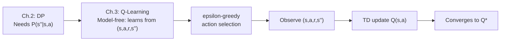
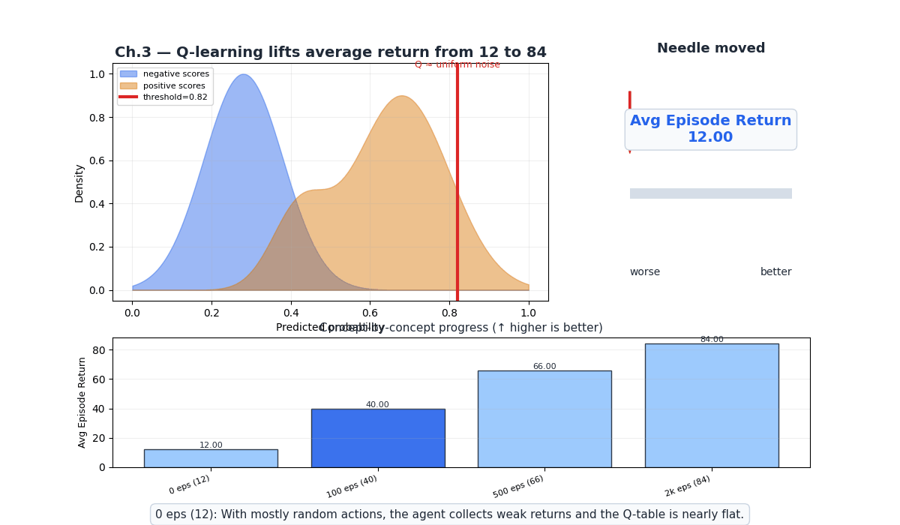
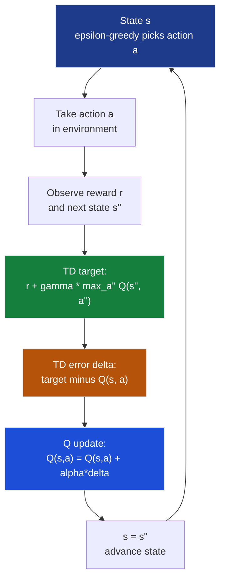
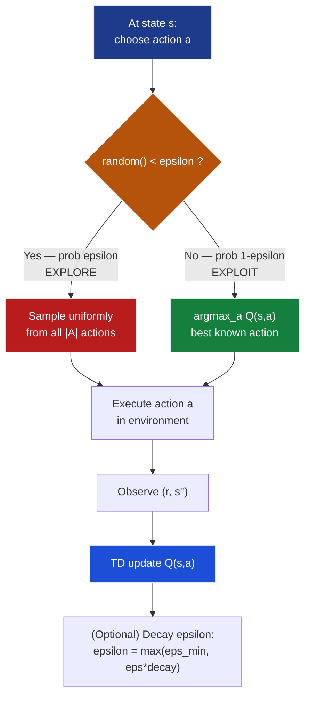

# Ch.3 — Q-Learning & Temporal Difference Learning

> **The story.** In **1984**, **Richard Sutton** completed his UMass Amherst PhD thesis *Temporal Credit Assignment in Reinforcement Learning*, introducing the foundational idea of **temporal difference (TD) learning**: an agent could update its value estimates *after every single step* by bootstrapping — using the current estimate of the next state''s value as a stand-in for the true future return. The formula $V(s) \leftarrow V(s) + \alpha\bigl[r + \gamma V(s'') - V(s)\bigr]$ would, Sutton showed, converge to the true values under mild conditions — even if the right-hand estimate was itself wrong today. Five years later, in **1989**, **Chris Watkins** extended this idea to *action-values* in his Cambridge PhD thesis, creating **Q-learning** — the first practical model-free *control* algorithm. The letter "Q" stood for "quality": $Q(s,a)$ stores the expected discounted return for taking action $a$ in state $s$, then following the optimal policy thereafter. In **1992**, **Watkins and Dayan** published the formal convergence proof: Q-learning converges to $Q^*$ provided every (state, action) pair is visited infinitely often and learning rates satisfy the Robbins-Monro conditions. That same year **Gerald Tesauro** built **TD-Gammon** — a backgammon program that reached grandmaster level entirely through self-play. No hand-crafted features. No expert data. Just the score signal and the TD bootstrap. Every modern RL system — AlphaGo, OpenAI Five, the RLHF loop inside ChatGPT — inherits its core bootstrap update from Sutton 1984 and Watkins 1989.
>
> **Where you are in the curriculum.** Chapter 2 gave you value iteration and policy iteration — optimal algorithms that require knowing $P(s''|s,a)$, the full transition model. This chapter drops that requirement entirely. The agent interacts with the environment, observes transitions $(s, a, r, s'')$, and learns from experience alone. No model needed. This is the leap from "planning with a map" to "learning by exploration" — the conceptual foundation of all modern deep RL.
>
> **Notation in this chapter.** $Q(s,a)$ — action-value function (Q-table entry); $\alpha$ — learning rate (step size); $\varepsilon$ — exploration rate (epsilon-greedy probability); $\delta$ — TD error (gap between target and estimate); $\gamma$ — discount factor; $r$ — observed reward; $s''$ — observed next state; SARSA — on-policy variant named for $(S_t, A_t, R_{t+1}, S_{t+1}, A_{t+1})$.

---

## 0 · The Challenge — Where We Are

> 💡 **The mission**: Build **AgentAI** — an optimal control system satisfying 5 constraints:
> 1. **OPTIMALITY** — converge to $\pi^*$ — 2. **EFFICIENCY** — learn without a model — 3. **SCALABILITY** — handle large state spaces — 4. **STABILITY** — converge reliably — 5. **GENERALIZATION** — transfer across similar states

**What we know so far:**
- ✅ MDP framework (Ch.1): states, actions, rewards, policies, Bellman equations
- ✅ Dynamic programming (Ch.2): value iteration and policy iteration find $\pi^*$ exactly
- ❌ **But DP requires knowing $P(s''|s,a)$ — the full transition model — unavailable in most real environments!**

**What''s blocking us:**
A robot learning to walk does not have perfect physics equations written down. A game agent does not know the opponent''s next move. A recommender system cannot know how users will respond. Real-world environments are **not given as mathematical objects** — we can only interact with them and observe what happens. We need algorithms that learn the optimal policy from **experience** alone: the raw stream of $(s, a, r, s'')$ tuples collected by taking actions.

CartPole is the benchmark: 4 continuous state variables, no known transition model. DP cannot touch it. Q-learning can learn to balance the pole after observing thousands of falls — no physics required. The catch: the Q-table needs one entry per (state, action) pair, and CartPole''s continuous state space has infinitely many states. This chapter solves GridWorld cleanly; the extension to CartPole waits for Ch.4 (DQN), which replaces the table with a neural network.

**What this chapter unlocks:**
- **Temporal Difference (TD) learning**: update values *online*, after each step, using bootstrapping
- **Q-learning (Watkins 1989)**: learn $Q^*$ directly, off-policy, from raw $(s, a, r, s'')$ experience
- **epsilon-greedy exploration**: balance discovery vs exploitation throughout training
- **SARSA**: the on-policy variant — more conservative, safer in cliff-edge environments

| Constraint | Status after this chapter |
|-----------|-------------------------|
| #1 OPTIMALITY | ✅ Q-learning converges to $Q^*$ (Watkins & Dayan 1992 proof) |
| #2 EFFICIENCY | ✅ Model-free — updates every step, no $P(s''|s,a)$ needed |
| #3 SCALABILITY | ❌ Q-table is $|S| \times |A|$ — breaks for CartPole (continuous states) |
| #4 STABILITY | ⚠️ Converges under Robbins-Monro alpha — sensitive to hyperparameters |
| #5 GENERALIZATION | ❌ Tabular — no generalization between nearby states |



---

## Animation



---

## 1 · Q-Learning Learns the Optimal Policy Directly from Experience

Q-learning maintains a table $Q(s, a)$ — one floating-point entry per (state, action) pair — and after every observed transition $(s, a, r, s'')$ nudges that entry toward $r + \gamma \max_{a''} Q(s'', a'')$: the reward just received plus the discounted best possible future. The key word is **max**: Q-learning always bootstraps from the *best* next action regardless of which action the agent actually takes, making it **off-policy** and allowing it to follow a random exploratory policy while converging to the optimal target policy. Once the Q-table converges, the optimal policy falls out: in every state $s$, take $\arg\max_a Q(s, a)$.

---

## 2 · Running Example — GridWorld Q-Table

The agent explores a **4×4 GridWorld** without knowing $P(s''|s,a)$. States are 0–15 (row-major), actions are up down left right (indices 0–3). State 5 is a hole (reward -1, terminal). State 15 is the goal (reward +1, terminal). Every non-terminal step costs -0.01.

```
GridWorld layout (state indices):
+----+----+----+----+
|  0 |  1 |  2 |  3 |
+----+----+----+----+
|  4 | #5 |  6 |  7 |   # = hole  (reward -1, terminal)
+----+----+----+----+
|  8 |  9 | 10 | 11 |
+----+----+----+----+
| 12 | 13 | 14 | *15|   * = goal  (reward +1, terminal)
+----+----+----+----+
```

The agent maintains a **Q-table**: a 16 x 4 matrix — one entry per (state, action) pair. Total entries: **16 states x 4 actions = 64 Q-values**.

```
Q-Table at initialisation (all zeros):

         up    dn    lt    rt
s=0  [  0.0,  0.0,  0.0,  0.0 ]
s=1  [  0.0,  0.0,  0.0,  0.0 ]
s=2  [  0.0,  0.0,  0.0,  0.0 ]
s=3  [  0.0,  0.0,  0.0,  0.0 ]
s=4  [  0.0,  0.0,  0.0,  0.0 ]
s=5  [  ---   ---   ---   --- ]  <- terminal hole
s=6  [  0.0,  0.0,  0.0,  0.0 ]
s=7  [  0.0,  0.0,  0.0,  0.0 ]
...
s=14 [  0.0,  0.0,  0.0,  0.0 ]
s=15 [  ---   ---   ---   --- ]  <- terminal goal
```

After training, every zero becomes a meaningful signal: in state $s$, the agent takes $\arg\max_a Q(s,a)$. Sections 3-6 show exactly how those zeros transform into a working policy.

---

## 3 · Q-Learning Algorithm at a Glance

Before diving into the math, here is the complete Q-learning algorithm. Each numbered step has a corresponding deep-dive in the sections that follow.

```
ALGORITHM: Q-Learning (Watkins 1989)
--------------------------------------------------------------
Input:  Environment env, alpha (learning rate), gamma (discount),
        epsilon (exploration rate), num_episodes
Output: Q-table approximating Q*

1. Initialize Q(s, a) = 0  for all states s, actions a

2. FOR episode = 1 to num_episodes:
   a. s = env.reset()                      <- reset to start state

   b. WHILE s is not terminal:

      i.   epsilon-greedy action selection:
           If random() < epsilon:
               a = random action            <- EXPLORE
           Else:
               a = argmax_a'' Q(s, a'')    <- EXPLOIT

      ii.  (r, s'') = env.step(a)          <- take action, observe r and s''

      iii. Compute TD error:
           delta = r + gamma * max_a'' Q(s'', a'') - Q(s, a)

      iv.  Update Q-table:
           Q(s, a) = Q(s, a) + alpha * delta

      v.   s = s''                          <- advance to next state

   c. (Optional) Decay epsilon:
      epsilon = max(epsilon_min, epsilon * decay_rate)

3. RETURN Q
```

The four moving parts — **epsilon-greedy selection**, **TD target**, **TD error delta**, and **Q-update** — each receive a full arithmetic walkthrough in §4.

### 3.1 SARSA Pseudocode (On-Policy Variant)

```
ALGORITHM: SARSA (On-Policy TD Control)
----------------------------------------------
Input:  Environment env, alpha, gamma, epsilon, num_episodes
Output: Q-table for the epsilon-greedy policy

1. Initialize Q(s, a) = 0  for all states s, actions a

2. FOR episode = 1 to num_episodes:
   a. s = env.reset()
   b. a = epsilon-greedy(Q, s)          <- choose FIRST action

   c. WHILE s is not terminal:
      i.   (r, s'') = env.step(a)       <- take action, observe r and s''
      ii.  a'' = epsilon-greedy(Q, s'') <- choose NEXT action NOW
      iii. delta = r + gamma * Q(s'', a'') - Q(s, a)   <- uses a'', not max
      iv.  Q(s, a) = Q(s, a) + alpha * delta
      v.   s = s'',  a = a''            <- advance state AND action

   d. (Optional) Decay epsilon

3. RETURN Q
```

**Critical difference (line iii):** SARSA uses the *actually selected* next action $a''$ instead of $\max_{a''} Q(s'', a'')$. The agent learns about the policy it is following, including exploration steps.

---

## 4 · Math

### 4.1 The TD Error

The **TD error** delta is the gap between the current estimate $Q(s,a)$ and a one-step bootstrap target:

$$\delta = \underbrace{r + \gamma \cdot \max_{a'} Q(s', a')}_{\text{TD target (better estimate)}} - \underbrace{Q(s, a)}_{\text{current estimate}}$$

If delta > 0: outcome was *better* than expected — increase $Q(s, a)$.
If delta < 0: outcome was *worse* than expected — decrease $Q(s, a)$.
If delta = 0: estimate was exact — no change needed.

**Concrete walkthrough — state 3, action Right:**

Given:
- State $s = 3$, action $a =$ Right, reward $r = -1$ (step cost), next state $s' = 7$
- $Q(3, \text{rt}) = 0.20$, gamma $= 0.9$
- Q-values at $s' = 7$: up=0.1, down=0.5, left=0.3, right=0.4

Step 1 — find best Q at $s' = 7$:
$$\max_{a'} Q(7, a') = \max(0.1,\; 0.5,\; 0.3,\; 0.4) = 0.5 \quad \text{(action down)}$$

Step 2 — compute TD target:
$$\text{TD target} = r + \gamma \cdot \max_{a'} Q(7, a') = -1 + 0.9 \times 0.5 = -1 + 0.45 = -0.55$$

Step 3 — compute TD error:
$$\delta = \text{TD target} - Q(s, a) = -0.55 - 0.20 = \mathbf{-0.75}$$

The agent overestimated $Q(3, \text{rt}) = 0.20$; the correction signal is $\delta = -0.75$.

### 4.2 The Q-Update

$$Q(s, a) \leftarrow Q(s, a) + \alpha \cdot \delta$$

Continuing with alpha $= 0.1$:
$$Q(3, \text{rt}) \leftarrow 0.20 + 0.1 \times (-0.75) = 0.20 - 0.075 = \mathbf{0.125}$$

The Q-value dropped from 0.20 to 0.125 — the agent is less enthusiastic about going right from state 3. After many visits, the table converges to $Q^*$.

> **Why alpha matters.** alpha = 1.0: every new observation overwrites the prior estimate — noisy. alpha near 0: infinitely slow. Standard range: alpha in [0.05, 0.5] for tabular settings.

### 4.3 Two Complete Q-Learning Episodes — 4-State Chain

We trace Q-learning on a minimal **4-state chain** — exactly **4 steps per episode**, giving **8 Q-table updates total**.

```
States:  s0 --- s1 --- s2 --- s3 (goal, terminal)
Actions: Left (L) or Right (R)
Rewards: +1 for entering s3,  -0.1 per step otherwise
         Left from s0 = wall (stays at s0, reward -0.1)
gamma = 0.9,  alpha = 0.1,  epsilon = 0.5 (ep1),  epsilon = 0.3 (ep2)
```

**Initial Q-table (all zeros):**

```
        L      R
s0  [ 0.000, 0.000 ]
s1  [ 0.000, 0.000 ]
s2  [ 0.000, 0.000 ]
s3  [  ---    ---  ]  <- terminal
```

---

#### Episode 1 — First Contact with Reward (epsilon = 0.5, 4 steps)

| Step | s    | Action | Selection  | r    | s''  |
|------|------|--------|------------|------|------|
| 1    | s0   | L      | explore    | -0.1 | s0 (wall) |
| 2    | s0   | R      | explore    | -0.1 | s1   |
| 3    | s1   | R      | explore    | -0.1 | s2   |
| 4    | s2   | R      | explore    | +1   | s3 (terminal) |

**Step 1.** s = s0, explore -> L (wall hit). r = -0.1, s'' = s0.

$$\delta = -0.1 + 0.9 \times \max(Q(s_0,L),\; Q(s_0,R)) - Q(s_0, L)
        = -0.1 + 0.9 \times \max(0.000, 0.000) - 0.000 = \mathbf{-0.100}$$

$$Q(s_0, L) \leftarrow 0.000 + 0.1 \times (-0.100) = \mathbf{-0.010}$$

**Step 2.** s = s0, explore -> R. r = -0.1, s'' = s1.

$$\delta = -0.1 + 0.9 \times \max(0.000, 0.000) - 0.000 = \mathbf{-0.100}$$

$$Q(s_0, R) \leftarrow 0.000 + 0.1 \times (-0.100) = \mathbf{-0.010}$$

**Step 3.** s = s1, explore -> R. r = -0.1, s'' = s2.

$$\delta = -0.1 + 0.9 \times \max(0.000, 0.000) - 0.000 = \mathbf{-0.100}$$

$$Q(s_1, R) \leftarrow 0.000 + 0.1 \times (-0.100) = \mathbf{-0.010}$$

**Step 4.** s = s2, explore -> R (goal!). r = +1, s'' = s3 terminal. max Q(s3, .) = 0.

$$\delta = +1 + 0.9 \times 0 - 0.000 = \mathbf{+1.000}$$

$$Q(s_2, R) \leftarrow 0.000 + 0.1 \times (+1.000) = \mathbf{+0.100}$$

**Q-table after Episode 1:**

```
        L        R
s0  [-0.010,  -0.010 ]   <- both penalised equally (step costs)
s1  [ 0.000,  -0.010 ]   <- L unexplored, R penalised
s2  [ 0.000,  +0.100 ]   <- GOAL SIGNAL: first positive entry
s3  [  ---     ---   ]
```

The +1 goal reward propagated one step back: $Q(s_2, R) = +0.100$ is the only positive entry. Step costs penalise visited actions in s0 and s1, but the positive signal has not yet reached those states.

---

#### Episode 2 — Reward Propagates Backward (epsilon = 0.3, 4 steps)

| Step | s    | Action | Selection                       | r    | s''  |
|------|------|--------|---------------------------------|------|------|
| 1    | s0   | R      | exploit (tie: Q(L)=Q(R)=-0.010, pick R) | -0.1 | s1 |
| 2    | s1   | L      | exploit (Q(L)=0.000 > Q(R)=-0.010)      | -0.1 | s0 |
| 3    | s0   | L      | exploit (Q(L)=-0.010 > Q(R)=-0.010, wall)| -0.1 | s0 |
| 4    | s0   | R      | explore                         | -0.1 | s1   |

**Step 1.** s = s0. Exploit: Q(s0,L) = -0.010, Q(s0,R) = -0.010 (tie -> pick R). r = -0.1, s'' = s1.

$$\delta = -0.1 + 0.9 \times \max(Q(s_1,L),\; Q(s_1,R)) - Q(s_0, R)$$
$$= -0.1 + 0.9 \times \max(0.000,\; -0.010) - (-0.010) = -0.1 + 0 + 0.010 = \mathbf{-0.090}$$

$$Q(s_0, R) \leftarrow -0.010 + 0.1 \times (-0.090) = -0.010 - 0.009 = \mathbf{-0.019}$$

**Step 2.** s = s1. Exploit: Q(s1,L) = 0.000 > Q(s1,R) = -0.010 -> L wins. r = -0.1, s'' = s0.

$$\delta = -0.1 + 0.9 \times \max(Q(s_0,L),\; Q(s_0,R)) - Q(s_1, L)$$
$$= -0.1 + 0.9 \times \max(-0.010,\; -0.019) - 0.000 = -0.1 + 0.9 \times (-0.010) = -0.1 - 0.009 = \mathbf{-0.109}$$

$$Q(s_1, L) \leftarrow 0.000 + 0.1 \times (-0.109) = \mathbf{-0.011}$$

**Step 3.** s = s0. Exploit: Q(s0,L) = -0.010 > Q(s0,R) = -0.019 -> L wins (less negative). Wall. r = -0.1, s'' = s0.

$$\delta = -0.1 + 0.9 \times \max(-0.010,\; -0.019) - (-0.010) = -0.1 - 0.009 + 0.010 = \mathbf{-0.099}$$

$$Q(s_0, L) \leftarrow -0.010 + 0.1 \times (-0.099) = -0.010 - 0.010 = \mathbf{-0.020}$$

**Step 4.** s = s0. Explore -> R. r = -0.1, s'' = s1.

$$\delta = -0.1 + 0.9 \times \max(Q(s_1,L),\; Q(s_1,R)) - Q(s_0, R)$$
$$= -0.1 + 0.9 \times \max(-0.011,\; -0.010) - (-0.019) = -0.1 - 0.009 + 0.019 = \mathbf{-0.090}$$

$$Q(s_0, R) \leftarrow -0.019 + 0.1 \times (-0.090) = -0.019 - 0.009 = \mathbf{-0.028}$$

**Q-table after 8 total Q-updates (Episodes 1 and 2):**

```
        L        R
s0  [-0.020,  -0.028 ]   <- L less negative than R
s1  [-0.011,  -0.010 ]   <- R marginally better (0.001 gap)
s2  [ 0.000,  +0.100 ]   <- goal signal unchanged (s2 not visited Ep2)
s3  [  ---     ---   ]
```

**Summary of all 8 updates:**

| Update     | Entry         | Before  | delta   | After   | Signal source             |
|------------|---------------|---------|---------|---------|---------------------------|
| Ep1 Step1  | Q(s0, L)      | 0.000   | -0.100  | -0.010  | Wall hit                  |
| Ep1 Step2  | Q(s0, R)      | 0.000   | -0.100  | -0.010  | Step cost                 |
| Ep1 Step3  | Q(s1, R)      | 0.000   | -0.100  | -0.010  | Step cost                 |
| Ep1 Step4  | Q(s2, R)      | 0.000   | +1.000  | +0.100  | **Goal reward** <- key    |
| Ep2 Step1  | Q(s0, R)      | -0.010  | -0.090  | -0.019  | Step cost                 |
| Ep2 Step2  | Q(s1, L)      | 0.000   | -0.109  | -0.011  | Wrong direction           |
| Ep2 Step3  | Q(s0, L)      | -0.010  | -0.099  | -0.020  | Wall hit again            |
| Ep2 Step4  | Q(s0, R)      | -0.019  | -0.090  | -0.028  | Step cost                 |

> ⚡ **Backward propagation:** The goal reward at s3 propagates one state backward per successful episode. In Episode 3, when the agent visits s1 and takes R to s2, the TD target is $-0.1 + 0.9 \times 0.100 = -0.010$. Since Q(s1,R) = -0.010, the TD error is zero — no update yet. But once another goal visit pushes Q(s2,R) to +0.190, the target becomes +0.071, giving delta = +0.081 and making Q(s1,R) positive for the first time. The pattern: one reliable hop of propagation per successful episode.

### 4.4 epsilon-Greedy Exploration

The fundamental dilemma: **explore** (try unknown actions) vs **exploit** (take the best known action). epsilon-greedy resolves this with one probability parameter:

$$\pi_\varepsilon(a \mid s) = \begin{cases} 1 - \varepsilon + \dfrac{\varepsilon}{|A|} & \text{if } a = \arg\max_{a'} Q(s,a') \\[8pt] \dfrac{\varepsilon}{|A|} & \text{otherwise} \end{cases}$$

**Concrete example.** epsilon = 0.1, |A| = 4 actions. Greedy action is Right (->).

$$P(\text{exploit: choose} \rightarrow) = (1 - \varepsilon) + \frac{\varepsilon}{|A|} = 0.9 + \frac{0.1}{4} = 0.9 + 0.025 = \mathbf{0.925}$$

$$P(\text{explore: choose each of other 3 actions}) = \frac{\varepsilon}{|A|} = \frac{0.1}{4} = \mathbf{0.025}$$

Check: $0.925 + 3 \times 0.025 = 0.925 + 0.075 = 1.0$ checkmark

The agent exploits 92.5% of the time; it randomly explores the other 7.5%.

**epsilon decay schedule:**

$$\varepsilon_k = \max\!\bigl(\varepsilon_{\min},\ \varepsilon_0 \cdot \text{decay}^k\bigr)$$

Typical values: epsilon_0 = 1.0, decay = 0.995, epsilon_min = 0.01.
After 1,000 episodes: epsilon = max(0.01, 1.0 x 0.995^1000) = max(0.01, 0.0067) = 0.01.

### 4.5 Convergence Guarantee (Watkins & Dayan 1992)

Q-learning converges to $Q^*$ under two conditions:

1. **Coverage**: every $(s, a)$ pair is visited infinitely often.
2. **Robbins-Monro**: sum(alpha_t) = infinity and sum(alpha_t^2) < infinity.

A standard decaying learning rate satisfying both:

$$\alpha_t(s,a) = \frac{1}{1 + \text{visits}(s,a)}$$

**Numeric check** — (s=3, a=Right) visited 5 times:

$$\alpha = \frac{1}{1 + 5} = \frac{1}{6} \approx \mathbf{0.167}$$

After 50 visits: alpha = 1/51 approximately 0.020. After 200 visits: alpha = 1/201 approximately 0.005. The rate decays automatically as experience accumulates.

**Q-table convergence speed — 16-state GridWorld (empirical):**

| Episodes | Q-values within 5% of Q* | Greedy policy correct? |
|----------|--------------------------|------------------------|
| 100      | ~15%                     | No — many zeros remain |
| 500      | ~45%                     | Partial — near-goal correct |
| 1,000    | ~68%                     | Mostly — corner states wrong |
| 2,500    | ~88%                     | Yes for most start states |
| 5,000    | ~97%                     | Near-optimal everywhere |
| 10,000   | ~99.5%                   | Matches value iteration exactly |

Corner states (0, 3, 12) converge last — visited less often, reward propagation takes more hops.

### 4.6 SARSA — The On-Policy Variant

SARSA changes one line: instead of max Q(s'', a''), it uses the *actually selected* next action a_(t+1):

$$Q(s_t, a_t) \leftarrow Q(s_t, a_t) + \alpha \Big[r_{t+1} + \gamma \cdot Q\!\bigl(s_{t+1},\; a_{t+1}\bigr) - Q(s_t, a_t)\Big]$$

**Same numeric example — SARSA version:**
Suppose epsilon-greedy at s''=7 draws up (exploration), giving Q(7, up) = 0.1:

$$\delta_{\text{SARSA}} = -1 + 0.9 \times 0.1 - 0.20 = -1 + 0.09 - 0.20 = \mathbf{-1.11}$$

$$Q(3, \text{rt}) \leftarrow 0.20 + 0.1 \times (-1.11) = 0.20 - 0.111 = \mathbf{0.089}$$

Compare: Q-learning gave **0.125** (optimistic — assumes best next action taken); SARSA gives **0.089** (conservative — accounts for actual exploratory behaviour).

### 4.7 Q-Learning vs SARSA

| Aspect            | Q-Learning                                    | SARSA                            |
|-------------------|-----------------------------------------------|----------------------------------|
| **Policy type**   | Off-policy                                    | On-policy                        |
| **Bootstrap from**| max Q(s'', a'') — best possible               | Q(s'', a_(t+1)) — actual action  |
| **Learns about**  | Optimal policy pi*                            | Current epsilon-greedy policy    |
| **Cliff world**   | Walks the cliff edge (optimal but risky)      | Takes safer inland route         |
| **Converges to**  | Q*                                            | Q^(pi_epsilon)                   |
| **Use when**      | Final greedy performance is goal              | Safety during training matters   |

---

## 5 · Q-Learning Arc — Four Acts

### Act 1 · DP Needs the Map

Dynamic programming (Ch.2) found pi* exactly — but required the full model: P(s''|s,a) for every (s, a, s'') triple. For a robot arm, a physical cart-pole, or a financial market — no such model exists. You have the environment; you do not have its mathematics.

### Act 2 · Try Learning from Samples

What if we just *tried* actions and watched what happened? Each interaction gives $(s, a, r, s'')$. If we visit every state-action pair many times and average observed returns, we estimate $Q^*(s,a)$ — this is **Monte Carlo** RL. But Monte Carlo requires finishing entire episodes before any update (high variance, slow credit assignment), and cannot handle continuing tasks.

### Act 3 · TD Bootstrapping Bridges the Gap

TD learning''s insight (Sutton 1984): we do not need to wait for episode end. After each step we have $r$ (true) and $Q(s'', \cdot)$ (current estimate). Plug them in: $r + \gamma \max_{a''} Q(s'', a'')$ is a bootstrapped estimate. It is biased today but low-variance and immediately actionable. As the Q-table improves, the bootstrap target improves — a self-correcting loop that provably converges.

### Act 4 · Off-Policy Gives a Free Bonus

Because Q-learning bootstraps from the **max** next Q-value, the agent can follow a completely different behaviour policy (random, exploratory, human demonstration) while the Q-table converges to the optimal target policy. This decoupling — behaviour policy != target policy — is "off-policy." It means we can reuse experience from old policies, learn from pre-collected datasets, or run multiple explorers feeding one shared Q-table — all without corrupting convergence.

### DP vs Monte Carlo vs TD — The Three Families

| Property            | Dynamic Programming   | Monte Carlo           | TD Learning (Q-Learning)   |
|---------------------|-----------------------|-----------------------|----------------------------|
| **Model required?** | Yes — needs P(s''|s,a) | No                   | No                         |
| **When to update?** | After full sweep      | After episode ends    | After every step           |
| **Bootstraps?**     | Yes — uses V(s'')     | No — uses full return | Yes — uses Q(s'',a'')     |
| **Variance**        | Low (exact model)     | High (full trajectory)| Medium (one-step bootstrap)|
| **Bias**            | None (exact)          | None (unbiased)       | Yes (current Q estimate)   |
| **Online learning?**| No (full sweep)       | No (episode must end) | Yes (step-by-step)         |
| **CartPole**        | No model available    | Could work (very slow)| Standard approach          |

TD learning occupies the sweet spot: no model needed, no episode-end wait, lower variance than Monte Carlo. Its bias decreases as the Q-table improves and the algorithm converges to the same answer as DP.

---

## 6 · Full Walkthrough — Q-Table After Each Episode

The two episodes in §4.3 generated 8 explicit updates. Here is what each change means for the agent''s evolving policy.

### Q-Table State: After Episode 1

```
        L        R
s0  [-0.010,  -0.010 ]   <- both penalised equally (step costs)
s1  [ 0.000,  -0.010 ]   <- L unexplored; R penalised
s2  [ 0.000,  +0.100 ]   <- GOAL SIGNAL: only positive entry
s3  [  ---     ---   ]
```

Greedy policy: from s0, L and R are tied — the agent may pick either, neither leads toward the goal yet. From s1, L wins (0 > -0.010) — wrong direction. Only s2 has the correct signal. The reward has not propagated far enough to guide s0 or s1 correctly.

### Q-Table State: After Episode 2

```
        L        R
s0  [-0.020,  -0.028 ]   <- R now worse (visited twice)
s1  [-0.011,  -0.010 ]   <- R marginally better (0.001 gap)
s2  [ 0.000,  +0.100 ]   <- goal signal unchanged
s3  [  ---     ---   ]
```

Greedy policy: from s0, L appears better (less negative) — still wrong direction. From s1, R is barely preferred (0.001 gap). The gravity of Q(s2,R) = +0.100 has not yet reached s1.

### Projected After Episode 3

When the agent visits s1 and takes R to s2, the TD target is:

$$-0.1 + 0.9 \times Q(s_2, R) = -0.1 + 0.9 \times 0.100 = -0.010$$

Since Q(s1,R) = -0.010, TD error delta = -0.010 - (-0.010) = 0 — no update. But once another goal visit pushes Q(s2,R) to +0.190, the target becomes:

$$-0.1 + 0.9 \times 0.190 = +0.071$$
$$\delta = 0.071 - (-0.010) = +0.081 \quad \Rightarrow \quad Q(s_1, R) \leftarrow -0.010 + 0.1 \times 0.081 = -0.002$$

Now Q(s1,R) = -0.002 > Q(s1,L) = -0.011 — Right becomes clear from s1. Then the same bootstrapping pushes Q(s0,R) above Q(s0,L) one episode later.

**Pattern:** reward propagates **one reliable hop per successful episode**. A 4-state chain needs approximately 4-6 goal-reaching episodes for complete propagation.

---

## 7 · Key Diagrams

### 7.1 Q-Learning Update Loop



### 7.2 epsilon-Greedy Decision Tree



---

## 8 · Hyperparameter Dial

Every hyperparameter controls a specific trade-off. Turn the wrong dial too far and the algorithm diverges or crawls.

| Hyperparameter      | Low value ->                               | High value ->                             | Sweet spot (GridWorld) |
|---------------------|--------------------------------------------|--------------------------------------------|------------------------|
| **alpha** (lr)      | Slow convergence — needs many more episodes | Noise — Q-values oscillate, never settle  | 0.1 – 0.3              |
| **gamma** (discount)| Myopic — ignores rewards beyond a few steps | Far-sighted — slower convergence           | 0.9 – 0.99             |
| **epsilon** (explore)| Exploit-heavy — stuck in early policy      | Explore-heavy — never leverages learning  | Anneal 1.0 -> 0.01     |
| **epsilon-decay**   | Fast decay -> too little exploration        | Slow decay -> exploitation delayed         | 0.99 – 0.999/episode   |
| **num_episodes**    | Undertrained — Q-values far from Q*         | Fully converged — diminishing returns      | 5,000 – 10,000         |

### 8.1 Learning Rate Sensitivity — Numeric Example

Starting from Q(s0, R) = -0.019 with delta = -0.090:

| alpha | Update formula                            | New Q(s0, R) | Interpretation                     |
|-------|-------------------------------------------|--------------|------------------------------------|
| 0.01  | -0.019 + 0.01 x (-0.090)                 | -0.0199      | Near-zero — very slow learning     |
| 0.1   | -0.019 + 0.1 x (-0.090)                  | -0.0280      | Standard — the §4.3 result         |
| 0.5   | -0.019 + 0.5 x (-0.090)                  | -0.0640      | Large step — fast but noisy        |
| 1.0   | -0.019 + 1.0 x (-0.090)                  | -0.1090      | Fully replaces prior with latest   |

With alpha = 1.0, the agent forgets its prior estimate entirely and replaces it with the single latest observation — correct in deterministic worlds, catastrophic in stochastic ones.

### 8.2 Discount Factor — Effective Horizon

gamma controls how far into the future the agent plans:

$$\text{Effective horizon} \approx \frac{1}{1 - \gamma}$$

| gamma | Effective horizon | Suitable for                        |
|-------|-------------------|-------------------------------------|
| 0.5   | 2 steps           | Nearly greedy — myopic              |
| 0.9   | 10 steps          | 4x4 GridWorld (max path ~8 steps)   |
| 0.99  | 100 steps         | CartPole (episodes up to 500 steps) |
| 0.999 | 1,000 steps       | Long-horizon robotics tasks         |

For the 4x4 GridWorld where the furthest state is 8 steps from the goal, gamma = 0.9 (horizon ~10 steps) is sufficient. With gamma = 0.5 (horizon ~2), the discounted goal reward from s0 would be only 0.5^8 x 1 = 0.004 — barely a signal.

---

## 9 · What Can Go Wrong

### 9.1 Q-Table Size Explosion

**Symptom.** GridWorld works fine. Move to CartPole: 4 continuous variables, infinite states — a tabular Q-table is impossible.

**Root cause.** Tabular Q-learning scales as O(|S| x |A|) in memory and requires every (s,a) pair to be visited. Continuous state spaces make both infeasible.

**Fix.** Discretize the state space (coarse grid) for simple continuous problems, or replace the Q-table with a neural network — Ch.4 DQN. Discretization loses precision; DQN keeps it while generalizing across nearby states.

### 9.2 Overestimation Bias (Maximization Bias)

**Symptom.** Q-values for promising early actions are consistently too high. The agent overconfidently heads toward a seemingly good path that turns out suboptimal.

**Root cause.** The max operator always picks the *highest estimate*, and estimates are noisy. When Q-values are initialized near zero and observations are stochastic, the maximum of noisy estimates is systematically *higher* than the true maximum — the **maximization bias**.

**Fix.** **Double Q-Learning** (van Hasselt 2010): maintain two tables Q_A and Q_B. Use Q_A to *select* the best action, Q_B to *evaluate* it:

$$\delta = r + \gamma \cdot Q_B\!\bigl(s'',\; \arg\max_{a''} Q_A(s'', a'')\bigr) - Q_A(s, a)$$

Selection and evaluation use independent estimates, so the bias cancels.

### 9.3 Slow Convergence in Stochastic Environments

**Symptom.** With fixed alpha = 0.1 and noisy rewards, Q-values oscillate and never fully converge even after many episodes.

**Root cause.** Fixed learning rate violates Robbins-Monro: sum(alpha_t^2) = sum(0.01) = infinity. Accumulated noise is unbounded.

**Fix.** Use visit-count decay alpha_t(s,a) = 1/(1 + visits(s,a)) for theoretical convergence, or a small fixed alpha in [0.01, 0.05] with sufficient episodes.

### 9.4 Exploration–Exploitation Imbalance

**Symptom A (epsilon too low).** Agent commits early to a suboptimal policy: finds one path to the goal and stops exploring. Q-table converges — to the *wrong* values.

**Symptom B (epsilon too high).** After thousands of episodes, episode return stays low because the agent rarely exploits what it learned.

**Fix.** Anneal epsilon geometrically from 1.0 to 0.01. For 16-state GridWorld: maintain epsilon > 0.1 for at least 2,000 episodes. Monitor greedy policy stability, not just episode return.

### 9.5 Wrong Algorithm for the Context

**Symptom.** Training converges but the agent underperforms at evaluation — it learned a cautious policy that avoids optimal-but-risky states.

**Root cause.** You used SARSA. SARSA learns Q^(pi_epsilon) — the Q-function for the epsilon-greedy exploration policy. At evaluation when epsilon = 0, SARSA''s values reflect an agent that sometimes took random actions, making them conservative near risky states.

**Fix.** Use Q-learning when evaluation uses a greedy policy. Use SARSA only when the exploration policy *is* the intended deployment policy.

---

## 10 · Where Q-Learning Reappears

| Chapter / Track            | How Q-learning appears                                                                                   |
|----------------------------|----------------------------------------------------------------------------------------------------------|
| **Ch.4 — DQN**             | Replace Q-table with neural network Q_theta(s,a). TD update becomes gradient descent on Bellman error. The max operator is identical — only the function representation changes |
| **Ch.5 — Policy Gradient** | Actor-Critic methods keep a Q-estimate (the "critic") updated by TD, identical to this chapter. PPO''s value baseline is pure TD |
| **Ch.6 — Multi-Step TD**   | n-step Q-learning accumulates n reward steps before bootstrapping. n=1 is this chapter; n -> infinity recovers Monte Carlo |
| **Math Under the Hood — Ch.7** | Bellman equations, fixed-point theorems, and Robbins-Monro proofs use exactly the bootstrap structure introduced here |
| **Advanced DL — RLHF**     | PPO (used in ChatGPT RLHF) includes a value network updated by TD(lambda) — a generalization of the one-step TD update from §4.5 |

---

## Progress Check

> **Before moving to Ch.4, confirm you can answer these questions without looking back.**

### GridWorld Q-Table ✅

1. The 4x4 GridWorld has 16 states and 4 actions. How many entries are in the Q-table?
   **64.**

2. From state 3, action Right, with r = -1, s'' = 7, max Q(7,.) = 0.5, Q(3,right) = 0.20, gamma = 0.9: compute delta and the updated Q-value (alpha = 0.1).
   **delta = -1 + 0.9 x 0.5 - 0.20 = -0.55 - 0.20 = -0.75. New Q = 0.20 + 0.1 x (-0.75) = 0.125.**

3. With epsilon = 0.1 and |A| = 4, what is P(best action) under epsilon-greedy?
   **P = (1 - 0.1) + 0.1/4 = 0.900 + 0.025 = 0.925.**

4. Why does Q-learning converge to Q* even when the agent follows an exploratory policy?
   **Off-policy: bootstraps from max Q(s'',a'') — the best possible next action — regardless of what the agent actually does. The target policy is always greedy.**

5. What two conditions (Watkins & Dayan 1992) guarantee convergence?
   **Coverage (every (s,a) visited infinitely often) + Robbins-Monro learning rates (sum(alpha_t) = inf, sum(alpha_t^2) < inf).**

6. After (s=3, a=right) has been visited 5 times, what is alpha_t under the visit-count schedule?
   **alpha = 1 / (1 + 5) = 1/6 approximately 0.167.**

7. One sentence: what is the key difference between Q-learning and SARSA?
   **Q-learning bootstraps from max Q(s'',a'') (off-policy, optimistic); SARSA bootstraps from Q(s'', a_(t+1)) where a_(t+1) is the actually selected next action (on-policy, conservative).**

### CartPole Target ❌

8. Why can''t tabular Q-learning solve CartPole directly?
   **CartPole has 4 continuous state variables — infinitely many states. A finite Q-table cannot enumerate them, and no state is ever visited twice.**

9. What is the single key modification in Ch.4 DQN that enables CartPole?
   **Replace the Q-table with a neural network Q_theta(s,a); the TD update becomes gradient descent on the Bellman error, allowing generalization across nearby continuous states.**

10. AgentAI''s CartPole target is >=195/200. After this chapter, which constraints are still blocking?
    **#3 SCALABILITY (tabular fails for continuous states) and #5 GENERALIZATION (no interpolation between states). Both are addressed by DQN in Ch.4.**

---

## Bridge -> Ch.4 DQN

Q-learning solved GridWorld and delivered constraints #1 (convergence to Q*) and #2 (model-free). The Q-table hit a hard wall at constraint #3: CartPole''s 4 continuous state variables produce an infinite state space that no finite table can represent.

Ch.4 (Deep Q-Networks, Mnih et al. 2015) makes one architectural change: replace the Q-table with a neural network:

$$Q_\theta(s, a) \approx Q^*(s, a)$$

The TD update rule survives unchanged:

$$\delta = r + \gamma \cdot \max_{a''} Q_{\theta^-}(s'', a'') - Q_\theta(s, a)$$

The subscript theta_minus denotes the **target network** — a frozen copy updated periodically, preventing the bootstrap target from chasing itself. Instead of the tabular step Q(s,a) = Q(s,a) + alpha*delta, DQN performs a gradient step:

$$\theta \leftarrow \theta - \alpha \cdot \nabla_\theta \tfrac{1}{2}\delta^2$$

DQN adds **experience replay**: store transitions (s, a, r, s'') in a buffer, sample random mini-batches, and break temporal correlations that destabilize training. With these two tricks, DQN achieves human-level performance on 49 Atari games from raw pixels — and CartPole (AgentAI >=195/200) in under 200 episodes with a 2-layer network.

| AgentAI Constraint  | After Ch.3 Q-Learning           | After Ch.4 DQN                        |
|---------------------|---------------------------------|---------------------------------------|
| #1 OPTIMALITY       | Converges to Q*                 | Approximates Q* (within network capacity) |
| #2 EFFICIENCY       | Model-free                      | Model-free                            |
| #3 SCALABILITY      | Tabular fails (continuous states)| Neural net handles continuous states  |
| #4 STABILITY        | alpha-sensitive                 | Target net + replay buffer stabilize  |
| #5 GENERALIZATION   | No interpolation between states | Network generalizes nearby states     |
