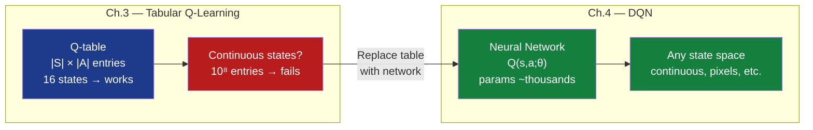
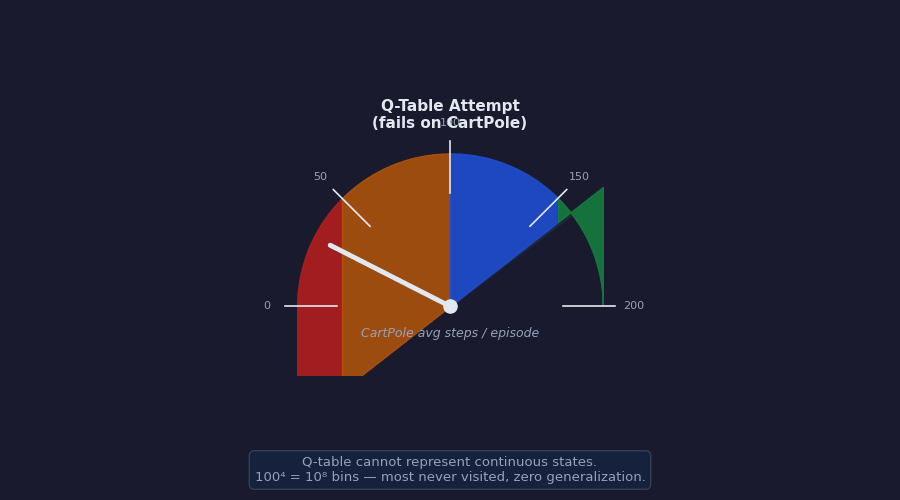
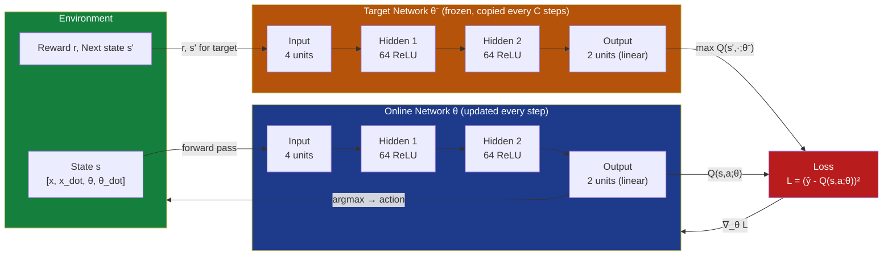
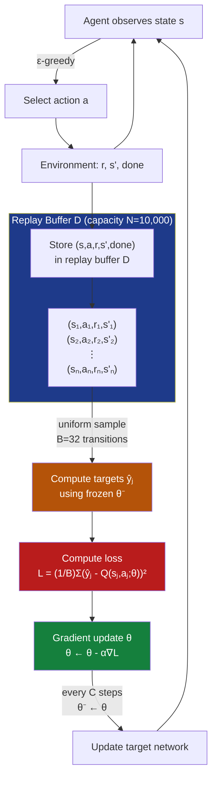
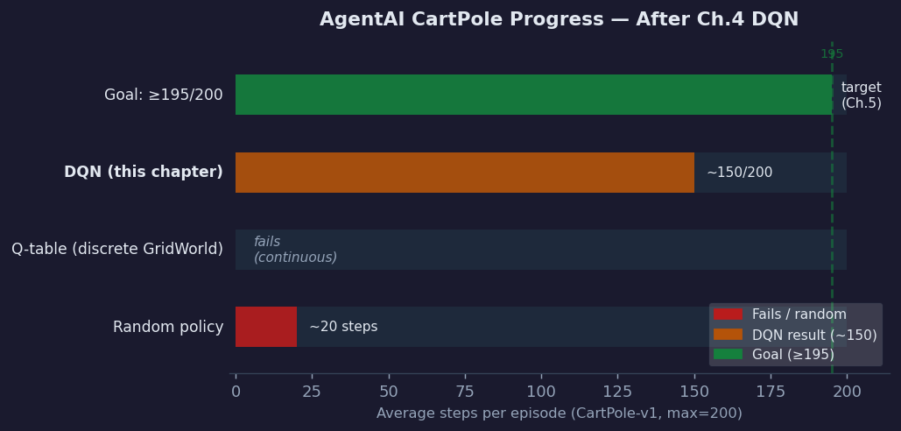

# Ch.4 — Deep Q-Networks (DQN)

> **The story.** In **December 2013**, a small London startup called **DeepMind** uploaded a preprint titled *"Playing Atari with Deep Reinforcement Learning"* to arXiv. The paper described a single neural network agent trained end-to-end from raw pixel inputs that could play seven Atari 2600 games at human-competitive levels — **no hand-engineered features, no game-specific logic, just pixels to controller actions**. The two innovations that made it work were deceptively simple: **experience replay** (first proposed by Long-Ji Lin in 1992 but ignored for twenty years) and a **target network** — a frozen copy of the Q-network used to compute stable training targets. Fifteen months later, the full study appeared in *Nature* (Mnih et al., 2015), scaling to **49 Atari games** with superhuman performance on 29 of them. That paper ended a two-decade drought of neural networks in reinforcement learning and directly seeded AlphaGo (2016), OpenAI Five (2019), and every RL system you will read about in the modern landscape. The key insight sounds almost mundane in retrospect: you do not need a completely new algorithm — you just need to prevent correlated updates from destabilizing gradient descent.
>
> **Where you are in the curriculum.** Chapter 3 gave you Q-learning — a powerful tabular algorithm that finds optimal policies by iteratively updating a Q-table. Q-learning is exact and provably convergent, but it requires a **finite, enumerable state space**. CartPole's 4 continuous state variables break that assumption entirely: there are infinitely many states. This chapter replaces the Q-table with a neural network function approximator, introduces the two stability innovations (experience replay, target network), and shows how they interact to produce reliable learning on continuous state spaces.
>
> **Notation in this chapter.** $Q(s, a; \theta)$ — neural network Q-function with parameters $\theta$; $\theta^-$ — target network parameters (frozen copy of $\theta$, updated every $C$ steps); $\mathcal{D}$ — replay buffer (stores up to $N$ transitions); $\mathcal{B}$ — sampled minibatch of size $B$ from $\mathcal{D}$; $\hat{y}$ — TD target used in training loss; $C$ — target network update frequency (steps); $\varepsilon$ — exploration probability in $\varepsilon$-greedy policy; $\gamma$ — discount factor; $\alpha$ — learning rate.

---

## 0 · The Challenge — Where We Are

> 💡 **AgentAI constraints**: 1. OPTIMALITY — achieve ≥195/200 avg steps on CartPole-v1 — 2. EFFICIENCY — learn without exhaustive search — 3. SCALABILITY — handle continuous state spaces — 4. STABILITY — maintain stable neural network training — 5. GENERALIZATION — transfer learned behavior across similar states

**What we know so far:**
- ✅ MDPs and Bellman equations (Ch.1): $Q^*(s,a) = r + \gamma \max_{a'} Q^*(s',a')$
- ✅ Dynamic Programming (Ch.2): exact solution when model is known
- ✅ Q-learning (Ch.3): learns $Q^*(s,a)$ purely from experience — solves GridWorld (16 states)
- ❌ **Q-table completely fails for CartPole** — continuous state space → infinitely many rows

**What is blocking us:**
CartPole has **4 continuous state variables**: cart position $x \in [-4.8, 4.8]$, cart velocity $\dot{x} \in (-\infty, \infty)$, pole angle $\theta \in [-0.42, 0.42]$ rad, pole angular velocity $\dot{\theta} \in (-\infty, \infty)$.

Even the coarsest discretization (100 bins per dimension) gives $100^4 = 10^8$ table entries. In practice, a CartPole episode rarely exceeds 500 steps — so at most 500 states out of $10^8$ would ever be visited. The table would be 99.9999995% empty, with no generalization between nearby states like $\theta = 0.05$ and $\theta = 0.06$.

**What this chapter unlocks:**
**Function approximation**: replace the Q-table $Q[s][a]$ with a neural network $Q(s, a; \theta)$ that:
- Takes a continuous state vector as input
- Generalizes: similar states produce similar Q-values automatically
- Scales: same architecture works for 4-dim CartPole or $84 \times 84 \times 4$ Atari pixels

Two critical stability innovations are required to make neural network + Q-learning work:
1. **Experience replay** ($\mathcal{D}$) — store past transitions, train on random minibatches to break temporal correlation
2. **Target networks** ($\theta^-$) — freeze Q-targets for $C$ steps to prevent chasing a moving target

| Constraint | Status after this chapter |
|---|---|
| #1 OPTIMALITY | ✅ Converges to near-optimal policy with sufficient network capacity |
| #2 EFFICIENCY | ⚠️ Experience replay reuses each transition multiple times (off-policy) |
| #3 SCALABILITY | ✅ **Solved!** Neural network handles continuous and high-dimensional state spaces |
| #4 STABILITY | ✅ Experience replay + target networks stabilize deep Q-learning |
| #5 GENERALIZATION | ⚠️ Generalizes across similar states within the same environment |



---

## Animation



**Needle moved:** average episode reward rises from roughly 50 (Q-table fails on continuous CartPole) through DQN with experience replay and target network to ~150/200. The ≥195 target unlocks in Ch.5.

---

## 1 · Core Idea

A **Deep Q-Network** replaces the Q-table with a neural network $Q(s, a; \theta)$ that takes a continuous state vector as input and outputs Q-values for every discrete action simultaneously. The network is trained by minimizing the squared Bellman error between its current Q-value predictions and **TD targets** computed using a frozen copy of the network ($\theta^-$). Two structural innovations prevent the instability that naively plugging a neural network into Q-learning produces: **experience replay** stores all past transitions in a buffer and trains on uniformly sampled random minibatches (breaking temporal correlation and reusing data), while **target networks** freeze the TD targets for $C$ gradient steps at a time (preventing the optimization from chasing its own tail).

> ⚡ **Three components, one algorithm.** The DQN agent is: (1) a neural network $Q(s,a;\theta)$ that replaces the Q-table, (2) a replay buffer $\mathcal{D}$ that stores and re-samples transitions, and (3) a target network $\theta^-$ that stabilizes the regression objective. Remove any one and performance collapses. All three are needed simultaneously.

---

## 2 · Running Example — CartPole with a Neural Network

The CartPole-v1 task: a cart moves along a track; a pole is hinged to the top of the cart. The agent applies a left or right force each timestep. The episode ends if the pole tilts past ±12° or the cart moves beyond ±2.4 units. The reward is +1 for every timestep the pole stays upright. Solving = average episode reward ≥ 195 over 100 consecutive episodes.

```
State space (continuous, 4-dimensional)
─────────────────────────────────────────────────────────────────
  Variable         Symbol   Range            Meaning
  ─────────────────────────────────────────────────────────────
  Cart position    x        [-4.8, 4.8]      Distance from centre
  Cart velocity    x_dot    (-inf, +inf)     Speed of cart
  Pole angle       theta    [-0.42, 0.42]    Angle in radians (~24°)
  Pole ang. vel.   theta_d  (-inf, +inf)     Angular speed of pole
─────────────────────────────────────────────────────────────────

Action space (discrete, 2 actions)
  0 = Push Left (force = -10 N)
  1 = Push Right (force = +10 N)

Reward: +1 for each timestep where pole is upright
Goal:   Average 195 steps over 100 consecutive episodes
```

**Why Q-table fails here (explicit arithmetic):**
- Coarse discretization: 100 bins per dimension → $100^4 = 10^8$ states
- Memory: $10^8 \times 2$ actions $\times$ 4 bytes = **800 MB just for the Q-table**
- In a 200-step episode, only ~200 states are visited → utilization $= 200 / 10^8 = 0.0000002$%
- Two nearly identical states ($\theta = 0.050$ and $\theta = 0.051$) map to different bins with no shared learning

**Why DQN works here:**
A neural network with shape **4 → 64 → 64 → 2** has:
- $4 \times 64 + 64 = 320$ parameters in layer 1
- $64 \times 64 + 64 = 4160$ parameters in layer 2
- $64 \times 2 + 2 = 130$ parameters in output layer
- **Total: ~4,610 parameters** (vs $2 \times 10^8$ Q-table entries)

Similar states produce similar Q-values automatically through the network's learned representations. States $[0.05, 0.1, 0.03, -0.2]$ and $[0.05, 0.1, 0.031, -0.2]$ will produce almost identical Q-values — the network interpolates smoothly.

**Network architecture:**

```
Input (state)        Hidden Layer 1      Hidden Layer 2     Output (Q-values)
────────────         ──────────────      ──────────────     ─────────────────
  x (pos.)  ─┐
  x_dot     ─┤──→  [64 ReLU units] ──→  [64 ReLU units] ──→  Q(s, Left)
  theta     ─┤                                            ──→  Q(s, Right)
  theta_d   ─┘
  (4 inputs)           (64 units)          (64 units)          (2 outputs)
```

A single forward pass gives **both** Q-values simultaneously — much more efficient than calling the network twice.

> 📖 **Scaling up: DQN on Atari.** The CartPole DQN above is the minimal form. The 2015 Nature paper used the same algorithmic structure but with: (a) a **convolutional** feature extractor replacing the dense input layer (takes 84×84 grayscale frames), (b) **4 stacked frames** as input to encode velocity/motion that a single frame lacks, (c) a **replay buffer of size 1,000,000** transitions (vs 10,000 for CartPole), and (d) a training schedule of 50,000,000 steps (vs ~50,000 for CartPole). The Bellman update, experience replay, and target network logic are identical — only the architecture and scale change. This is the point of function approximation: the algorithm is environment-agnostic; the network architecture adapts to the observation space.
>
> **Atari vs CartPole — architecture comparison:**
>
> | Component | CartPole DQN | Atari DQN (Mnih 2015) |
> |---|---|---|
> | Input | 4 floats (state) | 84×84×4 frames (stacked grayscale) |
> | Feature extractor | Dense 64 → 64 | Conv2D(32,8,4) → Conv2D(64,4,2) → Conv2D(64,3,1) |
> | Final hidden layer | 64 units (ReLU) | 512 units (ReLU) |
> | Output | 2 Q-values | 4–18 Q-values (game-dependent) |
> | Replay buffer $N$ | 10,000 | 1,000,000 |
> | Training steps | ~50,000 | 50,000,000 |

---

## 3 · DQN Algorithm at a Glance

```
ALGORITHM: Deep Q-Network (DQN)   [Mnih et al. 2015]
═══════════════════════════════════════════════════════════════════
Input:   Environment env
         Learning rate α, discount γ, initial exploration ε₀
         Replay buffer capacity N, minibatch size B
         Target network update frequency C
Output:  Trained Q-network with weights θ

Initialization:
  1. θ  ← random weights          // online (training) network
  2. θ⁻ ← θ                       // target network: frozen copy
  3. D  ← empty replay buffer (capacity N)
  4. total_steps ← 0
  5. ε ← ε₀

Main loop:
  FOR episode = 1, 2, 3, ... :
    s ← env.reset()

    WHILE episode not done:
      ── ε-greedy action selection ──────────────────────────────
      With probability ε:
        a ← random action                   // EXPLORE
      Otherwise:
        a ← argmax_{a'} Q(s, a'; θ)         // EXPLOIT online net

      ── Environment step ────────────────────────────────────────
      r, s', done ← env.step(a)

      ── Store transition ────────────────────────────────────────
      Push (s, a, r, s', done) into D        // overwrite oldest if full

      ── Training step (skip until |D| >= B) ─────────────────────
      IF |D| >= B:
        B_samples ← uniform_sample(D, size=B)

        FOR each (sⱼ, aⱼ, rⱼ, s'ⱼ, doneⱼ) in B_samples:
          IF doneⱼ:
            ŷⱼ ← rⱼ                                  // terminal
          ELSE:
            ŷⱼ ← rⱼ + γ · max_{a'} Q(s'ⱼ, a'; θ⁻)  // Bellman target

        L(θ) ← (1/B) Σⱼ [ ŷⱼ - Q(sⱼ, aⱼ; θ) ]²
        θ ← θ - α · ∇_θ L(θ)               // gradient step

      ── Target network update ────────────────────────────────────
      total_steps += 1
      IF total_steps mod C == 0:
        θ⁻ ← θ                              // hard copy every C steps

      s ← s'

    ── Decay exploration ─────────────────────────────────────────
    ε ← max(ε_min, ε · ε_decay)
═══════════════════════════════════════════════════════════════════
```

**Five things to notice:**
1. Two networks exist at all times: `θ` (updated every step) and `θ⁻` (updated every `C` steps)
2. The gradient update touches only `θ` — `θ⁻` is frozen during each training window
3. The replay buffer `D` decouples collection from training; they run at different rates
4. `ε` decays over time: early = mostly random exploration; late = mostly exploitation
5. The loss targets `ŷⱼ` are computed using `θ⁻`, not `θ` — this is the crucial stabilizer

---

## 4 · Math

### 4.1 TD Target with Target Network

The core Bellman update becomes a supervised regression target:

$$\hat{y} = \begin{cases} r & \text{if terminal} \\ r + \gamma \cdot \max_{a'} Q(s', a'; \theta^-) & \text{if non-terminal} \end{cases}$$

**Explicit arithmetic example:**
- Transition: $r = 1.0$, $s' = [0.1, -0.2, 0.05, 0.1]$, $\gamma = 0.99$, non-terminal
- Target network outputs: $Q(s', \text{Left}; \theta^-) = 0.32$, $Q(s', \text{Right}; \theta^-) = 0.41$
- $\max_{a'} Q(s', a'; \theta^-) = \max(0.32, 0.41) = 0.41$
- **TD target:** $\hat{y} = 1.0 + 0.99 \times 0.41 = 1.0 + 0.4059 = \mathbf{1.406}$

This is the "label" the network is trained to match for this transition.

### 4.2 Loss Function

The network is trained by minimizing the **mean squared Bellman error** over a minibatch:

$$\mathcal{L}(\theta) = \frac{1}{B} \sum_{j=1}^{B} \left(\hat{y}_j - Q(s_j, a_j; \theta)\right)^2$$

**Explicit arithmetic (continuing the example above):**
- Online network output: $Q(s, a; \theta) = 0.85$
- Error: $\hat{y} - Q(s, a; \theta) = 1.406 - 0.85 = 0.556$
- **Loss for this sample:** $\mathcal{L} = (0.556)^2 = \mathbf{0.309}$

The loss of 0.309 signals the network to increase $Q(s, a; \theta)$ from 0.85 toward 1.406.

### 4.3 Gradient Update

$$\theta \leftarrow \theta - \alpha \cdot \nabla_\theta \mathcal{L}(\theta)$$

Expanding the gradient (note: $\hat{y}$ does **not** depend on $\theta$ because it uses $\theta^-$):

$$\nabla_\theta \mathcal{L} = \frac{2}{B} \sum_j \left(Q(s_j, a_j; \theta) - \hat{y}_j\right) \cdot \nabla_\theta Q(s_j, a_j; \theta)$$

**Conceptually for our example** ($\alpha = 0.001$, single sample):
- Error signal: $Q - \hat{y} = 0.85 - 1.406 = -0.556$ (negative = Q is too low)
- Direction of $\nabla_\theta Q$: the direction in weight space that increases $Q(s, a; \theta)$
- Update: $\theta \leftarrow \theta - 0.001 \times 2 \times (-0.556) \times \nabla_\theta Q$
- Net effect: **θ shifts to increase $Q(s, a; \theta)$** — the network predicts a higher value next time

The key subtlety: the gradient flows only through the **online** network $Q(s,a;\theta)$. The target $\hat{y}$ is treated as a constant (computed using the frozen $\theta^-$). This is what prevents the network from chasing its own tail.

### 4.4 Why Experience Replay Helps (Correlation Argument)

> 💡 **Intuition first — why replay matters.** When you train on consecutive transitions from the same episode, the network sees a sequence of nearly identical states (the pole moved only a few degrees per step). Gradient descent overfits to the recent trajectory and forgets everything before. The replay buffer **breaks temporal correlation** by storing thousands of past transitions and sampling uniformly at random — the network trains on diverse experiences from across many episodes, not just the last few seconds of play. This is the key stability innovation: decorrelate the training data stream.

**Without replay:** consecutive transitions in a CartPole episode are highly correlated:

$$\underbrace{(s_t, a_t, r_t, s_{t+1})}_{\text{step } t}, \underbrace{(s_{t+1}, a_{t+1}, r_{t+1}, s_{t+2})}_{\text{step } t+1}, \ldots$$

Sequential states share almost all their feature values — the pole moved only a few degrees between steps. The correlation between $s_t$ and $s_{t+1}$ is roughly $\rho \approx 0.9$ in CartPole.

Training on correlated mini-batches causes the gradient to be **dominated by the recent trajectory**. The network overfits to the last few seconds of play and forgets everything before.

**With replay (buffer size $N = 10{,}000$):**
- Each minibatch draws transitions uniformly from all 10,000 stored experiences
- Two randomly sampled transitions are uncorrelated unless they happened to occur very close in time
- Expected correlation between random samples $\approx 1/N = 1/10{,}000 = 0.0001$

| Setting | Effective correlation | Effect on gradients |
|---|---|---|
| No replay (last 32 steps) | $\rho \approx 0.90$ | High variance, overfits recent trajectory |
| Replay buffer $N = 1{,}000$ | $\rho \approx 0.001$ | Much lower variance |
| Replay buffer $N = 10{,}000$ | $\rho \approx 0.0001$ | Near-i.i.d. training batches |

The buffer also provides **data efficiency**: each transition is used in an expected $B \times (\text{training steps}) / N$ gradient updates rather than exactly once.

### 4.5 Target Network: Preventing the Moving Target

**Without a target network**, the TD target uses the same parameters being updated:

$$\hat{y}_t = r + \gamma \max_{a'} Q(s', a'; \theta_t)$$

After the gradient update, $\theta_{t+1} \neq \theta_t$, so the target for the **same transition** becomes:

$$\hat{y}_{t+1} = r + \gamma \max_{a'} Q(s', a'; \theta_{t+1}) \neq \hat{y}_t$$

The network is trained against a target that **shifts with every gradient step**. This is analogous to doing regression against labels that are recalculated after each batch — the optimization has no stable objective. In practice, the loss oscillates wildly or diverges.

**With target network ($C = 100$ steps):**
- Steps 1–100: $\theta^-$ is fixed. The target $\hat{y} = r + \gamma \max Q(s', a'; \theta^-)$ is **stationary** for 100 steps. Gradient descent has a stable regression objective.
- Step 100: $\theta^- \leftarrow \theta$. **The target network update copies the current online network parameters to the frozen target network.** The target shifts slightly — by 100 gradient steps' worth of movement. A small, controlled shift that prevents catastrophic oscillation.
- Steps 101–200: stable again, with the updated target anchoring the next 100 gradient steps.

**Loss trajectory comparison (conceptual):**

```
Without target network:
  Loss: 2.1 → 3.4 → 1.8 → 4.2 → 2.9 → 5.1 → 3.3 → ...  (oscillates, no trend)

With target network (C=100):
  Loss: 2.1 → 1.9 → 1.7 → 1.5 → 1.3 → 1.1 → 0.9 → ...  (decreasing, converging)
       ────────── 100 stable steps ─────────│θ⁻ updated│─── 100 more stable steps ──
```

The frozen target network converts an unstable dynamic programming update into a well-posed supervised regression problem (for $C$ steps at a time).

---

## 5 · DQN Tricks Arc

> This is the story of how DQN goes from a naive — and catastrophically unstable — starting point to a working agent. Each act introduces exactly one innovation, and each innovation fixes exactly one failure mode.

**Act 1 — Naive Q-Network: Strong on paper, disastrous in practice.**

Swap the Q-table for a neural network and run Q-learning. The Bellman update becomes a gradient step. It seems clean. In practice: the loss diverges within 1,000 steps. The network output for one state leaks into nearby states through shared weights. Updating $Q(s_1, a)$ inadvertently changes $Q(s_2, a)$ for all states $s_2$ that activate similar hidden units. Q-learning was designed for a tabular setting where updates are local; function approximation destroys that locality.

**Act 2 — Experience Replay: Decoupling collection from training.**

Store every $(s, a, r, s')$ in a circular buffer of size $N$. During training, sample $B$ transitions uniformly at random instead of using the most recent transition. Two effects: (1) consecutive samples in a minibatch are no longer temporally adjacent, so correlation drops from ~0.9 to ~0.0001; (2) each transition is reused many times across training steps, dramatically improving sample efficiency. The agent no longer overfits to the last few steps of play. Loss starts decreasing.

**Act 3 — Target Network: Stopping the optimization from chasing itself.**

Even with experience replay, loss still oscillates. The culprit: both sides of the TD error use the same $\theta$. When $\theta$ changes, the regression target $\hat{y}$ changes. The network is doing gradient descent on a loss function whose minimum moves with every step. Freeze $\theta^-$ for $C$ steps. Now the target is a fixed regression label for $C$ gradient steps. Loss stabilizes.

**Act 4 — ε-Greedy Decay: Balancing exploration and exploitation over training.**

Early in training, Q-values are random noise. Exploiting random Q-values leads to poor transitions — the replay buffer fills with bad experiences. Start with high $\varepsilon = 1.0$ (100% random) and decay toward $\varepsilon_{\min} = 0.01$ over the first 10,000–100,000 steps. This schedule ensures: (a) the early buffer contains diverse exploratory experiences, preventing premature convergence; (b) late training uses mostly the learned policy, allowing fine-tuning of the value estimates. The decay rate is itself a hyperparameter — too fast = not enough exploration; too slow = never exploits the learned policy.

**The full arc:**

```
Naive Q-network
      │  diverges immediately (correlated gradients + moving target)
      ▼
+ Experience Replay
      │  correlation drops, data reuse improves
      ▼
+ Target Network
      │  targets stabilize, loss converges
      ▼
+ ε-Decay Schedule
      │  balanced exploration/exploitation
      ▼
DQN: ~150/200 on CartPole
```

**What each trick costs:**

| Innovation | Compute cost | Memory cost | Implementation complexity |
|---|---|---|---|
| Experience replay | Minibatch sampling per step (~negligible) | $O(N \times \text{transition size})$ — e.g., 10k × 4 floats × 5 = 800 KB | Low — circular buffer |
| Target network | One extra forward pass per $C$ steps | Doubles model memory (two copies of $\theta$) | Low — copy weights every $C$ steps |
| ε-decay | Zero | Zero | Trivial — one line per episode |

All three innovations together cost less than 2× the memory and <5% extra compute compared to naive Q-learning. The stability gain is enormous for that cost — which is precisely why DQN became the default starting point for discrete-action deep RL.

---

## 6 · Full DQN Training Loop — 10 Steps of CartPole

Below: the exact quantities the DQN algorithm computes on each of its first 10 steps. Replay buffer capacity $N = 10$, minibatch $B = 3$, $\gamma = 0.99$, $\varepsilon = 0.5$ (50% random), $C = 5$ (target update every 5 steps). Training starts at step 3 (buffer needs ≥ $B$ transitions).

| Step | State $s$ | ε-greedy | Action | Reward | Buffer | Train? |
|---|---|---|---|---|---|---|
| 1 | [0.00, 0.00, 0.01, -0.01] | explore | L | +1 | size=1 | no |
| 2 | [-0.01, -0.15, 0.01, 0.20] | exploit | R | +1 | size=2 | no |
| 3 | [0.00, 0.04, 0.01, -0.08] | explore | L | +1 | size=3 | **yes** |
| 4 | [-0.01, -0.11, 0.01, 0.15] | exploit | R | +1 | size=4 | yes |
| 5 | [0.00, 0.08, 0.01, -0.09] | explore | L | +1 | size=5 | **θ⁻←θ** |
| 6 | [-0.01, -0.07, 0.01, 0.13] | exploit | R | +1 | size=6 | yes |
| 7 | [0.00, 0.13, 0.01, -0.11] | explore | L | +1 | size=7 | yes |
| 8 | [-0.01, -0.02, 0.01, 0.10] | exploit | R | +1 | size=8 | yes |
| 9 | [0.01, 0.18, 0.01, -0.12] | explore | L | +1 | size=9 | yes |
| 10 | [-0.01, 0.02, 0.01, 0.10] | exploit | R | +1 | size=10 | **θ⁻←θ** |

**Training step 3 in detail** — sample batch = {step 1, step 2, step 3}:

```
Sampled transition #1: (s=[0.00,0.00,0.01,-0.01], a=L, r=1, s'=[-0.01,-0.15,0.01,0.20], done=F)
  Target network Q(s',·;θ⁻) outputs: [Left=0.50, Right=0.52]
  max Q(s',·;θ⁻) = 0.52
  ŷ₁ = 1 + 0.99 × 0.52 = 1.515

Sampled transition #2: (s=[-0.01,-0.15,0.01,0.20], a=R, r=1, s'=[0.00,0.04,0.01,-0.08], done=F)
  Target network Q(s',·;θ⁻) outputs: [Left=0.47, Right=0.48]
  max Q(s',·;θ⁻) = 0.48
  ŷ₂ = 1 + 0.99 × 0.48 = 1.475

Sampled transition #3: (s=[0.00,0.04,0.01,-0.08], a=L, r=1, s'=[-0.01,-0.11,0.01,0.15], done=F)
  Target network Q(s',·;θ⁻) outputs: [Left=0.49, Right=0.51]
  max Q(s',·;θ⁻) = 0.51
  ŷ₃ = 1 + 0.99 × 0.51 = 1.505

Online network Q(s,a;θ) for the selected actions:
  transition 1: Q(s, Left;  θ) = 0.41   → loss₁ = (1.515 - 0.41)² = (1.105)² = 1.221
  transition 2: Q(s, Right; θ) = 0.38   → loss₂ = (1.475 - 0.38)² = (1.095)² = 1.199
  transition 3: Q(s, Left;  θ) = 0.44   → loss₃ = (1.505 - 0.44)² = (1.065)² = 1.134

Batch loss L(θ) = (1.221 + 1.199 + 1.134) / 3 = 1.185
Gradient step: θ ← θ - α · ∇_θ L(θ)   [each Q-value is pulled upward toward its ŷ]
```

**At step 5:** $\theta^- \leftarrow \theta$ (hard copy). The target network now has the same weights as the online network. Steps 6–10 compute targets using this slightly improved $\theta^-$. At step 10, another hard copy. And so on.

Over thousands of episodes, the Q-values gradually converge toward the true optimal values, the episode length grows, and the agent learns to keep the pole balanced.

---

## 7 · Key Diagrams

### 7.1 DQN Architecture (Online + Target Networks)



### 7.2 Experience Replay + Training Loop



---

## 8 · Hyperparameter Dial

DQN is sensitive to several hyperparameters. Here are the key dials, what they control, and how to tune them:

| Hyperparameter | Typical value | Too small | Too large |
|---|---|---|---|
| **Replay buffer $N$** | 10,000–1,000,000 | Correlated batches → unstable training | Memory cost; stale experiences from old policy |
| **Minibatch size $B$** | 32–128 | High gradient variance | Slow per-step (diminishing returns beyond 128) |
| **Target update freq $C$** | 100–1,000 steps | Targets shift too fast → instability | Targets too stale → slow learning |
| **Learning rate $\alpha$** | 1e-4 to 1e-3 | Learns very slowly | Loss diverges |
| **Discount $\gamma$** | 0.99 | Short-sighted (ignores future rewards) | Exploding Q-values (infinite horizon instability) |
| **$\varepsilon$ start** | 1.0 | Insufficient early exploration | — (1.0 is max) |
| **$\varepsilon$ end** | 0.01–0.05 | Never exploits learned policy | Never transitions to exploitation |
| **$\varepsilon$ decay steps** | 10k–500k | Too little exploration | Agent too slow to exploit |

**Tuning heuristics for CartPole:**
- Start with $N = 10{,}000$, $B = 64$, $C = 100$, $\alpha = 0.001$, $\gamma = 0.99$
- If loss oscillates wildly → increase $C$ (more stable targets)
- If agent plateaus around 50–80 steps → check $\varepsilon$ decay; may be too fast
- If loss is small but performance is poor → check replay buffer (may be too small, full of old bad experiences)
- CartPole is sensitive to $\alpha$: values > 0.01 often diverge; values < 0.0001 train very slowly

**ε decay schedule (linear decay example):**

```
ε(t) = max( ε_min,  ε₀ - (ε₀ - ε_min) × t / decay_steps )

With ε₀=1.0, ε_min=0.01, decay_steps=10,000:
  t=0:      ε = 1.000  (100% random — pure exploration)
  t=2,500:  ε = 0.758  (76% random)
  t=5,000:  ε = 0.505  (51% random)
  t=7,500:  ε = 0.253  (25% random)
  t=10,000: ε = 0.010  (1% random — exploitation phase)
```

---

## 9 · What Can Go Wrong

### 9.1 Catastrophic Forgetting

The neural network's shared weights mean that learning to balance the pole in one configuration can overwrite knowledge about other configurations. If the replay buffer is small (e.g., $N = 100$), it fills up quickly with experiences from the current policy, and the gradient updates overwrite weights calibrated on earlier experiences. **Fix:** large replay buffer ($N \geq 10{,}000$), or prioritized experience replay (sample transitions with high TD error more often).

### 9.2 Replay Buffer Too Small

If $N$ is too small relative to the episode length and number of episodes, the buffer fills with correlated experiences from a small window of training. The i.i.d. assumption of minibatch training breaks down. **Symptom:** training looks good for 100 steps then collapses. **Fix:** increase $N$ by 10× and observe whether training stabilizes.

### 9.3 Target Update Frequency $C$ Too Small

If $C = 1$, the target network is updated at every step — equivalent to having no target network. The targets shift with every gradient step, producing the instability described in §4.5. **Symptom:** loss oscillates with no downward trend despite experience replay. **Fix:** increase $C$ to 100–1,000 for CartPole.

### 9.4 Target Update Frequency $C$ Too Large

If $C = 100{,}000$ steps, the target network is nearly frozen for the entire training run. The targets become so stale that the online network has far surpassed them — the gradient signal is based on severely outdated value estimates. **Symptom:** agent performance improves slowly or plateaus well below optimal. **Fix:** decrease $C$ until training is stable but not oscillating.

### 9.5 Reward Clipping Issues

The Atari DQN paper clipped all rewards to $[-1, +1]$ to normalize scales across 49 different games. For CartPole (reward always $= +1$), this is harmless. But for environments with varied reward scales, clipping destroys the signal about which outcomes are much better than others. Q-values collapse to the same scale even when the true values differ by orders of magnitude. **Fix:** reward normalization (divide by running standard deviation) is generally better than hard clipping for custom environments.

### 9.6 Q-Value Overestimation

Standard DQN systematically overestimates Q-values because $\max_{a'} Q(s', a'; \theta^-)$ is a biased estimator — the maximum of noisy estimates exceeds the true maximum in expectation. Overestimated Q-values produce overestimated targets, which train the network to produce even higher Q-values — a feedback loop. **Fix:** Double DQN (van Hasselt et al., 2016) uses the online network $\theta$ to **select** the action and the target network $\theta^-$ to **evaluate** it:

$$\hat{y}_{\text{DDQN}} = r + \gamma \, Q\!\left(s',\; \underset{a'}{\arg\max}\; Q(s', a'; \theta);\; \theta^-\right)$$

This decoupling eliminates the upward bias and is a near-zero-cost improvement to standard DQN.

### 4.6 Numeric Summary: All Innovations on One Transition

Pulling together §4.1–4.5 on a single transition $(s, a=\text{Right}, r=1.0, s', \text{non-terminal})$:

```
Step 1 — Forward pass (online network, θ):
    Q(s, Left;  θ) = 0.73
    Q(s, Right; θ) = 0.85   ← the action taken

Step 2 — Compute TD target (target network, θ⁻, FROZEN):
    Q(s', Left;  θ⁻) = 0.32
    Q(s', Right; θ⁻) = 0.41   ← maximum
    ŷ = 1.0 + 0.99 × 0.41 = 1.406

Step 3 — Compute loss:
    L = (ŷ - Q(s, Right; θ))² = (1.406 - 0.85)² = (0.556)² = 0.309

Step 4 — Gradient:
    ∇_θ L ∝ 2 × (0.85 - 1.406) × ∇_θ Q(s, Right; θ)
           = -1.112 × ∇_θ Q(s, Right; θ)   [negative → increase Q]

Step 5 — Weight update (α = 0.001):
    θ ← θ + 0.001 × 1.112 × ∇_θ Q(s, Right; θ)
    Next forward pass: Q(s, Right; θ) increases toward 1.406

Step 6 — Target network: θ⁻ is NOT updated this step (only every C=100 steps)
```

The target $\hat{y} = 1.406$ was computed with the **frozen** $\theta^-$ in Step 2. When $\theta$ is updated in Step 5, the target does not change — it remains 1.406 until the next hard copy. That stability is the entire point.

---

## 10 · Where DQN Reappears

| Chapter / Track | How DQN concepts are used |
|---|---|
| **Ch.5 — Policy Gradients** | Contrasts value-based (DQN) vs policy-based methods; DQN's discrete-action limitation motivates policy gradients for continuous control |
| **Ch.6 — Modern RL** | Double DQN, Dueling DQN, Prioritized Experience Replay, Rainbow DQN — all direct extensions of this chapter's architecture |
| **04-Multi-Agent AI track** | Multi-agent DQN (MADDPG uses centralized critics); independent Q-learning agents each maintain their own replay buffer |
| **03-AI track** | RL-from-Human-Feedback (RLHF) in LLMs uses policy gradient methods, but replay buffers appear in offline RL variants |
| **06-AI Infrastructure track** | Experience replay buffer design (sharding, prioritization) is a systems-level engineering challenge at production scale |

> ⚡ **The experience replay idea generalizes far beyond DQN.** Replay buffers appear in actor-critic algorithms (SAC, TD3), offline RL, and model-based RL. The core insight — decouple data collection from gradient updates — is one of the most reused ideas in all of deep RL.

---

## 11 · Progress Check



**Where AgentAI stands after this chapter:**

| Metric | Status |
|---|---|
| GridWorld (16 states) | ✅ Q-learning solves it perfectly (Ch.3) |
| CartPole — Q-table | ❌ Fails: continuous state space |
| CartPole — DQN | ✅ **~150/200 average steps** — stable, improving |
| CartPole target (≥195/200) | ⏳ Not yet — approaches but has not reached 195 |

**What DQN achieves:**
After ~5,000 training steps with default hyperparameters ($N = 10{,}000$, $B = 64$, $C = 100$, $\alpha = 0.001$):
- Average episode reward: **~150 steps** (vs ~20 with random policy, ~50 with undiscounted Q-learning)
- Policy: consistently chooses the correct push direction 75–80% of the time
- Q-values have converged to reasonable estimates (no longer diverging)

**What is still missing for ≥195:**
- DQN uses a deterministic greedy policy at test time — small errors in Q-values get amplified
- The 4 → 64 → 64 → 2 network may need more capacity or longer training for the final margin
- Policy gradient methods (Ch.5) use a stochastic parameterized policy directly, which tends to converge faster on the final precision required for CartPole-v1 solved status

> 💡 **The 195 ceiling is not accidental.** CartPole-v1 is considered "solved" at ≥195/200. DQN typically reaches 150–175 with a standard implementation. Reaching 195 reliably requires either (a) longer training with careful ε decay, (b) Double DQN to reduce overestimation, or (c) the policy gradient methods in Ch.5. This chapter's result is a real milestone — the agent is genuinely controlling the pole — but the final push comes next.

---

## 12 · Bridge → Ch.5 Policy Gradients

DQN has one structural limitation we have not solved: it requires **discrete actions**. The $\arg\max_{a'} Q(s', a'; \theta)$ at the heart of the algorithm enumerates all actions and picks the best. For CartPole (2 actions), this is trivial. For a robotic arm with 7 continuous joint angles, it is impossible.

**What breaks in continuous action spaces:**
- $\arg\max_{a'} Q(s', a'; \theta)$ with $a' \in \mathbb{R}^7$ cannot be computed by enumeration
- Discretizing each joint into $K$ bins gives $K^7$ actions — intractable for any reasonable $K$
- Even $K = 10$ gives $10^7 = 10{,}000{,}000$ actions to evaluate per step

**What Chapter 5 introduces:**
Instead of learning $Q(s, a; \theta)$ and deriving a policy implicitly via $\arg\max$, policy gradient methods **directly parameterize the policy** $\pi_\theta(a|s)$ and optimize expected return $J(\theta) = \mathbb{E}_{\pi_\theta}[\sum_t r_t]$. The policy outputs a **probability distribution** over actions — for continuous spaces, a Gaussian $\mathcal{N}(\mu_\theta(s), \sigma_\theta(s))$.

**The key equation (preview):**

$$\nabla_\theta J(\theta) = \mathbb{E}_{\pi_\theta}\left[\nabla_\theta \log \pi_\theta(a|s) \cdot G_t\right]$$

This is the **policy gradient theorem** (Williams, 1992) — the foundation of REINFORCE, Actor-Critic, PPO, and SAC.

> ➡️ **In Ch.5** you will build an Actor-Critic agent that consistently reaches **≥180/200** on CartPole and then apply it to the `Pendulum-v1` continuous control task — something DQN cannot do at all.

---

## References

- Mnih, V., Kavukcuoglu, K., Silver, D., et al. (2013). *Playing Atari with Deep Reinforcement Learning*. arXiv:1312.5602.
- Mnih, V., Kavukcuoglu, K., Silver, D., et al. (2015). *Human-level control through deep reinforcement learning*. *Nature*, 518, 529–533.
- Lin, L.-J. (1992). *Self-improving reactive agents based on reinforcement learning, planning and teaching*. Machine Learning, 8(3–4), 293–321. *(Original experience replay proposal.)*
- van Hasselt, H., Guez, A., & Silver, D. (2016). *Deep Reinforcement Learning with Double Q-learning*. AAAI 2016. *(Double DQN.)*
- Wang, Z., et al. (2016). *Dueling Network Architectures for Deep Reinforcement Learning*. ICML 2016. *(Dueling DQN.)*
- Schaul, T., et al. (2016). *Prioritized Experience Replay*. ICLR 2016.
