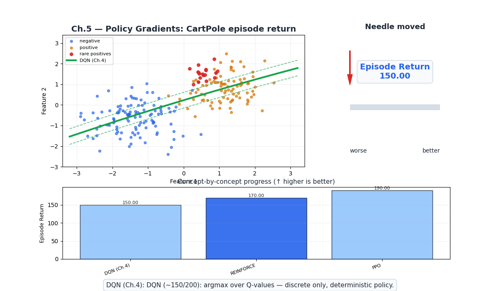
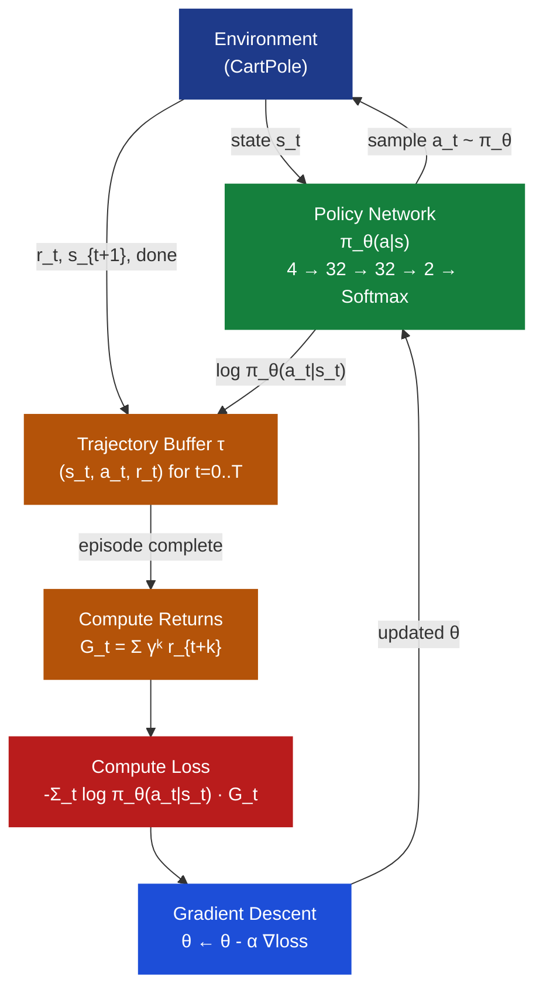
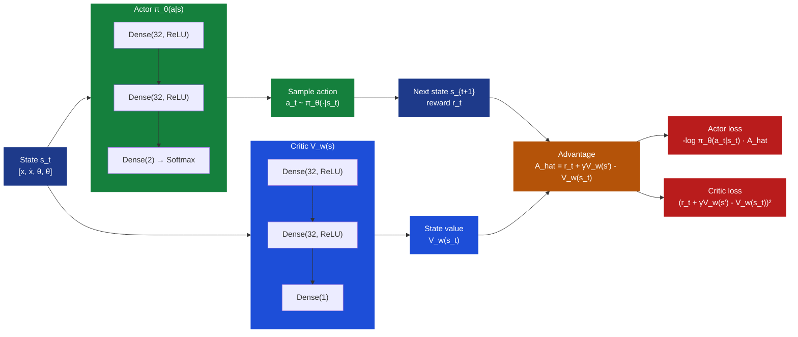
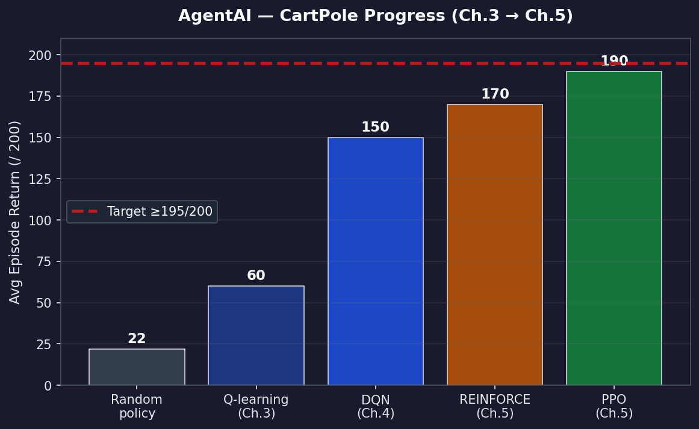

# Ch.5 — Policy Gradients: REINFORCE, Actor-Critic & PPO

> **The story.** In **1992**, **Ronald J. Williams** published "Simple Statistical Gradient-Following Algorithms for Connectionist Reinforcement Learning" and named the central result **REINFORCE**. The insight was algorithmic poetry: increase the log-probability of every action proportionally to the return it generated. No Q-table. No model of the environment. Just follow the gradient of expected reward directly through the policy. The catch — which Williams acknowledged plainly — was *variance*. A single rollout generates one noisy gradient estimate; average a thousand such estimates and the signal emerges, but a thousand rollouts per update was impractical for most problems.
>
> The field spent the 1990s searching for a low-variance alternative. The answer arrived in two back-to-back papers. **Sutton, McAllester, Singh & Mansour (2000)** proved the **Policy Gradient Theorem** — a precise formula showing that $\nabla_\theta J(\theta)$ does not require the derivative of the state-visitation distribution, making the gradient computable from samples alone. Simultaneously, **Konda & Tsitsiklis (2000)** formalized **Actor-Critic** architectures: one network parameterizes the policy (the *actor*); a second estimates the value function (the *critic*). The critic's estimate of $V(s)$ serves as a baseline, turning the noisy return $G_t$ into the much lower-variance **advantage** $A(s,a) = Q(s,a) - V(s)$.
>
> Still, large policy updates remained dangerous — a single bad gradient step could collapse a well-trained policy catastrophically. **Schulman et al. (2015)** attacked this with **TRPO** (Trust Region Policy Optimization), which constrained each update to lie within a KL-divergence ball around the old policy. TRPO worked, but it required computing a constrained second-order optimization at every step — too expensive for large networks. **Schulman et al. (2017)** then published **PPO** (Proximal Policy Optimization), replacing the hard KL constraint with a simple *clipped* surrogate objective: $L^{\text{CLIP}} = \mathbb{E}[\min(r_t A_t,\, \text{clip}(r_t, 1-\varepsilon, 1+\varepsilon) A_t)]$. PPO is first-order, embarrassingly simple to implement, and robust across environments. It is the **most widely deployed RL algorithm in the world** today — used in OpenAI Five, ChatGPT's RLHF training, robotics at Google DeepMind, and most industrial RL stacks.
>
> **Where you are in the curriculum.** Chapter 4 gave you DQN for discrete actions in large state spaces. DQN's Achilles heel is its final layer: $\arg\max_a Q(s,a;\theta)$ enumerates every action and picks the best. That works for the 2 CartPole actions or 18 Atari actions — it fails for the continuous joint torques of a robot arm or the steering angle of a car. This chapter teaches you to parameterize the policy *directly* and optimize it by gradient ascent on expected return, unlocking continuous action spaces and stochastic exploration.
>
> **Notation in this chapter.** $\pi_\theta(a|s)$ — stochastic policy parameterized by $\theta$; $J(\theta) = \mathbb{E}_{\tau \sim \pi_\theta}[G_0]$ — expected return (objective to maximize); $\nabla_\theta J$ — policy gradient; $G_t = \sum_{k=0}^{T-t} \gamma^k r_{t+k}$ — discounted return from step $t$; $V^\pi(s)$ — state value under policy $\pi$; $Q^\pi(s,a)$ — action-value under policy $\pi$; $A^\pi(s,a) = Q^\pi(s,a) - V^\pi(s)$ — advantage function; $b(s)$ — variance-reducing baseline; $r_t(\theta) = \pi_\theta(a_t|s_t) / \pi_{\theta_\text{old}}(a_t|s_t)$ — probability ratio (PPO); $\varepsilon$ — PPO clip parameter.

---

## 0 · The Challenge — Where We Are

> 💡 **The mission**: Solve **AgentAI** — CartPole balance task satisfying 5 constraints:
> 1. **OPTIMALITY**: find $\pi^*$ — 2. **EFFICIENCY**: learn from limited experience — 3. **SCALABILITY**: handle continuous/high-dimensional actions — 4. **STABILITY**: no catastrophic forgetting — 5. **GENERALIZATION**: transfer across environment variations

**What we know so far:**
- ✅ MDPs and Bellman equations give us the theoretical foundation (Ch.1)
- ✅ Dynamic programming finds optimal policies with a known model (Ch.2)
- ✅ Q-learning learns policies purely from experience without a model (Ch.3)
- ✅ DQN scales Q-learning to continuous state spaces with neural networks (Ch.4)
- ✅ DQN scores ~150/200 on CartPole — solid but not yet at target ≥195
- ❌ **DQN is hitting fundamental limits that this chapter must overcome!**

**What is blocking us:**

DQN computes $Q(s, a; \theta)$ for every action and takes $\arg\max_a Q$. This has three deep problems:

1. **Discrete-only**: The $\arg\max$ requires enumerating every action. A robot arm with 7 joints, each taking a torque in $[-2, 2]$ N·m, cannot be discretized sensibly. Even 100 bins per joint gives $100^7 = 10^{14}$ actions — completely intractable.

2. **Deterministic policy**: DQN produces a deterministic policy (always pick the max-Q action). In adversarial or partially observed settings, the optimal policy is often *stochastic* — rock-paper-scissors has no deterministic Nash equilibrium.

3. **Indirect optimization**: We want to maximize $J(\theta) = \mathbb{E}[G_0]$ directly. DQN achieves this *indirectly* by estimating Q-values and hoping the argmax yields a good policy. Policy gradient methods cut out the middleman.

**What this chapter unlocks:**

| Concept | What it enables |
|---------|----------------|
| **Policy gradient theorem** | Principled formula for $\nabla_\theta J(\theta)$ from sampled trajectories |
| **REINFORCE** | First practical policy gradient — high variance, but it works |
| **Baseline / advantage** | Subtract $V(s)$ from returns — same gradient direction, far less variance |
| **Actor-Critic** | Two networks: actor $\pi_\theta$ for action selection; critic $V_w$ for variance reduction |
| **PPO clipping** | Prevent large policy updates — the stability trick that makes deep RL reliable |

| Constraint | Status after this chapter |
|-----------|-------------------------|
| #1 OPTIMALITY | ✅ Policy gradient converges to locally optimal stochastic policy |
| #2 EFFICIENCY | ⚠️ REINFORCE is sample-intensive; actor-critic and PPO improve significantly |
| #3 SCALABILITY | ✅ **Solved!** Works for continuous actions — just change output layer |
| #4 STABILITY | ⚠️ REINFORCE is fragile; PPO's clipping dramatically stabilizes training |
| #5 GENERALIZATION | ⚠️ Stochastic policies generalize better than deterministic argmax |


---

## Animation



**Needle moved:** average episode return rises from ~150 (DQN with discrete argmax) to ~170 (REINFORCE with stochastic policy) to ~190 (PPO with clipped objective) as each generation of algorithm removes a fundamental barrier. The ≥195 target falls in Ch.6.

---

## 1 · Core Idea

Policy gradient methods **directly parameterize the policy** $\pi_\theta(a|s)$ as a neural network and **maximize expected return** $J(\theta) = \mathbb{E}_{\tau \sim \pi_\theta}[G_0]$ by gradient ascent on $\theta$. The **policy gradient theorem** (Sutton et al. 2000) gives the key formula: $\nabla_\theta J(\theta) = \mathbb{E}_{\pi_\theta}[\nabla_\theta \log \pi_\theta(a_t|s_t) \cdot Q^{\pi_\theta}(s_t, a_t)]$ — which can be estimated from sampled rollouts without knowing the transition dynamics. In practice, replace $Q$ with the advantage $A(s,a) = Q(s,a) - V(s)$ to reduce variance, giving Actor-Critic; wrap the update in a clipped ratio constraint to prevent catastrophic steps, giving PPO.

---

## 2 · Running Example — CartPole with a Policy Network

CartPole's state is a 4-vector $s = [x,\, \dot{x},\, \theta,\, \dot{\theta}]$: cart position, cart velocity, pole angle, pole angular velocity. Instead of outputting Q-values, we output **action probabilities** directly:

```
Policy Network  (4 → 32 → 32 → 2 → Softmax)
─────────────────────────────────────────────
  Input:   s = [0.04, 0.12, -0.02, -0.31]   (4 state dimensions)
  Layer 1: Dense(32, ReLU)
  Layer 2: Dense(32, ReLU)
  Layer 3: Dense(2)                          (logits for Left and Right)
  Output:  Softmax → [π(Left|s), π(Right|s)]

  Example output:  [0.40, 0.60]
  Sampled action:  Right  (with probability 0.60)
```

For each step:
1. Observe state $s_t$
2. Forward-pass through policy network → $[\pi_\theta(\text{Left}|s_t),\, \pi_\theta(\text{Right}|s_t)]$
3. Sample $a_t \sim \text{Categorical}([\pi_\theta(\text{Left}|s_t),\, \pi_\theta(\text{Right}|s_t)])$
4. Apply action, observe $(r_t, s_{t+1}, \text{done})$
5. Record $(s_t, a_t, r_t)$ in trajectory buffer $\tau$
6. After episode ends: compute returns $G_t$, compute gradient, update $\theta$

The crucial difference from DQN: **there is no argmax**. We sample stochastically. This means the policy *naturally explores* — it does not need a separate $\varepsilon$-greedy rule. Exploration is built into the probability distribution.

For continuous actions (e.g., robot joint torque in $[-2, 2]$):
```
  Output:  μ = 0.8, log σ = -1.2   (Gaussian parameters)
  Sample:  a ~ Normal(0.8, exp(-1.2)) = Normal(0.8, 0.30) → 0.75
```
The same network architecture handles both discrete and continuous actions — just change the output layer and sampling procedure.

---

## 3 · Policy Gradient Algorithms at a Glance

The field evolved through four generations, each solving the previous generation's dominant failure mode:

```
REINFORCE (Williams 1992)
│  ✅ First working policy gradient
│  ✅ Correct on-policy gradient estimate
│  ❌ Extreme variance — needs hundreds of episodes per update
│
▼
Actor-Critic (Konda & Tsitsiklis 2000)
│  ✅ Critic V(s) provides baseline → lower variance
│  ✅ TD updates → can learn online (no need to finish episode)
│  ❌ Critic bias can mislead actor; unstable with large step sizes
│
▼
A2C / A3C (Mnih et al. 2016)
│  ✅ Multiple parallel workers decorrelate experience
│  ✅ Synchronous (A2C) or asynchronous (A3C) gradient aggregation
│  ❌ Still vulnerable to catastrophically large policy updates
│
▼
PPO (Schulman et al. 2017)  ← most widely deployed today
   ✅ Clipped surrogate loss prevents large destructive updates
   ✅ First-order (no Hessians) — fast and simple to implement
   ✅ Works for discrete and continuous, on-policy and with replay
```

| Algorithm | Variance | Bias | Sample Efficiency | Stability | Continuous Actions |
|-----------|----------|------|-------------------|-----------|-------------------|
| REINFORCE | High | None | Low | Low | ✅ |
| Actor-Critic | Medium | Low | Medium | Medium | ✅ |
| A2C | Medium | Low | Medium | Medium | ✅ |
| **PPO** | **Low** | **Low** | **High** | **High** | **✅** |

---

## 4 · The Math

### 4.1 · The Objective Function

We want to find parameters $\theta$ that maximize the expected discounted return:

$$J(\theta) = \mathbb{E}_{\tau \sim \pi_\theta}\!\left[G_0\right] = \mathbb{E}_{\tau \sim \pi_\theta}\!\left[\sum_{t=0}^{T} \gamma^t r_t\right]$$

where $\tau = (s_0, a_0, r_0, s_1, a_1, r_1, \ldots, s_T)$ is a full trajectory sampled under $\pi_\theta$.

The probability of a trajectory under policy $\pi_\theta$ and environment dynamics $p$:

$$p_\theta(\tau) = p(s_0)\prod_{t=0}^{T-1}\pi_\theta(a_t|s_t)\, p(s_{t+1}|s_t, a_t)$$

So $J(\theta) = \int p_\theta(\tau)\, G_0(\tau)\, d\tau$.

### 4.2 · The Policy Gradient Theorem

Taking the gradient of $J(\theta)$ seems hard — $p_\theta(\tau)$ depends on $\theta$ and on environment dynamics $p(s_{t+1}|s_t,a_t)$, which we do not know. The **log-derivative trick** bypasses the dynamics entirely:

$$\nabla_\theta \log p_\theta(\tau) = \sum_{t=0}^{T-1} \nabla_\theta \log \pi_\theta(a_t|s_t)$$

The transition dynamics $p(s_{t+1}|s_t,a_t)$ have no $\theta$ dependence — their log-gradient is zero and cancels. Therefore:

$$\boxed{\nabla_\theta J(\theta) = \mathbb{E}_{\pi_\theta}\!\left[\sum_{t=0}^{T} \nabla_\theta \log \pi_\theta(a_t|s_t) \cdot G_t\right]}$$

**Intuition:** $\nabla_\theta \log \pi_\theta(a_t|s_t)$ points in the direction that *increases* the probability of action $a_t$ in state $s_t$. Multiplying by $G_t$ scales that nudge: if the episode was rewarding ($G_t > 0$), we push the policy to make $a_t$ more likely; if it was penalizing ($G_t < 0$), we push to make it less likely. Actions that consistently produce high returns get strongly reinforced.

**Why $\log \pi$ and not $\pi$ directly?** The key identity is:

$$\nabla_\theta \log \pi_\theta(a|s) = \frac{\nabla_\theta \pi_\theta(a|s)}{\pi_\theta(a|s)}$$

This normalizes the gradient by the current probability. A rare action (low $\pi$) that led to a good outcome receives a *larger proportional* update — the policy is told "that action was surprisingly good; push it harder." A common action (high $\pi$) receives a smaller proportional update — the policy already rates it highly. Without the log, gradients would favor frequent actions even when they are mediocre.

**Why the dynamics term vanishes:** Expand the log of the trajectory probability:

$$\log p_\theta(\tau) = \log p(s_0) + \sum_t \log \pi_\theta(a_t|s_t) + \sum_t \log p(s_{t+1}|s_t,a_t)$$

Only the middle sum depends on $\theta$. The first and last terms are constants w.r.t. $\theta$ — their gradients are zero. This is the policy gradient theorem's central miracle: **we can estimate $\nabla J$ without knowing the environment dynamics.** All we need are sampled trajectories and the log-probabilities our own policy assigned to each action.

### 4.3 · REINFORCE: Explicit Arithmetic

**REINFORCE update rule:**

$$\theta \leftarrow \theta + \alpha \cdot \sum_t \nabla_\theta \log \pi_\theta(a_t|s_t) \cdot G_t$$

**Toy example — 3-step CartPole episode:**

The episode produces rewards $r = [1, 1, 1]$. With $\gamma = 0.9$, the discounted returns (rounded for clarity) are:

```
  G = [2.9, 1.9, 1.0]   (returns at steps 0, 1, 2)
```

The policy outputs $\pi_\theta(\text{Right}|s_t) = 0.60$ for all three states, so:

```
  log π(Right | s_t) = log(0.60) ≈ -0.51   (same for all three steps)
```

**Gradient contribution at each step ($\nabla_\theta \log\pi \cdot G_t$, scalar form):**

```
  t=0:  -0.51 × 2.9 = -1.479
  t=1:  -0.51 × 1.9 = -0.969
  t=2:  -0.51 × 1.0 = -0.510

  Sum:  -1.479 + (-0.969) + (-0.510) = -2.958
```

**Total REINFORCE loss** (negated scalar for gradient descent):

```
  loss = -(-2.958) = +2.958
```

> 💡 **Why negative then negate?** In PyTorch we define `loss = -sum(log_probs * returns)` so that minimizing loss is equivalent to maximizing $J(\theta)$. The sum $-2.958$ is negative because $\log\pi < 0$; negating gives a positive loss to minimize.

**Step — Apply update:**
```
  theta_new = theta - alpha * grad(loss)
            = theta + alpha * grad(J(theta))   [gradient ascent on J]
  With alpha = 0.01: theta gets nudged so that pi(Right|s) increases for all three states.
```

### 4.4 · Baseline and Variance Reduction

REINFORCE's gradient estimate is **unbiased** but has **very high variance** — $G_t$ can range from near-zero to hundreds across episodes. High variance means the gradient oscillates direction-to-direction, and training crawls.

**Subtracting a baseline $b(s_t)$ reduces variance without introducing bias:**

$$\nabla_\theta J(\theta) = \mathbb{E}\!\left[\sum_t \nabla_\theta \log \pi_\theta(a_t|s_t) \cdot \bigl(G_t - b(s_t)\bigr)\right]$$

**Proof of unbiasedness:** For any baseline $b(s)$ that does not depend on action $a$:

$$\mathbb{E}_{a \sim \pi_\theta}\bigl[\nabla_\theta \log \pi_\theta(a|s) \cdot b(s)\bigr] = b(s) \sum_a \nabla_\theta \pi_\theta(a|s) = b(s) \cdot \nabla_\theta \underbrace{\sum_a \pi_\theta(a|s)}_{=1} = 0$$

So baseline subtraction leaves the expected gradient unchanged but removes large components of $G_t$ that are shared across actions.

**Advantage function:** The baseline $b(s_t) = V^\pi(s_t)$ gives rise to the advantage:

$$A^\pi(s_t, a_t) = Q^\pi(s_t, a_t) - V^\pi(s_t)$$

| Sign of $A$ | Interpretation | Policy update |
|-------------|---------------|---------------|
| $A > 0$ | Action was *better* than average from this state | Increase $\pi_\theta(a_t|s_t)$ |
| $A < 0$ | Action was *worse* than average from this state | Decrease $\pi_\theta(a_t|s_t)$ |
| $A = 0$ | Action was exactly average | No change |

**Optimal baseline:** The variance-minimizing baseline is $b(s_t) = V^\pi(s_t)$ — the expected return from state $s_t$ under the current policy. This is what the critic provides in actor-critic.

**Numeric example — same 3-step episode with baseline (using spec returns):**

Suppose the critic estimates $V(s_0) = 2.5$, $V(s_1) = 1.8$, $V(s_2) = 0.9$ for the states in §4.3.

```
  A_0 = G_0 - V(s_0) = 2.9 - 2.5 = +0.40   (action was better than expected)
  A_1 = G_1 - V(s_1) = 1.9 - 1.8 = +0.10   (slightly better than expected)
  A_2 = G_2 - V(s_2) = 1.0 - 0.9 = +0.10   (slightly better than expected)

  t=0: -0.51 × 0.40 = -0.204
  t=1: -0.51 × 0.10 = -0.051
  t=2: -0.51 × 0.10 = -0.051

  Total scalar: -0.306   (vs -2.958 without baseline — ~10× smaller in magnitude)
```

The gradient magnitude is ~10× smaller — far less noisy, far more stable training. The update direction is identical (all positive advantages → increase Right probability), but the learning signal is now about *relative* action quality, not episode length.

The policy gradient with advantage becomes:

$$\nabla_\theta J(\theta) = \mathbb{E}\!\left[\nabla_\theta \log \pi_\theta(a_t|s_t) \cdot A^\pi(s_t, a_t)\right]$$

In practice, estimate $A$ using the **TD error**:

$$\hat{A}(s_t, a_t) = r_t + \gamma\, V_w(s_{t+1}) - V_w(s_t) \quad (\text{one-step TD})$$

> ⚡ **What the baseline achieves.** By centering the gradient signal around the expected return from each state, the baseline transforms raw episodic returns (which can vary wildly based on episode length and luck) into advantages that measure *relative action quality*. The gradient magnitude drops by ~10× (as shown in the numeric example above), training stabilizes dramatically, and the policy learns from far fewer episodes. This is why REINFORCE without a baseline is rarely used in practice — the variance is prohibitively high. Actor-critic with a learned baseline (the critic network) is the standard approach.

This replaces the noisy Monte Carlo return with a bootstrapped one-step estimate — lower variance at the cost of a small bias from the critic approximation. The $\lambda$-return (GAE) blends TD and MC: $\hat{A}^{\text{GAE}} = \sum_{l=0}^\infty (\gamma\lambda)^l \delta_{t+l}$ where $\delta_t = r_t + \gamma V(s_{t+1}) - V(s_t)$.

### 4.5 · PPO Clipped Objective

Even actor-critic can collapse if the gradient step changes the policy too much. PPO defines the **probability ratio**:

$$r_t(\theta) = \frac{\pi_\theta(a_t|s_t)}{\pi_{\theta_\text{old}}(a_t|s_t)}$$

The unclipped surrogate objective would be $L^{\text{CPI}} = \mathbb{E}[r_t(\theta) \cdot A_t]$. Maximizing this unconstrained can produce arbitrarily large policy updates. PPO clips it:

$$L^{\text{CLIP}}(\theta) = \mathbb{E}\!\left[\min\!\bigl(r_t(\theta)\, A_t,\;\text{clip}(r_t(\theta), 1-\varepsilon, 1+\varepsilon)\, A_t\bigr)\right]$$

**Explicit arithmetic — PPO clip with $r_t = 1.3$, $A_t = 0.5$, $\varepsilon = 0.2$:**

```
  Clip bounds: [1 - 0.2, 1 + 0.2] = [0.8, 1.2]

  Clipped ratio: clip(1.3, 0.8, 1.2) = 1.2   (1.3 exceeds upper bound → capped at 1.2)

  Unclipped term: r_t * A_t        = 1.3 * 0.5 = 0.650
  Clipped term:   clip(r_t) * A_t  = 1.2 * 0.5 = 0.600

  L_CLIP = min(0.650, 0.600) = 0.600
```

The clipped term (0.600) is the *more pessimistic* bound — the min takes it. If we naively updated by the unclipped gradient (0.650), the policy would increase the action probability by 30% in one step. PPO caps this at 20% (the epsilon bound) and returns the minimum, preventing overshooting.

**When $A_t < 0$ (bad action), clipping works symmetrically:**

```
  r_t = 0.6, A_t = -0.4, epsilon = 0.2

  Clipped ratio: clip(0.6, 0.8, 1.2) = 0.8

  Unclipped: 0.6 * (-0.4) = -0.240   (wants to strongly decrease action probability)
  Clipped:   0.8 * (-0.4) = -0.320   (capped at 20% decrease — more conservative)

  L_CLIP = min(-0.240, -0.320) = -0.320
```

Again the min picks the more pessimistic (smaller magnitude in the direction of the objective) — preventing the policy from being destroyed by one bad trajectory.

---

## 5 · The Policy Gradient Arc

Four acts, each removing a blocking obstacle:

**Act 1 — DQN is deterministic and discrete.**
DQN computes $\pi(s) = \arg\max_a Q(s,a;\theta)$. Given the same state, it always picks the same action (unless $\varepsilon$-greedy is active). On CartPole this mostly works — the two actions and small state space are forgiving. But DQN scores only ~150/200 on CartPole because: (a) its discrete argmax can be stuck choosing suboptimally when Q estimates are noisy, and (b) there is no mechanism to express uncertainty over which action is best.

**Act 2 — REINFORCE samples a stochastic policy.**
REINFORCE parameterizes $\pi_\theta(a|s)$ and samples. In CartPole it outputs probabilities like $[0.40, 0.60]$ and samples Right with probability 0.60. This built-in stochasticity means the policy naturally explores different action sequences without needing epsilon-greedy. REINFORCE reaches ~170/200 — better than DQN, but the gradient variance across episodes is enormous. Some episodes balance for 200 steps; others fail in 15. The resulting gradient oscillates wildly, and convergence is painfully slow.

**Act 3 — High variance kills learning; the advantage function is the cure.**
Each gradient step in REINFORCE uses the full return $G_t$, which can be 200 for a perfect episode or 8 for a failed one. The range is ~25x, so gradient magnitudes swing uncontrollably. Adding the critic — estimating $V(s_t)$ at each step and computing $A_t = G_t - V(s_t)$ — reduces the effective range dramatically. If the agent averages ~150 steps per episode, a 160-step episode gives an advantage of only $+10$, not $+160$. Actor-critic reaches ~175/200 and is far more sample-efficient.

**Act 4 — PPO's clip stabilizes training.**
Even with advantages, one unlucky gradient step can push the policy into a region it cannot recover from. PPO's clipped objective caps how much the policy changes per update. Regardless of how large the advantage signal is, $\pi_\theta(a|s)$ can only move by at most $\varepsilon = 0.2$ (20%) relative to $\pi_{\theta_\text{old}}$. This means bad updates are capped at manageable sizes, and good updates do not overshoot. PPO reaches ~190/200 on CartPole — within striking distance of the ≥195 goal, but not there yet. Reaching ≥195 requires the modern techniques in Ch.6.

---

## 6 · Full REINFORCE Episode — All Arithmetic

A 4-step CartPole trajectory. All numbers explicit. $\gamma = 0.99$.

**Trajectory collected under current policy:**

| Step $t$ | State $s_t$ | Action $a_t$ | $\pi_\theta(a_t\|s_t)$ | Reward $r_t$ |
|----------|-------------|--------------|----------------------|--------------|
| 0 | [0.04, 0.05, -0.02, -0.10] | Right | 0.65 | 1 |
| 1 | [0.05, 0.24, -0.04, -0.38] | Right | 0.62 | 1 |
| 2 | [0.10, 0.43, -0.11, -0.66] | Left  | 0.42 | 1 |
| 3 | [0.19, 0.24, -0.24, -0.38] | Left  | 0.45 | 1 |

Episode ends after step 3 (4 steps total). Terminal step has no future.

**Step A — Compute returns backward ($G_T = 0$ for terminal):**
```
  G_3 = r_3 = 1.0
  G_2 = r_2 + gamma * G_3 = 1 + 0.99 * 1.0   = 1.990
  G_1 = r_1 + gamma * G_2 = 1 + 0.99 * 1.990 = 1 + 1.9701 = 2.9701
  G_0 = r_0 + gamma * G_1 = 1 + 0.99 * 2.9701 = 1 + 2.9404 = 3.9404
```

**Step B — Compute log probabilities:**
```
  log pi(Right | s_0) = log(0.65) = -0.4308
  log pi(Right | s_1) = log(0.62) = -0.4780
  log pi(Left  | s_2) = log(0.42) = -0.8675
  log pi(Left  | s_3) = log(0.45) = -0.7985
```

**Step C — Compute log_prob * return at each step:**
```
  t=0: -0.4308 * 3.9404 = -1.697
  t=1: -0.4780 * 2.9701 = -1.420
  t=2: -0.8675 * 1.990  = -1.726
  t=3: -0.7985 * 1.000  = -0.799
```

**Step D — Sum to get total loss (negated for gradient descent):**
```
  REINFORCE loss = -((-1.697) + (-1.420) + (-1.726) + (-0.799))
                 = -(-5.642)
                 = +5.642
```

**Step E — Gradient descent step:**
```
  d(loss)/d(theta) points in direction that DECREASES loss (which INCREASES J(theta))
  theta <- theta - alpha * d(loss)/d(theta)    (with alpha = 0.01)
```

**Net effect on policy:**
- Steps 0,1 (Right): $G_t$ was large (3.94, 2.97) → strong push to increase $\pi_\theta(\text{Right}|\cdot)$
- Steps 2,3 (Left): $G_t$ was smaller (1.99, 1.00) → weaker push to increase $\pi_\theta(\text{Left}|\cdot)$
- After this update, Right becomes slightly more probable in states similar to $s_0, s_1$; Left becomes slightly more probable in states similar to $s_2, s_3$.

**With baseline subtraction (actor-critic):**

Suppose the critic estimates $V(s_0)=3.5, V(s_1)=2.6, V(s_2)=1.7, V(s_3)=0.8$.

```
  A_0 = G_0 - V(s_0) = 3.9404 - 3.5 = +0.4404
  A_1 = G_1 - V(s_1) = 2.9701 - 2.6 = +0.3701
  A_2 = G_2 - V(s_2) = 1.9900 - 1.7 = +0.2900
  A_3 = G_3 - V(s_3) = 1.0000 - 0.8 = +0.2000
```

All are positive (good episode), but much smaller than raw $G_t$. Actor loss terms:

```
  t=0: -0.4308 × 0.4404 = -0.1897
  t=1: -0.4780 × 0.3701 = -0.1769
  t=2: -0.8675 × 0.2900 = -0.2516
  t=3: -0.7985 × 0.2000 = -0.1597

  Actor loss = -((-0.1897) + (-0.1769) + (-0.2516) + (-0.1597)) = +0.7779
```

The loss magnitude dropped from 5.642 (REINFORCE) to 0.778 (actor-critic) — variance reduced by ~7× for this single episode.

---

## 7 · Key Diagrams

### 7.1 · REINFORCE Algorithm Loop



### 7.2 · Actor-Critic Architecture



---

## 8 · Hyperparameter Dial

| Dial | What it controls | Too small | Too large | Practical starting point |
|------|-----------------|-----------|-----------|--------------------------|
| **Learning rate** $\alpha$ | Step size for policy update | Converges very slowly; thousands of episodes with no progress | Policy oscillates or collapses catastrophically | `3e-4` (Adam optimizer default) |
| **Baseline / value function** | Variance of gradient estimate | No baseline: raw returns; high variance; REINFORCE needs many more samples | Over-fitted critic: advantages near zero; actor gets no learning signal | Linear baseline or small MLP matching policy size |
| **PPO clip** $\varepsilon$ | Maximum allowed policy change per update | Conservative updates; very stable but slow | Effectively no clipping; same instability as vanilla PG | `0.2` (original PPO paper default) |
| **Entropy bonus** $\beta$ | Forces policy to remain exploratory | Policy collapses prematurely to deterministic; stuck in local optima | Policy never commits to good actions; performance plateaus | `0.01` — small but non-trivial |
| **Discount** $\gamma$ | Horizon of credit assignment | Myopic policy — ignores future rewards beyond a few steps | Very small credit for early actions; slow to learn long-horizon tasks | `0.99` for CartPole (200-step episodes) |
| **Epochs per rollout** | How many gradient steps on each batch of experience | Under-uses data; expensive to collect | Overfits to current batch; distribution drift between actor and critic | `4`–`10` epochs (PPO paper: 3–10) |
| **GAE lambda** $\lambda$ | Bias-variance tradeoff in advantage estimation | TD(0)-like: low variance, higher bias | Monte Carlo-like: zero bias, high variance | `0.95` (Schulman et al. 2015b default) |

> 💡 **The most impactful dial for stability is PPO's** $\varepsilon$. When PPO training diverges, the first thing to try is reducing $\varepsilon$ from 0.2 to 0.1. The second thing is reducing the learning rate.

> ⚠️ **Entropy bonus caveat.** Entropy bonus is crucial when the environment has a long exploration horizon (e.g., sparse rewards). For CartPole — which gives +1 every step — the agent finds the reward quickly and entropy bonuses can actually hurt by preventing the policy from committing to the correct actions.

---

## 9 · What Can Go Wrong

### High Variance Without a Baseline

Without a value function baseline, $G_t$ varies wildly across episodes. On CartPole, an episode that lasts 50 steps gives $G_0 \approx 50$; an episode that lasts 200 steps gives $G_0 \approx 198$. The gradient signal is dominated by whether this particular episode was long or short — not by whether specific *actions* were good or bad. Training effectively does a random walk. **Fix:** add a value function baseline; even a simple running average of recent returns helps significantly.

### Policy Collapse

A well-trained actor-critic policy can be destroyed in a single gradient update if the learning rate is too large or if the advantage estimate is temporarily very high. After one large update, the policy becomes near-deterministic (probabilities close to 0 or 1), and the entropy of the distribution drops to near zero. Once deterministic, the policy cannot explore and typically gets stuck in a local minimum. **Fix:** PPO clipping ($\varepsilon = 0.2$); entropy bonus ($\beta = 0.01$); reduce learning rate.

### KL Divergence Explosion

In vanilla actor-critic, the policy ratio $r_t(\theta) = \pi_\theta(a|s) / \pi_{\theta_\text{old}}(a|s)$ can become very large — the new policy assigns very different probabilities than the old. When this happens, the advantage estimates (computed under $\pi_{\theta_\text{old}}$) no longer apply to $\pi_\theta$, and the optimization objective is maximizing a stale approximation. The resulting update pushes the policy into a bad region. **Fix:** PPO clipping directly addresses this; alternatively, monitor KL divergence and reject updates that exceed a threshold (early stopping).

### Reward Shaping Can Mislead

It is tempting to add intermediate rewards to guide the policy — e.g., giving the agent a bonus for keeping the pole close to vertical. But poorly designed reward shaping can create spurious optima where the agent maximizes the shaped reward without learning the true objective. Famously, agents given shaped rewards for making smooth movements can find degenerate solutions (e.g., standing still) that accumulate shaped reward without completing the task. **Fix:** use sparse original rewards where possible; if shaping is needed, ensure the shaped reward is a potential-based shaping $F(s, s') = \gamma\Phi(s') - \Phi(s)$ (Ng et al., 1999), which preserves the original optimal policy.

### Credit Assignment Over Long Horizons

REINFORCE assigns the full return $G_t$ to every action in the episode — including actions taken 100 steps ago. Over long episodes, the gradient signal for early actions is swamped by the cumulative noise of 100+ subsequent decisions. **Fix:** generalized advantage estimation (GAE, Schulman et al. 2015b) provides a $\lambda$-weighted blend between TD(0) (low variance, high bias) and Monte Carlo (high variance, zero bias); the tradeoff is controlled by a single $\lambda \in [0, 1]$.

### Critic Lag and Advantage Bias

The actor update quality is only as good as the critic's value estimates. Early in training, $V_w(s)$ is far from the true value function, and the computed advantages $\hat{A}_t$ are biased. A badly biased critic can actually *hurt* performance versus raw REINFORCE. **Fix:** warm-start the critic with a few pure critic update steps before joint training; use separate learning rates for actor and critic (critic typically benefits from a faster rate, e.g., `1e-3` vs actor's `3e-4`). Monitor the critic loss alongside episode return — if the critic loss is not decreasing, the actor is receiving garbage advantages.

### Entropy Collapse in PPO

PPO's clipping prevents large probability ratio swings, but it does not directly control the policy entropy. In long training runs, the policy can gradually become near-deterministic even with clipping — each individual update is small, but the cumulative drift is large. Entropy collapse manifests as the policy achieving ~190/200 and then suddenly degrading back to ~100/200. **Fix:** monitor policy entropy (log of the action probability distribution) and stop training if entropy drops below a threshold; increase the entropy coefficient $c_2$ from `0.01` to `0.05` temporarily.

---

## 10 · Where This Reappears

| Location | How policy gradients appear |
|----------|-----------------------------|
| **[Ch.6 — Modern RL](../ch06_modern_rl)** | PPO, A3C, SAC — all extend the actor-critic framework; SAC adds maximum-entropy objective; A3C uses asynchronous parallel workers; PPO reviewed in full |
| **[RL Grand Solution](../../grand_solution.ipynb)** | The full AgentAI pipeline uses PPO or SAC as the final algorithm to reach ≥195/200 |
| **[03-NeuralNetworks / Backprop](../../../03_neural_networks)** | The actor and critic update rules are standard backprop through the log probability and MSE loss; understanding backprop is the foundation |
| **[04-MultiAgentAI / MARL](../../../04-multi_agent_ai)** | Multi-agent RL generalizes single-agent policy gradients to cooperative/competitive settings — MADDPG uses actor-critic with centralized critics |
| **[05-MultimodalAI / RLHF](../../../05-multimodal_ai)** | ChatGPT/InstructGPT training uses PPO with a learned reward model to align language model outputs with human preferences — the same clipped objective from this chapter |
| **[Ch.4 DQN](../ch04_dqn)** | Actor-critic can be combined with experience replay (off-policy actor-critic) just like DQN; the boundary between value-based and policy-based methods blurs in SAC and DDPG |

---

## 11 · Progress Check

After this chapter, **AgentAI** reaches ~190/200 on CartPole with PPO — a substantial leap from DQN's ~150, but not yet at the ≥195 target.



| Concept | Check yourself |
|---------|----------------|
| **Policy gradient theorem** | State the formula for $\nabla_\theta J(\theta)$. Why does the transition dynamics term vanish? |
| **REINFORCE** | Write the update rule. Compute $G_t$ for a 3-step episode with $r=[1,1,1]$ and $\gamma=0.9$. |
| **Baseline / variance** | Why does subtracting $V(s_t)$ not change the expected gradient? (Prove in one line.) |
| **Advantage function** | Define $A(s,a)$. Give an example where $A < 0$ and explain what the policy update does. |
| **PPO clipping** | With $r_t=1.4$, $A_t=0.8$, $\varepsilon=0.2$: compute $L^{\text{CLIP}}$ step by step. |
| **Policy collapse** | What causes it? Name two hyperparameters that prevent it. |
| **Actor-Critic architecture** | Draw the two networks, their inputs, outputs, and loss functions. |
| **Why PPO over REINFORCE?** | Give two concrete reasons. |

**Worked answer — PPO clip check:**
```
  r_t = 1.4, A_t = 0.8, epsilon = 0.2
  Clip bounds: [0.8, 1.2]
  clip(1.4, 0.8, 1.2) = 1.2
  Unclipped: 1.4 * 0.8 = 1.12
  Clipped:   1.2 * 0.8 = 0.96
  L_CLIP = min(1.12, 0.96) = 0.96  <- conservative bound taken
```

**Where we stand on AgentAI:**

| Algorithm | Avg Episode Return | Notes |
|-----------|-------------------|-------|
| Random policy | ~22/200 | Chance baseline |
| Q-learning (Ch.3) | ~60/200 | Tabular, discretized state |
| DQN (Ch.4) | ~150/200 | Neural Q-function, experience replay |
| REINFORCE (this chapter) | ~170/200 | Stochastic policy, but high variance |
| PPO (this chapter) | ~190/200 | Clipped updates, stable training |
| **Target** | **≥195/200** | **Ch.6 will cross this threshold** |

---

## 12 · Bridge to Ch.6 — Modern RL

PPO reaches ~190/200 on CartPole. Close — but to reliably cross ≥195, we need two more advances that arrive in Ch.6:

**1. Sample efficiency via off-policy learning (SAC).** PPO is an *on-policy* algorithm — it throws away all experience collected under $\pi_{\theta_\text{old}}$ after each update. SAC (Haarnoja et al., 2018) adds an experience replay buffer and a maximum-entropy objective: it reuses past experience *and* explicitly maximizes the entropy of the policy, combining off-policy efficiency with principled exploration. On CartPole, SAC converges to ≥195 in a fraction of the episodes PPO needs.

**2. Reliability at the threshold.** PPO's average of ~190 means it occasionally dips below 195 — the distribution of episode lengths still has a tail of failures. The entropy-regularized objective in SAC pushes the policy to maintain a backup distribution over actions, avoiding the deterministic traps that occasionally derail PPO.

**What you have built in this chapter:**

```
REINFORCE     →  Direct policy optimization, stochastic exploration
                 ↳ High variance, slow

Actor-Critic  →  Advantage function cuts variance dramatically
                 ↳ TD bootstrapping enables online learning

PPO           →  Clipped ratio prevents catastrophic updates
                 ↳ Most widely deployed RL algorithm in industry
```

**Chapter 6** closes the loop: SAC + the final AgentAI result. The ≥195/200 target falls.

> *"Policy gradients ask 'how should I act?' and optimize the answer directly. DQN asks 'how good is each action?' and hopes the argmax gives a good policy. The difference matters most at the frontier: stochastic, continuous, and long-horizon problems where the argmax abstraction breaks."*
